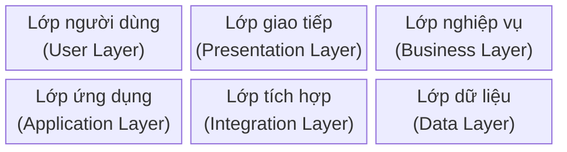
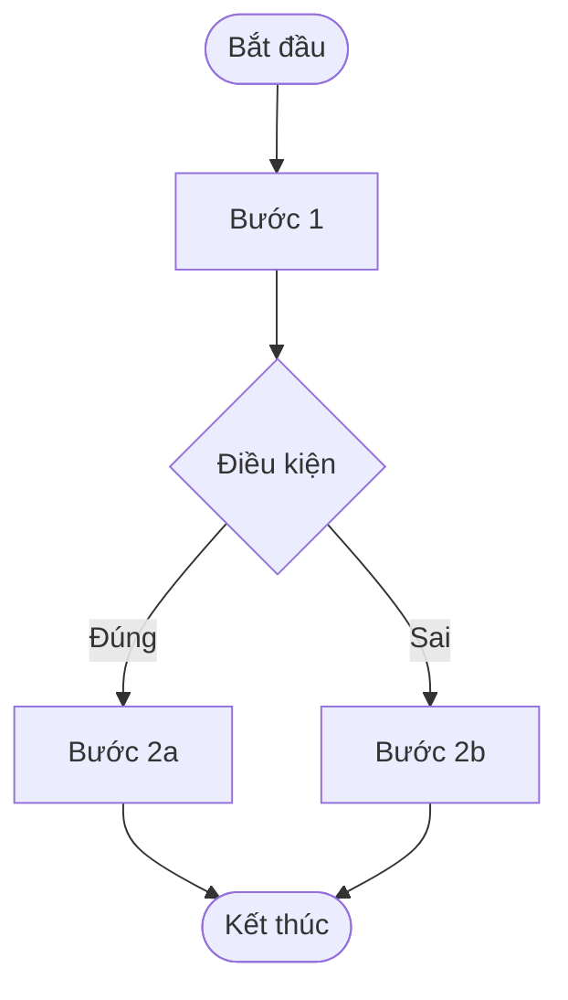
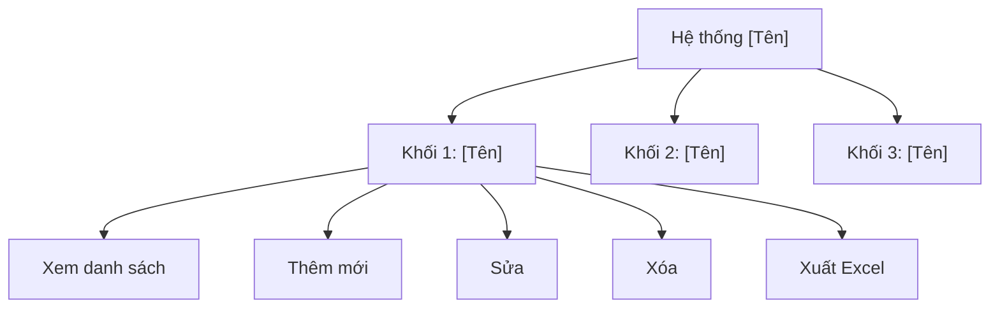
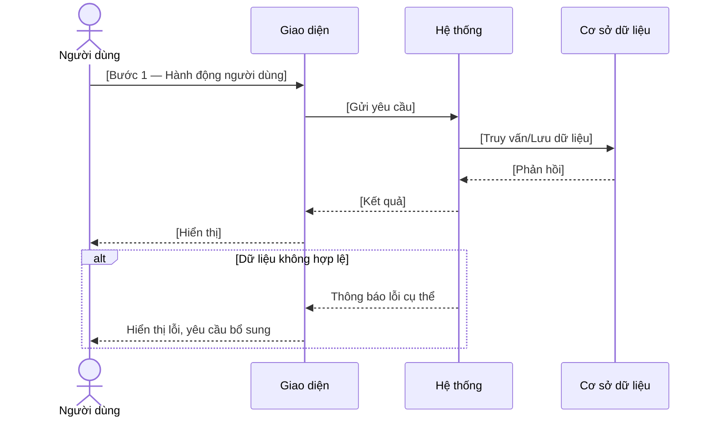

# [TÊN TỔ CHỨC / ĐƠN VỊ]

# TÀI LIỆU ĐẶC TẢ YÊU CẦU NGƯỜI DÙNG
## [TÊN HỆ THỐNG / MODULE]

[Địa điểm] – Tháng MM/YYYY

---

## LỊCH SỬ THAY ĐỔI

> Quy ước: A – Thêm mới | M – Sửa đổi | D – Xóa | R – Rà soát

| Ngày | Tác giả | Mục bị thay đổi | Loại | Mô tả thay đổi | Phiên bản |
|------|---------|-----------------|------|----------------|-----------|
| DD/MM/YYYY | [Tên] | Toàn bộ | A | Tạo mới | V1.0 |

---

## TRANG KÍ

| Vai trò | Họ tên | Ngày |
|---------|--------|------|
| Người lập | [Tên] | DD/MM/YYYY |
| Người kiểm tra | [Tên] | DD/MM/YYYY |
| Người phê duyệt | [Tên] | DD/MM/YYYY |

---

## MỤC LỤC

- [I. GIỚI THIỆU](#i-giới-thiệu)
  - [I.1 Mục đích tài liệu](#i1-mục-đích-tài-liệu)
  - [I.2 Phạm vi tài liệu](#i2-phạm-vi-tài-liệu)
  - [I.3 Định nghĩa thuật ngữ và từ viết tắt](#i3-định-nghĩa-thuật-ngữ-và-từ-viết-tắt)
  - [I.4 Kiến trúc tổng thể hệ thống](#i4-kiến-trúc-tổng-thể-hệ-thống)
- [II. CÁC YÊU CẦU TỔNG THỂ PHẦN MỀM](#ii-các-yêu-cầu-tổng-thể-phần-mềm)
  - [II.1 Sơ đồ quy trình nghiệp vụ](#ii1-sơ-đồ-quy-trình-nghiệp-vụ)
  - [II.2 Sơ đồ phân cấp chức năng](#ii2-sơ-đồ-phân-cấp-chức-năng)
  - [II.3 Ma trận phân quyền hệ thống](#ii3-ma-trận-phân-quyền-hệ-thống)
  - [II.4 Ma trận ủy quyền (RBAC)](#ii4-ma-trận-ủy-quyền-rbac)
  - [II.5 Sơ đồ trình tự](#ii5-sơ-đồ-trình-tự)
- [III. ĐẶC TẢ TÌNH HUỐNG SỬ DỤNG](#iii-đặc-tả-tình-huống-sử-dụng)
- [IV. GIAO DIỆN CHỨC NĂNG](#iv-giao-diện-chức-năng)
- [C. YÊU CẦU PHI CHỨC NĂNG](#c-yêu-cầu-phi-chức-năng)

---

## I. GIỚI THIỆU

### I.1 Mục đích tài liệu

[Mô tả 2–3 câu hệ thống làm gì và phục vụ ai.]

Mục đích chính của tài liệu:

- Cung cấp cái nhìn tổng thể, thống nhất về cách thức hệ thống được thiết kế và vận hành, bao gồm: [liệt kê các mảng nghiệp vụ chính]
- Làm cơ sở để các bên liên quan ([BA, Dev, Tester, SA, PO...]) hiểu rõ nhu cầu, phạm vi và mục tiêu của hệ thống
- Làm tài liệu đầu vào cho các hoạt động thiết kế hệ thống, phát triển phần mềm, kiểm thử, nghiệm thu

### I.2 Phạm vi tài liệu

Phạm vi tài liệu bao gồm:

- [Chức năng / module được bao gồm — cụ thể từng mục]
- [Đối tượng sử dụng hệ thống và phạm vi quyền hạn tương ứng]
- [Quy tắc nghiệp vụ và ràng buộc dữ liệu chính]

Ngoài phạm vi:

- [Những gì tài liệu này KHÔNG đề cập — ví dụ: kiến trúc kỹ thuật chi tiết, hạ tầng, CI/CD...]

### I.3 Định nghĩa thuật ngữ và từ viết tắt

#### I.3.1 Thuật ngữ nghiệp vụ

| STT | Thuật ngữ | Diễn giải |
|-----|-----------|-----------|
| 1 | [Thuật ngữ] | [Diễn giải đầy đủ, rõ ràng, không mơ hồ] |
| 2 | [Thuật ngữ] | [Diễn giải] |

#### I.3.2 Từ viết tắt

| STT | Viết tắt | Mô tả đầy đủ |
|-----|----------|--------------|
| 1 | URD | User Requirement Document – Tài liệu yêu cầu nghiệp vụ người dùng |
| 2 | SRS | Software Requirement Specification – Đặc tả yêu cầu phần mềm |
| 3 | UC | Use Case – Tình huống sử dụng |
| 4 | RBAC | Role-Based Access Control – Kiểm soát truy cập theo vai trò |
| 5 | [Viết tắt] | [Mô tả] |

### I.4 Kiến trúc tổng thể hệ thống

> [Cần xác nhận: Bổ sung sơ đồ kiến trúc thực tế của dự án]

Diễn giải từng lớp:

**1. Lớp người dùng (User Layer)**
- Mục đích: [Mô tả]
- Các vai trò: [Liệt kê các actor và trách nhiệm]

**2. Lớp giao tiếp (Presentation / Access Layer)**
- Mục đích: [Mô tả]
- Thành phần: Web App / Mobile App / API...

**3. Lớp nghiệp vụ (Business Layer)**
- Mục đích: [Mô tả]
- Các khối chức năng chính: [Liệt kê]

**4. Lớp ứng dụng (Application / Service Layer)**
- Mục đích: [Mô tả]
- Các module: [Liệt kê]

**5. Lớp tích hợp (Integration Layer)**
- Mục đích: [Mô tả]
- Thành phần: API Gateway, Cache, SSO...

**6. Lớp dữ liệu (Data Layer)**
- Mục đích: [Mô tả]
- Thành phần: CSDL nghiệp vụ, CSDL sao lưu, Cache

**7. Lớp hạ tầng (Infrastructure Layer)**
- Mục đích: [Mô tả]
- Thành phần: Máy chủ ứng dụng, Máy chủ CSDL, Cloud/DC, Sao lưu – phục hồi, Bảo mật mạng

---

## II. CÁC YÊU CẦU TỔNG THỂ PHẦN MỀM

### II.1 Sơ đồ quy trình nghiệp vụ (Workflow Diagram)

#### Quy trình [Số]: [Tên quy trình]

> [Cần xác nhận: Chèn sơ đồ quy trình (Mermaid flowchart hoặc ảnh)]

**Diễn giải luồng quy trình:**

| Bước | Tác nhân | Mô tả |
|------|----------|-------|
| Bước 1 | [Tên actor] | [Mô tả hành động — rõ ràng, không mơ hồ] |
| Bước 1.1 | Hệ thống | [Hệ thống xử lý gì] |
| Bước 2 | [Tên actor] | [Mô tả] |
| ... | ... | ... |

---

### II.2 Sơ đồ phân cấp chức năng (Business Function Diagram)

> [Cần xác nhận: Chèn sơ đồ phân cấp chức năng]

**Diễn giải sơ đồ phân cấp chức năng:**

**Khối [N] – [Tên khối]**
- Mục đích: [Mô tả mục đích nghiệp vụ]
- Giá trị mang lại: [Liệt kê giá trị cụ thể]
- Các chức năng con:
  - Xem [đối tượng]
  - Thêm mới [đối tượng]
  - Sửa [đối tượng]
  - Xóa [đối tượng]
  - Xuất Excel

---

### II.3 Ma trận phân quyền hệ thống (Permission Matrix)

> Quy ước: `X` – Được thực hiện | `(X)` – Chỉ xem/tổng hợp (read-only) | `–` – Không được thực hiện

| Khối chức năng | Chức năng | [Role 1] | [Role 2] | [Role 3] |
|----------------|-----------|----------|----------|----------|
| **[Tên khối]** | Xem [đối tượng] | (X) | X | – |
| | Thêm mới [đối tượng] | – | X | – |
| | Sửa [đối tượng] | – | X | – |
| | Xóa [đối tượng] | – | X | – |
| | Xuất Excel | (X) | X | – |
| **[Tên khối 2]** | Xem [đối tượng] | (X) | – | X |
| | Thêm mới [đối tượng] | – | – | X |
| | Sửa [đối tượng] | – | – | X |
| | Xóa [đối tượng] | – | – | X |
| | Xuất Excel | (X) | – | X |

**Ghi chú:**

- [Role 1]: [Mô tả phạm vi và hạn chế]
- [Role 2]: [Mô tả phạm vi và hạn chế]
- [Role 3]: [Mô tả phạm vi và hạn chế]

---

### II.4 Ma trận ủy quyền (RBAC – Authorization Matrix)

#### II.4.1 Định nghĩa vai trò

| Role Code | Tên vai trò | Mô tả |
|-----------|-------------|-------|
| [ROLE_1] | [Tên] | [Mô tả trách nhiệm] |
| [ROLE_2] | [Tên] | [Mô tả trách nhiệm] |
| [ROLE_3] | [Tên] | [Mô tả trách nhiệm] |

#### II.4.2 Quy ước quyền

| Ký hiệu | Ý nghĩa |
|---------|---------|
| VIEW | Xem dữ liệu |
| CREATE | Thêm mới |
| UPDATE | Cập nhật |
| DELETE | Xóa |
| EXPORT | Xuất Excel / dữ liệu |
| CONFIG | Cấu hình hệ thống |
| ADMIN | Quản trị người dùng & phân quyền |

#### II.4.3 Ma trận ủy quyền theo khối chức năng

| Khối chức năng | Đối tượng / Chức năng | [ROLE_1] | [ROLE_2] | [ROLE_3] |
|----------------|----------------------|----------|----------|----------|
| [Tên khối] | [Đối tượng] | VIEW | VIEW, CREATE, UPDATE, DELETE, EXPORT | VIEW, CREATE, UPDATE, DELETE, EXPORT |
| [Tên khối 2] | [Đối tượng] | VIEW | VIEW, EXPORT | VIEW, EXPORT |
| Quản trị hệ thống | Danh mục & cấu hình | CONFIG | – | – |
| | Người dùng & phân quyền | ADMIN | – | – |

**Nguyên tắc RBAC áp dụng:**

- **Phân quyền theo vai trò**: Quyền không gán trực tiếp cho người dùng; người dùng được gán Role và quyền phát sinh theo Role
- **Phạm vi dữ liệu (Data Scope)**: [Mô tả từng Role có thể truy cập phạm vi dữ liệu nào]
- **Kiểm soát dữ liệu đã hoàn tất**: Không cho phép sửa/xóa dữ liệu đã hoàn tất xử lý hoặc đã được tổng hợp báo cáo chính thức
- **Audit log**: Mọi thao tác CREATE / UPDATE / DELETE phải ghi log người thực hiện, thời gian và nội dung thay đổi

---

### II.5 Sơ đồ trình tự (Sequence Diagram)

#### II.5.1 [Tên quy trình 1]

> [Cần xác nhận: Chèn Sequence Diagram]

**Diễn giải:** Luồng chia thành [N] giai đoạn:

**Giai đoạn 1: [Tên giai đoạn]**

- Bước 1: [Mô tả chi tiết hành động và xử lý]
- Bước 2: [Mô tả]

**Giai đoạn 2: [Tên giai đoạn]**

- Bước 3: [Mô tả]
- Bước 4: [Mô tả]

---

## III. ĐẶC TẢ TÌNH HUỐNG SỬ DỤNG (USE CASE SPECIFICATION)

### [Tên nhóm chức năng]

#### UC-[XX]-[NN]: [Tên Use Case]

| Nội dung | Mô tả |
|----------|-------|
| **Tên** | [Tên đầy đủ của Use Case] |
| **Mục tiêu (Objective)** | [Mục tiêu nghiệp vụ — 1–2 câu, từ góc độ người dùng] |
| **Tác nhân (Actor)** | [Tên vai trò — nhất quán với RBAC và Workflow] |
| **Trigger** | [Điều kiện kích hoạt Use Case này] |
| **Tiền điều kiện (Pre-condition)** | - [Điều kiện 1]   - [Điều kiện 2] |
| **Hậu điều kiện (Post-condition)** | - [Kết quả khi thành công]   - [Trạng thái hệ thống sau khi hoàn tất] |
| **Hoạt động (Activities)** | 1. [Hành động người dùng]   2. [Phản hồi hệ thống]   3. [Hành động tiếp theo] |
| **Luồng thay thế (Alternative Flow)** | [Mô tả khi có nhánh khác — điều kiện + xử lý] |
| **Luồng ngoại lệ (Exception Flow)** | [Mô tả khi có lỗi — điều kiện + thông báo lỗi cụ thể] |
| **Quy tắc nghiệp vụ (Business Rule)** | - [Quy tắc 1 — cụ thể, testable]   - [Quy tắc 2] |

---

## IV. GIAO DIỆN CHỨC NĂNG (PROTOTYPE CHÍNH)

### Module [N]: [Tên Module]

#### IV.[N].[M] [Tên màn hình]

> [Cần xác nhận: Chèn ảnh prototype / wireframe]

**Mô tả màn hình:** [1–2 câu mô tả mục đích màn hình]

**Danh sách thành phần giao diện:**

| STT | Tên thành phần | Định dạng | Bắt buộc | Mặc định | Mô tả & Ràng buộc |
|-----|---------------|-----------|----------|----------|-------------------|
| 1 | [Tên trường] | Text / Listbox / Date / Button / Icon | Có / Không | [Giá trị mặc định hoặc N/A] | [Mô tả đầy đủ: cho phép gì, validate như thế nào, thông báo lỗi khi sai] |
| 2 | [Tên trường] | Listbox Search | Không | --Tất cả-- | [Mô tả các lựa chọn, cách lọc, cascade dependency nếu có] |
| 3 | [Tên trường] | Date | Không | [Ngày hiện tại / Trống] | [Ràng buộc: từ ≤ đến, không cho chọn ngày trong quá khứ...] |
| 4 | [Tên button] | Button | Không | N/A | [Hành động khi nhấn, điều kiện enable/disable] |
| 5 | [Tên icon] | Icon | Không | N/A | [Log yêu cầu: ghi log tài khoản + thời gian khi thực hiện thao tác] |

**Lưới hiển thị dữ liệu (Grid):**

| STT | Tên cột | Độ rộng | Mô tả |
|-----|---------|---------|-------|
| 1 | [Tên cột] | [px / %] | [Mô tả dữ liệu hiển thị] |

**Hành vi đặc biệt / Logic ràng buộc:**

- [Mô tả logic cascade, auto-fill, conditional display, disabled field...]
- Ví dụ: Khi chọn [Trường A] = [Giá trị X], hệ thống tự động lọc [Trường B] hiển thị danh sách tương ứng

---

## C. YÊU CẦU PHI CHỨC NĂNG

### 1. Yêu cầu về kiến trúc hệ thống

- [Mô hình kiến trúc: 3 lớp / microservices / ...]
- [Yêu cầu triển khai: on-premise / cloud / hybrid]
- [Tách biệt lớp ứng dụng và lớp CSDL — cụ thể nếu có]

### 2. Ràng buộc thiết kế

- CSDL tổ chức theo mô hình [tập trung / phân tán], đảm bảo tính thống nhất về cấu trúc
- Đảm bảo toàn vẹn dữ liệu, tránh dư thừa
- Sao lưu tự động theo lịch trình đặt sẵn; hỗ trợ phục hồi dữ liệu
- Đảm bảo an toàn, an ninh cho dữ liệu và hệ quản trị CSDL

### 3. Yêu cầu giao diện người dùng

- Giao diện tiếng Việt Unicode, bố cục rõ ràng, dễ sử dụng
- Thiết kế nhất quán giữa các màn hình
- Thông báo lỗi cụ thể (không dùng thông báo chung chung như "Lỗi hệ thống")
- Thông báo thao tác thành công / thất bại hiển thị rõ cho người dùng
- [Yêu cầu responsive / breakpoint nếu có]

### 4. Yêu cầu an toàn, bảo mật

**Bảo mật mức ứng dụng:**
- Quét lỗ hổng bảo mật (OWASP Top 10) trước khi go-live; sửa toàn bộ lỗi critical/high
- [Yêu cầu xác thực: SSO / username-password / MFA]
- [Yêu cầu mã hóa: HTTPS, mã hóa dữ liệu nhạy cảm tại rest/transit]

**Bảo mật mức nghiệp vụ:**
- Phân quyền theo RBAC — chỉ người có thẩm quyền mới được sửa đổi dữ liệu
- Mọi thao tác nhạy cảm (tạo/sửa/xóa) phải ghi audit log: tài khoản, thời gian, nội dung thay đổi
- Session timeout sau [N] phút không hoạt động

### 5. Yêu cầu hiệu năng

> [Cần xác nhận: Bổ sung nếu có SLA cụ thể]

- Thời gian phản hồi màn hình thông thường: ≤ [X] giây
- Hỗ trợ tối đa [N] người dùng đồng thời
- Uptime tối thiểu: [X]%

### 6. Yêu cầu tích hợp

> [Cần xác nhận: Bổ sung nếu có hệ thống ngoài cần tích hợp]

| Hệ thống | Mục đích tích hợp | Giao thức | Ghi chú |
|----------|------------------|-----------|---------|
| [Tên HT] | [Mục đích] | REST API / SOAP / File | [Xử lý khi lỗi tích hợp] |
