

**HỆ THỐNG BSS**

**TÀI LIỆU THIẾT KẾ TỔNG THỂ**

**Phiên bản 1.0**
**\

**1. GIỚI THIỆU**

**1.1. Mục đích Tài liệu**

Tài liệu này trình bày chi tiết về việc phân tích yêu cầu nghiệp vụ và thiết kế kiến trúc kỹ thuật cho " **Xây dựng mới hệ thống BSS – Giai đoạn 1**" của **CÔNG TY CỔ PHẦN GIẢI PHÁP CÔNG NGHỆ WELLZONE** (sau đây gọi là WellZone hoặc Bên A). Tài liệu được xây dựng dựa trên các điều khoản, phụ lục và yêu cầu trong **Hợp đồng Dịch vụ Cung cấp Phần mềm số 2025-HĐKT/WZ-AP** ký kết giữa WellZone và **Công ty Cổ phần Đầu tư Kinh doanh & Dịch vụ An Phát** (sau đây gọi là An Phát hoặc Bên B).

Mục tiêu của tài liệu này là:

- **Định nghĩa rõ ràng:** Cụ thể hóa các yêu cầu chức năng và phi chức năng thành các đặc tả kỹ thuật.
- **Làm kim chỉ nam:** Là tài liệu tham chiếu cốt lõi cho đội ngũ phát triển, kiểm thử, và triển khai hệ thống.
- **Làm cơ sở nghiệm thu:** Là căn cứ để hai bên đối chiếu và nghiệm thu sản phẩm phần mềm khi dự án hoàn thành.

**1.2. Phạm vi Hệ thống**

Phạm vi của dự án Giai đoạn 1 được xác định rõ trong Phụ lục 01 và Phụ lục 02 của Hợp đồng, bao gồm việc xây dựng và triển khai một hệ thống BSS hoàn chỉnh tập trung vào dịch vụ eSIM du lịch. Hệ thống bao gồm các phân hệ chính sau:

**Các phân hệ triển khai đầy đủ (Full):**

- **CORE:** Hệ thống quản trị trung tâm với dashboard, quản lý người dùng, phân quyền, nhật ký và báo cáo
- **TRAVEL:** Quản lý eSIM du lịch, tích hợp đối tác, đồng bộ gói cước và ánh xạ sản phẩm
- **ESIM\_AGENCY:** Quản lý mạng lưới đại lý eSIM với App di động, bảng giá, hoa hồng và ví điện tử
- **ESIM\_PORTAL:** Portal white-label cho đại lý với khả năng tùy biến thương hiệu và domain riêng
- **CUSTOMER\_APP:** Ứng dụng di động cho khách hàng du lịch (App Tourist) với eKYC, Video Call và Chatbot
- **CUSTOMER\_WEB:** Website tự phục vụ cho khách hàng du lịch (Web Tourist)

**Các phân hệ triển khai cơ bản (Basic):**

- **CRM:** Chăm sóc khách hàng tập trung vào eSIM du lịch với Customer 360 View
- **SALES:** Quản lý bán hàng đa kênh với App cho nhân viên kinh doanh
- **INVENTORY:** Quản lý kho hàng hóa, sản phẩm vật lý và eSIM
- **CMS:** Quản lý nội dung website và ứng dụng
- **DMS:** Kênh phân phối với App cho nhân viên bán hàng
- **CDR:** Mediation cơ bản để xử lý dữ liệu cước

**Dịch vụ đặc biệt:**

- **Chuyển giao Source code:** Toàn bộ mã nguồn các module Phase 1 cùng tài liệu kỹ thuật và đào tạo
- **eKYC:** Cung cấp miễn phí trong năm đầu

**Phạm vi loại trừ (dời sang Phase 2):** Các phân hệ RESOURCE, SPS, NOTIFICATION, SMS Gateway và USSD Gateway sẽ được triển khai trong giai đoạn tiếp theo. Các module Basic sẽ được nâng cấp lên Full trong Phase 2.

**1.3. Thuật ngữ và Viết tắt**

|**Viết tắt**|**Diễn giải**|
| :-: | :-: |
|BSS|Business Support System - Hệ thống Hỗ trợ Kinh doanh|
|CRM|Customer Relationship Management - Quản lý Quan hệ Khách hàng|
|k8s|Kubernetes|
|MNO|Mobile Network Operator - Nhà mạng di động (Mobifone)|
|MVNO|Mobile Virtual Network Operator - Nhà mạng di động ảo|
|API|Application Programming Interface - Giao diện lập trình ứng dụng|
|CI/CD|Continuous Integration/Continuous Deployment - Tích hợp và Triển khai liên tục|
|eKYC|electronic Know Your Customer - Định danh Khách hàng điện tử|
|CSKH|Chăm sóc khách hàng|
|TĐV|Tổng đài viên|
|ERD|Entity-Relationship Diagram - Sơ đồ Quan hệ Thực thể|
|NFR|Non-Functional Requirement - Yêu cầu Phi chức năng|
|SPS|Service Provisioning System - Hệ thống Cung cấp Dịch vụ (Module tích hợp MBF)|
|DMS|Distribution Management System - Hệ thống Quản lý Phân phối|

**

**2. YÊU CẦU HỆ THỐNG**

**2.1. Yêu cầu Chức năng (Functional Requirements)**

Hệ thống BSS Phase 1 phải đáp ứng đầy đủ các chức năng được mô tả trong Phụ lục 01 và Phụ lục 02 của Hợp đồng số 2025-HĐKT/WZ-AP. Các yêu cầu được tổ chức theo 13 phân hệ chính như sau:

**2.1.1. CORE - Hệ thống quản trị trung tâm (Full)**

- Dashboard với thống kê tổng quan, biểu đồ phân tích hoạt động người dùng và cảnh báo bảo mật
- Quản lý người dùng với phân quyền ma trận chi tiết, phân quyền theo phạm vi dữ liệu (organization-based)
- Quản lý vai trò, quyền hạn và menu theo vai trò
- Quản lý tổ chức đa cấp với sơ đồ trực quan
- Workflow engine cho quản lý quy trình nghiệp vụ và vòng đời đối tượng
- Nhật ký toàn diện: truy cập API, thay đổi dữ liệu, đăng nhập, và lịch sử trạng thái

**2.1.2. CRM - Chăm sóc khách hàng eSIM (Basic)**

- Quản lý khách hàng du lịch (cá nhân/tổ chức) với thông tin định danh đầy đủ
- Customer 360 View với timeline hoạt động, biểu đồ sử dụng data và phân tích hành vi
- Quản lý eSIM du lịch: thông tin chi tiết, gói cước, lịch sử sử dụng, data còn lại
- Xử lý yêu cầu hỗ trợ: kích hoạt, sự cố kỹ thuật, hướng dẫn cài đặt, thay đổi gói cước
- Trouble Ticket đa cấp độ với phân công theo chuyên môn và theo dõi SLA
- Quản lý khiếu nại với quy trình xử lý chuẩn và đền bù theo chính sách

**2.1.3. SALES - Quản lý bán hàng (Basic, bao gồm App)**

- Quản lý sản phẩm với danh mục phân cấp, biến thể và ánh xạ gói cước nhà cung cấp
- Quản lý đơn hàng đa kênh (web, app, tại quầy) với workflow xử lý rõ ràng
- Bảng giá đa dạng theo kênh với khuyến mãi và hoa hồng linh hoạt
- Tích hợp cổng thanh toán (VNPAY, MoMo) và quản lý công nợ B2B
- Báo cáo doanh thu chi tiết theo nhiều chiều phân tích

**2.1.4. INVENTORY - Quản lý kho hàng (Basic)**

- Quản lý sản phẩm đa loại hình: vật lý, dịch vụ, serial, combo với thuộc tính linh hoạt
- Quản lý đa kho với theo dõi tồn kho theo sản phẩm/biến thể và cảnh báo tồn kho thấp
- Giao dịch kho đầy đủ: nhập, xuất, chuyển với workflow duyệt phiếu
- Nhập kho SIM/MSISDN từ Resource Management và import Serial hàng loạt
- Quản lý giá đa phiên bản theo kênh với import/export Excel

**2.1.5. CMS - Quản lý nội dung (Basic)**

- Quản lý tin tức với workflow duyệt và nội dung động theo cấu trúc tùy biến
- Hỗ trợ đa ngôn ngữ với SEO metadata đầy đủ
- Thư viện Media tập trung và menu điều hướng kéo thả
- Phân loại nội dung, gắn thẻ và quản lý hiển thị

**2.1.6. TRAVEL - eSIM du lịch (Full)**

- Tích hợp API nhà cung cấp eSIM với đồng bộ gói cước tự động
- So sánh và phê duyệt thay đổi gói cước, quản lý vùng địa lý
- Ánh xạ gói cước thành sản phẩm: đồng bộ sản phẩm từ vùng, tạo biến thể, ánh xạ gói-biến thể
- Quản lý kho eSIM: đặt hàng từ nhà cung cấp, theo dõi vòng đời, tra cứu chi tiết
- Log tích hợp chi tiết với xử lý lệnh kích hoạt/hủy

**2.1.7. ESIM\_AGENCY - Đại lý eSIM (Full, bao gồm App)**

- Quản lý đại lý 360 độ (cá nhân/tổ chức) với phân cấp, workflow phê duyệt và lịch sử hoạt động
- Bảng giá linh hoạt: nhóm giá, đa phiên bản, áp dụng theo đối tượng
- Quản lý đơn hàng từ Portal/App với kích hoạt eSIM tự động
- Ví điện tử: giao dịch nạp/rút, quản lý hạn mức tín dụng, lịch sử chi tiết
- Báo cáo doanh số, tài chính và cấu hình chính sách kinh doanh

**2.1.8. ESIM\_PORTAL - Portal đại lý (Full)**

- Dashboard tài chính với thống kê giao dịch và phân tích biến động
- Bán hàng: catalog theo vùng, bộ lọc thông minh, giỏ hàng và xác thực khách hàng
- Quản lý đơn hàng và eSIM với theo dõi trạng thái, tra cứu data usage
- Quản lý ví điện tử, yêu cầu rút tiền, sao kê và xuất báo cáo
- White-label branding: tùy chỉnh màu sắc, logo, tên miền riêng, cấu hình SEO
- Hệ thống hỗ trợ với tạo ticket, đính kèm thông tin và trao đổi trực tiếp

**2.1.9. DMS - Kênh phân phối (Basic, bao gồm App)**

- Quản lý cửa hàng với thông tin chi tiết, kiểm kê tồn kho và phân loại theo kênh
- Quản lý nhà phân phối và vùng phụ trách
- Lập tuyến bán hàng với theo dõi check-in GPS
- Quản lý đơn hàng đa cấp: NPP lên công ty, NVKD về NPP, tại điểm bán

**2.1.10. CDR - CDR Mediation (Basic)**

- Quản lý nguồn dữ liệu với kết nối SFTP/FTP/LOCAL
- Form tìm kiếm động với đa điều kiện và xuất kết quả Excel/CSV
- Logs toàn diện: export logs, search logs, operation logs và theo dõi lỗi

**2.1.11. CUSTOMER\_APP - App khách hàng (App Tourist)**

- Đăng ký với OTP, đăng nhập đa phương thức và social login
- Quản lý tài khoản với cập nhật thông tin và cài đặt
- Quản lý eSIM: danh sách, kích hoạt QR code, theo dõi data, gia hạn
- Mua sắm: browse theo điểm đến, so sánh gói, giỏ hàng, khuyến mãi
- Thanh toán đa phương thức với lưu thông tin thẻ
- Chatbot CSKH, Video Call hỗ trợ và đánh giá dịch vụ

**2.1.12. CUSTOMER\_WEB - Website khách hàng (Web Tourist)**

- Tương tự CUSTOMER\_APP nhưng tối ưu cho desktop/tablet
- Dashboard cá nhân với quản lý đa eSIM
- Wishlist, so sánh và checkout đa bước
- Thanh toán trả góp, tracking đơn hàng realtime và hóa đơn điện tử

**2.1.13. Chuyển giao Source Code (Có)**

- Toàn bộ mã nguồn Phase 1 với tài liệu kỹ thuật đầy đủ
- Hướng dẫn cài đặt, vận hành và đào tạo chuyển giao
- Danh sách thư viện mã nguồn mở và license tương ứng

**2.2. Yêu cầu Phi chức năng (Non-Functional Requirements)**

**2.2.1. Hiệu năng (Performance)**

- **Thời gian phản hồi:** Web ≤ 5 giây, App ≤ 3 giây, tương tác cơ bản ≤ 1 giây
- **Tải đồng thời:** 50 CSKH, 50 TPS self-care, 150 người dùng tổng
- **Khối lượng:** 5,000 đơn hàng/ngày với thiết kế cho 2 triệu thuê bao tương lai

**2.2.2. Tính sẵn sàng (Availability)**

- Uptime ≥ 99.9%, downtime không kế hoạch < 0.1%
- Cân bằng tải và phục hồi tự động, Disaster Recovery đã kiểm thử

**2.2.3. Bảo mật (Security)**

- Mã hóa dữ liệu at rest và in transit (TLS 1.3)
- API bảo vệ JWT/OAuth2 với phân quyền ma trận
- Logging và audit trail toàn diện
- Tuân thủ Nghị định 13/2023/NĐ-CP và quy định viễn thông
- Penetration testing trước nghiệm thu

**2.2.4. Khả năng mở rộng (Scalability)**

- Horizontal scaling qua Kubernetes
- Lưu trữ dữ liệu lịch sử ≥ 3 năm
- Auto scaling dựa trên CPU/Memory metrics

**2.2.5. Khả năng bảo trì (Maintainability)**

- Chuyển giao source code, kiến trúc, API documentation đầy đủ
- Đào tạo kiến trúc, công nghệ, quy trình phát triển và vận hành
- Bảo hành 12 tháng: phản hồi 4h, khắc phục 24h cho lỗi nghiêm trọng

**2.2.6. Các yêu cầu khác**

- **Tương thích:** Chrome, Firefox, Edge, Safari (2 phiên bản gần nhất); iOS 13+, Android 8.0+
- **Sử dụng:** Giao diện trực quan, UX/UI hiện đại, đa ngôn ngữ, WCAG 2.1
- **Tin cậy:** Backup hàng ngày, RTO ≤ 4h, RPO ≤ 1h

**3. THIẾT KẾ KIẾN TRÚC HỆ THỐNG**

**3.1. Kiến trúc Tổng thể**

Hệ thống BSS được thiết kế theo **Kiến trúc Microservices**, một phương pháp tiếp cận phát triển phần mềm trong đó ứng dụng được xây dựng như một tập hợp các dịch vụ nhỏ, độc lập.

**Nguyên tắc thiết kế:**

- **Phân tách theo nghiệp vụ (Bounded Context):** Mỗi microservice sẽ chịu trách nhiệm cho một lĩnh vực nghiệp vụ cụ thể (khách hàng, sản phẩm, đơn hàng...).
- **Độc lập triển khai:** Mỗi microservice có thể được phát triển, kiểm thử, triển khai và nâng cấp độc lập mà không ảnh hưởng đến các dịch vụ khác.
- **Sở hữu dữ liệu riêng:** Mỗi microservice quản lý và sở hữu schema cơ sở dữ liệu của riêng mình để đảm bảo sự độc lập và giảm thiểu sự phụ thuộc.
- **Giao tiếp qua API:** Các microservice giao tiếp với nhau thông qua các API được định nghĩa rõ ràng.

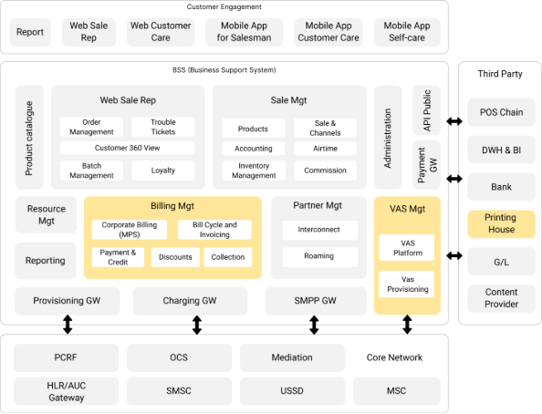

- *Mô tả hình vẽ: Sơ đồ chi tiết các lớp:*
  - **Lớp Kênh (Channels):** Gồm Web/App Self-care, Giao diện CSKH, Giao diện Bán hàng, App cho Salesman, và các kênh của đối tác (VJA, SkyJoy).
  - **Lớp Cổng API (API Gateway):** Điểm vào duy nhất, xử lý xác thực (JWT), định tuyến request đến các microservice phù hợp, giới hạn tần suất truy cập (rate limiting) và tổng hợp dữ liệu (aggregation).
  - **Lớp Dịch vụ (Microservices):** Liệt kê các microservices chính như Auth, CRM, Product, Sales, Resource, Inventory, Notification, DMS, SPS...
  - **Lớp Giao tiếp Dịch vụ (Service Communication):** Thể hiện 2 cơ chế giao tiếp: REST API (đồng bộ) và Message Broker (bất đồng bộ, ví dụ RabbitMQ/Kafka).
  - **Lớp Dữ liệu (Data Layer):** Bao gồm CSDL PostgreSQL (với các schema riêng cho từng service), Cache (Redis), và Search Engine (Elasticsearch - nếu cần).
  - **Lớp Tích hợp (Integration Layer):** Các adapters/connectors để kết nối với hệ thống Core của MNO, Cổng thanh toán, Đối tác vận chuyển, Call Center.

**3.2. Thiết kế Công nghệ (Technology Stack)**

|**Hạng mục**|**Công nghệ đề xuất**|**Lý do lựa chọn**|
| :- | :- | :- |
|**Backend**|Java (Spring Boot)|Hệ sinh thái mạnh mẽ, cộng đồng lớn, phù hợp cho các ứng dụng doanh nghiệp phức tạp.|
|**Frontend**|ReactJS/Next.js|Hiệu năng cao, linh hoạt, hỗ trợ tốt cho việc xây dựng Single Page Application (SPA) và Server-Side Rendering (SSR).|
|**Mobile App**|Flutter|Cho phép phát triển đa nền tảng (iOS & Android) từ một codebase duy nhất, tiết kiệm thời gian và chi phí.|
|**CSDL**|**PostgreSQL**|Yêu cầu bắt buộc trong Hợp đồng. Là hệ quản trị CSDL quan hệ mã nguồn mở mạnh mẽ, tin cậy và có khả năng mở rộng tốt.|
|**Caching**|Redis/Local JVM|Tốc độ truy xuất cao, dùng để lưu trữ session, cache dữ liệu thường xuyên truy cập để giảm tải cho CSDL.|
|**Containerization**|Docker|Tiêu chuẩn ngành để đóng gói ứng dụng và các phụ thuộc, đảm bảo tính nhất quán giữa các môi trường.|
|**Orchestration**|**Kubernetes (k8s)**|Yêu cầu bắt buộc trong Hợp đồng. Nền tảng điều phối container mạnh mẽ, cung cấp khả năng tự động triển khai, co giãn và quản lý ứng dụng.|
|**Message Broker**|Kafka|Ổn định, dễ sử dụng, phù hợp cho giao tiếp bất đồng bộ giữa các microservices.|
|**CI/CD**|GitLab CI/CD|Tích hợp sẵn trong GitLab, cung cấp quy trình tự động hóa mạnh mẽ từ build, test đến deploy.|
|**Monitoring**|Prometheus & Grafana|Bộ đôi tiêu chuẩn cho việc thu thập và trực quan hóa metrics trong môi trường container và microservices.|
|**Logging**|ELK Stack (Elasticsearch, Logstash, Kibana)/DB Logging|Giải pháp toàn diện cho việc thu thập, lưu trữ, tìm kiếm và phân tích log tập trung.|

**

**4. THIẾT KẾ CƠ SỞ DỮ LIỆU**

**4.1. Mô hình Dữ liệu**

Thiết kế cơ sở dữ liệu của hệ thống BSS tuân thủ chặt chẽ theo kiến trúc Microservices, trong đó mỗi lĩnh vực nghiệp vụ (Bounded Context) được phân tách rõ ràng và quản lý bởi một microservice chuyên trách. Cách tiếp cận này sử dụng mô hình "Schema per Service", nghĩa là mỗi microservice sẽ sở hữu và quản lý một schema riêng trong cơ sở dữ liệu PostgreSQL.

Nguyên tắc này đảm bảo tính độc lập và giảm thiểu sự phụ thuộc chéo giữa các dịch vụ, cho phép chúng được phát triển, triển khai và mở rộng một cách linh hoạt. Mọi tương tác giữa các dịch vụ với dữ liệu không thuộc sở hữu của chúng đều phải thông qua API của dịch vụ chủ quản, củng cố tính đóng gói và bảo mật. Cơ sở dữ liệu quan hệ PostgreSQL được lựa chọn theo yêu cầu bắt buộc trong hợp đồng, đảm bảo tính toàn vẹn dữ liệu (ACID), hiệu năng và khả năng mở rộng.

**4.2. Sơ đồ Quan hệ Thực thể (ERD) cấp cao**

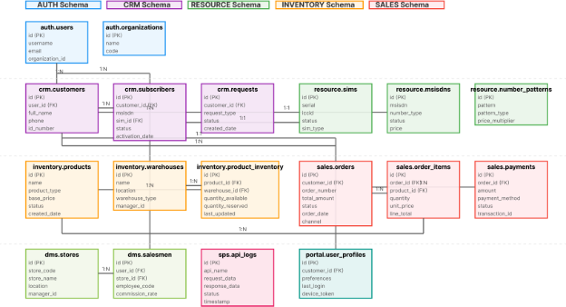

**4.3. Mô tả chi tiết các Schema**

Dưới đây là mô tả chi tiết về vai trò và các thực thể chính của từng schema trong hệ thống:

- **auth**: Nền tảng của hệ thống, chịu trách nhiệm quản lý định danh và kiểm soát truy cập.
  - **Mô tả**: Schema này quản lý toàn bộ thông tin về người dùng hệ thống (nhân viên, quản trị viên), vai trò (roles), và các quyền hạn (permissions) tương ứng. Nó xác thực người dùng và cấp phát token truy cập, đồng thời định nghĩa phạm vi dữ liệu mà người dùng có thể truy cập thông qua các đơn vị tổ chức (organizations).
  - **Thực thể chính**: users, roles, permissions, organizations, user\_roles.
- **crm**: Trái tim của hệ thống, lưu trữ mọi thông tin về khách hàng và thuê bao.
  - **Mô tả**: Cung cấp góc nhìn 360 độ về khách hàng. Schema này quản lý vòng đời của khách hàng từ khi đăng ký, cập nhật thông tin, cho đến khi hủy dịch vụ. Mọi tương tác như yêu cầu hỗ trợ (request), khiếu nại (complaint) đều được ghi lại và liên kết chặt chẽ với khách hàng và thuê bao tương ứng.
  - **Thực thể chính**: customers, subscribers, requests, customer\_complaints, customer\_documents.
- **resource**: Quản lý toàn bộ tài sản số của nhà mạng.
  - **Mô tả**: Chịu trách nhiệm quản lý vòng đời của SIM (vật lý và eSIM) và Số thuê bao (MSISDN). Schema này theo dõi tài nguyên từ khi được nhập vào hệ thống dưới dạng lô (\*\_batches), phân loại số đẹp (number\_patterns), cho đến khi được gán cho thuê bao và thu hồi.
  - **Thực thể chính**: sims, msisdns, sim\_batches, number\_range\_batches, number\_patterns.
- **inventory**: Quản lý thông tin sản phẩm và tồn kho.
  - **Mô tả**: Định nghĩa tất cả các sản phẩm, dịch vụ có thể kinh doanh. Schema này cho phép tạo các sản phẩm đa dạng (vật lý, dịch vụ, serial, combo), quản lý các thuộc tính và theo dõi số lượng tồn kho của chúng tại từng kho hàng (warehouses).
  - **Thực thể chính**: products, product\_variants, warehouses, product\_inventory, attributes.
- **sales**: Ghi nhận và xử lý các giao dịch bán hàng.
  - **Mô tả**: Chịu trách nhiệm cho toàn bộ quy trình bán hàng, từ việc tạo giỏ hàng, đơn hàng (orders), xử lý thanh toán (payments), cho đến việc tạo yêu cầu vận chuyển (shipments). Schema này là trung tâm của các hoạt động thương mại.
  - **Thực thể chính**: carts, orders, order\_items, payments, shipments, promotions.
- **dms (Distribution Management System)**: Quản lý hệ thống và kênh phân phối.
  - **Mô tả**: Hỗ trợ quản lý kênh phân phối đa cấp, bao gồm các nhà phân phối (distributors), đại lý, điểm bán (stores), và nhân viên bán hàng (salesmen). Schema này cũng chứa các cấu hình về tuyến bán hàng và theo dõi chỉ số hiệu suất kinh doanh (KPI).
  - **Thực thể chính**: distributors, stores, salesmen, routes, kpi\_definitions.
- **sps (Service Provisioning System)**: Lớp trung gian tích hợp với hệ thống Core của nhà mạng (Mobifone).
  - **Mô tả**: Đóng vai trò là một Adapter, định nghĩa các mẫu yêu cầu/phản hồi (apis, api\_params) để giao tiếp với hệ thống của MNO. Mọi giao tiếp với MNO đều được ghi lại chi tiết tại api\_logs, giúp cho việc truy vết và gỡ lỗi.
  - **Thực thể chính**: apis, api\_params, api\_logs, system\_configs.
- **cdr (Call Detail Record)**: Xử lý và lưu trữ dữ liệu cước.
  - **Mô tả**: Schema này được thiết kế để lưu trữ các bản ghi chi tiết cuộc gọi, tin nhắn, và dữ liệu (CDR) sau khi đã được xử lý và chuẩn hóa từ hệ thống của MNO. Đây là nguồn dữ liệu đầu vào quan trọng cho việc đối soát, báo cáo doanh thu và phân tích hành vi khách hàng.
  - **Thực thể chính**: data\_configurations, operation\_logs, và các bảng chứa dữ liệu CDR đã được import (wz\_in\_icc, wz\_flexi...).
- **cms (Content Management System)**: Quản lý nội dung động cho các kênh giao tiếp.
  - **Mô tả**: Cung cấp khả năng quản lý các nội dung như tin tức, bài viết hướng dẫn, banner quảng cáo, menu cho các ứng dụng phía người dùng (Web/App Self-care). Hỗ trợ đa ngôn ngữ để linh hoạt trong việc tiếp cận khách hàng.
  - **Thực thể chính**: news, content\_categories, dynamic\_contents, menus, banners.
- **notification**: Quản lý việc gửi thông báo đa kênh.
  - **Mô tả**: Là trung tâm xử lý và gửi đi các thông báo (SMS, Email, Push Notification) tới khách hàng hoặc quản trị viên dựa trên các sự kiện (events) phát sinh trong hệ thống. Quản lý các mẫu (templates) và kênh (channels) gửi tin.
  - **Thực thể chính**: notification\_events, templates, channels, notification\_deliveries.
- **portal**: Hỗ trợ các kênh tự phục vụ của khách hàng (Self-care).
  - **Mô tả**: Chứa các dữ liệu đặc thù cho Web Portal và Mobile App, bao gồm thông tin hồ sơ người dùng (khác với crm.customers), quản lý phiên đăng nhập (access\_tokens), và lưu trữ các dữ liệu liên quan đến các chiến dịch marketing cụ thể trên kênh online.
  - **Thực thể chính**: user\_profiles, access\_tokens, login\_logs, device\_registrations.
- **esim\_agency** & **esim\_portal**: Quản lý bán hàng eSIM qua kênh đại lý và kênh tự phục vụ.
  - **Mô tả**: Hai schema này chuyên biệt hóa cho nghiệp vụ bán eSIM quốc tế. esim\_agency quản lý các đại lý, ví tiền, và các đơn hàng do đại lý tạo. esim\_portal quản lý các đơn hàng và khách hàng mua trực tiếp từ cổng web.
  - **Thực thể chính**: agencies, agency\_wallets, agency\_orders (trong esim\_agency); customers, customer\_orders (trong esim\_portal).
- **travel**: Quản lý sản phẩm và dịch vụ eSIM du lịch.
  - **Mô tả**: Chứa thông tin về các gói cước eSIM quốc tế từ các nhà cung cấp (providers), quản lý danh sách các quốc gia, khu vực (regions), và lưu trữ kho eSIM đã được mua về để sẵn sàng cấp phát cho khách hàng.
  - **Thực thể chính**: provider\_packages, regions, esims, partner\_esims.
**\

**5. THIẾT KẾ CHI TIẾT CÁC PHÂN HỆ**

Dưới đây là thiết kế chi tiết cho các phân hệ chính của hệ thống BSS:
## **5.1. Phân hệ Quản lý Khách hàng & CSKH (CRM Service)**
**Mô tả:** Phân hệ CRM là trung tâm quản lý thông tin khách hàng và thuê bao, xử lý toàn bộ vòng đời khách hàng từ đăng ký đến chăm sóc khách hàng. Hệ thống tích hợp eKYC và Video Call để đảm bảo tính xác thực và tuân thủ quy định.

**Trách nhiệm:** - Quản lý thông tin khách hàng và thuê bao - Xử lý quy trình đăng ký thuê bao mới với tích hợp eKYC và Video Call - Quản lý vòng đời thuê bao (chặn/mở, hủy…) - Quản lý các yêu cầu hỗ trợ và khiếu nại - Cung cấp dữ liệu cho View 360°

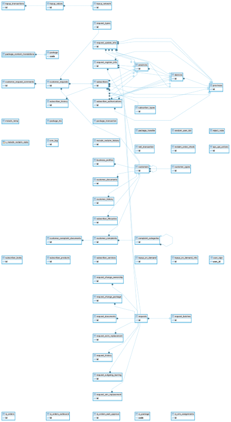

**Các bảng chính:**

1. **customers** - Bảng chính lưu trữ thông tin khách hàng
   - *id*: Khóa chính
   - *customer\_code*: Mã khách hàng
   - *full\_name*: Họ tên khách hàng
   - *id\_number*: Số CMND/CCCD
   - *contact\_phone*: Số điện thoại liên hệ
   - *contact\_email*: Email liên hệ
   - *address*: Địa chỉ
   - *status*: Trạng thái khách hàng (ACTIVE, INACTIVE, BLOCKED)
   - *object\_type*: Loại đối tượng (CUSTOMER\_LIFECYCLE)
   - *created\_at*, *updated\_at*: Thời gian tạo/cập nhật
1. **subscribers** - Bảng lưu trữ thông tin thuê bao
   - *id*: Khóa chính
   - *msisdn*: Số thuê bao
   - *customer\_id*: ID khách hàng
   - *sim\_id*: ID SIM
   - *status*: Trạng thái thuê bao
   - *activation\_date*: Ngày kích hoạt
   - *object\_type*: Loại đối tượng (SUBSCRIBER\_LIFECYCLE)
1. **request\_register\_info** - Bảng lưu trữ yêu cầu đăng ký TTTB
   - *id*: Khóa chính
   - *customer\_id*: ID khách hàng
   - *msisdn*: Số thuê bao
   - *ekyc\_data*: Dữ liệu eKYC (JSON)
   - *video\_call\_data*: Dữ liệu video call (JSON)
   - *status*: Trạng thái yêu cầu
   - *workflow\_status*: Trạng thái workflow
1. **customer\_requests** - Bảng lưu trữ yêu cầu khách hàng
   - *id*: Khóa chính
   - *customer\_id*: ID khách hàng
   - *request\_type\_id*: Loại yêu cầu
   - *title*: Tiêu đề yêu cầu
   - *description*: Mô tả yêu cầu
   - *status*: Trạng thái yêu cầu
   - *priority*: Mức độ ưu tiên
1. **customer\_complaints** - Bảng lưu trữ khiếu nại
   - *id*: Khóa chính
   - *customer\_id*: ID khách hàng
   - *complaint\_category\_id*: Danh mục khiếu nại
   - *title*: Tiêu đề khiếu nại
   - *description*: Mô tả khiếu nại
   - *status*: Trạng thái khiếu nại
   - *resolution*: Giải pháp xử lý
1. **subscriber\_lifecycles** - Bảng lưu trữ vòng đời thuê bao
   - *id*: Khóa chính
   - *subscriber\_id*: ID thuê bao
   - *lifecycle\_number*: Số vòng đời
   - *start\_date*: Ngày bắt đầu
   - *end\_date*: Ngày kết thúc
   - *initial\_state\_id*: Trạng thái ban đầu
   - *final\_state\_id*: Trạng thái cuối cùng
1. **msisdn\_reclaim\_history** - Bảng lưu trữ lịch sử thu hồi số
   - *id*: Khóa chính
   - *msisdn\_id*: ID số thuê bao
   - *msisdn*: Số thuê bao
   - *reclaim\_reason*: Lý do thu hồi
   - *reclaim\_date*: Ngày thu hồi

**API Endpoints chính:** - *POST /api/bss/crm/customers* - Lấy danh sách khách hàng với phân trang và lọc - *GET /api/bss/crm/customers/{id}* - Lấy thông tin chi tiết khách hàng - *POST /api/bss/crm/subscribers* - Lấy danh sách thuê bao - *GET /api/bss/crm/subscribers/{msisdn}* - Lấy thông tin chi tiết thuê bao - *POST /api/bss/crm/request-register-info* - Quản lý yêu cầu đăng ký TTTB - *POST /api/bss/crm/video-call* - Quản lý cuộc gọi video - *POST /api/bss/crm/view360* - Cung cấp dữ liệu View 360° - *POST /api/bss/crm/complaints* - Quản lý khiếu nại - *POST /api/bss/crm/customer-requests* - Quản lý yêu cầu khách hàng

**Luồng nghiệp vụ quan trọng (Đăng ký eKYC):** 1. **Frontend (App/Web):** Thu thập thông tin SĐT, serial, chụp ảnh GTTT và chân dung 2. **CRM Service:** Nhận request, lưu ảnh tạm thời, gọi API của đối tác eKYC để bóc tách thông tin (OCR) và so khớp khuôn mặt (Face Matching) 3. **CRM Service:** Lưu kết quả eKYC, tạo bản ghi request\_register\_info ở trạng thái “Chờ Video Call” 4. **Frontend:** Hiển thị thông tin đã bóc tách cho KH xác nhận và ký hợp đồng điện tử 5. **Frontend:** Bắt đầu luồng Video Call 6. **Video Call Service:** Kết nối khách hàng với TĐV 7. **Giao diện TĐV:** Hiển thị thông tin từ request\_register\_info, cho phép TĐV đối chiếu, xem ảnh, check C06 8. **TĐV:** Nhấn nút “Duyệt đăng ký” 9. **CRM Service:** Nhận tín hiệu duyệt, gọi đến **SPS Service** để thực hiện lệnh API\_REG\_NEW\_PREPAID\_V2 trên hệ thống Mobifone 10. **CRM Service:** Cập nhật trạng thái yêu cầu thành “Hoàn thành” và tạo bản ghi customers, subscribers chính thức
## **5.2. Phân hệ Bán hàng (Sales Service)**
**Mô tả:** Phân hệ Sales quản lý toàn bộ quy trình bán hàng từ giỏ hàng đến hoàn thành đơn hàng, bao gồm quản lý khuyến mãi, mã giảm giá, vận chuyển và thanh toán. Hệ thống hỗ trợ đa kênh bán hàng và tích hợp với các cổng thanh toán.

**Trách nhiệm:** - Quản lý đơn hàng và giỏ hàng - Quản lý mã giảm giá và khuyến mãi - Quản lý đại lý và cửa hàng - Quản lý vận chuyển và logistics - Quản lý thanh toán

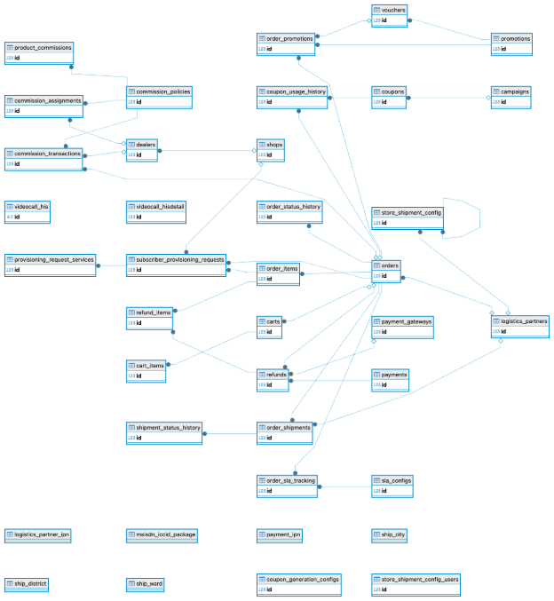

**Các bảng chính:**

1. **orders** - Bảng chính lưu trữ đơn hàng
   - *id*: Khóa chính
   - *order\_code*: Mã đơn hàng
   - *customer\_id*: ID khách hàng
   - *order\_type*: Loại đơn hàng
   - *order\_date*: Ngày đặt hàng
   - *delivery\_date*: Ngày giao hàng
   - *delivery\_address*: Địa chỉ giao hàng
   - *payment\_method*: Phương thức thanh toán
   - *total\_amount*: Tổng tiền
   - *discount\_amount*: Số tiền giảm giá
   - *shipping\_amount*: Phí vận chuyển
   - *payment\_status*: Trạng thái thanh toán
   - *shipping\_status*: Trạng thái vận chuyển
   - *status*: Trạng thái đơn hàng
   - *created\_at*, *updated\_at*: Thời gian tạo/cập nhật
1. **order\_items** - Bảng lưu trữ chi tiết đơn hàng
   - *id*: Khóa chính
   - *order\_id*: ID đơn hàng
   - *product\_id*: ID sản phẩm
   - *quantity*: Số lượng
   - *unit\_price*: Đơn giá
   - *total\_price*: Tổng tiền
   - *discount\_amount*: Số tiền giảm giá
   - *msisdn*: Số thuê bao (nếu là SIM)
1. **carts** - Bảng lưu trữ giỏ hàng
   - *id*: Khóa chính
   - *customer\_id*: ID khách hàng
   - *session\_id*: ID phiên làm việc
   - *created\_at*: Thời gian tạo
   - *updated\_at*: Thời gian cập nhật
1. **cart\_items** - Bảng lưu trữ sản phẩm trong giỏ hàng
   - *id*: Khóa chính
   - *cart\_id*: ID giỏ hàng
   - *product\_id*: ID sản phẩm
   - *quantity*: Số lượng
   - *unit\_price*: Đơn giá
   - *added\_at*: Thời gian thêm vào giỏ
1. **coupons** - Bảng lưu trữ mã giảm giá
   - *id*: Khóa chính
   - *code*: Mã giảm giá
   - *name*: Tên mã giảm giá
   - *description*: Mô tả
   - *discount\_type*: Loại giảm giá (PERCENTAGE, FIXED\_AMOUNT)
   - *discount\_value*: Giá trị giảm giá
   - *min\_order\_amount*: Giá trị đơn hàng tối thiểu
   - *max\_discount\_amount*: Số tiền giảm tối đa
   - *usage\_limit*: Giới hạn sử dụng
   - *usage\_count*: Số lần đã sử dụng
   - *start\_date*: Ngày bắt đầu hiệu lực
   - *end\_date*: Ngày kết thúc hiệu lực
   - *status*: Trạng thái (ACTIVE, INACTIVE, EXPIRED, USED\_UP)
   - *is\_active*: Trạng thái hoạt động
1. **campaigns** - Bảng lưu trữ chiến dịch khuyến mãi
   - *id*: Khóa chính
   - *name*: Tên chiến dịch
   - *description*: Mô tả
   - *start\_date*: Ngày bắt đầu
   - *end\_date*: Ngày kết thúc
   - *status*: Trạng thái
   - *is\_active*: Trạng thái hoạt động
1. **dealers** - Bảng lưu trữ thông tin đại lý
   - *id*: Khóa chính
   - *dealer\_code*: Mã đại lý
   - *name*: Tên đại lý
   - *contact\_person*: Người liên hệ
   - *contact\_phone*: Số điện thoại
   - *contact\_email*: Email
   - *address*: Địa chỉ
   - *status*: Trạng thái
   - *commission\_rate*: Tỷ lệ hoa hồng
1. **shops** - Bảng lưu trữ thông tin cửa hàng
   - *id*: Khóa chính
   - *shop\_code*: Mã cửa hàng
   - *name*: Tên cửa hàng
   - *address*: Địa chỉ
   - *contact\_phone*: Số điện thoại
   - *manager\_id*: ID quản lý
   - *status*: Trạng thái
1. **logistics\_partners** - Bảng lưu trữ đối tác vận chuyển
   - *id*: Khóa chính
   - *name*: Tên đối tác
   - *code*: Mã đối tác
   - *contact\_info*: Thông tin liên hệ
   - *api\_config*: Cấu hình API
   - *status*: Trạng thái
1. **payments** - Bảng lưu trữ thông tin thanh toán
   - *id*: Khóa chính
   - *order\_id*: ID đơn hàng
   - *payment\_method*: Phương thức thanh toán
   - *amount*: Số tiền
   - *transaction\_id*: ID giao dịch
   - *status*: Trạng thái thanh toán
   - *payment\_date*: Ngày thanh toán

**API Endpoints chính:** - *POST /api/bss/sales/orders* - Quản lý đơn hàng - *POST /api/bss/sales/cart* - Quản lý giỏ hàng - *POST /api/bss/sales/coupons* - Quản lý mã giảm giá - *POST /api/bss/sales/promotions* - Quản lý khuyến mãi - *POST /api/bss/sales/dealers* - Quản lý đại lý - *POST /api/bss/sales/shops* - Quản lý cửa hàng - *POST /api/bss/sales/logistics-partners* - Quản lý đối tác vận chuyển - *POST /api/bss/sales/payment-gateway* - Quản lý cổng thanh toán

**Luồng nghiệp vụ quan trọng (Tạo đơn hàng):** 1. **Frontend:** Khách hàng chọn sản phẩm và thêm vào giỏ hàng 2. **Sales Service:** Lưu thông tin giỏ hàng 3. **Frontend:** Khách hàng nhập mã giảm giá (nếu có) 4. **Sales Service:** Validate mã giảm giá và tính toán giảm giá 5. **Frontend:** Khách hàng chọn phương thức thanh toán và vận chuyển 6. **Sales Service:** Tạo đơn hàng với trạng thái “Chờ thanh toán” 7. **Payment Service:** Xử lý thanh toán 8. **Sales Service:** Cập nhật trạng thái đơn hàng thành “Đã thanh toán” 9. **Inventory Service:** Trừ tồn kho 10. **CRM Service:** Cập nhật thông tin khách hàng
## **5.3. Phân hệ Quản lý Tài nguyên (Resource Service)**
**Mô tả:** Phân hệ Resource quản lý toàn bộ tài nguyên số thuê bao (MSISDN) và SIM, bao gồm việc phân loại, định giá, quản lý vòng đời và thu hồi tài nguyên. Hệ thống hỗ trợ quản lý dải số theo batch và pattern matching.

**Trách nhiệm:** - Quản lý số MSISDN và SIM - Quản lý dải số và lô SIM - Quản lý vòng đời tài nguyên - Phân loại và định giá số - Quản lý thu hồi tài nguyên

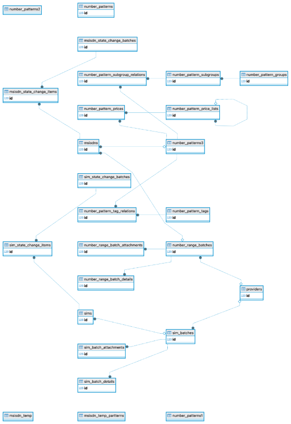

**Các bảng chính:**

1. **msisdns** - Bảng chính lưu trữ số thuê bao
   - *id*: Khóa chính
   - *msisdn*: Số thuê bao
   - *pattern\_id*: ID mẫu số
   - *range\_batch\_id*: ID lô dải số
   - *sim\_id*: ID SIM
   - *customer\_id*: ID khách hàng
   - *dealer\_id*: ID đại lý
   - *price*: Giá bán
   - *reservation\_id*: ID đặt trước
   - *reservation\_expiry*: Thời hạn đặt trước
   - *is\_ported*: Đã chuyển mạng
   - *port\_in\_date*: Ngày chuyển vào
   - *port\_out\_date*: Ngày chuyển ra
   - *activation\_date*: Ngày kích hoạt
   - *expiry\_date*: Ngày hết hạn
   - *last\_status\_change*: Lần thay đổi trạng thái cuối
   - *object\_type*: Loại đối tượng (MSISDN\_LIFECYCLE)
   - *status*: Trạng thái số
   - *workflow\_state\_id*: ID trạng thái workflow
   - *created\_at*, *updated\_at*: Thời gian tạo/cập nhật
1. **sims** - Bảng lưu trữ thông tin SIM
   - *id*: Khóa chính
   - *iccid*: ICCID của SIM
   - *imsi*: IMSI của SIM
   - *serial*: Serial number
   - *sim\_type*: Loại SIM
   - *status*: Trạng thái SIM
   - *object\_type*: Loại đối tượng (SIM\_LIFECYCLE)
   - *workflow\_state\_id*: ID trạng thái workflow
   - *created\_at*, *updated\_at*: Thời gian tạo/cập nhật
1. **number\_range\_batches** - Bảng lưu trữ lô dải số
   - *id*: Khóa chính
   - *batch\_code*: Mã lô
   - *start\_number*: Số bắt đầu
   - *end\_number*: Số kết thúc
   - *total\_numbers*: Tổng số lượng
   - *used\_numbers*: Số đã sử dụng
   - *available\_numbers*: Số còn khả dụng
   - *import\_date*: Ngày import
   - *workflow\_state\_id*: ID trạng thái workflow
   - *submitted\_by*: Người submit
   - *approved\_by*: Người approve
   - *imported\_by*: Người import
   - *activated\_by*: Người kích hoạt
   - *created\_at*, *updated\_at*: Thời gian tạo/cập nhật
1. **sim\_batches** - Bảng lưu trữ lô SIM
   - *id*: Khóa chính
   - *batch\_code*: Mã lô
   - *batch\_name*: Tên lô
   - *total\_sims*: Tổng số SIM
   - *used\_sims*: Số SIM đã sử dụng
   - *available\_sims*: Số SIM còn khả dụng
   - *import\_date*: Ngày import
   - *workflow\_state\_id*: ID trạng thái workflow
   - *submitted\_by*: Người submit
   - *approved\_by*: Người approve
   - *imported\_by*: Người import
   - *created\_at*, *updated\_at*: Thời gian tạo/cập nhật
1. **number\_patterns** - Bảng lưu trữ mẫu số
   - *id*: Khóa chính
   - *pattern\_code*: Mã mẫu
   - *name*: Tên mẫu
   - *regexp\_pattern*: Pattern regex
   - *additional\_condition*: Điều kiện bổ sung
   - *priority\_level*: Mức độ ưu tiên
   - *category\_id*: ID danh mục
   - *price*: Giá bán
   - *is\_active*: Trạng thái hoạt động
   - *created\_at*, *updated\_at*: Thời gian tạo/cập nhật
1. **msisdn\_status\_history** - Bảng lưu trữ lịch sử trạng thái MSISDN
   - *id*: Khóa chính
   - *msisdn\_id*: ID số thuê bao
   - *from\_state\_id*: Trạng thái từ
   - *to\_state\_id*: Trạng thái đến
   - *transition\_id*: ID chuyển đổi
   - *change\_date*: Ngày thay đổi
   - *reason*: Lý do thay đổi
   - *reference\_id*: ID tham chiếu
   - *reference\_type*: Loại tham chiếu
   - *changed\_by*: Người thay đổi
   - *notes*: Ghi chú
1. **sim\_status\_history** - Bảng lưu trữ lịch sử trạng thái SIM
   - *id*: Khóa chính
   - *sim\_id*: ID SIM
   - *from\_state\_id*: Trạng thái từ
   - *to\_state\_id*: Trạng thái đến
   - *transition\_id*: ID chuyển đổi
   - *change\_date*: Ngày thay đổi
   - *reason*: Lý do thay đổi
   - *reference\_id*: ID tham chiếu
   - *reference\_type*: Loại tham chiếu
   - *changed\_by*: Người thay đổi
   - *notes*: Ghi chú
1. **msisdn\_reclaim\_history** - Bảng lưu trữ lịch sử thu hồi số
   - *id*: Khóa chính
   - *msisdn\_id*: ID số thuê bao
   - *msisdn*: Số thuê bao
   - *order\_code*: Mã đơn hàng
   - *customer\_name*: Tên khách hàng
   - *customer\_email*: Email khách hàng
   - *reclaim\_reason*: Lý do thu hồi
   - *created\_by*: Người tạo
   - *created\_at*: Thời gian tạo

**API Endpoints chính:** - *POST /api/bss/resource/msisdns* - Quản lý số MSISDN - *POST /api/bss/resource/sims* - Quản lý SIM - *POST /api/bss/resource/number-range-batches* - Quản lý lô dải số - *POST /api/bss/resource/sim-batches* - Quản lý lô SIM - *POST /api/bss/resource/number-patterns* - Quản lý mẫu số - *POST /api/bss/resource/msisdn-state-change* - Thay đổi trạng thái MSISDN - *POST /api/bss/resource/sim-state-change* - Thay đổi trạng thái SIM - *POST /api/bss/resource/reclaim-management* - Quản lý thu hồi tài nguyên

**Luồng nghiệp vụ quan trọng (Quản lý vòng đời MSISDN):** 1. **Resource Service:** Import dải số mới từ Mobifone 2. **Resource Service:** Phân loại số theo pattern và định giá 3. **Sales Service:** Khách hàng đặt hàng số 4. **Resource Service:** Kiểm tra tính khả dụng và đặt trước số 5. **CRM Service:** Hoàn tất đăng ký thuê bao 6. **Resource Service:** Kích hoạt số và gán cho khách hàng 7. **Resource Service:** Theo dõi trạng thái sử dụng 8. **Resource Service:** Thu hồi số khi khách hàng hủy hoặc vi phạm
## **5.4. Phân hệ Quản lý Kho hàng (Inventory Service)**
**Mô tả:** Phân hệ Inventory quản lý toàn bộ sản phẩm, tồn kho, giá cả và giao dịch kho. Hệ thống hỗ trợ quản lý đa kho, theo dõi vị trí lưu trữ và tự động cập nhật tồn kho theo thời gian thực.

**Trách nhiệm:** - Quản lý sản phẩm và danh mục - Quản lý tồn kho và giao dịch kho - Quản lý giá và bảng giá - Quản lý kho hàng và vị trí - Quản lý kiểm kê và audit

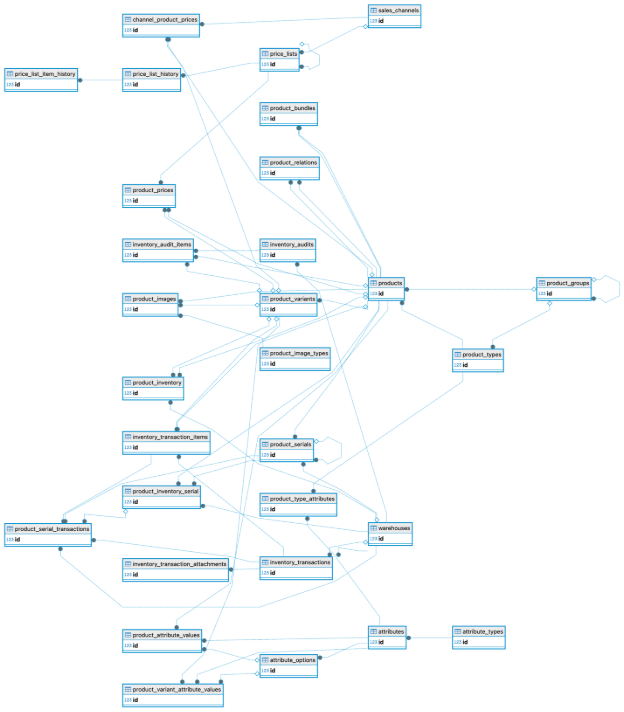

**Các bảng chính:**

1. **products** - Bảng chính lưu trữ sản phẩm
   - *id*: Khóa chính
   - *product\_code*: Mã sản phẩm
   - *name*: Tên sản phẩm
   - *description*: Mô tả
   - *product\_type\_id*: ID loại sản phẩm
   - *product\_group\_id*: ID nhóm sản phẩm
   - *sku*: Mã SKU
   - *barcode*: Mã vạch
   - *weight*: Trọng lượng
   - *dimensions*: Kích thước
   - *is\_active*: Trạng thái hoạt động
   - *created\_at*, *updated\_at*: Thời gian tạo/cập nhật
1. **product\_types** - Bảng lưu trữ loại sản phẩm
   - *id*: Khóa chính
   - *name*: Tên loại
   - *code*: Mã loại
   - *description*: Mô tả
   - *is\_active*: Trạng thái hoạt động
   - *created\_at*, *updated\_at*: Thời gian tạo/cập nhật
1. **product\_groups** - Bảng lưu trữ nhóm sản phẩm
   - *id*: Khóa chính
   - *name*: Tên nhóm
   - *code*: Mã nhóm
   - *description*: Mô tả
   - *parent\_id*: ID nhóm cha
   - *is\_active*: Trạng thái hoạt động
   - *created\_at*, *updated\_at*: Thời gian tạo/cập nhật
1. **inventory\_transactions** - Bảng lưu trữ giao dịch kho
   - *id*: Khóa chính
   - *transaction\_code*: Mã giao dịch
   - *transaction\_type*: Loại giao dịch (IN, OUT, TRANSFER, ADJUSTMENT)
   - *product\_id*: ID sản phẩm
   - *warehouse\_id*: ID kho
   - *quantity*: Số lượng
   - *unit\_cost*: Đơn giá
   - *total\_cost*: Tổng giá trị
   - *reference\_id*: ID tham chiếu
   - *reference\_type*: Loại tham chiếu
   - *notes*: Ghi chú
   - *created\_by*: Người tạo
   - *created\_at*: Thời gian tạo
1. **warehouses** - Bảng lưu trữ kho hàng
   - *id*: Khóa chính
   - *warehouse\_code*: Mã kho
   - *name*: Tên kho
   - *address*: Địa chỉ
   - *contact\_person*: Người liên hệ
   - *contact\_phone*: Số điện thoại
   - *manager\_id*: ID quản lý
   - *is\_active*: Trạng thái hoạt động
   - *created\_at*, *updated\_at*: Thời gian tạo/cập nhật
1. **price\_lists** - Bảng lưu trữ bảng giá
   - *id*: Khóa chính
   - *name*: Tên bảng giá
   - *code*: Mã bảng giá
   - *description*: Mô tả
   - *effective\_date*: Ngày hiệu lực
   - *expiry\_date*: Ngày hết hạn
   - *is\_active*: Trạng thái hoạt động
   - *created\_at*, *updated\_at*: Thời gian tạo/cập nhật
1. **product\_prices** - Bảng lưu trữ giá sản phẩm
   - *id*: Khóa chính
   - *product\_id*: ID sản phẩm
   - *price\_list\_id*: ID bảng giá
   - *unit\_price*: Đơn giá
   - *currency*: Đơn vị tiền tệ
   - *effective\_date*: Ngày hiệu lực
   - *expiry\_date*: Ngày hết hạn
   - *created\_at*, *updated\_at*: Thời gian tạo/cập nhật
1. **attributes** - Bảng lưu trữ thuộc tính sản phẩm
   - *id*: Khóa chính
   - *name*: Tên thuộc tính
   - *code*: Mã thuộc tính
   - *attribute\_type\_id*: ID loại thuộc tính
   - *data\_type*: Kiểu dữ liệu
   - *is\_required*: Bắt buộc
   - *is\_active*: Trạng thái hoạt động
   - *created\_at*, *updated\_at*: Thời gian tạo/cập nhật
1. **attribute\_types** - Bảng lưu trữ loại thuộc tính
   - *id*: Khóa chính
   - *name*: Tên loại
   - *code*: Mã loại
   - *description*: Mô tả
   - *is\_active*: Trạng thái hoạt động
   - *created\_at*, *updated\_at*: Thời gian tạo/cập nhật
1. **channel\_product\_prices** - Bảng lưu trữ giá theo kênh
   - *id*: Khóa chính
   - *product\_id*: ID sản phẩm
   - *channel\_id*: ID kênh
   - *unit\_price*: Đơn giá
   - *currency*: Đơn vị tiền tệ
   - *effective\_date*: Ngày hiệu lực
   - *expiry\_date*: Ngày hết hạn
   - *created\_at*, *updated\_at*: Thời gian tạo/cập nhật

**API Endpoints chính:** - *POST /api/bss/inventory/products* - Quản lý sản phẩm - *POST /api/bss/inventory/product-types* - Quản lý loại sản phẩm - *POST /api/bss/inventory/product-groups* - Quản lý nhóm sản phẩm - *POST /api/bss/inventory/inventory-transactions* - Quản lý giao dịch kho - *POST /api/bss/inventory/price-lists* - Quản lý bảng giá - *POST /api/bss/inventory/warehouses* - Quản lý kho hàng - *POST /api/bss/inventory/attributes* - Quản lý thuộc tính sản phẩm - *POST /api/bss/inventory/channel-product-prices* - Quản lý giá theo kênh

**Luồng nghiệp vụ quan trọng (Quản lý tồn kho):** 1. **Inventory Service:** Nhập hàng từ nhà cung cấp 2. **Inventory Service:** Cập nhật tồn kho và vị trí lưu trữ 3. **Sales Service:** Khách hàng đặt hàng 4. **Inventory Service:** Kiểm tra tồn kho và đặt trước 5. **Inventory Service:** Xuất kho khi đơn hàng được xác nhận 6. **Inventory Service:** Cập nhật tồn kho và ghi nhận giao dịch 7. **Inventory Service:** Cảnh báo khi tồn kho thấp 8. **Inventory Service:** Kiểm kê định kỳ
## **5.5. Phân hệ Tích hợp Mobifone (SPS Service)**
**Mô tả:** Phân hệ SPS (Service Provisioning System) đóng vai trò là lớp trung gian giữa hệ thống BSS nội bộ và các API của Mobifone. Hệ thống chuyển đổi các request từ định dạng REST/JSON nội bộ sang định dạng SOAP/XML mà Mobifone yêu cầu, đồng thời ghi log chi tiết tất cả các giao tiếp.

**Trách nhiệm:** - Đóng vai trò là lớp trung gian (Adapter/Facade) giữa hệ thống BSS nội bộ và các API của Mobifone - Chuyển đổi các request từ định dạng REST/JSON nội bộ sang định dạng SOAP/XML mà Mobifone yêu cầu - Xử lý logic xác thực (qlkhUsername, Mobifone-key…) - Quản lý các cấu hình liên quan đến API Mobifone - Ghi log chi tiết tất cả các giao tiếp với Mobifone

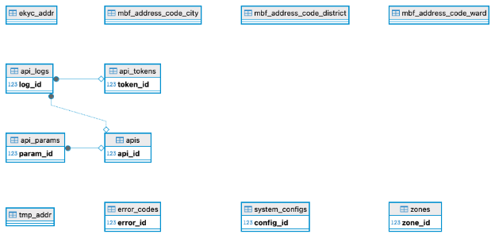

**Các bảng chính:**

1. **apis** - Bảng lưu trữ cấu hình API
   - *id*: Khóa chính
   - *api\_id*: ID API
   - *api\_code*: Mã API
   - *api\_name*: Tên API
   - *api\_description*: Mô tả API
   - *api\_endpoint*: Endpoint của API
   - *api\_method*: Phương thức (GET, POST, SOAP)
   - *request\_format*: Định dạng request (JSON, XML, SOAP)
   - *response\_format*: Định dạng response (JSON, XML)
   - *request\_template*: Template request
   - *response\_template*: Template response
   - *is\_active*: Trạng thái hoạt động
   - *created\_at*, *updated\_at*: Thời gian tạo/cập nhật
1. **api\_params** - Bảng lưu trữ tham số API
   - *id*: Khóa chính
   - *api\_id*: ID API
   - *param\_name*: Tên tham số
   - *param\_type*: Loại tham số (STRING, INTEGER, BOOLEAN, DATE)
   - *param\_value*: Giá trị tham số
   - *is\_required*: Bắt buộc
   - *is\_dynamic*: Động
   - *description*: Mô tả
   - *created\_at*, *updated\_at*: Thời gian tạo/cập nhật
1. **api\_logs** - Bảng lưu trữ log API
   - *id*: Khóa chính
   - *api\_id*: ID API
   - *request\_id*: ID request
   - *request\_body*: Nội dung request
   - *response\_body*: Nội dung response
   - *status*: Trạng thái (SUCCESS, FAILED, PROCESSING)
   - *error\_code*: Mã lỗi
   - *error\_message*: Thông báo lỗi
   - *execution\_time*: Thời gian thực thi
   - *ip\_address*: Địa chỉ IP
   - *user\_agent*: User agent
   - *created\_at*: Thời gian tạo
1. **system\_configs** - Bảng lưu trữ cấu hình hệ thống
   - *id*: Khóa chính
   - *config\_key*: Khóa cấu hình
   - *config\_value*: Giá trị cấu hình
   - *data\_type*: Kiểu dữ liệu
   - *description*: Mô tả
   - *is\_encrypted*: Đã mã hóa
   - *is\_active*: Trạng thái hoạt động
   - *created\_at*, *updated\_at*: Thời gian tạo/cập nhật
1. **error\_codes** - Bảng lưu trữ mã lỗi
   - *id*: Khóa chính
   - *error\_code*: Mã lỗi
   - *error\_message*: Thông báo lỗi
   - *error\_description*: Mô tả lỗi
   - *error\_category*: Danh mục lỗi
   - *is\_active*: Trạng thái hoạt động
   - *created\_at*, *updated\_at*: Thời gian tạo/cập nhật
1. **sps\_zones** - Bảng lưu trữ vùng SPS
   - *id*: Khóa chính
   - *zone\_code*: Mã vùng
   - *zone\_name*: Tên vùng
   - *description*: Mô tả
   - *is\_active*: Trạng thái hoạt động
   - *created\_at*, *updated\_at*: Thời gian tạo/cập nhật

**API Endpoints chính:** - *POST /api/bss/sps/admin/apis* - Quản lý cấu hình API - *POST /api/bss/sps/admin/api-params* - Quản lý tham số API - *POST /api/bss/sps/admin/api-log-search* - Tìm kiếm log API - *POST /api/bss/sps/admin/system-configs* - Quản lý cấu hình hệ thống - *POST /api/bss/sps/admin/error-codes* - Quản lý mã lỗi - *POST /api/bss/sps/admin/sps-zones* - Quản lý vùng SPS

**Luồng xử lý (Ví dụ - Đấu nối mới):** 1. **CRM Service** gọi đến SPS Service với payload JSON chứa thông tin thuê bao 2. **SPS Service** nhận request, xác thực nội bộ 3. **SPS Service** lấy mẫu request SOAP cho API\_REG\_NEW\_PREPAID\_V2 từ bảng sps.apis 4. **SPS Service** lấy các giá trị mặc định và cấu hình từ bảng sps.system\_configs 5. **SPS Service** điền thông tin từ payload và cấu hình vào mẫu SOAP 6. **SPS Service** ghi log request với trạng thái “PROCESSING” 7. **SPS Service** gửi request SOAP đến endpoint của Mobifone 8. **SPS Service** nhận response XML từ Mobifone 9. **SPS Service** phân tích response XML, trích xuất mã lỗi và dữ liệu 10. **SPS Service** cập nhật log với trạng thái “SUCCESS” hoặc “FAILED” 11. **SPS Service** trả về kết quả đã được chuẩn hóa (dạng JSON) cho CRM Service
## **5.6. Phân hệ Quản lý Nội dung (CMS Service)**
**Mô tả:** Phân hệ CMS (Content Management System) quản lý toàn bộ nội dung website bao gồm tin tức, bài viết, trang tĩnh và menu. Hệ thống hỗ trợ đa ngôn ngữ, SEO optimization và quản lý media files.

**Trách nhiệm:** - Quản lý tin tức và bài viết - Quản lý nội dung động và trang tĩnh - Quản lý menu và cấu trúc website - Quản lý file media và hình ảnh - Quản lý đa ngôn ngữ

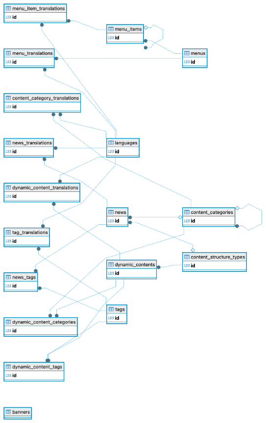

**Các bảng chính:**

1. **dynamic\_contents** - Bảng chính lưu trữ nội dung động
   - *id*: Khóa chính
   - *organization\_id*: ID tổ chức
   - *structure\_type\_id*: ID loại cấu trúc
   - *title*: Tiêu đề
   - *slug*: URL slug
   - *content\_data*: Dữ liệu nội dung (JSON)
   - *thumbnail*: Hình đại diện
   - *author\_id*: ID tác giả
   - *is\_featured*: Nổi bật
   - *view\_count*: Số lượt xem
   - *meta\_title*: Meta title
   - *meta\_description*: Meta description
   - *meta\_keywords*: Meta keywords
   - *published\_at*: Ngày xuất bản
   - *is\_active*: Trạng thái hoạt động
   - *object\_type*: Loại đối tượng (CMS\_DYNAMIC\_CONTENT\_WORKFLOW)
   - *workflow\_status*: Trạng thái workflow
   - *created\_at*, *updated\_at*: Thời gian tạo/cập nhật
1. **content\_categories** - Bảng lưu trữ danh mục nội dung
   - *id*: Khóa chính
   - *organization\_id*: ID tổ chức
   - *parent\_id*: ID danh mục cha
   - *name*: Tên danh mục
   - *slug*: URL slug
   - *description*: Mô tả
   - *image*: Hình ảnh
   - *meta\_title*: Meta title
   - *meta\_description*: Meta description
   - *meta\_keywords*: Meta keywords
   - *display\_order*: Thứ tự hiển thị
   - *is\_active*: Trạng thái hoạt động
   - *created\_at*, *updated\_at*: Thời gian tạo/cập nhật
1. **content\_category\_translations** - Bảng lưu trữ bản dịch danh mục
   - *id*: Khóa chính
   - *category\_id*: ID danh mục
   - *language\_id*: ID ngôn ngữ
   - *name*: Tên danh mục
   - *slug*: URL slug
   - *description*: Mô tả
   - *meta\_title*: Meta title
   - *meta\_description*: Meta description
   - *meta\_keywords*: Meta keywords
   - *created\_at*, *updated\_at*: Thời gian tạo/cập nhật
1. **dynamic\_content\_translations** - Bảng lưu trữ bản dịch nội dung
   - *id*: Khóa chính
   - *dynamic\_content\_id*: ID nội dung
   - *language\_id*: ID ngôn ngữ
   - *title*: Tiêu đề
   - *slug*: URL slug
   - *content\_data*: Dữ liệu nội dung (JSON)
   - *meta\_title*: Meta title
   - *meta\_description*: Meta description
   - *meta\_keywords*: Meta keywords
   - *og\_title*: Open Graph title
   - *og\_description*: Open Graph description
   - *created\_at*, *updated\_at*: Thời gian tạo/cập nhật
1. **languages** - Bảng lưu trữ ngôn ngữ
   - *id*: Khóa chính
   - *code*: Mã ngôn ngữ
   - *name*: Tên ngôn ngữ
   - *native\_name*: Tên bản địa
   - *flag\_icon*: Icon cờ
   - *is\_rtl*: Viết từ phải sang trái
   - *is\_active*: Trạng thái hoạt động
   - *display\_order*: Thứ tự hiển thị
   - *created\_at*, *updated\_at*: Thời gian tạo/cập nhật
1. **menus** - Bảng lưu trữ menu
   - *id*: Khóa chính
   - *name*: Tên menu
   - *code*: Mã menu
   - *description*: Mô tả
   - *is\_active*: Trạng thái hoạt động
   - *created\_at*, *updated\_at*: Thời gian tạo/cập nhật
1. **menu\_items** - Bảng lưu trữ mục menu
   - *id*: Khóa chính
   - *menu\_id*: ID menu
   - *parent\_id*: ID mục cha
   - *title*: Tiêu đề
   - *url*: URL
   - *icon*: Icon
   - *display\_order*: Thứ tự hiển thị
   - *is\_active*: Trạng thái hoạt động
   - *created\_at*, *updated\_at*: Thời gian tạo/cập nhật
1. **menu\_item\_translations** - Bảng lưu trữ bản dịch mục menu
   - *id*: Khóa chính
   - *menu\_item\_id*: ID mục menu
   - *language\_id*: ID ngôn ngữ
   - *title*: Tiêu đề
   - *url*: URL
   - *created\_at*, *updated\_at*: Thời gian tạo/cập nhật
1. **tags** - Bảng lưu trữ tag
   - *id*: Khóa chính
   - *name*: Tên tag
   - *slug*: URL slug
   - *description*: Mô tả
   - *is\_active*: Trạng thái hoạt động
   - *created\_at*, *updated\_at*: Thời gian tạo/cập nhật
1. **dynamic\_content\_tags** - Bảng liên kết nội dung và tag
   - *id*: Khóa chính
   - *dynamic\_content\_id*: ID nội dung
   - *tag\_id*: ID tag
   - *created\_at*: Thời gian tạo
1. **content\_structure\_types** - Bảng lưu trữ loại cấu trúc nội dung
   - *id*: Khóa chính
   - *organization\_id*: ID tổ chức
   - *name*: Tên loại
   - *code*: Mã loại
   - *description*: Mô tả
   - *icon*: Icon
   - *fields*: Các trường (JSON)
   - *layout*: Layout (JSON)
   - *is\_active*: Trạng thái hoạt động
   - *created\_at*, *updated\_at*: Thời gian tạo/cập nhật

**API Endpoints chính:** - *POST /api/bss/cms/news* - Quản lý tin tức - *POST /api/bss/cms/dynamic-contents* - Quản lý nội dung động - *POST /api/bss/cms/menus* - Quản lý menu - *POST /api/bss/cms/media-files* - Quản lý file media - *POST /api/bss/cms/content-categories* - Quản lý danh mục nội dung - *POST /api/bss/cms/tags* - Quản lý tag - *POST /api/bss/cms/languages* - Quản lý ngôn ngữ - *POST /api/bss/cms/content-structure-types* - Quản lý cấu trúc nội dung
## **5.7. Phân hệ Quản lý Đại lý eSIM (eSIM Agency Service)**
**Mô tả:** Phân hệ eSIM Agency quản lý các đại lý eSIM, ví điện tử, giao dịch tài chính và bảng giá. Hệ thống hỗ trợ quản lý đa tiền tệ và tỷ giá hối đoái.

**Trách nhiệm:** - Quản lý đại lý eSIM và thông tin liên hệ - Quản lý ví điện tử và giao dịch tài chính - Quản lý bảng giá và nhóm giá - Quản lý gói cước và nhà cung cấp - Quản lý tỷ giá hối đoái

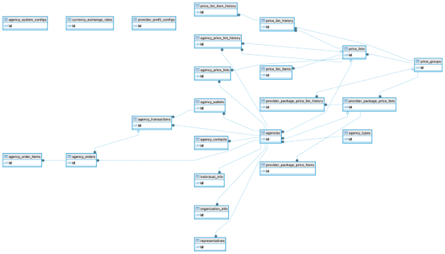

**Các bảng chính:** - **agencies**: Thông tin đại lý - **agency\_wallets**: Ví điện tử đại lý - **agency\_transactions**: Giao dịch đại lý - **agency\_price\_lists**: Bảng giá đại lý - **provider\_packages**: Gói nhà cung cấp - **currency\_exchange\_rates**: Tỷ giá hối đoái

**API Endpoints chính:** - *POST /api/bss/esim-agency/agencies* - Quản lý đại lý - *POST /api/bss/esim-agency/agency-wallets* - Quản lý ví đại lý - *POST /api/bss/esim-agency/agency-transactions* - Quản lý giao dịch đại lý - *POST /api/bss/esim-agency/agency-price-lists* - Quản lý bảng giá đại lý - *POST /api/bss/esim-agency/provider-packages* - Quản lý gói nhà cung cấp - *POST /api/bss/esim-agency/currency-exchange-rates* - Quản lý tỷ giá
## **5.8. Phân hệ Du lịch (Travel Service)**
**Mô tả:** Phân hệ Travel quản lý eSIM du lịch, gói cước và đơn hàng. Hệ thống tích hợp với các nhà cung cấp eSIM quốc tế và hỗ trợ đồng bộ gói cước.

**Trách nhiệm:** - Quản lý eSIM du lịch và gói cước - Quản lý đơn hàng eSIM du lịch - Quản lý nhà cung cấp và vùng lãnh thổ - Đồng bộ gói cước từ nhà cung cấp - Quản lý đơn hàng nhà cung cấp

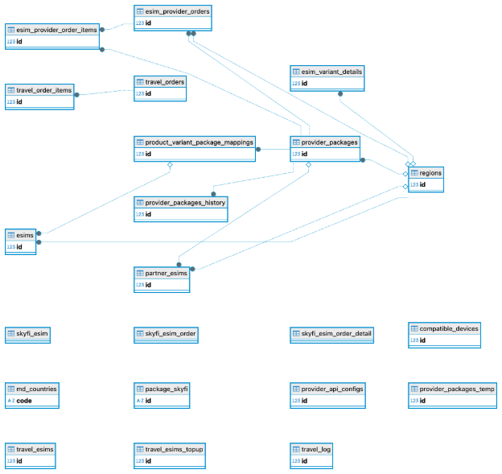

**Các bảng chính:** - **esims**: eSIM du lịch - **provider\_packages**: Gói nhà cung cấp - **regions**: Vùng lãnh thổ - **esim\_provider\_orders**: Đơn hàng nhà cung cấp

**API Endpoints chính:** - *POST /api/bss/travel/esims* - Quản lý eSIM du lịch - *POST /api/bss/travel/provider-packages* - Quản lý gói nhà cung cấp - *POST /api/bss/travel/regions* - Quản lý vùng lãnh thổ - *POST /api/bss/travel/esim-provider-orders* - Quản lý đơn hàng nhà cung cấp - *POST /api/bss/travel/package-sync* - Đồng bộ gói cước
## **5.9. Phân hệ Quản lý Phân phối (DMS Service)**
**Mô tả:** Phân hệ DMS (Distribution Management System) quản lý cửa hàng, tuyến đường, đội ngũ bán hàng và KPI. Hệ thống hỗ trợ quản lý khuyến mãi và POSM.

**Trách nhiệm:** - Quản lý cửa hàng và điểm bán hàng - Quản lý tuyến đường và khu vực - Quản lý đội ngũ bán hàng - Quản lý KPI và mục tiêu - Quản lý khuyến mãi và POSM

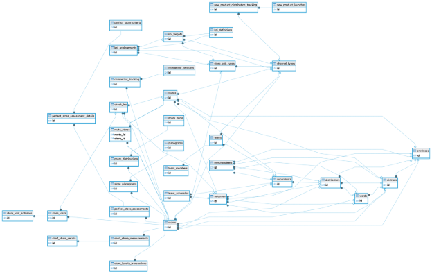

**Các bảng chính:** - **stores**: Cửa hàng - **routes**: Tuyến đường - **teams**: Đội ngũ - **kpi\_definitions**: Định nghĩa KPI - **kpi\_targets**: Mục tiêu KPI - **promotions**: Khuyến mãi - **posm\_items**: POSM

**API Endpoints chính:** - *POST /api/bss/dms/stores* - Quản lý cửa hàng - *POST /api/bss/dms/routes* - Quản lý tuyến đường - *POST /api/bss/dms/teams* - Quản lý đội ngũ - *POST /api/bss/dms/kpi-definitions* - Quản lý định nghĩa KPI - *POST /api/bss/dms/kpi-targets* - Quản lý mục tiêu KPI - *POST /api/bss/dms/promotions* - Quản lý khuyến mãi - *POST /api/bss/dms/posm-items* - Quản lý POSM
## **5.10. Phân hệ Thông báo (Notification Service)**
**Mô tả:** Phân hệ Notification quản lý các kênh thông báo như email, SMS, push notification. Hệ thống hỗ trợ template thông báo và giám sát trạng thái gửi.

**Trách nhiệm:** - Quản lý kênh thông báo (email, SMS, push notification) - Quản lý template thông báo - Quản lý hàng đợi thông báo - Giám sát trạng thái gửi thông báo - Quản lý cấu hình thông báo

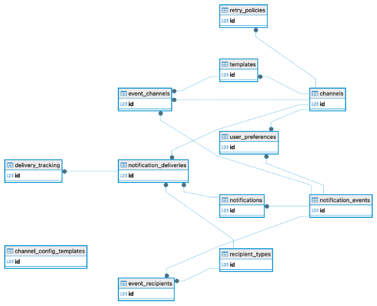

**Các bảng chính:** - **notification\_channels**: Kênh thông báo - **channel\_config\_templates**: Template cấu hình - **monitor\_queues**: Giám sát hàng đợi

**API Endpoints chính:** - *POST /api/bss/notification/channels* - Quản lý kênh thông báo - *POST /api/bss/notification/channel-config-templates* - Quản lý template cấu hình - *POST /api/bss/notification/monitor-queues* - Giám sát hàng đợi
## **5.11. Phân hệ Báo cáo (Report Service)**
**Mô tả:** Phân hệ Report tạo các báo cáo kinh doanh, tài chính và vận hành. Hệ thống hỗ trợ xuất báo cáo ra Excel/PDF và lưu trữ báo cáo.

**Trách nhiệm:** - Tạo báo cáo kinh doanh - Tạo báo cáo tài chính - Tạo báo cáo vận hành - Xuất báo cáo ra Excel/PDF - Lưu trữ và quản lý báo cáo

**API Endpoints chính:** - *POST /api/bss/report/business-reports* - Báo cáo kinh doanh - *POST /api/bss/report/financial-reports* - Báo cáo tài chính - *POST /api/bss/report/operational-reports* - Báo cáo vận hành
## **5.12. Phân hệ CDR (CDR Service)**
**Mô tả:** Phân hệ CDR (Call Detail Record) import và xử lý dữ liệu CDR từ Mobifone. Hệ thống hỗ trợ phân tích và báo cáo CDR.

**Trách nhiệm:** - Import và xử lý dữ liệu CDR từ Mobifone - Phân tích và báo cáo CDR - Quản lý cấu hình import CDR - Giám sát quá trình import

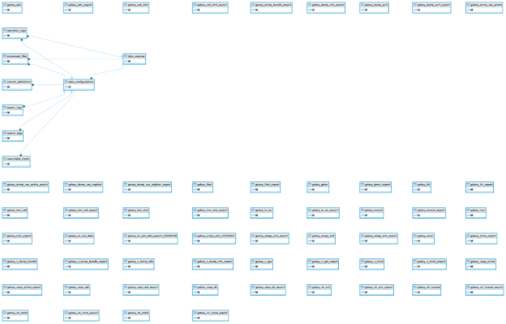

**Các bảng chính:** - **data\_configurations**: Cấu hình dữ liệu - **column\_definitions**: Định nghĩa cột - **wz\_**\*: Các bảng CDR từ Mobifone

**API Endpoints chính:** - *POST /api/bss/cdr/data-configurations* - Quản lý cấu hình dữ liệu - *POST /api/bss/cdr/column-definitions* - Quản lý định nghĩa cột - *POST /api/bss/cdr/dashboard* - Dashboard CDR - *POST /api/bss/cdr/logs* - Quản lý log CDR
## **5.13. Phân hệ Quản trị (Admin Service)**
**Mô tả:** Phân hệ Admin quản lý người dùng, phân quyền, vai trò và hệ thống. Hệ thống hỗ trợ quản lý menu, giao diện và workflow.

**Trách nhiệm:** - Quản lý người dùng và phân quyền - Quản lý vai trò và quyền hạn - Quản lý tổ chức và hệ thống - Quản lý menu và giao diện - Quản lý workflow và trạng thái

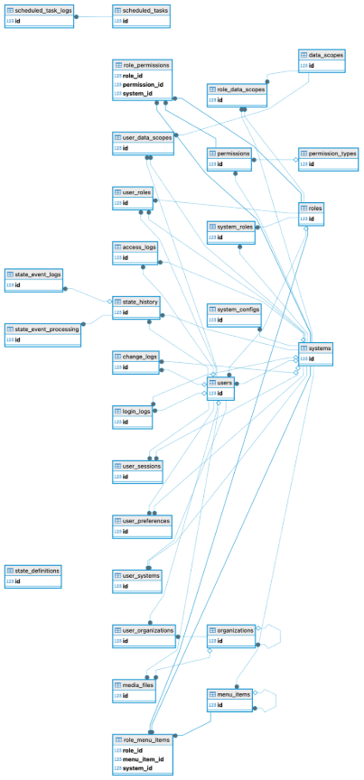

**Các bảng chính:** - **users**: Người dùng - **roles**: Vai trò - **permissions**: Quyền hạn - **organizations**: Tổ chức - **systems**: Hệ thống - **menu\_items**: Mục menu - **workflows**: Workflow - **state\_definitions**: Định nghĩa trạng thái

**API Endpoints chính:** - *POST /api/bss/admin/users* - Quản lý người dùng - *POST /api/bss/admin/roles* - Quản lý vai trò - *POST /api/bss/admin/permissions* - Quản lý quyền hạn - *POST /api/bss/admin/organizations* - Quản lý tổ chức - *POST /api/bss/admin/systems* - Quản lý hệ thống - *POST /api/bss/admin/menu-items* - Quản lý menu - *POST /api/bss/admin/workflows* - Quản lý workflow - *POST /api/bss/admin/state-definitions* - Quản lý định nghĩa trạng thái
## **5.14. Phân hệ Ứng dụng (App Service)**
**Mô tả:** Phân hệ App cung cấp API cho ứng dụng mobile, xử lý xác thực và đăng nhập. Hệ thống hỗ trợ quản lý phiên làm việc và cung cấp dữ liệu cho app.

**Trách nhiệm:** - Cung cấp API cho ứng dụng mobile - Xử lý xác thực và đăng nhập - Quản lý phiên làm việc - Cung cấp dữ liệu cho app

**API Endpoints chính:** - *POST /api/bss/app/auth* - Xác thực ứng dụng - *POST /api/bss/app/cart* - Giỏ hàng cho app - *POST /api/bss/app/orders* - Đơn hàng cho app
## **5.15. Các phân hệ khác**
**Campaign Service:** Quản lý chiến dịch marketing **Payment Service:** Xử lý thanh toán **MBF Service:** Tích hợp với MBF **MNP Service:** Quản lý MNP (Mobile Number Portability) **SkyJoy Service:** Tích hợp với SkyJoy **VJ Service:** Tích hợp với VietJet **VJA eSIM Service:** Quản lý eSIM VietJet **Trasna Service:** Tích hợp với Trasna
**\

**6. THIẾT KẾ TRIỂN KHAI VÀ VẬN HÀNH**

**6.1. Kiến trúc Triển khai trên Kubernetes**

**Ghi chú** kiến trúc thể K8S hoặc Docker hoặc trên hạ tầng vật lý, VPS thông thường. Ở đây mô tả 1 kiến trúc trên K8S

- **Môi trường:** Thiết lập 3 namespaces trên cụm K8s:
  - wz-dev: Dành cho đội phát triển.
  - wz-staging: Môi trường để kiểm thử tích hợp (UAT), gần giống Production nhất.
  - wz-production: Môi trường cho người dùng cuối.
- **Tự động co giãn (Autoscaling):** Cấu hình Horizontal Pod Autoscaler (HPA) cho các microservice quan trọng (API Gateway, Sales Service, CRM Service) dựa trên mức sử dụng CPU và Memory để tự động tăng/giảm số lượng pod khi tải thay đổi.
- **Quản lý Cấu hình:** Sử dụng **ConfigMaps** để lưu trữ các cấu hình không nhạy cảm (URL, tên dịch vụ) và **Secrets** để lưu trữ thông tin nhạy cảm (mật khẩu CSDL, API keys), được mã hóa Base64 trong K8s.

**6.2. Quy trình CI/CD**

- *Mô tả hình vẽ: Sơ đồ thể hiện các giai đoạn:*
  - **Code:** Developer commit code lên một feature branch trên GitLab.
  - **Build:** GitLab Runner tự động kích hoạt pipeline:
    - build stage: Biên dịch mã nguồn, chạy unit tests.
    - package stage: Xây dựng Docker image.
    - push stage: Đẩy image lên GitLab Container Registry.
  - **Deploy to Dev:** Tự động triển khai image lên namespace wz-dev.
  - **Test (Staging):** Khi merge vào staging branch, pipeline sẽ triển khai image lên namespace wz-staging. Đội QA thực hiện kiểm thử tự động (integration tests, E2E tests) và kiểm thử thủ công.
  - **Release (Production):** Sau khi UAT thành công, tạo một Git tag cho phiên bản release. Việc triển khai lên wz-production sẽ được kích hoạt thủ công (manual job) bởi người có thẩm quyền để đảm bảo an toàn.

**6.3. Kiến trúc Logging trong Database**

Hệ thống BSS được thiết kế với một cơ chế logging toàn diện, tập trung vào việc lưu trữ và quản lý log trong cơ sở dữ liệu PostgreSQL. Cách tiếp cận này đảm bảo tính nhất quán, khả năng truy vết cao và tích hợp chặt chẽ với các nghiệp vụ kinh doanh.

**Nguyên tắc thiết kế:** - **Logging tập trung:** Tất cả log được lưu trữ trong cơ sở dữ liệu với cấu trúc chuẩn hóa - **Audit trail đầy đủ:** Ghi lại mọi thay đổi dữ liệu và hoạt động người dùng - **Performance monitoring:** Theo dõi hiệu năng hệ thống và thời gian phản hồi - **Security logging:** Ghi lại các hoạt động bảo mật và truy cập hệ thống - **Business intelligence:** Cung cấp dữ liệu cho phân tích nghiệp vụ

**6.3.1. Schema Auth - Logging Trung tâm**

Schema *auth* đóng vai trò là trung tâm logging của hệ thống, chứa các bảng log chính:

**a) Bảng *access\_logs* - Log Truy cập API**

**CREATE** **TABLE** auth.access\_logs (*\
`    `**id** BIGSERIAL **PRIMARY** **KEY**,*\
`    `user\_id BIGINT **REFERENCES** auth.users(**id**),*\
`    `resource\_type VARCHAR(50), *-- CRM, SALES, RESOURCE, etc.*\
`    `**method** VARCHAR(10), *-- GET, POST, PUT, DELETE*\
`    `endpoint VARCHAR(255),*\
`    `request\_params TEXT,*\
`    `response\_code INTEGER,*\
`    `ip\_address INET,*\
`    `user\_agent TEXT,*\
`    `execution\_time\_ms INTEGER,*\
`    `created\_at TIMESTAMP **DEFAULT** NOW()*\
);

**Mục đích:** - Ghi lại mọi truy cập API với thông tin chi tiết - Theo dõi hiệu năng và thời gian phản hồi - Phát hiện các truy cập bất thường - Cung cấp dữ liệu cho phân tích sử dụng

**b) Bảng *change\_logs* - Log Thay đổi Dữ liệu**

**CREATE** **TABLE** auth.change\_logs (*\
`    `**id** BIGSERIAL **PRIMARY** **KEY**,*\
`    `user\_id BIGINT **REFERENCES** auth.users(**id**),*\
`    `table\_name VARCHAR(100),*\
`    `record\_id BIGINT,*\
`    `action VARCHAR(20), *-- INSERT, UPDATE, DELETE*\
`    `old\_values JSONB,*\
`    `new\_values JSONB,*\
`    `change\_reason TEXT,*\
`    `created\_at TIMESTAMP **DEFAULT** NOW()*\
);

**Mục đích:** - Ghi lại mọi thay đổi dữ liệu trong hệ thống - Đảm bảo tính minh bạch và khả năng kiểm toán - Hỗ trợ rollback và khôi phục dữ liệu - Tuân thủ các quy định về bảo mật dữ liệu

**c) Bảng *login\_logs* - Log Đăng nhập**

**CREATE** **TABLE** auth.login\_logs (*\
`    `**id** BIGSERIAL **PRIMARY** **KEY**,*\
`    `user\_id BIGINT **REFERENCES** auth.users(**id**),*\
`    `login\_status VARCHAR(20), *-- SUCCESS, FAILED*\
`    `ip\_address INET,*\
`    `user\_agent TEXT,*\
`    `failure\_reason TEXT,*\
`    `created\_at TIMESTAMP **DEFAULT** NOW()*\
);

**Mục đích:** - Theo dõi các hoạt động đăng nhập/đăng xuất - Phát hiện các đăng nhập bất thường - Hỗ trợ điều tra bảo mật - Thống kê sử dụng hệ thống

**d) Bảng *state\_history* - Log Thay đổi Trạng thái**

**CREATE** **TABLE** auth.state\_history (*\
`    `**id** BIGSERIAL **PRIMARY** **KEY**,*\
`    `object\_type VARCHAR(50), *-- MSISDN\_LIFECYCLE, SIM\_LIFECYCLE, etc.*\
`    `object\_id BIGINT,*\
`    `from\_status VARCHAR(50),*\
`    `to\_status VARCHAR(50),*\
`    `change\_reason TEXT,*\
`    `user\_id BIGINT **REFERENCES** auth.users(**id**),*\
`    `created\_at TIMESTAMP **DEFAULT** NOW()*\
);

**Mục đích:** - Theo dõi vòng đời của các đối tượng nghiệp vụ - Hỗ trợ phân tích quy trình nghiệp vụ - Cung cấp dữ liệu cho báo cáo và thống kê - Đảm bảo tính nhất quán của dữ liệu

**6.3.2. Schema Portal - Logging Self-care**

Schema *portal* chứa các log liên quan đến kênh tự phục vụ:

**a) Bảng *access\_app\_logs* - Log Truy cập App**

**CREATE** **TABLE** portal.access\_app\_logs (*\
`    `**id** BIGSERIAL **PRIMARY** **KEY**,*\
`    `user\_profile\_id BIGINT **REFERENCES** portal.user\_profiles(**id**),*\
`    `app\_version VARCHAR(20),*\
`    `device\_info JSONB,*\
`    `session\_duration INTEGER,*\
`    `created\_at TIMESTAMP **DEFAULT** NOW()*\
);

**b) Bảng *user\_activities* - Log Hoạt động Người dùng**

**CREATE** **TABLE** portal.user\_activities (*\
`    `**id** BIGSERIAL **PRIMARY** **KEY**,*\
`    `user\_profile\_id BIGINT **REFERENCES** portal.user\_profiles(**id**),*\
`    `activity\_type VARCHAR(50), *-- VIEW\_PROFILE, UPDATE\_INFO, PURCHASE, etc.*\
`    `activity\_data JSONB,*\
`    `created\_at TIMESTAMP **DEFAULT** NOW()*\
);

**6.3.3. Schema CDR - Logging Xử lý Dữ liệu**

Schema *cdr* chứa các log liên quan đến xử lý dữ liệu CDR:

**a) Bảng *operation\_logs* - Log Thao tác Dữ liệu**

**CREATE** **TABLE** cdr.operation\_logs (*\
`    `**id** BIGSERIAL **PRIMARY** **KEY**,*\
`    `operation\_type VARCHAR(50), *-- IMPORT, PROCESS, EXPORT*\
`    `file\_name VARCHAR(255),*\
`    `records\_processed INTEGER,*\
`    `records\_success INTEGER,*\
`    `records\_failed INTEGER,*\
`    `processing\_time\_ms INTEGER,*\
`    `status VARCHAR(20), *-- SUCCESS, FAILED, PARTIAL*\
`    `error\_message TEXT,*\
`    `created\_at TIMESTAMP **DEFAULT** NOW()*\
);

**b) Bảng *search\_logs* - Log Tìm kiếm**

**CREATE** **TABLE** cdr.search\_logs (*\
`    `**id** BIGSERIAL **PRIMARY** **KEY**,*\
`    `user\_id BIGINT **REFERENCES** auth.users(**id**),*\
`    `search\_criteria JSONB,*\
`    `result\_count INTEGER,*\
`    `search\_time\_ms INTEGER,*\
`    `created\_at TIMESTAMP **DEFAULT** NOW()*\
);

**6.3.4. Schema SPS - Logging Tích hợp**

Schema *sps* chứa các log chi tiết về tích hợp với Mobifone:

**Bảng *api\_logs* - Log API Calls**

**CREATE** **TABLE** sps.api\_logs (*\
`    `**id** BIGSERIAL **PRIMARY** **KEY**,*\
`    `api\_name VARCHAR(100),*\
`    `request\_body TEXT,*\
`    `response\_body TEXT,*\
`    `status\_code INTEGER,*\
`    `error\_code VARCHAR(50),*\
`    `execution\_time\_ms INTEGER,*\
`    `created\_at TIMESTAMP **DEFAULT** NOW()*\
);

**6.3.5. Application-level Logging**

**a) Structured Logging**

@Slf4j*\
@RestController*\
**public** **class** CustomerController {**\
\
`    `@PostMapping("/customers")*\
`    `**public** ResponseEntity<Customer> createCustomer(@RequestBody CustomerRequest request) {*\
`        `log.info("Creating customer: {}", request.getCustomerCode());**\
\
`        `**try** {*\
`            `Customer customer = customerService.create(request);**\
\
`            `*// Ghi log thành công*\
`            `log.info("Customer created successfully: {}", customer.getId());*\
`            `**return** ResponseEntity.ok(customer);**\
\
`        `} **catch** (Exception e) {*\
`            `*// Ghi log lỗi*\
`            `log.error("Failed to create customer: {}", e.getMessage(), e);*\
`            `**throw** e;*\
`        `}*\
`    `}*\
}

**b) Audit Logging**

@Component*\
**public** **class** AuditAspect {**\
\
`    `@Around("@annotation(Audited)")*\
`    `**public** Object auditMethod(ProceedingJoinPoint joinPoint) **throws** Throwable {*\
`        `String methodName = joinPoint.getSignature().getName();*\
`        `String className = joinPoint.getTarget().getClass().getSimpleName();**\
\
`        `*// Ghi log trước khi thực hiện*\
`        `log.info("Executing {}.{} with params: {}",* \
`                `className, methodName, joinPoint.getArgs());**\
\
`        `**try** {*\
`            `Object result = joinPoint.proceed();**\
\
`            `*// Ghi log thành công*\
`            `log.info("Successfully executed {}.{}", className, methodName);*\
`            `**return** result;**\
\
`        `} **catch** (Exception e) {*\
`            `*// Ghi log lỗi*\
`            `log.error("Failed to execute {}.{}: {}",* \
`                    `className, methodName, e.getMessage());*\
`            `**throw** e;*\
`        `}*\
`    `}*\
}

**6.4. Monitoring và Analytics**

**6.4.1. Performance Monitoring**

**a) API Performance Metrics**

*-- Thống kê thời gian phản hồi API theo endpoint*\
**SELECT*** \
`    `endpoint,*\
`    `AVG(execution\_time\_ms) **as** avg\_response\_time,*\
`    `MAX(execution\_time\_ms) **as** max\_response\_time,*\
`    `COUNT(\*) **as** total\_requests,*\
`    `COUNT(**CASE** **WHEN** response\_code >= 400 **THEN** 1 **END**) **as** error\_count*\
**FROM** auth.access\_logs* \
**WHERE** created\_at >= NOW() - INTERVAL '24 hours'*\
**GROUP** **BY** endpoint*\
**ORDER** **BY** avg\_response\_time **DESC**;

**b) Database Performance**

*-- Thống kê truy vấn chậm*\
**SELECT*** \
`    `**query**,*\
`    `mean\_time,*\
`    `calls,*\
`    `total\_time*\
**FROM** pg\_stat\_statements* \
**WHERE** mean\_time > 1000  *-- > 1 second*\
**ORDER** **BY** mean\_time **DESC**;

**6.4.2. Business Intelligence**

**a) User Activity Analysis**

*-- Phân tích hoạt động người dùng*\
**SELECT*** \
`    `DATE(created\_at) **as** date,*\
`    `activity\_type,*\
`    `COUNT(\*) **as** activity\_count*\
**FROM** portal.user\_activities*\
**WHERE** created\_at >= NOW() - INTERVAL '30 days'*\
**GROUP** **BY** DATE(created\_at), activity\_type*\
**ORDER** **BY** date **DESC**, activity\_count **DESC**;

**b) System Usage Statistics**

*-- Thống kê sử dụng hệ thống*\
**SELECT*** \
`    `resource\_type,*\
`    `COUNT(\*) **as** access\_count,*\
`    `COUNT(**DISTINCT** user\_id) **as** unique\_users*\
**FROM** auth.access\_logs*\
**WHERE** created\_at >= NOW() - INTERVAL '24 hours'*\
**GROUP** **BY** resource\_type*\
**ORDER** **BY** access\_count **DESC**;

**6.4.3. Security Monitoring**

**a) Failed Login Attempts**

*-- Theo dõi đăng nhập thất bại*\
**SELECT*** \
`    `ip\_address,*\
`    `COUNT(\*) **as** failed\_attempts,*\
`    `MAX(created\_at) **as** last\_attempt*\
**FROM** auth.login\_logs*\
**WHERE** login\_status = 'FAILED'* \
`    `**AND** created\_at >= NOW() - INTERVAL '1 hour'*\
**GROUP** **BY** ip\_address*\
**HAVING** COUNT(\*) > 5*\
**ORDER** **BY** failed\_attempts **DESC**;

**b) Suspicious Activities**

*-- Phát hiện hoạt động bất thường*\
**SELECT*** \
`    `user\_id,*\
`    `COUNT(\*) **as** request\_count,*\
`    `COUNT(**DISTINCT** ip\_address) **as** unique\_ips*\
**FROM** auth.access\_logs*\
**WHERE** created\_at >= NOW() - INTERVAL '1 hour'*\
**GROUP** **BY** user\_id*\
**HAVING** COUNT(\*) > 100 **OR** COUNT(**DISTINCT** ip\_address) > 3*\
**ORDER** **BY** request\_count **DESC**;

**6.5. Log Retention và Archiving**

**6.5.1. Retention Policy**

- **Access Logs:** Giữ 90 ngày
- **Change Logs:** Giữ vĩnh viễn
- **Login Logs:** Giữ 180 ngày
- **State History:** Giữ vĩnh viễn
- **API Logs:** Giữ 30 ngày
- **Operation Logs:** Giữ 365 ngày

**6.5.2. Archiving Strategy**

*-- Tạo partition cho access\_logs theo tháng*\
**CREATE** **TABLE** auth.access\_logs\_2024\_01 **PARTITION** **OF** auth.access\_logs*\
**FOR** **VALUES** **FROM** ('2024-01-01') **TO** ('2024-02-01');\
\
*-- Archive logs cũ*\
**INSERT** **INTO** auth.access\_logs\_archive* \
**SELECT** \* **FROM** auth.access\_logs* \
**WHERE** created\_at < NOW() - INTERVAL '90 days';*\
\
**DELETE** **FROM** auth.access\_logs* \
**WHERE** created\_at < NOW() - INTERVAL '90 days';

**6.6. Integration với External Monitoring**

**6.6.1. Prometheus Metrics**

@Component*\
**public** **class** LoggingMetrics {**\
\
`    `**private** final Counter apiRequestsTotal = Counter.build()*\
.name("api\_requests\_total")*\
.help("Total number of API requests")*\
.labelNames("endpoint", "method", "status")*\
.register();**\
\
`    `**private** final Histogram apiResponseTime = Histogram.build()*\
.name("api\_response\_time\_seconds")*\
.help("API response time in seconds")*\
.labelNames("endpoint")*\
.register();**\
\
`    `**public** void recordApiRequest(String endpoint, String method,* \
`                               `int status, long duration) {*\
`        `apiRequestsTotal.labels(endpoint, method, String.valueOf(status))*\
.inc();*\
`        `apiResponseTime.labels(endpoint).observe(duration / 1000.0);*\
`    `}*\
}

