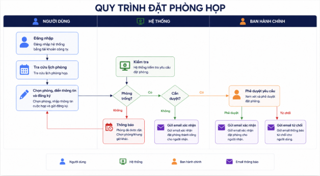

**TÀI LIỆU YÊU CẦU NGHIỆP VỤ** 

**QUY TRÌNH ĐẶT PHÒNG HỌP**

|**Thông tin**|**Nội dung**|
| :- | :- |
|Tên tài liệu|Tài liệu yêu cầu nghiệp vụ - Quy trình đặt phòng họp|
|Phiên bản|1\.0 |
|Ngày tài liệu gốc|20/05/2026|
|Đơn vị soạn thảo|Ban Chuyển đổi số|
|Đơn vị xác nhận nghiệp vụ|Ban Hành chính|
|Trạng thái|Chờ Ban Hành chính rà soát và xác nhận|
|Tài liệu tham chiếu|Quy trình đặt phòng họp - QT.KDI.HC.04|

# **Mục lục**
[Mục lục	2](#_toc1645017137)

[1. Mục đích và bối cảnh	2](#_toc933162587)

[1.1. Mục đích tài liệu	3](#_toc227655523)

[1.2. Bối cảnh hiện tại	3](#_toc1574102464)

[2. Mục tiêu nghiệp vụ	3](#_toc1706815243)

[3. Các thuật ngữ sử dụng trong tài liệu	3](#_toc1876928032)

[4. Các bên liên quan	3](#_toc748086193)

[5. Quy trình nghiệp vụ tổng quan	3](#_toc633690898)

[6. Yêu cầu nghiệp vụ chi tiết	4](#_toc1342836675)

[6.1 Đăng nhập hệ thống	4](#_toc393064749)

[6.2 Tra cứu lịch phòng họp	4](#_toc1095512514)

[6.3 Đặt phòng họp	4](#_toc1743851581)

[6.4 Quy tắc xử lý đặt phòng theo loại phòng	5](#_toc1663520155)

[6.5 Đặt lịch lặp	5](#_toc143027071)

[6.6 Cập nhật lịch họp	5](#_toc1557656978)

[6.7 Hủy lịch họp	5](#_toc680193887)

[6.8 Phê duyệt phòng đặc biệt	5](#_toc1862278429)

[7. Quy tắc nghiệp vụ chung	5](#_toc2074377123)

[8. Danh sách email thông báo	6](#_toc16216902)

[9. Yêu cầu giao diện và trải nghiệm sử dụng	6](#_toc98799914)

[10. Tiêu chí xác nhận nghiệp vụ	7](#_toc34371814)

# **1. Mục đích và bối cảnh**
## **1.1. Mục đích tài liệu**
Tài liệu này mô tả các yêu cầu nghiệp vụ của hệ thống đặt phòng họp nội bộ tại KDI Group. 

Mục tiêu nhằm thống nhất cách vận hành, quyền sử dụng và quy trình xử lý giữa các bộ phận liên quan trước khi triển khai hệ thống.
## **1.2. Bối cảnh hiện tại**
Hiện tại, việc đặt phòng họp đang được thực hiện thủ công qua email và chat nội bộ.

Ảnh hưởng: 

- Mất thời gian đăng ký, nhắc nhở, theo dõi thủ công 
- Dễ bỏ sót hoặc trùng đăng ký
# **2. Mục tiêu nghiệp vụ**
- Quản lý phòng họp tập trung
- Hạn chế tình trạng trùng lịch phòng họp
- Chuẩn hóa quy trình đăng ký, phê duyệt và hủy phòng họp
- Tăng tính minh bạch trong việc sử dụng phòng họp
- Hỗ trợ Ban Hành chính theo dõi và điều phối phòng họp hiệu quả
# **3. Các thuật ngữ sử dụng trong tài liệu**

|**Thuật ngữ**|**Cách hiểu trong tài liệu**|
| :- | :- |
|KDI|Công ty Cổ phần Đầu tư KD.|
|CBNV|Cán bộ nhân viên toàn công ty|
|BHC|Ban Hành chính|
|AC|Acceptance Criteria - Tiêu chí xác nhận|
# **4. Các bên liên quan**

|**Vai trò**|**Trách nhiệm chính**|
| :- | :- |
|CBNV KDI|Đặt phòng, cập nhật, hủy lịch của chính mình|
|Ban Hành chính|Phê duyệt phòng , cấu hình quyền phòng họp|

# **5. Quy trình nghiệp vụ tổng quan**

- Người dùng đăng nhập hệ thống bằng tài khoản công ty
- Người dùng tra cứu lịch phòng họp
- Người dùng chọn phòng và điền thông tin cuộc họp
- Hệ thống kiểm tra quyền sử dụng và kiểm tra trùng lịch theo từng loại phòng
- Ban Hành chính phê duyệt yêu cầu đặt phòng nếu cần
- Hệ thống thông báo kết quả đăng ký phòng họp cho người dùng.
# **6. Yêu cầu nghiệp vụ chi tiết**
## **6.1 Đăng nhập hệ thống**
- Người dùng đăng nhập bằng tài khoản Microsoft 365 của công ty
- Người dùng có thể truy cập từ eOffice hoặc đường dẫn trực tiếp
## **6.2 Tra cứu lịch phòng họp**
- Người dùng có thể xem lịch theo ngày hoặc theo tuần, theo tên phòng, địa điểm phòng họp, sức chứa tối đa của phòng
- Hệ thống hiển thị trạng thái phòng: Trống, Đã đặt, Chờ phê duyệt
- Người dùng chỉ nhìn thấy các phòng mình có quyền truy cập
- Phòng hạn chế sẽ không hiển thị với người không có quyền

- **Phân loại phòng họp:**

|**Loại phòng**|**Mô tả**|**Đối tượng sử dụng**|
| :- | :- | :- |
|Phòng thường|Phòng họp thông thường không cần phê duyệt|Tất cả CBNV có quyền đặt phòng|
|Phòng hạn chế|Phòng VIP chỉ cho phép một số CBNV nhìn thấy và sử dụng|Danh sách được Ban Hành chính chỉ định|
|Phòng cần phê duyệt|Phòng họp cần phê duyệt|
Tất cả CBNV có quyền đặt phòng

|

## **6.3 Đặt phòng họp**

|**Thông tin**|**Mô tả**|**Quy tắc**|
| :- | :- | :- |
|Tiêu đề cuộc họp|Tên hoặc mục đích cuộc họp|Bắt buộc nhập|
|Phòng họp|Phòng cần sử dụng|Bắt buộc chọn|
|Ngày họp|Ngày sử dụng phòng|Không được chọn ngày trong quá khứ|
|Giờ bắt đầu|Thời gian bắt đầu họp|Không được trùng lịch hoặc nằm trong quá khứ|
|Giờ kết thúc|Thời gian kết thúc họp|Phải lớn hơn giờ bắt đầu|
|Số người tham gia|Số lượng người dự kiến|Nếu vượt sức chứa, hệ thống cảnh báo|
|Người tham gia|Danh sách địa chỉ email người tham gia cuộc họp|Cho phép nhập nhiều địa chỉ email|
|Yêu cầu hỗ trợ|Yêu cầu hậu cần hoặc thiết bị|Không bắt buộc chọn|

## **6.4 Quy tắc xử lý đặt phòng theo loại phòng**
- Phòng thường: hệ thống tự xác nhận ngay sau khi người dùng đăng ký thành công.
- Phòng hạn chế: chỉ người có quyền mới được nhìn thấy và sử dụng.
- Phòng cần phê duyệt: 
- Yêu cầu đặt phòng chuyển sang trạng thái Chờ phê duyệt.
- Ban Hành chính có quyền Phê duyệt hoặc Từ chối và phải nhập lý do từ chối.
## **6.5 Đặt lịch lặp**
- Hệ thống hỗ trợ đặt lịch lặp cố định theo tuần hoặc tháng.
- Hệ thống hỗ trợ tạo nhiều lịch không cố định trong cùng một lần đăng ký.
- Nếu một trong các lịch bị trùng, hệ thống phải hiển thị rõ lịch bị lỗi.
## **6.6 Cập nhật lịch họp**
- Người dùng chỉ được sửa lịch chưa diễn ra hoặc chưa bị hủy
- Sau khi chỉnh sửa, hệ thống gửi lại thông báo cho người tham gia.
- Nếu thay đổi thời gian đối với phòng cần phê duyệt, yêu cầu cần được phê duyệt lại.
## **6.7 Hủy lịch họp**
- Người dùng chỉ được hủy lịch chưa diễn ra.
- Bắt buộc nhập lý do hủy.
- Sau khi hủy, khung giờ được mở lại để người khác sử dụng.
- Nếu là lịch lặp, người dùng có thể hủy một lịch hoặc toàn bộ chuỗi lịch.
- Người tham gia nhận được thông báo lịch đã bị hủy.
## **6.8 Phê duyệt phòng cần phê duyệt**
- Ban Hành chính xem danh sách các lịch chờ phê duyệt.
- Ban Hành chính có thể xem đầy đủ thông tin cuộc họp trước khi xử lý.
- Hệ thống hỗ trợ Phê duyệt hoặc Từ chối.
- Nếu từ chối, bắt buộc nhập lý do.
- Sau khi xử lý, hệ thống gửi thông báo kết quả cho người đặt lịch và người tham gia cuộc họp.
# **7. Quy tắc nghiệp vụ chung**
BR-01: Không cho phép đặt trùng phòng và trùng thời gian.

BR-02: Người đăng ký trước sẽ được ưu tiên đặt phòng.

BR-03: Không cho phép chọn thời gian trong quá khứ.

BR-04: Không cho phép giờ kết thúc nhỏ hơn giờ bắt đầu.

BR-05: Phòng hạn chế chỉ hiển thị với đúng đối tượng được cấp quyền.

BR-06: Phòng cần phê duyệt chỉ được sử dụng sau khi đã phê duyệt.

BR-07: Người dùng không được chỉnh sửa hoặc hủy lịch đã và đang diễn ra.

BR-08: Khi chỉnh sửa lịch, hệ thống phải cập nhật lại thông báo cho người tham gia.

BR-09: Nếu số lượng người tham dự vượt sức chứa phòng, hệ thống phải hiển thị cảnh báo.

BR-10: Thông tin yêu cầu hỗ trợ phải được gửi cho Ban Hành chính để chuẩn bị.

BR-11: CBNV chỉ được chỉnh sửa/ hủy lịch do chính mình đặt, Ban Hành chính được phép chỉnh sửa/hủy tất cả lịch.
# **8. Danh sách email thông báo**

|**Thời điểm/ tình huống**|**Người nhận**|**Nội dung cần thông báo**|
| :- | :- | :- |
|Khi CBNV đặt phòng thường thành công hoặc Hành chính phê duyệt đăng ký đặt phòng thành công|Người đặt phòng|- Thông báo đặt phòng thành công|
|Khi CBNV đặt phòng cần phê duyệt|Ban Hành chính|- Thông báo chờ phê duyệt|
|Khi Ban Hành chính từ chối đăng ký đặt phòng|Người đặt phòng|
- Thông báo từ chối yêu cầu đặt phòng họp

|
|Khi CBNV cập nhật lịch họp|
Người đặt phòng

|
- Thông báo cập nhật lịch họp

|
|Khi CBNV/ ban Hành chính hủy lịch họp|
Người đặt phòng

|
- Thông báo hủy lịch họp

|
|Khi CBNV đặt phòng và có kèm yêu cầu hỗ trợ|Ban Hành chính|
- Thông báo cập nhật lịch họp

|

# **9. Yêu cầu giao diện và trải nghiệm sử dụng**
- Ngôn ngữ hiển thị hoàn toàn bằng tiếng Việt
- Màu trạng thái phòng cần dễ nhận biết
- Lịch họp cần hiển thị rõ theo ngày và theo phòng
- Hệ thống phù hợp với người dùng không chuyên về công nghệ
# **10. Tiêu chí xác nhận nghiệp vụ**

|**Mã**|**Tiêu chí xác nhận**|
| :- | :- |
|AC-01|- Người dùng đặt được đầy đủ 3 loại phòng họp.|
|AC-02|- Hệ thống xử lý đúng các quyền hạn theo từng loại phòng|
|AC-03|- Không phát sinh trùng lịch|
|AC-04|- Quy trình phê duyệt hoạt động đúng|
|AC-05|- Quy trình phê duyệt hoạt động đúng|
|AC-06|- Các chức năng sửa, hủy lịch hoạt động đúng quy tắc|

