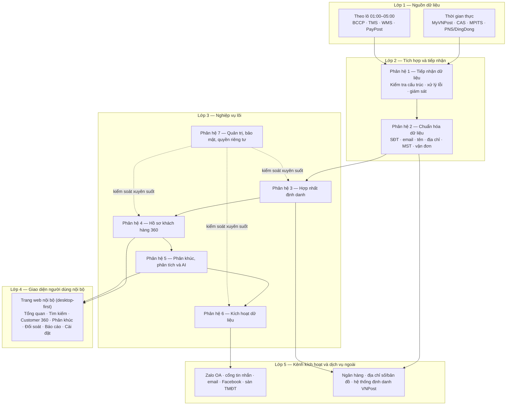
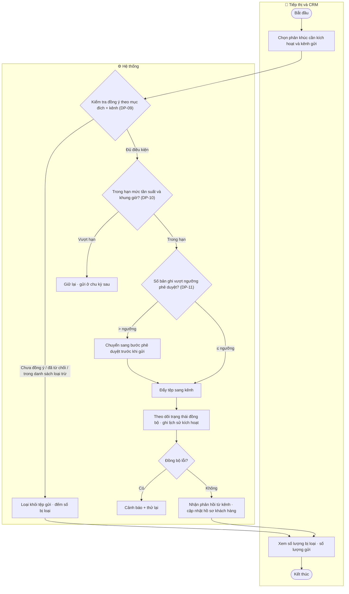
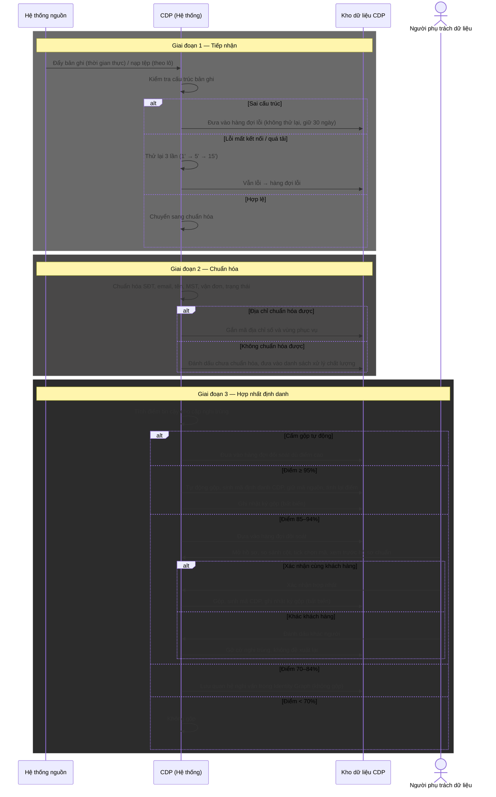
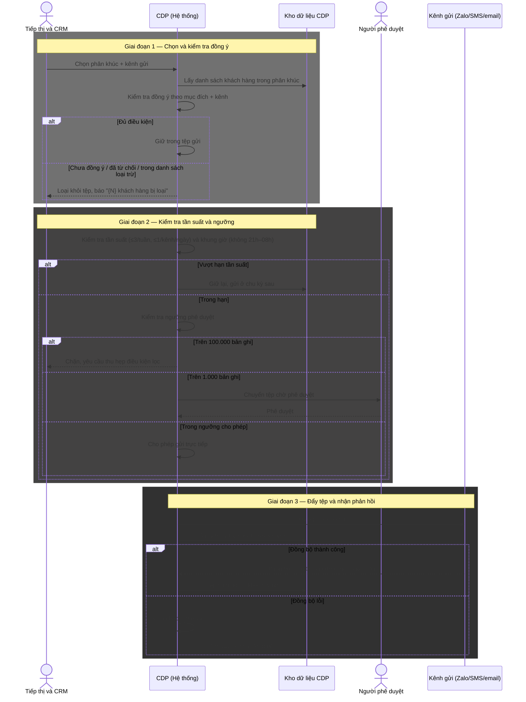

TỔNG CÔNG TY BƯU ĐIỆN VIỆT NAM (VNPost/TCT)

# TÀI LIỆU ĐẶC TẢ YÊU CẦU NGƯỜI DÙNG

## Nền tảng Dữ liệu Khách hàng — Customer Data Platform (CDP)

**Phiên bản:** v1.5 — Khung tổng thể (Mục I + Mục II) + Lô 1 (Phân hệ 3, 4) + Lô 2 (Phân hệ 1, 2)
**Địa điểm – Thời gian:** Hà Nội – Tháng 08/2026

---

## Bảng theo dõi thay đổi

| Phiên bản | Ngày | Nội dung | Người thực hiện |
|---|---|---|---|
| v1 | 08/2026 | Khởi tạo khung tổng thể: Mục I (Giới thiệu) và Mục II (Yêu cầu tổng thể) cho cả 7 phân hệ. Chưa bao gồm Mục III (Use Case), Mục IV (Giao diện), Mục C (Phi chức năng) — sẽ viết theo lô ở các vòng sau | BA |
| v1.1 | 08/2026 | Patch theo QA review — sửa 2 CRITICAL + 4 MAJOR: (CR-01) chốt MVP chỉ người gửi, người nhận Out of scope MVP theo A2, OQ-02 chuyển Out of scope P1; (CR-02) bổ sung "email dùng chung" vào danh sách cấm gộp tự động DP-05; (MA-01) tách bạch quyền Xem báo cáo gộp/tách và quyền Đề xuất tách (REQUEST_UNMERGE); (MA-02) bỏ quyền tách hồ sơ của Quản trị hệ thống; (MA-03) chú thích FR-GOV-03 là góc quản trị của cùng nhật ký FR-IDR-14; (MA-05) làm rõ 10 mã FR-IDR có tên trên 14 vị trí. 5 MINOR (MI-01→05) ghi nhận xử lý ở lô Hợp nhất định danh | BA |
| v1.2 | 08/2026 | **Lô 1** — bổ sung Mục III (Đặc tả Use Case) và Mục IV (Giao diện chức năng) cho Phân hệ 3 (Hợp nhất định danh) và Phân hệ 4 (Customer 360): 11 Use Case (UC-IDR-01→07, UC-C360-01→04), 16 Business Rule (BR-IDR-01→12, BR-C360-01→04), 7 màn giao diện (SCR-IDR-01→05, SCR-C360-01→02) bám prototype v3. Đối chiếu thẳng tài liệu gốc CDP.md 6.6–6.10, 7.4, 7.5, 8.8, 8.9: xác nhận đủ tên **14 mã FR-IDR-01→14** và **15 mã FR-C360-01→15**. Áp ngưỡng 4 vùng 95/85/70 theo gốc; đánh dấu điểm lệch prototype (ngưỡng 90/60, mô hình phê duyệt tách cũ). Đặc tả bảng che dữ liệu theo vai trò (masking) theo 6.2 + 8.8. Bổ sung màn Tách hồ sơ (SCR-IDR-05 — prototype chưa có). Thêm OQ Lô 1 vào Phụ lục | BA |
| v1.3 | 08/2026 | Patch theo QA review Lô 1 — sửa 1 CRITICAL + 5 MAJOR: (CR-01) đồng bộ mã FR giữa Mục I/II và III — cập nhật cây chức năng II.2 với đủ 14 tên FR-IDR (thêm 03/04/05/10) và 15 tên FR-C360, gỡ toàn bộ chú thích "chưa đặt tên"/`[Cần xác nhận: mã]` ở I.2.1, II.2 và diễn giải Phân hệ 3; (MA-01) sửa ghi chú UC-IDR-07 trỏ nhầm III.C360 → bảng luật gốc CDP.md 6.6.1; (MA-02) thống nhất "10 nhóm dữ liệu / 11 tab, tab Doanh nghiệp là tab điều kiện" ở UC-C360-02 và SCR-C360-02; (MA-03) thêm dòng masking "Hồ sơ liên kết/alias" vào bảng III.C360 (kèm OQ-IDR-09); (MA-04) làm rõ 3 điều kiện empty-state SCR-C360-01 để testable, đồng bộ UC-C360-01; (MA-05) thêm cột Trạng thái (đã gộp/đã tách) vào bảng định danh liên kết SCR-C360-02. Thêm OQ-IDR-09→11; ghi nhận 5 MINOR QA Lô 1 (MI-L1-01→05, gom lô sau) | BA |
| v1.4 | 08/2026 | **Lô 2** — bổ sung Mục III (Đặc tả Use Case) và Mục IV (Giao diện chức năng) cho Phân hệ 1 (Tiếp nhận, FR-ING) và Phân hệ 2 (Chuẩn hóa và xử lý dữ liệu, FR-DPS): 13 Use Case (UC-ING-01→07, UC-DPS-01→06), 24 Business Rule (BR-ING-01→10, BR-DPS-01→14), 8 màn giao diện (SCR-ING-01→03, SCR-DPS-01→05 — trong đó 2 màn từ prototype v3 là màn giám sát luồng và panel chất lượng, 6 màn CẦN BỔ SUNG). Gộp 8 chức năng chuẩn hóa trường (FR-DPS-01→08) thành 2 UC (UC-DPS-01 định danh/liên hệ + UC-DPS-02 nghiệp vụ) với BR chi tiết từng trường. Đọc thẳng CDP.md 7.2 (FR-ING-01→10), 7.3 (FR-DPS-01→14), 6.10 (nguồn ưu tiên 12 nhóm), 6.11 (bảo vệ dữ liệu định danh): **cập nhật cây chức năng II.2** — gắn đủ 10 tên FR-ING và 14 tên FR-DPS, ghi rõ tương đương mã nhóm FR-INGEST≡FR-ING, FR-STD≡FR-DPS (chỉ điền tên mã gốc, không đổi cấu trúc cây, không đụng Phân hệ 3–7). Đặc tả SCR-ING-01 bằng ngôn ngữ nghiệp vụ, ghi khối điểm lệch yêu cầu **bỏ nhãn công nghệ Kafka/topic/lag/consumer** khỏi giao diện khi triển khai (D-04). Áp các con số baseline 7.2: thử lại 3 lần 1'–5'–15', hàng đợi lỗi 30 ngày, ngưỡng cảnh báo/báo động (vàng >15'/lỗi >1%; đỏ ngừng >15'/lỗi >5%/tồn >60'), độ trễ theo nhóm, mục tiêu chất lượng 6/12 tháng. Thêm 6 OQ Lô 2 (OQ-ING-01→04, OQ-DPS-01→02) — không có OQ critical chặn. Ranh giới quyền DATA-ENG vs DATA-STEWARD để mở (OQ-ING-01), không tự quyết | BA |
| v1.5 | 08/2026 | Patch theo QA review Lô 2 — sửa 1 CRITICAL + 4 MAJOR (+2 MINOR nhanh): (CR-01) bỏ cặp số bịa "~690.000/~1.200" gắn nhãn baseline 7.2 trong BR-ING-08, thay bằng lập luận định tính đúng nguồn; rà toàn file xác nhận không còn số cụ thể gắn nhãn baseline mà baseline không có. (MA-01) **mở Mục II.3/II.4** bổ sung 2 dòng quyền "Cấu hình rule chất lượng dữ liệu" và "Cấu hình nguồn dữ liệu ưu tiên" (DATA-STEWARD=X, Quản trị=(X)); tách action **CONFIG** khỏi UPDATE ở II.4.3 khối Chất lượng dữ liệu + làm rõ định nghĩa CONFIG vs UPDATE ở II.4.2; nối traceability UC-DPS-05/06 và SCR-DPS-04/05 tới quyền CONFIG. (MA-02) thêm actor phụ **SYS-ADMIN (= IT Admin gốc)** vào UC-ING-06 với phân vai rõ vs DATA-ENG, đồng bộ II.4.3; phân biệt rõ với OQ-ING-01 (DATA-ENG vs DATA-STEWARD). (MA-03) ghi rõ nhánh 6.4 "đồng bộ sang kênh thất bại" là lỗi **outbound thuộc Phân hệ 6 (lô sau)**, không phải gap Lô 2. (MA-04) làm rõ BR-ING-05 chuyển trạng thái ngược chiều "Trong hàng đợi lỗi → (Sửa và nạp lại) → Chờ thử lại", đồng bộ SCR-ING-03 row 10 + UC-ING-04 E3. (MI-01) bỏ 2 nhãn tech lặp trong bảng SCR-ING-01 (rows 5/6/15/19 — mapping vẫn còn ở khối điểm lệch); (MI-06) ghi rõ UC-DPS-04 quan sát ở SCR-C360-02. Thêm OQ-DPS-03 (mức CONFIG của SYS-ADMIN). 4 MINOR còn lại (MI-02→05) gom lô sau | BA |

---

## Về phạm vi của phiên bản tài liệu này

Đây là **vòng khung tổng thể**. Tài liệu chỉ bao gồm:

- **Mục I — Giới thiệu** (I.1 Mục đích · I.2 Phạm vi · I.3 Thuật ngữ · I.4 Kiến trúc tổng thể)
- **Mục II — Yêu cầu tổng thể** (II.1 Workflow · II.2 Function Tree · II.3 Permission Matrix · II.4 RBAC · II.5 Sequence)

**Mục III (Đặc tả Use Case)**, **Mục IV (Giao diện chức năng)** và **Mục C (Yêu cầu phi chức năng)** sẽ được viết theo lô ở các vòng sau, thứ tự đề xuất:

1. Hợp nhất định danh + Hồ sơ khách hàng 360 (đã có giao diện, đã làm rõ nhất)
2. Tiếp nhận và chuẩn hóa dữ liệu
3. Phân khúc và phân tích
4. Kích hoạt dữ liệu
5. Quản trị, bảo mật và quyền riêng tư

**Nguồn giao diện chuẩn cho Mục IV ở các lô sau là prototype v3** (`.claude/output/cdp-tct/wireframe/prototype-v3.html` — bản chốt 24/07/2026), không phải `wireframe-v1.md`. Mọi tên màn hình được tham chiếu trong tài liệu này lấy theo prototype v3.

> **Lưu ý về giả định và câu hỏi mở:** Toàn bộ dự án hiện chưa có buổi họp chính thức với VNPost và chưa có tài liệu yêu cầu từ phía VNPost. Các nội dung trong tài liệu này được viết theo **giả định có mã** (tham chiếu GD-01→GD-09 và A1→A8). Chỗ nào phụ thuộc câu trả lời chưa có từ VNPost được đánh dấu `[Cần xác nhận: ...]` ngay tại vị trí đó, không dùng "TBD".

---

# I. GIỚI THIỆU

## I.1. Mục đích tài liệu

CDP là **nền tảng dữ liệu khách hàng tập trung** của Tổng công ty Bưu điện Việt Nam. Hệ thống làm ba việc chính:

1. **Thu thập dữ liệu khách hàng** từ toàn bộ hệ sinh thái IT của VNPost (hơn 8 luồng dữ liệu, khoảng 1,7 triệu bản ghi mỗi ngày).
2. **Hợp nhất các định danh rời rạc** của cùng một khách hàng đang nằm rải trên nhiều hệ thống nguồn thành một hồ sơ khách hàng duy nhất (hồ sơ 360).
3. **Kích hoạt lại kết quả** — đưa dữ liệu đã hợp nhất và phân tích trở về phục vụ kinh doanh, chăm sóc khách hàng, tiếp thị và vận hành.

**CDP không thay thế** các hệ thống nghiệp vụ hiện có. Nó là **lớp dữ liệu trung gian** nằm giữa các hệ thống nguồn (tạo đơn, thanh toán, quan hệ khách hàng…) và các kênh sử dụng dữ liệu. CDP không xử lý nghiệp vụ gốc (tạo vận đơn, thu tiền COD, ký hợp đồng) — những việc đó vẫn nằm ở hệ thống nguồn.

**Đối tượng sử dụng tài liệu:**

| Đối tượng | Sử dụng tài liệu để |
|---|---|
| Lập trình viên (Dev) | Hiểu phạm vi chức năng, luồng nghiệp vụ, quy tắc để triển khai |
| Kiểm thử viên (Tester) | Lập kế hoạch kiểm thử, viết ca kiểm thử theo luồng và điều kiện |
| Kiến trúc sư giải pháp (SA) | Nắm bối cảnh nghiệp vụ, ranh giới hệ thống, các điểm tích hợp |
| Chủ sản phẩm (PO), nghiệp vụ VNPost | Xác nhận phạm vi, giả định và quyết định các câu hỏi mở |

**Vai trò trong vòng đời dự án:** Tài liệu là đặc tả yêu cầu người dùng (URD/SRS) — cầu nối giữa yêu cầu nghiệp vụ và bản triển khai kỹ thuật. Mức chi tiết hướng tới **Dev/Test-ready**: đọc xong có thể lập trình và viết ca kiểm thử mà không cần hỏi lại người phân tích, trừ các điểm còn đánh dấu `[Cần xác nhận: ...]`.

## I.2. Phạm vi tài liệu

### I.2.1. Phạm vi chức năng — 7 phân hệ

Tài liệu bao phủ **toàn bộ 7 phân hệ** của CDP, khoảng **99 mã yêu cầu chức năng**:

| # | Phân hệ | Nhóm mã yêu cầu | Nội dung chính |
|---|---|---|---|
| 1 | Tiếp nhận dữ liệu | FR-ING (≡ FR-INGEST) | Tiếp nhận dữ liệu thời gian thực và theo lô; kiểm tra cấu trúc; xử lý lỗi và thử lại; giám sát luồng |
| 2 | Chuẩn hóa và xử lý dữ liệu | FR-DPS (≡ FR-STD) | Chuẩn hóa số điện thoại, email, họ tên, địa chỉ, mã số thuế, mã vận đơn, trạng thái; theo dõi chất lượng dữ liệu |
| 3 | Hợp nhất định danh | FR-IDR | Tính điểm tin cậy; đối sánh; gộp và tách hồ sơ; sơ đồ liên kết định danh; nhật ký gộp/tách |
| 4 | Quản lý hồ sơ khách hàng 360 | FR-C360 | Tra cứu; hồ sơ hợp nhất 10 nhóm dữ liệu; hiển thị theo phân quyền; ghi chú và gắn nhãn |
| 5 | Phân khúc, phân tích và trí tuệ nhân tạo | FR-SEG / FR-ANALYTICS | Phân khúc động; chấm điểm; cảnh báo rủi ro; phân tích theo mô hình gần đây/tần suất/giá trị; dự báo rời bỏ |
| 6 | Kích hoạt dữ liệu | FR-ACT | Kiểm tra đồng ý; kiểm tra tần suất và khung giờ; phê duyệt theo ngưỡng; đẩy sang kênh; nhận phản hồi |
| 7 | Quản trị, bảo mật và quyền riêng tư | FR-GOV | Quản lý tài khoản, vai trò, phạm vi; nhật ký bất biến; quản lý đồng ý; xử lý yêu cầu chủ thể dữ liệu; báo cáo tuân thủ |

> **Về mã yêu cầu chi tiết:** Bốn phân hệ đã đặc tả chi tiết đều có **đủ tên mã theo tài liệu gốc `CDP.md`**: Lô 1 — **14 mã FR-IDR-01→14** (mục 7.4) và **15 mã FR-C360-01→15** (mục 7.5); Lô 2 — **10 mã FR-ING-01→10** (mục 7.2) và **14 mã FR-DPS-01→14** (mục 7.3). Xem cây chức năng đầy đủ ở Mục II.2 và danh mục ánh xạ ở Mục III.0 / III.3.0 / III.4.0.
>
> **Lưu ý mã nhóm:** tài liệu này dùng mã gốc CDP.md là **FR-ING** (Phân hệ 1) và **FR-DPS** (Phân hệ 2). Các mã nhóm cũ **FR-INGEST** và **FR-STD** từng dùng ở phiên bản khung là tương đương: **FR-INGEST ≡ FR-ING**, **FR-STD ≡ FR-DPS**. Từ v1.4, mọi tham chiếu chi tiết dùng FR-ING/FR-DPS.
>
> Ba phân hệ còn lại (Phân tích FR-ANA/FR-SEG, Kích hoạt FR-ACT, Quản trị FR-GOV) cũng có bảng mã gốc trong `CDP.md` (mục 7.6…); tên và số hiệu chi tiết của từng mã sẽ được đưa vào cây chức năng khi làm chi tiết theo lô tương ứng.

### I.2.2. Ranh giới hệ thống

| Nội dung | Ranh giới |
|---|---|
| **Đăng nhập và xác thực** | CDP **nhận danh tính** từ cổng đăng nhập chung của tổ chức (mã nhân sự đã cấp quyền hoặc đăng nhập một lần nội bộ). CDP **không tự quản lý** tài khoản, mật khẩu, và **không có màn hình đăng nhập riêng** (GD-08) |
| **Khách hàng cuối** | **Không truy cập CDP.** Không có màn hình nào dành cho khách hàng của VNPost. CDP là công cụ nội bộ |
| **Trạng thái đồng ý dữ liệu** | CDP **chỉ nhận** trạng thái đồng ý từ nguồn: ứng dụng MyVNPost, website, quầy giao dịch, hệ thống quan hệ khách hàng. CDP **không tự thu** đồng ý từ khách hàng |
| **Yêu cầu xem/xóa dữ liệu của khách hàng** | Đến qua **bộ phận chăm sóc khách hàng tiếp nhận** rồi nhập vào CDP. **Không có kênh tự phục vụ** cho khách hàng |
| **Thiết bị truy cập** | Trang web độc lập trên trình duyệt. Mở được trên điện thoại qua đường dẫn, nhưng **tối ưu hiển thị cho điện thoại chưa phải ưu tiên giai đoạn này** — làm cho máy tính trước (GD-09) |

### I.2.3. Năng lực theo mức ưu tiên

CDP triển khai theo bốn giai đoạn ưu tiên. Bảng dưới giúp Dev/Tester nắm được đâu là năng lực cốt lõi cần có trước.

| Mức | Giai đoạn | Năng lực |
|---|---|---|
| **P0** | Thử nghiệm | Tiếp nhận thời gian thực và theo lô · chuẩn hóa số điện thoại, họ tên, địa chỉ · hợp nhất định danh với sơ đồ liên kết · hồ sơ 360 cơ bản · quản lý đồng ý · phân quyền theo vai trò · nhật ký thao tác · bảng theo dõi chất lượng dữ liệu |
| **P1** | Mở rộng nghiệp vụ | Phân khúc động · đồng bộ sang hệ thống quan hệ khách hàng · kích hoạt kênh tiếp thị · lịch sử thu hộ và thanh toán · lịch sử khiếu nại · phân tích rủi ro thu hộ và hoàn hàng · danh sách loại trừ · xử lý yêu cầu của khách hàng |
| **P2** | Nâng cao | Phân tích theo mô hình gần đây/tần suất/giá trị · giá trị vòng đời khách hàng · dự báo nguy cơ rời bỏ · chấm điểm khách hàng · phát hiện gian lận · gợi ý dịch vụ · danh mục dữ liệu và truy vết dòng dữ liệu · kiểm soát theo mục đích sử dụng · phân quyền theo đơn vị và địa bàn · báo cáo tuân thủ |

### I.2.4. Ngoài phạm vi tài liệu

- Xác thực và quản lý tài khoản (do cổng đăng nhập chung của tổ chức đảm nhận — xem I.2.2).
- Nghiệp vụ gốc của các hệ thống nguồn (tạo vận đơn, thu tiền COD, ký hợp đồng…).
- Chi tiết kỹ thuật của tầng dữ liệu và tích hợp (mô hình dữ liệu vật lý, endpoint API, hạ tầng) — thuộc phạm vi SA/Dev.
- Màn hình dành cho khách hàng cuối (không tồn tại — xem I.2.2).
- Hồ sơ khách hàng độc lập cho người nhận — MVP không tạo customer profile riêng cho người nhận; người nhận chỉ được ghi nhận ở tầng giao dịch của người gửi. Xem xét lại ở giai đoạn P1 (OQ-02).

## I.3. Định nghĩa thuật ngữ và từ viết tắt

| STT | Thuật ngữ | Diễn giải |
|---|---|---|
| 1 | **CDP** (Customer Data Platform) | Nền tảng dữ liệu khách hàng — lớp dữ liệu trung gian thu thập, hợp nhất và kích hoạt dữ liệu khách hàng |
| 2 | **Hồ sơ 360** (Customer 360) | Hồ sơ khách hàng hợp nhất, gom toàn bộ thông tin của một khách hàng từ nhiều hệ thống nguồn về một chỗ, gồm 10 nhóm dữ liệu (định danh, mã liên kết, địa chỉ, doanh nghiệp, hoạt động dịch vụ, hành vi số, chăm sóc khách hàng, điểm số/phân khúc, đồng ý, nhật ký nguồn) |
| 3 | **Hợp nhất định danh** (Identity Resolution) | Quá trình nhận diện các mã định danh khác nhau ở nhiều hệ thống thực chất là cùng một khách hàng, rồi gộp lại thành một hồ sơ chuẩn |
| 4 | **Sơ đồ liên kết định danh** (Identity Graph) | Cấu trúc lưu quan hệ giữa các mã định danh của cùng một khách hàng — gồm cả quan hệ đã gộp và quan hệ nghi vấn chưa gộp |
| 5 | **Điểm tin cậy** (Confidence Score) | Điểm từ 0–100% thể hiện mức độ chắc chắn hai bản ghi là cùng một khách hàng. Quyết định hành vi gộp theo 4 vùng (mục 8 bảng này) |
| 6 | **Bốn vùng tin cậy** | Từ 95% trở lên: tự động gộp · 85–94%: chờ người xác nhận · 70–84%: lưu quan hệ nghi vấn, không gộp · dưới 70%: không gộp |
| 7 | **Hồ sơ chuẩn** | Hồ sơ khách hàng sau khi hợp nhất, mang một mã định danh CDP duy nhất, được các hệ thống khác dùng làm bản gốc |
| 8 | **Mã định danh CDP** | Mã duy nhất hệ thống sinh ra cho mỗi hồ sơ chuẩn sau khi hợp nhất |
| 9 | **Mã nguồn** (Source ID) | Mã định danh khách hàng ở một hệ thống nguồn cụ thể (ví dụ: mã khách hàng CRM, PostID, mã KHL) |
| 10 | **Mã thay thế** (Alternate ID) | Mã nguồn cũ được giữ lại sau khi gộp, để truy vết và đồng bộ ngược. **Mã nguồn không bao giờ bị xóa** sau khi gộp |
| 11 | **Gộp hồ sơ** (Merge) | Thao tác hợp nhất nhiều mã định danh vào một hồ sơ chuẩn |
| 12 | **Tách hồ sơ** (Unmerge) | Thao tác tách một hoặc nhiều mã nguồn ra khỏi hồ sơ chuẩn khi phát hiện gộp nhầm |
| 13 | **Hàng đợi đối soát** | Danh sách các cặp hồ sơ nghi trùng (vùng 85–94%) chờ người phụ trách dữ liệu xác nhận gộp hay không |
| 14 | **Đồng ý theo mục đích và kênh** (Consent by purpose & channel) | Đồng ý của khách hàng được xét riêng cho **từng mục đích** (vận hành, tiếp thị, phân tích) và **từng kênh** (SMS, Zalo, email…). Đồng ý cho vận hành không tự động dùng được cho tiếp thị |
| 15 | **Danh sách loại trừ** | Danh sách khách hàng bị loại khỏi mọi tệp kích hoạt tiếp thị bất kể trạng thái đồng ý |
| 16 | **Phân khúc động** (Dynamic Segment) | Nhóm khách hàng thỏa một bộ điều kiện, **tự cập nhật** khi dữ liệu khách hàng thay đổi (khác phân khúc tĩnh — chốt danh sách một lần) |
| 17 | **Kích hoạt dữ liệu** (Activation) | Đưa một phân khúc sang kênh giao tiếp cụ thể (SMS, Zalo, email…) để chạy chiến dịch, sau khi đã kiểm tra đồng ý, tần suất và ngưỡng phê duyệt |
| 18 | **Nhật ký bất biến** (Immutable Log) | Nhật ký chỉ được **ghi thêm**, không sửa, không xóa — dùng cho gộp/tách hồ sơ và thay đổi đồng ý, phục vụ giải trình |
| 19 | **Nguồn ưu tiên** | Quy tắc chọn giá trị khi nhiều hệ thống nguồn cung cấp cùng một trường dữ liệu nhưng giá trị khác nhau |
| 20 | **Số dùng chung** | Số điện thoại được nhiều người dùng chung (ví dụ tổng đài, số doanh nghiệp) — **không dùng làm khóa gộp tự động** |
| 21 | **KHL** (Khách hàng lớn) | Khách hàng doanh nghiệp có hợp đồng với VNPost, thường là doanh nghiệp thương mại điện tử |
| 22 | **COD** (Cash on Delivery) | Thu hộ tiền hàng khi giao — chiếm 70–80% giao dịch thương mại điện tử tại Việt Nam. Dữ liệu COD là dữ liệu tài chính nhạy cảm |
| 23 | **Điểm rủi ro COD / thu hộ** | Điểm đánh giá nguy cơ một giao dịch COD không thu được tiền hoặc bị hoàn |
| 24 | **CLV** (Customer Lifetime Value) | Giá trị vòng đời khách hàng — ước lượng tổng giá trị một khách hàng mang lại |
| 25 | **Người gửi** (Shipper) | Khách hàng gửi hàng — cá nhân hoặc doanh nghiệp. Thường có tài khoản VNPost |
| 26 | **Người nhận** (Consignee) | Đầu nhận của bưu gửi — thường không có tài khoản VNPost. **Giai đoạn MVP, CDP không xây hồ sơ độc lập cho người nhận** (theo A2): người nhận chỉ xuất hiện như thuộc tính trên giao dịch của người gửi, không tạo customer profile riêng. Xem xét lại ở giai đoạn P1 (OQ-02) |
| 27 | **MyVNPost** | Ứng dụng khách hàng của VNPost — nguồn dữ liệu hành vi số, tạo đơn (nhóm thời gian thực) |
| 28 | **CAS** | Hệ thống chấp nhận gửi / cổng khách hàng lớn — nguồn dữ liệu giao dịch và định danh KHL |
| 29 | **MPITS** | Nền tảng tích hợp trung tâm, đã kết nối API với sàn thương mại điện tử — ứng viên làm cổng dữ liệu cho CDP (phụ thuộc OQ-04) |
| 30 | **PNS/DingDong** | Hệ thống phát và ứng dụng bưu tá — nguồn dữ liệu trạng thái phát (nhóm thời gian thực) |
| 31 | **BCCP** | Hệ thống khai thác bưu chính — nguồn dữ liệu theo lô (hệ thống cũ) |
| 32 | **TMS** (Transport Management System) | Hệ thống quản lý vận tải — nguồn dữ liệu theo lô (hệ thống cũ) |
| 33 | **WMS** (Warehouse Management System) | Hệ thống quản lý kho — nguồn dữ liệu theo lô (hệ thống cũ) |
| 34 | **PayPost** | Hệ thống thanh toán — nguồn dữ liệu thu hộ và đối soát tài chính (theo lô, sau khi chốt sổ) |
| 35 | **PostID** | Hệ thống định danh người dùng của VNPost. Độ phủ khách hàng phụ thuộc OQ-03 |
| 36 | **Nghị định 13/2023/NĐ-CP** | Nghị định về bảo vệ dữ liệu cá nhân, áp dụng bắt buộc. Yêu cầu CDP có quản lý đồng ý, quyền được lãng quên, và nhật ký kiểm toán từ ngày đầu |
| 37 | **Quyền chủ thể dữ liệu** | Quyền của khách hàng: xem, chỉnh sửa, rút đồng ý, ngừng xử lý, xóa/ẩn danh, yêu cầu giải thích |
| 38 | **Che dữ liệu** (Masking) | Ẩn một phần hoặc toàn bộ giá trị nhạy cảm theo phân quyền vai trò (ví dụ: `090***123`) |

## I.4. Kiến trúc tổng thể hệ thống

CDP tổ chức theo **năm lớp** ở mức nghiệp vụ: từ nguồn dữ liệu đầu vào, qua lớp tích hợp, đến lớp nghiệp vụ (7 phân hệ), lên lớp giao diện người dùng nội bộ, và ra các kênh kích hoạt / dịch vụ ngoài.



**Diễn giải từng lớp:**

**Lớp 1 — Nguồn dữ liệu.** Cung cấp dữ liệu khách hàng cho CDP. Chia hai nhóm theo độ trễ:
- **Thời gian thực:** MyVNPost, CAS, MPITS, PNS/DingDong — đẩy sự kiện ngay khi phát sinh (mục tiêu độ trễ ≤ 5 phút cho hành vi số và tạo đơn; ≤ 15 phút cho trạng thái phát và thu hộ).
- **Theo lô:** BCCP, TMS, WMS, PayPost — xuất dữ liệu một lần mỗi ngày trong khung 01:00–05:00; riêng đối soát thu hộ chạy sau khi hệ thống thanh toán chốt sổ.

> **[Cần xác nhận: MPITS làm cổng dữ liệu chung hay tích hợp riêng lẻ]** (OQ-04) — Nếu MPITS mở kết nối và tổng hợp sẵn dữ liệu từ các hệ thống con, CDP lấy dữ liệu từ một cổng thay vì tích hợp từng hệ thống. Nếu không, phải tích hợp riêng lẻ từng nguồn, khối lượng và thời gian tăng nhiều lần. Cách tích hợp cụ thể (giao thức, endpoint) thuộc phạm vi SA/Dev.

**Lớp 2 — Tích hợp và tiếp nhận.** Gồm Phân hệ 1 (tiếp nhận, kiểm tra cấu trúc bản ghi, xử lý lỗi và thử lại, giám sát luồng) và Phân hệ 2 (chuẩn hóa số điện thoại, email, họ tên, địa chỉ, mã số thuế, mã vận đơn, trạng thái bưu gửi và thu hộ về bộ chuẩn). Đầu ra là các bản ghi đạt chuẩn chuyển sang bước hợp nhất định danh.

**Lớp 3 — Nghiệp vụ lõi.** Năm phân hệ trung tâm:
- **Hợp nhất định danh (Phân hệ 3):** tính điểm tin cậy, đối sánh, gộp/tách hồ sơ, sinh mã định danh CDP, giữ mã nguồn làm mã thay thế.
- **Hồ sơ khách hàng 360 (Phân hệ 4):** tra cứu và hiển thị hồ sơ hợp nhất 10 nhóm dữ liệu, che dữ liệu theo phân quyền.
- **Phân khúc, phân tích và AI (Phân hệ 5):** tạo và quản lý phân khúc động, chấm điểm khách hàng, cảnh báo rủi ro.
- **Kích hoạt dữ liệu (Phân hệ 6):** kiểm tra đồng ý theo mục đích và kênh, kiểm tra tần suất và ngưỡng phê duyệt, đẩy tệp sang kênh, nhận phản hồi.
- **Quản trị, bảo mật và quyền riêng tư (Phân hệ 7):** quản lý tài khoản/vai trò/phạm vi, nhật ký bất biến, quản lý đồng ý, xử lý yêu cầu chủ thể dữ liệu, báo cáo tuân thủ. Lớp này **kiểm soát xuyên suốt** các phân hệ khác (đường nét đứt trong sơ đồ).

**Lớp 4 — Giao diện người dùng nội bộ.** Trang web nội bộ, tối ưu cho máy tính (desktop-first). Các nhóm màn hình: Tổng quan, Tìm kiếm khách hàng, Customer 360, Phân khúc, Đối soát định danh, Báo cáo, Cài đặt. Chỉ người dùng nội bộ đã được cổng đăng nhập chung cấp quyền mới truy cập.

> Tên và đặc tả chi tiết từng màn hình sẽ được viết ở Mục IV theo lô sau, **bám theo prototype v3** (bản chốt 24/07/2026).

**Lớp 5 — Kênh kích hoạt và dịch vụ ngoài.**
- **Kênh kích hoạt (đầu ra):** Zalo OA, cổng tin nhắn, email, Facebook, sàn thương mại điện tử — nơi CDP đẩy tệp khách hàng để chạy chiến dịch.
- **Dịch vụ ngoài (hỗ trợ xử lý):** ngân hàng (đối soát thu hộ), hệ thống địa chỉ số và bản đồ (chuẩn hóa địa chỉ), hệ thống định danh người dùng VNPost.

> **[Cần xác nhận: kênh kích hoạt thực tế VNPost đang dùng]** (liên quan M3 clarification) — Chưa xác nhận VNPost đang dùng những kênh nào (SMS, Zalo OA, email, push MyVNPost) và có sẵn công cụ Marketing Automation nào. Danh sách kênh trên lấy theo mục 8 baseline; cần VNPost xác nhận để chốt phạm vi tích hợp Phân hệ 6.

---

# II. CÁC YÊU CẦU VỀ TỔNG THỂ PHẦN MỀM

## II.1. Sơ đồ quy trình nghiệp vụ (Workflow Diagram)

**Danh sách quy trình** (8 luồng nghiệp vụ chính):

1. Tiếp nhận và chuẩn hóa dữ liệu
2. Hợp nhất định danh (gộp và tách hồ sơ)
3. Tra cứu hồ sơ khách hàng 360
4. Tạo và quản lý phân khúc
5. Chấm điểm và cảnh báo rủi ro
6. Kích hoạt dữ liệu
7. Xử lý yêu cầu của khách hàng
8. Quản trị và tuân thủ

---

### Quy trình 1: Tiếp nhận và chuẩn hóa dữ liệu

**Swimlane Diagram:**


**Diễn giải luồng quy trình:**

| Bước | Tác nhân | Mô tả |
|---|---|---|
| 1 | Hệ thống nguồn | Phát sinh dữ liệu — nhóm thời gian thực đẩy sự kiện ngay; nhóm hệ thống cũ xuất theo lô 01:00–05:00 |
| 1.1 | Hệ thống | Tiếp nhận và kiểm tra cấu trúc bản ghi: trường bắt buộc, kiểu dữ liệu, phiên bản cấu trúc |
| **Trường hợp sai cấu trúc (DP-01)** | Hệ thống | Đưa bản ghi vào hàng đợi lỗi ngay, **không thử lại**; giữ 30 ngày rồi chuyển lưu trữ |
| **Trường hợp lỗi mất kết nối/quá tải (DP-02)** | Hệ thống | Thử lại 3 lần theo nhịp 1 phút → 5 phút → 15 phút; vẫn lỗi thì vào hàng đợi lỗi |
| 2 | Hệ thống | Chuẩn hóa bản ghi đạt cấu trúc: số điện thoại về một dạng, email về chữ thường, họ tên bỏ khoảng trắng thừa và xử lý dấu, mã số thuế kiểm tra độ dài, mã vận đơn chuẩn hóa chữ hoa, trạng thái bưu gửi và thu hộ ánh xạ về bộ chuẩn |
| 2.1 | Hệ thống | Bóc tách địa chỉ theo cấp hành chính và ánh xạ mã địa chỉ số |
| **Trường hợp địa chỉ không chuẩn hóa được (DP-03)** | Hệ thống | Đánh dấu chưa chuẩn hóa, đưa vào danh sách xử lý chất lượng dữ liệu |
| 3 | Hệ thống | Bản ghi đạt chuẩn chuyển sang bước so khớp định danh (Quy trình 2) |
| 4 | Kỹ sư dữ liệu / Người phụ trách dữ liệu | Theo dõi tình trạng luồng trên bảng giám sát; xem, sửa hoặc trả bản ghi lỗi về nguồn |
| **Cảnh báo luồng** | Hệ thống | Cảnh báo khi tồn đọng cần hơn 15 phút xử lý hoặc tỷ lệ lỗi vượt 1%/giờ; báo động khi nguồn ngừng đẩy quá 15 phút trong khung giờ hoạt động, tỷ lệ lỗi vượt 5%/giờ, hoặc tồn đọng cần hơn 60 phút |

---

### Quy trình 2: Hợp nhất định danh (gộp và tách hồ sơ)

**Swimlane Diagram:**


**Diễn giải luồng quy trình:**

| Bước | Tác nhân | Mô tả |
|---|---|---|
| 1 | Hệ thống | Tính điểm tin cậy cho từng cặp bản ghi nghi trùng theo bộ luật đối sánh tuyệt đối và tín hiệu hỗ trợ |
| **Nhánh cấm gộp tự động (DP-05)** | Hệ thống | Nếu chỉ trùng mã vận đơn / địa chỉ / địa chỉ mạng / thiết bị, hoặc số điện thoại dùng chung, hoặc **email dùng chung / email doanh nghiệp**, hoặc người gửi–người nhận chỉ trùng một thông tin phụ, hoặc thiếu đồng ý cho mục đích kích hoạt → đưa vào hàng đợi đối soát dù điểm cao |
| **Nhánh vùng tin cậy (DP-04)** | Hệ thống | Từ 95%: tự động gộp · 85–94%: vào hàng đợi đối soát · 70–84%: lưu quan hệ nghi vấn (không gộp, không vào hàng đợi) · dưới 70%: không gộp |
| 2 | Người phụ trách dữ liệu | Mở hồ sơ trong hàng đợi, xem bảng so sánh từng cột giữa các mã nguồn |
| 2.1 | Người phụ trách dữ liệu | Tick chọn mã thuộc cùng khách hàng, xem trước hồ sơ chuẩn dự kiến |
| 2.2 | Người phụ trách dữ liệu | Xác nhận hợp nhất, **hoặc** đánh dấu là các khách hàng khác nhau (DP-06) |
| 2.3 | Hệ thống | Khi gộp: sinh mã định danh CDP, giữ toàn bộ mã nguồn cũ làm mã thay thế, tính lại điểm số, ghi nhật ký gộp bất biến |
| 3 | Người phụ trách dữ liệu | Khi phát hiện gộp nhầm: chọn mã nguồn cần tách, xem trước kết quả tách, chọn 1 trong 6 trường hợp tách, **điền lý do bắt buộc**, xác nhận |
| 3.1 | Hệ thống | Tách hồ sơ, trả lại mã nguồn tương ứng, phân chia lại dữ liệu và điểm số về đúng hồ sơ gốc, **không làm mất lịch sử vận đơn**, ghi nhật ký tách. **Nhật ký gộp gốc được giữ nguyên** |
| **Trường hợp hai người cùng xử lý một hồ sơ** | Hệ thống | Ai bấm trước người đó thắng. Không khóa hồ sơ. Người sau nhận thông báo ngay trên màn hình, danh sách được làm mới |
| **Trường hợp tách một mã giữa chuỗi gộp nhiều lần** | Hệ thống | Cảnh báo chuỗi gộp phức tạp, **không cho tách trực tiếp**, ghi vào danh sách chờ xử lý riêng (giai đoạn sau) |
| **Trường hợp vai trò không có quyền tách** | Chăm sóc khách hàng / Kinh doanh / Vận hành | Bấm nút **Báo cáo** kèm lý do; người phụ trách dữ liệu xem và tự quyết định có tách hay không |

> **[Cần xác nhận: khóa gộp khi PostID chưa phủ đủ]** (OQ-03, A3) — Nếu PostID chưa phủ toàn bộ khách hàng, số điện thoại (đã chuẩn hóa, không thuộc danh sách dùng chung) là khóa ghép nối chính. Cần VNPost xác nhận độ phủ PostID và trường hợp cùng số điện thoại nhưng là hai khách hàng khác nhau.

---

### Quy trình 3: Tra cứu hồ sơ khách hàng 360

**Swimlane Diagram:**


**Diễn giải luồng quy trình:**

| Bước | Tác nhân | Mô tả |
|---|---|---|
| 1 | Người dùng | Tìm khách hàng theo một trong: số điện thoại, email, mã khách hàng, mã KHL, mã định danh VNPost (PostID), mã vận đơn, mã số thuế |
| 1.1 | Hệ thống | Trả danh sách kết quả; dữ liệu nhạy cảm đã che theo vai trò người tìm |
| 2 | Người dùng | Mở một khách hàng để xem hồ sơ đầy đủ (định danh, mã liên kết, địa chỉ, doanh nghiệp, hoạt động dịch vụ, hành vi số, chăm sóc khách hàng, điểm số/phân khúc, đồng ý, nhật ký nguồn) |
| 2.1 | Hệ thống (DP-07) | Mỗi nhóm dữ liệu hiển thị theo đúng quyền vai trò; nhóm không được xem thì ẩn hoặc che, không hiện dữ liệu rỗng gây hiểu nhầm |
| 3 | Người dùng | Người có quyền xem được nguồn phát sinh của từng nhóm dữ liệu và so sánh giá trị giữa các hệ thống nguồn |
| 4 | Người dùng | Người có quyền ghi chú hoặc gắn nhãn khách hàng cần chăm sóc đặc biệt |
| **Trường hợp không đủ quyền xem một nhóm** | Hệ thống | Hiển thị: "Bạn không có quyền xem thông tin này. Liên hệ quản trị hệ thống nếu công việc của bạn cần dùng đến." |
| **Trường hợp không có kết quả** | Hệ thống | Hiển thị: "Không tìm thấy khách hàng nào khớp điều kiện lọc." |

---

### Quy trình 4: Tạo và quản lý phân khúc

**Swimlane Diagram:**


**Diễn giải luồng quy trình:**

| Bước | Tác nhân | Mô tả |
|---|---|---|
| 1 | Tiếp thị và CRM | Mở danh sách phân khúc, xem các phân khúc đang có kèm số khách hàng khớp |
| 2 | Tiếp thị và CRM | Tạo phân khúc mới: đặt tên, mô tả, thêm điều kiện theo trường dữ liệu |
| 2.1 | Hệ thống | Điều kiện hỗ trợ lồng nhiều tầng với phép và/hoặc/phủ định trên thuộc tính hồ sơ, hành vi, giao dịch, thu hộ, địa bàn, tỷ lệ hoàn, khiếu nại |
| 2.2 | Hệ thống | Ước lượng số khách hàng khớp ngay khi người dùng sửa điều kiện |
| 3 | Tiếp thị và CRM | Lưu phân khúc |
| 3.1 | Hệ thống | Phân khúc động tự cập nhật khi dữ liệu khách hàng thay đổi |
| **Trường hợp sửa phân khúc đang chạy chiến dịch (DP-08)** | Hệ thống | Cảnh báo và liệt kê các chiến dịch bị ảnh hưởng; người dùng xác nhận thì phân khúc cập nhật theo điều kiện mới |

---

### Quy trình 5: Chấm điểm và cảnh báo rủi ro

**Swimlane Diagram:**


**Diễn giải luồng quy trình:**

| Bước | Tác nhân | Mô tả |
|---|---|---|
| 1 | Hệ thống | Tính định kỳ các điểm cho từng khách hàng: mức độ tương tác, CLV, nguy cơ rời bỏ, rủi ro thu hộ, rủi ro gian lận, chất lượng dịch vụ |
| 1.1 | Hệ thống | Ghi kết quả vào hồ sơ và hiển thị theo quyền của từng vai trò (điểm rủi ro thu hộ và gian lận ẩn với CSKH và Tiếp thị) |
| 2 | Hệ thống | Khi điểm vượt ngưỡng cảnh báo: đưa khách hàng vào phân khúc tương ứng và phát cảnh báo qua thông báo trong ứng dụng và email |
| 3 | Bộ phận nhận cảnh báo | Mở hồ sơ xem căn cứ, ghi nhận hành động xử lý |

---

### Quy trình 6: Kích hoạt dữ liệu

**Swimlane Diagram:**



**Diễn giải luồng quy trình:**

| Bước | Tác nhân | Mô tả |
|---|---|---|
| 1 | Tiếp thị và CRM | Chọn phân khúc cần kích hoạt và kênh gửi |
| 1.1 | Hệ thống (DP-09) | Kiểm tra đồng ý cho từng khách hàng theo đúng mục đích và đúng kênh |
| **Trường hợp bị loại** | Hệ thống | Khách hàng chưa đồng ý, đã từ chối, hoặc trong danh sách loại trừ bị loại khỏi tệp; báo số lượng bị loại: "{N} khách hàng trong phân khúc chưa đồng ý nhận {kênh}. Hệ thống đã loại khỏi tệp gửi." |
| **Trường hợp toàn bộ bị loại** | Hệ thống | "Không có khách hàng nào trong phân khúc này đủ điều kiện nhận {kênh}. Tệp gửi trống." |
| 1.2 | Hệ thống (DP-10) | Kiểm tra hạn mức tần suất (≤ 3 tin/khách hàng/tuần mọi kênh; ≤ 1 tin/kênh/ngày) và khung giờ (không gửi tiếp thị 21:00–08:00). Vượt hạn thì giữ lại, gửi ở chu kỳ sau |
| 1.3 | Hệ thống (DP-11) | Kiểm tra ngưỡng phê duyệt: trên 1.000 bản ghi cần phê duyệt; trên 100.000 chặn, yêu cầu thu hẹp |
| 2 | Hệ thống | Đẩy tệp sang kênh; theo dõi trạng thái đồng bộ; ghi lịch sử kích hoạt (lưu 3 năm) |
| **Trường hợp đồng bộ lỗi** | Hệ thống | Thử lại theo cơ chế tiếp nhận; cảnh báo cho quản trị; ghi vào lịch sử đồng bộ |
| 3 | Hệ thống | Nhận phản hồi từ kênh (gửi thành công, mở, phản hồi) và cập nhật lại hồ sơ khách hàng |
| **Trường hợp khách hàng rút đồng ý khi tệp đã đẩy** | Hệ thống | Chặn ngay khi tạo tệp tiếp theo; đẩy trạng thái rút đồng ý sang kênh trong 24 giờ để kênh loại khỏi hàng chờ chưa gửi. Tin đã gửi thì ghi nhận vào lịch sử, không thu hồi |

---

### Quy trình 7: Xử lý yêu cầu của khách hàng

**Swimlane Diagram:**


**Diễn giải luồng quy trình:**

| Bước | Tác nhân | Mô tả |
|---|---|---|
| 1 | Khách hàng | Gửi yêu cầu qua ứng dụng, website, bưu cục, tổng đài hoặc CSKH (không có kênh tự phục vụ vào CDP — xem I.2.2) |
| 2 | CSKH tiếp nhận | Xác thực danh tính người yêu cầu để tránh trả dữ liệu cho sai người |
| **Trường hợp không xác thực được (DP-12)** | CSKH tiếp nhận | Từ chối, ghi lý do |
| 3 | CSKH tiếp nhận | Phân loại yêu cầu: xem dữ liệu, chỉnh sửa, rút đồng ý, ngừng xử lý, xóa/ẩn danh, yêu cầu giải thích |
| 4 | Người phụ trách dữ liệu | Kiểm tra phạm vi dữ liệu trong CDP và các hệ thống nguồn liên quan |
| 5 | Người phụ trách dữ liệu | Xử lý trong CDP, hoặc chuyển yêu cầu sang hệ thống nguồn nếu dữ liệu gốc nằm ở đó |
| 5.1 | Hệ thống | Cập nhật trạng thái, ghi nhật ký, thông báo kết quả cho khách hàng |
| 5.2 | Hệ thống | Đồng bộ thay đổi sang các hệ thống nhận dữ liệu nếu ảnh hưởng tới đồng ý hoặc kích hoạt |
| **Cảnh báo thời hạn** | Hệ thống | Cảnh báo khi còn một phần ba thời hạn nội bộ; báo lên quản lý ngay khi quá hạn nội bộ (rút đồng ý mục tiêu 4 giờ làm việc; xem/sửa 7 ngày; ngừng xử lý 10 ngày; xóa/ẩn danh 15 ngày) |

---

### Quy trình 8: Quản trị và tuân thủ

**Swimlane Diagram:**


**Diễn giải luồng quy trình:**

| Bước | Tác nhân | Mô tả |
|---|---|---|
| 1 | Quản trị hệ thống | Tạo tài khoản, gán vai trò và phạm vi dữ liệu theo đơn vị, địa bàn, nhóm khách hàng phụ trách |
| 2 | Quản trị hệ thống | Cấp quyền đặc biệt có thời hạn; hệ thống tự cho hết hạn khi đến hạn |
| 2.1 | Hệ thống | Ghi nhật ký không thể xóa cho mọi thao tác quan trọng (danh sách trong sơ đồ) |
| 3 | Hệ thống (DP tương ứng ngưỡng xuất) | Xuất dữ liệu vượt ngưỡng phải qua phê duyệt: 1.001–10.000 duyệt bởi quản lý trực tiếp; trên 10.000 duyệt bởi quản trị dữ liệu và tuân thủ; trần cứng 100.000/lần không cho vượt |
| 3.1 | Hệ thống | Tệp xuất luôn che dữ liệu nhạy cảm trừ khi người xuất có quyền đặc biệt và ghi rõ lý do |
| 4 | An toàn thông tin | Theo dõi truy cập bất thường: truy cập ngoài giờ, tải dữ liệu lớn, tra cứu nhiều lần dữ liệu định danh |
| 5 | Pháp chế và tuân thủ | Xem báo cáo định kỳ về đồng ý, truy cập, xuất dữ liệu, xử lý yêu cầu khách hàng, chất lượng dữ liệu |

---

**Câu hỏi mở liên quan Mục II.1:**

- [ ] OQ-01: Use case nào ưu tiên cho giai đoạn đầu? (Người trả lời: Chủ sản phẩm / VNPost)
- [~] OQ-02: "Khách hàng" trong CDP gồm người gửi, hay cả người nhận? Nếu có người nhận thì cơ chế đồng ý cho nhóm chưa từng đăng ký là gì? → Out of scope MVP theo A2 (CDP chỉ xây hồ sơ cho người gửi) — mở lại xem xét ở giai đoạn P1 (Người trả lời: Chủ sản phẩm / Pháp chế)

## II.2. Sơ đồ phân cấp chức năng (Business Function Diagram)

```
CDP — Nền tảng Dữ liệu Khách hàng VNPost
│
├── Phân hệ 1: Tiếp nhận dữ liệu (FR-ING ≡ FR-INGEST)
│   ├── API tiếp nhận sự kiện thời gian thực (FR-ING-01)
│   ├── Kết nối đồng bộ dữ liệu theo lô 01:00–05:00 (FR-ING-02)
│   ├── Tích hợp SDK cho Web/Mobile (FR-ING-03) [ưu tiên Medium]
│   ├── Kiểm tra cấu trúc dữ liệu đầu vào — Schema Registry & Validation (FR-ING-04)
│   ├── Quản lý kết nối nguồn dữ liệu — khai báo/bật-tắt/kiểm tra kết nối (FR-ING-05)
│   ├── Tích hợp dữ liệu qua MPITS (FR-ING-06) [phụ thuộc OQ-04]
│   ├── Kết nối dữ liệu từ kênh bên ngoài — Zalo/Facebook/SMS/Email/sàn TMĐT (FR-ING-07) [ưu tiên Medium]
│   ├── Giám sát quá trình thu thập dữ liệu và cảnh báo (FR-ING-08)
│   ├── Tự động thử lại và lưu hàng đợi lỗi — Retry & Dead Letter Queue, giữ 30 ngày (FR-ING-09)
│   └── Ghi nhật ký tiếp nhận dữ liệu — Ingestion Audit Log (FR-ING-10)
│       └── (Đủ 10 mã FR-ING-01→10 có tên theo CDP.md mục 7.2 — xem III.3.0)
│
├── Phân hệ 2: Chuẩn hóa và xử lý dữ liệu (FR-DPS ≡ FR-STD)
│   ├── Chuẩn hóa số điện thoại (FR-DPS-01)
│   ├── Chuẩn hóa email (FR-DPS-02)
│   ├── Chuẩn hóa họ tên khách hàng (FR-DPS-03)
│   ├── Chuẩn hóa địa chỉ — bóc tách tỉnh/huyện/xã, liên kết VPostCode/Vmap (FR-DPS-04)
│   ├── Kiểm tra mã số thuế 10/13 số (FR-DPS-05)
│   ├── Kiểm tra và bảo vệ dữ liệu CCCD — masking/hạn chế quyền (FR-DPS-06)
│   ├── Chuẩn hóa mã vận đơn/mã đơn hàng (FR-DPS-07)
│   ├── Chuẩn hóa trạng thái nghiệp vụ — Status Mapping (FR-DPS-08)
│   ├── Phát hiện và xử lý dữ liệu trùng lặp — Data Deduplication (FR-DPS-09)
│   ├── Làm giàu dữ liệu khách hàng — Data Enrichment (FR-DPS-10)
│   ├── Cấu hình quy tắc kiểm tra chất lượng dữ liệu (FR-DPS-11)
│   ├── Bảng điều khiển chất lượng dữ liệu — Data Quality Dashboard (FR-DPS-12)
│   ├── Danh sách rà soát và xử lý dữ liệu lỗi — Error Review & Correction Queue (FR-DPS-13)
│   └── Cấu hình nguồn dữ liệu ưu tiên — Source Priority Rules (FR-DPS-14)
│       └── (Đủ 14 mã FR-DPS-01→14 có tên theo CDP.md mục 7.3 — xem III.4.0)
│
├── Phân hệ 3: Hợp nhất định danh (FR-IDR)
│   ├── Luật đối sánh tuyệt đối (FR-IDR-01)
│   ├── Luật đối sánh xác suất (FR-IDR-02) [ưu tiên Medium — chưa triển khai]
│   ├── Gộp hồ sơ (FR-IDR-06)
│   ├── Tách hồ sơ (FR-IDR-07)
│   ├── Đánh dấu định danh dùng chung (FR-IDR-08)
│   ├── Phân biệt vai trò người gửi/người nhận trên từng giao dịch (FR-IDR-09) [không tạo customer profile riêng cho người nhận — xem A2]
│   ├── Tính điểm tin cậy và phân loại kết quả (FR-IDR-11)
│   ├── Danh sách rà soát thủ công / hàng đợi đối soát (FR-IDR-12)
│   ├── Xử lý xung đột dữ liệu định danh (FR-IDR-13)
│   ├── Nhật ký hợp nhất định danh (FR-IDR-14, đồng thời là FR-GOV-03 ở góc quản trị — một chức năng, hai mã truy vết)
│   ├── Cơ sở dữ liệu đồ thị định danh / Identity Graph (FR-IDR-03)
│   ├── Sinh mã khách hàng hợp nhất / Unified Customer ID (FR-IDR-04)
│   ├── Quản lý mã định danh gốc và mã thay thế / Alias ID (FR-IDR-05)
│   ├── Liên kết hồ sơ ẩn danh với hồ sơ đã định danh (FR-IDR-10)
│   └── Báo cáo tổng hợp gộp/tách hồ sơ
│       └── (Đủ 14 mã FR-IDR-01→14 có tên theo CDP.md mục 7.4 — xem III.0)
│
├── Phân hệ 4: Quản lý hồ sơ khách hàng 360 (FR-C360)
│   ├── Bảng thông tin hồ sơ khách hàng hợp nhất (FR-C360-01)
│   ├── Khung thông tin định danh khách hàng (FR-C360-02)
│   ├── Lịch sử giao dịch khách hàng (FR-C360-03)
│   ├── Dòng thời gian hành trình bưu gửi (FR-C360-04)
│   ├── Lịch sử COD và thanh toán (FR-C360-05)
│   ├── Dòng thời gian tương tác đa kênh (FR-C360-06)
│   ├── Lịch sử khiếu nại và yêu cầu hỗ trợ (FR-C360-07)
│   ├── Thông tin khách hàng thân thiết / loyalty (FR-C360-08)
│   ├── Hiển thị phân khúc và điểm số khách hàng (FR-C360-09)
│   ├── Hiển thị trạng thái đồng ý sử dụng dữ liệu (FR-C360-10)
│   ├── Che giấu dữ liệu theo vai trò / masking (FR-C360-11)
│   ├── Tìm kiếm khách hàng (FR-C360-12)
│   ├── Truy vết nguồn dữ liệu trong hồ sơ (FR-C360-13)
│   ├── Ghi chú và gắn nhãn khách hàng (FR-C360-14)
│   └── Tính toán thuộc tính phái sinh (FR-C360-15)
│       └── (Đủ 15 mã FR-C360-01→15 có tên theo CDP.md mục 7.5 — xem III.0)
│
├── Phân hệ 5: Phân khúc, phân tích và trí tuệ nhân tạo (FR-SEG / FR-ANALYTICS)
│   ├── Xem danh sách phân khúc
│   ├── Tạo phân khúc (visual rule, không SQL)
│   ├── Sửa phân khúc (cảnh báo khi đang chạy chiến dịch)
│   ├── Nhân bản phân khúc
│   ├── Tạm dừng / kích hoạt lại phân khúc
│   ├── Xóa phân khúc
│   ├── Ước lượng số khách hàng khớp (real-time)
│   ├── Chấm điểm khách hàng (tương tác, CLV, rời bỏ, rủi ro thu hộ, gian lận, chất lượng)
│   ├── Phân tích gần đây/tần suất/giá trị · dự báo rời bỏ [P2]
│   └── Cảnh báo rủi ro theo ngưỡng
│       └── [Cần xác nhận: mã yêu cầu chi tiết phân hệ 5 — FR-SEG-xx / FR-ANALYTICS-xx]
│
├── Phân hệ 6: Kích hoạt dữ liệu (FR-ACT)
│   ├── Chọn phân khúc và kênh gửi
│   ├── Kiểm tra đồng ý theo mục đích và kênh
│   ├── Quản lý danh sách loại trừ
│   ├── Kiểm tra tần suất và khung giờ gửi
│   ├── Phê duyệt theo ngưỡng
│   ├── Đẩy tệp sang kênh · theo dõi đồng bộ
│   ├── Ghi lịch sử kích hoạt (lưu 3 năm)
│   └── Nhận phản hồi từ kênh · cập nhật hồ sơ
│       └── [Cần xác nhận: mã yêu cầu chi tiết phân hệ 6 — FR-ACT-xx]
│
└── Phân hệ 7: Quản trị, bảo mật và quyền riêng tư (FR-GOV)
    ├── Quản lý tài khoản (nhận danh tính từ cổng chung — không quản lý mật khẩu)
    ├── Quản lý vai trò và phạm vi dữ liệu (đơn vị, địa bàn, nhóm KH)
    ├── Quản lý quyền đặc biệt có thời hạn
    ├── Quản lý đồng ý dữ liệu (theo mục đích và kênh)
    ├── Xử lý yêu cầu chủ thể dữ liệu (xem/sửa/rút đồng ý/ngừng/xóa/giải thích)
    ├── Quản lý nhật ký bất biến (gộp/tách, đồng ý, thao tác)
    ├── Kiểm soát và phê duyệt xuất dữ liệu
    ├── Theo dõi truy cập bất thường
    ├── Phân quyền theo đơn vị/tỉnh/thành (FR-GOV-14) [P2]
    ├── Nhật ký hợp nhất định danh (FR-GOV-03) [góc quản trị của cùng nhật ký merge/unmerge FR-IDR-14 ở Phân hệ 3 — không phải chức năng nhật ký thứ hai]
    └── Báo cáo tuân thủ (đồng ý, truy cập, xuất, yêu cầu KH, chất lượng)
        └── [Cần xác nhận: mã yêu cầu chi tiết phân hệ 7 — FR-GOV-xx còn lại]
```

**Diễn giải các phân hệ:**

**Phân hệ 1 — Tiếp nhận dữ liệu (FR-ING ≡ FR-INGEST)**
- **Mục đích:** Đưa dữ liệu từ hơn 8 nguồn vào CDP an toàn, đúng cấu trúc, có kiểm soát lỗi.
- **Giá trị nghiệp vụ:** Là cửa ngõ dữ liệu; nếu tiếp nhận sai hoặc mất dữ liệu, toàn bộ hồ sơ hạ nguồn đều sai. Nút thắt hiệu năng nằm ở đây (~1,7 triệu bản ghi/ngày).
- **Chức năng con:** đủ **10 mã FR-ING-01→10** đã có tên theo CDP.md mục 7.2 — API thời gian thực (01), đồng bộ theo lô (02), SDK Web/Mobile (03), kiểm tra cấu trúc (04), quản lý kết nối nguồn (05), tích hợp MPITS (06), kết nối kênh ngoài (07), giám sát thu thập (08), thử lại + hàng đợi lỗi (09), ghi nhật ký tiếp nhận (10). Chi tiết Use Case xem III.3.

**Phân hệ 2 — Chuẩn hóa và xử lý dữ liệu (FR-DPS ≡ FR-STD)**
- **Mục đích:** Đưa dữ liệu về một dạng chuẩn để có thể so khớp và hợp nhất.
- **Giá trị nghiệp vụ:** Dữ liệu Việt Nam (địa chỉ viết tắt, số điện thoại nhiều dạng) không chuẩn hóa thì không hợp nhất được; ảnh hưởng trực tiếp chất lượng hồ sơ 360.
- **Chức năng con:** đủ **14 mã FR-DPS-01→14** đã có tên theo CDP.md mục 7.3 — chuẩn hóa SĐT/email/tên/địa chỉ (01–04), kiểm tra MST/CCCD (05–06), chuẩn hóa mã vận đơn/trạng thái (07–08), phát hiện trùng lặp (09), làm giàu dữ liệu (10), cấu hình rule chất lượng (11), bảng điều khiển chất lượng (12), danh sách rà soát lỗi (13), cấu hình nguồn ưu tiên (14). Chi tiết Use Case xem III.4.

**Phân hệ 3 — Hợp nhất định danh (FR-IDR)**
- **Mục đích:** Nhận diện cùng một khách hàng đang có nhiều mã ở nhiều hệ thống, hợp nhất thành một hồ sơ chuẩn; tách khi gộp nhầm.
- **Giá trị nghiệp vụ:** Đây là lõi giá trị của CDP — không hợp nhất định danh thì không có Customer 360. Cũng là hạng mục rủi ro nhất (gộp nhầm là quyết định tài chính khi liên quan điểm rủi ro COD).
- **Chức năng con:** đủ **14 mã FR-IDR-01→14** đã có tên theo CDP.md mục 7.4 (gồm FR-IDR-03 Identity Graph, FR-IDR-04 Sinh mã CDP, FR-IDR-05 Alias ID, FR-IDR-10 liên kết ẩn danh — 4 mã trước đây solution chưa nêu tên), cùng báo cáo tổng hợp gộp/tách.

**Phân hệ 4 — Quản lý hồ sơ khách hàng 360 (FR-C360)**
- **Mục đích:** Cung cấp bức tranh 360 độ về một khách hàng, hiển thị đúng theo quyền của người xem.
- **Giá trị nghiệp vụ:** Đội bán hàng và CSKH thay vì tra 5–7 hệ thống chỉ cần một màn hình; nền tảng cho mọi phân tích.
- **Chức năng con:** Tìm kiếm, xem hồ sơ 360, hiển thị theo phân quyền, so sánh nguồn, hồ sơ liên kết, ghi chú/gắn nhãn, xuất danh sách.

**Phân hệ 5 — Phân khúc, phân tích và trí tuệ nhân tạo (FR-SEG / FR-ANALYTICS)**
- **Mục đích:** Nhóm khách hàng theo điều kiện nghiệp vụ và tính các điểm số phục vụ quyết định.
- **Giá trị nghiệp vụ:** Phát hiện sớm khách hàng có nguy cơ rời bỏ, đo được hiệu quả chiến dịch, giảm hoàn hàng.
- **Chức năng con:** CRUD phân khúc, ước lượng số khách hàng, chấm điểm, phân tích nâng cao, cảnh báo rủi ro.

**Phân hệ 6 — Kích hoạt dữ liệu (FR-ACT)**
- **Mục đích:** Đưa phân khúc sang kênh giao tiếp để chạy chiến dịch, có kiểm soát đồng ý, tần suất, ngưỡng.
- **Giá trị nghiệp vụ:** Biến phân tích thành hành động; đồng thời là hàng rào tuân thủ (không kích hoạt với khách hàng thiếu đồng ý).
- **Chức năng con:** Chọn phân khúc và kênh, kiểm tra đồng ý, danh sách loại trừ, kiểm tra tần suất/khung giờ, phê duyệt, đẩy tệp, ghi lịch sử, nhận phản hồi.

**Phân hệ 7 — Quản trị, bảo mật và quyền riêng tư (FR-GOV)**
- **Mục đích:** Kiểm soát ai được làm gì, ghi vết mọi thao tác quan trọng, đảm bảo tuân thủ Nghị định 13.
- **Giá trị nghiệp vụ:** Là điều kiện pháp lý bắt buộc để CDP được phép xử lý dữ liệu cá nhân quy mô lớn; xuyên suốt mọi phân hệ khác.
- **Chức năng con:** Quản lý tài khoản/vai trò/phạm vi, quyền đặc biệt, quản lý đồng ý, xử lý yêu cầu chủ thể dữ liệu, nhật ký bất biến, kiểm soát xuất, theo dõi truy cập, báo cáo tuân thủ.

## II.3. Ma trận phân quyền hệ thống (Permission Matrix)

**Quy ước:**
- `X` : Được thực hiện đầy đủ
- `(X)` : Được xem/tổng hợp (read-only, có thể bị che một phần theo nhóm dữ liệu)
- `–` : Không được thực hiện

Ma trận dưới xây trên gốc bảng role × nhóm dữ liệu (mục 6.2 baseline). Sáu vai trò đã có định hướng giao diện được đặc tả chi tiết hơn; sáu vai trò chưa có giao diện được đánh dấu và ghi chú ở dưới.

**Sáu vai trò có định hướng giao diện:**

| Khối chức năng | Chức năng | Người phụ trách dữ liệu | Tiếp thị và CRM | CSKH và tổng đài | Kinh doanh và KHL | Vận hành và thu hộ | Quản trị hệ thống |
|---|---|---|---|---|---|---|---|
| **Tiếp nhận (FR-INGEST)** | Giám sát luồng | X | – | – | – | – | (X) |
| | Xử lý bản ghi lỗi | X | – | – | – | – | (X) |
| **Chuẩn hóa (FR-DPS)** | Theo dõi chất lượng dữ liệu | X | (X) | – | – | – | (X) |
| | Cấu hình rule chất lượng dữ liệu | X | – | – | – | – | (X) |
| | Cấu hình nguồn dữ liệu ưu tiên | X | – | – | – | – | (X) |
| **Hợp nhất định danh (FR-IDR)** | Đối soát hàng đợi | X | – | – | – | – | (X) |
| | Xác nhận gộp | X | – | – | – | – | (X) |
| | Tách hồ sơ | X | – | – | – | – | – |
| | Đề xuất tách (nút Báo cáo) | – | – | X | X | X | – |
| | Xem báo cáo gộp/tách | X | – | (X) | – | – | (X) |
| | Xem nhật ký gộp/tách | X (đầy đủ) | – | (X) (tóm tắt KH đang mở) | – | – | X (đầy đủ) |
| **Hồ sơ 360 (FR-C360)** | Tìm kiếm khách hàng | X | X | X | X | X | X |
| | Xem hồ sơ 360 | (X) | (X) | (X) | (X) | (X) | (X) |
| | Xem điểm rủi ro thu hộ/gian lận | (X) | – | – | (X) | (X) | (X) |
| | Ghi chú / gắn nhãn | X | X | X | X | X | X |
| | Xuất danh sách khách hàng | X | X | X | X | X | X |
| **Phân khúc và phân tích (FR-SEG)** | Xem danh sách phân khúc | (X) | X | – | (X) | – | (X) |
| | Tạo / sửa / xóa phân khúc | – | X | – | – | – | X |
| | Xem điểm số khách hàng | (X) | (X) | (X) | (X) | – | (X) |
| **Kích hoạt (FR-ACT)** | Chọn phân khúc và kênh | – | X | – | – | – | (X) |
| | Kích hoạt chiến dịch | – | X | – | – | – | (X) |
| | Phê duyệt tệp vượt ngưỡng | – | (X) | – | – | – | X |
| **Quản trị (FR-GOV)** | Quản lý tài khoản/vai trò/phạm vi | – | – | – | – | – | X |
| | Quản lý đồng ý | X | (X) | (X) | – | – | X |
| | Xử lý yêu cầu chủ thể dữ liệu | X | – | X (tiếp nhận) | – | – | X |
| | Phê duyệt xuất dữ liệu vượt ngưỡng | (X) | – | – | – | – | X |
| | Xem báo cáo tuân thủ | (X) | – | – | – | – | X |

**Ghi chú:**

- **Nguyên tắc che dữ liệu trong cùng màn hình:** cùng một chức năng "Xem hồ sơ 360" nhưng mỗi vai trò thấy mức chi tiết khác nhau — không chỉ ẩn/hiện cả khối mà còn che nội dung từng trường. Ví dụ: số điện thoại — CSKH và Vận hành che một phần, Kinh doanh và Người phụ trách dữ liệu xem đầy đủ; số định danh cá nhân — chỉ Quản trị xem đầy đủ theo quyền đặc biệt.
- **Điểm rủi ro thu hộ và gian lận:** Tiếp thị và CSKH **không xem** hai điểm này (theo mục 6.2 baseline và ghi chú masking của wireframe: COD Risk Score và Fraud Score ẩn với CSKH/Marketing). Chỉ Kinh doanh và KHL, Vận hành và thu hộ, Người phụ trách dữ liệu và Quản trị hệ thống được xem.
- **Tách hồ sơ** là thao tác không đảo ngược tự động (phải bắt buộc điền lý do, ghi nhật ký bất biến) — xem II.4.
- **Quyền cấu hình chất lượng dữ liệu (Cấu hình rule chất lượng, Cấu hình nguồn dữ liệu ưu tiên):** giao cho **Người phụ trách dữ liệu (X)** — đây là chủ thể nghiệp vụ định nghĩa quy tắc chất lượng và nguồn master (UC-DPS-05, UC-DPS-06). Quản trị hệ thống để **(X)** (xem/hỗ trợ) chứ không phải X đầy đủ, theo nguyên tắc II.4.4 mục 3 — **tách quyền cấu hình khỏi quyền xem dữ liệu**: người cấu hình hệ thống không mặc nhiên là người định nghĩa quy tắc dữ liệu nghiệp vụ. `[Cần xác nhận: Quản trị hệ thống có cần quyền cấu hình đầy đủ hai chức năng này không, hay chỉ xem/hỗ trợ]` (OQ-DPS-03).
- **Sáu vai trò chưa có giao diện** — Chủ sở hữu dữ liệu, Kỹ sư dữ liệu, Chuyên viên phân tích dữ liệu, An toàn thông tin, Pháp chế và tuân thủ, Lãnh đạo và quản lý đơn vị — chưa được đưa vào bảng chi tiết ở trên vì chưa chốt mức chi tiết giao diện. Định hướng quyền của nhóm này:

| Vai trò | Định hướng quyền chính |
|---|---|
| Chủ sở hữu dữ liệu | Phê duyệt mục đích sử dụng, phạm vi chia sẻ, quy tắc dữ liệu |
| Kỹ sư dữ liệu | Vận hành luồng tiếp nhận, xử lý lỗi đồng bộ (trùng nhiều quyền với Người phụ trách dữ liệu ở khối Tiếp nhận) |
| Chuyên viên phân tích dữ liệu | Truy cập dữ liệu phân tích, dữ liệu đã che |
| An toàn thông tin | Xem nhật ký, kiểm tra truy cập, điều tra sự cố |
| Pháp chế và tuân thủ | Kiểm tra tuân thủ, quy trình đồng ý, quyền của khách hàng, xem báo cáo tuân thủ |
| Lãnh đạo và quản lý đơn vị | Xem báo cáo tổng hợp theo phạm vi được phân quyền |

> **[Cần xác nhận: mức chi tiết phân quyền của 6 vai trò chưa có giao diện]** — Sẽ chốt khi làm chi tiết phân hệ Quản trị (Phân hệ 7) và phân hệ Phân tích (Phân hệ 5) theo lô sau.

## II.4. Ma trận ủy quyền (RBAC – Authorization Matrix)

### II.4.1. Vai trò (12 vai trò)

| Role Code | Tên vai trò | Mô tả và phạm vi dữ liệu |
|---|---|---|
| DATA-OWNER | Chủ sở hữu dữ liệu | Phê duyệt mục đích sử dụng, phạm vi chia sẻ, quy tắc dữ liệu. Phạm vi: toàn hệ thống ở mức chính sách |
| DATA-STEWARD | Người phụ trách dữ liệu | Đối soát định danh, xử lý dữ liệu lỗi, gộp/tách hồ sơ, quản lý quy tắc. Phạm vi: toàn bộ dữ liệu vận hành theo đơn vị/địa bàn được giao |
| DATA-ENG | Kỹ sư dữ liệu | Vận hành luồng tiếp nhận, xử lý lỗi đồng bộ. Phạm vi: luồng dữ liệu, hàng đợi lỗi |
| DATA-ANALYST | Chuyên viên phân tích dữ liệu | Truy cập dữ liệu phân tích, dữ liệu đã che. Phạm vi: dữ liệu tổng hợp/đã che, không xem định danh gốc |
| SYS-ADMIN | Quản trị hệ thống | Quản lý tài khoản, vai trò, cấu hình. Phạm vi: toàn hệ thống ở mức quản trị |
| SEC-OFFICER | An toàn thông tin | Xem nhật ký, kiểm tra truy cập, điều tra sự cố. Phạm vi: nhật ký, không sửa dữ liệu nghiệp vụ |
| COMPLIANCE | Pháp chế và tuân thủ | Kiểm tra tuân thủ, quy trình đồng ý, quyền của khách hàng. Phạm vi: đồng ý, yêu cầu chủ thể dữ liệu, báo cáo tuân thủ |
| MARKETING | Tiếp thị và CRM | Tạo phân khúc, chạy chiến dịch. Phạm vi: dữ liệu tiếp thị theo đơn vị được giao, không xem điểm rủi ro thu hộ/gian lận |
| CSKH | Chăm sóc khách hàng và tổng đài | Tra cứu hồ sơ, lịch sử giao dịch, khiếu nại. Phạm vi: hồ sơ khách hàng theo đơn vị, dữ liệu nhạy cảm bị che |
| SALES-KHL | Kinh doanh và khách hàng lớn | Xem khách hàng phụ trách, sản lượng, nguy cơ rời bỏ. Phạm vi: khách hàng được phân công phụ trách |
| OPS-COD | Vận hành và thu hộ | Xem vận đơn, trạng thái phát, thu hộ, hoàn hàng. Phạm vi: dữ liệu vận hành theo địa bàn |
| LEADER | Lãnh đạo và quản lý đơn vị | Xem báo cáo tổng hợp theo phạm vi phân quyền. Phạm vi: báo cáo theo đơn vị/vùng quản lý |

### II.4.2. Quy ước quyền

| Ký hiệu | Ý nghĩa |
|---|---|
| VIEW | Xem dữ liệu |
| CREATE | Thêm mới |
| UPDATE | Cập nhật |
| DELETE | Xóa |
| MERGE | Gộp hồ sơ |
| UNMERGE | Tách hồ sơ (thực hiện tách trực tiếp) |
| REQUEST_UNMERGE | Đề xuất tách qua nút Báo cáo — không tự tạo thao tác tách; người phụ trách dữ liệu xem và quyết định |
| EXPORT | Xuất dữ liệu |
| APPROVE | Phê duyệt (xuất/kích hoạt vượt ngưỡng) |
| CONFIG | Cấu hình hệ thống và quy tắc dữ liệu (rule chất lượng, nguồn dữ liệu ưu tiên, cấu hình kết nối/giám sát luồng) — **khác UPDATE** (UPDATE là sửa dữ liệu/bản ghi cụ thể; CONFIG là định nghĩa quy tắc áp cho toàn luồng) |
| ADMIN | Quản trị người dùng và phân quyền |

### II.4.3. Ma trận ủy quyền theo khối chức năng (các vai trò trọng tâm)

| Khối chức năng | DATA-STEWARD | MARKETING | CSKH | SALES-KHL | OPS-COD | SYS-ADMIN |
|---|---|---|---|---|---|---|
| Tiếp nhận / giám sát luồng | VIEW, UPDATE | – | – | – | – | VIEW, CONFIG |
| Chất lượng dữ liệu | VIEW, UPDATE, CONFIG | VIEW | – | – | – | VIEW |
| Hợp nhất định danh | VIEW, MERGE, UNMERGE | – | VIEW, REQUEST_UNMERGE | VIEW, REQUEST_UNMERGE | VIEW, REQUEST_UNMERGE | VIEW |
| Hồ sơ 360 | VIEW | VIEW | VIEW | VIEW | VIEW | VIEW |
| Ghi chú / gắn nhãn | VIEW, CREATE | VIEW, CREATE | VIEW, CREATE | VIEW, CREATE | VIEW, CREATE | VIEW, CREATE |
| Xuất danh sách | VIEW, EXPORT | VIEW, EXPORT | VIEW, EXPORT | VIEW, EXPORT | VIEW, EXPORT | VIEW, EXPORT |
| Phân khúc | VIEW | VIEW, CREATE, UPDATE, DELETE | – | VIEW | – | VIEW, CREATE, UPDATE, DELETE |
| Kích hoạt | – | VIEW, CREATE | – | – | – | VIEW |
| Phê duyệt xuất/kích hoạt | – | – | – | – | – | APPROVE |
| Quản lý đồng ý | VIEW, UPDATE | VIEW | VIEW, UPDATE | – | – | VIEW, UPDATE |
| Yêu cầu chủ thể dữ liệu | VIEW, UPDATE | – | CREATE (tiếp nhận) | – | – | VIEW, UPDATE |
| Quản trị tài khoản/phân quyền | – | – | – | – | – | ADMIN, CONFIG |

> Các vai trò DATA-OWNER, DATA-ENG, DATA-ANALYST, SEC-OFFICER, COMPLIANCE, LEADER chưa có ma trận chi tiết — xem `[Cần xác nhận]` ở II.3. Định hướng quyền của nhóm này đã nêu trong bảng II.3.
>
> **Ghi chú khối Chất lượng dữ liệu (khớp UC-DPS-05, UC-DPS-06):** DATA-STEWARD có **VIEW, UPDATE, CONFIG** — trong đó **UPDATE** là sửa dữ liệu lỗi/nạp lại bản ghi cụ thể (UC-DPS-05, SCR-DPS-03), còn **CONFIG** là cấu hình rule chất lượng (SCR-DPS-04) và cấu hình nguồn dữ liệu ưu tiên (SCR-DPS-05, UC-DPS-06). Tách hai quyền để phân biệt "sửa một bản ghi" với "định nghĩa quy tắc áp cho toàn luồng" (nguyên tắc II.4.4 mục 3). SYS-ADMIN giữ **VIEW** ở khối này, chưa gán CONFIG — xem OQ-DPS-03.

### II.4.4. Bảy nguyên tắc phân quyền

1. **Cấp quyền tối thiểu** — mỗi vai trò chỉ được cấp đúng quyền cần cho công việc, không thừa.
2. **Chỉ người có nhu cầu nghiệp vụ hợp lệ** mới được truy cập dữ liệu tương ứng.
3. **Tách quyền cấu hình khỏi quyền xem dữ liệu** — người cấu hình hệ thống không mặc nhiên xem được dữ liệu khách hàng, và ngược lại.
4. **Phân quyền theo đơn vị và địa bàn** — vai trò gắn với đơn vị/tỉnh/thành được giao.
5. **Phân quyền gắn với mục đích sử dụng** — quyền xem một nhóm dữ liệu gắn với mục đích đã khai báo (vận hành, tiếp thị, phân tích).
6. **Quyền đặc biệt có thời hạn** — quyền nhạy cảm (xem số định danh cá nhân, xuất không che) được cấp có thời hạn và tự hết hạn.
7. **Truy cập dữ liệu nhạy cảm cần phê duyệt** — xem/xuất dữ liệu nhạy cảm phải qua phê duyệt và ghi nhật ký kèm lý do.

### II.4.5. Sáu cấp phạm vi dữ liệu (Data Scope)

Mỗi tài khoản có thể bị giới hạn theo một hoặc nhiều cấp phạm vi dưới đây:

1. **Theo đơn vị và tỉnh thành** — chỉ xem dữ liệu khách hàng thuộc đơn vị/tỉnh được giao.
2. **Theo bưu cục và vùng phục vụ** — giới hạn xuống mức bưu cục/vùng.
3. **Theo khách hàng phụ trách** — chỉ xem khách hàng được phân công (áp dụng cho Kinh doanh/KHL).
4. **Theo nhóm nghiệp vụ** — giới hạn theo mảng dịch vụ (bưu gửi, thu hộ, tài chính…).
5. **Theo mức độ chi tiết dữ liệu** — xem đầy đủ / xem tổng hợp / xem đã che.
6. **Theo mục đích sử dụng** — chỉ dùng dữ liệu cho đúng mục đích đã khai báo.

### II.4.6. Kiểm soát thao tác không đảo ngược

| Thao tác | Kiểm soát |
|---|---|
| Tách hồ sơ (UNMERGE) | Bắt buộc điền lý do và chọn 1 trong 6 trường hợp tách; ghi nhật ký bất biến; giữ nguyên nhật ký gộp gốc |
| Gộp hồ sơ thủ công (MERGE) | Bắt buộc xem trước hồ sơ chuẩn dự kiến; cảnh báo với cặp có dấu hiệu rủi ro trước khi xác nhận |
| Xóa phân khúc (DELETE) | Xác nhận hai bước với cảnh báo "Hành động không thể hoàn tác" |
| Xuất dữ liệu không che (EXPORT) | Chỉ vai trò có quyền đặc biệt; bắt buộc ghi lý do vào nhật ký |
| Thay đổi phân quyền (ADMIN) | Ghi nhật ký bất biến; quyền đặc biệt tự hết hạn |

**Câu hỏi mở liên quan Mục II.3–II.4:**

- [ ] OQ-05: VNPost đã chuẩn bị đến đâu về tuân thủ bảo vệ dữ liệu cá nhân? Ai chịu trách nhiệm pháp lý? (Người trả lời: Pháp chế / Tuân thủ)
- [ ] OQ-07: Quy mô người dùng nội bộ thực tế — số tài khoản và số người dùng đồng thời? (Người trả lời: VNPost)

## II.5. Sơ đồ trình tự (Sequence Diagram)

Vẽ sequence mức tổng cho hai luồng xương sống của hệ thống: (1) tiếp nhận → chuẩn hóa → hợp nhất định danh; (2) kích hoạt dữ liệu có kiểm tra đồng ý. Các luồng còn lại sẽ được vẽ chi tiết khi làm theo lô.

### Quy trình A: Tiếp nhận → Chuẩn hóa → Hợp nhất định danh



**Diễn giải chi tiết Quy trình A:**

| Giai đoạn | Bước | Từ | Đến | Mô tả |
|---|---|---|---|---|
| Tiếp nhận | 1 | Hệ thống nguồn | CDP | Đẩy bản ghi (thời gian thực) hoặc nạp tệp (theo lô 01:00–05:00) |
| | 2 | CDP | CDP | Kiểm tra cấu trúc: trường bắt buộc, kiểu dữ liệu, phiên bản |
| | 2a | CDP | Kho dữ liệu | **Nhánh sai cấu trúc:** vào hàng đợi lỗi, không thử lại, giữ 30 ngày |
| | 2b | CDP | Kho dữ liệu | **Nhánh lỗi mất kết nối:** thử lại 3 lần 1'–5'–15'; vẫn lỗi → hàng đợi lỗi |
| Chuẩn hóa | 3 | CDP | CDP | Chuẩn hóa số điện thoại, email, tên, mã số thuế, mã vận đơn, trạng thái |
| | 3a | CDP | Kho dữ liệu | **Nhánh địa chỉ chuẩn hóa được:** gắn mã địa chỉ số và vùng phục vụ |
| | 3b | CDP | Kho dữ liệu | **Nhánh không chuẩn hóa được:** đánh dấu, đưa vào danh sách xử lý chất lượng |
| Hợp nhất | 4 | CDP | CDP | Tính điểm tin cậy cho cặp nghi trùng |
| | 4a | CDP | Kho dữ liệu | **Nhánh cấm gộp tự động:** vào hàng đợi đối soát dù điểm cao |
| | 4b | CDP | Kho dữ liệu | **Nhánh ≥ 95%:** tự động gộp, sinh mã CDP, giữ mã nguồn, ghi nhật ký gộp |
| | 4c | Người phụ trách dữ liệu | CDP | **Nhánh 85–94%:** vào hàng đợi; người dùng đối soát, xác nhận gộp hoặc đánh dấu khác người |
| | 4d | CDP | Kho dữ liệu | **Nhánh 70–84%:** lưu quan hệ nghi vấn, không gộp |
| | 4e | CDP | CDP | **Nhánh < 70%:** không gộp |

### Quy trình B: Kích hoạt dữ liệu có kiểm tra đồng ý



**Diễn giải chi tiết Quy trình B:**

| Giai đoạn | Bước | Từ | Đến | Mô tả |
|---|---|---|---|---|
| Chọn và kiểm tra đồng ý | 1 | Tiếp thị và CRM | CDP | Chọn phân khúc và kênh gửi |
| | 2 | CDP | Kho dữ liệu | Lấy danh sách khách hàng trong phân khúc |
| | 3 | CDP | CDP | Kiểm tra đồng ý theo mục đích và kênh |
| | 3a | CDP | Tiếp thị và CRM | **Nhánh bị loại:** chưa đồng ý / đã từ chối / trong danh sách loại trừ → loại khỏi tệp, báo số lượng bị loại |
| Kiểm tra tần suất và ngưỡng | 4 | CDP | CDP | Kiểm tra tần suất (≤3/tuần, ≤1/kênh/ngày) và khung giờ (không gửi 21h–08h) |
| | 4a | CDP | Kho dữ liệu | **Nhánh vượt hạn:** giữ lại, gửi ở chu kỳ sau |
| | 5 | CDP | CDP | Kiểm tra ngưỡng phê duyệt |
| | 5a | CDP | Tiếp thị và CRM | **Nhánh trên 100.000:** chặn, yêu cầu thu hẹp |
| | 5b | Người phê duyệt | CDP | **Nhánh trên 1.000:** chuyển chờ phê duyệt; người phê duyệt duyệt |
| | 5c | CDP | CDP | **Nhánh trong ngưỡng:** cho phép gửi trực tiếp |
| Đẩy tệp và nhận phản hồi | 6 | CDP | Kênh gửi | Đẩy tệp sang kênh; ghi lịch sử kích hoạt |
| | 6a | Kênh gửi | CDP | **Nhánh thành công:** nhận phản hồi, cập nhật hồ sơ khách hàng |
| | 6b | CDP | Kho dữ liệu | **Nhánh đồng bộ lỗi:** cảnh báo + thử lại, ghi vào lịch sử đồng bộ |

**Câu hỏi mở liên quan Mục II.5:**

- [ ] OQ-09: VNPost đã có chính sách tần suất gửi tin cho khách hàng chưa? Nếu có thì lấy theo chính sách đó thay cho con số đề xuất (Người trả lời: Tiếp thị VNPost)

---

# III. ĐẶC TẢ TÌNH HUỐNG SỬ DỤNG (USE CASE SPECIFICATION)

> **Phạm vi Mục III (phiên bản này):** chỉ **Lô 1 — Hợp nhất định danh (Phân hệ 3, FR-IDR) và Hồ sơ khách hàng 360 (Phân hệ 4, FR-C360)**. Các phân hệ còn lại (Tiếp nhận, Chuẩn hóa, Phân khúc/Phân tích, Kích hoạt, Quản trị) sẽ được đặc tả ở các lô sau.
>
> **Ranh giới MVP nhắc lại:** CDP chỉ xây hồ sơ **người gửi** (theo A2). Người nhận là thuộc tính trên giao dịch, **không có hồ sơ khách hàng độc lập** — mọi use case dưới đây viết theo đúng ranh giới này (OQ-02 Out of scope MVP, xem xét lại ở P1).
>
> **Ngưỡng tin cậy áp dụng xuyên suốt Mục III và IV** theo tài liệu gốc `CDP.md` mục 6.6.2: **≥95% tự động gộp · 85–94% chờ người xác nhận · 70–84% lưu quan hệ nghi vấn không gộp · <70% không gộp**. Không dùng ngưỡng 90/75/60 của prototype v3 (prototype lệch — xem ghi chú tại Mục IV).

## III.0. Danh mục Use Case và Business Rule của Lô 1

**Danh mục Use Case (11 UC):**

| Mã UC | Tên Use Case | Actor chính | Chức năng (Function Tree II.2) | FR gốc liên quan |
|---|---|---|---|---|
| UC-IDR-01 | Tự động gộp hồ sơ (vùng ≥95%) | Hệ thống | Gộp hồ sơ · Tính điểm tin cậy | FR-IDR-04, 05, 06, 11 |
| UC-IDR-02 | Đối soát và xác nhận gộp thủ công (vùng 85–94%) | Người phụ trách dữ liệu | Danh sách rà soát · Gộp hồ sơ | FR-IDR-06, 11, 12 |
| UC-IDR-03 | Đối chiếu hồ sơ nghi trùng (so sánh cột, xem trước, hợp nhất) | Người phụ trách dữ liệu | Danh sách rà soát · Gộp hồ sơ · Xử lý xung đột | FR-IDR-06, 12, 13 |
| UC-IDR-04 | Tách hồ sơ khi gộp nhầm | Người phụ trách dữ liệu | Tách hồ sơ | FR-IDR-07, 08, 09, 14 |
| UC-IDR-05 | Đề xuất tách qua nút Báo cáo | CSKH · Kinh doanh · Vận hành | Tách hồ sơ (đề xuất) | FR-IDR-07 (đầu vào) |
| UC-IDR-06 | Xem nhật ký gộp/tách hồ sơ | Người phụ trách dữ liệu · Quản trị hệ thống | Nhật ký hợp nhất định danh | FR-IDR-14 (= FR-GOV-03) |
| UC-IDR-07 | Xem bảng luật hợp nhất định danh (read-only) | Người phụ trách dữ liệu · Quản trị hệ thống | Luật đối sánh tuyệt đối/xác suất | FR-IDR-01, 02, 11 |
| UC-C360-01 | Tìm kiếm khách hàng (7 loại khóa) | CSKH · Tiếp thị · Kinh doanh · Vận hành · Người phụ trách dữ liệu | Tìm kiếm khách hàng | FR-C360-12 |
| UC-C360-02 | Xem hồ sơ 360 với che dữ liệu theo vai trò | CSKH · Tiếp thị · Kinh doanh · Vận hành · Người phụ trách dữ liệu · Quản trị | Xem hồ sơ 360 · Hiển thị theo phân quyền | FR-C360-01→11 |
| UC-C360-03 | Ghi chú và gắn nhãn khách hàng | CSKH · Tiếp thị · Kinh doanh · Vận hành · Người phụ trách dữ liệu | Ghi chú và gắn nhãn | FR-C360-14 |
| UC-C360-04 | Xem hồ sơ liên kết và hồ sơ đa nguồn | CSKH · Kinh doanh · Vận hành · Người phụ trách dữ liệu · Quản trị | So sánh giá trị giữa nguồn · Xem hồ sơ liên kết | FR-C360-02, 05, 13 |

> **Ghi chú đối chiếu tài liệu gốc:** đọc thẳng `CDP.md` mục 7.4 và 7.5 cho thấy **cả 14 mã FR-IDR-01→14 và 15 mã FR-C360-01→15 đều đã có tên và độ ưu tiên đầy đủ**. Bốn mã FR-IDR mà solution trước đây chưa nêu tên thực chất là: **FR-IDR-03** Cơ sở dữ liệu đồ thị định danh (Identity Graph) · **FR-IDR-04** Sinh mã khách hàng hợp nhất (Unified Customer ID) · **FR-IDR-05** Quản lý mã định danh gốc và mã thay thế (Alias ID) · **FR-IDR-10** Liên kết hồ sơ ẩn danh với hồ sơ đã định danh. Từ phiên bản v1.3, Mục I.2.1 và cây chức năng II.2 đã được cập nhật khớp với danh sách gốc này; Mục III/IV dùng đúng tên gốc CDP.md.

**Danh mục Business Rule của Lô 1 (BR-IDR, BR-C360):**

| Mã BR | Nội dung | Nguồn |
|---|---|---|
| BR-IDR-01 | **Bốn vùng tin cậy quyết định hành vi gộp:** ≥95% tự gộp (nếu không xung đột dữ liệu và không vướng đồng ý) · 85–94% đưa vào hàng đợi đối soát chờ người xác nhận · 70–84% lưu quan hệ nghi vấn trong Identity Graph, **không gộp, không vào hàng đợi** · <70% không gộp | CDP.md 6.6.2 |
| BR-IDR-02 | **Trường hợp cấm gộp tự động dù điểm cao** (đưa vào hàng đợi đối soát): chỉ trùng mã vận đơn · chỉ trùng địa chỉ · chỉ trùng địa chỉ mạng (IP) · chỉ trùng thiết bị (Device ID) · số điện thoại là hotline/tổng đài/số dùng chung · email dùng chung/email doanh nghiệp · người gửi và người nhận chỉ trùng một thông tin phụ · thiếu đồng ý cho mục đích kích hoạt | CDP.md 6.8.2 |
| BR-IDR-03 | **Tên khách hàng không bao giờ được dùng làm khóa gộp độc lập** — chỉ là tín hiệu hỗ trợ đi kèm định danh mạnh khác | CDP.md 6.9 case 11 |
| BR-IDR-04 | **Mã nguồn không bao giờ bị xóa sau khi gộp** — giữ lại làm mã thay thế (alias) để truy vết và đồng bộ ngược | CDP.md 6.7, 6.8.1 case 6 |
| BR-IDR-05 | **Bắt buộc xem trước hồ sơ chuẩn dự kiến trước khi hợp nhất thủ công** — thể hiện từng trường lấy giá trị từ nguồn nào, số liệu giao dịch/tài chính cộng dồn ra sao | CDP.md 6.8.1, thiết kế solution BL-01 |
| BR-IDR-06 | **Cặp có dấu hiệu rủi ro phải hiển thị cảnh báo nổi bật trước khi quyết định gộp** — gồm: một bên người gửi/một bên người nhận, số điện thoại dùng chung, xung đột loại khách hàng cá nhân/doanh nghiệp | CDP.md 6.8.2, solution R2 |
| BR-IDR-07 | **Tách hồ sơ bắt buộc điền lý do và chọn 1 trong 6 trường hợp tách** (mục 6.8.3); ghi nhật ký tách bất biến; **nhật ký gộp gốc được giữ nguyên**, không bị xóa | CDP.md 6.8.3, 8.9 nhóm 8 |
| BR-IDR-08 | **Không làm mất lịch sử vận đơn khi tách** — mã nguồn được trả về đúng hồ sơ, dữ liệu giao dịch và điểm số tính lại về đúng hồ sơ gốc | CDP.md 6.8.3 case 3 |
| BR-IDR-09 | **Tách một mã nằm giữa chuỗi gộp nhiều lần:** hệ thống cảnh báo chuỗi gộp phức tạp, **không cho tách trực tiếp** ở giai đoạn này, ghi vào danh sách chờ xử lý riêng | Solution BL-03, baseline 6.4 |
| BR-IDR-10 | **Không khóa hồ sơ khi hai người cùng xử lý** — ai bấm xác nhận trước người đó thắng; người sau nhận thông báo ngay, danh sách được làm mới | Baseline 6.4 |
| BR-IDR-11 | **Nút Báo cáo không tự tạo thao tác tách** — chỉ ghi nhận đề xuất và chuyển Người phụ trách dữ liệu; người này tự đánh giá và quyết định tách hay không | Solution BL-03 |
| BR-IDR-12 | **Quy tắc chọn giá trị master khi xung đột** — lấy theo bảng nguồn ưu tiên 12 nhóm dữ liệu (mục 6.10). Ví dụ: số điện thoại ưu tiên nguồn đã xác thực (PostID/MyVNPost); trạng thái COD ưu tiên PayPost; địa chỉ ưu tiên bản đã chuẩn hóa VPostCode/Vmap | CDP.md 6.10 |
| BR-C360-01 | **Che dữ liệu theo vai trò** áp dụng trên từng trường trong cùng một màn hình (không chỉ ẩn/hiện cả khối). Bộ quy tắc che theo mục 6.2 baseline và 8.8 gốc — chi tiết ở bảng III.C360 và Mục IV.SCR-C360-02 | CDP.md 8.8, baseline 6.2 |
| BR-C360-02 | **Không hiển thị ô rỗng gây hiểu nhầm** — nhóm dữ liệu vai trò không được xem thì che hoặc ẩn hẳn kèm thông báo quyền, không để trống như thể khách hàng không có dữ liệu | Baseline 6.4, 7.3 |
| BR-C360-03 | **Điểm rủi ro thu hộ (COD Risk) và điểm gian lận (Fraud) ẩn hoàn toàn với CSKH và Tiếp thị** — chỉ Kinh doanh/KHL, Vận hành/thu hộ, Người phụ trách dữ liệu và Quản trị được xem | CDP.md 6.11 mục 7, baseline 6.2 |
| BR-C360-04 | **Mọi thao tác trên Customer 360 được ghi nhật ký:** tìm kiếm, xem hồ sơ, xem dữ liệu nhạy cảm, ghi chú/gắn nhãn — theo 12 nhóm sự kiện của mục 8.9 | CDP.md 8.9 |

---

## III.1. Phân hệ 3 — Hợp nhất định danh (UC-IDR)

### UC-IDR-01 — Tự động gộp hồ sơ (vùng tin cậy ≥95%)

| Mục | Nội dung |
|---|---|
| **Mã Use Case** | UC-IDR-01 |
| **Tên** | Tự động gộp hồ sơ khi điểm tin cậy đạt vùng ≥95% |
| **Actor chính** | Hệ thống (tự động, không có người vận hành) |
| **Actor phụ** | Không |
| **Mô tả** | Sau khi bản ghi đạt chuẩn, hệ thống tính điểm tin cậy cho từng cặp nghi trùng. Cặp đạt ≥95% và không thuộc trường hợp cấm gộp tự động được hợp nhất ngay, không cần người xác nhận. |
| **Tiền điều kiện** | Bản ghi đã qua tiếp nhận và chuẩn hóa (Quy trình 1). Bộ luật đối sánh (UC-IDR-07) đang áp dụng. |
| **Kích hoạt** | Có cặp bản ghi nghi trùng mới phát sinh hoặc dữ liệu định danh thay đổi. |

**Luồng chính:**

1. Hệ thống lấy cặp bản ghi nghi trùng, tính điểm tin cậy theo luật đối sánh tuyệt đối (FR-IDR-01) và tín hiệu hỗ trợ.
2. Hệ thống kiểm tra cặp có thuộc **trường hợp cấm gộp tự động** không (BR-IDR-02). Nếu có → chuyển UC-IDR-02 (hàng đợi đối soát), kết thúc luồng này.
3. Hệ thống kiểm tra điểm thuộc vùng nào (BR-IDR-01). Nếu **≥95%** → tiếp tục; các vùng khác xử lý theo BR-IDR-01, kết thúc luồng này.
4. Hệ thống kiểm tra không có xung đột dữ liệu nghiêm trọng và không vướng ràng buộc đồng ý.
5. Hệ thống sinh **mã khách hàng hợp nhất (mã định danh CDP)** nếu chưa có (FR-IDR-04), gộp các mã nguồn về hồ sơ chuẩn.
6. Hệ thống giữ toàn bộ mã nguồn cũ làm **mã thay thế (alias)** (FR-IDR-05, BR-IDR-04).
7. Hệ thống tính lại điểm số của hồ sơ chuẩn (CLV, điểm rủi ro thu hộ, gian lận…).
8. Hệ thống **ghi nhật ký gộp bất biến** với loại sự kiện "Tự động gộp" (FR-IDR-14, BR-IDR-07).

**Luồng thay thế / ngoại lệ:**

| Mã | Điều kiện | Xử lý |
|---|---|---|
| E1 | Thuộc trường hợp cấm gộp tự động (BR-IDR-02) dù điểm ≥95% | Đưa vào hàng đợi đối soát (UC-IDR-02), không tự gộp |
| E2 | Có xung đột dữ liệu nghiêm trọng (khác loại khách hàng cá nhân/doanh nghiệp) | Không tự gộp, chuyển hàng đợi đối soát kèm cờ cảnh báo xung đột (FR-IDR-13) |
| E3 | Thiếu đồng ý cho mục đích kích hoạt | Vẫn được gộp để phục vụ vận hành/hồ sơ 360, nhưng đánh dấu giới hạn mục đích; không đưa vào tệp kích hoạt (không thuộc phạm vi UC này) |
| E4 | Điểm 85–94% | Chuyển UC-IDR-02 (chờ người xác nhận) |
| E5 | Điểm 70–84% | Lưu quan hệ nghi vấn trong Identity Graph, không gộp, không vào hàng đợi |
| E6 | Điểm <70% | Không gộp |

**Hậu điều kiện:** Hồ sơ chuẩn mang một mã định danh CDP; mã nguồn được giữ làm alias; điểm số cập nhật; có bản ghi nhật ký gộp bất biến. Hồ sơ xuất hiện đầy đủ trong Customer 360 (tab Hồ sơ đa nguồn).

**Business Rule liên quan:** BR-IDR-01, BR-IDR-02, BR-IDR-04, BR-IDR-12.
**FR gốc:** FR-IDR-04, FR-IDR-05, FR-IDR-06, FR-IDR-11, FR-IDR-14.

---

### UC-IDR-02 — Đối soát và xác nhận gộp thủ công (vùng 85–94%)

| Mục | Nội dung |
|---|---|
| **Mã Use Case** | UC-IDR-02 |
| **Tên** | Đối soát hàng đợi và xác nhận gộp thủ công hồ sơ nghi trùng |
| **Actor chính** | Người phụ trách dữ liệu (DATA-STEWARD) |
| **Mô tả** | Người phụ trách dữ liệu mở danh sách hồ sơ có mã định danh nghi trùng (vùng 85–94% hoặc bị đưa vào hàng đợi do cấm gộp tự động), đối chiếu và quyết định hợp nhất hay đánh dấu khác người. |
| **Tiền điều kiện** | Người dùng có quyền "Đối soát hàng đợi" và "Xác nhận gộp" (II.3). Có ít nhất một hồ sơ trong hàng đợi đối soát. |
| **Kích hoạt** | Người dùng mở màn **Đối soát định danh** (SCR-IDR-01) hoặc màn **Đối soát & hợp nhất hồ sơ — tab Chờ xem xét** (SCR-IDR-03). |

**Luồng chính:**

1. Người dùng mở màn Đối soát định danh; hệ thống hiển thị danh sách hồ sơ gốc đang có mã nghi trùng, sắp theo điểm tin cậy giảm dần, 25 dòng/trang.
2. Người dùng chọn một hồ sơ để mở màn **Đối chiếu hồ sơ nghi trùng** (chuyển sang UC-IDR-03).
3. Sau khi đối chiếu và ra quyết định ở UC-IDR-03, quay lại danh sách; hồ sơ vừa xử lý được gỡ khỏi hàng đợi.
4. Người dùng lặp lại cho các hồ sơ còn lại.

**Luồng thay thế / ngoại lệ:**

| Mã | Điều kiện | Xử lý |
|---|---|---|
| A1 | Danh sách hàng đợi rỗng | Hiển thị: "Chưa có dữ liệu để hiển thị." kèm trạng thái không còn hồ sơ cần xử lý |
| A2 | Người dùng không có quyền đối soát | Màn Đối soát không hiện trên thanh điều hướng; nếu truy cập trực tiếp: "Bạn không có quyền truy cập chức năng này." |
| E1 | Hồ sơ vừa được người khác xử lý trước (BR-IDR-10) | Ở danh sách hiển thị: "Hồ sơ này vừa được {tên người} xử lý lúc {giờ}. Danh sách đã được cập nhật." và làm mới danh sách |
| E2 | Hàng đợi tồn đọng quá 200 hồ sơ hoặc có hồ sơ chờ quá 5 ngày | Hệ thống phát cảnh báo tồn đọng cho người phụ trách và quản lý |

**Hậu điều kiện:** Mỗi hồ sơ đã xử lý được ra quyết định (hợp nhất hoặc đánh dấu khác người) và gỡ khỏi hàng đợi; có bản ghi nhật ký tương ứng.

**Business Rule liên quan:** BR-IDR-01, BR-IDR-10.
**FR gốc:** FR-IDR-06, FR-IDR-11, FR-IDR-12.

---

### UC-IDR-03 — Đối chiếu hồ sơ nghi trùng và hợp nhất

| Mục | Nội dung |
|---|---|
| **Mã Use Case** | UC-IDR-03 |
| **Tên** | Đối chiếu từng cột, chọn mã, xem trước hồ sơ chuẩn và hợp nhất |
| **Actor chính** | Người phụ trách dữ liệu (DATA-STEWARD) |
| **Mô tả** | Trong màn đối chiếu, người dùng so sánh từng trường giữa các mã nguồn nghi trùng, tick chọn mã thuộc cùng khách hàng, xem trước hồ sơ chuẩn dự kiến, rồi xác nhận hợp nhất hoặc đánh dấu khác người. |
| **Tiền điều kiện** | Đã mở một hồ sơ từ hàng đợi (UC-IDR-02). |
| **Kích hoạt** | Người dùng bấm "Xử lý" trên một hồ sơ nghi trùng. |

**Luồng chính:**

1. Hệ thống hiển thị: hồ sơ gốc (mã nguồn neo), các mã đã **tự động gộp từ khóa mạnh (≥95%)** (chỉ hiển thị, không hỏi lại), và bảng đối chiếu các mã chờ duyệt — mỗi mã một cột, mỗi trường một hàng.
2. Hệ thống tick sẵn các mã vùng 85–94%; **không** tick sẵn mã <85% (nếu có hiển thị dạng gợi ý tin cậy thấp, làm mờ).
3. Với cặp có dấu hiệu rủi ro (BR-IDR-06), hệ thống hiển thị **cảnh báo nổi bật** trên đầu bảng trước khi người dùng quyết định.
4. Người dùng bỏ tick mã không phải cùng người, hoặc tick thêm mã tin cậy thấp nếu chắc chắn.
5. Người dùng bấm **Xem trước hồ sơ chuẩn** — hệ thống dựng hồ sơ chuẩn dự kiến (BR-IDR-05): từng trường định danh/địa chỉ lấy giá trị từ nguồn tin cậy cao nhất (theo nguồn ưu tiên BR-IDR-12); số liệu giao dịch/tài chính cộng dồn; trường xung đột được đánh dấu.
6. Người dùng xác nhận **Hợp nhất** — hệ thống gộp các mã đã chọn, sinh/cập nhật mã định danh CDP, giữ mã nguồn làm alias, tính lại điểm, ghi nhật ký gộp thủ công.
7. Hệ thống hiển thị: "Đã hợp nhất {N} mã định danh vào hồ sơ {mã}. Lịch sử giao dịch và điểm số đã được tính lại."

**Luồng thay thế / ngoại lệ:**

| Mã | Điều kiện | Xử lý |
|---|---|---|
| A1 | Người dùng kết luận **không phải cùng người** | Bấm "Không phải cùng người" → gỡ cờ nghi trùng; hiển thị: "Đã ghi nhận đây là các khách hàng khác nhau. Hệ thống sẽ không đề xuất hợp nhất các mã này nữa." (FR-IDR-12, DP-06) |
| A2 | Người dùng chọn "Để sau" | Hồ sơ vẫn ở trạng thái chờ duyệt, xuất hiện lại trong danh sách |
| E1 | Hồ sơ vừa được người khác hợp nhất trong lúc đang mở (BR-IDR-10) | Hiển thị: "Hồ sơ này vừa được {tên người} hợp nhất. Bạn không thể thao tác tiếp trên bản cũ." Khóa nút xác nhận |
| E2 | Người dùng mất kết nối khi đang đối soát (baseline 6.4) | Thao tác chưa xác nhận **không được lưu**; hồ sơ vẫn ở trạng thái chờ duyệt, xuất hiện lại trong danh sách |
| E3 | Có trường xung đột giữa các nguồn ở bước xem trước | Hệ thống ưu tiên nguồn tin cậy cao nhất (BR-IDR-12), đánh dấu "Xung đột", cho xem giá trị nguồn khác; lựa chọn thủ công từng trường để giai đoạn sau |
| E4 | Không chọn mã nào (0 mã tick) | Nút "Xem trước hồ sơ chuẩn" bị vô hiệu hóa |

**Hậu điều kiện:** Các mã đã chọn được hợp nhất thành một hồ sơ chuẩn; hoặc nhóm được đánh dấu khác người và gỡ cờ. Có bản ghi nhật ký gộp/đánh dấu tương ứng.

**Business Rule liên quan:** BR-IDR-01, BR-IDR-03, BR-IDR-04, BR-IDR-05, BR-IDR-06, BR-IDR-10, BR-IDR-12.
**FR gốc:** FR-IDR-06, FR-IDR-11, FR-IDR-12, FR-IDR-13.

---

### UC-IDR-04 — Tách hồ sơ khi gộp nhầm

| Mục | Nội dung |
|---|---|
| **Mã Use Case** | UC-IDR-04 |
| **Tên** | Tách một hoặc nhiều mã nguồn ra khỏi hồ sơ chuẩn khi phát hiện gộp nhầm |
| **Actor chính** | Người phụ trách dữ liệu (DATA-STEWARD) |
| **Mô tả** | Người phụ trách dữ liệu chọn mã nguồn cần tách, xem trước kết quả, chọn 1 trong 6 trường hợp tách, điền lý do bắt buộc, xác nhận. Hệ thống tách hồ sơ, trả lại mã nguồn, tính lại điểm và ghi nhật ký tách. |
| **Tiền điều kiện** | Người dùng có quyền "Tách hồ sơ" (UNMERGE — chỉ DATA-STEWARD, II.4). Hồ sơ chuẩn đang chứa từ 2 mã nguồn trở lên. |
| **Kích hoạt** | Người dùng mở hồ sơ, vào tab Hồ sơ liên kết, chọn "Tách mã nguồn"; hoặc xử lý từ một đề xuất tách (UC-IDR-05). |

**Luồng chính:**

1. Người dùng mở hồ sơ khách hàng, vào tab **Hồ sơ liên kết** — xem danh sách mã nguồn đã gộp vào hồ sơ chuẩn.
2. Người dùng chọn mã nguồn cần tách (có thể chọn nhiều mã trong một lần).
3. Hệ thống hiển thị **xem trước kết quả tách**: hồ sơ chuẩn còn lại gì, hồ sơ mới nhận gì, điểm số dự kiến sau khi tính lại.
4. Người dùng chọn **1 trong 6 trường hợp tách** (mục 6.8.3): (1) gộp nhầm hai cá nhân · (2) gộp nhầm cá nhân với doanh nghiệp · (3) gộp nhầm người gửi và người nhận · (4) số điện thoại dùng chung · (5) email dùng chung · (6) theo yêu cầu chủ thể dữ liệu.
5. Người dùng **điền lý do — bắt buộc** (không được để trống).
6. Người dùng xác nhận. Hệ thống tách hồ sơ, **trả lại mã nguồn tương ứng**, phân chia lại dữ liệu giao dịch/địa chỉ/điểm số về đúng hồ sơ gốc, **không làm mất lịch sử vận đơn** (BR-IDR-08).
7. Với trường hợp 4 (số điện thoại dùng chung) và 5 (email dùng chung): hệ thống đánh dấu định danh là **dùng chung** (FR-IDR-08), không dùng làm khóa gộp tự động nữa.
8. Hệ thống tính lại toàn bộ điểm số cho các hồ sơ sau khi tách.
9. Hệ thống **ghi nhật ký tách bất biến**, giữ nguyên nhật ký gộp gốc và liên kết tới lần gộp gốc (BR-IDR-07); cập nhật dấu hiệu "đã tách" trong tab Hồ sơ liên kết của cả hai hồ sơ.

**Luồng thay thế / ngoại lệ:**

| Mã | Điều kiện | Xử lý |
|---|---|---|
| E1 | Mã cần tách nằm giữa một chuỗi gộp nhiều lần (BR-IDR-09) | Hệ thống cảnh báo "chuỗi gộp phức tạp", **không cho tách trực tiếp**; ghi vào danh sách chờ xử lý riêng (giai đoạn sau) |
| E2 | Lý do để trống | Chặn xác nhận, yêu cầu điền lý do trước khi tách |
| E3 | Giao dịch dùng chung không phân tách rõ được | Ghi vào cả hai hồ sơ kèm dấu hiệu nhận biết, để người phụ trách dữ liệu xử lý tay sau |
| E4 | Người dùng không có quyền tách (CSKH/Kinh doanh/Vận hành/Tiếp thị) | Không thấy nút Tách; các vai trò CSKH/Kinh doanh/Vận hành dùng nút Báo cáo (UC-IDR-05); Tiếp thị không thấy nút nào |

**Hậu điều kiện:** Các mã nguồn được tách được trả về hồ sơ riêng; điểm số các hồ sơ tính lại; có bản ghi nhật ký tách bất biến liên kết tới lần gộp gốc; nhật ký gộp gốc còn nguyên.

**Business Rule liên quan:** BR-IDR-04, BR-IDR-07, BR-IDR-08, BR-IDR-09.
**FR gốc:** FR-IDR-07, FR-IDR-08, FR-IDR-09, FR-IDR-14.

> **[Cần xác nhận: phân cấp quyền tách]** (OQ-05 solution) — Tài liệu gốc chỉ ghi tác nhân là "Người phụ trách dữ liệu", không phân cấp. Đang giả định **mọi Người phụ trách dữ liệu đều tách được**. Nếu VNPost muốn giới hạn cho người được chỉ định riêng, cần bổ sung một cấp quyền con.
> **[Cần xác nhận: phạm vi tách trong chuỗi gộp]** (OQ-06 solution) — Giai đoạn này chỉ cảnh báo và không cho tách mã giữa chuỗi. Cần chốt sau: tách được lần gộp gần nhất, hay tách được mã bất kỳ trong chuỗi.

---

### UC-IDR-05 — Đề xuất tách qua nút Báo cáo

| Mục | Nội dung |
|---|---|
| **Mã Use Case** | UC-IDR-05 |
| **Tên** | Đề xuất tách hồ sơ nghi gộp nhầm qua nút Báo cáo |
| **Actor chính** | CSKH và tổng đài (CSKH) · Kinh doanh và KHL (SALES-KHL) · Vận hành và thu hộ (OPS-COD) |
| **Mô tả** | Vai trò không có quyền tách trực tiếp, khi phát hiện hồ sơ có dấu hiệu gộp nhầm, bấm nút Báo cáo kèm lý do. Hệ thống ghi nhận và chuyển Người phụ trách dữ liệu xem xét. |
| **Tiền điều kiện** | Người dùng có quyền REQUEST_UNMERGE (II.4); đang mở hồ sơ khách hàng, tab Hồ sơ liên kết. |
| **Kích hoạt** | Người dùng bấm nút **Báo cáo** ("Nghi ngờ gộp sai?") trên tab Hồ sơ liên kết. |

**Luồng chính:**

1. Người dùng phát hiện hồ sơ có dấu hiệu gộp nhầm trong tab Hồ sơ liên kết.
2. Người dùng bấm nút **Báo cáo**, nhập lý do nghi ngờ.
3. Hệ thống ghi nhận đề xuất tách (mã hồ sơ liên quan, người báo cáo, thời gian, lý do), trạng thái "Chờ xử lý".
4. Hệ thống hiển thị xác nhận: "Yêu cầu báo cáo đã được ghi nhận. Người phụ trách dữ liệu sẽ xem xét trong 1–2 ngày làm việc."
5. Người phụ trách dữ liệu thấy đề xuất trong danh sách, tự đánh giá và quyết định tách (UC-IDR-04) hoặc bỏ qua (BR-IDR-11).

**Luồng thay thế / ngoại lệ:**

| Mã | Điều kiện | Xử lý |
|---|---|---|
| E1 | Người dùng là Tiếp thị (MARKETING) | Không thấy nút Báo cáo |
| E2 | Lý do để trống | Chặn gửi, yêu cầu nhập lý do |

**Hậu điều kiện:** Có một bản ghi đề xuất tách trạng thái "Chờ xử lý" chờ Người phụ trách dữ liệu xem. Nút Báo cáo **không** tạo bất kỳ thao tác tách nào (BR-IDR-11).

**Business Rule liên quan:** BR-IDR-11.
**FR gốc:** FR-IDR-07 (đầu vào đề xuất).

> **Ghi chú điểm lệch prototype (quan trọng):** Prototype v3 hiển thị đề xuất tách ở tab "Yêu cầu tách hồ sơ" **có nút Phê duyệt/Từ chối và ghi chú "Chỉ Admin mới có thể phê duyệt"** — đây là **mô hình phê duyệt cũ**. Theo quyết định solution D-07 (chốt 30/07), giai đoạn này **không có bước phê duyệt riêng**: Người phụ trách dữ liệu xem đề xuất và **tự tách trực tiếp** (UC-IDR-04). Đặc tả trên theo solution; bước phê duyệt/Admin trong prototype cần bỏ khi triển khai — xem Mục IV.SCR-IDR-03.

---

### UC-IDR-06 — Xem nhật ký gộp/tách hồ sơ

| Mục | Nội dung |
|---|---|
| **Mã Use Case** | UC-IDR-06 |
| **Tên** | Xem nhật ký hợp nhất định danh (gộp và tách) |
| **Actor chính** | Người phụ trách dữ liệu (DATA-STEWARD) · Quản trị hệ thống (SYS-ADMIN) — xem đầy đủ |
| **Actor phụ** | CSKH — chỉ xem tóm tắt các lần gộp liên quan đến khách hàng đang mở |
| **Mô tả** | Người dùng có quyền xem lịch sử các lần gộp và tách hồ sơ để giải trình: hồ sơ được gộp/tách từ mã nào, căn cứ gì, ai quyết định, lúc nào. |
| **Tiền điều kiện** | Người dùng có quyền "Xem nhật ký gộp/tách" (II.3). |
| **Kích hoạt** | Người dùng mở màn Đối soát & hợp nhất hồ sơ — tab Lịch sử gộp (SCR-IDR-03), hoặc tab Nhật ký trong Customer 360 (với CSKH: tóm tắt của khách hàng đang mở). |

**Luồng chính:**

1. Người dùng mở tab Lịch sử gộp; hệ thống hiển thị bảng các sự kiện gộp/tách: mã sự kiện, loại (tự động/thủ công/tách), mã hồ sơ chuẩn, mã gộp vào/tách ra, điểm tin cậy, khóa trùng, người quyết định, thời điểm.
2. Người dùng chọn một sự kiện để xem chi tiết: danh sách mã nguồn, luật kích hoạt, điểm số trước/sau khi gộp, trường nào lấy từ nguồn nào, lý do (nếu là thao tác thủ công/tách).
3. Với sự kiện tách: hiển thị liên kết tới lần gộp gốc và trường hợp tách đã chọn.

**Luồng thay thế / ngoại lệ:**

| Mã | Điều kiện | Xử lý |
|---|---|---|
| A1 | Actor là CSKH | Chỉ hiển thị **tóm tắt** các lần gộp liên quan đến khách hàng đang mở (không xem toàn bộ nhật ký hệ thống) |
| A2 | Actor là Tiếp thị, Kinh doanh, Vận hành | Không xem nhật ký gộp/tách: "Bạn không có quyền xem thông tin này. Liên hệ quản trị hệ thống nếu công việc của bạn cần dùng đến." |
| E1 | Chưa có sự kiện gộp/tách nào | "Chưa có dữ liệu để hiển thị." |

**Hậu điều kiện:** Người dùng xem được lịch sử giải trình; **nhật ký là bất biến — chỉ đọc, không sửa, không xóa** (BR-IDR-07). Việc xem được ghi vào nhật ký truy cập (mục 8.9).

**Business Rule liên quan:** BR-IDR-07.
**FR gốc:** FR-IDR-14 (đồng thời là FR-GOV-03 ở góc quản trị).

> **[Cần xác nhận: vị trí đặt nhật ký]** (OQ-02 solution) — Đặt nhật ký gộp/tách ở tab riêng trong màn Đối soát định danh, hay bổ sung vào tab Nhật ký của Customer 360. Hiện đặc tả cả hai lối vào theo quyền; cần VNPost chốt.
> **[Cần xác nhận: thời hạn lưu nhật ký]** (OQ-01/OQ-08 solution, GD-04) — Đang giả định **5 năm** cho nhật ký gộp/tách. Cần đối chiếu quy định nội bộ VNPost và Luật Bảo vệ dữ liệu cá nhân số 91/2025/QH15.

---

### UC-IDR-07 — Xem bảng luật hợp nhất định danh (read-only)

| Mục | Nội dung |
|---|---|
| **Mã Use Case** | UC-IDR-07 |
| **Tên** | Xem bộ luật đối sánh và ngưỡng tin cậy đang áp dụng |
| **Actor chính** | Người phụ trách dữ liệu (DATA-STEWARD) · Quản trị hệ thống (SYS-ADMIN) |
| **Mô tả** | Người dùng xem bộ luật so khớp định danh và ba/bốn mức ngưỡng tin cậy hệ thống đang áp dụng — đây cũng là nguồn sinh ra cảnh báo nghi trùng. Giai đoạn đầu chỉ xem, không sửa. |
| **Tiền điều kiện** | Người dùng có quyền truy cập màn Rule hợp nhất định danh. |
| **Kích hoạt** | Người dùng mở màn **Rule hợp nhất định danh** (SCR-IDR-04). |

**Luồng chính:**

1. Hệ thống hiển thị banner read-only ("giai đoạn đầu chỉ hiển thị; thêm/sửa rule mở ở giai đoạn sau").
2. Hệ thống hiển thị sơ đồ **bốn vùng ngưỡng tin cậy** (≥95% tự gộp · 85–94% chờ xác nhận · 70–84% lưu quan hệ nghi vấn · <70% không gộp) — theo BR-IDR-01.
3. Hệ thống hiển thị bảng danh sách luật so khớp: khóa khớp, trọng số, ngưỡng tin cậy, hành động, diễn giải, trạng thái áp dụng.

**Luồng thay thế / ngoại lệ:**

| Mã | Điều kiện | Xử lý |
|---|---|---|
| A1 | Người dùng bấm "Thêm rule" / "Sửa" | Nút bị vô hiệu hóa, chú thích "Giai đoạn sau" |

**Hậu điều kiện:** Người dùng nắm được logic hệ thống đang dùng; không có thay đổi dữ liệu.

**Business Rule liên quan:** BR-IDR-01, BR-IDR-02, BR-IDR-03.
**FR gốc:** FR-IDR-01, FR-IDR-02, FR-IDR-11.

> **Ghi chú điểm lệch prototype (quan trọng):** Prototype v3 (màn Rule) đang hiển thị **3 mức ngưỡng 90/60** (≥90% tự gộp · 60–89% chờ xác nhận · <60% gợi ý thấp) và **thiếu vùng 70–84% "quan hệ nghi vấn"**. Đây là dữ liệu mẫu lệch tài liệu gốc. Bản triển khai phải hiển thị **bốn vùng 95/85/70** theo BR-IDR-01. Ngoài ra prototype thiếu 6 luật đối sánh và sai hành động ở luật "SĐT + tên gần đúng" (tài liệu gốc: tên không được làm khóa gộp độc lập — BR-IDR-03). Bảng luật đối sánh đầy đủ (10 luật tuyệt đối) theo CDP.md mục 6.6.1; giai đoạn đầu màn SCR-IDR-04 chỉ hiển thị read-only.

> **[Cần xác nhận: vùng 70–84% có hiển thị cho người dùng không]** (OQ-03 solution) — Quan hệ nghi vấn 70–84% được lưu trong Identity Graph. Cần chốt người dùng nghiệp vụ có cần nhìn thấy nhóm này ở đâu không, hay chỉ phục vụ phân tích nội bộ.

---

## III.2. Phân hệ 4 — Hồ sơ khách hàng 360 (UC-C360)

### Bảng che dữ liệu theo vai trò (III.C360) — áp dụng cho UC-C360-01, 02, 04

Bảng dưới là bộ quy tắc che (masking) chuẩn cho Lô 1, hợp nhất mục 6.2 baseline và ví dụ masking 8.8 gốc. "Che một phần" hiển thị theo mẫu: SĐT `0912***678` · email `kha***@email.com` · CCCD `001***999` · tài khoản COD `1234***9012`.

| Nhóm dữ liệu | CSKH | Tiếp thị | Kinh doanh | Vận hành/Thu hộ | Phụ trách dữ liệu | Quản trị |
|---|---|---|---|---|---|---|
| Họ tên, mã định danh CDP | Đầy đủ | Đầy đủ | Đầy đủ | Đầy đủ | Đầy đủ | Đầy đủ |
| Số điện thoại, email | Che một phần | Che một phần | Đầy đủ | Che một phần | Đầy đủ | Đầy đủ |
| Số định danh cá nhân (CCCD) | Che | Không xem | Không xem | Không xem | Che | Đầy đủ (quyền đặc biệt) |
| Địa chỉ chi tiết | Đến phường/quận/tỉnh | Đến phường/quận/tỉnh | Đầy đủ | Đầy đủ | Đầy đủ | Đầy đủ |
| Lịch sử giao dịch | Đầy đủ | Tổng hợp | Đầy đủ | Đầy đủ | Đầy đủ | Đầy đủ |
| Thu hộ (COD) và tài khoản nhận tiền | Tổng hợp, tài khoản che | Không xem | Tổng hợp | Đầy đủ | Che | Đầy đủ (quyền đặc biệt) |
| Hành vi số | Đầy đủ | Đầy đủ | Tổng hợp | Không xem | Đầy đủ | Đầy đủ |
| Điểm gần đây/tần suất/giá trị (RFM), CLV, nguy cơ rời bỏ | Xem | Xem | Xem | Không xem | Xem | Xem |
| **Điểm rủi ro thu hộ (COD Risk), điểm gian lận (Fraud)** | **Không xem** | **Không xem** | Xem | Xem | Xem | Xem |
| Trạng thái đồng ý | Xem | Xem | Xem | Không xem | Xem | Xem |
| Hồ sơ liên kết / định danh liên kết (alias) | Xem | Không xem | Xem | Xem | Xem | Xem |
| Nhật ký gộp hồ sơ | Tóm tắt KH đang mở | Không xem | Không xem | Không xem | Đầy đủ | Đầy đủ |

> **[Cần xác nhận: mức che nhóm "Hồ sơ liên kết / định danh liên kết"]** (OQ-IDR-09) — Dòng này **suy ra từ logic nghiệp vụ**, không có dòng tương đương tường minh trong CDP.md 8.8 / baseline 6.2. Căn cứ: Tiếp thị không có quyền xem hồ sơ liên kết (nên nút Báo cáo ẩn với Tiếp thị — UC-C360-04 A1, item 17 SCR-C360-02); các vai trò còn lại được xem để tra cứu/đề xuất tách. Cần VNPost xác nhận, đặc biệt việc Tiếp thị bị chặn hoàn toàn.
> **[Cần xác nhận: che dữ liệu cho 6 vai trò chưa có giao diện]** — Chủ sở hữu dữ liệu, Kỹ sư dữ liệu, Chuyên viên phân tích, An toàn thông tin, Pháp chế, Lãnh đạo đơn vị chưa có dòng che chi tiết; bổ sung khi làm phân hệ Quản trị/Phân tích.

---

### UC-C360-01 — Tìm kiếm khách hàng

| Mục | Nội dung |
|---|---|
| **Mã Use Case** | UC-C360-01 |
| **Tên** | Tìm kiếm khách hàng theo 7 loại khóa định danh |
| **Actor chính** | CSKH · Tiếp thị · Kinh doanh · Vận hành · Người phụ trách dữ liệu (tất cả vai trò có giao diện) |
| **Mô tả** | Người dùng tìm khách hàng theo một trong bảy khóa: số điện thoại, email, mã khách hàng, mã KHL, PostID, mã vận đơn, mã số thuế. Kết quả che dữ liệu nhạy cảm theo vai trò người tìm. |
| **Tiền điều kiện** | Người dùng đã đăng nhập (qua cổng chung), có quyền "Tìm kiếm khách hàng" (mọi vai trò có giao diện đều có — II.3). |
| **Kích hoạt** | Người dùng mở màn **Tìm kiếm & danh sách khách hàng** (SCR-C360-01) và nhập từ khóa/chọn bộ lọc. |

**Luồng chính:**

1. Người dùng nhập từ khóa (mã KH / tên / SĐT) hoặc chọn bộ lọc (loại, nhóm, mảng dịch vụ, trạng thái, phân khúc).
2. Hệ thống trả danh sách kết quả khớp; số điện thoại và dữ liệu nhạy cảm được **che theo vai trò người tìm** (bảng III.C360).
3. Người dùng chọn một khách hàng để mở hồ sơ đầy đủ (chuyển UC-C360-02).

**Luồng thay thế / ngoại lệ:**

| Mã | Điều kiện | Xử lý |
|---|---|---|
| A1 | Không có kết quả khớp | "Không tìm thấy khách hàng nào khớp điều kiện lọc." |
| A2 | Khóa tìm là mã vận đơn | Trả về hồ sơ **người gửi** gắn với vận đơn đó (người nhận không có hồ sơ riêng — A2); nếu vận đơn chỉ có dữ liệu người nhận, hiển thị chỉ dẫn không có hồ sơ người gửi tương ứng |
| E1 | Từ khóa rỗng và không chọn bộ lọc | **Không phải empty** — hiển thị toàn bộ danh sách theo phạm vi dữ liệu được phân quyền của người dùng |
| E2 | Phạm vi phân quyền của người dùng không có khách hàng nào (không do lọc) | "Chưa có dữ liệu để hiển thị." |

**Hậu điều kiện:** Danh sách kết quả hiển thị đã che theo vai trò. Lần tìm kiếm được ghi nhật ký (mục 8.9 nhóm 2: người tìm, tiêu chí, số kết quả).

**Business Rule liên quan:** BR-C360-01, BR-C360-04.
**FR gốc:** FR-C360-12.

> **[Cần xác nhận: khóa gộp/tìm khi PostID chưa phủ đủ]** (OQ-03 baseline, A3) — Nếu PostID chưa phủ toàn bộ khách hàng, số điện thoại (đã chuẩn hóa, không dùng chung) là khóa tìm/ghép chính. Cần VNPost xác nhận độ phủ PostID.

---

### UC-C360-02 — Xem hồ sơ 360 với che dữ liệu theo vai trò

| Mục | Nội dung |
|---|---|
| **Mã Use Case** | UC-C360-02 |
| **Tên** | Xem hồ sơ khách hàng 360 (10 nhóm dữ liệu) theo phân quyền |
| **Actor chính** | CSKH · Tiếp thị · Kinh doanh · Vận hành · Người phụ trách dữ liệu · Quản trị |
| **Mô tả** | Người dùng mở hồ sơ đầy đủ của một khách hàng gồm **10 nhóm dữ liệu nghiệp vụ, trình bày trên 11 tab** (tab Doanh nghiệp là tab điều kiện chỉ hiện với khách hàng doanh nghiệp — khách hàng cá nhân thấy 10 tab); mỗi nhóm hiển thị đúng theo quyền vai trò — che, ẩn hoặc tổng hợp theo bảng III.C360. |
| **Tiền điều kiện** | Đã chọn một khách hàng từ danh sách (UC-C360-01) hoặc từ hồ sơ liên kết. |
| **Kích hoạt** | Người dùng mở màn **Hồ sơ 360** (SCR-C360-02). |

**Luồng chính:**

1. Hệ thống tải hồ sơ chuẩn của khách hàng, hiển thị header (tên, mã định danh CDP, loại, nhóm, trạng thái, các mảng dịch vụ, độ đầy đủ hồ sơ) và các tab của 10 nhóm dữ liệu (trình bày trên 11 tab; tab Doanh nghiệp chỉ hiện với khách hàng doanh nghiệp).
2. Với mỗi nhóm/tab, hệ thống kiểm tra quyền vai trò (DP-07, bảng III.C360): được xem đầy đủ → hiện đầy đủ; che một phần → hiện theo mẫu che; không được xem → ẩn/che kèm thông báo quyền (BR-C360-02).
3. Người dùng chuyển giữa các tab: Tổng quan · Hồ sơ liên kết · Hồ sơ đa nguồn · Địa chỉ · (Doanh nghiệp nếu là DN) · Hoạt động theo mảng dịch vụ · Hành vi số · CSKH · Điểm số & Phân khúc · Đồng ý dữ liệu · Nhật ký.
4. Điểm rủi ro thu hộ và điểm gian lận **chỉ hiện với** Kinh doanh, Vận hành, Người phụ trách dữ liệu, Quản trị (BR-C360-03).

**Luồng thay thế / ngoại lệ:**

| Mã | Điều kiện | Xử lý |
|---|---|---|
| A1 | Vai trò không được xem một nhóm dữ liệu | Ẩn/che nhóm kèm: "Bạn không có quyền xem thông tin này. Liên hệ quản trị hệ thống nếu công việc của bạn cần dùng đến." Không hiện ô rỗng gây hiểu nhầm (BR-C360-02) |
| A2 | Nhóm dữ liệu chưa có dữ liệu (nhưng vai trò được xem) | Hiển thị trong ô: "Chưa có dữ liệu"; cả tab trống: "Chưa có dữ liệu để hiển thị." |
| A3 | Khách hàng là cá nhân | Ẩn tab Doanh nghiệp |
| E1 | Người dùng cần xem CCCD/tài khoản COD đầy đủ (chỉ Quản trị, quyền đặc biệt) | Yêu cầu quyền đặc biệt kèm lý do; việc xem dữ liệu nhạy cảm ghi nhật ký (mục 8.9 nhóm 4) |

**Hậu điều kiện:** Hồ sơ hiển thị đúng mức che theo vai trò. Lần xem hồ sơ (và xem dữ liệu nhạy cảm nếu có) được ghi nhật ký (mục 8.9 nhóm 3, 4).

**Business Rule liên quan:** BR-C360-01, BR-C360-02, BR-C360-03, BR-C360-04.
**FR gốc:** FR-C360-01, 02, 03, 04, 05, 06, 07, 08, 09, 10, 11.

---

### UC-C360-03 — Ghi chú và gắn nhãn khách hàng

| Mục | Nội dung |
|---|---|
| **Mã Use Case** | UC-C360-03 |
| **Tên** | Ghi chú và gắn nhãn khách hàng cần chăm sóc đặc biệt |
| **Actor chính** | CSKH · Tiếp thị · Kinh doanh · Vận hành · Người phụ trách dữ liệu (đều có quyền CREATE ghi chú/nhãn — II.4) |
| **Mô tả** | Người dùng thêm ghi chú hoặc gắn nhãn cho khách hàng để đánh dấu cần chăm sóc đặc biệt. |
| **Tiền điều kiện** | Đang mở hồ sơ khách hàng; có quyền "Ghi chú / gắn nhãn" (II.3). |
| **Kích hoạt** | Người dùng bấm thêm ghi chú/nhãn trên hồ sơ 360. |

**Luồng chính:**

1. Người dùng mở khu vực ghi chú/nhãn trên hồ sơ.
2. Người dùng nhập nội dung ghi chú hoặc chọn nhãn.
3. Hệ thống lưu ghi chú/nhãn kèm người tạo và thời điểm; hiển thị lại trên hồ sơ.

**Luồng thay thế / ngoại lệ:**

| Mã | Điều kiện | Xử lý |
|---|---|---|
| E1 | Nội dung ghi chú rỗng | Chặn lưu, yêu cầu nhập nội dung |
| A1 | Vai trò không có quyền ghi chú | Không hiện thao tác thêm ghi chú (mọi vai trò có giao diện đều có quyền — trường hợp này chỉ áp dụng khi mở rộng vai trò sau) |

**Hậu điều kiện:** Ghi chú/nhãn được lưu và hiển thị trên hồ sơ; thao tác ghi vào nhật ký.

**Business Rule liên quan:** BR-C360-04.
**FR gốc:** FR-C360-14.

---

### UC-C360-04 — Xem hồ sơ liên kết và hồ sơ đa nguồn

| Mục | Nội dung |
|---|---|
| **Mã Use Case** | UC-C360-04 |
| **Tên** | Xem mã định danh liên kết và so sánh giá trị giữa các nguồn |
| **Actor chính** | CSKH · Kinh doanh · Vận hành · Người phụ trách dữ liệu · Quản trị (theo quyền xem hồ sơ liên kết — II.3) |
| **Mô tả** | Người dùng xem danh sách mã định danh liên kết (alias) của hồ sơ chuẩn và bảng so sánh từng trường giữa các hệ thống nguồn, cùng dòng thời gian gộp. |
| **Tiền điều kiện** | Đang mở hồ sơ 360; có quyền xem hồ sơ liên kết. |
| **Kích hoạt** | Người dùng mở tab **Hồ sơ liên kết** hoặc **Hồ sơ đa nguồn** trong hồ sơ 360. |

**Luồng chính:**

1. Tab **Hồ sơ liên kết:** hệ thống hiển thị bảng các mã định danh liên kết (loại ID, giá trị, nguồn, độ tin cậy, cờ mã chính) và nút Báo cáo/Tách tùy vai trò.
2. Tab **Hồ sơ đa nguồn:** hệ thống hiển thị bảng so sánh từng trường theo từng hệ thống nguồn — cột hồ sơ chuẩn (golden) và các cột nguồn, đánh dấu trường xung đột; kèm chế độ xem dòng thời gian gộp.
3. Người dùng đối chiếu giá trị giữa các nguồn; trường xung đột hiển thị giá trị nào lấy từ nguồn nào (BR-IDR-12).

**Luồng thay thế / ngoại lệ:**

| Mã | Điều kiện | Xử lý |
|---|---|---|
| A1 | Vai trò không có quyền xem hồ sơ liên kết (Tiếp thị) | Ẩn tab hoặc thông báo quyền |
| A2 | Chưa có dữ liệu nguồn | "Chưa có dữ liệu nguồn" |
| A3 | Người dùng có quyền tách phát hiện gộp nhầm | Đi tiếp UC-IDR-04 (tách); vai trò không có quyền tách dùng nút Báo cáo (UC-IDR-05) |

**Hậu điều kiện:** Người dùng xem được cấu trúc liên kết và nguồn gốc dữ liệu; có thể khởi tạo tách hoặc đề xuất tách.

**Business Rule liên quan:** BR-IDR-04, BR-IDR-11, BR-IDR-12, BR-C360-01.
**FR gốc:** FR-C360-02, FR-C360-05, FR-C360-13.

---

## III.3. Phân hệ 1 — Tiếp nhận dữ liệu (UC-ING)

> **Phạm vi III.3 (Lô 2):** Phân hệ 1 Tiếp nhận (FR-ING-01→10). Phần lớn Use Case có **actor chính là Hệ thống** (chạy nền, không có người vận hành) — bám hình luồng **Luồng 1** (Mục II.1 Quy trình 1) và bảng quyết định DP-01/DP-02/DP-03 đã có. Các UC có người vận hành dùng **Kỹ sư dữ liệu (DATA-ENG)** và **Người phụ trách dữ liệu (DATA-STEWARD)** theo đúng tác nhân gốc CDP.md 7.2.
>
> **Ranh giới inbound vs outbound:** Lô 2 chỉ xử lý lỗi **inbound** (dữ liệu ĐI VÀO CDP — tiếp nhận, kiểm tra cấu trúc, thử lại, hàng đợi lỗi tiếp nhận). Nhánh edge 6.4 **"Đồng bộ sang kênh nhận dữ liệu thất bại"** là lỗi **outbound** (CDP đẩy dữ liệu ĐI — đồng bộ sang CRM/kênh kích hoạt) thuộc **Phân hệ 6 Kích hoạt dữ liệu (lô sau)**, **KHÔNG thuộc Lô 2**. Đây là phân định phạm vi có chủ đích, không phải gap bị bỏ sót.
>
> **Lưu ý ranh giới quyền DATA-ENG vs DATA-STEWARD:** tài liệu gốc CDP.md 7.2 ghi tác nhân khối Tiếp nhận là "IT Admin/Data Engineer" và "System/Data Engineer"; II.3 khung tổng thể ghi hai vai trò Kỹ sư dữ liệu và Người phụ trách dữ liệu "trùng nhiều quyền" ở khối Tiếp nhận. **Tài liệu này KHÔNG tự quyết ranh giới phân quyền giữa hai vai trò** — chỗ nào cả hai cùng thao tác được ghi rõ "(DATA-ENG và/hoặc DATA-STEWARD)"; việc chốt ai làm gì thuộc VNPost (xem OQ-ING-01).

### III.3.0. Danh mục Use Case và Business Rule của Phân hệ 1

**Danh mục Use Case (7 UC):**

| Mã UC | Tên Use Case | Actor chính | Chức năng (Function Tree II.2) | FR gốc liên quan |
|---|---|---|---|---|
| UC-ING-01 | Tiếp nhận sự kiện thời gian thực | Hệ thống (API) | API tiếp nhận sự kiện thời gian thực | FR-ING-01, 03 |
| UC-ING-02 | Đồng bộ dữ liệu theo lô 01–05h | Hệ thống · Kỹ sư dữ liệu (cấu hình) | Kết nối đồng bộ theo lô | FR-ING-02, 06 |
| UC-ING-03 | Kiểm tra cấu trúc và đẩy bản ghi lỗi | Hệ thống | Kiểm tra cấu trúc dữ liệu đầu vào | FR-ING-04 |
| UC-ING-04 | Tự động thử lại và quản lý hàng đợi lỗi | Hệ thống · Kỹ sư dữ liệu / Người phụ trách dữ liệu (xử lý) | Thử lại và hàng đợi lỗi | FR-ING-09 |
| UC-ING-05 | Giám sát luồng và phát cảnh báo/báo động | Hệ thống · Kỹ sư dữ liệu / Người phụ trách dữ liệu (theo dõi) | Giám sát quá trình thu thập | FR-ING-08 |
| UC-ING-06 | Quản lý kết nối nguồn dữ liệu | Kỹ sư dữ liệu (DATA-ENG) · Quản trị hệ thống (SYS-ADMIN, tương ứng IT Admin) | Quản lý kết nối nguồn | FR-ING-05, 06, 07 |
| UC-ING-07 | Ghi và tra cứu nhật ký tiếp nhận | Hệ thống (ghi) · Kỹ sư dữ liệu / Quản trị hệ thống (xem) | Ghi nhật ký tiếp nhận | FR-ING-10 |

> **Ghi chú map màn:** UC-ING-01/02/03 là các use case **chạy nền, actor Hệ thống, không có màn người dùng riêng** (tương tự UC-IDR-01 Lô 1 — ghi nhận MINOR MI-L1-01). Kết quả của chúng được quan sát gián tiếp qua SCR-ING-01 (giám sát luồng) và SCR-ING-03 (hàng đợi lỗi). UC-ING-04/05/06/07 có màn tương ứng ở Mục IV.

**Danh mục Business Rule của Phân hệ 1 (BR-ING):**

| Mã BR | Nội dung | Nguồn |
|---|---|---|
| BR-ING-01 | **Độ trễ dữ liệu theo nhóm nguồn:** hành vi số / tạo đơn / tra cứu ≤ **5 phút** · trạng thái phát / thu hộ (COD) ≤ **15 phút** · hệ thống cũ (khai thác, vận tải, kho) đồng bộ **1 lần/ngày trong khung 01:00–05:00** · đối soát thu hộ **1 lần/ngày sau khi hệ thống thanh toán chốt sổ**. Mùa cao điểm cho phép trễ gấp 3 nhưng **không quá 30 phút** với nhóm thời gian thực | baseline 7.2, CDP.md 8.x |
| BR-ING-02 | **Kiểm tra cấu trúc bản ghi (Schema Validation):** kiểm tra trường bắt buộc, kiểu dữ liệu, phiên bản cấu trúc. Bản ghi **sai cấu trúc đi thẳng vào hàng đợi lỗi, KHÔNG thử lại** (DP-01) | baseline 6.3, CDP.md 7.2 FR-ING-04 |
| BR-ING-03 | **Thử lại khi lỗi tạm thời (mất kết nối / nguồn quá tải):** thử lại **3 lần theo nhịp 1 phút → 5 phút → 15 phút**; vẫn lỗi sau 3 lần thì đưa vào hàng đợi lỗi (DP-02) | baseline 7.2, CDP.md 7.2 FR-ING-09 |
| BR-ING-04 | **Hàng đợi lỗi (Dead Letter Queue) giữ 30 ngày:** bản ghi lỗi lưu **30 ngày**, sau đó chuyển lưu trữ, **không xóa**. Bản ghi lỗi được Kỹ sư/Người phụ trách dữ liệu **xem, sửa và nạp lại** (khi sửa được thì chuyển trạng thái, xem BR-ING-05) | baseline 6.4, 7.2 |
| BR-ING-05 | **Vòng đời bản ghi lỗi đồng bộ** (theo bảng chuyển trạng thái 6.3): *Chờ thử lại* → *Trong hàng đợi lỗi* (khi thử lại 3 lần vẫn thất bại) → *Đã xử lý / Bỏ qua* (do Người phụ trách dữ liệu quyết định — trạng thái cuối, không quay lại). **Chuyển trạng thái ngược chiều riêng:** thao tác "Sửa và nạp lại" đưa bản ghi từ *Trong hàng đợi lỗi* → *Chờ thử lại* (nạp lại vào luồng). Nút "Sửa và nạp lại" ở SCR-ING-03 (row 10) và UC-ING-04 E3 thực hiện đúng chuyển này | baseline 6.3 bảng chuyển trạng thái |
| BR-ING-06 | **Ngưỡng cảnh báo luồng (mức vàng):** phát cảnh báo khi **tồn đọng cần hơn 15 phút xử lý**, hoặc **tỷ lệ bản ghi lỗi vượt 1% trong 1 giờ** | baseline 7.2 ngưỡng cảnh báo |
| BR-ING-07 | **Ngưỡng báo động luồng (mức đỏ):** phát báo động khi **nguồn ngừng đẩy quá 15 phút trong khung giờ hoạt động**, hoặc **tỷ lệ lỗi vượt 5% trong 1 giờ**, hoặc **tồn đọng cần hơn 60 phút xử lý** | baseline 7.2, 6.4 (nguồn ngừng đẩy giữa chừng) |
| BR-ING-08 | **Ngưỡng dùng tỷ lệ (%) và thời gian, không dùng số bản ghi tuyệt đối** — vì các luồng chênh nhau rất xa về lưu lượng nên tỷ lệ và thời gian phản ánh tình trạng công bằng hơn giữa các luồng (baseline 7.2) | baseline 7.2 |
| BR-ING-09 | **Nhật ký tiếp nhận ghi theo nguồn:** mỗi lần đồng bộ ghi nguồn, thời gian, số bản ghi nhận vào, số bản ghi lỗi, trạng thái thành công/thất bại, người cấu hình. Nhật ký thao tác thường lưu **2 năm** (theo bảng thời hạn lưu nhật ký baseline 7.2) | CDP.md 7.2 FR-ING-10, baseline 7.2 |
| BR-ING-10 | **Kết nối nguồn có trạng thái độc lập:** mỗi nguồn có thể ở trạng thái *Hoạt động tốt* / *Cần theo dõi* / *Lỗi* / *Ngưng hoạt động (idle)*; bật/tắt và kiểm tra kết nối từng nguồn không ảnh hưởng nguồn khác | CDP.md 7.2 FR-ING-05, prototype giám sát luồng |

### UC-ING-01 — Tiếp nhận sự kiện thời gian thực

| Mục | Nội dung |
|---|---|
| **Mã Use Case** | UC-ING-01 |
| **Tên** | Tiếp nhận tức thời sự kiện hành vi và giao dịch từ nguồn thời gian thực |
| **Actor chính** | Hệ thống (API tiếp nhận — không có người vận hành) |
| **Actor phụ** | Hệ thống nguồn (MyVNPost, CAS, MPITS, PNS/DingDong); SDK Web/Mobile (FR-ING-03) |
| **Mô tả** | Hệ thống cung cấp điểm tiếp nhận để nhận ngay các sự kiện phát sinh từ nguồn thời gian thực (mở app, đăng nhập, tạo đơn, tra cước, tracking, trạng thái phát, thu hộ) và chuyển sang bước kiểm tra cấu trúc. |
| **Tiền điều kiện** | Nguồn đã được khai báo và ở trạng thái kết nối hoạt động (UC-ING-06). |
| **Kích hoạt** | Nguồn phát sinh sự kiện và đẩy sang CDP. |

**Luồng chính:**

1. Hệ thống nguồn đẩy sự kiện sang điểm tiếp nhận thời gian thực của CDP ngay khi phát sinh.
2. Hệ thống ghi nhận sự kiện, gắn nhãn nguồn và thời điểm nhận.
3. Hệ thống chuyển bản ghi sang bước kiểm tra cấu trúc (UC-ING-03).
4. Hệ thống bảo đảm độ trễ trong ngưỡng theo nhóm (BR-ING-01): ≤ 5 phút cho hành vi số/tạo đơn/tra cứu; ≤ 15 phút cho trạng thái phát/thu hộ.

**Luồng thay thế / ngoại lệ:**

| Mã | Điều kiện | Xử lý |
|---|---|---|
| E1 | Nguồn quá tải hoặc mất kết nối tạm thời | Chuyển cơ chế thử lại 3 lần 1'–5'–15' (UC-ING-04, BR-ING-03) |
| E2 | Độ trễ vượt ngưỡng nhóm (không phải mùa cao điểm) | Tính vào chỉ số tồn đọng luồng; nếu vượt ngưỡng thì cảnh báo/báo động (UC-ING-05, BR-ING-06/07) |
| E3 | Mùa cao điểm | Cho phép trễ gấp 3 nhưng không quá 30 phút với nhóm thời gian thực (BR-ING-01); vượt mức này vẫn báo động |
| E4 | Sự kiện đến từ SDK Web/Mobile ở trạng thái ẩn danh (chưa đăng nhập — FR-ING-03) | Vẫn tiếp nhận và gắn định danh ẩn danh; liên kết với hồ sơ định danh sau khi khách hàng đăng nhập (thuộc Phân hệ 3 — FR-IDR-10, ngoài phạm vi UC này) |

**Hậu điều kiện:** Sự kiện được ghi nhận, gắn nhãn nguồn/thời gian và chuyển sang kiểm tra cấu trúc. Lần đồng bộ được tính vào nhật ký tiếp nhận (UC-ING-07).

**Business Rule liên quan:** BR-ING-01, BR-ING-03.
**FR gốc:** FR-ING-01, FR-ING-03.

> **[Cần xác nhận: phạm vi SDK Web/Mobile trong MVP]** (OQ-ING-02) — FR-ING-03 (SDK thu thập hành vi, gồm hành vi ẩn danh) có độ ưu tiên **Medium** ở gốc. Cần VNPost xác nhận SDK có thuộc phạm vi giai đoạn đầu không, hay chỉ tiếp nhận qua API/nguồn có sẵn.

---

### UC-ING-02 — Đồng bộ dữ liệu theo lô 01–05h

| Mục | Nội dung |
|---|---|
| **Mã Use Case** | UC-ING-02 |
| **Tên** | Đồng bộ dữ liệu theo lô từ hệ thống cũ trong khung 01:00–05:00 |
| **Actor chính** | Hệ thống (chạy theo lịch); Kỹ sư dữ liệu (DATA-ENG) — cấu hình lịch và tham số |
| **Mô tả** | Hệ thống lập lịch nạp dữ liệu định kỳ từ các hệ thống cũ (BCCP, TMS, WMS, PayPost) và Portal KHL/CRM qua cơ chế tệp/kết nối theo lô; đối soát thu hộ chạy sau khi hệ thống thanh toán chốt sổ. |
| **Tiền điều kiện** | Nguồn theo lô đã được khai báo và cấu hình lịch (UC-ING-06). |
| **Kích hoạt** | Đến giờ chạy lô (khung 01:00–05:00) hoặc sau khi hệ thống thanh toán chốt sổ (với đối soát thu hộ). |

**Luồng chính:**

1. Đến giờ theo lịch, hệ thống nạp tệp/kết nối theo lô từ nguồn.
2. Hệ thống ghi nhận số bản ghi nạp vào và chuyển sang bước kiểm tra cấu trúc (UC-ING-03).
3. Hệ thống cập nhật thời điểm đồng bộ cuối cùng cho nguồn (hiển thị ở SCR-ING-01).
4. Với đối soát thu hộ: chạy sau khi hệ thống thanh toán (PayPost) chốt sổ (BR-ING-01).

**Luồng thay thế / ngoại lệ:**

| Mã | Điều kiện | Xử lý |
|---|---|---|
| E1 | Nguồn theo lô không sẵn sàng đúng giờ | Thử lại theo cơ chế BR-ING-03; nếu quá khung 05:00 vẫn chưa xong, ghi cảnh báo và tiếp tục ở lần chạy sau; ghi nhật ký (UC-ING-07) |
| E2 | Tệp/lô sai định dạng cấu trúc | Bản ghi sai cấu trúc vào hàng đợi lỗi, không thử lại (UC-ING-03, BR-ING-02) |
| E3 | Nguồn cũ thiếu trường (VD BCCP/TMS/WMS không có REST API — A4) | Chấp nhận theo cơ chế tệp export hằng ngày; bản ghi thiếu trường bắt buộc vào hàng đợi lỗi để rà soát (UC-DPS-05) |

**Hậu điều kiện:** Dữ liệu lô được nạp, số bản ghi và thời điểm đồng bộ ghi vào nhật ký; bản ghi đạt cấu trúc chuyển sang chuẩn hóa.

**Business Rule liên quan:** BR-ING-01, BR-ING-02, BR-ING-03, BR-ING-09.
**FR gốc:** FR-ING-02, FR-ING-06.

> **[Cần xác nhận: MPITS làm cổng dữ liệu chung hay tích hợp riêng lẻ]** (OQ-04) — Nếu MPITS mở kết nối và tổng hợp sẵn dữ liệu, một phần nguồn theo lô/thời gian thực có thể lấy qua một cổng thay vì tích hợp từng hệ thống (FR-ING-06). Ảnh hưởng số lượng kết nối khai báo ở UC-ING-06.

---

### UC-ING-03 — Kiểm tra cấu trúc và đẩy bản ghi lỗi

| Mục | Nội dung |
|---|---|
| **Mã Use Case** | UC-ING-03 |
| **Tên** | Kiểm tra cấu trúc dữ liệu đầu vào (Schema Registry & Validation) |
| **Actor chính** | Hệ thống (không có người vận hành) |
| **Mô tả** | Với mỗi bản ghi nhận vào (thời gian thực hoặc theo lô), hệ thống kiểm tra trường bắt buộc, kiểu dữ liệu, phiên bản cấu trúc. Bản ghi hợp lệ chuyển sang chuẩn hóa; bản ghi sai cấu trúc đi thẳng vào hàng đợi lỗi. |
| **Tiền điều kiện** | Có bản ghi vừa được tiếp nhận (UC-ING-01 hoặc UC-ING-02). |
| **Kích hoạt** | Một bản ghi đến bước kiểm tra cấu trúc. |

**Luồng chính:**

1. Hệ thống kiểm tra bản ghi theo bộ quy tắc cấu trúc: trường bắt buộc có đủ, đúng kiểu dữ liệu, đúng phiên bản cấu trúc (BR-ING-02).
2. Bản ghi **đúng cấu trúc** → chuyển sang bước chuẩn hóa (Phân hệ 2, UC-DPS-01).
3. Hệ thống đếm bản ghi hợp lệ / bản ghi lỗi phục vụ chỉ số giám sát (UC-ING-05) và nhật ký (UC-ING-07).

**Luồng thay thế / ngoại lệ:**

| Mã | Điều kiện | Xử lý |
|---|---|---|
| E1 | Bản ghi **sai cấu trúc** (thiếu trường bắt buộc / sai kiểu / sai phiên bản) — DP-01 | Đưa vào hàng đợi lỗi **ngay, KHÔNG thử lại**; trạng thái "Trong hàng đợi lỗi" (BR-ING-02, BR-ING-05); giữ 30 ngày (BR-ING-04) |
| E2 | Tỷ lệ bản ghi sai cấu trúc trong 1 giờ vượt ngưỡng | Kích hoạt cảnh báo (>1%/giờ) hoặc báo động (>5%/giờ) theo BR-ING-06/07 |

**Hậu điều kiện:** Bản ghi hợp lệ sang chuẩn hóa; bản ghi lỗi nằm trong hàng đợi lỗi chờ xử lý (SCR-ING-03). Số liệu hợp lệ/lỗi cập nhật cho giám sát và nhật ký.

**Business Rule liên quan:** BR-ING-02, BR-ING-04, BR-ING-05, BR-ING-06, BR-ING-07.
**FR gốc:** FR-ING-04.

---

### UC-ING-04 — Tự động thử lại và quản lý hàng đợi lỗi

| Mục | Nội dung |
|---|---|
| **Mã Use Case** | UC-ING-04 |
| **Tên** | Tự động thử lại khi lỗi tạm thời và quản lý hàng đợi lỗi (Retry & Dead Letter Queue) |
| **Actor chính** | Hệ thống (thử lại tự động); Kỹ sư dữ liệu / Người phụ trách dữ liệu (xem, sửa, nạp lại, bỏ qua) |
| **Mô tả** | Khi đồng bộ lỗi do mất kết nối hoặc nguồn quá tải, hệ thống tự thử lại 3 lần theo nhịp 1'–5'–15'; vẫn lỗi thì đưa vào hàng đợi lỗi giữ 30 ngày để người phụ trách xử lý. |
| **Tiền điều kiện** | Có bản ghi/lô gặp lỗi tạm thời, hoặc có bản ghi sai cấu trúc đã vào hàng đợi lỗi. |
| **Kích hoạt** | Phát sinh lỗi đồng bộ, hoặc người dùng mở hàng đợi lỗi (SCR-ING-03). |

**Luồng chính:**

1. Khi lỗi do mất kết nối / quá tải (DP-02), hệ thống **thử lại 3 lần theo nhịp 1 phút → 5 phút → 15 phút** (BR-ING-03). Trạng thái bản ghi: "Chờ thử lại".
2. Nếu một lần thử lại thành công → bản ghi tiếp tục luồng bình thường (kiểm tra cấu trúc / chuẩn hóa).
3. Nếu **thử lại 3 lần vẫn thất bại** → bản ghi chuyển trạng thái "Trong hàng đợi lỗi" (BR-ING-05), giữ 30 ngày (BR-ING-04).
4. Kỹ sư dữ liệu / Người phụ trách dữ liệu mở hàng đợi lỗi, xem chi tiết lỗi, **sửa và nạp lại** (bản ghi quay lại "Chờ thử lại"), hoặc đánh dấu **Đã xử lý / Bỏ qua**.

**Luồng thay thế / ngoại lệ:**

| Mã | Điều kiện | Xử lý |
|---|---|---|
| E1 | Bản ghi sai cấu trúc (không phải lỗi tạm thời) | **KHÔNG thử lại**; vào hàng đợi lỗi ngay (BR-ING-02) |
| E2 | Bản ghi trong hàng đợi lỗi không ai xử lý sau 30 ngày | Chuyển sang lưu trữ, **không xóa** (BR-ING-04) |
| E3 | Nạp lại sau khi sửa nhưng vẫn lỗi | Quay lại quy trình thử lại; nếu vẫn thất bại, giữ trong hàng đợi lỗi |
| E4 | Người dùng đánh dấu "Bỏ qua" | Trạng thái chuyển cuối, không quay lại (BR-ING-05); ghi nhật ký người quyết định |

**Hậu điều kiện:** Bản ghi lỗi được xử lý (nạp lại thành công / đã xử lý / bỏ qua) hoặc lưu trữ sau 30 ngày. Thao tác xử lý ghi vào nhật ký.

**Business Rule liên quan:** BR-ING-02, BR-ING-03, BR-ING-04, BR-ING-05.
**FR gốc:** FR-ING-09.

---

### UC-ING-05 — Giám sát luồng và phát cảnh báo/báo động

| Mục | Nội dung |
|---|---|
| **Mã Use Case** | UC-ING-05 |
| **Tên** | Giám sát quá trình thu thập dữ liệu và phát cảnh báo/báo động luồng |
| **Actor chính** | Hệ thống (tính chỉ số, phát cảnh báo); Kỹ sư dữ liệu / Người phụ trách dữ liệu (theo dõi, xử lý) |
| **Mô tả** | Hệ thống theo dõi từng luồng dữ liệu theo nguồn: số bản ghi nhận vào, số bản ghi lỗi, độ trễ, trạng thái kết nối, thời điểm đồng bộ cuối cùng; phát cảnh báo (vàng) và báo động (đỏ) khi vượt ngưỡng. |
| **Tiền điều kiện** | Có ít nhất một nguồn đang hoạt động; người dùng có quyền "Giám sát luồng" (II.3). |
| **Kích hoạt** | Người dùng mở màn **Giám sát luồng dữ liệu** (SCR-ING-01), hoặc hệ thống định kỳ tính chỉ số và phát cảnh báo. |

**Luồng chính:**

1. Hệ thống hiển thị theo từng nguồn/luồng: trạng thái, số bản ghi/phút, tổng bản ghi trong ngày, độ trễ, số bản ghi lỗi trong ngày, thời điểm cập nhật gần nhất.
2. Người dùng theo dõi tình trạng luồng; chọn một luồng để xem chi tiết (số bản ghi lỗi gần nhất, mô tả lỗi).
3. Hệ thống hiển thị bảng cảnh báo gần đây (mức, thời điểm, nguồn, nội dung).
4. Khi cần, người dùng thao tác **thử lại nguồn** hoặc **tạm dừng nguồn** (chuyển UC-ING-06/UC-ING-04).

**Luồng thay thế / ngoại lệ (bám edge case 6.4):**

| Mã | Điều kiện | Xử lý |
|---|---|---|
| E1 | Tồn đọng cần hơn 15 phút xử lý **hoặc** tỷ lệ lỗi vượt 1%/giờ | Phát **cảnh báo (vàng)**: câu chữ mẫu — "Luồng {nguồn} đang xử lý chậm / tỷ lệ lỗi tăng. Vui lòng theo dõi." (BR-ING-06) |
| E2 | Nguồn **ngừng đẩy quá 15 phút** trong khung giờ hoạt động, **hoặc** tỷ lệ lỗi vượt 5%/giờ, **hoặc** tồn đọng cần hơn 60 phút | Phát **báo động (đỏ)**: câu chữ mẫu — "Luồng {nguồn} đã ngừng nhận dữ liệu/vượt ngưỡng lỗi. Cần xử lý ngay." (BR-ING-07) |
| E3 | Nguồn ở trạng thái ngưng hoạt động theo lịch (idle — VD nguồn địa chỉ cập nhật theo đợt) | Không phát báo động; hiển thị trạng thái "Ngưng hoạt động" để phân biệt với sự cố (BR-ING-10) |

**Hậu điều kiện:** Người dùng nắm tình trạng luồng; cảnh báo/báo động được ghi nhận. Thao tác thử lại/tạm dừng (nếu có) ghi vào nhật ký.

**Business Rule liên quan:** BR-ING-06, BR-ING-07, BR-ING-08, BR-ING-10.
**FR gốc:** FR-ING-08.

> **[Cần xác nhận: câu chữ cảnh báo/báo động luồng chuẩn]** (OQ-ING-03) — Baseline 7.3 định nghĩa "luồng dữ liệu có vấn đề: cảnh báo/báo động" nhưng chưa có câu chữ hiển thị chuẩn. Câu chữ mẫu trên là đề xuất — cần PO/VNPost duyệt.

---

### UC-ING-06 — Quản lý kết nối nguồn dữ liệu

| Mục | Nội dung |
|---|---|
| **Mã Use Case** | UC-ING-06 |
| **Tên** | Khai báo, cấu hình, bật/tắt và kiểm tra kết nối nguồn dữ liệu |
| **Actor chính** | Kỹ sư dữ liệu (DATA-ENG) |
| **Actor phụ** | Quản trị hệ thống (SYS-ADMIN — tương ứng "IT Admin" ở tác nhân gốc CDP.md 7.2 của FR-ING-05/06) |
| **Mô tả** | Người dùng khai báo nguồn dữ liệu mới, cấu hình tham số kết nối và lịch đồng bộ, bật/tắt nguồn, kiểm tra kết nối và theo dõi trạng thái từng nguồn. **Phân vai:** DATA-ENG là người vận hành chính (khai báo, cấu hình lịch, sửa tham số kết nối); SYS-ADMIN thực hiện phần quản trị hạ tầng kết nối (kiểm tra/mở kết nối tới hệ thống nguồn, bật/tắt ở mức quản trị) và có quyền CONFIG khối Tiếp nhận theo II.4.3. |
| **Tiền điều kiện** | Người dùng có quyền quản lý kết nối nguồn — DATA-ENG (định hướng II.3) hoặc SYS-ADMIN **VIEW, CONFIG** khối Tiếp nhận (II.4.3). |
| **Kích hoạt** | Người dùng mở màn **Quản lý kết nối nguồn dữ liệu** (SCR-ING-02). |

**Luồng chính:**

1. Người dùng xem danh sách nguồn đã khai báo kèm trạng thái kết nối (BR-ING-10).
2. Người dùng khai báo nguồn mới hoặc chọn nguồn có sẵn để cấu hình (loại nguồn, phương thức đồng bộ theo lô/thời gian thực, lịch chạy với nguồn theo lô).
3. Người dùng **kiểm tra kết nối** — hệ thống thử kết nối và báo kết quả (thành công / thất bại kèm lý do).
4. Người dùng **bật/tắt** nguồn; tắt nguồn không ảnh hưởng nguồn khác (BR-ING-10).
5. Hệ thống ghi thay đổi cấu hình vào nhật ký tiếp nhận (UC-ING-07).

**Luồng thay thế / ngoại lệ:**

| Mã | Điều kiện | Xử lý |
|---|---|---|
| E1 | Kiểm tra kết nối thất bại | Hiển thị lý do (VD "Không kết nối được tới nguồn {tên}"); nguồn giữ trạng thái "Lỗi", không cho bật đồng bộ cho tới khi kết nối lại được |
| E2 | Tắt một nguồn đang có dữ liệu tồn đọng | Cảnh báo còn tồn đọng chưa xử lý trước khi xác nhận tắt |
| E3 | Nguồn qua MPITS (FR-ING-06) / kênh ngoài (FR-ING-07) | Khai báo theo cùng cơ chế; phạm vi phụ thuộc OQ-04 (MPITS) và danh sách kênh ngoài VNPost dùng (liên quan M3 clarification) |

**Hậu điều kiện:** Nguồn được khai báo/cấu hình/bật-tắt đúng; trạng thái kết nối cập nhật; thay đổi ghi vào nhật ký.

**Business Rule liên quan:** BR-ING-09, BR-ING-10.
**FR gốc:** FR-ING-05, FR-ING-06, FR-ING-07.

> **Ba vai trò ở khối Tiếp nhận — phân biệt rõ:** (1) **SYS-ADMIN** (= IT Admin ở gốc) làm quản trị hạ tầng kết nối, đã đưa vào UC-ING-06 làm actor phụ với quyền CONFIG khối Tiếp nhận (II.4.3) — điểm này **đã chốt, không phải OQ**. (2) Ranh giới **DATA-ENG vs DATA-STEWARD** (ai khai báo/cấu hình nguồn vs ai chỉ theo dõi/xử lý bản ghi lỗi) mới là điểm để mở — xem OQ-ING-01 ngay dưới.
>
> **[Cần xác nhận: ranh giới quyền DATA-ENG vs DATA-STEWARD ở khối Tiếp nhận]** (OQ-ING-01) — Gốc CDP.md 7.2 ghi tác nhân "IT Admin/Data Engineer"; II.3 ghi hai vai trò Kỹ sư dữ liệu và Người phụ trách dữ liệu trùng nhiều quyền. Cần VNPost chốt ai được khai báo/cấu hình nguồn (đề xuất DATA-ENG) và ai chỉ theo dõi/xử lý bản ghi lỗi. **Lưu ý: câu hỏi này KHÁC với vai trò SYS-ADMIN nêu trên.**

---

### UC-ING-07 — Ghi và tra cứu nhật ký tiếp nhận

| Mục | Nội dung |
|---|---|
| **Mã Use Case** | UC-ING-07 |
| **Tên** | Ghi nhật ký tiếp nhận và tra cứu lịch sử đồng bộ (Ingestion Audit Log) |
| **Actor chính** | Hệ thống (ghi tự động); Kỹ sư dữ liệu / Quản trị hệ thống (tra cứu) |
| **Mô tả** | Hệ thống ghi lịch sử đồng bộ theo nguồn, thời gian, số bản ghi, trạng thái thành công/thất bại và người cấu hình; người có quyền tra cứu để đối chiếu và giải trình. |
| **Tiền điều kiện** | Có hoạt động đồng bộ/cấu hình nguồn đã diễn ra. |
| **Kích hoạt** | Hệ thống ghi khi có sự kiện đồng bộ/cấu hình; người dùng mở phần Nhật ký tiếp nhận (trong SCR-ING-01 hoặc SCR-ING-02). |

**Luồng chính:**

1. Với mỗi lần đồng bộ, hệ thống ghi: nguồn, thời điểm, số bản ghi nhận vào, số bản ghi lỗi, trạng thái thành công/thất bại (BR-ING-09).
2. Với mỗi thay đổi cấu hình nguồn (UC-ING-06), hệ thống ghi người thực hiện và nội dung thay đổi.
3. Người dùng tra cứu nhật ký theo nguồn/khoảng thời gian để đối chiếu.

**Luồng thay thế / ngoại lệ:**

| Mã | Điều kiện | Xử lý |
|---|---|---|
| A1 | Chưa có bản ghi nhật ký | "Chưa có dữ liệu để hiển thị." |
| A2 | Người dùng không có quyền xem nhật ký tiếp nhận | "Bạn không có quyền xem thông tin này. Liên hệ quản trị hệ thống nếu công việc của bạn cần dùng đến." |

**Hậu điều kiện:** Lịch sử đồng bộ và cấu hình được ghi và tra cứu được; nhật ký thao tác thường lưu 2 năm (BR-ING-09).

**Business Rule liên quan:** BR-ING-09.
**FR gốc:** FR-ING-10.

---

## III.4. Phân hệ 2 — Chuẩn hóa và xử lý dữ liệu (UC-DPS)

> **Phạm vi III.4 (Lô 2):** Phân hệ 2 Chuẩn hóa (FR-DPS-01→14). Tám chức năng chuẩn hóa trường (FR-DPS-01→08) được **gộp thành 2 Use Case** — UC-DPS-01 (trường định danh/liên hệ) và UC-DPS-02 (trường nghiệp vụ) — với **Business Rule chi tiết từng trường** thay cho 8 UC rời (theo thống nhất với BA). Actor chính phần lớn là **Hệ thống** (chạy nền, tự động sau tiếp nhận); phần cấu hình và rà soát lỗi là **Người phụ trách dữ liệu (DATA-STEWARD)**.

### III.4.0. Danh mục Use Case và Business Rule của Phân hệ 2

**Danh mục Use Case (6 UC):**

| Mã UC | Tên Use Case | Actor chính | Chức năng (Function Tree II.2) | FR gốc liên quan |
|---|---|---|---|---|
| UC-DPS-01 | Chuẩn hóa trường định danh và liên hệ (SĐT/email/tên/địa chỉ) | Hệ thống | Chuẩn hóa SĐT, email, họ tên, địa chỉ | FR-DPS-01, 02, 03, 04 |
| UC-DPS-02 | Kiểm tra và chuẩn hóa trường nghiệp vụ (MST/CCCD/mã vận đơn/trạng thái) | Hệ thống | Kiểm tra MST, CCCD; chuẩn hóa mã vận đơn, trạng thái | FR-DPS-05, 06, 07, 08 |
| UC-DPS-03 | Phát hiện và xử lý dữ liệu trùng lặp | Hệ thống | Phát hiện trùng lặp | FR-DPS-09 |
| UC-DPS-04 | Làm giàu dữ liệu khách hàng | Hệ thống | Làm giàu dữ liệu | FR-DPS-10 |
| UC-DPS-05 | Cấu hình rule chất lượng và rà soát/xử lý dữ liệu lỗi | Người phụ trách dữ liệu | Cấu hình rule chất lượng · Danh sách rà soát lỗi | FR-DPS-11, 13 |
| UC-DPS-06 | Cấu hình nguồn dữ liệu ưu tiên | Người phụ trách dữ liệu | Cấu hình nguồn ưu tiên | FR-DPS-14 |

> **Ghi chú map màn:** UC-DPS-01/02/03/04 là các use case **chạy nền, actor Hệ thống, không có màn người dùng riêng** — kết quả quan sát qua bảng chất lượng dữ liệu (SCR-DPS-01/02) và danh sách rà soát lỗi (SCR-DPS-03). Chỉ tiêu chất lượng dùng để đánh giá đầu ra các UC này (BR-DPS-12). Bảng điều khiển chất lượng (FR-DPS-12) map SCR-DPS-01/02; UC-DPS-05 map SCR-DPS-03 (rà soát lỗi) + SCR-DPS-04 (cấu hình rule); UC-DPS-06 map SCR-DPS-05.

**Danh mục Business Rule của Phân hệ 2 (BR-DPS):**

| Mã BR | Nội dung | Nguồn |
|---|---|---|
| BR-DPS-01 | **Chuẩn hóa số điện thoại về một dạng thống nhất:** xử lý các dạng `0988xxxxxx`, `+84988xxxxxx`, `84988xxxxxx` về cùng một dạng chuẩn; loại khoảng trắng và ký tự phân tách. SĐT không hợp lệ đánh dấu chưa chuẩn hóa, đưa vào danh sách xử lý chất lượng | CDP.md 7.3 FR-DPS-01 |
| BR-DPS-02 | **Chuẩn hóa email về chữ thường,** loại khoảng trắng, kiểm tra định dạng email hợp lệ; email sai định dạng đánh dấu chưa chuẩn hóa | CDP.md 7.3 FR-DPS-02 |
| BR-DPS-03 | **Chuẩn hóa họ tên:** bỏ khoảng trắng thừa, xử lý tên không dấu, tên viết tắt, sai chính tả ở mức cơ bản. **Tên không bao giờ là khóa gộp độc lập** (nhắc lại BR-IDR-03) | CDP.md 7.3 FR-DPS-03, 6.9 |
| BR-DPS-04 | **Chuẩn hóa địa chỉ:** bóc tách theo cấp hành chính tỉnh/huyện/xã, liên kết VPostCode/Vmap, gắn mã địa chỉ số và vùng phục vụ. Địa chỉ **không chuẩn hóa được → đánh dấu chưa chuẩn hóa, đưa vào danh sách xử lý chất lượng** (DP-03) | CDP.md 7.3 FR-DPS-04, baseline 6.3 |
| BR-DPS-05 | **Kiểm tra mã số thuế (MST):** đúng định dạng **10 hoặc 13 số** với khách hàng doanh nghiệp/KHL; sai định dạng đánh dấu chưa hợp lệ | CDP.md 7.3 FR-DPS-05 |
| BR-DPS-06 | **Kiểm tra và bảo vệ CCCD:** kiểm tra định dạng CCCD nếu có; **áp dụng che dữ liệu (masking) và hạn chế quyền truy cập** — CCCD chỉ Quản trị xem đầy đủ theo quyền đặc biệt (theo bảng che III.C360, CDP.md 6.11) | CDP.md 7.3 FR-DPS-06, 6.11 |
| BR-DPS-07 | **Chuẩn hóa mã vận đơn/mã đơn hàng về chữ hoa** và định dạng thống nhất để liên kết giao dịch giữa CAS, MPITS, BCCP, PNS/DingDong, PayPost | CDP.md 7.3 FR-DPS-07, baseline 6.3 |
| BR-DPS-08 | **Ánh xạ trạng thái nghiệp vụ về bộ chuẩn (Status Mapping):** trạng thái bưu gửi, trạng thái phát, trạng thái COD từ nhiều hệ thống ánh xạ về bộ trạng thái chuẩn của CDP | CDP.md 7.3 FR-DPS-08 |
| BR-DPS-09 | **Phát hiện trùng lặp theo khóa:** số điện thoại, email, PostID, mã khách hàng, mã KHL, mã số thuế, user ID app. Số điện thoại/email **dùng chung** không dùng làm khóa gộp tự động (nhắc lại BR-IDR-02). Cặp trùng nghi vấn chuyển sang hợp nhất định danh (Phân hệ 3) theo ngưỡng BR-IDR-01 | CDP.md 7.3 FR-DPS-09 |
| BR-DPS-10 | **Làm giàu dữ liệu:** bổ sung vùng phục vụ, loại khách hàng, nhóm dịch vụ, điểm chất lượng địa chỉ, trạng thái loyalty vào hồ sơ | CDP.md 7.3 FR-DPS-10 |
| BR-DPS-11 | **Rule chất lượng cấu hình được:** rule kiểm tra dữ liệu thiếu, sai định dạng, sai cấu trúc, trùng lặp, không nhất quán giữa các hệ thống. Do Người phụ trách dữ liệu cấu hình | CDP.md 7.3 FR-DPS-11 |
| BR-DPS-12 | **Mục tiêu chất lượng dữ liệu theo hai mốc 6/12 tháng:** hồ sơ có SĐT hợp lệ ≥ **90%/95%** · địa chỉ chuẩn hóa được ≥ **75%/85%** · hồ sơ trùng còn sót ≤ **5%/2%** · hồ sơ KHL đủ MST và mã KHL ≥ **95%/98%** · hồ sơ có trạng thái đồng ý rõ ràng ≥ **60%/80%**. Địa chỉ đặt thấp hơn vì địa chỉ Việt Nam vốn viết tắt; nhóm KHL đặt cao nhất vì có hợp đồng | baseline 7.2 mục tiêu chất lượng |
| BR-DPS-13 | **Danh sách rà soát dữ liệu lỗi:** Người phụ trách dữ liệu xem bản ghi lỗi/chưa chuẩn hóa, **chỉnh sửa** hoặc **gửi lại hệ thống nguồn** xử lý. Bản ghi sửa được nạp lại vào luồng chuẩn hóa | CDP.md 7.3 FR-DPS-13 |
| BR-DPS-14 | **Nguồn dữ liệu ưu tiên khi xung đột giá trị:** áp theo bảng **12 nhóm dữ liệu** (mục 6.10) — VD SĐT ưu tiên nguồn đã xác thực (PostID/MyVNPost); email ưu tiên email hợp đồng/doanh nghiệp; địa chỉ ưu tiên bản chuẩn hóa VPostCode/Vmap; trạng thái COD ưu tiên PayPost; consent ưu tiên trạng thái mới nhất có bằng chứng. Giá trị không được chọn giữ dưới dạng phụ/alias, không xóa (đồng bộ BR-IDR-12) | CDP.md 6.10 |

### UC-DPS-01 — Chuẩn hóa trường định danh và liên hệ

| Mục | Nội dung |
|---|---|
| **Mã Use Case** | UC-DPS-01 |
| **Tên** | Chuẩn hóa số điện thoại, email, họ tên và địa chỉ |
| **Actor chính** | Hệ thống (không có người vận hành) |
| **Mô tả** | Sau khi bản ghi đạt cấu trúc, hệ thống chuẩn hóa các trường định danh/liên hệ về bộ chuẩn: SĐT về một dạng, email chữ thường, họ tên bỏ khoảng trắng thừa/xử lý dấu, địa chỉ bóc tách và gắn mã địa chỉ số. |
| **Tiền điều kiện** | Bản ghi đã qua kiểm tra cấu trúc hợp lệ (UC-ING-03). |
| **Kích hoạt** | Một bản ghi đạt cấu trúc chuyển sang bước chuẩn hóa. |

**Luồng chính:**

1. Hệ thống **chuẩn hóa SĐT** về một dạng thống nhất (BR-DPS-01).
2. Hệ thống **chuẩn hóa email** về chữ thường, kiểm tra định dạng (BR-DPS-02).
3. Hệ thống **chuẩn hóa họ tên** — bỏ khoảng trắng thừa, xử lý dấu/viết tắt cơ bản (BR-DPS-03).
4. Hệ thống **chuẩn hóa địa chỉ** — bóc tách tỉnh/huyện/xã, liên kết VPostCode/Vmap, gắn mã địa chỉ số và vùng phục vụ (BR-DPS-04).
5. Bản ghi chuẩn hóa xong chuyển sang các bước tiếp theo (làm giàu UC-DPS-04, phát hiện trùng UC-DPS-03, rồi hợp nhất định danh Phân hệ 3).

**Luồng thay thế / ngoại lệ:**

| Mã | Điều kiện | Xử lý |
|---|---|---|
| E1 | SĐT / email sai định dạng, không chuẩn hóa được | Đánh dấu **chưa chuẩn hóa**, đưa vào **danh sách xử lý chất lượng** (UC-DPS-05); không chặn các trường khác |
| E2 | **Địa chỉ không chuẩn hóa được** (DP-03) | Đánh dấu chưa chuẩn hóa, đưa vào danh sách xử lý chất lượng (BR-DPS-04); giữ địa chỉ thô để tham chiếu |
| E3 | Trường rỗng (nguồn không cung cấp) | Bỏ qua chuẩn hóa trường đó; tính vào chỉ tiêu độ đầy đủ hồ sơ (BR-DPS-12) |

**Hậu điều kiện:** Các trường định danh/liên hệ đạt chuẩn; trường không chuẩn hóa được nằm trong danh sách xử lý chất lượng. Chỉ tiêu chất lượng (SĐT hợp lệ, địa chỉ chuẩn hóa) cập nhật (BR-DPS-12).

**Business Rule liên quan:** BR-DPS-01, BR-DPS-02, BR-DPS-03, BR-DPS-04, BR-DPS-12.
**FR gốc:** FR-DPS-01, FR-DPS-02, FR-DPS-03, FR-DPS-04.

---

### UC-DPS-02 — Kiểm tra và chuẩn hóa trường nghiệp vụ

| Mục | Nội dung |
|---|---|
| **Mã Use Case** | UC-DPS-02 |
| **Tên** | Kiểm tra MST/CCCD và chuẩn hóa mã vận đơn/trạng thái nghiệp vụ |
| **Actor chính** | Hệ thống (không có người vận hành) |
| **Mô tả** | Hệ thống kiểm tra định dạng mã số thuế và CCCD (kèm che dữ liệu), chuẩn hóa mã vận đơn/mã đơn hàng về chữ hoa, và ánh xạ trạng thái bưu gửi/phát/COD về bộ trạng thái chuẩn. |
| **Tiền điều kiện** | Bản ghi đã qua kiểm tra cấu trúc hợp lệ (UC-ING-03). |
| **Kích hoạt** | Một bản ghi đạt cấu trúc chuyển sang bước chuẩn hóa. |

**Luồng chính:**

1. Hệ thống **kiểm tra MST** — đúng định dạng 10 hoặc 13 số với KH doanh nghiệp/KHL (BR-DPS-05).
2. Hệ thống **kiểm tra CCCD** (nếu có) và **áp che dữ liệu (masking) + hạn chế quyền** — CCCD không hiển thị đầy đủ trừ Quản trị theo quyền đặc biệt (BR-DPS-06).
3. Hệ thống **chuẩn hóa mã vận đơn/mã đơn hàng về chữ hoa** và định dạng thống nhất (BR-DPS-07).
4. Hệ thống **ánh xạ trạng thái** bưu gửi/phát/COD về bộ trạng thái chuẩn (BR-DPS-08).
5. Bản ghi chuyển sang các bước tiếp theo.

**Luồng thay thế / ngoại lệ:**

| Mã | Điều kiện | Xử lý |
|---|---|---|
| E1 | MST sai định dạng (không phải 10/13 số) | Đánh dấu chưa hợp lệ, đưa vào danh sách xử lý chất lượng; ảnh hưởng chỉ tiêu "hồ sơ KHL đủ MST" (BR-DPS-12) |
| E2 | CCCD sai định dạng | Đánh dấu chưa hợp lệ; vẫn áp che dữ liệu để bảo vệ (BR-DPS-06) |
| E3 | Trạng thái nguồn không có trong bảng ánh xạ chuẩn | Giữ trạng thái gốc kèm nhãn "chưa ánh xạ", đưa vào danh sách xử lý chất lượng để bổ sung rule ánh xạ |
| E4 | Mã vận đơn trùng giữa nhiều nguồn | Dùng làm khóa liên kết giao dịch; không tự dùng làm khóa gộp khách hàng (chỉ trùng vận đơn thuộc trường hợp cấm gộp tự động — BR-IDR-02) |

**Hậu điều kiện:** MST/CCCD được kiểm tra và bảo vệ; mã vận đơn và trạng thái chuẩn hóa. Trường sai đưa vào danh sách xử lý chất lượng.

**Business Rule liên quan:** BR-DPS-05, BR-DPS-06, BR-DPS-07, BR-DPS-08, BR-DPS-12.
**FR gốc:** FR-DPS-05, FR-DPS-06, FR-DPS-07, FR-DPS-08.

---

### UC-DPS-03 — Phát hiện và xử lý dữ liệu trùng lặp

| Mục | Nội dung |
|---|---|
| **Mã Use Case** | UC-DPS-03 |
| **Tên** | Phát hiện và xử lý bản ghi trùng lặp (Data Deduplication) |
| **Actor chính** | Hệ thống (không có người vận hành) |
| **Mô tả** | Hệ thống phát hiện bản ghi trùng dựa trên các khóa định danh và chuyển cặp nghi trùng sang bước hợp nhất định danh theo ngưỡng tin cậy. |
| **Tiền điều kiện** | Bản ghi đã chuẩn hóa (UC-DPS-01, UC-DPS-02). |
| **Kích hoạt** | Bản ghi chuẩn hóa xong đi vào bước phát hiện trùng. |

**Luồng chính:**

1. Hệ thống phát hiện bản ghi trùng theo khóa: SĐT, email, PostID, mã khách hàng, mã KHL, MST, user ID app (BR-DPS-09).
2. Với cặp trùng rõ ràng (khóa mạnh), chuyển sang hợp nhất định danh (Phân hệ 3) theo ngưỡng BR-IDR-01.
3. Với cặp trùng nghi vấn, chuyển vào hàng đợi đối soát hoặc lưu quan hệ nghi vấn theo vùng tin cậy (BR-IDR-01).

**Luồng thay thế / ngoại lệ:**

| Mã | Điều kiện | Xử lý |
|---|---|---|
| E1 | Khóa trùng là SĐT/email **dùng chung** (hotline, email doanh nghiệp) | **Không dùng làm khóa gộp tự động**; đánh dấu dùng chung, đưa vào hàng đợi đối soát (BR-DPS-09, BR-IDR-02) |
| E2 | Chỉ trùng mã vận đơn/địa chỉ/thiết bị | Không đủ để gộp tự động (BR-IDR-02); giữ làm tín hiệu hỗ trợ |
| E3 | Bản ghi thiếu dữ liệu để so khớp | Tạo hồ sơ tạm độ tin cậy thấp, không kích hoạt, chờ bổ sung (baseline 6.5) |

**Hậu điều kiện:** Cặp trùng được nhận diện và chuyển đúng hướng xử lý (gộp/hàng đợi/quan hệ nghi vấn). Chỉ tiêu "hồ sơ trùng còn sót" phản ánh kết quả (BR-DPS-12).

**Business Rule liên quan:** BR-DPS-09, BR-DPS-12, BR-IDR-01, BR-IDR-02.
**FR gốc:** FR-DPS-09.

---

### UC-DPS-04 — Làm giàu dữ liệu khách hàng

| Mục | Nội dung |
|---|---|
| **Mã Use Case** | UC-DPS-04 |
| **Tên** | Làm giàu dữ liệu khách hàng (Data Enrichment) |
| **Actor chính** | Hệ thống (không có người vận hành) |
| **Mô tả** | Hệ thống bổ sung thuộc tính phái sinh vào hồ sơ để tăng giá trị sử dụng: vùng phục vụ, loại khách hàng, nhóm dịch vụ, điểm chất lượng địa chỉ, trạng thái loyalty. |
| **Tiền điều kiện** | Bản ghi đã chuẩn hóa (UC-DPS-01, UC-DPS-02). |
| **Kích hoạt** | Bản ghi chuẩn hóa xong đi vào bước làm giàu. |

**Luồng chính:**

1. Hệ thống bổ sung **vùng phục vụ** từ địa chỉ đã chuẩn hóa.
2. Hệ thống gắn **loại khách hàng, nhóm dịch vụ** theo dữ liệu giao dịch/hợp đồng.
3. Hệ thống tính **điểm chất lượng địa chỉ** và gắn **trạng thái loyalty** (BR-DPS-10).
4. Thuộc tính làm giàu đưa vào hồ sơ, phục vụ hồ sơ 360 và phân khúc.

**Luồng thay thế / ngoại lệ:**

| Mã | Điều kiện | Xử lý |
|---|---|---|
| E1 | Địa chỉ chưa chuẩn hóa được | Không gắn được vùng phục vụ; đánh dấu điểm chất lượng địa chỉ thấp |
| E2 | Thiếu dữ liệu giao dịch để suy loại KH/nhóm dịch vụ | Để trống thuộc tính tương ứng, không suy đoán sai |

**Hậu điều kiện:** Hồ sơ được bổ sung thuộc tính phái sinh; thuộc tính hiển thị trong hồ sơ 360 (nhóm dữ liệu tương ứng).

> **Map màn:** UC-DPS-04 là use case chạy nền (actor Hệ thống), không có màn vận hành riêng. Kết quả làm giàu **quan sát ở SCR-C360-02** (Hồ sơ 360, Lô 1) — cụ thể: vùng phục vụ và địa chỉ ở tab Địa chỉ, loại/nhóm khách hàng và mảng dịch vụ ở header + tab Tổng quan, điểm chất lượng địa chỉ phản ánh vào chỉ số Độ đầy đủ hồ sơ, trạng thái loyalty ở chỉ số Điểm tích lũy. Chỉ tiêu chất lượng làm giàu theo dõi ở SCR-DPS-01/02.

**Business Rule liên quan:** BR-DPS-10.
**FR gốc:** FR-DPS-10.

---

### UC-DPS-05 — Cấu hình rule chất lượng và rà soát/xử lý dữ liệu lỗi

| Mục | Nội dung |
|---|---|
| **Mã Use Case** | UC-DPS-05 |
| **Tên** | Cấu hình rule kiểm tra chất lượng và rà soát, xử lý dữ liệu lỗi |
| **Actor chính** | Người phụ trách dữ liệu (DATA-STEWARD) |
| **Mô tả** | Người dùng cấu hình các rule kiểm tra chất lượng dữ liệu; xem danh sách bản ghi lỗi/chưa chuẩn hóa để chỉnh sửa hoặc gửi lại hệ thống nguồn xử lý. |
| **Tiền điều kiện** | Người dùng có quyền "Cấu hình rule chất lượng dữ liệu" (II.3 khối Chuẩn hóa) — tương ứng quyền **CONFIG** khối Chất lượng dữ liệu (II.4.3); quyền "Theo dõi chất lượng dữ liệu" (VIEW) và sửa dữ liệu lỗi (UPDATE) để rà soát/xử lý. |
| **Kích hoạt** | Người dùng mở màn **Cấu hình rule chất lượng** (SCR-DPS-04) hoặc **Danh sách rà soát và xử lý dữ liệu lỗi** (SCR-DPS-03). |

**Luồng chính:**

1. Người dùng cấu hình rule chất lượng: kiểm tra dữ liệu thiếu, sai định dạng, sai cấu trúc, trùng lặp, không nhất quán giữa các hệ thống (BR-DPS-11).
2. Hệ thống áp rule, đưa bản ghi vi phạm vào **danh sách rà soát dữ liệu lỗi**.
3. Người dùng mở danh sách rà soát, xem chi tiết bản ghi lỗi và lý do vi phạm.
4. Người dùng **chỉnh sửa** bản ghi và nạp lại luồng chuẩn hóa, **hoặc gửi lại hệ thống nguồn** xử lý (BR-DPS-13).
5. Hệ thống cập nhật chỉ tiêu chất lượng sau khi xử lý (BR-DPS-12).

**Luồng thay thế / ngoại lệ:**

| Mã | Điều kiện | Xử lý |
|---|---|---|
| A1 | Danh sách rà soát rỗng | "Chưa có dữ liệu để hiển thị." |
| E1 | Bản ghi lỗi thuộc nguồn cũ thiếu trường (A4) | Cho phép chỉnh sửa thủ công hoặc liên kết qua mã vận đơn để bổ sung; nếu không đủ, gửi lại nguồn |
| E2 | Rule cấu hình sai gây chặn nhầm dữ liệu hợp lệ | Người dùng chỉnh rule; bản ghi bị chặn nhầm được đưa lại luồng |
| E3 | Người dùng không có quyền cấu hình rule (chỉ theo dõi) | Ẩn thao tác cấu hình; chỉ xem chỉ tiêu và danh sách |

**Hậu điều kiện:** Rule chất lượng được cấu hình; bản ghi lỗi được xử lý (sửa/nạp lại/gửi nguồn). Thao tác ghi vào nhật ký.

**Business Rule liên quan:** BR-DPS-11, BR-DPS-12, BR-DPS-13.
**FR gốc:** FR-DPS-11, FR-DPS-13.

> **[Cần xác nhận: cơ chế "gửi lại hệ thống nguồn"]** (OQ-DPS-01) — Gốc FR-DPS-13 ghi "gửi lại hệ thống nguồn xử lý" nhưng chưa rõ là gửi tự động (thông báo/hàng đợi) hay thủ công (người phụ trách liên hệ nguồn). Mô tả ở mức nghiệp vụ; cần VNPost/SA chốt cơ chế.

---

### UC-DPS-06 — Cấu hình nguồn dữ liệu ưu tiên

| Mục | Nội dung |
|---|---|
| **Mã Use Case** | UC-DPS-06 |
| **Tên** | Cấu hình nguồn dữ liệu ưu tiên khi xung đột giá trị |
| **Actor chính** | Người phụ trách dữ liệu (DATA-STEWARD) |
| **Mô tả** | Người dùng xem và cấu hình nguồn ưu tiên cho từng nhóm dữ liệu — quy tắc chọn giá trị master khi nhiều hệ thống cung cấp cùng một trường nhưng giá trị khác nhau. |
| **Tiền điều kiện** | Người dùng có quyền "Cấu hình nguồn dữ liệu ưu tiên" (II.3 khối Chuẩn hóa) — tương ứng quyền **CONFIG** khối Chất lượng dữ liệu (II.4.3). |
| **Kích hoạt** | Người dùng mở màn **Cấu hình nguồn dữ liệu ưu tiên** (SCR-DPS-05). |

**Luồng chính:**

1. Hệ thống hiển thị bảng **12 nhóm dữ liệu** với nguồn ưu tiên hiện hành và nguyên tắc xử lý xung đột (theo 6.10 — BR-DPS-14).
2. Người dùng xem/điều chỉnh thứ tự nguồn ưu tiên cho từng nhóm.
3. Hệ thống áp quy tắc khi chọn giá trị master hiển thị trong Customer 360 và dùng cho phân tích; giá trị không được chọn giữ dạng phụ/alias (không xóa).
4. Thay đổi cấu hình ghi vào nhật ký.

**Luồng thay thế / ngoại lệ:**

| Mã | Điều kiện | Xử lý |
|---|---|---|
| E1 | Nguồn ưu tiên cao nhất không có giá trị cho một hồ sơ | Lần lượt lấy nguồn ưu tiên tiếp theo trong nhóm (BR-DPS-14) |
| E2 | Hai nguồn cùng mức, giá trị khác nhau | Ưu tiên giá trị đã xác thực / cập nhật gần nhất theo nguyên tắc từng nhóm (6.10); trường còn xung đột đánh dấu ⚠ trong hồ sơ đa nguồn (SCR-C360-02) |

**Hậu điều kiện:** Cấu hình nguồn ưu tiên được áp; giá trị master chọn nhất quán với bảng 6.10; thay đổi ghi nhật ký.

**Business Rule liên quan:** BR-DPS-14 (đồng bộ BR-IDR-12).
**FR gốc:** FR-DPS-14.

> **[Cần xác nhận: bảng nguồn ưu tiên 6.10 đã đủ chưa]** (OQ-DPS-02, đồng bộ OQ-IDR-04) — Cần Data Steward/VNPost xác nhận bảng 12 nhóm đã đủ quyết định giá trị master chưa, hay cần bổ sung rule theo loại/nhóm khách hàng, trạng thái, hạng thân thiết.

---

# IV. GIAO DIỆN CHỨC NĂNG (PROTOTYPE CHÍNH)

> **Nguồn giao diện chuẩn:** prototype v3 (`wireframe/prototype-v3.html`, bản chốt 24/07/2026). Bảy màn dưới đây thuộc Lô 1. Khi prototype khác tài liệu gốc CDP.md/solution về **nghiệp vụ** (ngưỡng, mô hình phê duyệt), tài liệu gốc/solution là chuẩn — điểm lệch được ghi rõ ngay tại màn liên quan.
>
> **Quy ước cột "Bắt buộc" và "Mặc định":** ghi `N/A` cho thành phần chỉ hiển thị (Label, nút thao tác, badge, bảng đọc). Cột "Quyền hiển thị" mô tả che/ẩn theo vai trò (masking).

**Danh mục màn hình Lô 1:**

| Mã màn | Tên màn | Component prototype | Ánh xạ Use Case | Trạng thái prototype |
|---|---|---|---|---|
| SCR-IDR-01 | Đối soát định danh — danh sách hồ sơ nghi trùng | `SuspectListScreen` | UC-IDR-02 | Đang chạy (cần cập nhật ngưỡng) |
| SCR-IDR-02 | Đối chiếu hồ sơ nghi trùng | `MergeReviewScreen` + `CompareTable` | UC-IDR-03 | Đang chạy (cần cập nhật ngưỡng) |
| SCR-IDR-03 | Đối soát & hợp nhất hồ sơ (3 tab) | `IdentityScreen` | UC-IDR-02, 05, 06 | Đang chạy (cần bỏ bước phê duyệt tách) |
| SCR-IDR-04 | Rule hợp nhất định danh (read-only) | `IdentityRuleScreen` | UC-IDR-07 | Đang chạy (sai ngưỡng, thiếu luật) |
| SCR-IDR-05 | Tách hồ sơ | **Chưa có — CẦN BỔ SUNG** | UC-IDR-04 | Chưa có trong prototype |
| SCR-C360-01 | Tìm kiếm & danh sách khách hàng | `CustomerListScreen` | UC-C360-01 | Đang chạy |
| SCR-C360-02 | Hồ sơ 360 (10 nhóm dữ liệu / 11 tab) | `Customer360Screen` | UC-C360-02, 03, 04 | Đang chạy |

---

## IV.1. SCR-C360-01 — Tìm kiếm & danh sách khách hàng

**Mục tiêu:** Cho phép người dùng tìm và duyệt danh sách khách hàng theo nhiều tiêu chí; là điểm vào của UC-C360-01, dẫn tới hồ sơ 360.
**Ánh xạ Use Case:** UC-C360-01.
**Layout (theo prototype v3):** Thanh công cụ tìm/lọc trên cùng (ô tìm kiếm + 5 bộ lọc); bên dưới là bảng danh sách khách hàng có thanh cuộn ngang; chân bảng hiển thị số lượng kết quả.

**Bảng thành phần:**

| TT | Tên thành phần | Định dạng | Bắt buộc | Mặc định | Mô tả · Quyền hiển thị |
|---|---|---|---|---|---|
| 1 | Ô tìm kiếm | Ô nhập text | Không | Rỗng | Tìm theo mã KH, tên, SĐT; kết quả cập nhật sau khi dừng gõ. Placeholder "Tìm mã KH, tên, SĐT..." |
| 2 | Bộ lọc Loại | Danh sách chọn | Không | Tất cả loại | Cá nhân / Doanh nghiệp |
| 3 | Bộ lọc Nhóm | Danh sách chọn | Không | Tất cả nhóm | Nhóm khách hàng |
| 4 | Bộ lọc Mảng dịch vụ | Danh sách chọn | Không | Tất cả mảng dịch vụ | Mảng dịch vụ chính |
| 5 | Bộ lọc Trạng thái | Danh sách chọn | Không | Tất cả trạng thái | Đang hoạt động / Không hoạt động |
| 6 | Bộ lọc Phân khúc | Danh sách chọn | Không | Tất cả phân khúc | Phân khúc động |
| 7 | Cột Mã khách hàng | Cột bảng (chữ mono) | N/A | N/A | Mã định danh CDP |
| 8 | Cột Tên / Công ty | Cột bảng (liên kết) | N/A | N/A | Bấm mở hồ sơ 360 |
| 9 | Cột Loại | Nhãn màu | N/A | N/A | Cá nhân / Doanh nghiệp |
| 10 | Cột Nhóm | Nhãn màu | N/A | N/A | Nhóm khách hàng |
| 11 | Cột Mảng dịch vụ chính | Cột bảng | N/A | N/A | Mảng dịch vụ |
| 12 | Cột SĐT | Cột bảng | N/A | N/A | **Che theo vai trò**: CSKH/Tiếp thị/Vận hành thấy `0912***678`; Kinh doanh/Phụ trách dữ liệu/Quản trị thấy đầy đủ (BR-C360-01) |
| 13 | Cột Tổng đơn | Cột bảng (số) | N/A | N/A | Số đơn |
| 14 | Cột Doanh thu 12 tháng | Cột bảng (số) | N/A | N/A | Doanh thu; với Tiếp thị hiển thị dạng tổng hợp |
| 15 | Cột Phân khúc | Nhãn màu | N/A | N/A | Phân khúc hiện tại |
| 16 | Cột Trạng thái | Nhãn màu | N/A | N/A | Đang/không hoạt động |
| 17 | Cột Cập nhật | Cột bảng (ngày) | N/A | N/A | Lần cập nhật gần nhất |
| 18 | Dòng đếm kết quả | Nhãn | N/A | N/A | "Hiển thị {N} / {tổng} khách hàng" |

**Trạng thái đặc biệt (điều kiện kích hoạt rõ để testable — đồng bộ UC-C360-01 E1/A1):**
- **(a) Từ khóa rỗng và không chọn bộ lọc** → **KHÔNG phải empty**: hiển thị toàn bộ danh sách khách hàng trong phạm vi phân quyền của người dùng.
- **(b) Có từ khóa hoặc có bộ lọc nhưng 0 kết quả khớp** → "Không tìm thấy khách hàng nào khớp điều kiện lọc."
- **(c) Phạm vi phân quyền của người dùng không có khách hàng nào** (không do lọc) → "Chưa có dữ liệu để hiển thị."
- **Không đủ quyền chức năng:** "Bạn không có quyền truy cập chức năng này."

---

## IV.2. SCR-C360-02 — Hồ sơ 360

**Mục tiêu:** Hiển thị hồ sơ hợp nhất đầy đủ của một khách hàng theo **10 nhóm dữ liệu nghiệp vụ, trình bày trên 11 tab** (tab Doanh nghiệp là tab điều kiện chỉ hiện với khách hàng doanh nghiệp — khách hàng cá nhân thấy 10 tab), che theo vai trò; là màn cốt lõi của UC-C360-02/03/04.
**Ánh xạ Use Case:** UC-C360-02 (xem hồ sơ + masking), UC-C360-03 (ghi chú/nhãn), UC-C360-04 (hồ sơ liên kết + đa nguồn).
**Layout (theo prototype v3):** (1) Nút quay lại; (2) Header card: avatar, tên, mã định danh CDP, nhãn loại/nhóm/trạng thái, dải thông tin phụ (mảng dịch vụ, hệ thống nguồn, tương tác gần nhất), dải 4 chỉ số (tổng đơn, doanh thu, điểm tích lũy, độ đầy đủ hồ sơ); (3) Thanh 11 tab; (4) Vùng nội dung tab.

**Bảng thành phần — Header và điều hướng:**

| TT | Tên thành phần | Định dạng | Bắt buộc | Mặc định | Mô tả · Quyền hiển thị |
|---|---|---|---|---|---|
| 1 | Nút Quay lại danh sách | Nút | N/A | N/A | Về màn danh sách khách hàng |
| 2 | Avatar + Tên khách hàng | Hiển thị | N/A | N/A | Chữ cái đầu + tên đầy đủ (mọi vai trò xem) |
| 3 | Mã định danh CDP | Nhãn (chữ mono) | N/A | N/A | Mã hồ sơ chuẩn |
| 4 | Nhãn Loại / Nhóm / Trạng thái | Nhãn màu | N/A | N/A | Cá nhân/DN, nhóm KH, trạng thái |
| 5 | Dải mảng dịch vụ | Nhãn màu | N/A | N/A | Các mảng dịch vụ đang hoạt động; rỗng hiển thị "—" |
| 6 | Dải hệ thống nguồn | Nhãn màu | N/A | N/A | Hệ thống có dữ liệu đóng góp |
| 7 | Tương tác gần nhất | Hiển thị | N/A | N/A | Ngày tương tác gần nhất; rỗng "Chưa có dữ liệu" |
| 8 | Chỉ số Tổng đơn | Ô số | N/A | N/A | Tổng số đơn |
| 9 | Chỉ số Doanh thu 12 tháng | Ô số | N/A | N/A | Doanh thu; Tiếp thị xem tổng hợp |
| 10 | Chỉ số Điểm tích lũy | Ô số | N/A | N/A | Điểm loyalty; rỗng "—" |
| 11 | Chỉ số Độ đầy đủ hồ sơ | Ô số + thanh | N/A | N/A | Phần trăm đầy đủ dữ liệu, có thanh tiến độ |
| 12 | Thanh tab (10 nhóm / 11 tab) | Thanh tab | N/A | Tab Tổng quan | Tổng quan · Hồ sơ liên kết · Hồ sơ đa nguồn · Địa chỉ · Doanh nghiệp (tab điều kiện — chỉ khi KH doanh nghiệp) · Hoạt động theo mảng dịch vụ · Hành vi số · CSKH · Điểm số & Phân khúc · Đồng ý dữ liệu · Nhật ký. KH cá nhân thấy 10 tab (ẩn tab Doanh nghiệp) |

> **Điểm lệch prototype (ghi nhận):** Prototype có ô chọn Vai trò (Role) ngay trên header để mô phỏng masking (CSKH/Marketing/Kinh doanh/Vận hành/Data Steward/Admin). Ở bản thật, **vai trò lấy từ tài khoản đăng nhập, không phải ô chọn** — ô này chỉ phục vụ demo, bỏ khi triển khai.

**Bảng thành phần — Nội dung tab (theo nhóm dữ liệu và masking):**

| TT | Tab / Thành phần | Định dạng | Bắt buộc | Mặc định | Mô tả · Quyền hiển thị (masking theo III.C360) |
|---|---|---|---|---|---|
| 13 | Tab Tổng quan — Thông tin định danh | Danh sách trường | N/A | N/A | Giới tính, ngày sinh, SĐT, email, CCCD, PostID, bưu cục. **SĐT/email che một phần với CSKH/Tiếp thị/Vận hành; CCCD che với CSKH/Phụ trách dữ liệu, chỉ Quản trị xem đầy đủ theo quyền đặc biệt**; trường rỗng "Chưa có dữ liệu" |
| 14 | Tab Tổng quan — Vai trò giao dịch | Nhãn + ô số | N/A | N/A | Số lần là Người gửi / Người nhận; nhãn vai trò chính. Người nhận **không có hồ sơ riêng** (A2) |
| 15 | Tab Tổng quan — Phân khúc hiện tại | Nhãn màu | N/A | N/A | Các phân khúc khách hàng thuộc về |
| 16 | Tab Hồ sơ liên kết — Bảng định danh liên kết | Bảng | N/A | N/A | Cột: Loại ID · Giá trị · Nguồn · Độ tin cậy · Cờ mã chính · **Trạng thái** (giá trị: *đã gộp* / *đã tách*) (UC-C360-04). Cột Trạng thái cập nhật thành "đã tách" sau khi tách hồ sơ — khớp hậu điều kiện UC-IDR-04 và SCR-IDR-05. Ẩn tab với Tiếp thị (bảng III.C360 dòng Hồ sơ liên kết) |
| 17 | Tab Hồ sơ liên kết — Khối "Nghi ngờ gộp sai" + nút Báo cáo | Khối cảnh báo + nút | N/A | N/A | Nút **Báo cáo** hiện với CSKH/Kinh doanh/Vận hành (UC-IDR-05); **ẩn với Tiếp thị**; Người phụ trách dữ liệu thấy thêm nút Tách (UC-IDR-04). Xác nhận: "Yêu cầu báo cáo đã được ghi nhận. Người phụ trách dữ liệu sẽ xem xét trong 1–2 ngày làm việc." |
| 18 | Tab Hồ sơ đa nguồn — Bảng so sánh field theo nguồn | Bảng (cuộn ngang) | N/A | N/A | Cột hồ sơ chuẩn (golden) + các cột nguồn; đánh dấu ⚠ trường xung đột; giá trị lấy theo nguồn ưu tiên (BR-IDR-12). Empty: "Chưa có dữ liệu nguồn" |
| 19 | Tab Hồ sơ đa nguồn — Chế độ Dòng thời gian gộp | Nút chuyển + timeline | N/A | Chế độ So sánh | Timeline các lần gộp hồ sơ |
| 20 | Tab Địa chỉ | Danh sách/bảng | N/A | N/A | **CSKH/Tiếp thị: đến phường/quận/tỉnh; Kinh doanh/Vận hành/Phụ trách dữ liệu/Quản trị: đầy đủ** |
| 21 | Tab Doanh nghiệp (chỉ KH doanh nghiệp) | Danh sách trường | N/A | N/A | MST, hợp đồng, công nợ; ẩn tab nếu là cá nhân |
| 22 | Tab Hoạt động theo mảng dịch vụ | Bảng/khối theo mảng | N/A | N/A | Lịch sử giao dịch theo mảng; **Tiếp thị xem tổng hợp** |
| 23 | Tab Hành vi số | Khối/bảng | N/A | N/A | **Vận hành: không xem; Kinh doanh: tổng hợp; còn lại: đầy đủ** |
| 24 | Tab CSKH | Bảng lịch sử | N/A | N/A | Lịch sử khiếu nại, chăm sóc |
| 25 | Tab Điểm số & Phân khúc | Khối điểm số | N/A | N/A | RFM/CLV/rời bỏ: Vận hành không xem, còn lại xem. **Điểm rủi ro thu hộ (COD Risk) và gian lận (Fraud): ẩn với CSKH và Tiếp thị**, chỉ Kinh doanh/Vận hành/Phụ trách dữ liệu/Quản trị xem (BR-C360-03) |
| 26 | Tab Đồng ý dữ liệu | Bảng trạng thái đồng ý | N/A | N/A | Opt-in/opt-out theo mục đích + kênh; **Vận hành không xem** |
| 27 | Tab Nhật ký | Bảng | N/A | N/A | Nguồn dữ liệu đóng góp + **tóm tắt nhật ký gộp của KH đang mở với CSKH**; Phụ trách dữ liệu/Quản trị xem đầy đủ (UC-IDR-06). Tiếp thị/Kinh doanh/Vận hành: không xem nhật ký gộp |
| 28 | Khu vực Ghi chú / Gắn nhãn | Ô nhập + nút | Có (khi thêm) | Rỗng | Thêm ghi chú/nhãn (UC-C360-03); nội dung rỗng chặn lưu |

**Trạng thái đặc biệt:**
- **Không đủ quyền xem một nhóm:** "Bạn không có quyền xem thông tin này. Liên hệ quản trị hệ thống nếu công việc của bạn cần dùng đến."
- **Ô rỗng có quyền xem:** "Chưa có dữ liệu"; cả tab: "Chưa có dữ liệu để hiển thị."
- **Loading:** hiển thị trạng thái đang tải hồ sơ trước khi dữ liệu về.

---

## IV.3. SCR-IDR-01 — Đối soát định danh (danh sách hồ sơ nghi trùng)

**Mục tiêu:** Liệt kê các hồ sơ gốc đang có mã định danh nghi trùng chờ xử lý; điểm vào của UC-IDR-02.
**Ánh xạ Use Case:** UC-IDR-02 (→ SCR-IDR-02 khi bấm "Xử lý").
**Layout (theo prototype v3):** Khối giải thích ngắn + ô tìm kiếm trên cùng; bảng danh sách hồ sơ nghi trùng (cuộn ngang); chân bảng đếm số lượng.

**Bảng thành phần:**

| TT | Tên thành phần | Định dạng | Bắt buộc | Mặc định | Mô tả · Quyền hiển thị |
|---|---|---|---|---|---|
| 1 | Khối giải thích ngưỡng | Nhãn mô tả | N/A | N/A | Nêu 4 vùng tin cậy (≥95% tự gộp · 85–94% chờ xác nhận · 70–84% quan hệ nghi vấn · <70% không gộp) — **theo BR-IDR-01** |
| 2 | Ô tìm kiếm | Ô nhập text | Không | Rỗng | Tìm mã hồ sơ gốc, tên, SĐT |
| 3 | Cột Hồ sơ gốc (mã nguồn) | Cột bảng (mono) | N/A | N/A | Mã nguồn neo + tên nguồn; nhắc "mã định danh CDP chỉ sinh sau khi gộp" |
| 4 | Cột Tên / Công ty | Cột bảng (liên kết) | N/A | N/A | Tên khách hàng |
| 5 | Cột Loại | Nhãn màu | N/A | N/A | Cá nhân / Doanh nghiệp |
| 6 | Cột Số mã chờ | Nhãn đếm | N/A | N/A | Số mã chờ xác nhận + số mã tin cậy thấp |
| 7 | Cột Tin cậy cao nhất | Nhãn phần trăm | N/A | N/A | Điểm tin cậy cao nhất trong nhóm |
| 8 | Cột Khóa khớp nổi bật | Cột bảng | N/A | N/A | Các khóa khớp chính (MST, SĐT…) |
| 9 | Nút Xử lý | Nút | N/A | N/A | Mở màn Đối chiếu hồ sơ nghi trùng (SCR-IDR-02) |
| 10 | Dòng đếm | Nhãn | N/A | N/A | "{N} khách hàng đang có mã định danh nghi trùng" |

**Trạng thái đặc biệt:**
- **Empty:** "Không có khách hàng nào đang nghi trùng." / khi hết hàng đợi: "Chưa có dữ liệu để hiển thị."
- **Bị người khác xử lý trước (BR-IDR-10):** "Hồ sơ này vừa được {tên người} xử lý lúc {giờ}. Danh sách đã được cập nhật."
- **Không đủ quyền:** màn không hiện trên điều hướng; truy cập trực tiếp → "Bạn không có quyền truy cập chức năng này."

> **Điểm lệch prototype:** khối giải thích trong prototype ghi ngưỡng "60–89%" và "≥90%". Bản thật phải sửa theo 4 vùng 95/85/70 (BR-IDR-01). Danh sách sắp theo điểm giảm dần, 25 dòng/trang (baseline 7.2).

---

## IV.4. SCR-IDR-02 — Đối chiếu hồ sơ nghi trùng

**Mục tiêu:** So sánh từng trường giữa các mã nguồn nghi trùng, chọn mã, xem trước hồ sơ chuẩn và hợp nhất; màn thực thi UC-IDR-03.
**Ánh xạ Use Case:** UC-IDR-03.
**Layout (theo prototype v3):** (1) Nút quay lại; (2) Panel hồ sơ chuẩn + danh sách mã đã tự gộp từ khóa mạnh; (3) Bảng đối chiếu cột (`CompareTable`) — mỗi mã một cột, có checkbox chọn gộp, mã tin cậy thấp làm mờ; (4) Thanh hành động dính đáy (đếm số mã chọn, nút Không phải cùng người, nút Xem trước hồ sơ chuẩn); (5) Modal xem trước hồ sơ chuẩn dự kiến.

**Bảng thành phần:**

| TT | Tên thành phần | Định dạng | Bắt buộc | Mặc định | Mô tả · Quyền hiển thị |
|---|---|---|---|---|---|
| 1 | Nút Quay lại đối soát định danh | Nút | N/A | N/A | Về SCR-IDR-01 |
| 2 | Panel hồ sơ chuẩn (neo) | Khối | N/A | N/A | Tên KH, mã hồ sơ gốc + nguồn; hướng dẫn đối chiếu |
| 3 | Khối "Đã tự động gộp từ khóa mạnh ≥95%" | Nhãn danh sách | N/A | N/A | Các mã đã tự gộp (chỉ hiển thị, không hỏi lại) |
| 4 | Cảnh báo cặp rủi ro | Khối cảnh báo | N/A | N/A | Hiển thị nổi bật với cặp người gửi/người nhận, SĐT dùng chung, xung đột loại KH (BR-IDR-06) |
| 5 | Checkbox "Gộp mã này?" mỗi cột | Ô chọn | Không | Tick sẵn mã 85–94%; **không** tick mã <85% | Chọn mã thuộc cùng khách hàng |
| 6 | Hàng dữ liệu so sánh | Bảng cột | N/A | N/A | Độ tin cậy, nguồn, mã KH nguồn, tên, SĐT, email, CCCD/MST, khóa khớp, đóng góp thêm |
| 7 | Nhãn "tin cậy thấp" + làm mờ | Nhãn | N/A | N/A | Mã <85% làm mờ, gắn nhãn cảnh báo |
| 8 | Đếm số mã đã chọn | Nhãn | N/A | N/A | "Đã chọn {N} / {tổng} mã để hợp nhất" |
| 9 | Nút Không phải cùng người | Nút | N/A | N/A | Gỡ cờ nghi trùng (A1). Thông báo: "Đã ghi nhận đây là các khách hàng khác nhau..." |
| 10 | Nút Xem trước hồ sơ chuẩn | Nút | N/A | N/A | Mở modal xem trước; vô hiệu khi 0 mã chọn (E4) |
| 11 | Modal — Bảng trường sau gộp | Bảng | N/A | N/A | Trường / Giá trị sau gộp / Lấy từ nguồn / cờ Xung đột (BR-IDR-05, BR-IDR-12) |
| 12 | Modal — Bảng số liệu cộng dồn | Bảng | N/A | N/A | Tổng đơn, doanh thu, COD, công nợ — cộng dồn từ các nguồn |
| 13 | Modal — Nút Quay lại chỉnh | Nút | N/A | N/A | Đóng modal, sửa lựa chọn |
| 14 | Modal — Nút Xác nhận hợp nhất | Nút | N/A | N/A | Hợp nhất; thông báo "Đã hợp nhất {N} mã định danh vào hồ sơ {mã}. Lịch sử giao dịch và điểm số đã được tính lại." |

**Trạng thái đặc biệt:**
- **Không còn mã nghi trùng:** "Không còn mã KH nào nghi trùng cho khách hàng này."
- **Bị người khác hợp nhất khi đang mở (E1):** "Hồ sơ này vừa được {tên người} hợp nhất. Bạn không thể thao tác tiếp trên bản cũ."
- **Mất kết nối khi đối soát (E2):** thao tác chưa xác nhận không lưu; hồ sơ về lại danh sách chờ.
- **Xung đột trường (E3):** đánh dấu "Xung đột", ưu tiên nguồn tin cậy cao nhất, cho xem giá trị nguồn khác.

> **Điểm lệch prototype:** checkbox trong prototype tick sẵn mã ≥60% (CONF_LOW=60). Bản thật: tick sẵn mã **85–94%**, mã <85% không tick sẵn (BR-IDR-01). Danh sách mã đã tự gộp dùng nhãn "≥90%" — sửa thành **≥95%**.

---

## IV.5. SCR-IDR-03 — Đối soát & hợp nhất hồ sơ (3 tab)

**Mục tiêu:** Màn tổng hợp gồm hàng đợi chờ xem xét, lịch sử gộp và danh sách đề xuất tách; phục vụ UC-IDR-02, UC-IDR-06, và tiếp nhận đầu vào UC-IDR-05.
**Ánh xạ Use Case:** UC-IDR-02 (tab Chờ xem xét), UC-IDR-06 (tab Lịch sử gộp), UC-IDR-05 (tab Yêu cầu tách hồ sơ).
**Layout (theo prototype v3):** 3 tab trên cùng — Chờ xem xét / Lịch sử gộp / Yêu cầu tách hồ sơ. Tab Chờ xem xét: các thẻ nhóm hồ sơ nghi trùng, bấm mở chi tiết đối chiếu. Tab Lịch sử gộp: bảng nhật ký gộp. Tab Yêu cầu tách: bảng đề xuất tách.

**Bảng thành phần:**

| TT | Tên thành phần | Định dạng | Bắt buộc | Mặc định | Mô tả · Quyền hiển thị |
|---|---|---|---|---|---|
| 1 | Tab Chờ xem xét | Tab | N/A | Tab mặc định | Danh sách nhóm hồ sơ nghi trùng (85–94%) chờ xác nhận (UC-IDR-02) |
| 2 | Thẻ nhóm nghi trùng | Thẻ (card) | N/A | N/A | Mã nhóm, loại, khóa trùng, cảnh báo xung đột, số nguồn; bấm mở đối chiếu |
| 3 | Tab Lịch sử gộp | Tab | N/A | N/A | Bảng nhật ký các lần gộp (UC-IDR-06) — chỉ Phụ trách dữ liệu/Quản trị xem đầy đủ |
| 4 | Bảng lịch sử gộp | Bảng | N/A | N/A | ID, loại (tự động/thủ công), mã KH chính, mã gộp vào, độ tin cậy, khóa trùng, người quyết định, thời điểm |
| 5 | Tab Yêu cầu tách hồ sơ | Tab | N/A | N/A | Danh sách đề xuất tách từ nút Báo cáo (UC-IDR-05) |
| 6 | Bảng yêu cầu tách | Bảng | N/A | N/A | ID, mã KH liên quan, người báo cáo, thời gian, lý do, trạng thái |
| 7 | Nút xử lý đề xuất tách | Nút | N/A | N/A | **Mở màn Tách hồ sơ (SCR-IDR-05) để Người phụ trách dữ liệu tách trực tiếp** — xem điểm lệch dưới |

**Trạng thái đặc biệt:**
- **Tab Chờ xem xét rỗng:** "Không còn nhóm nào chờ xem xét."
- **Không đủ quyền (Tiếp thị/Kinh doanh/Vận hành với tab Lịch sử gộp):** ẩn tab hoặc thông báo quyền.

> **Điểm lệch prototype (quan trọng — cần sửa khi triển khai):**
> 1. Tab "Yêu cầu tách hồ sơ" trong prototype hiển thị **nút Phê duyệt / Từ chối** và ghi chú **"Chỉ Admin mới có thể phê duyệt hoặc từ chối yêu cầu Unmerge"** — đây là mô hình phê duyệt **cũ**. Theo solution D-07, giai đoạn này **không có bước phê duyệt riêng**: Người phụ trách dữ liệu xem đề xuất và **tự tách trực tiếp** qua SCR-IDR-05. Bỏ nút Phê duyệt/Từ chối và ghi chú Admin; thay bằng nút "Xử lý → mở màn Tách hồ sơ".
> 2. Thẻ nhóm nghi trùng ghi "Độ tương đồng 60–89%" — sửa thành **85–94%** (BR-IDR-01).

---

## IV.6. SCR-IDR-04 — Rule hợp nhất định danh (read-only)

**Mục tiêu:** Hiển thị bộ luật so khớp và các mức ngưỡng tin cậy đang áp dụng; phục vụ UC-IDR-07. Giai đoạn đầu chỉ xem.
**Ánh xạ Use Case:** UC-IDR-07.
**Layout (theo prototype v3):** Banner read-only trên cùng; khối sơ đồ các mức ngưỡng; bảng danh sách rule; ghi chú "sẽ mở ở giai đoạn sau".

**Bảng thành phần:**

| TT | Tên thành phần | Định dạng | Bắt buộc | Mặc định | Mô tả · Quyền hiển thị |
|---|---|---|---|---|---|
| 1 | Banner read-only | Khối thông báo | N/A | N/A | "Giai đoạn đầu chỉ hiển thị; thêm/sửa rule mở ở giai đoạn sau" |
| 2 | Khối sơ đồ ngưỡng tin cậy | Khối thẻ | N/A | N/A | **Bốn vùng: ≥95% tự gộp · 85–94% chờ xác nhận · 70–84% quan hệ nghi vấn · <70% không gộp** (BR-IDR-01) |
| 3 | Bảng danh sách rule | Bảng | N/A | N/A | #, khóa khớp, trọng số, ngưỡng tin cậy, hành động, diễn giải, trạng thái |
| 4 | Nút "Thêm rule (Giai đoạn sau)" | Nút vô hiệu | N/A | N/A | Vô hiệu hóa, chú thích "Giai đoạn sau" |
| 5 | Nút "Sửa" mỗi dòng | Nút vô hiệu | N/A | N/A | Vô hiệu hóa |
| 6 | Ghi chú giai đoạn sau | Nhãn | N/A | N/A | Nêu năng lực mở sau: thêm/sửa/bật-tắt rule, đặt thứ tự ưu tiên, rule chọn trường khi gộp |

**Trạng thái đặc biệt:**
- **Không đủ quyền:** "Bạn không có quyền truy cập chức năng này."

> **Điểm lệch prototype (quan trọng — cần sửa khi triển khai):** prototype hiển thị **3 mức ngưỡng 90/60** và **thiếu vùng 70–84%**; danh sách rule thiếu 6 luật đối sánh của CDP.md 6.6.1 và có luật "SĐT + tên gần đúng → tự gộp" sai (tài liệu gốc: tên không được làm khóa gộp độc lập — BR-IDR-03). Bản thật phải: (a) hiển thị **4 vùng 95/85/70**; (b) bổ sung đủ 10 luật đối sánh tuyệt đối (6.6.1) + ghi nhận nhóm đối sánh xác suất FR-IDR-02 (ưu tiên Medium, chưa triển khai); (c) sửa hành động luật SĐT+tên về "chờ xác nhận", không tự gộp.

---

## IV.7. SCR-IDR-05 — Tách hồ sơ (CẦN BỔ SUNG — chưa có trong prototype)

> **Trạng thái:** Màn này **chưa có trong prototype v3** (solution ghi rõ "Luồng tách — chưa có, cần bổ sung"). Đặc tả dưới đây theo solution BL-03 và tài liệu gốc 6.8.3, là **yêu cầu mới** để triển khai UC-IDR-04.

**Mục tiêu:** Cho phép Người phụ trách dữ liệu tách một hoặc nhiều mã nguồn ra khỏi hồ sơ chuẩn khi gộp nhầm, có xem trước, chọn trường hợp tách và điền lý do bắt buộc.
**Ánh xạ Use Case:** UC-IDR-04.
**Layout (đề xuất):** Mở từ tab Hồ sơ liên kết (SCR-C360-02) hoặc từ nút xử lý đề xuất tách (SCR-IDR-03). Gồm: (1) Panel hồ sơ chuẩn hiện tại + danh sách mã nguồn đã gộp; (2) Vùng chọn mã cần tách; (3) Khối xem trước kết quả tách; (4) Chọn trường hợp tách + ô lý do; (5) Nút xác nhận.

**Bảng thành phần:**

| TT | Tên thành phần | Định dạng | Bắt buộc | Mặc định | Mô tả · Quyền hiển thị |
|---|---|---|---|---|---|
| 1 | Panel hồ sơ chuẩn hiện tại | Khối | N/A | N/A | Mã định danh CDP, tên KH, danh sách mã nguồn đã gộp (chỉ Người phụ trách dữ liệu thấy màn này) |
| 2 | Danh sách mã nguồn (chọn để tách) | Bảng + ô chọn | Có (≥1 mã) | Không chọn | Mỗi mã nguồn một dòng có checkbox; chọn nhiều mã được |
| 3 | Khối Xem trước kết quả tách | Khối | N/A | N/A | Hồ sơ chuẩn còn lại gì, hồ sơ mới nhận gì, điểm số dự kiến sau tính lại (BR-IDR-08) |
| 4 | Chọn trường hợp tách | Danh sách chọn | Có | Chưa chọn | 1 trong 6 trường hợp (6.8.3): 2 cá nhân · cá nhân với DN · người gửi/người nhận · SĐT dùng chung · email dùng chung · yêu cầu chủ thể dữ liệu (BR-IDR-07) |
| 5 | Ô Lý do tách | Ô nhập text | **Có** | Rỗng | **Bắt buộc điền**; rỗng chặn xác nhận (E2) |
| 6 | Nút Xác nhận tách | Nút | N/A | N/A | Thực hiện tách, trả lại mã nguồn, tính lại điểm, ghi nhật ký tách (BR-IDR-07, BR-IDR-08) |
| 7 | Nút Hủy | Nút | N/A | N/A | Đóng, không tách |
| 8 | Cảnh báo chuỗi gộp phức tạp | Khối cảnh báo | N/A | N/A | Khi mã cần tách nằm giữa chuỗi gộp nhiều lần: cảnh báo và **không cho tách trực tiếp** (BR-IDR-09, E1) |

**Trạng thái đặc biệt:**
- **Tách xong:** thông báo tách thành công, cập nhật dấu hiệu "đã tách" ở tab Hồ sơ liên kết của cả hai hồ sơ.
- **Không có quyền tách (CSKH/Kinh doanh/Vận hành/Tiếp thị):** không mở được màn này; các vai trò CSKH/Kinh doanh/Vận hành dùng nút Báo cáo (UC-IDR-05).
- **Chuỗi gộp phức tạp (E1):** cảnh báo, chặn tách, ghi vào danh sách chờ xử lý riêng.

> **[Cần xác nhận: câu chữ thông báo tách thành công]** — Baseline 7.3 chưa có câu chữ riêng cho "tách xong". Đề xuất tạm: "Đã tách {N} mã nguồn khỏi hồ sơ {mã}. Lịch sử giao dịch được giữ nguyên, điểm số đã tính lại." Cần VNPost/PO duyệt câu chữ.

---

## IV.8. Giao diện Lô 2 — Tiếp nhận (SCR-ING) và Chuẩn hóa (SCR-DPS)

> **Nguồn giao diện:** hai màn có sẵn trong prototype v3 (`KafkaScreen` → SCR-ING-01; panel "Chất lượng dữ liệu hợp nhất" của `DashboardScreen` → SCR-DPS-01). Sáu màn còn lại **CẦN BỔ SUNG** — chưa có trong prototype, đặc tả theo mô tả FR gốc CDP.md 7.2/7.3 + baseline (như SCR-IDR-05 ở Lô 1).
>
> **Ràng buộc D-04 (bắt buộc):** giao diện nghiệp vụ **KHÔNG lộ tên công nghệ** (Kafka, topic, partition, consumer group, offset, Dead Letter Queue). Mọi nhãn kỹ thuật trong prototype phải dịch sang ngôn ngữ nghiệp vụ khi triển khai — chi tiết ở khối "điểm lệch prototype" của SCR-ING-01.

**Danh mục màn hình Lô 2:**

| Mã màn | Tên màn | Component prototype | Ánh xạ Use Case | Trạng thái prototype |
|---|---|---|---|---|
| SCR-ING-01 | Giám sát luồng dữ liệu | `KafkaScreen` | UC-ING-05 (+ quan sát UC-ING-01/02/03) | Đang chạy (cần dịch nhãn kỹ thuật sang nghiệp vụ — D-04) |
| SCR-ING-02 | Quản lý kết nối nguồn dữ liệu | **Chưa có — CẦN BỔ SUNG** | UC-ING-06 | Chưa có trong prototype |
| SCR-ING-03 | Hàng đợi lỗi tiếp nhận | **Chưa có — CẦN BỔ SUNG** | UC-ING-04 | Chưa có trong prototype |
| SCR-DPS-01 | Bảng chất lượng dữ liệu hợp nhất (panel Tổng quan) | Panel trong `DashboardScreen` | UC-DPS-05 (chỉ tiêu) | Đang chạy (chỉ là panel tóm tắt) |
| SCR-DPS-02 | Bảng điều khiển chất lượng dữ liệu (đầy đủ) | **Chưa có — CẦN BỔ SUNG** | UC-DPS-05 | Chưa có (mở rộng từ panel SCR-DPS-01) |
| SCR-DPS-03 | Danh sách rà soát và xử lý dữ liệu lỗi | **Chưa có — CẦN BỔ SUNG** | UC-DPS-05 | Chưa có trong prototype |
| SCR-DPS-04 | Cấu hình rule chất lượng dữ liệu | **Chưa có — CẦN BỔ SUNG** | UC-DPS-05 | Chưa có trong prototype |
| SCR-DPS-05 | Cấu hình nguồn dữ liệu ưu tiên | **Chưa có — CẦN BỔ SUNG** | UC-DPS-06 | Chưa có trong prototype |

---

### IV.8.1. SCR-ING-01 — Giám sát luồng dữ liệu

**Mục tiêu:** Cho Kỹ sư/Người phụ trách dữ liệu theo dõi tình trạng từng luồng dữ liệu theo nguồn: lưu lượng, độ trễ, bản ghi lỗi, cảnh báo; là màn thực thi UC-ING-05, đồng thời là nơi quan sát gián tiếp kết quả UC-ING-01/02/03.
**Ánh xạ Use Case:** UC-ING-05 (+ UC-ING-07 phần cảnh báo/nhật ký).
**Layout (theo prototype v3 — `KafkaScreen`):** (1) Dải 6 ô chỉ số tổng; (2) Biểu đồ lưu lượng theo thời gian + khung cảnh báo gần đây; (3) Bảng danh sách luồng theo nguồn (lọc theo trạng thái); (4) Bảng trượt chi tiết một luồng khi bấm chọn.

**Bảng thành phần:**

| TT | Tên thành phần | Định dạng | Bắt buộc | Mặc định | Mô tả · Quyền hiển thị |
|---|---|---|---|---|---|
| 1 | Ô chỉ số Số luồng giám sát | Ô số | N/A | N/A | Tổng số luồng dữ liệu đang giám sát |
| 2 | Ô chỉ số Hoạt động tốt | Ô số | N/A | N/A | Số luồng trạng thái tốt (BR-ING-10) |
| 3 | Ô chỉ số Cần theo dõi | Ô số | N/A | N/A | Số luồng ở mức cảnh báo (vàng) |
| 4 | Ô chỉ số Lỗi cần xử lý | Ô số | N/A | N/A | Số luồng ở mức báo động (đỏ) |
| 5 | Ô chỉ số Lưu lượng hiện tại | Ô số | N/A | N/A | Số bản ghi/phút toàn hệ thống |
| 6 | Ô chỉ số Bản ghi lỗi 24h | Ô số | N/A | N/A | Tổng bản ghi lỗi trong 24 giờ |
| 7 | Biểu đồ lưu lượng theo thời gian | Biểu đồ cột | N/A | Khoảng 6 giờ | Chọn khoảng 1h/6h/24h/7 ngày; phân biệt bản ghi thành công / lỗi |
| 8 | Khung Cảnh báo gần đây | Danh sách cảnh báo | N/A | N/A | Mức (cảnh báo/báo động), thời điểm, nguồn, nội dung; câu chữ theo BR-ING-06/07 |
| 9 | Bộ lọc trạng thái luồng | Nút lọc | Không | Tất cả | Tất cả / Hoạt động tốt / Cần theo dõi / Lỗi / Ngưng hoạt động |
| 10 | Cột Trạng thái luồng | Nhãn màu | N/A | N/A | Tốt / Cần theo dõi / Lỗi / Ngưng hoạt động (BR-ING-10) |
| 11 | Cột Nguồn dữ liệu | Cột bảng | N/A | N/A | Tên hệ thống nguồn (VD CAS, MPITS, PayPost, MyVNPost) |
| 12 | Cột Loại dữ liệu | Cột bảng | N/A | N/A | Khách hàng / Đơn hàng / Trạng thái phát / COD / Hành vi / Địa chỉ |
| 13 | Cột Bản ghi/phút | Cột bảng (số) | N/A | N/A | Lưu lượng hiện tại của luồng |
| 14 | Cột Tổng 24h | Cột bảng (số) | N/A | N/A | Tổng bản ghi nhận trong 24 giờ |
| 15 | Cột Độ trễ | Cột bảng (số) | N/A | N/A | Độ trễ hiện tại; tô đỏ khi vượt ngưỡng |
| 16 | Cột Bản ghi lỗi 24h | Cột bảng (số) | N/A | N/A | Số bản ghi lỗi; tô vàng/đỏ theo mức |
| 17 | Cột Cập nhật | Cột bảng (thời gian) | N/A | N/A | Thời điểm đồng bộ gần nhất |
| 18 | Bảng trượt chi tiết luồng | Bảng trượt | N/A | N/A | Nguồn, loại dữ liệu, bản ghi/phút, tổng 24h, độ trễ, bản ghi lỗi 24h + danh sách bản ghi lỗi gần nhất (mô tả lỗi, thời điểm) |
| 19 | Nút Thử lại nguồn | Nút | N/A | N/A | Kích hoạt thử lại luồng; chuyển UC-ING-04 |
| 20 | Nút Tạm dừng nguồn | Nút | N/A | N/A | Tạm dừng nhận từ nguồn; xác nhận nếu còn tồn đọng (UC-ING-06 E2) |

**Trạng thái đặc biệt:**
- **Cảnh báo (vàng):** "Luồng {nguồn} đang xử lý chậm / tỷ lệ lỗi tăng. Vui lòng theo dõi." (BR-ING-06).
- **Báo động (đỏ):** "Luồng {nguồn} đã ngừng nhận dữ liệu/vượt ngưỡng lỗi. Cần xử lý ngay." (BR-ING-07).
- **Luồng ngưng hoạt động theo lịch (idle):** hiển thị "Ngưng hoạt động" — không phát báo động (BR-ING-10, UC-ING-05 E3).
- **Không đủ quyền:** màn không hiện trên điều hướng; truy cập trực tiếp → "Bạn không có quyền truy cập chức năng này."
- **Loading/empty:** đang tải chỉ số; chưa có luồng nào → "Chưa có dữ liệu để hiển thị."

> **Điểm lệch prototype (quan trọng — bắt buộc sửa khi triển khai theo D-04):** prototype `KafkaScreen` đang **lộ tên công nghệ** ra giao diện — tiêu đề "Kafka Topics", cột "Tên Topic" (giá trị dạng `cdp.customer.profile`), "Consumer lag", "Partition", "Consumer group", nút "Retry consumer", nhãn "Throughput/msg". Bản thật phải dịch sang nghiệp vụ: **Kafka Topics → Luồng dữ liệu theo nguồn** · Tên Topic → **Nguồn + Loại dữ liệu** (ẩn tên kỹ thuật) · Consumer lag → **Độ trễ** · Throughput/msg → **Lưu lượng (bản ghi/phút)** · Message lỗi → **Bản ghi lỗi** · Retry consumer → **Thử lại nguồn** · bỏ Partition/Consumer group khỏi giao diện nghiệp vụ (D-04 đã ẩn màn này khỏi sidebar nghiệp vụ). Ngưỡng cảnh báo/báo động phải theo BR-ING-06/07 (vàng/đỏ), không dùng ngưỡng lag tùy ý của prototype.

---

### IV.8.2. SCR-ING-02 — Quản lý kết nối nguồn dữ liệu (CẦN BỔ SUNG)

> **Trạng thái:** Màn này **chưa có trong prototype v3**. Đặc tả theo FR-ING-05 (+06/07) và baseline; là yêu cầu mới để triển khai UC-ING-06.

**Mục tiêu:** Cho Kỹ sư dữ liệu khai báo, cấu hình, bật/tắt và kiểm tra kết nối từng nguồn dữ liệu.
**Ánh xạ Use Case:** UC-ING-06.
**Layout (đề xuất):** (1) Danh sách nguồn đã khai báo kèm trạng thái; (2) Nút Thêm nguồn; (3) Bảng/biểu mẫu cấu hình một nguồn; (4) Nút Kiểm tra kết nối, Bật/Tắt, Lưu.

**Bảng thành phần:**

| TT | Tên thành phần | Định dạng | Bắt buộc | Mặc định | Mô tả · Quyền hiển thị |
|---|---|---|---|---|---|
| 1 | Danh sách nguồn | Bảng | N/A | N/A | Tên nguồn, loại, phương thức đồng bộ (thời gian thực/theo lô), trạng thái kết nối, lần đồng bộ gần nhất (BR-ING-10) |
| 2 | Nút Thêm nguồn | Nút | N/A | N/A | Mở biểu mẫu khai báo nguồn mới |
| 3 | Trường Tên nguồn | Ô nhập text | Có | Rỗng | Tên hệ thống nguồn; rỗng chặn lưu |
| 4 | Trường Loại nguồn | Danh sách chọn | Có | Chưa chọn | Nội bộ / MPITS / kênh ngoài |
| 5 | Trường Phương thức đồng bộ | Danh sách chọn | Có | Chưa chọn | Thời gian thực / Theo lô |
| 6 | Trường Lịch chạy (nếu theo lô) | Ô chọn giờ | Có (khi theo lô) | 01:00–05:00 | Khung giờ chạy lô; ẩn khi chọn thời gian thực |
| 7 | Nút Kiểm tra kết nối | Nút | N/A | N/A | Thử kết nối, báo kết quả thành công/thất bại kèm lý do (E1) |
| 8 | Công tắc Bật/Tắt nguồn | Công tắc | Không | Theo trạng thái hiện tại | Bật/tắt độc lập từng nguồn (BR-ING-10); tắt nguồn còn tồn đọng → cảnh báo (E2) |
| 9 | Nút Lưu cấu hình | Nút | N/A | N/A | Lưu; ghi thay đổi vào nhật ký tiếp nhận (UC-ING-07) |
| 10 | Cột Trạng thái kết nối | Nhãn màu | N/A | N/A | Hoạt động tốt / Cần theo dõi / Lỗi / Ngưng hoạt động |

**Trạng thái đặc biệt:**
- **Kiểm tra kết nối thất bại:** "Không kết nối được tới nguồn {tên}. Kiểm tra lại cấu hình." (E1) — nguồn giữ trạng thái "Lỗi".
- **Tắt nguồn còn tồn đọng:** "Nguồn {tên} còn {N} bản ghi chưa xử lý. Vẫn tắt?" (E2).
- **Không đủ quyền:** "Bạn không có quyền truy cập chức năng này."

> **[Cần xác nhận: phạm vi nguồn MPITS/kênh ngoài trong màn này]** (OQ-ING-04) — Số lượng và loại nguồn khai báo phụ thuộc OQ-04 (MPITS làm cổng chung hay tích hợp riêng) và danh sách kênh ngoài VNPost dùng (FR-ING-07, liên quan M3 clarification).

---

### IV.8.3. SCR-ING-03 — Hàng đợi lỗi tiếp nhận (CẦN BỔ SUNG)

> **Trạng thái:** Màn này **chưa có riêng trong prototype v3** (prototype chỉ hiển thị bản ghi lỗi gần nhất trong bảng trượt của SCR-ING-01). Tách riêng để phục vụ UC-ING-04.

**Mục tiêu:** Cho Kỹ sư/Người phụ trách dữ liệu xem, xử lý bản ghi trong hàng đợi lỗi tiếp nhận theo vòng đời trạng thái.
**Ánh xạ Use Case:** UC-ING-04.
**Layout (đề xuất):** (1) Bộ lọc theo nguồn/trạng thái/loại lỗi; (2) Bảng bản ghi lỗi; (3) Bảng trượt chi tiết một bản ghi + hành động sửa/nạp lại/bỏ qua.

**Bảng thành phần:**

| TT | Tên thành phần | Định dạng | Bắt buộc | Mặc định | Mô tả · Quyền hiển thị |
|---|---|---|---|---|---|
| 1 | Bộ lọc Nguồn | Danh sách chọn | Không | Tất cả nguồn | Lọc bản ghi lỗi theo nguồn |
| 2 | Bộ lọc Trạng thái | Danh sách chọn | Không | Tất cả | Chờ thử lại / Trong hàng đợi lỗi / Đã xử lý / Bỏ qua (BR-ING-05) |
| 3 | Bộ lọc Loại lỗi | Danh sách chọn | Không | Tất cả | Sai cấu trúc / Lỗi tạm thời (mất kết nối, quá tải) |
| 4 | Cột Nguồn | Cột bảng | N/A | N/A | Hệ thống nguồn của bản ghi |
| 5 | Cột Loại lỗi | Nhãn màu | N/A | N/A | Sai cấu trúc (không thử lại) / Lỗi tạm thời (đã thử 3 lần) |
| 6 | Cột Mô tả lỗi | Cột bảng | N/A | N/A | Chi tiết lý do lỗi (VD "thiếu trường bắt buộc {tên}") |
| 7 | Cột Trạng thái | Nhãn màu | N/A | N/A | Theo vòng đời BR-ING-05 |
| 8 | Cột Thời điểm vào hàng đợi | Cột bảng (thời gian) | N/A | N/A | Dùng để tính thời hạn giữ 30 ngày (BR-ING-04) |
| 9 | Bảng trượt chi tiết bản ghi | Bảng trượt | N/A | N/A | Nội dung bản ghi lỗi + lịch sử thử lại |
| 10 | Nút Sửa và nạp lại | Nút | N/A | N/A | Sửa bản ghi, chuyển về "Chờ thử lại" (UC-ING-04) |
| 11 | Nút Đánh dấu Đã xử lý | Nút | N/A | N/A | Chuyển trạng thái cuối "Đã xử lý" (BR-ING-05) |
| 12 | Nút Bỏ qua | Nút | N/A | N/A | Chuyển trạng thái cuối "Bỏ qua"; ghi người quyết định (E4) |

**Trạng thái đặc biệt:**
- **Hàng đợi rỗng:** "Không có bản ghi lỗi nào cần xử lý."
- **Bản ghi quá 30 ngày:** hiển thị nhãn "Đã chuyển lưu trữ" (BR-ING-04, E2) — không xóa.
- **Nạp lại vẫn lỗi:** giữ trong hàng đợi, tăng số lần thử (E3).
- **Không đủ quyền:** "Bạn không có quyền truy cập chức năng này."

---

### IV.8.4. SCR-DPS-01 — Bảng chất lượng dữ liệu hợp nhất (panel Tổng quan)

**Mục tiêu:** Hiển thị tóm tắt mức độ chất lượng dữ liệu toàn hệ thống ngay trên màn Tổng quan; là điểm nhìn nhanh, dẫn tới bảng đầy đủ SCR-DPS-02.
**Ánh xạ Use Case:** UC-DPS-05 (phần chỉ tiêu chất lượng — FR-DPS-12).
**Layout (theo prototype v3 — panel "Chất lượng dữ liệu hợp nhất" trong `DashboardScreen`):** Một panel gồm chỉ số tổng (mức độ đầy đủ trung bình) + danh sách 4 chỉ tiêu con.

> **Phạm vi:** chỉ đặc tả **panel chất lượng dữ liệu** trong màn Tổng quan, KHÔNG đặc tả lại toàn màn Tổng quan (dashboard tổng thuộc lô khác).

**Bảng thành phần:**

| TT | Tên thành phần | Định dạng | Bắt buộc | Mặc định | Mô tả · Quyền hiển thị |
|---|---|---|---|---|---|
| 1 | Chỉ số Mức độ đầy đủ dữ liệu | Ô số + thanh | N/A | N/A | Phần trăm đầy đủ dữ liệu trung bình toàn hệ thống, có thanh tiến độ |
| 2 | Chỉ tiêu Tự động hợp nhất thành công | Dòng chỉ tiêu | N/A | N/A | Tỷ lệ hồ sơ tự động hợp nhất |
| 3 | Chỉ tiêu Trường dữ liệu xung đột cần xử lý | Dòng chỉ tiêu (số) | N/A | N/A | Số trường xung đột chờ xử lý (liên kết BR-DPS-14) |
| 4 | Chỉ tiêu Dữ liệu có đồng ý hợp lệ | Dòng chỉ tiêu | N/A | N/A | Tỷ lệ hồ sơ có trạng thái đồng ý rõ ràng (đối chiếu BR-DPS-12: ≥60%/80%) |
| 5 | Chỉ tiêu Nguồn cập nhật thời gian thực | Dòng chỉ tiêu | N/A | N/A | Số nguồn thời gian thực / tổng nguồn |
| 6 | Liên kết Xem chi tiết | Liên kết | N/A | N/A | Mở bảng điều khiển chất lượng đầy đủ (SCR-DPS-02) |

**Trạng thái đặc biệt:**
- **Chưa có dữ liệu chất lượng:** hiển thị "Chưa có dữ liệu" trong panel.
- **Quyền hiển thị:** Người phụ trách dữ liệu và Quản trị xem đầy đủ; Tiếp thị xem ở mức tổng hợp (theo II.3 "Theo dõi chất lượng dữ liệu").

> **Điểm cần đối chiếu:** prototype hiển thị các con số mẫu cố định (65% đầy đủ, 87% tự động hợp nhất, 72% đồng ý). Bản thật lấy số thực và **đối chiếu với mục tiêu chất lượng BR-DPS-12** (tô màu đạt/chưa đạt theo mốc 6/12 tháng).

---

### IV.8.5. SCR-DPS-02 — Bảng điều khiển chất lượng dữ liệu (CẦN BỔ SUNG)

> **Trạng thái:** Prototype **chỉ có panel tóm tắt** (SCR-DPS-01), chưa có bảng điều khiển đầy đủ. Đặc tả theo FR-DPS-12 + mục tiêu chất lượng baseline 7.2.

**Mục tiêu:** Cho Người phụ trách dữ liệu/Quản trị theo dõi đầy đủ các chỉ tiêu chất lượng dữ liệu, so với mục tiêu 6/12 tháng, bóc tách theo nguồn/nhóm.
**Ánh xạ Use Case:** UC-DPS-05.
**Layout (đề xuất):** (1) Dải chỉ tiêu chính so với mục tiêu; (2) Bảng chỉ tiêu theo nguồn dữ liệu; (3) Liên kết sang danh sách rà soát lỗi (SCR-DPS-03).

**Bảng thành phần:**

| TT | Tên thành phần | Định dạng | Bắt buộc | Mặc định | Mô tả · Quyền hiển thị |
|---|---|---|---|---|---|
| 1 | Chỉ tiêu SĐT hợp lệ | Ô số + mục tiêu | N/A | N/A | Tỷ lệ hồ sơ có SĐT hợp lệ; đối chiếu mục tiêu ≥90%/95% (BR-DPS-12), tô đạt/chưa đạt |
| 2 | Chỉ tiêu Địa chỉ chuẩn hóa được | Ô số + mục tiêu | N/A | N/A | Đối chiếu ≥75%/85% (BR-DPS-12) |
| 3 | Chỉ tiêu Hồ sơ trùng còn sót | Ô số + mục tiêu | N/A | N/A | Đối chiếu ≤5%/2% (BR-DPS-12) |
| 4 | Chỉ tiêu Hồ sơ KHL đủ MST + mã KHL | Ô số + mục tiêu | N/A | N/A | Đối chiếu ≥95%/98% (BR-DPS-12) |
| 5 | Chỉ tiêu Hồ sơ có đồng ý rõ ràng | Ô số + mục tiêu | N/A | N/A | Đối chiếu ≥60%/80% (BR-DPS-12) |
| 6 | Bảng chỉ tiêu theo nguồn | Bảng | N/A | N/A | Từng nguồn: tỷ lệ hợp lệ, lỗi, trùng, thiếu SĐT/email/địa chỉ/đồng ý (FR-DPS-12) |
| 7 | Bộ lọc theo nguồn/nhóm dịch vụ | Danh sách chọn | Không | Tất cả | Lọc chỉ tiêu theo nguồn hoặc nhóm |
| 8 | Nút Xem danh sách dữ liệu lỗi | Nút | N/A | N/A | Mở SCR-DPS-03 |

**Trạng thái đặc biệt:**
- **Chỉ tiêu chưa đạt mục tiêu:** tô nhấn (VD đỏ/vàng) và ghi rõ mốc mục tiêu đang so.
- **Chưa có dữ liệu:** "Chưa có dữ liệu để hiển thị."
- **Không đủ quyền:** "Bạn không có quyền truy cập chức năng này."

---

### IV.8.6. SCR-DPS-03 — Danh sách rà soát và xử lý dữ liệu lỗi (CẦN BỔ SUNG)

> **Trạng thái:** Màn này **chưa có trong prototype v3**. Đặc tả theo FR-DPS-13 + baseline; phục vụ UC-DPS-05.

**Mục tiêu:** Cho Người phụ trách dữ liệu xem bản ghi lỗi/chưa chuẩn hóa, chỉnh sửa hoặc gửi lại hệ thống nguồn.
**Ánh xạ Use Case:** UC-DPS-05.
**Layout (đề xuất):** (1) Bộ lọc theo loại lỗi/trường/nguồn; (2) Bảng bản ghi lỗi; (3) Bảng trượt chi tiết + hành động sửa/gửi lại nguồn.

**Bảng thành phần:**

| TT | Tên thành phần | Định dạng | Bắt buộc | Mặc định | Mô tả · Quyền hiển thị |
|---|---|---|---|---|---|
| 1 | Bộ lọc Loại lỗi | Danh sách chọn | Không | Tất cả | Thiếu dữ liệu / sai định dạng / sai cấu trúc / trùng lặp / không nhất quán (BR-DPS-11) |
| 2 | Bộ lọc Trường lỗi | Danh sách chọn | Không | Tất cả | SĐT / email / địa chỉ / MST / CCCD / mã vận đơn / trạng thái |
| 3 | Bộ lọc Nguồn | Danh sách chọn | Không | Tất cả nguồn | Lọc theo nguồn phát sinh |
| 4 | Cột Bản ghi / Hồ sơ | Cột bảng | N/A | N/A | Định danh bản ghi; SĐT/CCCD **che theo vai trò** (BR-DPS-06) |
| 5 | Cột Trường lỗi | Nhãn | N/A | N/A | Trường vi phạm |
| 6 | Cột Lý do | Cột bảng | N/A | N/A | Mô tả vi phạm (VD "SĐT sai định dạng", "địa chỉ không chuẩn hóa được") |
| 7 | Cột Nguồn | Cột bảng | N/A | N/A | Hệ thống nguồn |
| 8 | Bảng trượt chi tiết | Bảng trượt | N/A | N/A | Giá trị hiện tại + giá trị đề xuất chuẩn hóa (nếu có) |
| 9 | Ô sửa giá trị | Ô nhập | Có (khi sửa) | Giá trị hiện tại | Người dùng chỉnh giá trị đúng; rỗng chặn lưu |
| 10 | Nút Sửa và nạp lại | Nút | N/A | N/A | Lưu giá trị sửa, nạp lại luồng chuẩn hóa (BR-DPS-13) |
| 11 | Nút Gửi lại hệ thống nguồn | Nút | N/A | N/A | Chuyển bản ghi về nguồn xử lý (BR-DPS-13) — cơ chế xem OQ-DPS-01 |

**Trạng thái đặc biệt:**
- **Danh sách rỗng:** "Chưa có dữ liệu để hiển thị."
- **Sửa thành công:** "Đã cập nhật và nạp lại {N} bản ghi vào luồng chuẩn hóa."
- **Không đủ quyền:** "Bạn không có quyền truy cập chức năng này."

---

### IV.8.7. SCR-DPS-04 — Cấu hình rule chất lượng dữ liệu (CẦN BỔ SUNG)

> **Trạng thái:** Màn này **chưa có trong prototype v3**. Đặc tả theo FR-DPS-11; phục vụ UC-DPS-05.

**Mục tiêu:** Cho Người phụ trách dữ liệu cấu hình các rule kiểm tra chất lượng dữ liệu.
**Ánh xạ Use Case:** UC-DPS-05.
**Layout (đề xuất):** (1) Danh sách rule đang áp dụng; (2) Nút Thêm rule; (3) Biểu mẫu cấu hình một rule; (4) Công tắc bật/tắt từng rule.

**Bảng thành phần:**

| TT | Tên thành phần | Định dạng | Bắt buộc | Mặc định | Mô tả · Quyền hiển thị |
|---|---|---|---|---|---|
| 1 | Danh sách rule | Bảng | N/A | N/A | Tên rule, loại kiểm tra, trường áp dụng, trạng thái bật/tắt |
| 2 | Nút Thêm rule | Nút | N/A | N/A | Mở biểu mẫu tạo rule mới |
| 3 | Trường Loại kiểm tra | Danh sách chọn | Có | Chưa chọn | Thiếu dữ liệu / sai định dạng / sai cấu trúc / trùng lặp / không nhất quán (BR-DPS-11) |
| 4 | Trường Trường áp dụng | Danh sách chọn | Có | Chưa chọn | Trường dữ liệu rule kiểm tra |
| 5 | Trường Điều kiện | Ô nhập/chọn | Có | Rỗng | Điều kiện vi phạm (mô tả nghiệp vụ, không cú pháp kỹ thuật) |
| 6 | Công tắc Bật/Tắt rule | Công tắc | Không | Bật | Bật/tắt rule mà không xóa |
| 7 | Nút Lưu rule | Nút | N/A | N/A | Lưu; áp dụng cho luồng chuẩn hóa |

**Trạng thái đặc biệt:**
- **Rule chặn nhầm dữ liệu hợp lệ:** người dùng chỉnh/tắt rule; bản ghi bị chặn nhầm được đưa lại luồng (UC-DPS-05 E2).
- **Chưa có rule:** "Chưa có rule chất lượng nào. Thêm rule để bắt đầu kiểm tra."
- **Không đủ quyền cấu hình (chỉ theo dõi):** ẩn thao tác thêm/sửa/tắt rule (UC-DPS-05 E3). Màn này yêu cầu quyền **CONFIG** khối Chất lượng dữ liệu (II.4.3 — DATA-STEWARD); vai trò chỉ có VIEW thấy danh sách rule ở dạng đọc.

---

### IV.8.8. SCR-DPS-05 — Cấu hình nguồn dữ liệu ưu tiên (CẦN BỔ SUNG)

> **Trạng thái:** Màn này **chưa có trong prototype v3**. Đặc tả theo FR-DPS-14 + bảng 6.10; phục vụ UC-DPS-06.

**Mục tiêu:** Cho Người phụ trách dữ liệu xem và cấu hình nguồn ưu tiên theo 12 nhóm dữ liệu khi xung đột giá trị.
**Ánh xạ Use Case:** UC-DPS-06.
**Layout (đề xuất):** Bảng 12 nhóm dữ liệu, mỗi nhóm có thứ tự nguồn ưu tiên (kéo/sắp) và nguyên tắc xử lý xung đột.

**Bảng thành phần:**

| TT | Tên thành phần | Định dạng | Bắt buộc | Mặc định | Mô tả · Quyền hiển thị |
|---|---|---|---|---|---|
| 1 | Bảng 12 nhóm dữ liệu | Bảng | N/A | N/A | Nhóm dữ liệu · thứ tự nguồn ưu tiên · nguyên tắc xử lý xung đột (theo 6.10 — BR-DPS-14) |
| 2 | Cột Nhóm dữ liệu | Cột bảng | N/A | N/A | 12 nhóm: PostID/User ID, SĐT, email, tên cá nhân, tên DN, MST, địa chỉ, trạng thái COD, trạng thái phát, khiếu nại, segment/score, đồng ý |
| 3 | Cột Thứ tự nguồn ưu tiên | Danh sách sắp xếp | Có | Theo 6.10 | Sắp thứ tự nguồn cho từng nhóm (VD SĐT: PostID/MyVNPost → CRM → CAS → Portal KHL) |
| 4 | Cột Nguyên tắc xử lý xung đột | Cột bảng | N/A | N/A | Diễn giải (VD "ưu tiên SĐT đã xác thực; lưu SĐT khác dưới dạng phụ/alias") |
| 5 | Nút Lưu cấu hình | Nút | N/A | N/A | Lưu; áp dụng khi chọn giá trị master; ghi nhật ký (UC-DPS-06) |

**Trạng thái đặc biệt:**
- **Nguồn ưu tiên cao nhất không có giá trị:** hệ thống tự lấy nguồn tiếp theo (UC-DPS-06 E1) — không cần thao tác tay.
- **Trường còn xung đột sau khi áp quy tắc:** đánh dấu ⚠ trong hồ sơ đa nguồn (SCR-C360-02, UC-DPS-06 E2).
- **Không đủ quyền:** "Bạn không có quyền truy cập chức năng này."

> **[Cần xác nhận: bảng nguồn ưu tiên 6.10 đã đủ chưa]** (OQ-DPS-02, đồng bộ OQ-IDR-04) — xem UC-DPS-06.

---

## Phụ lục — Giả định và câu hỏi mở áp dụng cho tài liệu này

### Giả định đang áp dụng

**Từ baseline (GD-01 → GD-09):**

| Mã | Giả định |
|---|---|
| GD-01 | Quy mô người dùng nội bộ 200–500 tài khoản, 50–100 người dùng đồng thời lúc cao điểm |
| GD-02 | Toàn bộ con số giới hạn (ngưỡng gộp, tần suất, thời hạn…) do người phân tích đề xuất, **chưa được VNPost duyệt** |
| GD-03 | Hạn nội bộ xử lý yêu cầu khách hàng đặt chặt hơn trần luật |
| GD-04 | Nhật ký gộp hồ sơ và nhật ký đồng ý lưu 5 năm |
| GD-05 | Phân khúc có hai trạng thái đang hoạt động và tạm dừng, phân loại động và tĩnh |
| GD-06 | Chỉ tiêu chất lượng dữ liệu theo hai mốc 6 và 12 tháng |
| GD-07 | Tiêu chí thành công giữ theo bộ đang giả định |
| GD-08 | CDP nhận danh tính từ cổng đăng nhập chung, không tự quản lý tài khoản |
| GD-09 | Giai đoạn này chỉ tối ưu hiển thị cho máy tính; điện thoại mở được nhưng chưa tối ưu |

**Từ clarification (A1 → A8):**

| Mã | Giả định |
|---|---|
| A1 | MVP use case là Anti-Churn KHL (doanh nghiệp thương mại điện tử) |
| A2 | CDP chỉ xây hồ sơ cho người gửi, không bao gồm người nhận |
| A3 | Số điện thoại là định danh ghép nối chính khi PostID chưa phủ đủ |
| A4 | BCCP/TMS/WMS không có REST API — dùng batch export daily |
| A5 | Không có deadline cứng trong 6 tháng tới |
| A6 | Phương án triển khai là Partner + Unomi (Option 3) |
| A7 | Dữ liệu định vị trong CDP là địa chỉ text, không phải GPS real-time |
| A8 | CDP pilot ở cấp TCT toàn quốc, không giới hạn theo tỉnh trong MVP |

### Tổng hợp câu hỏi mở (9 câu — chưa có câu trả lời từ VNPost)

- [ ] OQ-01: Use case nào ưu tiên cho giai đoạn đầu? (Chủ sản phẩm / VNPost)
- [~] OQ-02: "Khách hàng" trong CDP gồm người gửi, hay cả người nhận? Cơ chế đồng ý cho nhóm chưa từng đăng ký? → Out of scope MVP theo A2 (CDP chỉ xây hồ sơ cho người gửi) — mở lại xem xét ở giai đoạn P1 (Chủ sản phẩm / Pháp chế)
- [ ] OQ-03: Hệ thống định danh người dùng VNPost phủ bao nhiêu phần trăm khách hàng? Khách giao dịch tại quầy có mã định danh không? (Công nghệ thông tin VNPost)
- [ ] OQ-04: Nền tảng tích hợp trung tâm (MPITS) có thể làm cổng dữ liệu cho CDP không? Cung cấp được những nhóm dữ liệu nào? (Công nghệ thông tin VNPost)
- [ ] OQ-05: VNPost đã chuẩn bị đến đâu về tuân thủ bảo vệ dữ liệu cá nhân? Ai chịu trách nhiệm pháp lý? (Pháp chế / Tuân thủ)
- [ ] OQ-06: Trong 600.000 hồ sơ hiện có, bao nhiêu phần trăm có bằng chứng đồng ý lưu vết được, và có nêu rõ mục đích tiếp thị/phân tích không? (Pháp chế / Công nghệ thông tin)
- [ ] OQ-07: Quy mô người dùng nội bộ thực tế — số tài khoản và số người dùng đồng thời? (VNPost)
- [ ] OQ-08: Thời hạn lưu nhật ký 5 năm có đúng quy định nội bộ và pháp luật không? (Pháp chế)
- [ ] OQ-09: VNPost đã có chính sách tần suất gửi tin cho khách hàng chưa? (Tiếp thị VNPost)

### Câu hỏi mở riêng Lô 1 — Hợp nhất định danh (từ solution, chưa có câu trả lời từ VNPost)

Đánh số theo namespace `OQ-IDR-` để không trùng dải OQ-01→09 ở trên.

- [ ] OQ-IDR-01: Thời hạn lưu nhật ký gộp/tách là bao nhiêu năm theo quy định nội bộ VNPost và Luật Bảo vệ dữ liệu cá nhân số 91/2025/QH15? (Đang giả định 5 năm — GD-04, liên quan OQ-08) (Pháp chế)
- [ ] OQ-IDR-02: Nhật ký gộp/tách và báo cáo tổng hợp gộp/tách đặt ở đâu — tab riêng trong màn Đối soát định danh, hay bổ sung vào tab Nhật ký của Customer 360? (áp dụng UC-IDR-06, SCR-IDR-03/SCR-C360-02) (PO / VNPost)
- [ ] OQ-IDR-03: Vùng 70–84% (quan hệ nghi vấn, chưa gộp) lưu trong Identity Graph — người dùng nghiệp vụ có cần nhìn thấy nhóm này ở đâu không, hay chỉ phục vụ phân tích nội bộ? (áp dụng UC-IDR-07) (PO / Data Steward)
- [ ] OQ-IDR-04: Bảng nguồn ưu tiên 6.10 đã đủ quyết định giá trị master chưa, hay cần bổ sung rule cho loại/nhóm khách hàng, trạng thái, hạng thân thiết? (áp dụng BR-IDR-12, UC-IDR-03) (Data Steward / VNPost)
- [ ] OQ-IDR-05: Quyền tách hồ sơ có cần giới hạn theo cấp không — mọi Người phụ trách dữ liệu đều tách được, hay chỉ người được chỉ định riêng? (áp dụng UC-IDR-04, II.4) (VNPost)
- [ ] OQ-IDR-06: Khi hồ sơ đã qua nhiều lần gộp và cần tách một mã giữa chuỗi thì tách đến đâu — chỉ lần gộp gần nhất, hay mã bất kỳ trong chuỗi? (áp dụng BR-IDR-09, UC-IDR-04) (Data Steward / VNPost)
- [ ] OQ-IDR-07: Có cần ngưỡng cảnh báo khi số lần tách tăng bất thường không (dấu hiệu luật đối sánh gộp sai quá nhiều)? (liên quan rủi ro R5 solution) (Data Steward)
- [ ] OQ-IDR-08: Câu chữ thông báo "tách hồ sơ thành công" chưa có trong bộ câu chữ chuẩn (baseline 7.3) — cần PO/VNPost duyệt câu đề xuất tạm ở SCR-IDR-05. (PO / Tiếp thị VNPost)
- [ ] OQ-IDR-09: Mức che nhóm "Hồ sơ liên kết / định danh liên kết" (bảng III.C360) suy ra từ logic nghiệp vụ, chưa có dòng tường minh trong CDP.md/baseline — xác nhận việc Tiếp thị bị chặn hoàn toàn nhóm này. (VNPost / Data Steward)
- [ ] OQ-IDR-10: SLA "Người phụ trách dữ liệu xem xét đề xuất tách trong 1–2 ngày làm việc" (UC-IDR-05, item 17 SCR-C360-02) đang là con số đề xuất — cần VNPost chốt cam kết xử lý. *(ghi nhận MINOR QA Lô 1 — chưa sửa nội dung vòng này)* (VNPost)
- [ ] OQ-IDR-11: Câu chữ chuẩn cho "mất kết nối khi đang đối soát" (UC-IDR-03 E2) và "tra vận đơn chỉ có dữ liệu người nhận" (UC-C360-01 A2) chưa có trong bộ câu chữ 7.3 — cần bổ sung/duyệt. *(ghi nhận MINOR QA Lô 1 — chưa sửa nội dung vòng này)* (PO / Tiếp thị VNPost)

### Câu hỏi mở riêng Lô 2 — Tiếp nhận (OQ-ING) và Chuẩn hóa (OQ-DPS)

Đánh số theo namespace `OQ-ING-` / `OQ-DPS-` để không trùng dải OQ-01→09 và OQ-IDR ở trên.

- [ ] OQ-ING-01: Ranh giới quyền giữa **Kỹ sư dữ liệu (DATA-ENG)** và **Người phụ trách dữ liệu (DATA-STEWARD)** ở khối Tiếp nhận — ai được khai báo/cấu hình nguồn, ai chỉ theo dõi và xử lý bản ghi lỗi? (gốc CDP.md 7.2 ghi chung "IT Admin/Data Engineer"; II.3 ghi hai vai trò trùng nhiều quyền) (áp dụng UC-ING-04/05/06, II.3/II.4) (VNPost)
- [ ] OQ-ING-02: SDK Web/Mobile thu thập hành vi (gồm hành vi ẩn danh — FR-ING-03, ưu tiên Medium) có thuộc phạm vi giai đoạn đầu không, hay chỉ tiếp nhận qua API/nguồn có sẵn? (áp dụng UC-ING-01) (VNPost / CNTT)
- [ ] OQ-ING-03: Câu chữ hiển thị chuẩn cho cảnh báo (vàng) và báo động (đỏ) luồng dữ liệu — baseline 7.3 mới định nghĩa mức, chưa có câu chữ. Câu mẫu ở UC-ING-05/SCR-ING-01 là đề xuất, cần duyệt. (PO / Tiếp thị VNPost)
- [ ] OQ-ING-04: Số lượng và loại nguồn khai báo ở SCR-ING-02 phụ thuộc OQ-04 (MPITS làm cổng chung hay tích hợp riêng — FR-ING-06) và danh sách kênh ngoài VNPost dùng (FR-ING-07). (CNTT VNPost)
- [ ] OQ-DPS-01: Cơ chế "gửi lại hệ thống nguồn xử lý" (FR-DPS-13, UC-DPS-05) là tự động (thông báo/hàng đợi tới nguồn) hay thủ công (người phụ trách liên hệ nguồn)? (áp dụng UC-DPS-05, SCR-DPS-03) (VNPost / SA)
- [ ] OQ-DPS-02: Bảng nguồn ưu tiên 12 nhóm (6.10) đã đủ quyết định giá trị master chưa, hay cần bổ sung rule theo loại/nhóm khách hàng, trạng thái, hạng thân thiết? *(đồng bộ OQ-IDR-04)* (áp dụng BR-DPS-14, UC-DPS-06) (Data Steward / VNPost)
- [ ] OQ-DPS-03: Quản trị hệ thống (SYS-ADMIN) có cần quyền **CONFIG đầy đủ** hai chức năng cấu hình rule chất lượng và nguồn dữ liệu ưu tiên không, hay chỉ **(X)** xem/hỗ trợ? Hiện để (X) theo nguyên tắc tách quyền cấu hình khỏi quyền xem (II.4.4 mục 3). (áp dụng II.3 khối Chuẩn hóa, II.4.3) (VNPost)

### Ghi chú xử lý MINOR

**Từ QA review v1.1 (khung tổng thể):**

| Mã | Nội dung | Trạng thái sau Lô 1 |
|---|---|---|
| MI-01 | Câu chữ "hơn 8 luồng" (I.1) | Chưa chỉnh — thuần câu chữ khung, gom lô sau |
| MI-02 | Câu nối 5 lớp ↔ 7 phân hệ (I.4) | Chưa chỉnh — như trên |
| MI-03/04 | Bổ sung nhánh edge case swimlane (Quy trình 2) | **Đã bù ở tầng Use Case** — các edge case (hai người cùng xử lý, mất kết nối khi đối soát, tách giữa chuỗi gộp phức tạp) đã được đặc tả đầy đủ trong UC-IDR-02/03/04 (luồng ngoại lệ) và BR-IDR-09/10 |
| MI-05 | Sequence luồng rút đồng ý khi tệp đã đẩy (Quy trình B) | Chưa chỉnh — thuộc Phân hệ 6 (Kích hoạt), xử lý ở lô Kích hoạt |

**Từ QA review Lô 1 (5 MINOR — gom lô sau, không sửa nội dung vòng v1.3):**

| Mã | Nội dung | Trạng thái |
|---|---|---|
| MI-L1-01 | UC-IDR-01 (tự động, actor Hệ thống) không map tới màn giao diện nào | Chấp nhận — đây là use case chạy nền, không có màn người dùng; đã nêu rõ actor là Hệ thống |
| MI-L1-02 | SLA "1–2 ngày làm việc" chưa có căn cứ | Đã đưa vào **OQ-IDR-10** để không mất dấu |
| MI-L1-03 | Câu chữ "mất kết nối khi đối soát" chưa chuẩn hóa | Đã đưa vào **OQ-IDR-11** |
| MI-L1-04 | Validate ghi chú/gắn nhãn (UC-C360-03) mới ở mức "rỗng chặn lưu" | Chấp nhận cho MVP — độ dài tối đa/ký tự đặc biệt để lô sau nếu cần |
| MI-L1-05 | Câu chữ tra vận đơn chỉ có dữ liệu người nhận chưa chuẩn hóa | Đã đưa vào **OQ-IDR-11** |

---

*Kết thúc phiên bản v1.5 — Khung tổng thể (Mục I + Mục II) + Lô 1 (Phân hệ 3 Hợp nhất định danh, Phân hệ 4 Customer 360) + Lô 2 (Phân hệ 1 Tiếp nhận FR-ING, Phân hệ 2 Chuẩn hóa FR-DPS): Mục III bổ sung III.3 (7 UC-ING) và III.4 (6 UC-DPS); Mục IV bổ sung IV.8 (8 màn — 2 từ prototype, 6 CẦN BỔ SUNG); đã gắn mã FR-ING-01→10 và FR-DPS-01→14 vào cây chức năng II.2; đã xử lý QA Lô 2 (1 CRITICAL + 4 MAJOR + 2 MINOR nhanh — có mở II.3/II.4 bổ sung quyền cấu hình). Mục C (Yêu cầu phi chức năng) và ba phân hệ còn lại của Mục III/IV (Phân tích, Kích hoạt, Quản trị) sẽ được bổ sung theo lô ở các vòng sau.*
