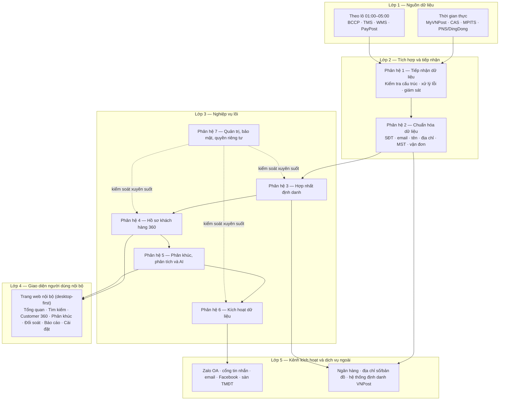
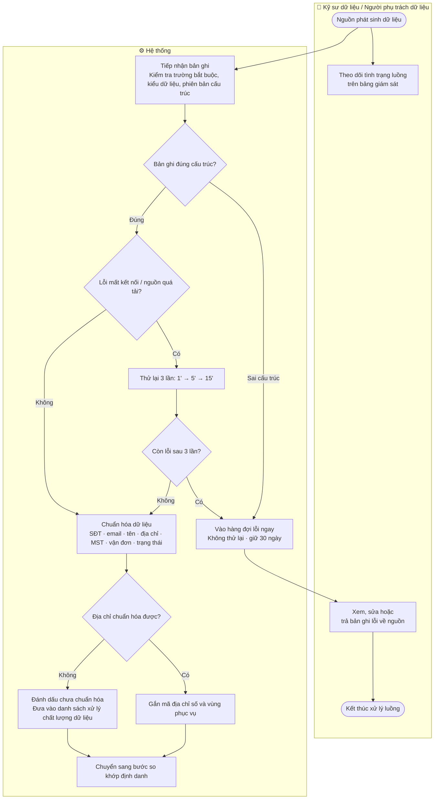
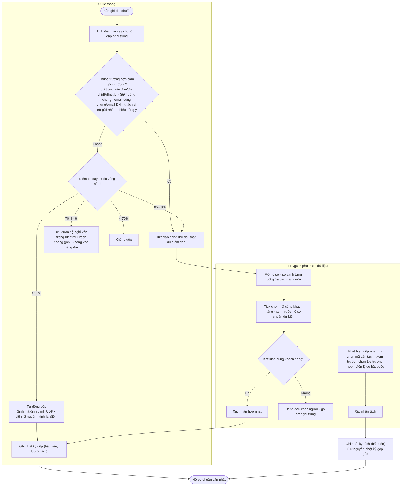
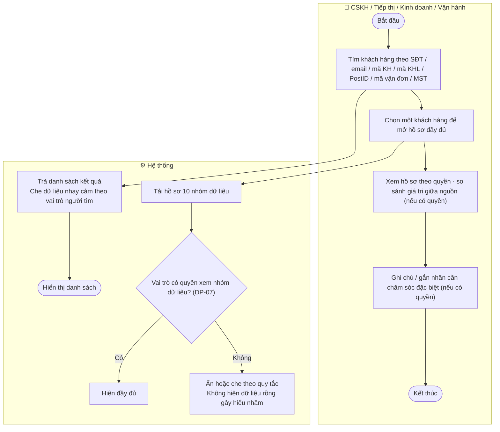
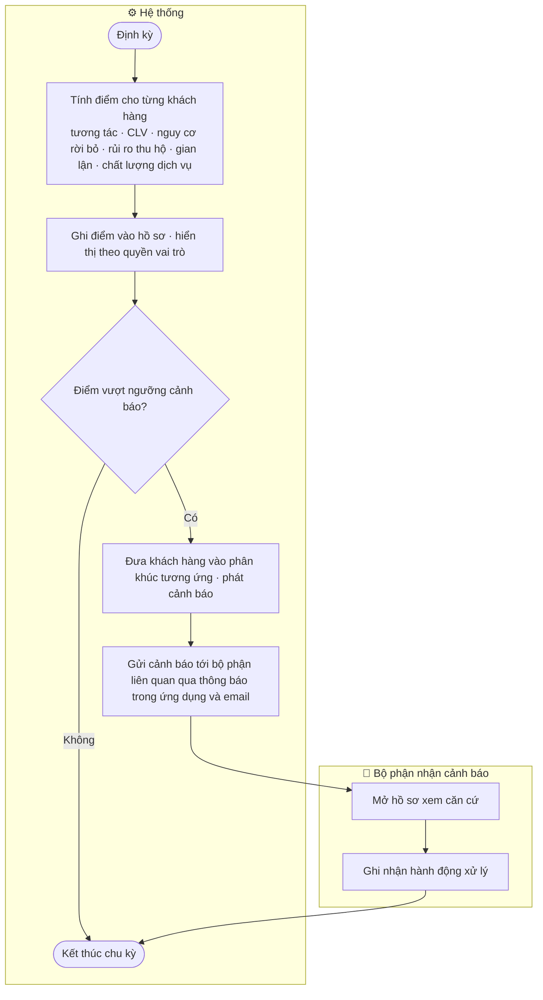
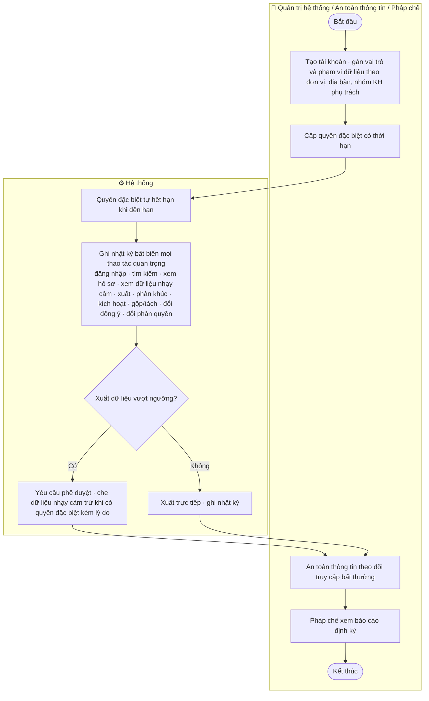
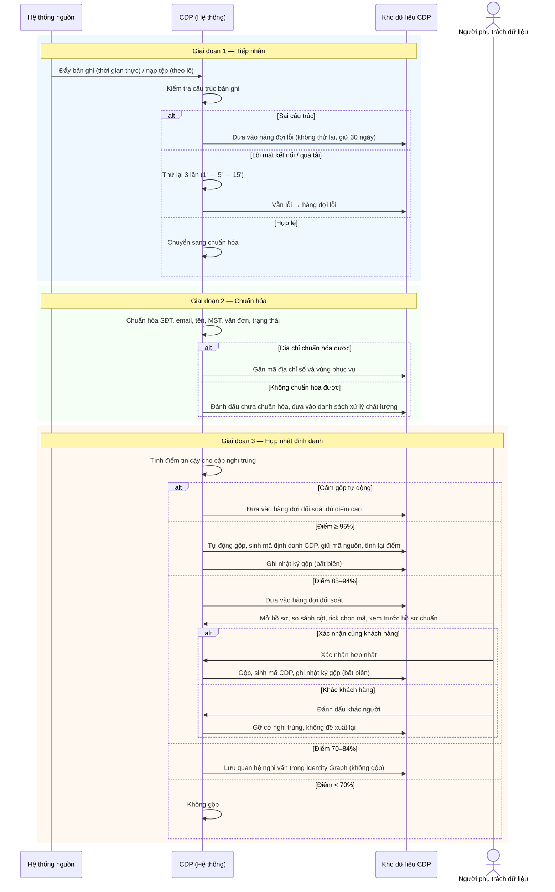
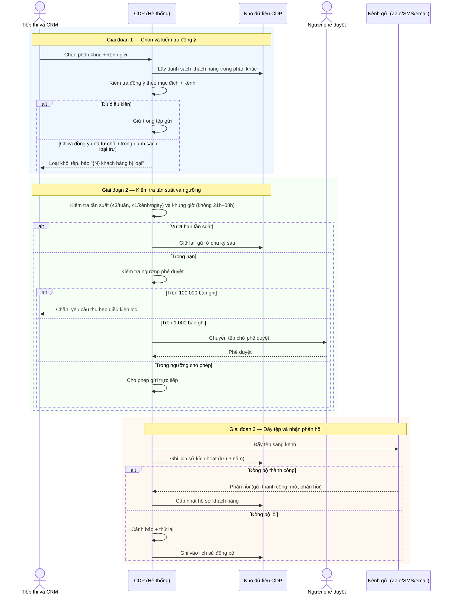

TỔNG CÔNG TY BƯU ĐIỆN VIỆT NAM (VNPost/TCT)

# TÀI LIỆU ĐẶC TẢ YÊU CẦU NGƯỜI DÙNG

## Nền tảng Dữ liệu Khách hàng — Customer Data Platform (CDP)

**Phiên bản:** v1 — Khung tổng thể (Mục I + Mục II)
**Địa điểm – Thời gian:** Hà Nội – Tháng 08/2026

---

## Bảng theo dõi thay đổi

| Phiên bản | Ngày | Nội dung | Người thực hiện |
|---|---|---|---|
| v1 | 08/2026 | Khởi tạo khung tổng thể: Mục I (Giới thiệu) và Mục II (Yêu cầu tổng thể) cho cả 7 phân hệ. Chưa bao gồm Mục III (Use Case), Mục IV (Giao diện), Mục C (Phi chức năng) — sẽ viết theo lô ở các vòng sau | BA |
| v1.1 | 08/2026 | Patch theo QA review — sửa 2 CRITICAL + 4 MAJOR: (CR-01) chốt MVP chỉ người gửi, người nhận Out of scope MVP theo A2, OQ-02 chuyển Out of scope P1; (CR-02) bổ sung "email dùng chung" vào danh sách cấm gộp tự động DP-05; (MA-01) tách bạch quyền Xem báo cáo gộp/tách và quyền Đề xuất tách (REQUEST_UNMERGE); (MA-02) bỏ quyền tách hồ sơ của Quản trị hệ thống; (MA-03) chú thích FR-GOV-03 là góc quản trị của cùng nhật ký FR-IDR-14; (MA-05) làm rõ 10 mã FR-IDR có tên trên 14 vị trí. 5 MINOR (MI-01→05) ghi nhận xử lý ở lô Hợp nhất định danh | BA |

---

## Về phạm vi của phiên bản tài liệu này

Đây là **vòng khung tổng thể**. Tài liệu chỉ bao gồm:

- **Mục I — Giới thiệu** (I.1 Mục đích · I.2 Phạm vi · I.3 Thuật ngữ · I.4 Kiến trúc tổng thể)
- **Mục II — Yêu cầu tổng thể** (II.1 Workflow · II.2 Function Tree · II.3 Permission Matrix · II.4 RBAC · II.5 Sequence)

**Mục III (Đặc tả Use Case)**, **Mục IV (Giao diện chức năng)** và **Mục C (Yêu cầu phi chức năng)** sẽ được viết theo lô ở các vòng sau, thứ tự đề xuất:

1. Hợp nhất định danh + Hồ sơ khách hàng 360 (đã có giao diện, đã làm rõ nhất)
2. Tiếp nhận và chuẩn hóa dữ liệu
3. Phân khúc và phân tích
4. Kích hoạt dữ liệu
5. Quản trị, bảo mật và quyền riêng tư

**Nguồn giao diện chuẩn cho Mục IV ở các lô sau là prototype v3** (`.claude/output/cdp-tct/wireframe/prototype-v3.html` — bản chốt 24/07/2026), không phải `wireframe-v1.md`. Mọi tên màn hình được tham chiếu trong tài liệu này lấy theo prototype v3.

> **Lưu ý về giả định và câu hỏi mở:** Toàn bộ dự án hiện chưa có buổi họp chính thức với VNPost và chưa có tài liệu yêu cầu từ phía VNPost. Các nội dung trong tài liệu này được viết theo **giả định có mã** (tham chiếu GD-01→GD-09 và A1→A8). Chỗ nào phụ thuộc câu trả lời chưa có từ VNPost được đánh dấu `[Cần xác nhận: ...]` ngay tại vị trí đó, không dùng "TBD".

---

# I. GIỚI THIỆU

## I.1. Mục đích tài liệu

CDP là **nền tảng dữ liệu khách hàng tập trung** của Tổng công ty Bưu điện Việt Nam. Hệ thống làm ba việc chính:

1. **Thu thập dữ liệu khách hàng** từ toàn bộ hệ sinh thái IT của VNPost (hơn 8 luồng dữ liệu, khoảng 1,7 triệu bản ghi mỗi ngày).
2. **Hợp nhất các định danh rời rạc** của cùng một khách hàng đang nằm rải trên nhiều hệ thống nguồn thành một hồ sơ khách hàng duy nhất (hồ sơ 360).
3. **Kích hoạt lại kết quả** — đưa dữ liệu đã hợp nhất và phân tích trở về phục vụ kinh doanh, chăm sóc khách hàng, tiếp thị và vận hành.

**CDP không thay thế** các hệ thống nghiệp vụ hiện có. Nó là **lớp dữ liệu trung gian** nằm giữa các hệ thống nguồn (tạo đơn, thanh toán, quan hệ khách hàng…) và các kênh sử dụng dữ liệu. CDP không xử lý nghiệp vụ gốc (tạo vận đơn, thu tiền COD, ký hợp đồng) — những việc đó vẫn nằm ở hệ thống nguồn.

**Đối tượng sử dụng tài liệu:**

| Đối tượng | Sử dụng tài liệu để |
|---|---|
| Lập trình viên (Dev) | Hiểu phạm vi chức năng, luồng nghiệp vụ, quy tắc để triển khai |
| Kiểm thử viên (Tester) | Lập kế hoạch kiểm thử, viết ca kiểm thử theo luồng và điều kiện |
| Kiến trúc sư giải pháp (SA) | Nắm bối cảnh nghiệp vụ, ranh giới hệ thống, các điểm tích hợp |
| Chủ sản phẩm (PO), nghiệp vụ VNPost | Xác nhận phạm vi, giả định và quyết định các câu hỏi mở |

**Vai trò trong vòng đời dự án:** Tài liệu là đặc tả yêu cầu người dùng (URD/SRS) — cầu nối giữa yêu cầu nghiệp vụ và bản triển khai kỹ thuật. Mức chi tiết hướng tới **Dev/Test-ready**: đọc xong có thể lập trình và viết ca kiểm thử mà không cần hỏi lại người phân tích, trừ các điểm còn đánh dấu `[Cần xác nhận: ...]`.

## I.2. Phạm vi tài liệu

### I.2.1. Phạm vi chức năng — 7 phân hệ

Tài liệu bao phủ **toàn bộ 7 phân hệ** của CDP, khoảng **99 mã yêu cầu chức năng**:

| # | Phân hệ | Nhóm mã yêu cầu | Nội dung chính |
|---|---|---|---|
| 1 | Tiếp nhận dữ liệu | FR-INGEST | Tiếp nhận dữ liệu thời gian thực và theo lô; kiểm tra cấu trúc; xử lý lỗi và thử lại; giám sát luồng |
| 2 | Chuẩn hóa và xử lý dữ liệu | FR-STD | Chuẩn hóa số điện thoại, email, họ tên, địa chỉ, mã số thuế, mã vận đơn, trạng thái; theo dõi chất lượng dữ liệu |
| 3 | Hợp nhất định danh | FR-IDR | Tính điểm tin cậy; đối sánh; gộp và tách hồ sơ; sơ đồ liên kết định danh; nhật ký gộp/tách |
| 4 | Quản lý hồ sơ khách hàng 360 | FR-C360 | Tra cứu; hồ sơ hợp nhất 10 nhóm dữ liệu; hiển thị theo phân quyền; ghi chú và gắn nhãn |
| 5 | Phân khúc, phân tích và trí tuệ nhân tạo | FR-SEG / FR-ANALYTICS | Phân khúc động; chấm điểm; cảnh báo rủi ro; phân tích theo mô hình gần đây/tần suất/giá trị; dự báo rời bỏ |
| 6 | Kích hoạt dữ liệu | FR-ACT | Kiểm tra đồng ý; kiểm tra tần suất và khung giờ; phê duyệt theo ngưỡng; đẩy sang kênh; nhận phản hồi |
| 7 | Quản trị, bảo mật và quyền riêng tư | FR-GOV | Quản lý tài khoản, vai trò, phạm vi; nhật ký bất biến; quản lý đồng ý; xử lý yêu cầu chủ thể dữ liệu; báo cáo tuân thủ |

> **[Cần xác nhận: mã yêu cầu chi tiết cho 6 phân hệ ngoài Hợp nhất định danh]** — Nguồn hiện tại chỉ liệt kê tên cụ thể cho nhóm mã FR-IDR: **10 mã đã có tên** (FR-IDR-01, 02, 06, 07, 08, 09, 11, 12, 13, 14) trên tổng **14 vị trí** trong dải FR-IDR-01→14; 4 mã còn lại (03, 04, 05, 10) chưa được đặt tên trong nguồn (xem Mục II.2). Các phân hệ còn lại được dựng cây theo nhóm chức năng nghiệp vụ đã xác định; tên và số hiệu chi tiết của từng mã yêu cầu (FR-INGEST-xx, FR-STD-xx, …) sẽ được bổ sung khi làm chi tiết theo lô, hoặc khi có bảng mã yêu cầu gốc từ tài liệu `CDP.md`.

### I.2.2. Ranh giới hệ thống

| Nội dung | Ranh giới |
|---|---|
| **Đăng nhập và xác thực** | CDP **nhận danh tính** từ cổng đăng nhập chung của tổ chức (mã nhân sự đã cấp quyền hoặc đăng nhập một lần nội bộ). CDP **không tự quản lý** tài khoản, mật khẩu, và **không có màn hình đăng nhập riêng** (GD-08) |
| **Khách hàng cuối** | **Không truy cập CDP.** Không có màn hình nào dành cho khách hàng của VNPost. CDP là công cụ nội bộ |
| **Trạng thái đồng ý dữ liệu** | CDP **chỉ nhận** trạng thái đồng ý từ nguồn: ứng dụng MyVNPost, website, quầy giao dịch, hệ thống quan hệ khách hàng. CDP **không tự thu** đồng ý từ khách hàng |
| **Yêu cầu xem/xóa dữ liệu của khách hàng** | Đến qua **bộ phận chăm sóc khách hàng tiếp nhận** rồi nhập vào CDP. **Không có kênh tự phục vụ** cho khách hàng |
| **Thiết bị truy cập** | Trang web độc lập trên trình duyệt. Mở được trên điện thoại qua đường dẫn, nhưng **tối ưu hiển thị cho điện thoại chưa phải ưu tiên giai đoạn này** — làm cho máy tính trước (GD-09) |

### I.2.3. Năng lực theo mức ưu tiên

CDP triển khai theo bốn giai đoạn ưu tiên. Bảng dưới giúp Dev/Tester nắm được đâu là năng lực cốt lõi cần có trước.

| Mức | Giai đoạn | Năng lực |
|---|---|---|
| **P0** | Thử nghiệm | Tiếp nhận thời gian thực và theo lô · chuẩn hóa số điện thoại, họ tên, địa chỉ · hợp nhất định danh với sơ đồ liên kết · hồ sơ 360 cơ bản · quản lý đồng ý · phân quyền theo vai trò · nhật ký thao tác · bảng theo dõi chất lượng dữ liệu |
| **P1** | Mở rộng nghiệp vụ | Phân khúc động · đồng bộ sang hệ thống quan hệ khách hàng · kích hoạt kênh tiếp thị · lịch sử thu hộ và thanh toán · lịch sử khiếu nại · phân tích rủi ro thu hộ và hoàn hàng · danh sách loại trừ · xử lý yêu cầu của khách hàng |
| **P2** | Nâng cao | Phân tích theo mô hình gần đây/tần suất/giá trị · giá trị vòng đời khách hàng · dự báo nguy cơ rời bỏ · chấm điểm khách hàng · phát hiện gian lận · gợi ý dịch vụ · danh mục dữ liệu và truy vết dòng dữ liệu · kiểm soát theo mục đích sử dụng · phân quyền theo đơn vị và địa bàn · báo cáo tuân thủ |

### I.2.4. Ngoài phạm vi tài liệu

- Xác thực và quản lý tài khoản (do cổng đăng nhập chung của tổ chức đảm nhận — xem I.2.2).
- Nghiệp vụ gốc của các hệ thống nguồn (tạo vận đơn, thu tiền COD, ký hợp đồng…).
- Chi tiết kỹ thuật của tầng dữ liệu và tích hợp (mô hình dữ liệu vật lý, endpoint API, hạ tầng) — thuộc phạm vi SA/Dev.
- Màn hình dành cho khách hàng cuối (không tồn tại — xem I.2.2).
- Hồ sơ khách hàng độc lập cho người nhận — MVP không tạo customer profile riêng cho người nhận; người nhận chỉ được ghi nhận ở tầng giao dịch của người gửi. Xem xét lại ở giai đoạn P1 (OQ-02).

## I.3. Định nghĩa thuật ngữ và từ viết tắt

| STT | Thuật ngữ | Diễn giải |
|---|---|---|
| 1 | **CDP** (Customer Data Platform) | Nền tảng dữ liệu khách hàng — lớp dữ liệu trung gian thu thập, hợp nhất và kích hoạt dữ liệu khách hàng |
| 2 | **Hồ sơ 360** (Customer 360) | Hồ sơ khách hàng hợp nhất, gom toàn bộ thông tin của một khách hàng từ nhiều hệ thống nguồn về một chỗ, gồm 10 nhóm dữ liệu (định danh, mã liên kết, địa chỉ, doanh nghiệp, hoạt động dịch vụ, hành vi số, chăm sóc khách hàng, điểm số/phân khúc, đồng ý, nhật ký nguồn) |
| 3 | **Hợp nhất định danh** (Identity Resolution) | Quá trình nhận diện các mã định danh khác nhau ở nhiều hệ thống thực chất là cùng một khách hàng, rồi gộp lại thành một hồ sơ chuẩn |
| 4 | **Sơ đồ liên kết định danh** (Identity Graph) | Cấu trúc lưu quan hệ giữa các mã định danh của cùng một khách hàng — gồm cả quan hệ đã gộp và quan hệ nghi vấn chưa gộp |
| 5 | **Điểm tin cậy** (Confidence Score) | Điểm từ 0–100% thể hiện mức độ chắc chắn hai bản ghi là cùng một khách hàng. Quyết định hành vi gộp theo 4 vùng (mục 8 bảng này) |
| 6 | **Bốn vùng tin cậy** | Từ 95% trở lên: tự động gộp · 85–94%: chờ người xác nhận · 70–84%: lưu quan hệ nghi vấn, không gộp · dưới 70%: không gộp |
| 7 | **Hồ sơ chuẩn** | Hồ sơ khách hàng sau khi hợp nhất, mang một mã định danh CDP duy nhất, được các hệ thống khác dùng làm bản gốc |
| 8 | **Mã định danh CDP** | Mã duy nhất hệ thống sinh ra cho mỗi hồ sơ chuẩn sau khi hợp nhất |
| 9 | **Mã nguồn** (Source ID) | Mã định danh khách hàng ở một hệ thống nguồn cụ thể (ví dụ: mã khách hàng CRM, PostID, mã KHL) |
| 10 | **Mã thay thế** (Alternate ID) | Mã nguồn cũ được giữ lại sau khi gộp, để truy vết và đồng bộ ngược. **Mã nguồn không bao giờ bị xóa** sau khi gộp |
| 11 | **Gộp hồ sơ** (Merge) | Thao tác hợp nhất nhiều mã định danh vào một hồ sơ chuẩn |
| 12 | **Tách hồ sơ** (Unmerge) | Thao tác tách một hoặc nhiều mã nguồn ra khỏi hồ sơ chuẩn khi phát hiện gộp nhầm |
| 13 | **Hàng đợi đối soát** | Danh sách các cặp hồ sơ nghi trùng (vùng 85–94%) chờ người phụ trách dữ liệu xác nhận gộp hay không |
| 14 | **Đồng ý theo mục đích và kênh** (Consent by purpose & channel) | Đồng ý của khách hàng được xét riêng cho **từng mục đích** (vận hành, tiếp thị, phân tích) và **từng kênh** (SMS, Zalo, email…). Đồng ý cho vận hành không tự động dùng được cho tiếp thị |
| 15 | **Danh sách loại trừ** | Danh sách khách hàng bị loại khỏi mọi tệp kích hoạt tiếp thị bất kể trạng thái đồng ý |
| 16 | **Phân khúc động** (Dynamic Segment) | Nhóm khách hàng thỏa một bộ điều kiện, **tự cập nhật** khi dữ liệu khách hàng thay đổi (khác phân khúc tĩnh — chốt danh sách một lần) |
| 17 | **Kích hoạt dữ liệu** (Activation) | Đưa một phân khúc sang kênh giao tiếp cụ thể (SMS, Zalo, email…) để chạy chiến dịch, sau khi đã kiểm tra đồng ý, tần suất và ngưỡng phê duyệt |
| 18 | **Nhật ký bất biến** (Immutable Log) | Nhật ký chỉ được **ghi thêm**, không sửa, không xóa — dùng cho gộp/tách hồ sơ và thay đổi đồng ý, phục vụ giải trình |
| 19 | **Nguồn ưu tiên** | Quy tắc chọn giá trị khi nhiều hệ thống nguồn cung cấp cùng một trường dữ liệu nhưng giá trị khác nhau |
| 20 | **Số dùng chung** | Số điện thoại được nhiều người dùng chung (ví dụ tổng đài, số doanh nghiệp) — **không dùng làm khóa gộp tự động** |
| 21 | **KHL** (Khách hàng lớn) | Khách hàng doanh nghiệp có hợp đồng với VNPost, thường là doanh nghiệp thương mại điện tử |
| 22 | **COD** (Cash on Delivery) | Thu hộ tiền hàng khi giao — chiếm 70–80% giao dịch thương mại điện tử tại Việt Nam. Dữ liệu COD là dữ liệu tài chính nhạy cảm |
| 23 | **Điểm rủi ro COD / thu hộ** | Điểm đánh giá nguy cơ một giao dịch COD không thu được tiền hoặc bị hoàn |
| 24 | **CLV** (Customer Lifetime Value) | Giá trị vòng đời khách hàng — ước lượng tổng giá trị một khách hàng mang lại |
| 25 | **Người gửi** (Shipper) | Khách hàng gửi hàng — cá nhân hoặc doanh nghiệp. Thường có tài khoản VNPost |
| 26 | **Người nhận** (Consignee) | Đầu nhận của bưu gửi — thường không có tài khoản VNPost. **Giai đoạn MVP, CDP không xây hồ sơ độc lập cho người nhận** (theo A2): người nhận chỉ xuất hiện như thuộc tính trên giao dịch của người gửi, không tạo customer profile riêng. Xem xét lại ở giai đoạn P1 (OQ-02) |
| 27 | **MyVNPost** | Ứng dụng khách hàng của VNPost — nguồn dữ liệu hành vi số, tạo đơn (nhóm thời gian thực) |
| 28 | **CAS** | Hệ thống chấp nhận gửi / cổng khách hàng lớn — nguồn dữ liệu giao dịch và định danh KHL |
| 29 | **MPITS** | Nền tảng tích hợp trung tâm, đã kết nối API với sàn thương mại điện tử — ứng viên làm cổng dữ liệu cho CDP (phụ thuộc OQ-04) |
| 30 | **PNS/DingDong** | Hệ thống phát và ứng dụng bưu tá — nguồn dữ liệu trạng thái phát (nhóm thời gian thực) |
| 31 | **BCCP** | Hệ thống khai thác bưu chính — nguồn dữ liệu theo lô (hệ thống cũ) |
| 32 | **TMS** (Transport Management System) | Hệ thống quản lý vận tải — nguồn dữ liệu theo lô (hệ thống cũ) |
| 33 | **WMS** (Warehouse Management System) | Hệ thống quản lý kho — nguồn dữ liệu theo lô (hệ thống cũ) |
| 34 | **PayPost** | Hệ thống thanh toán — nguồn dữ liệu thu hộ và đối soát tài chính (theo lô, sau khi chốt sổ) |
| 35 | **PostID** | Hệ thống định danh người dùng của VNPost. Độ phủ khách hàng phụ thuộc OQ-03 |
| 36 | **Nghị định 13/2023/NĐ-CP** | Nghị định về bảo vệ dữ liệu cá nhân, áp dụng bắt buộc. Yêu cầu CDP có quản lý đồng ý, quyền được lãng quên, và nhật ký kiểm toán từ ngày đầu |
| 37 | **Quyền chủ thể dữ liệu** | Quyền của khách hàng: xem, chỉnh sửa, rút đồng ý, ngừng xử lý, xóa/ẩn danh, yêu cầu giải thích |
| 38 | **Che dữ liệu** (Masking) | Ẩn một phần hoặc toàn bộ giá trị nhạy cảm theo phân quyền vai trò (ví dụ: `090***123`) |

## I.4. Kiến trúc tổng thể hệ thống

CDP tổ chức theo **năm lớp** ở mức nghiệp vụ: từ nguồn dữ liệu đầu vào, qua lớp tích hợp, đến lớp nghiệp vụ (7 phân hệ), lên lớp giao diện người dùng nội bộ, và ra các kênh kích hoạt / dịch vụ ngoài.



**Diễn giải từng lớp:**

**Lớp 1 — Nguồn dữ liệu.** Cung cấp dữ liệu khách hàng cho CDP. Chia hai nhóm theo độ trễ:
- **Thời gian thực:** MyVNPost, CAS, MPITS, PNS/DingDong — đẩy sự kiện ngay khi phát sinh (mục tiêu độ trễ ≤ 5 phút cho hành vi số và tạo đơn; ≤ 15 phút cho trạng thái phát và thu hộ).
- **Theo lô:** BCCP, TMS, WMS, PayPost — xuất dữ liệu một lần mỗi ngày trong khung 01:00–05:00; riêng đối soát thu hộ chạy sau khi hệ thống thanh toán chốt sổ.

> **[Cần xác nhận: MPITS làm cổng dữ liệu chung hay tích hợp riêng lẻ]** (OQ-04) — Nếu MPITS mở kết nối và tổng hợp sẵn dữ liệu từ các hệ thống con, CDP lấy dữ liệu từ một cổng thay vì tích hợp từng hệ thống. Nếu không, phải tích hợp riêng lẻ từng nguồn, khối lượng và thời gian tăng nhiều lần. Cách tích hợp cụ thể (giao thức, endpoint) thuộc phạm vi SA/Dev.

**Lớp 2 — Tích hợp và tiếp nhận.** Gồm Phân hệ 1 (tiếp nhận, kiểm tra cấu trúc bản ghi, xử lý lỗi và thử lại, giám sát luồng) và Phân hệ 2 (chuẩn hóa số điện thoại, email, họ tên, địa chỉ, mã số thuế, mã vận đơn, trạng thái bưu gửi và thu hộ về bộ chuẩn). Đầu ra là các bản ghi đạt chuẩn chuyển sang bước hợp nhất định danh.

**Lớp 3 — Nghiệp vụ lõi.** Năm phân hệ trung tâm:
- **Hợp nhất định danh (Phân hệ 3):** tính điểm tin cậy, đối sánh, gộp/tách hồ sơ, sinh mã định danh CDP, giữ mã nguồn làm mã thay thế.
- **Hồ sơ khách hàng 360 (Phân hệ 4):** tra cứu và hiển thị hồ sơ hợp nhất 10 nhóm dữ liệu, che dữ liệu theo phân quyền.
- **Phân khúc, phân tích và AI (Phân hệ 5):** tạo và quản lý phân khúc động, chấm điểm khách hàng, cảnh báo rủi ro.
- **Kích hoạt dữ liệu (Phân hệ 6):** kiểm tra đồng ý theo mục đích và kênh, kiểm tra tần suất và ngưỡng phê duyệt, đẩy tệp sang kênh, nhận phản hồi.
- **Quản trị, bảo mật và quyền riêng tư (Phân hệ 7):** quản lý tài khoản/vai trò/phạm vi, nhật ký bất biến, quản lý đồng ý, xử lý yêu cầu chủ thể dữ liệu, báo cáo tuân thủ. Lớp này **kiểm soát xuyên suốt** các phân hệ khác (đường nét đứt trong sơ đồ).

**Lớp 4 — Giao diện người dùng nội bộ.** Trang web nội bộ, tối ưu cho máy tính (desktop-first). Các nhóm màn hình: Tổng quan, Tìm kiếm khách hàng, Customer 360, Phân khúc, Đối soát định danh, Báo cáo, Cài đặt. Chỉ người dùng nội bộ đã được cổng đăng nhập chung cấp quyền mới truy cập.

> Tên và đặc tả chi tiết từng màn hình sẽ được viết ở Mục IV theo lô sau, **bám theo prototype v3** (bản chốt 24/07/2026).

**Lớp 5 — Kênh kích hoạt và dịch vụ ngoài.**
- **Kênh kích hoạt (đầu ra):** Zalo OA, cổng tin nhắn, email, Facebook, sàn thương mại điện tử — nơi CDP đẩy tệp khách hàng để chạy chiến dịch.
- **Dịch vụ ngoài (hỗ trợ xử lý):** ngân hàng (đối soát thu hộ), hệ thống địa chỉ số và bản đồ (chuẩn hóa địa chỉ), hệ thống định danh người dùng VNPost.

> **[Cần xác nhận: kênh kích hoạt thực tế VNPost đang dùng]** (liên quan M3 clarification) — Chưa xác nhận VNPost đang dùng những kênh nào (SMS, Zalo OA, email, push MyVNPost) và có sẵn công cụ Marketing Automation nào. Danh sách kênh trên lấy theo mục 8 baseline; cần VNPost xác nhận để chốt phạm vi tích hợp Phân hệ 6.

---

# II. CÁC YÊU CẦU VỀ TỔNG THỂ PHẦN MỀM

## II.1. Sơ đồ quy trình nghiệp vụ (Workflow Diagram)

**Danh sách quy trình** (8 luồng nghiệp vụ chính):

1. Tiếp nhận và chuẩn hóa dữ liệu
2. Hợp nhất định danh (gộp và tách hồ sơ)
3. Tra cứu hồ sơ khách hàng 360
4. Tạo và quản lý phân khúc
5. Chấm điểm và cảnh báo rủi ro
6. Kích hoạt dữ liệu
7. Xử lý yêu cầu của khách hàng
8. Quản trị và tuân thủ

---

### Quy trình 1: Tiếp nhận và chuẩn hóa dữ liệu

**Swimlane Diagram:**



**Diễn giải luồng quy trình:**

| Bước | Tác nhân | Mô tả |
|---|---|---|
| 1 | Hệ thống nguồn | Phát sinh dữ liệu — nhóm thời gian thực đẩy sự kiện ngay; nhóm hệ thống cũ xuất theo lô 01:00–05:00 |
| 1.1 | Hệ thống | Tiếp nhận và kiểm tra cấu trúc bản ghi: trường bắt buộc, kiểu dữ liệu, phiên bản cấu trúc |
| **Trường hợp sai cấu trúc (DP-01)** | Hệ thống | Đưa bản ghi vào hàng đợi lỗi ngay, **không thử lại**; giữ 30 ngày rồi chuyển lưu trữ |
| **Trường hợp lỗi mất kết nối/quá tải (DP-02)** | Hệ thống | Thử lại 3 lần theo nhịp 1 phút → 5 phút → 15 phút; vẫn lỗi thì vào hàng đợi lỗi |
| 2 | Hệ thống | Chuẩn hóa bản ghi đạt cấu trúc: số điện thoại về một dạng, email về chữ thường, họ tên bỏ khoảng trắng thừa và xử lý dấu, mã số thuế kiểm tra độ dài, mã vận đơn chuẩn hóa chữ hoa, trạng thái bưu gửi và thu hộ ánh xạ về bộ chuẩn |
| 2.1 | Hệ thống | Bóc tách địa chỉ theo cấp hành chính và ánh xạ mã địa chỉ số |
| **Trường hợp địa chỉ không chuẩn hóa được (DP-03)** | Hệ thống | Đánh dấu chưa chuẩn hóa, đưa vào danh sách xử lý chất lượng dữ liệu |
| 3 | Hệ thống | Bản ghi đạt chuẩn chuyển sang bước so khớp định danh (Quy trình 2) |
| 4 | Kỹ sư dữ liệu / Người phụ trách dữ liệu | Theo dõi tình trạng luồng trên bảng giám sát; xem, sửa hoặc trả bản ghi lỗi về nguồn |
| **Cảnh báo luồng** | Hệ thống | Cảnh báo khi tồn đọng cần hơn 15 phút xử lý hoặc tỷ lệ lỗi vượt 1%/giờ; báo động khi nguồn ngừng đẩy quá 15 phút trong khung giờ hoạt động, tỷ lệ lỗi vượt 5%/giờ, hoặc tồn đọng cần hơn 60 phút |

---

### Quy trình 2: Hợp nhất định danh (gộp và tách hồ sơ)

**Swimlane Diagram:**



**Diễn giải luồng quy trình:**

| Bước | Tác nhân | Mô tả |
|---|---|---|
| 1 | Hệ thống | Tính điểm tin cậy cho từng cặp bản ghi nghi trùng theo bộ luật đối sánh tuyệt đối và tín hiệu hỗ trợ |
| **Nhánh cấm gộp tự động (DP-05)** | Hệ thống | Nếu chỉ trùng mã vận đơn / địa chỉ / địa chỉ mạng / thiết bị, hoặc số điện thoại dùng chung, hoặc **email dùng chung / email doanh nghiệp**, hoặc người gửi–người nhận chỉ trùng một thông tin phụ, hoặc thiếu đồng ý cho mục đích kích hoạt → đưa vào hàng đợi đối soát dù điểm cao |
| **Nhánh vùng tin cậy (DP-04)** | Hệ thống | Từ 95%: tự động gộp · 85–94%: vào hàng đợi đối soát · 70–84%: lưu quan hệ nghi vấn (không gộp, không vào hàng đợi) · dưới 70%: không gộp |
| 2 | Người phụ trách dữ liệu | Mở hồ sơ trong hàng đợi, xem bảng so sánh từng cột giữa các mã nguồn |
| 2.1 | Người phụ trách dữ liệu | Tick chọn mã thuộc cùng khách hàng, xem trước hồ sơ chuẩn dự kiến |
| 2.2 | Người phụ trách dữ liệu | Xác nhận hợp nhất, **hoặc** đánh dấu là các khách hàng khác nhau (DP-06) |
| 2.3 | Hệ thống | Khi gộp: sinh mã định danh CDP, giữ toàn bộ mã nguồn cũ làm mã thay thế, tính lại điểm số, ghi nhật ký gộp bất biến |
| 3 | Người phụ trách dữ liệu | Khi phát hiện gộp nhầm: chọn mã nguồn cần tách, xem trước kết quả tách, chọn 1 trong 6 trường hợp tách, **điền lý do bắt buộc**, xác nhận |
| 3.1 | Hệ thống | Tách hồ sơ, trả lại mã nguồn tương ứng, phân chia lại dữ liệu và điểm số về đúng hồ sơ gốc, **không làm mất lịch sử vận đơn**, ghi nhật ký tách. **Nhật ký gộp gốc được giữ nguyên** |
| **Trường hợp hai người cùng xử lý một hồ sơ** | Hệ thống | Ai bấm trước người đó thắng. Không khóa hồ sơ. Người sau nhận thông báo ngay trên màn hình, danh sách được làm mới |
| **Trường hợp tách một mã giữa chuỗi gộp nhiều lần** | Hệ thống | Cảnh báo chuỗi gộp phức tạp, **không cho tách trực tiếp**, ghi vào danh sách chờ xử lý riêng (giai đoạn sau) |
| **Trường hợp vai trò không có quyền tách** | Chăm sóc khách hàng / Kinh doanh / Vận hành | Bấm nút **Báo cáo** kèm lý do; người phụ trách dữ liệu xem và tự quyết định có tách hay không |

> **[Cần xác nhận: khóa gộp khi PostID chưa phủ đủ]** (OQ-03, A3) — Nếu PostID chưa phủ toàn bộ khách hàng, số điện thoại (đã chuẩn hóa, không thuộc danh sách dùng chung) là khóa ghép nối chính. Cần VNPost xác nhận độ phủ PostID và trường hợp cùng số điện thoại nhưng là hai khách hàng khác nhau.

---

### Quy trình 3: Tra cứu hồ sơ khách hàng 360

**Swimlane Diagram:**



**Diễn giải luồng quy trình:**

| Bước | Tác nhân | Mô tả |
|---|---|---|
| 1 | Người dùng | Tìm khách hàng theo một trong: số điện thoại, email, mã khách hàng, mã KHL, mã định danh VNPost (PostID), mã vận đơn, mã số thuế |
| 1.1 | Hệ thống | Trả danh sách kết quả; dữ liệu nhạy cảm đã che theo vai trò người tìm |
| 2 | Người dùng | Mở một khách hàng để xem hồ sơ đầy đủ (định danh, mã liên kết, địa chỉ, doanh nghiệp, hoạt động dịch vụ, hành vi số, chăm sóc khách hàng, điểm số/phân khúc, đồng ý, nhật ký nguồn) |
| 2.1 | Hệ thống (DP-07) | Mỗi nhóm dữ liệu hiển thị theo đúng quyền vai trò; nhóm không được xem thì ẩn hoặc che, không hiện dữ liệu rỗng gây hiểu nhầm |
| 3 | Người dùng | Người có quyền xem được nguồn phát sinh của từng nhóm dữ liệu và so sánh giá trị giữa các hệ thống nguồn |
| 4 | Người dùng | Người có quyền ghi chú hoặc gắn nhãn khách hàng cần chăm sóc đặc biệt |
| **Trường hợp không đủ quyền xem một nhóm** | Hệ thống | Hiển thị: "Bạn không có quyền xem thông tin này. Liên hệ quản trị hệ thống nếu công việc của bạn cần dùng đến." |
| **Trường hợp không có kết quả** | Hệ thống | Hiển thị: "Không tìm thấy khách hàng nào khớp điều kiện lọc." |

---

### Quy trình 4: Tạo và quản lý phân khúc

**Swimlane Diagram:**


**Diễn giải luồng quy trình:**

| Bước | Tác nhân | Mô tả |
|---|---|---|
| 1 | Tiếp thị và CRM | Mở danh sách phân khúc, xem các phân khúc đang có kèm số khách hàng khớp |
| 2 | Tiếp thị và CRM | Tạo phân khúc mới: đặt tên, mô tả, thêm điều kiện theo trường dữ liệu |
| 2.1 | Hệ thống | Điều kiện hỗ trợ lồng nhiều tầng với phép và/hoặc/phủ định trên thuộc tính hồ sơ, hành vi, giao dịch, thu hộ, địa bàn, tỷ lệ hoàn, khiếu nại |
| 2.2 | Hệ thống | Ước lượng số khách hàng khớp ngay khi người dùng sửa điều kiện |
| 3 | Tiếp thị và CRM | Lưu phân khúc |
| 3.1 | Hệ thống | Phân khúc động tự cập nhật khi dữ liệu khách hàng thay đổi |
| **Trường hợp sửa phân khúc đang chạy chiến dịch (DP-08)** | Hệ thống | Cảnh báo và liệt kê các chiến dịch bị ảnh hưởng; người dùng xác nhận thì phân khúc cập nhật theo điều kiện mới |

---

### Quy trình 5: Chấm điểm và cảnh báo rủi ro

**Swimlane Diagram:**



**Diễn giải luồng quy trình:**

| Bước | Tác nhân | Mô tả |
|---|---|---|
| 1 | Hệ thống | Tính định kỳ các điểm cho từng khách hàng: mức độ tương tác, CLV, nguy cơ rời bỏ, rủi ro thu hộ, rủi ro gian lận, chất lượng dịch vụ |
| 1.1 | Hệ thống | Ghi kết quả vào hồ sơ và hiển thị theo quyền của từng vai trò (điểm rủi ro thu hộ và gian lận ẩn với CSKH và Tiếp thị) |
| 2 | Hệ thống | Khi điểm vượt ngưỡng cảnh báo: đưa khách hàng vào phân khúc tương ứng và phát cảnh báo qua thông báo trong ứng dụng và email |
| 3 | Bộ phận nhận cảnh báo | Mở hồ sơ xem căn cứ, ghi nhận hành động xử lý |

---

### Quy trình 6: Kích hoạt dữ liệu

**Swimlane Diagram:**


**Diễn giải luồng quy trình:**

| Bước | Tác nhân | Mô tả |
|---|---|---|
| 1 | Tiếp thị và CRM | Chọn phân khúc cần kích hoạt và kênh gửi |
| 1.1 | Hệ thống (DP-09) | Kiểm tra đồng ý cho từng khách hàng theo đúng mục đích và đúng kênh |
| **Trường hợp bị loại** | Hệ thống | Khách hàng chưa đồng ý, đã từ chối, hoặc trong danh sách loại trừ bị loại khỏi tệp; báo số lượng bị loại: "{N} khách hàng trong phân khúc chưa đồng ý nhận {kênh}. Hệ thống đã loại khỏi tệp gửi." |
| **Trường hợp toàn bộ bị loại** | Hệ thống | "Không có khách hàng nào trong phân khúc này đủ điều kiện nhận {kênh}. Tệp gửi trống." |
| 1.2 | Hệ thống (DP-10) | Kiểm tra hạn mức tần suất (≤ 3 tin/khách hàng/tuần mọi kênh; ≤ 1 tin/kênh/ngày) và khung giờ (không gửi tiếp thị 21:00–08:00). Vượt hạn thì giữ lại, gửi ở chu kỳ sau |
| 1.3 | Hệ thống (DP-11) | Kiểm tra ngưỡng phê duyệt: trên 1.000 bản ghi cần phê duyệt; trên 100.000 chặn, yêu cầu thu hẹp |
| 2 | Hệ thống | Đẩy tệp sang kênh; theo dõi trạng thái đồng bộ; ghi lịch sử kích hoạt (lưu 3 năm) |
| **Trường hợp đồng bộ lỗi** | Hệ thống | Thử lại theo cơ chế tiếp nhận; cảnh báo cho quản trị; ghi vào lịch sử đồng bộ |
| 3 | Hệ thống | Nhận phản hồi từ kênh (gửi thành công, mở, phản hồi) và cập nhật lại hồ sơ khách hàng |
| **Trường hợp khách hàng rút đồng ý khi tệp đã đẩy** | Hệ thống | Chặn ngay khi tạo tệp tiếp theo; đẩy trạng thái rút đồng ý sang kênh trong 24 giờ để kênh loại khỏi hàng chờ chưa gửi. Tin đã gửi thì ghi nhận vào lịch sử, không thu hồi |

---

### Quy trình 7: Xử lý yêu cầu của khách hàng

**Swimlane Diagram:**


**Diễn giải luồng quy trình:**

| Bước | Tác nhân | Mô tả |
|---|---|---|
| 1 | Khách hàng | Gửi yêu cầu qua ứng dụng, website, bưu cục, tổng đài hoặc CSKH (không có kênh tự phục vụ vào CDP — xem I.2.2) |
| 2 | CSKH tiếp nhận | Xác thực danh tính người yêu cầu để tránh trả dữ liệu cho sai người |
| **Trường hợp không xác thực được (DP-12)** | CSKH tiếp nhận | Từ chối, ghi lý do |
| 3 | CSKH tiếp nhận | Phân loại yêu cầu: xem dữ liệu, chỉnh sửa, rút đồng ý, ngừng xử lý, xóa/ẩn danh, yêu cầu giải thích |
| 4 | Người phụ trách dữ liệu | Kiểm tra phạm vi dữ liệu trong CDP và các hệ thống nguồn liên quan |
| 5 | Người phụ trách dữ liệu | Xử lý trong CDP, hoặc chuyển yêu cầu sang hệ thống nguồn nếu dữ liệu gốc nằm ở đó |
| 5.1 | Hệ thống | Cập nhật trạng thái, ghi nhật ký, thông báo kết quả cho khách hàng |
| 5.2 | Hệ thống | Đồng bộ thay đổi sang các hệ thống nhận dữ liệu nếu ảnh hưởng tới đồng ý hoặc kích hoạt |
| **Cảnh báo thời hạn** | Hệ thống | Cảnh báo khi còn một phần ba thời hạn nội bộ; báo lên quản lý ngay khi quá hạn nội bộ (rút đồng ý mục tiêu 4 giờ làm việc; xem/sửa 7 ngày; ngừng xử lý 10 ngày; xóa/ẩn danh 15 ngày) |

---

### Quy trình 8: Quản trị và tuân thủ

**Swimlane Diagram:**



**Diễn giải luồng quy trình:**

| Bước | Tác nhân | Mô tả |
|---|---|---|
| 1 | Quản trị hệ thống | Tạo tài khoản, gán vai trò và phạm vi dữ liệu theo đơn vị, địa bàn, nhóm khách hàng phụ trách |
| 2 | Quản trị hệ thống | Cấp quyền đặc biệt có thời hạn; hệ thống tự cho hết hạn khi đến hạn |
| 2.1 | Hệ thống | Ghi nhật ký không thể xóa cho mọi thao tác quan trọng (danh sách trong sơ đồ) |
| 3 | Hệ thống (DP tương ứng ngưỡng xuất) | Xuất dữ liệu vượt ngưỡng phải qua phê duyệt: 1.001–10.000 duyệt bởi quản lý trực tiếp; trên 10.000 duyệt bởi quản trị dữ liệu và tuân thủ; trần cứng 100.000/lần không cho vượt |
| 3.1 | Hệ thống | Tệp xuất luôn che dữ liệu nhạy cảm trừ khi người xuất có quyền đặc biệt và ghi rõ lý do |
| 4 | An toàn thông tin | Theo dõi truy cập bất thường: truy cập ngoài giờ, tải dữ liệu lớn, tra cứu nhiều lần dữ liệu định danh |
| 5 | Pháp chế và tuân thủ | Xem báo cáo định kỳ về đồng ý, truy cập, xuất dữ liệu, xử lý yêu cầu khách hàng, chất lượng dữ liệu |

---

**Câu hỏi mở liên quan Mục II.1:**

- [ ] OQ-01: Use case nào ưu tiên cho giai đoạn đầu? (Người trả lời: Chủ sản phẩm / VNPost)
- [~] OQ-02: "Khách hàng" trong CDP gồm người gửi, hay cả người nhận? Nếu có người nhận thì cơ chế đồng ý cho nhóm chưa từng đăng ký là gì? → Out of scope MVP theo A2 (CDP chỉ xây hồ sơ cho người gửi) — mở lại xem xét ở giai đoạn P1 (Người trả lời: Chủ sản phẩm / Pháp chế)

## II.2. Sơ đồ phân cấp chức năng (Business Function Diagram)

```
CDP — Nền tảng Dữ liệu Khách hàng VNPost
│
├── Phân hệ 1: Tiếp nhận dữ liệu (FR-INGEST)
│   ├── Tiếp nhận dữ liệu thời gian thực
│   ├── Tiếp nhận dữ liệu theo lô (01:00–05:00)
│   ├── Kiểm tra cấu trúc bản ghi
│   ├── Xử lý lỗi và thử lại (1'–5'–15')
│   ├── Quản lý hàng đợi lỗi (giữ 30 ngày)
│   └── Giám sát luồng và cảnh báo
│
├── Phân hệ 2: Chuẩn hóa và xử lý dữ liệu (FR-STD)
│   ├── Chuẩn hóa số điện thoại
│   ├── Chuẩn hóa email
│   ├── Chuẩn hóa họ tên
│   ├── Chuẩn hóa và bóc tách địa chỉ (ánh xạ mã địa chỉ số)
│   ├── Chuẩn hóa mã số thuế, mã vận đơn
│   ├── Ánh xạ trạng thái bưu gửi và thu hộ về bộ chuẩn
│   └── Theo dõi chất lượng dữ liệu (bảng chỉ tiêu, danh sách xử lý)
│
├── Phân hệ 3: Hợp nhất định danh (FR-IDR)
│   ├── Luật đối sánh tuyệt đối (FR-IDR-01)
│   ├── Luật đối sánh xác suất (FR-IDR-02) [ưu tiên Medium — chưa triển khai]
│   ├── Gộp hồ sơ (FR-IDR-06)
│   ├── Tách hồ sơ (FR-IDR-07)
│   ├── Đánh dấu định danh dùng chung (FR-IDR-08)
│   ├── Phân biệt vai trò người gửi/người nhận trên từng giao dịch (FR-IDR-09) [không tạo customer profile riêng cho người nhận — xem A2]
│   ├── Tính điểm tin cậy và phân loại kết quả (FR-IDR-11)
│   ├── Danh sách rà soát thủ công / hàng đợi đối soát (FR-IDR-12)
│   ├── Xử lý xung đột dữ liệu định danh (FR-IDR-13)
│   ├── Nhật ký hợp nhất định danh (FR-IDR-14, đồng thời là FR-GOV-03 ở góc quản trị — một chức năng, hai mã truy vết)
│   ├── Quản lý sơ đồ liên kết định danh (Identity Graph)
│   └── Báo cáo tổng hợp gộp/tách hồ sơ
│       └── [Cần xác nhận: các mã FR-IDR-03, 04, 05, 10 chưa được đặt tên trong nguồn]
│
├── Phân hệ 4: Quản lý hồ sơ khách hàng 360 (FR-C360)
│   ├── Tìm kiếm khách hàng (đa tiêu chí định danh)
│   ├── Xem hồ sơ 360 (10 nhóm dữ liệu)
│   ├── Hiển thị theo phân quyền (che/ẩn theo vai trò)
│   ├── So sánh giá trị giữa các nguồn (hồ sơ đa nguồn)
│   ├── Xem hồ sơ liên kết (mã thay thế)
│   ├── Ghi chú và gắn nhãn khách hàng
│   └── Xuất danh sách khách hàng
│       └── [Cần xác nhận: mã yêu cầu chi tiết phân hệ 4 — FR-C360-xx]
│
├── Phân hệ 5: Phân khúc, phân tích và trí tuệ nhân tạo (FR-SEG / FR-ANALYTICS)
│   ├── Xem danh sách phân khúc
│   ├── Tạo phân khúc (visual rule, không SQL)
│   ├── Sửa phân khúc (cảnh báo khi đang chạy chiến dịch)
│   ├── Nhân bản phân khúc
│   ├── Tạm dừng / kích hoạt lại phân khúc
│   ├── Xóa phân khúc
│   ├── Ước lượng số khách hàng khớp (real-time)
│   ├── Chấm điểm khách hàng (tương tác, CLV, rời bỏ, rủi ro thu hộ, gian lận, chất lượng)
│   ├── Phân tích gần đây/tần suất/giá trị · dự báo rời bỏ [P2]
│   └── Cảnh báo rủi ro theo ngưỡng
│       └── [Cần xác nhận: mã yêu cầu chi tiết phân hệ 5 — FR-SEG-xx / FR-ANALYTICS-xx]
│
├── Phân hệ 6: Kích hoạt dữ liệu (FR-ACT)
│   ├── Chọn phân khúc và kênh gửi
│   ├── Kiểm tra đồng ý theo mục đích và kênh
│   ├── Quản lý danh sách loại trừ
│   ├── Kiểm tra tần suất và khung giờ gửi
│   ├── Phê duyệt theo ngưỡng
│   ├── Đẩy tệp sang kênh · theo dõi đồng bộ
│   ├── Ghi lịch sử kích hoạt (lưu 3 năm)
│   └── Nhận phản hồi từ kênh · cập nhật hồ sơ
│       └── [Cần xác nhận: mã yêu cầu chi tiết phân hệ 6 — FR-ACT-xx]
│
└── Phân hệ 7: Quản trị, bảo mật và quyền riêng tư (FR-GOV)
    ├── Quản lý tài khoản (nhận danh tính từ cổng chung — không quản lý mật khẩu)
    ├── Quản lý vai trò và phạm vi dữ liệu (đơn vị, địa bàn, nhóm KH)
    ├── Quản lý quyền đặc biệt có thời hạn
    ├── Quản lý đồng ý dữ liệu (theo mục đích và kênh)
    ├── Xử lý yêu cầu chủ thể dữ liệu (xem/sửa/rút đồng ý/ngừng/xóa/giải thích)
    ├── Quản lý nhật ký bất biến (gộp/tách, đồng ý, thao tác)
    ├── Kiểm soát và phê duyệt xuất dữ liệu
    ├── Theo dõi truy cập bất thường
    ├── Phân quyền theo đơn vị/tỉnh/thành (FR-GOV-14) [P2]
    ├── Nhật ký hợp nhất định danh (FR-GOV-03) [góc quản trị của cùng nhật ký merge/unmerge FR-IDR-14 ở Phân hệ 3 — không phải chức năng nhật ký thứ hai]
    └── Báo cáo tuân thủ (đồng ý, truy cập, xuất, yêu cầu KH, chất lượng)
        └── [Cần xác nhận: mã yêu cầu chi tiết phân hệ 7 — FR-GOV-xx còn lại]
```

**Diễn giải các phân hệ:**

**Phân hệ 1 — Tiếp nhận dữ liệu (FR-INGEST)**
- **Mục đích:** Đưa dữ liệu từ hơn 8 nguồn vào CDP an toàn, đúng cấu trúc, có kiểm soát lỗi.
- **Giá trị nghiệp vụ:** Là cửa ngõ dữ liệu; nếu tiếp nhận sai hoặc mất dữ liệu, toàn bộ hồ sơ hạ nguồn đều sai. Nút thắt hiệu năng nằm ở đây (~1,7 triệu bản ghi/ngày).
- **Chức năng con:** Tiếp nhận thời gian thực, tiếp nhận theo lô, kiểm tra cấu trúc, xử lý lỗi và thử lại, quản lý hàng đợi lỗi, giám sát luồng và cảnh báo.

**Phân hệ 2 — Chuẩn hóa và xử lý dữ liệu (FR-STD)**
- **Mục đích:** Đưa dữ liệu về một dạng chuẩn để có thể so khớp và hợp nhất.
- **Giá trị nghiệp vụ:** Dữ liệu Việt Nam (địa chỉ viết tắt, số điện thoại nhiều dạng) không chuẩn hóa thì không hợp nhất được; ảnh hưởng trực tiếp chất lượng hồ sơ 360.
- **Chức năng con:** Chuẩn hóa số điện thoại, email, họ tên, địa chỉ, mã số thuế, mã vận đơn, ánh xạ trạng thái, theo dõi chất lượng dữ liệu.

**Phân hệ 3 — Hợp nhất định danh (FR-IDR)**
- **Mục đích:** Nhận diện cùng một khách hàng đang có nhiều mã ở nhiều hệ thống, hợp nhất thành một hồ sơ chuẩn; tách khi gộp nhầm.
- **Giá trị nghiệp vụ:** Đây là lõi giá trị của CDP — không hợp nhất định danh thì không có Customer 360. Cũng là hạng mục rủi ro nhất (gộp nhầm là quyết định tài chính khi liên quan điểm rủi ro COD).
- **Chức năng con:** 10 mã FR-IDR đã có tên (FR-IDR-01, 02, 06, 07, 08, 09, 11, 12, 13, 14) trong dải 14 vị trí FR-IDR-01→14 (4 mã 03/04/05/10 chưa đặt tên), quản lý Identity Graph, báo cáo gộp/tách.

**Phân hệ 4 — Quản lý hồ sơ khách hàng 360 (FR-C360)**
- **Mục đích:** Cung cấp bức tranh 360 độ về một khách hàng, hiển thị đúng theo quyền của người xem.
- **Giá trị nghiệp vụ:** Đội bán hàng và CSKH thay vì tra 5–7 hệ thống chỉ cần một màn hình; nền tảng cho mọi phân tích.
- **Chức năng con:** Tìm kiếm, xem hồ sơ 360, hiển thị theo phân quyền, so sánh nguồn, hồ sơ liên kết, ghi chú/gắn nhãn, xuất danh sách.

**Phân hệ 5 — Phân khúc, phân tích và trí tuệ nhân tạo (FR-SEG / FR-ANALYTICS)**
- **Mục đích:** Nhóm khách hàng theo điều kiện nghiệp vụ và tính các điểm số phục vụ quyết định.
- **Giá trị nghiệp vụ:** Phát hiện sớm khách hàng có nguy cơ rời bỏ, đo được hiệu quả chiến dịch, giảm hoàn hàng.
- **Chức năng con:** CRUD phân khúc, ước lượng số khách hàng, chấm điểm, phân tích nâng cao, cảnh báo rủi ro.

**Phân hệ 6 — Kích hoạt dữ liệu (FR-ACT)**
- **Mục đích:** Đưa phân khúc sang kênh giao tiếp để chạy chiến dịch, có kiểm soát đồng ý, tần suất, ngưỡng.
- **Giá trị nghiệp vụ:** Biến phân tích thành hành động; đồng thời là hàng rào tuân thủ (không kích hoạt với khách hàng thiếu đồng ý).
- **Chức năng con:** Chọn phân khúc và kênh, kiểm tra đồng ý, danh sách loại trừ, kiểm tra tần suất/khung giờ, phê duyệt, đẩy tệp, ghi lịch sử, nhận phản hồi.

**Phân hệ 7 — Quản trị, bảo mật và quyền riêng tư (FR-GOV)**
- **Mục đích:** Kiểm soát ai được làm gì, ghi vết mọi thao tác quan trọng, đảm bảo tuân thủ Nghị định 13.
- **Giá trị nghiệp vụ:** Là điều kiện pháp lý bắt buộc để CDP được phép xử lý dữ liệu cá nhân quy mô lớn; xuyên suốt mọi phân hệ khác.
- **Chức năng con:** Quản lý tài khoản/vai trò/phạm vi, quyền đặc biệt, quản lý đồng ý, xử lý yêu cầu chủ thể dữ liệu, nhật ký bất biến, kiểm soát xuất, theo dõi truy cập, báo cáo tuân thủ.

## II.3. Ma trận phân quyền hệ thống (Permission Matrix)

**Quy ước:**
- `X` : Được thực hiện đầy đủ
- `(X)` : Được xem/tổng hợp (read-only, có thể bị che một phần theo nhóm dữ liệu)
- `–` : Không được thực hiện

Ma trận dưới xây trên gốc bảng role × nhóm dữ liệu (mục 6.2 baseline). Sáu vai trò đã có định hướng giao diện được đặc tả chi tiết hơn; sáu vai trò chưa có giao diện được đánh dấu và ghi chú ở dưới.

**Sáu vai trò có định hướng giao diện:**

| Khối chức năng | Chức năng | Người phụ trách dữ liệu | Tiếp thị và CRM | CSKH và tổng đài | Kinh doanh và KHL | Vận hành và thu hộ | Quản trị hệ thống |
|---|---|---|---|---|---|---|---|
| **Tiếp nhận (FR-INGEST)** | Giám sát luồng | X | – | – | – | – | (X) |
| | Xử lý bản ghi lỗi | X | – | – | – | – | (X) |
| **Chuẩn hóa (FR-STD)** | Theo dõi chất lượng dữ liệu | X | (X) | – | – | – | (X) |
| **Hợp nhất định danh (FR-IDR)** | Đối soát hàng đợi | X | – | – | – | – | (X) |
| | Xác nhận gộp | X | – | – | – | – | (X) |
| | Tách hồ sơ | X | – | – | – | – | – |
| | Đề xuất tách (nút Báo cáo) | – | – | X | X | X | – |
| | Xem báo cáo gộp/tách | X | – | (X) | – | – | (X) |
| | Xem nhật ký gộp/tách | X (đầy đủ) | – | (X) (tóm tắt KH đang mở) | – | – | X (đầy đủ) |
| **Hồ sơ 360 (FR-C360)** | Tìm kiếm khách hàng | X | X | X | X | X | X |
| | Xem hồ sơ 360 | (X) | (X) | (X) | (X) | (X) | (X) |
| | Xem điểm rủi ro thu hộ/gian lận | (X) | – | – | (X) | (X) | (X) |
| | Ghi chú / gắn nhãn | X | X | X | X | X | X |
| | Xuất danh sách khách hàng | X | X | X | X | X | X |
| **Phân khúc và phân tích (FR-SEG)** | Xem danh sách phân khúc | (X) | X | – | (X) | – | (X) |
| | Tạo / sửa / xóa phân khúc | – | X | – | – | – | X |
| | Xem điểm số khách hàng | (X) | (X) | (X) | (X) | – | (X) |
| **Kích hoạt (FR-ACT)** | Chọn phân khúc và kênh | – | X | – | – | – | (X) |
| | Kích hoạt chiến dịch | – | X | – | – | – | (X) |
| | Phê duyệt tệp vượt ngưỡng | – | (X) | – | – | – | X |
| **Quản trị (FR-GOV)** | Quản lý tài khoản/vai trò/phạm vi | – | – | – | – | – | X |
| | Quản lý đồng ý | X | (X) | (X) | – | – | X |
| | Xử lý yêu cầu chủ thể dữ liệu | X | – | X (tiếp nhận) | – | – | X |
| | Phê duyệt xuất dữ liệu vượt ngưỡng | (X) | – | – | – | – | X |
| | Xem báo cáo tuân thủ | (X) | – | – | – | – | X |

**Ghi chú:**

- **Nguyên tắc che dữ liệu trong cùng màn hình:** cùng một chức năng "Xem hồ sơ 360" nhưng mỗi vai trò thấy mức chi tiết khác nhau — không chỉ ẩn/hiện cả khối mà còn che nội dung từng trường. Ví dụ: số điện thoại — CSKH và Vận hành che một phần, Kinh doanh và Người phụ trách dữ liệu xem đầy đủ; số định danh cá nhân — chỉ Quản trị xem đầy đủ theo quyền đặc biệt.
- **Điểm rủi ro thu hộ và gian lận:** Tiếp thị và CSKH **không xem** hai điểm này (theo mục 6.2 baseline và ghi chú masking của wireframe: COD Risk Score và Fraud Score ẩn với CSKH/Marketing). Chỉ Kinh doanh và KHL, Vận hành và thu hộ, Người phụ trách dữ liệu và Quản trị hệ thống được xem.
- **Tách hồ sơ** là thao tác không đảo ngược tự động (phải bắt buộc điền lý do, ghi nhật ký bất biến) — xem II.4.
- **Sáu vai trò chưa có giao diện** — Chủ sở hữu dữ liệu, Kỹ sư dữ liệu, Chuyên viên phân tích dữ liệu, An toàn thông tin, Pháp chế và tuân thủ, Lãnh đạo và quản lý đơn vị — chưa được đưa vào bảng chi tiết ở trên vì chưa chốt mức chi tiết giao diện. Định hướng quyền của nhóm này:

| Vai trò | Định hướng quyền chính |
|---|---|
| Chủ sở hữu dữ liệu | Phê duyệt mục đích sử dụng, phạm vi chia sẻ, quy tắc dữ liệu |
| Kỹ sư dữ liệu | Vận hành luồng tiếp nhận, xử lý lỗi đồng bộ (trùng nhiều quyền với Người phụ trách dữ liệu ở khối Tiếp nhận) |
| Chuyên viên phân tích dữ liệu | Truy cập dữ liệu phân tích, dữ liệu đã che |
| An toàn thông tin | Xem nhật ký, kiểm tra truy cập, điều tra sự cố |
| Pháp chế và tuân thủ | Kiểm tra tuân thủ, quy trình đồng ý, quyền của khách hàng, xem báo cáo tuân thủ |
| Lãnh đạo và quản lý đơn vị | Xem báo cáo tổng hợp theo phạm vi được phân quyền |

> **[Cần xác nhận: mức chi tiết phân quyền của 6 vai trò chưa có giao diện]** — Sẽ chốt khi làm chi tiết phân hệ Quản trị (Phân hệ 7) và phân hệ Phân tích (Phân hệ 5) theo lô sau.

## II.4. Ma trận ủy quyền (RBAC – Authorization Matrix)

### II.4.1. Vai trò (12 vai trò)

| Role Code | Tên vai trò | Mô tả và phạm vi dữ liệu |
|---|---|---|
| DATA-OWNER | Chủ sở hữu dữ liệu | Phê duyệt mục đích sử dụng, phạm vi chia sẻ, quy tắc dữ liệu. Phạm vi: toàn hệ thống ở mức chính sách |
| DATA-STEWARD | Người phụ trách dữ liệu | Đối soát định danh, xử lý dữ liệu lỗi, gộp/tách hồ sơ, quản lý quy tắc. Phạm vi: toàn bộ dữ liệu vận hành theo đơn vị/địa bàn được giao |
| DATA-ENG | Kỹ sư dữ liệu | Vận hành luồng tiếp nhận, xử lý lỗi đồng bộ. Phạm vi: luồng dữ liệu, hàng đợi lỗi |
| DATA-ANALYST | Chuyên viên phân tích dữ liệu | Truy cập dữ liệu phân tích, dữ liệu đã che. Phạm vi: dữ liệu tổng hợp/đã che, không xem định danh gốc |
| SYS-ADMIN | Quản trị hệ thống | Quản lý tài khoản, vai trò, cấu hình. Phạm vi: toàn hệ thống ở mức quản trị |
| SEC-OFFICER | An toàn thông tin | Xem nhật ký, kiểm tra truy cập, điều tra sự cố. Phạm vi: nhật ký, không sửa dữ liệu nghiệp vụ |
| COMPLIANCE | Pháp chế và tuân thủ | Kiểm tra tuân thủ, quy trình đồng ý, quyền của khách hàng. Phạm vi: đồng ý, yêu cầu chủ thể dữ liệu, báo cáo tuân thủ |
| MARKETING | Tiếp thị và CRM | Tạo phân khúc, chạy chiến dịch. Phạm vi: dữ liệu tiếp thị theo đơn vị được giao, không xem điểm rủi ro thu hộ/gian lận |
| CSKH | Chăm sóc khách hàng và tổng đài | Tra cứu hồ sơ, lịch sử giao dịch, khiếu nại. Phạm vi: hồ sơ khách hàng theo đơn vị, dữ liệu nhạy cảm bị che |
| SALES-KHL | Kinh doanh và khách hàng lớn | Xem khách hàng phụ trách, sản lượng, nguy cơ rời bỏ. Phạm vi: khách hàng được phân công phụ trách |
| OPS-COD | Vận hành và thu hộ | Xem vận đơn, trạng thái phát, thu hộ, hoàn hàng. Phạm vi: dữ liệu vận hành theo địa bàn |
| LEADER | Lãnh đạo và quản lý đơn vị | Xem báo cáo tổng hợp theo phạm vi phân quyền. Phạm vi: báo cáo theo đơn vị/vùng quản lý |

### II.4.2. Quy ước quyền

| Ký hiệu | Ý nghĩa |
|---|---|
| VIEW | Xem dữ liệu |
| CREATE | Thêm mới |
| UPDATE | Cập nhật |
| DELETE | Xóa |
| MERGE | Gộp hồ sơ |
| UNMERGE | Tách hồ sơ (thực hiện tách trực tiếp) |
| REQUEST_UNMERGE | Đề xuất tách qua nút Báo cáo — không tự tạo thao tác tách; người phụ trách dữ liệu xem và quyết định |
| EXPORT | Xuất dữ liệu |
| APPROVE | Phê duyệt (xuất/kích hoạt vượt ngưỡng) |
| CONFIG | Cấu hình hệ thống |
| ADMIN | Quản trị người dùng và phân quyền |

### II.4.3. Ma trận ủy quyền theo khối chức năng (các vai trò trọng tâm)

| Khối chức năng | DATA-STEWARD | MARKETING | CSKH | SALES-KHL | OPS-COD | SYS-ADMIN |
|---|---|---|---|---|---|---|
| Tiếp nhận / giám sát luồng | VIEW, UPDATE | – | – | – | – | VIEW, CONFIG |
| Chất lượng dữ liệu | VIEW, UPDATE | VIEW | – | – | – | VIEW |
| Hợp nhất định danh | VIEW, MERGE, UNMERGE | – | VIEW, REQUEST_UNMERGE | VIEW, REQUEST_UNMERGE | VIEW, REQUEST_UNMERGE | VIEW |
| Hồ sơ 360 | VIEW | VIEW | VIEW | VIEW | VIEW | VIEW |
| Ghi chú / gắn nhãn | VIEW, CREATE | VIEW, CREATE | VIEW, CREATE | VIEW, CREATE | VIEW, CREATE | VIEW, CREATE |
| Xuất danh sách | VIEW, EXPORT | VIEW, EXPORT | VIEW, EXPORT | VIEW, EXPORT | VIEW, EXPORT | VIEW, EXPORT |
| Phân khúc | VIEW | VIEW, CREATE, UPDATE, DELETE | – | VIEW | – | VIEW, CREATE, UPDATE, DELETE |
| Kích hoạt | – | VIEW, CREATE | – | – | – | VIEW |
| Phê duyệt xuất/kích hoạt | – | – | – | – | – | APPROVE |
| Quản lý đồng ý | VIEW, UPDATE | VIEW | VIEW, UPDATE | – | – | VIEW, UPDATE |
| Yêu cầu chủ thể dữ liệu | VIEW, UPDATE | – | CREATE (tiếp nhận) | – | – | VIEW, UPDATE |
| Quản trị tài khoản/phân quyền | – | – | – | – | – | ADMIN, CONFIG |

> Các vai trò DATA-OWNER, DATA-ENG, DATA-ANALYST, SEC-OFFICER, COMPLIANCE, LEADER chưa có ma trận chi tiết — xem `[Cần xác nhận]` ở II.3. Định hướng quyền của nhóm này đã nêu trong bảng II.3.

### II.4.4. Bảy nguyên tắc phân quyền

1. **Cấp quyền tối thiểu** — mỗi vai trò chỉ được cấp đúng quyền cần cho công việc, không thừa.
2. **Chỉ người có nhu cầu nghiệp vụ hợp lệ** mới được truy cập dữ liệu tương ứng.
3. **Tách quyền cấu hình khỏi quyền xem dữ liệu** — người cấu hình hệ thống không mặc nhiên xem được dữ liệu khách hàng, và ngược lại.
4. **Phân quyền theo đơn vị và địa bàn** — vai trò gắn với đơn vị/tỉnh/thành được giao.
5. **Phân quyền gắn với mục đích sử dụng** — quyền xem một nhóm dữ liệu gắn với mục đích đã khai báo (vận hành, tiếp thị, phân tích).
6. **Quyền đặc biệt có thời hạn** — quyền nhạy cảm (xem số định danh cá nhân, xuất không che) được cấp có thời hạn và tự hết hạn.
7. **Truy cập dữ liệu nhạy cảm cần phê duyệt** — xem/xuất dữ liệu nhạy cảm phải qua phê duyệt và ghi nhật ký kèm lý do.

### II.4.5. Sáu cấp phạm vi dữ liệu (Data Scope)

Mỗi tài khoản có thể bị giới hạn theo một hoặc nhiều cấp phạm vi dưới đây:

1. **Theo đơn vị và tỉnh thành** — chỉ xem dữ liệu khách hàng thuộc đơn vị/tỉnh được giao.
2. **Theo bưu cục và vùng phục vụ** — giới hạn xuống mức bưu cục/vùng.
3. **Theo khách hàng phụ trách** — chỉ xem khách hàng được phân công (áp dụng cho Kinh doanh/KHL).
4. **Theo nhóm nghiệp vụ** — giới hạn theo mảng dịch vụ (bưu gửi, thu hộ, tài chính…).
5. **Theo mức độ chi tiết dữ liệu** — xem đầy đủ / xem tổng hợp / xem đã che.
6. **Theo mục đích sử dụng** — chỉ dùng dữ liệu cho đúng mục đích đã khai báo.

### II.4.6. Kiểm soát thao tác không đảo ngược

| Thao tác | Kiểm soát |
|---|---|
| Tách hồ sơ (UNMERGE) | Bắt buộc điền lý do và chọn 1 trong 6 trường hợp tách; ghi nhật ký bất biến; giữ nguyên nhật ký gộp gốc |
| Gộp hồ sơ thủ công (MERGE) | Bắt buộc xem trước hồ sơ chuẩn dự kiến; cảnh báo với cặp có dấu hiệu rủi ro trước khi xác nhận |
| Xóa phân khúc (DELETE) | Xác nhận hai bước với cảnh báo "Hành động không thể hoàn tác" |
| Xuất dữ liệu không che (EXPORT) | Chỉ vai trò có quyền đặc biệt; bắt buộc ghi lý do vào nhật ký |
| Thay đổi phân quyền (ADMIN) | Ghi nhật ký bất biến; quyền đặc biệt tự hết hạn |

**Câu hỏi mở liên quan Mục II.3–II.4:**

- [ ] OQ-05: VNPost đã chuẩn bị đến đâu về tuân thủ bảo vệ dữ liệu cá nhân? Ai chịu trách nhiệm pháp lý? (Người trả lời: Pháp chế / Tuân thủ)
- [ ] OQ-07: Quy mô người dùng nội bộ thực tế — số tài khoản và số người dùng đồng thời? (Người trả lời: VNPost)

## II.5. Sơ đồ trình tự (Sequence Diagram)

Vẽ sequence mức tổng cho hai luồng xương sống của hệ thống: (1) tiếp nhận → chuẩn hóa → hợp nhất định danh; (2) kích hoạt dữ liệu có kiểm tra đồng ý. Các luồng còn lại sẽ được vẽ chi tiết khi làm theo lô.

### Quy trình A: Tiếp nhận → Chuẩn hóa → Hợp nhất định danh



**Diễn giải chi tiết Quy trình A:**

| Giai đoạn | Bước | Từ | Đến | Mô tả |
|---|---|---|---|---|
| Tiếp nhận | 1 | Hệ thống nguồn | CDP | Đẩy bản ghi (thời gian thực) hoặc nạp tệp (theo lô 01:00–05:00) |
| | 2 | CDP | CDP | Kiểm tra cấu trúc: trường bắt buộc, kiểu dữ liệu, phiên bản |
| | 2a | CDP | Kho dữ liệu | **Nhánh sai cấu trúc:** vào hàng đợi lỗi, không thử lại, giữ 30 ngày |
| | 2b | CDP | Kho dữ liệu | **Nhánh lỗi mất kết nối:** thử lại 3 lần 1'–5'–15'; vẫn lỗi → hàng đợi lỗi |
| Chuẩn hóa | 3 | CDP | CDP | Chuẩn hóa số điện thoại, email, tên, mã số thuế, mã vận đơn, trạng thái |
| | 3a | CDP | Kho dữ liệu | **Nhánh địa chỉ chuẩn hóa được:** gắn mã địa chỉ số và vùng phục vụ |
| | 3b | CDP | Kho dữ liệu | **Nhánh không chuẩn hóa được:** đánh dấu, đưa vào danh sách xử lý chất lượng |
| Hợp nhất | 4 | CDP | CDP | Tính điểm tin cậy cho cặp nghi trùng |
| | 4a | CDP | Kho dữ liệu | **Nhánh cấm gộp tự động:** vào hàng đợi đối soát dù điểm cao |
| | 4b | CDP | Kho dữ liệu | **Nhánh ≥ 95%:** tự động gộp, sinh mã CDP, giữ mã nguồn, ghi nhật ký gộp |
| | 4c | Người phụ trách dữ liệu | CDP | **Nhánh 85–94%:** vào hàng đợi; người dùng đối soát, xác nhận gộp hoặc đánh dấu khác người |
| | 4d | CDP | Kho dữ liệu | **Nhánh 70–84%:** lưu quan hệ nghi vấn, không gộp |
| | 4e | CDP | CDP | **Nhánh < 70%:** không gộp |

### Quy trình B: Kích hoạt dữ liệu có kiểm tra đồng ý



**Diễn giải chi tiết Quy trình B:**

| Giai đoạn | Bước | Từ | Đến | Mô tả |
|---|---|---|---|---|
| Chọn và kiểm tra đồng ý | 1 | Tiếp thị và CRM | CDP | Chọn phân khúc và kênh gửi |
| | 2 | CDP | Kho dữ liệu | Lấy danh sách khách hàng trong phân khúc |
| | 3 | CDP | CDP | Kiểm tra đồng ý theo mục đích và kênh |
| | 3a | CDP | Tiếp thị và CRM | **Nhánh bị loại:** chưa đồng ý / đã từ chối / trong danh sách loại trừ → loại khỏi tệp, báo số lượng bị loại |
| Kiểm tra tần suất và ngưỡng | 4 | CDP | CDP | Kiểm tra tần suất (≤3/tuần, ≤1/kênh/ngày) và khung giờ (không gửi 21h–08h) |
| | 4a | CDP | Kho dữ liệu | **Nhánh vượt hạn:** giữ lại, gửi ở chu kỳ sau |
| | 5 | CDP | CDP | Kiểm tra ngưỡng phê duyệt |
| | 5a | CDP | Tiếp thị và CRM | **Nhánh trên 100.000:** chặn, yêu cầu thu hẹp |
| | 5b | Người phê duyệt | CDP | **Nhánh trên 1.000:** chuyển chờ phê duyệt; người phê duyệt duyệt |
| | 5c | CDP | CDP | **Nhánh trong ngưỡng:** cho phép gửi trực tiếp |
| Đẩy tệp và nhận phản hồi | 6 | CDP | Kênh gửi | Đẩy tệp sang kênh; ghi lịch sử kích hoạt |
| | 6a | Kênh gửi | CDP | **Nhánh thành công:** nhận phản hồi, cập nhật hồ sơ khách hàng |
| | 6b | CDP | Kho dữ liệu | **Nhánh đồng bộ lỗi:** cảnh báo + thử lại, ghi vào lịch sử đồng bộ |

**Câu hỏi mở liên quan Mục II.5:**

- [ ] OQ-09: VNPost đã có chính sách tần suất gửi tin cho khách hàng chưa? Nếu có thì lấy theo chính sách đó thay cho con số đề xuất (Người trả lời: Tiếp thị VNPost)

---

## Phụ lục — Giả định và câu hỏi mở áp dụng cho tài liệu này

### Giả định đang áp dụng

**Từ baseline (GD-01 → GD-09):**

| Mã | Giả định |
|---|---|
| GD-01 | Quy mô người dùng nội bộ 200–500 tài khoản, 50–100 người dùng đồng thời lúc cao điểm |
| GD-02 | Toàn bộ con số giới hạn (ngưỡng gộp, tần suất, thời hạn…) do người phân tích đề xuất, **chưa được VNPost duyệt** |
| GD-03 | Hạn nội bộ xử lý yêu cầu khách hàng đặt chặt hơn trần luật |
| GD-04 | Nhật ký gộp hồ sơ và nhật ký đồng ý lưu 5 năm |
| GD-05 | Phân khúc có hai trạng thái đang hoạt động và tạm dừng, phân loại động và tĩnh |
| GD-06 | Chỉ tiêu chất lượng dữ liệu theo hai mốc 6 và 12 tháng |
| GD-07 | Tiêu chí thành công giữ theo bộ đang giả định |
| GD-08 | CDP nhận danh tính từ cổng đăng nhập chung, không tự quản lý tài khoản |
| GD-09 | Giai đoạn này chỉ tối ưu hiển thị cho máy tính; điện thoại mở được nhưng chưa tối ưu |

**Từ clarification (A1 → A8):**

| Mã | Giả định |
|---|---|
| A1 | MVP use case là Anti-Churn KHL (doanh nghiệp thương mại điện tử) |
| A2 | CDP chỉ xây hồ sơ cho người gửi, không bao gồm người nhận |
| A3 | Số điện thoại là định danh ghép nối chính khi PostID chưa phủ đủ |
| A4 | BCCP/TMS/WMS không có REST API — dùng batch export daily |
| A5 | Không có deadline cứng trong 6 tháng tới |
| A6 | Phương án triển khai là Partner + Unomi (Option 3) |
| A7 | Dữ liệu định vị trong CDP là địa chỉ text, không phải GPS real-time |
| A8 | CDP pilot ở cấp TCT toàn quốc, không giới hạn theo tỉnh trong MVP |

### Tổng hợp câu hỏi mở (9 câu — chưa có câu trả lời từ VNPost)

- [ ] OQ-01: Use case nào ưu tiên cho giai đoạn đầu? (Chủ sản phẩm / VNPost)
- [~] OQ-02: "Khách hàng" trong CDP gồm người gửi, hay cả người nhận? Cơ chế đồng ý cho nhóm chưa từng đăng ký? → Out of scope MVP theo A2 (CDP chỉ xây hồ sơ cho người gửi) — mở lại xem xét ở giai đoạn P1 (Chủ sản phẩm / Pháp chế)
- [ ] OQ-03: Hệ thống định danh người dùng VNPost phủ bao nhiêu phần trăm khách hàng? Khách giao dịch tại quầy có mã định danh không? (Công nghệ thông tin VNPost)
- [ ] OQ-04: Nền tảng tích hợp trung tâm (MPITS) có thể làm cổng dữ liệu cho CDP không? Cung cấp được những nhóm dữ liệu nào? (Công nghệ thông tin VNPost)
- [ ] OQ-05: VNPost đã chuẩn bị đến đâu về tuân thủ bảo vệ dữ liệu cá nhân? Ai chịu trách nhiệm pháp lý? (Pháp chế / Tuân thủ)
- [ ] OQ-06: Trong 600.000 hồ sơ hiện có, bao nhiêu phần trăm có bằng chứng đồng ý lưu vết được, và có nêu rõ mục đích tiếp thị/phân tích không? (Pháp chế / Công nghệ thông tin)
- [ ] OQ-07: Quy mô người dùng nội bộ thực tế — số tài khoản và số người dùng đồng thời? (VNPost)
- [ ] OQ-08: Thời hạn lưu nhật ký 5 năm có đúng quy định nội bộ và pháp luật không? (Pháp chế)
- [ ] OQ-09: VNPost đã có chính sách tần suất gửi tin cho khách hàng chưa? (Tiếp thị VNPost)

---

*Kết thúc phiên bản v1 — Khung tổng thể (Mục I + Mục II). Mục III (Use Case), Mục IV (Giao diện — bám prototype v3), và Mục C (Yêu cầu phi chức năng) sẽ được bổ sung theo lô ở các vòng sau.*

> **Ghi chú xử lý sau (từ QA review v1.1):** 5 vấn đề MINOR đã được ghi nhận, gộp vào lô Hợp nhất định danh để xử lý cùng chi tiết Mục III/IV — MI-01 (câu chữ "hơn 8 luồng"), MI-02 (câu nối 5 lớp ↔ 7 phân hệ trong I.4), MI-03/04 (một số nhánh edge case bổ sung trong swimlane), MI-05 (sequence luồng rút đồng ý khi tệp đã đẩy). Không ảnh hưởng nội dung khung tổng thể v1.1.
