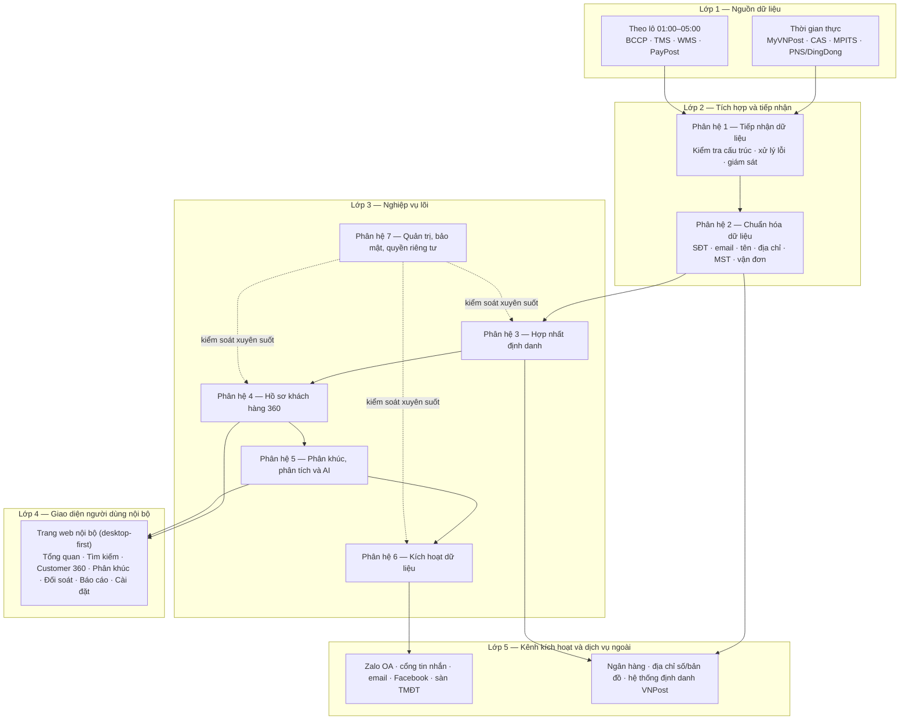
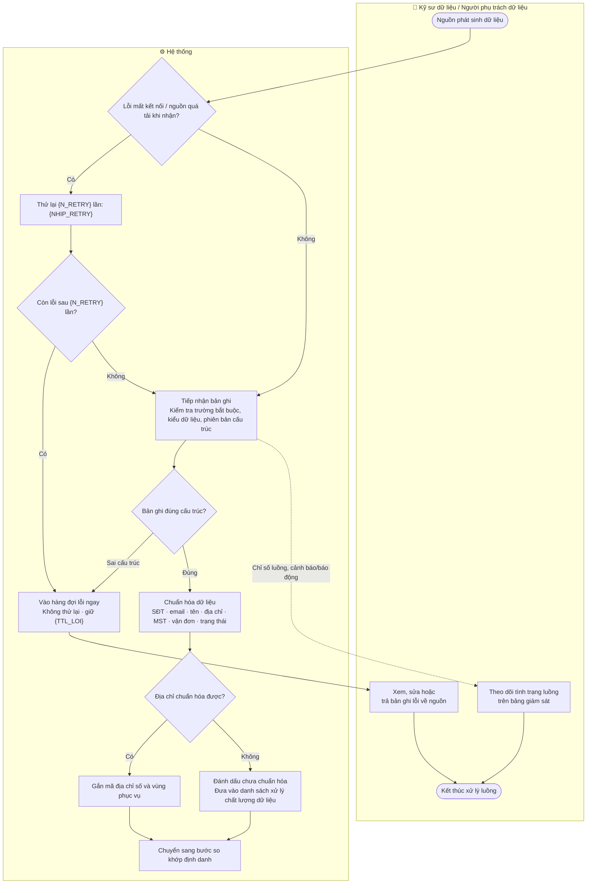
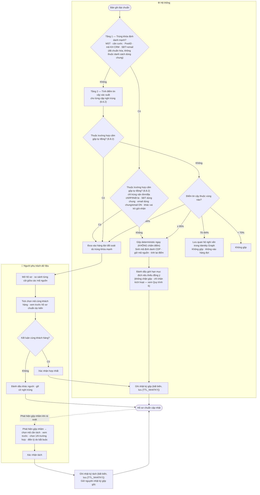
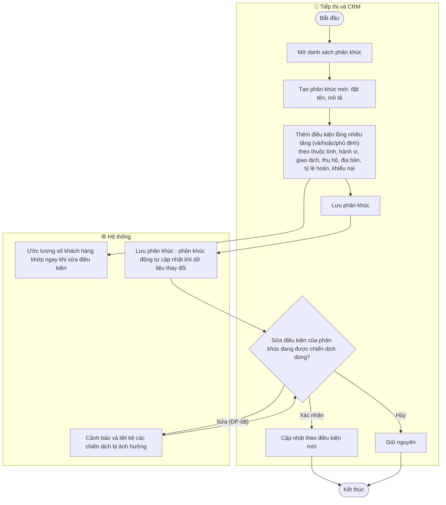
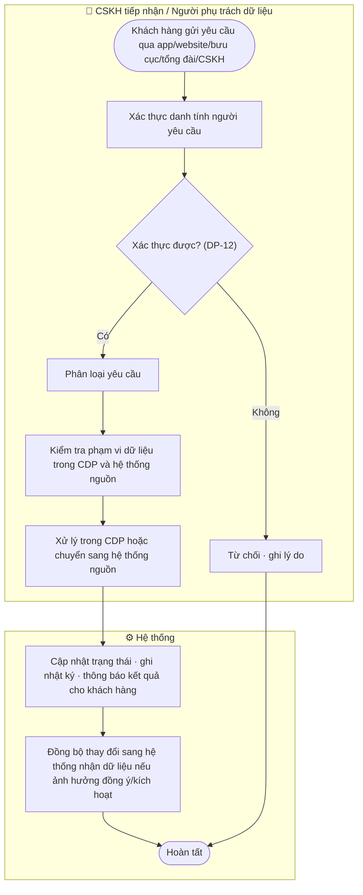
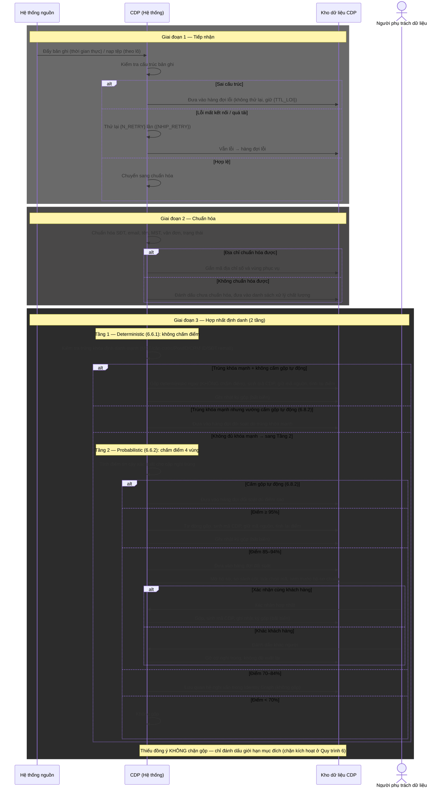
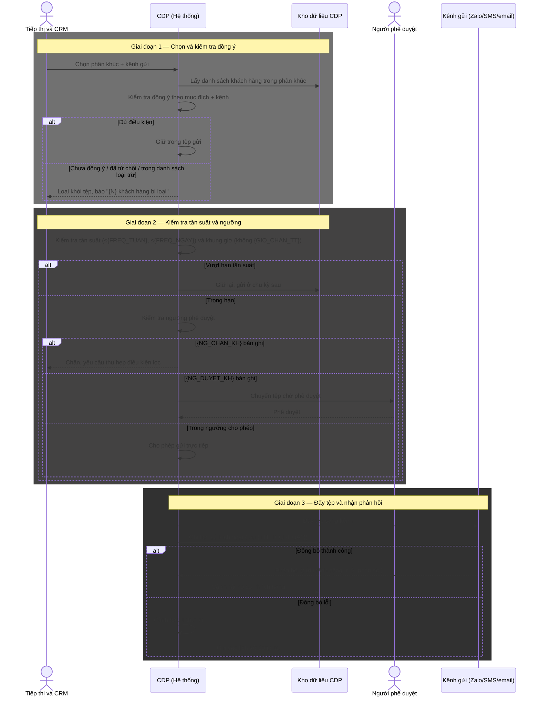

TỔNG CÔNG TY BƯU ĐIỆN VIỆT NAM (VNPost/TCT)

# TÀI LIỆU ĐẶC TẢ YÊU CẦU NGƯỜI DÙNG

## Nền tảng Dữ liệu Khách hàng — Customer Data Platform (CDP)

**Phiên bản:** v1.8 — **KHUNG ĐẦY ĐỦ (Mục I → IV + C, cả 7 phân hệ)** — Mục I + Mục II + Lô 1 (Phân hệ 3, 4) + Lô 2 (Phân hệ 1, 2) + Lô 3 (Phân hệ 5) + Lô 4 (Phân hệ 6, 7) + Mục C (Yêu cầu phi chức năng)
**Địa điểm – Thời gian:** Hà Nội – Tháng 08/2026

---

## Bảng theo dõi thay đổi

| Phiên bản | Ngày | Nội dung | Người thực hiện |
|---|---|---|---|
| v1 | 08/2026 | Khởi tạo khung tổng thể: Mục I (Giới thiệu) và Mục II (Yêu cầu tổng thể) cho cả 7 phân hệ. Chưa bao gồm Mục III (Use Case), Mục IV (Giao diện), Mục C (Phi chức năng) — sẽ viết theo lô ở các vòng sau | BA |
| v1.1 | 08/2026 | Patch theo QA review — sửa 2 CRITICAL + 4 MAJOR: (CR-01) chốt MVP chỉ người gửi, người nhận Out of scope MVP theo A2, OQ-02 chuyển Out of scope P1; (CR-02) bổ sung "email dùng chung" vào danh sách cấm gộp tự động DP-05; (MA-01) tách bạch quyền Xem báo cáo gộp/tách và quyền Đề xuất tách (REQUEST_UNMERGE); (MA-02) bỏ quyền tách hồ sơ của Quản trị hệ thống; (MA-03) chú thích FR-GOV-03 là góc quản trị của cùng nhật ký FR-IDR-14; (MA-05) làm rõ 10 mã FR-IDR có tên trên 14 vị trí. 5 MINOR (MI-01→05) ghi nhận xử lý ở lô Hợp nhất định danh | BA |
| v1.2 | 08/2026 | **Lô 1** — bổ sung Mục III (Đặc tả Use Case) và Mục IV (Giao diện chức năng) cho Phân hệ 3 (Hợp nhất định danh) và Phân hệ 4 (Customer 360): 11 Use Case (UC-IDR-01→07, UC-C360-01→04), 16 Business Rule (BR-IDR-01→12, BR-C360-01→04), 7 màn giao diện (SCR-IDR-01→05, SCR-C360-01→02) bám prototype v3. Đối chiếu thẳng tài liệu gốc CDP.md 6.6–6.10, 7.4, 7.5, 8.8, 8.9: xác nhận đủ tên **14 mã FR-IDR-01→14** và **15 mã FR-C360-01→15**. Áp ngưỡng 4 vùng 95/85/70 theo gốc; đánh dấu điểm lệch prototype (ngưỡng 90/60, mô hình phê duyệt tách cũ). Đặc tả bảng che dữ liệu theo vai trò (masking) theo 6.2 + 8.8. Bổ sung màn Tách hồ sơ (SCR-IDR-05 — prototype chưa có). Thêm OQ Lô 1 vào Phụ lục | BA |
| v1.3 | 08/2026 | Patch theo QA review Lô 1 — sửa 1 CRITICAL + 5 MAJOR: (CR-01) đồng bộ mã FR giữa Mục I/II và III — cập nhật cây chức năng II.2 với đủ 14 tên FR-IDR (thêm 03/04/05/10) và 15 tên FR-C360, gỡ toàn bộ chú thích "chưa đặt tên"/`[Cần xác nhận: mã]` ở I.2.1, II.2 và diễn giải Phân hệ 3; (MA-01) sửa ghi chú UC-IDR-07 trỏ nhầm III.C360 → bảng luật gốc CDP.md 6.6.1; (MA-02) thống nhất "10 nhóm dữ liệu / 11 tab, tab Doanh nghiệp là tab điều kiện" ở UC-C360-02 và SCR-C360-02; (MA-03) thêm dòng masking "Hồ sơ liên kết/alias" vào bảng III.C360 (kèm OQ-IDR-09); (MA-04) làm rõ 3 điều kiện empty-state SCR-C360-01 để testable, đồng bộ UC-C360-01; (MA-05) thêm cột Trạng thái (đã gộp/đã tách) vào bảng định danh liên kết SCR-C360-02. Thêm OQ-IDR-09→11; ghi nhận 5 MINOR QA Lô 1 (MI-L1-01→05, gom lô sau) | BA |
| v1.4 | 08/2026 | **Lô 2** — bổ sung Mục III (Đặc tả Use Case) và Mục IV (Giao diện chức năng) cho Phân hệ 1 (Tiếp nhận, FR-ING) và Phân hệ 2 (Chuẩn hóa và xử lý dữ liệu, FR-DPS): 13 Use Case (UC-ING-01→07, UC-DPS-01→06), 24 Business Rule (BR-ING-01→10, BR-DPS-01→14), 8 màn giao diện (SCR-ING-01→03, SCR-DPS-01→05 — trong đó 2 màn từ prototype v3 là màn giám sát luồng và panel chất lượng, 6 màn CẦN BỔ SUNG). Gộp 8 chức năng chuẩn hóa trường (FR-DPS-01→08) thành 2 UC (UC-DPS-01 định danh/liên hệ + UC-DPS-02 nghiệp vụ) với BR chi tiết từng trường. Đọc thẳng CDP.md 7.2 (FR-ING-01→10), 7.3 (FR-DPS-01→14), 6.10 (nguồn ưu tiên 12 nhóm), 6.11 (bảo vệ dữ liệu định danh): **cập nhật cây chức năng II.2** — gắn đủ 10 tên FR-ING và 14 tên FR-DPS, ghi rõ tương đương mã nhóm FR-INGEST≡FR-ING, FR-STD≡FR-DPS (chỉ điền tên mã gốc, không đổi cấu trúc cây, không đụng Phân hệ 3–7). Đặc tả SCR-ING-01 bằng ngôn ngữ nghiệp vụ, ghi khối điểm lệch yêu cầu **bỏ nhãn công nghệ Kafka/topic/lag/consumer** khỏi giao diện khi triển khai (D-04). Áp các con số baseline 7.2: thử lại 3 lần 1'–5'–15', hàng đợi lỗi 30 ngày, ngưỡng cảnh báo/báo động (vàng >15'/lỗi >1%; đỏ ngừng >15'/lỗi >5%/tồn >60'), độ trễ theo nhóm, mục tiêu chất lượng 6/12 tháng. Thêm 6 OQ Lô 2 (OQ-ING-01→04, OQ-DPS-01→02) — không có OQ critical chặn. Ranh giới quyền DATA-ENG vs DATA-STEWARD để mở (OQ-ING-01), không tự quyết | BA |
| v1.5 | 08/2026 | Patch theo QA review Lô 2 — sửa 1 CRITICAL + 4 MAJOR (+2 MINOR nhanh): (CR-01) bỏ cặp số bịa "~690.000/~1.200" gắn nhãn baseline 7.2 trong BR-ING-08, thay bằng lập luận định tính đúng nguồn; rà toàn file xác nhận không còn số cụ thể gắn nhãn baseline mà baseline không có. (MA-01) **mở Mục II.3/II.4** bổ sung 2 dòng quyền "Cấu hình rule chất lượng dữ liệu" và "Cấu hình nguồn dữ liệu ưu tiên" (DATA-STEWARD=X, Quản trị=(X)); tách action **CONFIG** khỏi UPDATE ở II.4.3 khối Chất lượng dữ liệu + làm rõ định nghĩa CONFIG vs UPDATE ở II.4.2; nối traceability UC-DPS-05/06 và SCR-DPS-04/05 tới quyền CONFIG. (MA-02) thêm actor phụ **SYS-ADMIN (= IT Admin gốc)** vào UC-ING-06 với phân vai rõ vs DATA-ENG, đồng bộ II.4.3; phân biệt rõ với OQ-ING-01 (DATA-ENG vs DATA-STEWARD). (MA-03) ghi rõ nhánh 6.4 "đồng bộ sang kênh thất bại" là lỗi **outbound thuộc Phân hệ 6 (lô sau)**, không phải gap Lô 2. (MA-04) làm rõ BR-ING-05 chuyển trạng thái ngược chiều "Trong hàng đợi lỗi → (Sửa và nạp lại) → Chờ thử lại", đồng bộ SCR-ING-03 row 10 + UC-ING-04 E3. (MI-01) bỏ 2 nhãn tech lặp trong bảng SCR-ING-01 (rows 5/6/15/19 — mapping vẫn còn ở khối điểm lệch); (MI-06) ghi rõ UC-DPS-04 quan sát ở SCR-C360-02. Thêm OQ-DPS-03 (mức CONFIG của SYS-ADMIN). 4 MINOR còn lại (MI-02→05) gom lô sau | BA |
| v1.6 | 08/2026 | **Lô 3** — bổ sung Mục III (Đặc tả Use Case) và Mục IV (Giao diện chức năng) cho Phân hệ 5 (Phân khúc, phân tích và AI, FR-ANA): 9 Use Case (UC-ANA-01→09), 12 Business Rule (BR-ANA-01→12), 7 màn giao diện (SCR-ANA-01→07 — trong đó 3 màn từ prototype v3 là danh sách/trình tạo/chi tiết phân khúc, 4 màn CẦN BỔ SUNG: dashboard BI, cấu hình ngưỡng cảnh báo, phân tích hiệu quả chiến dịch, quản lý mô hình AI). Đọc thẳng CDP.md 7.6: **cập nhật cây chức năng II.2** — gắn đủ 15 tên FR-ANA-01→15 với độ ưu tiên P1/P2, ghi rõ tương đương mã nhóm **FR-ANA ≡ FR-SEG/FR-ANALYTICS** (chỉ điền tên mã, không đổi cấu trúc cây, không đụng Phân hệ 6/7). Cập nhật ghi chú mã FR ở I.2.1. Gộp 7 mã chấm điểm/rủi ro (FR-ANA-04→10) thành 1 UC chấm điểm nền (UC-ANA-05) + 1 UC người dùng xem/xử lý (UC-ANA-06), định nghĩa nghiệp vụ từng loại điểm tách riêng ở BR-ANA-05→09 (không trộn công thức). Đánh dấu **P1 cho rủi ro COD (FR-ANA-08) và nguy cơ hoàn hàng (FR-ANA-09)** — ưu tiên cao theo bài toán giảm hoàn hàng; **P2 cho RFM/CLV/churn/fraud/recommendation/campaign/model/clustering**. **Giữ ranh giới BA vs Data Science:** đặc tả use case + đầu ra + cách dùng, KHÔNG đi vào thuật toán/công thức/tham số mô hình. **Che điểm số nhất quán tuyệt đối với III.C360/BR-C360-03 Lô 1** (BR-ANA-11: COD Risk + Fraud ẩn với MARKETING và CSKH). Không bịa số ngưỡng cảnh báo (đúng bài học Lô 2 CR-01) — để [Cần xác nhận] OQ-ANA-02. NOT trong builder để [Cần xác nhận] OQ-ANA-01 (prototype hiện chỉ AND/OR). Thêm 7 OQ Lô 3 (OQ-ANA-01→07) — không có OQ critical chặn | BA |
| v1.8 | 08/2026 | **Lô 4 (lô cuối) — hoàn tất cả 7 phân hệ + Mục C.** Bổ sung Mục III: III.6 (6 UC-ACT-01→06) cho Phân hệ 6 Kích hoạt (FR-ACT) và III.7 (9 UC-GOV-01→09) cho Phân hệ 7 Quản trị (FR-GOV); 21 Business Rule (BR-ACT-01→11, BR-GOV-01→10). Bổ sung Mục IV: IV.10 (12 màn — SCR-ACT-01→05, SCR-GOV-01→07, **tất cả CẦN BỔ SUNG** vì prototype v3 chưa phủ Phân hệ 6/7). Bổ sung **Mục C — Yêu cầu phi chức năng** (NFR-PERF/SEC/STOR/REL/COMP + bảng chất lượng dữ liệu 6/12 tháng), lấy từ baseline 7.2 + GD-01→09, không tự chế chỉ tiêu hiệu năng (RPS/uptime để [Cần xác nhận] OQ-GOV-07). Đọc thẳng CDP.md 7.7 (FR-ACT-01→14), 7.8 (FR-GOV-01→17), 7.9 (ma trận giai đoạn): **cập nhật cây chức năng II.2** — gắn đủ 14 tên FR-ACT + 17 tên FR-GOV với P1/P2; sau lô này **II.2 không còn `[Cần xác nhận: mã FR]` nào**. **⚠️ Sửa tham chiếu pháp lý lỗi thời (2 chỗ):** Nghị định 13/2023/NĐ-CP (hết hiệu lực 01/01/2026) → **Luật Bảo vệ dữ liệu cá nhân số 91/2025/QH15 (thông qua 26/6/2025) + Nghị định 356/2025/NĐ-CP (ban hành 31/12/2025)** ở thuật ngữ I.3 số 36 và mục đích Phân hệ 7 (II.2); bổ sung chế tài mới (tối đa 3 tỷ VND / 5% doanh thu xuyên biên giới); rà toàn file sạch NĐ 13. UC xương sống Luồng 6 (UC-ACT-01) gộp consent check + suppression + frequency + approval; edge 6.4 rút đồng ý sau đẩy tệp tách UC-ACT-06; Luồng 7 xử lý yêu cầu KH gộp UC-GOV-04 (thời hạn ở BR-GOV-08); Luồng 8 quản trị tách UC-GOV-01/02/09. Giữ ranh giới BA vs SA/IT Security (mã hóa/lineage/điều tra sự cố mức nghiệp vụ); masking tham chiếu Lô 1 không lặp; con số ngưỡng kích hoạt (>1.000/>100.000), xuất (≤1.000/1.001–10.000/>10.000/trần 100.000), tần suất (≤3/tuần, ≤1/kênh/ngày, 21h–08h), nhật ký (5/3/2 năm) lấy đúng baseline. Thêm 13 OQ Lô 4 (OQ-ACT-01→06, OQ-GOV-01→07) — không có OQ critical chặn | BA |
| v1.11 | 08/2026 | **Patch review chi tiết Quy trình 2 (Hợp nhất định danh) — sửa 1 MAJOR + 1 MINOR logic sơ đồ.** (P2-01) Swimlane Quy trình 2 có 2 nhánh hỏng: nhánh **V "đánh dấu khác người" cụt** (không có đầu ra) và nhánh **W "phát hiện gộp nhầm" mồ côi** (không có đầu vào). Sửa: nối `V --> Y` (đánh dấu khác người xong, hồ sơ cập nhật trạng thái) và `Y -.-> W` (từ hồ sơ đã có, người phụ trách phát hiện gộp nhầm khi rà soát rồi khởi tạo tách) — nhánh tách nay có điểm bắt đầu rõ ràng, sơ đồ khép kín. (P2-02) Nút **LOG2 (nhật ký tách) bổ sung thời hạn `{TTL_NHATKY}`** cho đồng bộ với LOG (nhật ký gộp). Còn lại P2-03 (bảng diễn giải trùng số "2" giữa khối tầng và khối thủ công) gom sửa một thể sau | BA |
| v1.10 | 08/2026 | **Patch review chi tiết Quy trình 1 (Tiếp nhận & chuẩn hóa) — sửa 1 MAJOR logic sơ đồ (P1-05).** Swimlane Quy trình 1 đảo sai thứ tự 2 nút quyết định: đặt "kiểm cấu trúc" (D) TRƯỚC "lỗi mất kết nối/quá tải" (F) — vô lý vì lỗi kết nối xảy ra ở khâu nhận, trước khi có bản ghi để kiểm cấu trúc; nhánh "đúng cấu trúc" lại đi hỏi "có mất kết nối không". Sửa lại đúng thứ tự nghiệp vụ khớp UC-ING-03/04: **nhận → (lỗi kết nối? → thử lại {N_RETRY} lần) → nhận được → (đúng cấu trúc? → sai thì hàng đợi lỗi) → chuẩn hóa**. Đồng bộ bảng diễn giải (đưa DP-02 trước DP-01, chỉnh câu bước 1.1). Nối lại node giám sát (B) qua cạnh nét đứt "chỉ số luồng, cảnh báo/báo động". Các điểm còn lại của QT1 (lệch biến số II.1↔Lô 2, CCCD/enrichment trong swimlane, dẫn chiếu BR-DPS) gom sửa một thể sau khi review xong các quy trình | BA |
| v1.9 | 08/2026 | **Patch theo review 10 quy trình (Mục II.1) — sửa 1 CRITICAL + 3 MAJOR + biến hóa tham số giả định.** (CR-01) **Tách 2 tầng hợp nhất định danh** đúng bản chất engine CDP.md 6.6.1/6.6.2: trước đây Quy trình 2 + Sequence A + Lô 1 gộp cả deterministic và probabilistic về **một thang điểm duy nhất** → sai (Dev hiểu mọi cặp đều phải chấm điểm xác suất). Nay tách rõ **Tầng 1 Deterministic** (trùng khóa mạnh MST/căn cước/PostID/CRM ID/SĐT+email → gộp thẳng, KHÔNG chấm điểm) và **Tầng 2 Probabilistic** (chỉ khi thiếu khóa mạnh mới chấm điểm 4 vùng 95/85/70). Sửa: swimlane QT2, Sequence A giai đoạn 3, thêm **BR-IDR-00**, sửa BR-IDR-01/02, UC-IDR-01 (luồng chính + ngoại lệ + tên), UC-IDR-03 bước 1, UC-IDR-07 luồng chính. (MA-01) **Chuyển "thiếu đồng ý" ra khỏi nhánh cấm gộp** — consent chỉ chặn kích hoạt (QT6/Phân hệ 6), KHÔNG chặn merge (CDP.md 6.8.2 case 7); thêm **BR-IDR-13**; sửa QT2 swimlane/diễn giải + UC-IDR-01 E3. (MA-02) **Gắn nhãn nguồn cho "email dùng chung"** trong nhánh cấm gộp — suy từ 6.6.1 case 2 + 6.8.3 case 5, không nằm tường minh 6.8.2 gốc (điều chỉnh cách ghi của v1.1 CR-02). (MA/MI) **"ngừng xử lý" → "hạn chế xử lý theo mục đích"** đúng thuật ngữ CDP.md 8.12 case 5 (QT7 + thuật ngữ I.3 số 37). **Biến hóa toàn bộ con số giả định trong Mục II.1 + II.5** thành biến có tên `{...}` (retry, tần suất, khung giờ, ngưỡng kích hoạt/xuất, SLA, thời hạn nhật ký, ngưỡng cảnh báo luồng…) + thêm **Bảng tham số giả định ở đầu Mục II.1** (24 biến, giá trị đề xuất, OQ tương ứng) — nối GD-02. Thêm **OQ-GOV-08** (ngưỡng xuất dữ liệu chưa có OQ). Phạm vi: Mục II.1, II.5, Lô 1 (III.0/III.1) — không đụng Mục IV, NFR, Phân hệ 2/3/5/6/7 phần ngoài số | BA |
| v1.7 | 08/2026 | Patch theo QA review Lô 3 — sửa 3 MAJOR (0 CRITICAL) + 2 MINOR nhanh: (MA-01) **thêm UC-ANA-10 "Cấu hình ngưỡng cảnh báo điểm số"** (actor người dùng DATA-STEWARD, [Cần xác nhận] OQ-ANA-02) để nối traceability cho SCR-ANA-05 — trước đó màn cấu hình ngưỡng (có nút Lưu + quyền) trỏ nhầm UC-ANA-05 (actor Hệ thống, thuần nền, không có bước nhập ngưỡng); giữ UC-ANA-05 thuần nền tiêu thụ ngưỡng đã cấu hình; cập nhật ánh xạ SCR-ANA-05 → UC-ANA-10; danh mục III.5.0 nay 10 UC. (MA-02) **mở Mục II.3/II.4** bổ sung 2 dòng quyền khối Phân khúc/Phân tích: "Cấu hình ngưỡng cảnh báo điểm số" (DATA-STEWARD **VIEW, CONFIG**; SYS-ADMIN VIEW — cùng khuôn CONFIG Lô 2) và "Quản lý mô hình AI (mức nghiệp vụ)" (VIEW cho DATA-STEWARD/SYS-ADMIN góc hỗ trợ, actor chính DATA-ANALYST để [Cần xác nhận] OQ-ANA-07); nối SCR-ANA-05/07 tới quyền tương ứng, gỡ trạng thái "Không đủ quyền" treo không nguồn. (MA-03) thêm ghi chú **FR-ANA-07 là mã ô dù** ở BR-ANA-07 và III.5.0: điểm chồng lấn lấy ưu tiên theo mã chuyên biệt — COD risk theo FR-ANA-08 (P1), fraud theo FR-ANA-10 (P2); P2 của FR-ANA-07 chỉ áp cho engagement/value/service quality, COD risk là P1 không bị kéo xuống. (MI-02) thêm ngoại lệ **cây điều kiện rỗng hoàn toàn** chặn lưu (UC-ANA-01 E3, đồng bộ SCR-ANA-02). (MI-04) chuẩn hóa tên vai trò trong BR-ANA-11 kèm mã role code. 3 MINOR còn lại (MI-01, 03, 05) gom lô sau | BA |

---

## Về phạm vi của phiên bản tài liệu này

Từ **v1.8, tài liệu đã hoàn tất khung URD/SRS đầy đủ cho cả 7 phân hệ**, gồm:

- **Mục I — Giới thiệu** (I.1 Mục đích · I.2 Phạm vi · I.3 Thuật ngữ · I.4 Kiến trúc tổng thể)
- **Mục II — Yêu cầu tổng thể** (II.1 Workflow · II.2 Function Tree · II.3 Permission Matrix · II.4 RBAC · II.5 Sequence)
- **Mục III — Đặc tả Use Case** cho cả 7 phân hệ (III.1 IDR · III.2 C360 · III.3 ING · III.4 DPS · III.5 ANA · III.6 ACT · III.7 GOV)
- **Mục IV — Giao diện chức năng** (IV.1–IV.7 Lô 1 · IV.8 Lô 2 · IV.9 Lô 3 · IV.10 Lô 4)
- **Mục C — Yêu cầu phi chức năng** (hiệu năng/quy mô, bảo mật/quyền riêng tư, lưu trữ, độ tin cậy, chất lượng dữ liệu, tương thích/truy cập)

Các lô đã hoàn tất theo thứ tự: (1) Hợp nhất định danh + Customer 360 — Lô 1; (2) Tiếp nhận + Chuẩn hóa — Lô 2; (3) Phân khúc, phân tích và AI — Lô 3; (4) Kích hoạt + Quản trị, bảo mật, quyền riêng tư — Lô 4.

**Nguồn giao diện chuẩn cho Mục IV là prototype v3** (`.claude/output/cdp-tct/wireframe/prototype-v3.html` — bản chốt 24/07/2026), không phải `wireframe-v1.md`. Prototype v3 phủ Lô 1–3; **12 màn Lô 4 (IV.10) là CẦN BỔ SUNG** vì prototype chưa phủ Phân hệ 6/7 — layout mô tả theo FR gốc + baseline, đánh dấu rõ tại từng màn.

> **Lưu ý về giả định và câu hỏi mở:** Toàn bộ dự án hiện chưa có buổi họp chính thức với VNPost và chưa có tài liệu yêu cầu từ phía VNPost. Các nội dung trong tài liệu này được viết theo **giả định có mã** (tham chiếu GD-01→GD-09 và A1→A8). Chỗ nào phụ thuộc câu trả lời chưa có từ VNPost được đánh dấu `[Cần xác nhận: ...]` ngay tại vị trí đó, không dùng "TBD".

---

# I. GIỚI THIỆU

## I.1. Mục đích tài liệu

CDP là **nền tảng dữ liệu khách hàng tập trung** của Tổng công ty Bưu điện Việt Nam. Hệ thống làm ba việc chính:

1. **Thu thập dữ liệu khách hàng** từ toàn bộ hệ sinh thái IT của VNPost (hơn 8 luồng dữ liệu, khoảng 1,7 triệu bản ghi mỗi ngày).
2. **Hợp nhất các định danh rời rạc** của cùng một khách hàng đang nằm rải trên nhiều hệ thống nguồn thành một hồ sơ khách hàng duy nhất (hồ sơ 360).
3. **Kích hoạt lại kết quả** — đưa dữ liệu đã hợp nhất và phân tích trở về phục vụ kinh doanh, chăm sóc khách hàng, tiếp thị và vận hành.

**CDP không thay thế** các hệ thống nghiệp vụ hiện có. Nó là **lớp dữ liệu trung gian** nằm giữa các hệ thống nguồn (tạo đơn, thanh toán, quan hệ khách hàng…) và các kênh sử dụng dữ liệu. CDP không xử lý nghiệp vụ gốc (tạo vận đơn, thu tiền COD, ký hợp đồng) — những việc đó vẫn nằm ở hệ thống nguồn.

**Đối tượng sử dụng tài liệu:**

| Đối tượng | Sử dụng tài liệu để |
|---|---|
| Lập trình viên (Dev) | Hiểu phạm vi chức năng, luồng nghiệp vụ, quy tắc để triển khai |
| Kiểm thử viên (Tester) | Lập kế hoạch kiểm thử, viết ca kiểm thử theo luồng và điều kiện |
| Kiến trúc sư giải pháp (SA) | Nắm bối cảnh nghiệp vụ, ranh giới hệ thống, các điểm tích hợp |
| Chủ sản phẩm (PO), nghiệp vụ VNPost | Xác nhận phạm vi, giả định và quyết định các câu hỏi mở |

**Vai trò trong vòng đời dự án:** Tài liệu là đặc tả yêu cầu người dùng (URD/SRS) — cầu nối giữa yêu cầu nghiệp vụ và bản triển khai kỹ thuật. Mức chi tiết hướng tới **Dev/Test-ready**: đọc xong có thể lập trình và viết ca kiểm thử mà không cần hỏi lại người phân tích, trừ các điểm còn đánh dấu `[Cần xác nhận: ...]`.

## I.2. Phạm vi tài liệu

### I.2.1. Phạm vi chức năng — 7 phân hệ

Tài liệu bao phủ **toàn bộ 7 phân hệ** của CDP, khoảng **99 mã yêu cầu chức năng**:

| # | Phân hệ | Nhóm mã yêu cầu | Nội dung chính |
|---|---|---|---|
| 1 | Tiếp nhận dữ liệu | FR-ING (≡ FR-INGEST) | Tiếp nhận dữ liệu thời gian thực và theo lô; kiểm tra cấu trúc; xử lý lỗi và thử lại; giám sát luồng |
| 2 | Chuẩn hóa và xử lý dữ liệu | FR-DPS (≡ FR-STD) | Chuẩn hóa số điện thoại, email, họ tên, địa chỉ, mã số thuế, mã vận đơn, trạng thái; theo dõi chất lượng dữ liệu |
| 3 | Hợp nhất định danh | FR-IDR | Tính điểm tin cậy; đối sánh; gộp và tách hồ sơ; sơ đồ liên kết định danh; nhật ký gộp/tách |
| 4 | Quản lý hồ sơ khách hàng 360 | FR-C360 | Tra cứu; hồ sơ hợp nhất 10 nhóm dữ liệu; hiển thị theo phân quyền; ghi chú và gắn nhãn |
| 5 | Phân khúc, phân tích và trí tuệ nhân tạo | FR-ANA (≡ FR-SEG/FR-ANALYTICS) | Phân khúc động; chấm điểm; cảnh báo rủi ro; phân tích theo mô hình gần đây/tần suất/giá trị; dự báo rời bỏ |
| 6 | Kích hoạt dữ liệu | FR-ACT | Kiểm tra đồng ý; kiểm tra tần suất và khung giờ; phê duyệt theo ngưỡng; đẩy sang kênh; nhận phản hồi |
| 7 | Quản trị, bảo mật và quyền riêng tư | FR-GOV | Quản lý tài khoản, vai trò, phạm vi; nhật ký bất biến; quản lý đồng ý; xử lý yêu cầu chủ thể dữ liệu; báo cáo tuân thủ |

> **Về mã yêu cầu chi tiết:** **Cả 7 phân hệ đã có đủ tên mã theo tài liệu gốc `CDP.md`**: Lô 1 — **14 mã FR-IDR-01→14** (mục 7.4) và **15 mã FR-C360-01→15** (mục 7.5); Lô 2 — **10 mã FR-ING-01→10** (mục 7.2) và **14 mã FR-DPS-01→14** (mục 7.3); Lô 3 — **15 mã FR-ANA-01→15** (mục 7.6); Lô 4 — **14 mã FR-ACT-01→14** (mục 7.7) và **17 mã FR-GOV-01→17** (mục 7.8). Xem cây chức năng đầy đủ ở Mục II.2 và danh mục ánh xạ ở Mục III.0 / III.3.0 / III.4.0 / III.5.0 / III.6.0 / III.7.0.
>
> **Lưu ý mã nhóm:** tài liệu này dùng mã gốc CDP.md là **FR-ING** (Phân hệ 1), **FR-DPS** (Phân hệ 2), **FR-ANA** (Phân hệ 5), **FR-ACT** (Phân hệ 6), **FR-GOV** (Phân hệ 7). Các mã nhóm cũ từng dùng ở phiên bản khung là tương đương: **FR-INGEST ≡ FR-ING**, **FR-STD ≡ FR-DPS**, **FR-SEG/FR-ANALYTICS ≡ FR-ANA**. Từ v1.8, mọi tham chiếu chi tiết đều dùng mã gốc CDP.md và **không còn** `[Cần xác nhận: mã FR]` nào trong cây chức năng II.2.

### I.2.2. Ranh giới hệ thống

| Nội dung | Ranh giới |
|---|---|
| **Đăng nhập và xác thực** | CDP **nhận danh tính** từ cổng đăng nhập chung của tổ chức (mã nhân sự đã cấp quyền hoặc đăng nhập một lần nội bộ). CDP **không tự quản lý** tài khoản, mật khẩu, và **không có màn hình đăng nhập riêng** (GD-08) |
| **Khách hàng cuối** | **Không truy cập CDP.** Không có màn hình nào dành cho khách hàng của VNPost. CDP là công cụ nội bộ |
| **Trạng thái đồng ý dữ liệu** | CDP **chỉ nhận** trạng thái đồng ý từ nguồn: ứng dụng MyVNPost, website, quầy giao dịch, hệ thống quan hệ khách hàng. CDP **không tự thu** đồng ý từ khách hàng |
| **Yêu cầu xem/xóa dữ liệu của khách hàng** | Đến qua **bộ phận chăm sóc khách hàng tiếp nhận** rồi nhập vào CDP. **Không có kênh tự phục vụ** cho khách hàng |
| **Thiết bị truy cập** | Trang web độc lập trên trình duyệt. Mở được trên điện thoại qua đường dẫn, nhưng **tối ưu hiển thị cho điện thoại chưa phải ưu tiên giai đoạn này** — làm cho máy tính trước (GD-09) |

### I.2.3. Năng lực theo mức ưu tiên

CDP triển khai theo bốn giai đoạn ưu tiên. Bảng dưới giúp Dev/Tester nắm được đâu là năng lực cốt lõi cần có trước.

| Mức | Giai đoạn | Năng lực |
|---|---|---|
| **P0** | Thử nghiệm | Tiếp nhận thời gian thực và theo lô · chuẩn hóa số điện thoại, họ tên, địa chỉ · hợp nhất định danh với sơ đồ liên kết · hồ sơ 360 cơ bản · quản lý đồng ý · phân quyền theo vai trò · nhật ký thao tác · bảng theo dõi chất lượng dữ liệu |
| **P1** | Mở rộng nghiệp vụ | Phân khúc động · đồng bộ sang hệ thống quan hệ khách hàng · kích hoạt kênh tiếp thị · lịch sử thu hộ và thanh toán · lịch sử khiếu nại · phân tích rủi ro thu hộ và hoàn hàng · danh sách loại trừ · xử lý yêu cầu của khách hàng |
| **P2** | Nâng cao | Phân tích theo mô hình gần đây/tần suất/giá trị · giá trị vòng đời khách hàng · dự báo nguy cơ rời bỏ · chấm điểm khách hàng · phát hiện gian lận · gợi ý dịch vụ · danh mục dữ liệu và truy vết dòng dữ liệu · kiểm soát theo mục đích sử dụng · phân quyền theo đơn vị và địa bàn · báo cáo tuân thủ |

### I.2.4. Ngoài phạm vi tài liệu

- Xác thực và quản lý tài khoản (do cổng đăng nhập chung của tổ chức đảm nhận — xem I.2.2).
- Nghiệp vụ gốc của các hệ thống nguồn (tạo vận đơn, thu tiền COD, ký hợp đồng…).
- Chi tiết kỹ thuật của tầng dữ liệu và tích hợp (mô hình dữ liệu vật lý, endpoint API, hạ tầng) — thuộc phạm vi SA/Dev.
- Màn hình dành cho khách hàng cuối (không tồn tại — xem I.2.2).
- Hồ sơ khách hàng độc lập cho người nhận — MVP không tạo customer profile riêng cho người nhận; người nhận chỉ được ghi nhận ở tầng giao dịch của người gửi. Xem xét lại ở giai đoạn P1 (OQ-02).

## I.3. Định nghĩa thuật ngữ và từ viết tắt

| STT | Thuật ngữ | Diễn giải |
|---|---|---|
| 1 | **CDP** (Customer Data Platform) | Nền tảng dữ liệu khách hàng — lớp dữ liệu trung gian thu thập, hợp nhất và kích hoạt dữ liệu khách hàng |
| 2 | **Hồ sơ 360** (Customer 360) | Hồ sơ khách hàng hợp nhất, gom toàn bộ thông tin của một khách hàng từ nhiều hệ thống nguồn về một chỗ, gồm 10 nhóm dữ liệu (định danh, mã liên kết, địa chỉ, doanh nghiệp, hoạt động dịch vụ, hành vi số, chăm sóc khách hàng, điểm số/phân khúc, đồng ý, nhật ký nguồn) |
| 3 | **Hợp nhất định danh** (Identity Resolution) | Quá trình nhận diện các mã định danh khác nhau ở nhiều hệ thống thực chất là cùng một khách hàng, rồi gộp lại thành một hồ sơ chuẩn |
| 4 | **Sơ đồ liên kết định danh** (Identity Graph) | Cấu trúc lưu quan hệ giữa các mã định danh của cùng một khách hàng — gồm cả quan hệ đã gộp và quan hệ nghi vấn chưa gộp |
| 5 | **Điểm tin cậy** (Confidence Score) | Điểm từ 0–100% thể hiện mức độ chắc chắn hai bản ghi là cùng một khách hàng. Quyết định hành vi gộp theo 4 vùng (mục 8 bảng này) |
| 6 | **Bốn vùng tin cậy** | Từ 95% trở lên: tự động gộp · 85–94%: chờ người xác nhận · 70–84%: lưu quan hệ nghi vấn, không gộp · dưới 70%: không gộp |
| 7 | **Hồ sơ chuẩn** | Hồ sơ khách hàng sau khi hợp nhất, mang một mã định danh CDP duy nhất, được các hệ thống khác dùng làm bản gốc |
| 8 | **Mã định danh CDP** | Mã duy nhất hệ thống sinh ra cho mỗi hồ sơ chuẩn sau khi hợp nhất |
| 9 | **Mã nguồn** (Source ID) | Mã định danh khách hàng ở một hệ thống nguồn cụ thể (ví dụ: mã khách hàng CRM, PostID, mã KHL) |
| 10 | **Mã thay thế** (Alternate ID) | Mã nguồn cũ được giữ lại sau khi gộp, để truy vết và đồng bộ ngược. **Mã nguồn không bao giờ bị xóa** sau khi gộp |
| 11 | **Gộp hồ sơ** (Merge) | Thao tác hợp nhất nhiều mã định danh vào một hồ sơ chuẩn |
| 12 | **Tách hồ sơ** (Unmerge) | Thao tác tách một hoặc nhiều mã nguồn ra khỏi hồ sơ chuẩn khi phát hiện gộp nhầm |
| 13 | **Hàng đợi đối soát** | Danh sách các cặp hồ sơ nghi trùng (vùng 85–94%) chờ người phụ trách dữ liệu xác nhận gộp hay không |
| 14 | **Đồng ý theo mục đích và kênh** (Consent by purpose & channel) | Đồng ý của khách hàng được xét riêng cho **từng mục đích** (vận hành, tiếp thị, phân tích) và **từng kênh** (SMS, Zalo, email…). Đồng ý cho vận hành không tự động dùng được cho tiếp thị |
| 15 | **Danh sách loại trừ** | Danh sách khách hàng bị loại khỏi mọi tệp kích hoạt tiếp thị bất kể trạng thái đồng ý |
| 16 | **Phân khúc động** (Dynamic Segment) | Nhóm khách hàng thỏa một bộ điều kiện, **tự cập nhật** khi dữ liệu khách hàng thay đổi (khác phân khúc tĩnh — chốt danh sách một lần) |
| 17 | **Kích hoạt dữ liệu** (Activation) | Đưa một phân khúc sang kênh giao tiếp cụ thể (SMS, Zalo, email…) để chạy chiến dịch, sau khi đã kiểm tra đồng ý, tần suất và ngưỡng phê duyệt |
| 18 | **Nhật ký bất biến** (Immutable Log) | Nhật ký chỉ được **ghi thêm**, không sửa, không xóa — dùng cho gộp/tách hồ sơ và thay đổi đồng ý, phục vụ giải trình |
| 19 | **Nguồn ưu tiên** | Quy tắc chọn giá trị khi nhiều hệ thống nguồn cung cấp cùng một trường dữ liệu nhưng giá trị khác nhau |
| 20 | **Số dùng chung** | Số điện thoại được nhiều người dùng chung (ví dụ tổng đài, số doanh nghiệp) — **không dùng làm khóa gộp tự động** |
| 21 | **KHL** (Khách hàng lớn) | Khách hàng doanh nghiệp có hợp đồng với VNPost, thường là doanh nghiệp thương mại điện tử |
| 22 | **COD** (Cash on Delivery) | Thu hộ tiền hàng khi giao — chiếm 70–80% giao dịch thương mại điện tử tại Việt Nam. Dữ liệu COD là dữ liệu tài chính nhạy cảm |
| 23 | **Điểm rủi ro COD / thu hộ** | Điểm đánh giá nguy cơ một giao dịch COD không thu được tiền hoặc bị hoàn |
| 24 | **CLV** (Customer Lifetime Value) | Giá trị vòng đời khách hàng — ước lượng tổng giá trị một khách hàng mang lại |
| 25 | **Người gửi** (Shipper) | Khách hàng gửi hàng — cá nhân hoặc doanh nghiệp. Thường có tài khoản VNPost |
| 26 | **Người nhận** (Consignee) | Đầu nhận của bưu gửi — thường không có tài khoản VNPost. **Giai đoạn MVP, CDP không xây hồ sơ độc lập cho người nhận** (theo A2): người nhận chỉ xuất hiện như thuộc tính trên giao dịch của người gửi, không tạo customer profile riêng. Xem xét lại ở giai đoạn P1 (OQ-02) |
| 27 | **MyVNPost** | Ứng dụng khách hàng của VNPost — nguồn dữ liệu hành vi số, tạo đơn (nhóm thời gian thực) |
| 28 | **CAS** | Hệ thống chấp nhận gửi / cổng khách hàng lớn — nguồn dữ liệu giao dịch và định danh KHL |
| 29 | **MPITS** | Nền tảng tích hợp trung tâm, đã kết nối API với sàn thương mại điện tử — ứng viên làm cổng dữ liệu cho CDP (phụ thuộc OQ-04) |
| 30 | **PNS/DingDong** | Hệ thống phát và ứng dụng bưu tá — nguồn dữ liệu trạng thái phát (nhóm thời gian thực) |
| 31 | **BCCP** | Hệ thống khai thác bưu chính — nguồn dữ liệu theo lô (hệ thống cũ) |
| 32 | **TMS** (Transport Management System) | Hệ thống quản lý vận tải — nguồn dữ liệu theo lô (hệ thống cũ) |
| 33 | **WMS** (Warehouse Management System) | Hệ thống quản lý kho — nguồn dữ liệu theo lô (hệ thống cũ) |
| 34 | **PayPost** | Hệ thống thanh toán — nguồn dữ liệu thu hộ và đối soát tài chính (theo lô, sau khi chốt sổ) |
| 35 | **PostID** | Hệ thống định danh người dùng của VNPost. Độ phủ khách hàng phụ thuộc OQ-03 |
| 36 | **Luật Bảo vệ dữ liệu cá nhân số 91/2025/QH15 và Nghị định 356/2025/NĐ-CP** | Khung pháp lý về bảo vệ dữ liệu cá nhân, áp dụng bắt buộc. **Luật số 91/2025/QH15** được Quốc hội thông qua ngày 26/6/2025, hiệu lực từ 01/01/2026; **Nghị định 356/2025/NĐ-CP** ban hành 31/12/2025 quy định chi tiết. Yêu cầu CDP có quản lý đồng ý, quyền được lãng quên, và nhật ký kiểm toán từ ngày đầu. **Chế tài mới:** vi phạm thông thường phạt tối đa **3 tỷ VND**; chuyển dữ liệu xuyên biên giới trái phép phạt tối đa **5% doanh thu năm liền trước**. (Thay thế Nghị định 13/2023/NĐ-CP đã hết hiệu lực từ 01/01/2026) |
| 37 | **Quyền chủ thể dữ liệu** | Quyền của khách hàng: xem, chỉnh sửa, rút đồng ý, hạn chế xử lý theo mục đích, xóa/ẩn danh, yêu cầu giải thích (theo CDP.md 8.12) |
| 38 | **Che dữ liệu** (Masking) | Ẩn một phần hoặc toàn bộ giá trị nhạy cảm theo phân quyền vai trò (ví dụ: `090***123`) |

## I.4. Kiến trúc tổng thể hệ thống

CDP tổ chức theo **năm lớp** ở mức nghiệp vụ: từ nguồn dữ liệu đầu vào, qua lớp tích hợp, đến lớp nghiệp vụ (7 phân hệ), lên lớp giao diện người dùng nội bộ, và ra các kênh kích hoạt / dịch vụ ngoài.



**Diễn giải từng lớp:**

**Lớp 1 — Nguồn dữ liệu.** Cung cấp dữ liệu khách hàng cho CDP. Chia hai nhóm theo độ trễ:
- **Thời gian thực:** MyVNPost, CAS, MPITS, PNS/DingDong — đẩy sự kiện ngay khi phát sinh (mục tiêu độ trễ ≤ 5 phút cho hành vi số và tạo đơn; ≤ 15 phút cho trạng thái phát và thu hộ).
- **Theo lô:** BCCP, TMS, WMS, PayPost — xuất dữ liệu một lần mỗi ngày trong khung 01:00–05:00; riêng đối soát thu hộ chạy sau khi hệ thống thanh toán chốt sổ.

> **[Cần xác nhận: MPITS làm cổng dữ liệu chung hay tích hợp riêng lẻ]** (OQ-04) — Nếu MPITS mở kết nối và tổng hợp sẵn dữ liệu từ các hệ thống con, CDP lấy dữ liệu từ một cổng thay vì tích hợp từng hệ thống. Nếu không, phải tích hợp riêng lẻ từng nguồn, khối lượng và thời gian tăng nhiều lần. Cách tích hợp cụ thể (giao thức, endpoint) thuộc phạm vi SA/Dev.

**Lớp 2 — Tích hợp và tiếp nhận.** Gồm Phân hệ 1 (tiếp nhận, kiểm tra cấu trúc bản ghi, xử lý lỗi và thử lại, giám sát luồng) và Phân hệ 2 (chuẩn hóa số điện thoại, email, họ tên, địa chỉ, mã số thuế, mã vận đơn, trạng thái bưu gửi và thu hộ về bộ chuẩn). Đầu ra là các bản ghi đạt chuẩn chuyển sang bước hợp nhất định danh.

**Lớp 3 — Nghiệp vụ lõi.** Năm phân hệ trung tâm:
- **Hợp nhất định danh (Phân hệ 3):** tính điểm tin cậy, đối sánh, gộp/tách hồ sơ, sinh mã định danh CDP, giữ mã nguồn làm mã thay thế.
- **Hồ sơ khách hàng 360 (Phân hệ 4):** tra cứu và hiển thị hồ sơ hợp nhất 10 nhóm dữ liệu, che dữ liệu theo phân quyền.
- **Phân khúc, phân tích và AI (Phân hệ 5):** tạo và quản lý phân khúc động, chấm điểm khách hàng, cảnh báo rủi ro.
- **Kích hoạt dữ liệu (Phân hệ 6):** kiểm tra đồng ý theo mục đích và kênh, kiểm tra tần suất và ngưỡng phê duyệt, đẩy tệp sang kênh, nhận phản hồi.
- **Quản trị, bảo mật và quyền riêng tư (Phân hệ 7):** quản lý tài khoản/vai trò/phạm vi, nhật ký bất biến, quản lý đồng ý, xử lý yêu cầu chủ thể dữ liệu, báo cáo tuân thủ. Lớp này **kiểm soát xuyên suốt** các phân hệ khác (đường nét đứt trong sơ đồ).

**Lớp 4 — Giao diện người dùng nội bộ.** Trang web nội bộ, tối ưu cho máy tính (desktop-first). Các nhóm màn hình: Tổng quan, Tìm kiếm khách hàng, Customer 360, Phân khúc, Đối soát định danh, Báo cáo, Cài đặt. Chỉ người dùng nội bộ đã được cổng đăng nhập chung cấp quyền mới truy cập.

> Tên và đặc tả chi tiết từng màn hình sẽ được viết ở Mục IV theo lô sau, **bám theo prototype v3** (bản chốt 24/07/2026).

**Lớp 5 — Kênh kích hoạt và dịch vụ ngoài.**
- **Kênh kích hoạt (đầu ra):** Zalo OA, cổng tin nhắn, email, Facebook, sàn thương mại điện tử — nơi CDP đẩy tệp khách hàng để chạy chiến dịch.
- **Dịch vụ ngoài (hỗ trợ xử lý):** ngân hàng (đối soát thu hộ), hệ thống địa chỉ số và bản đồ (chuẩn hóa địa chỉ), hệ thống định danh người dùng VNPost.

> **[Cần xác nhận: kênh kích hoạt thực tế VNPost đang dùng]** (liên quan M3 clarification) — Chưa xác nhận VNPost đang dùng những kênh nào (SMS, Zalo OA, email, push MyVNPost) và có sẵn công cụ Marketing Automation nào. Danh sách kênh trên lấy theo mục 8 baseline; cần VNPost xác nhận để chốt phạm vi tích hợp Phân hệ 6.

---

# II. CÁC YÊU CẦU VỀ TỔNG THỂ PHẦN MỀM

## II.1. Sơ đồ quy trình nghiệp vụ (Workflow Diagram)

**Danh sách quy trình** (8 luồng nghiệp vụ chính):

1. Tiếp nhận và chuẩn hóa dữ liệu
2. Hợp nhất định danh (gộp và tách hồ sơ)
3. Tra cứu hồ sơ khách hàng 360
4. Tạo và quản lý phân khúc
5. Chấm điểm và cảnh báo rủi ro
6. Kích hoạt dữ liệu
7. Xử lý yêu cầu của khách hàng
8. Quản trị và tuân thủ

---

### Tham số giả định áp dụng cho toàn bộ Mục II.1

> **Quan trọng — đọc trước khi xem quy trình.** Các sơ đồ và diễn giải bên dưới dùng **biến có tên** (dạng `{TÊN_BIẾN}`) cho mọi con số giới hạn/ngưỡng/thời hạn. Toàn bộ giá trị đề xuất là **do người phân tích đề xuất, VNPost chưa duyệt** (xem GD-02). Bảng này là nơi tra cứu giá trị đề xuất duy nhất — khi VNPost chốt số thật, chỉ cập nhật ở đây và các biến trong quy trình tự đúng theo.

| Biến | Ý nghĩa | Giá trị đề xuất | Câu hỏi mở |
|---|---|---|---|
| `{N_RETRY}` | Số lần tự động thử lại khi lỗi mất kết nối/quá tải | 3 lần | OQ-ING (Lô 2) |
| `{NHIP_RETRY}` | Nhịp giãn giữa các lần thử lại | 1 phút → 5 phút → 15 phút | OQ-ING (Lô 2) |
| `{TTL_LOI}` | Thời gian giữ bản ghi trong hàng đợi lỗi trước khi chuyển lưu trữ | 30 ngày | OQ-ING (Lô 2) |
| `{FREQ_TUAN}` | Trần số tin gửi tối đa mỗi khách hàng mỗi tuần (mọi kênh) | 3 tin/tuần | OQ-09 |
| `{FREQ_NGAY}` | Trần số tin gửi tối đa mỗi kênh mỗi ngày | 1 tin/kênh/ngày | OQ-09 |
| `{GIO_CHAN_TT}` | Khung giờ không gửi tin tiếp thị | 21:00 – 08:00 | OQ-09 |
| `{NG_DUYET_KH}` | Ngưỡng số bản ghi trong tệp kích hoạt cần phê duyệt trước khi gửi | trên 1.000 | OQ-ACT-02 |
| `{NG_CHAN_KH}` | Ngưỡng số bản ghi tệp kích hoạt bị chặn, yêu cầu thu hẹp | trên 100.000 | OQ-ACT-02 |
| `{NG_XUAT_1}` | Ngưỡng xuất dữ liệu cần duyệt bởi quản lý trực tiếp | 1.001 – 10.000 | OQ-GOV-08 |
| `{NG_XUAT_2}` | Ngưỡng xuất dữ liệu cần duyệt bởi quản trị dữ liệu và tuân thủ | trên 10.000 | OQ-GOV-08 |
| `{NG_XUAT_TRAN}` | Trần cứng số bản ghi mỗi lần xuất, không cho vượt | 100.000/lần | OQ-GOV-08 |
| `{SLA_RUT_DY}` | Hạn nội bộ xử lý yêu cầu rút đồng ý | 4 giờ làm việc | OQ liên quan (GD-03) |
| `{SLA_XEM_SUA}` | Hạn nội bộ xử lý yêu cầu xem/sửa dữ liệu | 7 ngày | OQ liên quan (GD-03) |
| `{SLA_HAN_CHE}` | Hạn nội bộ xử lý yêu cầu hạn chế xử lý theo mục đích | 10 ngày | OQ liên quan (GD-03) |
| `{SLA_XOA}` | Hạn nội bộ xử lý yêu cầu xóa/ẩn danh dữ liệu | 15 ngày | OQ liên quan (GD-03) |
| `{TON_DONG_HD}` | Ngưỡng tồn đọng hàng đợi đối soát phát cảnh báo | 200 hồ sơ | OQ-IDR |
| `{CHO_TOI_DA}` | Thời gian một hồ sơ chờ trong hàng đợi đối soát trước khi cảnh báo | 5 ngày | OQ-IDR |
| `{TTL_NHATKY}` | Thời hạn lưu nhật ký gộp/tách và nhật ký đồng ý (bất biến) | 5 năm | OQ-08, OQ-IDR-01 (GD-04) |
| `{TTL_KICHHOAT}` | Thời hạn lưu lịch sử kích hoạt chiến dịch | 3 năm | OQ-GOV-02 (baseline 7.2) |
| `{SLA_RUT_KENH}` | Thời hạn đẩy trạng thái rút đồng ý sang kênh để loại khỏi hàng chờ chưa gửi | 24 giờ | OQ-ACT-06 |
| `{CB_TON_TG}` | Ngưỡng thời gian tồn đọng luồng tiếp nhận phát cảnh báo | 15 phút | OQ-ING (Lô 2) |
| `{CB_LOI_GIO}` | Ngưỡng tỷ lệ lỗi tiếp nhận mỗi giờ phát cảnh báo | 1%/giờ | OQ-ING (Lô 2) |
| `{BD_NGUNG}` | Ngưỡng thời gian nguồn ngừng đẩy phát báo động | 15 phút | OQ-ING (Lô 2) |
| `{BD_LOI_GIO}` | Ngưỡng tỷ lệ lỗi tiếp nhận mỗi giờ phát báo động | 5%/giờ | OQ-ING (Lô 2) |
| `{BD_TON_TG}` | Ngưỡng thời gian tồn đọng luồng tiếp nhận phát báo động | 60 phút | OQ-ING (Lô 2) |

### Hai tầng hợp nhất định danh — nguyên tắc bắt buộc cho Quy trình 2 và Sequence A

> **Bản chất engine hợp nhất định danh gồm hai tầng chạy nối tiếp, KHÔNG phải một thang điểm duy nhất** (CDP.md mục 6.6.1 và 6.6.2):
>
> - **Tầng 1 — Đối sánh tuyệt đối (Deterministic Matching, 6.6.1):** khi hai bản ghi **trùng khóa định danh mạnh** (mã số thuế, căn cước, mã định danh VNPost/PostID, mã khách hàng CRM, hoặc số điện thoại kèm email — đều đã chuẩn hóa và không thuộc danh sách dùng chung) → hệ thống **gộp thẳng, KHÔNG chấm điểm phần trăm**. Trước khi gộp vẫn phải qua bước kiểm trường hợp cấm gộp tự động (6.8.2); nếu vướng thì đẩy hàng đợi đối soát.
> - **Tầng 2 — Đối sánh xác suất (Probabilistic Matching, 6.6.2):** **chỉ khi không đủ khóa mạnh** ở tầng 1, hệ thống mới tính điểm tin cậy theo tín hiệu hỗ trợ (địa chỉ, thiết bị, hành vi, tên gần giống…), rồi phân loại theo **bốn vùng: ≥95% tự gộp · 85–94% hàng đợi đối soát · 70–84% lưu quan hệ nghi vấn · dưới 70% không gộp**.
>
> Bốn vùng phần trăm chỉ áp dụng cho **tầng 2**. Phần lớn hồ sơ VNPost (khách hàng lớn có mã số thuế, tài khoản app có PostID) sẽ được gộp ở **tầng 1 — không đi qua chấm điểm**.

---

### Quy trình 1: Tiếp nhận và chuẩn hóa dữ liệu

**Swimlane Diagram:**



**Diễn giải luồng quy trình:**

| Bước | Tác nhân | Mô tả |
|---|---|---|
| 1 | Hệ thống nguồn | Phát sinh dữ liệu — nhóm thời gian thực đẩy sự kiện ngay; nhóm hệ thống cũ xuất theo lô 01:00–05:00 |
| **Trường hợp lỗi mất kết nối/quá tải khi nhận (DP-02)** | Hệ thống | Lỗi ở khâu nhận dữ liệu (trước khi có bản ghi để kiểm cấu trúc): thử lại `{N_RETRY}` lần theo nhịp `{NHIP_RETRY}`; vẫn lỗi thì vào hàng đợi lỗi |
| 1.1 | Hệ thống | Nhận được bản ghi rồi, kiểm tra cấu trúc: trường bắt buộc, kiểu dữ liệu, phiên bản cấu trúc |
| **Trường hợp sai cấu trúc (DP-01)** | Hệ thống | Đưa bản ghi vào hàng đợi lỗi ngay, **không thử lại**; giữ `{TTL_LOI}` rồi chuyển lưu trữ |
| 2 | Hệ thống | Chuẩn hóa bản ghi đạt cấu trúc: số điện thoại về một dạng, email về chữ thường, họ tên bỏ khoảng trắng thừa và xử lý dấu, mã số thuế kiểm tra độ dài, mã vận đơn chuẩn hóa chữ hoa, trạng thái bưu gửi và thu hộ ánh xạ về bộ chuẩn |
| 2.1 | Hệ thống | Bóc tách địa chỉ theo cấp hành chính và ánh xạ mã địa chỉ số |
| **Trường hợp địa chỉ không chuẩn hóa được (DP-03)** | Hệ thống | Đánh dấu chưa chuẩn hóa, đưa vào danh sách xử lý chất lượng dữ liệu |
| 3 | Hệ thống | Bản ghi đạt chuẩn chuyển sang bước so khớp định danh (Quy trình 2) |
| 4 | Kỹ sư dữ liệu / Người phụ trách dữ liệu | Theo dõi tình trạng luồng trên bảng giám sát; xem, sửa hoặc trả bản ghi lỗi về nguồn |
| **Cảnh báo luồng** | Hệ thống | Cảnh báo khi tồn đọng cần hơn `{CB_TON_TG}` xử lý hoặc tỷ lệ lỗi vượt `{CB_LOI_GIO}`; báo động khi nguồn ngừng đẩy quá `{BD_NGUNG}` trong khung giờ hoạt động, tỷ lệ lỗi vượt `{BD_LOI_GIO}`, hoặc tồn đọng cần hơn `{BD_TON_TG}` |

---

### Quy trình 2: Hợp nhất định danh (gộp và tách hồ sơ)

**Swimlane Diagram:**



**Diễn giải luồng quy trình:**

| Bước | Tác nhân | Mô tả |
|---|---|---|
| **1 — Tầng 1 (Deterministic, 6.6.1)** | Hệ thống | Kiểm tra cặp bản ghi có **trùng khóa định danh mạnh** không (mã số thuế · căn cước · PostID · mã khách hàng CRM · số điện thoại kèm email — đã chuẩn hóa, không thuộc danh sách dùng chung). Nếu có và không vướng cấm gộp tự động → **gộp thẳng, KHÔNG chấm điểm phần trăm** |
| **2 — Tầng 2 (Probabilistic, 6.6.2)** | Hệ thống | **Chỉ khi không đủ khóa mạnh ở tầng 1**, hệ thống mới tính điểm tin cậy theo tín hiệu hỗ trợ (địa chỉ, thiết bị, hành vi, tên gần giống…) rồi phân loại theo bốn vùng |
| **Nhánh cấm gộp tự động (DP-05)** | Hệ thống | Áp dụng cho **cả hai tầng** trước khi gộp. Nếu chỉ trùng mã vận đơn / địa chỉ / địa chỉ mạng / thiết bị, hoặc số điện thoại dùng chung, hoặc **email dùng chung / email doanh nghiệp** *(suy từ CDP.md 6.6.1 case 2 — email dùng chung không được làm khóa gộp mạnh — và 6.8.3 case 5; không nằm tường minh trong danh sách 6.8.2 gốc)*, hoặc người gửi–người nhận chỉ trùng một thông tin phụ → đưa vào hàng đợi đối soát dù trùng khóa mạnh hoặc điểm cao. **Lưu ý: thiếu đồng ý KHÔNG thuộc nhánh này** — consent chỉ chặn kích hoạt (Quy trình 6), không chặn gộp (6.8.2 case 7) |
| **Nhánh vùng tin cậy — chỉ Tầng 2 (DP-04)** | Hệ thống | Từ 95%: tự động gộp · 85–94%: vào hàng đợi đối soát · 70–84%: lưu quan hệ nghi vấn (không gộp, không vào hàng đợi) · dưới 70%: không gộp. **Bốn vùng này không áp dụng cho cặp đã gộp ở tầng 1** |
| **Nhánh thiếu đồng ý** | Hệ thống | Cặp vẫn được gộp bình thường (phục vụ hồ sơ 360 và vận hành), nhưng **đánh dấu giới hạn mục đích**; hệ quả chỉ là không đưa vào tệp kích hoạt (xử lý ở Quy trình 6), không ảnh hưởng quyết định gộp |
| 2 | Người phụ trách dữ liệu | Mở hồ sơ trong hàng đợi, xem bảng so sánh từng cột giữa các mã nguồn |
| 2.1 | Người phụ trách dữ liệu | Tick chọn mã thuộc cùng khách hàng, xem trước hồ sơ chuẩn dự kiến |
| 2.2 | Người phụ trách dữ liệu | Xác nhận hợp nhất, **hoặc** đánh dấu là các khách hàng khác nhau (DP-06) |
| 2.3 | Hệ thống | Khi gộp: sinh mã định danh CDP, giữ toàn bộ mã nguồn cũ làm mã thay thế, tính lại điểm số, ghi nhật ký gộp bất biến |
| 3 | Người phụ trách dữ liệu | Khi phát hiện gộp nhầm: chọn mã nguồn cần tách, xem trước kết quả tách, chọn 1 trong 6 trường hợp tách, **điền lý do bắt buộc**, xác nhận |
| 3.1 | Hệ thống | Tách hồ sơ, trả lại mã nguồn tương ứng, phân chia lại dữ liệu và điểm số về đúng hồ sơ gốc, **không làm mất lịch sử vận đơn**, ghi nhật ký tách. **Nhật ký gộp gốc được giữ nguyên** |
| **Trường hợp hai người cùng xử lý một hồ sơ** | Hệ thống | Ai bấm trước người đó thắng. Không khóa hồ sơ. Người sau nhận thông báo ngay trên màn hình, danh sách được làm mới |
| **Trường hợp tách một mã giữa chuỗi gộp nhiều lần** | Hệ thống | Cảnh báo chuỗi gộp phức tạp, **không cho tách trực tiếp**, ghi vào danh sách chờ xử lý riêng (giai đoạn sau) |
| **Trường hợp vai trò không có quyền tách** | Chăm sóc khách hàng / Kinh doanh / Vận hành | Bấm nút **Báo cáo** kèm lý do; người phụ trách dữ liệu xem và tự quyết định có tách hay không |

> **[Cần xác nhận: khóa gộp khi PostID chưa phủ đủ]** (OQ-03, A3) — Nếu PostID chưa phủ toàn bộ khách hàng, số điện thoại (đã chuẩn hóa, không thuộc danh sách dùng chung) là khóa ghép nối chính. Cần VNPost xác nhận độ phủ PostID và trường hợp cùng số điện thoại nhưng là hai khách hàng khác nhau.

---

### Quy trình 3: Tra cứu hồ sơ khách hàng 360

**Swimlane Diagram:**


**Diễn giải luồng quy trình:**

| Bước | Tác nhân | Mô tả |
|---|---|---|
| 1 | Người dùng | Tìm khách hàng theo một trong: số điện thoại, email, mã khách hàng, mã KHL, mã định danh VNPost (PostID), mã vận đơn, mã số thuế |
| 1.1 | Hệ thống | Trả danh sách kết quả; dữ liệu nhạy cảm đã che theo vai trò người tìm |
| 2 | Người dùng | Mở một khách hàng để xem hồ sơ đầy đủ (định danh, mã liên kết, địa chỉ, doanh nghiệp, hoạt động dịch vụ, hành vi số, chăm sóc khách hàng, điểm số/phân khúc, đồng ý, nhật ký nguồn) |
| 2.1 | Hệ thống (DP-07) | Mỗi nhóm dữ liệu hiển thị theo đúng quyền vai trò; nhóm không được xem thì ẩn hoặc che, không hiện dữ liệu rỗng gây hiểu nhầm |
| 3 | Người dùng | Người có quyền xem được nguồn phát sinh của từng nhóm dữ liệu và so sánh giá trị giữa các hệ thống nguồn |
| 4 | Người dùng | Người có quyền ghi chú hoặc gắn nhãn khách hàng cần chăm sóc đặc biệt |
| **Trường hợp không đủ quyền xem một nhóm** | Hệ thống | Hiển thị: "Bạn không có quyền xem thông tin này. Liên hệ quản trị hệ thống nếu công việc của bạn cần dùng đến." |
| **Trường hợp không có kết quả** | Hệ thống | Hiển thị: "Không tìm thấy khách hàng nào khớp điều kiện lọc." |

---

### Quy trình 4: Tạo và quản lý phân khúc

**Swimlane Diagram:**



**Diễn giải luồng quy trình:**

| Bước | Tác nhân | Mô tả |
|---|---|---|
| 1 | Tiếp thị và CRM | Mở danh sách phân khúc, xem các phân khúc đang có kèm số khách hàng khớp |
| 2 | Tiếp thị và CRM | Tạo phân khúc mới: đặt tên, mô tả, thêm điều kiện theo trường dữ liệu |
| 2.1 | Hệ thống | Điều kiện hỗ trợ lồng nhiều tầng với phép và/hoặc/phủ định trên thuộc tính hồ sơ, hành vi, giao dịch, thu hộ, địa bàn, tỷ lệ hoàn, khiếu nại |
| 2.2 | Hệ thống | Ước lượng số khách hàng khớp ngay khi người dùng sửa điều kiện |
| 3 | Tiếp thị và CRM | Lưu phân khúc |
| 3.1 | Hệ thống | Phân khúc động tự cập nhật khi dữ liệu khách hàng thay đổi |
| **Trường hợp sửa phân khúc đang chạy chiến dịch (DP-08)** | Hệ thống | Cảnh báo và liệt kê các chiến dịch bị ảnh hưởng; người dùng xác nhận thì phân khúc cập nhật theo điều kiện mới |

---

### Quy trình 5: Chấm điểm và cảnh báo rủi ro

**Swimlane Diagram:**


**Diễn giải luồng quy trình:**

| Bước | Tác nhân | Mô tả |
|---|---|---|
| 1 | Hệ thống | Tính định kỳ các điểm cho từng khách hàng: mức độ tương tác, CLV, nguy cơ rời bỏ, rủi ro thu hộ, rủi ro gian lận, chất lượng dịch vụ |
| 1.1 | Hệ thống | Ghi kết quả vào hồ sơ và hiển thị theo quyền của từng vai trò (điểm rủi ro thu hộ và gian lận ẩn với CSKH và Tiếp thị) |
| 2 | Hệ thống | Khi điểm vượt ngưỡng cảnh báo: đưa khách hàng vào phân khúc tương ứng và phát cảnh báo qua thông báo trong ứng dụng và email |
| 3 | Bộ phận nhận cảnh báo | Mở hồ sơ xem căn cứ, ghi nhận hành động xử lý |

---

### Quy trình 6: Kích hoạt dữ liệu

**Swimlane Diagram:**


**Diễn giải luồng quy trình:**

| Bước | Tác nhân | Mô tả |
|---|---|---|
| 1 | Tiếp thị và CRM | Chọn phân khúc cần kích hoạt và kênh gửi |
| 1.1 | Hệ thống (DP-09) | Kiểm tra đồng ý cho từng khách hàng theo đúng mục đích và đúng kênh |
| **Trường hợp bị loại** | Hệ thống | Khách hàng chưa đồng ý, đã từ chối, hoặc trong danh sách loại trừ bị loại khỏi tệp; báo số lượng bị loại: "{N} khách hàng trong phân khúc chưa đồng ý nhận {kênh}. Hệ thống đã loại khỏi tệp gửi." |
| **Trường hợp toàn bộ bị loại** | Hệ thống | "Không có khách hàng nào trong phân khúc này đủ điều kiện nhận {kênh}. Tệp gửi trống." |
| 1.2 | Hệ thống (DP-10) | Kiểm tra hạn mức tần suất (≤ `{FREQ_TUAN}` mọi kênh; ≤ `{FREQ_NGAY}`) và khung giờ (không gửi tiếp thị `{GIO_CHAN_TT}`). Vượt hạn thì giữ lại, gửi ở chu kỳ sau |
| 1.3 | Hệ thống (DP-11) | Kiểm tra ngưỡng phê duyệt: `{NG_DUYET_KH}` bản ghi cần phê duyệt; `{NG_CHAN_KH}` chặn, yêu cầu thu hẹp |
| 2 | Hệ thống | Đẩy tệp sang kênh; theo dõi trạng thái đồng bộ; ghi lịch sử kích hoạt (lưu `{TTL_KICHHOAT}`) |
| **Trường hợp đồng bộ lỗi** | Hệ thống | Thử lại theo cơ chế tiếp nhận; cảnh báo cho quản trị; ghi vào lịch sử đồng bộ |
| 3 | Hệ thống | Nhận phản hồi từ kênh (gửi thành công, mở, phản hồi) và cập nhật lại hồ sơ khách hàng |
| **Trường hợp khách hàng rút đồng ý khi tệp đã đẩy** | Hệ thống | Chặn ngay khi tạo tệp tiếp theo; đẩy trạng thái rút đồng ý sang kênh trong `{SLA_RUT_KENH}` để kênh loại khỏi hàng chờ chưa gửi. Tin đã gửi thì ghi nhận vào lịch sử, không thu hồi |

---

### Quy trình 7: Xử lý yêu cầu của khách hàng

**Swimlane Diagram:**



**Diễn giải luồng quy trình:**

| Bước | Tác nhân | Mô tả |
|---|---|---|
| 1 | Khách hàng | Gửi yêu cầu qua ứng dụng, website, bưu cục, tổng đài hoặc CSKH (không có kênh tự phục vụ vào CDP — xem I.2.2) |
| 2 | CSKH tiếp nhận | Xác thực danh tính người yêu cầu để tránh trả dữ liệu cho sai người |
| **Trường hợp không xác thực được (DP-12)** | CSKH tiếp nhận | Từ chối, ghi lý do |
| 3 | CSKH tiếp nhận | Phân loại yêu cầu: xem dữ liệu, chỉnh sửa, rút đồng ý, **hạn chế xử lý theo mục đích**, xóa/ẩn danh, yêu cầu giải thích *(dùng đúng thuật ngữ CDP.md 8.12 case 5 — "hạn chế xử lý", không phải "ngừng xử lý")* |
| 4 | Người phụ trách dữ liệu | Kiểm tra phạm vi dữ liệu trong CDP và các hệ thống nguồn liên quan |
| 5 | Người phụ trách dữ liệu | Xử lý trong CDP, hoặc chuyển yêu cầu sang hệ thống nguồn nếu dữ liệu gốc nằm ở đó |
| 5.1 | Hệ thống | Cập nhật trạng thái, ghi nhật ký, thông báo kết quả cho khách hàng |
| 5.2 | Hệ thống | Đồng bộ thay đổi sang các hệ thống nhận dữ liệu nếu ảnh hưởng tới đồng ý hoặc kích hoạt |
| **Cảnh báo thời hạn** | Hệ thống | Cảnh báo khi còn một phần ba thời hạn nội bộ; báo lên quản lý ngay khi quá hạn nội bộ (rút đồng ý mục tiêu `{SLA_RUT_DY}`; xem/sửa `{SLA_XEM_SUA}`; hạn chế xử lý `{SLA_HAN_CHE}`; xóa/ẩn danh `{SLA_XOA}`). **Các hạn nội bộ này đặt chặt hơn trần luật (GD-03), là giả định chưa được VNPost duyệt** |

---

### Quy trình 8: Quản trị và tuân thủ

**Swimlane Diagram:**


**Diễn giải luồng quy trình:**

| Bước | Tác nhân | Mô tả |
|---|---|---|
| 1 | Quản trị hệ thống | Tạo tài khoản, gán vai trò và phạm vi dữ liệu theo đơn vị, địa bàn, nhóm khách hàng phụ trách |
| 2 | Quản trị hệ thống | Cấp quyền đặc biệt có thời hạn; hệ thống tự cho hết hạn khi đến hạn |
| 2.1 | Hệ thống | Ghi nhật ký không thể xóa cho mọi thao tác quan trọng (danh sách trong sơ đồ) |
| 3 | Hệ thống (DP tương ứng ngưỡng xuất) | Xuất dữ liệu vượt ngưỡng phải qua phê duyệt: `{NG_XUAT_1}` duyệt bởi quản lý trực tiếp; `{NG_XUAT_2}` duyệt bởi quản trị dữ liệu và tuân thủ; trần cứng `{NG_XUAT_TRAN}` không cho vượt |
| 3.1 | Hệ thống | Tệp xuất luôn che dữ liệu nhạy cảm trừ khi người xuất có quyền đặc biệt và ghi rõ lý do |
| 4 | An toàn thông tin | Theo dõi truy cập bất thường: truy cập ngoài giờ, tải dữ liệu lớn, tra cứu nhiều lần dữ liệu định danh |
| 5 | Pháp chế và tuân thủ | Xem báo cáo định kỳ về đồng ý, truy cập, xuất dữ liệu, xử lý yêu cầu khách hàng, chất lượng dữ liệu |

---

**Câu hỏi mở liên quan Mục II.1:**

- [ ] OQ-01: Use case nào ưu tiên cho giai đoạn đầu? (Người trả lời: Chủ sản phẩm / VNPost)
- [~] OQ-02: "Khách hàng" trong CDP gồm người gửi, hay cả người nhận? Nếu có người nhận thì cơ chế đồng ý cho nhóm chưa từng đăng ký là gì? → Out of scope MVP theo A2 (CDP chỉ xây hồ sơ cho người gửi) — mở lại xem xét ở giai đoạn P1 (Người trả lời: Chủ sản phẩm / Pháp chế)

## II.2. Sơ đồ phân cấp chức năng (Business Function Diagram)

```
CDP — Nền tảng Dữ liệu Khách hàng VNPost
│
├── Phân hệ 1: Tiếp nhận dữ liệu (FR-ING ≡ FR-INGEST)
│   ├── API tiếp nhận sự kiện thời gian thực (FR-ING-01)
│   ├── Kết nối đồng bộ dữ liệu theo lô 01:00–05:00 (FR-ING-02)
│   ├── Tích hợp SDK cho Web/Mobile (FR-ING-03) [ưu tiên Medium]
│   ├── Kiểm tra cấu trúc dữ liệu đầu vào — Schema Registry & Validation (FR-ING-04)
│   ├── Quản lý kết nối nguồn dữ liệu — khai báo/bật-tắt/kiểm tra kết nối (FR-ING-05)
│   ├── Tích hợp dữ liệu qua MPITS (FR-ING-06) [phụ thuộc OQ-04]
│   ├── Kết nối dữ liệu từ kênh bên ngoài — Zalo/Facebook/SMS/Email/sàn TMĐT (FR-ING-07) [ưu tiên Medium]
│   ├── Giám sát quá trình thu thập dữ liệu và cảnh báo (FR-ING-08)
│   ├── Tự động thử lại và lưu hàng đợi lỗi — Retry & Dead Letter Queue, giữ 30 ngày (FR-ING-09)
│   └── Ghi nhật ký tiếp nhận dữ liệu — Ingestion Audit Log (FR-ING-10)
│       └── (Đủ 10 mã FR-ING-01→10 có tên theo CDP.md mục 7.2 — xem III.3.0)
│
├── Phân hệ 2: Chuẩn hóa và xử lý dữ liệu (FR-DPS ≡ FR-STD)
│   ├── Chuẩn hóa số điện thoại (FR-DPS-01)
│   ├── Chuẩn hóa email (FR-DPS-02)
│   ├── Chuẩn hóa họ tên khách hàng (FR-DPS-03)
│   ├── Chuẩn hóa địa chỉ — bóc tách tỉnh/huyện/xã, liên kết VPostCode/Vmap (FR-DPS-04)
│   ├── Kiểm tra mã số thuế 10/13 số (FR-DPS-05)
│   ├── Kiểm tra và bảo vệ dữ liệu CCCD — masking/hạn chế quyền (FR-DPS-06)
│   ├── Chuẩn hóa mã vận đơn/mã đơn hàng (FR-DPS-07)
│   ├── Chuẩn hóa trạng thái nghiệp vụ — Status Mapping (FR-DPS-08)
│   ├── Phát hiện và xử lý dữ liệu trùng lặp — Data Deduplication (FR-DPS-09)
│   ├── Làm giàu dữ liệu khách hàng — Data Enrichment (FR-DPS-10)
│   ├── Cấu hình quy tắc kiểm tra chất lượng dữ liệu (FR-DPS-11)
│   ├── Bảng điều khiển chất lượng dữ liệu — Data Quality Dashboard (FR-DPS-12)
│   ├── Danh sách rà soát và xử lý dữ liệu lỗi — Error Review & Correction Queue (FR-DPS-13)
│   └── Cấu hình nguồn dữ liệu ưu tiên — Source Priority Rules (FR-DPS-14)
│       └── (Đủ 14 mã FR-DPS-01→14 có tên theo CDP.md mục 7.3 — xem III.4.0)
│
├── Phân hệ 3: Hợp nhất định danh (FR-IDR)
│   ├── Luật đối sánh tuyệt đối (FR-IDR-01)
│   ├── Luật đối sánh xác suất (FR-IDR-02) [ưu tiên Medium — chưa triển khai]
│   ├── Gộp hồ sơ (FR-IDR-06)
│   ├── Tách hồ sơ (FR-IDR-07)
│   ├── Đánh dấu định danh dùng chung (FR-IDR-08)
│   ├── Phân biệt vai trò người gửi/người nhận trên từng giao dịch (FR-IDR-09) [không tạo customer profile riêng cho người nhận — xem A2]
│   ├── Tính điểm tin cậy và phân loại kết quả (FR-IDR-11)
│   ├── Danh sách rà soát thủ công / hàng đợi đối soát (FR-IDR-12)
│   ├── Xử lý xung đột dữ liệu định danh (FR-IDR-13)
│   ├── Nhật ký hợp nhất định danh (FR-IDR-14, đồng thời là FR-GOV-03 ở góc quản trị — một chức năng, hai mã truy vết)
│   ├── Cơ sở dữ liệu đồ thị định danh / Identity Graph (FR-IDR-03)
│   ├── Sinh mã khách hàng hợp nhất / Unified Customer ID (FR-IDR-04)
│   ├── Quản lý mã định danh gốc và mã thay thế / Alias ID (FR-IDR-05)
│   ├── Liên kết hồ sơ ẩn danh với hồ sơ đã định danh (FR-IDR-10)
│   └── Báo cáo tổng hợp gộp/tách hồ sơ
│       └── (Đủ 14 mã FR-IDR-01→14 có tên theo CDP.md mục 7.4 — xem III.0)
│
├── Phân hệ 4: Quản lý hồ sơ khách hàng 360 (FR-C360)
│   ├── Bảng thông tin hồ sơ khách hàng hợp nhất (FR-C360-01)
│   ├── Khung thông tin định danh khách hàng (FR-C360-02)
│   ├── Lịch sử giao dịch khách hàng (FR-C360-03)
│   ├── Dòng thời gian hành trình bưu gửi (FR-C360-04)
│   ├── Lịch sử COD và thanh toán (FR-C360-05)
│   ├── Dòng thời gian tương tác đa kênh (FR-C360-06)
│   ├── Lịch sử khiếu nại và yêu cầu hỗ trợ (FR-C360-07)
│   ├── Thông tin khách hàng thân thiết / loyalty (FR-C360-08)
│   ├── Hiển thị phân khúc và điểm số khách hàng (FR-C360-09)
│   ├── Hiển thị trạng thái đồng ý sử dụng dữ liệu (FR-C360-10)
│   ├── Che giấu dữ liệu theo vai trò / masking (FR-C360-11)
│   ├── Tìm kiếm khách hàng (FR-C360-12)
│   ├── Truy vết nguồn dữ liệu trong hồ sơ (FR-C360-13)
│   ├── Ghi chú và gắn nhãn khách hàng (FR-C360-14)
│   └── Tính toán thuộc tính phái sinh (FR-C360-15)
│       └── (Đủ 15 mã FR-C360-01→15 có tên theo CDP.md mục 7.5 — xem III.0)
│
├── Phân hệ 5: Phân khúc, phân tích và trí tuệ nhân tạo (FR-ANA ≡ FR-SEG/FR-ANALYTICS)
│   ├── Thiết lập phân khúc theo quy tắc — Visual Rule Builder, điều kiện lồng AND/OR/NOT (FR-ANA-01)
│   ├── Ước lượng quy mô tệp khách hàng theo thời gian thực (FR-ANA-02) [ưu tiên Medium]
│   ├── Tự động cập nhật phân khúc — Dynamic Audience Refresh (FR-ANA-03)
│   ├── Phân tích RFM — gần đây/tần suất/giá trị (FR-ANA-04) [P2]
│   ├── Phân tích giá trị vòng đời khách hàng — CLV (FR-ANA-05) [P2, ưu tiên Medium]
│   ├── Dự báo nguy cơ khách hàng rời bỏ — Churn Prediction (FR-ANA-06) [P2]
│   ├── Chấm điểm khách hàng — engagement/value/churn/COD/fraud/service (FR-ANA-07) [P2]
│   ├── Chấm điểm rủi ro COD — COD Risk Scoring (FR-ANA-08) [P1]
│   ├── Phân tích nguy cơ hoàn hàng — Return Risk Analysis (FR-ANA-09) [P1]
│   ├── Phát hiện rủi ro/gian lận — Fraud/Risk Detection (FR-ANA-10) [P2, ưu tiên Medium]
│   ├── Gợi ý sản phẩm/dịch vụ phù hợp — Recommendation (FR-ANA-11) [P2, ưu tiên Medium]
│   ├── Phân tích hiệu quả chiến dịch — Campaign Analytics (FR-ANA-12) [P2, ưu tiên Medium]
│   ├── Bảng điều khiển và báo cáo phân tích — Dashboard & BI (FR-ANA-13) [P2]
│   ├── Quản lý mô hình AI — AI Model Management (FR-ANA-14) [P2, ưu tiên Low/Medium]
│   └── Phân nhóm khách hàng tự động bằng AI — AI Clustering (FR-ANA-15) [P2, ưu tiên Medium]
│       └── (Đủ 15 mã FR-ANA-01→15 có tên theo CDP.md mục 7.6 — xem III.5.0)
│
├── Phân hệ 6: Kích hoạt dữ liệu (FR-ACT)
│   ├── Đồng bộ dữ liệu sang CRM (FR-ACT-01) [P1]
│   ├── Đồng bộ dữ liệu sang kênh marketing — SMS/Email/Zalo OA/Push (FR-ACT-02) [P1]
│   ├── Kiểm tra đồng ý trước khi kích hoạt — Consent Check (FR-ACT-03) [P1]
│   ├── Quản lý danh sách loại trừ — Suppression List (FR-ACT-04) [P1]
│   ├── Xuất tệp khách hàng phục vụ chiến dịch — Campaign Audience Export (FR-ACT-05) [P2, ưu tiên Medium]
│   ├── API cá nhân hóa theo thời gian thực (FR-ACT-06) [P2, ưu tiên Medium]
│   ├── Đồng bộ gợi ý dịch vụ sang hệ thống kinh doanh/BSS (FR-ACT-07) [P2, ưu tiên Medium]
│   ├── Tích hợp dữ liệu với hệ thống CSKH (FR-ACT-08) [P1]
│   ├── Kích hoạt cảnh báo rủi ro — COD/hoàn hàng/gian lận/churn (FR-ACT-09) [P2, ưu tiên Medium]
│   ├── Lưu lịch sử kích hoạt — Activation History, lưu 3 năm (FR-ACT-10) [P1]
│   ├── Kiểm soát tần suất gửi — Frequency Capping (FR-ACT-11) [P2, ưu tiên Medium]
│   ├── Quy trình phê duyệt kích hoạt — Activation Approval Workflow (FR-ACT-12) [P2, ưu tiên Medium]
│   ├── Giám sát đồng bộ sang hệ thống đích — Downstream Sync Monitoring (FR-ACT-13) [P2, ưu tiên Medium]
│   └── Tiếp nhận phản hồi từ kênh — Result Feedback Loop (FR-ACT-14) [P2, ưu tiên Medium]
│       └── (Đủ 14 mã FR-ACT-01→14 có tên theo CDP.md mục 7.7 — xem III.6.0)
│
└── Phân hệ 7: Quản trị, bảo mật và quyền riêng tư (FR-GOV)
    ├── Che giấu và mã hóa dữ liệu cá nhân — PII Masking & Encryption (FR-GOV-01) [P1]
    ├── Quản lý đồng ý — Consent Management (FR-GOV-02) [P1]
    ├── Phân quyền truy cập và ghi nhật ký thao tác — RBAC & Audit Trail (FR-GOV-03) [P1] [góc quản trị của cùng nhật ký merge/unmerge FR-IDR-14 ở Phân hệ 3 — không phải chức năng nhật ký thứ hai]
    ├── Danh mục dữ liệu — Data Catalog (FR-GOV-04) [P2]
    ├── Quản lý siêu dữ liệu — Metadata Management (FR-GOV-05) [P2]
    ├── Truy vết dòng dữ liệu — Data Lineage (FR-GOV-06) [P2] [phần kỹ thuật thuộc SA/IT]
    ├── Quản lý chất lượng dữ liệu — Data Quality Management (FR-GOV-07) [P2] [góc quản trị của cùng chức năng chất lượng FR-DPS ở Phân hệ 2]
    ├── Phân quyền truy cập dữ liệu theo vai trò — Role-based Data Access (FR-GOV-08) [P1]
    ├── Kiểm soát xuất dữ liệu — Export Control (FR-GOV-09) [P2]
    ├── Phân loại dữ liệu nhạy cảm — Sensitive Data Classification (FR-GOV-10) [P2]
    ├── Hỗ trợ xử lý yêu cầu chủ thể dữ liệu — Data Subject Request Support (FR-GOV-11) [P1/P2 theo loại yêu cầu]
    ├── Xóa/ẩn danh theo yêu cầu hợp lệ — Right to be Forgotten (FR-GOV-12) [P1/P2]
    ├── Hỗ trợ điều tra sự cố dữ liệu — Breach Investigation Support (FR-GOV-13) [P2] [phần kỹ thuật thuộc SA/IT Security]
    ├── Quản trị dữ liệu theo đơn vị/tỉnh/thành — Unit-based Governance (FR-GOV-14) [P2]
    ├── Báo cáo tuân thủ — Compliance Report (FR-GOV-15) [P2]
    ├── Quản lý vòng đời consent — Consent Lifecycle Management (FR-GOV-16) [P2]
    └── Kiểm soát sử dụng dữ liệu theo mục đích — Purpose-based Data Usage Control (FR-GOV-17) [P2]
        └── (Đủ 17 mã FR-GOV-01→17 có tên theo CDP.md mục 7.8 — xem III.7.0)
```

**Diễn giải các phân hệ:**

**Phân hệ 1 — Tiếp nhận dữ liệu (FR-ING ≡ FR-INGEST)**
- **Mục đích:** Đưa dữ liệu từ hơn 8 nguồn vào CDP an toàn, đúng cấu trúc, có kiểm soát lỗi.
- **Giá trị nghiệp vụ:** Là cửa ngõ dữ liệu; nếu tiếp nhận sai hoặc mất dữ liệu, toàn bộ hồ sơ hạ nguồn đều sai. Nút thắt hiệu năng nằm ở đây (~1,7 triệu bản ghi/ngày).
- **Chức năng con:** đủ **10 mã FR-ING-01→10** đã có tên theo CDP.md mục 7.2 — API thời gian thực (01), đồng bộ theo lô (02), SDK Web/Mobile (03), kiểm tra cấu trúc (04), quản lý kết nối nguồn (05), tích hợp MPITS (06), kết nối kênh ngoài (07), giám sát thu thập (08), thử lại + hàng đợi lỗi (09), ghi nhật ký tiếp nhận (10). Chi tiết Use Case xem III.3.

**Phân hệ 2 — Chuẩn hóa và xử lý dữ liệu (FR-DPS ≡ FR-STD)**
- **Mục đích:** Đưa dữ liệu về một dạng chuẩn để có thể so khớp và hợp nhất.
- **Giá trị nghiệp vụ:** Dữ liệu Việt Nam (địa chỉ viết tắt, số điện thoại nhiều dạng) không chuẩn hóa thì không hợp nhất được; ảnh hưởng trực tiếp chất lượng hồ sơ 360.
- **Chức năng con:** đủ **14 mã FR-DPS-01→14** đã có tên theo CDP.md mục 7.3 — chuẩn hóa SĐT/email/tên/địa chỉ (01–04), kiểm tra MST/CCCD (05–06), chuẩn hóa mã vận đơn/trạng thái (07–08), phát hiện trùng lặp (09), làm giàu dữ liệu (10), cấu hình rule chất lượng (11), bảng điều khiển chất lượng (12), danh sách rà soát lỗi (13), cấu hình nguồn ưu tiên (14). Chi tiết Use Case xem III.4.

**Phân hệ 3 — Hợp nhất định danh (FR-IDR)**
- **Mục đích:** Nhận diện cùng một khách hàng đang có nhiều mã ở nhiều hệ thống, hợp nhất thành một hồ sơ chuẩn; tách khi gộp nhầm.
- **Giá trị nghiệp vụ:** Đây là lõi giá trị của CDP — không hợp nhất định danh thì không có Customer 360. Cũng là hạng mục rủi ro nhất (gộp nhầm là quyết định tài chính khi liên quan điểm rủi ro COD).
- **Chức năng con:** đủ **14 mã FR-IDR-01→14** đã có tên theo CDP.md mục 7.4 (gồm FR-IDR-03 Identity Graph, FR-IDR-04 Sinh mã CDP, FR-IDR-05 Alias ID, FR-IDR-10 liên kết ẩn danh — 4 mã trước đây solution chưa nêu tên), cùng báo cáo tổng hợp gộp/tách.

**Phân hệ 4 — Quản lý hồ sơ khách hàng 360 (FR-C360)**
- **Mục đích:** Cung cấp bức tranh 360 độ về một khách hàng, hiển thị đúng theo quyền của người xem.
- **Giá trị nghiệp vụ:** Đội bán hàng và CSKH thay vì tra 5–7 hệ thống chỉ cần một màn hình; nền tảng cho mọi phân tích.
- **Chức năng con:** Tìm kiếm, xem hồ sơ 360, hiển thị theo phân quyền, so sánh nguồn, hồ sơ liên kết, ghi chú/gắn nhãn, xuất danh sách.

**Phân hệ 5 — Phân khúc, phân tích và trí tuệ nhân tạo (FR-ANA ≡ FR-SEG/FR-ANALYTICS)**
- **Mục đích:** Nhóm khách hàng theo điều kiện nghiệp vụ và tính các điểm số phục vụ quyết định.
- **Giá trị nghiệp vụ:** Phát hiện sớm khách hàng có nguy cơ rời bỏ, đo được hiệu quả chiến dịch, giảm hoàn hàng.
- **Chức năng con:** đủ **15 mã FR-ANA-01→15** đã có tên theo CDP.md mục 7.6 — thiết lập phân khúc theo quy tắc (01), ước lượng quy mô tệp (02), tự động cập nhật phân khúc (03), phân tích RFM (04), CLV (05), dự báo rời bỏ (06), chấm điểm khách hàng (07), rủi ro COD (08), nguy cơ hoàn hàng (09), phát hiện gian lận (10), gợi ý dịch vụ (11), phân tích hiệu quả chiến dịch (12), dashboard & BI (13), quản lý mô hình AI (14), phân nhóm AI (15). Chi tiết Use Case xem III.5.

**Phân hệ 6 — Kích hoạt dữ liệu (FR-ACT)**
- **Mục đích:** Đưa phân khúc sang kênh giao tiếp để chạy chiến dịch, có kiểm soát đồng ý, tần suất, ngưỡng.
- **Giá trị nghiệp vụ:** Biến phân tích thành hành động; đồng thời là hàng rào tuân thủ (không kích hoạt với khách hàng thiếu đồng ý).
- **Chức năng con:** đủ **14 mã FR-ACT-01→14** đã có tên theo CDP.md mục 7.7 — đồng bộ CRM (01), đồng bộ kênh marketing (02), kiểm tra đồng ý trước kích hoạt (03), danh sách loại trừ (04), xuất tệp chiến dịch (05), API cá nhân hóa (06), đồng bộ gợi ý sang BSS (07), tích hợp CSKH (08), kích hoạt cảnh báo rủi ro (09), lịch sử kích hoạt (10), kiểm soát tần suất (11), quy trình phê duyệt (12), giám sát đồng bộ đích (13), phản hồi từ kênh (14). Chi tiết Use Case xem III.6.

**Phân hệ 7 — Quản trị, bảo mật và quyền riêng tư (FR-GOV)**
- **Mục đích:** Kiểm soát ai được làm gì, ghi vết mọi thao tác quan trọng, đảm bảo tuân thủ **Luật Bảo vệ dữ liệu cá nhân số 91/2025/QH15 và Nghị định 356/2025/NĐ-CP** (hiệu lực 01/01/2026).
- **Giá trị nghiệp vụ:** Là điều kiện pháp lý bắt buộc để CDP được phép xử lý dữ liệu cá nhân quy mô lớn; xuyên suốt mọi phân hệ khác.
- **Chức năng con:** đủ **17 mã FR-GOV-01→17** đã có tên theo CDP.md mục 7.8 — che/mã hóa PII (01), quản lý đồng ý (02), RBAC & Audit Trail (03), danh mục dữ liệu (04), siêu dữ liệu (05), truy vết dòng dữ liệu (06), quản lý chất lượng (07), phân quyền theo vai trò (08), kiểm soát xuất (09), phân loại dữ liệu nhạy cảm (10), hỗ trợ yêu cầu chủ thể dữ liệu (11), xóa/ẩn danh (12), hỗ trợ điều tra sự cố (13), quản trị theo đơn vị/tỉnh (14), báo cáo tuân thủ (15), vòng đời consent (16), kiểm soát theo mục đích (17). **FR-GOV-01/02/03 và 08 thuộc P1/Giai đoạn 1** (CDP.md 7.9); phần lớn FR-GOV-04→17 thuộc P2. Chi tiết Use Case xem III.7.

## II.3. Ma trận phân quyền hệ thống (Permission Matrix)

**Quy ước:**
- `X` : Được thực hiện đầy đủ
- `(X)` : Được xem/tổng hợp (read-only, có thể bị che một phần theo nhóm dữ liệu)
- `–` : Không được thực hiện

Ma trận dưới xây trên gốc bảng role × nhóm dữ liệu (mục 6.2 baseline). Sáu vai trò đã có định hướng giao diện được đặc tả chi tiết hơn; sáu vai trò chưa có giao diện được đánh dấu và ghi chú ở dưới.

**Sáu vai trò có định hướng giao diện:**

| Khối chức năng | Chức năng | Người phụ trách dữ liệu | Tiếp thị và CRM | CSKH và tổng đài | Kinh doanh và KHL | Vận hành và thu hộ | Quản trị hệ thống |
|---|---|---|---|---|---|---|---|
| **Tiếp nhận (FR-INGEST)** | Giám sát luồng | X | – | – | – | – | (X) |
| | Xử lý bản ghi lỗi | X | – | – | – | – | (X) |
| **Chuẩn hóa (FR-DPS)** | Theo dõi chất lượng dữ liệu | X | (X) | – | – | – | (X) |
| | Cấu hình rule chất lượng dữ liệu | X | – | – | – | – | (X) |
| | Cấu hình nguồn dữ liệu ưu tiên | X | – | – | – | – | (X) |
| **Hợp nhất định danh (FR-IDR)** | Đối soát hàng đợi | X | – | – | – | – | (X) |
| | Xác nhận gộp | X | – | – | – | – | (X) |
| | Tách hồ sơ | X | – | – | – | – | – |
| | Đề xuất tách (nút Báo cáo) | – | – | X | X | X | – |
| | Xem báo cáo gộp/tách | X | – | (X) | – | – | (X) |
| | Xem nhật ký gộp/tách | X (đầy đủ) | – | (X) (tóm tắt KH đang mở) | – | – | X (đầy đủ) |
| **Hồ sơ 360 (FR-C360)** | Tìm kiếm khách hàng | X | X | X | X | X | X |
| | Xem hồ sơ 360 | (X) | (X) | (X) | (X) | (X) | (X) |
| | Xem điểm rủi ro thu hộ/gian lận | (X) | – | – | (X) | (X) | (X) |
| | Ghi chú / gắn nhãn | X | X | X | X | X | X |
| | Xuất danh sách khách hàng | X | X | X | X | X | X |
| **Phân khúc và phân tích (FR-ANA)** | Xem danh sách phân khúc | (X) | X | – | (X) | – | (X) |
| | Tạo / sửa / xóa phân khúc | – | X | – | – | – | X |
| | Xem điểm số khách hàng | (X) | (X) | (X) | (X) | – | (X) |
| | Cấu hình ngưỡng cảnh báo điểm số | X | – | – | – | – | (X) |
| | Quản lý mô hình AI (mức nghiệp vụ) | (X)* | – | – | – | – | (X)* |
| **Kích hoạt (FR-ACT)** | Chọn phân khúc và kênh | – | X | – | – | – | (X) |
| | Kích hoạt chiến dịch | – | X | – | – | – | (X) |
| | Phê duyệt tệp vượt ngưỡng | – | (X) | – | – | – | X |
| **Quản trị (FR-GOV)** | Quản lý tài khoản/vai trò/phạm vi | – | – | – | – | – | X |
| | Quản lý đồng ý | X | (X) | (X) | – | – | X |
| | Xử lý yêu cầu chủ thể dữ liệu | X | – | X (tiếp nhận) | – | – | X |
| | Phê duyệt xuất dữ liệu vượt ngưỡng | (X) | – | – | – | – | X |
| | Xem báo cáo tuân thủ | (X) | – | – | – | – | X |

**Ghi chú:**

- **Nguyên tắc che dữ liệu trong cùng màn hình:** cùng một chức năng "Xem hồ sơ 360" nhưng mỗi vai trò thấy mức chi tiết khác nhau — không chỉ ẩn/hiện cả khối mà còn che nội dung từng trường. Ví dụ: số điện thoại — CSKH và Vận hành che một phần, Kinh doanh và Người phụ trách dữ liệu xem đầy đủ; số định danh cá nhân — chỉ Quản trị xem đầy đủ theo quyền đặc biệt.
- **Điểm rủi ro thu hộ và gian lận:** Tiếp thị và CSKH **không xem** hai điểm này (theo mục 6.2 baseline và ghi chú masking của wireframe: COD Risk Score và Fraud Score ẩn với CSKH/Marketing). Chỉ Kinh doanh và KHL, Vận hành và thu hộ, Người phụ trách dữ liệu và Quản trị hệ thống được xem.
- **Cấu hình ngưỡng cảnh báo điểm số (khối Phân khúc và phân tích):** giao cho **Người phụ trách dữ liệu (X)** — chủ thể nghiệp vụ định nghĩa ngưỡng cảnh báo (UC-ANA-10, SCR-ANA-05), dùng đúng khuôn action **CONFIG** đã thiết lập ở Lô 2 (II.4.2). Quản trị hệ thống để **(X)** (xem/hỗ trợ) theo nguyên tắc tách quyền cấu hình khỏi quyền xem (II.4.4 mục 3). Vai trò cấu hình có đúng là Người phụ trách dữ liệu không — **[Cần xác nhận]** (OQ-ANA-02).
- **Quản lý mô hình AI (mức nghiệp vụ) — dấu `*`:** actor chính theo UC-ANA-09 là **Chuyên viên phân tích dữ liệu (DATA-ANALYST)**, thuộc **6 vai trò chưa có ma trận chi tiết** (bảng dưới), nên chưa có cột riêng trong bảng trên. Dòng này tạm ghi (X)* cho Người phụ trách dữ liệu và Quản trị hệ thống ở góc quản trị/hỗ trợ; mức quyền chính thức của DATA-ANALYST và ranh giới với Data Scientist — **[Cần xác nhận]** (OQ-ANA-07). Đây là quyền **xem/bật-tắt mức nghiệp vụ**, KHÔNG bao gồm huấn luyện/chỉnh tham số (ngoài phạm vi — UC-ANA-09).
- **Tách hồ sơ** là thao tác không đảo ngược tự động (phải bắt buộc điền lý do, ghi nhật ký bất biến) — xem II.4.
- **Quyền cấu hình chất lượng dữ liệu (Cấu hình rule chất lượng, Cấu hình nguồn dữ liệu ưu tiên):** giao cho **Người phụ trách dữ liệu (X)** — đây là chủ thể nghiệp vụ định nghĩa quy tắc chất lượng và nguồn master (UC-DPS-05, UC-DPS-06). Quản trị hệ thống để **(X)** (xem/hỗ trợ) chứ không phải X đầy đủ, theo nguyên tắc II.4.4 mục 3 — **tách quyền cấu hình khỏi quyền xem dữ liệu**: người cấu hình hệ thống không mặc nhiên là người định nghĩa quy tắc dữ liệu nghiệp vụ. `[Cần xác nhận: Quản trị hệ thống có cần quyền cấu hình đầy đủ hai chức năng này không, hay chỉ xem/hỗ trợ]` (OQ-DPS-03).
- **Sáu vai trò chưa có giao diện** — Chủ sở hữu dữ liệu, Kỹ sư dữ liệu, Chuyên viên phân tích dữ liệu, An toàn thông tin, Pháp chế và tuân thủ, Lãnh đạo và quản lý đơn vị — chưa được đưa vào bảng chi tiết ở trên vì chưa chốt mức chi tiết giao diện. Định hướng quyền của nhóm này:

| Vai trò | Định hướng quyền chính |
|---|---|
| Chủ sở hữu dữ liệu | Phê duyệt mục đích sử dụng, phạm vi chia sẻ, quy tắc dữ liệu |
| Kỹ sư dữ liệu | Vận hành luồng tiếp nhận, xử lý lỗi đồng bộ (trùng nhiều quyền với Người phụ trách dữ liệu ở khối Tiếp nhận) |
| Chuyên viên phân tích dữ liệu | Truy cập dữ liệu phân tích, dữ liệu đã che |
| An toàn thông tin | Xem nhật ký, kiểm tra truy cập, điều tra sự cố |
| Pháp chế và tuân thủ | Kiểm tra tuân thủ, quy trình đồng ý, quyền của khách hàng, xem báo cáo tuân thủ |
| Lãnh đạo và quản lý đơn vị | Xem báo cáo tổng hợp theo phạm vi được phân quyền |

> **[Cần xác nhận: mức chi tiết phân quyền của 6 vai trò chưa có giao diện]** — Sẽ chốt khi làm chi tiết phân hệ Quản trị (Phân hệ 7) và phân hệ Phân tích (Phân hệ 5) theo lô sau.

## II.4. Ma trận ủy quyền (RBAC – Authorization Matrix)

### II.4.1. Vai trò (12 vai trò)

| Role Code | Tên vai trò | Mô tả và phạm vi dữ liệu |
|---|---|---|
| DATA-OWNER | Chủ sở hữu dữ liệu | Phê duyệt mục đích sử dụng, phạm vi chia sẻ, quy tắc dữ liệu. Phạm vi: toàn hệ thống ở mức chính sách |
| DATA-STEWARD | Người phụ trách dữ liệu | Đối soát định danh, xử lý dữ liệu lỗi, gộp/tách hồ sơ, quản lý quy tắc. Phạm vi: toàn bộ dữ liệu vận hành theo đơn vị/địa bàn được giao |
| DATA-ENG | Kỹ sư dữ liệu | Vận hành luồng tiếp nhận, xử lý lỗi đồng bộ. Phạm vi: luồng dữ liệu, hàng đợi lỗi |
| DATA-ANALYST | Chuyên viên phân tích dữ liệu | Truy cập dữ liệu phân tích, dữ liệu đã che. Phạm vi: dữ liệu tổng hợp/đã che, không xem định danh gốc |
| SYS-ADMIN | Quản trị hệ thống | Quản lý tài khoản, vai trò, cấu hình. Phạm vi: toàn hệ thống ở mức quản trị |
| SEC-OFFICER | An toàn thông tin | Xem nhật ký, kiểm tra truy cập, điều tra sự cố. Phạm vi: nhật ký, không sửa dữ liệu nghiệp vụ |
| COMPLIANCE | Pháp chế và tuân thủ | Kiểm tra tuân thủ, quy trình đồng ý, quyền của khách hàng. Phạm vi: đồng ý, yêu cầu chủ thể dữ liệu, báo cáo tuân thủ |
| MARKETING | Tiếp thị và CRM | Tạo phân khúc, chạy chiến dịch. Phạm vi: dữ liệu tiếp thị theo đơn vị được giao, không xem điểm rủi ro thu hộ/gian lận |
| CSKH | Chăm sóc khách hàng và tổng đài | Tra cứu hồ sơ, lịch sử giao dịch, khiếu nại. Phạm vi: hồ sơ khách hàng theo đơn vị, dữ liệu nhạy cảm bị che |
| SALES-KHL | Kinh doanh và khách hàng lớn | Xem khách hàng phụ trách, sản lượng, nguy cơ rời bỏ. Phạm vi: khách hàng được phân công phụ trách |
| OPS-COD | Vận hành và thu hộ | Xem vận đơn, trạng thái phát, thu hộ, hoàn hàng. Phạm vi: dữ liệu vận hành theo địa bàn |
| LEADER | Lãnh đạo và quản lý đơn vị | Xem báo cáo tổng hợp theo phạm vi phân quyền. Phạm vi: báo cáo theo đơn vị/vùng quản lý |

### II.4.2. Quy ước quyền

| Ký hiệu | Ý nghĩa |
|---|---|
| VIEW | Xem dữ liệu |
| CREATE | Thêm mới |
| UPDATE | Cập nhật |
| DELETE | Xóa |
| MERGE | Gộp hồ sơ |
| UNMERGE | Tách hồ sơ (thực hiện tách trực tiếp) |
| REQUEST_UNMERGE | Đề xuất tách qua nút Báo cáo — không tự tạo thao tác tách; người phụ trách dữ liệu xem và quyết định |
| EXPORT | Xuất dữ liệu |
| APPROVE | Phê duyệt (xuất/kích hoạt vượt ngưỡng) |
| CONFIG | Cấu hình hệ thống và quy tắc dữ liệu (rule chất lượng, nguồn dữ liệu ưu tiên, cấu hình kết nối/giám sát luồng) — **khác UPDATE** (UPDATE là sửa dữ liệu/bản ghi cụ thể; CONFIG là định nghĩa quy tắc áp cho toàn luồng) |
| ADMIN | Quản trị người dùng và phân quyền |

### II.4.3. Ma trận ủy quyền theo khối chức năng (các vai trò trọng tâm)

| Khối chức năng | DATA-STEWARD | MARKETING | CSKH | SALES-KHL | OPS-COD | SYS-ADMIN |
|---|---|---|---|---|---|---|
| Tiếp nhận / giám sát luồng | VIEW, UPDATE | – | – | – | – | VIEW, CONFIG |
| Chất lượng dữ liệu | VIEW, UPDATE, CONFIG | VIEW | – | – | – | VIEW |
| Hợp nhất định danh | VIEW, MERGE, UNMERGE | – | VIEW, REQUEST_UNMERGE | VIEW, REQUEST_UNMERGE | VIEW, REQUEST_UNMERGE | VIEW |
| Hồ sơ 360 | VIEW | VIEW | VIEW | VIEW | VIEW | VIEW |
| Ghi chú / gắn nhãn | VIEW, CREATE | VIEW, CREATE | VIEW, CREATE | VIEW, CREATE | VIEW, CREATE | VIEW, CREATE |
| Xuất danh sách | VIEW, EXPORT | VIEW, EXPORT | VIEW, EXPORT | VIEW, EXPORT | VIEW, EXPORT | VIEW, EXPORT |
| Phân khúc | VIEW | VIEW, CREATE, UPDATE, DELETE | – | VIEW | – | VIEW, CREATE, UPDATE, DELETE |
| Cấu hình ngưỡng cảnh báo điểm số | VIEW, CONFIG | – | – | – | – | VIEW |
| Quản lý mô hình AI (mức nghiệp vụ) | VIEW | – | – | – | – | VIEW |
| Kích hoạt | – | VIEW, CREATE | – | – | – | VIEW |
| Phê duyệt xuất/kích hoạt | – | – | – | – | – | APPROVE |
| Quản lý đồng ý | VIEW, UPDATE | VIEW | VIEW, UPDATE | – | – | VIEW, UPDATE |
| Yêu cầu chủ thể dữ liệu | VIEW, UPDATE | – | CREATE (tiếp nhận) | – | – | VIEW, UPDATE |
| Quản trị tài khoản/phân quyền | – | – | – | – | – | ADMIN, CONFIG |

> Các vai trò DATA-OWNER, DATA-ENG, DATA-ANALYST, SEC-OFFICER, COMPLIANCE, LEADER chưa có ma trận chi tiết — xem `[Cần xác nhận]` ở II.3. Định hướng quyền của nhóm này đã nêu trong bảng II.3.
>
> **Ghi chú khối Chất lượng dữ liệu (khớp UC-DPS-05, UC-DPS-06):** DATA-STEWARD có **VIEW, UPDATE, CONFIG** — trong đó **UPDATE** là sửa dữ liệu lỗi/nạp lại bản ghi cụ thể (UC-DPS-05, SCR-DPS-03), còn **CONFIG** là cấu hình rule chất lượng (SCR-DPS-04) và cấu hình nguồn dữ liệu ưu tiên (SCR-DPS-05, UC-DPS-06). Tách hai quyền để phân biệt "sửa một bản ghi" với "định nghĩa quy tắc áp cho toàn luồng" (nguyên tắc II.4.4 mục 3). SYS-ADMIN giữ **VIEW** ở khối này, chưa gán CONFIG — xem OQ-DPS-03.
>
> **Ghi chú khối Phân khúc/Phân tích (Lô 3 — khớp UC-ANA-10, UC-ANA-09):** (1) **Cấu hình ngưỡng cảnh báo điểm số** — DATA-STEWARD có **VIEW, CONFIG** (định nghĩa ngưỡng cảnh báo, phân khúc đích, kênh — UC-ANA-10, SCR-ANA-05), dùng cùng khuôn CONFIG với khối Chất lượng dữ liệu; SYS-ADMIN giữ **VIEW** (hỗ trợ), chưa gán CONFIG theo nguyên tắc II.4.4 mục 3; vai trò cấu hình có đúng là DATA-STEWARD không — xem OQ-ANA-02. (2) **Quản lý mô hình AI (mức nghiệp vụ)** — bảng để **VIEW** cho DATA-STEWARD và SYS-ADMIN ở góc hỗ trợ; actor chính theo UC-ANA-09 là **DATA-ANALYST** (chưa có ma trận chi tiết — nằm trong nhóm 6 vai trò trên); mức quyền bật/tắt mô hình và ranh giới với Data Scientist — xem OQ-ANA-07. Quyền này chỉ ở mức **xem/bật-tắt nghiệp vụ**, KHÔNG gồm huấn luyện/chỉnh tham số.

### II.4.4. Bảy nguyên tắc phân quyền

1. **Cấp quyền tối thiểu** — mỗi vai trò chỉ được cấp đúng quyền cần cho công việc, không thừa.
2. **Chỉ người có nhu cầu nghiệp vụ hợp lệ** mới được truy cập dữ liệu tương ứng.
3. **Tách quyền cấu hình khỏi quyền xem dữ liệu** — người cấu hình hệ thống không mặc nhiên xem được dữ liệu khách hàng, và ngược lại.
4. **Phân quyền theo đơn vị và địa bàn** — vai trò gắn với đơn vị/tỉnh/thành được giao.
5. **Phân quyền gắn với mục đích sử dụng** — quyền xem một nhóm dữ liệu gắn với mục đích đã khai báo (vận hành, tiếp thị, phân tích).
6. **Quyền đặc biệt có thời hạn** — quyền nhạy cảm (xem số định danh cá nhân, xuất không che) được cấp có thời hạn và tự hết hạn.
7. **Truy cập dữ liệu nhạy cảm cần phê duyệt** — xem/xuất dữ liệu nhạy cảm phải qua phê duyệt và ghi nhật ký kèm lý do.

### II.4.5. Sáu cấp phạm vi dữ liệu (Data Scope)

Mỗi tài khoản có thể bị giới hạn theo một hoặc nhiều cấp phạm vi dưới đây:

1. **Theo đơn vị và tỉnh thành** — chỉ xem dữ liệu khách hàng thuộc đơn vị/tỉnh được giao.
2. **Theo bưu cục và vùng phục vụ** — giới hạn xuống mức bưu cục/vùng.
3. **Theo khách hàng phụ trách** — chỉ xem khách hàng được phân công (áp dụng cho Kinh doanh/KHL).
4. **Theo nhóm nghiệp vụ** — giới hạn theo mảng dịch vụ (bưu gửi, thu hộ, tài chính…).
5. **Theo mức độ chi tiết dữ liệu** — xem đầy đủ / xem tổng hợp / xem đã che.
6. **Theo mục đích sử dụng** — chỉ dùng dữ liệu cho đúng mục đích đã khai báo.

### II.4.6. Kiểm soát thao tác không đảo ngược

| Thao tác | Kiểm soát |
|---|---|
| Tách hồ sơ (UNMERGE) | Bắt buộc điền lý do và chọn 1 trong 6 trường hợp tách; ghi nhật ký bất biến; giữ nguyên nhật ký gộp gốc |
| Gộp hồ sơ thủ công (MERGE) | Bắt buộc xem trước hồ sơ chuẩn dự kiến; cảnh báo với cặp có dấu hiệu rủi ro trước khi xác nhận |
| Xóa phân khúc (DELETE) | Xác nhận hai bước với cảnh báo "Hành động không thể hoàn tác" |
| Xuất dữ liệu không che (EXPORT) | Chỉ vai trò có quyền đặc biệt; bắt buộc ghi lý do vào nhật ký |
| Thay đổi phân quyền (ADMIN) | Ghi nhật ký bất biến; quyền đặc biệt tự hết hạn |

**Câu hỏi mở liên quan Mục II.3–II.4:**

- [ ] OQ-05: VNPost đã chuẩn bị đến đâu về tuân thủ bảo vệ dữ liệu cá nhân? Ai chịu trách nhiệm pháp lý? (Người trả lời: Pháp chế / Tuân thủ)
- [ ] OQ-07: Quy mô người dùng nội bộ thực tế — số tài khoản và số người dùng đồng thời? (Người trả lời: VNPost)

## II.5. Sơ đồ trình tự (Sequence Diagram)

Vẽ sequence mức tổng cho hai luồng xương sống của hệ thống: (1) tiếp nhận → chuẩn hóa → hợp nhất định danh; (2) kích hoạt dữ liệu có kiểm tra đồng ý. Các luồng còn lại sẽ được vẽ chi tiết khi làm theo lô.

### Quy trình A: Tiếp nhận → Chuẩn hóa → Hợp nhất định danh



**Diễn giải chi tiết Quy trình A:**

| Giai đoạn | Bước | Từ | Đến | Mô tả |
|---|---|---|---|---|
| Tiếp nhận | 1 | Hệ thống nguồn | CDP | Đẩy bản ghi (thời gian thực) hoặc nạp tệp (theo lô 01:00–05:00) |
| | 2 | CDP | CDP | Kiểm tra cấu trúc: trường bắt buộc, kiểu dữ liệu, phiên bản |
| | 2a | CDP | Kho dữ liệu | **Nhánh sai cấu trúc:** vào hàng đợi lỗi, không thử lại, giữ `{TTL_LOI}` |
| | 2b | CDP | Kho dữ liệu | **Nhánh lỗi mất kết nối:** thử lại `{N_RETRY}` lần `{NHIP_RETRY}`; vẫn lỗi → hàng đợi lỗi |
| Chuẩn hóa | 3 | CDP | CDP | Chuẩn hóa số điện thoại, email, tên, mã số thuế, mã vận đơn, trạng thái |
| | 3a | CDP | Kho dữ liệu | **Nhánh địa chỉ chuẩn hóa được:** gắn mã địa chỉ số và vùng phục vụ |
| | 3b | CDP | Kho dữ liệu | **Nhánh không chuẩn hóa được:** đánh dấu, đưa vào danh sách xử lý chất lượng |
| Hợp nhất — Tầng 1 (Deterministic 6.6.1) | 4 | CDP | CDP | Kiểm tra trùng khóa định danh mạnh (MST/căn cước/PostID/CRM ID/SĐT+email) — **không chấm điểm** |
| | 4a | CDP | Kho dữ liệu | **Trùng khóa mạnh + không cấm gộp:** gộp deterministic ngay, sinh mã CDP, giữ mã nguồn, ghi nhật ký gộp |
| | 4b | CDP | Kho dữ liệu | **Trùng khóa mạnh nhưng vướng cấm gộp tự động (6.8.2):** vào hàng đợi đối soát |
| Hợp nhất — Tầng 2 (Probabilistic 6.6.2) | 5 | CDP | CDP | **Chỉ khi không đủ khóa mạnh:** tính điểm tin cậy xác suất cho cặp nghi trùng |
| | 5a | CDP | Kho dữ liệu | **Nhánh cấm gộp tự động:** vào hàng đợi đối soát dù điểm cao |
| | 5b | CDP | Kho dữ liệu | **Nhánh ≥ 95%:** tự động gộp, sinh mã CDP, giữ mã nguồn, ghi nhật ký gộp |
| | 5c | Người phụ trách dữ liệu | CDP | **Nhánh 85–94%:** vào hàng đợi; người dùng đối soát, xác nhận gộp hoặc đánh dấu khác người |
| | 5d | CDP | Kho dữ liệu | **Nhánh 70–84%:** lưu quan hệ nghi vấn, không gộp |
| | 5e | CDP | CDP | **Nhánh < 70%:** không gộp |
| | 6 | CDP | Kho dữ liệu | **Thiếu đồng ý:** không chặn gộp — chỉ đánh dấu giới hạn mục đích (chặn kích hoạt ở Quy trình 6) |

### Quy trình B: Kích hoạt dữ liệu có kiểm tra đồng ý



**Diễn giải chi tiết Quy trình B:**

| Giai đoạn | Bước | Từ | Đến | Mô tả |
|---|---|---|---|---|
| Chọn và kiểm tra đồng ý | 1 | Tiếp thị và CRM | CDP | Chọn phân khúc và kênh gửi |
| | 2 | CDP | Kho dữ liệu | Lấy danh sách khách hàng trong phân khúc |
| | 3 | CDP | CDP | Kiểm tra đồng ý theo mục đích và kênh |
| | 3a | CDP | Tiếp thị và CRM | **Nhánh bị loại:** chưa đồng ý / đã từ chối / trong danh sách loại trừ → loại khỏi tệp, báo số lượng bị loại |
| Kiểm tra tần suất và ngưỡng | 4 | CDP | CDP | Kiểm tra tần suất (≤ `{FREQ_TUAN}`, ≤ `{FREQ_NGAY}`) và khung giờ (không gửi `{GIO_CHAN_TT}`) |
| | 4a | CDP | Kho dữ liệu | **Nhánh vượt hạn:** giữ lại, gửi ở chu kỳ sau |
| | 5 | CDP | CDP | Kiểm tra ngưỡng phê duyệt |
| | 5a | CDP | Tiếp thị và CRM | **Nhánh `{NG_CHAN_KH}`:** chặn, yêu cầu thu hẹp |
| | 5b | Người phê duyệt | CDP | **Nhánh `{NG_DUYET_KH}`:** chuyển chờ phê duyệt; người phê duyệt duyệt |
| | 5c | CDP | CDP | **Nhánh trong ngưỡng:** cho phép gửi trực tiếp |
| Đẩy tệp và nhận phản hồi | 6 | CDP | Kênh gửi | Đẩy tệp sang kênh; ghi lịch sử kích hoạt |
| | 6a | Kênh gửi | CDP | **Nhánh thành công:** nhận phản hồi, cập nhật hồ sơ khách hàng |
| | 6b | CDP | Kho dữ liệu | **Nhánh đồng bộ lỗi:** cảnh báo + thử lại, ghi vào lịch sử đồng bộ |

**Câu hỏi mở liên quan Mục II.5:**

- [ ] OQ-09: VNPost đã có chính sách tần suất gửi tin cho khách hàng chưa? Nếu có thì lấy theo chính sách đó thay cho con số đề xuất (Người trả lời: Tiếp thị VNPost)

---

# III. ĐẶC TẢ TÌNH HUỐNG SỬ DỤNG (USE CASE SPECIFICATION)

> **Phạm vi Mục III (phiên bản này):** chỉ **Lô 1 — Hợp nhất định danh (Phân hệ 3, FR-IDR) và Hồ sơ khách hàng 360 (Phân hệ 4, FR-C360)**. Các phân hệ còn lại (Tiếp nhận, Chuẩn hóa, Phân khúc/Phân tích, Kích hoạt, Quản trị) sẽ được đặc tả ở các lô sau.
>
> **Ranh giới MVP nhắc lại:** CDP chỉ xây hồ sơ **người gửi** (theo A2). Người nhận là thuộc tính trên giao dịch, **không có hồ sơ khách hàng độc lập** — mọi use case dưới đây viết theo đúng ranh giới này (OQ-02 Out of scope MVP, xem xét lại ở P1).
>
> **Ngưỡng tin cậy áp dụng xuyên suốt Mục III và IV** theo tài liệu gốc `CDP.md` mục 6.6.2: **≥95% tự động gộp · 85–94% chờ người xác nhận · 70–84% lưu quan hệ nghi vấn không gộp · <70% không gộp**. Không dùng ngưỡng 90/75/60 của prototype v3 (prototype lệch — xem ghi chú tại Mục IV).

## III.0. Danh mục Use Case và Business Rule của Lô 1

**Danh mục Use Case (11 UC):**

| Mã UC | Tên Use Case | Actor chính | Chức năng (Function Tree II.2) | FR gốc liên quan |
|---|---|---|---|---|
| UC-IDR-01 | Tự động gộp hồ sơ (Tầng 1 trùng khóa mạnh không chấm điểm · Tầng 2 điểm ≥95%) | Hệ thống | Gộp hồ sơ · Đối sánh tuyệt đối/xác suất | FR-IDR-01, 04, 05, 06, 11 |
| UC-IDR-02 | Đối soát và xác nhận gộp thủ công (vùng 85–94%) | Người phụ trách dữ liệu | Danh sách rà soát · Gộp hồ sơ | FR-IDR-06, 11, 12 |
| UC-IDR-03 | Đối chiếu hồ sơ nghi trùng (so sánh cột, xem trước, hợp nhất) | Người phụ trách dữ liệu | Danh sách rà soát · Gộp hồ sơ · Xử lý xung đột | FR-IDR-06, 12, 13 |
| UC-IDR-04 | Tách hồ sơ khi gộp nhầm | Người phụ trách dữ liệu | Tách hồ sơ | FR-IDR-07, 08, 09, 14 |
| UC-IDR-05 | Đề xuất tách qua nút Báo cáo | CSKH · Kinh doanh · Vận hành | Tách hồ sơ (đề xuất) | FR-IDR-07 (đầu vào) |
| UC-IDR-06 | Xem nhật ký gộp/tách hồ sơ | Người phụ trách dữ liệu · Quản trị hệ thống | Nhật ký hợp nhất định danh | FR-IDR-14 (= FR-GOV-03) |
| UC-IDR-07 | Xem bảng luật hợp nhất định danh (read-only) | Người phụ trách dữ liệu · Quản trị hệ thống | Luật đối sánh tuyệt đối/xác suất | FR-IDR-01, 02, 11 |
| UC-C360-01 | Tìm kiếm khách hàng (7 loại khóa) | CSKH · Tiếp thị · Kinh doanh · Vận hành · Người phụ trách dữ liệu | Tìm kiếm khách hàng | FR-C360-12 |
| UC-C360-02 | Xem hồ sơ 360 với che dữ liệu theo vai trò | CSKH · Tiếp thị · Kinh doanh · Vận hành · Người phụ trách dữ liệu · Quản trị | Xem hồ sơ 360 · Hiển thị theo phân quyền | FR-C360-01→11 |
| UC-C360-03 | Ghi chú và gắn nhãn khách hàng | CSKH · Tiếp thị · Kinh doanh · Vận hành · Người phụ trách dữ liệu | Ghi chú và gắn nhãn | FR-C360-14 |
| UC-C360-04 | Xem hồ sơ liên kết và hồ sơ đa nguồn | CSKH · Kinh doanh · Vận hành · Người phụ trách dữ liệu · Quản trị | So sánh giá trị giữa nguồn · Xem hồ sơ liên kết | FR-C360-02, 05, 13 |

> **Ghi chú đối chiếu tài liệu gốc:** đọc thẳng `CDP.md` mục 7.4 và 7.5 cho thấy **cả 14 mã FR-IDR-01→14 và 15 mã FR-C360-01→15 đều đã có tên và độ ưu tiên đầy đủ**. Bốn mã FR-IDR mà solution trước đây chưa nêu tên thực chất là: **FR-IDR-03** Cơ sở dữ liệu đồ thị định danh (Identity Graph) · **FR-IDR-04** Sinh mã khách hàng hợp nhất (Unified Customer ID) · **FR-IDR-05** Quản lý mã định danh gốc và mã thay thế (Alias ID) · **FR-IDR-10** Liên kết hồ sơ ẩn danh với hồ sơ đã định danh. Từ phiên bản v1.3, Mục I.2.1 và cây chức năng II.2 đã được cập nhật khớp với danh sách gốc này; Mục III/IV dùng đúng tên gốc CDP.md.

**Danh mục Business Rule của Lô 1 (BR-IDR, BR-C360):**

| Mã BR | Nội dung | Nguồn |
|---|---|---|
| BR-IDR-00 | **Hai tầng hợp nhất định danh chạy nối tiếp** (CDP.md 6.6.1, 6.6.2): **Tầng 1 — Deterministic** — trùng khóa định danh mạnh (mã số thuế, căn cước, PostID, mã khách hàng CRM, hoặc số điện thoại kèm email — đã chuẩn hóa, không thuộc danh sách dùng chung) → **gộp thẳng, KHÔNG chấm điểm phần trăm** (vẫn qua kiểm cấm gộp tự động BR-IDR-02). **Tầng 2 — Probabilistic** — **chỉ khi không đủ khóa mạnh ở tầng 1** — mới tính điểm tin cậy và áp bốn vùng ở BR-IDR-01. Bốn vùng phần trăm **chỉ áp dụng cho tầng 2** | CDP.md 6.6.1, 6.6.2, 6.8.1 case 1 |
| BR-IDR-01 | **Bốn vùng tin cậy quyết định hành vi gộp — chỉ áp dụng cho Tầng 2 (Probabilistic):** ≥95% tự gộp (nếu không xung đột dữ liệu) · 85–94% đưa vào hàng đợi đối soát chờ người xác nhận · 70–84% lưu quan hệ nghi vấn trong Identity Graph, **không gộp, không vào hàng đợi** · <70% không gộp. **Không dùng thang này cho cặp trùng khóa mạnh — cặp đó gộp ở Tầng 1** (BR-IDR-00) | CDP.md 6.6.2 |
| BR-IDR-02 | **Trường hợp cấm gộp tự động** (áp dụng cho **cả hai tầng** — đưa vào hàng đợi đối soát dù trùng khóa mạnh hoặc điểm cao): chỉ trùng mã vận đơn · chỉ trùng địa chỉ · chỉ trùng địa chỉ mạng (IP) · chỉ trùng thiết bị (Device ID) · số điện thoại là hotline/tổng đài/số dùng chung · người gửi và người nhận chỉ trùng một thông tin phụ · **email dùng chung/email doanh nghiệp** *(suy từ CDP.md 6.6.1 case 2 và 6.8.3 case 5 — email dùng chung không được làm khóa gộp mạnh; không nằm tường minh trong 6.8.2 gốc)*. **KHÔNG bao gồm "thiếu đồng ý"** — thiếu đồng ý không chặn gộp, chỉ chặn kích hoạt (xem BR-IDR-13) | CDP.md 6.8.2 (+ suy luận email từ 6.6.1/6.8.3) |
| BR-IDR-13 | **Thiếu đồng ý KHÔNG chặn hợp nhất định danh** — cặp vẫn được gộp để phục vụ hồ sơ 360 và vận hành; hệ thống chỉ đánh dấu **giới hạn mục đích**, hệ quả là không đưa vào tệp kích hoạt (xử lý ở Quy trình 6/Phân hệ 6). Consent là ràng buộc của **activation**, không phải của **merge** | CDP.md 6.8.2 case 7, 8.10 |
| BR-IDR-03 | **Tên khách hàng không bao giờ được dùng làm khóa gộp độc lập** — chỉ là tín hiệu hỗ trợ đi kèm định danh mạnh khác | CDP.md 6.9 case 11 |
| BR-IDR-04 | **Mã nguồn không bao giờ bị xóa sau khi gộp** — giữ lại làm mã thay thế (alias) để truy vết và đồng bộ ngược | CDP.md 6.7, 6.8.1 case 6 |
| BR-IDR-05 | **Bắt buộc xem trước hồ sơ chuẩn dự kiến trước khi hợp nhất thủ công** — thể hiện từng trường lấy giá trị từ nguồn nào, số liệu giao dịch/tài chính cộng dồn ra sao | CDP.md 6.8.1, thiết kế solution BL-01 |
| BR-IDR-06 | **Cặp có dấu hiệu rủi ro phải hiển thị cảnh báo nổi bật trước khi quyết định gộp** — gồm: một bên người gửi/một bên người nhận, số điện thoại dùng chung, xung đột loại khách hàng cá nhân/doanh nghiệp | CDP.md 6.8.2, solution R2 |
| BR-IDR-07 | **Tách hồ sơ bắt buộc điền lý do và chọn 1 trong 6 trường hợp tách** (mục 6.8.3); ghi nhật ký tách bất biến; **nhật ký gộp gốc được giữ nguyên**, không bị xóa | CDP.md 6.8.3, 8.9 nhóm 8 |
| BR-IDR-08 | **Không làm mất lịch sử vận đơn khi tách** — mã nguồn được trả về đúng hồ sơ, dữ liệu giao dịch và điểm số tính lại về đúng hồ sơ gốc | CDP.md 6.8.3 case 3 |
| BR-IDR-09 | **Tách một mã nằm giữa chuỗi gộp nhiều lần:** hệ thống cảnh báo chuỗi gộp phức tạp, **không cho tách trực tiếp** ở giai đoạn này, ghi vào danh sách chờ xử lý riêng | Solution BL-03, baseline 6.4 |
| BR-IDR-10 | **Không khóa hồ sơ khi hai người cùng xử lý** — ai bấm xác nhận trước người đó thắng; người sau nhận thông báo ngay, danh sách được làm mới | Baseline 6.4 |
| BR-IDR-11 | **Nút Báo cáo không tự tạo thao tác tách** — chỉ ghi nhận đề xuất và chuyển Người phụ trách dữ liệu; người này tự đánh giá và quyết định tách hay không | Solution BL-03 |
| BR-IDR-12 | **Quy tắc chọn giá trị master khi xung đột** — lấy theo bảng nguồn ưu tiên 12 nhóm dữ liệu (mục 6.10). Ví dụ: số điện thoại ưu tiên nguồn đã xác thực (PostID/MyVNPost); trạng thái COD ưu tiên PayPost; địa chỉ ưu tiên bản đã chuẩn hóa VPostCode/Vmap | CDP.md 6.10 |
| BR-C360-01 | **Che dữ liệu theo vai trò** áp dụng trên từng trường trong cùng một màn hình (không chỉ ẩn/hiện cả khối). Bộ quy tắc che theo mục 6.2 baseline và 8.8 gốc — chi tiết ở bảng III.C360 và Mục IV.SCR-C360-02 | CDP.md 8.8, baseline 6.2 |
| BR-C360-02 | **Không hiển thị ô rỗng gây hiểu nhầm** — nhóm dữ liệu vai trò không được xem thì che hoặc ẩn hẳn kèm thông báo quyền, không để trống như thể khách hàng không có dữ liệu | Baseline 6.4, 7.3 |
| BR-C360-03 | **Điểm rủi ro thu hộ (COD Risk) và điểm gian lận (Fraud) ẩn hoàn toàn với CSKH và Tiếp thị** — chỉ Kinh doanh/KHL, Vận hành/thu hộ, Người phụ trách dữ liệu và Quản trị được xem | CDP.md 6.11 mục 7, baseline 6.2 |
| BR-C360-04 | **Mọi thao tác trên Customer 360 được ghi nhật ký:** tìm kiếm, xem hồ sơ, xem dữ liệu nhạy cảm, ghi chú/gắn nhãn — theo 12 nhóm sự kiện của mục 8.9 | CDP.md 8.9 |

---

## III.1. Phân hệ 3 — Hợp nhất định danh (UC-IDR)

### UC-IDR-01 — Tự động gộp hồ sơ (trùng khóa mạnh hoặc điểm ≥95%)

| Mục | Nội dung |
|---|---|
| **Mã Use Case** | UC-IDR-01 |
| **Tên** | Tự động gộp hồ sơ: Tầng 1 trùng khóa định danh mạnh (không chấm điểm) hoặc Tầng 2 điểm ≥95% |
| **Actor chính** | Hệ thống (tự động, không có người vận hành) |
| **Actor phụ** | Không |
| **Mô tả** | Sau khi bản ghi đạt chuẩn, hệ thống hợp nhất tự động theo **hai tầng** (BR-IDR-00): cặp **trùng khóa định danh mạnh** được gộp thẳng ở Tầng 1 (không chấm điểm); cặp không đủ khóa mạnh mới chuyển Tầng 2 chấm điểm, và chỉ cặp **≥95%** được gộp tự động. Cả hai đều không cần người xác nhận và đều qua kiểm cấm gộp tự động. |
| **Tiền điều kiện** | Bản ghi đã qua tiếp nhận và chuẩn hóa (Quy trình 1). Bộ luật đối sánh (UC-IDR-07) đang áp dụng. |
| **Kích hoạt** | Có cặp bản ghi nghi trùng mới phát sinh hoặc dữ liệu định danh thay đổi. |

**Luồng chính:**

1. **Tầng 1 — Deterministic (BR-IDR-00):** hệ thống kiểm tra cặp có **trùng khóa định danh mạnh** không (mã số thuế, căn cước, PostID, mã khách hàng CRM, hoặc số điện thoại kèm email — đã chuẩn hóa, không dùng chung; theo luật đối sánh tuyệt đối FR-IDR-01).
2. Hệ thống kiểm tra cặp có thuộc **trường hợp cấm gộp tự động** không (BR-IDR-02). Nếu có → chuyển UC-IDR-02 (hàng đợi đối soát), kết thúc luồng này.
3. **Nếu trùng khóa mạnh** (Tầng 1) và không cấm gộp → **gộp thẳng, KHÔNG chấm điểm**, sang bước 5. **Nếu không đủ khóa mạnh** → sang Tầng 2 (bước 4).
4. **Tầng 2 — Probabilistic:** hệ thống tính điểm tin cậy theo tín hiệu hỗ trợ và kiểm tra điểm thuộc vùng nào (BR-IDR-01). Nếu **≥95%** → tiếp tục; các vùng khác xử lý theo BR-IDR-01, kết thúc luồng này.
4b. Hệ thống kiểm tra không có xung đột dữ liệu nghiêm trọng (đồng ý không ảnh hưởng quyết định gộp — BR-IDR-13).
5. Hệ thống sinh **mã khách hàng hợp nhất (mã định danh CDP)** nếu chưa có (FR-IDR-04), gộp các mã nguồn về hồ sơ chuẩn.
6. Hệ thống giữ toàn bộ mã nguồn cũ làm **mã thay thế (alias)** (FR-IDR-05, BR-IDR-04).
7. Hệ thống tính lại điểm số của hồ sơ chuẩn (CLV, điểm rủi ro thu hộ, gian lận…).
8. Hệ thống **ghi nhật ký gộp bất biến** với loại sự kiện "Tự động gộp" (FR-IDR-14, BR-IDR-07).

**Luồng thay thế / ngoại lệ:**

| Mã | Điều kiện | Xử lý |
|---|---|---|
| E1 | Thuộc trường hợp cấm gộp tự động (BR-IDR-02) — dù trùng khóa mạnh (Tầng 1) hoặc điểm ≥95% (Tầng 2) | Đưa vào hàng đợi đối soát (UC-IDR-02), không tự gộp |
| E2 | Có xung đột dữ liệu nghiêm trọng (khác loại khách hàng cá nhân/doanh nghiệp) | Không tự gộp, chuyển hàng đợi đối soát kèm cờ cảnh báo xung đột (FR-IDR-13) |
| E3 | Thiếu đồng ý cho mục đích kích hoạt | **Vẫn được gộp bình thường** để phục vụ vận hành/hồ sơ 360 (đồng ý không chặn merge — BR-IDR-13); chỉ đánh dấu giới hạn mục đích, không đưa vào tệp kích hoạt (xử lý ở Phân hệ 6) |
| E4 | **Tầng 2** — điểm 85–94% | Chuyển UC-IDR-02 (chờ người xác nhận) |
| E5 | **Tầng 2** — điểm 70–84% | Lưu quan hệ nghi vấn trong Identity Graph, không gộp, không vào hàng đợi |
| E6 | **Tầng 2** — điểm <70% | Không gộp |

**Hậu điều kiện:** Hồ sơ chuẩn mang một mã định danh CDP; mã nguồn được giữ làm alias; điểm số cập nhật; có bản ghi nhật ký gộp bất biến. Hồ sơ xuất hiện đầy đủ trong Customer 360 (tab Hồ sơ đa nguồn).

**Business Rule liên quan:** BR-IDR-00, BR-IDR-01, BR-IDR-02, BR-IDR-04, BR-IDR-12, BR-IDR-13.
**FR gốc:** FR-IDR-01, FR-IDR-04, FR-IDR-05, FR-IDR-06, FR-IDR-11, FR-IDR-14.

---

### UC-IDR-02 — Đối soát và xác nhận gộp thủ công (vùng 85–94%)

| Mục | Nội dung |
|---|---|
| **Mã Use Case** | UC-IDR-02 |
| **Tên** | Đối soát hàng đợi và xác nhận gộp thủ công hồ sơ nghi trùng |
| **Actor chính** | Người phụ trách dữ liệu (DATA-STEWARD) |
| **Mô tả** | Người phụ trách dữ liệu mở danh sách hồ sơ có mã định danh nghi trùng (vùng 85–94% hoặc bị đưa vào hàng đợi do cấm gộp tự động), đối chiếu và quyết định hợp nhất hay đánh dấu khác người. |
| **Tiền điều kiện** | Người dùng có quyền "Đối soát hàng đợi" và "Xác nhận gộp" (II.3). Có ít nhất một hồ sơ trong hàng đợi đối soát. |
| **Kích hoạt** | Người dùng mở màn **Đối soát định danh** (SCR-IDR-01) hoặc màn **Đối soát & hợp nhất hồ sơ — tab Chờ xem xét** (SCR-IDR-03). |

**Luồng chính:**

1. Người dùng mở màn Đối soát định danh; hệ thống hiển thị danh sách hồ sơ gốc đang có mã nghi trùng, sắp theo điểm tin cậy giảm dần, 25 dòng/trang.
2. Người dùng chọn một hồ sơ để mở màn **Đối chiếu hồ sơ nghi trùng** (chuyển sang UC-IDR-03).
3. Sau khi đối chiếu và ra quyết định ở UC-IDR-03, quay lại danh sách; hồ sơ vừa xử lý được gỡ khỏi hàng đợi.
4. Người dùng lặp lại cho các hồ sơ còn lại.

**Luồng thay thế / ngoại lệ:**

| Mã | Điều kiện | Xử lý |
|---|---|---|
| A1 | Danh sách hàng đợi rỗng | Hiển thị: "Chưa có dữ liệu để hiển thị." kèm trạng thái không còn hồ sơ cần xử lý |
| A2 | Người dùng không có quyền đối soát | Màn Đối soát không hiện trên thanh điều hướng; nếu truy cập trực tiếp: "Bạn không có quyền truy cập chức năng này." |
| E1 | Hồ sơ vừa được người khác xử lý trước (BR-IDR-10) | Ở danh sách hiển thị: "Hồ sơ này vừa được {tên người} xử lý lúc {giờ}. Danh sách đã được cập nhật." và làm mới danh sách |
| E2 | Hàng đợi tồn đọng quá 200 hồ sơ hoặc có hồ sơ chờ quá 5 ngày | Hệ thống phát cảnh báo tồn đọng cho người phụ trách và quản lý |

**Hậu điều kiện:** Mỗi hồ sơ đã xử lý được ra quyết định (hợp nhất hoặc đánh dấu khác người) và gỡ khỏi hàng đợi; có bản ghi nhật ký tương ứng.

**Business Rule liên quan:** BR-IDR-01, BR-IDR-10.
**FR gốc:** FR-IDR-06, FR-IDR-11, FR-IDR-12.

---

### UC-IDR-03 — Đối chiếu hồ sơ nghi trùng và hợp nhất

| Mục | Nội dung |
|---|---|
| **Mã Use Case** | UC-IDR-03 |
| **Tên** | Đối chiếu từng cột, chọn mã, xem trước hồ sơ chuẩn và hợp nhất |
| **Actor chính** | Người phụ trách dữ liệu (DATA-STEWARD) |
| **Mô tả** | Trong màn đối chiếu, người dùng so sánh từng trường giữa các mã nguồn nghi trùng, tick chọn mã thuộc cùng khách hàng, xem trước hồ sơ chuẩn dự kiến, rồi xác nhận hợp nhất hoặc đánh dấu khác người. |
| **Tiền điều kiện** | Đã mở một hồ sơ từ hàng đợi (UC-IDR-02). |
| **Kích hoạt** | Người dùng bấm "Xử lý" trên một hồ sơ nghi trùng. |

**Luồng chính:**

1. Hệ thống hiển thị: hồ sơ gốc (mã nguồn neo), các mã đã **tự động gộp** — gồm mã gộp ở Tầng 1 (trùng khóa định danh mạnh, không qua điểm) và mã gộp ở Tầng 2 (điểm ≥95%) — chỉ hiển thị, không hỏi lại; và bảng đối chiếu các mã chờ duyệt (thuộc Tầng 2 vùng 85–94% hoặc bị đưa vào hàng đợi do cấm gộp) — mỗi mã một cột, mỗi trường một hàng.
2. Hệ thống tick sẵn các mã vùng 85–94%; **không** tick sẵn mã <85% (nếu có hiển thị dạng gợi ý tin cậy thấp, làm mờ).
3. Với cặp có dấu hiệu rủi ro (BR-IDR-06), hệ thống hiển thị **cảnh báo nổi bật** trên đầu bảng trước khi người dùng quyết định.
4. Người dùng bỏ tick mã không phải cùng người, hoặc tick thêm mã tin cậy thấp nếu chắc chắn.
5. Người dùng bấm **Xem trước hồ sơ chuẩn** — hệ thống dựng hồ sơ chuẩn dự kiến (BR-IDR-05): từng trường định danh/địa chỉ lấy giá trị từ nguồn tin cậy cao nhất (theo nguồn ưu tiên BR-IDR-12); số liệu giao dịch/tài chính cộng dồn; trường xung đột được đánh dấu.
6. Người dùng xác nhận **Hợp nhất** — hệ thống gộp các mã đã chọn, sinh/cập nhật mã định danh CDP, giữ mã nguồn làm alias, tính lại điểm, ghi nhật ký gộp thủ công.
7. Hệ thống hiển thị: "Đã hợp nhất {N} mã định danh vào hồ sơ {mã}. Lịch sử giao dịch và điểm số đã được tính lại."

**Luồng thay thế / ngoại lệ:**

| Mã | Điều kiện | Xử lý |
|---|---|---|
| A1 | Người dùng kết luận **không phải cùng người** | Bấm "Không phải cùng người" → gỡ cờ nghi trùng; hiển thị: "Đã ghi nhận đây là các khách hàng khác nhau. Hệ thống sẽ không đề xuất hợp nhất các mã này nữa." (FR-IDR-12, DP-06) |
| A2 | Người dùng chọn "Để sau" | Hồ sơ vẫn ở trạng thái chờ duyệt, xuất hiện lại trong danh sách |
| E1 | Hồ sơ vừa được người khác hợp nhất trong lúc đang mở (BR-IDR-10) | Hiển thị: "Hồ sơ này vừa được {tên người} hợp nhất. Bạn không thể thao tác tiếp trên bản cũ." Khóa nút xác nhận |
| E2 | Người dùng mất kết nối khi đang đối soát (baseline 6.4) | Thao tác chưa xác nhận **không được lưu**; hồ sơ vẫn ở trạng thái chờ duyệt, xuất hiện lại trong danh sách |
| E3 | Có trường xung đột giữa các nguồn ở bước xem trước | Hệ thống ưu tiên nguồn tin cậy cao nhất (BR-IDR-12), đánh dấu "Xung đột", cho xem giá trị nguồn khác; lựa chọn thủ công từng trường để giai đoạn sau |
| E4 | Không chọn mã nào (0 mã tick) | Nút "Xem trước hồ sơ chuẩn" bị vô hiệu hóa |

**Hậu điều kiện:** Các mã đã chọn được hợp nhất thành một hồ sơ chuẩn; hoặc nhóm được đánh dấu khác người và gỡ cờ. Có bản ghi nhật ký gộp/đánh dấu tương ứng.

**Business Rule liên quan:** BR-IDR-01, BR-IDR-03, BR-IDR-04, BR-IDR-05, BR-IDR-06, BR-IDR-10, BR-IDR-12.
**FR gốc:** FR-IDR-06, FR-IDR-11, FR-IDR-12, FR-IDR-13.

---

### UC-IDR-04 — Tách hồ sơ khi gộp nhầm

| Mục | Nội dung |
|---|---|
| **Mã Use Case** | UC-IDR-04 |
| **Tên** | Tách một hoặc nhiều mã nguồn ra khỏi hồ sơ chuẩn khi phát hiện gộp nhầm |
| **Actor chính** | Người phụ trách dữ liệu (DATA-STEWARD) |
| **Mô tả** | Người phụ trách dữ liệu chọn mã nguồn cần tách, xem trước kết quả, chọn 1 trong 6 trường hợp tách, điền lý do bắt buộc, xác nhận. Hệ thống tách hồ sơ, trả lại mã nguồn, tính lại điểm và ghi nhật ký tách. |
| **Tiền điều kiện** | Người dùng có quyền "Tách hồ sơ" (UNMERGE — chỉ DATA-STEWARD, II.4). Hồ sơ chuẩn đang chứa từ 2 mã nguồn trở lên. |
| **Kích hoạt** | Người dùng mở hồ sơ, vào tab Hồ sơ liên kết, chọn "Tách mã nguồn"; hoặc xử lý từ một đề xuất tách (UC-IDR-05). |

**Luồng chính:**

1. Người dùng mở hồ sơ khách hàng, vào tab **Hồ sơ liên kết** — xem danh sách mã nguồn đã gộp vào hồ sơ chuẩn.
2. Người dùng chọn mã nguồn cần tách (có thể chọn nhiều mã trong một lần).
3. Hệ thống hiển thị **xem trước kết quả tách**: hồ sơ chuẩn còn lại gì, hồ sơ mới nhận gì, điểm số dự kiến sau khi tính lại.
4. Người dùng chọn **1 trong 6 trường hợp tách** (mục 6.8.3): (1) gộp nhầm hai cá nhân · (2) gộp nhầm cá nhân với doanh nghiệp · (3) gộp nhầm người gửi và người nhận · (4) số điện thoại dùng chung · (5) email dùng chung · (6) theo yêu cầu chủ thể dữ liệu.
5. Người dùng **điền lý do — bắt buộc** (không được để trống).
6. Người dùng xác nhận. Hệ thống tách hồ sơ, **trả lại mã nguồn tương ứng**, phân chia lại dữ liệu giao dịch/địa chỉ/điểm số về đúng hồ sơ gốc, **không làm mất lịch sử vận đơn** (BR-IDR-08).
7. Với trường hợp 4 (số điện thoại dùng chung) và 5 (email dùng chung): hệ thống đánh dấu định danh là **dùng chung** (FR-IDR-08), không dùng làm khóa gộp tự động nữa.
8. Hệ thống tính lại toàn bộ điểm số cho các hồ sơ sau khi tách.
9. Hệ thống **ghi nhật ký tách bất biến**, giữ nguyên nhật ký gộp gốc và liên kết tới lần gộp gốc (BR-IDR-07); cập nhật dấu hiệu "đã tách" trong tab Hồ sơ liên kết của cả hai hồ sơ.

**Luồng thay thế / ngoại lệ:**

| Mã | Điều kiện | Xử lý |
|---|---|---|
| E1 | Mã cần tách nằm giữa một chuỗi gộp nhiều lần (BR-IDR-09) | Hệ thống cảnh báo "chuỗi gộp phức tạp", **không cho tách trực tiếp**; ghi vào danh sách chờ xử lý riêng (giai đoạn sau) |
| E2 | Lý do để trống | Chặn xác nhận, yêu cầu điền lý do trước khi tách |
| E3 | Giao dịch dùng chung không phân tách rõ được | Ghi vào cả hai hồ sơ kèm dấu hiệu nhận biết, để người phụ trách dữ liệu xử lý tay sau |
| E4 | Người dùng không có quyền tách (CSKH/Kinh doanh/Vận hành/Tiếp thị) | Không thấy nút Tách; các vai trò CSKH/Kinh doanh/Vận hành dùng nút Báo cáo (UC-IDR-05); Tiếp thị không thấy nút nào |

**Hậu điều kiện:** Các mã nguồn được tách được trả về hồ sơ riêng; điểm số các hồ sơ tính lại; có bản ghi nhật ký tách bất biến liên kết tới lần gộp gốc; nhật ký gộp gốc còn nguyên.

**Business Rule liên quan:** BR-IDR-04, BR-IDR-07, BR-IDR-08, BR-IDR-09.
**FR gốc:** FR-IDR-07, FR-IDR-08, FR-IDR-09, FR-IDR-14.

> **[Cần xác nhận: phân cấp quyền tách]** (OQ-05 solution) — Tài liệu gốc chỉ ghi tác nhân là "Người phụ trách dữ liệu", không phân cấp. Đang giả định **mọi Người phụ trách dữ liệu đều tách được**. Nếu VNPost muốn giới hạn cho người được chỉ định riêng, cần bổ sung một cấp quyền con.
> **[Cần xác nhận: phạm vi tách trong chuỗi gộp]** (OQ-06 solution) — Giai đoạn này chỉ cảnh báo và không cho tách mã giữa chuỗi. Cần chốt sau: tách được lần gộp gần nhất, hay tách được mã bất kỳ trong chuỗi.

---

### UC-IDR-05 — Đề xuất tách qua nút Báo cáo

| Mục | Nội dung |
|---|---|
| **Mã Use Case** | UC-IDR-05 |
| **Tên** | Đề xuất tách hồ sơ nghi gộp nhầm qua nút Báo cáo |
| **Actor chính** | CSKH và tổng đài (CSKH) · Kinh doanh và KHL (SALES-KHL) · Vận hành và thu hộ (OPS-COD) |
| **Mô tả** | Vai trò không có quyền tách trực tiếp, khi phát hiện hồ sơ có dấu hiệu gộp nhầm, bấm nút Báo cáo kèm lý do. Hệ thống ghi nhận và chuyển Người phụ trách dữ liệu xem xét. |
| **Tiền điều kiện** | Người dùng có quyền REQUEST_UNMERGE (II.4); đang mở hồ sơ khách hàng, tab Hồ sơ liên kết. |
| **Kích hoạt** | Người dùng bấm nút **Báo cáo** ("Nghi ngờ gộp sai?") trên tab Hồ sơ liên kết. |

**Luồng chính:**

1. Người dùng phát hiện hồ sơ có dấu hiệu gộp nhầm trong tab Hồ sơ liên kết.
2. Người dùng bấm nút **Báo cáo**, nhập lý do nghi ngờ.
3. Hệ thống ghi nhận đề xuất tách (mã hồ sơ liên quan, người báo cáo, thời gian, lý do), trạng thái "Chờ xử lý".
4. Hệ thống hiển thị xác nhận: "Yêu cầu báo cáo đã được ghi nhận. Người phụ trách dữ liệu sẽ xem xét trong 1–2 ngày làm việc."
5. Người phụ trách dữ liệu thấy đề xuất trong danh sách, tự đánh giá và quyết định tách (UC-IDR-04) hoặc bỏ qua (BR-IDR-11).

**Luồng thay thế / ngoại lệ:**

| Mã | Điều kiện | Xử lý |
|---|---|---|
| E1 | Người dùng là Tiếp thị (MARKETING) | Không thấy nút Báo cáo |
| E2 | Lý do để trống | Chặn gửi, yêu cầu nhập lý do |

**Hậu điều kiện:** Có một bản ghi đề xuất tách trạng thái "Chờ xử lý" chờ Người phụ trách dữ liệu xem. Nút Báo cáo **không** tạo bất kỳ thao tác tách nào (BR-IDR-11).

**Business Rule liên quan:** BR-IDR-11.
**FR gốc:** FR-IDR-07 (đầu vào đề xuất).

> **Ghi chú điểm lệch prototype (quan trọng):** Prototype v3 hiển thị đề xuất tách ở tab "Yêu cầu tách hồ sơ" **có nút Phê duyệt/Từ chối và ghi chú "Chỉ Admin mới có thể phê duyệt"** — đây là **mô hình phê duyệt cũ**. Theo quyết định solution D-07 (chốt 30/07), giai đoạn này **không có bước phê duyệt riêng**: Người phụ trách dữ liệu xem đề xuất và **tự tách trực tiếp** (UC-IDR-04). Đặc tả trên theo solution; bước phê duyệt/Admin trong prototype cần bỏ khi triển khai — xem Mục IV.SCR-IDR-03.

---

### UC-IDR-06 — Xem nhật ký gộp/tách hồ sơ

| Mục | Nội dung |
|---|---|
| **Mã Use Case** | UC-IDR-06 |
| **Tên** | Xem nhật ký hợp nhất định danh (gộp và tách) |
| **Actor chính** | Người phụ trách dữ liệu (DATA-STEWARD) · Quản trị hệ thống (SYS-ADMIN) — xem đầy đủ |
| **Actor phụ** | CSKH — chỉ xem tóm tắt các lần gộp liên quan đến khách hàng đang mở |
| **Mô tả** | Người dùng có quyền xem lịch sử các lần gộp và tách hồ sơ để giải trình: hồ sơ được gộp/tách từ mã nào, căn cứ gì, ai quyết định, lúc nào. |
| **Tiền điều kiện** | Người dùng có quyền "Xem nhật ký gộp/tách" (II.3). |
| **Kích hoạt** | Người dùng mở màn Đối soát & hợp nhất hồ sơ — tab Lịch sử gộp (SCR-IDR-03), hoặc tab Nhật ký trong Customer 360 (với CSKH: tóm tắt của khách hàng đang mở). |

**Luồng chính:**

1. Người dùng mở tab Lịch sử gộp; hệ thống hiển thị bảng các sự kiện gộp/tách: mã sự kiện, loại (tự động/thủ công/tách), mã hồ sơ chuẩn, mã gộp vào/tách ra, điểm tin cậy, khóa trùng, người quyết định, thời điểm.
2. Người dùng chọn một sự kiện để xem chi tiết: danh sách mã nguồn, luật kích hoạt, điểm số trước/sau khi gộp, trường nào lấy từ nguồn nào, lý do (nếu là thao tác thủ công/tách).
3. Với sự kiện tách: hiển thị liên kết tới lần gộp gốc và trường hợp tách đã chọn.

**Luồng thay thế / ngoại lệ:**

| Mã | Điều kiện | Xử lý |
|---|---|---|
| A1 | Actor là CSKH | Chỉ hiển thị **tóm tắt** các lần gộp liên quan đến khách hàng đang mở (không xem toàn bộ nhật ký hệ thống) |
| A2 | Actor là Tiếp thị, Kinh doanh, Vận hành | Không xem nhật ký gộp/tách: "Bạn không có quyền xem thông tin này. Liên hệ quản trị hệ thống nếu công việc của bạn cần dùng đến." |
| E1 | Chưa có sự kiện gộp/tách nào | "Chưa có dữ liệu để hiển thị." |

**Hậu điều kiện:** Người dùng xem được lịch sử giải trình; **nhật ký là bất biến — chỉ đọc, không sửa, không xóa** (BR-IDR-07). Việc xem được ghi vào nhật ký truy cập (mục 8.9).

**Business Rule liên quan:** BR-IDR-07.
**FR gốc:** FR-IDR-14 (đồng thời là FR-GOV-03 ở góc quản trị).

> **[Cần xác nhận: vị trí đặt nhật ký]** (OQ-02 solution) — Đặt nhật ký gộp/tách ở tab riêng trong màn Đối soát định danh, hay bổ sung vào tab Nhật ký của Customer 360. Hiện đặc tả cả hai lối vào theo quyền; cần VNPost chốt.
> **[Cần xác nhận: thời hạn lưu nhật ký]** (OQ-01/OQ-08 solution, GD-04) — Đang giả định **5 năm** cho nhật ký gộp/tách. Cần đối chiếu quy định nội bộ VNPost và Luật Bảo vệ dữ liệu cá nhân số 91/2025/QH15.

---

### UC-IDR-07 — Xem bảng luật hợp nhất định danh (read-only)

| Mục | Nội dung |
|---|---|
| **Mã Use Case** | UC-IDR-07 |
| **Tên** | Xem bộ luật đối sánh và ngưỡng tin cậy đang áp dụng |
| **Actor chính** | Người phụ trách dữ liệu (DATA-STEWARD) · Quản trị hệ thống (SYS-ADMIN) |
| **Mô tả** | Người dùng xem bộ luật so khớp định danh theo **hai tầng** (Tầng 1 đối sánh tuyệt đối theo khóa mạnh — gộp không chấm điểm; Tầng 2 đối sánh xác suất theo bốn vùng ngưỡng) — đây cũng là nguồn sinh ra cảnh báo nghi trùng. Giai đoạn đầu chỉ xem, không sửa. |
| **Tiền điều kiện** | Người dùng có quyền truy cập màn Rule hợp nhất định danh. |
| **Kích hoạt** | Người dùng mở màn **Rule hợp nhất định danh** (SCR-IDR-04). |

**Luồng chính:**

1. Hệ thống hiển thị banner read-only ("giai đoạn đầu chỉ hiển thị; thêm/sửa rule mở ở giai đoạn sau").
2. Hệ thống hiển thị **Tầng 1 — Đối sánh tuyệt đối (Deterministic):** danh sách khóa định danh mạnh (mã số thuế, căn cước, PostID, mã khách hàng CRM, số điện thoại kèm email) → hành động **gộp thẳng, không chấm điểm** (BR-IDR-00), kèm ghi chú luôn qua kiểm cấm gộp tự động (BR-IDR-02).
3. Hệ thống hiển thị **Tầng 2 — Đối sánh xác suất (Probabilistic):** sơ đồ **bốn vùng ngưỡng tin cậy** (≥95% tự gộp · 85–94% chờ xác nhận · 70–84% lưu quan hệ nghi vấn · <70% không gộp) — theo BR-IDR-01, chỉ áp dụng khi không đủ khóa mạnh ở Tầng 1.
4. Hệ thống hiển thị bảng danh sách luật so khớp: khóa khớp, trọng số, ngưỡng tin cậy, hành động, diễn giải, trạng thái áp dụng.

**Luồng thay thế / ngoại lệ:**

| Mã | Điều kiện | Xử lý |
|---|---|---|
| A1 | Người dùng bấm "Thêm rule" / "Sửa" | Nút bị vô hiệu hóa, chú thích "Giai đoạn sau" |

**Hậu điều kiện:** Người dùng nắm được logic hệ thống đang dùng; không có thay đổi dữ liệu.

**Business Rule liên quan:** BR-IDR-01, BR-IDR-02, BR-IDR-03.
**FR gốc:** FR-IDR-01, FR-IDR-02, FR-IDR-11.

> **Ghi chú điểm lệch prototype (quan trọng):** Prototype v3 (màn Rule) đang hiển thị **3 mức ngưỡng 90/60** (≥90% tự gộp · 60–89% chờ xác nhận · <60% gợi ý thấp) và **thiếu vùng 70–84% "quan hệ nghi vấn"**. Đây là dữ liệu mẫu lệch tài liệu gốc. Bản triển khai phải hiển thị **bốn vùng 95/85/70** theo BR-IDR-01. Ngoài ra prototype thiếu 6 luật đối sánh và sai hành động ở luật "SĐT + tên gần đúng" (tài liệu gốc: tên không được làm khóa gộp độc lập — BR-IDR-03). Bảng luật đối sánh đầy đủ (10 luật tuyệt đối) theo CDP.md mục 6.6.1; giai đoạn đầu màn SCR-IDR-04 chỉ hiển thị read-only.

> **[Cần xác nhận: vùng 70–84% có hiển thị cho người dùng không]** (OQ-03 solution) — Quan hệ nghi vấn 70–84% được lưu trong Identity Graph. Cần chốt người dùng nghiệp vụ có cần nhìn thấy nhóm này ở đâu không, hay chỉ phục vụ phân tích nội bộ.

---

## III.2. Phân hệ 4 — Hồ sơ khách hàng 360 (UC-C360)

### Bảng che dữ liệu theo vai trò (III.C360) — áp dụng cho UC-C360-01, 02, 04

Bảng dưới là bộ quy tắc che (masking) chuẩn cho Lô 1, hợp nhất mục 6.2 baseline và ví dụ masking 8.8 gốc. "Che một phần" hiển thị theo mẫu: SĐT `0912***678` · email `kha***@email.com` · CCCD `001***999` · tài khoản COD `1234***9012`.

| Nhóm dữ liệu | CSKH | Tiếp thị | Kinh doanh | Vận hành/Thu hộ | Phụ trách dữ liệu | Quản trị |
|---|---|---|---|---|---|---|
| Họ tên, mã định danh CDP | Đầy đủ | Đầy đủ | Đầy đủ | Đầy đủ | Đầy đủ | Đầy đủ |
| Số điện thoại, email | Che một phần | Che một phần | Đầy đủ | Che một phần | Đầy đủ | Đầy đủ |
| Số định danh cá nhân (CCCD) | Che | Không xem | Không xem | Không xem | Che | Đầy đủ (quyền đặc biệt) |
| Địa chỉ chi tiết | Đến phường/quận/tỉnh | Đến phường/quận/tỉnh | Đầy đủ | Đầy đủ | Đầy đủ | Đầy đủ |
| Lịch sử giao dịch | Đầy đủ | Tổng hợp | Đầy đủ | Đầy đủ | Đầy đủ | Đầy đủ |
| Thu hộ (COD) và tài khoản nhận tiền | Tổng hợp, tài khoản che | Không xem | Tổng hợp | Đầy đủ | Che | Đầy đủ (quyền đặc biệt) |
| Hành vi số | Đầy đủ | Đầy đủ | Tổng hợp | Không xem | Đầy đủ | Đầy đủ |
| Điểm gần đây/tần suất/giá trị (RFM), CLV, nguy cơ rời bỏ | Xem | Xem | Xem | Không xem | Xem | Xem |
| **Điểm rủi ro thu hộ (COD Risk), điểm gian lận (Fraud)** | **Không xem** | **Không xem** | Xem | Xem | Xem | Xem |
| Trạng thái đồng ý | Xem | Xem | Xem | Không xem | Xem | Xem |
| Hồ sơ liên kết / định danh liên kết (alias) | Xem | Không xem | Xem | Xem | Xem | Xem |
| Nhật ký gộp hồ sơ | Tóm tắt KH đang mở | Không xem | Không xem | Không xem | Đầy đủ | Đầy đủ |

> **[Cần xác nhận: mức che nhóm "Hồ sơ liên kết / định danh liên kết"]** (OQ-IDR-09) — Dòng này **suy ra từ logic nghiệp vụ**, không có dòng tương đương tường minh trong CDP.md 8.8 / baseline 6.2. Căn cứ: Tiếp thị không có quyền xem hồ sơ liên kết (nên nút Báo cáo ẩn với Tiếp thị — UC-C360-04 A1, item 17 SCR-C360-02); các vai trò còn lại được xem để tra cứu/đề xuất tách. Cần VNPost xác nhận, đặc biệt việc Tiếp thị bị chặn hoàn toàn.
> **[Cần xác nhận: che dữ liệu cho 6 vai trò chưa có giao diện]** — Chủ sở hữu dữ liệu, Kỹ sư dữ liệu, Chuyên viên phân tích, An toàn thông tin, Pháp chế, Lãnh đạo đơn vị chưa có dòng che chi tiết; bổ sung khi làm phân hệ Quản trị/Phân tích.

---

### UC-C360-01 — Tìm kiếm khách hàng

| Mục | Nội dung |
|---|---|
| **Mã Use Case** | UC-C360-01 |
| **Tên** | Tìm kiếm khách hàng theo 7 loại khóa định danh |
| **Actor chính** | CSKH · Tiếp thị · Kinh doanh · Vận hành · Người phụ trách dữ liệu (tất cả vai trò có giao diện) |
| **Mô tả** | Người dùng tìm khách hàng theo một trong bảy khóa: số điện thoại, email, mã khách hàng, mã KHL, PostID, mã vận đơn, mã số thuế. Kết quả che dữ liệu nhạy cảm theo vai trò người tìm. |
| **Tiền điều kiện** | Người dùng đã đăng nhập (qua cổng chung), có quyền "Tìm kiếm khách hàng" (mọi vai trò có giao diện đều có — II.3). |
| **Kích hoạt** | Người dùng mở màn **Tìm kiếm & danh sách khách hàng** (SCR-C360-01) và nhập từ khóa/chọn bộ lọc. |

**Luồng chính:**

1. Người dùng nhập từ khóa — một trong **7 khóa định danh** (SĐT, email, mã KH, mã KHL, PostID, mã vận đơn, MST) hoặc **tên** (khớp gần đúng) — hoặc chọn bộ lọc (loại, nhóm, mảng dịch vụ, trạng thái, phân khúc).
2. Hệ thống trả danh sách kết quả khớp; số điện thoại và dữ liệu nhạy cảm được **che theo vai trò người tìm** (bảng III.C360).
3. Người dùng chọn một khách hàng để mở hồ sơ đầy đủ (chuyển UC-C360-02).

**Luồng thay thế / ngoại lệ:**

| Mã | Điều kiện | Xử lý |
|---|---|---|
| A1 | Không có kết quả khớp | "Không tìm thấy khách hàng nào khớp điều kiện lọc." |
| A2 | Khóa tìm là mã vận đơn | Trả về hồ sơ **người gửi** gắn với vận đơn đó (người nhận không có hồ sơ riêng — A2); nếu vận đơn chỉ có dữ liệu người nhận, hiển thị chỉ dẫn không có hồ sơ người gửi tương ứng |
| E1 | Từ khóa rỗng và không chọn bộ lọc | **Không phải empty** — hiển thị toàn bộ danh sách theo phạm vi dữ liệu được phân quyền của người dùng |
| E2 | Phạm vi phân quyền của người dùng không có khách hàng nào (không do lọc) | "Chưa có dữ liệu để hiển thị." |

**Hậu điều kiện:** Danh sách kết quả hiển thị đã che theo vai trò. Lần tìm kiếm được ghi nhật ký (mục 8.9 nhóm 2: người tìm, tiêu chí, số kết quả).

**Business Rule liên quan:** BR-C360-01, BR-C360-04.
**FR gốc:** FR-C360-12.

> **[Cần xác nhận: khóa gộp/tìm khi PostID chưa phủ đủ]** (OQ-03 baseline, A3) — Nếu PostID chưa phủ toàn bộ khách hàng, số điện thoại (đã chuẩn hóa, không dùng chung) là khóa tìm/ghép chính. Cần VNPost xác nhận độ phủ PostID.

---

### UC-C360-02 — Xem hồ sơ 360 với che dữ liệu theo vai trò

| Mục | Nội dung |
|---|---|
| **Mã Use Case** | UC-C360-02 |
| **Tên** | Xem hồ sơ khách hàng 360 (10 nhóm dữ liệu) theo phân quyền |
| **Actor chính** | CSKH · Tiếp thị · Kinh doanh · Vận hành · Người phụ trách dữ liệu · Quản trị |
| **Mô tả** | Người dùng mở hồ sơ đầy đủ của một khách hàng gồm **10 nhóm dữ liệu nghiệp vụ, trình bày trên 11 tab** (tab Doanh nghiệp là tab điều kiện chỉ hiện với khách hàng doanh nghiệp — khách hàng cá nhân thấy 10 tab); mỗi nhóm hiển thị đúng theo quyền vai trò — che, ẩn hoặc tổng hợp theo bảng III.C360. |
| **Tiền điều kiện** | Đã chọn một khách hàng từ danh sách (UC-C360-01) hoặc từ hồ sơ liên kết. |
| **Kích hoạt** | Người dùng mở màn **Hồ sơ 360** (SCR-C360-02). |

**Luồng chính:**

1. Hệ thống tải hồ sơ chuẩn của khách hàng, hiển thị header (tên, mã định danh CDP, loại, nhóm, trạng thái, các mảng dịch vụ, độ đầy đủ hồ sơ) và các tab của 10 nhóm dữ liệu (trình bày trên 11 tab; tab Doanh nghiệp chỉ hiện với khách hàng doanh nghiệp).
2. Với mỗi nhóm/tab, hệ thống kiểm tra quyền vai trò (DP-07, bảng III.C360): được xem đầy đủ → hiện đầy đủ; che một phần → hiện theo mẫu che; không được xem → ẩn/che kèm thông báo quyền (BR-C360-02).
3. Người dùng chuyển giữa các tab: Tổng quan · Hồ sơ liên kết · Hồ sơ đa nguồn · Địa chỉ · (Doanh nghiệp nếu là DN) · Hoạt động theo mảng dịch vụ · Hành vi số · CSKH · Điểm số & Phân khúc · Đồng ý dữ liệu · Nhật ký.
4. Điểm rủi ro thu hộ và điểm gian lận **chỉ hiện với** Kinh doanh, Vận hành, Người phụ trách dữ liệu, Quản trị (BR-C360-03).

**Luồng thay thế / ngoại lệ:**

| Mã | Điều kiện | Xử lý |
|---|---|---|
| A1 | Vai trò không được xem một nhóm dữ liệu | Ẩn/che nhóm kèm: "Bạn không có quyền xem thông tin này. Liên hệ quản trị hệ thống nếu công việc của bạn cần dùng đến." Không hiện ô rỗng gây hiểu nhầm (BR-C360-02) |
| A2 | Nhóm dữ liệu chưa có dữ liệu (nhưng vai trò được xem) | Hiển thị trong ô: "Chưa có dữ liệu"; cả tab trống: "Chưa có dữ liệu để hiển thị." |
| A3 | Khách hàng là cá nhân | Ẩn tab Doanh nghiệp |
| E1 | Người dùng cần xem CCCD/tài khoản COD đầy đủ (chỉ Quản trị, quyền đặc biệt) | Yêu cầu quyền đặc biệt kèm lý do; việc xem dữ liệu nhạy cảm ghi nhật ký (mục 8.9 nhóm 4) |

**Hậu điều kiện:** Hồ sơ hiển thị đúng mức che theo vai trò. Lần xem hồ sơ (và xem dữ liệu nhạy cảm nếu có) được ghi nhật ký (mục 8.9 nhóm 3, 4).

**Business Rule liên quan:** BR-C360-01, BR-C360-02, BR-C360-03, BR-C360-04.
**FR gốc:** FR-C360-01, 02, 03, 04, 05, 06, 07, 08, 09, 10, 11.

---

### UC-C360-03 — Ghi chú và gắn nhãn khách hàng

| Mục | Nội dung |
|---|---|
| **Mã Use Case** | UC-C360-03 |
| **Tên** | Ghi chú và gắn nhãn khách hàng cần chăm sóc đặc biệt |
| **Actor chính** | CSKH · Tiếp thị · Kinh doanh · Vận hành · Người phụ trách dữ liệu (đều có quyền CREATE ghi chú/nhãn — II.4) |
| **Mô tả** | Người dùng thêm ghi chú hoặc gắn nhãn cho khách hàng để đánh dấu cần chăm sóc đặc biệt. |
| **Tiền điều kiện** | Đang mở hồ sơ khách hàng; có quyền "Ghi chú / gắn nhãn" (II.3). |
| **Kích hoạt** | Người dùng bấm thêm ghi chú/nhãn trên hồ sơ 360. |

**Luồng chính:**

1. Người dùng mở khu vực ghi chú/nhãn trên hồ sơ.
2. Người dùng nhập nội dung ghi chú hoặc chọn nhãn.
3. Hệ thống lưu ghi chú/nhãn kèm người tạo và thời điểm; hiển thị lại trên hồ sơ.

**Luồng thay thế / ngoại lệ:**

| Mã | Điều kiện | Xử lý |
|---|---|---|
| E1 | Nội dung ghi chú rỗng | Chặn lưu, yêu cầu nhập nội dung |
| A1 | Vai trò không có quyền ghi chú | Không hiện thao tác thêm ghi chú (mọi vai trò có giao diện đều có quyền — trường hợp này chỉ áp dụng khi mở rộng vai trò sau) |

**Hậu điều kiện:** Ghi chú/nhãn được lưu và hiển thị trên hồ sơ; thao tác ghi vào nhật ký.

**Business Rule liên quan:** BR-C360-04.
**FR gốc:** FR-C360-14.

---

### UC-C360-04 — Xem hồ sơ liên kết và hồ sơ đa nguồn

| Mục | Nội dung |
|---|---|
| **Mã Use Case** | UC-C360-04 |
| **Tên** | Xem mã định danh liên kết và so sánh giá trị giữa các nguồn |
| **Actor chính** | CSKH · Kinh doanh · Vận hành · Người phụ trách dữ liệu · Quản trị (theo quyền xem hồ sơ liên kết — II.3) |
| **Mô tả** | Người dùng xem danh sách mã định danh liên kết (alias) của hồ sơ chuẩn và bảng so sánh từng trường giữa các hệ thống nguồn, cùng dòng thời gian gộp. |
| **Tiền điều kiện** | Đang mở hồ sơ 360; có quyền xem hồ sơ liên kết. |
| **Kích hoạt** | Người dùng mở tab **Hồ sơ liên kết** hoặc **Hồ sơ đa nguồn** trong hồ sơ 360. |

**Luồng chính:**

1. Tab **Hồ sơ liên kết:** hệ thống hiển thị bảng các mã định danh liên kết (loại ID, giá trị, nguồn, độ tin cậy, cờ mã chính) và nút Báo cáo/Tách tùy vai trò.
2. Tab **Hồ sơ đa nguồn:** hệ thống hiển thị bảng so sánh từng trường theo từng hệ thống nguồn — cột hồ sơ chuẩn (golden) và các cột nguồn, đánh dấu trường xung đột; kèm chế độ xem dòng thời gian gộp.
3. Người dùng đối chiếu giá trị giữa các nguồn; trường xung đột hiển thị giá trị nào lấy từ nguồn nào (BR-IDR-12).

**Luồng thay thế / ngoại lệ:**

| Mã | Điều kiện | Xử lý |
|---|---|---|
| A1 | Vai trò không có quyền xem hồ sơ liên kết (Tiếp thị) | Ẩn tab hoặc thông báo quyền |
| A2 | Chưa có dữ liệu nguồn | "Chưa có dữ liệu nguồn" |
| A3 | Người dùng có quyền tách phát hiện gộp nhầm | Đi tiếp UC-IDR-04 (tách); vai trò không có quyền tách dùng nút Báo cáo (UC-IDR-05) |

**Hậu điều kiện:** Người dùng xem được cấu trúc liên kết và nguồn gốc dữ liệu; có thể khởi tạo tách hoặc đề xuất tách.

**Business Rule liên quan:** BR-IDR-04, BR-IDR-11, BR-IDR-12, BR-C360-01.
**FR gốc:** FR-C360-02, FR-C360-05, FR-C360-13.

---

## III.3. Phân hệ 1 — Tiếp nhận dữ liệu (UC-ING)

> **Phạm vi III.3 (Lô 2):** Phân hệ 1 Tiếp nhận (FR-ING-01→10). Phần lớn Use Case có **actor chính là Hệ thống** (chạy nền, không có người vận hành) — bám hình luồng **Luồng 1** (Mục II.1 Quy trình 1) và bảng quyết định DP-01/DP-02/DP-03 đã có. Các UC có người vận hành dùng **Kỹ sư dữ liệu (DATA-ENG)** và **Người phụ trách dữ liệu (DATA-STEWARD)** theo đúng tác nhân gốc CDP.md 7.2.
>
> **Ranh giới inbound vs outbound:** Lô 2 chỉ xử lý lỗi **inbound** (dữ liệu ĐI VÀO CDP — tiếp nhận, kiểm tra cấu trúc, thử lại, hàng đợi lỗi tiếp nhận). Nhánh edge 6.4 **"Đồng bộ sang kênh nhận dữ liệu thất bại"** là lỗi **outbound** (CDP đẩy dữ liệu ĐI — đồng bộ sang CRM/kênh kích hoạt) thuộc **Phân hệ 6 Kích hoạt dữ liệu (lô sau)**, **KHÔNG thuộc Lô 2**. Đây là phân định phạm vi có chủ đích, không phải gap bị bỏ sót.
>
> **Lưu ý ranh giới quyền DATA-ENG vs DATA-STEWARD:** tài liệu gốc CDP.md 7.2 ghi tác nhân khối Tiếp nhận là "IT Admin/Data Engineer" và "System/Data Engineer"; II.3 khung tổng thể ghi hai vai trò Kỹ sư dữ liệu và Người phụ trách dữ liệu "trùng nhiều quyền" ở khối Tiếp nhận. **Tài liệu này KHÔNG tự quyết ranh giới phân quyền giữa hai vai trò** — chỗ nào cả hai cùng thao tác được ghi rõ "(DATA-ENG và/hoặc DATA-STEWARD)"; việc chốt ai làm gì thuộc VNPost (xem OQ-ING-01).

### III.3.0. Danh mục Use Case và Business Rule của Phân hệ 1

**Danh mục Use Case (7 UC):**

| Mã UC | Tên Use Case | Actor chính | Chức năng (Function Tree II.2) | FR gốc liên quan |
|---|---|---|---|---|
| UC-ING-01 | Tiếp nhận sự kiện thời gian thực | Hệ thống (API) | API tiếp nhận sự kiện thời gian thực | FR-ING-01, 03 |
| UC-ING-02 | Đồng bộ dữ liệu theo lô 01–05h | Hệ thống · Kỹ sư dữ liệu (cấu hình) | Kết nối đồng bộ theo lô | FR-ING-02, 06 |
| UC-ING-03 | Kiểm tra cấu trúc và đẩy bản ghi lỗi | Hệ thống | Kiểm tra cấu trúc dữ liệu đầu vào | FR-ING-04 |
| UC-ING-04 | Tự động thử lại và quản lý hàng đợi lỗi | Hệ thống · Kỹ sư dữ liệu / Người phụ trách dữ liệu (xử lý) | Thử lại và hàng đợi lỗi | FR-ING-09 |
| UC-ING-05 | Giám sát luồng và phát cảnh báo/báo động | Hệ thống · Kỹ sư dữ liệu / Người phụ trách dữ liệu (theo dõi) | Giám sát quá trình thu thập | FR-ING-08 |
| UC-ING-06 | Quản lý kết nối nguồn dữ liệu | Kỹ sư dữ liệu (DATA-ENG) · Quản trị hệ thống (SYS-ADMIN, tương ứng IT Admin) | Quản lý kết nối nguồn | FR-ING-05, 06, 07 |
| UC-ING-07 | Ghi và tra cứu nhật ký tiếp nhận | Hệ thống (ghi) · Kỹ sư dữ liệu / Quản trị hệ thống (xem) | Ghi nhật ký tiếp nhận | FR-ING-10 |

> **Ghi chú map màn:** UC-ING-01/02/03 là các use case **chạy nền, actor Hệ thống, không có màn người dùng riêng** (tương tự UC-IDR-01 Lô 1 — ghi nhận MINOR MI-L1-01). Kết quả của chúng được quan sát gián tiếp qua SCR-ING-01 (giám sát luồng) và SCR-ING-03 (hàng đợi lỗi). UC-ING-04/05/06/07 có màn tương ứng ở Mục IV.

**Danh mục Business Rule của Phân hệ 1 (BR-ING):**

| Mã BR | Nội dung | Nguồn |
|---|---|---|
| BR-ING-01 | **Độ trễ dữ liệu theo nhóm nguồn:** hành vi số / tạo đơn / tra cứu ≤ **5 phút** · trạng thái phát / thu hộ (COD) ≤ **15 phút** · hệ thống cũ (khai thác, vận tải, kho) đồng bộ **1 lần/ngày trong khung 01:00–05:00** · đối soát thu hộ **1 lần/ngày sau khi hệ thống thanh toán chốt sổ**. Mùa cao điểm cho phép trễ gấp 3 nhưng **không quá 30 phút** với nhóm thời gian thực | baseline 7.2, CDP.md 8.x |
| BR-ING-02 | **Kiểm tra cấu trúc bản ghi (Schema Validation):** kiểm tra trường bắt buộc, kiểu dữ liệu, phiên bản cấu trúc. Bản ghi **sai cấu trúc đi thẳng vào hàng đợi lỗi, KHÔNG thử lại** (DP-01) | baseline 6.3, CDP.md 7.2 FR-ING-04 |
| BR-ING-03 | **Thử lại khi lỗi tạm thời (mất kết nối / nguồn quá tải):** thử lại **3 lần theo nhịp 1 phút → 5 phút → 15 phút** *(tham số `{N_RETRY}`, `{NHIP_RETRY}` — Bảng tham số II.1)*; vẫn lỗi sau 3 lần thì đưa vào hàng đợi lỗi (DP-02) | baseline 7.2, CDP.md 7.2 FR-ING-09 |
| BR-ING-04 | **Hàng đợi lỗi (Dead Letter Queue) giữ 30 ngày** *(tham số `{TTL_LOI}` — Bảng tham số II.1)*: bản ghi lỗi lưu **30 ngày**, sau đó chuyển lưu trữ, **không xóa**. Bản ghi lỗi được Kỹ sư/Người phụ trách dữ liệu **xem, sửa và nạp lại** (khi sửa được thì chuyển trạng thái, xem BR-ING-05) | baseline 6.4, 7.2 |
| BR-ING-05 | **Vòng đời bản ghi lỗi đồng bộ** (theo bảng chuyển trạng thái 6.3): *Chờ thử lại* → *Trong hàng đợi lỗi* (khi thử lại 3 lần vẫn thất bại) → *Đã xử lý / Bỏ qua* (do Người phụ trách dữ liệu quyết định — trạng thái cuối, không quay lại). **Chuyển trạng thái ngược chiều riêng:** thao tác "Sửa và nạp lại" đưa bản ghi từ *Trong hàng đợi lỗi* → *Chờ thử lại* (nạp lại vào luồng). Nút "Sửa và nạp lại" ở SCR-ING-03 (row 10) và UC-ING-04 E3 thực hiện đúng chuyển này | baseline 6.3 bảng chuyển trạng thái |
| BR-ING-06 | **Ngưỡng cảnh báo luồng (mức vàng):** phát cảnh báo khi **tồn đọng cần hơn 15 phút xử lý**, hoặc **tỷ lệ bản ghi lỗi vượt 1% trong 1 giờ** *(tham số `{CB_TON_TG}`, `{CB_LOI_GIO}` — Bảng tham số II.1)* | baseline 7.2 ngưỡng cảnh báo |
| BR-ING-07 | **Ngưỡng báo động luồng (mức đỏ):** phát báo động khi **nguồn ngừng đẩy quá 15 phút trong khung giờ hoạt động**, hoặc **tỷ lệ lỗi vượt 5% trong 1 giờ**, hoặc **tồn đọng cần hơn 60 phút xử lý** *(tham số `{BD_NGUNG}`, `{BD_LOI_GIO}`, `{BD_TON_TG}` — Bảng tham số II.1)* | baseline 7.2, 6.4 (nguồn ngừng đẩy giữa chừng) |
| BR-ING-08 | **Ngưỡng dùng tỷ lệ (%) và thời gian, không dùng số bản ghi tuyệt đối** — vì các luồng chênh nhau rất xa về lưu lượng nên tỷ lệ và thời gian phản ánh tình trạng công bằng hơn giữa các luồng (baseline 7.2) | baseline 7.2 |
| BR-ING-09 | **Nhật ký tiếp nhận ghi theo nguồn:** mỗi lần đồng bộ ghi nguồn, thời gian, số bản ghi nhận vào, số bản ghi lỗi, trạng thái thành công/thất bại, người cấu hình. Nhật ký thao tác thường lưu **2 năm** (theo bảng thời hạn lưu nhật ký baseline 7.2) | CDP.md 7.2 FR-ING-10, baseline 7.2 |
| BR-ING-10 | **Kết nối nguồn có trạng thái độc lập:** mỗi nguồn có thể ở trạng thái *Hoạt động tốt* / *Cần theo dõi* / *Lỗi* / *Ngưng hoạt động (idle)*; bật/tắt và kiểm tra kết nối từng nguồn không ảnh hưởng nguồn khác | CDP.md 7.2 FR-ING-05, prototype giám sát luồng |

### UC-ING-01 — Tiếp nhận sự kiện thời gian thực

| Mục | Nội dung |
|---|---|
| **Mã Use Case** | UC-ING-01 |
| **Tên** | Tiếp nhận tức thời sự kiện hành vi và giao dịch từ nguồn thời gian thực |
| **Actor chính** | Hệ thống (API tiếp nhận — không có người vận hành) |
| **Actor phụ** | Hệ thống nguồn (MyVNPost, CAS, MPITS, PNS/DingDong); SDK Web/Mobile (FR-ING-03) |
| **Mô tả** | Hệ thống cung cấp điểm tiếp nhận để nhận ngay các sự kiện phát sinh từ nguồn thời gian thực (mở app, đăng nhập, tạo đơn, tra cước, tracking, trạng thái phát, thu hộ) và chuyển sang bước kiểm tra cấu trúc. |
| **Tiền điều kiện** | Nguồn đã được khai báo và ở trạng thái kết nối hoạt động (UC-ING-06). |
| **Kích hoạt** | Nguồn phát sinh sự kiện và đẩy sang CDP. |

**Luồng chính:**

1. Hệ thống nguồn đẩy sự kiện sang điểm tiếp nhận thời gian thực của CDP ngay khi phát sinh.
2. Hệ thống ghi nhận sự kiện, gắn nhãn nguồn và thời điểm nhận.
3. Hệ thống chuyển bản ghi sang bước kiểm tra cấu trúc (UC-ING-03).
4. Hệ thống bảo đảm độ trễ trong ngưỡng theo nhóm (BR-ING-01): ≤ 5 phút cho hành vi số/tạo đơn/tra cứu; ≤ 15 phút cho trạng thái phát/thu hộ.

**Luồng thay thế / ngoại lệ:**

| Mã | Điều kiện | Xử lý |
|---|---|---|
| E1 | Nguồn quá tải hoặc mất kết nối tạm thời | Chuyển cơ chế thử lại 3 lần 1'–5'–15' (`{N_RETRY}`, `{NHIP_RETRY}`) (UC-ING-04, BR-ING-03) |
| E2 | Độ trễ vượt ngưỡng nhóm (không phải mùa cao điểm) | Tính vào chỉ số tồn đọng luồng; nếu vượt ngưỡng thì cảnh báo/báo động (UC-ING-05, BR-ING-06/07) |
| E3 | Mùa cao điểm | Cho phép trễ gấp 3 nhưng không quá 30 phút với nhóm thời gian thực (BR-ING-01); vượt mức này vẫn báo động |
| E4 | Sự kiện đến từ SDK Web/Mobile ở trạng thái ẩn danh (chưa đăng nhập — FR-ING-03) | Vẫn tiếp nhận và gắn định danh ẩn danh; liên kết với hồ sơ định danh sau khi khách hàng đăng nhập (thuộc Phân hệ 3 — FR-IDR-10, ngoài phạm vi UC này) |

**Hậu điều kiện:** Sự kiện được ghi nhận, gắn nhãn nguồn/thời gian và chuyển sang kiểm tra cấu trúc. Lần đồng bộ được tính vào nhật ký tiếp nhận (UC-ING-07).

**Business Rule liên quan:** BR-ING-01, BR-ING-03.
**FR gốc:** FR-ING-01, FR-ING-03.

> **[Cần xác nhận: phạm vi SDK Web/Mobile trong MVP]** (OQ-ING-02) — FR-ING-03 (SDK thu thập hành vi, gồm hành vi ẩn danh) có độ ưu tiên **Medium** ở gốc. Cần VNPost xác nhận SDK có thuộc phạm vi giai đoạn đầu không, hay chỉ tiếp nhận qua API/nguồn có sẵn.

---

### UC-ING-02 — Đồng bộ dữ liệu theo lô 01–05h

| Mục | Nội dung |
|---|---|
| **Mã Use Case** | UC-ING-02 |
| **Tên** | Đồng bộ dữ liệu theo lô từ hệ thống cũ trong khung 01:00–05:00 |
| **Actor chính** | Hệ thống (chạy theo lịch); Kỹ sư dữ liệu (DATA-ENG) — cấu hình lịch và tham số |
| **Mô tả** | Hệ thống lập lịch nạp dữ liệu định kỳ từ các hệ thống cũ (BCCP, TMS, WMS, PayPost) và Portal KHL/CRM qua cơ chế tệp/kết nối theo lô; đối soát thu hộ chạy sau khi hệ thống thanh toán chốt sổ. |
| **Tiền điều kiện** | Nguồn theo lô đã được khai báo và cấu hình lịch (UC-ING-06). |
| **Kích hoạt** | Đến giờ chạy lô (khung 01:00–05:00) hoặc sau khi hệ thống thanh toán chốt sổ (với đối soát thu hộ). |

**Luồng chính:**

1. Đến giờ theo lịch, hệ thống nạp tệp/kết nối theo lô từ nguồn.
2. Hệ thống ghi nhận số bản ghi nạp vào và chuyển sang bước kiểm tra cấu trúc (UC-ING-03).
3. Hệ thống cập nhật thời điểm đồng bộ cuối cùng cho nguồn (hiển thị ở SCR-ING-01).
4. Với đối soát thu hộ: chạy sau khi hệ thống thanh toán (PayPost) chốt sổ (BR-ING-01).

**Luồng thay thế / ngoại lệ:**

| Mã | Điều kiện | Xử lý |
|---|---|---|
| E1 | Nguồn theo lô không sẵn sàng đúng giờ | Thử lại theo cơ chế BR-ING-03; nếu quá khung 05:00 vẫn chưa xong, ghi cảnh báo và tiếp tục ở lần chạy sau; ghi nhật ký (UC-ING-07) |
| E2 | Tệp/lô sai định dạng cấu trúc | Bản ghi sai cấu trúc vào hàng đợi lỗi, không thử lại (UC-ING-03, BR-ING-02) |
| E3 | Nguồn cũ thiếu trường (VD BCCP/TMS/WMS không có REST API — A4) | Chấp nhận theo cơ chế tệp export hằng ngày; bản ghi thiếu trường bắt buộc vào hàng đợi lỗi để rà soát (UC-DPS-05) |

**Hậu điều kiện:** Dữ liệu lô được nạp, số bản ghi và thời điểm đồng bộ ghi vào nhật ký; bản ghi đạt cấu trúc chuyển sang chuẩn hóa.

**Business Rule liên quan:** BR-ING-01, BR-ING-02, BR-ING-03, BR-ING-09.
**FR gốc:** FR-ING-02, FR-ING-06.

> **[Cần xác nhận: MPITS làm cổng dữ liệu chung hay tích hợp riêng lẻ]** (OQ-04) — Nếu MPITS mở kết nối và tổng hợp sẵn dữ liệu, một phần nguồn theo lô/thời gian thực có thể lấy qua một cổng thay vì tích hợp từng hệ thống (FR-ING-06). Ảnh hưởng số lượng kết nối khai báo ở UC-ING-06.

---

### UC-ING-03 — Kiểm tra cấu trúc và đẩy bản ghi lỗi

| Mục | Nội dung |
|---|---|
| **Mã Use Case** | UC-ING-03 |
| **Tên** | Kiểm tra cấu trúc dữ liệu đầu vào (Schema Registry & Validation) |
| **Actor chính** | Hệ thống (không có người vận hành) |
| **Mô tả** | Với mỗi bản ghi nhận vào (thời gian thực hoặc theo lô), hệ thống kiểm tra trường bắt buộc, kiểu dữ liệu, phiên bản cấu trúc. Bản ghi hợp lệ chuyển sang chuẩn hóa; bản ghi sai cấu trúc đi thẳng vào hàng đợi lỗi. |
| **Tiền điều kiện** | Có bản ghi vừa được tiếp nhận (UC-ING-01 hoặc UC-ING-02). |
| **Kích hoạt** | Một bản ghi đến bước kiểm tra cấu trúc. |

**Luồng chính:**

1. Hệ thống kiểm tra bản ghi theo bộ quy tắc cấu trúc: trường bắt buộc có đủ, đúng kiểu dữ liệu, đúng phiên bản cấu trúc (BR-ING-02).
2. Bản ghi **đúng cấu trúc** → chuyển sang bước chuẩn hóa (Phân hệ 2, UC-DPS-01).
3. Hệ thống đếm bản ghi hợp lệ / bản ghi lỗi phục vụ chỉ số giám sát (UC-ING-05) và nhật ký (UC-ING-07).

**Luồng thay thế / ngoại lệ:**

| Mã | Điều kiện | Xử lý |
|---|---|---|
| E1 | Bản ghi **sai cấu trúc** (thiếu trường bắt buộc / sai kiểu / sai phiên bản) — DP-01 | Đưa vào hàng đợi lỗi **ngay, KHÔNG thử lại**; trạng thái "Trong hàng đợi lỗi" (BR-ING-02, BR-ING-05); giữ 30 ngày (BR-ING-04) |
| E2 | Tỷ lệ bản ghi sai cấu trúc trong 1 giờ vượt ngưỡng | Kích hoạt cảnh báo (>1%/giờ) hoặc báo động (>5%/giờ) theo BR-ING-06/07 |

**Hậu điều kiện:** Bản ghi hợp lệ sang chuẩn hóa; bản ghi lỗi nằm trong hàng đợi lỗi chờ xử lý (SCR-ING-03). Số liệu hợp lệ/lỗi cập nhật cho giám sát và nhật ký.

**Business Rule liên quan:** BR-ING-02, BR-ING-04, BR-ING-05, BR-ING-06, BR-ING-07.
**FR gốc:** FR-ING-04.

---

### UC-ING-04 — Tự động thử lại và quản lý hàng đợi lỗi

| Mục | Nội dung |
|---|---|
| **Mã Use Case** | UC-ING-04 |
| **Tên** | Tự động thử lại khi lỗi tạm thời và quản lý hàng đợi lỗi (Retry & Dead Letter Queue) |
| **Actor chính** | Hệ thống (thử lại tự động); Kỹ sư dữ liệu / Người phụ trách dữ liệu (xem, sửa, nạp lại, bỏ qua) |
| **Mô tả** | Khi đồng bộ lỗi do mất kết nối hoặc nguồn quá tải, hệ thống tự thử lại 3 lần theo nhịp 1'–5'–15'; vẫn lỗi thì đưa vào hàng đợi lỗi giữ 30 ngày để người phụ trách xử lý. |
| **Tiền điều kiện** | Có bản ghi/lô gặp lỗi tạm thời, hoặc có bản ghi sai cấu trúc đã vào hàng đợi lỗi. |
| **Kích hoạt** | Phát sinh lỗi đồng bộ, hoặc người dùng mở hàng đợi lỗi (SCR-ING-03). |

**Luồng chính:**

1. Khi lỗi do mất kết nối / quá tải (DP-02), hệ thống **thử lại 3 lần theo nhịp 1 phút → 5 phút → 15 phút** (BR-ING-03). Trạng thái bản ghi: "Chờ thử lại".
2. Nếu một lần thử lại thành công → bản ghi tiếp tục luồng bình thường (kiểm tra cấu trúc / chuẩn hóa).
3. Nếu **thử lại 3 lần vẫn thất bại** → bản ghi chuyển trạng thái "Trong hàng đợi lỗi" (BR-ING-05), giữ 30 ngày (BR-ING-04).
4. Kỹ sư dữ liệu / Người phụ trách dữ liệu mở hàng đợi lỗi, xem chi tiết lỗi, **sửa và nạp lại** (bản ghi quay lại "Chờ thử lại"), hoặc đánh dấu **Đã xử lý / Bỏ qua**.

**Luồng thay thế / ngoại lệ:**

| Mã | Điều kiện | Xử lý |
|---|---|---|
| E1 | Bản ghi sai cấu trúc (không phải lỗi tạm thời) | **KHÔNG thử lại**; vào hàng đợi lỗi ngay (BR-ING-02) |
| E2 | Bản ghi trong hàng đợi lỗi không ai xử lý sau 30 ngày | Chuyển sang lưu trữ, **không xóa** (BR-ING-04) |
| E3 | Nạp lại sau khi sửa nhưng vẫn lỗi | Quay lại quy trình thử lại; nếu vẫn thất bại, giữ trong hàng đợi lỗi |
| E4 | Người dùng đánh dấu "Bỏ qua" | Trạng thái chuyển cuối, không quay lại (BR-ING-05); ghi nhật ký người quyết định |

**Hậu điều kiện:** Bản ghi lỗi được xử lý (nạp lại thành công / đã xử lý / bỏ qua) hoặc lưu trữ sau 30 ngày. Thao tác xử lý ghi vào nhật ký.

**Business Rule liên quan:** BR-ING-02, BR-ING-03, BR-ING-04, BR-ING-05.
**FR gốc:** FR-ING-09.

---

### UC-ING-05 — Giám sát luồng và phát cảnh báo/báo động

| Mục | Nội dung |
|---|---|
| **Mã Use Case** | UC-ING-05 |
| **Tên** | Giám sát quá trình thu thập dữ liệu và phát cảnh báo/báo động luồng |
| **Actor chính** | Hệ thống (tính chỉ số, phát cảnh báo); Kỹ sư dữ liệu / Người phụ trách dữ liệu (theo dõi, xử lý) |
| **Mô tả** | Hệ thống theo dõi từng luồng dữ liệu theo nguồn: số bản ghi nhận vào, số bản ghi lỗi, độ trễ, trạng thái kết nối, thời điểm đồng bộ cuối cùng; phát cảnh báo (vàng) và báo động (đỏ) khi vượt ngưỡng. |
| **Tiền điều kiện** | Có ít nhất một nguồn đang hoạt động; người dùng có quyền "Giám sát luồng" (II.3). |
| **Kích hoạt** | Người dùng mở màn **Giám sát luồng dữ liệu** (SCR-ING-01), hoặc hệ thống định kỳ tính chỉ số và phát cảnh báo. |

**Luồng chính:**

1. Hệ thống hiển thị theo từng nguồn/luồng: trạng thái, số bản ghi/phút, tổng bản ghi trong ngày, độ trễ, số bản ghi lỗi trong ngày, thời điểm cập nhật gần nhất.
2. Người dùng theo dõi tình trạng luồng; chọn một luồng để xem chi tiết (số bản ghi lỗi gần nhất, mô tả lỗi).
3. Hệ thống hiển thị bảng cảnh báo gần đây (mức, thời điểm, nguồn, nội dung).
4. Khi cần, người dùng thao tác **thử lại nguồn** hoặc **tạm dừng nguồn** (chuyển UC-ING-06/UC-ING-04).

**Luồng thay thế / ngoại lệ (bám edge case 6.4):**

| Mã | Điều kiện | Xử lý |
|---|---|---|
| E1 | Tồn đọng cần hơn 15 phút xử lý **hoặc** tỷ lệ lỗi vượt 1%/giờ | Phát **cảnh báo (vàng)**: câu chữ mẫu — "Luồng {nguồn} đang xử lý chậm / tỷ lệ lỗi tăng. Vui lòng theo dõi." (BR-ING-06) |
| E2 | Nguồn **ngừng đẩy quá 15 phút** trong khung giờ hoạt động, **hoặc** tỷ lệ lỗi vượt 5%/giờ, **hoặc** tồn đọng cần hơn 60 phút | Phát **báo động (đỏ)**: câu chữ mẫu — "Luồng {nguồn} đã ngừng nhận dữ liệu/vượt ngưỡng lỗi. Cần xử lý ngay." (BR-ING-07) |
| E3 | Nguồn ở trạng thái ngưng hoạt động theo lịch (idle — VD nguồn địa chỉ cập nhật theo đợt) | Không phát báo động; hiển thị trạng thái "Ngưng hoạt động" để phân biệt với sự cố (BR-ING-10) |

**Hậu điều kiện:** Người dùng nắm tình trạng luồng; cảnh báo/báo động được ghi nhận. Thao tác thử lại/tạm dừng (nếu có) ghi vào nhật ký.

**Business Rule liên quan:** BR-ING-06, BR-ING-07, BR-ING-08, BR-ING-10.
**FR gốc:** FR-ING-08.

> **[Cần xác nhận: câu chữ cảnh báo/báo động luồng chuẩn]** (OQ-ING-03) — Baseline 7.3 định nghĩa "luồng dữ liệu có vấn đề: cảnh báo/báo động" nhưng chưa có câu chữ hiển thị chuẩn. Câu chữ mẫu trên là đề xuất — cần PO/VNPost duyệt.

---

### UC-ING-06 — Quản lý kết nối nguồn dữ liệu

| Mục | Nội dung |
|---|---|
| **Mã Use Case** | UC-ING-06 |
| **Tên** | Khai báo, cấu hình, bật/tắt và kiểm tra kết nối nguồn dữ liệu |
| **Actor chính** | Kỹ sư dữ liệu (DATA-ENG) |
| **Actor phụ** | Quản trị hệ thống (SYS-ADMIN — tương ứng "IT Admin" ở tác nhân gốc CDP.md 7.2 của FR-ING-05/06) |
| **Mô tả** | Người dùng khai báo nguồn dữ liệu mới, cấu hình tham số kết nối và lịch đồng bộ, bật/tắt nguồn, kiểm tra kết nối và theo dõi trạng thái từng nguồn. **Phân vai:** DATA-ENG là người vận hành chính (khai báo, cấu hình lịch, sửa tham số kết nối); SYS-ADMIN thực hiện phần quản trị hạ tầng kết nối (kiểm tra/mở kết nối tới hệ thống nguồn, bật/tắt ở mức quản trị) và có quyền CONFIG khối Tiếp nhận theo II.4.3. |
| **Tiền điều kiện** | Người dùng có quyền quản lý kết nối nguồn — DATA-ENG (định hướng II.3) hoặc SYS-ADMIN **VIEW, CONFIG** khối Tiếp nhận (II.4.3). |
| **Kích hoạt** | Người dùng mở màn **Quản lý kết nối nguồn dữ liệu** (SCR-ING-02). |

**Luồng chính:**

1. Người dùng xem danh sách nguồn đã khai báo kèm trạng thái kết nối (BR-ING-10).
2. Người dùng khai báo nguồn mới hoặc chọn nguồn có sẵn để cấu hình (loại nguồn, phương thức đồng bộ theo lô/thời gian thực, lịch chạy với nguồn theo lô).
3. Người dùng **kiểm tra kết nối** — hệ thống thử kết nối và báo kết quả (thành công / thất bại kèm lý do).
4. Người dùng **bật/tắt** nguồn; tắt nguồn không ảnh hưởng nguồn khác (BR-ING-10).
5. Hệ thống ghi thay đổi cấu hình vào nhật ký tiếp nhận (UC-ING-07).

**Luồng thay thế / ngoại lệ:**

| Mã | Điều kiện | Xử lý |
|---|---|---|
| E1 | Kiểm tra kết nối thất bại | Hiển thị lý do (VD "Không kết nối được tới nguồn {tên}"); nguồn giữ trạng thái "Lỗi", không cho bật đồng bộ cho tới khi kết nối lại được |
| E2 | Tắt một nguồn đang có dữ liệu tồn đọng | Cảnh báo còn tồn đọng chưa xử lý trước khi xác nhận tắt |
| E3 | Nguồn qua MPITS (FR-ING-06) / kênh ngoài (FR-ING-07) | Khai báo theo cùng cơ chế; phạm vi phụ thuộc OQ-04 (MPITS) và danh sách kênh ngoài VNPost dùng (liên quan M3 clarification) |

**Hậu điều kiện:** Nguồn được khai báo/cấu hình/bật-tắt đúng; trạng thái kết nối cập nhật; thay đổi ghi vào nhật ký.

**Business Rule liên quan:** BR-ING-09, BR-ING-10.
**FR gốc:** FR-ING-05, FR-ING-06, FR-ING-07.

> **Ba vai trò ở khối Tiếp nhận — phân biệt rõ:** (1) **SYS-ADMIN** (= IT Admin ở gốc) làm quản trị hạ tầng kết nối, đã đưa vào UC-ING-06 làm actor phụ với quyền CONFIG khối Tiếp nhận (II.4.3) — điểm này **đã chốt, không phải OQ**. (2) Ranh giới **DATA-ENG vs DATA-STEWARD** (ai khai báo/cấu hình nguồn vs ai chỉ theo dõi/xử lý bản ghi lỗi) mới là điểm để mở — xem OQ-ING-01 ngay dưới.
>
> **[Cần xác nhận: ranh giới quyền DATA-ENG vs DATA-STEWARD ở khối Tiếp nhận]** (OQ-ING-01) — Gốc CDP.md 7.2 ghi tác nhân "IT Admin/Data Engineer"; II.3 ghi hai vai trò Kỹ sư dữ liệu và Người phụ trách dữ liệu trùng nhiều quyền. Cần VNPost chốt ai được khai báo/cấu hình nguồn (đề xuất DATA-ENG) và ai chỉ theo dõi/xử lý bản ghi lỗi. **Lưu ý: câu hỏi này KHÁC với vai trò SYS-ADMIN nêu trên.**

---

### UC-ING-07 — Ghi và tra cứu nhật ký tiếp nhận

| Mục | Nội dung |
|---|---|
| **Mã Use Case** | UC-ING-07 |
| **Tên** | Ghi nhật ký tiếp nhận và tra cứu lịch sử đồng bộ (Ingestion Audit Log) |
| **Actor chính** | Hệ thống (ghi tự động); Kỹ sư dữ liệu / Quản trị hệ thống (tra cứu) |
| **Mô tả** | Hệ thống ghi lịch sử đồng bộ theo nguồn, thời gian, số bản ghi, trạng thái thành công/thất bại và người cấu hình; người có quyền tra cứu để đối chiếu và giải trình. |
| **Tiền điều kiện** | Có hoạt động đồng bộ/cấu hình nguồn đã diễn ra. |
| **Kích hoạt** | Hệ thống ghi khi có sự kiện đồng bộ/cấu hình; người dùng mở phần Nhật ký tiếp nhận (trong SCR-ING-01 hoặc SCR-ING-02). |

**Luồng chính:**

1. Với mỗi lần đồng bộ, hệ thống ghi: nguồn, thời điểm, số bản ghi nhận vào, số bản ghi lỗi, trạng thái thành công/thất bại (BR-ING-09).
2. Với mỗi thay đổi cấu hình nguồn (UC-ING-06), hệ thống ghi người thực hiện và nội dung thay đổi.
3. Người dùng tra cứu nhật ký theo nguồn/khoảng thời gian để đối chiếu.

**Luồng thay thế / ngoại lệ:**

| Mã | Điều kiện | Xử lý |
|---|---|---|
| A1 | Chưa có bản ghi nhật ký | "Chưa có dữ liệu để hiển thị." |
| A2 | Người dùng không có quyền xem nhật ký tiếp nhận | "Bạn không có quyền xem thông tin này. Liên hệ quản trị hệ thống nếu công việc của bạn cần dùng đến." |

**Hậu điều kiện:** Lịch sử đồng bộ và cấu hình được ghi và tra cứu được; nhật ký thao tác thường lưu 2 năm (BR-ING-09).

**Business Rule liên quan:** BR-ING-09.
**FR gốc:** FR-ING-10.

---

## III.4. Phân hệ 2 — Chuẩn hóa và xử lý dữ liệu (UC-DPS)

> **Phạm vi III.4 (Lô 2):** Phân hệ 2 Chuẩn hóa (FR-DPS-01→14). Tám chức năng chuẩn hóa trường (FR-DPS-01→08) được **gộp thành 2 Use Case** — UC-DPS-01 (trường định danh/liên hệ) và UC-DPS-02 (trường nghiệp vụ) — với **Business Rule chi tiết từng trường** thay cho 8 UC rời (theo thống nhất với BA). Actor chính phần lớn là **Hệ thống** (chạy nền, tự động sau tiếp nhận); phần cấu hình và rà soát lỗi là **Người phụ trách dữ liệu (DATA-STEWARD)**.

### III.4.0. Danh mục Use Case và Business Rule của Phân hệ 2

**Danh mục Use Case (6 UC):**

| Mã UC | Tên Use Case | Actor chính | Chức năng (Function Tree II.2) | FR gốc liên quan |
|---|---|---|---|---|
| UC-DPS-01 | Chuẩn hóa trường định danh và liên hệ (SĐT/email/tên/địa chỉ) | Hệ thống | Chuẩn hóa SĐT, email, họ tên, địa chỉ | FR-DPS-01, 02, 03, 04 |
| UC-DPS-02 | Kiểm tra và chuẩn hóa trường nghiệp vụ (MST/CCCD/mã vận đơn/trạng thái) | Hệ thống | Kiểm tra MST, CCCD; chuẩn hóa mã vận đơn, trạng thái | FR-DPS-05, 06, 07, 08 |
| UC-DPS-03 | Phát hiện và xử lý dữ liệu trùng lặp | Hệ thống | Phát hiện trùng lặp | FR-DPS-09 |
| UC-DPS-04 | Làm giàu dữ liệu khách hàng | Hệ thống | Làm giàu dữ liệu | FR-DPS-10 |
| UC-DPS-05 | Cấu hình rule chất lượng và rà soát/xử lý dữ liệu lỗi | Người phụ trách dữ liệu | Cấu hình rule chất lượng · Danh sách rà soát lỗi | FR-DPS-11, 13 |
| UC-DPS-06 | Cấu hình nguồn dữ liệu ưu tiên | Người phụ trách dữ liệu | Cấu hình nguồn ưu tiên | FR-DPS-14 |

> **Ghi chú map màn:** UC-DPS-01/02/03/04 là các use case **chạy nền, actor Hệ thống, không có màn người dùng riêng** — kết quả quan sát qua bảng chất lượng dữ liệu (SCR-DPS-01/02) và danh sách rà soát lỗi (SCR-DPS-03). Chỉ tiêu chất lượng dùng để đánh giá đầu ra các UC này (BR-DPS-12). Bảng điều khiển chất lượng (FR-DPS-12) map SCR-DPS-01/02; UC-DPS-05 map SCR-DPS-03 (rà soát lỗi) + SCR-DPS-04 (cấu hình rule); UC-DPS-06 map SCR-DPS-05.

**Danh mục Business Rule của Phân hệ 2 (BR-DPS):**

| Mã BR | Nội dung | Nguồn |
|---|---|---|
| BR-DPS-01 | **Chuẩn hóa số điện thoại về một dạng thống nhất:** xử lý các dạng `0988xxxxxx`, `+84988xxxxxx`, `84988xxxxxx` về cùng một dạng chuẩn; loại khoảng trắng và ký tự phân tách. SĐT không hợp lệ đánh dấu chưa chuẩn hóa, đưa vào danh sách xử lý chất lượng | CDP.md 7.3 FR-DPS-01 |
| BR-DPS-02 | **Chuẩn hóa email về chữ thường,** loại khoảng trắng, kiểm tra định dạng email hợp lệ; email sai định dạng đánh dấu chưa chuẩn hóa | CDP.md 7.3 FR-DPS-02 |
| BR-DPS-03 | **Chuẩn hóa họ tên:** bỏ khoảng trắng thừa, xử lý tên không dấu, tên viết tắt, sai chính tả ở mức cơ bản. **Tên không bao giờ là khóa gộp độc lập** (nhắc lại BR-IDR-03) | CDP.md 7.3 FR-DPS-03, 6.9 |
| BR-DPS-04 | **Chuẩn hóa địa chỉ:** bóc tách theo cấp hành chính tỉnh/huyện/xã, liên kết VPostCode/Vmap, gắn mã địa chỉ số và vùng phục vụ. Địa chỉ **không chuẩn hóa được → đánh dấu chưa chuẩn hóa, đưa vào danh sách xử lý chất lượng** (DP-03) | CDP.md 7.3 FR-DPS-04, baseline 6.3 |
| BR-DPS-05 | **Kiểm tra mã số thuế (MST):** đúng định dạng **10 hoặc 13 số** với khách hàng doanh nghiệp/KHL; sai định dạng đánh dấu chưa hợp lệ | CDP.md 7.3 FR-DPS-05 |
| BR-DPS-06 | **Kiểm tra và bảo vệ CCCD:** kiểm tra định dạng CCCD nếu có; **áp dụng che dữ liệu (masking) và hạn chế quyền truy cập** — CCCD chỉ Quản trị xem đầy đủ theo quyền đặc biệt (theo bảng che III.C360, CDP.md 6.11) | CDP.md 7.3 FR-DPS-06, 6.11 |
| BR-DPS-07 | **Chuẩn hóa mã vận đơn/mã đơn hàng về chữ hoa** và định dạng thống nhất để liên kết giao dịch giữa CAS, MPITS, BCCP, PNS/DingDong, PayPost | CDP.md 7.3 FR-DPS-07, baseline 6.3 |
| BR-DPS-08 | **Ánh xạ trạng thái nghiệp vụ về bộ chuẩn (Status Mapping):** trạng thái bưu gửi, trạng thái phát, trạng thái COD từ nhiều hệ thống ánh xạ về bộ trạng thái chuẩn của CDP | CDP.md 7.3 FR-DPS-08 |
| BR-DPS-09 | **Phát hiện trùng lặp theo khóa:** số điện thoại, email, PostID, mã khách hàng, mã KHL, mã số thuế, user ID app. Số điện thoại/email **dùng chung** không dùng làm khóa gộp tự động (nhắc lại BR-IDR-02). Cặp trùng nghi vấn chuyển sang hợp nhất định danh (Phân hệ 3) theo ngưỡng BR-IDR-01 | CDP.md 7.3 FR-DPS-09 |
| BR-DPS-10 | **Làm giàu dữ liệu:** bổ sung vùng phục vụ, loại khách hàng, nhóm dịch vụ, điểm chất lượng địa chỉ, trạng thái loyalty vào hồ sơ | CDP.md 7.3 FR-DPS-10 |
| BR-DPS-11 | **Rule chất lượng cấu hình được:** rule kiểm tra dữ liệu thiếu, sai định dạng, sai cấu trúc, trùng lặp, không nhất quán giữa các hệ thống. Do Người phụ trách dữ liệu cấu hình | CDP.md 7.3 FR-DPS-11 |
| BR-DPS-12 | **Mục tiêu chất lượng dữ liệu theo hai mốc 6/12 tháng:** hồ sơ có SĐT hợp lệ ≥ **90%/95%** · địa chỉ chuẩn hóa được ≥ **75%/85%** · hồ sơ trùng còn sót ≤ **5%/2%** · hồ sơ KHL đủ MST và mã KHL ≥ **95%/98%** · hồ sơ có trạng thái đồng ý rõ ràng ≥ **60%/80%**. Địa chỉ đặt thấp hơn vì địa chỉ Việt Nam vốn viết tắt; nhóm KHL đặt cao nhất vì có hợp đồng | baseline 7.2 mục tiêu chất lượng |
| BR-DPS-13 | **Danh sách rà soát dữ liệu lỗi:** Người phụ trách dữ liệu xem bản ghi lỗi/chưa chuẩn hóa, **chỉnh sửa** hoặc **gửi lại hệ thống nguồn** xử lý. Bản ghi sửa được nạp lại vào luồng chuẩn hóa | CDP.md 7.3 FR-DPS-13 |
| BR-DPS-14 | **Nguồn dữ liệu ưu tiên khi xung đột giá trị:** áp theo bảng **12 nhóm dữ liệu** (mục 6.10) — VD SĐT ưu tiên nguồn đã xác thực (PostID/MyVNPost); email ưu tiên email hợp đồng/doanh nghiệp; địa chỉ ưu tiên bản chuẩn hóa VPostCode/Vmap; trạng thái COD ưu tiên PayPost; consent ưu tiên trạng thái mới nhất có bằng chứng. Giá trị không được chọn giữ dưới dạng phụ/alias, không xóa (đồng bộ BR-IDR-12) | CDP.md 6.10 |

### UC-DPS-01 — Chuẩn hóa trường định danh và liên hệ

| Mục | Nội dung |
|---|---|
| **Mã Use Case** | UC-DPS-01 |
| **Tên** | Chuẩn hóa số điện thoại, email, họ tên và địa chỉ |
| **Actor chính** | Hệ thống (không có người vận hành) |
| **Mô tả** | Sau khi bản ghi đạt cấu trúc, hệ thống chuẩn hóa các trường định danh/liên hệ về bộ chuẩn: SĐT về một dạng, email chữ thường, họ tên bỏ khoảng trắng thừa/xử lý dấu, địa chỉ bóc tách và gắn mã địa chỉ số. |
| **Tiền điều kiện** | Bản ghi đã qua kiểm tra cấu trúc hợp lệ (UC-ING-03). |
| **Kích hoạt** | Một bản ghi đạt cấu trúc chuyển sang bước chuẩn hóa. |

**Luồng chính:**

1. Hệ thống **chuẩn hóa SĐT** về một dạng thống nhất (BR-DPS-01).
2. Hệ thống **chuẩn hóa email** về chữ thường, kiểm tra định dạng (BR-DPS-02).
3. Hệ thống **chuẩn hóa họ tên** — bỏ khoảng trắng thừa, xử lý dấu/viết tắt cơ bản (BR-DPS-03).
4. Hệ thống **chuẩn hóa địa chỉ** — bóc tách tỉnh/huyện/xã, liên kết VPostCode/Vmap, gắn mã địa chỉ số và vùng phục vụ (BR-DPS-04).
5. Bản ghi chuẩn hóa xong chuyển sang các bước tiếp theo (làm giàu UC-DPS-04, phát hiện trùng UC-DPS-03, rồi hợp nhất định danh Phân hệ 3).

**Luồng thay thế / ngoại lệ:**

| Mã | Điều kiện | Xử lý |
|---|---|---|
| E1 | SĐT / email sai định dạng, không chuẩn hóa được | Đánh dấu **chưa chuẩn hóa**, đưa vào **danh sách xử lý chất lượng** (UC-DPS-05); không chặn các trường khác |
| E2 | **Địa chỉ không chuẩn hóa được** (DP-03) | Đánh dấu chưa chuẩn hóa, đưa vào danh sách xử lý chất lượng (BR-DPS-04); giữ địa chỉ thô để tham chiếu |
| E3 | Trường rỗng (nguồn không cung cấp) | Bỏ qua chuẩn hóa trường đó; tính vào chỉ tiêu độ đầy đủ hồ sơ (BR-DPS-12) |

**Hậu điều kiện:** Các trường định danh/liên hệ đạt chuẩn; trường không chuẩn hóa được nằm trong danh sách xử lý chất lượng. Chỉ tiêu chất lượng (SĐT hợp lệ, địa chỉ chuẩn hóa) cập nhật (BR-DPS-12).

**Business Rule liên quan:** BR-DPS-01, BR-DPS-02, BR-DPS-03, BR-DPS-04, BR-DPS-12.
**FR gốc:** FR-DPS-01, FR-DPS-02, FR-DPS-03, FR-DPS-04.

---

### UC-DPS-02 — Kiểm tra và chuẩn hóa trường nghiệp vụ

| Mục | Nội dung |
|---|---|
| **Mã Use Case** | UC-DPS-02 |
| **Tên** | Kiểm tra MST/CCCD và chuẩn hóa mã vận đơn/trạng thái nghiệp vụ |
| **Actor chính** | Hệ thống (không có người vận hành) |
| **Mô tả** | Hệ thống kiểm tra định dạng mã số thuế và CCCD (kèm che dữ liệu), chuẩn hóa mã vận đơn/mã đơn hàng về chữ hoa, và ánh xạ trạng thái bưu gửi/phát/COD về bộ trạng thái chuẩn. |
| **Tiền điều kiện** | Bản ghi đã qua kiểm tra cấu trúc hợp lệ (UC-ING-03). |
| **Kích hoạt** | Một bản ghi đạt cấu trúc chuyển sang bước chuẩn hóa. |

**Luồng chính:**

1. Hệ thống **kiểm tra MST** — đúng định dạng 10 hoặc 13 số với KH doanh nghiệp/KHL (BR-DPS-05).
2. Hệ thống **kiểm tra CCCD** (nếu có) và **áp che dữ liệu (masking) + hạn chế quyền** — CCCD không hiển thị đầy đủ trừ Quản trị theo quyền đặc biệt (BR-DPS-06).
3. Hệ thống **chuẩn hóa mã vận đơn/mã đơn hàng về chữ hoa** và định dạng thống nhất (BR-DPS-07).
4. Hệ thống **ánh xạ trạng thái** bưu gửi/phát/COD về bộ trạng thái chuẩn (BR-DPS-08).
5. Bản ghi chuyển sang các bước tiếp theo.

**Luồng thay thế / ngoại lệ:**

| Mã | Điều kiện | Xử lý |
|---|---|---|
| E1 | MST sai định dạng (không phải 10/13 số) | Đánh dấu chưa hợp lệ, đưa vào danh sách xử lý chất lượng; ảnh hưởng chỉ tiêu "hồ sơ KHL đủ MST" (BR-DPS-12) |
| E2 | CCCD sai định dạng | Đánh dấu chưa hợp lệ; vẫn áp che dữ liệu để bảo vệ (BR-DPS-06) |
| E3 | Trạng thái nguồn không có trong bảng ánh xạ chuẩn | Giữ trạng thái gốc kèm nhãn "chưa ánh xạ", đưa vào danh sách xử lý chất lượng để bổ sung rule ánh xạ |
| E4 | Mã vận đơn trùng giữa nhiều nguồn | Dùng làm khóa liên kết giao dịch; không tự dùng làm khóa gộp khách hàng (chỉ trùng vận đơn thuộc trường hợp cấm gộp tự động — BR-IDR-02) |

**Hậu điều kiện:** MST/CCCD được kiểm tra và bảo vệ; mã vận đơn và trạng thái chuẩn hóa. Trường sai đưa vào danh sách xử lý chất lượng.

**Business Rule liên quan:** BR-DPS-05, BR-DPS-06, BR-DPS-07, BR-DPS-08, BR-DPS-12.
**FR gốc:** FR-DPS-05, FR-DPS-06, FR-DPS-07, FR-DPS-08.

---

### UC-DPS-03 — Phát hiện và xử lý dữ liệu trùng lặp

| Mục | Nội dung |
|---|---|
| **Mã Use Case** | UC-DPS-03 |
| **Tên** | Phát hiện và xử lý bản ghi trùng lặp (Data Deduplication) |
| **Actor chính** | Hệ thống (không có người vận hành) |
| **Mô tả** | Hệ thống phát hiện bản ghi trùng dựa trên các khóa định danh và chuyển cặp nghi trùng sang bước hợp nhất định danh theo ngưỡng tin cậy. |
| **Tiền điều kiện** | Bản ghi đã chuẩn hóa (UC-DPS-01, UC-DPS-02). |
| **Kích hoạt** | Bản ghi chuẩn hóa xong đi vào bước phát hiện trùng. |

**Luồng chính:**

1. Hệ thống phát hiện bản ghi trùng theo khóa: SĐT, email, PostID, mã khách hàng, mã KHL, MST, user ID app (BR-DPS-09).
2. Với cặp trùng rõ ràng (khóa mạnh), chuyển sang hợp nhất định danh (Phân hệ 3) theo ngưỡng BR-IDR-01.
3. Với cặp trùng nghi vấn, chuyển vào hàng đợi đối soát hoặc lưu quan hệ nghi vấn theo vùng tin cậy (BR-IDR-01).

**Luồng thay thế / ngoại lệ:**

| Mã | Điều kiện | Xử lý |
|---|---|---|
| E1 | Khóa trùng là SĐT/email **dùng chung** (hotline, email doanh nghiệp) | **Không dùng làm khóa gộp tự động**; đánh dấu dùng chung, đưa vào hàng đợi đối soát (BR-DPS-09, BR-IDR-02) |
| E2 | Chỉ trùng mã vận đơn/địa chỉ/thiết bị | Không đủ để gộp tự động (BR-IDR-02); giữ làm tín hiệu hỗ trợ |
| E3 | Bản ghi thiếu dữ liệu để so khớp | Tạo hồ sơ tạm độ tin cậy thấp, không kích hoạt, chờ bổ sung (baseline 6.5) |

**Hậu điều kiện:** Cặp trùng được nhận diện và chuyển đúng hướng xử lý (gộp/hàng đợi/quan hệ nghi vấn). Chỉ tiêu "hồ sơ trùng còn sót" phản ánh kết quả (BR-DPS-12).

**Business Rule liên quan:** BR-DPS-09, BR-DPS-12, BR-IDR-01, BR-IDR-02.
**FR gốc:** FR-DPS-09.

---

### UC-DPS-04 — Làm giàu dữ liệu khách hàng

| Mục | Nội dung |
|---|---|
| **Mã Use Case** | UC-DPS-04 |
| **Tên** | Làm giàu dữ liệu khách hàng (Data Enrichment) |
| **Actor chính** | Hệ thống (không có người vận hành) |
| **Mô tả** | Hệ thống bổ sung thuộc tính phái sinh vào hồ sơ để tăng giá trị sử dụng: vùng phục vụ, loại khách hàng, nhóm dịch vụ, điểm chất lượng địa chỉ, trạng thái loyalty. |
| **Tiền điều kiện** | Bản ghi đã chuẩn hóa (UC-DPS-01, UC-DPS-02). |
| **Kích hoạt** | Bản ghi chuẩn hóa xong đi vào bước làm giàu. |

**Luồng chính:**

1. Hệ thống bổ sung **vùng phục vụ** từ địa chỉ đã chuẩn hóa.
2. Hệ thống gắn **loại khách hàng, nhóm dịch vụ** theo dữ liệu giao dịch/hợp đồng.
3. Hệ thống tính **điểm chất lượng địa chỉ** và gắn **trạng thái loyalty** (BR-DPS-10).
4. Thuộc tính làm giàu đưa vào hồ sơ, phục vụ hồ sơ 360 và phân khúc.

**Luồng thay thế / ngoại lệ:**

| Mã | Điều kiện | Xử lý |
|---|---|---|
| E1 | Địa chỉ chưa chuẩn hóa được | Không gắn được vùng phục vụ; đánh dấu điểm chất lượng địa chỉ thấp |
| E2 | Thiếu dữ liệu giao dịch để suy loại KH/nhóm dịch vụ | Để trống thuộc tính tương ứng, không suy đoán sai |

**Hậu điều kiện:** Hồ sơ được bổ sung thuộc tính phái sinh; thuộc tính hiển thị trong hồ sơ 360 (nhóm dữ liệu tương ứng).

> **Map màn:** UC-DPS-04 là use case chạy nền (actor Hệ thống), không có màn vận hành riêng. Kết quả làm giàu **quan sát ở SCR-C360-02** (Hồ sơ 360, Lô 1) — cụ thể: vùng phục vụ và địa chỉ ở tab Địa chỉ, loại/nhóm khách hàng và mảng dịch vụ ở header + tab Tổng quan, điểm chất lượng địa chỉ phản ánh vào chỉ số Độ đầy đủ hồ sơ, trạng thái loyalty ở chỉ số Điểm tích lũy. Chỉ tiêu chất lượng làm giàu theo dõi ở SCR-DPS-01/02.

**Business Rule liên quan:** BR-DPS-10.
**FR gốc:** FR-DPS-10.

---

### UC-DPS-05 — Cấu hình rule chất lượng và rà soát/xử lý dữ liệu lỗi

| Mục | Nội dung |
|---|---|
| **Mã Use Case** | UC-DPS-05 |
| **Tên** | Cấu hình rule kiểm tra chất lượng và rà soát, xử lý dữ liệu lỗi |
| **Actor chính** | Người phụ trách dữ liệu (DATA-STEWARD) |
| **Mô tả** | Người dùng cấu hình các rule kiểm tra chất lượng dữ liệu; xem danh sách bản ghi lỗi/chưa chuẩn hóa để chỉnh sửa hoặc gửi lại hệ thống nguồn xử lý. |
| **Tiền điều kiện** | Người dùng có quyền "Cấu hình rule chất lượng dữ liệu" (II.3 khối Chuẩn hóa) — tương ứng quyền **CONFIG** khối Chất lượng dữ liệu (II.4.3); quyền "Theo dõi chất lượng dữ liệu" (VIEW) và sửa dữ liệu lỗi (UPDATE) để rà soát/xử lý. |
| **Kích hoạt** | Người dùng mở màn **Cấu hình rule chất lượng** (SCR-DPS-04) hoặc **Danh sách rà soát và xử lý dữ liệu lỗi** (SCR-DPS-03). |

**Luồng chính:**

1. Người dùng cấu hình rule chất lượng: kiểm tra dữ liệu thiếu, sai định dạng, sai cấu trúc, trùng lặp, không nhất quán giữa các hệ thống (BR-DPS-11).
2. Hệ thống áp rule, đưa bản ghi vi phạm vào **danh sách rà soát dữ liệu lỗi**.
3. Người dùng mở danh sách rà soát, xem chi tiết bản ghi lỗi và lý do vi phạm.
4. Người dùng **chỉnh sửa** bản ghi và nạp lại luồng chuẩn hóa, **hoặc gửi lại hệ thống nguồn** xử lý (BR-DPS-13).
5. Hệ thống cập nhật chỉ tiêu chất lượng sau khi xử lý (BR-DPS-12).

**Luồng thay thế / ngoại lệ:**

| Mã | Điều kiện | Xử lý |
|---|---|---|
| A1 | Danh sách rà soát rỗng | "Chưa có dữ liệu để hiển thị." |
| E1 | Bản ghi lỗi thuộc nguồn cũ thiếu trường (A4) | Cho phép chỉnh sửa thủ công hoặc liên kết qua mã vận đơn để bổ sung; nếu không đủ, gửi lại nguồn |
| E2 | Rule cấu hình sai gây chặn nhầm dữ liệu hợp lệ | Người dùng chỉnh rule; bản ghi bị chặn nhầm được đưa lại luồng |
| E3 | Người dùng không có quyền cấu hình rule (chỉ theo dõi) | Ẩn thao tác cấu hình; chỉ xem chỉ tiêu và danh sách |

**Hậu điều kiện:** Rule chất lượng được cấu hình; bản ghi lỗi được xử lý (sửa/nạp lại/gửi nguồn). Thao tác ghi vào nhật ký.

**Business Rule liên quan:** BR-DPS-11, BR-DPS-12, BR-DPS-13.
**FR gốc:** FR-DPS-11, FR-DPS-13.

> **[Cần xác nhận: cơ chế "gửi lại hệ thống nguồn"]** (OQ-DPS-01) — Gốc FR-DPS-13 ghi "gửi lại hệ thống nguồn xử lý" nhưng chưa rõ là gửi tự động (thông báo/hàng đợi) hay thủ công (người phụ trách liên hệ nguồn). Mô tả ở mức nghiệp vụ; cần VNPost/SA chốt cơ chế.

---

### UC-DPS-06 — Cấu hình nguồn dữ liệu ưu tiên

| Mục | Nội dung |
|---|---|
| **Mã Use Case** | UC-DPS-06 |
| **Tên** | Cấu hình nguồn dữ liệu ưu tiên khi xung đột giá trị |
| **Actor chính** | Người phụ trách dữ liệu (DATA-STEWARD) |
| **Mô tả** | Người dùng xem và cấu hình nguồn ưu tiên cho từng nhóm dữ liệu — quy tắc chọn giá trị master khi nhiều hệ thống cung cấp cùng một trường nhưng giá trị khác nhau. |
| **Tiền điều kiện** | Người dùng có quyền "Cấu hình nguồn dữ liệu ưu tiên" (II.3 khối Chuẩn hóa) — tương ứng quyền **CONFIG** khối Chất lượng dữ liệu (II.4.3). |
| **Kích hoạt** | Người dùng mở màn **Cấu hình nguồn dữ liệu ưu tiên** (SCR-DPS-05). |

**Luồng chính:**

1. Hệ thống hiển thị bảng **12 nhóm dữ liệu** với nguồn ưu tiên hiện hành và nguyên tắc xử lý xung đột (theo 6.10 — BR-DPS-14).
2. Người dùng xem/điều chỉnh thứ tự nguồn ưu tiên cho từng nhóm.
3. Hệ thống áp quy tắc khi chọn giá trị master hiển thị trong Customer 360 và dùng cho phân tích; giá trị không được chọn giữ dạng phụ/alias (không xóa).
4. Thay đổi cấu hình ghi vào nhật ký.

**Luồng thay thế / ngoại lệ:**

| Mã | Điều kiện | Xử lý |
|---|---|---|
| E1 | Nguồn ưu tiên cao nhất không có giá trị cho một hồ sơ | Lần lượt lấy nguồn ưu tiên tiếp theo trong nhóm (BR-DPS-14) |
| E2 | Hai nguồn cùng mức, giá trị khác nhau | Ưu tiên giá trị đã xác thực / cập nhật gần nhất theo nguyên tắc từng nhóm (6.10); trường còn xung đột đánh dấu ⚠ trong hồ sơ đa nguồn (SCR-C360-02) |

**Hậu điều kiện:** Cấu hình nguồn ưu tiên được áp; giá trị master chọn nhất quán với bảng 6.10; thay đổi ghi nhật ký.

**Business Rule liên quan:** BR-DPS-14 (đồng bộ BR-IDR-12).
**FR gốc:** FR-DPS-14.

> **[Cần xác nhận: bảng nguồn ưu tiên 6.10 đã đủ chưa]** (OQ-DPS-02, đồng bộ OQ-IDR-04) — Cần Data Steward/VNPost xác nhận bảng 12 nhóm đã đủ quyết định giá trị master chưa, hay cần bổ sung rule theo loại/nhóm khách hàng, trạng thái, hạng thân thiết.

---

## III.5. Phân hệ 5 — Phân khúc, phân tích và AI (UC-ANA)

> **Ranh giới BA vs Data Science (áp dụng cho toàn Mục III.5):** tài liệu đặc tả use case ở mức **nghiệp vụ + đầu ra người dùng nhìn thấy + cách người dùng sử dụng kết quả** (xem điểm ở đâu, ngưỡng nào đưa vào phân khúc nào, ai được xem điểm nào theo che dữ liệu). Tài liệu **KHÔNG** đi vào thuật toán, công thức tính điểm, feature engineering, kiến trúc/tham số mô hình — đó là phạm vi Data Scientist/SA. Định nghĩa nghiệp vụ từng loại điểm lấy đúng theo baseline/CDP.md, không tự chế công thức.
>
> **Giai đoạn triển khai:** phần lớn chức năng phân tích/AI (FR-ANA-04→07, 10, 11, 14, 15) thuộc **P2 — Nâng cao** theo I.2.3. Hai chức năng rủi ro vận hành (FR-ANA-08 rủi ro COD, FR-ANA-09 nguy cơ hoàn hàng) thuộc **P1** vì gắn trực tiếp bài toán giảm hoàn hàng/thất thoát thu hộ. Phân khúc động (FR-ANA-01→03) thuộc **P1**. Mỗi Use Case ghi rõ độ ưu tiên/giai đoạn.

### III.5.0. Danh mục Use Case và Business Rule của Phân hệ 5

**Danh mục Use Case (10 UC — gộp hợp lý từ 15 mã FR-ANA):**

| Mã UC | Tên Use Case | Actor chính | Chức năng (Function Tree II.2) | FR-ANA gốc | Giai đoạn |
|---|---|---|---|---|---|
| UC-ANA-01 | Tạo/sửa phân khúc theo quy tắc (builder cây lồng + ước lượng real-time) | Tiếp thị và CRM (MARKETING) | Thiết lập phân khúc theo quy tắc · Ước lượng quy mô tệp | FR-ANA-01, 02 | P1 |
| UC-ANA-02 | Quản lý danh sách phân khúc (xem, nhân bản, tạm dừng/kích hoạt lại, xóa) | Tiếp thị và CRM (MARKETING) | Danh sách phân khúc · Trạng thái phân khúc | FR-ANA-01 | P1 |
| UC-ANA-03 | Sửa điều kiện phân khúc đang được chiến dịch dùng (cảnh báo tác động) | Tiếp thị và CRM (MARKETING) | Sửa phân khúc (cảnh báo khi đang chạy chiến dịch) | FR-ANA-01, 03 | P1 |
| UC-ANA-04 | Phân khúc động tự cập nhật định kỳ (xử lý nền) | Hệ thống | Tự động cập nhật phân khúc | FR-ANA-03 | P1 |
| UC-ANA-05 | Hệ thống chấm điểm khách hàng định kỳ + phát cảnh báo rủi ro (xử lý nền) | Hệ thống | Chấm điểm khách hàng · Cảnh báo rủi ro theo ngưỡng | FR-ANA-04→10 | P1 (08, 09) / P2 (04–07, 10) |
| UC-ANA-06 | Xem điểm số và xử lý cảnh báo rủi ro (theo che dữ liệu vai trò) | Kinh doanh và KHL (SALES-KHL) · Vận hành và thu hộ (OPS-COD) · Chuyên viên phân tích dữ liệu (DATA-ANALYST) · Tiếp thị và CRM (MARKETING) | Xem điểm số khách hàng · Cảnh báo rủi ro | FR-ANA-04→10 | P1/P2 theo loại điểm |
| UC-ANA-07 | Xem bảng điều khiển phân tích và báo cáo BI | Lãnh đạo và quản lý đơn vị (LEADER) · Chuyên viên phân tích dữ liệu (DATA-ANALYST) | Bảng điều khiển và báo cáo phân tích | FR-ANA-13 | P2 |
| UC-ANA-08 | Xem gợi ý dịch vụ và phân tích hiệu quả chiến dịch (mức nghiệp vụ) | Tiếp thị và CRM (MARKETING) | Gợi ý dịch vụ · Phân tích hiệu quả chiến dịch | FR-ANA-11, 12 | P2 |
| UC-ANA-09 | Quản lý mô hình AI (mức nghiệp vụ) + phân nhóm AI clustering (nền) | Chuyên viên phân tích dữ liệu (DATA-ANALYST) | Quản lý mô hình AI · Phân nhóm khách hàng bằng AI | FR-ANA-14, 15 | P2 |
| UC-ANA-10 | Cấu hình ngưỡng cảnh báo điểm số (người dùng nhập ngưỡng, phân khúc đích, kênh) | Người phụ trách dữ liệu (DATA-STEWARD) — [Cần xác nhận] OQ-ANA-02 | Cảnh báo rủi ro theo ngưỡng (cấu hình) | FR-ANA-07→10 (đầu vào cấu hình) | P1/P2 theo loại điểm |

> **Ghi chú đối chiếu tài liệu gốc:** đọc thẳng `CDP.md` mục 7.6 xác nhận **cả 15 mã FR-ANA-01→15 đều đã có tên, độ ưu tiên và tác nhân đầy đủ**. Từ v1.6, Mục I.2.1 và cây chức năng II.2 đã cập nhật khớp danh sách gốc này (mã nhóm FR-ANA ≡ FR-SEG/FR-ANALYTICS).
>
> **Về cách gộp UC:** 15 mã FR được gộp thành 10 UC theo nguyên tắc "cùng một hành động nghiệp vụ của một actor gộp làm một". Cụ thể: 7 mã chấm điểm/phân tích rủi ro (FR-ANA-04→10) gộp thành **1 UC chấm điểm nền (UC-ANA-05, actor Hệ thống)** + **1 UC người dùng xem/xử lý (UC-ANA-06)** + **1 UC người dùng cấu hình ngưỡng (UC-ANA-10, actor DATA-STEWARD)** — tách ba vì ba actor/thời điểm khác nhau: hệ thống tính điểm nền, người dùng cấu hình ngưỡng đầu vào, người dùng xem kết quả. Chi tiết định nghĩa nghiệp vụ và giai đoạn của **từng loại điểm** đặt riêng ở Business Rule (BR-ANA-05→09), không trộn lẫn trong luồng UC.
>
> **FR-ANA-07 là mã ô dù (chấm điểm tổng hợp):** gốc 7.6 đánh P2 nguyên khối, nhưng các điểm chồng lấn lấy độ ưu tiên **theo mã chuyên biệt** — điểm rủi ro COD theo **FR-ANA-08 (P1)**, điểm gian lận theo **FR-ANA-10 (P2)**. Vì vậy **P2 của FR-ANA-07 chỉ áp cho engagement / value / service quality**; **điểm rủi ro COD là P1**, không bị kéo xuống P2 theo mã ô dù (xem BR-ANA-07).

**Danh mục Business Rule của Phân hệ 5 (BR-ANA-01→12):**

| Mã BR | Nội dung | Nguồn |
|---|---|---|
| BR-ANA-01 | **Trường điều kiện và toán tử của trình tạo phân khúc:** điều kiện dựng trên 11 nhóm trường — Loại khách hàng · Nhóm khách hàng · Tỉnh/Thành phố · Điểm rời bỏ · Điểm rủi ro COD · Tỷ lệ hoàn · Tổng đơn · Tổng doanh thu · Nhóm RFM · Ngày giao dịch gần nhất · Vai trò; 8 toán tử: `=`, `≠`, `>`, `<`, `≥`, `≤`, `chứa`, `thuộc`. Không dùng ngôn ngữ truy vấn thô (không SQL) | Prototype v3 SegmentScreen (FIELDS, OPS); baseline Luồng 4 |
| BR-ANA-02 | **Điều kiện lồng nhiều tầng theo nhóm logic:** mỗi nhóm mang logic **TẤT CẢ (AND)** hoặc **BẤT KỲ (OR)**; nhóm chứa được cả điều kiện lá lẫn nhóm con, lồng **tối đa 3 tầng**. Hệ thống sinh câu tóm tắt tiếng Việt tự động từ cây điều kiện ("Phân khúc này lấy khách hàng thoả: …") để người dùng đọc là hiểu | Prototype v3 (MAX_DEPTH=3, summarize); baseline Luồng 4 mục 3 |
| BR-ANA-03 | **Phép phủ định (NOT):** tài liệu gốc FR-ANA-01 nêu điều kiện logic đa lớp kết hợp AND/OR/**NOT**. Prototype v3 hiện **chỉ có AND/OR** (chưa có phần tử NOT tường minh); phủ định được thể hiện gián tiếp qua toán tử `≠` ở mức điều kiện lá. Cách thể hiện NOT ở mức nhóm — **[Cần xác nhận]** (OQ-ANA-01), không tự thêm nút NOT | CDP.md 7.6 FR-ANA-01; prototype v3 |
| BR-ANA-04 | **Phân khúc động vs tĩnh:** *phân khúc động* tự cập nhật thành viên khi dữ liệu khách hàng (giao dịch, hành vi, trạng thái COD, tương tác) thay đổi; *phân khúc tĩnh* chốt danh sách một lần tại thời điểm tạo, không tự đổi. Tần suất cập nhật phân khúc động chọn theo cấu hình: Hàng ngày lúc 02:00 · Mỗi giờ · Thời gian thực · Thủ công | Thuật ngữ I.3 số 16; CDP.md FR-ANA-03; prototype v3 (segType, segFreq) |
| BR-ANA-05 | **Định nghĩa RFM (FR-ANA-04):** phân nhóm khách hàng theo ba chiều — **R (Recency, gần đây):** mức độ gần đây của giao dịch cuối · **F (Frequency, tần suất):** tần suất giao dịch · **M (Monetary, giá trị):** giá trị giao dịch. Kết quả là nhãn nhóm RFM (ví dụ Champions) dùng làm trường điều kiện phân khúc và hiển thị trong hồ sơ 360. **Không đặc tả công thức tính** — thuộc Data Science | CDP.md 7.6 FR-ANA-04; baseline Luồng 5 |
| BR-ANA-06 | **Định nghĩa CLV (FR-ANA-05) và Churn (FR-ANA-06):** *CLV — giá trị vòng đời khách hàng:* ước lượng tổng giá trị một khách hàng mang lại (thuật ngữ I.3 số 24), phục vụ chính sách chăm sóc/ưu tiên. *Điểm rời bỏ — churn:* mức nguy cơ khách hàng ngừng dùng dịch vụ, nhận diện theo dấu hiệu nghiệp vụ (giảm sản lượng, giảm tần suất gửi, tăng khiếu nại, tăng tỷ lệ hoàn, ngừng tạo đơn). **Không đặc tả công thức/mô hình** | CDP.md 7.6 FR-ANA-05/06; baseline Luồng 5 |
| BR-ANA-07 | **Định nghĩa các điểm chấm khách hàng khác (FR-ANA-07):** *engagement (mức độ tương tác)* · *value score (điểm giá trị)* · *service quality score (điểm chất lượng dịch vụ)* — mỗi loại là một chỉ số nghiệp vụ hiển thị trong tab Điểm số của hồ sơ 360, dùng làm căn cứ chăm sóc/phân khúc. **Không đặc tả công thức.** **Lưu ý FR-ANA-07 là mã ô dù (chấm điểm tổng hợp):** gốc 7.6 xếp FR-ANA-07 độ ưu tiên P2 nguyên khối, nhưng các loại điểm chồng lấn lấy độ ưu tiên **theo mã chuyên biệt** — điểm rủi ro COD theo **FR-ANA-08 (P1)**, điểm gian lận theo **FR-ANA-10 (P2)**. Do đó **P2 của FR-ANA-07 chỉ áp cho engagement / value / service quality**; điểm rủi ro COD **là P1**, không bị kéo xuống P2 theo mã ô dù. BR-ANA-07 cố ý **không** định nghĩa COD/fraud (đã tách riêng ở BR-ANA-08/09) đúng theo phân tách này | CDP.md 7.6 FR-ANA-07; baseline Luồng 5 mục 1 |
| BR-ANA-08 | **Định nghĩa điểm rủi ro COD (FR-ANA-08, P1) và nguy cơ hoàn hàng (FR-ANA-09, P1):** *điểm rủi ro COD* đánh giá nguy cơ một giao dịch thu hộ không thu được tiền hoặc bị hoàn (thuật ngữ I.3 số 23); *nguy cơ hoàn hàng* đánh giá khả năng bưu gửi bị hoàn theo người gửi/người nhận/địa chỉ/tuyến phát/loại hàng/lịch sử phát thất bại. Hai điểm này **ưu tiên P1** do gắn bài toán giảm hoàn hàng và thất thoát thu hộ. **Không đặc tả công thức** | CDP.md 7.6 FR-ANA-08/09; baseline mục 2, 5 |
| BR-ANA-09 | **Định nghĩa điểm gian lận (FR-ANA-10, P2):** phát hiện bất thường theo dấu hiệu nghiệp vụ (nhiều tên dùng chung một số điện thoại, địa chỉ có tỷ lệ từ chối cao, tài khoản tạo đơn bất thường). Là điểm nhạy cảm — áp che dữ liệu như điểm rủi ro COD (BR-ANA-11). **Không đặc tả thuật toán phát hiện** | CDP.md 7.6 FR-ANA-10 |
| BR-ANA-10 | **Ngưỡng cảnh báo đưa khách hàng vào phân khúc:** khi một điểm số vượt ngưỡng cảnh báo, hệ thống đưa khách hàng vào phân khúc tương ứng và phát cảnh báo tới bộ phận liên quan qua thông báo trong ứng dụng và email (Luồng 5). **Giá trị ngưỡng cụ thể của từng loại điểm — [Cần xác nhận]** (OQ-ANA-02): baseline không nêu con số ngưỡng, không tự chế | Baseline Luồng 5 mục 3–4; DP tương ứng |
| BR-ANA-11 | **Che điểm số theo vai trò — nhất quán tuyệt đối với III.C360/BR-C360-03 (Lô 1):** điểm RFM, CLV, điểm rời bỏ (churn), mức độ tương tác — **Xem** với hầu hết vai trò có quyền (CSKH và tổng đài · Tiếp thị và CRM · Kinh doanh và KHL · Người phụ trách dữ liệu · Quản trị hệ thống; **Vận hành và thu hộ không xem** nhóm điểm hành vi này theo 6.2). **Điểm rủi ro COD (COD Risk) và điểm gian lận (Fraud) ẩn hoàn toàn với Tiếp thị và CRM (MARKETING) và CSKH và tổng đài (CSKH)** — chỉ Kinh doanh và KHL (SALES-KHL), Vận hành và thu hộ (OPS-COD), Người phụ trách dữ liệu (DATA-STEWARD), Quản trị hệ thống (SYS-ADMIN) được xem | CDP.md 6.11 mục 7, 8.8; baseline 6.2; đồng bộ BR-C360-03 |
| BR-ANA-12 | **Sửa điều kiện phân khúc đang được chiến dịch dùng:** hệ thống cảnh báo và **liệt kê các chiến dịch bị ảnh hưởng** trước khi lưu; chỉ khi người dùng xác nhận thì phân khúc mới cập nhật theo điều kiện mới. Nếu hủy thì giữ nguyên điều kiện cũ (edge case 6.4, DP-08) | Baseline 6.4, DP-08; CDP.md FR-ANA-01 |

---

## III.5.1. Nhóm phân khúc (UC-ANA-01 → UC-ANA-04)

### UC-ANA-01 — Tạo/sửa phân khúc theo quy tắc

| Mục | Nội dung |
|---|---|
| **Mã Use Case** | UC-ANA-01 |
| **Tên** | Tạo mới hoặc sửa một phân khúc bằng trình dựng điều kiện trực quan, ước lượng quy mô tệp theo thời gian thực |
| **Actor chính** | Tiếp thị và CRM (MARKETING) |
| **Actor phụ** | Quản trị hệ thống (SYS-ADMIN) — cũng có quyền tạo/sửa/xóa phân khúc (II.4.3) |
| **Mô tả** | Người dùng đặt tên/mô tả phân khúc, chọn loại (động/tĩnh) và tần suất cập nhật, dựng điều kiện lọc dạng cây nhóm lồng AND/OR (tối đa 3 tầng) trên 11 nhóm trường, ước tính số khách hàng khớp, rồi lưu. |
| **Tiền điều kiện** | Người dùng có quyền "Tạo / sửa / xóa phân khúc" (II.3, chỉ MARKETING và SYS-ADMIN). Dữ liệu khách hàng và các trường điều kiện (điểm số, giao dịch, địa bàn) đã sẵn sàng. |
| **Kích hoạt** | Người dùng bấm "+ Tạo phân khúc" ở màn Danh sách phân khúc (SCR-ANA-01), hoặc "Chỉnh sửa điều kiện" ở màn Chi tiết phân khúc (SCR-ANA-03). |

**Luồng chính:**

1. Người dùng mở trình tạo phân khúc (SCR-ANA-02); nhập **Tên** phân khúc và **Mô tả**.
2. Người dùng chọn **Loại phân khúc** (động/tĩnh — BR-ANA-04), **Mảng dịch vụ trọng tâm** (tùy chọn), **Tần suất cập nhật** (Hàng ngày 02:00 / Mỗi giờ / Thời gian thực / Thủ công).
3. Người dùng dựng **điều kiện lọc** dạng cây nhóm lồng: mỗi nhóm đặt logic **TẤT CẢ (AND)** hoặc **BẤT KỲ (OR)**; thêm điều kiện lá (chọn trường trong 11 nhóm — BR-ANA-01, chọn toán tử, nhập giá trị) hoặc thêm nhóm con (tối đa 3 tầng — BR-ANA-02).
4. Hệ thống hiển thị **câu tóm tắt tiếng Việt tự sinh** phản ánh toàn bộ cây điều kiện, cập nhật ngay khi người dùng sửa.
5. Người dùng bấm **Ước tính số KH** — hệ thống trả **quy mô dự kiến** (số khách hàng khớp điều kiện) cùng gợi ý kênh kích hoạt phù hợp và top hành vi chung (FR-ANA-02).
6. Người dùng bấm **Lưu phân khúc** — hệ thống lưu phân khúc; nếu là phân khúc động thì bắt đầu tự cập nhật theo tần suất đã chọn (chuyển UC-ANA-04). Hiển thị: "Phân khúc \"{tên}\" đã được tạo và sẽ cập nhật tự động {theo tần suất}."

**Luồng thay thế / ngoại lệ:**

| Mã | Điều kiện | Xử lý |
|---|---|---|
| A1 | Sửa điều kiện của phân khúc **đang được chiến dịch dùng** | Chuyển UC-ANA-03 (cảnh báo và liệt kê chiến dịch bị ảnh hưởng — BR-ANA-12) trước khi lưu |
| A2 | Nhóm điều kiện để trống (0 điều kiện) | Hiển thị "Nhóm trống — thêm điều kiện hoặc xóa nhóm"; không tính vào cây khi ước tính/lưu |
| A3 | Cần phép phủ định NOT ở mức nhóm | Prototype hiện chỉ AND/OR; phủ định dùng toán tử `≠` ở lá (BR-ANA-03). Cách thể hiện NOT mức nhóm — **[Cần xác nhận]** OQ-ANA-01 |
| E1 | Chưa nhập tên phân khúc khi lưu | Hệ thống vẫn lưu với nhãn "Không có tên" (theo prototype) nhưng **[Cần xác nhận]** OQ-ANA-06 có bắt buộc tên không; đề xuất đặt tên bắt buộc |
| E2 | Ước tính trả về 0 khách hàng khớp | Hiển thị quy mô = 0 và cảnh báo "Không có khách hàng nào khớp điều kiện hiện tại"; vẫn cho lưu (phân khúc động có thể có thành viên sau) |
| E3 | **Toàn bộ cây điều kiện rỗng** (không có điều kiện lá nào — mọi nhóm đều trống) khi lưu | **Chặn lưu**; hiển thị "Phân khúc phải có ít nhất một điều kiện lọc." Nút Lưu phân khúc bị vô hiệu hóa cho tới khi có ≥1 điều kiện. Khác A2 (một nhóm trống trong cây còn điều kiện khác — chỉ bỏ qua nhóm trống, vẫn lưu được) |

**Hậu điều kiện:** Phân khúc được lưu với điều kiện, loại, tần suất; xuất hiện trong Danh sách phân khúc (SCR-ANA-01). Thao tác tạo/sửa phân khúc được ghi nhật ký (Luồng 8 mục 3).

**Business Rule liên quan:** BR-ANA-01, BR-ANA-02, BR-ANA-03, BR-ANA-04, BR-ANA-12.
**FR gốc:** FR-ANA-01, FR-ANA-02.
**Giai đoạn:** P1.

---

### UC-ANA-02 — Quản lý danh sách phân khúc

| Mục | Nội dung |
|---|---|
| **Mã Use Case** | UC-ANA-02 |
| **Tên** | Xem danh sách phân khúc, xem chi tiết, nhân bản, tạm dừng/kích hoạt lại, xóa phân khúc |
| **Actor chính** | Tiếp thị và CRM (MARKETING) |
| **Actor phụ** | Quản trị hệ thống (SYS-ADMIN); Kinh doanh/KHL và Người phụ trách dữ liệu chỉ **xem** danh sách (II.3) |
| **Mô tả** | Người dùng xem danh sách phân khúc kèm điều kiện, loại, ngày cập nhật, trạng thái và số khách hàng; mở chi tiết; nhân bản; chuyển trạng thái Đang hoạt động ↔ Tạm dừng; xóa. |
| **Tiền điều kiện** | Người dùng có quyền tương ứng (II.3 khối Phân khúc và phân tích). Có ít nhất một phân khúc. |
| **Kích hoạt** | Người dùng mở màn Danh sách phân khúc (SCR-ANA-01). |

**Luồng chính:**

1. Hệ thống hiển thị danh sách phân khúc: tên, mô tả/điều kiện, loại (động/tĩnh), ngày cập nhật, trạng thái, và (với người có quyền tạo) các thao tác.
2. Người dùng bấm một phân khúc để mở **Chi tiết phân khúc** (SCR-ANA-03) — xem thông tin chung và điều kiện lọc read-only.
3. Người dùng bấm **Xem KH** để chuyển sang màn danh sách khách hàng đã lọc theo phân khúc (liên kết SCR-C360-01 với bộ lọc phân khúc — Lô 1).
4. Người dùng bấm nút trạng thái để **Tạm dừng** một phân khúc đang hoạt động, hoặc **kích hoạt lại** một phân khúc đang tạm dừng (BR-ANA-04, chuyển trạng thái 6.3).
5. Người dùng **nhân bản** một phân khúc để tạo bản sao điều kiện làm nền cho phân khúc mới (chuyển UC-ANA-01 với điều kiện đã điền sẵn).
6. Người dùng **xóa** một phân khúc — hệ thống yêu cầu xác nhận hai bước với cảnh báo "Hành động không thể hoàn tác" (II.4.6).

**Luồng thay thế / ngoại lệ:**

| Mã | Điều kiện | Xử lý |
|---|---|---|
| A1 | Vai trò chỉ có quyền xem (Kinh doanh/KHL, Người phụ trách dữ liệu) | Ẩn các nút Tạo/Sửa/Xóa/Tạm dừng; chỉ hiển thị danh sách và nút Xem KH |
| A2 | Vai trò không có quyền xem phân khúc (Vận hành/thu hộ) | Màn Phân khúc không hiện trên thanh điều hướng; truy cập trực tiếp: "Bạn không có quyền truy cập chức năng này." |
| A3 | Danh sách phân khúc rỗng | Hiển thị "Chưa có phân khúc nào. Bấm \"+ Tạo phân khúc\" để bắt đầu." |
| E1 | Xóa phân khúc đang được chiến dịch dùng | Cảnh báo và liệt kê chiến dịch bị ảnh hưởng trước khi xóa (đồng bộ BR-ANA-12); chặn nếu chiến dịch đang chạy — **[Cần xác nhận]** OQ-ANA-05 (chặn hẳn hay cảnh báo cho xóa) |

**Hậu điều kiện:** Danh sách phản ánh đúng trạng thái sau thao tác (nhân bản/tạm dừng/kích hoạt lại/xóa). Thay đổi trạng thái/xóa được ghi nhật ký.

**Business Rule liên quan:** BR-ANA-04, BR-ANA-12.
**FR gốc:** FR-ANA-01.
**Giai đoạn:** P1.

---

### UC-ANA-03 — Sửa điều kiện phân khúc đang được chiến dịch dùng

| Mục | Nội dung |
|---|---|
| **Mã Use Case** | UC-ANA-03 |
| **Tên** | Cảnh báo và liệt kê chiến dịch bị ảnh hưởng khi sửa điều kiện của phân khúc đang được chiến dịch sử dụng |
| **Actor chính** | Tiếp thị và CRM (MARKETING) |
| **Mô tả** | Khi người dùng sửa điều kiện một phân khúc đang được một hoặc nhiều chiến dịch sử dụng, hệ thống cảnh báo và liệt kê các chiến dịch bị ảnh hưởng; chỉ cập nhật khi người dùng xác nhận. |
| **Tiền điều kiện** | Phân khúc đang được ít nhất một chiến dịch sử dụng. Người dùng có quyền sửa phân khúc. |
| **Kích hoạt** | Người dùng lưu thay đổi điều kiện của phân khúc đó (từ UC-ANA-01 A1). |

**Luồng chính:**

1. Người dùng sửa điều kiện lọc của phân khúc và bấm Lưu.
2. Hệ thống phát hiện phân khúc đang được chiến dịch dùng (DP-08) và **hiển thị cảnh báo** kèm **danh sách các chiến dịch bị ảnh hưởng** (BR-ANA-12).
3. Người dùng **xác nhận** — hệ thống cập nhật phân khúc theo điều kiện mới; phân khúc động tính lại thành viên; các chiến dịch dùng phân khúc này sẽ áp tệp theo điều kiện mới ở lần kích hoạt sau.
4. Hoặc người dùng **hủy** — giữ nguyên điều kiện cũ, không thay đổi gì.

**Luồng thay thế / ngoại lệ:**

| Mã | Điều kiện | Xử lý |
|---|---|---|
| A1 | Phân khúc **không** được chiến dịch nào dùng | Bỏ qua cảnh báo; lưu trực tiếp như UC-ANA-01 luồng chính |
| E1 | Chiến dịch bị ảnh hưởng **đang chạy** (đã đẩy tệp) | Cảnh báo rõ tác động lên chiến dịch đang chạy; hành vi chốt (chặn hay cho sửa với ghi nhận) — **[Cần xác nhận]** OQ-ANA-05. Baseline 6.4 chỉ nêu "cảnh báo và liệt kê", chưa nêu chặn |

**Hậu điều kiện:** Điều kiện phân khúc được cập nhật (nếu xác nhận) hoặc giữ nguyên (nếu hủy); danh sách chiến dịch bị ảnh hưởng đã được người dùng thấy trước khi quyết định. Thao tác ghi nhật ký.

**Business Rule liên quan:** BR-ANA-12.
**FR gốc:** FR-ANA-01, FR-ANA-03.
**Giai đoạn:** P1.

---

### UC-ANA-04 — Phân khúc động tự cập nhật định kỳ (xử lý nền)

| Mục | Nội dung |
|---|---|
| **Mã Use Case** | UC-ANA-04 |
| **Tên** | Hệ thống tự thêm/loại khách hàng khỏi phân khúc động khi dữ liệu thay đổi |
| **Actor chính** | Hệ thống (tự động, không có người vận hành) |
| **Mô tả** | Theo tần suất cấu hình, hệ thống rà điều kiện của từng phân khúc động và cập nhật thành viên: thêm khách hàng mới thỏa điều kiện, loại khách hàng không còn thỏa. |
| **Tiền điều kiện** | Có ít nhất một phân khúc động ở trạng thái Đang hoạt động. |
| **Kích hoạt** | Đến chu kỳ cập nhật theo tần suất của phân khúc (Hàng ngày 02:00 / Mỗi giờ / Thời gian thực / Thủ công), hoặc dữ liệu khách hàng liên quan điều kiện thay đổi. |

**Luồng chính:**

1. Đến chu kỳ, hệ thống lấy điều kiện của phân khúc động và đối chiếu với dữ liệu khách hàng hiện tại.
2. Hệ thống **thêm** khách hàng mới thỏa điều kiện, **loại** khách hàng không còn thỏa (FR-ANA-03).
3. Hệ thống cập nhật số khách hàng khớp và ngày cập nhật của phân khúc.

**Luồng thay thế / ngoại lệ:**

| Mã | Điều kiện | Xử lý |
|---|---|---|
| A1 | Phân khúc ở trạng thái **Tạm dừng** | Không cập nhật thành viên cho tới khi kích hoạt lại |
| A2 | Phân khúc **tĩnh** | Không tự cập nhật — giữ danh sách đã chốt tại thời điểm tạo (BR-ANA-04) |
| A3 | Điều kiện tham chiếu điểm số chưa được tính (điểm ở giai đoạn P2 chưa triển khai) | Điều kiện đó tạm không lọc ra khách hàng nào cho tới khi điểm số sẵn sàng — **[Cần xác nhận]** OQ-ANA-03 hành vi khi trường điều kiện chưa có dữ liệu |

**Hậu điều kiện:** Thành viên phân khúc động phản ánh đúng dữ liệu khách hàng hiện tại; số lượng và ngày cập nhật được làm mới.

**Business Rule liên quan:** BR-ANA-04.
**FR gốc:** FR-ANA-03.
**Giai đoạn:** P1.

---

## III.5.2. Nhóm phân tích và điểm số (UC-ANA-05 → UC-ANA-09)

### UC-ANA-05 — Hệ thống chấm điểm khách hàng định kỳ và phát cảnh báo (xử lý nền)

| Mục | Nội dung |
|---|---|
| **Mã Use Case** | UC-ANA-05 |
| **Tên** | Tính định kỳ các điểm số khách hàng, ghi vào hồ sơ và phát cảnh báo khi vượt ngưỡng |
| **Actor chính** | Hệ thống (tự động, không có người vận hành) |
| **Mô tả** | Theo chu kỳ, hệ thống tính các loại điểm cho từng khách hàng (RFM, CLV, churn, engagement, rủi ro COD, nguy cơ hoàn hàng, gian lận, chất lượng dịch vụ), ghi vào hồ sơ và hiển thị theo che dữ liệu vai trò; khi điểm vượt **ngưỡng cảnh báo đã được cấu hình ở UC-ANA-10** thì đưa khách hàng vào phân khúc tương ứng và phát cảnh báo. UC này **thuần xử lý nền** — không có bước người dùng nhập ngưỡng (việc đó thuộc UC-ANA-10). |
| **Tiền điều kiện** | Hồ sơ khách hàng hợp nhất đã sẵn sàng. Mô hình/quy tắc tính điểm tương ứng đã được triển khai (một số loại điểm thuộc P2 — xem giai đoạn từng loại ở BR-ANA-05→09). **Ngưỡng cảnh báo đã được cấu hình** (UC-ANA-10). |
| **Kích hoạt** | Đến chu kỳ tính điểm định kỳ (Luồng 5), hoặc dữ liệu đầu vào của điểm thay đổi đáng kể. |

**Luồng chính:**

1. Đến chu kỳ, hệ thống tính các điểm cho từng khách hàng theo định nghĩa nghiệp vụ từng loại (BR-ANA-05→09) — **thuật toán và công thức thuộc Data Science, ngoài phạm vi tài liệu này**.
2. Hệ thống **ghi điểm vào hồ sơ** khách hàng (hiển thị ở tab Điểm số & Phân khúc của SCR-C360-02 — Lô 1) và áp **che dữ liệu theo vai trò** (BR-ANA-11).
3. Hệ thống kiểm tra từng điểm có **vượt ngưỡng cảnh báo** không (BR-ANA-10).
4. Nếu vượt ngưỡng: hệ thống **đưa khách hàng vào phân khúc tương ứng** (ví dụ "Có nguy cơ rời bỏ", "Tỷ lệ hoàn cao") và **phát cảnh báo** tới bộ phận liên quan qua thông báo trong ứng dụng và email (chuyển đầu vào cho UC-ANA-06).
5. Nếu không vượt ngưỡng: kết thúc chu kỳ cho khách hàng đó.

**Luồng thay thế / ngoại lệ:**

| Mã | Điều kiện | Xử lý |
|---|---|---|
| A1 | Loại điểm thuộc P2 chưa triển khai giai đoạn đầu (RFM/CLV/churn/fraud — FR-ANA-04,05,06,10) | Không tính điểm đó ở giai đoạn đầu; tab Điểm số hiển thị "Chưa có dữ liệu" cho loại điểm đó (đồng bộ BR-C360-02 không hiện ô rỗng gây hiểu nhầm) |
| A2 | Thiếu dữ liệu đầu vào để tính một điểm cho một khách hàng | Bỏ qua điểm đó cho khách hàng này ở chu kỳ hiện tại; không phát cảnh báo sai |
| A3 | Giá trị ngưỡng cảnh báo chưa được chốt | **[Cần xác nhận]** OQ-ANA-02 — không dùng ngưỡng tự đặt; chờ VNPost cung cấp ngưỡng nghiệp vụ |

**Hậu điều kiện:** Điểm số của khách hàng được cập nhật trong hồ sơ; khách hàng vượt ngưỡng được đưa vào phân khúc rủi ro tương ứng và có cảnh báo phát đi.

**Business Rule liên quan:** BR-ANA-05, BR-ANA-06, BR-ANA-07, BR-ANA-08, BR-ANA-09, BR-ANA-10, BR-ANA-11.
**FR gốc:** FR-ANA-04, 05, 06, 07, 08, 09, 10.
**Giai đoạn:** **P1** cho rủi ro COD (FR-ANA-08) và nguy cơ hoàn hàng (FR-ANA-09); **P2** cho RFM/CLV/churn/engagement/gian lận (FR-ANA-04, 05, 06, 07, 10).

---

### UC-ANA-06 — Xem điểm số và xử lý cảnh báo rủi ro

| Mục | Nội dung |
|---|---|
| **Mã Use Case** | UC-ANA-06 |
| **Tên** | Người dùng xem điểm số khách hàng theo quyền và xử lý cảnh báo rủi ro |
| **Actor chính** | Kinh doanh và KHL (SALES-KHL) · Vận hành và thu hộ (OPS-COD) · Chuyên viên phân tích dữ liệu (DATA-ANALYST) · Tiếp thị và CRM (MARKETING) |
| **Mô tả** | Người dùng mở hồ sơ khách hàng để xem các điểm số theo quyền của vai trò (có che dữ liệu), xem căn cứ cảnh báo rủi ro và ghi nhận hành động xử lý. |
| **Tiền điều kiện** | Điểm số đã được tính (UC-ANA-05). Người dùng có quyền xem loại điểm tương ứng (II.3, BR-ANA-11). |
| **Kích hoạt** | Người dùng nhận cảnh báo (thông báo trong ứng dụng/email) và mở hồ sơ; hoặc chủ động mở tab Điểm số & Phân khúc của hồ sơ 360. |

**Luồng chính:**

1. Người dùng mở hồ sơ khách hàng (SCR-C360-02), vào tab **Điểm số & Phân khúc** (Lô 1).
2. Hệ thống hiển thị các điểm theo **che dữ liệu vai trò** (BR-ANA-11): RFM, CLV, điểm rời bỏ, mức độ tương tác hiển thị với vai trò có quyền; **điểm rủi ro COD và điểm gian lận chỉ hiển thị với Kinh doanh/KHL, Vận hành/thu hộ, Phụ trách dữ liệu, Quản trị** — **ẩn với Tiếp thị và CSKH**.
3. Người dùng xem **căn cứ** của cảnh báo (khách hàng vào phân khúc rủi ro nào, điểm vượt ngưỡng nào).
4. Người dùng **ghi nhận hành động xử lý** (ví dụ ghi chú/gắn nhãn theo UC-C360-03 Lô 1).

**Luồng thay thế / ngoại lệ:**

| Mã | Điều kiện | Xử lý |
|---|---|---|
| A1 | Vai trò **Tiếp thị/CSKH** cố xem điểm rủi ro COD/gian lận | Hiển thị "Bạn không có quyền xem thông tin này. Liên hệ quản trị hệ thống nếu công việc của bạn cần dùng đến." (che hoàn toàn — BR-ANA-11, đồng bộ BR-C360-03) |
| A2 | Điểm chưa được tính (P2 chưa triển khai / thiếu dữ liệu) | Hiển thị "Chưa có dữ liệu" cho loại điểm đó (BR-C360-02), không hiện ô rỗng gây hiểu nhầm |
| A3 | Vai trò Vận hành/thu hộ xem nhóm điểm hành vi (RFM/CLV/churn) | Theo 6.2, Vận hành **không xem** nhóm điểm hành vi; hiển thị che tương ứng |

**Hậu điều kiện:** Người dùng thấy điểm số theo đúng quyền; hành động xử lý cảnh báo (nếu có) được ghi nhận và ghi nhật ký.

**Business Rule liên quan:** BR-ANA-10, BR-ANA-11.
**FR gốc:** FR-ANA-04→10 (phần hiển thị/sử dụng).
**Giai đoạn:** P1/P2 theo loại điểm (xem UC-ANA-05).

> **Ghi chú màn:** UC này **không có màn riêng của Phân hệ 5** — quan sát và thao tác trên **tab Điểm số & Phân khúc của SCR-C360-02 (Lô 1)**. Lô 3 không đặc tả lại tab này, chỉ tham chiếu.

---

### UC-ANA-07 — Xem bảng điều khiển phân tích và báo cáo BI

| Mục | Nội dung |
|---|---|
| **Mã Use Case** | UC-ANA-07 |
| **Tên** | Xem bảng điều khiển tổng hợp về phân khúc, điểm số, rủi ro và chất lượng dữ liệu |
| **Actor chính** | Lãnh đạo và quản lý đơn vị (LEADER) · Chuyên viên phân tích dữ liệu (DATA-ANALYST) |
| **Mô tả** | Người dùng xem các chỉ số tổng hợp và biểu đồ về Customer 360, phân khúc, churn, RFM, CLV, COD, hoàn hàng, chất lượng dịch vụ và chất lượng dữ liệu theo phạm vi phân quyền. |
| **Tiền điều kiện** | Có dữ liệu phân tích. Người dùng có quyền xem báo cáo theo phạm vi (II.4.5 — phạm vi theo đơn vị/vùng với LEADER; dữ liệu đã che với DATA-ANALYST). |
| **Kích hoạt** | Người dùng mở màn Bảng điều khiển phân tích (SCR-ANA-04). |

**Luồng chính:**

1. Người dùng mở bảng điều khiển; hệ thống hiển thị các chỉ số tổng hợp và biểu đồ theo phạm vi phân quyền của người dùng (FR-ANA-13).
2. Người dùng lọc theo mảng dịch vụ, đơn vị/địa bàn, khoảng thời gian.
3. Người dùng xem chi tiết một nhóm chỉ số (ví dụ phân bố churn, top phân khúc theo quy mô).

**Luồng thay thế / ngoại lệ:**

| Mã | Điều kiện | Xử lý |
|---|---|---|
| A1 | Chưa có dữ liệu cho khoảng lọc | Hiển thị "Chưa có dữ liệu cho điều kiện đã chọn." |
| A2 | Chỉ số chứa điểm nhạy cảm (rủi ro COD/gian lận) và người xem là vai trò bị che | Ẩn/tổng hợp các chỉ số nhạy cảm theo BR-ANA-11 — **[Cần xác nhận]** OQ-ANA-04 mức che điểm nhạy cảm với LEADER ở dashboard |
| A3 | Người dùng vượt phạm vi phân quyền (đơn vị khác) | Chỉ hiển thị dữ liệu trong phạm vi được giao (II.4.5) |

**Hậu điều kiện:** Người dùng xem được các chỉ số tổng hợp trong phạm vi phân quyền. Truy cập được ghi nhật ký.

**Business Rule liên quan:** BR-ANA-11.
**FR gốc:** FR-ANA-13.
**Giai đoạn:** P2.

---

### UC-ANA-08 — Xem gợi ý dịch vụ và phân tích hiệu quả chiến dịch (mức nghiệp vụ)

| Mục | Nội dung |
|---|---|
| **Mã Use Case** | UC-ANA-08 |
| **Tên** | Xem gợi ý dịch vụ/hành động tiếp theo cho khách hàng và đo hiệu quả chiến dịch |
| **Actor chính** | Tiếp thị và CRM (MARKETING) |
| **Mô tả** | Người dùng xem gợi ý dịch vụ/ưu đãi/hành động tiếp theo cho khách hàng (kết quả recommendation) và xem báo cáo hiệu quả chiến dịch theo tệp, kênh, tỷ lệ gửi/mở/phản hồi/chuyển đổi. |
| **Tiền điều kiện** | Đã có kết quả gợi ý (recommendation) và/hoặc dữ liệu phản hồi chiến dịch. |
| **Kích hoạt** | Người dùng mở màn Phân tích hiệu quả chiến dịch (SCR-ANA-06), hoặc xem gợi ý dịch vụ trong ngữ cảnh khách hàng. |

**Luồng chính:**

1. Người dùng mở màn phân tích hiệu quả chiến dịch; hệ thống hiển thị các chỉ số theo tệp khách hàng, kênh gửi, tỷ lệ gửi thành công/mở/phản hồi/chuyển đổi và doanh thu (FR-ANA-12).
2. Người dùng xem **gợi ý dịch vụ/hành động tiếp theo** cho một khách hàng hoặc nhóm (FR-ANA-11) — ở mức nghiệp vụ: gợi ý là gì, dựa trên hành vi/lịch sử nào (mô tả định tính, **không đặc tả mô hình gợi ý**).

**Luồng thay thế / ngoại lệ:**

| Mã | Điều kiện | Xử lý |
|---|---|---|
| A1 | Chưa có dữ liệu phản hồi chiến dịch | Hiển thị "Chưa có dữ liệu chiến dịch để phân tích." |
| A2 | Chưa có gợi ý cho khách hàng | Hiển thị "Chưa có gợi ý cho khách hàng này." |

**Hậu điều kiện:** Người dùng xem được hiệu quả chiến dịch và gợi ý dịch vụ trong phạm vi phân quyền.

**Business Rule liên quan:** —
**FR gốc:** FR-ANA-11, FR-ANA-12.
**Giai đoạn:** P2.

> **Ghi chú ranh giới:** dữ liệu phản hồi chiến dịch (gửi/mở/phản hồi) đến từ **Phân hệ 6 (Kích hoạt, lô sau)**; UC này chỉ đặc tả phần **xem và phân tích** kết quả, không đặc tả luồng đẩy chiến dịch. Cơ chế đồng bộ gợi ý sang hệ thống kinh doanh (FR-ACT-07) thuộc Phân hệ 6.

---

### UC-ANA-09 — Quản lý mô hình AI (mức nghiệp vụ) và phân nhóm AI clustering (nền)

| Mục | Nội dung |
|---|---|
| **Mã Use Case** | UC-ANA-09 |
| **Tên** | Xem danh sách/phiên bản mô hình AI, bật/tắt mô hình ở mức nghiệp vụ; hệ thống phân nhóm khách hàng bằng AI (nền) |
| **Actor chính** | Chuyên viên phân tích dữ liệu (DATA-ANALYST) |
| **Actor phụ** | Quản trị hệ thống (SYS-ADMIN) ở góc quản trị — [Cần xác nhận] ranh giới với Data Scientist (OQ-ANA-07) |
| **Mô tả** | Người dùng xem danh sách mô hình AI đang dùng (tên, phiên bản, thời điểm huấn luyện, trạng thái triển khai) và bật/tắt mô hình ở mức nghiệp vụ. Việc phân nhóm khách hàng tự động bằng AI (clustering) chạy nền, kết quả dùng để gợi ý nhóm tiềm năng. |
| **Tiền điều kiện** | Có ít nhất một mô hình AI được triển khai. Người dùng có quyền quản lý mô hình (mức nghiệp vụ). |
| **Kích hoạt** | Người dùng mở màn Quản lý mô hình AI (SCR-ANA-07); hoặc đến chu kỳ chạy clustering nền. |

**Luồng chính:**

1. Người dùng mở màn Quản lý mô hình AI; hệ thống hiển thị danh sách mô hình: tên, phiên bản, thời điểm huấn luyện, độ chính xác (hiển thị nếu có), trạng thái triển khai (FR-ANA-14).
2. Người dùng **xem phiên bản** và **lịch sử thay đổi** của một mô hình.
3. Người dùng **bật/tắt** một mô hình ở mức nghiệp vụ (đưa vào/ngừng sử dụng) — **không huấn luyện, không chỉnh tham số** (ngoài phạm vi BA/tài liệu).
4. (Nền) Đến chu kỳ, hệ thống phân nhóm khách hàng tự động bằng AI theo hành vi/tần suất/giá trị/tỷ lệ hoàn/COD/tương tác (FR-ANA-15); kết quả nhóm dùng để gợi ý nhóm khách hàng tiềm năng.

**Luồng thay thế / ngoại lệ:**

| Mã | Điều kiện | Xử lý |
|---|---|---|
| A1 | Chưa có mô hình nào triển khai | Hiển thị "Chưa có mô hình AI nào được triển khai." |
| A2 | Người dùng cố chỉnh tham số/huấn luyện | Ngoài phạm vi giao diện nghiệp vụ; thao tác này thuộc công cụ Data Science riêng — **[Cần xác nhận]** OQ-ANA-07 ranh giới thao tác của DATA-ANALYST vs Data Scientist |

**Hậu điều kiện:** Trạng thái bật/tắt mô hình được cập nhật và ghi nhật ký; kết quả clustering nền sẵn sàng phục vụ gợi ý nhóm.

**Business Rule liên quan:** —
**FR gốc:** FR-ANA-14, FR-ANA-15.
**Giai đoạn:** P2.

> **Ghi chú ranh giới BA vs Data Science:** UC-ANA-09 chỉ đặc tả **góc quản trị mức nghiệp vụ** (xem phiên bản, bật/tắt). Huấn luyện mô hình, chọn dữ liệu đầu vào kỹ thuật, feature engineering, tinh chỉnh tham số — **ngoài phạm vi tài liệu**, thuộc Data Scientist/SA. FR-ANA-14 gốc ghi tác nhân "Data Scientist/IT Admin"; tài liệu này đặt DATA-ANALYST làm actor cho phần **xem/bật-tắt nghiệp vụ** và để mở ranh giới với Data Scientist (OQ-ANA-07).

---

### UC-ANA-10 — Cấu hình ngưỡng cảnh báo điểm số

| Mục | Nội dung |
|---|---|
| **Mã Use Case** | UC-ANA-10 |
| **Tên** | Người dùng cấu hình ngưỡng cảnh báo cho từng loại điểm và phân khúc đích khi vượt ngưỡng |
| **Actor chính** | Người phụ trách dữ liệu (DATA-STEWARD) — **[Cần xác nhận]** OQ-ANA-02 (vai trò cấu hình ngưỡng có phải DATA-STEWARD hay bộ phận nghiệp vụ khác) |
| **Actor phụ** | Quản trị hệ thống (SYS-ADMIN) ở góc hỗ trợ cấu hình — [Cần xác nhận] cùng OQ-ANA-02 |
| **Mô tả** | Người dùng mở màn cấu hình ngưỡng, chọn loại điểm, nhập ngưỡng cảnh báo, chọn phân khúc đích khi vượt ngưỡng và kênh gửi cảnh báo, bật/tắt cảnh báo cho từng loại điểm, rồi lưu. Cấu hình này là **đầu vào** cho luồng chấm điểm nền (UC-ANA-05). |
| **Tiền điều kiện** | Người dùng có quyền **CONFIG** khối Phân khúc/Phân tích (II.4.3). Có sẵn danh mục loại điểm và danh sách phân khúc để chọn làm đích. |
| **Kích hoạt** | Người dùng mở màn Cấu hình ngưỡng cảnh báo điểm số (SCR-ANA-05). |

**Luồng chính:**

1. Người dùng mở màn cấu hình; hệ thống hiển thị bảng các loại điểm (RFM, CLV, churn, engagement, rủi ro COD, nguy cơ hoàn hàng, gian lận, chất lượng dịch vụ) kèm cấu hình hiện tại.
2. Người dùng chọn một loại điểm và **nhập ngưỡng cảnh báo** (giá trị vượt để phát cảnh báo).
3. Người dùng **chọn phân khúc đích** — khách hàng vượt ngưỡng sẽ được đưa vào phân khúc này (BR-ANA-10).
4. Người dùng chọn **kênh gửi cảnh báo** (mặc định: thông báo trong ứng dụng + email) và **bật/tắt** cảnh báo cho loại điểm đó.
5. Người dùng bấm **Lưu cấu hình** — hệ thống lưu ngưỡng, áp cho chu kỳ chấm điểm nền kế tiếp (UC-ANA-05 tiêu thụ) và **ghi nhật ký** thay đổi cấu hình.

**Luồng thay thế / ngoại lệ:**

| Mã | Điều kiện | Xử lý |
|---|---|---|
| E1 | Ngưỡng để trống khi lưu | Chặn lưu dòng đó; hiển thị "Vui lòng nhập ngưỡng cảnh báo cho loại điểm này." |
| E2 | Loại điểm thuộc **P2 chưa triển khai** giai đoạn đầu (RFM/CLV/churn/engagement/gian lận) | Dòng hiển thị "Chưa triển khai giai đoạn này" và **khóa/ẩn** cấu hình loại điểm đó cho tới khi điểm được triển khai |
| E3 | Chưa có phân khúc đích phù hợp để chọn | Cho lưu ngưỡng mà chưa gán phân khúc đích, nhưng cảnh báo "Chưa gán phân khúc đích — khách hàng vượt ngưỡng sẽ chỉ phát cảnh báo, chưa được đưa vào phân khúc." |
| E4 | Người dùng không có quyền CONFIG | "Bạn không có quyền truy cập chức năng này." (đồng bộ trạng thái "Không đủ quyền" của SCR-ANA-05) |
| E5 | Giá trị ngưỡng chuẩn của loại điểm chưa được VNPost chốt | Vẫn cho nhập, nhưng ghi nhận **[Cần xác nhận]** OQ-ANA-02 — tài liệu không đề xuất giá trị mặc định |

**Hậu điều kiện:** Ngưỡng cảnh báo, phân khúc đích và kênh của từng loại điểm được lưu và áp cho chu kỳ chấm điểm nền kế tiếp (UC-ANA-05). Thay đổi cấu hình được ghi nhật ký.

**Business Rule liên quan:** BR-ANA-10, BR-ANA-11.
**FR gốc:** FR-ANA-07→10 (phần cấu hình ngưỡng đầu vào cho chấm điểm/cảnh báo).
**Giai đoạn:** P1 cho ngưỡng rủi ro COD/hoàn hàng (FR-ANA-08, 09); P2 cho các loại điểm còn lại.

---

## III.6. Phân hệ 6 — Kích hoạt dữ liệu (UC-ACT)

> **Ranh giới phạm vi (áp dụng toàn Mục III.6):** Phân hệ 6 đưa phân khúc sang kênh giao tiếp/hệ thống đích, có kiểm soát đồng ý, tần suất, ngưỡng phê duyệt. Việc **gửi tin thực tế** nằm ở kênh đích (SMS Gateway, Zalo OA, Email, CRM, CSKH, BSS…); CDP **chuẩn bị tệp đủ điều kiện, đẩy sang kênh và theo dõi đồng bộ**, không tự vận hành hạ tầng gửi tin. Danh sách kênh kích hoạt thực tế VNPost đang dùng — **[Cần xác nhận]** (đã ghi ở II.1, nối OQ-ACT-01). Các con số ngưỡng/tần suất/thời hạn lấy đúng baseline mục 7.2, không tự chế.
>
> **Giai đoạn triển khai:** đồng bộ CRM (FR-ACT-01), đồng bộ kênh marketing (FR-ACT-02), kiểm tra đồng ý (FR-ACT-03), danh sách loại trừ (FR-ACT-04), tích hợp CSKH (FR-ACT-08), lịch sử kích hoạt (FR-ACT-10) thuộc **P1/Giai đoạn 2** (CDP.md 7.9). Các chức năng còn lại (xuất tệp, API real-time, đồng bộ BSS, cảnh báo rủi ro, tần suất, phê duyệt, giám sát đồng bộ, phản hồi) phần lớn **P2**. Mỗi Use Case ghi rõ giai đoạn.

### III.6.0. Danh mục Use Case và Business Rule của Phân hệ 6

**Danh mục Use Case (6 UC — gộp hợp lý từ 14 mã FR-ACT):**

| Mã UC | Tên Use Case | Actor chính | Chức năng (Function Tree II.2) | FR-ACT gốc | Giai đoạn |
|---|---|---|---|---|---|
| UC-ACT-01 | Kích hoạt dữ liệu có kiểm tra đồng ý (UC xương sống — Luồng 6: consent + loại trừ + tần suất + phê duyệt + đẩy kênh) | Tiếp thị và CRM (MARKETING) | Kiểm tra đồng ý · Danh sách loại trừ · Tần suất/khung giờ · Phê duyệt · Đẩy sang kênh | FR-ACT-01, 02, 03, 04, 07, 08, 11, 12 | P1 (lõi) |
| UC-ACT-02 | Quản lý danh sách loại trừ (Suppression List) | Tiếp thị và CRM (MARKETING) · Pháp chế và tuân thủ (COMPLIANCE) | Quản lý danh sách loại trừ | FR-ACT-04 | P1 |
| UC-ACT-03 | Xuất tệp khách hàng phục vụ chiến dịch (có ngưỡng phê duyệt + che dữ liệu) | Tiếp thị và CRM (MARKETING) | Xuất tệp chiến dịch · Kiểm soát xuất | FR-ACT-05 (+ FR-GOV-09) | P2 |
| UC-ACT-04 | Giám sát đồng bộ sang hệ thống đích và nhận phản hồi từ kênh | Quản trị hệ thống (SYS-ADMIN) · Tiếp thị và CRM (MARKETING) | Giám sát đồng bộ đích · Phản hồi từ kênh · Cảnh báo rủi ro | FR-ACT-09, 13, 14 | P2 |
| UC-ACT-05 | Xem lịch sử kích hoạt (Activation History) | Tiếp thị và CRM (MARKETING) · Người phụ trách dữ liệu (DATA-STEWARD) | Lịch sử kích hoạt (lưu 3 năm) | FR-ACT-10 | P1 |
| UC-ACT-06 | Xử lý rút đồng ý sau khi tệp đã đẩy sang kênh (edge 6.4) | Hệ thống · Người phụ trách dữ liệu (DATA-STEWARD) | Kiểm tra đồng ý · Đẩy trạng thái rút đồng ý sang kênh | FR-ACT-03, 14 (+ FR-GOV-16) | P1 |

> **Về cách gộp UC:** 14 mã FR-ACT gộp thành 6 UC theo nguyên tắc "cùng một hành động nghiệp vụ của một actor gộp làm một". Các chức năng đồng bộ theo kênh đích (FR-ACT-01 CRM, FR-ACT-02 marketing, FR-ACT-07 BSS, FR-ACT-08 CSKH) **không tách UC rời từng kênh** — chúng là các **kênh đích** của cùng luồng kích hoạt UC-ACT-01; điểm khác nhau giữa kênh nằm ở nội dung đồng bộ, không ở luồng nghiệp vụ. FR-ACT-06 (API cá nhân hóa real-time) là **giao diện lập trình cho hệ thống ngoài gọi vào**, không có màn người dùng — mô tả ở BR-ACT-10 mức nghiệp vụ, chi tiết endpoint/kỹ thuật thuộc SA/Dev.

**Danh mục Business Rule của Phân hệ 6 (BR-ACT-01→11):**

| Mã BR | Nội dung | Nguồn |
|---|---|---|
| BR-ACT-01 | **Kiểm tra đồng ý theo TỪNG mục đích và TỪNG kênh:** trước khi đưa một khách hàng vào tệp gửi, hệ thống kiểm tra khách hàng có đồng ý nhận **đúng kênh** (SMS, Zalo, email…) cho **đúng mục đích** (tiếp thị, phân tích…) chưa. Đồng ý cho mục đích vận hành **không tự động** dùng được cho tiếp thị; đồng ý kênh này **không** suy ra kênh khác (thuật ngữ I.3 số 14). Khách hàng chưa đồng ý / đã từ chối / thu hồi đồng ý cho mục đích+kênh đó bị **loại khỏi tệp** | Baseline Luồng 6 mục 2–3, DP-09; CDP.md FR-ACT-03 |
| BR-ACT-02 | **Danh sách loại trừ (Suppression List) chặn tuyệt đối:** khách hàng trong danh sách loại trừ bị loại khỏi **mọi tệp kích hoạt tiếp thị bất kể trạng thái đồng ý** (thuật ngữ I.3 số 15). Danh sách gồm: khách hàng opt-out toàn cục, số điện thoại/email bị chặn hoặc không hợp lệ, khách hàng do nghiệp vụ/pháp chế đưa vào. Kiểm tra danh sách loại trừ **sau** kiểm tra đồng ý, cả hai đều phải qua | Baseline Luồng 6 mục 3; CDP.md FR-ACT-04 |
| BR-ACT-03 | **Kiểm soát tần suất gửi (Frequency Capping):** tối đa **3 tin tiếp thị/khách hàng/tuần** gộp mọi kênh; tối đa **1 tin/khách hàng/kênh/ngày**; **không gửi tin tiếp thị từ 21:00 đến 08:00** (khoảng lặng). **Tin vận hành** (thông báo bưu gửi đang tới, nhắc thu hộ, kết quả phát — dịch vụ khách hàng đã mua) **không tính vào hạn mức** và không bị giới hạn khung giờ. Khách vượt hạn mức/ngoài khung giờ bị **giữ lại, chuyển sang chu kỳ gửi sau**, không loại khỏi tệp | Baseline 7.2 (tần suất), DP-10; CDP.md FR-ACT-11 |
| BR-ACT-04 | **Ngưỡng phê duyệt kích hoạt:** tệp gửi **>1.000 bản ghi** phải chuyển **chờ phê duyệt** trước khi đẩy sang kênh; tệp **>100.000 bản ghi** bị **chặn**, yêu cầu người dùng thu hẹp điều kiện. Tệp ≤1.000 gửi trực tiếp không cần phê duyệt. Người phê duyệt theo cấp — **[Cần xác nhận]** (OQ-ACT-02) | Baseline Luồng 6 mục 5, DP-11 (>1.000 / >100.000); CDP.md FR-ACT-12 |
| BR-ACT-05 | **Ngưỡng xuất tệp khách hàng (Export Control) — 4 mức:** **≤1.000** bản ghi xuất trực tiếp, ghi nhật ký; **1.001–10.000** cần **phê duyệt của quản lý trực tiếp**; **>10.000** cần **phê duyệt của quản trị dữ liệu và bộ phận tuân thủ**; **trần cứng 100.000** bản ghi/lần xuất, **không cho vượt kể cả khi đã phê duyệt**. Tệp xuất **luôn che dữ liệu nhạy cảm** trừ khi người xuất có quyền đặc biệt và ghi rõ lý do vào nhật ký (đồng bộ BR-GOV-05) | Baseline 8 (ngưỡng xuất ≤1.000/1.001–10.000/>10.000/trần 100.000); CDP.md FR-ACT-05, FR-GOV-09 |
| BR-ACT-06 | **Thứ tự kiểm tra trong luồng kích hoạt:** (1) kiểm tra đồng ý theo mục đích+kênh (BR-ACT-01) → (2) loại khách trong danh sách loại trừ (BR-ACT-02) → (3) kiểm tra tần suất + khung giờ (BR-ACT-03) → (4) kiểm tra ngưỡng phê duyệt (BR-ACT-04) → (5) đẩy sang kênh. Ở mỗi bước hệ thống **đếm và báo số khách bị loại/giữ lại** theo từng lý do để người dùng thấy rõ (câu chữ "Vướng đồng ý dữ liệu" 7.3) | Baseline Luồng 6 (hình luồng); CDP.md 7.7 |
| BR-ACT-07 | **Rút đồng ý sau khi tệp đã đẩy sang kênh (edge 6.4):** khi khách hàng rút đồng ý mà tệp chứa khách đó **đã đẩy** sang kênh, hệ thống: (a) **chặn ngay** khách đó khỏi tệp ở **chu kỳ gửi tiếp theo**; (b) **đẩy trạng thái rút đồng ý sang kênh trong vòng 24 giờ** để kênh tự loại khỏi hàng chờ chưa gửi; (c) **tin đã gửi đi thì ghi nhận vào lịch sử kích hoạt, KHÔNG thu hồi** (không thể lấy lại tin đã phát). Câu chữ thông báo cho tình huống này — **[Cần xác nhận]** (OQ-ACT-04) | Baseline 6.4 (rút đồng ý khi tệp đã đẩy); CDP.md FR-ACT-14, FR-GOV-16 |
| BR-ACT-08 | **Ghi lịch sử kích hoạt (Activation History):** mỗi lần kích hoạt ghi lại: khách hàng thuộc **tệp nào, chiến dịch nào, gửi qua kênh nào, thời điểm nào, kết quả ra sao** (gửi thành công/mở/phản hồi/chuyển đổi). Lịch sử kích hoạt **lưu 3 năm** (baseline 7.2). Đây là nhật ký hoạt động kích hoạt, khác nhật ký bất biến gộp/tách (5 năm — BR-GOV-06) | Baseline 7.2 (kích hoạt 3 năm); CDP.md FR-ACT-10 |
| BR-ACT-09 | **Phản hồi từ kênh cập nhật hồ sơ (Feedback Loop):** kết quả phản hồi từ kênh (gửi thành công, mở, click, phản hồi, chuyển đổi) được nhận về và **cập nhật lại Customer 360** (dòng thời gian tương tác đa kênh — FR-C360-06) và phục vụ phân tích hiệu quả chiến dịch (UC-ANA-08). Phản hồi này là nguồn dữ liệu cho màn Phân tích hiệu quả chiến dịch (SCR-ANA-06 Lô 3) | Baseline Luồng 6 mục 7; CDP.md FR-ACT-14 |
| BR-ACT-10 | **Kích hoạt cảnh báo rủi ro và API cá nhân hóa (mức nghiệp vụ):** cảnh báo rủi ro COD/hoàn hàng/gian lận/churn được **gửi sang** CRM/CSKH/vận hành/dashboard khi vượt ngưỡng cảnh báo (FR-ACT-09, tiêu thụ ngưỡng cấu hình ở UC-ANA-10). API cá nhân hóa real-time (FR-ACT-06) cho app/web/portal lấy phân khúc/điểm số/nội dung cá nhân hóa — mô tả ở mức nghiệp vụ, **chi tiết endpoint/kỹ thuật thuộc SA/Dev, không đặc tả trong tài liệu này** | CDP.md FR-ACT-06, 09 |
| BR-ACT-11 | **Đồng bộ theo kênh đích:** cùng luồng kích hoạt đẩy dữ liệu sang nhiều loại kênh đích với nội dung khác nhau — **CRM** (FR-ACT-01: Customer ID, phân khúc, điểm số, nguy cơ churn, khách tiềm năng, lịch sử tương tác); **kênh marketing** (FR-ACT-02: tệp đủ điều kiện sang SMS/Email/Zalo/Push); **BSS** (FR-ACT-07: gợi ý dịch vụ, chính sách giá, ưu đãi, hành động tiếp theo); **CSKH** (FR-ACT-08: Customer 360, lịch sử tương tác/khiếu nại, điểm số, cảnh báo rủi ro). Nội dung đồng bộ tuân thủ che dữ liệu theo vai trò của hệ thống đích | CDP.md FR-ACT-01, 02, 07, 08 |

---

### III.6.1. UC-ACT-01 — Kích hoạt dữ liệu có kiểm tra đồng ý (UC xương sống)

| Mục | Nội dung |
|---|---|
| **Mã Use Case** | UC-ACT-01 |
| **Tên** | Kích hoạt một phân khúc sang kênh giao tiếp, có kiểm tra đồng ý theo mục đích+kênh, danh sách loại trừ, tần suất/khung giờ và ngưỡng phê duyệt trước khi đẩy sang kênh |
| **Actor chính** | Tiếp thị và CRM (MARKETING) |
| **Actor phụ** | Quản trị hệ thống (SYS-ADMIN) — phê duyệt tệp vượt ngưỡng (II.3); Hệ thống — thực hiện kiểm tra đồng ý/tần suất tự động |
| **Mô tả** | Người dùng chọn phân khúc và kênh gửi; hệ thống lần lượt kiểm tra đồng ý, loại trừ, tần suất/khung giờ, ngưỡng phê duyệt; báo rõ số khách bị loại/giữ lại theo từng lý do; sau khi qua đủ điều kiện (và phê duyệt nếu cần), tệp được đẩy sang kênh và ghi lịch sử. |
| **Tiền điều kiện** | Người dùng có quyền "Kích hoạt chiến dịch" (II.3, chỉ MARKETING và SYS-ADMIN). Đã có ít nhất một phân khúc. Kênh gửi khả dụng và đã cấu hình tích hợp. |
| **Kích hoạt** | Người dùng bấm "Kích hoạt" trên một phân khúc (từ SCR-ANA-01/03 Lô 3) hoặc mở màn Tạo kích hoạt chiến dịch (SCR-ACT-01). |

**Luồng chính:**

1. Người dùng chọn **phân khúc** cần kích hoạt và **kênh gửi** (SMS/Zalo/email/CRM/CSKH…), đặt **mục đích** (tiếp thị/phân tích) và tên chiến dịch (BR-ACT-11 xác định nội dung đồng bộ theo kênh đích).
2. Hệ thống **kiểm tra đồng ý** cho từng khách hàng theo **đúng mục đích + đúng kênh** (BR-ACT-01); loại khách chưa đồng ý/đã từ chối khỏi tệp, đếm số bị loại.
3. Hệ thống **loại khách trong danh sách loại trừ** (BR-ACT-02), đếm số bị loại; hiển thị câu chữ "Vướng đồng ý dữ liệu" (7.3): "{N} khách hàng trong phân khúc chưa đồng ý nhận {kênh}. Hệ thống đã loại khỏi tệp gửi."
4. Hệ thống **kiểm tra tần suất + khung giờ** (BR-ACT-03): khách vượt hạn mức (>3 tin/tuần hoặc >1 tin/kênh/ngày) hoặc rơi vào khung 21:00–08:00 bị **giữ lại chuyển chu kỳ sau**, đếm số giữ lại.
5. Hệ thống hiển thị **tóm tắt tệp cuối cùng**: tổng khách trong phân khúc, số đủ điều kiện gửi, số bị loại (theo lý do), số giữ lại chu kỳ sau.
6. Hệ thống **kiểm tra ngưỡng phê duyệt** (BR-ACT-04): nếu tệp >1.000 bản ghi → chuyển **chờ phê duyệt** (câu chữ "Cần phê duyệt" 7.3); nếu ≤1.000 → chuyển thẳng bước 8.
7. Người phê duyệt (SYS-ADMIN) xem tệp và **phê duyệt** hoặc **từ chối** kèm lý do.
8. Hệ thống **đẩy tệp sang kênh**, theo dõi trạng thái đồng bộ (chuyển UC-ACT-04) và **ghi lịch sử kích hoạt** (BR-ACT-08).
9. Hệ thống hiển thị: "Đã kích hoạt chiến dịch \"{tên}\" — {N} khách hàng đã được gửi qua {kênh}."

**Luồng thay thế / ngoại lệ:**

| Mã | Điều kiện | Xử lý |
|---|---|---|
| A1 | **Toàn bộ khách bị loại** do thiếu đồng ý/loại trừ (tệp trống) | Chặn kích hoạt; hiển thị "Không có khách hàng nào trong phân khúc này đủ điều kiện nhận {kênh}. Tệp gửi trống." (7.3) |
| A2 | Tệp **>100.000 bản ghi** | **Chặn**; hiển thị "Không thể gửi quá 100.000 bản ghi trong một lần. Vui lòng thu hẹp điều kiện phân khúc." (đồng bộ trần cứng 7.3); không cho phê duyệt vượt |
| A3 | Người duyệt **từ chối** tệp vượt ngưỡng | Tệp không được đẩy; ghi nhật ký lý do từ chối; thông báo người tạo |
| A4 | Kênh gửi **chưa cấu hình/không khả dụng** | Chặn chọn kênh đó; hiển thị "Kênh {tên} chưa sẵn sàng." — [Cần xác nhận] danh sách kênh thực tế (OQ-ACT-01) |
| E1 | Người dùng **không có quyền kích hoạt** (không phải MARKETING/SYS-ADMIN) | "Bạn không có quyền truy cập chức năng này." (7.3) |
| E2 | Có khách rút đồng ý **sau khi tệp đã đẩy** | Chuyển UC-ACT-06 (edge 6.4, BR-ACT-07) — chặn chu kỳ sau + đẩy trạng thái sang kênh 24h |
| E3 | **Đồng bộ sang kênh thất bại** ở bước đẩy | Cảnh báo + thử lại; theo dõi ở UC-ACT-04 (giám sát đồng bộ đích); nếu vẫn lỗi thì báo động |

**Hậu điều kiện:** Tệp đủ điều kiện được đẩy sang kênh; lịch sử kích hoạt được ghi (3 năm — BR-ACT-08); thao tác kích hoạt chiến dịch được ghi nhật ký (Luồng 8 mục 3). Số bị loại/giữ lại được lưu để đối chiếu tuân thủ.

**Business Rule liên quan:** BR-ACT-01, 02, 03, 04, 06, 07, 08, 11.
**FR gốc:** FR-ACT-01, 02, 03, 04, 07, 08, 11, 12.
**Giai đoạn:** P1 (luồng lõi consent + đồng bộ CRM/marketing/CSKH); P2 (tần suất FR-ACT-11, phê duyệt FR-ACT-12).

---

### III.6.2. UC-ACT-02 — Quản lý danh sách loại trừ (Suppression List)

| Mục | Nội dung |
|---|---|
| **Mã Use Case** | UC-ACT-02 |
| **Tên** | Xem, thêm, gỡ khách hàng/số điện thoại/email khỏi danh sách loại trừ khỏi mọi tệp kích hoạt tiếp thị |
| **Actor chính** | Tiếp thị và CRM (MARKETING) |
| **Actor phụ** | Pháp chế và tuân thủ (COMPLIANCE) — đưa khách vào danh sách theo yêu cầu tuân thủ; Người phụ trách dữ liệu (DATA-STEWARD) |
| **Mô tả** | Người dùng quản lý danh sách khách hàng bị loại trừ khỏi mọi chiến dịch tiếp thị bất kể trạng thái đồng ý; thêm thủ công hoặc theo nguồn tự động (opt-out toàn cục, số/email không hợp lệ). |
| **Tiền điều kiện** | Người dùng có quyền quản lý danh sách loại trừ (khối Kích hoạt). |
| **Kích hoạt** | Người dùng mở màn Quản lý danh sách loại trừ (SCR-ACT-02). |

**Luồng chính:**

1. Hệ thống hiển thị danh sách loại trừ: định danh khách hàng/số điện thoại/email, lý do loại trừ, nguồn (thủ công / opt-out / không hợp lệ / tuân thủ), thời điểm thêm, người thêm.
2. Người dùng **thêm** một khách hàng/số/email vào danh sách kèm **lý do bắt buộc** và nguồn.
3. Người dùng **gỡ** một mục khỏi danh sách — hệ thống yêu cầu xác nhận và ghi nhật ký (thao tác ảnh hưởng tuân thủ).
4. Người dùng **tìm kiếm/lọc** theo lý do, nguồn, khoảng thời gian.
5. (Nền) Hệ thống tự động cập nhật danh sách từ nguồn: khách opt-out toàn cục, số điện thoại/email bị đánh dấu không hợp lệ (BR-ACT-02).

**Luồng thay thế / ngoại lệ:**

| Mã | Điều kiện | Xử lý |
|---|---|---|
| A1 | Danh sách loại trừ rỗng | Hiển thị "Chưa có khách hàng nào trong danh sách loại trừ." |
| A2 | Thêm khách đã có trong danh sách | Báo "Khách hàng này đã có trong danh sách loại trừ." — không thêm trùng |
| E1 | Gỡ mục do nguồn **tuân thủ/pháp chế** đưa vào | Chỉ COMPLIANCE (hoặc vai trò được ủy quyền) được gỡ — **[Cần xác nhận]** OQ-ACT-03 (ai được gỡ mục do tuân thủ đưa vào); ghi nhật ký |
| E2 | Không có lý do khi thêm | Chặn lưu; "Vui lòng nhập lý do loại trừ." |

**Hậu điều kiện:** Danh sách loại trừ cập nhật; thay đổi được ghi nhật ký. Mọi tệp kích hoạt sau đó áp danh sách mới (BR-ACT-02).

**Business Rule liên quan:** BR-ACT-02.
**FR gốc:** FR-ACT-04.
**Giai đoạn:** P1.

---

### III.6.3. UC-ACT-03 — Xuất tệp khách hàng phục vụ chiến dịch

| Mục | Nội dung |
|---|---|
| **Mã Use Case** | UC-ACT-03 |
| **Tên** | Xuất tệp khách hàng theo phân khúc phục vụ chiến dịch, có che dữ liệu nhạy cảm, giới hạn trường và phê duyệt theo ngưỡng |
| **Actor chính** | Tiếp thị và CRM (MARKETING) |
| **Actor phụ** | Quản trị hệ thống (SYS-ADMIN) / quản lý trực tiếp / quản trị dữ liệu + tuân thủ — phê duyệt theo ngưỡng (BR-ACT-05) |
| **Mô tả** | Người dùng xuất tệp khách hàng của một phân khúc; hệ thống áp che dữ liệu nhạy cảm, giới hạn trường theo quyền và yêu cầu phê duyệt nếu vượt ngưỡng xuất. |
| **Tiền điều kiện** | Người dùng có quyền "Xuất danh sách khách hàng" (II.3). Có phân khúc/tệp cần xuất. |
| **Kích hoạt** | Người dùng bấm "Xuất tệp" ở màn Xuất tệp chiến dịch (SCR-ACT-05) hoặc từ danh sách khách hàng đã lọc. |

**Luồng chính:**

1. Người dùng chọn **phân khúc/tệp** và **các trường** cần xuất (trong giới hạn quyền của vai trò).
2. Hệ thống áp **che dữ liệu nhạy cảm** theo vai trò (tham chiếu bảng masking Lô 1 — III.C360/BR-C360-03, bảng 6.2); trường ngoài quyền không được chọn.
3. Hệ thống đếm số bản ghi và **kiểm tra ngưỡng xuất** (BR-ACT-05): ≤1.000 → xuất trực tiếp; 1.001–10.000 → phê duyệt quản lý trực tiếp; >10.000 → phê duyệt quản trị dữ liệu + tuân thủ; >100.000 → chặn.
4. Nếu cần phê duyệt: hiển thị "Tệp {N} bản ghi vượt mức được xuất trực tiếp. Yêu cầu đã gửi tới {người duyệt} chờ phê duyệt." (7.3); người duyệt phê duyệt/từ chối.
5. Sau khi đủ điều kiện, hệ thống tạo tệp xuất (đã che dữ liệu), **ghi nhật ký xuất** (người xuất, số bản ghi, trường, thời điểm — thao tác thường 2 năm, BR-GOV-06).

**Luồng thay thế / ngoại lệ:**

| Mã | Điều kiện | Xử lý |
|---|---|---|
| A1 | Tệp **>100.000 bản ghi** | Chặn; "Không thể xuất quá 100.000 bản ghi trong một lần. Vui lòng thu hẹp điều kiện lọc." (7.3) — không cho vượt kể cả khi có phê duyệt |
| A2 | Người dùng có **quyền đặc biệt** muốn xuất **không che** | Cho phép nhưng **bắt buộc ghi lý do vào nhật ký** (BR-ACT-05, II.4.4 mục 7); quyền đặc biệt có thời hạn (II.4.4 mục 6) |
| A3 | Người duyệt từ chối | Không tạo tệp; ghi lý do từ chối; thông báo người xuất |
| E1 | Không có quyền xuất | "Bạn không có quyền truy cập chức năng này." (7.3) |

**Hậu điều kiện:** Tệp xuất (đã che theo quyền) được tạo; thao tác xuất ghi nhật ký. Nếu vượt ngưỡng, có bản ghi phê duyệt tương ứng.

**Business Rule liên quan:** BR-ACT-05 (đồng bộ BR-GOV-05 kiểm soát xuất).
**FR gốc:** FR-ACT-05, FR-GOV-09.
**Giai đoạn:** P2.

---

### III.6.4. UC-ACT-04 — Giám sát đồng bộ sang hệ thống đích và nhận phản hồi từ kênh

| Mục | Nội dung |
|---|---|
| **Mã Use Case** | UC-ACT-04 |
| **Tên** | Theo dõi trạng thái đồng bộ dữ liệu sang các hệ thống đích, cảnh báo khi đồng bộ lỗi, và nhận phản hồi kết quả gửi từ kênh |
| **Actor chính** | Quản trị hệ thống (SYS-ADMIN) |
| **Actor phụ** | Tiếp thị và CRM (MARKETING) — xem kết quả chiến dịch; Hệ thống — nhận phản hồi tự động |
| **Mô tả** | Người dùng theo dõi trạng thái đồng bộ tệp/dữ liệu sang CRM/SMS/Email/Zalo/app/portal/CSKH; hệ thống cảnh báo khi đồng bộ lỗi; kết quả phản hồi từ kênh (gửi thành công/mở/click/phản hồi/chuyển đổi) được nhận về cập nhật hồ sơ. |
| **Tiền điều kiện** | Đã có ít nhất một lần kích hoạt/đồng bộ. Người dùng có quyền giám sát đồng bộ đích. |
| **Kích hoạt** | Người dùng mở màn Giám sát đồng bộ đích (SCR-ACT-04); hoặc hệ thống nhận phản hồi tự động từ kênh. |

**Luồng chính:**

1. Hệ thống hiển thị trạng thái đồng bộ theo hệ thống đích: tên đích (CRM/SMS/Email/Zalo/CSKH/BSS), số bản ghi đã đồng bộ, thành công/lỗi, thời điểm gần nhất (FR-ACT-13).
2. Người dùng bấm vào một đích để xem **chi tiết bản ghi lỗi** và lý do đồng bộ lỗi.
3. Người dùng **thử đồng bộ lại** các bản ghi lỗi (cơ chế thử lại tương tự inbound — thử lại rồi báo động nếu vẫn lỗi).
4. (Nền) Hệ thống nhận **phản hồi kết quả gửi** từ kênh (gửi thành công/mở/click/phản hồi/chuyển đổi) và **cập nhật Customer 360** (BR-ACT-09) + phục vụ phân tích hiệu quả chiến dịch (SCR-ANA-06).
5. (Nền) Khi cảnh báo rủi ro vượt ngưỡng, hệ thống **đẩy cảnh báo** sang CRM/CSKH/vận hành/dashboard (FR-ACT-09, BR-ACT-10).

**Luồng thay thế / ngoại lệ:**

| Mã | Điều kiện | Xử lý |
|---|---|---|
| A1 | Chưa có dữ liệu đồng bộ | "Chưa có dữ liệu đồng bộ để hiển thị." (7.3) |
| A2 | Đồng bộ **lỗi kéo dài** sang một đích | Báo động "Đồng bộ sang {tên đích} đang lỗi — {N} bản ghi chưa đồng bộ." — câu chữ đề xuất, **[Cần xác nhận]** OQ-ACT-05 |
| A3 | Kênh không trả phản hồi (không hỗ trợ feedback) | Hiển thị "Kênh {tên} không cung cấp phản hồi kết quả gửi." — bỏ qua bước cập nhật phản hồi cho kênh đó |

**Hậu điều kiện:** Trạng thái đồng bộ hiển thị đúng thực tế; bản ghi lỗi có cơ chế thử lại; phản hồi từ kênh cập nhật vào Customer 360 và lịch sử kích hoạt.

**Business Rule liên quan:** BR-ACT-09, BR-ACT-10.
**FR gốc:** FR-ACT-09, 13, 14.
**Giai đoạn:** P2.

> **Ghi chú ranh giới:** đây là lỗi **outbound** (CDP đẩy dữ liệu ĐI sang kênh/hệ thống đích) — chính là nhánh edge 6.4 "đồng bộ sang kênh thất bại" đã được phân định thuộc **Phân hệ 6** ở Lô 2 (III.3, ghi chú ranh giới inbound vs outbound). Lỗi **inbound** (tiếp nhận dữ liệu VÀO CDP) thuộc Phân hệ 1 (UC-ING).

---

### III.6.5. UC-ACT-05 — Xem lịch sử kích hoạt

| Mục | Nội dung |
|---|---|
| **Mã Use Case** | UC-ACT-05 |
| **Tên** | Xem lịch sử các lần kích hoạt: khách hàng thuộc tệp/chiến dịch nào, gửi qua kênh nào, thời điểm, kết quả |
| **Actor chính** | Tiếp thị và CRM (MARKETING) |
| **Actor phụ** | Người phụ trách dữ liệu (DATA-STEWARD); Pháp chế và tuân thủ (COMPLIANCE) — đối chiếu tuân thủ |
| **Mô tả** | Người dùng tra cứu lịch sử kích hoạt theo chiến dịch/kênh/khoảng thời gian/khách hàng để đối chiếu và phân tích; dữ liệu lưu 3 năm. |
| **Tiền điều kiện** | Có ít nhất một lần kích hoạt được ghi lịch sử. Người dùng có quyền xem lịch sử kích hoạt. |
| **Kích hoạt** | Người dùng mở màn Lịch sử kích hoạt (SCR-ACT-03). |

**Luồng chính:**

1. Hệ thống hiển thị danh sách lịch sử kích hoạt: chiến dịch, phân khúc/tệp, kênh, thời điểm gửi, số khách gửi, kết quả tổng hợp (thành công/mở/phản hồi/chuyển đổi) — FR-ACT-10.
2. Người dùng **lọc** theo chiến dịch, kênh, khoảng thời gian.
3. Người dùng bấm một lần kích hoạt để xem **chi tiết**: số bị loại theo lý do (đồng ý/loại trừ/tần suất), số đã gửi, kết quả.
4. Người dùng có thể mở lịch sử kích hoạt của **một khách hàng cụ thể** (khách này đã nhận chiến dịch nào, khi nào — liên kết Customer 360).

**Luồng thay thế / ngoại lệ:**

| Mã | Điều kiện | Xử lý |
|---|---|---|
| A1 | Chưa có lịch sử kích hoạt | "Chưa có lịch sử kích hoạt để hiển thị." (7.3) |
| A2 | Lọc không ra kết quả | "Không tìm thấy lần kích hoạt nào khớp điều kiện lọc." (7.3) |

**Hậu điều kiện:** Người dùng xem được lịch sử kích hoạt trong phạm vi phân quyền và khoảng lưu trữ 3 năm.

**Business Rule liên quan:** BR-ACT-08.
**FR gốc:** FR-ACT-10.
**Giai đoạn:** P1.

---

### III.6.6. UC-ACT-06 — Xử lý rút đồng ý sau khi tệp đã đẩy sang kênh (edge 6.4)

| Mục | Nội dung |
|---|---|
| **Mã Use Case** | UC-ACT-06 |
| **Tên** | Xử lý tình huống khách hàng rút đồng ý khi tệp chứa khách đó đã được đẩy sang kênh: chặn chu kỳ sau, đẩy trạng thái rút đồng ý sang kênh trong 24h, không thu hồi tin đã gửi |
| **Actor chính** | Hệ thống (xử lý tự động) |
| **Actor phụ** | Người phụ trách dữ liệu (DATA-STEWARD) / Pháp chế (COMPLIANCE) — người tiếp nhận và ghi nhận thay đổi đồng ý (từ UC-GOV-03/04) |
| **Mô tả** | Khi trạng thái đồng ý của khách hàng chuyển sang "đã rút" mà khách đó vừa nằm trong tệp đã đẩy, hệ thống chặn khách ở chu kỳ tiếp theo và đẩy trạng thái rút sang kênh trong 24h; tin đã gửi được ghi nhận, không thu hồi. |
| **Tiền điều kiện** | Khách hàng có trong một tệp đã đẩy sang kênh. Có sự kiện rút đồng ý (từ nguồn hoặc UC-GOV-03/04). |
| **Kích hoạt** | Hệ thống nhận sự kiện rút đồng ý của một khách hàng đã nằm trong tệp đã đẩy (edge 6.4). |

**Luồng chính:**

1. Hệ thống nhận sự kiện **rút đồng ý** của khách hàng X cho mục đích+kênh Y (từ nguồn hoặc từ xử lý yêu cầu chủ thể dữ liệu UC-GOV-04).
2. Hệ thống kiểm tra khách X có nằm trong **tệp đã đẩy** nào chưa gửi hết không.
3. Hệ thống **chặn khách X khỏi tệp** ở **chu kỳ gửi tiếp theo** (BR-ACT-07a).
4. Hệ thống **đẩy trạng thái rút đồng ý sang kênh trong vòng 24 giờ** (BR-ACT-07b) để kênh tự loại khách X khỏi hàng chờ chưa gửi.
5. Với **tin đã gửi đi** cho khách X: hệ thống **ghi nhận vào lịch sử kích hoạt**, **không thu hồi** (BR-ACT-07c) — không thể lấy lại tin đã phát.
6. Hệ thống **ghi nhật ký bất biến** thay đổi đồng ý (5 năm — BR-GOV-06) và cập nhật trạng thái đồng ý trên Customer 360.

**Luồng thay thế / ngoại lệ:**

| Mã | Điều kiện | Xử lý |
|---|---|---|
| A1 | Khách X **không** nằm trong tệp đã đẩy nào | Chỉ cập nhật trạng thái đồng ý; chặn ở mọi tệp tương lai; không cần đẩy trạng thái khẩn |
| A2 | Kênh **không hỗ trợ** nhận trạng thái rút đồng ý ngược | Ghi nhận không đẩy được sang kênh; báo bộ phận tuân thủ xử lý thủ công — **[Cần xác nhận]** OQ-ACT-06 (kênh nào hỗ trợ đẩy trạng thái ngược) |
| A3 | Đã quá 24h chưa đẩy được trạng thái sang kênh (kênh lỗi) | Báo động cho SYS-ADMIN + COMPLIANCE (rủi ro tuân thủ); thử lại |

**Hậu điều kiện:** Khách X bị chặn khỏi mọi tệp tương lai và tệp đang chờ gửi ở kênh; trạng thái rút đồng ý được đẩy sang kênh trong 24h; thay đổi đồng ý ghi nhật ký bất biến 5 năm. Tin đã gửi vẫn còn trong lịch sử, không thu hồi.

**Business Rule liên quan:** BR-ACT-07, BR-GOV-06 (nhật ký bất biến).
**FR gốc:** FR-ACT-03, 14, FR-GOV-16 (vòng đời consent).
**Giai đoạn:** P1.

---

## III.7. Phân hệ 7 — Quản trị, bảo mật và quyền riêng tư (UC-GOV)

> **Ranh giới BA vs SA/IT Security (áp dụng toàn Mục III.7):** tài liệu đặc tả ở **mức nghiệp vụ — ai làm gì, kết quả nghiệp vụ, ai được xem**. Các phần có thành phần kỹ thuật sâu — **mã hóa dữ liệu (FR-GOV-01)**, **truy vết dòng dữ liệu kỹ thuật (FR-GOV-06)**, **điều tra sự cố kỹ thuật (FR-GOV-13)** — chỉ mô tả **kết quả nghiệp vụ và quyền xem**, KHÔNG đi vào thuật toán mã hóa, kiến trúc lineage, hay quy trình forensic kỹ thuật (thuộc SA/IT Security). Việc **che PII ở mức nghiệp vụ** đã đặc tả ở masking Lô 1 (III.C360, BR-C360-03, bảng 6.2) — Mục III.7 **tham chiếu**, không lặp lại thuật toán che.
>
> **Giai đoạn triển khai:** **FR-GOV-01 (che/mã hóa PII), FR-GOV-02 (quản lý đồng ý), FR-GOV-03 (RBAC & Audit Trail), FR-GOV-08 (phân quyền theo vai trò)** thuộc **P1/Giai đoạn 1** (CDP.md 7.9 — nền tảng bắt buộc từ ngày đầu). Phần lớn FR-GOV-04→17 (data catalog, metadata, lineage, export control, phân loại nhạy cảm, quản trị đơn vị, báo cáo tuân thủ, vòng đời consent, kiểm soát theo mục đích) thuộc **P2/Giai đoạn 4**. Xử lý yêu cầu chủ thể dữ liệu (FR-GOV-11/12) là **P1 cho rút đồng ý**, P2 cho xem/sửa/xóa mở rộng. Mỗi UC ghi rõ giai đoạn.

### III.7.0. Danh mục Use Case và Business Rule của Phân hệ 7

**Danh mục Use Case (9 UC — gộp hợp lý từ 17 mã FR-GOV):**

| Mã UC | Tên Use Case | Actor chính | Chức năng (Function Tree II.2) | FR-GOV gốc | Giai đoạn |
|---|---|---|---|---|---|
| UC-GOV-01 | Quản lý tài khoản, vai trò, phạm vi dữ liệu và quyền đặc biệt có thời hạn (RBAC) | Quản trị hệ thống (SYS-ADMIN) | Quản lý tài khoản/vai trò/phạm vi · Quyền đặc biệt có thời hạn | FR-GOV-03, 08, 14 | P1 |
| UC-GOV-02 | Xem nhật ký kiểm toán bất biến (Audit Trail) | An toàn thông tin (SEC-OFFICER) · Quản trị hệ thống (SYS-ADMIN) · Pháp chế (COMPLIANCE) | Xem nhật ký kiểm toán | FR-GOV-03 | P1 |
| UC-GOV-03 | Quản lý đồng ý và vòng đời consent (Consent Management + Lifecycle) | Pháp chế và tuân thủ (COMPLIANCE) · Người phụ trách dữ liệu (DATA-STEWARD) | Quản lý đồng ý · Vòng đời consent | FR-GOV-02, 16 | P1 (02) / P2 (16) |
| UC-GOV-04 | Xử lý yêu cầu chủ thể dữ liệu (Luồng 7 — xem/sửa/rút đồng ý/ngừng/xóa-ẩn danh/giải thích) | Pháp chế và tuân thủ (COMPLIANCE) · CSKH (tiếp nhận) · Người phụ trách dữ liệu (DATA-STEWARD) | Xử lý yêu cầu chủ thể dữ liệu · Xóa/ẩn danh | FR-GOV-11, 12 | P1 (rút đồng ý) / P2 (xem/sửa/xóa) |
| UC-GOV-05 | Kiểm soát và phê duyệt xuất dữ liệu (Export Control) | Quản trị hệ thống (SYS-ADMIN) · quản lý trực tiếp · quản trị dữ liệu + tuân thủ | Kiểm soát và phê duyệt xuất dữ liệu | FR-GOV-09 | P2 |
| UC-GOV-06 | Xem báo cáo tuân thủ (Compliance Report) | Pháp chế và tuân thủ (COMPLIANCE) · An toàn thông tin (SEC-OFFICER) | Báo cáo tuân thủ | FR-GOV-15 | P2 |
| UC-GOV-07 | Quản trị theo đơn vị/tỉnh và kiểm soát sử dụng theo mục đích (Unit-based + Purpose-based) | Quản trị hệ thống (SYS-ADMIN) · Lãnh đạo đơn vị (LEADER) | Phân quyền theo đơn vị/tỉnh · Kiểm soát theo mục đích | FR-GOV-14, 17 | P2 |
| UC-GOV-08 | Che và phân loại dữ liệu nhạy cảm (mức nghiệp vụ) + hỗ trợ điều tra sự cố | An toàn thông tin (SEC-OFFICER) · Người phụ trách dữ liệu (DATA-STEWARD) | Che/mã hóa PII (mức nghiệp vụ) · Phân loại nhạy cảm · Hỗ trợ điều tra sự cố | FR-GOV-01, 10, 13 | P1 (01) / P2 (10, 13) |
| UC-GOV-09 | Ghi nhật ký bất biến mọi thao tác quan trọng (xử lý nền) | Hệ thống | Ghi nhật ký bất biến (gộp/tách, đồng ý, thao tác) | FR-GOV-03 | P1 |

> **Về cách gộp UC:** 17 mã FR-GOV gộp thành 9 UC theo actor + hành động nghiệp vụ. **FR-GOV-04 (Data Catalog), FR-GOV-05 (Metadata), FR-GOV-06 (Lineage), FR-GOV-07 (Data Quality Management)** là **danh mục/siêu dữ liệu/quản trị chất lượng** — phần lớn ở mức mô tả nghiệp vụ, **P2**, và có phần trùng chức năng đã đặc tả: FR-GOV-07 là **góc quản trị của cùng chức năng chất lượng dữ liệu FR-DPS** (Phân hệ 2, Lô 2 — UC-DPS-05/06) chứ không phải chức năng thứ hai; FR-GOV-06 (lineage) có phần **truy vết nguồn dữ liệu trong hồ sơ** đã có ở FR-C360-13 (Lô 1). Bốn mã này được mô tả ở **BR-GOV-09** (mức nghiệp vụ) và **không tách UC người dùng riêng** ở lô này vì P2 và phụ thuộc quyết định triển khai catalog/lineage của SA — ghi OQ-GOV-04. **FR-GOV-03 xuất hiện ở 2 UC:** UC-GOV-09 (ghi nhật ký — actor Hệ thống) và UC-GOV-02 (xem nhật ký — actor người dùng); đây là hai mặt ghi/đọc của cùng Audit Trail, đồng thời là góc quản trị của nhật ký merge/unmerge FR-IDR-14 (Phân hệ 3).

**Danh mục Business Rule của Phân hệ 7 (BR-GOV-01→10):**

| Mã BR | Nội dung | Nguồn |
|---|---|---|
| BR-GOV-01 | **Quản lý tài khoản qua cổng chung — không quản mật khẩu:** CDP **nhận danh tính** từ cổng đăng nhập chung của tổ chức (mã nhân sự đã cấp quyền hoặc đăng nhập một lần nội bộ); CDP **không tự quản lý** tài khoản, mật khẩu, **không có màn hình đăng nhập riêng** (GD-08, I.2.2). Quản trị trong CDP là **gán vai trò và phạm vi dữ liệu** cho danh tính đã có, không tạo/đổi mật khẩu | GD-08; baseline I.2.2, Luồng 8 mục 1 |
| BR-GOV-02 | **Bảy nguyên tắc phân quyền (tham chiếu II.4.4):** cấp quyền tối thiểu · chỉ người có nhu cầu nghiệp vụ hợp lệ · tách quyền cấu hình khỏi quyền xem dữ liệu · phân quyền theo đơn vị và địa bàn · phân quyền gắn với mục đích sử dụng · quyền đặc biệt có thời hạn · truy cập dữ liệu nhạy cảm cần phê duyệt. Mỗi tài khoản có thể bị giới hạn theo **6 cấp phạm vi dữ liệu** (II.4.5) | II.4.4, II.4.5; baseline 8.7 |
| BR-GOV-03 | **Quyền đặc biệt có thời hạn tự hết hạn:** các quyền nhạy cảm (xem số định danh cá nhân đầy đủ, xuất dữ liệu không che) được cấp **có thời hạn** và **tự hết hạn** khi hết hiệu lực — không cần thu hồi thủ công. Mọi lần cấp/dùng quyền đặc biệt được ghi nhật ký kèm lý do (II.4.4 mục 6, 7). Thời hạn mặc định của quyền đặc biệt — **[Cần xác nhận]** OQ-GOV-01 (baseline chưa nêu số cụ thể) | II.4.4 mục 6; II.4.6; baseline Luồng 8 mục 2 |
| BR-GOV-04 | **Che dữ liệu theo vai trò (tham chiếu masking Lô 1 — KHÔNG lặp thuật toán):** cùng một màn hình, mỗi vai trò thấy mức chi tiết khác nhau theo bảng che dữ liệu 6.2 đã đặc tả ở Lô 1 (III.C360, BR-C360-03). Ví dụ: số điện thoại — CSKH/Vận hành/Tiếp thị che một phần, Kinh doanh/Người phụ trách dữ liệu xem đầy đủ; **số định danh cá nhân** — chỉ Quản trị xem đầy đủ theo quyền đặc biệt, các vai trò khác che hoặc không xem; **điểm rủi ro COD và gian lận** ẩn với Tiếp thị và CSKH (đồng bộ BR-ANA-11, BR-C360-03). Phần **mã hóa dữ liệu** (FR-GOV-01) ở tầng lưu trữ là **kỹ thuật thuộc SA/IT Security**, không đặc tả thuật toán ở đây | Baseline 6.2, 8.8; đồng bộ BR-C360-03, BR-ANA-11; CDP.md FR-GOV-01, 10 |
| BR-GOV-05 | **Kiểm soát xuất dữ liệu (Export Control) — đồng bộ BR-ACT-05:** xuất dữ liệu theo 4 mức ngưỡng (≤1.000 trực tiếp / 1.001–10.000 duyệt quản lý / >10.000 duyệt quản trị dữ liệu + tuân thủ / trần cứng 100.000). Tệp xuất **luôn che dữ liệu nhạy cảm** trừ khi người xuất có **quyền đặc biệt** và **ghi rõ lý do** vào nhật ký. Mọi lần xuất được ghi nhật ký (người xuất, số bản ghi, trường, thời điểm) | Baseline 8 (ngưỡng xuất); CDP.md FR-GOV-09 |
| BR-GOV-06 | **Nhật ký bất biến và thời hạn lưu:** nhật ký chỉ được **ghi thêm, không sửa, không xóa** (thuật ngữ I.3 số 18). Thời hạn lưu: **gộp/tách hồ sơ + thay đổi trạng thái đồng ý: 5 năm** (GD-04); **kích hoạt chiến dịch: 3 năm**; **thao tác thường (xem, tìm kiếm, xuất, đổi phân quyền): 2 năm**. Thời hạn 5 năm đang là giả định — **[Cần xác nhận]** OQ-08/OQ-GOV-02 đối chiếu quy định nội bộ và Luật 91/2025/QH15 | Baseline 7.2 (thời hạn lưu nhật ký); GD-04; CDP.md FR-GOV-03 |
| BR-GOV-07 | **Mọi thao tác quan trọng đều ghi nhật ký:** hệ thống ghi nhật ký không thể xóa cho: **đăng nhập, tìm kiếm, xem hồ sơ, xem dữ liệu nhạy cảm, xuất dữ liệu, tạo/sửa phân khúc, kích hoạt chiến dịch, gộp/tách hồ sơ, thay đổi đồng ý, thay đổi phân quyền** (FR-GOV-03). Mỗi bản ghi nhật ký gồm: ai, làm gì, trên đối tượng nào, khi nào, kết quả, lý do (nếu là thao tác nhạy cảm) | Baseline Luồng 8 mục 3; CDP.md FR-GOV-03 |
| BR-GOV-08 | **Thời hạn xử lý yêu cầu chủ thể dữ liệu (hạn nội bộ + trần luật):** đặt **hai mốc** — hạn nội bộ chặt hơn để có biên an toàn, trần theo luật là giới hạn tuyệt đối. **Rút lại đồng ý:** trong ngày làm việc (mục tiêu 4 giờ làm việc) / trần **2 ngày làm việc**; **xem hoặc trích xuất dữ liệu:** 7 ngày / trần 10–15 ngày; **chỉnh sửa dữ liệu:** 7 ngày / trần 10–15 ngày; **ngừng xử lý dữ liệu:** 10 ngày / trần 15–20 ngày; **xóa hoặc ẩn danh dữ liệu:** 15 ngày / trần 20–30 ngày. **Cảnh báo khi còn 1/3 hạn nội bộ**; **báo lên quản lý ngay khi quá hạn nội bộ** (vẫn còn biên trước hạn luật) | Baseline 7.2 (thời hạn xử lý yêu cầu KH), GD-03; CDP.md FR-GOV-11 |
| BR-GOV-09 | **Danh mục dữ liệu, siêu dữ liệu, lineage, quản lý chất lượng (mức nghiệp vụ — P2):** *Danh mục dữ liệu (FR-GOV-04):* mô tả trường dữ liệu, nguồn, chủ sở hữu, mức độ nhạy cảm, mục đích sử dụng. *Siêu dữ liệu (FR-GOV-05):* định nghĩa dữ liệu, ánh xạ giữa nguồn và mô hình CDP. *Truy vết dòng dữ liệu (FR-GOV-06):* theo dõi nguồn gốc, luồng xử lý, bước biến đổi, hệ thống đích — **phần kỹ thuật thuộc SA/IT**; góc nghiệp vụ "truy vết nguồn trong hồ sơ" đã có ở FR-C360-13 (Lô 1). *Quản lý chất lượng (FR-GOV-07):* là **góc quản trị của cùng chức năng chất lượng FR-DPS** (Phân hệ 2, UC-DPS-05/06), không phải chức năng thứ hai. Bốn chức năng này **P2**, phụ thuộc quyết định triển khai của SA — **[Cần xác nhận]** OQ-GOV-04 | CDP.md FR-GOV-04, 05, 06, 07 |
| BR-GOV-10 | **Kiểm soát sử dụng theo mục đích (Purpose-based) và theo đơn vị (Unit-based):** dữ liệu **chỉ được dùng đúng mục đích đã khai báo** (vận hành, chăm sóc, tiếp thị, phân tích, đối soát — FR-GOV-17); mỗi đơn vị/tỉnh **chỉ xem được dữ liệu trong phạm vi được phân quyền** (FR-GOV-14). Đây là hiện thực hóa nguyên tắc II.4.4 mục 4, 5 và cấp phạm vi II.4.5 mục 1, 6. Vi phạm mục đích/phạm vi bị chặn và ghi nhật ký | II.4.4 mục 4–5, II.4.5; CDP.md FR-GOV-14, 17 |

---

### III.7.1. UC-GOV-01 — Quản lý tài khoản, vai trò, phạm vi và quyền đặc biệt

| Mục | Nội dung |
|---|---|
| **Mã Use Case** | UC-GOV-01 |
| **Tên** | Gán vai trò, phạm vi dữ liệu (đơn vị/địa bàn/nhóm KH) và quyền đặc biệt có thời hạn cho các tài khoản đã có danh tính từ cổng chung |
| **Actor chính** | Quản trị hệ thống (SYS-ADMIN) |
| **Actor phụ** | Chủ sở hữu dữ liệu (DATA-OWNER) — phê duyệt mục đích/phạm vi ở mức chính sách; An toàn thông tin (SEC-OFFICER) — giám sát |
| **Mô tả** | Người quản trị gán và điều chỉnh vai trò, phạm vi dữ liệu và quyền đặc biệt cho các tài khoản; CDP không tạo/đổi mật khẩu (danh tính đến từ cổng chung). |
| **Tiền điều kiện** | Người dùng có quyền ADMIN (II.4.3 khối Quản trị tài khoản/phân quyền). Tài khoản đích đã có danh tính hợp lệ từ cổng chung. |
| **Kích hoạt** | Người quản trị mở màn Quản lý tài khoản/vai trò/phạm vi (SCR-GOV-01). |

**Luồng chính:**

1. Hệ thống hiển thị danh sách tài khoản: danh tính (mã nhân sự/tên), vai trò hiện có, phạm vi dữ liệu, trạng thái, quyền đặc biệt còn hiệu lực.
2. Người quản trị chọn một tài khoản và **gán/thay đổi vai trò** (chọn từ 12 vai trò II.4.1).
3. Người quản trị đặt **phạm vi dữ liệu** theo 6 cấp (II.4.5): đơn vị/tỉnh, bưu cục/vùng, khách hàng phụ trách, nhóm nghiệp vụ, mức chi tiết dữ liệu, mục đích sử dụng.
4. Người quản trị **cấp quyền đặc biệt có thời hạn** (ví dụ xem số định danh cá nhân đầy đủ, xuất không che) kèm **thời hạn** và **lý do** (BR-GOV-03).
5. Hệ thống **ghi nhật ký bất biến** thay đổi phân quyền (BR-GOV-07, thao tác thường 2 năm) và áp quyền mới.

**Luồng thay thế / ngoại lệ:**

| Mã | Điều kiện | Xử lý |
|---|---|---|
| A1 | Quyền đặc biệt **đến hạn** | Hệ thống **tự thu hồi** khi hết hạn (BR-GOV-03); không cần thao tác thủ công; ghi nhật ký hết hạn |
| A2 | Gán vai trò vi phạm nguyên tắc tách quyền (ví dụ vừa cấu hình vừa xem toàn bộ dữ liệu nhạy cảm) | Cảnh báo theo nguyên tắc II.4.4 mục 3; cho phép nhưng ghi nhận — **[Cần xác nhận]** OQ-GOV-03 (có chặn cứng tổ hợp quyền xung đột không) |
| A3 | Người quản trị cố tạo/đổi mật khẩu tài khoản | Không hỗ trợ; hiển thị "Tài khoản và mật khẩu do cổng đăng nhập chung quản lý." (BR-GOV-01) |
| E1 | Người dùng không có quyền ADMIN | "Bạn không có quyền truy cập chức năng này." (7.3) |

**Hậu điều kiện:** Vai trò/phạm vi/quyền đặc biệt của tài khoản được cập nhật; thay đổi ghi nhật ký bất biến; quyền đặc biệt có thời hạn tự hết hạn khi đến hạn.

**Business Rule liên quan:** BR-GOV-01, 02, 03, 07.
**FR gốc:** FR-GOV-03, 08, 14.
**Giai đoạn:** P1.

---

### III.7.2. UC-GOV-02 — Xem nhật ký kiểm toán bất biến (Audit Trail)

| Mục | Nội dung |
|---|---|
| **Mã Use Case** | UC-GOV-02 |
| **Tên** | Tra cứu nhật ký kiểm toán bất biến của mọi thao tác quan trọng để giải trình, kiểm tra truy cập và phát hiện bất thường |
| **Actor chính** | An toàn thông tin (SEC-OFFICER) |
| **Actor phụ** | Quản trị hệ thống (SYS-ADMIN); Pháp chế và tuân thủ (COMPLIANCE) — phục vụ báo cáo tuân thủ |
| **Mô tả** | Người dùng tra cứu và lọc nhật ký kiểm toán (ai, làm gì, đối tượng, thời điểm, kết quả, lý do) theo loại thao tác/người dùng/khoảng thời gian; nhật ký chỉ đọc, không sửa/xóa. |
| **Tiền điều kiện** | Người dùng có quyền xem nhật ký kiểm toán (SEC-OFFICER/SYS-ADMIN/COMPLIANCE). |
| **Kích hoạt** | Người dùng mở màn Nhật ký kiểm toán (SCR-GOV-02). |

**Luồng chính:**

1. Hệ thống hiển thị nhật ký kiểm toán: người thao tác, loại thao tác (đăng nhập/tìm kiếm/xem hồ sơ/xem dữ liệu nhạy cảm/xuất/gộp/tách/kích hoạt/thay đổi đồng ý/thay đổi phân quyền), đối tượng, thời điểm, kết quả, lý do (BR-GOV-07).
2. Người dùng **lọc** theo loại thao tác, người dùng, đối tượng, khoảng thời gian.
3. Người dùng phát hiện **truy cập bất thường** (truy cập ngoài giờ, tải dữ liệu lớn, tra cứu nhiều lần dữ liệu định danh — Luồng 8 mục 5) và đánh dấu để điều tra (chuyển UC-GOV-08).
4. Người dùng **xuất nhật ký** phục vụ điều tra/báo cáo (áp kiểm soát xuất BR-GOV-05).

**Luồng thay thế / ngoại lệ:**

| Mã | Điều kiện | Xử lý |
|---|---|---|
| A1 | Lọc không ra kết quả | "Không tìm thấy bản ghi nhật ký nào khớp điều kiện lọc." (7.3) |
| A2 | Người dùng cố **sửa/xóa** một dòng nhật ký | Không hỗ trợ; nhật ký bất biến (BR-GOV-06) — chỉ đọc |
| A3 | Nhật ký quá hạn lưu trữ (ngoài 5/3/2 năm) | Không hiển thị; nếu cần thì tra ở lưu trữ dài hạn — [Cần xác nhận] OQ-GOV-02 chính sách lưu trữ sau hạn |
| E1 | Không có quyền xem nhật ký | "Bạn không có quyền truy cập chức năng này." (7.3) |

**Hậu điều kiện:** Người dùng xem/lọc/xuất được nhật ký trong phạm vi quyền; việc xem/xuất nhật ký cũng được ghi nhật ký.

**Business Rule liên quan:** BR-GOV-06, 07.
**FR gốc:** FR-GOV-03.
**Giai đoạn:** P1.

> **Ghi chú:** đây là **góc đọc** của cùng Audit Trail mà UC-GOV-09 ghi (góc ghi, actor Hệ thống). Nhật ký merge/unmerge cụ thể có màn xem riêng ở Lô 1 (UC-IDR-06, SCR-IDR-03) — FR-GOV-03 là góc quản trị của cùng nhật ký FR-IDR-14.

---

### III.7.3. UC-GOV-03 — Quản lý đồng ý và vòng đời consent

| Mục | Nội dung |
|---|---|
| **Mã Use Case** | UC-GOV-03 |
| **Tên** | Ghi nhận, cập nhật, đồng bộ trạng thái đồng ý/từ chối theo từng mục đích và kênh; quản lý vòng đời consent (cấp, hết hạn, rút, gia hạn, lịch sử) |
| **Actor chính** | Pháp chế và tuân thủ (COMPLIANCE) |
| **Actor phụ** | Người phụ trách dữ liệu (DATA-STEWARD); CSKH — cập nhật đồng ý khi khách yêu cầu; Hệ thống — nhận trạng thái đồng ý từ nguồn |
| **Mô tả** | Người dùng xem và quản lý trạng thái đồng ý của khách hàng theo từng mục đích+kênh, và vòng đời consent (thời điểm cấp/hết hạn/rút/gia hạn kèm lịch sử thay đổi). CDP **chỉ nhận** đồng ý từ nguồn, không tự thu từ khách hàng (I.2.2). |
| **Tiền điều kiện** | Người dùng có quyền quản lý đồng ý (II.3 — COMPLIANCE/DATA-STEWARD/CSKH/SYS-ADMIN). |
| **Kích hoạt** | Người dùng mở màn Quản lý consent (SCR-GOV-03); hoặc hệ thống nhận cập nhật đồng ý từ nguồn. |

**Luồng chính:**

1. Hệ thống hiển thị trạng thái đồng ý của khách hàng theo **ma trận mục đích × kênh** (vận hành/tiếp thị/phân tích × SMS/Zalo/email/push): đồng ý / từ chối / chưa xác định, kèm thời điểm và nguồn.
2. Người dùng xem **vòng đời consent** của một khách: thời điểm cấp, thời điểm hết hạn (nếu có), lịch sử rút/gia hạn (FR-GOV-16).
3. Người dùng **cập nhật** trạng thái đồng ý khi khách hàng yêu cầu (qua CSKH/Pháp chế) — ví dụ rút đồng ý cho một mục đích+kênh.
4. Hệ thống **ghi nhật ký bất biến** thay đổi đồng ý (5 năm — BR-GOV-06); nếu rút đồng ý ảnh hưởng tệp đã đẩy thì kích hoạt UC-ACT-06 (edge 6.4).
5. Hệ thống **đồng bộ** thay đổi đồng ý sang các hệ thống nhận dữ liệu nếu ảnh hưởng kích hoạt (Luồng 7 mục 7).

**Luồng thay thế / ngoại lệ:**

| Mã | Điều kiện | Xử lý |
|---|---|---|
| A1 | Consent **hết hạn** (vòng đời) | Hệ thống tự chuyển trạng thái sang "hết hạn"; khách bị loại khỏi tệp cho mục đích+kênh đó cho tới khi gia hạn (FR-GOV-16) |
| A2 | Rút đồng ý khi khách **đã trong tệp đã đẩy** | Chuyển UC-ACT-06 (BR-ACT-07): chặn chu kỳ sau + đẩy trạng thái sang kênh 24h |
| A3 | Nguồn không cung cấp bằng chứng đồng ý rõ ràng | Đánh dấu "chưa xác định"; không dùng cho tiếp thị/phân tích cho tới khi có bằng chứng (liên quan OQ-06) |
| E1 | Không có quyền cập nhật đồng ý | "Bạn không có quyền truy cập chức năng này." (7.3) |

**Hậu điều kiện:** Trạng thái đồng ý và vòng đời consent được cập nhật; thay đổi ghi nhật ký bất biến 5 năm; đồng bộ sang hệ thống liên quan.

**Business Rule liên quan:** BR-GOV-06, 07; BR-ACT-01, 07.
**FR gốc:** FR-GOV-02, 16.
**Giai đoạn:** P1 (quản lý đồng ý FR-GOV-02); P2 (vòng đời consent nâng cao FR-GOV-16).

---

### III.7.4. UC-GOV-04 — Xử lý yêu cầu chủ thể dữ liệu (Luồng 7)

| Mục | Nội dung |
|---|---|
| **Mã Use Case** | UC-GOV-04 |
| **Tên** | Tiếp nhận, xác thực và xử lý các loại yêu cầu của chủ thể dữ liệu: xem, chỉnh sửa, rút đồng ý, ngừng xử lý, xóa/ẩn danh, yêu cầu giải thích — theo thời hạn nội bộ và trần luật |
| **Actor chính** | Pháp chế và tuân thủ (COMPLIANCE) |
| **Actor phụ** | CSKH và tổng đài (CSKH) — **tiếp nhận** yêu cầu; Người phụ trách dữ liệu (DATA-STEWARD) — xử lý trong CDP; Hệ thống — theo dõi thời hạn |
| **Mô tả** | Bộ phận tiếp nhận yêu cầu của khách hàng (qua ứng dụng/website/bưu cục/tổng đài/CSKH), xác thực danh tính, phân loại, kiểm tra phạm vi và xử lý hoặc chuyển nguồn; cập nhật, ghi nhật ký, thông báo và đồng bộ. CDP không có kênh tự phục vụ cho khách hàng (I.2.2). |
| **Tiền điều kiện** | Có yêu cầu của chủ thể dữ liệu được tiếp nhận. Người xử lý có quyền xử lý yêu cầu chủ thể dữ liệu (II.3). |
| **Kích hoạt** | Nhân viên tiếp nhận nhập yêu cầu vào màn Xử lý yêu cầu chủ thể dữ liệu (SCR-GOV-04). |

**Luồng chính:**

1. Bộ phận tiếp nhận **nhập yêu cầu** và **xác thực danh tính** người yêu cầu (tránh trả dữ liệu cho sai người — DP-12).
2. Hệ thống/người dùng **phân loại yêu cầu**: xem dữ liệu · chỉnh sửa · rút đồng ý · ngừng xử lý · xóa hoặc ẩn danh · yêu cầu giải thích (Luồng 7 mục 3).
3. Hệ thống gán **thời hạn nội bộ + trần luật** theo loại yêu cầu (BR-GOV-08) và bắt đầu đếm ngược.
4. Người phụ trách dữ liệu **kiểm tra phạm vi** dữ liệu trong CDP và các hệ thống nguồn liên quan.
5. **Xử lý** trong CDP (ví dụ rút đồng ý, ẩn danh) hoặc **chuyển yêu cầu sang hệ thống nguồn** nếu dữ liệu gốc nằm ở đó.
6. Hệ thống **cập nhật trạng thái, ghi nhật ký bất biến, thông báo kết quả** cho khách hàng (qua bộ phận tiếp nhận).
7. Hệ thống **đồng bộ** thay đổi sang các hệ thống nhận dữ liệu nếu ảnh hưởng đồng ý/kích hoạt (Luồng 7 mục 7); nếu là rút đồng ý ảnh hưởng tệp đã đẩy → UC-ACT-06.

**Luồng thay thế / ngoại lệ:**

| Mã | Điều kiện | Xử lý |
|---|---|---|
| A1 | **Không xác thực được** danh tính người yêu cầu | Từ chối yêu cầu, ghi lý do (DP-12); thông báo bộ phận tiếp nhận |
| A2 | Yêu cầu **xóa/ẩn danh** dữ liệu còn nghĩa vụ lưu trữ pháp lý | Ẩn danh thay vì xóa cứng phần còn nghĩa vụ lưu; giữ vết xử lý (FR-GOV-12); dữ liệu thiếu đồng ý **không bị xóa** nhưng giới hạn mục đích (baseline mục 5) |
| A3 | Còn **1/3 hạn nội bộ** mà chưa xử lý xong | Hệ thống **cảnh báo**; quá hạn nội bộ → **báo lên quản lý** (vẫn còn biên trước hạn luật — BR-GOV-08) |
| A4 | Dữ liệu gốc nằm ở **hệ thống nguồn** | Chuyển yêu cầu sang nguồn; theo dõi tới khi nguồn xác nhận xử lý; CDP cập nhật trạng thái |
| E1 | Không có quyền xử lý yêu cầu | "Bạn không có quyền truy cập chức năng này." (7.3) |

**Hậu điều kiện:** Yêu cầu được xử lý trong hạn nội bộ (hoặc báo lên khi quá hạn); thay đổi ghi nhật ký bất biến; kết quả thông báo cho khách hàng; đồng bộ sang hệ thống liên quan.

**Business Rule liên quan:** BR-GOV-06, 07, 08; BR-ACT-07.
**FR gốc:** FR-GOV-11, 12.
**Giai đoạn:** P1 (rút đồng ý — hạn trong ngày); P2 (xem/sửa/xóa/ẩn danh mở rộng).

---

### III.7.5. UC-GOV-05 — Kiểm soát và phê duyệt xuất dữ liệu (Export Control)

| Mục | Nội dung |
|---|---|
| **Mã Use Case** | UC-GOV-05 |
| **Tên** | Kiểm soát quyền xuất dữ liệu và phê duyệt các yêu cầu xuất vượt ngưỡng hoặc chứa dữ liệu nhạy cảm |
| **Actor chính** | Quản trị hệ thống (SYS-ADMIN) — và theo cấp: quản lý trực tiếp / quản trị dữ liệu + tuân thủ |
| **Actor phụ** | Người phụ trách dữ liệu (DATA-STEWARD); Pháp chế (COMPLIANCE) — duyệt xuất >10.000 |
| **Mô tả** | Người phê duyệt xem hàng đợi yêu cầu xuất vượt ngưỡng, kiểm tra che dữ liệu và lý do, rồi phê duyệt hoặc từ chối theo cấp ngưỡng. |
| **Tiền điều kiện** | Có yêu cầu xuất vượt ngưỡng chờ duyệt (từ UC-ACT-03/các màn xuất). Người dùng có quyền APPROVE tương ứng cấp. |
| **Kích hoạt** | Người phê duyệt mở màn Kiểm soát xuất dữ liệu (SCR-GOV-05). |

**Luồng chính:**

1. Hệ thống hiển thị hàng đợi yêu cầu xuất chờ duyệt: người yêu cầu, phân khúc/tệp, số bản ghi, các trường, có che hay không, lý do, cấp phê duyệt cần (BR-GOV-05).
2. Người phê duyệt xem chi tiết và **kiểm tra** che dữ liệu, giới hạn trường, tính hợp lệ của lý do.
3. Người phê duyệt **phê duyệt** (đúng cấp: 1.001–10.000 quản lý; >10.000 quản trị dữ liệu + tuân thủ) hoặc **từ chối** kèm lý do.
4. Hệ thống ghi nhật ký phê duyệt/từ chối; nếu phê duyệt → cho tạo tệp xuất; nếu từ chối → thông báo người yêu cầu.

**Luồng thay thế / ngoại lệ:**

| Mã | Điều kiện | Xử lý |
|---|---|---|
| A1 | Yêu cầu xuất **>100.000** (trần cứng) | Không đưa vào hàng đợi duyệt; đã bị chặn ở bước tạo (BR-GOV-05) |
| A2 | Xuất **không che** (quyền đặc biệt) | Yêu cầu ghi lý do; chỉ vai trò có quyền đặc biệt còn hiệu lực mới duyệt được (BR-GOV-03, 05) |
| A3 | Người duyệt không đúng cấp cho ngưỡng | Chuyển yêu cầu lên đúng cấp phê duyệt |
| E1 | Không có quyền phê duyệt | "Bạn không có quyền truy cập chức năng này." (7.3) |

**Hậu điều kiện:** Yêu cầu xuất được phê duyệt/từ chối đúng cấp; quyết định ghi nhật ký; tệp xuất (nếu duyệt) áp che dữ liệu theo quyền.

**Business Rule liên quan:** BR-GOV-05, 03, 07.
**FR gốc:** FR-GOV-09.
**Giai đoạn:** P2.

---

### III.7.6. UC-GOV-06 — Xem báo cáo tuân thủ

| Mục | Nội dung |
|---|---|
| **Mã Use Case** | UC-GOV-06 |
| **Tên** | Xem các báo cáo định kỳ phục vụ kiểm toán và tuân thủ: đồng ý, truy cập, xuất dữ liệu, xử lý yêu cầu khách hàng, chất lượng dữ liệu |
| **Actor chính** | Pháp chế và tuân thủ (COMPLIANCE) |
| **Actor phụ** | An toàn thông tin (SEC-OFFICER); Lãnh đạo đơn vị (LEADER) — theo phạm vi |
| **Mô tả** | Người dùng xem báo cáo tổng hợp định kỳ về tuân thủ dữ liệu cá nhân, phục vụ kiểm toán nội bộ và cơ quan quản lý. |
| **Tiền điều kiện** | Người dùng có quyền xem báo cáo tuân thủ (II.3). |
| **Kích hoạt** | Người dùng mở màn Báo cáo tuân thủ (SCR-GOV-06). |

**Luồng chính:**

1. Hệ thống hiển thị các nhóm báo cáo tuân thủ (FR-GOV-15): tỷ lệ hồ sơ có đồng ý rõ ràng, thống kê truy cập/xem dữ liệu nhạy cảm, thống kê xuất dữ liệu, tình hình xử lý yêu cầu chủ thể dữ liệu (trong hạn/quá hạn), chất lượng dữ liệu.
2. Người dùng chọn **kỳ báo cáo** và **phạm vi** (đơn vị/địa bàn theo quyền).
3. Người dùng **xuất báo cáo** phục vụ kiểm toán (áp kiểm soát xuất BR-GOV-05).

**Luồng thay thế / ngoại lệ:**

| Mã | Điều kiện | Xử lý |
|---|---|---|
| A1 | Chưa đủ dữ liệu cho kỳ báo cáo | "Chưa có dữ liệu cho kỳ báo cáo đã chọn." (7.3) |
| A2 | Ngoài phạm vi phân quyền | Chỉ hiển thị dữ liệu trong đơn vị/vùng được giao (BR-GOV-10) |
| E1 | Không có quyền xem báo cáo tuân thủ | "Bạn không có quyền truy cập chức năng này." (7.3) |

**Hậu điều kiện:** Người dùng xem/xuất được báo cáo tuân thủ trong phạm vi quyền; việc xuất ghi nhật ký.

**Business Rule liên quan:** BR-GOV-05, 07, 10.
**FR gốc:** FR-GOV-15.
**Giai đoạn:** P2.

---

### III.7.7. UC-GOV-07 — Quản trị theo đơn vị và kiểm soát theo mục đích

| Mục | Nội dung |
|---|---|
| **Mã Use Case** | UC-GOV-07 |
| **Tên** | Phân quyền và báo cáo theo đơn vị/tỉnh/thành (Unit-based), và kiểm soát dữ liệu chỉ dùng đúng mục đích đã khai báo (Purpose-based) |
| **Actor chính** | Quản trị hệ thống (SYS-ADMIN) |
| **Actor phụ** | Lãnh đạo và quản lý đơn vị (LEADER) — xem theo phạm vi; Chủ sở hữu dữ liệu (DATA-OWNER) — phê duyệt mục đích |
| **Mô tả** | Người quản trị thiết lập phạm vi đơn vị/tỉnh cho tài khoản và cấu hình mục đích sử dụng hợp lệ cho từng nhóm dữ liệu; hệ thống chặn truy cập/dùng dữ liệu ngoài phạm vi/mục đích. |
| **Tiền điều kiện** | Người dùng có quyền ADMIN/CONFIG khối Quản trị. Có cơ cấu đơn vị/tỉnh và danh mục mục đích. |
| **Kích hoạt** | Người quản trị mở màn Quản trị theo đơn vị (SCR-GOV-07). |

**Luồng chính:**

1. Hệ thống hiển thị cơ cấu đơn vị/tỉnh và phạm vi dữ liệu tương ứng mỗi đơn vị (BR-GOV-10, II.4.5 mục 1).
2. Người quản trị **gán phạm vi đơn vị/tỉnh** cho tài khoản/nhóm tài khoản (đảm bảo đơn vị chỉ xem dữ liệu trong phạm vi — FR-GOV-14).
3. Người quản trị cấu hình **mục đích sử dụng hợp lệ** cho từng nhóm dữ liệu (vận hành/chăm sóc/tiếp thị/phân tích/đối soát — FR-GOV-17).
4. Hệ thống **chặn** truy cập/dùng dữ liệu ngoài phạm vi đơn vị hoặc sai mục đích, ghi nhật ký vi phạm (BR-GOV-10).

**Luồng thay thế / ngoại lệ:**

| Mã | Điều kiện | Xử lý |
|---|---|---|
| A1 | Tài khoản thuộc nhiều đơn vị | Cho gán nhiều phạm vi; hợp nhất theo quyền rộng nhất trong giới hạn — [Cần xác nhận] OQ-GOV-05 (quy tắc hợp nhất phạm vi đa đơn vị) |
| A2 | Dữ liệu dùng sai mục đích khai báo | Chặn và cảnh báo "Dữ liệu này chỉ được dùng cho mục đích {đã khai báo}."; ghi nhật ký (BR-GOV-10) |
| E1 | Không có quyền quản trị đơn vị | "Bạn không có quyền truy cập chức năng này." (7.3) |

**Hậu điều kiện:** Phạm vi đơn vị và mục đích sử dụng được thiết lập; truy cập/dùng dữ liệu ngoài phạm vi/mục đích bị chặn và ghi nhật ký.

**Business Rule liên quan:** BR-GOV-10, 02.
**FR gốc:** FR-GOV-14, 17.
**Giai đoạn:** P2.

---

### III.7.8. UC-GOV-08 — Che và phân loại dữ liệu nhạy cảm; hỗ trợ điều tra sự cố

| Mục | Nội dung |
|---|---|
| **Mã Use Case** | UC-GOV-08 |
| **Tên** | Phân loại mức độ nhạy cảm của dữ liệu và áp che theo vai trò (mức nghiệp vụ); cung cấp nhật ký/lịch sử truy cập/xuất/kích hoạt để hỗ trợ điều tra sự cố |
| **Actor chính** | An toàn thông tin (SEC-OFFICER) |
| **Actor phụ** | Người phụ trách dữ liệu (DATA-STEWARD) — phân loại nhạy cảm; Quản trị hệ thống (SYS-ADMIN) |
| **Mô tả** | Người dùng phân loại dữ liệu theo mức nhạy cảm (thường/cá nhân/nhạy cảm/vị trí/COD-tài chính/hành vi) làm căn cứ che theo vai trò; khi có sự cố, cung cấp log/lịch sử truy cập, xuất, kích hoạt để điều tra. |
| **Tiền điều kiện** | Người dùng có quyền phân loại nhạy cảm/điều tra (SEC-OFFICER/DATA-STEWARD). |
| **Kích hoạt** | Người dùng mở màn phân loại nhạy cảm; hoặc khởi tạo điều tra sự cố từ nhật ký kiểm toán (UC-GOV-02). |

**Luồng chính:**

1. Người dùng xem **phân loại mức nhạy cảm** của các nhóm dữ liệu (thường/cá nhân/nhạy cảm/vị trí/COD-tài chính/hành vi — FR-GOV-10) và điều chỉnh phân loại.
2. Hệ thống áp **che theo vai trò** dựa trên phân loại (tham chiếu masking Lô 1 — BR-GOV-04, không lặp thuật toán). **Mã hóa dữ liệu ở tầng lưu trữ (FR-GOV-01)** là kỹ thuật thuộc SA/IT Security — UC này chỉ nêu **kết quả nghiệp vụ** (dữ liệu nhạy cảm được bảo vệ, hiển thị che theo quyền).
3. Khi có **sự cố dữ liệu**, người dùng truy xuất **log, lịch sử truy cập, lịch sử xuất, lịch sử kích hoạt** liên quan (FR-GOV-13) để phục vụ điều tra.
4. Người dùng lập **hồ sơ điều tra** (ai truy cập gì, khi nào, có bất thường không) — mức nghiệp vụ; **quy trình forensic kỹ thuật thuộc SA/IT Security**, không đặc tả ở đây.

**Luồng thay thế / ngoại lệ:**

| Mã | Điều kiện | Xử lý |
|---|---|---|
| A1 | Phân loại lại nhóm dữ liệu sang mức nhạy cảm cao hơn | Áp che chặt hơn ngay; cảnh báo các vai trò đang xem đầy đủ sẽ bị che — ghi nhật ký |
| A2 | Điều tra cần **xem dữ liệu không che** | Cấp quyền đặc biệt có thời hạn kèm lý do (BR-GOV-03); mọi truy cập ghi nhật ký |
| E1 | Không có quyền phân loại/điều tra | "Bạn không có quyền truy cập chức năng này." (7.3) |

**Hậu điều kiện:** Phân loại nhạy cảm được cập nhật và áp che theo vai trò; hồ sơ điều tra sự cố (mức nghiệp vụ) được lập từ nhật ký/lịch sử.

**Business Rule liên quan:** BR-GOV-04, 06, 07.
**FR gốc:** FR-GOV-01 (kết quả nghiệp vụ), 10, 13.
**Giai đoạn:** P1 (che PII FR-GOV-01); P2 (phân loại FR-GOV-10, điều tra FR-GOV-13).

> **Ghi chú ranh giới:** FR-GOV-01 (mã hóa), FR-GOV-13 (điều tra sự cố kỹ thuật) có phần kỹ thuật thuộc **SA/IT Security** — tài liệu chỉ đặc tả mức nghiệp vụ (ai làm gì, kết quả, quyền xem), KHÔNG đi vào thuật toán mã hóa/quy trình forensic. Che PII mức nghiệp vụ tham chiếu masking Lô 1 (BR-C360-03), không lặp.

---

### III.7.9. UC-GOV-09 — Ghi nhật ký bất biến mọi thao tác quan trọng (nền)

| Mục | Nội dung |
|---|---|
| **Mã Use Case** | UC-GOV-09 |
| **Tên** | Hệ thống ghi nhật ký bất biến cho mọi thao tác quan trọng để giải trình và điều tra (góc ghi của Audit Trail) |
| **Actor chính** | Hệ thống (xử lý nền) |
| **Actor phụ** | — (mọi vai trò tạo ra thao tác được ghi) |
| **Mô tả** | Mỗi khi có thao tác quan trọng, hệ thống tự động ghi một bản ghi nhật ký bất biến (chỉ ghi thêm, không sửa/xóa) kèm đầy đủ thông tin giải trình. |
| **Tiền điều kiện** | Có thao tác quan trọng xảy ra (đăng nhập/tìm kiếm/xem/xuất/gộp/tách/kích hoạt/thay đổi đồng ý/thay đổi phân quyền). |
| **Kích hoạt** | Bất kỳ thao tác quan trọng nào được thực hiện trong hệ thống. |

**Luồng chính:**

1. Hệ thống phát hiện một **thao tác quan trọng** (BR-GOV-07).
2. Hệ thống ghi **bản ghi nhật ký bất biến**: ai, làm gì, trên đối tượng nào, khi nào, kết quả, lý do (nếu nhạy cảm) — chỉ ghi thêm, không sửa/xóa (BR-GOV-06).
3. Hệ thống áp **thời hạn lưu** theo loại (gộp/tách + đồng ý 5 năm; kích hoạt 3 năm; thao tác thường 2 năm — BR-GOV-06).

**Luồng thay thế / ngoại lệ:**

| Mã | Điều kiện | Xử lý |
|---|---|---|
| A1 | Ghi nhật ký thất bại (lỗi hạ tầng) | Thao tác nhạy cảm không hoàn tất nếu không ghi được nhật ký (fail-safe nghiệp vụ) — [Cần xác nhận] OQ-GOV-06 (thao tác nào bắt buộc chặn khi không ghi được nhật ký) |

**Hậu điều kiện:** Mọi thao tác quan trọng có bản ghi nhật ký bất biến với thời hạn lưu tương ứng, sẵn sàng cho UC-GOV-02 (xem) và UC-GOV-06/08 (báo cáo/điều tra).

**Business Rule liên quan:** BR-GOV-06, 07.
**FR gốc:** FR-GOV-03.
**Giai đoạn:** P1.

> **Ghi chú:** UC-GOV-09 là **góc ghi** (actor Hệ thống, nền, không có màn người dùng); UC-GOV-02 là **góc đọc** (actor người dùng, màn SCR-GOV-02). Hai UC cùng một Audit Trail FR-GOV-03.

---

# IV. GIAO DIỆN CHỨC NĂNG (PROTOTYPE CHÍNH)

> **Nguồn giao diện chuẩn:** prototype v3 (`wireframe/prototype-v3.html`, bản chốt 24/07/2026). Bảy màn ở Mục IV.1–IV.7 thuộc Lô 1; tám màn ở IV.8 thuộc Lô 2; bảy màn ở IV.9 thuộc Lô 3; **mười hai màn ở IV.10 thuộc Lô 4 (Kích hoạt SCR-ACT + Quản trị SCR-GOV) — tất cả CẦN BỔ SUNG vì prototype v3 chưa phủ Phân hệ 6/7**. Khi prototype khác tài liệu gốc CDP.md/solution về **nghiệp vụ** (ngưỡng, mô hình phê duyệt), tài liệu gốc/solution là chuẩn — điểm lệch được ghi rõ ngay tại màn liên quan.
>
> **Quy ước cột "Bắt buộc" và "Mặc định":** ghi `N/A` cho thành phần chỉ hiển thị (Label, nút thao tác, badge, bảng đọc). Cột "Quyền hiển thị" mô tả che/ẩn theo vai trò (masking).

**Danh mục màn hình Lô 1:**

| Mã màn | Tên màn | Component prototype | Ánh xạ Use Case | Trạng thái prototype |
|---|---|---|---|---|
| SCR-IDR-01 | Đối soát định danh — danh sách hồ sơ nghi trùng | `SuspectListScreen` | UC-IDR-02 | Đang chạy (cần cập nhật ngưỡng) |
| SCR-IDR-02 | Đối chiếu hồ sơ nghi trùng | `MergeReviewScreen` + `CompareTable` | UC-IDR-03 | Đang chạy (cần cập nhật ngưỡng) |
| SCR-IDR-03 | Đối soát & hợp nhất hồ sơ (3 tab) | `IdentityScreen` | UC-IDR-02, 05, 06 | Đang chạy (cần bỏ bước phê duyệt tách) |
| SCR-IDR-04 | Rule hợp nhất định danh (read-only) | `IdentityRuleScreen` | UC-IDR-07 | Đang chạy (sai ngưỡng, thiếu luật) |
| SCR-IDR-05 | Tách hồ sơ | **Chưa có — CẦN BỔ SUNG** | UC-IDR-04 | Chưa có trong prototype |
| SCR-C360-01 | Tìm kiếm & danh sách khách hàng | `CustomerListScreen` | UC-C360-01 | Đang chạy |
| SCR-C360-02 | Hồ sơ 360 (10 nhóm dữ liệu / 11 tab) | `Customer360Screen` | UC-C360-02, 03, 04 | Đang chạy |

---

## IV.1. SCR-C360-01 — Tìm kiếm & danh sách khách hàng

**Mục tiêu:** Cho phép người dùng tìm và duyệt danh sách khách hàng theo nhiều tiêu chí; là điểm vào của UC-C360-01, dẫn tới hồ sơ 360.
**Ánh xạ Use Case:** UC-C360-01.
**Layout (theo prototype v3):** Thanh công cụ tìm/lọc trên cùng (ô tìm kiếm + 5 bộ lọc); bên dưới là bảng danh sách khách hàng có thanh cuộn ngang; chân bảng hiển thị số lượng kết quả.

**Bảng thành phần:**

| TT | Tên thành phần | Định dạng | Bắt buộc | Mặc định | Mô tả · Quyền hiển thị |
|---|---|---|---|---|---|
| 1 | Ô tìm kiếm | Ô nhập text | Không | Rỗng | Tìm theo **7 khóa định danh** (SĐT · email · mã KH · mã KHL · PostID · mã vận đơn · MST) và **tên** (khớp gần đúng); kết quả cập nhật sau khi dừng gõ. Placeholder "Tìm SĐT, email, mã KH, mã KHL, PostID, mã vận đơn, MST hoặc tên...". **Khóa tìm là mã vận đơn:** trả hồ sơ người gửi gắn với vận đơn đó (người nhận không có hồ sơ riêng — A2); vận đơn chỉ có dữ liệu người nhận → chỉ dẫn không có hồ sơ người gửi tương ứng (UC-C360-01 A2). Đồng bộ 7 khóa với UC-C360-01 và baseline Luồng 3 |
| 2 | Bộ lọc Loại | Danh sách chọn | Không | Tất cả loại | Cá nhân / Doanh nghiệp |
| 3 | Bộ lọc Nhóm | Danh sách chọn | Không | Tất cả nhóm | Nhóm khách hàng |
| 4 | Bộ lọc Mảng dịch vụ | Danh sách chọn | Không | Tất cả mảng dịch vụ | Mảng dịch vụ chính |
| 5 | Bộ lọc Trạng thái | Danh sách chọn | Không | Tất cả trạng thái | Đang hoạt động / Không hoạt động |
| 6 | Bộ lọc Phân khúc | Danh sách chọn | Không | Tất cả phân khúc | Phân khúc động |
| 7 | Cột Mã khách hàng | Cột bảng (chữ mono) | N/A | N/A | Mã định danh CDP |
| 8 | Cột Tên / Công ty | Cột bảng (liên kết) | N/A | N/A | Bấm mở hồ sơ 360 |
| 9 | Cột Loại | Nhãn màu | N/A | N/A | Cá nhân / Doanh nghiệp |
| 10 | Cột Nhóm | Nhãn màu | N/A | N/A | Nhóm khách hàng |
| 11 | Cột Mảng dịch vụ chính | Cột bảng | N/A | N/A | Mảng dịch vụ |
| 12 | Cột SĐT | Cột bảng | N/A | N/A | **Che theo vai trò**: CSKH/Tiếp thị/Vận hành thấy `0912***678`; Kinh doanh/Phụ trách dữ liệu/Quản trị thấy đầy đủ (BR-C360-01) |
| 13 | Cột Tổng đơn | Cột bảng (số) | N/A | N/A | Số đơn |
| 14 | Cột Doanh thu 12 tháng | Cột bảng (số) | N/A | N/A | Doanh thu 12 tháng gần nhất (khoảng thời gian cố định). **Che theo vai trò (nhóm Lịch sử giao dịch, bảng III.C360):** Tiếp thị hiển thị dạng **tổng hợp**; CSKH/Kinh doanh/Vận hành/Phụ trách dữ liệu/Quản trị xem **đầy đủ** |
| 15 | Cột Phân khúc | Nhãn màu | N/A | N/A | Phân khúc hiện tại |
| 16 | Cột Trạng thái | Nhãn màu | N/A | N/A | Đang/không hoạt động |
| 17 | Cột Cập nhật | Cột bảng (ngày) | N/A | N/A | Lần cập nhật gần nhất |
| 18 | Dòng đếm kết quả | Nhãn | N/A | N/A | "Hiển thị {N} / {tổng} khách hàng" |

**Trạng thái đặc biệt (điều kiện kích hoạt rõ để testable — đồng bộ UC-C360-01 E1/A1):**
- **(a) Từ khóa rỗng và không chọn bộ lọc** → **KHÔNG phải empty**: hiển thị toàn bộ danh sách khách hàng trong phạm vi phân quyền của người dùng.
- **(b) Có từ khóa hoặc có bộ lọc nhưng 0 kết quả khớp** → "Không tìm thấy khách hàng nào khớp điều kiện lọc."
- **(c) Phạm vi phân quyền của người dùng không có khách hàng nào** (không do lọc) → "Chưa có dữ liệu để hiển thị."
- **Không đủ quyền chức năng:** "Bạn không có quyền truy cập chức năng này."

---

## IV.2. SCR-C360-02 — Hồ sơ 360

**Mục tiêu:** Hiển thị hồ sơ hợp nhất đầy đủ của một khách hàng theo **10 nhóm dữ liệu nghiệp vụ, trình bày trên 11 tab** (tab Doanh nghiệp là tab điều kiện chỉ hiện với khách hàng doanh nghiệp — khách hàng cá nhân thấy 10 tab), che theo vai trò; là màn cốt lõi của UC-C360-02/03/04.
**Ánh xạ Use Case:** UC-C360-02 (xem hồ sơ + masking), UC-C360-03 (ghi chú/nhãn), UC-C360-04 (hồ sơ liên kết + đa nguồn).
**Layout (theo prototype v3):** (1) Nút quay lại; (2) Header card: avatar, tên, mã định danh CDP, nhãn loại/nhóm/trạng thái, dải thông tin phụ (mảng dịch vụ, hệ thống nguồn, tương tác gần nhất), dải 4 chỉ số (tổng đơn, doanh thu, điểm tích lũy, độ đầy đủ hồ sơ); (3) Thanh 11 tab; (4) Vùng nội dung tab.

> **Cách trình bày:** do màn có nhiều tab, đặc tả tách thành từng bảng riêng — **Bảng A** (Header) · **Bảng B1–B11** (nội dung từng tab) · **Bảng C** (Ghi chú/Gắn nhãn). Mã component đánh theo bảng (A1, B9.4, C2…) để tham chiếu chính xác.

### Bảng A — Header và điều hướng

Phần đầu màn, luôn hiển thị bất kể đang ở tab nào.

| TT | Thành phần | Định dạng | Bắt buộc | Mặc định | Mô tả |
|---|---|---|---|---|---|
| A1 | Nút Quay lại danh sách | Nút | N/A | N/A | Đưa người dùng trở về màn danh sách khách hàng (SCR-C360-01), giữ nguyên bộ lọc trước đó. Đặt góc trên trái |
| A2 | Avatar + Tên khách hàng | Hiển thị | N/A | N/A | Ô tròn chứa chữ cái đầu của tên + tên đầy đủ khách hàng. Mọi vai trò đều xem được (nhóm Họ tên — bảng III.C360: đầy đủ cho tất cả) |
| A3 | Mã định danh CDP | Nhãn (chữ mono) | N/A | N/A | Mã hồ sơ hợp nhất do CDP sinh ra sau khi gộp định danh. Chỉ đọc, dùng để tham chiếu duy nhất một khách hàng. Mọi vai trò xem được |
| A4 | Nhãn Loại / Nhóm / Trạng thái | Nhãn màu | N/A | N/A | Ba nhãn màu cạnh tên: Loại (Cá nhân/Doanh nghiệp), Nhóm khách hàng, Trạng thái (Đang/Không hoạt động) |
| A5 | Dải mảng dịch vụ | Nhãn màu | N/A | N/A | Danh sách các mảng dịch vụ khách đang sử dụng, hiển thị dạng nhãn. Không có dữ liệu → hiển thị "—" |
| A6 | Dải hệ thống nguồn | Nhãn màu | N/A | N/A | Các hệ thống nguồn có dữ liệu đóng góp vào hồ sơ này (VD CAS, CRM, MyVNPost, PayPost) — cho biết hồ sơ được hợp nhất từ đâu |
| A7 | Tương tác gần nhất | Hiển thị | N/A | N/A | Ngày khách có tương tác gần nhất với VNPost (tạo đơn, tra cứu, liên hệ). Rỗng → "Chưa có dữ liệu" |
| A8 | Chỉ số Tổng đơn | Ô số | N/A | N/A | Tổng số đơn hàng khách đã phát sinh toàn thời gian, gộp mọi mảng dịch vụ. Chỉ đọc, tính tự động từ dữ liệu hợp nhất |
| A9 | Chỉ số Doanh thu 12 tháng | Ô số | N/A | N/A | Tổng doanh thu khách mang lại trong 12 tháng gần nhất (khoảng thời gian cố định). **Che theo vai trò (nhóm Lịch sử giao dịch, bảng III.C360):** Tiếp thị xem **tổng hợp** (khoảng/nhóm giá trị); CSKH/Kinh doanh/Vận hành/Phụ trách dữ liệu/Quản trị xem **con số đầy đủ** |
| A10 | Chỉ số Điểm tích lũy | Ô số | N/A | N/A | Điểm khách hàng thân thiết (loyalty) hiện có, nếu có dữ liệu loyalty. Rỗng → "—" |
| A11 | Chỉ số Độ đầy đủ hồ sơ | Ô số + thanh tiến độ | N/A | N/A | Phần trăm mức độ đầy đủ dữ liệu của hồ sơ (bao nhiêu trường quan trọng đã có giá trị), kèm thanh tiến độ trực quan. Chỉ đọc |
| A12 | Thanh tab | Thanh tab | N/A | Tab Tổng quan | Thanh điều hướng **11 tab** (KH cá nhân thấy **10 tab** — ẩn tab Doanh nghiệp): Tổng quan · Hồ sơ liên kết · Hồ sơ đa nguồn · Địa chỉ · Doanh nghiệp (tab điều kiện) · Hoạt động theo mảng dịch vụ · Hành vi số · CSKH · Điểm số & Phân khúc · Đồng ý dữ liệu · Nhật ký. Bấm tab để đổi vùng nội dung bên dưới |

> **Điểm lệch prototype (ghi nhận):** Prototype có ô chọn Vai trò (Role) ngay trên header để mô phỏng masking (CSKH/Marketing/Kinh doanh/Vận hành/Data Steward/Admin). Ở bản thật, **vai trò lấy từ tài khoản đăng nhập, không phải ô chọn** — ô này chỉ phục vụ demo, bỏ khi triển khai.

---

### Bảng B1 — Tab Tổng quan

Tab mặc định khi mở hồ sơ. Gồm 3 khối: **Thông tin định danh**, **Vai trò giao dịch**, **Phân khúc hiện tại**. Mỗi trường trong khối được đặc tả một dòng riêng bên dưới.

**Bảng B1a — Khối Thông tin định danh** *(mỗi trường một dòng)*

| TT | Trường | Định dạng | Bắt buộc | Mặc định | Mô tả (ý nghĩa · giá trị mẫu · masking theo III.C360 · nguồn · rỗng) |
|---|---|---|---|---|---|
| B1a.1 | Giới tính | Nhãn | N/A | N/A | **Ý nghĩa:** giới tính khách hàng cá nhân. **Giá trị mẫu:** Nam / Nữ / Khác. **Masking:** mọi vai trò xem được. **Nguồn:** PostID/MyVNPost, CRM. **Rỗng:** "Chưa có dữ liệu" |
| B1a.2 | Ngày sinh | Ngày | N/A | N/A | **Ý nghĩa:** ngày sinh khách cá nhân. **Giá trị mẫu:** 12/05/1988. **Masking:** mọi vai trò xem được. **Nguồn:** PostID/MyVNPost, CRM. **Rỗng:** "Chưa có dữ liệu" |
| B1a.3 | Số điện thoại | Text | N/A | N/A | **Ý nghĩa:** số điện thoại liên hệ chính (đã chuẩn hóa một dạng). **Giá trị mẫu:** 0912345678. **Masking (bảng III.C360 — SĐT/email):** che một phần (0912***678) với CSKH/Tiếp thị/Vận hành; đầy đủ với Kinh doanh/Phụ trách dữ liệu/Quản trị. **Nguồn:** ưu tiên nguồn đã xác thực (PostID/MyVNPost) rồi CRM/CAS/Portal KHL (BR-IDR-12). **Rỗng:** "Chưa có dữ liệu" |
| B1a.4 | Email | Text | N/A | N/A | **Ý nghĩa:** email liên hệ (đã chuẩn hóa chữ thường). **Giá trị mẫu:** khach***@email.com. **Masking (SĐT/email):** che một phần với CSKH/Tiếp thị/Vận hành; đầy đủ với Kinh doanh/Phụ trách dữ liệu/Quản trị. **Nguồn:** CRM, Portal KHL, MyVNPost. **Rỗng:** "Chưa có dữ liệu" |
| B1a.5 | Số định danh cá nhân (CCCD) | Text | N/A | N/A | **Ý nghĩa:** số căn cước công dân — dữ liệu định danh nhạy cảm. **Giá trị mẫu:** 001***********999. **Masking (bảng III.C360 — CCCD):** CSKH và Phụ trách dữ liệu thấy dạng **che**; Tiếp thị/Kinh doanh/Vận hành **KHÔNG xem** (ẩn hẳn); chỉ Quản trị xem đầy đủ **theo quyền đặc biệt kèm ghi nhật ký**. **Nguồn:** CRM/hợp đồng KHL. **Rỗng:** "Chưa có dữ liệu" |
| B1a.6 | Mã định danh VNPost (PostID) | Text (mono) | N/A | N/A | **Ý nghĩa:** mã định danh tài khoản số VNPost của khách. **Giá trị mẫu:** PID-8842019. **Masking:** mọi vai trò xem được. **Nguồn:** PostID/MyVNPost. **Rỗng:** "Chưa có dữ liệu" |
| B1a.7 | Bưu cục quản lý gốc | Text | N/A | N/A | **Ý nghĩa:** bưu cục/điểm phục vụ quản lý khách. **Giá trị mẫu:** BC Cầu Giấy — Hà Nội. **Masking:** mọi vai trò xem được. **Nguồn:** CAS/BCCP. **Rỗng:** "Chưa có dữ liệu" |

**Bảng B1b — Khối Vai trò giao dịch**

| TT | Trường | Định dạng | Bắt buộc | Mặc định | Mô tả |
|---|---|---|---|---|---|
| B1b.1 | Số lần là Người gửi | Ô số | N/A | N/A | **Ý nghĩa:** số giao dịch khách đóng vai người gửi. **Giá trị mẫu:** 142. **Nguồn:** CAS/MPITS (gắn vai trò theo từng vận đơn — FR-IDR-09). **Rỗng:** 0 |
| B1b.2 | Số lần là Người nhận | Ô số | N/A | N/A | **Ý nghĩa:** số giao dịch khách đóng vai người nhận. **Giá trị mẫu:** 37. **Lưu ý:** người nhận **không có hồ sơ riêng** trong CDP giai đoạn này (giả định A2) — chỉ đếm số lần trên hồ sơ người gửi. **Rỗng:** 0 |
| B1b.3 | Nhãn vai trò chính | Nhãn màu | N/A | N/A | **Ý nghĩa:** vai trò khách đóng nhiều nhất. **Giá trị mẫu:** "Chủ yếu là Người gửi". **Masking:** mọi vai trò xem được |

**Bảng B1c — Khối Phân khúc hiện tại**

| TT | Trường | Định dạng | Bắt buộc | Mặc định | Mô tả |
|---|---|---|---|---|---|
| B1c.1 | Danh sách phân khúc | Nhãn màu | N/A | N/A | **Ý nghĩa:** các phân khúc động khách đang thuộc về. **Giá trị mẫu:** "KH giá trị cao", "Nguy cơ rời bỏ". **Nguồn:** CDP Analytics (Phân hệ 5). **Rỗng:** "Chưa thuộc phân khúc nào" |

---

### Bảng B2 — Tab Hồ sơ liên kết

Cho biết hồ sơ chuẩn này được hợp nhất từ những mã định danh nguồn nào, và cho phép báo cáo/tách khi nghi gộp sai. **Ẩn toàn bộ tab với Tiếp thị** (bảng III.C360 — nhóm Hồ sơ liên kết: Tiếp thị không xem).

**Bảng B2a — Bảng định danh liên kết** *(mỗi cột một dòng — bảng có nhiều dòng dữ liệu, mỗi dòng là một mã nguồn đã gộp)*

| TT | Cột | Định dạng | Bắt buộc | Mặc định | Mô tả (ý nghĩa · giá trị mẫu · masking · nguồn · rỗng) |
|---|---|---|---|---|---|
| B2a.1 | Loại ID | Nhãn | N/A | N/A | **Ý nghĩa:** loại định danh của mã nguồn. **Giá trị mẫu:** SĐT / email / PostID / CRM ID / mã KHL / user ID app. **Masking:** cả tab ẩn với Tiếp thị; các vai trò còn lại xem được |
| B2a.2 | Giá trị | Text | N/A | N/A | **Ý nghĩa:** giá trị của mã định danh. **Giá trị mẫu:** 0912345678 / PID-8842019. **Masking:** giá trị nhạy cảm (SĐT/email/CCCD) che theo cùng quy tắc trường tương ứng ở bảng III.C360. **Rỗng:** không hiển thị dòng nếu không có mã |
| B2a.3 | Nguồn | Text | N/A | N/A | **Ý nghĩa:** hệ thống phát sinh mã này. **Giá trị mẫu:** CRM, CAS, MyVNPost, Portal KHL |
| B2a.4 | Độ tin cậy | Nhãn phần trăm | N/A | N/A | **Ý nghĩa:** điểm khớp khi gộp mã này vào hồ sơ chuẩn (Tầng 2); mã gộp Tầng 1 hiển thị "khóa mạnh". **Giá trị mẫu:** 98% / "Khóa mạnh (MST)" |
| B2a.5 | Cờ mã chính | Biểu tượng/nhãn | N/A | N/A | **Ý nghĩa:** đánh dấu mã neo (mã gốc của hồ sơ chuẩn). **Giá trị mẫu:** ★ (mã chính) / trống |
| B2a.6 | Trạng thái | Nhãn màu | N/A | N/A | **Ý nghĩa:** trạng thái liên kết của mã. **Giá trị mẫu:** *đã gộp* / *đã tách*. **Hành vi:** tự chuyển thành "đã tách" sau khi tách hồ sơ — khớp hậu điều kiện UC-IDR-04 và SCR-IDR-05 |

**Bảng B2b — Khối báo cáo/tách**

| TT | Thành phần | Định dạng | Bắt buộc | Mặc định | Mô tả |
|---|---|---|---|---|---|
| B2b.1 | Khối "Nghi ngờ gộp sai" | Khối cảnh báo | N/A | N/A | Vùng thông báo xuất hiện khi hệ thống hoặc người dùng nghi hồ sơ bị gộp nhầm; dẫn tới nút Báo cáo/Tách bên dưới |
| B2b.2 | Nút Báo cáo nghi gộp sai | Nút | N/A | N/A | Hiện với **CSKH/Kinh doanh/Vận hành** (UC-IDR-05) — các vai trò không có quyền tách; **ẩn với Tiếp thị**. Bấm để gửi đề xuất tách kèm lý do. Xác nhận: "Yêu cầu báo cáo đã được ghi nhận. Người phụ trách dữ liệu sẽ xem xét trong 1–2 ngày làm việc." |
| B2b.3 | Nút Tách hồ sơ | Nút | N/A | N/A | **Chỉ Người phụ trách dữ liệu** thấy (UC-IDR-04). Bấm mở màn Tách hồ sơ (SCR-IDR-05) để tách trực tiếp |

---

### Bảng B3 — Tab Hồ sơ đa nguồn

So sánh giá trị từng trường giữa các hệ thống nguồn, cho thấy giá trị nào được chọn làm chuẩn (golden) và trường nào đang xung đột.

**Bảng B3a — Bảng so sánh trường theo nguồn** *(mỗi cột một dòng — bảng có nhiều dòng dữ liệu, mỗi dòng là một trường so sánh)*

| TT | Cột | Định dạng | Bắt buộc | Mặc định | Mô tả |
|---|---|---|---|---|---|
| B3a.1 | Tên trường | Text | N/A | N/A | **Ý nghĩa:** tên trường dữ liệu đang so sánh. **Giá trị mẫu:** Số điện thoại, Địa chỉ, Tên |
| B3a.2 | Giá trị hồ sơ chuẩn (golden) | Text | N/A | N/A | **Ý nghĩa:** giá trị được chọn làm chuẩn, lấy theo nguồn ưu tiên (BR-IDR-12). **Giá trị mẫu:** 0912345678 (từ PostID). **Masking:** trường nhạy cảm che theo bảng III.C360 |
| B3a.3 | Giá trị theo từng nguồn | Text (nhiều cột) | N/A | N/A | **Ý nghĩa:** mỗi hệ thống nguồn một cột, hiển thị giá trị nguồn đó cung cấp cho trường. **Giá trị mẫu:** CRM: 0912345678 · CAS: 0912345679 |
| B3a.4 | Cờ xung đột | Biểu tượng | N/A | N/A | **Ý nghĩa:** đánh dấu trường có giá trị khác nhau giữa các nguồn. **Giá trị mẫu:** ⚠. **Rỗng:** không hiển thị nếu các nguồn nhất quán. Toàn bảng rỗng → "Chưa có dữ liệu nguồn" |

**Bảng B3b — Chế độ Dòng thời gian gộp**

| TT | Thành phần | Định dạng | Bắt buộc | Mặc định | Mô tả |
|---|---|---|---|---|---|
| B3b.1 | Nút chuyển chế độ | Nút chuyển | Không | Chế độ So sánh | Chuyển giữa chế độ **So sánh** (Bảng B3a) và chế độ **Dòng thời gian gộp** (timeline B3b.2) |
| B3b.2 | Dòng thời gian gộp | Timeline | N/A | N/A | Trục thời gian các lần hồ sơ được gộp: thời điểm, mã nguồn gộp vào, tự động (Tầng 1/Tầng 2) hay thủ công, người quyết định |

---

### Bảng B4 — Tab Địa chỉ

Địa chỉ của khách; địa chỉ chi tiết che theo vai trò. Bảng có nhiều dòng, mỗi dòng là một địa chỉ.

| TT | Cột | Định dạng | Bắt buộc | Mặc định | Mô tả |
|---|---|---|---|---|---|
| B4.1 | Loại địa chỉ | Nhãn | N/A | N/A | **Ý nghĩa:** vai trò của địa chỉ với khách. **Giá trị mẫu:** Địa chỉ gửi / Địa chỉ nhận / Thường dùng |
| B4.2 | Địa chỉ chi tiết | Text | N/A | N/A | **Ý nghĩa:** địa chỉ đã chuẩn hóa. **Giá trị mẫu:** Số 5, ngõ 12, P. Dịch Vọng, Q. Cầu Giấy, Hà Nội. **Masking (bảng III.C360 — Địa chỉ chi tiết):** CSKH/Tiếp thị chỉ thấy **đến phường/quận/tỉnh** (ẩn số nhà, ngõ); Kinh doanh/Vận hành/Phụ trách dữ liệu/Quản trị thấy **đầy đủ**. **Rỗng:** "Chưa có dữ liệu" |
| B4.3 | Mã địa chỉ số | Text (mono) | N/A | N/A | **Ý nghĩa:** mã địa chỉ số (VPostCode/Vmap) gắn sau chuẩn hóa. **Giá trị mẫu:** VPC-1000-2345. **Rỗng:** "Chưa chuẩn hóa" (nếu địa chỉ chưa ánh xạ được — DP-03) |
| B4.4 | Vùng phục vụ | Text | N/A | N/A | **Ý nghĩa:** vùng/bưu cục phục vụ tương ứng địa chỉ. **Giá trị mẫu:** Vùng CG-02 |

---

### Bảng B5 — Tab Doanh nghiệp *(tab điều kiện — chỉ hiện với khách hàng doanh nghiệp)*

Thông tin pháp nhân, chỉ áp dụng cho khách doanh nghiệp/KHL. Khách cá nhân **không thấy tab này** (tab ẩn hẳn khỏi thanh tab). Mỗi trường một dòng.

| TT | Trường | Định dạng | Bắt buộc | Mặc định | Mô tả |
|---|---|---|---|---|---|
| B5.1 | Mã số thuế (MST) | Text | N/A | N/A | **Ý nghĩa:** mã số thuế doanh nghiệp/KHL (10 hoặc 13 số). **Giá trị mẫu:** 0101234567. **Nguồn:** Portal KHL, CRM, hợp đồng. **Rỗng:** "Chưa có dữ liệu" |
| B5.2 | Thông tin hợp đồng | Text/danh sách | N/A | N/A | **Ý nghĩa:** hợp đồng dịch vụ đang hiệu lực (số hợp đồng, hiệu lực). **Giá trị mẫu:** HĐ-2026-0142, hiệu lực đến 31/12/2026. **Nguồn:** Portal KHL. **Rỗng:** "Chưa có dữ liệu" |
| B5.3 | Công nợ | Ô số | N/A | N/A | **Ý nghĩa:** công nợ hiện tại của khách doanh nghiệp. **Giá trị mẫu:** 12.500.000 đ. **Masking:** thuộc dữ liệu tài chính — Tiếp thị không xem chi tiết; các vai trò nghiệp vụ liên quan xem theo phân quyền. **Rỗng:** 0 |

---

### Bảng B6 — Tab Hoạt động theo mảng dịch vụ

Lịch sử giao dịch của khách, bóc tách theo từng mảng dịch vụ. Bảng có nhiều dòng, mỗi dòng một mảng dịch vụ. **Che theo vai trò (nhóm Lịch sử giao dịch, bảng III.C360):** Tiếp thị xem **tổng hợp**; các vai trò khác xem **đầy đủ**. *(Dữ liệu thu hộ/COD nếu hiển thị ở đây áp masking riêng của nhóm COD, không nới lỏng ở tab này.)*

| TT | Cột | Định dạng | Bắt buộc | Mặc định | Mô tả |
|---|---|---|---|---|---|
| B6.1 | Mảng dịch vụ | Nhãn | N/A | N/A | **Ý nghĩa:** tên mảng dịch vụ. **Giá trị mẫu:** Bưu phẩm, Chuyển phát nhanh, Logistics, COD |
| B6.2 | Sản lượng | Ô số | N/A | N/A | **Ý nghĩa:** số đơn/khối lượng trong mảng đó. **Giá trị mẫu:** 87 đơn. **Masking:** Tiếp thị xem dạng tổng hợp |
| B6.3 | Doanh thu | Ô số | N/A | N/A | **Ý nghĩa:** doanh thu khách mang lại trong mảng. **Giá trị mẫu:** 45.200.000 đ. **Masking:** Tiếp thị xem tổng hợp; còn lại đầy đủ |
| B6.4 | Giao dịch gần nhất | Ngày | N/A | N/A | **Ý nghĩa:** ngày giao dịch gần nhất trong mảng. **Giá trị mẫu:** 12/08/2026 |

---

### Bảng B7 — Tab Hành vi số

Hành vi của khách trên kênh số (app/web). Bảng có nhiều dòng, mỗi dòng một loại/lượt hành vi. **Che theo vai trò (bảng III.C360 — Hành vi số):** **Vận hành KHÔNG xem**; Kinh doanh xem **tổng hợp**; CSKH/Tiếp thị/Phụ trách dữ liệu/Quản trị xem **đầy đủ**.

| TT | Cột | Định dạng | Bắt buộc | Mặc định | Mô tả |
|---|---|---|---|---|---|
| B7.1 | Loại hành vi | Nhãn | N/A | N/A | **Ý nghĩa:** loại tương tác số. **Giá trị mẫu:** Mở app, Tra cứu cước, Tạo đơn online, Click chiến dịch |
| B7.2 | Kênh | Nhãn | N/A | N/A | **Ý nghĩa:** kênh phát sinh hành vi. **Giá trị mẫu:** MyVNPost App, Website, Zalo OA |
| B7.3 | Thời điểm | Ngày giờ | N/A | N/A | **Ý nghĩa:** thời điểm hành vi xảy ra. **Giá trị mẫu:** 14/08/2026 08:15 |
| B7.4 | Chi tiết/kết quả | Text | N/A | N/A | **Ý nghĩa:** mô tả ngắn hành vi hoặc kết quả. **Giá trị mẫu:** "Tra cước tuyến HN-HCM", "Mở email chiến dịch Q3" |

---

### Bảng B8 — Tab CSKH

Lịch sử chăm sóc và khiếu nại của khách. Bảng có nhiều dòng, sắp theo thời gian giảm dần.

| TT | Cột | Định dạng | Bắt buộc | Mặc định | Mô tả |
|---|---|---|---|---|---|
| B8.1 | Thời điểm | Ngày giờ | N/A | N/A | **Ý nghĩa:** thời điểm phát sinh vụ việc CSKH. **Giá trị mẫu:** 10/08/2026 16:30 |
| B8.2 | Kênh tiếp nhận | Nhãn | N/A | N/A | **Ý nghĩa:** kênh khách liên hệ. **Giá trị mẫu:** Call Center, App, Bưu cục |
| B8.3 | Nội dung tóm tắt | Text | N/A | N/A | **Ý nghĩa:** mô tả ngắn khiếu nại/phản ánh/yêu cầu. **Giá trị mẫu:** "Khiếu nại giao hàng chậm đơn EMS123" |
| B8.4 | Kết quả xử lý | Text | N/A | N/A | **Ý nghĩa:** kết quả giải quyết. **Giá trị mẫu:** "Đã bồi thường", "Đang xử lý" |
| B8.5 | Trạng thái | Nhãn màu | N/A | N/A | **Ý nghĩa:** trạng thái vụ việc. **Giá trị mẫu:** Mới / Đang xử lý / Đã đóng |

---

### Bảng B9 — Tab Điểm số & Phân khúc

Các điểm số phân tích của khách. **Tab nhạy cảm nhất về quyền xem** — điểm rủi ro bị che theo vai trò (BR-C360-03).

| TT | Thành phần | Định dạng | Bắt buộc | Mặc định | Mô tả |
|---|---|---|---|---|---|
| B9.1 | Khối điểm RFM | Khối 3 chỉ số | N/A | N/A | Ba điểm thành phần: **Recency** (lần mua gần nhất), **Frequency** (tần suất), **Monetary** (giá trị). **Che:** Vận hành/Thu hộ không xem; các vai trò khác xem (bảng III.C360) |
| B9.2 | Điểm CLV (giá trị vòng đời) | Ô số | N/A | N/A | Giá trị vòng đời khách hàng dự kiến. **Che:** Vận hành/Thu hộ không xem; còn lại xem |
| B9.3 | Điểm nguy cơ rời bỏ (Churn) | Ô số + nhãn mức | N/A | N/A | Xác suất/mức nguy cơ khách rời bỏ. **Che:** Vận hành/Thu hộ không xem; còn lại xem |
| B9.4 | Điểm rủi ro thu hộ (COD Risk) | Ô số + nhãn mức | N/A | N/A | Mức rủi ro không thu được tiền COD. **Ẩn hoàn toàn với CSKH và Tiếp thị**; chỉ Kinh doanh/Vận hành/Phụ trách dữ liệu/Quản trị xem (BR-C360-03) |
| B9.5 | Điểm gian lận (Fraud) | Ô số + nhãn mức | N/A | N/A | Mức nghi ngờ gian lận. **Ẩn hoàn toàn với CSKH và Tiếp thị**; chỉ Kinh doanh/Vận hành/Phụ trách dữ liệu/Quản trị xem (BR-C360-03) |
| B9.6 | Danh sách phân khúc | Nhãn màu | N/A | N/A | Các phân khúc động khách đang thuộc về; bấm một nhãn mở danh sách khách của phân khúc đó (SCR-ANA-01) |

---

### Bảng B10 — Tab Đồng ý dữ liệu

Trạng thái đồng ý nhận thông tin của khách, trình bày dạng ma trận **mục đích × kênh**. **Che theo vai trò (bảng III.C360 — Trạng thái đồng ý):** CSKH/Tiếp thị/Kinh doanh/Phụ trách dữ liệu/Quản trị **xem**; **Vận hành/Thu hộ không xem**. Đây là tab **chỉ xem** trong Customer 360 — thao tác quản lý consent ở màn SCR-GOV-03.

**Cấu trúc ma trận:** hàng = **mục đích** (Vận hành dịch vụ · Tiếp thị · Phân tích); cột = **kênh** (SMS · Zalo · Email · Push). Mỗi giao điểm là một ô trạng thái đồng ý.

| TT | Thành phần | Định dạng | Bắt buộc | Mặc định | Mô tả |
|---|---|---|---|---|---|
| B10.1 | Cột tiêu đề Mục đích (hàng) | Nhãn | N/A | N/A | **Ý nghĩa:** mục đích xử lý dữ liệu. **Giá trị:** Vận hành dịch vụ / Tiếp thị / Phân tích. Consent xét riêng từng mục đích — đồng ý vận hành không tự dùng cho tiếp thị (thuật ngữ I.3 số 14) |
| B10.2 | Hàng tiêu đề Kênh (cột) | Nhãn | N/A | N/A | **Ý nghĩa:** kênh gửi thông tin. **Giá trị:** SMS / Zalo / Email / Push. Consent xét riêng từng kênh |
| B10.3 | Ô trạng thái đồng ý (mỗi giao điểm) | Nhãn màu | N/A | N/A | **Ý nghĩa:** trạng thái đồng ý cho một cặp mục đích×kênh. **Giá trị mẫu:** Đồng ý (opt-in) / Từ chối (opt-out) / Chưa xác định. **Nguồn:** CDP Consent Store, CRM, app/web |
| B10.4 | Thời điểm ghi nhận | Ngày giờ | N/A | N/A | **Ý nghĩa:** thời điểm ghi nhận trạng thái đồng ý của ô. **Giá trị mẫu:** 10/03/2026 14:22. Hiển thị khi trỏ/mở chi tiết ô |
| B10.5 | Nguồn ghi nhận | Text | N/A | N/A | **Ý nghĩa:** kênh/hệ thống nơi khách xác nhận đồng ý. **Giá trị mẫu:** App MyVNPost / Bưu cục / Call Center |

---

### Bảng B11 — Tab Nhật ký

Gồm 2 bảng: nguồn dữ liệu đóng góp vào hồ sơ, và tóm tắt nhật ký gộp.

**Bảng B11a — Nguồn dữ liệu đóng góp** *(mỗi cột một dòng)*

| TT | Cột | Định dạng | Bắt buộc | Mặc định | Mô tả |
|---|---|---|---|---|---|
| B11a.1 | Hệ thống nguồn | Text | N/A | N/A | **Ý nghĩa:** hệ thống đã đóng góp dữ liệu vào hồ sơ. **Giá trị mẫu:** CAS, CRM, MyVNPost, PayPost |
| B11a.2 | Nhóm dữ liệu đóng góp | Nhãn | N/A | N/A | **Ý nghĩa:** nhóm dữ liệu nguồn đó cung cấp. **Giá trị mẫu:** Định danh, Giao dịch, COD, Hành vi số |
| B11a.3 | Thời điểm cập nhật gần nhất | Ngày giờ | N/A | N/A | **Ý nghĩa:** lần nguồn cập nhật dữ liệu gần nhất. **Giá trị mẫu:** 15/08/2026 03:12 |

**Bảng B11b — Tóm tắt nhật ký gộp** *(mỗi cột một dòng)*

Che theo vai trò (bảng III.C360 — Nhật ký gộp): CSKH thấy **tóm tắt của khách đang mở**; Phụ trách dữ liệu/Quản trị xem **đầy đủ** (UC-IDR-06); Tiếp thị/Kinh doanh/Vận hành **không xem**.

| TT | Cột | Định dạng | Bắt buộc | Mặc định | Mô tả |
|---|---|---|---|---|---|
| B11b.1 | Thời điểm gộp | Ngày giờ | N/A | N/A | **Ý nghĩa:** thời điểm lần gộp. **Giá trị mẫu:** 02/07/2026 09:40 |
| B11b.2 | Loại gộp | Nhãn | N/A | N/A | **Ý nghĩa:** cơ chế gộp. **Giá trị mẫu:** Tự động (khóa mạnh Tầng 1) / Tự động (≥95% Tầng 2) / Thủ công |
| B11b.3 | Mã nguồn gộp vào | Text (mono) | N/A | N/A | **Ý nghĩa:** mã định danh nguồn được gộp vào hồ sơ chuẩn ở lần đó |
| B11b.4 | Người quyết định | Text | N/A | N/A | **Ý nghĩa:** người xác nhận (với gộp thủ công) hoặc "Hệ thống" (với gộp tự động). **Giá trị mẫu:** Nguyễn Văn A / Hệ thống |

---

### Bảng C — Khu vực Ghi chú / Gắn nhãn

Cho phép người dùng ghi chú và gắn nhãn khách hàng cần chăm sóc đặc biệt (UC-C360-03). Hiển thị ở cạnh hồ sơ, không thuộc tab nào.

| TT | Thành phần | Định dạng | Bắt buộc | Mặc định | Mô tả |
|---|---|---|---|---|---|
| C1 | Danh sách ghi chú/nhãn hiện có | Danh sách | N/A | N/A | Các ghi chú/nhãn đã thêm, kèm người tạo và thời điểm |
| C2 | Ô nhập ghi chú | Ô nhập text | Có (khi thêm) | Rỗng | Nhập nội dung ghi chú mới. Nội dung rỗng → chặn lưu, báo "Vui lòng nhập nội dung ghi chú." |
| C3 | Bộ chọn nhãn | Bộ chọn | Không | Không chọn | Chọn nhãn đánh dấu (VD "Cần chăm sóc đặc biệt") |
| C4 | Nút Lưu ghi chú/nhãn | Nút | N/A | N/A | Lưu ghi chú/nhãn kèm người tạo + thời điểm; ghi vào nhật ký (BR-C360-04). Yêu cầu quyền "Ghi chú / gắn nhãn" (II.3) |

**Trạng thái đặc biệt (áp dụng cho mọi tab):**
- **Không đủ quyền xem một nhóm/tab:** "Bạn không có quyền xem thông tin này. Liên hệ quản trị hệ thống nếu công việc của bạn cần dùng đến."
- **Ô rỗng nhưng có quyền xem:** hiển thị "Chưa có dữ liệu"; cả tab rỗng: "Chưa có dữ liệu để hiển thị."
- **Đang tải:** hiển thị trạng thái đang tải hồ sơ trước khi dữ liệu về.

---

## IV.3. SCR-IDR-01 — Đối soát định danh (danh sách hồ sơ nghi trùng)

**Mục tiêu:** Liệt kê các hồ sơ gốc đang có mã định danh nghi trùng chờ xử lý; điểm vào của UC-IDR-02.
**Ánh xạ Use Case:** UC-IDR-02 (→ SCR-IDR-02 khi bấm "Xử lý").
**Layout (theo prototype v3):** Khối giải thích ngắn + ô tìm kiếm trên cùng; bảng danh sách hồ sơ nghi trùng (cuộn ngang); chân bảng đếm số lượng.

**Bối cảnh nghiệp vụ (đọc để hiểu màn này):** Hệ thống hợp nhất định danh chạy **hai tầng nối tiếp**. **Tầng 1 — đối sánh tuyệt đối:** khi hai bản ghi trùng khóa định danh mạnh (mã số thuế, căn cước, mã định danh VNPost/PostID, mã khách hàng CRM, hoặc số điện thoại kèm email — đã chuẩn hóa, không phải số/email dùng chung) thì hệ thống **gộp thẳng, không chấm điểm** — các cặp này KHÔNG xuất hiện ở màn này. **Tầng 2 — đối sánh xác suất:** khi không đủ khóa mạnh, hệ thống tính **điểm tin cậy** (phần trăm khả năng là cùng một khách) rồi phân theo bốn vùng: **từ 95% trở lên** tự gộp · **85–94%** đưa vào hàng đợi chờ người xác nhận · **70–84%** chỉ lưu quan hệ nghi vấn, không gộp · **dưới 70%** bỏ qua. Màn này là **hàng đợi chờ người phụ trách dữ liệu xác nhận**, gồm: cặp thuộc vùng 85–94%, và cặp tuy trùng khóa mạnh/điểm cao nhưng bị chặn gộp tự động vì thuộc trường hợp rủi ro (chỉ trùng vận đơn/địa chỉ/IP/thiết bị; số điện thoại hoặc email dùng chung; người gửi và người nhận chỉ trùng một thông tin phụ).

**Bảng thành phần:**

| TT | Thành phần | Định dạng | Bắt buộc | Mặc định | Mô tả |
|---|---|---|---|---|---|
| 1 | Khối giải thích ngưỡng tin cậy | Nhãn mô tả | N/A | N/A | Khối văn bản cố định đầu màn, giải thích cho người dùng bốn vùng điểm tin cậy của Tầng 2: **từ 95% trở lên — hệ thống tự gộp** (không nằm trong hàng đợi này) · **85–94% — chờ người xác nhận** (các cặp trong danh sách bên dưới) · **70–84% — chỉ lưu quan hệ nghi vấn, chưa gộp** · **dưới 70% — không gộp**. Nhắc thêm: cặp trùng khóa định danh mạnh đã được gộp tự động ở Tầng 1, chỉ những cặp bị chặn do trường hợp rủi ro mới rơi vào danh sách này dù điểm cao |
| 2 | Ô tìm kiếm | Ô nhập text | Không | Rỗng | Tìm nhanh trong hàng đợi theo mã hồ sơ gốc, tên khách, hoặc số điện thoại (khớp gần đúng). Kết quả lọc lại danh sách ngay sau khi người dùng dừng gõ. Placeholder "Tìm mã hồ sơ, tên, SĐT..." |
| 3 | Cột Hồ sơ gốc (mã nguồn) | Cột bảng (chữ mono) | N/A | N/A | Mã định danh nguồn dùng làm mã neo của nhóm nghi trùng + tên hệ thống nguồn phát sinh. Kèm chú thích "mã định danh CDP chỉ được sinh ra sau khi gộp" — trước khi gộp, nhóm chỉ có các mã nguồn rời |
| 4 | Cột Tên / Công ty | Cột bảng (liên kết) | N/A | N/A | Tên khách hàng (cá nhân) hoặc tên công ty (doanh nghiệp) của hồ sơ gốc. Bấm để mở màn Đối chiếu (SCR-IDR-02) |
| 5 | Cột Loại | Nhãn màu | N/A | N/A | Phân loại khách: Cá nhân / Doanh nghiệp — giúp người xử lý lưu ý rủi ro gộp nhầm cá nhân với doanh nghiệp |
| 6 | Cột Số mã chờ | Nhãn đếm | N/A | N/A | Hai số: (a) **số mã chờ xác nhận** — các mã có điểm tin cậy vùng 85–94% cần người quyết định gộp; (b) **số mã tin cậy thấp** — các mã có điểm **dưới 85%** (chưa đủ để tự gộp), hiển thị làm mờ để tham khảo, người dùng cân nhắc thận trọng trước khi chọn |
| 7 | Cột Tin cậy cao nhất | Nhãn phần trăm | N/A | N/A | Điểm tin cậy cao nhất trong nhóm — là phần trăm khả năng các mã trong nhóm thuộc cùng một khách, do Tầng 2 tính từ các tín hiệu (địa chỉ, thiết bị, hành vi, tên gần giống…). Dùng để sắp xếp mức độ ưu tiên xử lý |
| 8 | Cột Khóa khớp nổi bật | Cột bảng | N/A | N/A | Các khóa trùng chính khiến nhóm bị nghi trùng, ví dụ trùng số điện thoại, trùng mã số thuế. Phân biệt khóa mạnh (MST/CCCD/PostID/CRM ID) với tín hiệu phụ (địa chỉ/thiết bị/tên gần giống) để người xử lý đánh giá độ chắc chắn |
| 9 | Nút Xử lý | Nút | N/A | N/A | Mở màn Đối chiếu hồ sơ nghi trùng (SCR-IDR-02) để so sánh từng trường và quyết định gộp hay đánh dấu khác người |
| 10 | Dòng đếm | Nhãn | N/A | N/A | Tổng số nhóm đang chờ: "{N} khách hàng đang có mã định danh nghi trùng" |

**Trạng thái đặc biệt:**
- **Hàng đợi trống:** "Không có khách hàng nào đang nghi trùng."; khi vừa xử lý hết hàng đợi: "Chưa có dữ liệu để hiển thị."
- **Hồ sơ vừa bị người khác xử lý trước:** hệ thống **không khóa hồ sơ** khi hai người cùng mở một nhóm — ai bấm xác nhận trước thì kết quả người đó thắng. Người bấm sau nhận thông báo ngay trên màn hình: "Hồ sơ này vừa được {tên người} xử lý lúc {giờ}. Danh sách đã được cập nhật." và danh sách tự làm mới, loại bỏ nhóm đã xử lý.
- **Hàng đợi tồn đọng lớn:** khi số nhóm chờ vượt ngưỡng hoặc có nhóm chờ quá lâu, hệ thống phát cảnh báo tồn đọng cho người phụ trách và quản lý (ngưỡng tồn đọng và thời gian chờ là tham số cấu hình — xem Bảng tham số Mục II.1).
- **Không đủ quyền:** màn không hiện trên thanh điều hướng; nếu truy cập trực tiếp → "Bạn không có quyền truy cập chức năng này."

> **Điểm lệch prototype (bắt buộc sửa khi triển khai):** khối giải thích trong prototype đang hiển thị ngưỡng cũ "60–89%" và "≥90%" — bản thật phải theo **bốn vùng 95/85/70** như mô tả TT1. Danh sách sắp theo điểm tin cậy giảm dần và phân trang **25 dòng mỗi trang** (giá trị đề xuất, xem Bảng tham số Mục II.1).

---

## IV.4. SCR-IDR-02 — Đối chiếu hồ sơ nghi trùng

**Mục tiêu:** So sánh từng trường giữa các mã nguồn nghi trùng, chọn mã, xem trước hồ sơ chuẩn và hợp nhất; màn thực thi UC-IDR-03.
**Ánh xạ Use Case:** UC-IDR-03.
**Layout (theo prototype v3):** (1) Nút quay lại; (2) Panel hồ sơ chuẩn + danh sách mã đã tự gộp từ khóa mạnh; (3) Bảng đối chiếu cột (`CompareTable`) — mỗi mã một cột, có checkbox chọn gộp, mã tin cậy thấp làm mờ; (4) Thanh hành động dính đáy (đếm số mã chọn, nút Không phải cùng người, nút Xem trước hồ sơ chuẩn); (5) Modal xem trước hồ sơ chuẩn dự kiến.

> **Cách trình bày:** đặc tả tách theo **Bảng A** (khu vực đối chiếu chính) + **Bảng B** (bảng so sánh cột + thanh hành động) + **Bảng C** (modal Xem trước hồ sơ chuẩn). Mã component đánh theo bảng (A1, B2, C4…).

### Bảng A — Khu vực đối chiếu chính

Phần đầu màn: điều hướng và bối cảnh hồ sơ đang đối chiếu.

| TT | Thành phần | Định dạng | Bắt buộc | Mặc định | Mô tả |
|---|---|---|---|---|---|
| A1 | Nút Quay lại đối soát định danh | Nút | N/A | N/A | Trở về màn danh sách hồ sơ nghi trùng (SCR-IDR-01). Đặt góc trên trái |
| A2 | Panel hồ sơ chuẩn (neo) | Khối | N/A | N/A | Thông tin hồ sơ gốc đang được đối chiếu: tên khách, mã hồ sơ gốc + nguồn, kèm câu hướng dẫn đối chiếu. Đây là "mã neo" — các mã khác được so với mã này |
| A3 | Khối "Đã tự động gộp từ khóa mạnh" | Nhãn danh sách | N/A | N/A | Liệt kê các mã đã được **gộp deterministic ở Tầng 1** (trùng khóa mạnh) và các mã tự gộp Tầng 2 (≥95%) — **chỉ hiển thị để người dùng biết, không hỏi lại** (BR-IDR-00) |
| A4 | Cảnh báo cặp rủi ro | Khối cảnh báo | N/A | N/A | Hiển thị nổi bật khi cặp thuộc trường hợp rủi ro: một bên người gửi/một bên người nhận, SĐT dùng chung, xung đột loại khách cá nhân/doanh nghiệp (BR-IDR-06). Đặt trên đầu bảng so sánh |

---

### Bảng B — Bảng so sánh cột và thanh hành động

Bảng đối chiếu từng trường giữa các mã nguồn nghi trùng (`CompareTable`) — mỗi mã một cột, mỗi trường một hàng — cùng thanh hành động dính đáy.

| TT | Thành phần | Định dạng | Bắt buộc | Mặc định | Mô tả |
|---|---|---|---|---|---|
| B1 | Checkbox "Gộp mã này?" trên mỗi cột | Ô chọn | Không | **Tick sẵn** mã vùng 85–94%; **không** tick mã <85% | Người dùng chọn mã thuộc cùng khách hàng để đưa vào hợp nhất (BR-IDR-01) |
| B2 | Hàng dữ liệu so sánh | Bảng nhiều cột | N/A | N/A | Mỗi hàng một trường so sánh giữa các cột mã: độ tin cậy, nguồn, mã KH nguồn, tên, SĐT, email, CCCD/MST, khóa khớp, đóng góp thêm. *(Lưu ý: CCCD che theo vai trò như bảng III.C360; MST hiển thị bình thường — cân nhắc tách hai trường, xem ghi chú S-02)* |
| B3 | Nhãn "tin cậy thấp" + làm mờ | Nhãn | N/A | N/A | Cột mã <85% được làm mờ và gắn nhãn cảnh báo tin cậy thấp, để người dùng thận trọng trước khi tick |
| B4 | Bộ đếm số mã đã chọn | Nhãn | N/A | N/A | Hiển thị "Đã chọn {N} / {tổng} mã để hợp nhất". Cập nhật theo thời gian thực khi tick/bỏ tick |
| B5 | Nút Không phải cùng người | Nút | N/A | N/A | Kết luận các mã là khách khác nhau → gỡ cờ nghi trùng (A1). Thông báo: "Đã ghi nhận đây là các khách hàng khác nhau. Hệ thống sẽ không đề xuất hợp nhất các mã này nữa." |
| B6 | Nút Xem trước hồ sơ chuẩn | Nút | N/A | N/A | Mở modal xem trước hồ sơ chuẩn dự kiến (Bảng C). **Vô hiệu khi chưa chọn mã nào** (0 mã tick — E4) |

---

### Bảng C — Modal Xem trước hồ sơ chuẩn

Cửa sổ bật lên khi bấm "Xem trước hồ sơ chuẩn": cho người dùng thấy hồ sơ chuẩn dự kiến trước khi xác nhận gộp (BR-IDR-05).

| TT | Thành phần | Định dạng | Bắt buộc | Mặc định | Mô tả |
|---|---|---|---|---|---|
| C1 | Bảng trường sau gộp | Bảng | N/A | N/A | Mỗi hàng một trường của hồ sơ chuẩn dự kiến. Cột: **Trường** · **Giá trị sau gộp** · **Lấy từ nguồn** (nguồn ưu tiên nào cung cấp) · cờ **Xung đột** khi các nguồn khác nhau (BR-IDR-05, BR-IDR-12) |
| C2 | Bảng số liệu cộng dồn | Bảng | N/A | N/A | Số liệu định lượng cộng dồn từ các mã nguồn: tổng đơn, doanh thu, COD, công nợ |
| C3 | Nút Quay lại chỉnh | Nút | N/A | N/A | Đóng modal, quay lại bảng so sánh để sửa lựa chọn mã |
| C4 | Nút Xác nhận hợp nhất | Nút | N/A | N/A | Thực hiện hợp nhất các mã đã chọn. Thông báo: "Đã hợp nhất {N} mã định danh vào hồ sơ {mã}. Lịch sử giao dịch và điểm số đã được tính lại." Ghi nhật ký gộp thủ công (BR-IDR-07) |

**Trạng thái đặc biệt:**
- **Không còn mã nghi trùng:** "Không còn mã KH nào nghi trùng cho khách hàng này."
- **Bị người khác hợp nhất khi đang mở (E1):** "Hồ sơ này vừa được {tên người} hợp nhất. Bạn không thể thao tác tiếp trên bản cũ."
- **Mất kết nối khi đối soát (E2):** thao tác chưa xác nhận không lưu; hồ sơ về lại danh sách chờ.
- **Xung đột trường (E3):** đánh dấu "Xung đột", ưu tiên nguồn tin cậy cao nhất, cho xem giá trị nguồn khác.

> **Điểm lệch prototype:** checkbox trong prototype tick sẵn mã ≥60% (CONF_LOW=60). Bản thật: tick sẵn mã **85–94%**, mã <85% không tick sẵn (BR-IDR-01). Danh sách mã đã tự gộp dùng nhãn "≥90%" — sửa thành **≥95%**.

---

## IV.5. SCR-IDR-03 — Đối soát & hợp nhất hồ sơ (3 tab)

**Mục tiêu:** Màn tổng hợp gồm hàng đợi chờ xem xét, lịch sử gộp và danh sách đề xuất tách; phục vụ UC-IDR-02, UC-IDR-06, và tiếp nhận đầu vào UC-IDR-05.
**Ánh xạ Use Case:** UC-IDR-02 (tab Chờ xem xét), UC-IDR-06 (tab Lịch sử gộp), UC-IDR-05 (tab Yêu cầu tách hồ sơ).
**Layout (theo prototype v3):** 3 tab trên cùng — Chờ xem xét / Lịch sử gộp / Yêu cầu tách hồ sơ. Tab Chờ xem xét: các thẻ nhóm hồ sơ nghi trùng, bấm mở chi tiết đối chiếu. Tab Lịch sử gộp: bảng nhật ký gộp. Tab Yêu cầu tách: bảng đề xuất tách.

> **Cách trình bày:** đặc tả tách theo **Bảng A** (thanh tab) + **Bảng B1–B3** (nội dung từng tab). Mã component đánh theo bảng (A1, B2.1…).

### Bảng A — Thanh tab

| TT | Thành phần | Định dạng | Bắt buộc | Mặc định | Mô tả |
|---|---|---|---|---|---|
| A1 | Thanh 3 tab | Thanh tab | N/A | Tab Chờ xem xét | Ba tab: **Chờ xem xét** · **Lịch sử gộp** · **Yêu cầu tách hồ sơ**. Bấm tab đổi vùng nội dung bên dưới. Tab Lịch sử gộp và Yêu cầu tách chỉ hiện với vai trò có quyền (xem từng bảng) |

---

### Bảng B1 — Tab Chờ xem xét

Hàng đợi các nhóm hồ sơ nghi trùng đang chờ người phụ trách dữ liệu xác nhận gộp. Điểm vào của UC-IDR-02.

| TT | Thành phần | Định dạng | Bắt buộc | Mặc định | Mô tả |
|---|---|---|---|---|---|
| B1.1 | Danh sách thẻ nhóm nghi trùng | Danh sách thẻ | N/A | N/A | Mỗi thẻ là một nhóm hồ sơ nghi trùng thuộc **vùng 85–94%** (Tầng 2) hoặc bị đưa vào hàng đợi do cấm gộp tự động (BR-IDR-01/02) |
| B1.2 | Nội dung một thẻ nhóm | Thẻ (card) | N/A | N/A | Hiển thị: mã nhóm, loại khách (cá nhân/DN), khóa trùng nổi bật, cảnh báo xung đột (nếu có — BR-IDR-06), số mã nguồn trong nhóm |
| B1.3 | Bấm mở thẻ | Tương tác | N/A | N/A | Bấm một thẻ mở màn Đối chiếu hồ sơ nghi trùng (SCR-IDR-02) để so sánh và quyết định gộp |

---

### Bảng B2 — Tab Lịch sử gộp

Nhật ký các lần gộp hồ sơ đã thực hiện. Phục vụ UC-IDR-06. **Che theo vai trò:** chỉ Phụ trách dữ liệu/Quản trị xem đầy đủ; Tiếp thị/Kinh doanh/Vận hành không xem (bảng III.C360 — Nhật ký gộp).

| TT | Thành phần | Định dạng | Bắt buộc | Mặc định | Mô tả |
|---|---|---|---|---|---|
| B2.1 | Bảng lịch sử gộp | Bảng | N/A | N/A | Mỗi dòng là một lần gộp. Cột: **ID** · **Loại** (tự động Tầng 1 / tự động Tầng 2 ≥95% / thủ công) · **Mã KH chính** · **Mã gộp vào** · **Độ tin cậy** · **Khóa trùng** · **Người quyết định** · **Thời điểm**. Bản ghi bất biến, chỉ đọc |

---

### Bảng B3 — Tab Yêu cầu tách hồ sơ

Danh sách đề xuất tách gửi từ nút Báo cáo của các vai trò không có quyền tách (UC-IDR-05); người phụ trách dữ liệu xem và tự tách.

| TT | Thành phần | Định dạng | Bắt buộc | Mặc định | Mô tả |
|---|---|---|---|---|---|
| B3.1 | Bảng yêu cầu tách | Bảng | N/A | N/A | Mỗi dòng là một đề xuất tách. Cột: **ID** · **Mã KH liên quan** · **Người báo cáo** · **Thời gian** · **Lý do** · **Trạng thái** (chờ xử lý / đã tách / đã bỏ qua) |
| B3.2 | Nút Xử lý đề xuất tách | Nút | N/A | N/A | **Mở màn Tách hồ sơ (SCR-IDR-05)** để Người phụ trách dữ liệu tách trực tiếp — **không có bước phê duyệt riêng** (solution D-07). Chỉ Người phụ trách dữ liệu thao tác |

**Trạng thái đặc biệt:**
- **Tab Chờ xem xét rỗng:** "Không còn nhóm nào chờ xem xét."
- **Tab Lịch sử gộp / Yêu cầu tách — không đủ quyền (Tiếp thị/Kinh doanh/Vận hành):** ẩn tab; truy cập trực tiếp → "Bạn không có quyền truy cập chức năng này."

> **Điểm lệch prototype (quan trọng — cần sửa khi triển khai):**
> 1. Tab "Yêu cầu tách hồ sơ" trong prototype hiển thị **nút Phê duyệt / Từ chối** và ghi chú **"Chỉ Admin mới có thể phê duyệt hoặc từ chối yêu cầu Unmerge"** — đây là mô hình phê duyệt **cũ**. Theo solution D-07, giai đoạn này **không có bước phê duyệt riêng**: Người phụ trách dữ liệu xem đề xuất và **tự tách trực tiếp** qua SCR-IDR-05. Bỏ nút Phê duyệt/Từ chối và ghi chú Admin; thay bằng nút "Xử lý → mở màn Tách hồ sơ".
> 2. Thẻ nhóm nghi trùng ghi "Độ tương đồng 60–89%" — sửa thành **85–94%** (BR-IDR-01).

---

## IV.6. SCR-IDR-04 — Rule hợp nhất định danh (read-only)

**Mục tiêu:** Hiển thị bộ luật so khớp và các mức ngưỡng tin cậy đang áp dụng; phục vụ UC-IDR-07. Giai đoạn đầu chỉ xem.
**Ánh xạ Use Case:** UC-IDR-07.
**Layout (theo prototype v3):** Banner read-only trên cùng; khối sơ đồ các mức ngưỡng; bảng danh sách rule; ghi chú "sẽ mở ở giai đoạn sau".

**Bảng thành phần:**

| TT | Tên thành phần | Định dạng | Bắt buộc | Mặc định | Mô tả · Quyền hiển thị |
|---|---|---|---|---|---|
| 1 | Banner read-only | Khối thông báo | N/A | N/A | "Giai đoạn đầu chỉ hiển thị; thêm/sửa rule mở ở giai đoạn sau" |
| 2 | Khối sơ đồ ngưỡng tin cậy | Khối thẻ | N/A | N/A | **Bốn vùng: ≥95% tự gộp · 85–94% chờ xác nhận · 70–84% quan hệ nghi vấn · <70% không gộp** (BR-IDR-01) |
| 3 | Bảng danh sách rule | Bảng | N/A | N/A | #, khóa khớp, trọng số, ngưỡng tin cậy, hành động, diễn giải, trạng thái |
| 4 | Nút "Thêm rule (Giai đoạn sau)" | Nút vô hiệu | N/A | N/A | Vô hiệu hóa, chú thích "Giai đoạn sau" |
| 5 | Nút "Sửa" mỗi dòng | Nút vô hiệu | N/A | N/A | Vô hiệu hóa |
| 6 | Ghi chú giai đoạn sau | Nhãn | N/A | N/A | Nêu năng lực mở sau: thêm/sửa/bật-tắt rule, đặt thứ tự ưu tiên, rule chọn trường khi gộp |

**Trạng thái đặc biệt:**
- **Không đủ quyền:** "Bạn không có quyền truy cập chức năng này."

> **Điểm lệch prototype (quan trọng — cần sửa khi triển khai):** prototype hiển thị **3 mức ngưỡng 90/60** và **thiếu vùng 70–84%**; danh sách rule thiếu 6 luật đối sánh của CDP.md 6.6.1 và có luật "SĐT + tên gần đúng → tự gộp" sai (tài liệu gốc: tên không được làm khóa gộp độc lập — BR-IDR-03). Bản thật phải: (a) hiển thị **4 vùng 95/85/70**; (b) bổ sung đủ 10 luật đối sánh tuyệt đối (6.6.1) + ghi nhận nhóm đối sánh xác suất FR-IDR-02 (ưu tiên Medium, chưa triển khai); (c) sửa hành động luật SĐT+tên về "chờ xác nhận", không tự gộp.

---

## IV.7. SCR-IDR-05 — Tách hồ sơ (CẦN BỔ SUNG — chưa có trong prototype)

> **Trạng thái:** Màn này **chưa có trong prototype v3** (solution ghi rõ "Luồng tách — chưa có, cần bổ sung"). Đặc tả dưới đây theo solution BL-03 và tài liệu gốc 6.8.3, là **yêu cầu mới** để triển khai UC-IDR-04.

**Mục tiêu:** Cho phép Người phụ trách dữ liệu tách một hoặc nhiều mã nguồn ra khỏi hồ sơ chuẩn khi gộp nhầm, có xem trước, chọn trường hợp tách và điền lý do bắt buộc.
**Ánh xạ Use Case:** UC-IDR-04.
**Layout (đề xuất):** Mở từ tab Hồ sơ liên kết (SCR-C360-02) hoặc từ nút xử lý đề xuất tách (SCR-IDR-03). Gồm: (1) Panel hồ sơ chuẩn hiện tại + danh sách mã nguồn đã gộp; (2) Vùng chọn mã cần tách; (3) Khối xem trước kết quả tách; (4) Chọn trường hợp tách + ô lý do; (5) Nút xác nhận.

**Bảng thành phần:**

| TT | Tên thành phần | Định dạng | Bắt buộc | Mặc định | Mô tả · Quyền hiển thị |
|---|---|---|---|---|---|
| 1 | Panel hồ sơ chuẩn hiện tại | Khối | N/A | N/A | Mã định danh CDP, tên KH, danh sách mã nguồn đã gộp (chỉ Người phụ trách dữ liệu thấy màn này) |
| 2 | Danh sách mã nguồn (chọn để tách) | Bảng + ô chọn | Có (≥1 mã) | Không chọn | Mỗi mã nguồn một dòng có checkbox; chọn nhiều mã được |
| 3 | Khối Xem trước kết quả tách | Khối | N/A | N/A | Hồ sơ chuẩn còn lại gì, hồ sơ mới nhận gì, điểm số dự kiến sau tính lại (BR-IDR-08) |
| 4 | Chọn trường hợp tách | Danh sách chọn | Có | Chưa chọn | 1 trong 6 trường hợp (6.8.3): 2 cá nhân · cá nhân với DN · người gửi/người nhận · SĐT dùng chung · email dùng chung · yêu cầu chủ thể dữ liệu (BR-IDR-07) |
| 5 | Ô Lý do tách | Ô nhập text | **Có** | Rỗng | **Bắt buộc điền**; rỗng chặn xác nhận (E2) |
| 6 | Nút Xác nhận tách | Nút | N/A | N/A | Thực hiện tách, trả lại mã nguồn, tính lại điểm, ghi nhật ký tách (BR-IDR-07, BR-IDR-08) |
| 7 | Nút Hủy | Nút | N/A | N/A | Đóng, không tách |
| 8 | Cảnh báo chuỗi gộp phức tạp | Khối cảnh báo | N/A | N/A | Khi mã cần tách nằm giữa chuỗi gộp nhiều lần: cảnh báo và **không cho tách trực tiếp** (BR-IDR-09, E1) |

**Trạng thái đặc biệt:**
- **Tách xong:** thông báo tách thành công, cập nhật dấu hiệu "đã tách" ở tab Hồ sơ liên kết của cả hai hồ sơ.
- **Không có quyền tách (CSKH/Kinh doanh/Vận hành/Tiếp thị):** không mở được màn này; các vai trò CSKH/Kinh doanh/Vận hành dùng nút Báo cáo (UC-IDR-05).
- **Chuỗi gộp phức tạp (E1):** cảnh báo, chặn tách, ghi vào danh sách chờ xử lý riêng.

> **[Cần xác nhận: câu chữ thông báo tách thành công]** — Baseline 7.3 chưa có câu chữ riêng cho "tách xong". Đề xuất tạm: "Đã tách {N} mã nguồn khỏi hồ sơ {mã}. Lịch sử giao dịch được giữ nguyên, điểm số đã tính lại." Cần VNPost/PO duyệt câu chữ.

---

## IV.8. Giao diện Lô 2 — Tiếp nhận (SCR-ING) và Chuẩn hóa (SCR-DPS)

> **Nguồn giao diện:** hai màn có sẵn trong prototype v3 (`KafkaScreen` → SCR-ING-01; panel "Chất lượng dữ liệu hợp nhất" của `DashboardScreen` → SCR-DPS-01). Sáu màn còn lại **CẦN BỔ SUNG** — chưa có trong prototype, đặc tả theo mô tả FR gốc CDP.md 7.2/7.3 + baseline (như SCR-IDR-05 ở Lô 1).
>
> **Ràng buộc D-04 (bắt buộc):** giao diện nghiệp vụ **KHÔNG lộ tên công nghệ** (Kafka, topic, partition, consumer group, offset, Dead Letter Queue). Mọi nhãn kỹ thuật trong prototype phải dịch sang ngôn ngữ nghiệp vụ khi triển khai — chi tiết ở khối "điểm lệch prototype" của SCR-ING-01.

**Danh mục màn hình Lô 2:**

| Mã màn | Tên màn | Component prototype | Ánh xạ Use Case | Trạng thái prototype |
|---|---|---|---|---|
| SCR-ING-01 | Giám sát luồng dữ liệu | `KafkaScreen` | UC-ING-05 (+ quan sát UC-ING-01/02/03) | Đang chạy (cần dịch nhãn kỹ thuật sang nghiệp vụ — D-04) |
| SCR-ING-02 | Quản lý kết nối nguồn dữ liệu | **Chưa có — CẦN BỔ SUNG** | UC-ING-06 | Chưa có trong prototype |
| SCR-ING-03 | Hàng đợi lỗi tiếp nhận | **Chưa có — CẦN BỔ SUNG** | UC-ING-04 | Chưa có trong prototype |
| SCR-DPS-01 | Bảng chất lượng dữ liệu hợp nhất (panel Tổng quan) | Panel trong `DashboardScreen` | UC-DPS-05 (chỉ tiêu) | Đang chạy (chỉ là panel tóm tắt) |
| SCR-DPS-02 | Bảng điều khiển chất lượng dữ liệu (đầy đủ) | **Chưa có — CẦN BỔ SUNG** | UC-DPS-05 | Chưa có (mở rộng từ panel SCR-DPS-01) |
| SCR-DPS-03 | Danh sách rà soát và xử lý dữ liệu lỗi | **Chưa có — CẦN BỔ SUNG** | UC-DPS-05 | Chưa có trong prototype |
| SCR-DPS-04 | Cấu hình rule chất lượng dữ liệu | **Chưa có — CẦN BỔ SUNG** | UC-DPS-05 | Chưa có trong prototype |
| SCR-DPS-05 | Cấu hình nguồn dữ liệu ưu tiên | **Chưa có — CẦN BỔ SUNG** | UC-DPS-06 | Chưa có trong prototype |

---

### IV.8.1. SCR-ING-01 — Giám sát luồng dữ liệu

**Mục tiêu:** Cho Kỹ sư/Người phụ trách dữ liệu theo dõi tình trạng từng luồng dữ liệu theo nguồn: lưu lượng, độ trễ, bản ghi lỗi, cảnh báo; là màn thực thi UC-ING-05, đồng thời là nơi quan sát gián tiếp kết quả UC-ING-01/02/03.
**Ánh xạ Use Case:** UC-ING-05 (+ UC-ING-07 phần cảnh báo/nhật ký).
**Layout (theo prototype v3 — `KafkaScreen`):** (1) Dải 6 ô chỉ số tổng; (2) Biểu đồ lưu lượng theo thời gian + khung cảnh báo gần đây; (3) Bảng danh sách luồng theo nguồn (lọc theo trạng thái); (4) Bảng trượt chi tiết một luồng khi bấm chọn.

> **Cách trình bày:** đặc tả tách theo **Bảng A** (dải chỉ số tổng) + **Bảng B** (biểu đồ + cảnh báo) + **Bảng C** (bảng danh sách luồng theo nguồn) + **Bảng D** (bảng trượt chi tiết một luồng + hành động). Mã component đánh theo bảng (A1, C3, D2…).

### Bảng A — Dải chỉ số tổng

Sáu ô số tóm tắt tình trạng toàn hệ thống, đặt trên cùng.

| TT | Thành phần | Định dạng | Bắt buộc | Mặc định | Mô tả |
|---|---|---|---|---|---|
| A1 | Ô chỉ số Số luồng giám sát | Ô số | N/A | N/A | Tổng số luồng dữ liệu đang được giám sát |
| A2 | Ô chỉ số Hoạt động tốt | Ô số | N/A | N/A | Số luồng ở trạng thái tốt (BR-ING-10) |
| A3 | Ô chỉ số Cần theo dõi | Ô số | N/A | N/A | Số luồng ở mức cảnh báo (vàng — BR-ING-06) |
| A4 | Ô chỉ số Lỗi cần xử lý | Ô số | N/A | N/A | Số luồng ở mức báo động (đỏ — BR-ING-07) |
| A5 | Ô chỉ số Lưu lượng hiện tại | Ô số | N/A | N/A | Tổng số bản ghi/phút toàn hệ thống ở thời điểm hiện tại |
| A6 | Ô chỉ số Bản ghi lỗi 24h | Ô số | N/A | N/A | Tổng số bản ghi lỗi trong 24 giờ gần nhất |

---

### Bảng B — Biểu đồ lưu lượng và khung cảnh báo

| TT | Thành phần | Định dạng | Bắt buộc | Mặc định | Mô tả |
|---|---|---|---|---|---|
| B1 | Biểu đồ lưu lượng theo thời gian | Biểu đồ cột | Không | Khoảng 6 giờ | Cột theo mốc thời gian, phân biệt bản ghi thành công / lỗi. Chọn khoảng hiển thị 1h / 6h / 24h / 7 ngày |
| B2 | Khung Cảnh báo gần đây | Danh sách cảnh báo | N/A | N/A | Danh sách cảnh báo/báo động gần đây: mức (cảnh báo vàng / báo động đỏ), thời điểm, nguồn, nội dung. Câu chữ theo BR-ING-06/07 |

---

### Bảng C — Bảng danh sách luồng theo nguồn

Mỗi dòng là một luồng dữ liệu theo nguồn; lọc được theo trạng thái.

| TT | Thành phần | Định dạng | Bắt buộc | Mặc định | Mô tả |
|---|---|---|---|---|---|
| C1 | Bộ lọc trạng thái luồng | Nút lọc | Không | Tất cả | Lọc: Tất cả / Hoạt động tốt / Cần theo dõi / Lỗi / Ngưng hoạt động |
| C2 | Cột Trạng thái luồng | Nhãn màu | N/A | N/A | Tốt / Cần theo dõi / Lỗi / Ngưng hoạt động (BR-ING-10) |
| C3 | Cột Nguồn dữ liệu | Cột bảng | N/A | N/A | Tên hệ thống nguồn (VD CAS, MPITS, PayPost, MyVNPost) |
| C4 | Cột Loại dữ liệu | Cột bảng | N/A | N/A | Khách hàng / Đơn hàng / Trạng thái phát / COD / Hành vi / Địa chỉ |
| C5 | Cột Bản ghi/phút | Cột bảng (số) | N/A | N/A | Lưu lượng hiện tại của luồng |
| C6 | Cột Tổng 24h | Cột bảng (số) | N/A | N/A | Tổng bản ghi nhận trong 24 giờ |
| C7 | Cột Độ trễ | Cột bảng (số) | N/A | N/A | Độ trễ hiện tại của luồng; **tô đỏ khi vượt ngưỡng** (BR-ING-01) |
| C8 | Cột Bản ghi lỗi 24h | Cột bảng (số) | N/A | N/A | Số bản ghi lỗi trong 24h; tô vàng/đỏ theo mức (BR-ING-06/07) |
| C9 | Cột Cập nhật | Cột bảng (thời gian) | N/A | N/A | Thời điểm đồng bộ gần nhất của luồng |

---

### Bảng D — Bảng trượt chi tiết một luồng và hành động

Mở ra khi bấm một luồng ở Bảng C.

| TT | Thành phần | Định dạng | Bắt buộc | Mặc định | Mô tả |
|---|---|---|---|---|---|
| D1 | Bảng trượt chi tiết luồng | Bảng trượt | N/A | N/A | Chi tiết luồng đã chọn: nguồn, loại dữ liệu, bản ghi/phút, tổng 24h, độ trễ, bản ghi lỗi 24h + danh sách bản ghi lỗi gần nhất (mô tả lỗi, thời điểm) |
| D2 | Nút Thử lại nguồn | Nút | N/A | N/A | Kích hoạt thử lại luồng đang lỗi (chuyển cơ chế UC-ING-04) |
| D3 | Nút Tạm dừng nguồn | Nút | N/A | N/A | Tạm dừng nhận dữ liệu từ nguồn; xác nhận nếu còn tồn đọng chưa xử lý (UC-ING-06 E2) |

**Trạng thái đặc biệt:**
- **Cảnh báo (vàng):** "Luồng {nguồn} đang xử lý chậm / tỷ lệ lỗi tăng. Vui lòng theo dõi." (BR-ING-06).
- **Báo động (đỏ):** "Luồng {nguồn} đã ngừng nhận dữ liệu/vượt ngưỡng lỗi. Cần xử lý ngay." (BR-ING-07).
- **Luồng ngưng hoạt động theo lịch (idle):** hiển thị "Ngưng hoạt động" — không phát báo động (BR-ING-10, UC-ING-05 E3).
- **Không đủ quyền:** màn không hiện trên điều hướng; truy cập trực tiếp → "Bạn không có quyền truy cập chức năng này."
- **Loading/empty:** đang tải chỉ số; chưa có luồng nào → "Chưa có dữ liệu để hiển thị."

> **Điểm lệch prototype (quan trọng — bắt buộc sửa khi triển khai theo D-04):** prototype `KafkaScreen` đang **lộ tên công nghệ** ra giao diện — tiêu đề "Kafka Topics", cột "Tên Topic" (giá trị dạng `cdp.customer.profile`), "Consumer lag", "Partition", "Consumer group", nút "Retry consumer", nhãn "Throughput/msg". Bản thật phải dịch sang nghiệp vụ: **Kafka Topics → Luồng dữ liệu theo nguồn** · Tên Topic → **Nguồn + Loại dữ liệu** (ẩn tên kỹ thuật) · Consumer lag → **Độ trễ** · Throughput/msg → **Lưu lượng (bản ghi/phút)** · Message lỗi → **Bản ghi lỗi** · Retry consumer → **Thử lại nguồn** · bỏ Partition/Consumer group khỏi giao diện nghiệp vụ (D-04 đã ẩn màn này khỏi sidebar nghiệp vụ). Ngưỡng cảnh báo/báo động phải theo BR-ING-06/07 (vàng/đỏ), không dùng ngưỡng lag tùy ý của prototype.

---

### IV.8.2. SCR-ING-02 — Quản lý kết nối nguồn dữ liệu (CẦN BỔ SUNG)

> **Trạng thái:** Màn này **chưa có trong prototype v3**. Đặc tả theo FR-ING-05 (+06/07) và baseline; là yêu cầu mới để triển khai UC-ING-06.

**Mục tiêu:** Cho Kỹ sư dữ liệu khai báo, cấu hình, bật/tắt và kiểm tra kết nối từng nguồn dữ liệu.
**Ánh xạ Use Case:** UC-ING-06.
**Layout (đề xuất):** (1) Danh sách nguồn đã khai báo kèm trạng thái; (2) Nút Thêm nguồn; (3) Bảng/biểu mẫu cấu hình một nguồn; (4) Nút Kiểm tra kết nối, Bật/Tắt, Lưu.

**Bảng thành phần:**

| TT | Tên thành phần | Định dạng | Bắt buộc | Mặc định | Mô tả · Quyền hiển thị |
|---|---|---|---|---|---|
| 1 | Danh sách nguồn | Bảng | N/A | N/A | Tên nguồn, loại, phương thức đồng bộ (thời gian thực/theo lô), trạng thái kết nối, lần đồng bộ gần nhất (BR-ING-10) |
| 2 | Nút Thêm nguồn | Nút | N/A | N/A | Mở biểu mẫu khai báo nguồn mới |
| 3 | Trường Tên nguồn | Ô nhập text | Có | Rỗng | Tên hệ thống nguồn; rỗng chặn lưu |
| 4 | Trường Loại nguồn | Danh sách chọn | Có | Chưa chọn | Nội bộ / MPITS / kênh ngoài |
| 5 | Trường Phương thức đồng bộ | Danh sách chọn | Có | Chưa chọn | Thời gian thực / Theo lô |
| 6 | Trường Lịch chạy (nếu theo lô) | Ô chọn giờ | Có (khi theo lô) | 01:00–05:00 | Khung giờ chạy lô; ẩn khi chọn thời gian thực |
| 7 | Nút Kiểm tra kết nối | Nút | N/A | N/A | Thử kết nối, báo kết quả thành công/thất bại kèm lý do (E1) |
| 8 | Công tắc Bật/Tắt nguồn | Công tắc | Không | Theo trạng thái hiện tại | Bật/tắt độc lập từng nguồn (BR-ING-10); tắt nguồn còn tồn đọng → cảnh báo (E2) |
| 9 | Nút Lưu cấu hình | Nút | N/A | N/A | Lưu; ghi thay đổi vào nhật ký tiếp nhận (UC-ING-07) |
| 10 | Cột Trạng thái kết nối | Nhãn màu | N/A | N/A | Hoạt động tốt / Cần theo dõi / Lỗi / Ngưng hoạt động |

**Trạng thái đặc biệt:**
- **Kiểm tra kết nối thất bại:** "Không kết nối được tới nguồn {tên}. Kiểm tra lại cấu hình." (E1) — nguồn giữ trạng thái "Lỗi".
- **Tắt nguồn còn tồn đọng:** "Nguồn {tên} còn {N} bản ghi chưa xử lý. Vẫn tắt?" (E2).
- **Không đủ quyền:** "Bạn không có quyền truy cập chức năng này."

> **[Cần xác nhận: phạm vi nguồn MPITS/kênh ngoài trong màn này]** (OQ-ING-04) — Số lượng và loại nguồn khai báo phụ thuộc OQ-04 (MPITS làm cổng chung hay tích hợp riêng) và danh sách kênh ngoài VNPost dùng (FR-ING-07, liên quan M3 clarification).

---

### IV.8.3. SCR-ING-03 — Hàng đợi lỗi tiếp nhận (CẦN BỔ SUNG)

> **Trạng thái:** Màn này **chưa có riêng trong prototype v3** (prototype chỉ hiển thị bản ghi lỗi gần nhất trong bảng trượt của SCR-ING-01). Tách riêng để phục vụ UC-ING-04.

**Mục tiêu:** Cho Kỹ sư/Người phụ trách dữ liệu xem, xử lý bản ghi trong hàng đợi lỗi tiếp nhận theo vòng đời trạng thái.
**Ánh xạ Use Case:** UC-ING-04.
**Layout (đề xuất):** (1) Bộ lọc theo nguồn/trạng thái/loại lỗi; (2) Bảng bản ghi lỗi; (3) Bảng trượt chi tiết một bản ghi + hành động sửa/nạp lại/bỏ qua.

**Bảng thành phần:**

| TT | Tên thành phần | Định dạng | Bắt buộc | Mặc định | Mô tả · Quyền hiển thị |
|---|---|---|---|---|---|
| 1 | Bộ lọc Nguồn | Danh sách chọn | Không | Tất cả nguồn | Lọc bản ghi lỗi theo nguồn |
| 2 | Bộ lọc Trạng thái | Danh sách chọn | Không | Tất cả | Chờ thử lại / Trong hàng đợi lỗi / Đã xử lý / Bỏ qua (BR-ING-05) |
| 3 | Bộ lọc Loại lỗi | Danh sách chọn | Không | Tất cả | Sai cấu trúc / Lỗi tạm thời (mất kết nối, quá tải) |
| 4 | Cột Nguồn | Cột bảng | N/A | N/A | Hệ thống nguồn của bản ghi |
| 5 | Cột Loại lỗi | Nhãn màu | N/A | N/A | Sai cấu trúc (không thử lại) / Lỗi tạm thời (đã thử 3 lần) |
| 6 | Cột Mô tả lỗi | Cột bảng | N/A | N/A | Chi tiết lý do lỗi (VD "thiếu trường bắt buộc {tên}") |
| 7 | Cột Trạng thái | Nhãn màu | N/A | N/A | Theo vòng đời BR-ING-05 |
| 8 | Cột Thời điểm vào hàng đợi | Cột bảng (thời gian) | N/A | N/A | Dùng để tính thời hạn giữ 30 ngày (BR-ING-04) |
| 9 | Bảng trượt chi tiết bản ghi | Bảng trượt | N/A | N/A | Nội dung bản ghi lỗi + lịch sử thử lại |
| 10 | Nút Sửa và nạp lại | Nút | N/A | N/A | Sửa bản ghi, chuyển về "Chờ thử lại" (UC-ING-04) |
| 11 | Nút Đánh dấu Đã xử lý | Nút | N/A | N/A | Chuyển trạng thái cuối "Đã xử lý" (BR-ING-05) |
| 12 | Nút Bỏ qua | Nút | N/A | N/A | Chuyển trạng thái cuối "Bỏ qua"; ghi người quyết định (E4) |

**Trạng thái đặc biệt:**
- **Hàng đợi rỗng:** "Không có bản ghi lỗi nào cần xử lý."
- **Bản ghi quá 30 ngày:** hiển thị nhãn "Đã chuyển lưu trữ" (BR-ING-04, E2) — không xóa.
- **Nạp lại vẫn lỗi:** giữ trong hàng đợi, tăng số lần thử (E3).
- **Không đủ quyền:** "Bạn không có quyền truy cập chức năng này."

---

### IV.8.4. SCR-DPS-01 — Bảng chất lượng dữ liệu hợp nhất (panel Tổng quan)

**Mục tiêu:** Hiển thị tóm tắt mức độ chất lượng dữ liệu toàn hệ thống ngay trên màn Tổng quan; là điểm nhìn nhanh, dẫn tới bảng đầy đủ SCR-DPS-02.
**Ánh xạ Use Case:** UC-DPS-05 (phần chỉ tiêu chất lượng — FR-DPS-12).
**Layout (theo prototype v3 — panel "Chất lượng dữ liệu hợp nhất" trong `DashboardScreen`):** Một panel gồm chỉ số tổng (mức độ đầy đủ trung bình) + danh sách 4 chỉ tiêu con.

> **Phạm vi:** chỉ đặc tả **panel chất lượng dữ liệu** trong màn Tổng quan, KHÔNG đặc tả lại toàn màn Tổng quan (dashboard tổng thuộc lô khác).

**Bảng thành phần:**

| TT | Tên thành phần | Định dạng | Bắt buộc | Mặc định | Mô tả · Quyền hiển thị |
|---|---|---|---|---|---|
| 1 | Chỉ số Mức độ đầy đủ dữ liệu | Ô số + thanh | N/A | N/A | Phần trăm đầy đủ dữ liệu trung bình toàn hệ thống, có thanh tiến độ |
| 2 | Chỉ tiêu Tự động hợp nhất thành công | Dòng chỉ tiêu | N/A | N/A | Tỷ lệ hồ sơ tự động hợp nhất |
| 3 | Chỉ tiêu Trường dữ liệu xung đột cần xử lý | Dòng chỉ tiêu (số) | N/A | N/A | Số trường xung đột chờ xử lý (liên kết BR-DPS-14) |
| 4 | Chỉ tiêu Dữ liệu có đồng ý hợp lệ | Dòng chỉ tiêu | N/A | N/A | Tỷ lệ hồ sơ có trạng thái đồng ý rõ ràng (đối chiếu BR-DPS-12: ≥60%/80%) |
| 5 | Chỉ tiêu Nguồn cập nhật thời gian thực | Dòng chỉ tiêu | N/A | N/A | Số nguồn thời gian thực / tổng nguồn |
| 6 | Liên kết Xem chi tiết | Liên kết | N/A | N/A | Mở bảng điều khiển chất lượng đầy đủ (SCR-DPS-02) |

**Trạng thái đặc biệt:**
- **Chưa có dữ liệu chất lượng:** hiển thị "Chưa có dữ liệu" trong panel.
- **Quyền hiển thị:** Người phụ trách dữ liệu và Quản trị xem đầy đủ; Tiếp thị xem ở mức tổng hợp (theo II.3 "Theo dõi chất lượng dữ liệu").

> **Điểm cần đối chiếu:** prototype hiển thị các con số mẫu cố định (65% đầy đủ, 87% tự động hợp nhất, 72% đồng ý). Bản thật lấy số thực và **đối chiếu với mục tiêu chất lượng BR-DPS-12** (tô màu đạt/chưa đạt theo mốc 6/12 tháng).

---

### IV.8.5. SCR-DPS-02 — Bảng điều khiển chất lượng dữ liệu (CẦN BỔ SUNG)

> **Trạng thái:** Prototype **chỉ có panel tóm tắt** (SCR-DPS-01), chưa có bảng điều khiển đầy đủ. Đặc tả theo FR-DPS-12 + mục tiêu chất lượng baseline 7.2.

**Mục tiêu:** Cho Người phụ trách dữ liệu/Quản trị theo dõi đầy đủ các chỉ tiêu chất lượng dữ liệu, so với mục tiêu 6/12 tháng, bóc tách theo nguồn/nhóm.
**Ánh xạ Use Case:** UC-DPS-05.
**Layout (đề xuất):** (1) Dải chỉ tiêu chính so với mục tiêu; (2) Bảng chỉ tiêu theo nguồn dữ liệu; (3) Liên kết sang danh sách rà soát lỗi (SCR-DPS-03).

**Bảng thành phần:**

| TT | Tên thành phần | Định dạng | Bắt buộc | Mặc định | Mô tả · Quyền hiển thị |
|---|---|---|---|---|---|
| 1 | Chỉ tiêu SĐT hợp lệ | Ô số + mục tiêu | N/A | N/A | Tỷ lệ hồ sơ có SĐT hợp lệ; đối chiếu mục tiêu ≥90%/95% (BR-DPS-12), tô đạt/chưa đạt |
| 2 | Chỉ tiêu Địa chỉ chuẩn hóa được | Ô số + mục tiêu | N/A | N/A | Đối chiếu ≥75%/85% (BR-DPS-12) |
| 3 | Chỉ tiêu Hồ sơ trùng còn sót | Ô số + mục tiêu | N/A | N/A | Đối chiếu ≤5%/2% (BR-DPS-12) |
| 4 | Chỉ tiêu Hồ sơ KHL đủ MST + mã KHL | Ô số + mục tiêu | N/A | N/A | Đối chiếu ≥95%/98% (BR-DPS-12) |
| 5 | Chỉ tiêu Hồ sơ có đồng ý rõ ràng | Ô số + mục tiêu | N/A | N/A | Đối chiếu ≥60%/80% (BR-DPS-12) |
| 6 | Bảng chỉ tiêu theo nguồn | Bảng | N/A | N/A | Từng nguồn: tỷ lệ hợp lệ, lỗi, trùng, thiếu SĐT/email/địa chỉ/đồng ý (FR-DPS-12) |
| 7 | Bộ lọc theo nguồn/nhóm dịch vụ | Danh sách chọn | Không | Tất cả | Lọc chỉ tiêu theo nguồn hoặc nhóm |
| 8 | Nút Xem danh sách dữ liệu lỗi | Nút | N/A | N/A | Mở SCR-DPS-03 |

**Trạng thái đặc biệt:**
- **Chỉ tiêu chưa đạt mục tiêu:** tô nhấn (VD đỏ/vàng) và ghi rõ mốc mục tiêu đang so.
- **Chưa có dữ liệu:** "Chưa có dữ liệu để hiển thị."
- **Không đủ quyền:** "Bạn không có quyền truy cập chức năng này."

---

### IV.8.6. SCR-DPS-03 — Danh sách rà soát và xử lý dữ liệu lỗi (CẦN BỔ SUNG)

> **Trạng thái:** Màn này **chưa có trong prototype v3**. Đặc tả theo FR-DPS-13 + baseline; phục vụ UC-DPS-05.

**Mục tiêu:** Cho Người phụ trách dữ liệu xem bản ghi lỗi/chưa chuẩn hóa, chỉnh sửa hoặc gửi lại hệ thống nguồn.
**Ánh xạ Use Case:** UC-DPS-05.
**Layout (đề xuất):** (1) Bộ lọc theo loại lỗi/trường/nguồn; (2) Bảng bản ghi lỗi; (3) Bảng trượt chi tiết + hành động sửa/gửi lại nguồn.

**Bảng thành phần:**

| TT | Tên thành phần | Định dạng | Bắt buộc | Mặc định | Mô tả · Quyền hiển thị |
|---|---|---|---|---|---|
| 1 | Bộ lọc Loại lỗi | Danh sách chọn | Không | Tất cả | Thiếu dữ liệu / sai định dạng / sai cấu trúc / trùng lặp / không nhất quán (BR-DPS-11) |
| 2 | Bộ lọc Trường lỗi | Danh sách chọn | Không | Tất cả | SĐT / email / địa chỉ / MST / CCCD / mã vận đơn / trạng thái |
| 3 | Bộ lọc Nguồn | Danh sách chọn | Không | Tất cả nguồn | Lọc theo nguồn phát sinh |
| 4 | Cột Bản ghi / Hồ sơ | Cột bảng | N/A | N/A | Định danh bản ghi; SĐT/CCCD **che theo vai trò** (BR-DPS-06) |
| 5 | Cột Trường lỗi | Nhãn | N/A | N/A | Trường vi phạm |
| 6 | Cột Lý do | Cột bảng | N/A | N/A | Mô tả vi phạm (VD "SĐT sai định dạng", "địa chỉ không chuẩn hóa được") |
| 7 | Cột Nguồn | Cột bảng | N/A | N/A | Hệ thống nguồn |
| 8 | Bảng trượt chi tiết | Bảng trượt | N/A | N/A | Giá trị hiện tại + giá trị đề xuất chuẩn hóa (nếu có) |
| 9 | Ô sửa giá trị | Ô nhập | Có (khi sửa) | Giá trị hiện tại | Người dùng chỉnh giá trị đúng; rỗng chặn lưu |
| 10 | Nút Sửa và nạp lại | Nút | N/A | N/A | Lưu giá trị sửa, nạp lại luồng chuẩn hóa (BR-DPS-13) |
| 11 | Nút Gửi lại hệ thống nguồn | Nút | N/A | N/A | Chuyển bản ghi về nguồn xử lý (BR-DPS-13) — cơ chế xem OQ-DPS-01 |

**Trạng thái đặc biệt:**
- **Danh sách rỗng:** "Chưa có dữ liệu để hiển thị."
- **Sửa thành công:** "Đã cập nhật và nạp lại {N} bản ghi vào luồng chuẩn hóa."
- **Không đủ quyền:** "Bạn không có quyền truy cập chức năng này."

---

### IV.8.7. SCR-DPS-04 — Cấu hình rule chất lượng dữ liệu (CẦN BỔ SUNG)

> **Trạng thái:** Màn này **chưa có trong prototype v3**. Đặc tả theo FR-DPS-11; phục vụ UC-DPS-05.

**Mục tiêu:** Cho Người phụ trách dữ liệu cấu hình các rule kiểm tra chất lượng dữ liệu.
**Ánh xạ Use Case:** UC-DPS-05.
**Layout (đề xuất):** (1) Danh sách rule đang áp dụng; (2) Nút Thêm rule; (3) Biểu mẫu cấu hình một rule; (4) Công tắc bật/tắt từng rule.

**Bảng thành phần:**

| TT | Tên thành phần | Định dạng | Bắt buộc | Mặc định | Mô tả · Quyền hiển thị |
|---|---|---|---|---|---|
| 1 | Danh sách rule | Bảng | N/A | N/A | Tên rule, loại kiểm tra, trường áp dụng, trạng thái bật/tắt |
| 2 | Nút Thêm rule | Nút | N/A | N/A | Mở biểu mẫu tạo rule mới |
| 3 | Trường Loại kiểm tra | Danh sách chọn | Có | Chưa chọn | Thiếu dữ liệu / sai định dạng / sai cấu trúc / trùng lặp / không nhất quán (BR-DPS-11) |
| 4 | Trường Trường áp dụng | Danh sách chọn | Có | Chưa chọn | Trường dữ liệu rule kiểm tra |
| 5 | Trường Điều kiện | Ô nhập/chọn | Có | Rỗng | Điều kiện vi phạm (mô tả nghiệp vụ, không cú pháp kỹ thuật) |
| 6 | Công tắc Bật/Tắt rule | Công tắc | Không | Bật | Bật/tắt rule mà không xóa |
| 7 | Nút Lưu rule | Nút | N/A | N/A | Lưu; áp dụng cho luồng chuẩn hóa |

**Trạng thái đặc biệt:**
- **Rule chặn nhầm dữ liệu hợp lệ:** người dùng chỉnh/tắt rule; bản ghi bị chặn nhầm được đưa lại luồng (UC-DPS-05 E2).
- **Chưa có rule:** "Chưa có rule chất lượng nào. Thêm rule để bắt đầu kiểm tra."
- **Không đủ quyền cấu hình (chỉ theo dõi):** ẩn thao tác thêm/sửa/tắt rule (UC-DPS-05 E3). Màn này yêu cầu quyền **CONFIG** khối Chất lượng dữ liệu (II.4.3 — DATA-STEWARD); vai trò chỉ có VIEW thấy danh sách rule ở dạng đọc.

---

### IV.8.8. SCR-DPS-05 — Cấu hình nguồn dữ liệu ưu tiên (CẦN BỔ SUNG)

> **Trạng thái:** Màn này **chưa có trong prototype v3**. Đặc tả theo FR-DPS-14 + bảng 6.10; phục vụ UC-DPS-06.

**Mục tiêu:** Cho Người phụ trách dữ liệu xem và cấu hình nguồn ưu tiên theo 12 nhóm dữ liệu khi xung đột giá trị.
**Ánh xạ Use Case:** UC-DPS-06.
**Layout (đề xuất):** Bảng 12 nhóm dữ liệu, mỗi nhóm có thứ tự nguồn ưu tiên (kéo/sắp) và nguyên tắc xử lý xung đột.

**Bảng thành phần:**

| TT | Tên thành phần | Định dạng | Bắt buộc | Mặc định | Mô tả · Quyền hiển thị |
|---|---|---|---|---|---|
| 1 | Bảng 12 nhóm dữ liệu | Bảng | N/A | N/A | Nhóm dữ liệu · thứ tự nguồn ưu tiên · nguyên tắc xử lý xung đột (theo 6.10 — BR-DPS-14) |
| 2 | Cột Nhóm dữ liệu | Cột bảng | N/A | N/A | 12 nhóm: PostID/User ID, SĐT, email, tên cá nhân, tên DN, MST, địa chỉ, trạng thái COD, trạng thái phát, khiếu nại, segment/score, đồng ý |
| 3 | Cột Thứ tự nguồn ưu tiên | Danh sách sắp xếp | Có | Theo 6.10 | Sắp thứ tự nguồn cho từng nhóm (VD SĐT: PostID/MyVNPost → CRM → CAS → Portal KHL) |
| 4 | Cột Nguyên tắc xử lý xung đột | Cột bảng | N/A | N/A | Diễn giải (VD "ưu tiên SĐT đã xác thực; lưu SĐT khác dưới dạng phụ/alias") |
| 5 | Nút Lưu cấu hình | Nút | N/A | N/A | Lưu; áp dụng khi chọn giá trị master; ghi nhật ký (UC-DPS-06) |

**Trạng thái đặc biệt:**
- **Nguồn ưu tiên cao nhất không có giá trị:** hệ thống tự lấy nguồn tiếp theo (UC-DPS-06 E1) — không cần thao tác tay.
- **Trường còn xung đột sau khi áp quy tắc:** đánh dấu ⚠ trong hồ sơ đa nguồn (SCR-C360-02, UC-DPS-06 E2).
- **Không đủ quyền:** "Bạn không có quyền truy cập chức năng này."

> **[Cần xác nhận: bảng nguồn ưu tiên 6.10 đã đủ chưa]** (OQ-DPS-02, đồng bộ OQ-IDR-04) — xem UC-DPS-06.

---

## IV.9. Giao diện Lô 3 — Phân khúc và phân tích (SCR-ANA)

> **Nguồn giao diện:** ba màn có sẵn trong prototype v3 (`SegmentScreen` — list/builder/detail → SCR-ANA-01/02/03). Bốn màn còn lại **CẦN BỔ SUNG** — chưa có trong prototype, đặc tả theo mô tả FR gốc CDP.md 7.6 + baseline Luồng 4/5 (như SCR-IDR-05 ở Lô 1). Các chức năng chạy nền (chấm điểm định kỳ UC-ANA-05, phân khúc động tự cập nhật UC-ANA-04, AI clustering UC-ANA-09) **không có màn riêng** — mô tả là xử lý nền trong Use Case tương ứng.
>
> **Che dữ liệu điểm số:** mọi màn hiển thị điểm rủi ro COD/gian lận đều tuân **BR-ANA-11** — ẩn hoàn toàn với Tiếp thị (MARKETING) và CSKH, nhất quán tuyệt đối với III.C360/BR-C360-03 (Lô 1).

**Danh mục màn hình Lô 3:**

| Mã màn | Tên màn | Component prototype | Ánh xạ Use Case | Trạng thái prototype |
|---|---|---|---|---|
| SCR-ANA-01 | Danh sách phân khúc | `SegmentScreen` (view=list) | UC-ANA-02 | Đang chạy |
| SCR-ANA-02 | Trình tạo/sửa phân khúc | `SegmentScreen` (view=builder) + `RuleGroup` | UC-ANA-01 (+ UC-ANA-03 phần cảnh báo) | Đang chạy |
| SCR-ANA-03 | Chi tiết phân khúc | `SegmentScreen` (view=detail) + `RuleView` | UC-ANA-02 | Đang chạy |
| SCR-ANA-04 | Bảng điều khiển phân tích và BI | **Chưa có — CẦN BỔ SUNG** | UC-ANA-07 | Chưa có trong prototype |
| SCR-ANA-05 | Cấu hình ngưỡng cảnh báo điểm số | **Chưa có — CẦN BỔ SUNG** | UC-ANA-10 | Chưa có trong prototype |
| SCR-ANA-06 | Phân tích hiệu quả chiến dịch | **Chưa có — CẦN BỔ SUNG** | UC-ANA-08 | Chưa có trong prototype |
| SCR-ANA-07 | Quản lý mô hình AI (mức nghiệp vụ) | **Chưa có — CẦN BỔ SUNG** | UC-ANA-09 | Chưa có trong prototype |

> **Điểm số RFM/CLV/churn/COD/fraud KHÔNG có màn riêng ở Lô 3** — được hiển thị trong **tab Điểm số & Phân khúc của SCR-C360-02 (Lô 1)**. UC-ANA-06 (xem điểm và xử lý cảnh báo) quan sát trên tab đó; Lô 3 chỉ tham chiếu, không đặc tả lại.

---

### IV.9.1. SCR-ANA-01 — Danh sách phân khúc

**Mục tiêu:** Cho người dùng xem toàn bộ phân khúc kèm điều kiện, loại, ngày cập nhật, trạng thái; mở chi tiết, chuyển trạng thái, mở danh sách khách hàng của phân khúc; là điểm vào của UC-ANA-02.
**Ánh xạ Use Case:** UC-ANA-02.
**Layout (theo prototype v3 — `SegmentScreen` view=list):** (1) Tiêu đề + nút "+ Tạo phân khúc"; (2) Bảng danh sách phân khúc 6 cột.

**Bảng thành phần:**

| TT | Tên thành phần | Định dạng | Bắt buộc | Mặc định | Mô tả · Quyền hiển thị |
|---|---|---|---|---|---|
| 1 | Nút "+ Tạo phân khúc" | Nút | N/A | N/A | Mở trình tạo (SCR-ANA-02); **chỉ hiện với MARKETING/SYS-ADMIN** (quyền Tạo/sửa/xóa — II.3). Vai trò chỉ xem: ẩn |
| 2 | Cột Tên phân khúc | Cột bảng (liên kết) | N/A | N/A | Bấm mở Chi tiết phân khúc (SCR-ANA-03) |
| 3 | Cột Điều kiện / Mô tả | Cột bảng | N/A | N/A | Mô tả ngắn điều kiện phân khúc |
| 4 | Cột Loại | Nhãn màu | N/A | N/A | Động / Tĩnh (BR-ANA-04); nhãn "Động" có chú thích "Tự động cập nhật theo điều kiện" |
| 5 | Cột Cập nhật | Cột bảng (ngày) | N/A | N/A | Ngày cập nhật gần nhất |
| 6 | Cột Trạng thái (nút chuyển) | Nút trạng thái | N/A | Đang hoạt động | Bấm chuyển Đang hoạt động ↔ Tạm dừng (BR-ANA-04, 6.3); **chỉ MARKETING/SYS-ADMIN thao tác được**, vai trò xem thấy nhãn tĩnh |
| 7 | Nút Xem KH | Nút | N/A | N/A | Mở danh sách khách hàng lọc theo phân khúc (chuyển SCR-C360-01 với bộ lọc phân khúc — Lô 1) |
| 8 | Nút Nhân bản | Nút | N/A | N/A | Tạo bản sao điều kiện làm nền cho phân khúc mới (chuyển SCR-ANA-02); chỉ MARKETING/SYS-ADMIN |
| 9 | Nút Xóa | Nút | N/A | N/A | Xóa phân khúc — xác nhận hai bước "Hành động không thể hoàn tác" (II.4.6); chỉ MARKETING/SYS-ADMIN |

**Trạng thái đặc biệt:**
- **Danh sách rỗng:** "Chưa có phân khúc nào. Bấm \"+ Tạo phân khúc\" để bắt đầu."
- **Vai trò chỉ xem (Kinh doanh/KHL, Người phụ trách dữ liệu):** ẩn nút Tạo/Nhân bản/Xóa và khóa nút chuyển trạng thái; giữ nút Xem KH.
- **Vai trò không có quyền (Vận hành/thu hộ):** màn Phân khúc không hiện trên điều hướng; truy cập trực tiếp: "Bạn không có quyền truy cập chức năng này."
- **Xóa phân khúc đang dùng chiến dịch:** cảnh báo và liệt kê chiến dịch bị ảnh hưởng trước khi xóa (UC-ANA-02 E1) — hành vi chặn/cho xóa xem OQ-ANA-05.

---

### IV.9.2. SCR-ANA-02 — Trình tạo/sửa phân khúc

**Mục tiêu:** Cho người dùng dựng điều kiện phân khúc dạng cây nhóm lồng AND/OR (tối đa 3 tầng), xem câu tóm tắt tự sinh, ước tính quy mô tệp và lưu; là màn cốt lõi của UC-ANA-01 (và bước cảnh báo của UC-ANA-03).
**Ánh xạ Use Case:** UC-ANA-01, UC-ANA-03.
**Layout (theo prototype v3 — `SegmentScreen` view=builder):** hai cột — (trái) biểu mẫu thông tin + trình dựng điều kiện; (phải) panel Xem trước kết quả. Trình dựng điều kiện dùng đệ quy `RuleGroup`: mỗi nhóm có toggle logic, đường kẻ dọc thụt lề, nút thêm điều kiện/nhóm con.

> **Cách trình bày:** đặc tả tách theo **Bảng A** (thông tin và cấu hình phân khúc) + **Bảng B** (trình dựng điều kiện + hành động) + **Bảng C** (panel Xem trước). Mã component đánh theo bảng (A1, B3, C2…).

### Bảng A — Thông tin và cấu hình phân khúc

Khối biểu mẫu bên trái: đặt tên, mô tả và cấu hình cách phân khúc chạy.

| TT | Thành phần | Định dạng | Bắt buộc | Mặc định | Mô tả |
|---|---|---|---|---|---|
| A1 | Ô Tên phân khúc | Ô nhập text | **Có** (đề xuất) | Rỗng | Tên gọi phân khúc. Placeholder "VD: Khách hàng nguy cơ rời bỏ Q3". Prototype cho lưu khi rỗng (nhãn "Không có tên") — đề xuất **bắt buộc**, xem OQ-ANA-06 |
| A2 | Ô Mô tả | Ô nhập text | Không | Rỗng | Mô tả ngắn mục tiêu của phân khúc, giúp người khác hiểu phân khúc dùng để làm gì |
| A3 | Chọn Loại phân khúc | Danh sách chọn | Có | Phân khúc động | **Động** (tự cập nhật khi dữ liệu thay đổi) / **Tĩnh** (chốt tại thời điểm tạo) — BR-ANA-04 |
| A4 | Chọn Mảng dịch vụ trọng tâm | Danh sách chọn | Không | Tất cả mảng | Giới hạn phân khúc theo 1 trong 7 mảng dịch vụ chính, hoặc Tất cả |
| A5 | Chọn Tần suất cập nhật | Danh sách chọn | Có | Hàng ngày lúc 02:00 | Chu kỳ phân khúc động tự chạy lại: Hàng ngày 02:00 / Mỗi giờ / Thời gian thực / Thủ công (BR-ANA-04). Chỉ áp dụng khi Loại = Động |

---

### Bảng B — Trình dựng điều kiện và hành động

Khối trung tâm: dựng cây điều kiện lọc khách hàng dạng nhóm lồng AND/OR (tối đa 3 tầng), kèm các nút thao tác.

| TT | Thành phần | Định dạng | Bắt buộc | Mặc định | Mô tả |
|---|---|---|---|---|---|
| B1 | Câu tóm tắt tự sinh | Khối hiển thị | N/A | N/A | Câu văn xuôi mô tả điều kiện: "PHÂN KHÚC NÀY LẤY KHÁCH HÀNG THOẢ: …" — dựng tự động từ cây điều kiện, cập nhật ngay khi sửa (BR-ANA-02). Giúp người dùng đọc lại điều kiện bằng ngôn ngữ thường |
| B2 | Toggle logic nhóm | Nút chuyển | Có | TẤT CẢ (AND) | Mỗi nhóm điều kiện chọn cách kết hợp: **TẤT CẢ (AND)** hoặc **BẤT KỲ (OR)** (BR-ANA-02). **Prototype chỉ có AND/OR — chưa có NOT** (BR-ANA-03, OQ-ANA-01) |
| B3 | Điều kiện lá (Trường · Toán tử · Giá trị) | Bộ 3 ô (chọn · chọn · nhập) | Có (≥1 điều kiện) | Trường "Điểm rời bỏ", toán tử "≥" | Một dòng điều kiện gồm 3 phần: **Trường** (11 nhóm — BR-ANA-01); **Toán tử** (8 phép `= ≠ > < ≥ ≤ chứa thuộc`); **Giá trị** (ô nhập tự do) |
| B4 | Nút Thêm điều kiện | Nút | N/A | N/A | Thêm một điều kiện lá vào nhóm hiện tại |
| B5 | Nút Thêm nhóm con | Nút | N/A | N/A | Thêm một nhóm con (lồng thêm 1 tầng). Ẩn/khóa khi đã đạt **tối đa 3 tầng** (BR-ANA-02) — hiển thị "Đã đạt tối đa 3 tầng lồng" |
| B6 | Nút Xóa điều kiện / Xóa nhóm | Nút | N/A | N/A | Xóa một điều kiện lá hoặc cả một nhóm điều kiện |
| B7 | Nút Ước tính số KH | Nút | N/A | N/A | Gọi ước lượng thời gian thực số khách khớp điều kiện (FR-ANA-02); kết quả trả sang panel Xem trước (Bảng C) |
| B8 | Nút Lưu phân khúc | Nút | N/A | N/A | Lưu phân khúc. **Vô hiệu khi cây điều kiện rỗng** (E3). Nếu phân khúc đang được chiến dịch dùng → cảnh báo tác động trước khi lưu (UC-ANA-03, BR-ANA-12) |
| B9 | Nút Hủy | Nút | N/A | N/A | Quay về Danh sách phân khúc, không lưu thay đổi |

---

### Bảng C — Panel Xem trước

Khối bên phải: hiển thị kết quả ước lượng sau khi bấm "Ước tính số KH".

| TT | Thành phần | Định dạng | Bắt buộc | Mặc định | Mô tả |
|---|---|---|---|---|---|
| C1 | Quy mô dự kiến | Khối chỉ số | N/A | N/A | Số khách hàng khớp điều kiện hiện tại; hiển thị sau khi bấm Ước tính (FR-ANA-02) |
| C2 | Kênh kích hoạt phù hợp | Khối | N/A | N/A | Gợi ý kênh gửi phù hợp, **đã lọc theo trạng thái Đồng ý dữ liệu**; kèm nhắc "kiểm tra lại Consent trước khi kích hoạt" |
| C3 | Top hành vi chung | Khối | N/A | N/A | Đặc điểm hành vi chung của tệp khách (mô tả định tính), giúp hiểu chân dung phân khúc |

**Trạng thái đặc biệt:**
- **Chưa ước tính:** panel Xem trước hiển thị "Bấm \"Ước tính số KH\" để xem trước quy mô và kênh kích hoạt phù hợp."
- **Ước tính = 0 khách hàng:** hiển thị quy mô 0 + cảnh báo "Không có khách hàng nào khớp điều kiện hiện tại" (UC-ANA-01 E2).
- **Nhóm điều kiện trống:** "Nhóm trống — thêm điều kiện hoặc xóa nhóm" (UC-ANA-01 A2).
- **Cây điều kiện rỗng hoàn toàn:** nút Lưu phân khúc bị vô hiệu hóa; hiển thị "Phân khúc phải có ít nhất một điều kiện lọc." (UC-ANA-01 E3).
- **Lưu thành công:** hộp thoại "Phân khúc \"{tên}\" đã được tạo và sẽ cập nhật tự động {theo tần suất}."
- **Sửa phân khúc đang dùng chiến dịch (UC-ANA-03):** hộp cảnh báo liệt kê chiến dịch bị ảnh hưởng, nút Xác nhận/Hủy (BR-ANA-12).

> **[Cần xác nhận: cách thể hiện phép phủ định NOT]** (OQ-ANA-01) — Tài liệu gốc FR-ANA-01 nêu AND/OR/**NOT**; prototype v3 hiện **chỉ có AND/OR**, phủ định gián tiếp qua toán tử `≠` ở điều kiện lá. Cần VNPost/PO chốt có cần NOT ở mức nhóm không và cách thể hiện; **không tự thêm nút NOT** vào đặc tả.

---

### IV.9.3. SCR-ANA-03 — Chi tiết phân khúc

**Mục tiêu:** Hiển thị thông tin chung và điều kiện lọc read-only của một phân khúc; là điểm dừng trước khi chỉnh sửa (UC-ANA-02).
**Ánh xạ Use Case:** UC-ANA-02.
**Layout (theo prototype v3 — `SegmentScreen` view=detail):** (1) Panel Thông tin phân khúc; (2) Panel Điều kiện lọc (câu tóm tắt + cây read-only `RuleView`); (3) Nút Chỉnh sửa điều kiện.

**Bảng thành phần:**

| TT | Tên thành phần | Định dạng | Bắt buộc | Mặc định | Mô tả · Quyền hiển thị |
|---|---|---|---|---|---|
| 1 | Nút Quay lại danh sách | Nút | N/A | N/A | Về SCR-ANA-01 |
| 2 | Panel Thông tin phân khúc | Khối | N/A | N/A | Tên, Loại, Số KH hiện tại, Cập nhật lần cuối, Trạng thái, Mô tả |
| 3 | Câu tóm tắt điều kiện | Khối hiển thị | N/A | N/A | "LẤY KHÁCH HÀNG THOẢ: …" (BR-ANA-02) |
| 4 | Cây điều kiện read-only | Khối cây | N/A | N/A | Hiển thị điều kiện lồng AND/OR không cho sửa (`RuleView`) |
| 5 | Nút Chỉnh sửa điều kiện | Nút | N/A | N/A | Mở trình tạo/sửa (SCR-ANA-02); **chỉ MARKETING/SYS-ADMIN**; vai trò xem: ẩn nút |

**Trạng thái đặc biệt:**
- **Phân khúc chưa có điều kiện:** "Chưa có điều kiện."
- **Vai trò chỉ xem:** ẩn nút Chỉnh sửa điều kiện, chỉ xem thông tin và cây điều kiện.

---

### IV.9.4. SCR-ANA-04 — Bảng điều khiển phân tích và BI (CẦN BỔ SUNG)

> **Trạng thái:** Màn này **chưa có trong prototype v3**. Đặc tả theo FR-ANA-13 + baseline; phục vụ UC-ANA-07. **Giai đoạn P2.**

**Mục tiêu:** Cho Lãnh đạo/Chuyên viên phân tích xem chỉ số tổng hợp và biểu đồ về Customer 360, phân khúc, churn, RFM, CLV, COD, hoàn hàng, chất lượng dịch vụ và chất lượng dữ liệu theo phạm vi phân quyền.
**Ánh xạ Use Case:** UC-ANA-07.
**Layout (đề xuất):** (1) Dải bộ lọc (mảng dịch vụ, đơn vị/địa bàn, khoảng thời gian); (2) Dải ô chỉ số tổng; (3) Lưới biểu đồ theo chủ đề; (4) Bảng chi tiết khi bấm vào một nhóm chỉ số.

**Bảng thành phần:**

| TT | Tên thành phần | Định dạng | Bắt buộc | Mặc định | Mô tả · Quyền hiển thị |
|---|---|---|---|---|---|
| 1 | Bộ lọc Mảng dịch vụ | Danh sách chọn | Không | Tất cả mảng | Lọc theo mảng dịch vụ chính |
| 2 | Bộ lọc Đơn vị / Địa bàn | Danh sách chọn | Không | Theo phạm vi phân quyền | Giới hạn theo đơn vị/vùng được giao (II.4.5) |
| 3 | Bộ lọc Khoảng thời gian | Bộ chọn ngày | Không | 30 ngày gần nhất | Khoảng thời gian báo cáo |
| 4 | Dải ô chỉ số tổng | Khối chỉ số | N/A | N/A | Tổng KH, số phân khúc, tỷ lệ churn, tỷ lệ hoàn... theo phạm vi |
| 5 | Lưới biểu đồ theo chủ đề | Khối biểu đồ | N/A | N/A | Phân bố churn, top phân khúc theo quy mô, xu hướng COD/hoàn hàng, chất lượng dữ liệu |
| 6 | Chỉ số nhạy cảm (rủi ro COD/gian lận) | Khối chỉ số | N/A | N/A | **Che theo BR-ANA-11**; với vai trò bị che (nếu áp dụng cho LEADER) hiển thị dạng tổng hợp/ẩn — mức che xem OQ-ANA-04 |

**Trạng thái đặc biệt:**
- **Chưa có dữ liệu cho khoảng lọc:** "Chưa có dữ liệu cho điều kiện đã chọn."
- **Đang tải:** hiển thị khung chờ ở từng khối biểu đồ.
- **Ngoài phạm vi phân quyền:** chỉ hiển thị dữ liệu trong đơn vị/vùng được giao (UC-ANA-07 A3).

> **[Cần xác nhận: mức che điểm nhạy cảm với Lãnh đạo ở dashboard]** (OQ-ANA-04) — Bảng che 6.2 chưa có dòng cho vai trò Lãnh đạo. Cần VNPost chốt Lãnh đạo có xem chỉ số rủi ro COD/gian lận ở mức tổng hợp không.

---

### IV.9.5. SCR-ANA-05 — Cấu hình ngưỡng cảnh báo điểm số (CẦN BỔ SUNG)

> **Trạng thái:** Màn này **chưa có trong prototype v3**. Đặc tả theo Luồng 5 + baseline; là màn thực thi UC-ANA-10 (cấu hình đầu vào cho chấm điểm nền UC-ANA-05). **Giai đoạn P1/P2 theo loại điểm.**

**Mục tiêu:** Cho Người phụ trách dữ liệu cấu hình ngưỡng cảnh báo cho từng loại điểm và phân khúc đích tương ứng khi vượt ngưỡng.
**Ánh xạ Use Case:** UC-ANA-10.
**Layout (đề xuất):** Bảng các loại điểm, mỗi dòng có ngưỡng cảnh báo, phân khúc đích khi vượt ngưỡng, công tắc bật/tắt cảnh báo, kênh gửi cảnh báo.

**Bảng thành phần:**

| TT | Tên thành phần | Định dạng | Bắt buộc | Mặc định | Mô tả · Quyền hiển thị |
|---|---|---|---|---|---|
| 1 | Bảng loại điểm | Bảng | N/A | N/A | RFM, CLV, churn, engagement, rủi ro COD, nguy cơ hoàn hàng, gian lận, chất lượng dịch vụ |
| 2 | Cột Ngưỡng cảnh báo | Ô nhập số | Có | **[Cần xác nhận]** | Ngưỡng vượt để phát cảnh báo — **giá trị mặc định chưa có, xem OQ-ANA-02**, không tự chế số (UC-ANA-10 bước 2) |
| 3 | Cột Phân khúc đích khi vượt ngưỡng | Danh sách chọn | Có | Chưa chọn | Phân khúc khách hàng được đưa vào khi vượt ngưỡng (BR-ANA-10, UC-ANA-10 bước 3) |
| 4 | Cột Kênh gửi cảnh báo | Nhóm chọn | Không | Thông báo trong ứng dụng + email | Kênh phát cảnh báo (Luồng 5 mục 4) |
| 5 | Công tắc Bật/Tắt cảnh báo | Công tắc | Không | Bật | Bật/tắt cảnh báo cho loại điểm |
| 6 | Nút Lưu cấu hình | Nút | N/A | N/A | Lưu; áp cho chu kỳ chấm điểm nền kế tiếp (UC-ANA-05 tiêu thụ); ghi nhật ký. **Yêu cầu quyền CONFIG** khối Phân khúc/Phân tích (II.4.3 — DATA-STEWARD) |

**Trạng thái đặc biệt:**
- **Ngưỡng để trống:** chặn lưu dòng đó; hiển thị "Vui lòng nhập ngưỡng cảnh báo cho loại điểm này." (UC-ANA-10 E1).
- **Loại điểm thuộc P2 chưa triển khai:** dòng hiển thị "Chưa triển khai giai đoạn này" và khóa cấu hình (UC-ANA-10 E2).
- **Chưa gán phân khúc đích:** cho lưu ngưỡng kèm cảnh báo "Chưa gán phân khúc đích — khách hàng vượt ngưỡng sẽ chỉ phát cảnh báo, chưa được đưa vào phân khúc." (UC-ANA-10 E3).
- **Không đủ quyền (thiếu quyền CONFIG):** "Bạn không có quyền truy cập chức năng này." (UC-ANA-10 E4). Màn này yêu cầu quyền **CONFIG** khối Phân khúc/Phân tích (II.4.3 — DATA-STEWARD); vai trò chỉ có VIEW không mở được.

> **[Cần xác nhận: giá trị ngưỡng cảnh báo từng loại điểm]** (OQ-ANA-02) — Baseline/CDP.md **không nêu con số ngưỡng cụ thể**. Tài liệu không tự chế số (bài học Lô 2 CR-01); cần VNPost cung cấp ngưỡng nghiệp vụ cho từng loại điểm.

---

### IV.9.6. SCR-ANA-06 — Phân tích hiệu quả chiến dịch (CẦN BỔ SUNG)

> **Trạng thái:** Màn này **chưa có trong prototype v3**. Đặc tả theo FR-ANA-12 + FR-ANA-11; phục vụ UC-ANA-08. **Giai đoạn P2.**

**Mục tiêu:** Cho Tiếp thị đo hiệu quả chiến dịch theo tệp/kênh/tỷ lệ và xem gợi ý dịch vụ ở mức nghiệp vụ.
**Ánh xạ Use Case:** UC-ANA-08.
**Layout (đề xuất):** (1) Bộ lọc chiến dịch/kênh/thời gian; (2) Bảng chỉ số hiệu quả theo chiến dịch; (3) Khối gợi ý dịch vụ cho khách hàng/nhóm.

**Bảng thành phần:**

| TT | Tên thành phần | Định dạng | Bắt buộc | Mặc định | Mô tả · Quyền hiển thị |
|---|---|---|---|---|---|
| 1 | Bộ lọc Chiến dịch / Kênh / Thời gian | Danh sách chọn + ngày | Không | Tất cả | Lọc theo chiến dịch, kênh gửi, khoảng thời gian |
| 2 | Bảng chỉ số hiệu quả | Bảng | N/A | N/A | Tệp khách hàng, kênh gửi, tỷ lệ gửi thành công/mở/phản hồi/chuyển đổi, doanh thu (FR-ANA-12) |
| 3 | Khối Gợi ý dịch vụ | Khối | N/A | N/A | Gợi ý dịch vụ/ưu đãi/hành động tiếp theo cho khách hàng/nhóm — mô tả nghiệp vụ (FR-ANA-11), **không hiển thị chi tiết mô hình** |

**Trạng thái đặc biệt:**
- **Chưa có dữ liệu chiến dịch:** "Chưa có dữ liệu chiến dịch để phân tích." (UC-ANA-08 A1)
- **Chưa có gợi ý:** "Chưa có gợi ý cho khách hàng này." (UC-ANA-08 A2)
- **Đang tải:** khung chờ ở bảng chỉ số.

> **Ghi chú ranh giới:** dữ liệu phản hồi chiến dịch (gửi/mở/phản hồi/chuyển đổi) đến từ **Phân hệ 6 (Kích hoạt, lô sau)**. Màn này chỉ **xem và phân tích**, không đặc tả luồng đẩy chiến dịch.

---

### IV.9.7. SCR-ANA-07 — Quản lý mô hình AI (mức nghiệp vụ) (CẦN BỔ SUNG)

> **Trạng thái:** Màn này **chưa có trong prototype v3**. Đặc tả theo FR-ANA-14 ở **mức nghiệp vụ** (xem phiên bản, bật/tắt); phục vụ UC-ANA-09. **Giai đoạn P2.**

**Mục tiêu:** Cho Chuyên viên phân tích xem danh sách/phiên bản mô hình AI và bật/tắt mô hình ở mức nghiệp vụ — **không huấn luyện, không chỉnh tham số**.
**Ánh xạ Use Case:** UC-ANA-09.
**Layout (đề xuất):** Bảng danh sách mô hình + panel chi tiết phiên bản một mô hình.

**Bảng thành phần:**

| TT | Tên thành phần | Định dạng | Bắt buộc | Mặc định | Mô tả · Quyền hiển thị |
|---|---|---|---|---|---|
| 1 | Bảng danh sách mô hình | Bảng | N/A | N/A | Tên mô hình, mục đích (churn/COD/clustering...), phiên bản, thời điểm huấn luyện, trạng thái triển khai (FR-ANA-14) |
| 2 | Cột Độ chính xác | Cột bảng | N/A | N/A | Hiển thị nếu có; chỉ đọc — con số do Data Science cung cấp, **không tính trong tài liệu** |
| 3 | Công tắc Bật/Tắt mô hình | Công tắc | Không | Theo trạng thái hiện tại | Đưa vào/ngừng sử dụng ở mức nghiệp vụ (UC-ANA-09) |
| 4 | Panel Lịch sử phiên bản | Khối | N/A | N/A | Lịch sử thay đổi/phiên bản của mô hình (chỉ đọc) |

**Trạng thái đặc biệt:**
- **Chưa có mô hình:** "Chưa có mô hình AI nào được triển khai." (UC-ANA-09 A1)
- **Không đủ quyền:** "Bạn không có quyền truy cập chức năng này." Màn này yêu cầu quyền **Quản lý mô hình AI (mức nghiệp vụ)** — II.3/II.4.3 khối Phân khúc/Phân tích; actor chính DATA-ANALYST, mức quyền chính thức xem OQ-ANA-07.

> **[Cần xác nhận: ranh giới thao tác DATA-ANALYST vs Data Scientist]** (OQ-ANA-07) — FR-ANA-14 gốc ghi tác nhân "Data Scientist/IT Admin". Tài liệu đặt DATA-ANALYST làm actor cho phần xem/bật-tắt nghiệp vụ; huấn luyện/chỉnh tham số ngoài phạm vi. Cần VNPost chốt ai được bật/tắt mô hình ở mức nghiệp vụ.

---

## IV.10. Giao diện Lô 4 — Kích hoạt (SCR-ACT) và Quản trị (SCR-GOV)

> **Trạng thái chung:** prototype v3 **chưa phủ** Phân hệ 6 (Kích hoạt) và Phân hệ 7 (Quản trị). Toàn bộ **12 màn ở IV.10 là CẦN BỔ SUNG** — layout mô tả theo mô tả FR gốc (CDP.md 7.7, 7.8) + baseline Luồng 6/7/8, đánh dấu rõ như SCR-IDR-05/SCR-ANA-04→07. Các **chức năng chạy nền** (kiểm tra consent tự động, đồng bộ kênh, ghi nhật ký bất biến, chấm điểm/cảnh báo) **không có màn riêng**. Tab Đồng ý trong Customer 360 (Lô 1, SCR-C360-02) chỉ **tham chiếu**, không đặc tả lại ở đây.

### IV.10.1. SCR-ACT-01 — Tạo/chạy kích hoạt chiến dịch (CẦN BỔ SUNG)

> **Trạng thái:** Màn này **chưa có trong prototype v3**. Đặc tả theo Luồng 6 + FR-ACT-01/02/03/04/11/12; là màn xương sống thực thi UC-ACT-01. **Giai đoạn P1.**

**Mục tiêu:** Cho Tiếp thị chọn phân khúc + kênh, xem số khách bị loại do consent/loại trừ/tần suất, và đẩy tệp (qua phê duyệt nếu vượt ngưỡng).
**Ánh xạ Use Case:** UC-ACT-01.
**Layout (đề xuất):** (1) Khối chọn phân khúc + kênh + mục đích + tên chiến dịch; (2) Khối tóm tắt tệp sau kiểm tra (tổng KH · đủ điều kiện · bị loại theo lý do · giữ lại chu kỳ sau); (3) Khối trạng thái phê duyệt; (4) Nút Kích hoạt.

**Bảng thành phần:**

| TT | Tên thành phần | Định dạng | Bắt buộc | Mặc định | Mô tả · Quyền hiển thị |
|---|---|---|---|---|---|
| 1 | Chọn phân khúc | Danh sách chọn | Có | Chưa chọn | Phân khúc cần kích hoạt (UC-ACT-01 bước 1) |
| 2 | Chọn kênh gửi | Nhóm chọn | Có | Chưa chọn | SMS/Zalo/Email/Push/CRM/CSKH — danh sách kênh thực tế **[Cần xác nhận]** OQ-ACT-01 |
| 3 | Chọn mục đích | Danh sách chọn | Có | Tiếp thị | Mục đích kích hoạt (tiếp thị/phân tích) — quyết định kiểm tra consent (BR-ACT-01) |
| 4 | Tên chiến dịch | Ô nhập | Có | Trống | Bắt buộc; dùng cho lịch sử kích hoạt |
| 5 | Ô tổng khách phân khúc | Nhãn số | N/A | N/A | Tổng khách trong phân khúc trước lọc |
| 6 | Ô số đủ điều kiện gửi | Nhãn số | N/A | N/A | Số khách qua đủ consent + loại trừ + tần suất (BR-ACT-06) |
| 7 | Ô số bị loại do đồng ý/loại trừ | Nhãn số | N/A | N/A | Kèm câu chữ "Vướng đồng ý dữ liệu" 7.3 (BR-ACT-01/02) |
| 8 | Ô số giữ lại chu kỳ sau | Nhãn số | N/A | N/A | Khách vượt tần suất/ngoài khung giờ (BR-ACT-03) |
| 9 | Trạng thái phê duyệt | Nhãn trạng thái | N/A | N/A | "Gửi trực tiếp" (≤1.000) / "Chờ phê duyệt" (>1.000) / "Bị chặn" (>100.000) — BR-ACT-04 |
| 10 | Nút Kích hoạt | Nút | N/A | N/A | Đẩy tệp; vô hiệu khi tệp trống hoặc >100.000. **Yêu cầu quyền "Kích hoạt chiến dịch"** (II.3 — MARKETING/SYS-ADMIN) |
| 11 | Nút Gửi duyệt | Nút | N/A | N/A | Hiện khi tệp >1.000; gửi tới người duyệt (7.3 "Cần phê duyệt") |

**Trạng thái đặc biệt:**
- **Tệp trống (toàn bộ bị loại):** "Không có khách hàng nào trong phân khúc này đủ điều kiện nhận {kênh}. Tệp gửi trống." (UC-ACT-01 A1) — vô hiệu nút Kích hoạt.
- **Vượt trần cứng 100.000:** "Không thể gửi quá 100.000 bản ghi trong một lần. Vui lòng thu hẹp điều kiện phân khúc." (UC-ACT-01 A2).
- **Kênh chưa sẵn sàng:** "Kênh {tên} chưa sẵn sàng." (UC-ACT-01 A4).
- **Đang kiểm tra tệp:** khung chờ ở khối tóm tắt.
- **Không đủ quyền:** "Bạn không có quyền truy cập chức năng này." (UC-ACT-01 E1).

> **[Cần xác nhận: danh sách kênh kích hoạt thực tế + người phê duyệt theo cấp]** (OQ-ACT-01, OQ-ACT-02) — Baseline chưa chốt kênh thực tế VNPost dùng và ai duyệt tệp vượt ngưỡng.

---

### IV.10.2. SCR-ACT-02 — Quản lý danh sách loại trừ (CẦN BỔ SUNG)

> **Trạng thái:** Màn này **chưa có trong prototype v3**. Đặc tả theo FR-ACT-04 + baseline; phục vụ UC-ACT-02. **Giai đoạn P1.**

**Mục tiêu:** Cho Tiếp thị/Pháp chế quản lý danh sách khách bị loại khỏi mọi chiến dịch tiếp thị.
**Ánh xạ Use Case:** UC-ACT-02.
**Layout (đề xuất):** (1) Thanh tìm kiếm/lọc; (2) Bảng danh sách loại trừ; (3) Nút Thêm + biểu mẫu thêm.

**Bảng thành phần:**

| TT | Tên thành phần | Định dạng | Bắt buộc | Mặc định | Mô tả · Quyền hiển thị |
|---|---|---|---|---|---|
| 1 | Thanh tìm kiếm/lọc | Ô nhập + chọn | Không | Trống | Lọc theo lý do, nguồn, khoảng thời gian |
| 2 | Bảng danh sách loại trừ | Bảng | N/A | N/A | Định danh/số/email, lý do, nguồn, thời điểm thêm, người thêm |
| 3 | Nút Thêm vào danh sách | Nút | N/A | N/A | Mở biểu mẫu thêm |
| 4 | Ô nhập khách hàng/số/email | Ô nhập | Có | Trống | Đối tượng cần loại trừ |
| 5 | Ô lý do loại trừ | Ô nhập | Có | Trống | Bắt buộc (UC-ACT-02 E2) |
| 6 | Chọn nguồn | Danh sách chọn | Có | Thủ công | Thủ công / opt-out / không hợp lệ / tuân thủ |
| 7 | Nút Gỡ khỏi danh sách | Nút | N/A | N/A | Xác nhận + ghi nhật ký; mục do tuân thủ chỉ COMPLIANCE gỡ (UC-ACT-02 E1) |

**Trạng thái đặc biệt:**
- **Danh sách rỗng:** "Chưa có khách hàng nào trong danh sách loại trừ." (UC-ACT-02 A1).
- **Thêm trùng:** "Khách hàng này đã có trong danh sách loại trừ." (UC-ACT-02 A2).
- **Thiếu lý do:** "Vui lòng nhập lý do loại trừ." (UC-ACT-02 E2).
- **Không đủ quyền:** "Bạn không có quyền truy cập chức năng này." (7.3).

---

### IV.10.3. SCR-ACT-03 — Lịch sử kích hoạt (CẦN BỔ SUNG)

> **Trạng thái:** Màn này **chưa có trong prototype v3**. Đặc tả theo FR-ACT-10 + baseline; phục vụ UC-ACT-05. **Giai đoạn P1.**

**Mục tiêu:** Cho Tiếp thị/Người phụ trách dữ liệu tra cứu lịch sử các lần kích hoạt (lưu 3 năm).
**Ánh xạ Use Case:** UC-ACT-05.
**Layout (đề xuất):** (1) Bộ lọc chiến dịch/kênh/thời gian; (2) Bảng lịch sử kích hoạt; (3) Panel chi tiết một lần kích hoạt.

**Bảng thành phần:**

| TT | Tên thành phần | Định dạng | Bắt buộc | Mặc định | Mô tả · Quyền hiển thị |
|---|---|---|---|---|---|
| 1 | Bộ lọc Chiến dịch/Kênh/Thời gian | Danh sách chọn + ngày | Không | 90 ngày gần nhất | Lọc lịch sử kích hoạt |
| 2 | Bảng lịch sử kích hoạt | Bảng | N/A | N/A | Chiến dịch, phân khúc/tệp, kênh, thời điểm gửi, số khách gửi, kết quả tổng hợp (FR-ACT-10) |
| 3 | Panel chi tiết lần kích hoạt | Khối | N/A | N/A | Số bị loại theo lý do (đồng ý/loại trừ/tần suất), số đã gửi, kết quả (thành công/mở/phản hồi/chuyển đổi) |
| 4 | Liên kết lịch sử theo khách hàng | Liên kết | N/A | N/A | Mở lịch sử kích hoạt của một khách (liên kết Customer 360) |

**Trạng thái đặc biệt:**
- **Chưa có lịch sử:** "Chưa có lịch sử kích hoạt để hiển thị." (UC-ACT-05 A1).
- **Lọc không ra kết quả:** "Không tìm thấy lần kích hoạt nào khớp điều kiện lọc." (UC-ACT-05 A2).
- **Đang tải:** khung chờ ở bảng.

---

### IV.10.4. SCR-ACT-04 — Giám sát đồng bộ sang hệ thống đích (CẦN BỔ SUNG)

> **Trạng thái:** Màn này **chưa có trong prototype v3**. Đặc tả theo FR-ACT-13/14/09 + baseline; phục vụ UC-ACT-04. **Giai đoạn P2.**

**Mục tiêu:** Cho Quản trị/Tiếp thị theo dõi trạng thái đồng bộ tệp sang các hệ thống đích và nhận phản hồi từ kênh.
**Ánh xạ Use Case:** UC-ACT-04.
**Layout (đề xuất):** (1) Bảng trạng thái đồng bộ theo hệ thống đích; (2) Panel chi tiết bản ghi lỗi + nút thử lại; (3) Khối phản hồi kết quả gửi.

**Bảng thành phần:**

| TT | Tên thành phần | Định dạng | Bắt buộc | Mặc định | Mô tả · Quyền hiển thị |
|---|---|---|---|---|---|
| 1 | Bảng trạng thái đồng bộ | Bảng | N/A | N/A | Hệ thống đích (CRM/SMS/Email/Zalo/CSKH/BSS), số đồng bộ, thành công/lỗi, thời điểm gần nhất (FR-ACT-13) |
| 2 | Panel chi tiết bản ghi lỗi | Khối | N/A | N/A | Bản ghi lỗi + lý do đồng bộ lỗi |
| 3 | Nút Thử đồng bộ lại | Nút | N/A | N/A | Thử lại bản ghi lỗi; báo động nếu vẫn lỗi (UC-ACT-04 A2) |
| 4 | Khối phản hồi kết quả gửi | Khối | N/A | N/A | Gửi thành công/mở/click/phản hồi/chuyển đổi từ kênh (FR-ACT-14) — cập nhật Customer 360 (BR-ACT-09) |

**Trạng thái đặc biệt:**
- **Chưa có dữ liệu đồng bộ:** "Chưa có dữ liệu đồng bộ để hiển thị." (UC-ACT-04 A1).
- **Đồng bộ lỗi kéo dài:** "Đồng bộ sang {tên đích} đang lỗi — {N} bản ghi chưa đồng bộ." — câu chữ đề xuất **[Cần xác nhận]** OQ-ACT-05 (UC-ACT-04 A2).
- **Kênh không trả phản hồi:** "Kênh {tên} không cung cấp phản hồi kết quả gửi." (UC-ACT-04 A3).

> **Ghi chú ranh giới:** đây là lỗi **outbound** (edge 6.4) đã phân định thuộc Phân hệ 6 ở Lô 2. Lỗi inbound thuộc Phân hệ 1 (SCR-ING-01).

---

### IV.10.5. SCR-ACT-05 — Xuất tệp khách hàng phục vụ chiến dịch (CẦN BỔ SUNG)

> **Trạng thái:** Màn này **chưa có trong prototype v3**. Đặc tả theo FR-ACT-05 + FR-GOV-09 + baseline; phục vụ UC-ACT-03. **Giai đoạn P2.**

**Mục tiêu:** Cho Tiếp thị xuất tệp khách hàng theo phân khúc, có che dữ liệu, giới hạn trường và phê duyệt theo ngưỡng.
**Ánh xạ Use Case:** UC-ACT-03.
**Layout (đề xuất):** (1) Chọn phân khúc/tệp; (2) Chọn trường xuất (giới hạn theo quyền); (3) Khối thông tin ngưỡng + trạng thái phê duyệt; (4) Nút Xuất.

**Bảng thành phần:**

| TT | Tên thành phần | Định dạng | Bắt buộc | Mặc định | Mô tả · Quyền hiển thị |
|---|---|---|---|---|---|
| 1 | Chọn phân khúc/tệp | Danh sách chọn | Có | Chưa chọn | Nguồn dữ liệu cần xuất |
| 2 | Chọn trường xuất | Nhóm chọn | Có | Trường cơ bản | Chỉ hiện trường trong quyền của vai trò; trường nhạy cảm bị che (BR-ACT-05) |
| 3 | Công tắc Xuất không che | Công tắc | Không | Tắt (luôn che) | Chỉ vai trò có **quyền đặc biệt** bật được; bật thì bắt buộc ghi lý do (UC-ACT-03 A2) |
| 4 | Ô lý do (khi xuất không che) | Ô nhập | Có nếu bật (3) | Trống | Bắt buộc khi xuất không che (BR-ACT-05, II.4.4 mục 7) |
| 5 | Nhãn số bản ghi + cấp phê duyệt | Nhãn | N/A | N/A | ≤1.000 trực tiếp / 1.001–10.000 duyệt quản lý / >10.000 duyệt quản trị+tuân thủ / >100.000 chặn (BR-ACT-05) |
| 6 | Nút Xuất tệp | Nút | N/A | N/A | Xuất; vô hiệu khi >100.000. **Yêu cầu quyền "Xuất danh sách khách hàng"** (II.3) |

**Trạng thái đặc biệt:**
- **Vượt trần cứng 100.000:** "Không thể xuất quá 100.000 bản ghi trong một lần. Vui lòng thu hẹp điều kiện lọc." (UC-ACT-03 A1, 7.3).
- **Vượt ngưỡng xuất trực tiếp:** "Tệp {N} bản ghi vượt mức được xuất trực tiếp. Yêu cầu đã gửi tới {người duyệt} chờ phê duyệt." (7.3).
- **Không đủ quyền:** "Bạn không có quyền truy cập chức năng này." (7.3).

---

### IV.10.6. SCR-GOV-01 — Quản lý tài khoản, vai trò, phạm vi (RBAC) (CẦN BỔ SUNG)

> **Trạng thái:** Màn này **chưa có trong prototype v3**. Đặc tả theo FR-GOV-03/08/14 + baseline Luồng 8; phục vụ UC-GOV-01. **Giai đoạn P1.**

**Mục tiêu:** Cho Quản trị gán vai trò, phạm vi dữ liệu và quyền đặc biệt có thời hạn cho tài khoản đã có danh tính từ cổng chung.
**Ánh xạ Use Case:** UC-GOV-01.
**Layout (đề xuất):** (1) Danh sách tài khoản; (2) Panel chi tiết tài khoản (vai trò, phạm vi 6 cấp, quyền đặc biệt còn hiệu lực).

**Bảng thành phần:**

| TT | Tên thành phần | Định dạng | Bắt buộc | Mặc định | Mô tả · Quyền hiển thị |
|---|---|---|---|---|---|
| 1 | Danh sách tài khoản | Bảng | N/A | N/A | Danh tính (mã nhân sự/tên), vai trò, phạm vi, trạng thái, quyền đặc biệt còn hiệu lực |
| 2 | Chọn vai trò | Danh sách chọn | Có | Giữ hiện tại | Chọn từ 12 vai trò (II.4.1) |
| 3 | Thiết lập phạm vi dữ liệu | Nhóm chọn | Không | Theo đơn vị | 6 cấp phạm vi (II.4.5): đơn vị/tỉnh, bưu cục/vùng, KH phụ trách, nhóm nghiệp vụ, mức chi tiết, mục đích |
| 4 | Cấp quyền đặc biệt | Nhóm chọn | Không | Không cấp | Xem định danh cá nhân đầy đủ / xuất không che (BR-GOV-03) |
| 5 | Ô thời hạn quyền đặc biệt | Bộ chọn ngày | Có nếu cấp (4) | **[Cần xác nhận]** | Thời hạn tự hết hạn — mặc định chưa có, **OQ-GOV-01** |
| 6 | Ô lý do cấp quyền đặc biệt | Ô nhập | Có nếu cấp (4) | Trống | Bắt buộc; ghi nhật ký (II.4.4 mục 7) |
| 7 | Nút Lưu phân quyền | Nút | N/A | N/A | Áp quyền + ghi nhật ký bất biến. **Yêu cầu quyền ADMIN** (II.4.3) |
| 8 | Khối thông báo cổng chung | Nhãn | N/A | N/A | "Tài khoản và mật khẩu do cổng đăng nhập chung quản lý." (BR-GOV-01, UC-GOV-01 A3) |

**Trạng thái đặc biệt:**
- **Quyền đặc biệt đến hạn:** hiển thị "Đã hết hạn — tự thu hồi" (BR-GOV-03, UC-GOV-01 A1).
- **Tổ hợp quyền xung đột:** cảnh báo theo nguyên tắc tách quyền (UC-GOV-01 A2) — chặn cứng hay chỉ cảnh báo **[Cần xác nhận]** OQ-GOV-03.
- **Không đủ quyền (không phải ADMIN):** "Bạn không có quyền truy cập chức năng này." (7.3).

---

### IV.10.7. SCR-GOV-02 — Nhật ký kiểm toán (Audit Trail) (CẦN BỔ SUNG)

> **Trạng thái:** Màn này **chưa có trong prototype v3**. Đặc tả theo FR-GOV-03 + baseline Luồng 8; phục vụ UC-GOV-02. **Giai đoạn P1.**

**Mục tiêu:** Cho An toàn thông tin/Quản trị/Pháp chế tra cứu nhật ký bất biến của mọi thao tác quan trọng.
**Ánh xạ Use Case:** UC-GOV-02.
**Layout (đề xuất):** (1) Bộ lọc loại thao tác/người dùng/đối tượng/thời gian; (2) Bảng nhật ký; (3) Nút Xuất nhật ký + nút Đánh dấu điều tra.

**Bảng thành phần:**

| TT | Tên thành phần | Định dạng | Bắt buộc | Mặc định | Mô tả · Quyền hiển thị |
|---|---|---|---|---|---|
| 1 | Bộ lọc loại thao tác | Danh sách chọn | Không | Tất cả | Đăng nhập/tìm kiếm/xem/xuất/gộp/tách/kích hoạt/thay đổi đồng ý/phân quyền (BR-GOV-07) |
| 2 | Bộ lọc người dùng/đối tượng/thời gian | Ô nhập + ngày | Không | 30 ngày gần nhất | Lọc theo người thao tác, đối tượng, khoảng thời gian |
| 3 | Bảng nhật ký | Bảng | N/A | N/A | Ai, làm gì, đối tượng, thời điểm, kết quả, lý do (chỉ đọc — BR-GOV-06) |
| 4 | Nút Đánh dấu điều tra | Nút | N/A | N/A | Đánh dấu bản ghi bất thường để điều tra (chuyển UC-GOV-08) |
| 5 | Nút Xuất nhật ký | Nút | N/A | N/A | Xuất phục vụ điều tra/báo cáo (áp kiểm soát xuất BR-GOV-05) |

**Trạng thái đặc biệt:**
- **Lọc không ra kết quả:** "Không tìm thấy bản ghi nhật ký nào khớp điều kiện lọc." (UC-GOV-02 A1).
- **Nhật ký chỉ đọc:** không có nút sửa/xóa (bất biến — UC-GOV-02 A2).
- **Ngoài hạn lưu trữ:** không hiển thị; **[Cần xác nhận]** OQ-GOV-02 chính sách sau hạn (UC-GOV-02 A3).
- **Không đủ quyền:** "Bạn không có quyền truy cập chức năng này." (7.3).

---

### IV.10.8. SCR-GOV-03 — Quản lý consent và vòng đời (CẦN BỔ SUNG)

> **Trạng thái:** Màn này **chưa có trong prototype v3** (tab Đồng ý trong C360 Lô 1 chỉ **xem** trạng thái một khách; màn này là góc **quản trị** consent). Đặc tả theo FR-GOV-02/16 + baseline Luồng 7; phục vụ UC-GOV-03. **Giai đoạn P1 (02) / P2 (16).**

**Mục tiêu:** Cho Pháp chế/Người phụ trách dữ liệu quản lý trạng thái đồng ý theo mục đích×kênh và vòng đời consent.
**Ánh xạ Use Case:** UC-GOV-03.
**Layout (đề xuất):** (1) Tìm khách hàng; (2) Ma trận mục đích × kênh; (3) Panel vòng đời consent (cấp/hết hạn/rút/gia hạn + lịch sử).

**Bảng thành phần:**

| TT | Tên thành phần | Định dạng | Bắt buộc | Mặc định | Mô tả · Quyền hiển thị |
|---|---|---|---|---|---|
| 1 | Tìm khách hàng | Ô tìm kiếm | Có | Trống | Tìm khách để xem/quản lý consent |
| 2 | Ma trận mục đích × kênh | Bảng | N/A | N/A | Vận hành/tiếp thị/phân tích × SMS/Zalo/email/push: đồng ý/từ chối/chưa xác định + thời điểm + nguồn (BR-ACT-01) |
| 3 | Panel vòng đời consent | Khối | N/A | N/A | Thời điểm cấp, hết hạn, lịch sử rút/gia hạn (FR-GOV-16) |
| 4 | Nút Cập nhật đồng ý | Nút | N/A | N/A | Cập nhật khi khách yêu cầu (qua CSKH/Pháp chế); ghi nhật ký bất biến 5 năm (BR-GOV-06). **Yêu cầu quyền quản lý đồng ý** (II.3) |

**Trạng thái đặc biệt:**
- **Consent hết hạn:** hiển thị "Hết hạn" cho mục đích+kênh; khách bị loại khỏi tệp tới khi gia hạn (UC-GOV-03 A1).
- **Rút đồng ý khi đã trong tệp đã đẩy:** cảnh báo và kích hoạt UC-ACT-06 (edge 6.4 — BR-ACT-07).
- **Chưa có bằng chứng đồng ý:** đánh dấu "chưa xác định"; không dùng tiếp thị/phân tích (UC-GOV-03 A3, liên quan OQ-06).
- **Không đủ quyền:** "Bạn không có quyền truy cập chức năng này." (7.3).

---

### IV.10.9. SCR-GOV-04 — Xử lý yêu cầu chủ thể dữ liệu (CẦN BỔ SUNG)

> **Trạng thái:** Màn này **chưa có trong prototype v3**. Đặc tả theo FR-GOV-11/12 + baseline Luồng 7 + thời hạn 7.2; phục vụ UC-GOV-04. **Giai đoạn P1 (rút đồng ý) / P2 (mở rộng).**

**Mục tiêu:** Cho Pháp chế/CSKH/Người phụ trách dữ liệu tiếp nhận, xác thực, phân loại và xử lý yêu cầu của khách hàng theo thời hạn nội bộ + trần luật.
**Ánh xạ Use Case:** UC-GOV-04.
**Layout (đề xuất):** (1) Danh sách yêu cầu + trạng thái/thời hạn; (2) Biểu mẫu tiếp nhận (xác thực + phân loại); (3) Panel xử lý + đồng hồ đếm ngược hạn.

**Bảng thành phần:**

| TT | Tên thành phần | Định dạng | Bắt buộc | Mặc định | Mô tả · Quyền hiển thị |
|---|---|---|---|---|---|
| 1 | Danh sách yêu cầu | Bảng | N/A | N/A | Khách, loại yêu cầu, trạng thái, hạn nội bộ còn lại, trần luật |
| 2 | Xác thực danh tính | Nhóm nhập | Có | Trống | Bắt buộc trước khi xử lý (DP-12, UC-GOV-04 bước 1) |
| 3 | Phân loại yêu cầu | Danh sách chọn | Có | Chưa chọn | Xem/chỉnh sửa/rút đồng ý/ngừng xử lý/xóa-ẩn danh/giải thích (Luồng 7) |
| 4 | Nhãn thời hạn (nội bộ + trần luật) | Nhãn | N/A | N/A | Theo loại yêu cầu (BR-GOV-08): rút đồng ý trong ngày/trần 2 ngày; xem-sửa 7 ngày; ngừng 10 ngày; xóa-ẩn danh 15 ngày |
| 5 | Đồng hồ đếm ngược hạn | Nhãn động | N/A | N/A | Cảnh báo khi còn 1/3 hạn; đỏ khi quá hạn nội bộ (BR-GOV-08) |
| 6 | Nút Xử lý trong CDP / Chuyển nguồn | Nút | N/A | N/A | Xử lý tại CDP hoặc chuyển sang hệ thống nguồn (UC-GOV-04 bước 5) |
| 7 | Nút Hoàn tất + thông báo KH | Nút | N/A | N/A | Cập nhật trạng thái, ghi nhật ký bất biến, thông báo KH, đồng bộ (UC-GOV-04 bước 6-7) |

**Trạng thái đặc biệt:**
- **Không xác thực được danh tính:** từ chối yêu cầu, ghi lý do (UC-GOV-04 A1, DP-12).
- **Xóa/ẩn danh còn nghĩa vụ lưu:** ẩn danh thay vì xóa cứng phần còn nghĩa vụ; giữ vết (UC-GOV-04 A2).
- **Còn 1/3 hạn nội bộ:** cảnh báo; quá hạn nội bộ báo lên quản lý (UC-GOV-04 A3).
- **Không đủ quyền:** "Bạn không có quyền truy cập chức năng này." (7.3).

---

### IV.10.10. SCR-GOV-05 — Kiểm soát xuất dữ liệu (CẦN BỔ SUNG)

> **Trạng thái:** Màn này **chưa có trong prototype v3**. Đặc tả theo FR-GOV-09 + baseline ngưỡng xuất; phục vụ UC-GOV-05. **Giai đoạn P2.**

**Mục tiêu:** Cho người phê duyệt (theo cấp) xem hàng đợi yêu cầu xuất vượt ngưỡng và phê duyệt/từ chối.
**Ánh xạ Use Case:** UC-GOV-05.
**Layout (đề xuất):** (1) Hàng đợi yêu cầu xuất chờ duyệt; (2) Panel chi tiết yêu cầu; (3) Nút Phê duyệt/Từ chối.

**Bảng thành phần:**

| TT | Tên thành phần | Định dạng | Bắt buộc | Mặc định | Mô tả · Quyền hiển thị |
|---|---|---|---|---|---|
| 1 | Hàng đợi yêu cầu xuất | Bảng | N/A | N/A | Người yêu cầu, phân khúc/tệp, số bản ghi, trường, có che hay không, lý do, cấp duyệt cần (BR-GOV-05) |
| 2 | Panel chi tiết yêu cầu | Khối | N/A | N/A | Kiểm tra che dữ liệu, giới hạn trường, tính hợp lệ của lý do |
| 3 | Nút Phê duyệt | Nút | N/A | N/A | Đúng cấp: 1.001–10.000 quản lý; >10.000 quản trị dữ liệu + tuân thủ. **Yêu cầu quyền APPROVE** (II.4.3) |
| 4 | Nút Từ chối | Nút | N/A | N/A | Kèm lý do; thông báo người yêu cầu; ghi nhật ký |

**Trạng thái đặc biệt:**
- **Hàng đợi trống:** "Chưa có yêu cầu xuất nào chờ phê duyệt." (7.3 biến thể).
- **Xuất không che (quyền đặc biệt):** yêu cầu có lý do + quyền đặc biệt còn hiệu lực (UC-GOV-05 A2).
- **Sai cấp phê duyệt:** chuyển yêu cầu lên đúng cấp (UC-GOV-05 A3).
- **Không đủ quyền:** "Bạn không có quyền truy cập chức năng này." (7.3).

---

### IV.10.11. SCR-GOV-06 — Báo cáo tuân thủ (CẦN BỔ SUNG)

> **Trạng thái:** Màn này **chưa có trong prototype v3**. Đặc tả theo FR-GOV-15 + baseline Luồng 8; phục vụ UC-GOV-06. **Giai đoạn P2.**

**Mục tiêu:** Cho Pháp chế/An toàn thông tin xem báo cáo định kỳ phục vụ kiểm toán và tuân thủ dữ liệu cá nhân.
**Ánh xạ Use Case:** UC-GOV-06.
**Layout (đề xuất):** (1) Chọn kỳ + phạm vi; (2) Lưới nhóm báo cáo tuân thủ; (3) Nút Xuất báo cáo.

**Bảng thành phần:**

| TT | Tên thành phần | Định dạng | Bắt buộc | Mặc định | Mô tả · Quyền hiển thị |
|---|---|---|---|---|---|
| 1 | Chọn kỳ báo cáo | Bộ chọn ngày | Không | Tháng gần nhất | Kỳ báo cáo tuân thủ |
| 2 | Chọn phạm vi | Danh sách chọn | Không | Theo phân quyền | Đơn vị/địa bàn theo quyền (BR-GOV-10) |
| 3 | Lưới nhóm báo cáo | Khối | N/A | N/A | Tỷ lệ hồ sơ có đồng ý rõ ràng, thống kê truy cập/xem nhạy cảm, thống kê xuất, tình hình xử lý yêu cầu KH (trong hạn/quá hạn), chất lượng dữ liệu (FR-GOV-15) |
| 4 | Nút Xuất báo cáo | Nút | N/A | N/A | Xuất phục vụ kiểm toán (áp kiểm soát xuất BR-GOV-05); ghi nhật ký |

**Trạng thái đặc biệt:**
- **Chưa đủ dữ liệu cho kỳ:** "Chưa có dữ liệu cho kỳ báo cáo đã chọn." (UC-GOV-06 A1).
- **Ngoài phạm vi phân quyền:** chỉ hiển thị dữ liệu trong đơn vị/vùng được giao (UC-GOV-06 A2).
- **Không đủ quyền:** "Bạn không có quyền truy cập chức năng này." (7.3).

---

### IV.10.12. SCR-GOV-07 — Quản trị theo đơn vị và kiểm soát theo mục đích (CẦN BỔ SUNG)

> **Trạng thái:** Màn này **chưa có trong prototype v3**. Đặc tả theo FR-GOV-14/17 + II.4.4/II.4.5; phục vụ UC-GOV-07. **Giai đoạn P2.**

**Mục tiêu:** Cho Quản trị thiết lập phạm vi đơn vị/tỉnh cho tài khoản và cấu hình mục đích sử dụng hợp lệ cho từng nhóm dữ liệu.
**Ánh xạ Use Case:** UC-GOV-07.
**Layout (đề xuất):** (1) Cây cơ cấu đơn vị/tỉnh; (2) Bảng gán phạm vi cho tài khoản/nhóm; (3) Bảng cấu hình mục đích hợp lệ theo nhóm dữ liệu.

**Bảng thành phần:**

| TT | Tên thành phần | Định dạng | Bắt buộc | Mặc định | Mô tả · Quyền hiển thị |
|---|---|---|---|---|---|
| 1 | Cây cơ cấu đơn vị/tỉnh | Cây | N/A | N/A | Cơ cấu đơn vị/tỉnh và phạm vi dữ liệu tương ứng (BR-GOV-10, II.4.5 mục 1) |
| 2 | Bảng gán phạm vi | Bảng | Có | Theo đơn vị | Gán phạm vi đơn vị/tỉnh cho tài khoản/nhóm (FR-GOV-14) |
| 3 | Bảng cấu hình mục đích hợp lệ | Bảng | Có | Theo khai báo | Mục đích hợp lệ cho từng nhóm dữ liệu: vận hành/chăm sóc/tiếp thị/phân tích/đối soát (FR-GOV-17) |
| 4 | Nút Lưu | Nút | N/A | N/A | Áp phạm vi/mục đích + ghi nhật ký. **Yêu cầu quyền ADMIN/CONFIG** khối Quản trị (II.4.3) |

**Trạng thái đặc biệt:**
- **Tài khoản đa đơn vị:** hợp nhất phạm vi theo quyền rộng nhất trong giới hạn — **[Cần xác nhận]** OQ-GOV-05 (UC-GOV-07 A1).
- **Dùng dữ liệu sai mục đích:** chặn + "Dữ liệu này chỉ được dùng cho mục đích {đã khai báo}." (UC-GOV-07 A2, BR-GOV-10).
- **Không đủ quyền:** "Bạn không có quyền truy cập chức năng này." (7.3).

---

# C. YÊU CẦU PHI CHỨC NĂNG (NON-FUNCTIONAL REQUIREMENTS)

> **Nguồn và nguyên tắc:** Mục C tổng hợp yêu cầu phi chức năng từ **baseline** (GD-01→09, mục 7.2, 8.7, 8.8) và **CDP.md** (7.8, 7.9). **Không tự chế chỉ tiêu hiệu năng** (số RPS, uptime %, response time cụ thể) không có trong nguồn — chỗ nào nguồn chưa nêu con số được đánh dấu `[Cần xác nhận]` kèm OQ, để VNPost/SA chốt. Con số nào đang là giả định (chưa được VNPost duyệt) được gắn mã GD tương ứng.

## C.1. Hiệu năng và quy mô

| Mã | Yêu cầu | Nguồn |
|---|---|---|
| NFR-PERF-01 | **Quy mô người dùng nội bộ:** 200–500 tài khoản; **50–100 người dùng đồng thời** lúc cao điểm | GD-01 (đang giả định, chưa VNPost duyệt — nối OQ-07) |
| NFR-PERF-02 | **Thông lượng tiếp nhận:** khoảng **1,7 triệu bản ghi/ngày** qua hơn 8 luồng dữ liệu. Nút thắt hiệu năng nằm ở **thông lượng sự kiện tiếp nhận** (event throughput), không phải ở số lượng hồ sơ khách hàng (~600.000 hồ sơ hiện có) | Baseline mục 1, I.1; đã nêu ở II.2 Phân hệ 1 |
| NFR-PERF-03 | **Độ trễ dữ liệu theo nhóm nguồn:** nhóm thời gian thực ≤5 phút; nhóm gần thời gian thực ≤15 phút; nhóm theo lô chạy 01:00–05:00; giờ cao điểm cho phép ≤30 phút (đã đặc tả chi tiết ở BR-ING-01, Lô 2) | Baseline 7.2; BR-ING-01 |
| NFR-PERF-04 | **Chỉ tiêu hiệu năng chi tiết** (thời gian phản hồi màn hình, số truy vấn đồng thời, RPS của API cá nhân hóa FR-ACT-06) | **[Cần xác nhận]** OQ-GOV-07 — baseline/CDP.md không nêu con số; cần VNPost/SA chốt, **không tự chế** |

## C.2. Bảo mật và quyền riêng tư

| Mã | Yêu cầu | Nguồn |
|---|---|---|
| NFR-SEC-01 | **Che dữ liệu cá nhân (PII Masking) theo vai trò:** hiển thị che theo bảng masking 6.2 đã đặc tả Lô 1 (BR-C360-03, BR-GOV-04); số điện thoại/định danh cá nhân/điểm nhạy cảm che theo quyền vai trò | Baseline 6.2, 8.8; FR-GOV-01; BR-C360-03, BR-GOV-04 |
| NFR-SEC-02 | **Mã hóa dữ liệu nhạy cảm ở tầng lưu trữ** (FR-GOV-01) — yêu cầu nghiệp vụ: dữ liệu định danh/COD-tài chính phải được bảo vệ. **Thuật toán/kiến trúc mã hóa thuộc SA/IT Security**, không đặc tả trong tài liệu BA | CDP.md FR-GOV-01; ranh giới III.7 |
| NFR-SEC-03 | **Phân quyền tối thiểu (7 nguyên tắc):** cấp quyền tối thiểu, chỉ người có nhu cầu nghiệp vụ hợp lệ, tách quyền cấu hình khỏi quyền xem, phân quyền theo đơn vị/địa bàn, gắn mục đích sử dụng, quyền đặc biệt có thời hạn, truy cập nhạy cảm cần phê duyệt (II.4.4) | II.4.4; baseline 8.7 |
| NFR-SEC-04 | **Nhật ký bất biến (Immutable Audit Trail):** mọi thao tác quan trọng ghi nhật ký chỉ ghi thêm, không sửa/xóa (BR-GOV-06, 07) | Baseline Luồng 8; FR-GOV-03 |
| NFR-SEC-05 | **Tuân thủ pháp lý:** đáp ứng **Luật Bảo vệ dữ liệu cá nhân số 91/2025/QH15** (hiệu lực 01/01/2026) và **Nghị định 356/2025/NĐ-CP** — quản lý đồng ý, quyền được lãng quên, nhật ký kiểm toán từ ngày đầu. Chế tài: vi phạm thông thường tối đa 3 tỷ VND; chuyển dữ liệu xuyên biên giới tối đa 5% doanh thu năm liền trước (I.3 số 36) | Luật 91/2025/QH15; NĐ 356/2025/NĐ-CP; I.3 số 36 |
| NFR-SEC-06 | **Theo dõi truy cập bất thường:** phát hiện truy cập ngoài giờ, tải dữ liệu lớn, tra cứu nhiều lần dữ liệu định danh (Luồng 8 mục 5, UC-GOV-02/08) | Baseline Luồng 8 mục 5 |

## C.3. Lưu trữ dữ liệu và nhật ký

| Mã | Yêu cầu | Nguồn |
|---|---|---|
| NFR-STOR-01 | **Nhật ký gộp/tách hồ sơ và thay đổi trạng thái đồng ý: lưu 5 năm** | Baseline 7.2; GD-04 (đang giả định — nối OQ-08/OQ-GOV-02) |
| NFR-STOR-02 | **Nhật ký kích hoạt chiến dịch: lưu 3 năm** | Baseline 7.2; BR-ACT-08 |
| NFR-STOR-03 | **Nhật ký thao tác thường (xem, tìm kiếm, xuất, đổi phân quyền): lưu 2 năm** | Baseline 7.2; BR-GOV-06 |
| NFR-STOR-04 | **Bản ghi trong hàng đợi lỗi tiếp nhận: giữ 30 ngày**, sau đó chuyển lưu trữ, **không xóa** (đã nêu Lô 2 — FR-ING-09) | Baseline 6.4; FR-ING-09 |
| NFR-STOR-05 | **Mã nguồn cũ không bao giờ bị xóa** sau khi gộp (để truy vết và đồng bộ ngược); hồ sơ thiếu đồng ý **không bị xóa** nhưng giới hạn mục đích sử dụng | Baseline mục 5; I.3 số 10 |

## C.4. Độ tin cậy và sẵn sàng

| Mã | Yêu cầu | Nguồn |
|---|---|---|
| NFR-REL-01 | **Ngưỡng cảnh báo/báo động luồng dữ liệu (inbound):** cảnh báo (vàng) khi luồng chậm >15 phút hoặc tỷ lệ lỗi >1%; báo động (đỏ) khi ngừng >15 phút, lỗi >5%, hoặc tồn đọng >60 phút (đã đặc tả BR-ING-06/07, Lô 2) | Baseline 7.2; BR-ING-06/07 |
| NFR-REL-02 | **Tự động thử lại lỗi tiếp nhận:** thử lại 3 lần theo nhịp 1–5–15 phút; sau đó vào hàng đợi lỗi (FR-ING-09, DP-02) | Baseline 7.2; DP-02 |
| NFR-REL-03 | **Xử lý lỗi đồng bộ đích (outbound):** cảnh báo + thử lại khi đồng bộ sang kênh thất bại; báo động nếu lỗi kéo dài (UC-ACT-04, edge 6.4) | Baseline 6.4; UC-ACT-04 |
| NFR-REL-04 | **Chỉ tiêu sẵn sàng (uptime %, thời gian khôi phục sự cố, cửa sổ bảo trì)** | **[Cần xác nhận]** OQ-GOV-07 — baseline không nêu; cần VNPost/SA chốt, **không tự chế** |

## C.5. Chất lượng dữ liệu (mục tiêu theo mốc)

| Chỉ tiêu | Sau 6 tháng | Sau 12 tháng | Nguồn |
|---|---|---|---|
| Hồ sơ có số điện thoại hợp lệ | ≥ 90% | ≥ 95% | Baseline 7.2 (GD-06) |
| Địa chỉ chuẩn hóa được | ≥ 75% | ≥ 85% | Baseline 7.2 |
| Hồ sơ trùng còn sót sau hợp nhất | ≤ 5% | ≤ 2% | Baseline 7.2 |
| Hồ sơ KHL có đủ mã số thuế và mã khách hàng lớn | ≥ 95% | ≥ 98% | Baseline 7.2 |
| Hồ sơ có trạng thái đồng ý rõ ràng | ≥ 60% | ≥ 80% | Baseline 7.2 |

> Các mốc chất lượng theo hai mốc 6/12 tháng đang là giả định (GD-06 — chưa VNPost duyệt). Địa chỉ đặt thấp hơn vì địa chỉ Việt Nam vốn viết tắt/không chuẩn; nhóm KHL đặt cao nhất vì có hợp đồng nên dữ liệu bắt buộc đủ. Đã theo dõi qua Bảng điều khiển chất lượng dữ liệu (SCR-DPS, Lô 2).

## C.6. Tương thích, truy cập và tích hợp

| Mã | Yêu cầu | Nguồn |
|---|---|---|
| NFR-COMP-01 | **Nền tảng truy cập:** trang web nội bộ độc lập trên trình duyệt; **tối ưu hiển thị cho máy tính (desktop-first)**. Mở được trên điện thoại qua đường dẫn nhưng **tối ưu điện thoại chưa phải ưu tiên giai đoạn này** | GD-09; I.2.2 |
| NFR-COMP-02 | **Đăng nhập và danh tính:** CDP **nhận danh tính từ cổng đăng nhập chung** của tổ chức (mã nhân sự đã cấp quyền hoặc đăng nhập một lần nội bộ); **không tự quản lý** tài khoản/mật khẩu, **không có màn hình đăng nhập riêng** | GD-08; I.2.2; BR-GOV-01 |
| NFR-COMP-03 | **Khách hàng cuối không truy cập CDP:** không có màn hình dành cho khách hàng của VNPost; CDP là công cụ nội bộ. Yêu cầu xem/xóa dữ liệu của khách hàng đến qua CSKH tiếp nhận rồi nhập vào CDP (UC-GOV-04) | I.2.2 |
| NFR-COMP-04 | **Tích hợp nguồn theo năng lực kết nối:** nguồn thời gian thực qua API/sự kiện; nguồn cũ (BCCP/TMS/WMS) không có REST API — dùng xuất theo lô hàng ngày (A4); dữ liệu định vị là địa chỉ text, không GPS real-time (A7) | A4, A7; đã nêu Lô 2 |

---

## Phụ lục — Giả định và câu hỏi mở áp dụng cho tài liệu này

### Giả định đang áp dụng

**Từ baseline (GD-01 → GD-09):**

| Mã | Giả định |
|---|---|
| GD-01 | Quy mô người dùng nội bộ 200–500 tài khoản, 50–100 người dùng đồng thời lúc cao điểm |
| GD-02 | Toàn bộ con số giới hạn (ngưỡng gộp, tần suất, thời hạn…) do người phân tích đề xuất, **chưa được VNPost duyệt** |
| GD-03 | Hạn nội bộ xử lý yêu cầu khách hàng đặt chặt hơn trần luật |
| GD-04 | Nhật ký gộp hồ sơ và nhật ký đồng ý lưu 5 năm |
| GD-05 | Phân khúc có hai trạng thái đang hoạt động và tạm dừng, phân loại động và tĩnh |
| GD-06 | Chỉ tiêu chất lượng dữ liệu theo hai mốc 6 và 12 tháng |
| GD-07 | Tiêu chí thành công giữ theo bộ đang giả định |
| GD-08 | CDP nhận danh tính từ cổng đăng nhập chung, không tự quản lý tài khoản |
| GD-09 | Giai đoạn này chỉ tối ưu hiển thị cho máy tính; điện thoại mở được nhưng chưa tối ưu |

**Từ clarification (A1 → A8):**

| Mã | Giả định |
|---|---|
| A1 | MVP use case là Anti-Churn KHL (doanh nghiệp thương mại điện tử) |
| A2 | CDP chỉ xây hồ sơ cho người gửi, không bao gồm người nhận |
| A3 | Số điện thoại là định danh ghép nối chính khi PostID chưa phủ đủ |
| A4 | BCCP/TMS/WMS không có REST API — dùng batch export daily |
| A5 | Không có deadline cứng trong 6 tháng tới |
| A6 | Phương án triển khai là Partner + Unomi (Option 3) |
| A7 | Dữ liệu định vị trong CDP là địa chỉ text, không phải GPS real-time |
| A8 | CDP pilot ở cấp TCT toàn quốc, không giới hạn theo tỉnh trong MVP |

### Tổng hợp câu hỏi mở (9 câu — chưa có câu trả lời từ VNPost)

- [ ] OQ-01: Use case nào ưu tiên cho giai đoạn đầu? (Chủ sản phẩm / VNPost)
- [~] OQ-02: "Khách hàng" trong CDP gồm người gửi, hay cả người nhận? Cơ chế đồng ý cho nhóm chưa từng đăng ký? → Out of scope MVP theo A2 (CDP chỉ xây hồ sơ cho người gửi) — mở lại xem xét ở giai đoạn P1 (Chủ sản phẩm / Pháp chế)
- [ ] OQ-03: Hệ thống định danh người dùng VNPost phủ bao nhiêu phần trăm khách hàng? Khách giao dịch tại quầy có mã định danh không? (Công nghệ thông tin VNPost)
- [ ] OQ-04: Nền tảng tích hợp trung tâm (MPITS) có thể làm cổng dữ liệu cho CDP không? Cung cấp được những nhóm dữ liệu nào? (Công nghệ thông tin VNPost)
- [ ] OQ-05: VNPost đã chuẩn bị đến đâu về tuân thủ bảo vệ dữ liệu cá nhân? Ai chịu trách nhiệm pháp lý? (Pháp chế / Tuân thủ)
- [ ] OQ-06: Trong 600.000 hồ sơ hiện có, bao nhiêu phần trăm có bằng chứng đồng ý lưu vết được, và có nêu rõ mục đích tiếp thị/phân tích không? (Pháp chế / Công nghệ thông tin)
- [ ] OQ-07: Quy mô người dùng nội bộ thực tế — số tài khoản và số người dùng đồng thời? (VNPost)
- [ ] OQ-08: Thời hạn lưu nhật ký 5 năm có đúng quy định nội bộ và pháp luật không? (Pháp chế)
- [ ] OQ-09: VNPost đã có chính sách tần suất gửi tin cho khách hàng chưa? (Tiếp thị VNPost)

### Câu hỏi mở riêng Lô 1 — Hợp nhất định danh (từ solution, chưa có câu trả lời từ VNPost)

Đánh số theo namespace `OQ-IDR-` để không trùng dải OQ-01→09 ở trên.

- [ ] OQ-IDR-01: Thời hạn lưu nhật ký gộp/tách là bao nhiêu năm theo quy định nội bộ VNPost và Luật Bảo vệ dữ liệu cá nhân số 91/2025/QH15? (Đang giả định 5 năm — GD-04, liên quan OQ-08) (Pháp chế)
- [ ] OQ-IDR-02: Nhật ký gộp/tách và báo cáo tổng hợp gộp/tách đặt ở đâu — tab riêng trong màn Đối soát định danh, hay bổ sung vào tab Nhật ký của Customer 360? (áp dụng UC-IDR-06, SCR-IDR-03/SCR-C360-02) (PO / VNPost)
- [ ] OQ-IDR-03: Vùng 70–84% (quan hệ nghi vấn, chưa gộp) lưu trong Identity Graph — người dùng nghiệp vụ có cần nhìn thấy nhóm này ở đâu không, hay chỉ phục vụ phân tích nội bộ? (áp dụng UC-IDR-07) (PO / Data Steward)
- [ ] OQ-IDR-04: Bảng nguồn ưu tiên 6.10 đã đủ quyết định giá trị master chưa, hay cần bổ sung rule cho loại/nhóm khách hàng, trạng thái, hạng thân thiết? (áp dụng BR-IDR-12, UC-IDR-03) (Data Steward / VNPost)
- [ ] OQ-IDR-05: Quyền tách hồ sơ có cần giới hạn theo cấp không — mọi Người phụ trách dữ liệu đều tách được, hay chỉ người được chỉ định riêng? (áp dụng UC-IDR-04, II.4) (VNPost)
- [ ] OQ-IDR-06: Khi hồ sơ đã qua nhiều lần gộp và cần tách một mã giữa chuỗi thì tách đến đâu — chỉ lần gộp gần nhất, hay mã bất kỳ trong chuỗi? (áp dụng BR-IDR-09, UC-IDR-04) (Data Steward / VNPost)
- [ ] OQ-IDR-07: Có cần ngưỡng cảnh báo khi số lần tách tăng bất thường không (dấu hiệu luật đối sánh gộp sai quá nhiều)? (liên quan rủi ro R5 solution) (Data Steward)
- [ ] OQ-IDR-08: Câu chữ thông báo "tách hồ sơ thành công" chưa có trong bộ câu chữ chuẩn (baseline 7.3) — cần PO/VNPost duyệt câu đề xuất tạm ở SCR-IDR-05. (PO / Tiếp thị VNPost)
- [ ] OQ-IDR-09: Mức che nhóm "Hồ sơ liên kết / định danh liên kết" (bảng III.C360) suy ra từ logic nghiệp vụ, chưa có dòng tường minh trong CDP.md/baseline — xác nhận việc Tiếp thị bị chặn hoàn toàn nhóm này. (VNPost / Data Steward)
- [ ] OQ-IDR-10: SLA "Người phụ trách dữ liệu xem xét đề xuất tách trong 1–2 ngày làm việc" (UC-IDR-05, item 17 SCR-C360-02) đang là con số đề xuất — cần VNPost chốt cam kết xử lý. *(ghi nhận MINOR QA Lô 1 — chưa sửa nội dung vòng này)* (VNPost)
- [ ] OQ-IDR-11: Câu chữ chuẩn cho "mất kết nối khi đang đối soát" (UC-IDR-03 E2) và "tra vận đơn chỉ có dữ liệu người nhận" (UC-C360-01 A2) chưa có trong bộ câu chữ 7.3 — cần bổ sung/duyệt. *(ghi nhận MINOR QA Lô 1 — chưa sửa nội dung vòng này)* (PO / Tiếp thị VNPost)

### Câu hỏi mở riêng Lô 2 — Tiếp nhận (OQ-ING) và Chuẩn hóa (OQ-DPS)

Đánh số theo namespace `OQ-ING-` / `OQ-DPS-` để không trùng dải OQ-01→09 và OQ-IDR ở trên.

- [ ] OQ-ING-01: Ranh giới quyền giữa **Kỹ sư dữ liệu (DATA-ENG)** và **Người phụ trách dữ liệu (DATA-STEWARD)** ở khối Tiếp nhận — ai được khai báo/cấu hình nguồn, ai chỉ theo dõi và xử lý bản ghi lỗi? (gốc CDP.md 7.2 ghi chung "IT Admin/Data Engineer"; II.3 ghi hai vai trò trùng nhiều quyền) (áp dụng UC-ING-04/05/06, II.3/II.4) (VNPost)
- [ ] OQ-ING-02: SDK Web/Mobile thu thập hành vi (gồm hành vi ẩn danh — FR-ING-03, ưu tiên Medium) có thuộc phạm vi giai đoạn đầu không, hay chỉ tiếp nhận qua API/nguồn có sẵn? (áp dụng UC-ING-01) (VNPost / CNTT)
- [ ] OQ-ING-03: Câu chữ hiển thị chuẩn cho cảnh báo (vàng) và báo động (đỏ) luồng dữ liệu — baseline 7.3 mới định nghĩa mức, chưa có câu chữ. Câu mẫu ở UC-ING-05/SCR-ING-01 là đề xuất, cần duyệt. (PO / Tiếp thị VNPost)
- [ ] OQ-ING-04: Số lượng và loại nguồn khai báo ở SCR-ING-02 phụ thuộc OQ-04 (MPITS làm cổng chung hay tích hợp riêng — FR-ING-06) và danh sách kênh ngoài VNPost dùng (FR-ING-07). (CNTT VNPost)
- [ ] OQ-DPS-01: Cơ chế "gửi lại hệ thống nguồn xử lý" (FR-DPS-13, UC-DPS-05) là tự động (thông báo/hàng đợi tới nguồn) hay thủ công (người phụ trách liên hệ nguồn)? (áp dụng UC-DPS-05, SCR-DPS-03) (VNPost / SA)
- [ ] OQ-DPS-02: Bảng nguồn ưu tiên 12 nhóm (6.10) đã đủ quyết định giá trị master chưa, hay cần bổ sung rule theo loại/nhóm khách hàng, trạng thái, hạng thân thiết? *(đồng bộ OQ-IDR-04)* (áp dụng BR-DPS-14, UC-DPS-06) (Data Steward / VNPost)
- [ ] OQ-DPS-03: Quản trị hệ thống (SYS-ADMIN) có cần quyền **CONFIG đầy đủ** hai chức năng cấu hình rule chất lượng và nguồn dữ liệu ưu tiên không, hay chỉ **(X)** xem/hỗ trợ? Hiện để (X) theo nguyên tắc tách quyền cấu hình khỏi quyền xem (II.4.4 mục 3). (áp dụng II.3 khối Chuẩn hóa, II.4.3) (VNPost)

### Câu hỏi mở riêng Lô 3 — Phân khúc, phân tích và AI (OQ-ANA)

Đánh số theo namespace `OQ-ANA-` để không trùng các dải OQ trước. Không có OQ critical chặn (actor, phân quyền, quy trình chính đã rõ từ khung tổng thể và baseline Luồng 4/5).

- [ ] OQ-ANA-01: Phép phủ định **NOT** — tài liệu gốc FR-ANA-01 nêu điều kiện AND/OR/NOT; prototype v3 hiện chỉ có AND/OR (phủ định gián tiếp qua toán tử `≠` ở điều kiện lá). Có cần NOT ở mức nhóm không, và thể hiện thế nào? (áp dụng BR-ANA-03, UC-ANA-01 A3, SCR-ANA-02) (PO / Tiếp thị VNPost)
- [ ] OQ-ANA-02: **Giá trị ngưỡng cảnh báo** cho từng loại điểm (churn, rủi ro COD, nguy cơ hoàn hàng, gian lận...) là bao nhiêu? Baseline/CDP.md không nêu con số — tài liệu không tự chế. (áp dụng BR-ANA-10, UC-ANA-05 A3, SCR-ANA-05) (VNPost / Data Steward)
- [ ] OQ-ANA-03: Khi trường điều kiện phân khúc tham chiếu một điểm số **chưa được tính** (điểm P2 chưa triển khai / thiếu dữ liệu), hành vi lọc thế nào — bỏ qua điều kiện, hay không lọc ra khách hàng nào? (áp dụng UC-ANA-04 A3) (VNPost / SA)
- [ ] OQ-ANA-04: Ở bảng điều khiển BI, vai trò **Lãnh đạo** có được xem chỉ số rủi ro COD/gian lận ở mức tổng hợp không? Bảng che 6.2 chưa có dòng cho Lãnh đạo. (áp dụng BR-ANA-11, UC-ANA-07 A2, SCR-ANA-04) (VNPost)
- [ ] OQ-ANA-05: Khi **sửa/xóa phân khúc đang được chiến dịch dùng** (đặc biệt chiến dịch đang chạy) — chặn hẳn, hay cảnh báo và cho phép với ghi nhận? Baseline 6.4 chỉ nêu "cảnh báo và liệt kê chiến dịch bị ảnh hưởng". (áp dụng BR-ANA-12, UC-ANA-02 E1, UC-ANA-03 E1) (PO / Tiếp thị VNPost)
- [ ] OQ-ANA-06: Tên phân khúc có **bắt buộc** không? Prototype cho lưu khi rỗng (nhãn "Không có tên"); đề xuất đặt bắt buộc. (áp dụng UC-ANA-01 E1, SCR-ANA-02 item 1) (PO / Tiếp thị VNPost)
- [ ] OQ-ANA-07: Ranh giới thao tác giữa **Chuyên viên phân tích dữ liệu (DATA-ANALYST)** và **Data Scientist** ở màn Quản lý mô hình AI — ai được bật/tắt mô hình ở mức nghiệp vụ? FR-ANA-14 gốc ghi "Data Scientist/IT Admin". (áp dụng UC-ANA-09, SCR-ANA-07) (VNPost / CNTT)

### Câu hỏi mở riêng Lô 4 — Kích hoạt (OQ-ACT) và Quản trị (OQ-GOV)

Đánh số theo namespace `OQ-ACT-` / `OQ-GOV-` để không trùng các dải OQ trước. Không có OQ critical chặn — actor, phân quyền, quy trình chính (Luồng 6/7/8), thời hạn và ngưỡng đã rõ từ baseline mục 7.2 và II.4.

- [ ] OQ-ACT-01: **Danh sách kênh kích hoạt thực tế** VNPost đang dùng (SMS Gateway, Zalo OA, Email, Push MyVNPost, CRM, CSKH, BSS…) và công cụ Marketing Automation nào có sẵn? (nối `[Cần xác nhận]` ở II.1) (áp dụng UC-ACT-01, SCR-ACT-01) (CNTT / Tiếp thị VNPost)
- [ ] OQ-ACT-02: **Người phê duyệt kích hoạt theo cấp** — tệp >1.000 chờ duyệt thì ai duyệt (quản lý trực tiếp Tiếp thị, hay Quản trị)? Baseline chỉ nêu ngưỡng, chưa nêu vai trò duyệt. (áp dụng BR-ACT-04, UC-ACT-01) (PO / Tiếp thị VNPost)
- [ ] OQ-ACT-03: **Ai được gỡ mục khỏi danh sách loại trừ** do nguồn tuân thủ/pháp chế đưa vào — chỉ COMPLIANCE, hay cả MARKETING? (áp dụng UC-ACT-02 E1) (Pháp chế / VNPost)
- [ ] OQ-ACT-04: **Câu chữ chuẩn** cho tình huống rút đồng ý sau khi tệp đã đẩy (thông báo cho người vận hành chiến dịch) chưa có trong bộ câu chữ 7.3 — cần PO duyệt. (áp dụng BR-ACT-07, UC-ACT-06) (PO / Tiếp thị VNPost)
- [ ] OQ-ACT-05: **Câu chữ chuẩn** cho cảnh báo đồng bộ đích lỗi (outbound) — 7.3 mới có câu cho luồng inbound. (áp dụng UC-ACT-04 A2, SCR-ACT-04) (PO / Tiếp thị VNPost)
- [ ] OQ-ACT-06: **Kênh nào hỗ trợ nhận trạng thái rút đồng ý ngược** để tự loại khách khỏi hàng chờ chưa gửi trong 24h (edge 6.4)? Kênh không hỗ trợ thì xử lý thủ công. (áp dụng BR-ACT-07, UC-ACT-06 A2) (CNTT VNPost)
- [ ] OQ-GOV-01: **Thời hạn mặc định của quyền đặc biệt có thời hạn** (xem định danh cá nhân đầy đủ, xuất không che) là bao nhiêu? Baseline nêu nguyên tắc "có thời hạn, tự hết hạn" nhưng chưa nêu số. (áp dụng BR-GOV-03, UC-GOV-01, SCR-GOV-01 item 5) (Pháp chế / An toàn thông tin VNPost)
- [ ] OQ-GOV-02: **Thời hạn lưu nhật ký 5/3/2 năm** có đúng quy định nội bộ VNPost và Luật 91/2025/QH15 không, và chính sách sau khi hết hạn (chuyển lưu trữ dài hạn hay xóa)? *(đồng bộ OQ-08, OQ-IDR-01)* (áp dụng BR-GOV-06, UC-GOV-02 A3) (Pháp chế)
- [ ] OQ-GOV-03: Có **chặn cứng tổ hợp quyền xung đột** khi gán vai trò (ví dụ vừa cấu hình vừa xem toàn bộ dữ liệu nhạy cảm) không, hay chỉ cảnh báo? (áp dụng UC-GOV-01 A2, SCR-GOV-01) (An toàn thông tin / VNPost)
- [ ] OQ-GOV-04: **Phạm vi triển khai của Data Catalog (FR-GOV-04), Metadata (FR-GOV-05), Lineage (FR-GOV-06)** — có làm màn người dùng riêng ở giai đoạn nào, hay chỉ ở mức nghiệp vụ/quản trị nội bộ SA? Bốn mã này P2, phụ thuộc quyết định kiến trúc. (áp dụng BR-GOV-09, III.7.0) (SA / VNPost)
- [ ] OQ-GOV-05: **Quy tắc hợp nhất phạm vi khi tài khoản thuộc nhiều đơn vị** — lấy quyền rộng nhất, hay giao nhau, hay cấu hình riêng? (áp dụng UC-GOV-07 A1, SCR-GOV-07) (VNPost)
- [ ] OQ-GOV-06: **Thao tác nào bắt buộc chặn khi không ghi được nhật ký bất biến** (fail-safe) — gộp/tách/xuất/thay đổi đồng ý có phải dừng nếu nhật ký lỗi không? (áp dụng UC-GOV-09 A1) (An toàn thông tin / SA)
- [ ] OQ-GOV-07: **Chỉ tiêu hiệu năng và sẵn sàng cụ thể** (thời gian phản hồi màn hình, RPS của API cá nhân hóa FR-ACT-06, uptime %, thời gian khôi phục sự cố, cửa sổ bảo trì) — baseline/CDP.md không nêu con số; cần VNPost/SA chốt. (áp dụng NFR-PERF-04, NFR-REL-04) (VNPost / SA)
- [ ] OQ-GOV-08: **Các ngưỡng xuất dữ liệu theo cấp phê duyệt** (`{NG_XUAT_1}` 1.001–10.000 duyệt quản lý trực tiếp · `{NG_XUAT_2}` trên 10.000 duyệt quản trị dữ liệu và tuân thủ · `{NG_XUAT_TRAN}` trần cứng 100.000/lần) — CDP.md 8.8 chỉ nêu định tính "phê duyệt tệp lớn", các con số là giả định (GD-02). Cần VNPost chốt ngưỡng và cấp duyệt tương ứng. (áp dụng Quy trình 8, bảng tham số II.1) (Pháp chế / An toàn thông tin VNPost)

### Ghi chú xử lý MINOR

**Từ QA review v1.1 (khung tổng thể):**

| Mã | Nội dung | Trạng thái sau Lô 1 |
|---|---|---|
| MI-01 | Câu chữ "hơn 8 luồng" (I.1) | Chưa chỉnh — thuần câu chữ khung, gom lô sau |
| MI-02 | Câu nối 5 lớp ↔ 7 phân hệ (I.4) | Chưa chỉnh — như trên |
| MI-03/04 | Bổ sung nhánh edge case swimlane (Quy trình 2) | **Đã bù ở tầng Use Case** — các edge case (hai người cùng xử lý, mất kết nối khi đối soát, tách giữa chuỗi gộp phức tạp) đã được đặc tả đầy đủ trong UC-IDR-02/03/04 (luồng ngoại lệ) và BR-IDR-09/10 |
| MI-05 | Sequence luồng rút đồng ý khi tệp đã đẩy (Quy trình B) | **Đã bù ở tầng Use Case (Lô 4)** — luồng rút đồng ý sau khi tệp đã đẩy được đặc tả đầy đủ ở **UC-ACT-06** (edge 6.4: chặn chu kỳ sau + đẩy trạng thái sang kênh 24h + tin đã gửi không thu hồi) và **BR-ACT-07**; góc quản lý đồng ý ở UC-GOV-03/04 |

**Từ QA review Lô 1 (5 MINOR — gom lô sau, không sửa nội dung vòng v1.3):**

| Mã | Nội dung | Trạng thái |
|---|---|---|
| MI-L1-01 | UC-IDR-01 (tự động, actor Hệ thống) không map tới màn giao diện nào | Chấp nhận — đây là use case chạy nền, không có màn người dùng; đã nêu rõ actor là Hệ thống |
| MI-L1-02 | SLA "1–2 ngày làm việc" chưa có căn cứ | Đã đưa vào **OQ-IDR-10** để không mất dấu |
| MI-L1-03 | Câu chữ "mất kết nối khi đối soát" chưa chuẩn hóa | Đã đưa vào **OQ-IDR-11** |
| MI-L1-04 | Validate ghi chú/gắn nhãn (UC-C360-03) mới ở mức "rỗng chặn lưu" | Chấp nhận cho MVP — độ dài tối đa/ký tự đặc biệt để lô sau nếu cần |
| MI-L1-05 | Câu chữ tra vận đơn chỉ có dữ liệu người nhận chưa chuẩn hóa | Đã đưa vào **OQ-IDR-11** |

**Từ review 10 quy trình v1.9 (5 MINOR — ghi nhận, gom lô sau; vòng v1.9 chỉ xử lý CR-01 + 3 MAJOR + biến hóa tham số theo phạm vi đã chốt):**

| Mã | Nội dung | Trạng thái |
|---|---|---|
| MI-P-01 | CCCD chưa xuất hiện trong danh sách trường chuẩn hóa ở swimlane Quy trình 1 | Ghi nhận — CCCD đã có ở FR-DPS-06 (II.2) và UC-DPS-01 (Lô 2); swimlane QT1 liệt kê rút gọn. Bổ sung vào swimlane khi rà Lô 2 lô sau |
| MI-P-02 | Trạng thái "tạm dừng" của phân khúc (GD-05) chưa thể hiện trong swimlane Quy trình 4 | Ghi nhận — vòng đời phân khúc (đang hoạt động/tạm dừng) đã ở UC-ANA-02 (Lô 3); swimlane QT4 vẽ luồng tạo/sửa chính. Gom lô sau |
| MI-P-03 | Thứ tự nhánh trong Sequence B (kiểm tần suất trước hay ngưỡng trước) nên khớp thứ tự UC-ACT-01 | Ghi nhận — đối chiếu và thống nhất thứ tự khi rà Lô 4 lô sau |
| MI-P-04 | Trần luật (mốc pháp lý) cho SLA yêu cầu khách hàng QT7 chưa nêu tường minh bên cạnh hạn nội bộ | Ghi nhận — hạn nội bộ đã biến hóa (`{SLA_*}`) + ghi rõ đặt chặt hơn trần luật (GD-03); trần luật cụ thể theo Luật 91/2025/QH15 đưa vào khi rà Lô 4 |
| MI-P-05 | Ngưỡng cảnh báo điểm số ở Quy trình 5 để trừu tượng ("vượt ngưỡng") | Chấp nhận — giá trị ngưỡng cụ thể theo từng loại điểm đã ở **OQ-ANA-02** (không tự chế số); swimlane giữ mức trừu tượng là đúng |

---

*Kết thúc phiên bản v1.8 — **KHUNG URD/SRS ĐẦY ĐỦ: Mục I → IV + C, cả 7 phân hệ**. Lô 4 (lô cuối) bổ sung: Mục III — III.6 (6 UC-ACT) + III.7 (9 UC-GOV); Mục IV — IV.10 (12 màn SCR-ACT/SCR-GOV, tất cả CẦN BỔ SUNG vì prototype v3 chưa phủ Phân hệ 6/7); **Mục C — Yêu cầu phi chức năng** (6 nhóm: hiệu năng/quy mô, bảo mật/quyền riêng tư, lưu trữ, độ tin cậy, chất lượng dữ liệu, tương thích/truy cập). Đã gắn đủ 14 mã FR-ACT-01→14 (CDP.md 7.7) + 17 mã FR-GOV-01→17 (CDP.md 7.8) với độ ưu tiên P1/P2 vào cây chức năng II.2 — II.2 không còn `[Cần xác nhận: mã FR]` nào. **Đã sửa tham chiếu pháp lý lỗi thời:** Nghị định 13/2023/NĐ-CP (hết hiệu lực 01/01/2026) → **Luật Bảo vệ dữ liệu cá nhân số 91/2025/QH15 + Nghị định 356/2025/NĐ-CP** (2 chỗ: thuật ngữ I.3 số 36, mục đích Phân hệ 7 ở II.2). Giữ ranh giới BA vs SA/IT Security (mã hóa FR-GOV-01, lineage FR-GOV-06, điều tra sự cố FR-GOV-13 chỉ đặc tả mức nghiệp vụ); masking tham chiếu Lô 1, không lặp; các con số ngưỡng/tần suất/thời hạn lấy đúng baseline 7.2, không tự chế. Thêm 13 OQ Lô 4 (OQ-ACT-01→06, OQ-GOV-01→07) — không có OQ critical chặn.*
