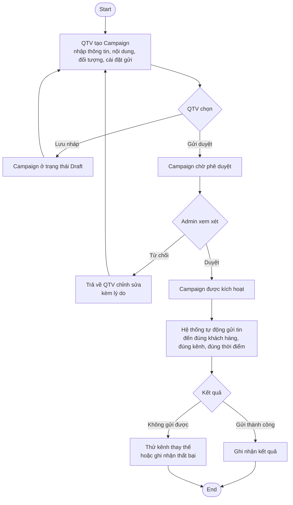
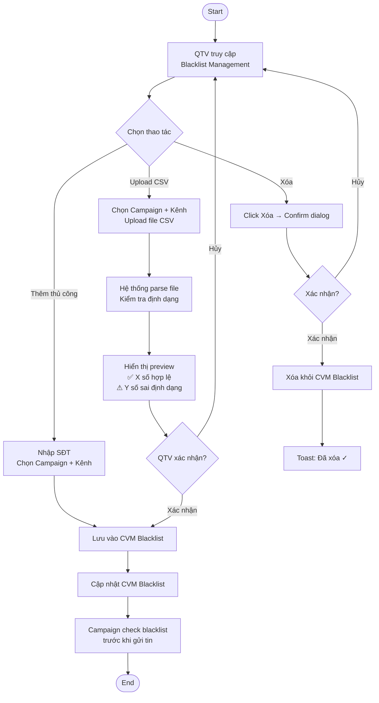
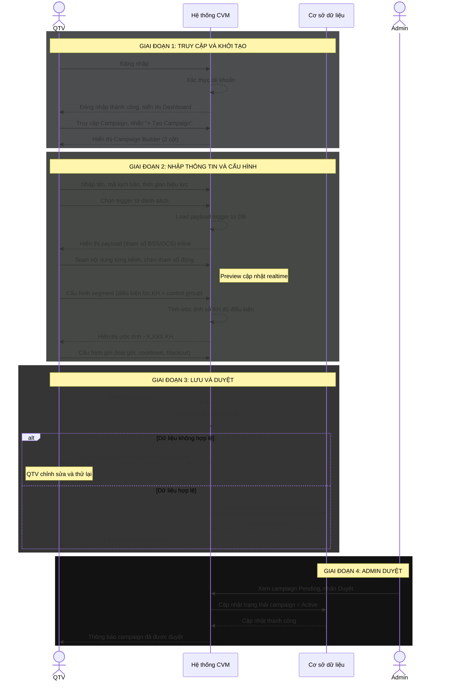
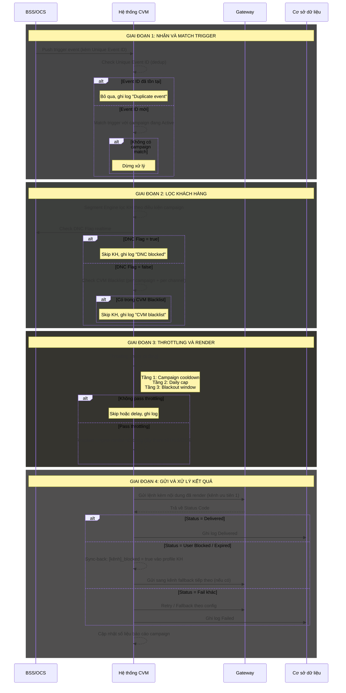

# TÀI LIỆU ĐẶC TẢ YÊU CẦU NGƯỜI DÙNG
## HỆ THỐNG QUẢN LÝ CHIẾN DỊCH MARKETING (CVM)
### Customer Value Management System

---

**CÁC THAY ĐỔI**

| Ngày | Tác giả | Mục thay đổi | Loại | Mô tả | Phiên bản |
|---|---|---|---|---|---|
| 07/05/2026 | Jun | Toàn bộ | A | Tạo mới | V1.0 |˜˚˙∆
| 11/05/2026 | Codex | II.5. Sơ đồ trình tự | M | Bổ sung diễn giải chi tiết cho từng Sequence Diagram | V1.1 |

---

## MỤC LỤC

- I. Giới thiệu
- II. Các yêu cầu về tổng thể phần mềm (High Level Requirements)
  - II.1. Sơ đồ quy trình nghiệp vụ (Workflow Diagram)
  - II.2. Sơ đồ phân cấp chức năng (Business Function Diagram)
  - II.3. Ma trận phân quyền hệ thống (Permission Matrix)
  - II.4. Ma trận ủy quyền (RBAC – Authorization Matrix)
  - II.5. Sơ đồ trình tự (Sequence Diagram)
- III. Đặc tả tình huống sử dụng (Use Case Specification)
- IV. Giao diện chức năng (Prototype chính)
- C. Yêu cầu phi chức năng

---

# I. GIỚI THIỆU

## 1. Mục đích tài liệu

Tài liệu này mô tả đầy đủ các yêu cầu nghiệp vụ của **Hệ thống Quản lý Chiến dịch Marketing (CVM — Customer Value Management System)** dành cho doanh nghiệp viễn thông ảo. Hệ thống cho phép đội ngũ Marketing vận hành campaign tự động, gửi thông báo đến đúng khách hàng, đúng thời điểm, qua đúng kênh, nhằm tăng doanh thu dịch vụ viễn thông.

Mục đích chính:
- Cung cấp cái nhìn tổng thể và thống nhất về các chức năng của CVM
- Làm cơ sở để Dev, Tester thiết kế và kiểm thử hệ thống
- Làm tài liệu đầu vào cho thiết kế chi tiết, phát triển và nghiệm thu

## 2. Phạm vi tài liệu

Tài liệu bao gồm:
- Quản lý Campaign (tạo, sửa, duyệt, vận hành)
- Quản lý Template tin nhắn (tạo, sửa, tái sử dụng)
- Quản lý Trigger (định nghĩa sự kiện kích hoạt và payload)
- Quản lý Blacklist (BSS Flag + CVM Blacklist per campaign/channel)
- Quản lý Khách hàng (danh sách + Customer 360)
- Báo cáo hiệu quả campaign
- Dashboard tổng quan

Tài liệu **không** bao gồm:
- Kiến trúc kỹ thuật chi tiết (hạ tầng, công nghệ, database schema)
- Cấu hình Gateway gửi tin (SMS Gateway, Zalo API, Firebase)
- Quản lý dữ liệu khách hàng gốc (thuộc BSS/OCS)

## 3. Định nghĩa thuật ngữ và từ viết tắt

### 3.1. Định nghĩa thuật ngữ

| STT | Thuật ngữ | Diễn giải |
|---|---|---|
| 1 | Campaign | Chiến dịch marketing tự động — định nghĩa trigger, segment, kênh gửi, nội dung và cấu hình gửi |
| 2 | Trigger | Sự kiện từ hệ thống ngoài (BSS/OCS) kích hoạt campaign (VD: kích hoạt SIM, hết data...) |
| 3 | Trigger chính | Trigger được QTV chỉ định làm nguồn tham số động cho nội dung tin nhắn trong campaign |
| 4 | Payload | Tập hợp tham số động đi kèm với trigger (VD: ten_kh, so_du, data_con_lai...) |
| 5 | Segment | Điều kiện lọc khách hàng đủ điều kiện nhận tin trong campaign |
| 6 | Template | Mẫu nội dung tin nhắn có thể tái sử dụng, định nghĩa riêng cho từng kênh gửi |
| 7 | Tham số động | Biến được inject vào nội dung tin nhắn lúc gửi (VD: {{ten_kh}}, {{so_du}}) |
| 8 | Kênh gửi | Phương tiện gửi thông báo đến khách hàng (USSD, Zalo OA, SMS, Banner, Push, Email) |
| 9 | Fallback | Kênh dự phòng được kích hoạt khi kênh ưu tiên gửi thất bại |
| 10 | Throttling | Cơ chế giới hạn số tin nhắn gửi đến 1 khách hàng trong khoảng thời gian nhất định |
| 11 | Blackout Window | Khung giờ cấm gửi tin nhắn marketing |
| 12 | Blacklist BSS | Danh sách khách hàng đăng ký "Không nhận quảng cáo" tại BSS |
| 13 | Blacklist CVM | Danh sách khách hàng bị loại trừ khỏi campaign/kênh cụ thể, do QTV quản lý |
| 14 | Sync-back | Cơ chế CVM tự động cập nhật trạng thái kênh của khách hàng dựa trên phản hồi từ Gateway |
| 15 | Customer 360 | Màn hình xem toàn bộ thông tin, trạng thái kênh và lịch sử nhận tin của 1 khách hàng |
| 16 | Control Group | Tỉ lệ % khách hàng được giữ lại, không gửi tin, để đo hiệu quả thực sự của campaign (Uplift) |

### 3.2. Định nghĩa từ viết tắt

| STT | Viết tắt | Nghĩa đầy đủ |
|---|---|---|
| 1 | CVM | Customer Value Management System |
| 2 | QTV | Quản trị viên (Campaign Operator) |
| 3 | Admin | Quản trị hệ thống |
| 4 | BSS | Business Support System — hệ thống quản lý thông tin thuê bao |
| 5 | OCS | Online Charging System — hệ thống quản lý dữ liệu sử dụng |
| 6 | USSD | Unstructured Supplementary Service Data — kênh tương tác qua mã USSD |
| 7 | DNC | Do Not Contact — danh sách khách hàng từ chối nhận liên lạc |
| 8 | RBAC | Role-Based Access Control — phân quyền theo vai trò |
| 9 | UC | Use Case |
| 10 | URD | User Requirement Document |

## 4. Kiến trúc tổng thể hệ thống

### Lớp 1 — Người dùng (User Layer)

- **Mục đích**: Cung cấp các vai trò tham gia trực tiếp vào hệ thống, tương ứng với phân cấp quản lý và nghiệp vụ marketing
- **Thành phần**:
  - Admin hệ thống: Quản trị cấu hình, phân quyền, danh mục trigger dùng chung, duyệt campaign
  - QTV (Operator): Tạo/vận hành campaign, quản lý template, quản lý blacklist, xem báo cáo
- **Đặc điểm**:
  - Người dùng truy cập theo đúng vai trò và phạm vi thẩm quyền
  - Mỗi vai trò chỉ được phép thao tác trên dữ liệu thuộc phạm vi được phân quyền (RBAC)

### Lớp 2 — Giao tiếp (Presentation / Access Layer)

- **Mục đích**: Cung cấp kênh truy cập và tương tác giữa người dùng và hệ thống
- **Thành phần**:
  - Ứng dụng Web: Giao diện chính cho QTV và Admin (desktop-first, min 1440px)
  - API dịch vụ nội bộ (RESTful API): Phục vụ nhận trigger từ BSS/OCS và tích hợp Gateway
- **Đặc điểm**:
  - Thống nhất giao diện theo vai trò người dùng
  - Kiểm soát xác thực, phiên làm việc trước khi vào lớp nghiệp vụ
  - Không xử lý nghiệp vụ phức tạp, chỉ tiếp nhận và hiển thị dữ liệu

### Lớp 3 — Nghiệp vụ (Business Layer)

Chia thành 2 khối chức năng chính:

**Khối 1 — Quản lý Campaign & Vận hành**
- Quản lý toàn bộ vòng đời campaign (Draft → Pending → Active → Paused → Ended)
- Quản lý Template tin nhắn theo từng kênh gửi
- Quản lý Trigger và Payload tương ứng
- Quản lý Blacklist (BSS DNC + CVM per campaign/channel)

**Khối 2 — Xử lý gửi tin (Engine)**
- Trigger Engine: Nhận & dedup trigger từ BSS/OCS
- Segment Engine: Lọc khách hàng đủ điều kiện (dynamic segment)
- Campaign Engine: Match trigger → campaign đang Active
- Template Engine: Load template, inject tham số động, render nội dung
- Throttling & Dedup Engine: Kiểm soát tần suất gửi, blackout window, chống spam
- Message Dispatcher: Ra lệnh gửi qua Gateway, xử lý fallback, ghi log kết quả

### Lớp 4 — Ứng dụng (Application / Service Layer)

- **Mục đích**: Triển khai các dịch vụ nghiệp vụ dưới dạng module độc lập
- **Thành phần**:
  - Module Campaign Service
  - Module Template Service
  - Module Trigger Service
  - Module Blacklist Service
  - Module Báo cáo – Thống kê Service
  - Module Quản trị hệ thống Service
- **Chức năng chung của các module**:
  - Kiểm tra logic nghiệp vụ
  - Kiểm soát quyền thao tác theo vai trò
  - Ghi log nghiệp vụ
  - Cung cấp API cho lớp giao tiếp và tích hợp

### Lớp 5 — Tích hợp (Integration Layer)

- **Mục đích**: Đảm bảo kết nối linh hoạt giữa CVM và các hệ thống ngoài
- **Thành phần**:
  - API Gateway
  - Cache (tối ưu hiệu năng truy vấn dữ liệu KH)
  - Kết nối hệ thống nội bộ: BSS (định danh KH), OCS (dữ liệu sử dụng)
  - Kết nối Gateway gửi tin: SMS Gateway, Zalo API, Firebase (Push), USSD Gateway
- **Đặc điểm**:
  - BSS/OCS push trigger vào CVM theo cơ chế event-driven
  - CVM ra lệnh gửi sang Gateway kèm nội dung đã render; không quản lý hạ tầng Gateway
  - Tập trung kiểm soát luồng truy cập API, hạn chế phụ thuộc chặt giữa các hệ thống

### Lớp 6 — Dữ liệu (Data Layer)

- **Mục đích**: Lưu trữ và quản lý toàn bộ dữ liệu nghiệp vụ của hệ thống
- **Thành phần**:
  - Cơ sở dữ liệu nghiệp vụ: Campaign, Template (kèm version snapshot), Trigger & Payload, Blacklist CVM, Log gửi tin
  - Cơ sở dữ liệu profile KH: Sync từ BSS/OCS, lưu trạng thái kênh (sync-back)
  - Cache dữ liệu: Tối ưu truy vấn segment và throttling
- **Đặc điểm**:
  - Phân tách dữ liệu nghiệp vụ và dữ liệu hệ thống
  - Đảm bảo toàn vẹn, bảo mật và khả năng truy vết dữ liệu

### Lớp 7 — Hạ tầng (Infrastructure Layer)

- **Mục đích**: Cung cấp nền tảng kỹ thuật cho hệ thống hoạt động ổn định, an toàn
- **Thành phần**:
  - Máy chủ ứng dụng
  - Máy chủ CSDL
  - Hạ tầng Cloud / DC
  - Hệ thống sao lưu – phục hồi
  - Bảo mật mạng: Firewall, SSL, Audit log

---

# II. CÁC YÊU CẦU VỀ TỔNG THỂ PHẦN MỀM

## II.1. Sơ đồ quy trình nghiệp vụ (Workflow Diagram)

### Quy trình 1: Tạo và vận hành Campaign



**Diễn giải luồng quy trình:**

| Bước | Tác nhân | Mô tả |
|---|---|---|
| Bước 1 | QTV | Tạo campaign: nhập thông tin chiến dịch, soạn nội dung theo từng kênh, xác định đối tượng khách hàng và cài đặt lịch gửi |
| Bước 2 | QTV | Lưu nháp để chỉnh sửa tiếp, hoặc gửi duyệt khi hoàn chỉnh |
| Bước 3 | Admin | Xem xét và phê duyệt campaign; từ chối kèm lý do nếu cần chỉnh sửa |
| Bước 4 | Hệ thống | Campaign được duyệt → kích hoạt và tự động vận hành theo cài đặt; bị từ chối → trả về QTV chỉnh sửa |
| Bước 5 | Hệ thống | Tự động gửi tin đến đúng khách hàng mục tiêu, qua đúng kênh, vào đúng thời điểm đã cấu hình |
| Bước 6 | Hệ thống | Ghi nhận kết quả gửi; nếu không gửi được qua kênh chính thì thử kênh thay thế |

---

### Quy trình 2: Quản lý Blacklist



**Diễn giải luồng:**

| Bước | Tác nhân | Mô tả |
|---|---|---|
| Bước 1 | QTV | Truy cập màn hình Blacklist Management |
| Bước 2 | QTV | Chọn thao tác: thêm thủ công (nhập SĐT, chọn campaign, chọn kênh) hoặc upload danh sách CSV |
| Bước 3 | Hệ thống | Với upload CSV: kiểm tra định dạng, hiển thị preview số lượng hợp lệ / sai định dạng |
| Bước 4 | QTV | Xác nhận để lưu vào blacklist, hoặc hủy để quay lại |
| Bước 5 | QTV | Xóa số khỏi blacklist khi cần (có bước xác nhận trước khi xóa) |

---

## II.2. Sơ đồ phân cấp chức năng (Business Function Diagram)

```
Hệ thống CVM
├── Khối 1: Quản lý Campaign
│   ├── Xem danh sách campaign
│   ├── Tạo mới campaign
│   ├── Sửa campaign
│   ├── Dừng / Resume campaign
│   ├── Xóa campaign (chỉ Draft)
│   └── Duyệt / Từ chối campaign (Admin)
│
├── Khối 2: Quản lý Template
│   ├── Xem danh sách template
│   ├── Tạo mới template
│   ├── Sửa template
│   ├── Clone template
│   └── Bật / Tắt template
│
├── Khối 3: Quản lý Trigger
│   ├── Xem danh sách trigger
│   ├── Thêm mới trigger (kèm payload)
│   ├── Sửa trigger
│   └── Bật / Tắt trigger
│
├── Khối 4: Quản lý Blacklist
│   ├── Xem danh sách blacklist
│   ├── Thêm thủ công vào blacklist
│   ├── Upload CSV vào blacklist
│   └── Xóa khỏi blacklist
│
├── Khối 5: Quản lý Khách hàng
│   ├── Xem danh sách khách hàng
│   └── Xem Customer 360
│
├── Khối 6: Báo cáo
│   ├── Xem báo cáo hiệu quả campaign
│   └── Xem breakdown theo kênh
│
└── Khối 7: Dashboard
    ├── Xem KPI tổng quan
    └── Xem log trigger gần đây
```

**Diễn giải từng khối:**

**Khối 1 — Quản lý Campaign**
- Mục đích: Vòng đời hoàn chỉnh của campaign từ tạo mới đến kết thúc
- Giá trị: Tự động hóa marketing, đúng KH đúng thời điểm đúng kênh
- Chức năng con: Xem, Tạo, Sửa, Dừng/Resume, Xóa, Duyệt/Từ chối

**Khối 2 — Quản lý Template**
- Mục đích: Tái sử dụng nội dung tin nhắn, chuẩn hóa thông điệp marketing
- Giá trị: Tiết kiệm thời gian soạn thảo, đảm bảo nhất quán nội dung
- Chức năng con: Xem, Tạo, Sửa, Clone, Bật/Tắt

**Khối 3 — Quản lý Trigger**
- Mục đích: Định nghĩa các sự kiện kích hoạt campaign và payload tương ứng
- Giá trị: Admin kiểm soát linh hoạt các loại trigger, QTV tự chọn khi tạo campaign
- Chức năng con: Xem, Thêm mới (kèm payload), Sửa, Bật/Tắt

**Khối 4 — Quản lý Blacklist**
- Mục đích: Loại trừ khách hàng không muốn nhận tin khỏi campaign/kênh cụ thể
- Giá trị: Tuân thủ quy định, tránh spam, bảo vệ trải nghiệm khách hàng
- Chức năng con: Xem, Thêm thủ công, Upload CSV, Xóa

**Khối 5 — Quản lý Khách hàng**
- Mục đích: Tra cứu thông tin và lịch sử nhận tin của khách hàng
- Giá trị: Hỗ trợ QTV kiểm tra, xử lý sự cố gửi tin
- Chức năng con: Xem danh sách, Xem Customer 360

**Khối 6 — Báo cáo**
- Mục đích: Đo lường hiệu quả campaign
- Giá trị: Ra quyết định tối ưu campaign, phân bổ ngân sách kênh
- Chức năng con: Xem báo cáo, Xem breakdown theo kênh

**Khối 7 — Dashboard**
- Mục đích: Cái nhìn tổng quan nhanh về hệ thống
- Giá trị: Giám sát realtime, phát hiện bất thường
- Chức năng con: KPI tổng quan, Log trigger gần đây

---

## II.3. Ma trận phân quyền hệ thống (Permission Matrix)

**Quy ước:**
- `X` : Được thực hiện
- `(X)` : Được xem (read-only)
- `–` : Không được thực hiện

| Khối chức năng | Chức năng | Admin | QTV |
|---|---|---|---|
| **1. Campaign** | Xem danh sách campaign | X | X |
| | Tạo mới campaign | – | X |
| | Sửa campaign | – | X |
| | Dừng / Resume campaign | – | X |
| | Xóa campaign (chỉ Draft) | – | X |
| | Duyệt / Từ chối campaign | X | – |
| **2. Template** | Xem danh sách template | X | X |
| | Tạo mới template | – | X |
| | Sửa template | – | X |
| | Clone template | – | X |
| | Bật / Tắt template | – | X |
| **3. Trigger** | Xem danh sách trigger | X | (X) |
| | Thêm mới trigger | X | – |
| | Sửa trigger | X | – |
| | Bật / Tắt trigger | X | – |
| **4. Blacklist** | Xem danh sách blacklist | X | X |
| | Thêm thủ công | – | X |
| | Upload CSV | – | X |
| | Xóa khỏi blacklist | – | X |
| **5. Khách hàng** | Xem danh sách KH | X | X |
| | Xem Customer 360 | X | X |
| **6. Báo cáo** | Xem báo cáo campaign | X | X |
| | Xem breakdown kênh | X | X |
| **7. Dashboard** | Xem KPI tổng quan | X | X |
| | Xem log trigger | X | X |

**Ghi chú:**
- Admin chỉ thực hiện chức năng quản trị và duyệt campaign; không tạo/sửa campaign thay QTV
- QTV chỉ xem được danh sách trigger để chọn khi tạo campaign, không được thêm/sửa trigger
- Dữ liệu khách hàng lấy từ BSS/OCS, CVM chỉ đọc và hiển thị

---

## II.4. Ma trận ủy quyền (RBAC – Authorization Matrix)

### II.4.1. Vai trò

| Role Code | Tên vai trò | Mô tả |
|---|---|---|
| ADMIN | Quản trị hệ thống | Quản lý trigger, duyệt campaign, xem toàn bộ hệ thống |
| QTV | Quản trị viên (Operator) | Tạo/vận hành campaign, quản lý template và blacklist |

### II.4.2. Quy ước quyền

| Ký hiệu | Ý nghĩa |
|---|---|
| VIEW | Xem dữ liệu |
| CREATE | Thêm mới |
| UPDATE | Cập nhật |
| DELETE | Xóa |
| APPROVE | Duyệt / Từ chối |
| CONFIG | Cấu hình (trigger, payload) |

### II.4.3. Ma trận ủy quyền theo khối chức năng

| Khối chức năng | Đối tượng | ADMIN | QTV |
|---|---|---|---|
| Campaign | Quản lý campaign | APPROVE, VIEW | VIEW, CREATE, UPDATE, DELETE |
| Template | Quản lý template | VIEW | VIEW, CREATE, UPDATE, DELETE |
| Trigger | Quản lý trigger + payload | VIEW, CREATE, UPDATE, CONFIG | VIEW |
| Blacklist | Quản lý blacklist CVM | VIEW | VIEW, CREATE, DELETE |
| Khách hàng | Danh sách + Customer 360 | VIEW | VIEW |
| Báo cáo | Báo cáo campaign | VIEW | VIEW |
| Dashboard | Tổng quan + Log | VIEW | VIEW |

**Nguyên tắc RBAC áp dụng:**
- Quyền gán theo Role, không gán trực tiếp cho người dùng
- QTV chỉ thao tác được trên campaign/template/blacklist do mình tạo
- Admin có quyền xem toàn bộ nhưng không can thiệp vào nghiệp vụ QTV
- Mọi thao tác CREATE/UPDATE/DELETE/APPROVE phải ghi log (người thực hiện, thời gian, nội dung thay đổi)
- Không cho phép sửa/xóa campaign đang ở trạng thái Active (phải Dừng trước)

---

## II.5. Sơ đồ trình tự (Sequence Diagram)

### II.5.1. Quy trình 1: Tạo Campaign



**Diễn giải chi tiết sequence:**

| Giai đoạn | Tác nhân chính | Mục tiêu nghiệp vụ | Diễn giải chi tiết | Kết quả đầu ra |
|---|---|---|---|---|
| Giai đoạn 1: Truy cập và khởi tạo | QTV, Hệ thống CVM | Đảm bảo QTV có quyền truy cập và bắt đầu tạo campaign từ đúng màn hình | QTV đăng nhập hệ thống. CVM xác thực tài khoản, kiểm tra quyền truy cập và hiển thị Dashboard. QTV vào phân hệ Campaign và chọn chức năng tạo mới. Hệ thống mở Campaign Builder theo layout 2 cột để QTV cấu hình toàn bộ chiến dịch trên một màn hình. | Campaign Builder được hiển thị ở trạng thái tạo mới, sẵn sàng nhập dữ liệu |
| Giai đoạn 2: Nhập thông tin và cấu hình | QTV, Hệ thống CVM, Cơ sở dữ liệu | Thu thập đầy đủ thông tin cần thiết để định nghĩa campaign | QTV nhập thông tin cơ bản gồm tên campaign, mã kịch bản và thời gian hiệu lực. Khi QTV chọn trigger, CVM tải danh sách payload tương ứng từ dữ liệu trigger đã khai báo và hiển thị các tham số BSS/OCS có thể dùng trong nội dung. QTV soạn nội dung theo từng kênh, chèn tham số động, cấu hình segment, control group, loại gửi, cooldown và blackout window. Trong quá trình nhập, hệ thống cập nhật preview và ước tính số khách hàng đủ điều kiện. | Campaign có đủ thông tin cấu hình nghiệp vụ để có thể validate trước khi gửi duyệt |
| Giai đoạn 3: Lưu và duyệt | QTV, Hệ thống CVM, Cơ sở dữ liệu | Kiểm tra tính hợp lệ của campaign trước khi chuyển sang trạng thái chờ duyệt | Khi QTV nhấn "Gửi Duyệt", CVM validate toàn bộ dữ liệu bắt buộc: thông tin campaign, trigger, nội dung từng kênh, segment, thời gian hiệu lực và cấu hình an toàn. Nếu dữ liệu không hợp lệ, hệ thống highlight field lỗi và yêu cầu QTV bổ sung. Nếu dữ liệu hợp lệ, hệ thống lưu campaign vào cơ sở dữ liệu với trạng thái Pending. | Campaign được lưu ở trạng thái Pending hoặc QTV nhận danh sách lỗi cần chỉnh sửa |
| Giai đoạn 4: Admin duyệt | Admin, Hệ thống CVM, Cơ sở dữ liệu | Kiểm soát chất lượng campaign trước khi kích hoạt vận hành | Admin xem danh sách campaign Pending, kiểm tra nội dung và cấu hình. Khi Admin duyệt, CVM cập nhật trạng thái campaign thành Active trong cơ sở dữ liệu. Sau khi cập nhật thành công, hệ thống gửi thông báo cho QTV rằng campaign đã được duyệt. | Campaign chuyển sang trạng thái Active và sẵn sàng được match khi có trigger phù hợp |

**Luồng ngoại lệ và kiểm soát:**

| Tình huống | Điều kiện xảy ra | Hành vi hệ thống | Hành động kỳ vọng từ người dùng |
|---|---|---|---|
| Dữ liệu campaign thiếu hoặc sai | Thiếu field bắt buộc, thời gian hiệu lực không hợp lệ, chưa chọn trigger, nội dung kênh chưa đầy đủ hoặc segment chưa hợp lệ | Không cho gửi duyệt; highlight field lỗi; hiển thị thông báo cụ thể tại section liên quan | QTV bổ sung hoặc chỉnh sửa dữ liệu rồi gửi duyệt lại |
| Campaign bị từ chối trong bước duyệt | Admin đánh giá campaign chưa đạt yêu cầu vận hành hoặc nội dung chưa phù hợp | Campaign không được chuyển Active; hệ thống cần ghi nhận lý do từ chối và trả về QTV chỉnh sửa | QTV xem lý do, chỉnh sửa campaign và gửi duyệt lại |
| Lỗi lưu dữ liệu | Cơ sở dữ liệu hoặc dịch vụ lưu campaign không phản hồi thành công | Hiển thị thông báo lỗi hệ thống; không thay đổi trạng thái campaign sang Pending nếu lưu chưa thành công | QTV thử lại sau hoặc báo bộ phận vận hành nếu lỗi kéo dài |

---

### II.5.2. Quy trình 2: Trigger kích hoạt và gửi tin



**Diễn giải chi tiết sequence:**

| Giai đoạn | Tác nhân chính | Mục tiêu nghiệp vụ | Diễn giải chi tiết | Kết quả đầu ra |
|---|---|---|---|---|
| Giai đoạn 1: Nhận và match trigger | BSS/OCS, Hệ thống CVM | Tiếp nhận sự kiện phát sinh từ hệ thống nguồn và xác định campaign phù hợp | BSS/OCS push trigger event sang CVM kèm Unique Event ID. CVM kiểm tra Unique Event ID để chống xử lý trùng. Nếu event đã tồn tại, hệ thống bỏ qua và ghi log duplicate. Nếu là event mới, CVM đối chiếu loại trigger, trạng thái campaign, thời gian hiệu lực và logic kết hợp trigger để xác định campaign Active phù hợp. | Event được bỏ qua nếu trùng/không match, hoặc chuyển sang bước lọc khách hàng nếu có campaign phù hợp |
| Giai đoạn 2: Lọc khách hàng | Hệ thống CVM, BSS/OCS | Đảm bảo chỉ khách hàng đủ điều kiện nghiệp vụ và consent mới được gửi tin | Segment Engine kiểm tra điều kiện lọc khách hàng theo cấu hình campaign. CVM kiểm tra DNC Flag realtime từ BSS để loại khách hàng không nhận quảng cáo. Nếu khách hàng không bị chặn bởi DNC, hệ thống tiếp tục kiểm tra Blacklist CVM theo campaign và theo kênh gửi. | Khách hàng không hợp lệ bị skip và ghi log; khách hàng hợp lệ được chuyển sang bước throttling |
| Giai đoạn 3: Throttling và render | Hệ thống CVM | Kiểm soát tần suất gửi và chuẩn bị nội dung cá nhân hóa | CVM kiểm tra 3 tầng an toàn gồm campaign cooldown, daily cap và blackout window. Nếu không pass throttling, khách hàng bị skip hoặc delay theo cấu hình. Nếu pass, Template Engine lấy template của kênh gửi, inject tham số động từ payload trigger chính và render nội dung cuối cùng trước khi gửi. | Nội dung đã render sẵn sàng gửi, hoặc event bị skip/delay do vi phạm cấu hình an toàn |
| Giai đoạn 4: Gửi và xử lý kết quả | Hệ thống CVM, Gateway, Cơ sở dữ liệu | Gửi thông điệp qua kênh ưu tiên, xử lý kết quả và cập nhật báo cáo | CVM gửi lệnh sang Gateway kèm nội dung đã render. Gateway trả Status Code. Nếu Delivered, CVM ghi log thành công. Nếu User Blocked hoặc Expired, CVM sync-back trạng thái kênh vào profile khách hàng và thử kênh fallback nếu có. Nếu fail khác, hệ thống retry hoặc fallback theo cấu hình, đồng thời ghi log thất bại. Cuối cùng, CVM cập nhật số liệu báo cáo campaign. | Log gửi tin và chỉ số báo cáo campaign được cập nhật; trạng thái kênh khách hàng được sync-back khi cần |

**Luồng ngoại lệ và kiểm soát:**

| Tình huống | Điều kiện xảy ra | Hành vi hệ thống | Kết quả kỳ vọng |
|---|---|---|---|
| Event trùng | Unique Event ID đã tồn tại trong log xử lý | Không xử lý lại event; ghi log `Duplicate event` | Tránh gửi trùng tin cho cùng một sự kiện |
| Không có campaign match | Trigger không thuộc campaign Active nào, hoặc campaign ngoài thời gian hiệu lực | Dừng xử lý event; ghi nhận log nếu cần phục vụ audit | Không phát sinh gửi tin ngoài phạm vi campaign |
| Khách hàng thuộc DNC hoặc Blacklist | BSS trả DNC Flag = true, hoặc khách hàng nằm trong Blacklist CVM theo campaign/kênh | Skip khách hàng; ghi log lý do bị chặn | Tuân thủ consent và cấu hình loại trừ |
| Không pass throttling | Vượt campaign cooldown, daily cap hoặc nằm trong blackout window | Skip hoặc delay theo cấu hình campaign; ghi log lý do | Không spam khách hàng, tuân thủ chính sách gửi |
| Gateway trả User Blocked / Expired | Gateway xác nhận khách hàng chặn kênh hoặc token/kênh không còn hiệu lực | Cập nhật `[kênh]_blocked = true` vào profile khách hàng; thử kênh fallback nếu có | Tránh tiếp tục gửi vào kênh không còn khả dụng |
| Gateway fail khác | Gateway lỗi tạm thời, timeout hoặc trả lỗi gửi không xác định | Retry hoặc fallback theo cấu hình; ghi log Failed nếu không gửi được | Có khả năng phục hồi lỗi gửi và vẫn đảm bảo truy vết |

---

# III. ĐẶC TẢ TÌNH HUỐNG SỬ DỤNG (USE CASE SPECIFICATION)

## UC-CAM-01: Tạo mới Campaign

| Nội dung | Mô tả |
|---|---|
| **Tên** | Tạo mới Campaign |
| **Mục tiêu** | Cho phép QTV tạo một campaign marketing mới với đầy đủ cấu hình trigger, segment, kênh gửi, nội dung và thiết lập gửi; sau đó gửi để Admin duyệt |
| **Tác nhân** | QTV |
| **Trigger** | QTV nhấn "+ Tạo Campaign" trên màn hình Campaign List |
| **Tiền điều kiện** | - QTV đã đăng nhập thành công<br>- Có ít nhất 1 trigger ở trạng thái Active trong hệ thống |
| **Hậu điều kiện** | - Campaign được lưu vào DB với trạng thái Draft hoặc Pending<br>- Nếu Pending: Admin nhận được thông báo cần duyệt<br>- Log tạo campaign được ghi nhận |
| **Hoạt động** | 1. QTV nhập tên chiến dịch, mã kịch bản, thời gian hiệu lực<br>2. QTV chọn trigger; hệ thống hiển thị payload inline; nếu nhiều trigger, QTV chọn trigger chính<br>3. QTV soạn nội dung từng kênh hoặc chọn template có sẵn<br>4. QTV cấu hình segment (chọn segment động hoặc tự định nghĩa điều kiện lọc + control group)<br>5. QTV cấu hình gửi (loại gửi, cooldown, blackout)<br>6. QTV nhấn "Lưu Nháp" hoặc "Gửi Duyệt"<br>7. Hệ thống validate và lưu campaign |
| **Quy tắc nghiệp vụ** | - Tên campaign là bắt buộc, không được trùng với campaign đang Active<br>- Phải chọn ít nhất 1 trigger và 1 kênh gửi<br>- Mỗi kênh đã thêm phải có nội dung (không được bỏ trống)<br>- Tham số động trong nội dung phải thuộc payload của trigger chính<br>- Cooldown tối thiểu 1 phút<br>- Khung giờ gửi không được trùng với Blackout Window |

---

## UC-CAM-02: Duyệt Campaign

| Nội dung | Mô tả |
|---|---|
| **Tên** | Duyệt / Từ chối Campaign |
| **Mục tiêu** | Cho phép Admin kiểm tra và duyệt campaign trước khi Active |
| **Tác nhân** | Admin |
| **Trigger** | Campaign có trạng thái Pending chờ duyệt |
| **Tiền điều kiện** | - Admin đã đăng nhập<br>- Có campaign ở trạng thái Pending |
| **Hậu điều kiện** | - Duyệt: campaign chuyển sang Active, QTV nhận thông báo<br>- Từ chối: campaign về Draft, QTV nhận thông báo kèm lý do |
| **Hoạt động** | 1. Admin xem danh sách campaign Pending<br>2. Admin xem chi tiết campaign<br>3. Admin nhấn Duyệt hoặc Từ chối<br>4. Nếu từ chối: Admin nhập lý do<br>5. Hệ thống cập nhật trạng thái và thông báo QTV |
| **Quy tắc nghiệp vụ** | - Chỉ Admin mới được duyệt campaign<br>- Từ chối phải có lý do (bắt buộc nhập)<br>- Campaign đã Active không thể Từ chối (phải Dừng trước) |

---

## UC-CAM-03: Dừng / Resume Campaign

| Nội dung | Mô tả |
|---|---|
| **Tên** | Dừng / Resume Campaign |
| **Mục tiêu** | Cho phép QTV tạm dừng campaign đang chạy và khởi động lại khi cần |
| **Tác nhân** | QTV |
| **Trigger** | QTV nhấn [Dừng] hoặc [Resume] trên Campaign List |
| **Tiền điều kiện** | - Campaign ở trạng thái Active (để Dừng) hoặc Paused (để Resume)<br>- QTV là người tạo campaign |
| **Hậu điều kiện** | - Dừng: campaign chuyển sang Paused, không nhận trigger mới<br>- Resume: campaign chuyển về Active |
| **Hoạt động** | 1. QTV tìm campaign cần xử lý trên danh sách<br>2. QTV nhấn [Dừng] hoặc [Resume]<br>3. Hệ thống hiển thị confirm dialog<br>4. QTV xác nhận → hệ thống cập nhật trạng thái |
| **Quy tắc nghiệp vụ** | - Trigger đến trong lúc Paused → bị bỏ qua (không queue lại)<br>- Campaign Paused khi hết thời gian hiệu lực → chuyển Ended tự động |

---

## UC-TPL-01: Tạo mới Template

| Nội dung | Mô tả |
|---|---|
| **Tên** | Tạo mới Template tin nhắn |
| **Mục tiêu** | Cho phép QTV tạo template nội dung tin nhắn có thể tái sử dụng cho nhiều campaign |
| **Tác nhân** | QTV |
| **Trigger** | QTV nhấn "+ Tạo Template" trên màn hình Template Management |
| **Tiền điều kiện** | QTV đã đăng nhập thành công |
| **Hậu điều kiện** | - Template được lưu với trạng thái Active<br>- Template khả dụng để QTV chọn khi tạo campaign |
| **Hoạt động** | 1. QTV nhập tên template, mô tả<br>2. QTV chọn tab kênh (Zalo OA / SMS / USSD / Banner / Push / Email)<br>3. QTV soạn nội dung từng kênh, chèn tham số động (trigger-agnostic)<br>4. QTV xem preview realtime từng kênh với dữ liệu mẫu<br>5. QTV nhấn Lưu Template |
| **Quy tắc nghiệp vụ** | - Tên template là bắt buộc, không được để trống<br>- Template phải có ít nhất 1 kênh được soạn nội dung<br>- SMS: nội dung ≤ 160 ký tự; cảnh báo khi vượt<br>- USSD: không dùng tiếng Việt có dấu<br>- Khi sửa template đang được campaign dùng: tạo version mới, campaign cũ giữ version cũ |

---

## UC-TRG-01: Thêm mới Trigger

| Nội dung | Mô tả |
|---|---|
| **Tên** | Thêm mới Trigger và định nghĩa Payload |
| **Mục tiêu** | Cho phép Admin định nghĩa sự kiện kích hoạt mới từ BSS/OCS và các tham số động đi kèm |
| **Tác nhân** | Admin |
| **Trigger** | Admin nhấn "+ Thêm Trigger" trên Trigger Management |
| **Tiền điều kiện** | Admin đã đăng nhập thành công |
| **Hậu điều kiện** | - Trigger được lưu với trạng thái Active<br>- QTV có thể chọn trigger mới này khi tạo campaign |
| **Hoạt động** | 1. Admin nhập tên trigger, chọn Event Source (BSS / OCS)<br>2. Admin nhập mô tả<br>3. Admin thêm danh sách payload: tên tham số + nguồn (BSS/OCS)<br>4. Admin chọn trạng thái Active/Inactive<br>5. Admin lưu |
| **Quy tắc nghiệp vụ** | - Tên trigger là bắt buộc, không được trùng<br>- Phải có ít nhất 1 tham số trong payload<br>- Tắt trigger đang dùng bởi campaign Active: cảnh báo, yêu cầu xác nhận |

---

## UC-BL-01: Quản lý Blacklist CVM

| Nội dung | Mô tả |
|---|---|
| **Tên** | Quản lý Blacklist CVM |
| **Mục tiêu** | Cho phép QTV thêm/xóa số điện thoại khỏi blacklist theo campaign và kênh cụ thể |
| **Tác nhân** | QTV |
| **Trigger** | QTV truy cập màn hình Blacklist Management |
| **Tiền điều kiện** | QTV đã đăng nhập thành công |
| **Hậu điều kiện** | - Số điện thoại được thêm/xóa khỏi CVM Blacklist<br>- Campaign sẽ skip số này khi gửi tin (per campaign + per channel) |
| **Hoạt động** | 1. QTV xem danh sách blacklist, lọc theo campaign/kênh<br>2a. Thêm thủ công: nhập SĐT + chọn campaign + chọn kênh → Lưu<br>2b. Upload CSV: chọn campaign + kênh → upload file → xem preview → xác nhận<br>3. Xóa: click [Xóa] → confirm dialog → xóa khỏi danh sách |
| **Quy tắc nghiệp vụ** | - Blacklist CVM theo scope per campaign + per channel (1 SĐT có thể blacklist Zalo campaign A nhưng vẫn nhận SMS campaign B)<br>- File CSV: 1 cột `so_dien_thoai`, tối đa 10,000 dòng/lần upload<br>- Dòng sai định dạng → bỏ qua, không block toàn bộ upload<br>- Xóa khỏi blacklist: yêu cầu xác nhận trước khi thực hiện |

---

## UC-KH-01: Xem Customer 360

| Nội dung | Mô tả |
|---|---|
| **Tên** | Xem Customer 360 |
| **Mục tiêu** | Cho phép QTV/Admin xem toàn bộ thông tin, trạng thái kênh và lịch sử nhận tin của 1 khách hàng |
| **Tác nhân** | QTV, Admin |
| **Trigger** | QTV/Admin click vào khách hàng trên danh sách hoặc nhấn [Xem] |
| **Tiền điều kiện** | Đã đăng nhập thành công |
| **Hậu điều kiện** | Màn hình Customer 360 hiển thị đầy đủ thông tin khách hàng |
| **Hoạt động** | 1. Tìm kiếm khách hàng theo SĐT hoặc ID<br>2. Click vào dòng → vào Customer 360<br>3. Xem thông tin KH, thống kê sử dụng, trạng thái kênh (sync-back), throttling status, lịch sử nhận tin |
| **Quy tắc nghiệp vụ** | - Trạng thái kênh `[kênh]_blocked` tự động cập nhật từ phản hồi Gateway (sync-back)<br>- Tự động reset về Active khi Gateway báo KH đã unblock<br>- Lịch sử nhận tin hiển thị trạng thái rõ: Delivered / Failed / Fallback / Blocked→Fallback |

---

# IV. GIAO DIỆN CHỨC NĂNG (PROTOTYPE CHÍNH)

## IV.1. Màn hình Dashboard

**Mục đích**: Cung cấp cái nhìn tổng quan nhanh về tình trạng hệ thống.

| STT | Tên thành phần | Định dạng | Bắt buộc | Mặc định | Mô tả |
|---|---|---|---|---|---|
| 1 | KPI — Active Campaigns | Text (số) | Không | N/A | Hiển thị số campaign đang ở trạng thái Active |
| 2 | KPI — Tin nhắn gửi hôm nay | Text (số) | Không | N/A | Tổng số tin nhắn đã gửi trong ngày hiện tại |
| 3 | KPI — Tỉ lệ thất bại | Text (%) | Không | N/A | Tỉ lệ % tin nhắn Failed / tổng tin nhắn gửi hôm nay |
| 4 | Bảng Campaign đang chạy | Grid | Không | N/A | Hiển thị campaign Active; cột: Tên, Số trigger, Đã gửi, Thất bại, Hành động; click dòng → Campaign Detail |
| 5 | Link "Xem tất cả" | Button/Link | Không | N/A | Điều hướng sang Campaign List |
| 6 | Feed trigger gần đây | Grid | Không | N/A | Cột: Thời gian, Tên trigger, Campaign match; tự động refresh |
| 7 | Link "Xem log" | Button/Link | Không | N/A | Điều hướng sang Trigger Log đầy đủ |

---

## IV.2. Màn hình Campaign List

**Mục đích**: Xem, tìm kiếm và quản lý toàn bộ campaign.

| STT | Tên thành phần | Định dạng | Bắt buộc | Mặc định | Mô tả |
|---|---|---|---|---|---|
| 1 | Tìm kiếm tên campaign | Text | Không | N/A | Tìm kiếm fuzzy theo tên campaign |
| 2 | Lọc trạng thái | Listbox | Không | Tất cả | Lọc theo: Tất cả / Active / Draft / Paused / Pending / Ended |
| 3 | Lọc trigger | Listbox | Không | Tất cả | Lọc campaign theo trigger đang dùng |
| 4 | Bảng danh sách campaign | Grid | Không | N/A | Cột: Tên campaign, Số trigger, Trạng thái (badge), Hiệu lực, Hành động |
| 5 | Badge trạng thái | Badge | Không | N/A | Active=xanh / Draft=xám / Paused=vàng / Pending=cam / Ended=đỏ nhạt |
| 6 | Hành động theo trạng thái | Button/Icon | Không | N/A | Active: [Sửa][Dừng]; Draft: [Sửa][Xóa]; Paused: [Sửa][Resume]; Pending: [Xem]; Ended: [Xem] |
| 7 | Nút "+ Tạo Campaign" | Button | Không | N/A | Điều hướng sang Campaign Builder |
| 8 | Phân trang | Pagination | Không | Trang 1 | Phân trang danh sách campaign |

---

## IV.3. Màn hình Campaign Builder (Tạo / Sửa Campaign)

**Mục đích**: QTV tạo hoặc chỉnh sửa campaign trên 1 trang, bố cục 2 cột.

**Header (cố định):**

| STT | Tên thành phần | Định dạng | Bắt buộc | Mặc định | Mô tả |
|---|---|---|---|---|---|
| 1 | Tên chiến dịch | Text | Có | N/A | Bắt buộc, không được trùng với campaign đang Active |
| 2 | Mã kịch bản (ID) | Text | Không | N/A | Mã định danh kịch bản nội bộ |
| 3 | Thời gian hiệu lực | Date range | Có | N/A | Từ ngày → Đến ngày; Đến phải ≥ Từ |
| 4 | Badge trạng thái | Badge | Không | Draft | Tự động cập nhật theo trạng thái thực của campaign |
| 5 | Nút Lưu Nháp | Button | Không | N/A | Lưu campaign ở trạng thái Draft, không cần điền đủ |
| 6 | Nút Gửi Duyệt | Button | Không | N/A | Validate đầy đủ → lưu trạng thái Pending → Admin nhận thông báo |

**Cột trái — Section 1: Thông tin & Trigger:**

| STT | Tên thành phần | Định dạng | Bắt buộc | Mặc định | Mô tả |
|---|---|---|---|---|---|
| 7 | Chọn trigger | Listbox Search | Có | N/A | Dropdown có tìm kiếm; chọn xong → hiện trigger card bên dưới với payload inline |
| 8 | Trigger card | Card | Không | N/A | Hiển thị: tên trigger, badge nguồn (BSS/OCS), danh sách tham số payload; badge ★ = trigger chính |
| 9 | Nút + Thêm trigger | Button | Không | N/A | Thêm trigger thứ 2 trở đi; hiện khi chưa chọn hết trigger available |
| 10 | Logic kết hợp | Toggle | Không | OR | Hiện khi ≥ 2 trigger; OR = 1 trigger kích hoạt là đủ; AND = tất cả phải xảy ra |
| 11 | Trigger chính | Listbox | Có (khi ≥2) | Trigger đầu tiên | Hiện khi ≥ 2 trigger; xác định nguồn tham số động cho nội dung |

**Cột trái — Section 2: Kênh & Tin nhắn:**

| STT | Tên thành phần | Định dạng | Bắt buộc | Mặc định | Mô tả |
|---|---|---|---|---|---|
| 12 | Ngày gửi | Listbox | Có | Ngày T — Gửi ngay | Ngày T / T+1 / T+2 / T+3 |
| 13 | Khung giờ gửi | Time range | Có | 08:00 – 20:00 | Giờ bắt đầu và kết thúc được phép gửi tin |
| 14 | Tab kênh | Tab | Có | N/A | USSD / Zalo OA / SMS / Banner / Push / Email; tab đầu = kênh đầu (không fallback); có thể đóng tab; "+ Thêm kênh" |
| 15 | Fallback sau | Number | Không | N/A | Hiện từ tab thứ 2 trở đi; số phút chờ trước khi fallback sang kênh tiếp theo |
| 16 | Chọn template / Soạn mới | Radio | Có | Soạn mới | Chọn template: dropdown tìm kiếm → prefill nội dung; Soạn mới: nhập trực tiếp |
| 17 | Upload ảnh | Button | Không | Placeholder | Áp dụng: Zalo OA, Banner, Push, Email; [Tải ảnh lên] hoặc [Chọn từ thư viện]; SMS/USSD không hỗ trợ |
| 18 | Tham số động | Chip | Không | N/A | Hiển thị payload của trigger chính; click → insert vào vị trí con trỏ; tham số không hợp lệ = chip đỏ + tooltip cảnh báo |
| 19 | Nội dung tin nhắn | Textarea / Rich text | Có | N/A | Zalo: rich text; SMS: plain text + đếm 0/160; USSD: plain text + cảnh báo không dấu; Banner: Tiêu đề 0/50 + Nội dung + CTA; Push: Tiêu đề 0/65 + Body 0/240; Email: Subject 0/100 + rich text |
| 20 | Preview realtime | Panel | Không | N/A | Nằm song song với textarea trong tab; render theo format từng kênh; dùng tham số mẫu có thể chỉnh sửa |

**Cột trái — Section 3: Cấu hình gửi:**

| STT | Tên thành phần | Định dạng | Bắt buộc | Mặc định | Mô tả |
|---|---|---|---|---|---|
| 21 | Loại gửi | Listbox | Có | Near Realtime | Realtime: gửi ngay, không áp dụng blackout; Near Realtime: gửi sau X phút; Offline: gửi lúc HH:MM mỗi ngày |
| 22 | Gửi sau (phút) | Number | Có (Near RT) | 10 | Hiện khi chọn Near Realtime; số phút delay sau trigger |
| 23 | Gửi lúc | Time | Có (Offline) | 09:00 | Hiện khi chọn Offline; giờ gửi batch hàng ngày |
| 24 | Cooldown per campaign | Number | Có | 30 | Đơn vị: phút; KH nhận tin từ campaign này sẽ không nhận lại trong X phút |

**Cột phải — Section 4: Phân khúc:**

| STT | Tên thành phần | Định dạng | Bắt buộc | Mặc định | Mô tả |
|---|---|---|---|---|---|
| 25 | Chọn Segment động | Listbox | Không | N/A | Chọn segment đã định nghĩa sẵn; có thể kết hợp với điều kiện tùy chỉnh bên dưới |
| 26 | Điều kiện lọc | Condition builder | Không | N/A | Mỗi dòng: [Thuộc tính▾] [Toán tử▾] [Giá trị] [Đơn vị] [✕ Xóa]; "+ Thêm điều kiện" append dòng mới |
| 27 | Control Group | Number | Không | 0 | % KH không gửi tin để đo Uplift; 0 = không có control group |
| 28 | Ước tính KH | Text | Không | N/A | "~X,XXX KH đủ điều kiện ↻"; tự cập nhật khi thay đổi điều kiện |

**Cột phải — Section 5: An toàn & Chống Spam:**

| STT | Tên thành phần | Định dạng | Bắt buộc | Mặc định | Mô tả |
|---|---|---|---|---|---|
| 29 | Blackout Window | Time range | Không | 22:00 – 08:00 | Khung giờ cấm gửi tin; áp dụng với Near Realtime và Offline |
| 30 | Xử lý blackout | Listbox | Không | Hủy luôn (Discard) | Hủy luôn: bỏ qua tin; Delay: đợi đến đầu khung giờ cho phép hôm sau |
| 31 | Giới hạn nhận tin | Number x Number | Không | 1 lần / 30 ngày | Giới hạn global: KH không nhận quá N tin trong M ngày (toàn hệ thống) |
| 32 | Kiểm tra Blacklist DNC | Checkbox | Không | Checked | Khi checked: check BSS DNC Flag realtime trước khi gửi |

---

## IV.4. Màn hình Template Management

**Mục đích**: Xem và quản lý danh sách template tin nhắn.

| STT | Tên thành phần | Định dạng | Bắt buộc | Mặc định | Mô tả |
|---|---|---|---|---|---|
| 1 | Tìm kiếm template | Text | Không | N/A | Tìm kiếm theo tên template |
| 2 | Lọc trạng thái | Listbox | Không | Tất cả | Tất cả / Active / Inactive |
| 3 | Bảng danh sách | Grid | Không | N/A | Cột: Tên template, Kênh hỗ trợ, Số lần dùng, Hành động |
| 4 | Hành động | Button/Icon | Không | N/A | [Sửa]: mở Template Editor; [Clone]: tạo bản sao mới |
| 5 | Nút "+ Tạo Template" | Button | Không | N/A | Điều hướng sang Template Editor (tạo mới) |

---

## IV.5. Màn hình Trigger Management

**Mục đích**: Admin quản lý danh sách trigger và payload.

| STT | Tên thành phần | Định dạng | Bắt buộc | Mặc định | Mô tả |
|---|---|---|---|---|---|
| 1 | Tìm kiếm trigger | Text | Không | N/A | Tìm kiếm theo tên trigger |
| 2 | Lọc trạng thái | Listbox | Không | Tất cả | Tất cả / Active / Inactive |
| 3 | Bảng danh sách | Grid | Không | N/A | Cột: Tên trigger, Event Source, Trạng thái, Hành động |
| 4 | Nút [Sửa] | Icon | Không | N/A | Mở modal sửa trigger với dữ liệu đã điền sẵn |
| 5 | Nút [Tắt/Bật] | Icon | Không | N/A | Click → confirm dialog: "Tắt trigger này? Campaign đang dùng sẽ không nhận event mới." → Xác nhận → badge cập nhật ngay |
| 6 | Nút "+ Thêm Trigger" | Button | Không | N/A | Mở modal thêm trigger mới |
| 7 | Modal Thêm/Sửa Trigger | Modal | N/A | N/A | Gồm: Tên trigger (bắt buộc), Event Source (BSS/OCS/Other), Mô tả, Danh sách payload [Tên tham số][Nguồn▾][✕] + "+ Thêm tham số", Toggle Active/Inactive; [Hủy][Lưu] |
| 8 | Lưu trigger | Button | Không | N/A | Validate: tên không trống, ≥ 1 tham số payload; nếu hợp lệ: đóng modal + cập nhật bảng + toast ✓ |

---

## IV.6. Màn hình Blacklist Management

**Mục đích**: QTV quản lý danh sách số điện thoại bị loại trừ theo campaign và kênh.

| STT | Tên thành phần | Định dạng | Bắt buộc | Mặc định | Mô tả |
|---|---|---|---|---|---|
| 1 | Lọc Campaign | Listbox | Không | Tất cả | Lọc blacklist theo campaign cụ thể |
| 2 | Lọc Kênh | Listbox | Không | Tất cả | Lọc theo kênh: Tất cả / USSD / Zalo OA / SMS / Banner / Push / Email |
| 3 | Nút Lọc | Button | Không | N/A | Áp dụng bộ lọc, cập nhật bảng |
| 4 | Bảng danh sách | Grid | Không | N/A | Cột: Số điện thoại, Campaign, Kênh, Hành động |
| 5 | Nút [Xóa] | Icon | Không | N/A | Click → confirm dialog "Xóa số này khỏi blacklist?" → Xác nhận → xóa + toast ✓ |
| 6 | Nút "+ Thêm thủ công" | Button | Không | N/A | Mở modal thêm 1 số thủ công |
| 7 | Modal Thêm thủ công | Modal | N/A | N/A | Gồm: Số điện thoại (bắt buộc, validate định dạng 10 số), Campaign (bắt buộc), Kênh (bắt buộc); [Hủy][Thêm] |
| 8 | Nút "Upload danh sách" | Button | Không | N/A | Mở modal upload CSV |
| 9 | Modal Upload CSV | Modal | N/A | N/A | Gồm: Campaign (bắt buộc), Kênh (bắt buộc), Drop zone CSV, link "Tải file mẫu"; sau khi chọn file: hiển thị preview "✅ X số hợp lệ / ⚠ Y số sai định dạng (bỏ qua)"; [Hủy][Xác nhận Upload] |
| 10 | Phân trang | Pagination | Không | Trang 1 | Phân trang danh sách blacklist |

---

## IV.7. Màn hình Customer List

**Mục đích**: QTV/Admin tìm kiếm và truy cập thông tin khách hàng.

| STT | Tên thành phần | Định dạng | Bắt buộc | Mặc định | Mô tả |
|---|---|---|---|---|---|
| 1 | Tìm kiếm | Text | Không | N/A | Tìm theo số điện thoại hoặc ID khách hàng |
| 2 | Lọc Loại SIM | Listbox | Không | Tất cả | Tất cả / SIM vật lý / eSIM |
| 3 | Lọc Gói cước | Listbox | Không | Tất cả | Danh sách các gói cước từ BSS |
| 4 | Nút Lọc | Button | Không | N/A | Áp dụng bộ lọc |
| 5 | Bảng danh sách | Grid | Không | N/A | Cột: Số điện thoại, Loại SIM, Gói cước, Ngày kích hoạt, Hành động |
| 6 | Nút [Xem] | Button | Không | N/A | Điều hướng sang Customer 360 của KH đó; click vào dòng cũng có tác dụng tương tự |

---

## IV.8. Màn hình Customer 360

**Mục đích**: Xem toàn bộ thông tin và lịch sử của 1 khách hàng.

| STT | Tên thành phần | Định dạng | Bắt buộc | Mặc định | Mô tả |
|---|---|---|---|---|---|
| 1 | Breadcrumb | Text/Link | Không | N/A | "Khách hàng / [SĐT]"; click "Khách hàng" → quay lại danh sách |
| 2 | Thông tin cơ bản | Card | Không | N/A | SĐT, Loại SIM, Trạng thái SIM, Gói cước, Ngày hết hạn, Ngày kích hoạt, Thiết bị, Trạng thái app |
| 3 | Thống kê sử dụng | Table (2 cột) | Không | N/A | Data còn lại, Lưu lượng hôm nay, Số dư, Số lần nạp, Số lần gia hạn, Cuộc gọi thất bại hôm nay, Ngày sinh nhật, Nghề nghiệp |
| 4 | Trạng thái kênh | Table | Không | N/A | Cột: Kênh, Trạng thái, Cập nhật lần cuối; Active=badge xanh; Blocked=badge đỏ kèm timestamp; ghi chú: "Tự động reset khi KH unblock" |
| 5 | Throttling Status | Card | Không | N/A | Tin hôm nay: X/N; Cooldown active: Có/Không; BSS DNC Flag: Có/Không |
| 6 | Lịch sử nhận tin | Grid | Không | N/A | Cột: Thời gian, Campaign, Kênh, Trạng thái (Delivered/Failed/Fallback/Blocked→Fallback) |

---

## IV.9. Màn hình Report

**Mục đích**: QTV/Admin xem hiệu quả gửi tin của từng campaign.

| STT | Tên thành phần | Định dạng | Bắt buộc | Mặc định | Mô tả |
|---|---|---|---|---|---|
| 1 | Chọn Campaign | Listbox | Có | N/A | Chọn campaign cần xem báo cáo |
| 2 | Chọn khoảng thời gian | Date range | Có | 30 ngày gần nhất | Từ ngày → Đến ngày |
| 3 | Nút Lọc | Button | Không | N/A | Áp dụng bộ lọc, tải lại dữ liệu |
| 4 | KPI — Đã gửi | Text (số) | Không | N/A | Tổng số tin đã gửi trong khoảng thời gian |
| 5 | KPI — Delivered | Text (số) | Không | N/A | Số tin nhận được xác nhận Delivered |
| 6 | KPI — Failed | Text (số) | Không | N/A | Số tin gửi thất bại |
| 7 | KPI — Fallback Rate | Text (%) | Không | N/A | Tỉ lệ % tin phải fallback sang kênh dự phòng |
| 8 | Biểu đồ theo ngày | Bar chart | Không | N/A | Số tin gửi theo từng ngày trong khoảng thời gian đã chọn |
| 9 | Breakdown theo kênh | Horizontal bar | Không | N/A | Tỉ lệ % tin gửi qua từng kênh (USSD/Zalo OA/SMS/Banner/Push/Email) |

---

# C. YÊU CẦU PHI CHỨC NĂNG

## 1. Yêu cầu về kiến trúc hệ thống

- Hệ thống xây dựng theo mô hình kiến trúc phân lớp (layered architecture), tách biệt Presentation, Business Logic và Data Layer
- Giao diện Web desktop-first, tối thiểu 1440px width

## 2. Các ràng buộc thiết kế

- Dữ liệu khách hàng không lưu gốc tại CVM; chỉ đồng bộ từ BSS/OCS khi cần
- Template lưu theo version: khi sửa template đang dùng bởi campaign Active → tạo version mới, campaign cũ giữ snapshot version cũ
- Mọi thao tác CREATE/UPDATE/DELETE/APPROVE phải ghi log: người thực hiện, thời gian, nội dung thay đổi
- Dedup event: mỗi trigger event từ BSS/OCS có Unique Event ID; CVM check trước khi xử lý để tránh duplicate
- Không cho phép sửa/xóa campaign đang ở trạng thái Active

## 3. Yêu cầu giao diện người dùng

- Ngôn ngữ hiển thị: tiếng Việt
- Toast notification: hiển thị góc dưới phải, tự đóng sau 3 giây
- Confirm dialog: bắt buộc trước các thao tác không thể hoàn tác (Xóa, Tắt trigger, Upload blacklist)
- Inline validation: highlight đỏ field lỗi + hiển thị thông báo lỗi dưới field ngay khi submit
- Tham số động không hợp lệ trong nội dung tin nhắn: highlight đỏ kèm tooltip giải thích

## 4. Yêu cầu về an toàn, bảo mật

- Phân quyền theo RBAC: Admin và QTV có phạm vi thao tác riêng biệt
- Xác thực tài khoản trước khi truy cập bất kỳ chức năng nào
- BSS DNC Flag check thực hiện realtime; nếu API BSS timeout → ghi log cảnh báo, tiếp tục gửi (không block toàn bộ campaign)

## 5. Yêu cầu về tích hợp

- BSS/OCS push trigger vào CVM theo cơ chế event-driven; mỗi event phải có Unique Event ID
- CVM gọi API/Command sang Gateway (SMS Gateway, Zalo API, Firebase, USSD Gateway) để thực hiện gửi; không quản lý hạ tầng Gateway
- CVM nhận Status Code từ Gateway sau khi gửi để thực hiện sync-back và fallback

---

*[Cần xác nhận: Danh sách đầy đủ các loại Status Code từ từng Gateway (Zalo OA, SMS, USSD) để CVM xử lý đúng logic sync-back và fallback]*

*[Cần xác nhận: Fallback value mặc định cho từng tham số động khi BSS/OCS không cung cấp giá trị (VD: {{ten_kh}} = "Quý khách")]*

*[Cần xác nhận: Cơ chế Gateway thông báo KH đã unblock (để CVM auto reset `[kênh]_blocked = false`)]*
