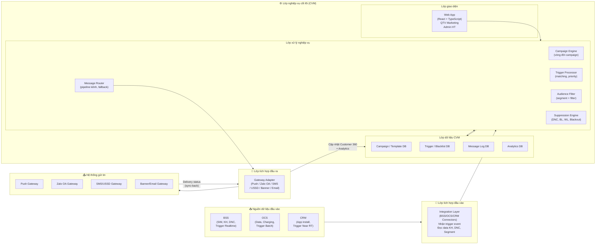
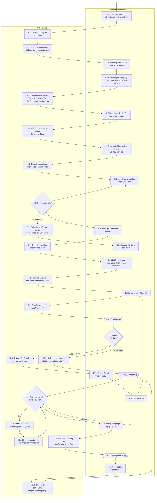
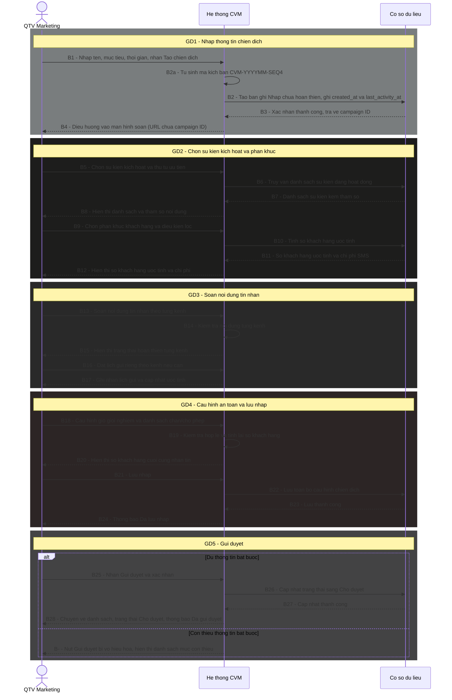
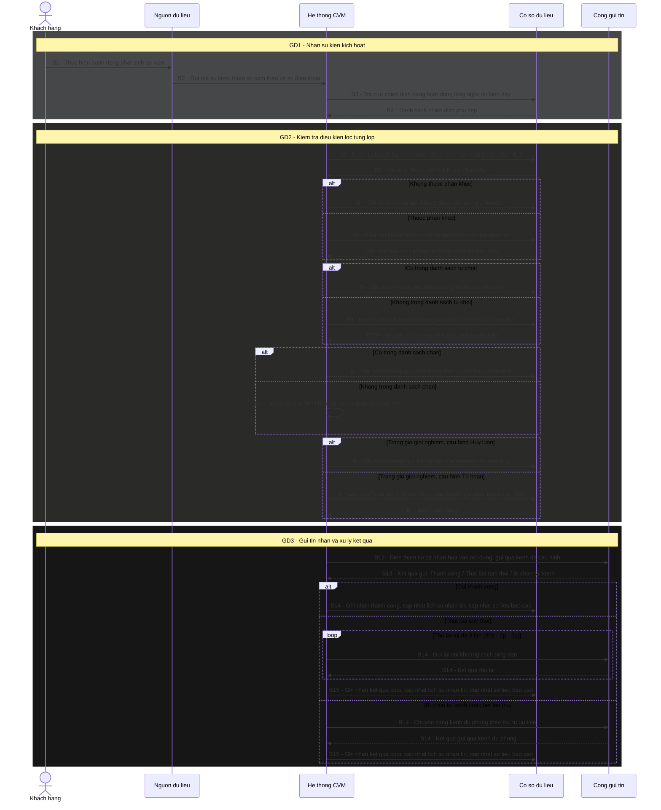

# AUTHENTIC EDUCATION HUB

# TÀI LIỆU ĐẶC TẢ YÊU CẦU NGƯỜI DÙNG
## HỆ THỐNG QUẢN LÝ GIÁ TRỊ KHÁCH HÀNG
### Customer Value Management System (CVM)

Hà Nội – Tháng 05/2026

---

## CÁC THAY ĐỔI

| Ngày | Tác giả | Mục thay đổi | Loại | Mô tả | Phiên bản |
|---|---|---|---|---|---|
| 15/05/2026 | Jun | Toàn bộ | A | Tạo mới — dựa trên Wireframe v9 | V1.0 |

---

## TRANG KÍ

| Vai trò | Họ tên | Chữ ký | Ngày |
|---|---|---|---|
| BA | | | |
| PO | | | |
| Dev Lead | | | |
| Tester Lead | | | |

---

## MỤC LỤC

- I. Giới thiệu
  - I.1. Mục đích tài liệu
  - I.2. Phạm vi tài liệu
  - I.3. Định nghĩa thuật ngữ và từ viết tắt
  - I.4. Kiến trúc tổng thể hệ thống
- II. Các yêu cầu về tổng thể phần mềm
  - II.1. Sơ đồ quy trình nghiệp vụ (Workflow Diagram)
  - II.2. Sơ đồ phân cấp chức năng (Business Function Diagram)
  - II.3. Ma trận phân quyền hệ thống (Permission Matrix)
  - II.4. Ma trận ủy quyền (RBAC – Authorization Matrix)
  - II.5. Sơ đồ trình tự (Sequence Diagram)
  - II.6. Logic Pipeline Kênh — Yêu cầu nghiệp vụ nội bộ cho Dev
- III. Đặc tả tình huống sử dụng (Use Case Specification)
- IV. Giao diện chức năng (Prototype chính)
- C. Yêu cầu phi chức năng

---

# I. GIỚI THIỆU

## I.1. Mục đích tài liệu

Tài liệu này mô tả đầy đủ các yêu cầu nghiệp vụ của **Hệ thống Quản lý Giá trị Khách hàng (CVM — Customer Value Management System)** dành cho doanh nghiệp viễn thông ảo. Hệ thống cho phép đội ngũ Marketing vận hành campaign tự động: khi khách hàng phát sinh sự kiện phù hợp (trigger), hệ thống tự động gửi thông báo qua đúng kênh đến đúng khách hàng, đúng thời điểm — nhằm tăng doanh thu dịch vụ viễn thông và nâng cao trải nghiệm khách hàng.

Tài liệu này được sử dụng bởi:
- **BA**: cơ sở để align với PO và thiết kế chi tiết
- **Dev**: input để thiết kế kỹ thuật, implement logic nghiệp vụ
- **Tester**: cơ sở để thiết kế test case, test plan và nghiệm thu

Vai trò trong vòng đời dự án: tài liệu này là đầu ra của giai đoạn phân tích yêu cầu, là đầu vào cho thiết kế kỹ thuật (SA), phát triển (Dev) và kiểm thử (Tester).

## I.2. Phạm vi tài liệu

**Phạm vi bao gồm:**
- Quản lý Chiến dịch (tạo, sửa, duyệt, vận hành, dừng, kích hoạt lại)
- Quản lý Mẫu tin nhắn (tạo, sửa, sao chép, bật/tắt)
- Quản lý Sự kiện kích hoạt (định nghĩa, phân loại, bật/tắt)
- Quản lý Danh sách chặn (per chiến dịch, per kênh — riêng biệt với danh sách từ chối toàn hệ thống BSS)
- Tra cứu Khách hàng (danh sách + Customer 360: profile, kênh, lịch sử nhận tin)
- Báo cáo và phân tích hiệu quả campaign (Delivery, Engagement, Funnel, Segment, Spam)
- Bảng điều hành vận hành thời gian thực (chỉ số hiệu suất, sức khỏe hệ thống, giám sát chiến dịch, thống kê sự kiện kích hoạt)

**Phạm vi không bao gồm:**
- Quản lý DNC toàn hệ thống (thuộc BSS — CVM chỉ check, không quản lý)
- Quản lý Segment/Phân khúc khách hàng (thuộc Team Data/BSS/OCS — CVM chỉ tiêu thụ)
- Quản lý người dùng nội bộ và phân quyền (thuộc module Admin riêng)
- Frequency Cap (cấu hình tại System Settings, không thuộc phạm vi màn hình này)
- Giao diện cấu hình logic pipeline kênh (fallback, timeout, điều kiện dừng không phơi ra UI — QTV không thao tác trực tiếp; logic được mô tả ở mục II.6 để Dev implement)
- Thiết kế kiến trúc kỹ thuật, API spec, ERD (thuộc phạm vi SA/Dev)

## I.3. Định nghĩa thuật ngữ và từ viết tắt

### I.3.1. Định nghĩa thuật ngữ

| STT | Thuật ngữ | Diễn giải |
|-----|-----------|-----------|
| 1 | Campaign | Chiến dịch marketing tự động: bao gồm cấu hình trigger, audience, nội dung tin nhắn và quy tắc an toàn; khi trigger kích hoạt, hệ thống tự động gửi tin đến khách hàng đủ điều kiện |
| 2 | Trigger | Sự kiện nghiệp vụ kích hoạt campaign (ví dụ: SIM_ACTIVATED, LOW_DATA_BALANCE); mỗi trigger có payload riêng gồm các tham số động |
| 3 | Payload | Tập hợp tham số động gắn với trigger (ví dụ: ten_kh, loai_sim, ngay_kich_hoat); dùng để cá nhân hóa nội dung tin nhắn bằng cú pháp {{tham_so}} |
| 4 | Audience | Tập khách hàng đủ điều kiện nhận tin của một campaign; xác định qua phân khúc (segment) và điều kiện lọc thêm |
| 5 | Segment (Phân khúc) | Nhóm khách hàng được định nghĩa sẵn bởi Team Data/BSS/OCS; CVM chỉ tiêu thụ, không tạo mới |
| 6 | Reach | Số khách hàng ước tính sẽ nhận được tin sau khi áp dụng tất cả bộ lọc (phân khúc, DNC, Blacklist, Whitelist) |
| 7 | Template | Mẫu nội dung tin nhắn tái sử dụng; chứa nội dung tĩnh và tham số động; áp dụng được cho nhiều kênh khác nhau |
| 8 | Kênh (Channel) | Phương thức gửi tin: Push Notification, Zalo OA, SMS, USSD, Banner, Email |
| 9 | Message Matrix | Ma trận nội dung tin nhắn: Trigger × Kênh; mỗi ô là nội dung cụ thể cho một trigger trên một kênh |
| 10 | Audience Variant (Biến thể đối tượng) | Nội dung tin nhắn khác nhau cho cùng một trigger dựa trên segment của khách hàng; chỉ áp dụng trong OR mode |
| 11 | Blackout | Khung giờ giới nghiêm không được gửi tin (ví dụ: 22:00 – 08:00); tin rơi vào blackout bị hủy hoặc delay |
| 12 | DNC (Do Not Contact) | Danh sách khách hàng đã đăng ký từ chối nhận tin — quản lý bởi BSS, áp dụng toàn hệ thống |
| 13 | Blacklist CVM | Danh sách số điện thoại bị chặn gửi tin riêng của CVM, hoạt động ở mức campaign + kênh cụ thể; khác với BSS DNC |
| 14 | Whitelist | Danh sách số điện thoại được phép nhận tin; nếu bật, campaign chỉ gửi cho các số trong whitelist |
| 15 | Kill Switch | Hành động dừng campaign đang Active ngay lập tức; message đang trong queue sẽ bị hủy |
| 16 | Delivery Rate | Tỉ lệ % tin nhắn được gửi thành công / tổng tin gửi |
| 17 | Conversion Rate | Tỉ lệ % khách hàng thực hiện hành động mục tiêu (cài app, mua gói...) / tổng reach |
| 18 | Spam Risk Score | Điểm đánh giá nguy cơ spam (0–100); cảnh báo khi vượt 60; tính từ opt-out rate, BL trend, avg msg/user, failed delivery |
| 19 | Customer 360 | Màn hình tổng hợp toàn bộ thông tin một khách hàng: profile, trạng thái kênh, lịch sử nhận tin, throttling |
| 20 | Throttling | Cơ chế giới hạn số tin nhắn tối đa một khách hàng nhận trong khoảng thời gian nhất định |
| 21 | Global Params | Tập hợp tham số động toàn cục — union của payload từ tất cả trigger trong hệ thống; dùng để cá nhân hóa nội dung trong Template Editor; tại runtime hệ thống điền giá trị thực từ payload của trigger kích hoạt; nếu trigger không có param đó → hiển thị chuỗi rỗng |

### I.3.2. Định nghĩa từ viết tắt

| STT | Từ viết tắt | Nghĩa đầy đủ |
|-----|-------------|--------------|
| 1 | CVM | Customer Value Management |
| 2 | QTV | Quản trị viên |
| 3 | KH | Khách hàng |
| 4 | DNC | Do Not Contact |
| 5 | BL | Blacklist |
| 6 | WL | Whitelist |
| 7 | BSS | Business Support System |
| 8 | OCS | Online Charging System |
| 9 | CRM | Customer Relationship Management |
| 10 | KPI | Key Performance Indicator |
| 11 | SLA | Service Level Agreement |
| 12 | UC | Use Case |
| 13 | UI | User Interface |
| 14 | RBAC | Role-Based Access Control |

## I.4. Kiến trúc tổng thể hệ thống

### Bước 1 — Sơ đồ kiến trúc



### Bước 2 — Diễn giải từng lớp

**Lớp người dùng (Presentation Layer):**
- **Tên lớp**: Web App (UI)
- **Mục đích**: Giao diện thao tác trực tiếp cho QTV Marketing và Admin Hệ thống
- **Thành phần chính**: React + TypeScript SPA; min-width 1440px; ngôn ngữ UI tiếng Việt; sidebar cố định + main content scroll
- **Luồng vào/ra**: Nhận thao tác từ người dùng → gọi xuống Business Logic Layer; nhận phản hồi → render kết quả lên UI
- **Đặc điểm quan trọng**: Desktop-first; không hỗ trợ mobile trong phiên bản này

**Lớp nghiệp vụ (Business Logic Layer):**
- **Tên lớp**: CVM Core Engine (5 module)
- **Mục đích**: Xử lý toàn bộ logic nghiệp vụ campaign — từ khi trigger kích hoạt đến khi tin được gửi
- **Thành phần chính**:
  - *Campaign Engine*: quản lý vòng đời campaign (Draft → Pending → Active → Paused → Ended)
  - *Trigger Processor*: nhận trigger event, match với campaign Active, xác định priority
  - *Audience Filter*: kiểm tra KH có trong Audience (phân khúc + điều kiện lọc)
  - *Suppression Engine*: check tuần tự Trạng thái SIM → DNC → Blacklist CVM → Whitelist → Blackout
  - *Message Router*: chọn kênh, thực thi pipeline fallback, retry, ghi log
- **Luồng vào/ra**: Nhận trigger event từ Integration Layer đầu vào → xử lý → đẩy message xuống Gateway Adapter
- **Đặc điểm quan trọng**: 3 chế độ xử lý — Realtime (< 3s SLA), Near Realtime (batch mỗi giờ), Offline/Batch (cuối ngày)

**Lớp tích hợp (Integration Layer):**
- **Tên lớp**: Integration Layer (2 chiều: vào và ra)
- **Mục đích**: Cầu nối giữa CVM và các hệ thống ngoài
- **Thành phần chính**:
  - *Đầu vào*: BSS Connector (KH, DNC, trigger Realtime), OCS Connector (data, charging, trigger Batch), CRM Connector (app install, trigger Near RT)
  - *Đầu ra*: Gateway Adapter cho từng kênh (Push, Zalo OA, SMS, USSD, Banner, Email)
- **Luồng vào/ra**: Nhận event từ BSS/OCS/CRM → push vào Trigger Processor; nhận message từ Message Router → forward đến Gateway; nhận delivery status từ Gateway → sync-back về Data Layer
- **Đặc điểm quan trọng**: Sync-back delivery status về Customer 360 và Analytics DB sau mỗi lần gửi; Gateway timeout > 5s → ghi log lỗi

**Lớp dữ liệu (Data Layer):**
- **Tên lớp**: CVM Data Layer (4 DB độc lập)
- **Mục đích**: Lưu trữ toàn bộ dữ liệu nghiệp vụ và vận hành của CVM
- **Thành phần chính**: Campaign/Template DB, Trigger/Blacklist DB, Message Log DB, Analytics DB
- **Luồng vào/ra**: Nhận ghi từ Business Logic Layer; trả về kết quả query cho Campaign Engine, Audience Filter, Suppression Engine
- **Đặc điểm quan trọng**: Dữ liệu KH (profile, DNC, segment) **không lưu tại CVM** — chỉ query realtime từ BSS/OCS/CRM qua Integration Layer; mọi thay đổi campaign/template/trigger đều ghi audit log

---

# II. CÁC YÊU CẦU VỀ TỔNG THỂ PHẦN MỀM

## II.1. Sơ đồ quy trình nghiệp vụ (Workflow Diagram)

### Bước 0 — Xác định quy trình

Hệ thống CVM có **1 quy trình trung tâm**: **Tạo và vận hành Campaign**. Tất cả chức năng khác (Template, Trigger, Blacklist, Customer, Report) đều phục vụ quy trình này. Vì vậy chỉ cần 1 workflow diagram tổng thể.

---

### Quy trình: Tạo và Vận hành Campaign

**Phần 1 — Swimlane Diagram**



**Phần 2 — Diễn giải luồng quy trình**

| Bước | Tác nhân | Mô tả |
|------|----------|-------|
| 1 | QTV Marketing | Đăng nhập hệ thống bằng tên đăng nhập và mật khẩu |
| 1.1 | Hệ thống | Xác thực thông tin đăng nhập; kiểm tra tài khoản tồn tại và mật khẩu hợp lệ |
| 1.2 | Hệ thống | Xác thực thành công; hiển thị trang quản trị CVM với các chức năng tương ứng quyền của tài khoản |
| 1.3 | QTV Marketing | Truy cập chức năng "Quản lý Campaign" từ menu điều hướng |
| 2 | QTV Marketing | Nhập thông tin campaign: Tên (bắt buộc), Mã kịch bản (tự sinh theo rule `CVM-YYYYMM-SEQ4`, chỉ đọc), Mục tiêu, Thời gian hiệu lực từ ngày – đến ngày (bắt buộc) |
| 2.1 | Hệ thống | Tự sinh mã kịch bản theo rule `CVM-YYYYMM-SEQ4` (ví dụ: `CVM-202506-0042`); hiển thị dạng chỉ đọc — QTV không thể chỉnh sửa; tự xác định người tạo từ tài khoản đang đăng nhập; hiển thị ngay trên giao diện |
| 3 | QTV Marketing | Chọn trigger sự kiện kích hoạt campaign và thiết lập thứ tự ưu tiên gửi khi nhiều trigger cùng xảy ra |
| 3.1 | Hệ thống | Hiển thị danh sách trigger đang hoạt động để QTV lựa chọn; sau khi chọn, hiển thị tham số nội dung tương ứng từng trigger để QTV dùng khi soạn tin |
| 4 | QTV Marketing | Chọn phân khúc khách hàng sẽ nhận tin; tùy chọn thêm điều kiện lọc bổ sung (loại thiết bị, khu vực…) |
| 4.1 | Hệ thống | Tính số khách hàng ước tính sẽ nhận được tin: lấy từ phân khúc đã chọn → loại trừ khách hàng đã đăng ký từ chối nhận tin → loại trừ danh sách chặn của campaign → giao với danh sách cho phép nếu có; hiển thị con số ước tính ngay trên màn hình |
| 5 | QTV Marketing | Soạn nội dung tin nhắn cho từng kênh (Push, Zalo OA, SMS, USSD, Banner, Email); chọn thời điểm gửi (ngay lập tức / sau một khoảng thời gian kể từ sự kiện / vào một giờ cố định trong ngày) |
| 5.1 | Hệ thống | Kiểm tra nội dung từng kênh: hình ảnh Banner bắt buộc và phải đúng tỉ lệ 16:9; cảnh báo khi nội dung SMS vượt độ dài tiêu chuẩn (tính thêm chi phí); hiển thị trạng thái hoàn thiện nội dung cho từng kênh để QTV biết còn thiếu ở đâu |
| 5.2 | Hệ thống | **[Nhánh: chưa hợp lệ]** Thông báo cụ thể kênh nào còn thiếu nội dung gì; vô hiệu hóa nút Gửi duyệt kèm số lượng mục còn thiếu |
| 5.3 | QTV Marketing | **[Nhánh: chưa hợp lệ]** Bổ sung nội dung còn thiếu theo cảnh báo → quay lại bước 5 |
| 6 | QTV Marketing | **[Nhánh: hợp lệ]** Đặt lịch gửi riêng theo từng kênh nếu muốn các kênh gửi vào khung giờ khác nhau (không bắt buộc) |
| 6.1 | Hệ thống | Ghi nhận lịch gửi riêng cho từng kênh đã cấu hình; các kênh không đặt lịch riêng sẽ gửi theo thời điểm đã chọn ở bước 5 |
| 7 | QTV Marketing | Cấu hình an toàn: bật/tắt giờ giới nghiêm và chọn cách xử lý khi tin rơi vào khung giờ cấm (hủy hoặc trì hoãn đến khi được phép); xác nhận áp dụng danh sách khách hàng đã từ chối nhận tin; chọn danh sách chặn và danh sách cho phép riêng của campaign nếu cần |
| 7.1 | Hệ thống | Kiểm tra danh sách chặn và danh sách cho phép đã chọn hợp lệ chưa; tính lại số khách hàng cuối cùng sẽ nhận tin sau khi áp dụng toàn bộ điều kiện an toàn; hiển thị cảnh báo nếu còn thiếu tệp bắt buộc |
| 8 | QTV Marketing | Nhấn [Gửi duyệt] để chuyển campaign sang trạng thái chờ phê duyệt (chỉ thực hiện được khi không còn mục bắt buộc nào thiếu) |
| 8.1 | Hệ thống | Chuyển campaign sang trạng thái Chờ duyệt; gửi thông báo đến Admin Hệ thống |
| 9 | — | Campaign ở trạng thái Chờ phê duyệt; QTV không thể chỉnh sửa trong thời gian này |
| 10 | Admin Hệ thống | Xem xét toàn bộ nội dung campaign: thông tin, trigger, phân khúc, nội dung tin nhắn, cấu hình an toàn; quyết định phê duyệt hoặc từ chối kèm lý do |
| 10.1 | Hệ thống | **[Nhánh: từ chối]** Thông báo lý do từ chối đến QTV; chuyển campaign về trạng thái Nháp để QTV có thể chỉnh sửa |
| 10.2 | QTV Marketing | **[Nhánh: từ chối]** Đọc lý do từ chối; chỉnh sửa lại campaign theo yêu cầu |
| 10.3 | QTV Marketing | **[Nhánh: từ chối]** Gửi duyệt lại → quay về bước 8 |
| 10.4 | Hệ thống | **[Nhánh: phê duyệt]** Kích hoạt campaign; chuyển sang trạng thái Đang chạy; bắt đầu theo dõi sự kiện phát sinh từ khách hàng |
| 11 | Hệ thống | Liên tục theo dõi sự kiện khách hàng; khi phát hiện sự kiện khớp với trigger đã cấu hình → chuyển sang bước 12 |
| 12 | Hệ thống | Kiểm tra điều kiện an toàn: khách hàng có trong phân khúc đã chọn không → có trong danh sách từ chối không → có trong danh sách chặn không → thời điểm hiện tại có trong giờ giới nghiêm không |
| 12.1 | Hệ thống | **[Nhánh: không đủ điều kiện]** Bỏ qua, không gửi tin cho khách hàng đó; ghi nhận lý do để hiển thị trên báo cáo |
| 12.2 | Hệ thống | **[Nhánh: trong giờ giới nghiêm — cấu hình "Hủy luôn"]** Bỏ qua tin nhắn đó, không gửi; ghi nhận vào lịch sử |
| 12.3 | Hệ thống | **[Nhánh: trong giờ giới nghiêm — cấu hình "Trì hoãn"]** Giữ lại tin nhắn; gửi vào đầu khung giờ được phép gần nhất |
| 13 | Hệ thống | Gửi tin nhắn đến khách hàng qua kênh đã cấu hình theo thứ tự ưu tiên; cập nhật lịch sử nhận tin |
| 13.1 | Hệ thống | **[Nhánh: gửi thành công]** Ghi nhận kết quả thành công; cập nhật số liệu báo cáo → quay lại bước 11 |
| 13.2 | Hệ thống | **[Nhánh: gửi thất bại]** Thử lại tối đa 3 lần; nếu vẫn thất bại thì chuyển sang kênh dự phòng tiếp theo; ghi nhận kết quả và lý do thất bại → quay lại bước 11 |
| 14 | QTV Marketing | Nhấn [Dừng] trên campaign đang chạy; xác nhận trong hộp thoại cảnh báo rằng các tin nhắn đang chờ gửi sẽ bị hủy |
| 14.1 | Hệ thống | Hủy toàn bộ tin nhắn đang chờ gửi; chuyển campaign sang trạng thái Tạm dừng |
| 15 | QTV Marketing | Nhấn [Bật] trên campaign đang Tạm dừng |
| 15.1 | Hệ thống | Kích hoạt lại campaign ngay lập tức, không cần phê duyệt lại; chuyển về trạng thái Đang chạy → quay lại bước 11 |

---

## II.2. Sơ đồ phân cấp chức năng (Business Function Diagram)

```
Hệ thống Quản lý Giá trị Khách hàng (CVM)
├── Khối 1: Quản lý Chiến dịch
│   ├── Xem danh sách chiến dịch
│   ├── Tạo chiến dịch mới
│   ├── Sửa chiến dịch (đang nháp)
│   ├── Xem chi tiết chiến dịch (chỉ đọc)
│   ├── Gửi duyệt chiến dịch
│   ├── Duyệt / Từ chối chiến dịch (Quản trị viên hệ thống)
│   ├── Dừng chiến dịch ngay lập tức
│   └── Kích hoạt lại chiến dịch đang tạm dừng
│
├── Khối 2: Quản lý Mẫu tin nhắn
│   ├── Xem danh sách mẫu tin nhắn
│   ├── Tạo mẫu tin nhắn mới
│   ├── Xem chi tiết / Sửa mẫu tin nhắn
│   ├── Sao chép mẫu tin nhắn
│   └── Bật / Tắt mẫu tin nhắn
│
├── Khối 3: Quản lý Sự kiện kích hoạt
│   ├── Xem danh sách sự kiện kích hoạt (nhóm theo loại)
│   ├── Xem chi tiết / Thêm / Sửa sự kiện kích hoạt
│   └── Bật / Tắt sự kiện kích hoạt
│
├── Khối 4: Quản lý Danh sách chặn
│   ├── Xem danh sách chặn
│   ├── Thêm số điện thoại thủ công
│   ├── Tải lên danh sách chặn (tệp CSV)
│   └── Xóa số điện thoại khỏi danh sách chặn
│
├── Khối 5: Tra cứu Khách hàng
│   ├── Xem danh sách & tìm kiếm khách hàng theo số điện thoại
│   └── Xem hồ sơ 360° khách hàng (thông tin, trạng thái kênh, lịch sử nhận tin)
│
├── Khối 6: Báo cáo & Phân tích
│   ├── Xem báo cáo tỉ lệ gửi tin thành công
│   ├── Xem báo cáo tương tác khách hàng
│   ├── So sánh hiệu quả giữa các chiến dịch
│   ├── Phân tích hiệu quả theo phân khúc khách hàng
│   ├── Phân tích phễu chuyển đổi
│   ├── Báo cáo rủi ro spam & mức độ bão hoà
│   └── Xuất báo cáo ra tệp Excel
│
└── Khối 7: Bảng điều hành vận hành
    ├── Xem chỉ số hiệu suất tổng quan theo thời gian thực
    ├── Xem tình trạng sức khỏe hệ thống (độ trễ, hàng đợi, lỗi)
    ├── Xem giám sát chiến dịch đang chạy
    ├── Xem phễu hành trình khách hàng
    └── Xem thống kê sự kiện kích hoạt (xếp hạng, bản đồ nhiệt, phát hiện bất thường)
```

**Diễn giải từng khối:**

**Khối 1 — Quản lý Chiến dịch**
- Mục đích: Toàn bộ vòng đời chiến dịch từ tạo mới đến vận hành và dừng
- Giá trị nghiệp vụ: Chức năng cốt lõi của hệ thống — không có chiến dịch thì không có gửi tin
- Các chức năng con: Xem danh sách, Tạo mới, Sửa, Xem chi tiết, Gửi duyệt, Duyệt/Từ chối, Dừng ngay lập tức, Kích hoạt lại

**Khối 2 — Quản lý Mẫu tin nhắn**
- Mục đích: Quản lý thư viện mẫu nội dung tái sử dụng cho nhiều chiến dịch
- Giá trị nghiệp vụ: Tăng tốc độ soạn nội dung; đảm bảo nhất quán thông điệp thương hiệu
- Các chức năng con: Xem danh sách, Tạo mới, Xem chi tiết/Sửa, Sao chép, Bật/Tắt

**Khối 3 — Quản lý Sự kiện kích hoạt**
- Mục đích: Định nghĩa và quản lý danh mục các sự kiện kích hoạt chiến dịch
- Giá trị nghiệp vụ: Sự kiện kích hoạt là nguồn đầu vào cho mọi chiến dịch — quản lý sai ảnh hưởng toàn hệ thống
- Các chức năng con: Xem danh sách (nhóm theo loại: Tức thời / Gần tức thời / Theo lô), Xem chi tiết/Thêm/Sửa, Bật/Tắt

**Khối 4 — Quản lý Danh sách chặn**
- Mục đích: Kiểm soát danh sách số điện thoại bị chặn gửi tin theo từng chiến dịch và kênh cụ thể
- Giá trị nghiệp vụ: Ngăn gửi tin đến khách hàng khiếu nại hoặc nhạy cảm mà không ảnh hưởng danh sách từ chối toàn hệ thống
- Các chức năng con: Xem danh sách, Thêm thủ công, Tải lên tệp CSV, Xóa

**Khối 5 — Tra cứu Khách hàng**
- Mục đích: Hỗ trợ quản trị viên tra cứu thông tin khách hàng và xem lịch sử nhận tin để xử lý sự cố
- Giá trị nghiệp vụ: Chẩn đoán vấn đề gửi tin cho từng khách hàng cụ thể; không chỉnh sửa dữ liệu khách hàng trong hệ thống
- Các chức năng con: Xem danh sách và tìm kiếm theo số điện thoại, Xem hồ sơ 360° khách hàng

**Khối 6 — Báo cáo & Phân tích**
- Mục đích: Đo lường hiệu quả chiến dịch và phát hiện sớm rủi ro spam hoặc bão hoà
- Giá trị nghiệp vụ: Cơ sở để quản trị viên tối ưu chiến dịch; phát hiện vấn đề trước khi ảnh hưởng quy mô lớn
- Các chức năng con: Báo cáo tỉ lệ gửi thành công, Báo cáo tương tác, So sánh chiến dịch, Phân tích phân khúc, Phân tích phễu chuyển đổi, Báo cáo rủi ro spam, Xuất Excel

**Khối 7 — Bảng điều hành vận hành**
- Mục đích: Theo dõi thời gian thực tình trạng hệ thống và chiến dịch đang chạy
- Giá trị nghiệp vụ: Phát hiện bất thường ngay lập tức để xử lý trước khi leo thang
- Các chức năng con: Chỉ số hiệu suất tổng quan, Sức khỏe hệ thống, Giám sát chiến dịch, Phễu hành trình khách hàng, Thống kê sự kiện kích hoạt

---

## II.3. Ma trận phân quyền hệ thống (Permission Matrix)

**Quy ước:**
- `X` : Được thực hiện
- `(X)` : Được xem/tổng hợp toàn hệ thống (read-only)
- `–` : Không được thực hiện

| Khối chức năng | Chức năng | Admin HT | QTV Marketing |
|----------------|-----------|----------|---------------|
| **1. Quản lý Chiến dịch** | Xem danh sách chiến dịch | X | X |
| | Tạo chiến dịch mới | – | X |
| | Sửa chiến dịch (đang nháp) | – | X |
| | Xem chi tiết chiến dịch | X | X |
| | Gửi duyệt chiến dịch | – | X |
| | Duyệt / Từ chối chiến dịch | X | – |
| | Dừng chiến dịch ngay lập tức | X | X |
| | Kích hoạt lại chiến dịch đang tạm dừng | X | X |
| **2. Quản lý Mẫu tin nhắn** | Xem danh sách mẫu tin nhắn | (X) | X |
| | Tạo / Xem chi tiết / Sửa mẫu tin nhắn | – | X |
| | Sao chép mẫu tin nhắn | – | X |
| | Bật / Tắt mẫu tin nhắn | – | X |
| **3. Quản lý Sự kiện kích hoạt** | Xem danh sách sự kiện kích hoạt | X | (X) |
| | Thêm / Xem chi tiết / Sửa sự kiện kích hoạt | X | – |
| | Bật / Tắt sự kiện kích hoạt | X | – |
| **4. Quản lý Danh sách chặn** | Xem danh sách chặn | X | X |
| | Thêm số điện thoại thủ công | – | X |
| | Tải lên danh sách chặn (tệp CSV) | – | X |
| | Xóa số điện thoại khỏi danh sách chặn | X | X |
| **5. Tra cứu Khách hàng** | Xem danh sách & tìm kiếm khách hàng | (X) | X |
| | Xem hồ sơ 360° khách hàng | (X) | X |
| **6. Báo cáo & Phân tích** | Xem tất cả báo cáo | X | X |
| | Xuất báo cáo ra tệp Excel | X | X |
| **7. Bảng điều hành vận hành** | Xem bảng điều hành | X | X |

**Ghi chú:**
- Admin HT có quyền xem toàn bộ dữ liệu hệ thống `(X)` nhưng không tạo/sửa campaign và template — đảm bảo phân tách vai trò
- QTV Marketing không có quyền quản lý trigger master — tránh thay đổi nguồn sự kiện ảnh hưởng nhiều campaign
- Quyền Dừng chiến dịch ngay lập tức cấp cho cả 2 role vì tình huống khẩn cấp cần xử lý ngay
- Xóa số khỏi Blacklist CVM cấp cho cả 2 role — Admin cần can thiệp khi có yêu cầu từ KH

---

## II.4. Ma trận ủy quyền (RBAC – Authorization Matrix)

### II.4.1. Vai trò

| Role Code | Tên vai trò | Mô tả |
|-----------|-------------|-------|
| ADMIN_HT | Admin Hệ thống | Quản trị toàn hệ thống: quản lý trigger master, duyệt/từ chối campaign, xem toàn bộ dữ liệu; không tạo campaign và template |
| QTV_MKT | Quản trị viên Marketing | Vận hành campaign hàng ngày: tạo, sửa, gửi duyệt campaign; quản lý template, blacklist; xem report và customer 360 |

### II.4.2. Quy ước quyền

| Ký hiệu | Ý nghĩa |
|---------|---------|
| VIEW | Xem dữ liệu |
| CREATE | Thêm mới |
| UPDATE | Cập nhật |
| DELETE | Xóa |
| EXPORT | Xuất Excel / dữ liệu |
| APPROVE | Phê duyệt / Từ chối |
| OPERATE | Thao tác vận hành (Dừng, Bật lại, Tắt/Bật) |

### II.4.3. Ma trận ủy quyền theo khối chức năng

| Khối chức năng | Đối tượng / Chức năng | ADMIN_HT | QTV_MKT |
|----------------|----------------------|----------|---------|
| **1. Campaign** | Campaign (tất cả) | VIEW | VIEW, CREATE, UPDATE |
| | Gửi duyệt | – | OPERATE |
| | Phê duyệt / Từ chối | APPROVE | – |
| | Dừng chiến dịch ngay lập tức | OPERATE | OPERATE |
| | Kích hoạt lại | OPERATE | OPERATE |
| **2. Template** | Template | VIEW | VIEW, CREATE, UPDATE, OPERATE |
| **3. Trigger** | Trigger master | VIEW, CREATE, UPDATE, OPERATE | VIEW |
| **4. Blacklist CVM** | Blacklist | VIEW, DELETE | VIEW, CREATE, DELETE |
| **5. Khách hàng** | Customer List | VIEW | VIEW |
| | Customer 360 | VIEW | VIEW |
| **6. Report** | Tất cả tab report | VIEW, EXPORT | VIEW, EXPORT |
| **7. Dashboard** | Dashboard | VIEW | VIEW |

**Nguyên tắc RBAC:**
- **Phân quyền theo vai trò**: ADMIN_HT tập trung vào quản trị hệ thống và duyệt; QTV_MKT tập trung vào vận hành campaign
- **Phạm vi dữ liệu (Data Scope)**: Cả 2 role đều thấy toàn bộ dữ liệu hệ thống — không phân vùng theo team/bộ phận trong phiên bản này [Cần xác nhận: có cần phân vùng theo team Marketing không?]
- **Kiểm soát thao tác**: Duyệt chiến dịch chỉ thuộc ADMIN_HT; QTV không tự duyệt chiến dịch của mình. Dừng ngay lập tức cấp cho cả 2 role để xử lý tình huống khẩn cấp. Mọi thao tác nhạy cảm (xóa, dừng, bật/tắt) có confirm dialog; backend validate lại quyền trước khi thực thi

---

## II.5. Sơ đồ trình tự (Sequence Diagram)

### II.5.1. Sequence — Tạo và Gửi duyệt Chiến dịch



**Diễn giải chi tiết — Sequence Tạo và Gửi duyệt Chiến dịch:**

| Giai đoạn | Bước | Từ | Đến | Mô tả |
|-----------|------|----|-----|-------|
| Giai đoạn 1 — Nhập thông tin | 1 | QTV | Hệ thống | Nhập tên chiến dịch (bắt buộc), mã kịch bản (tự sinh `CVM-YYYYMM-SEQ4`, chỉ đọc), mục tiêu, thời gian hiệu lực từ ngày – đến ngày (bắt buộc); nhấn nút **[Tạo chiến dịch]** để xác nhận |
| | 2 | Hệ thống | DB | Tạo bản ghi chiến dịch với trạng thái **Nháp chưa hoàn thiện**; ghi người tạo từ tài khoản đang đăng nhập; ghi `created_at` và `last_activity_at` |
| | 3 | DB | Hệ thống | Xác nhận tạo thành công; trả về campaign ID |
| | 4 | Hệ thống | QTV | Điều hướng vào màn hình soạn chiến dịch (URL chứa campaign ID); người tạo được điền tự động, không chỉnh sửa được |
| Giai đoạn 2 — Sự kiện & Phân khúc | 5 | QTV | Hệ thống | Chọn sự kiện kích hoạt từ danh sách; thiết lập thứ tự ưu tiên nếu chọn nhiều sự kiện |
| | 6 | Hệ thống | DB | Truy vấn danh sách sự kiện kích hoạt đang hoạt động |
| | 7 | DB | Hệ thống | Danh sách sự kiện kích hoạt kèm tham số nội dung tương ứng |
| | 8 | Hệ thống | QTV | Hiển thị danh sách sự kiện và tham số để dùng khi soạn nội dung |
| | 9 | QTV | Hệ thống | Chọn phân khúc khách hàng; tùy chọn thêm điều kiện lọc |
| | 10 | Hệ thống | DB | Tính số khách hàng ước tính: lấy từ phân khúc → loại trừ khách hàng từ chối → loại trừ danh sách chặn → giao danh sách cho phép |
| | 11 | DB | Hệ thống | Số khách hàng ước tính và chi phí tin nhắn SMS ước tính |
| | 12 | Hệ thống | QTV | Hiển thị số khách hàng ước tính và chi phí trên màn hình soạn chiến dịch |
| Giai đoạn 3 — Soạn nội dung | 13 | QTV | Hệ thống | Soạn nội dung tin nhắn cho từng kênh; chọn thời điểm gửi (ngay / sau khoảng thời gian / vào giờ cố định) |
| | 14 | Hệ thống | Hệ thống | Kiểm tra nội dung: ảnh Banner bắt buộc đúng tỉ lệ 16:9; cảnh báo SMS vượt độ dài tiêu chuẩn; đếm tổng mục còn thiếu |
| | 15 | Hệ thống | QTV | Hiển thị trạng thái hoàn thiện nội dung từng kênh; thông báo cụ thể kênh nào còn thiếu |
| | 16 | QTV | Hệ thống | Đặt lịch gửi riêng theo từng kênh nếu cần các kênh gửi vào giờ khác nhau |
| | 17 | Hệ thống | QTV | Ghi nhận lịch gửi; cập nhật ước tính tổng số tin cần gửi |
| Giai đoạn 4 — An toàn & Lưu nháp | 18 | QTV | Hệ thống | Cấu hình giờ giới nghiêm (bật/tắt + cách xử lý); xác nhận danh sách từ chối; chọn danh sách chặn và cho phép riêng nếu cần |
| | 19 | Hệ thống | Hệ thống | Kiểm tra: danh sách chặn/cho phép bật mà chưa chọn tệp → ghi nhận là mục còn thiếu; tính lại số khách hàng cuối cùng |
| | 20 | Hệ thống | QTV | Hiển thị số khách hàng cuối cùng sẽ nhận tin sau khi áp dụng toàn bộ điều kiện an toàn |
| | 21 | QTV | Hệ thống | Nhấn Lưu nháp |
| | 22 | Hệ thống | DB | Lưu toàn bộ cấu hình chiến dịch với trạng thái Nháp |
| | 23 | DB | Hệ thống | Lưu thành công |
| | 24 | Hệ thống | QTV | Thông báo "Đã lưu nháp" |
| Giai đoạn 5 — Gửi duyệt | 25 | QTV | Hệ thống | Nhấn Gửi duyệt; xác nhận trong hộp thoại |
| | 26 | Hệ thống | DB | Cập nhật trạng thái chiến dịch → Chờ duyệt; ghi thời điểm gửi duyệt |
| | 27 | DB | Hệ thống | Cập nhật thành công |
| | 28 | Hệ thống | QTV | Chuyển về danh sách chiến dịch; trạng thái hiển thị Chờ duyệt; thông báo "Đã gửi duyệt" |
| **[Còn thiếu thông tin bắt buộc]** | – | Hệ thống | QTV | Nút Gửi duyệt bị vô hiệu hóa; rê chuột vào nút → hiển thị danh sách các mục còn thiếu; click vào mục → cuộn đến đúng phần có vấn đề |

---

### II.5.2. Sequence — Sự kiện kích hoạt và Gửi tin nhắn



**Diễn giải chi tiết — Sequence Sự kiện kích hoạt và Gửi tin nhắn:**

| Giai đoạn | Bước | Từ | Đến | Mô tả |
|-----------|------|----|-----|-------|
| Giai đoạn 1 — Nhận sự kiện | 1 | Khách hàng | Nguồn dữ liệu | Khách hàng thực hiện hành động phát sinh sự kiện (kích hoạt SIM, sắp hết dung lượng data...) |
| | 2 | Nguồn dữ liệu | Hệ thống | Gửi thông tin sự kiện: mã sự kiện, tham số kèm theo và số điện thoại khách hàng |
| | 3 | Hệ thống | DB | Tra cứu danh sách chiến dịch đang hoạt động có lắng nghe sự kiện này |
| | 4 | DB | Hệ thống | Danh sách chiến dịch phù hợp |
| Giai đoạn 2 — Kiểm tra điều kiện | 5 | Hệ thống | DB | Kiểm tra khách hàng có thuộc phân khúc đã cấu hình trong chiến dịch không |
| | 6 | DB | Hệ thống | Kết quả: thuộc / không thuộc phân khúc |
| | 7 | Hệ thống | DB | (Nếu thuộc phân khúc) Kiểm tra khách hàng có trong danh sách từ chối nhận tin không |
| | 8 | DB | Hệ thống | Kết quả: có / không có trong danh sách từ chối |
| | 9 | Hệ thống | DB | (Nếu không từ chối) Kiểm tra khách hàng có trong danh sách chặn của chiến dịch không |
| | 10 | DB | Hệ thống | Kết quả: có / không có trong danh sách chặn |
| | 11 | Hệ thống | Hệ thống | (Nếu không bị chặn) Kiểm tra thời điểm hiện tại có trong giờ giới nghiêm không |
| Giai đoạn 3 — Gửi tin nhắn | 12 | Hệ thống | Cổng gửi tin | Điền tham số cá nhân hóa vào nội dung; gửi tin nhắn qua kênh đã cấu hình |
| | 13 | Cổng gửi tin | Hệ thống | Kết quả gửi: Thành công / Thất bại tạm thời / Bị chặn tại kênh |
| | 14 — Thành công | Hệ thống | DB | Ghi nhận kết quả thành công; cập nhật lịch sử nhận tin của khách hàng; cập nhật số liệu báo cáo |
| | 14 — Thất bại tạm thời | Hệ thống | Cổng gửi tin | Thử lại tối đa 3 lần với khoảng cách tăng dần (30 giây → 2 phút → 5 phút) |
| | 14 — Bị chặn / hết lần thử | Hệ thống | Cổng gửi tin | Chuyển sang kênh dự phòng tiếp theo theo thứ tự ưu tiên |
| | 15 | Hệ thống | DB | Ghi nhận kết quả cuối cùng; cập nhật lịch sử nhận tin; cập nhật số liệu báo cáo |
| **[Không thuộc phân khúc]** | – | Hệ thống | DB | Ghi nhận: không gửi — không thuộc đối tượng chiến dịch |
| **[Có trong danh sách từ chối]** | – | Hệ thống | DB | Ghi nhận: không gửi — khách hàng đã từ chối nhận tin |
| **[Có trong danh sách chặn]** | – | Hệ thống | DB | Ghi nhận: không gửi — nằm trong danh sách chặn của chiến dịch |
| **[Giờ giới nghiêm — Hủy luôn]** | – | Hệ thống | DB | Ghi nhận: không gửi — rơi vào giờ giới nghiêm, cấu hình hủy |
| **[Giờ giới nghiêm — Trì hoãn]** | – | Hệ thống | DB | Lưu tin nhắn vào hàng đợi với thời gian gửi = đầu khung giờ được phép gần nhất |


---

## II.6. Logic Pipeline Kênh — Yêu cầu nghiệp vụ nội bộ cho Dev

> **Lưu ý**: Toàn bộ logic trong mục này **không phơi ra giao diện người dùng** — QTV Marketing không cấu hình được. Dev phải implement theo đúng quy tắc dưới đây. Tester viết test case kiểm tra từng điều kiện phân nhánh.

### II.6.1. Tổng quan pipeline xử lý kênh

Sau khi trigger match audience và pass suppression (Trạng thái SIM → DNC → BL → WL → Blackout), hệ thống thực thi pipeline gửi tin theo thứ tự:

```
Trigger match
    ↓
[1] Chọn kênh ưu tiên theo thứ tự đã cấu hình trong Message Matrix
    ↓
[2] Kiểm tra trạng thái kênh của KH (sync-back từ Gateway)
    ├── Kênh Active → Gửi tin
    └── Kênh Blocked → Thực hiện Fallback (xem II.6.2)
    ↓
[3] Gửi tin qua Gateway → chờ delivery status
    ├── Delivered → Ghi log thành công → Dừng pipeline
    ├── Failed (lỗi tạm thời) → Retry (xem II.6.3)
    └── Blocked (user opt-out tại Gateway) → Cập nhật trạng thái kênh → Fallback
    ↓
[4] Ghi log kết quả → Cập nhật Customer 360 → Cập nhật analytics
```

### II.6.2. Fallback kênh

Khi một kênh không gửi được (Blocked hoặc Failed vĩnh viễn sau retry hết), hệ thống tự động chuyển sang kênh tiếp theo theo thứ tự ưu tiên mặc định:

```
Push → Zalo OA → SMS → USSD → Banner → Email
```

**Quy tắc fallback:**
- Chỉ fallback sang kênh đã được cấu hình nội dung trong Message Matrix của campaign; bỏ qua kênh chưa có nội dung
- Nếu đã thử hết tất cả kênh có nội dung mà vẫn không gửi được → ghi log `ALL_CHANNELS_FAILED`; không retry thêm
- Mỗi bước fallback ghi 1 dòng riêng trong lịch sử nhận tin của Customer 360: kênh thất bại + lý do + kênh fallback thành công
- Fallback **không áp dụng** nếu lý do thất bại là DNC hoặc Blacklist CVM — trong trường hợp đó dừng ngay, không thử kênh khác

### II.6.3. Retry khi Gateway lỗi

| Loại lỗi | Hành vi |
|---|---|
| Lỗi tạm thời (timeout, 5xx) | Retry tối đa 3 lần với exponential backoff: 30s → 2m → 5m |
| Lỗi vĩnh viễn (4xx, user not found, opt-out) | Không retry; cập nhật trạng thái kênh KH → Blocked; thực hiện fallback |
| Gateway timeout > 5 giây | Ghi log `GATEWAY_[TÊN_KÊNH]_TIMEOUT`; tính là lỗi tạm thời → retry |
| Hết 3 lần retry vẫn lỗi | Tính là lỗi vĩnh viễn → fallback |
| Không nhận được Delivered status sau **15 phút** kể từ lúc gửi | Tính là lỗi tạm thời → retry; nếu hết retry → fallback sang kênh tiếp theo; ghi log `DELIVERY_STATUS_TIMEOUT` |

### II.6.4. Điều kiện dừng pipeline

Pipeline dừng khi gặp **một trong các điều kiện** sau:

| Điều kiện | Mô tả |
|---|---|
| Delivered thành công | Gửi được qua bất kỳ kênh nào → dừng, không gửi kênh tiếp theo |
| Hết kênh khả dụng | Đã thử tất cả kênh có nội dung, không kênh nào thành công |
| DNC hoặc BL block | Không fallback; dừng ngay |
| Trạng thái SIM không hợp lệ | SIM ở trạng thái Inactive, Suspended, hoặc Chờ hủy (Khóa 2 chiều) tại thời điểm gửi → dừng ngay; không fallback; ghi log `SIM_STATUS_BLOCKED`; chỉ gửi cho SIM Active (1 chiều hoặc 2 chiều đang hoạt động) |
| Throttle / Cooldown | KH đạt daily cap hoặc đang trong cooldown → dừng ngay; không fallback; ghi log tương ứng |
| Campaign bị Kill Switch | Hủy message đang chờ trong queue; không gửi |
| Thời gian hiệu lực campaign kết thúc | Message còn trong queue nhưng campaign đã Ended → hủy |

### II.6.5. Channel Strategy override

Nếu QTV cấu hình **đặt lịch riêng per kênh** trong Section 5 Channel Strategy, pipeline phải tôn trọng lịch đó:
- Trigger kích hoạt lúc 14:00, nhưng kênh SMS được đặt lịch "Gửi vào 08:00 hằng ngày" → SMS được enqueue, đợi đến 08:00 hôm sau mới gửi
- Các kênh không đặt lịch riêng → gửi theo thời gian gửi đã cấu hình trong Section 4 (Gửi ngay / Sau X phút / Vào lúc HH:MM)
- Channel Strategy override **không ảnh hưởng** đến thứ tự fallback — nếu kênh A đang đợi lịch mà KH cần gửi ngay → fallback sang kênh B không có lịch override

### II.6.6. Sync-back trạng thái về Customer 360

Sau mỗi lần Gateway trả về kết quả (thành công hoặc thất bại), hệ thống phải:
1. Cập nhật **Trạng thái kênh** của KH đó trong Customer 360 (Active / Blocked + timestamp)
2. Ghi **1 dòng lịch sử nhận tin**: ngày giờ + campaign + kênh + trạng thái (Delivered / Blocked / Failed)
3. Nếu có fallback: ghi thêm dòng kênh fallback kèm ký hiệu `→` để phân biệt
4. Cập nhật **analytics counters**: Sent +1, Delivered +1 hoặc Failed +1 theo kết quả; phân loại lý do Failed (Gateway error / User blocked / DNC/Blacklist / Network timeout) để hiển thị đúng trên Report Tab Delivery

### II.6.7. Throttling & Frequency Cap

> Toàn bộ logic này không phơi ra UI campaign — QTV không cấu hình per campaign. Giá trị ngưỡng được cấu hình tại System Settings bởi Admin.

**Quy tắc áp dụng trước khi gửi tin (sau Suppression Engine, trước khi vào pipeline kênh):**

| Rule | Mô tả | Hành vi khi vi phạm |
|---|---|---|
| Daily cap toàn kênh | Tối đa **N tin nhắn marketing/ngày/KH** tính trên tất cả kênh, tất cả campaign — N cấu hình tại System Settings, **mặc định = 3** | Bỏ qua lần gửi này; ghi log `THROTTLE_DAILY_CAP_EXCEEDED`; không retry, không fallback |
| Cooldown liên campaign | Sau khi KH nhận tin thành công từ bất kỳ campaign nào, KH vào trạng thái **cooldown X giờ** — X cấu hình tại System Settings — không nhận thêm bất kỳ tin nào từ campaign khác trong thời gian này | Bỏ qua; ghi log `THROTTLE_COOLDOWN_ACTIVE`; không retry |

**Hiển thị tại Customer 360:**
- Field "Tin hôm nay / giới hạn": ví dụ `2/3` — số tin đã nhận hôm nay / giá trị N hiện tại
- Field "Cooldown": thời gian còn lại của cooldown (nếu đang trong cooldown); hiển thị `--` nếu không trong cooldown

### II.6.8. Cross-campaign Priority — Khi nhiều campaign cùng match một KH

Khi một trigger event khiến nhiều campaign Active cùng match một KH, hệ thống **không gửi tất cả** — chỉ chọn **một campaign** theo thứ tự ưu tiên do Admin cấu hình trong **Priority Matrix**.

**Cơ chế hoạt động:**
- Mỗi campaign được Admin gán một **priority score** (số nguyên, càng nhỏ càng ưu tiên cao — ví dụ: 1 = cao nhất)
- Khi nhiều campaign cùng match một KH, hệ thống chọn campaign có priority score thấp nhất
- **Tiebreak khi cùng score:** chọn campaign có `created_at` sớm hơn (campaign tạo trước được ưu tiên)
- **Các campaign không được chọn** trong lần xử lý đó: ghi log `CAMPAIGN_SKIPPED_PRIORITY` kèm campaign ID và campaign được chọn — để phục vụ báo cáo và debug

**Priority score được cấu hình tại hai nơi:**
1. **Campaign level** — Admin gán score khi tạo/sửa campaign (field "Độ ưu tiên")
2. **Priority Matrix** — màn hình hệ thống riêng cho Admin xem và sắp xếp lại thứ tự ưu tiên của tất cả campaign Active cùng lúc (xem mục màn hình UC-PRIORITY-01)

> **Lưu ý thiết kế:** Hệ thống không quy định cứng loại campaign nào được ưu tiên hơn loại nào — toàn bộ do Admin quyết định thông qua priority score. Điều này cho phép linh hoạt theo từng giai đoạn kinh doanh.

### II.6.9. Deduplication Event — Chống xử lý trùng lặp

Nguồn dữ liệu (BSS/OCS) có thể gửi cùng một event nhiều lần do lỗi retry ở phía nguồn. CVM phải đảm bảo mỗi event chỉ được xử lý **đúng một lần**.

**Cơ chế:**
- Mỗi event từ nguồn **bắt buộc** kèm `event_id` duy nhất (do nguồn sinh, ví dụ: `BSS-EVT-20250601-000123`)
- Khi nhận event, CVM kiểm tra `event_id` trong bảng deduplication DB (TTL: 24 giờ)
- Nếu `event_id` đã tồn tại → bỏ qua toàn bộ; ghi log `EVENT_DUPLICATE_IGNORED` kèm `event_id`
- Nếu chưa tồn tại → ghi `event_id` vào DB, tiếp tục xử lý bình thường

**Quy tắc bổ sung:**
- TTL 24 giờ: sau 24 giờ, `event_id` được xóa khỏi deduplication store — nếu nguồn retry sau 24 giờ thì event được xử lý lại (chấp nhận được vì trường hợp cực kỳ hiếm)
- Deduplication check xảy ra **trước** bước match campaign — không tốn tài nguyên xử lý campaign nếu là event trùng

---

# III. ĐẶC TẢ TÌNH HUỐNG SỬ DỤNG (USE CASE SPECIFICATION)

## Khối 1: Quản lý Chiến dịch

### UC-CAM-01: Xem danh sách Chiến dịch

| Nội dung | Mô tả |
|----------|-------|
| **Tên** | Xem danh sách Campaign |
| **Mục tiêu** | Cho phép QTV Marketing và Admin HT nhanh chóng nắm bắt trạng thái toàn bộ campaign đang có trong hệ thống; hỗ trợ lọc và tìm kiếm để đến đúng campaign cần thao tác |
| **Tác nhân** | QTV Marketing, Admin Hệ thống |
| **Trigger** | Người dùng click nav "Campaign" trên sidebar hoặc navigate về /campaigns |
| **Tiền điều kiện** | - Người dùng đã đăng nhập thành công với role QTV Marketing hoặc Admin HT |
| **Hậu điều kiện** | - Danh sách campaign hiển thị với trạng thái hiện tại <br>- Người dùng có thể chuyển sang thao tác tạo mới, xem, sửa hoặc dừng campaign |
| **Hoạt động** | 1. Hệ thống tải danh sách campaign (mặc định 20 bản ghi/trang, sắp xếp theo ngày tạo mới nhất) <br>1a. Hiển thị bảng: Tên/Mã campaign, Trigger (tối đa 2 chip + "+N ⓘ"), Thời gian hiệu lực, Trạng thái (status chip màu), Hành động <br>2. Người dùng tùy chọn nhập từ khóa tìm kiếm (tên campaign, mã campaign, trigger code) <br>2a. Hệ thống lọc realtime, highlight kết quả khớp <br>3. Người dùng tùy chọn click filter chip (Active/Draft/Pending/Paused/Realtime/Offline/Có SMS/Chưa đủ nội dung) <br>3a. Hệ thống lọc bảng theo filter đã chọn; filter multi-select, click lại để bỏ <br>4. Người dùng click "+N ⓘ" trên cột Trigger <br>4a. Hệ thống mở popover hiển thị đầy đủ danh sách trigger của campaign đó kèm Source và Kiểu chạy <br>**[Alternative — phân trang]**: Người dùng chuyển trang hoặc đổi số bản ghi/trang; hệ thống tải trang tương ứng |
| **Quy tắc nghiệp vụ** | - Cột Trigger hiển thị tối đa 2 chip; nếu campaign có nhiều hơn 2 trigger thì hiện "+N ⓘ" (N = số trigger còn lại) <br>- Status chip màu: Active = xanh lá, Draft = xám, Pending = vàng, Paused = cam <br>- Hành động per trạng thái: Active → [Xem][Dừng]; Draft → [Xem][Sửa]; Pending → [Xem]; Paused → [Xem][Bật] <br>- Tìm kiếm áp dụng đồng thời cho tên campaign, mã campaign và trigger code |

---

### UC-CAM-02: Tạo Chiến dịch mới

| Nội dung | Mô tả |
|----------|-------|
| **Tên** | Tạo Campaign mới |
| **Mục tiêu** | Cho phép QTV Marketing cấu hình đầy đủ một campaign mới gồm thông tin cơ bản, trigger, audience, nội dung tin nhắn, channel strategy và an toàn; lưu nháp hoặc gửi duyệt |
| **Tác nhân** | QTV Marketing |
| **Trigger** | QTV click nút [+ Tạo Campaign] trên màn hình Campaign List; hệ thống navigate → /campaigns/new |
| **Tiền điều kiện** | - QTV đã đăng nhập với role QTV Marketing <br>- Có ít nhất 1 trigger Active trong hệ thống <br>- Có ít nhất 1 phân khúc (segment) được cấp từ Team Data/BSS/OCS |
| **Hậu điều kiện** | - **Lưu Nháp**: Campaign được lưu với trạng thái Draft; QTV có thể tiếp tục chỉnh sửa <br>- **Gửi duyệt**: Campaign chuyển trạng thái → Pending; Admin HT nhận thông báo; QTV không thể sửa cho đến khi Admin từ chối |
| **Hoạt động** | 1. QTV nhập thông tin cơ bản: Tên campaign (bắt buộc), Mã kịch bản (optional), Mục tiêu (optional), Thời gian hiệu lực từ-đến (bắt buộc), Độ ưu tiên (optional — số nguyên dương, mặc định = max score hiện tại + 1) <br>1a. Hệ thống tự điền Người tạo = account hiện tại (read-only) <br>2. QTV chọn Chế độ trigger: Basic (1 trigger) hoặc Advanced (nhiều trigger + logic OR/AND) <br>2a. QTV chọn trigger từ dropdown tìm kiếm → trigger xuất hiện dạng chip; hover chip → tooltip hiển thị Source, Kiểu chạy, danh sách payload <br>2b. Advanced mode: QTV kéo handle [≡] để reorder priority; badge ★ luôn đánh dấu P1 <br>2c. Advanced mode: QTV chọn Logic OR hoặc AND; hệ thống hiển thị diễn giải tương ứng <br>3. QTV chọn phân khúc Audience từ dropdown; hệ thống hiển thị tag card với tên segment và số KH <br>3a. QTV tùy chọn mở rộng "Điều kiện lọc thêm": chọn giá trị cố định từ dropdown (không nhập tự do) <br>3b. Hệ thống tính reach realtime = Audience → trừ DNC → trừ BL → giao WL; hiển thị trên Campaign Summary mini <br>4. QTV cấu hình Thời gian gửi (1 lần, áp dụng toàn campaign): Gửi ngay / Sau X phút-giờ-ngày kể từ T / Vào lúc HH:MM ngày T+N <br>5. QTV chọn tab kênh → soạn nội dung từng trigger card (cột trái: PARAMS chips, image, template, nội dung; cột phải: preview live + sample params) <br>5a. Hệ thống cập nhật completion badge per kênh; Banner: image 16:9 bắt buộc upload trước khi lưu <br>6. QTV tùy chọn cấu hình Channel Strategy: đặt lịch riêng per kênh (override thời gian gửi ở bước 4) <br>7. QTV cấu hình An toàn: Blackout (bật/tắt + giờ + xử lý), DNC (checkbox mặc định bật), Blacklist campaign (chọn tệp), Whitelist (optional) <br>7a. Hệ thống validate: BL/WL bật mà chưa chọn tệp → blocking issue; đếm tổng issue, hiển thị badge đỏ trên [Gửi duyệt] <br>8. QTV nhấn [Lưu Nháp] bất kỳ lúc nào <br>8a. Hệ thống lưu toàn bộ cấu hình; toast "Đã lưu nháp ✓" <br>9. QTV nhấn [Gửi duyệt] (chỉ active khi issue count = 0) <br>9a. Hệ thống hiển thị confirm dialog; QTV xác nhận <br>9b. Hệ thống chuyển trạng thái → Pending; navigate về Campaign List; toast "Đã gửi duyệt ✓" <br>**[Alternative — Lưu nháp trước, gửi duyệt sau]**: QTV lưu nháp, thoát ra Campaign List, sau đó vào [Sửa] để hoàn thiện và gửi duyệt <br>**[Exception — còn issue blocking]**: Nút [Gửi duyệt] disabled; hover → tooltip liệt kê issue; click issue → scroll đến section có vấn đề <br>**[Exception — Banner chưa upload image]**: Cảnh báo ⚠ ngay trong card Banner; là blocking issue cho [Gửi duyệt] |
| **Quy tắc nghiệp vụ** | - Tên campaign là trường bắt buộc; không được để trống khi gửi duyệt <br>- Mã kịch bản tự sinh theo rule `CVM-YYYYMM-SEQ4`: `CVM` là prefix cố định; `YYYYMM` là năm-tháng tạo campaign; `SEQ4` là số thứ tự 4 chữ số tự tăng trong tháng, reset về `0001` đầu mỗi tháng (ví dụ: `CVM-202506-0042`) <br>- Mã kịch bản là chỉ đọc — QTV không thể chỉnh sửa; hệ thống đảm bảo unique tự động <br>- Độ ưu tiên là số nguyên dương; mặc định = max priority score của tất cả campaign hiện tại + 1 (tức là thấp nhất); QTV/Admin có thể chỉnh sửa; không được để trống hoặc nhập số âm <br>- Thời gian hiệu lực bắt buộc; ngày kết thúc phải ≥ ngày bắt đầu <br>- Chỉ hiển thị trigger có trạng thái Active trong dropdown chọn trigger <br>- Basic mode: chỉ được chọn 1 trigger; ẩn Logic OR/AND và khối xung đột <br>- AND mode: [+ Biến thể đối tượng] bị ẩn hoàn toàn (display:none); chỉ có 1 message card per kênh <br>- Chuyển từ OR → AND khi đã có Audience Variant: bắt buộc confirm dialog trước; xác nhận → xóa tất cả variant <br>- Banner: image 16:9 bắt buộc — thiếu là blocking issue <br>- Blacklist campaign bật nhưng chưa chọn tệp: blocking issue <br>- Whitelist bật nhưng chưa chọn tệp: blocking issue <br>- DNC mặc định bật; bỏ tick DNC phải confirm dialog cảnh báo rủi ro gửi KH đã từ chối <br>- Chọn 0 phân khúc: hệ thống mặc định gửi T-ALL (tất cả KH); phải confirm trước khi lưu <br>- SMS vượt 160 ký tự: hiển thị counter đỏ + badge "X SMS segment"; cost = reach SMS × ceil(ký tự/160); không block lưu <br>- USSD: cảnh báo nếu có ký tự đặc biệt; giới hạn 182 ký tự <br>- Thời gian gửi "Vào lúc HH:MM ngày T+0" mà đã qua giờ: hệ thống queue sang ngày T+1 <br>- **[Draft cleanup]** Campaign ở trạng thái Nháp chưa hoàn thiện (chưa từng nhấn Lưu nháp) mà không có hoạt động nào sau 30 ngày kể từ `last_activity_at` → hệ thống tự động xóa; QTV không nhận thông báo. Campaign đã nhấn Lưu nháp ít nhất 1 lần (trạng thái Nháp thông thường) không áp dụng rule này |

---

### UC-CAM-03: Sửa Chiến dịch (đang nháp)

| Nội dung | Mô tả |
|----------|-------|
| **Tên** | Sửa Campaign ở trạng thái Draft |
| **Mục tiêu** | Cho phép QTV Marketing chỉnh sửa campaign đang Draft; giao diện và logic giống Tạo mới nhưng các field được pre-filled với dữ liệu đã lưu |
| **Tác nhân** | QTV Marketing |
| **Trigger** | QTV click [Sửa] trên campaign Draft trong Campaign List; navigate → /campaigns/:id/edit |
| **Tiền điều kiện** | - Campaign ở trạng thái Draft <br>- QTV là người tạo campaign hoặc có quyền sửa [Cần xác nhận: có phân quyền sửa theo người tạo không?] |
| **Hậu điều kiện** | - Campaign được cập nhật và lưu nháp; hoặc chuyển → Pending nếu gửi duyệt |
| **Hoạt động** | 1. Hệ thống load Campaign Builder với toàn bộ dữ liệu đã lưu pre-filled <br>2. QTV chỉnh sửa các section cần thiết (logic giống UC-CAM-02) <br>3. QTV lưu nháp hoặc gửi duyệt (logic giống UC-CAM-02) <br>**[Exception — trigger đã chọn bị tắt]**: Chip trigger đó highlight đỏ với cảnh báo "Trigger đã bị tắt — vui lòng chọn trigger khác" |
| **Quy tắc nghiệp vụ** | - Chỉ campaign ở trạng thái Draft mới có thể sửa <br>- Nếu trigger đã chọn trước đó bị tắt sau khi lưu nháp: highlight đỏ chip trigger; là blocking issue cho [Gửi duyệt] |

---

### UC-CAM-04: Xem chi tiết Chiến dịch

| Nội dung | Mô tả |
|----------|-------|
| **Tên** | Xem chi tiết Campaign (chỉ đọc) |
| **Mục tiêu** | Cho phép QTV và Admin xem đầy đủ toàn bộ cấu hình của một campaign ở mọi trạng thái mà không cần mở Campaign Builder |
| **Tác nhân** | QTV Marketing, Admin Hệ thống |
| **Trigger** | Click [Xem] trên bất kỳ campaign nào trong Campaign List; navigate → /campaigns/:id/detail |
| **Tiền điều kiện** | - Người dùng đã đăng nhập |
| **Hậu điều kiện** | - Người dùng xem được toàn bộ cấu hình campaign |
| **Hoạt động** | 1. Hệ thống load và hiển thị Campaign Detail View (chỉ đọc): Thông tin cơ bản, Trigger & Logic, Audience, Message Matrix (tab kênh), Channel Strategy, An toàn <br>2. Người dùng click tab kênh để xem nội dung message per kênh; tab mặc định = tab đầu tiên có nội dung <br>3. Người dùng click [Xem] bên cạnh tệp Blacklist/Whitelist → modal preview chỉ đọc (danh sách số + thống kê hợp lệ/trùng/sai định dạng) <br>4. Người dùng click nút hành động tùy trạng thái: Draft → [Sửa]; Active → [Dừng]; Paused → [Bật] <br>**[Alternative — từ Dashboard]**: Click campaign trong bảng Top Active Campaigns → navigate đến Campaign Detail View |
| **Quy tắc nghiệp vụ** | - Toàn bộ nội dung chỉ đọc — không có ô nhập liệu hay nút chỉnh sửa nội dung <br>- Nút hành động biến đổi theo trạng thái: Draft → [Sửa] thay [Đóng]; Active → [Dừng] + [Đóng]; Paused → [Bật] + [Đóng]; Pending/Ended → chỉ [Đóng] |

---

### UC-CAM-05: Duyệt / Từ chối Chiến dịch

| Nội dung | Mô tả |
|----------|-------|
| **Tên** | Duyệt hoặc Từ chối Campaign |
| **Mục tiêu** | Cho phép Admin HT kiểm duyệt nội dung campaign trước khi vận hành; đảm bảo campaign đáp ứng tiêu chuẩn trước khi gửi tin đến khách hàng |
| **Tác nhân** | Admin Hệ thống |
| **Trigger** | Admin nhận thông báo campaign Pending cần duyệt; Admin vào Campaign List lọc trạng thái Pending → click [Xem] |
| **Tiền điều kiện** | - Campaign ở trạng thái Pending <br>- Admin đã đăng nhập với role Admin HT |
| **Hậu điều kiện** | - Phê duyệt: Campaign → Active; hệ thống bắt đầu lắng nghe trigger <br>- Từ chối: Campaign → Draft; hệ thống gửi push notification đến tài khoản QTV đã tạo campaign kèm lý do từ chối; QTV chỉnh sửa và gửi duyệt lại |
| **Hoạt động** | 1. Admin xem Campaign Detail View (chỉ đọc) của campaign Pending <br>2. Admin kiểm tra toàn bộ nội dung: thông tin, trigger, audience, message, an toàn <br>3a. **[Phê duyệt]**: Admin xác nhận phê duyệt → hệ thống chuyển trạng thái → Active; campaign bắt đầu vận hành <br>3b. **[Từ chối]**: Admin nhập lý do từ chối (bắt buộc) → hệ thống chuyển campaign → Draft; gửi push notification đến QTV kèm lý do; QTV có thể sửa lại và gửi duyệt lại <br>**[Exception — Campaign đã Paused trước khi Admin duyệt]**: Campaign chuyển sang Paused trong lúc đang Pending (do Admin khác dùng Kill Switch) → nút [Phê duyệt] và [Từ chối] bị ẩn; Admin chỉ thấy thông báo "Campaign này đã bị dừng — không thể duyệt"; Admin đóng màn hình, không thực hiện hành động <br>**[Exception — Campaign đã Ended trước khi Admin duyệt]**: Campaign hết thời gian hiệu lực trong lúc đang Pending → tương tự Paused; nút duyệt/từ chối bị ẩn; hiển thị thông báo "Campaign đã kết thúc — không thể duyệt" |
| **Quy tắc nghiệp vụ** | - Chỉ Admin HT được thực hiện duyệt/từ chối — QTV không tự duyệt campaign của mình <br>- Campaign Pending không thể sửa cho đến khi Admin từ chối về Draft |

---

### UC-CAM-06: Dừng Chiến dịch ngay lập tức

| Nội dung | Mô tả |
|----------|-------|
| **Tên** | Dừng Campaign đang Active (Kill Switch) |
| **Mục tiêu** | Cho phép QTV Marketing hoặc Admin HT dừng ngay lập tức một campaign đang Active khi phát hiện vấn đề; toàn bộ message đang queue bị hủy |
| **Tác nhân** | QTV Marketing, Admin Hệ thống |
| **Trigger** | Click [Dừng] trên campaign Active trong Campaign List hoặc Campaign Detail View |
| **Tiền điều kiện** | - Campaign ở trạng thái Active |
| **Hậu điều kiện** | - Campaign chuyển → Paused <br>- Toàn bộ message đang trong queue bị hủy <br>- Dashboard cập nhật: Active Campaigns giảm 1; Paused campaigns tăng 1 |
| **Hoạt động** | 1. Người dùng click [Dừng] <br>1a. Hệ thống hiển thị confirm dialog: "Dừng campaign? Message đang trong queue sẽ bị hủy. Không thể hoàn tác." với [Hủy] và [Xác nhận Dừng] (màu đỏ) <br>2. Người dùng click [Xác nhận Dừng] <br>2a. Hệ thống hủy toàn bộ message đang trong queue; chuyển trạng thái → Paused; toast "Campaign đã dừng" <br>**[Alternative — Hủy]**: Người dùng click [Hủy] hoặc nhấn Escape → đóng dialog, campaign vẫn Active |
| **Quy tắc nghiệp vụ** | - Kill Switch áp dụng ngay lập tức — không có delay <br>- Message đã được gửi trước khi Kill Switch (status Delivered) không bị thu hồi <br>- Chỉ message còn trong queue (chưa gửi) mới bị hủy <br>- Bắt buộc có confirm dialog trước khi thực thi — không thể dừng mà không xác nhận |

---

### UC-CAM-07: Kích hoạt lại Chiến dịch đang tạm dừng

| Nội dung | Mô tả |
|----------|-------|
| **Tên** | Kích hoạt lại Campaign từ trạng thái Paused |
| **Mục tiêu** | Cho phép khôi phục campaign đã dừng mà không cần gửi duyệt lại, miễn là không có thay đổi nội dung |
| **Tác nhân** | QTV Marketing, Admin Hệ thống |
| **Trigger** | Click [Bật] trên campaign Paused trong Campaign List hoặc Campaign Detail View |
| **Tiền điều kiện** | - Campaign ở trạng thái Paused <br>- Nội dung campaign không thay đổi so với lúc được duyệt |
| **Hậu điều kiện** | - Campaign chuyển → Active; hệ thống tiếp tục lắng nghe trigger |
| **Hoạt động** | 1. Người dùng click [Bật] <br>1a. Hệ thống chuyển trạng thái → Active ngay (không cần confirm); toast "Campaign đã kích hoạt lại" <br>1b. Button chuyển từ [Bật] → [Dừng] |
| **Quy tắc nghiệp vụ** | - Không cần quy trình duyệt lại nếu nội dung không thay đổi <br>- CVM cho phép sửa campaign đang Paused; sau khi sửa nội dung → bắt buộc gửi duyệt lại trước khi bật lại <br>- Nếu bật lại mà không sửa nội dung: không cần duyệt lại, không cần confirm dialog <br>- Không cần confirm dialog khi bật lại (ngược với Kill Switch) |

---

### UC-CAM-08: Gửi duyệt Chiến dịch

| Nội dung | Mô tả |
|----------|-------|
| **Tên** | Gửi Campaign để phê duyệt |
| **Mục tiêu** | Cho phép QTV Marketing chuyển campaign đã cấu hình đầy đủ sang trạng thái Chờ duyệt để Admin HT xem xét trước khi vận hành; đảm bảo mọi campaign đều qua kiểm duyệt trước khi gửi tin đến khách hàng |
| **Tác nhân** | QTV Marketing |
| **Trigger** | QTV nhấn nút [Gửi duyệt] trong Campaign Builder khi campaign đang ở trạng thái Draft và không còn mục bắt buộc nào thiếu |
| **Tiền điều kiện** | - Campaign ở trạng thái Draft <br>- Đã điền đủ: Tên campaign, Thời gian hiệu lực, ít nhất 1 trigger, ít nhất 1 kênh có nội dung hoàn chỉnh <br>- Không còn issue blocking nào (Banner có ảnh, Blacklist/Whitelist đã chọn tệp nếu bật) |
| **Hậu điều kiện** | - Campaign chuyển → trạng thái Pending <br>- QTV không thể chỉnh sửa campaign trong thời gian chờ duyệt <br>- Admin HT nhận thông báo có campaign cần xem xét |
| **Hoạt động** | 1. QTV nhấn [Gửi duyệt] <br>1a. Hệ thống hiển thị confirm dialog: "Gửi campaign để duyệt?" với [Hủy] và [Gửi duyệt] <br>2. QTV xác nhận [Gửi duyệt] <br>2a. Hệ thống chuyển trạng thái campaign → Pending; ghi timestamp gửi duyệt <br>2b. Hệ thống điều hướng QTV về Campaign List; status chip chuyển → Pending (màu vàng); toast "Đã gửi duyệt ✓" <br>**[Exception — còn issue blocking]**: Nút [Gửi duyệt] bị vô hiệu hóa; badge đỏ hiển thị số issue; hover → tooltip liệt kê từng issue; click issue → cuộn đến đúng section có vấn đề |
| **Quy tắc nghiệp vụ** | - Nút [Gửi duyệt] chỉ active khi tổng số issue blocking = 0 <br>- Các issue blocking bắt buộc: Tên campaign trống; Thời gian hiệu lực chưa chọn; Không có trigger nào; Tất cả kênh đều chưa có nội dung; Banner bật mà chưa upload ảnh 16:9; Blacklist bật mà chưa chọn tệp; Whitelist bật mà chưa chọn tệp <br>- Sau khi gửi duyệt, campaign không thể sửa cho đến khi Admin từ chối trả về Draft |

---

## Khối 2: Quản lý Mẫu tin nhắn

### UC-TPL-00: Xem danh sách Mẫu tin nhắn

| Nội dung | Mô tả |
|----------|-------|
| **Tên** | Xem danh sách Template |
| **Mục tiêu** | Cho phép QTV Marketing nhanh chóng tìm kiếm, lọc và điều hướng đến template cần thao tác; xem số lần template đang được dùng trong campaign |
| **Tác nhân** | QTV Marketing |
| **Trigger** | QTV click nav "Template" trên sidebar; navigate → /templates |
| **Tiền điều kiện** | - QTV đã đăng nhập |
| **Hậu điều kiện** | - Danh sách template hiển thị đúng trạng thái hiện tại <br>- QTV có thể chuyển sang thao tác Tạo mới, Sửa, Clone hoặc Bật/Tắt |
| **Hoạt động** | 1. Hệ thống tải danh sách template (mặc định 20 bản ghi/trang) <br>1a. Hiển thị bảng: Tên Template, Kênh hỗ trợ, Số lần dùng, Hành động <br>2. QTV tùy chọn nhập từ khóa tìm kiếm theo tên template <br>2a. Hệ thống lọc realtime <br>3. QTV tùy chọn lọc theo Kênh hoặc Trạng thái (Active/Inactive) <br>3a. Hệ thống lọc bảng theo điều kiện đã chọn <br>4. QTV click số "X lần" ở cột Dùng <br>4a. Hệ thống hiển thị popover danh sách campaign đang dùng template đó <br>**[Alternative]**: QTV click [+ Tạo Template] → navigate /templates/new |
| **Quy tắc nghiệp vụ** | - Cột "Dùng" hiển thị số campaign Active đang tham chiếu template này <br>- Template Inactive hiển thị grayed out trong danh sách; không xuất hiện trong dropdown khi soạn nội dung campaign <br>- Tìm kiếm áp dụng cho tên template |

---

### UC-TPL-01: Tạo Mẫu tin nhắn mới

| Nội dung | Mô tả |
|----------|-------|
| **Tên** | Tạo Mẫu tin nhắn mới |
| **Mục tiêu** | Cho phép QTV soạn template tái sử dụng cho nhiều campaign; hỗ trợ nhiều kênh, tham số động và preview realtime |
| **Tác nhân** | QTV Marketing |
| **Trigger** | QTV click [+ Tạo Template] từ danh sách template → navigate /templates/new |
| **Tiền điều kiện** | - QTV đã đăng nhập |
| **Hậu điều kiện** | - Template được lưu với trạng thái Active/Inactive; xuất hiện trong danh sách <br>- Template Active xuất hiện trong dropdown khi soạn nội dung campaign |
| **Hoạt động** | **Header cố định (luôn hiển thị khi cuộn):** <br>- Breadcrumb "← Danh sách Template" → navigate /templates <br>- Ô nhập Tên template (bắt buộc; placeholder "Tên template...") <br>- Toggle Active/Inactive (mặc định Active) <br>- Nút [Lưu Template] (primary, góc phải) <br><br>**Thân trang — layout 2 cột:** <br>**Cột trái (soạn nội dung):** <br>1. QTV click [+ Thêm kênh] để thêm tab kênh (Zalo OA / SMS / USSD / Banner / Email / Push) <br>2. QTV click tab kênh → soạn nội dung kênh đó; mỗi tab có: upload ảnh (nếu kênh hỗ trợ), textarea nội dung, khu vực chip Global Params bên dưới textarea <br>3. QTV click chip Global Param (ví dụ: `{{ten_kh}}`, `{{so_du}}`, `{{ten_goi}}`...) → chèn vào vị trí con trỏ trong textarea; danh sách chip lấy từ union payload của tất cả trigger Active trong hệ thống <br>4. QTV click [Lưu Template]: validate tên bắt buộc → lưu; toast "Đã lưu template ✓" → navigate /templates <br>**Cột phải (preview realtime):** <br>- Tiêu đề "XEM TRƯỚC · [TÊN KÊNH]" <br>- Khung preview cập nhật realtime theo nội dung đang soạn; tham số động hiển thị giá trị mẫu từ Sample Params <br>- Bảng Sample Params: mỗi tham số có ô nhập giá trị mẫu để xem preview thực tế (ví dụ: `ten_kh = Nguyễn Văn A`) <br><br>**[Exception — tên trống khi lưu]**: Inline error dưới ô tên "Tên template không được để trống" <br>**[Exception — tab kênh trống khi lưu]**: Toast cảnh báo "Kênh [X] chưa có nội dung" — không block lưu |
| **Quy tắc nghiệp vụ** | - Tên template bắt buộc khi lưu <br>- Phải có ít nhất 1 tab kênh; cảnh báo (không block) nếu tab kênh không có nội dung <br>- Chip Global Params hiển thị union payload của tất cả trigger Active trong hệ thống; khi có trigger mới được thêm/bật → danh sách chip cập nhật tự động <br>- Chip chèn đúng vị trí con trỏ; nếu không có con trỏ thì chèn vào cuối nội dung <br>- Tại runtime: hệ thống điền giá trị thực từ payload của trigger kích hoạt; nếu trigger không có param đó → hiển thị chuỗi rỗng (không báo lỗi, không block gửi) <br>- Sample Params chỉ dùng để preview trong editor — không lưu vào template |

---

### UC-TPL-02: Xem chi tiết Mẫu tin nhắn

| Nội dung | Mô tả |
|----------|-------|
| **Tên** | Xem chi tiết Mẫu tin nhắn |
| **Mục tiêu** | Cho phép QTV xem toàn bộ nội dung template ở chế độ chỉ đọc trước khi quyết định sửa hoặc sao chép |
| **Tác nhân** | QTV Marketing |
| **Trigger** | QTV click [Xem] trên template trong danh sách → navigate /templates/:id |
| **Tiền điều kiện** | - QTV đã đăng nhập <br>- Template tồn tại trong hệ thống |
| **Hậu điều kiện** | - Không thay đổi dữ liệu |
| **Hoạt động** | 1. Hệ thống load và hiển thị Template Detail View chỉ đọc: Tên, Mô tả, Trạng thái, danh sách tab kênh có nội dung <br>2. QTV click tab kênh để xem nội dung và preview từng kênh (layout 2 cột giống UC-TPL-01, toàn bộ chỉ đọc) <br>3. QTV click [Sửa] → navigate sang UC-TPL-03 <br>4. QTV click [Sao chép] → thực hiện UC-TPL-04 <br>5. QTV click [← Danh sách Template] → quay về /templates |
| **Quy tắc nghiệp vụ** | - Toàn bộ nội dung chỉ đọc — không có ô nhập liệu <br>- Nút [Sửa] và [Sao chép] luôn hiển thị bất kể trạng thái template |

---

### UC-TPL-03: Sửa Mẫu tin nhắn

| Nội dung | Mô tả |
|----------|-------|
| **Tên** | Sửa Mẫu tin nhắn |
| **Mục tiêu** | Cho phép QTV chỉnh sửa nội dung template đã có |
| **Tác nhân** | QTV Marketing |
| **Trigger** | QTV click [Sửa] từ danh sách hoặc từ Template Detail View → navigate /templates/:id/edit |
| **Tiền điều kiện** | - QTV đã đăng nhập <br>- Template tồn tại trong hệ thống |
| **Hậu điều kiện** | - Template được cập nhật; danh sách phản ánh nội dung mới |
| **Hoạt động** | 1. Hệ thống load Template Editor với toàn bộ dữ liệu pre-filled (layout giống UC-TPL-01) <br>2. QTV chỉnh sửa Tên, Trạng thái, nội dung từng kênh <br>3. QTV click [Lưu Template]: validate → lưu; toast "Đã lưu template ✓" → navigate /templates <br>**[Exception — tên trống khi lưu]**: Inline error "Tên template không được để trống" |
| **Quy tắc nghiệp vụ** | - Template đang dùng trong campaign Active vẫn có thể sửa; campaign Active không bị ảnh hưởng (template đã được copy vào campaign tại thời điểm tạo) <br>- Tên template bắt buộc khi lưu |

---

### UC-TPL-04: Sao chép / Bật-Tắt Mẫu tin nhắn

| Nội dung | Mô tả |
|----------|-------|
| **Tên** | Sao chép / Bật-Tắt Mẫu tin nhắn |
| **Mục tiêu** | Cho phép QTV nhân bản template để tạo biến thể nhanh, hoặc bật/tắt template khỏi danh sách chọn trong campaign |
| **Tác nhân** | QTV Marketing |
| **Trigger** | QTV click [Sao chép] hoặc [Bật]/[Tắt] từ danh sách hoặc Detail View |
| **Tiền điều kiện** | - QTV đã đăng nhập <br>- Template tồn tại trong hệ thống |
| **Hậu điều kiện** | - **Sao chép**: bản sao mới xuất hiện đầu danh sách, mở ngay Template Editor <br>- **Tắt**: template không còn hiển thị trong dropdown campaign; **Bật**: hiển thị lại |
| **Hoạt động** | **[Sao chép]**: Hệ thống tạo bản sao với tên "Copy of [Tên]"; navigate ngay sang Template Editor (/templates/new) với nội dung pre-filled từ bản gốc; QTV chỉnh sửa và lưu như UC-TPL-01 <br>**[Tắt]**: Hệ thống hiển thị confirm dialog "Template sẽ không hiện trong dropdown khi soạn campaign. Xác nhận tắt?"; QTV xác nhận → trạng thái → Inactive; row grayed out trong danh sách; nút đổi thành [Bật] <br>**[Bật]**: Không cần confirm → trạng thái → Active ngay; row hiển thị bình thường; nút đổi thành [Tắt] |
| **Quy tắc nghiệp vụ** | - Sao chép tạo bản sao độc lập — chỉnh sửa bản sao không ảnh hưởng template gốc <br>- Template đang dùng trong campaign Active khi bị Tắt: campaign vẫn chạy bình thường <br>- Template Inactive không xuất hiện trong dropdown chọn template khi soạn nội dung campaign |

---

## Khối 3: Quản lý Sự kiện kích hoạt

### UC-TRG-00: Xem danh sách Sự kiện kích hoạt

| Nội dung | Mô tả |
|----------|-------|
| **Tên** | Xem danh sách Sự kiện kích hoạt |
| **Mục tiêu** | Cho phép người dùng xem toàn bộ danh sách trigger nhóm theo loại; tìm kiếm nhanh để điều hướng sang thao tác cụ thể |
| **Tác nhân** | Admin Hệ thống, QTV Marketing |
| **Trigger** | Người dùng click nav "Trigger" → /triggers |
| **Tiền điều kiện** | - Người dùng đã đăng nhập |
| **Hậu điều kiện** | - Danh sách trigger hiển thị đúng trạng thái hiện tại |
| **Hoạt động** | 1. Hệ thống tải và hiển thị danh sách trigger nhóm thành 3 collapsible groups: Realtime / Near Realtime / Offline <br>1a. **Admin**: mỗi dòng hiển thị Trigger code, Tên, Source, Trạng thái, Hành động ([Xem][Sửa][Tắt] hoặc [Xem][Sửa][Bật]) + nút [+ Thêm Trigger] <br>1b. **QTV**: mỗi dòng hiển thị Trigger code, Tên, Source, Trạng thái, Hành động ([Xem]) — không có [Sửa][Tắt][Bật][+ Thêm Trigger] <br>2. Người dùng tùy chọn click header group → collapse/expand nhóm <br>3. Người dùng tùy chọn nhập từ khóa tìm kiếm (tên hoặc trigger code) <br>3a. Hệ thống lọc realtime, highlight kết quả khớp, tự động expand group chứa kết quả <br>4. Người dùng click [Xem] → UC-TRG-02 <br>5. **Admin**: click [+ Thêm Trigger] → UC-TRG-01; click [Sửa] → UC-TRG-03; click [Tắt/Bật] → UC-TRG-04 |
| **Quy tắc nghiệp vụ** | - Loại trigger quyết định nhóm hiển thị: Realtime / Near Realtime / Offline <br>- Trigger Inactive hiển thị grayed out; vẫn hiển thị trong danh sách, không bị ẩn <br>- Các nút [+ Thêm][Sửa][Tắt][Bật] chỉ render với role Admin; backend từ chối request nếu QTV cố gọi API tương ứng |

---

### UC-TRG-01: Thêm Sự kiện kích hoạt mới

| Nội dung | Mô tả |
|----------|-------|
| **Tên** | Thêm Sự kiện kích hoạt mới |
| **Mục tiêu** | Cho phép Admin định nghĩa trigger mới với payload tương ứng để campaign có thể lắng nghe |
| **Tác nhân** | Admin Hệ thống |
| **Trigger** | Admin click [+ Thêm Trigger] từ danh sách → mở Modal Thêm |
| **Tiền điều kiện** | - Admin đã đăng nhập với role Admin HT |
| **Hậu điều kiện** | - Trigger mới được tạo ở trạng thái Active; xuất hiện đúng nhóm trong danh sách <br>- Param của trigger mới tự động được thêm vào Global Params (chip tham số động trong Template Editor) |
| **Hoạt động** | 1. Admin nhập Trigger code (bắt buộc), Tên (bắt buộc), chọn Loại (Realtime / Near Realtime / Offline), Source (BSS / OCS), Trạng thái (mặc định Active), Mô tả (optional) <br>2. Admin thêm dòng Payload: nhập tên tham số + chọn nguồn dữ liệu; có thể thêm nhiều dòng hoặc xóa dòng <br>3. Admin click [Lưu]: hệ thống validate → đóng modal + cập nhật bảng + toast "Đã lưu trigger ✓" <br>**[Exception — trigger code trùng]**: Inline error "Trigger code đã tồn tại" — không đóng modal <br>**[Exception — trigger code sai format]**: Inline error "Chỉ dùng chữ in hoa, số và gạch dưới (_)" |
| **Quy tắc nghiệp vụ** | - Trigger code chỉ chứa chữ in hoa, số và gạch dưới (`_`); không được trùng với code đã có trong hệ thống <br>- Phải có ít nhất 1 dòng Payload; tên tham số không được để trống <br>- Trigger mới tạo mặc định Active; xuất hiện ngay trong dropdown trigger khi QTV tạo campaign |

---

### UC-TRG-02: Xem chi tiết Sự kiện kích hoạt

| Nội dung | Mô tả |
|----------|-------|
| **Tên** | Xem chi tiết Sự kiện kích hoạt |
| **Mục tiêu** | Cho phép người dùng xem đầy đủ cấu hình và payload của một trigger ở chế độ chỉ đọc |
| **Tác nhân** | Admin Hệ thống, QTV Marketing |
| **Trigger** | Người dùng click [Xem] trên trigger trong danh sách → mở Modal/Panel chi tiết chỉ đọc |
| **Tiền điều kiện** | - Người dùng đã đăng nhập <br>- Trigger tồn tại trong hệ thống |
| **Hậu điều kiện** | - Không thay đổi dữ liệu |
| **Hoạt động** | 1. Hệ thống load và hiển thị thông tin trigger chỉ đọc: Trigger code, Tên, Loại, Source, Trạng thái, Mô tả <br>2. Hệ thống hiển thị bảng Payload: danh sách tên tham số + nguồn dữ liệu tương ứng <br>3. Hệ thống hiển thị danh sách campaign đang dùng trigger này (tên campaign + trạng thái) <br>4. **Admin**: hiển thị thêm nút [Sửa] → UC-TRG-03 <br>5. Người dùng click [Đóng] → quay về danh sách |
| **Quy tắc nghiệp vụ** | - Toàn bộ nội dung chỉ đọc — không có ô nhập liệu với cả 2 role <br>- Danh sách campaign đang dùng hiển thị tất cả trạng thái (Active, Paused, Pending, Draft) <br>- Nút [Sửa] chỉ hiển thị với role Admin; QTV không thấy nút này |

---

### UC-TRG-03: Sửa Sự kiện kích hoạt

| Nội dung | Mô tả |
|----------|-------|
| **Tên** | Sửa Sự kiện kích hoạt |
| **Mục tiêu** | Cho phép Admin cập nhật thông tin và payload của trigger đã có |
| **Tác nhân** | Admin Hệ thống |
| **Trigger** | Admin click [Sửa] trên trigger trong danh sách → mở Modal Sửa pre-filled |
| **Tiền điều kiện** | - Admin đã đăng nhập với role Admin HT <br>- Trigger tồn tại trong hệ thống |
| **Hậu điều kiện** | - Trigger được cập nhật; thay đổi payload phản ánh ngay vào Global Params |
| **Hoạt động** | 1. Hệ thống mở modal với toàn bộ thông tin trigger pre-filled (Trigger code ở trạng thái read-only — không đổi được) <br>2. Admin chỉnh sửa Tên, Loại, Source, Trạng thái, Mô tả, Payload (thêm/xóa/sửa dòng) <br>3. Admin click [Lưu]: validate → đóng modal + cập nhật bảng + toast "Đã lưu trigger ✓" |
| **Quy tắc nghiệp vụ** | - Trigger code không thể thay đổi sau khi tạo (read-only trong modal Sửa) <br>- Xóa param khỏi Payload: param đó bị xóa khỏi Global Params; nội dung template đang dùng `{{param}}` đó sẽ render chuỗi rỗng tại runtime — không block, không cảnh báo khi lưu trigger <br>- Priority xung đột giữa các trigger không cấu hình ở đây — chỉ cấu hình ở campaign level |

---

### UC-TRG-04: Bật / Tắt Sự kiện kích hoạt

| Nội dung | Mô tả |
|----------|-------|
| **Tên** | Bật / Tắt Sự kiện kích hoạt |
| **Mục tiêu** | Cho phép Admin kiểm soát trigger nào đang hoạt động; tắt trigger ngừng phát sinh sự kiện mà không xóa cấu hình |
| **Tác nhân** | Admin Hệ thống |
| **Trigger** | Admin click [Tắt] hoặc [Bật] trên trigger trong danh sách |
| **Tiền điều kiện** | - Admin đã đăng nhập với role Admin HT <br>- Trigger tồn tại trong hệ thống |
| **Hậu điều kiện** | - **Tắt**: trigger → Inactive; không xuất hiện trong dropdown khi QTV tạo campaign mới <br>- **Bật**: trigger → Active; xuất hiện lại trong dropdown campaign |
| **Hoạt động** | **[Tắt]**: <br>1. Hệ thống kiểm tra trigger có đang dùng trong campaign Active không <br>1a. Nếu có → hiển thị confirm dialog cảnh báo kèm danh sách campaign bị ảnh hưởng: "Trigger đang dùng trong [N] campaign Active. Tắt sẽ khiến các campaign này không nhận được sự kiện này nữa. Xác nhận?" <br>1b. Nếu không có → confirm dialog thông thường "Xác nhận tắt trigger [CODE]?" <br>2. Admin xác nhận → trạng thái → Inactive; chip trigger trong campaign hiện highlight đỏ cảnh báo <br>**[Bật]**: Không cần confirm → trạng thái → Active ngay; toast "Đã bật trigger ✓" |
| **Quy tắc nghiệp vụ** | - Khi tắt trigger đang dùng trong campaign Active: campaign vẫn tiếp tục chạy với các trigger khác còn Active; trigger bị tắt highlight đỏ trong Campaign Builder của campaign đó — là blocking issue cho [Gửi duyệt] nếu QTV vào sửa lại <br>- Trigger Inactive không xuất hiện trong dropdown khi tạo campaign mới; vẫn giữ nguyên trong danh sách quản lý |

---

## Khối 4: Quản lý Danh sách chặn

### UC-BL-00: Xem danh sách Blacklist

| Nội dung | Mô tả |
|----------|-------|
| **Tên** | Xem danh sách Blacklist CVM |
| **Mục tiêu** | Cho phép người dùng tra cứu toàn bộ số điện thoại đang bị chặn theo từng campaign và kênh |
| **Tác nhân** | QTV Marketing, Admin Hệ thống |
| **Trigger** | Người dùng click nav "Blacklist" → /blacklist |
| **Tiền điều kiện** | - Người dùng đã đăng nhập |
| **Hậu điều kiện** | - Danh sách blacklist hiển thị đúng trạng thái hiện tại |
| **Hoạt động** | 1. Hệ thống tải và hiển thị bảng: Số điện thoại, Campaign, Kênh, Nguồn (Tệp / Nhập tay trong campaign), Hành động ([Xóa]) <br>2. Người dùng tùy chọn filter theo Campaign hoặc Kênh <br>2a. Hệ thống lọc bảng realtime theo điều kiện đã chọn <br>3. **QTV**: thấy nút [+ Thêm thủ công] và [Upload CSV] → UC-BL-01, UC-BL-02 |
| **Quy tắc nghiệp vụ** | - Blacklist CVM hoạt động ở mức campaign + kênh — không phải toàn hệ thống <br>- Số điện thoại có thể xuất hiện trong nhiều campaign-kênh khác nhau (mỗi cặp là 1 bản ghi riêng) <br>- Bản ghi có nguồn "Nhập tay trong campaign" (pattern `BL_INLINE_[MÃ_CAMPAIGN]`) cũng hiển thị tại đây |

---

### UC-BL-01: Thêm thủ công số vào Blacklist

| Nội dung | Mô tả |
|----------|-------|
| **Tên** | Thêm thủ công số điện thoại vào Blacklist |
| **Mục tiêu** | Cho phép QTV chặn nhanh một hoặc vài số điện thoại cụ thể khỏi một campaign và kênh |
| **Tác nhân** | QTV Marketing, Admin Hệ thống |
| **Trigger** | Người dùng click [+ Thêm thủ công] từ danh sách Blacklist → mở Modal |
| **Tiền điều kiện** | - Người dùng đã đăng nhập <br>- Có ít nhất 1 campaign tồn tại trong hệ thống |
| **Hậu điều kiện** | - Số điện thoại được thêm vào blacklist của campaign và kênh đã chọn; áp dụng ngay cho các event tiếp theo |
| **Hoạt động** | 1. Người dùng nhập số điện thoại (bắt buộc; hỗ trợ nhập nhiều số phân cách bằng dấu phẩy hoặc xuống dòng) <br>2. Người dùng chọn Campaign (bắt buộc) và Kênh (bắt buộc) từ dropdown <br>3. Hệ thống validate realtime: số hợp lệ màu xanh, sai định dạng màu đỏ kèm tooltip <br>4. Người dùng click [Thêm]: hệ thống lưu các số hợp lệ; số sai định dạng bỏ qua → đóng modal + toast "Đã thêm X số vào blacklist ✓" <br>**[Exception — không có số hợp lệ nào]**: Nút [Thêm] disabled; hiển thị "Chưa có số hợp lệ để thêm" |
| **Quy tắc nghiệp vụ** | - Số hợp lệ: 10 chữ số, bắt đầu bằng 0 <br>- Số sai định dạng bị bỏ qua, không block toàn bộ thao tác; hiển thị số lượng bị bỏ qua trong toast <br>- Số đã có trong blacklist của cùng campaign-kênh: bỏ qua (không báo lỗi, không tạo bản ghi trùng) |

---

### UC-BL-02: Upload CSV vào Blacklist

| Nội dung | Mô tả |
|----------|-------|
| **Tên** | Upload danh sách CSV vào Blacklist |
| **Mục tiêu** | Cho phép QTV thêm hàng loạt số điện thoại vào blacklist của một campaign và kênh qua file CSV |
| **Tác nhân** | QTV Marketing, Admin Hệ thống |
| **Trigger** | Người dùng click [Upload CSV] từ danh sách Blacklist → mở Modal |
| **Tiền điều kiện** | - Người dùng đã đăng nhập <br>- Có ít nhất 1 campaign tồn tại trong hệ thống |
| **Hậu điều kiện** | - Các số hợp lệ trong file được thêm vào blacklist của campaign và kênh đã chọn |
| **Hoạt động** | 1. Người dùng chọn Campaign (bắt buộc) và Kênh (bắt buộc) <br>2. Người dùng chọn file CSV (1 cột số điện thoại, không cần header) <br>3. Hệ thống parse file ngay → hiển thị preview: tổng dòng, Hợp lệ / Sai định dạng / Trùng đã có trong blacklist <br>4. Người dùng click [Xác nhận Upload]: hệ thống lưu các số hợp lệ → đóng modal + toast "Đã upload X số vào blacklist ✓" <br>**[Exception — file không đúng định dạng]**: Hiển thị "File không hợp lệ — vui lòng chọn file CSV" <br>**[Exception — file rỗng hoặc không có số hợp lệ nào]**: Nút [Xác nhận Upload] disabled; hiển thị "Không tìm thấy số hợp lệ trong file" |
| **Quy tắc nghiệp vụ** | - File CSV: 1 cột số điện thoại, tối đa 100.000 dòng/lần upload <br>- Số sai định dạng bỏ qua, không block upload; hiển thị rõ số lượng bị bỏ qua trong preview <br>- Số trùng với bản ghi đã có trong blacklist của cùng campaign-kênh: bỏ qua, không tạo bản ghi trùng |

---

### UC-BL-03: Xóa số khỏi Blacklist

| Nội dung | Mô tả |
|----------|-------|
| **Tên** | Xóa số điện thoại khỏi Blacklist |
| **Mục tiêu** | Cho phép người dùng gỡ chặn một số điện thoại khỏi blacklist của một campaign và kênh cụ thể |
| **Tác nhân** | QTV Marketing, Admin Hệ thống |
| **Trigger** | Người dùng click [Xóa] trên dòng blacklist cụ thể |
| **Tiền điều kiện** | - Người dùng đã đăng nhập <br>- Bản ghi blacklist tồn tại |
| **Hậu điều kiện** | - Số điện thoại được gỡ khỏi blacklist của campaign và kênh tương ứng; áp dụng ngay cho các event tiếp theo |
| **Hoạt động** | 1. Hệ thống hiển thị confirm dialog: "Xóa số [X] khỏi blacklist campaign [Y] kênh [Z]? Số này sẽ có thể nhận tin từ campaign này." <br>2. Người dùng xác nhận → hệ thống xóa bản ghi + toast "Đã xóa ✓" <br>3. Người dùng hủy → đóng dialog, không thay đổi |
| **Quy tắc nghiệp vụ** | - Xóa chỉ áp dụng cho cặp campaign-kênh cụ thể; nếu số đó xuất hiện trong blacklist của campaign/kênh khác thì không bị ảnh hưởng <br>- Bản ghi nguồn "Nhập tay trong campaign" (`BL_INLINE_*`) cũng có thể xóa từ màn hình này — áp dụng rule tương tự <br>- Blacklist CVM check sau khi đã check DNC toàn hệ thống — xóa khỏi blacklist không xóa khỏi DNC BSS |

---

## Khối 5: Tra cứu Khách hàng

### UC-KH-00: Xem danh sách & Tìm kiếm Khách hàng

| Nội dung | Mô tả |
|----------|-------|
| **Tên** | Xem danh sách và Tìm kiếm Khách hàng |
| **Mục tiêu** | Cho phép QTV tra cứu nhanh khách hàng theo số điện thoại, lọc theo các tiêu chí cơ bản và điều hướng vào Customer 360 để xem chi tiết |
| **Tác nhân** | QTV Marketing, Admin Hệ thống |
| **Trigger** | Click nav "Khách hàng" trên sidebar; navigate → /customers |
| **Tiền điều kiện** | - Người dùng đã đăng nhập |
| **Hậu điều kiện** | - Danh sách khách hàng hiển thị theo điều kiện tìm kiếm/lọc <br>- Người dùng có thể điều hướng vào Customer 360 của bất kỳ khách hàng nào |
| **Hoạt động** | 1. Hệ thống tải danh sách khách hàng (mặc định 20 bản ghi/trang); dữ liệu đọc từ BSS/OCS <br>1a. Hiển thị bảng: Số điện thoại, Loại SIM, Trạng thái SIM, Cài app <br>2. QTV tùy chọn nhập số điện thoại vào ô tìm kiếm (chính xác hoặc một phần) <br>2a. Hệ thống lọc realtime theo số điện thoại <br>3. QTV tùy chọn áp dụng filter: Trạng thái SIM (Active/Inactive/Suspended), Cài app (Có/Không), DNC (Có DNC/Không có DNC) <br>3a. Hệ thống lọc bảng theo điều kiện đã chọn <br>4. QTV click [Xem 360] trên dòng khách hàng cần xem <br>4a. Hệ thống navigate → /customers/:phone/360 |
| **Quy tắc nghiệp vụ** | - Dữ liệu khách hàng chỉ đọc từ BSS/OCS — không chỉnh sửa trong CVM <br>- Tìm kiếm theo số điện thoại hỗ trợ tìm một phần (nhập "0987" sẽ ra tất cả số bắt đầu bằng 0987) <br>- Filter DNC chỉ hiển thị trạng thái từ BSS — CVM không quản lý DNC |

---

### UC-KH-01: Xem Customer 360

| Nội dung | Mô tả |
|----------|-------|
| **Tên** | Xem Customer 360 |
| **Mục tiêu** | Cho phép QTV tra cứu đầy đủ thông tin một khách hàng cụ thể: profile, trạng thái kênh, lịch sử nhận tin, throttling — để troubleshoot vấn đề gửi tin |
| **Tác nhân** | QTV Marketing, Admin Hệ thống |
| **Trigger** | Click [Xem 360] trên một khách hàng trong Customer List; navigate → /customers/:phone/360 |
| **Tiền điều kiện** | - Người dùng đã đăng nhập <br>- Khách hàng tồn tại trong hệ thống BSS/OCS |
| **Hậu điều kiện** | - Người dùng xem được toàn bộ thông tin KH ở thời điểm hiện tại |
| **Hoạt động** | 1. Hệ thống load dữ liệu KH từ BSS/OCS: Loại SIM, trạng thái, gói cước + hạn, ngày KH SIM, thiết bị, cài app, đăng nhập app, data còn lại, lưu lượng hôm nay, số dư, số lần nạp, số lần gia hạn, cuộc gọi thất bại, ngày sinh nhật, nghề nghiệp <br>2. Hệ thống load Phân khúc: danh sách segment KH đang thuộc (lấy từ BSS/OCS/Team Data) <br>3. Hệ thống load Trạng thái kênh (sync-back từ Gateway): Zalo OA / SMS / USSD / Push — Active/Blocked + timestamp cập nhật lần cuối <br>4. Hệ thống load Throttling: số tin hôm nay / giới hạn N, cooldown active (Có/Không), BSS DNC Flag (Có/Không) <br>5. Hệ thống load Lịch sử nhận tin gần đây: thời gian + campaign + kênh + trạng thái; dòng fallback hiển thị 2 sub-dòng (kênh block + kênh fallback thành công) <br>6. Người dùng click [Xem đầy đủ lịch sử →] → Drawer từ phải với phân trang + filter theo kênh và campaign <br>**[Alternative]**: Người dùng tìm kiếm số điện thoại trong Customer List → click [Xem 360] |
| **Quy tắc nghiệp vụ** | - Dữ liệu chỉ đọc — không chỉnh sửa thông tin KH trong CVM <br>- Toàn bộ dữ liệu KH (profile, thống kê, phân khúc) đọc realtime từ BSS/OCS; không lưu tại CVM <br>- Trạng thái kênh tự cập nhật từ Gateway; không chỉnh sửa thủ công <br>- Phân khúc hiển thị dạng danh sách chip tag; nếu KH không thuộc phân khúc nào → hiển thị "Không có" <br>- Lịch sử fallback: nếu Zalo bị block → SMS delivered, hiển thị 2 dòng: "Zalo ✕ Blocked → Fallback" và dòng kênh fallback "SMS ✓ Delivered" |

---

## Khối 6: Báo cáo & Phân tích

### UC-RPT-01: Xem Báo cáo & Xuất tệp Excel

| Nội dung | Mô tả |
|----------|-------|
| **Tên** | Xem và Xuất báo cáo hiệu quả Campaign |
| **Mục tiêu** | Cho phép QTV và cấp quản lý phân tích đa chiều hiệu quả campaign; phát hiện sớm rủi ro spam/fatigue; export để báo cáo nội bộ |
| **Tác nhân** | QTV Marketing, Admin Hệ thống |
| **Trigger** | Click nav "Report" → /report |
| **Tiền điều kiện** | - Người dùng đã đăng nhập <br>- Có dữ liệu campaign đã chạy trong kỳ lọc |
| **Hậu điều kiện** | - Người dùng xem được báo cáo theo filter đã chọn <br>- File Excel được tải xuống nếu click [Xuất Excel] |
| **Hoạt động** | 1. Hệ thống load Report với filter mặc định: 7 ngày gần nhất, tất cả campaign, tất cả segment, tất cả kênh <br>2. Người dùng chỉnh filter: Thời gian (Hôm nay/7 ngày/30 ngày/Tháng này/Tùy chỉnh date range), Campaign, Segment, Kênh <br>2a. Hệ thống cập nhật tất cả chart và bảng đồng thời theo filter mới <br>3. Người dùng click tab: Delivery / Engagement / Campaign Comparison / Segment / Funnel / Spam & Fatigue <br>3a. **[Tab Delivery]**: KPIs (Sent, Delivered%, Failed%), area chart Sent vs Delivered theo thời gian, Delivery Rate Trend, Failed Trend stacked bar (phân loại lý do) <br>3b. **[Tab Engagement]**: KPIs (Open Rate, CTR, Conversion Rate, Best Channel), bar chart Channel Performance, Engagement Trend line chart <br>3c. **[Tab Campaign Comparison]**: chọn tối đa 5 campaign để so sánh; bar chart + bảng so sánh (Sent, Delivered, Open, Convert, Cost SMS) <br>3d. **[Tab Segment]**: bảng Segment Performance (Reach, Delivered, Open, Conversion); bar chart so sánh; Device Breakdown (Android/iOS/Khác) <br>3e. **[Tab Funnel]**: funnel từ Audience đủ điều kiện → Sent → Delivered → Opened → App Installed → Package Purchased; % drop-off + lý do tại mỗi bước; tự động highlight điểm drop lớn nhất + gợi ý hành động <br>3f. **[Tab Spam & Fatigue]**: Opt-out & Blacklist Trend, Frequency Metrics (avg/max tin/user), Histogram phân phối, Spam Risk Score (0-100, cảnh báo >60) <br>4. Người dùng bật [So sánh: ON] → hiện thêm đường/cột kỳ trước trên tất cả chart <br>5. Người dùng click [Xuất Excel] → toast "Đang xuất file... Sẽ tải xuống sau vài giây"; file .xlsx theo filter và tab hiện tại <br>6. Click segment/campaign trong bảng → drill-down xem trên tất cả tab |
| **Quy tắc nghiệp vụ** | - Filter bar áp dụng đồng thời cho tất cả tab và chart <br>- Thời gian tùy chỉnh: date range picker, không giới hạn khoảng [Cần xác nhận: có giới hạn tối đa N ngày không?] <br>- Spam Risk Score > 60: hiển thị cảnh báo rõ ràng; tính từ 4 yếu tố: opt-out rate, BL trend, avg msg/user, failed delivery <br>- Funnel tự động highlight điểm drop-off lớn nhất và hiển thị gợi ý hành động cụ thể (ví dụ: "Thử A/B test tiêu đề Push") <br>- Xuất Excel xuất đúng data theo filter và tab đang hiển thị |

---

## Khối 7: Bảng điều hành vận hành

### UC-DSH-01: Xem Bảng điều hành vận hành

| Nội dung | Mô tả |
|----------|-------|
| **Tên** | Xem Dashboard vận hành realtime |
| **Mục tiêu** | Cho phép QTV và Admin theo dõi realtime sức khỏe hệ thống, hiệu suất campaign và phát hiện bất thường để can thiệp kịp thời |
| **Tác nhân** | QTV Marketing, Admin Hệ thống |
| **Trigger** | Click nav "Dashboard" → /dashboard; hoặc là màn hình mặc định sau khi đăng nhập |
| **Tiền điều kiện** | - Người dùng đã đăng nhập |
| **Hậu điều kiện** | - Người dùng nhận được bức tranh tổng thể về tình trạng hệ thống |
| **Hoạt động** | 1. Hệ thống hiển thị 8 KPI Cards (cập nhật mỗi 60 giây): Active Campaigns, Trigger Fired Today, Messages Sent Today, Delivery Rate, Failed Messages, Conversion Rate, Realtime SLA, Blacklist Blocked Today; sparkline 7 ngày; hover → tooltip "Ngày X: giá trị Y" <br>2. Hệ thống hiển thị System Health: 2 line chart 24h (Trigger Volume + Processing Latency p50/p95/p99 vs SLA 3s); Queue & Backlog (processing queue, pending blackout, scheduled future, oldest pending); Top System Errors <br>3. Hệ thống hiển thị Campaign Monitoring: bảng Top Active Campaigns + bảng Trigger Fired nhiều nhất hôm nay + Recent Trigger Events Timeline (realtime stream) <br>4. Người dùng click [Live ● pause] → toggle dừng/tiếp tục stream timeline để đọc dữ liệu <br>5. Hệ thống hiển thị User Journey Funnel (chọn campaign); Trigger Analytics (Top Triggers 7 ngày, Anomaly Detection, Heatmap giờ × ngày trong tuần) <br>6. Người dùng click bất kỳ campaign/trigger trong bảng → navigate đến màn hình chi tiết tương ứng <br>**[Exception — KPI vượt ngưỡng xấu]**: Card viền đỏ + toast cảnh báo; ví dụ: Delivery Rate < ngưỡng SLA, Failed tăng >X% |
| **Quy tắc nghiệp vụ** | - Tất cả card và chart cập nhật mỗi 60 giây; timeline trigger events cập nhật realtime <br>- Card KPI vượt ngưỡng xấu (Failed tăng, SLA vượt ngưỡng): viền đỏ + icon ⚠ <br>- Anomaly Detection: cảnh báo nếu volume trigger lệch >200% so với baseline 7 ngày trước <br>- Heatmap: hover ô → tooltip "Thứ X · Giờ Y: Z triggers" <br>- Processing Latency chart có đường baseline SLA 3s để so sánh trực quan |


## Khối 8: Cấu hình Priority Matrix

### UC-PRIORITY-01: Cấu hình thứ tự ưu tiên Campaign

| Nội dung | Mô tả |
|----------|-------|
| **Tên** | Cấu hình Priority Matrix — thứ tự ưu tiên khi nhiều campaign cùng match một KH |
| **Mục tiêu** | Cho phép Admin xem và sắp xếp lại thứ tự ưu tiên của tất cả campaign Active; hệ thống dùng thứ tự này để chọn campaign khi xảy ra xung đột |
| **Tác nhân** | Admin Hệ thống |
| **Trigger** | Click nav "Cài đặt" → tab "Priority Matrix" → /settings/priority |
| **Tiền điều kiện** | - Admin đã đăng nhập; có ít nhất 1 campaign Active trong hệ thống |
| **Hậu điều kiện** | - Priority score của các campaign được cập nhật; hệ thống áp dụng ngay cho các event tiếp theo |
| **Hoạt động** | 1. Hệ thống tải danh sách tất cả campaign Active, sắp xếp theo priority score hiện tại (thấp = ưu tiên cao) <br>1a. Hiển thị bảng: Thứ tự (#), Tên campaign, Mã kịch bản, Loại trigger, Ngày tạo, Priority score <br>2. Admin kéo thả dòng [≡] để sắp xếp lại thứ tự — priority score tự động cập nhật theo vị trí mới <br>2a. Hoặc Admin nhập trực tiếp số vào ô Priority score; hệ thống tự sắp xếp lại bảng sau khi nhập <br>3. Admin nhấn [Lưu thứ tự ưu tiên] <br>3a. Hệ thống hiển thị confirm dialog: "Thứ tự ưu tiên mới sẽ áp dụng ngay cho các sự kiện tiếp theo. Xác nhận?" <br>3b. Admin xác nhận → hệ thống lưu; toast "Đã cập nhật thứ tự ưu tiên ✓" <br>**[Alternative — campaign mới được tạo]**: Campaign Active mới tự động thêm vào cuối danh sách (priority score = max + 1); Admin có thể vào đây để điều chỉnh lại <br>**[Alternative — campaign bị Paused/Ended]**: Tự động ẩn khỏi danh sách; không ảnh hưởng score của các campaign còn lại |
| **Quy tắc nghiệp vụ** | - Priority score là số nguyên dương; số càng nhỏ ưu tiên càng cao (1 = cao nhất) <br>- Chỉ campaign Active mới xuất hiện trong danh sách; Draft/Pending/Paused/Ended không tham gia xếp hạng <br>- Tiebreak khi 2 campaign cùng priority score: campaign có `created_at` sớm hơn được chọn <br>- Thay đổi priority áp dụng cho event xảy ra **sau** thời điểm lưu; event đang trong queue xử lý không bị ảnh hưởng <br>- Admin không thể xóa campaign khỏi danh sách tại màn hình này — chỉ sắp xếp lại thứ tự |

---

# IV. GIAO DIỆN CHỨC NĂNG (PROTOTYPE CHÍNH)

## Screen 1: Dashboard vận hành _(UC-DSH-01)_

Màn hình monitoring realtime dành cho QTV Marketing và Admin HT theo dõi sức khỏe hệ thống và hiệu suất campaign.

### Bảng đặc tả component — Dashboard

| STT | Tên thành phần | Định dạng | Bắt buộc | Mặc định | Mô tả |
|-----|----------------|-----------|----------|----------|-------|
| 1 | 8 KPI Cards (ROW 1) | Card | – | Dữ liệu realtime | Hiển thị: Active Campaigns, Trigger Fired Today, Messages Sent Today, Delivery Rate, Failed Messages, Conversion Rate, Realtime SLA, Blacklist Blocked Today; sparkline 7 ngày; hover → tooltip "Ngày X: giá trị Y"; card KPI vượt ngưỡng xấu → viền đỏ + icon ⚠; click card → drill-down màn hình tương ứng; cập nhật mỗi 60 giây |
| 2 | Trigger/Event Volume Chart | Line chart | – | 24 giờ gần nhất | 3 đường: Realtime, Near RT, Offline; hover → tooltip giá trị; trục x = giờ (00–24); cập nhật mỗi 60 giây |
| 3 | Processing Latency Chart | Line chart | – | 24 giờ gần nhất | 3 đường: p50, p95, p99; đường baseline SLA 3s (dashed); cảnh báo khi p95 vượt SLA; cập nhật mỗi 60 giây |
| 4 | Queue & Backlog | Card | – | Realtime | Hiển thị: Processing queue (số + progress bar % capacity), Pending blackout, Scheduled future, Oldest pending, ghi chú "Blackout queue flush lúc HH:00"; [Xem queue] → toast "Tính năng đang phát triển" |
| 5 | Top System Errors | Card | – | Realtime | Danh sách lỗi: mã lỗi + số lần + mô tả + lần gần nhất; phân cấp ⛔ (critical) / ⚠ (warning); [Xem tất cả →] → toast "Tính năng đang phát triển" |
| 6 | Top Active Campaigns (ROW 3) | Bảng | – | Hôm nay | Cột: Campaign, Sent, Rate, Trend (sparkline); click row → navigate /campaigns/:id/detail; [Xem tất cả →] → /campaigns |
| 7 | Trigger Fired nhiều nhất | Bảng | – | Hôm nay | Cột: Trigger, Fired, Match rate; click row → /triggers |
| 8 | Recent Trigger Events Timeline | List realtime | – | Stream bật | Mỗi dòng: timestamp + trigger code + SĐT (ẩn giữa) + kết quả; [Live ● pause] toggle dừng/tiếp tục stream |
| 9 | User Journey Funnel (ROW 4) | Funnel chart | – | Campaign mới nhất | Dropdown chọn campaign; hiển thị từng bước + số KH + % drop; [Xem chi tiết →] → /report |
| 10 | Top Triggers 7 ngày (ROW 5) | Bảng | – | 7 ngày | Cột: Trigger, Fired, Match rate (thanh ngang) |
| 11 | Trigger Anomaly Detection | Alert card | – | Tự động | Phát hiện trigger volume lệch >200% so với baseline 7 ngày; hiển thị tên trigger + % tăng + so sánh avg; [Xem chi tiết →]; nếu bình thường → ✅ |
| 12 | Trigger Heatmap | Heatmap | – | 7 ngày | Trục x = giờ (00–23), trục y = thứ trong tuần; màu cường độ: ░▒▓█; hover ô → tooltip "Thứ X · Giờ Y: Z triggers" |

---

## Screen 2: Campaign List _(UC-CAM-01)_

Màn hình danh sách campaign cho QTV Marketing và Admin HT.

### Bảng đặc tả component — Campaign List

| STT | Tên thành phần | Định dạng | Bắt buộc | Mặc định | Mô tả |
|-----|----------------|-----------|----------|----------|-------|
| 1 | Nút [+ Tạo Campaign] | Button | – | – | Màu brand (#3B82F6); click → navigate /campaigns/new; chỉ hiển thị với QTV Marketing |
| 2 | Ô tìm kiếm | Search input | Không | Trống | Placeholder "Tìm tên campaign, mã hoặc trigger code..."; tìm kiếm realtime; áp dụng cho tên, mã campaign, trigger code |
| 3 | Filter chips | Chip (multi-select) | Không | "Tất cả" | Options: Tất cả, Active, Draft, Pending, Paused, Realtime, Offline, Có SMS, Chưa đủ nội dung; click → lọc bảng; click lại → bỏ filter; multi-select |
| 4 | Cột TÊN / MÃ CAMPAIGN | Text | – | – | Hiển thị 2 dòng: Tên (bold) + Mã kịch bản (muted) |
| 5 | Cột TRIGGER | Chip | – | – | Hiển thị tối đa 2 chip dạng [CODE]; nếu > 2 trigger hiển thị "+N ⓘ"; hover/click "+N ⓘ" → popover đầy đủ (tên trigger + source + kiểu chạy) |
| 6 | Cột HIỆU LỰC | Text | – | – | Dạng "DD/MM – DD/MM/YYYY" |
| 7 | Cột TRẠNG THÁI | Status chip (pill) | – | – | Active: bg-green-100 text-green-700; Draft: bg-slate-100 text-slate-600; Pending: bg-yellow-100 text-yellow-700; Paused: bg-orange-100 text-orange-700 |
| 8 | Cột HÀNH ĐỘNG | Button | – | – | Active → [Xem][Dừng]; Draft → [Xem][Sửa]; Pending → [Xem]; Paused → [Xem][Bật]; [Dừng] màu đỏ, bắt buộc confirm dialog trước khi thực thi; [Bật] không cần confirm |
| 9 | Phân trang | Pagination | – | 20/trang | Hiển thị "< 1 2 3 >" + dropdown [20/trang ▾]; options: 20, 50, 100 |

---

## Screen 2B: Campaign Detail View _(UC-CAM-04)_

Màn hình xem chi tiết campaign chỉ đọc — hiển thị đầy đủ toàn bộ cấu hình.

### Bảng đặc tả component — Campaign Detail View

| STT | Tên thành phần | Định dạng | Bắt buộc | Mặc định | Mô tả |
|-----|----------------|-----------|----------|----------|-------|
| 1 | Header breadcrumb | Link | – | – | "← Campaign" → navigate /campaigns |
| 2 | Tiêu đề + Status chip | Text + Chip | – | – | Tên campaign (bold) + Mã kịch bản (muted) + status chip đúng màu trạng thái |
| 3 | Nút hành động | Button | – | – | Biến đổi theo trạng thái: Draft → [Sửa] thay [Đóng]; Active → [Dừng] + [Đóng]; Paused → [Bật] + [Đóng]; Pending/Ended → chỉ [Đóng]; [Đóng] → navigate /campaigns |
| 4 | Section 1 — Thông tin Campaign | Read-only fields | – | – | Tên, Mã kịch bản, Mục tiêu, Thời gian, Độ ưu tiên, Người tạo, Ngày tạo, Ngày gửi duyệt |
| 5 | Section 2 — Trigger & Logic | Read-only | – | – | Chế độ, Logic (OR/AND), danh sách trigger với priority (★P1, P2...), ưu tiên khi match nhiều trigger, ước tính tin |
| 6 | Section 3 — Audience | Read-only | – | – | Danh sách phân khúc (tag), logic phân khúc, điều kiện lọc, reach ước tính |
| 7 | Section 4 — Message Matrix | Tabs + Read-only | – | Tab đầu tiên có nội dung | Tab kênh (Push/Zalo/SMS/USSD/Banner/Email); click tab → xem nội dung per trigger; nội dung hiển thị dạng card chỉ đọc (Title, Body, Image thumbnail nếu có) |
| 8 | [Xem] tệp Blacklist/Whitelist | Button | – | – | Mở modal preview chỉ đọc: danh sách số + thống kê Hợp lệ/Trùng/Sai định dạng; chỉ có nút [Đóng] |
| 9 | Section 5 — Channel Strategy | Read-only | – | – | Hiển thị lịch gửi per kênh (nếu đã cấu hình) |
| 10 | Section 6 — An toàn | Read-only | – | – | Blackout: Bật/Tắt + giờ + xử lý (Hủy luôn / Delay); DNC: Bật/Tắt; Blacklist: tên tệp + số KH; Whitelist; Reach cuối cùng + công thức |

---

## Screen 3: Campaign Builder _(UC-CAM-02, UC-CAM-03)_

Màn hình tạo/sửa campaign — layout 2 cột cố định.

### Bảng đặc tả component — Header Fixed

| STT | Tên thành phần | Định dạng | Bắt buộc | Mặc định | Mô tả |
|-----|----------------|-----------|----------|----------|-------|
| 1 | Breadcrumb | Link | – | – | "← Campaign" → navigate /campaigns |
| 2 | Tên campaign | Text | – | – | Tên hiện tại; cập nhật realtime khi QTV nhập |
| 3 | Mã kịch bản | Text (read-only, muted) | – | – | Hiển thị mã đã sinh tự động theo rule `CVM-YYYYMM-SEQ4`; chỉ đọc — không thể chỉnh sửa |
| 4 | Status chip | Chip | – | Draft | Hiển thị trạng thái hiện tại của campaign |
| 5 | Nút [Lưu Nháp] | Button | – | – | Luôn enabled; click → lưu toàn bộ cấu hình + toast "Đã lưu nháp ✓" |
| 6 | Nút [Gửi duyệt →] | Button | – | – | Disabled khi issue count > 0; badge đỏ hiện số issue; hover khi disabled → tooltip liệt kê ngắn các issue; click issue trong tooltip → scroll đến section; khi active → mở confirm dialog |

### Bảng đặc tả component — Section 1: Thông tin Campaign

| STT | Tên thành phần | Định dạng | Bắt buộc | Mặc định | Mô tả |
|-----|----------------|-----------|----------|----------|-------|
| 1 | Tên campaign | Text input | Có | Trống | Bắt buộc; thiếu là blocking issue cho [Gửi duyệt]; thông báo lỗi: "Tên campaign không được để trống" |
| 2 | Mã kịch bản | Text (read-only) | – | Tự sinh `CVM-YYYYMM-SEQ4` | Hệ thống tự sinh khi campaign được tạo (ví dụ: `CVM-202506-0042`); chỉ đọc — QTV không thể chỉnh sửa; hệ thống đảm bảo unique tự động |
| 3 | Mục tiêu | Text input | Không | Trống | Mô tả mục tiêu nghiệp vụ; không giới hạn ký tự |
| 4 | Thời gian hiệu lực | Date range | Có | Trống | 2 date picker: Từ ngày – Đến ngày; ngày kết thúc ≥ ngày bắt đầu; thông báo lỗi: "Thời gian không hợp lệ" |
| 5 | Độ ưu tiên | Number input | Không | Max score hiện tại + 1 | Số nguyên dương; số càng nhỏ càng ưu tiên cao; mặc định tự động = vị trí thấp nhất trong Priority Matrix; không nhập số âm hoặc 0; dùng để hệ thống chọn campaign khi nhiều campaign cùng match một KH |
| 6 | Người tạo | Text (read-only) | – | Account hiện tại | Tự động từ session; không chỉnh sửa được |
| 7 | [Thu gọn] / [Mở rộng] | Button | – | Mở rộng | Thu gọn/mở rộng section body |

### Bảng đặc tả component — Section 2: Trigger & Logic

| STT | Tên thành phần | Định dạng | Bắt buộc | Mặc định | Mô tả |
|-----|----------------|-----------|----------|----------|-------|
| 1 | Chế độ trigger | Radio | Có | Basic | "Basic (1 trigger)" / "Advanced (nhiều trigger + logic)"; chuyển Basic → Advanced: giữ trigger đã chọn; chuyển Advanced → Basic khi đang có >1 trigger → xóa bớt |
| 2 | Dropdown [+ Chọn trigger ▾] | Search dropdown | Có | Trống | Tìm kiếm theo code hoặc tên; chỉ hiện trigger Active; chọn → thêm chip; Basic mode tối đa 1 trigger |
| 3 | Chip trigger | Chip + drag handle | – | – | Hiển thị "[CODE · Tên trigger ngắn]"; hover → tooltip đầy đủ (Source, Kiểu chạy, Payload); [≡] kéo để reorder; ★ đánh dấu P1 (chip đầu); [✕] xóa; nếu xóa P1 → chip tiếp theo tự thành P1 |
| 4 | Logic (chỉ Advanced mode) | Radio | Có (Advanced) | OR | "OR" / "AND"; chuyển OR → AND khi đã có Audience Variant → confirm dialog trước; AND mode: ẩn [+ Biến thể đối tượng] hoàn toàn |
| 5 | Diễn giải Logic OR | Text block | – | Hiển thị khi OR | "Mỗi trigger có message riêng. KH match trigger nào → nhận message của trigger đó." + radio ưu tiên: "Chỉ gửi P1" / "Gửi tất cả đã match" |
| 6 | Diễn giải Logic AND | Text block | – | Hiển thị khi AND | "KH phải thỏa đồng thời tất cả trigger mới được gửi tin. Tất cả trigger dùng chung 1 message." |
| 7 | Estimate box | Info card (bg-blue-50) | – | Ẩn khi chưa có trigger + audience | Hiển thị sau khi có trigger VÀ audience: "~N KH × M kênh = ~X tin"; SMS segment count + chi phí ước tính; cập nhật realtime |

### Bảng đặc tả component — Section 3: Audience (cột phải)

| STT | Tên thành phần | Định dạng | Bắt buộc | Mặc định | Mô tả |
|-----|----------------|-----------|----------|----------|-------|
| 1 | Nguồn + cập nhật | Text (read-only) | – | – | "Nguồn: Customer 360 · Team Data · BSS · OCS" + timestamp cập nhật gần nhất |
| 2 | Dropdown chọn phân khúc | Search dropdown | Không | Trống | Tìm kiếm tên phân khúc; chọn → tag card (tên + số KH + [×]); chọn 0 segment → confirm "Gửi T-ALL (tất cả KH)?" trước khi lưu |
| 3 | Tag card phân khúc | Card | – | – | Tên segment + số KH + [×] xóa; xóa → reach cập nhật |
| 4 | Logic phân khúc | Radio | Không | OR | "Bất kỳ phân khúc nào (OR)" / "Tất cả phân khúc (AND)" |
| 5 | Điều kiện lọc thêm | Accordion | Không | Thu gọn | [Mở rộng] → hiện rows filter; mỗi row: [Thuộc tính ▾] [= ▾] [Giá trị ▾] [×]; tất cả field là dropdown cố định, không nhập tự do; [+ Thêm điều kiện] thêm row mới |
| 6 | Reach ước tính | Text + Button | – | – | "~N KH" cập nhật realtime; [↻ Tính lại] manual trigger |

### Bảng đặc tả component — Section 4: Message Matrix

| STT | Tên thành phần | Định dạng | Bắt buộc | Mặc định | Mô tả |
|-----|----------------|-----------|----------|----------|-------|
| 1 | Thời gian gửi | Radio group | Có | Gửi ngay | 3 options: "Gửi ngay sau khi trigger kích hoạt" / "Sau [N] [phút/giờ/ngày ▾] kể từ T" / "Vào lúc [HH:MM] ngày T+[N]"; ⓘ tooltip giải thích T; áp dụng toàn campaign |
| 2 | Tiến độ nội dung | Icon indicators | – | ○○ | Per kênh: ●● xanh (đủ) / ●○ cam (một phần) / ○○ xám (chưa có) |
| 3 | Tab kênh | Tabs | Không | Không tab nào chọn | Options: Push, Zalo OA, SMS, USSD, Banner, Email; [+ Kênh] → dropdown kênh chưa có tab; kênh đã có tab → disabled trong dropdown |
| 4 | Card nội dung trigger (cột trái ~55%) | Card | – | – | Header: ✓/⚠ + "T1 · [CODE]"; PARAMS chips (click → chèn {{param}} vào vị trí con trỏ); Image upload; Template dropdown; Fields nội dung per kênh |
| 5 | Image upload | Upload area | Theo kênh | – | Push: optional 1:1; Zalo OA: optional tự do; Banner: **bắt buộc** 16:9 (thiếu là blocking); Email: optional banner ngang; SMS/USSD: label "(Không hỗ trợ hình ảnh)"; khi có ảnh: thumbnail + [Xóa][Đổi] |
| 6 | Template dropdown | Listbox | Không | Trống | Chỉ hiện template Active có nội dung kênh tương ứng; chọn → pre-fill nội dung |
| 7 | Title field | Text input | Theo kênh | Trống | Push: bắt buộc, 65 ký tự (counter realtime); Banner: bắt buộc, 65 ký tự; thông báo lỗi khi submit: "Tiêu đề không được để trống" |
| 8 | Body / Nội dung field | Textarea | Có | Trống | Push: 240 ký tự; Zalo OA: 1000 ký tự; SMS: 160 ký tự (counter; vượt → đỏ + badge "X segment"; không block lưu; cost = reach × ceil(ký tự/160)); USSD: 182 ký tự, plain text (cảnh báo ký tự đặc biệt); Banner Body: 120 ký tự; Email Body: plain text, không giới hạn |
| 9 | CTA Label / CTA URL | Text input | Chỉ Banner | Trống | Banner bắt buộc cả 2; CTA URL validate định dạng URL hợp lệ; thông báo lỗi: "URL không hợp lệ" |
| 10 | Preview live (cột phải ~45%) | Mockup card | – | – | Luôn hiển thị (không toggle ẩn/hiện); render realtime khi gõ nội dung; SAMPLE PARAMS: các ô nhập tay → render thay {{param}} trong preview |
| 11 | SAMPLE PARAMS | Input fields | Không | Trống | Nhập giá trị mẫu cho từng tham số; render realtime trong preview; [↻ Render lại] manual |
| 12 | [+ Biến thể đối tượng] | Button | Không | – | Chỉ hiển thị trong OR mode; ẩn hoàn toàn trong AND mode; click → thêm Biến thể 2 bên dưới; Biến thể 1 = fallback, không có [×]; Biến thể 2+ có [×] với confirm dialog |
| 13 | Dropdown Đối tượng (Variant) | Listbox | Có (nếu có variant) | Trống | Liệt kê các segment đã chọn ở S3; Biến thể 1 mặc định "Tất cả" (fallback); dropdown Đối tượng trống là blocking issue |

### Bảng đặc tả component — Section 5: Channel Strategy (cột phải)

| STT | Tên thành phần | Định dạng | Bắt buộc | Mặc định | Mô tả |
|-----|----------------|-----------|----------|----------|-------|
| 1 | Accordion "Đặt lịch gửi theo kênh" | Accordion | Không | Thu gọn | [Mở rộng] → hiện danh sách kênh đã có nội dung ở S4 |
| 2 | Lịch gửi per kênh | Radio | Không | Không đặt lịch | Per kênh: "Không đặt lịch riêng (theo message)" / "Gửi vào [HH:MM] [Hằng ngày ▾]"; chỉ hiện kênh đã cấu hình nội dung |

### Bảng đặc tả component — Section 6: An toàn

| STT | Tên thành phần | Định dạng | Bắt buộc | Mặc định | Mô tả |
|-----|----------------|-----------|----------|----------|-------|
| 1 | Toggle Blackout | Toggle | Không | Tắt | Bật → hiển thị time pickers + dropdown xử lý; Tắt → ẩn tất cả |
| 2 | Giờ Blackout | Time picker | Có (khi Blackout bật) | 22:00 – 08:00 | 2 time picker: Giờ bắt đầu – Giờ kết thúc |
| 3 | Xử lý Blackout | Listbox | Có (khi Blackout bật) | Hủy luôn | **Đúng 2 options**: "Hủy luôn" (xóa message khỏi queue) / "Delay đến đầu khung giờ" (giữ trong queue, gửi lúc đầu khung giờ cho phép); không thêm option khác |
| 4 | Checkbox DNC | Checkbox | Có | Tích (bật) | Mặc định tích; bỏ tick → confirm dialog "Tắt DNC có thể vi phạm quy định. Chắc chắn?" [Hủy]/[Tắt]; hủy → checkbox giữ nguyên tích |
| 5 | Blacklist campaign | Radio group | Không | Không dùng | "Không dùng" / "Dùng tệp riêng: [tên tệp ▾]" / "Nhập số thuê bao"; chọn "Dùng tệp riêng" → hiện chip tệp + [Xem][Thay][Upload mới]; chọn "Nhập số thuê bao" → hiện ô nhập số điện thoại thủ công (1 số/dòng hoặc phân cách bằng dấu phẩy) + bảng preview danh sách đã nhập + thống kê hợp lệ/sai định dạng; bật mà chưa có số nào hợp lệ → blocking issue |
| 5a | Nhập thuê bao blacklist | Textarea + bảng preview | Có (khi chọn "Nhập số thuê bao") | Trống | Nhập 1 số/dòng hoặc phân cách bằng dấu phẩy; hệ thống validate realtime: số hợp lệ (10 chữ số, bắt đầu 0) hiển thị màu xanh, sai định dạng hiển thị màu đỏ có tooltip lý do; số trùng tự động bỏ qua; tổng hợp lệ hiển thị bên dưới |
| 6 | Whitelist | Radio group | Không | Không dùng | "Không dùng" / "Chỉ gửi cho whitelist: [chọn tệp]"; bật mà chưa chọn tệp → blocking issue |
| 7 | Reach cuối cùng | Text | – | – | "~N KH = [số audience] → trừ DNC → trừ BL [N] → giao WL (nếu bật)"; cập nhật realtime khi thay đổi audience, BL, WL |
| 8 | Note Frequency Cap | Info text | – | – | "Giới hạn tần suất nhận tin được cấu hình tại System Settings" + [Đến System Settings →] |
| 9 | Modal chọn tệp BL/WL | Modal | – | – | Tìm kiếm tệp; radio chọn tệp; preview 50 dòng + thống kê (Hợp lệ / Trùng / Sai định dạng); [Hủy] / [Áp dụng] |

---

## Screen 4A: Template List _(UC-TPL-01)_

Danh sách template tin nhắn tái sử dụng.

### Bảng đặc tả component — Template List

| STT | Tên thành phần | Định dạng | Bắt buộc | Mặc định | Mô tả |
|-----|----------------|-----------|----------|----------|-------|
| 1 | Nút [+ Tạo Template] | Button | – | – | Navigate → /templates/new |
| 2 | Ô tìm kiếm | Search input | Không | Trống | Tìm theo tên template |
| 3 | Filter Kênh | Listbox | Không | Tất cả | Lọc template có nội dung kênh đó |
| 4 | Filter Trạng thái | Listbox | Không | Tất cả | Active / Inactive |
| 5 | Cột Tên Template | Text | – | – | Tên hiển thị |
| 6 | Cột Kênh hỗ trợ | Chips | – | – | Danh sách kênh có nội dung (Push · Zalo · SMS...) |
| 7 | Cột Dùng | Text (link) | – | – | "N lần"; click → popover "Campaign sử dụng: [tên campaign 1], [tên campaign 2]" |
| 8 | Cột Hành động | Buttons | – | – | [Sửa] → /templates/:id; [Clone] → toast "Đã tạo bản sao: Copy of [Tên]" + row mới đầu bảng; [Tắt] → confirm "Template sẽ không hiện trong dropdown campaign" → row grayed out, button → [Bật]; [Bật] → không confirm → row normal |

---

## Screen 4B: Template Editor _(UC-TPL-01)_

Tạo hoặc sửa template.

### Bảng đặc tả component — Template Editor

| STT | Tên thành phần | Định dạng | Bắt buộc | Mặc định | Mô tả |
|-----|----------------|-----------|----------|----------|-------|
| 1 | Tên template | Text input | Có | Trống | Bắt buộc khi lưu; thông báo lỗi inline: "Tên template không được để trống" |
| 2 | Mô tả | Text input | Không | Trống | Optional |
| 3 | Toggle Active/Inactive | Toggle | – | Active | Active = template xuất hiện trong dropdown campaign |
| 4 | Nút [Lưu Template] | Button | – | – | Validate tên bắt buộc; cảnh báo (không block) nếu có tab kênh trống; toast "Đã lưu template ✓" → navigate /templates |
| 5 | Tab kênh | Tabs | Không | Không có tab | [+ Kênh] → thêm tab; mỗi tab: card soạn nội dung (THAM SỐ ĐỘNG + Image + nội dung) | Preview live (cấu trúc giống Message Matrix trong Campaign Builder) |
| 6 | THAM SỐ ĐỘNG | Chips | – | – | Hiển thị đầu mỗi card; click → chèn {{tham_so}} vào vị trí con trỏ trong textarea đang active |
| 7 | Completion badge | Icon | – | ○ | ● = có nội dung; ○ = chưa cấu hình; tổng hợp trên dòng TIẾN ĐỘ NỘI DUNG |

---

## Screen 5: Trigger Management _(UC-TRG-01)_

Quản lý trigger master — chỉ Admin HT.

### Bảng đặc tả component — Trigger Management

| STT | Tên thành phần | Định dạng | Bắt buộc | Mặc định | Mô tả |
|-----|----------------|-----------|----------|----------|-------|
| 1 | Nút [+ Thêm Trigger] | Button | – | – | Mở Modal Thêm Trigger (fields trống) |
| 2 | Ô tìm kiếm | Search | Không | Trống | Tìm theo trigger code hoặc tên; realtime; expand group chứa kết quả; highlight kết quả |
| 3 | Filter Trạng thái | Listbox | Không | Tất cả | Active / Paused / Testing; áp dụng cross tất cả group |
| 4 | Header nhóm (Realtime / Near Realtime / Offline) | Collapsible | – | Mở rộng | Click → toggle collapse/expand toàn bộ trigger trong nhóm; hiển thị số lượng trong nhóm |
| 5 | Cột Code | Text | – | – | Trigger code (in hoa) |
| 6 | Cột Tên | Text | – | – | Tên đầy đủ của trigger |
| 7 | Cột Source | Text | – | – | BSS / OCS |
| 8 | Cột Trạng thái | Status chip | – | – | Active / Testing / Paused |
| 9 | Cột Hành động | Buttons | – | – | [Sửa] → mở Modal pre-filled; [Tắt] → confirm; nếu đang dùng trong Active campaign → cảnh báo thêm danh sách; [Bật] → không confirm |
| 10 | Modal Thêm/Sửa Trigger | Modal | – | – | Fields: Trigger code (bắt buộc, in hoa+số+gạch dưới, không trùng), Tên (bắt buộc), Loại, Source, Trạng thái, Mô tả, Payload table ([+ Thêm tham số] / [✕] xóa dòng); [Hủy] đóng; [Lưu] validate → đóng + cập nhật bảng + toast |

---

## Screen 6: Blacklist Management _(UC-BL-01)_

Quản lý Blacklist CVM per campaign per kênh.

### Bảng đặc tả component — Blacklist Management

| STT | Tên thành phần | Định dạng | Bắt buộc | Mặc định | Mô tả |
|-----|----------------|-----------|----------|----------|-------|
| 1 | Filter Campaign | Listbox | Không | Tất cả | Lọc theo campaign |
| 2 | Filter Kênh | Listbox | Không | Tất cả | Lọc theo kênh |
| 3 | Cột Số điện thoại | Text | – | – | Định dạng chuẩn |
| 4 | Cột Campaign | Text | – | – | Tên campaign áp dụng |
| 5 | Cột Kênh | Text | – | – | Kênh bị chặn |
| 6 | [Xóa] | Button | – | – | Confirm "Xóa [số] khỏi blacklist campaign [X] kênh [Y]?" → xóa + toast |
| 7 | [+ Thêm thủ công] | Button | – | – | Mở Modal 6B: Số điện thoại (bắt buộc, validate định dạng) + Campaign (bắt buộc) + Kênh (bắt buộc); [Thêm] → thêm row + toast |
| 8 | [📥 Upload danh sách] | Button | – | – | Mở Modal 6C: Campaign + Kênh + file CSV (1 cột SĐT); parse → preview (hợp lệ / sai định dạng bỏ qua); [Xác nhận Upload] → thêm + toast |

---

## Screen 7: Customer List _(UC-KH-01)_

Tra cứu danh sách khách hàng.

### Bảng đặc tả component — Customer List

| STT | Tên thành phần | Định dạng | Bắt buộc | Mặc định | Mô tả |
|-----|----------------|-----------|----------|----------|-------|
| 1 | Ô tìm kiếm | Search | Không | Trống | Tìm theo số điện thoại (chính xác hoặc một phần) |
| 2 | Filter Trạng thái SIM | Listbox | Không | Tất cả | Active / Inactive / Suspended |
| 3 | Filter Cài app | Listbox | Không | Tất cả | Có / Không |
| 4 | Filter DNC | Listbox | Không | Tất cả | Có DNC / Không có DNC |
| 5 | Cột Số điện thoại | Text | – | – | Hiển thị đầy đủ |
| 6 | Cột Loại SIM | Text | – | – | eSIM / SIM vật lý |
| 7 | Cột Trạng thái | Status chip | – | – | Active / Inactive / Suspended |
| 8 | Cột Cài app | Text | – | – | Có / Không |
| 9 | [Xem 360] | Button | – | – | Navigate → /customers/:phone/360 |
| 10 | Phân trang | Pagination | – | 20/trang | Điều hướng trang |

---

## Screen 8: Customer 360 _(UC-KH-01)_

Xem toàn bộ thông tin một khách hàng — chỉ đọc.

### Bảng đặc tả component — Customer 360

| STT | Tên thành phần | Định dạng | Bắt buộc | Mặc định | Mô tả |
|-----|----------------|-----------|----------|----------|-------|
| 1 | Header | Text | – | – | Breadcrumb "Khách hàng / [SĐT]" + link "← Danh sách khách hàng" → /customers |
| 2 | Thông tin khách hàng | Read-only fields | – | – | Số điện thoại, Loại SIM, Trạng thái SIM, Gói cước + hạn, Ngày KH SIM, Thiết bị, Cài app (Có/Chưa), Đăng nhập app (Có/Chưa) |
| 3 | Thống kê sử dụng | Read-only fields | – | – | Data còn lại, Lưu lượng hôm nay, Số dư, Số lần nạp, Số lần gia hạn, Cuộc gọi thất bại, Ngày sinh nhật, Nghề nghiệp |
| 4 | Throttling | Read-only fields | – | – | Tin nhắn hôm nay / giới hạn N (ví dụ: 2/3 — còn 1), Cooldown active (Có/Không), BSS DNC Flag (Có/Không) |
| 5 | Phân khúc | Chip tags | – | – | Danh sách segment KH đang thuộc; mỗi segment hiển thị 1 chip tag; nếu không thuộc phân khúc nào → hiển thị "Không có" |
| 6 | Trạng thái kênh | Bảng | – | – | Cột: Kênh, Trạng thái (✅ Active / ⛔ Blocked), Cập nhật lần cuối; chú thích "Trạng thái tự động cập nhật từ phản hồi Gateway. Reset về Active khi KH unblock." |
| 7 | Lịch sử nhận tin | List | – | – | Cột: Thời gian, Campaign, Kênh, Trạng thái; theo thứ tự mới nhất; fallback hiển thị dòng gốc "Blocked → Fallback" + dòng kết quả kênh fallback bên dưới |
| 8 | [Xem đầy đủ lịch sử →] | Button | – | – | Mở Drawer từ phải: danh sách lịch sử đầy đủ + phân trang + filter Kênh và Campaign; [✕] đóng drawer |

---

## Screen 9: Report / Analytics _(UC-RPT-01)_

Phân tích đa chiều hiệu quả campaign.

### Bảng đặc tả component — Report

| STT | Tên thành phần | Định dạng | Bắt buộc | Mặc định | Mô tả |
|-----|----------------|-----------|----------|----------|-------|
| 1 | Filter Thời gian | Listbox + date picker | Không | 7 ngày | Options: Hôm nay / 7 ngày / 30 ngày / Tháng này / Tùy chỉnh (date range picker); áp dụng đồng thời tất cả tab |
| 2 | Filter Campaign | Listbox | Không | Tất cả | Multi-select campaign |
| 3 | Filter Segment | Listbox | Không | Tất cả | Multi-select segment |
| 4 | Filter Kênh | Listbox | Không | Tất cả | Multi-select kênh |
| 5 | Toggle [So sánh: ON/OFF] | Toggle | Không | OFF | ON → hiện thêm đường/cột kỳ trước trên tất cả chart cùng lúc |
| 6 | [Xuất Excel] | Button | – | – | Toast "Đang xuất file... Sẽ tải xuống sau vài giây"; xuất data theo filter và tab hiện tại ra .xlsx |
| 7 | Tab Delivery | Tab | – | Active mặc định | KPIs (Sent, Delivered%, Failed%), area chart Sent vs Delivered, Delivery Rate Trend, Failed Trend stacked bar (phân loại: Gateway error / User blocked / DNC/Blacklist / Network timeout) |
| 8 | Tab Engagement | Tab | – | – | KPIs (Open Rate, CTR, Conversion Rate, Best Channel), bar chart Channel Performance (Open + CTR per kênh), Engagement Trend line chart |
| 9 | Tab Campaign Comparison | Tab | – | – | Chọn tối đa 5 campaign; bar chart Delivery Rate / Conversion Rate; bảng so sánh (Sent, Delivered, Open, Convert, Cost SMS) |
| 10 | Tab Segment Analytics | Tab | – | – | Bảng Segment Performance (Reach, Delivered, Open, Conversion); bar chart so sánh; Device Breakdown (Android/iOS/Khác %) |
| 11 | Tab Funnel Analytics | Tab | – | – | Funnel từ Audience đủ điều kiện → Sent → Delivered → Opened → App Installed → Package Purchased; % drop-off + lý do mỗi bước; tự động highlight điểm drop lớn nhất + gợi ý hành động |
| 12 | Tab Spam & Fatigue | Tab | – | – | Opt-out & Blacklist Trend line chart; Frequency Metrics (avg/max tin/user); Histogram phân phối số tin/user; Spam Risk Score (0–100, cảnh báo khi >60; thanh gauge màu) |
| 13 | Drill-down | Click action | – | – | Click segment/campaign trong bảng → filter tương ứng trên tất cả tab |


---

# C. YÊU CẦU PHI CHỨC NĂNG

## C.1. Yêu cầu về kiến trúc hệ thống

- **Mô hình kiến trúc**: 3-tier (Presentation – Business Logic – Data); Business Logic tách thành Campaign Engine, Trigger Processor, Audience Filter, Message Router, Suppression Engine để scale độc lập
- **Yêu cầu triển khai**: App server và DB server tách biệt; hỗ trợ triển khai on-premise hoặc private cloud; không phụ thuộc vào cơ sở hạ tầng public cloud cụ thể nào [Cần xác nhận: môi trường triển khai thực tế]
- **Tính sẵn sàng**: Hệ thống phải sẵn sàng 99.5% thời gian (cho phép downtime tối đa ~43 phút/tháng theo lịch bảo trì); thông báo bảo trì trước tối thiểu 24 giờ

## C.2. Các ràng buộc thiết kế

- **Mô hình CSDL**: Relational database; toàn bộ campaign, template, trigger, blacklist lưu trong DB riêng của CVM; dữ liệu KH không lưu tại CVM — chỉ truy vấn realtime từ BSS/OCS/CRM
- **Toàn vẹn dữ liệu**:
  - Campaign không thể xóa cứng — chỉ đổi trạng thái (Draft → Pending → Active → Paused → Ended)
  - Template không thể xóa cứng nếu đang được dùng bởi campaign Active
  - Trigger không thể xóa cứng — chỉ Tắt
  - Blacklist record: được xóa khi QTV/Admin thực hiện thao tác xóa có confirm
- **Sao lưu / phục hồi**: Backup full database hàng ngày (00:00); backup incremental mỗi giờ; thời gian phục hồi tối đa (RTO) = 4 giờ; điểm phục hồi tối đa (RPO) = 1 giờ [Cần xác nhận: mục tiêu RTO/RPO chính thức]
- **An toàn CSDL**: Mã hóa dữ liệu nhạy cảm (số điện thoại, nội dung tin nhắn) ở mức tầng lưu trữ; phân quyền truy cập DB theo service account; không cho phép truy cập DB trực tiếp từ UI

## C.3. Yêu cầu giao diện người dùng

- **Ngôn ngữ hiển thị**: Tiếng Việt toàn bộ giao diện; các từ kỹ thuật giữ nguyên tiếng Anh (Campaign, Trigger, Template, Dashboard...)
- **Độ phân giải**: Desktop-first; min-width 1440px; không hỗ trợ mobile trong phiên bản này
- **Thông báo lỗi**: Hiển thị rõ nguyên nhân bằng tiếng Việt; không hiển thị lỗi kỹ thuật (stack trace, SQL error) ra màn hình người dùng; ghi log đầy đủ lỗi kỹ thuật ở backend
- **Thông báo thành công**: Toast ngắn gọn, tự đóng sau 3 giây; vị trí cố định bottom-right; stack nhiều toast theo thứ tự thời gian
- **Confirm dialog**: Mọi thao tác không thể hoàn tác (Dừng campaign, Xóa blacklist, Tắt template đang dùng) phải có confirm dialog với mô tả hậu quả rõ ràng; nút hủy là outline, nút xác nhận có màu rủi ro (đỏ cho xóa/dừng)
- **Hiệu năng UI**: Trang load lần đầu < 3 giây; tìm kiếm realtime phản hồi < 500ms; preview nội dung render trong < 200ms sau khi gõ

## C.4. Yêu cầu về an toàn, bảo mật

- **Bảo mật mức ứng dụng**:
  - Xác thực qua session token; session timeout sau 8 giờ không hoạt động
  - Kết nối HTTPS bắt buộc; không cho phép HTTP
  - Rate limiting trên các API endpoint quan trọng (Campaign submit, Blacklist upload) để tránh lạm dụng
  - Quét lỗ hổng bảo mật (OWASP Top 10) trước mỗi lần go-live
- **Bảo mật mức nghiệp vụ**:
  - RBAC được kiểm tra ở backend cho mọi API call — không chỉ ẩn nút ở UI
  - Ghi log thao tác nhạy cảm: Dừng campaign, Upload blacklist, Duyệt/Từ chối campaign, Tắt trigger, Bỏ tick DNC — ghi Who (user), When (timestamp), What (action + record ID), Previous value
  - Chặn thao tác không hợp lệ ở backend: QTV không thể duyệt campaign dù bypass UI; QTV không thể tạo trigger dù gọi API trực tiếp

## C.5. Yêu cầu về hiệu năng

- **Xử lý trigger Realtime**: Từ khi nhận trigger event đến khi enqueue message gửi < 3 giây (p95); SLA này được monitor và hiển thị trên Dashboard (Processing Latency chart)
- **Xử lý trigger Near Realtime**: Batch job chạy mỗi giờ; hoàn thành trong < 30 phút [Cần xác nhận: volume trigger Near Realtime điển hình]
- **Throughput gửi tin**: Hỗ trợ tối thiểu 100.000 tin/giờ qua tất cả kênh cộng lại [Cần xác nhận: peak throughput thực tế]
- **Người dùng đồng thời**: Hỗ trợ tối thiểu 50 QTV/Admin đăng nhập và thao tác đồng thời mà không ảnh hưởng hiệu năng
- **Tính toán reach**: Tính reach ước tính cho campaign phản hồi < 2 giây
- **Dashboard refresh**: Toàn bộ data trên Dashboard refresh < 5 giây sau mỗi lần trigger (60 giây interval)

## C.6. Yêu cầu về tích hợp

- **BSS (Business Support System)**:
  - Đọc thông tin KH (loại SIM, trạng thái, gói cước, số dư, ngày KH, sinh nhật)
  - Nhận DNC list và cập nhật theo chu kỳ (tối thiểu mỗi giờ)
  - Nhận trigger event Realtime từ BSS (SIM_ACTIVATED, SIM_NO_TXN...)
  - Giao thức: [Cần xác nhận: REST API / Message Queue / File exchange]

- **OCS (Online Charging System)**:
  - Đọc thông tin data còn lại, charging info, usage pattern
  - Nhận trigger event (LOW_DATA_BALANCE, USAGE_DROP_40PCT...)
  - Giao thức: [Cần xác nhận]

- **CRM (Customer Relationship Management)**:
  - Nhận trigger event Near Realtime (NO_APP_INSTALL_24H...)
  - Đọc thông tin cài app, lần đăng nhập cuối
  - Giao thức: [Cần xác nhận]

- **Gateway gửi tin** (Push / Zalo OA / SMS / USSD / Banner / Email):
  - Gửi tin qua Gateway tương ứng theo kênh đã cấu hình
  - Nhận delivery status (Delivered / Failed / Blocked) để sync-back về Customer 360 và analytics
  - Ràng buộc timeout: Gateway timeout > 5 giây → ghi log GATEWAY_TIMEOUT; không retry vô hạn (tối đa 3 lần với backoff) [Cần xác nhận: retry policy chính thức]
  - Xử lý lỗi Gateway: ghi log chi tiết; hiển thị trên Dashboard (Top System Errors); không crash Campaign Engine khi 1 Gateway gặp lỗi

---

## Danh sách mục cần xác nhận với PO / Stakeholder

1. **[UC-CAM-03]** Quyền sửa campaign Draft: có phân quyền theo người tạo (chỉ người tạo mới sửa được) hay bất kỳ QTV nào cũng sửa được?
2. **[UC-CAM-05]** Quy trình thông báo từ chối campaign cho QTV: thông báo trong app, email, hay kênh khác?
3. **[UC-CAM-07]** CVM có cho phép sửa campaign Paused không? Nếu có thì sau khi sửa có phải gửi duyệt lại không?
4. **[II.4]** Có cần phân vùng dữ liệu theo team Marketing (mỗi team chỉ thấy campaign/template của mình) không?
5. **[C.1]** Môi trường triển khai thực tế: on-premise, private cloud, hay hybrid?
6. **[C.2]** Mục tiêu RTO/RPO chính thức: đề xuất RTO = 4h / RPO = 1h có phù hợp không?
7. **[C.5]** Peak throughput thực tế cần hỗ trợ: con số 100.000 tin/giờ có đúng không?
8. **[C.5]** Volume trigger Near Realtime điển hình: để xác nhận thời gian batch < 30 phút có khả thi không?
9. **[C.6]** Giao thức tích hợp với BSS / OCS / CRM: REST API, Message Queue (Kafka/RabbitMQ), hay File exchange?
10. **[C.6]** Retry policy khi Gateway lỗi: tối đa 3 lần với backoff — có đúng không?
11. **[RPT]** Giới hạn tối đa khoảng thời gian lọc trong Report (ví dụ: tối đa 90 ngày/lần) để tránh query nặng?

---

*Tài liệu được tạo dựa trên Wireframe CVM v9 — Tháng 05/2026*
*Phiên bản: V1.0 | Ngày: 15/05/2026 | Tác giả: Jun (BA)*
