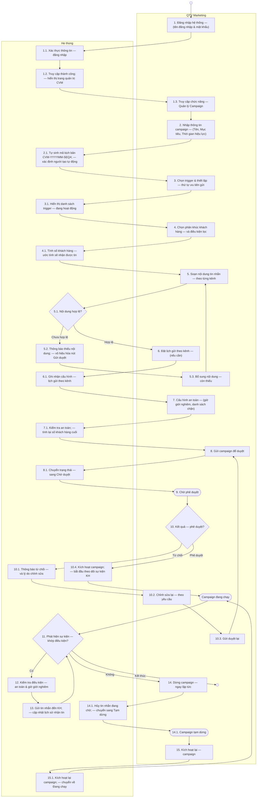
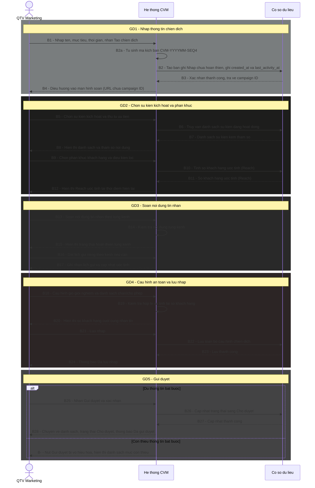
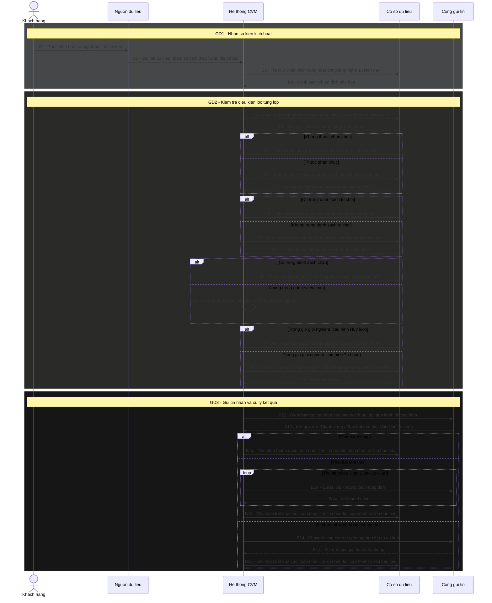

# AUTHENTIC EDUCATION HUB

# TÀI LIỆU ĐẶC TẢ YÊU CẦU NGƯỜI DÙNG
## HỆ THỐNG QUẢN LÝ GIÁ TRỊ KHÁCH HÀNG
### Customer Value Management System (CVM)

Hà Nội – Tháng 05/2026

---

## CÁC THAY ĐỔI

| Ngày | Tác giả | Mục thay đổi | Loại | Mô tả | Phiên bản |
|---|---|---|---|---|---|
| 15/05/2026 | Jun | Toàn bộ | A | Tạo mới — dựa trên Wireframe v9 | V1.0 |
| 20/05/2026 | Jun | Toàn bộ | U | Cập nhật theo Wireframe v10 + feedback QA: C1–C5 (S6 BL/WL, Kênh & Lịch gửi, Preview on-demand, Điều kiện lọc per phân khúc, Thêm kênh qua [+ Kênh]); M1–M10 (đổi tên Section 5, xóa chi phí SMS, Event source, Reach label, User Flow, Admin/Settings screen, PARAMS tooltip, Hướng dẫn Message Matrix, BL/WL 2 chiều, Reach per phân khúc); mn1–mn8 | V2.0 |
| 20/05/2026 | Jun | Tất cả bảng component | U | Bổ sung placeholder, validate đầy đủ, thông báo lỗi cụ thể, empty state, loading/error state, disabled state, quy tắc tương quan cho tất cả màn hình: Dashboard (KPI thresholds, loading/error/empty), Campaign List (debounce, empty state, action rules), Campaign Detail (tab empty), Campaign Builder (date range rules, priority limit, trigger empty/confirm, T-ALL confirm, image upload type/size, title/body per kênh, CTA label limit/URL scheme, blackout validate, BL list empty), Template List (cột Dùng definition, Clone navigate), Template Editor (name limit, toggle Inactive behavior, THAM SỐ ĐỘNG empty), Trigger Modal (payload snake_case, min 1 row, xóa dòng cuối disabled, error messages), Blacklist (phone display format, validate on-blur, duplicate behavior), Customer List (debounce, empty), Customer 360 (cooldown time display, history default 10 rows, empty), Report (date range warning, SMS/USSD N/A metric, campaign comparison states, cost source), Admin (reject reason min/max, sort FIFO), Settings (weekly≥daily, cooldown max 168h, form reload after save) | V2.1 |
| 21/05/2026 | Jun | Tất cả bảng component | U | QA audit toàn bộ 136 issues (24 CRITICAL / 62 MAJOR / 41 MINOR / 9 AMBIGUOUS) và fix toàn bộ: Dashboard (drill-down URL per KPI, loading/error/empty state cho tất cả chart/bảng, stream buffer 100 dòng + pause behavior, heatmap trục y, top 10 triggers); Campaign List (loading overlay khi filter/trang, chip thứ tự cố định, Draft/Ended badge color note, loading/disabled [Dừng]/[Bật] API, [Sửa] Paused define "thay đổi nội dung"); Campaign Detail (loading/error state toàn trang, [Dừng]/[Bật] có confirm + loading giống List, tab thứ tự, BL modal 100-row limit); Campaign Builder ([Lưu Nháp] loading/error, [Gửi duyệt] confirm text, tên campaign maxLength 200, mục tiêu block input, Advanced→Basic confirm + giữ trigger đầu, trigger chip cảnh báo mất message, OR→AND không có Variant không cần confirm, AND→OR khởi tạo Variant mặc định, estimate error state, T-ALL sau xác nhận hiện thẻ cam, dropdown segment loading, điều kiện lọc operator list + source hardcode, image tolerance ±5% + server error, template dropdown loading/empty/ghi đè, USSD ký tự đặc biệt định nghĩa rõ + realtime, Email body truncate toast, SAMPLE PARAMS source + persist, Variant confirm text, segment-Variant sync warning, lịch delay validation theo quy đổi phút, blackout time picker empty validate, BL danh sách kênh 6 options + loading); Template List (debounce 300ms, filter kênh options, empty state, [Tắt]/[Bật] loading+disabled); Template Editor ([Lưu] loading/error, toast text khi tab trống, preview rationale documented, THAM SỐ ĐỘNG loading); Trigger Management ([Sửa] cảnh báo Active campaign, [Tắt] 2 dialog variant + campaign vẫn chạy, [Bật] loading, payload maxLength + no limit rows, [Lưu] loading/API error); Blacklist (filter dropdown searchable + kênh options, [Xóa] loading, modal campaign dropdown loading/empty, kênh 6 options, upload campaign → dropdown, parse loading, 0-valid disabled button, loading overlay + empty state); Customer List (loading/error/empty state bảng); Customer 360 (loading/error per section, [↻] spin, Drawer pagination 20/trang + filter UI + empty state); Report (kỳ trước formula documented, loading/error/empty tất cả tab, [Xuất Excel] loading+error, cột Chi phí SMS behavior khi chưa cấu hình, phân bổ thiết bị non-Push → Khác, funnel data source, histogram bucket 0, drill-down scope); Admin ([Duyệt]/[Từ chối] loading+disabled, textarea auto-focus + counter, phân trang options, Tab 7 explicit same-as-Screen-5); Settings (loading/error fetch config, validate STT 4 merge vào STT 1, [Lưu] loading+error, Priority Matrix loading/error, 2 cơ chế sắp xếp nhất quán, confirm text) | V2.2 |
| 21/05/2026 | Jun | Section IV — Tất cả bảng component | U | Viết lại toàn bộ cột Mô tả trong Section IV theo ngôn ngữ nghiệp vụ thuần Việt, dễ đọc cho người dùng cuối — thay thế các thuật ngữ kỹ thuật bằng diễn đạt nghiệp vụ tương đương | V2.3 |
| 26/05/2026 | Jun | Khối 3 — Trigger; I.2; Screen 5; Screen Admin | U | Tái thiết kế mô hình Trigger: Trigger là danh mục cố định (Read-only Catalog) do Dev/SA quản lý qua deployment — không tạo/sửa trên UI. Xóa UC-TRG-01 (Thêm) và UC-TRG-03 (Sửa) và UC-TRG-04 (Bật/Tắt). Cập nhật UC-TRG-00: Admin và QTV đều chỉ có [Xem], không có hành động chỉnh sửa. Cập nhật UC-TRG-02: modal chi tiết 3 nhóm A/B/C (bỏ nhóm Điều kiện kích hoạt, giữ Định danh + Tham số đầu ra + Thông tin vận hành); bổ sung ví dụ giá trị per param, kênh hỗ trợ. Thêm policy PARAM_INVALID: khi param bị xóa/đổi qua deployment, campaign dùng param đó tự động Paused + gắn cờ + thông báo QTV. Cập nhật I.2 phạm vi. Xóa Modal 5B. Cập nhật Screen Admin bỏ tab Cấu hình Trigger. | V3.0 |

---

## TRANG KÍ

| Vai trò | Họ tên | Chữ ký | Ngày |
|---|---|---|---|
| BA | | | |
| PO | | | |
| Dev Lead | | | |
| Tester Lead | | | |

---

## MỤC LỤC

- I. Giới thiệu
  - I.1. Mục đích tài liệu
  - I.2. Phạm vi tài liệu
  - I.3. Định nghĩa thuật ngữ và từ viết tắt
  - I.4. Kiến trúc tổng thể hệ thống
- II. Các yêu cầu về tổng thể phần mềm
  - II.1. Sơ đồ quy trình nghiệp vụ (Workflow Diagram)
  - II.2. Sơ đồ phân cấp chức năng (Business Function Diagram)
  - II.3. Ma trận phân quyền hệ thống (Permission Matrix)
  - II.4. Ma trận ủy quyền (RBAC – Authorization Matrix)
  - II.5. Sơ đồ trình tự (Sequence Diagram)
  - II.6. Logic Pipeline Kênh — Yêu cầu nghiệp vụ nội bộ cho Dev
  - II.6.5. Kênh & Lịch gửi override
  - II.7. Quy tắc tích hợp dữ liệu từ BSS — Ánh xạ trạng thái SIM
- III. Đặc tả tình huống sử dụng (Use Case Specification)
- IV. Giao diện chức năng (Prototype chính)
- C. Yêu cầu phi chức năng

---

# I. GIỚI THIỆU

## I.1. Mục đích tài liệu

Tài liệu này mô tả đầy đủ các yêu cầu nghiệp vụ của **Hệ thống Quản lý Giá trị Khách hàng (CVM — Customer Value Management System)** dành cho doanh nghiệp viễn thông ảo. Hệ thống cho phép đội ngũ Marketing vận hành campaign tự động: khi khách hàng phát sinh sự kiện phù hợp (trigger), hệ thống tự động gửi thông báo qua đúng kênh đến đúng khách hàng, đúng thời điểm — nhằm tăng doanh thu dịch vụ viễn thông và nâng cao trải nghiệm khách hàng.

Tài liệu này được sử dụng bởi:
- **BA**: cơ sở để align với PO và thiết kế chi tiết
- **Dev**: input để thiết kế kỹ thuật, implement logic nghiệp vụ
- **Tester**: cơ sở để thiết kế test case, test plan và nghiệm thu

Vai trò trong vòng đời dự án: tài liệu này là đầu ra của giai đoạn phân tích yêu cầu, là đầu vào cho thiết kế kỹ thuật (SA), phát triển (Dev) và kiểm thử (Tester).

## I.2. Phạm vi tài liệu

**Phạm vi bao gồm:**
- Quản lý Chiến dịch (tạo, sửa, duyệt, vận hành, dừng, kích hoạt lại)
- Quản lý Mẫu tin nhắn (tạo, sửa, sao chép, bật/tắt)
- Tra cứu Sự kiện kích hoạt (xem danh sách catalog, xem chi tiết payload và kênh hỗ trợ)
- Quản lý Danh sách chặn (per chiến dịch, per kênh — riêng biệt với danh sách từ chối toàn hệ thống BSS)
- Tra cứu Khách hàng (danh sách + Customer 360: profile, kênh, lịch sử nhận tin)
- Báo cáo và phân tích hiệu quả campaign (Delivery, Engagement, Funnel, Segment, Spam)
- Bảng điều hành vận hành thời gian thực (chỉ số hiệu suất, sức khỏe hệ thống, giám sát chiến dịch, thống kê sự kiện kích hoạt)

**Phạm vi không bao gồm:**
- Quản lý DNC toàn hệ thống (thuộc BSS — CVM chỉ check, không quản lý)
- Quản lý Segment/Phân khúc khách hàng (thuộc Team Data/BSS/OCS — CVM chỉ tiêu thụ)
- Quản lý người dùng nội bộ và phân quyền (thuộc module Admin riêng)
- Frequency Cap (cấu hình tại System Settings, không thuộc phạm vi màn hình này)
- Giao diện cấu hình logic pipeline kênh (fallback, timeout, điều kiện dừng không phơi ra UI — QTV không thao tác trực tiếp; logic được mô tả ở mục II.6 để Dev implement)
- Thiết kế kiến trúc kỹ thuật, API spec, ERD (thuộc phạm vi SA/Dev)

## I.3. Định nghĩa thuật ngữ và từ viết tắt

### I.3.1. Định nghĩa thuật ngữ

| STT | Thuật ngữ | Diễn giải |
|-----|-----------|-----------|
| 1 | Campaign | Chiến dịch marketing tự động: bao gồm cấu hình trigger, audience, nội dung tin nhắn và quy tắc an toàn; khi trigger kích hoạt, hệ thống tự động gửi tin đến khách hàng đủ điều kiện |
| 2 | Trigger | Sự kiện nghiệp vụ kích hoạt campaign (ví dụ: SIM_ACTIVATED, LOW_DATA_BALANCE); mỗi trigger có payload riêng gồm các tham số động |
| 3 | Payload | Tập hợp tham số động gắn với trigger (ví dụ: ten_kh, loai_sim, ngay_kich_hoat); dùng để cá nhân hóa nội dung tin nhắn bằng cú pháp {{tham_so}} |
| 4 | Audience | Tập khách hàng đủ điều kiện nhận tin của một campaign; xác định qua phân khúc (segment) và điều kiện lọc thêm |
| 5 | Segment (Phân khúc) | Nhóm khách hàng được định nghĩa sẵn bởi Team Data/BSS/OCS; CVM chỉ tiêu thụ, không tạo mới |
| 6 | Reach | Số khách hàng ước tính sẽ nhận được tin sau khi áp dụng tất cả bộ lọc (phân khúc, DNC, Blacklist, Whitelist) |
| 7 | Template | Mẫu nội dung tin nhắn tái sử dụng; chứa nội dung tĩnh và tham số động; áp dụng được cho nhiều kênh khác nhau |
| 8 | Kênh (Channel) | Phương thức gửi tin: Push Notification, Zalo OA, SMS, USSD, Banner, Email |
| 9 | Message Matrix | Ma trận nội dung tin nhắn: Trigger × Kênh; mỗi ô là nội dung cụ thể cho một trigger trên một kênh |
| 10 | Audience Variant (Biến thể đối tượng) | Nội dung tin nhắn khác nhau cho cùng một trigger dựa trên segment của khách hàng; chỉ áp dụng trong OR mode |
| 11 | Blackout | Khung giờ giới nghiêm không được gửi tin (ví dụ: 22:00 – 08:00); tin rơi vào blackout bị hủy hoặc delay |
| 12 | DNC (Do Not Contact) | Danh sách khách hàng đã đăng ký từ chối nhận tin — quản lý bởi BSS, áp dụng toàn hệ thống |
| 13 | Blacklist CVM | Danh sách số điện thoại bị chặn gửi tin riêng của CVM, hoạt động ở mức campaign + kênh cụ thể; khác với BSS DNC |
| 14 | Whitelist | Danh sách số điện thoại được phép nhận tin; nếu bật, campaign chỉ gửi cho các số trong whitelist |
| 15 | Kill Switch | Hành động dừng campaign đang Active ngay lập tức; message đang trong queue sẽ bị hủy |
| 16 | Delivery Rate | Tỉ lệ % tin nhắn được gửi thành công / tổng tin gửi |
| 17 | Conversion Rate | Tỉ lệ % khách hàng thực hiện hành động mục tiêu (cài app, mua gói...) / tổng reach |
| 18 | Spam Risk Score | Điểm đánh giá nguy cơ spam (0–100); cảnh báo khi vượt 60; tính từ opt-out rate, BL trend, avg msg/user, failed delivery |
| 19 | Customer 360 | Màn hình tổng hợp toàn bộ thông tin một khách hàng: profile, trạng thái kênh, lịch sử nhận tin, throttling |
| 20 | Throttling | Cơ chế giới hạn số tin nhắn tối đa một khách hàng nhận trong khoảng thời gian nhất định |
| 21 | Global Params | Tập hợp tham số động toàn cục — union của payload từ tất cả trigger trong hệ thống; dùng để cá nhân hóa nội dung trong Template Editor; tại runtime hệ thống điền giá trị thực từ payload của trigger kích hoạt; nếu trigger không có param đó → hiển thị chuỗi rỗng |

### I.3.2. Định nghĩa từ viết tắt

| STT | Từ viết tắt | Nghĩa đầy đủ |
|-----|-------------|--------------|
| 1 | CVM | Customer Value Management |
| 2 | QTV | Quản trị viên |
| 3 | KH | Khách hàng |
| 4 | DNC | Do Not Contact |
| 5 | BL | Blacklist |
| 6 | WL | Whitelist |
| 7 | BSS | Business Support System |
| 8 | OCS | Online Charging System |
| 9 | CRM | Customer Relationship Management |
| 10 | KPI | Key Performance Indicator |
| 11 | SLA | Service Level Agreement |
| 12 | UC | Use Case |
| 13 | UI | User Interface |
| 14 | RBAC | Role-Based Access Control |

## I.4. Kiến trúc tổng thể hệ thống

Hệ thống CVM được tổ chức theo **7 lớp kiến trúc** từ trên xuống dưới. Mỗi lớp có trách nhiệm riêng biệt và giao tiếp với lớp liền kề.

---

### Lớp 1 — Lớp người dùng

**Mục đích:** Xác định toàn bộ các đối tượng tham gia vào hệ thống CVM — bao gồm người vận hành nội bộ, đối tác và khách hàng cuối.

**Đối tượng sử dụng:**

| Nhóm | Vai trò trong hệ thống |
|---|---|
| Marketer / Chiến dịch | Tạo và quản lý campaign, template, trigger |
| Chăm sóc KH / CSKH | Tra cứu thông tin KH, lịch sử nhận tin |
| Quản trị hệ thống | Cấu hình hệ thống, phân quyền, duyệt campaign |
| Ban lãnh đạo | Xem báo cáo tổng hợp, dashboard KPI |
| Đối tác / Đại lý | Truy cập theo phân quyền riêng |
| Khách hàng (App/Web) | Nhận thông tin qua các kênh truyền thông (đầu ra) |

**Giá trị mang lại:** Phân tách rõ vai trò → hệ thống phân quyền (RBAC) ở Lớp 3 có căn cứ để thiết kế đúng; tránh xây tính năng không đúng đối tượng.

---

### Lớp 2 — Lớp giao tiếp

**Mục đích:** Cung cấp các điểm tiếp xúc (interface) giữa người dùng và hệ thống — cả chiều người dùng thao tác vào và chiều hệ thống phân phối tin nhắn ra.

**Thành phần:**

| Kênh | Mô tả | Chiều |
|---|---|---|
| Web Portal (CVM Portal) | Giao diện quản trị chính cho nội bộ (Marketer, Admin, CSKH, Ban lãnh đạo) | Vào |
| Mobile App (CVM App) | Ứng dụng di động hỗ trợ vận hành và theo dõi campaign | Vào |
| API / Integration (REST/GraphQL) | Kết nối tự động với BSS, OCS, hệ thống đối tác | Vào/Ra |
| Email / SMS / Push / Zalo OA | Kênh phân phối tin nhắn đến khách hàng | Ra |
| Chatbot / Livechat | Kênh tương tác trực tiếp với khách hàng | Ra |

**Đặc điểm:** Web Portal là kênh triển khai trước tiên trong phiên bản này; các kênh khác (Mobile App, Chatbot) thuộc roadmap phát triển tiếp theo.

**Giá trị mang lại:** Tách biệt giao diện người dùng khỏi logic xử lý — thay đổi UI không ảnh hưởng đến nghiệp vụ lõi; bổ sung kênh mới không cần sửa Lớp 3–4.

---

### Lớp 3 — Lớp nghiệp vụ CVM

**Mục đích:** Hiện thực hóa toàn bộ nghiệp vụ của hệ thống CVM — từ tạo campaign, kích hoạt trigger, quản lý nội dung đến phân tích hiệu quả.

**Phạm vi nghiệp vụ — 7 khối chức năng chính:**

| Khối chức năng | Phạm vi |
|---|---|
| **Quản lý Khách hàng (Customer 360)** | Hồ sơ KH 360 độ; phân khúc KH; hành vi & sở thích; giá trị & điểm số (CLV) |
| **Quản lý Chiến dịch (Campaign)** | Tạo chiến dịch; quản lý ưu đãi; A/B Testing; lịch trình chiến dịch |
| **Quản lý Trigger** | Kho trigger; điều kiện kích hoạt; thời gian & tần suất; kích hoạt real-time/batch |
| **Quản lý Journey** | Thiết kế hành trình KH; luồng tương tác; điểm chạm (touchpoint); quy tắc chuyển tiếp |
| **Quản lý Nội dung** | Kho nội dung; cá nhân hóa; biến động nội dung; đa ngôn ngữ |
| **Quản trị & Thiết lập** | Quy tắc nghiệp vụ; phân quyền RBAC; cấu hình hệ thống; danh mục dùng chung |
| **Báo cáo & Phân tích** | Hiệu quả chiến dịch; phân tích hành vi KH; phân tích CLV; dashboard KPI |

**Thành phần hỗ trợ nội bộ:** SSO (IAM), RBAC, Workflow Engine, Audit Log — đảm bảo bảo mật, truy vết và kiểm soát quy trình nghiệp vụ.

**Giá trị mang lại:** Toàn bộ quyết định nghiệp vụ được tập trung tại đây — thay đổi quy tắc kinh doanh chỉ cần sửa Lớp 3 mà không ảnh hưởng đến các lớp kỹ thuật bên dưới.

---

### Lớp 4 — Lớp ứng dụng (Services)

**Mục đích:** Triển khai nghiệp vụ từ Lớp 3 thành các service độc lập, có thể deploy và scale riêng biệt. Tất cả giao tiếp qua **API Gateway** theo chuẩn REST/GraphQL.

**Thành phần — 8 service:**

| Service | Trách nhiệm |
|---|---|
| **Customer Service** | Quản lý hồ sơ KH, truy vấn thông tin Customer 360 |
| **Segmentation Service** | Phân khúc & đánh giá KH theo điều kiện |
| **Trigger Engine** | Nhận event, xử lý điều kiện kích hoạt, match campaign |
| **Journey Orchestrator** | Điều phối toàn bộ hành trình KH qua các bước |
| **Offer Service** | Quản lý và phân phối ưu đãi theo điều kiện |
| **Content Service** | Render nội dung cá nhân hóa theo từng KH |
| **Decision Service** | Ra quyết định tự động / Next best action (AI-driven) |
| **Analytics Service** | Thu thập dữ liệu hành vi, tổng hợp báo cáo |

**Đặc điểm:** Các service giao tiếp nội bộ qua API Gateway; không gọi trực tiếp lẫn nhau để đảm bảo tách biệt và dễ bảo trì.

**Giá trị mang lại:** Mỗi service có thể scale độc lập theo tải (ví dụ: Trigger Engine cần scale cao vào giờ cao điểm mà không ảnh hưởng Content Service); dễ thay thế hoặc nâng cấp từng phần.

---

### Lớp 5 — Lớp tích hợp & dữ liệu

**Mục đích:** Xử lý toàn bộ luồng dữ liệu vào/ra giữa CVM và các hệ thống ngoài (BSS, OCS); đảm bảo dữ liệu được thu thập, truyền tải và xử lý đúng thời điểm và đúng định dạng.

**Thành phần:**

- **Data Ingestion (Batch/Streaming):** Thu thập dữ liệu từ BSS, OCS và các nguồn ngoài qua nhiều phương thức — CDC (change data capture), File transfer, API call, Event stream. Hỗ trợ cả batch định kỳ lẫn streaming liên tục.
- **Apache Kafka (Event Bus / Message Broker):** Trục truyền sự kiện trung tâm — nhận event từ Data Ingestion, phân phối đến Trigger Engine và các service liên quan theo thời gian thực; đảm bảo không mất event khi có sự cố.
- **Data Processing (Stream Processing & ETL/ELT):** Biến đổi và chuẩn hóa dữ liệu thô trước khi đưa vào Lớp 6 — xử lý realtime bằng Flink/Spark Streaming, đồng bộ batch bằng ETL/ELT định kỳ.

**Giá trị mang lại:** Tách biệt CVM khỏi sự phụ thuộc trực tiếp vào BSS/OCS — thay đổi schema nguồn chỉ cần xử lý tại lớp này; các service nghiệp vụ luôn nhận dữ liệu đã chuẩn hóa.

---

### Lớp 6 — Lớp nền tảng dữ liệu

**Mục đích:** Lưu trữ và tổ chức dữ liệu theo từng mục đích sử dụng — từ dữ liệu thô đến hồ sơ KH hợp nhất, từ dữ liệu thời gian thực đến mô hình AI/ML.

**Thành phần:**

| Thành phần | Mục đích | Phục vụ |
|---|---|---|
| **Raw Data Lake** | Lưu trữ toàn bộ dữ liệu thô từ mọi nguồn, chưa xử lý | Audit, replay, reprocessing |
| **CVM Data Warehouse** | Dữ liệu đã chuẩn hóa, mô hình hóa theo nghiệp vụ CVM | Analytics Service, Báo cáo |
| **Customer 360 Store** | Hồ sơ KH hợp nhất từ BSS, OCS, lịch sử tương tác | Customer Service, Decision Service |
| **Real-time Store** | Trạng thái KH theo thời gian thực (SIM, data, trigger) | Trigger Engine, Suppression |
| **Model Store** | Mô hình AI/ML đã huấn luyện (churn, CLV, next best action) | Decision Service |
| **Cache (Redis / In-memory)** | Lưu kết quả truy vấn thường xuyên, giảm tải DB | Toàn bộ service |

**Thành phần AI/ML Platform hỗ trợ:** ML Model Training, Scoring Engine, Prediction Service — chịu trách nhiệm huấn luyện và cập nhật mô hình định kỳ cho Model Store.

**Giá trị mang lại:** Mỗi store được tối ưu riêng cho mục đích sử dụng — truy vấn realtime không tranh chấp tài nguyên với báo cáo batch; dữ liệu KH luôn có phiên bản hợp nhất duy nhất.

---

### Lớp 7 — Lớp hạ tầng

**Mục đích:** Cung cấp nền tảng vận hành kỹ thuật cho toàn bộ hệ thống — tính sẵn sàng, bảo mật, khả năng mở rộng và khôi phục khi sự cố.

**Thành phần:**

| Thành phần | Vai trò |
|---|---|
| Máy chủ ứng dụng | Chạy các service của Lớp 4 |
| Container / Kubernetes | Triển khai, orchestrate và auto-scale service |
| CSDL quan hệ (PostgreSQL) | Lưu dữ liệu có cấu trúc: campaign, template, config |
| NoSQL (MongoDB) | Lưu dữ liệu linh hoạt: hồ sơ KH, nội dung template |
| Storage (Object/Block) | Lưu file đính kèm, media, file export, template asset |
| Network / Firewall / Load Balancer | Bảo mật mạng, cân bằng tải, kiểm soát truy cập |
| Cloud (Private/Hybrid) | Hạ tầng điện toán — linh hoạt giữa on-premise và cloud |
| Monitoring (Prometheus/Grafana) | Giám sát hiệu năng, alert tự động khi có bất thường |
| Backup & DR | Sao lưu định kỳ, phục hồi thảm họa (Disaster Recovery) |

**Đặc điểm:** Lớp hạ tầng hoàn toàn trong suốt với Lớp nghiệp vụ — nghiệp vụ không cần biết dữ liệu lưu ở đâu hay service chạy trên máy chủ nào.

**Giá trị mang lại:** Đảm bảo SLA hệ thống (uptime, latency); nền tảng để scale khi lượng trigger event tăng theo mùa vụ; phục hồi nhanh khi sự cố mà không mất dữ liệu nghiệp vụ.

---

# II. CÁC YÊU CẦU VỀ TỔNG THỂ PHẦN MỀM

## II.1. Sơ đồ quy trình nghiệp vụ (Workflow Diagram)

### Bước 0 — Xác định quy trình

Hệ thống CVM có **1 quy trình trung tâm**: **Tạo và vận hành Campaign**. Tất cả chức năng khác (Template, Trigger, Blacklist, Customer, Report) đều phục vụ quy trình này. Vì vậy chỉ cần 1 workflow diagram tổng thể.

---

### Quy trình: Tạo và Vận hành Campaign

**Phần 1 — Swimlane Diagram**



**Phần 2 — Diễn giải luồng quy trình**

| Bước | Tác nhân | Mô tả |
|------|----------|-------|
| 1 | QTV Marketing | Đăng nhập hệ thống bằng tên đăng nhập và mật khẩu |
| 1.1 | Hệ thống | Xác thực thông tin đăng nhập; kiểm tra tài khoản tồn tại và mật khẩu hợp lệ |
| 1.2 | Hệ thống | Xác thực thành công; hiển thị trang quản trị CVM với các chức năng tương ứng quyền của tài khoản |
| 1.3 | QTV Marketing | Truy cập chức năng "Quản lý Campaign" từ menu điều hướng |
| 2 | QTV Marketing | Nhập thông tin campaign: Tên (bắt buộc), Mã kịch bản (tự sinh theo rule `CVM-YYYYMM-SEQ4`, chỉ đọc), Mục tiêu, Thời gian hiệu lực từ ngày – đến ngày (bắt buộc) |
| 2.1 | Hệ thống | Tự sinh mã kịch bản theo rule `CVM-YYYYMM-SEQ4` (ví dụ: `CVM-202506-0042`); hiển thị dạng chỉ đọc — QTV không thể chỉnh sửa; tự xác định người tạo từ tài khoản đang đăng nhập; hiển thị ngay trên giao diện |
| 3 | QTV Marketing | Chọn trigger sự kiện kích hoạt campaign và thiết lập thứ tự ưu tiên gửi khi nhiều trigger cùng xảy ra |
| 3.1 | Hệ thống | Hiển thị danh sách trigger đang hoạt động để QTV lựa chọn; sau khi chọn, hiển thị tham số nội dung tương ứng từng trigger để QTV dùng khi soạn tin |
| 4 | QTV Marketing | Chọn phân khúc khách hàng sẽ nhận tin; tùy chọn thêm điều kiện lọc bổ sung (loại thiết bị, khu vực…) |
| 4.1 | Hệ thống | Tính số khách hàng ước tính sẽ nhận được tin: lấy từ phân khúc đã chọn → loại trừ khách hàng đã đăng ký từ chối nhận tin → loại trừ danh sách chặn của campaign → giao với danh sách cho phép nếu có; hiển thị con số ước tính ngay trên màn hình |
| 5 | QTV Marketing | Soạn nội dung tin nhắn cho từng kênh (Push, Zalo OA, SMS, USSD, Banner, Email); chọn thời điểm gửi (ngay lập tức / sau một khoảng thời gian kể từ sự kiện / vào một giờ cố định trong ngày) |
| 5.1 | Hệ thống | Kiểm tra nội dung từng kênh: hình ảnh Banner bắt buộc và phải đúng tỉ lệ 16:9; cảnh báo khi nội dung SMS vượt 160 ký tự (hiển thị số segment = `ceil(số ký tự / 160)`, không block lưu — mỗi segment tính là 1 tin riêng về chi phí gửi); hiển thị trạng thái hoàn thiện nội dung cho từng kênh để QTV biết còn thiếu ở đâu |
| 5.2 | Hệ thống | **[Nhánh: chưa hợp lệ]** Thông báo cụ thể kênh nào còn thiếu nội dung gì; vô hiệu hóa nút Gửi duyệt kèm số lượng mục còn thiếu |
| 5.3 | QTV Marketing | **[Nhánh: chưa hợp lệ]** Bổ sung nội dung còn thiếu theo cảnh báo → quay lại bước 5 |
| 6 | QTV Marketing | **[Nhánh: hợp lệ]** Đặt lịch gửi riêng theo từng kênh nếu muốn các kênh gửi vào khung giờ khác nhau (không bắt buộc) |
| 6.1 | Hệ thống | Ghi nhận lịch gửi riêng cho từng kênh đã cấu hình; các kênh không đặt lịch riêng sẽ gửi theo thời điểm đã chọn ở bước 5 |
| 7 | QTV Marketing | Cấu hình an toàn: bật/tắt giờ giới nghiêm và chọn cách xử lý khi tin rơi vào khung giờ cấm (hủy hoặc trì hoãn đến khi được phép); xác nhận áp dụng danh sách khách hàng đã từ chối nhận tin; chọn danh sách chặn và danh sách cho phép riêng của campaign nếu cần |
| 7.1 | Hệ thống | Kiểm tra danh sách chặn và danh sách cho phép đã chọn hợp lệ chưa; tính lại số khách hàng cuối cùng sẽ nhận tin sau khi áp dụng toàn bộ điều kiện an toàn; hiển thị cảnh báo nếu còn thiếu tệp bắt buộc |
| 8 | QTV Marketing | Nhấn [Gửi duyệt] để chuyển campaign sang trạng thái chờ phê duyệt (chỉ thực hiện được khi không còn mục bắt buộc nào thiếu) |
| 8.1 | Hệ thống | Chuyển campaign sang trạng thái Chờ duyệt; gửi thông báo đến Admin Hệ thống |
| 9 | — | Campaign ở trạng thái Chờ phê duyệt; QTV không thể chỉnh sửa trong thời gian này |
| 10 | Admin Hệ thống | Xem xét toàn bộ nội dung campaign: thông tin, trigger, phân khúc, nội dung tin nhắn, cấu hình an toàn; quyết định phê duyệt hoặc từ chối kèm lý do |
| 10.1 | Hệ thống | **[Nhánh: từ chối]** Thông báo lý do từ chối đến QTV; chuyển campaign về trạng thái Nháp để QTV có thể chỉnh sửa |
| 10.2 | QTV Marketing | **[Nhánh: từ chối]** Đọc lý do từ chối; chỉnh sửa lại campaign theo yêu cầu |
| 10.3 | QTV Marketing | **[Nhánh: từ chối]** Gửi duyệt lại → quay về bước 8 |
| 10.4 | Hệ thống | **[Nhánh: phê duyệt]** Kích hoạt campaign; chuyển sang trạng thái Đang chạy; bắt đầu theo dõi sự kiện phát sinh từ khách hàng |
| 11 | Hệ thống | Liên tục theo dõi sự kiện khách hàng; khi phát hiện sự kiện khớp với trigger đã cấu hình → chuyển sang bước 12 |
| 12 | Hệ thống | Kiểm tra điều kiện an toàn: khách hàng có trong phân khúc đã chọn không → có trong danh sách từ chối không → có trong danh sách chặn không → thời điểm hiện tại có trong giờ giới nghiêm không |
| 12.1 | Hệ thống | **[Nhánh: không đủ điều kiện]** Bỏ qua, không gửi tin cho khách hàng đó; ghi nhận lý do để hiển thị trên báo cáo |
| 12.2 | Hệ thống | **[Nhánh: trong giờ giới nghiêm — cấu hình "Hủy luôn"]** Bỏ qua tin nhắn đó, không gửi; ghi nhận vào lịch sử |
| 12.3 | Hệ thống | **[Nhánh: trong giờ giới nghiêm — cấu hình "Trì hoãn"]** Giữ lại tin nhắn; gửi vào đầu khung giờ được phép gần nhất |
| 13 | Hệ thống | Gửi tin nhắn đến khách hàng qua kênh đã cấu hình theo thứ tự ưu tiên; cập nhật lịch sử nhận tin |
| 13.1 | Hệ thống | **[Nhánh: gửi thành công]** Ghi nhận kết quả thành công; cập nhật số liệu báo cáo → quay lại bước 11 |
| 13.2 | Hệ thống | **[Nhánh: gửi thất bại]** Thử lại tối đa 3 lần; nếu vẫn thất bại thì chuyển sang kênh dự phòng tiếp theo; ghi nhận kết quả và lý do thất bại → quay lại bước 11 |
| 14 | QTV Marketing | Nhấn [Dừng] trên campaign đang chạy; xác nhận trong hộp thoại cảnh báo rằng các tin nhắn đang chờ gửi sẽ bị hủy |
| 14.1 | Hệ thống | Hủy toàn bộ tin nhắn đang chờ gửi; chuyển campaign sang trạng thái Tạm dừng |
| 15 | QTV Marketing | Nhấn [Bật] trên campaign đang Tạm dừng |
| 15.1 | Hệ thống | **[Nhánh: không sửa nội dung]** Kích hoạt lại campaign ngay lập tức, không cần phê duyệt lại; chuyển về trạng thái Đang chạy → quay lại bước 11 |
| 15.2 | Hệ thống | **[Nhánh: đã sửa nội dung khi Paused]** Campaign có thay đổi nội dung kể từ lần duyệt cuối → không thể bật lại ngay; chuyển về trạng thái Nháp; QTV phải gửi duyệt lại trước khi bật |

---

## II.2. Sơ đồ phân cấp chức năng (Business Function Diagram)

```
Hệ thống Quản lý Giá trị Khách hàng (CVM)
├── Khối 1: Quản lý Chiến dịch
│   ├── Xem danh sách chiến dịch
│   ├── Tạo chiến dịch mới
│   ├── Sửa chiến dịch (đang nháp)
│   ├── Xem chi tiết chiến dịch (chỉ đọc)
│   ├── Gửi duyệt chiến dịch
│   ├── Duyệt / Từ chối chiến dịch (Quản trị viên hệ thống)
│   ├── Dừng chiến dịch ngay lập tức
│   └── Kích hoạt lại chiến dịch đang tạm dừng
│
├── Khối 2: Quản lý Mẫu tin nhắn
│   ├── Xem danh sách mẫu tin nhắn
│   ├── Tạo mẫu tin nhắn mới
│   ├── Xem chi tiết / Sửa mẫu tin nhắn
│   ├── Sao chép mẫu tin nhắn
│   └── Bật / Tắt mẫu tin nhắn
│
├── Khối 3: Tra cứu Sự kiện kích hoạt
│   ├── Xem danh sách sự kiện kích hoạt (nhóm theo loại)
│   └── Xem chi tiết sự kiện kích hoạt
│
├── Khối 4: Quản lý Danh sách chặn (Blacklist Management)
│   ├── Xem danh sách chặn
│   ├── Thêm số điện thoại thủ công
│   ├── Tải lên danh sách chặn (tệp CSV)
│   └── Xóa số điện thoại khỏi danh sách chặn
│
├── Khối 5: Tra cứu Khách hàng
│   ├── Xem danh sách & tìm kiếm khách hàng theo số điện thoại
│   └── Xem hồ sơ 360° khách hàng (thông tin, trạng thái kênh, lịch sử nhận tin)
│
├── Khối 6: Báo cáo & Phân tích
│   ├── Xem báo cáo tỉ lệ gửi tin thành công
│   ├── Xem báo cáo tương tác khách hàng
│   ├── So sánh hiệu quả giữa các chiến dịch
│   ├── Phân tích hiệu quả theo phân khúc khách hàng
│   ├── Phân tích phễu chuyển đổi
│   ├── Báo cáo rủi ro spam & mức độ bão hoà
│   └── Xuất báo cáo ra tệp Excel
│
└── Khối 7: Bảng điều hành vận hành
    ├── Xem chỉ số hiệu suất tổng quan theo thời gian thực
    ├── Xem tình trạng sức khỏe hệ thống (độ trễ, hàng đợi, lỗi)
    ├── Xem giám sát chiến dịch đang chạy
    ├── Xem phễu hành trình khách hàng
    └── Xem thống kê sự kiện kích hoạt (xếp hạng, bản đồ nhiệt, phát hiện bất thường)
```

**Diễn giải từng khối:**

**Khối 1 — Quản lý Chiến dịch**
- Mục đích: Toàn bộ vòng đời chiến dịch từ tạo mới đến vận hành và dừng
- Giá trị nghiệp vụ: Chức năng cốt lõi của hệ thống — không có chiến dịch thì không có gửi tin
- Các chức năng con: Xem danh sách, Tạo mới, Sửa, Xem chi tiết, Gửi duyệt, Duyệt/Từ chối, Dừng ngay lập tức, Kích hoạt lại

**Khối 2 — Quản lý Mẫu tin nhắn**
- Mục đích: Quản lý thư viện mẫu nội dung tái sử dụng cho nhiều chiến dịch
- Giá trị nghiệp vụ: Tăng tốc độ soạn nội dung; đảm bảo nhất quán thông điệp thương hiệu
- Các chức năng con: Xem danh sách, Tạo mới, Xem chi tiết/Sửa, Sao chép, Bật/Tắt

**Khối 3 — Tra cứu Sự kiện kích hoạt**
- Mục đích: Tra cứu danh mục sự kiện kích hoạt do Dev/SA quản lý qua deployment — giao diện chỉ đọc
- Giá trị nghiệp vụ: QTV cần tra cứu danh sách trigger, thông tin payload và kênh hỗ trợ để cấu hình campaign
- Các chức năng con: Xem danh sách (nhóm theo loại: Tức thời / Gần tức thời / Theo lô), Xem chi tiết

**Khối 4 — Quản lý Danh sách chặn (Blacklist Management)**
- Mục đích: Kiểm soát danh sách số điện thoại bị chặn gửi tin theo từng chiến dịch và kênh cụ thể; đồng bộ 2 chiều với cấu hình Blacklist trong Campaign Builder
- Giá trị nghiệp vụ: Ngăn gửi tin đến khách hàng khiếu nại hoặc nhạy cảm mà không ảnh hưởng danh sách từ chối toàn hệ thống; cho phép quản lý tập trung số bị chặn từ nhiều nguồn (thêm thủ công, upload CSV, chọn trong campaign)
- Các chức năng con: Xem danh sách, Thêm thủ công, Tải lên tệp CSV, Xóa

**Khối 5 — Tra cứu Khách hàng**
- Mục đích: Hỗ trợ quản trị viên tra cứu thông tin khách hàng và xem lịch sử nhận tin để xử lý sự cố
- Giá trị nghiệp vụ: Chẩn đoán vấn đề gửi tin cho từng khách hàng cụ thể; không chỉnh sửa dữ liệu khách hàng trong hệ thống
- Các chức năng con: Xem danh sách và tìm kiếm theo số điện thoại, Xem hồ sơ 360° khách hàng

**Khối 6 — Báo cáo & Phân tích**
- Mục đích: Đo lường hiệu quả chiến dịch và phát hiện sớm rủi ro spam hoặc bão hoà
- Giá trị nghiệp vụ: Cơ sở để quản trị viên tối ưu chiến dịch; phát hiện vấn đề trước khi ảnh hưởng quy mô lớn
- Các chức năng con: Báo cáo tỉ lệ gửi thành công, Báo cáo tương tác, So sánh chiến dịch, Phân tích phân khúc, Phân tích phễu chuyển đổi, Báo cáo rủi ro spam, Xuất Excel

**Khối 7 — Bảng điều hành vận hành**
- Mục đích: Theo dõi thời gian thực tình trạng hệ thống và chiến dịch đang chạy
- Giá trị nghiệp vụ: Phát hiện bất thường ngay lập tức để xử lý trước khi leo thang
- Các chức năng con: Chỉ số hiệu suất tổng quan, Sức khỏe hệ thống, Giám sát chiến dịch, Thống kê sự kiện kích hoạt

---

## II.3. Ma trận phân quyền hệ thống (Permission Matrix)

**Quy ước:**
- `X` : Được thực hiện
- `(X)` : Được xem/tổng hợp toàn hệ thống (read-only)
- `–` : Không được thực hiện

| Khối chức năng | Chức năng | Admin HT | QTV Marketing |
|----------------|-----------|----------|---------------|
| **1. Quản lý Chiến dịch** | Xem danh sách chiến dịch | X | X |
| | Tạo chiến dịch mới | – | X |
| | Sửa chiến dịch (đang nháp) | – | X |
| | Xem chi tiết chiến dịch | X | X |
| | Gửi duyệt chiến dịch | – | X |
| | Duyệt / Từ chối chiến dịch | X | – |
| | Dừng chiến dịch ngay lập tức | X | X |
| | Kích hoạt lại chiến dịch đang tạm dừng | X | X |
| **2. Quản lý Mẫu tin nhắn** | Xem danh sách mẫu tin nhắn | (X) | X |
| | Tạo / Xem chi tiết / Sửa mẫu tin nhắn | – | X |
| | Sao chép mẫu tin nhắn | – | X |
| | Bật / Tắt mẫu tin nhắn | – | X |
| **3. Quản lý Sự kiện kích hoạt** | Xem danh sách sự kiện kích hoạt | X | (X) |
| | Thêm / Xem chi tiết / Sửa sự kiện kích hoạt | X | – |
| | Bật / Tắt sự kiện kích hoạt | X | – |
| **4. Quản lý Danh sách chặn** | Xem danh sách chặn | X | X |
| | Thêm số điện thoại thủ công | – | X |
| | Tải lên danh sách chặn (tệp CSV) | – | X |
| | Xóa số điện thoại khỏi danh sách chặn | X | X |
| **5. Tra cứu Khách hàng** | Xem danh sách & tìm kiếm khách hàng | (X) | X |
| | Xem hồ sơ 360° khách hàng | (X) | X |
| **6. Báo cáo & Phân tích** | Xem tất cả báo cáo | X | X |
| | Xuất báo cáo ra tệp Excel | X | X |
| **7. Bảng điều hành vận hành** | Xem bảng điều hành | X | X |

**Ghi chú:**
- Admin HT có quyền xem toàn bộ dữ liệu hệ thống `(X)` nhưng không tạo/sửa campaign và template — đảm bảo phân tách vai trò
- Trigger catalog chỉ đọc với mọi role trên UI — quản lý trigger là trách nhiệm của Dev/SA qua deployment, không phơi thao tác này ra giao diện
- Quyền Dừng chiến dịch ngay lập tức cấp cho cả 2 role vì tình huống khẩn cấp cần xử lý ngay
- Xóa số khỏi Blacklist CVM cấp cho cả 2 role — Admin cần can thiệp khi có yêu cầu từ KH

---

## II.4. Ma trận ủy quyền (RBAC – Authorization Matrix)

### II.4.1. Vai trò

| Role Code | Tên vai trò | Mô tả |
|-----------|-------------|-------|
| ADMIN_HT | Admin Hệ thống | Quản trị toàn hệ thống: duyệt/từ chối campaign, xem toàn bộ dữ liệu; không tạo campaign và template; trigger catalog chỉ đọc (quản lý qua deployment) |
| QTV_MKT | Quản trị viên Marketing | Vận hành campaign hàng ngày: tạo, sửa, gửi duyệt campaign; quản lý template, blacklist; xem report và customer 360 |

### II.4.2. Quy ước quyền

| Ký hiệu | Ý nghĩa |
|---------|---------|
| VIEW | Xem dữ liệu |
| CREATE | Thêm mới |
| UPDATE | Cập nhật |
| DELETE | Xóa |
| EXPORT | Xuất Excel / dữ liệu |
| APPROVE | Phê duyệt / Từ chối |
| OPERATE | Thao tác vận hành (Dừng, Bật lại, Tắt/Bật) |

### II.4.3. Ma trận ủy quyền theo khối chức năng

| Khối chức năng | Đối tượng / Chức năng | ADMIN_HT | QTV_MKT |
|----------------|----------------------|----------|---------|
| **1. Campaign** | Campaign (tất cả) | VIEW | VIEW, CREATE, UPDATE |
| | Gửi duyệt | – | OPERATE |
| | Phê duyệt / Từ chối | APPROVE | – |
| | Dừng chiến dịch ngay lập tức | OPERATE | OPERATE |
| | Kích hoạt lại | OPERATE | OPERATE |
| **2. Template** | Template | VIEW | VIEW, CREATE, UPDATE, OPERATE |
| **3. Trigger** | Trigger catalog (chỉ đọc) | VIEW | VIEW |
| **4. Blacklist CVM** | Blacklist | VIEW, DELETE | VIEW, CREATE, DELETE |
| **5. Khách hàng** | Customer List | VIEW | VIEW |
| | Customer 360 | VIEW | VIEW |
| **6. Report** | Tất cả tab report | VIEW, EXPORT | VIEW, EXPORT |
| **7. Dashboard** | Dashboard | VIEW | VIEW |

**Nguyên tắc RBAC:**
- **Phân quyền theo vai trò**: ADMIN_HT tập trung vào quản trị hệ thống và duyệt; QTV_MKT tập trung vào vận hành campaign
- **Phạm vi dữ liệu (Data Scope)**: Cả 2 role đều thấy toàn bộ dữ liệu hệ thống — không phân vùng theo team/bộ phận trong phiên bản này [Cần xác nhận: có cần phân vùng theo team Marketing không?]
- **Kiểm soát thao tác**: Duyệt chiến dịch chỉ thuộc ADMIN_HT; QTV không tự duyệt chiến dịch của mình. Dừng ngay lập tức cấp cho cả 2 role để xử lý tình huống khẩn cấp. Mọi thao tác nhạy cảm (xóa, dừng, bật/tắt) có confirm dialog; backend validate lại quyền trước khi thực thi

---

## II.5. Sơ đồ trình tự (Sequence Diagram)

### II.5.1. Sequence — Tạo và Gửi duyệt Chiến dịch



**Diễn giải chi tiết — Sequence Tạo và Gửi duyệt Chiến dịch:**

| Giai đoạn | Bước | Từ | Đến | Mô tả |
|-----------|------|----|-----|-------|
| Giai đoạn 1 — Nhập thông tin | 1 | QTV | Hệ thống | Nhập tên chiến dịch (bắt buộc), mã kịch bản (tự sinh `CVM-YYYYMM-SEQ4`, chỉ đọc), mục tiêu, thời gian hiệu lực từ ngày – đến ngày (bắt buộc); nhấn nút **[Tạo chiến dịch]** để xác nhận |
| | 2 | Hệ thống | DB | Tạo bản ghi chiến dịch với trạng thái **Nháp chưa hoàn thiện**; ghi người tạo từ tài khoản đang đăng nhập; ghi `created_at` và `last_activity_at` |
| | 3 | DB | Hệ thống | Xác nhận tạo thành công; trả về campaign ID |
| | 4 | Hệ thống | QTV | Điều hướng vào màn hình soạn chiến dịch (URL chứa campaign ID); người tạo được điền tự động, không chỉnh sửa được |
| Giai đoạn 2 — Sự kiện & Phân khúc | 5 | QTV | Hệ thống | Chọn sự kiện kích hoạt từ danh sách; thiết lập thứ tự ưu tiên nếu chọn nhiều sự kiện |
| | 6 | Hệ thống | DB | Truy vấn danh sách sự kiện kích hoạt đang hoạt động |
| | 7 | DB | Hệ thống | Danh sách sự kiện kích hoạt kèm tham số nội dung tương ứng |
| | 8 | Hệ thống | QTV | Hiển thị danh sách sự kiện và tham số để dùng khi soạn nội dung |
| | 9 | QTV | Hệ thống | Chọn phân khúc khách hàng; tùy chọn thêm điều kiện lọc riêng per phân khúc (mỗi thẻ phân khúc có accordion điều kiện lọc độc lập; nhiều điều kiện AND trong cùng một phân khúc) |
| | 10 | Hệ thống | DB | Tính Reach ước tính per phân khúc: lấy từ phân khúc → áp điều kiện lọc của phân khúc đó → tổng hợp theo logic OR/AND các phân khúc → loại trừ DNC → loại trừ danh sách chặn |
| | 11 | DB | Hệ thống | Reach ước tính tại thời điểm hiện tại |
| | 12 | Hệ thống | QTV | Hiển thị "Reach ước tính tại: [giờ:phút ngày/tháng]" trên màn hình soạn chiến dịch; kèm ghi chú "Phân khúc được đánh giá lại tại thời điểm trigger kích hoạt — KH có thể vào/ra phân khúc theo thời gian" |
| Giai đoạn 3 — Soạn nội dung | 13 | QTV | Hệ thống | Soạn nội dung tin nhắn cho từng kênh; chọn thời điểm gửi (ngay / sau khoảng thời gian / vào giờ cố định) |
| | 14 | Hệ thống | Hệ thống | Kiểm tra nội dung: ảnh Banner bắt buộc đúng tỉ lệ 16:9; cảnh báo SMS vượt độ dài tiêu chuẩn; đếm tổng mục còn thiếu |
| | 15 | Hệ thống | QTV | Hiển thị trạng thái hoàn thiện nội dung từng kênh; thông báo cụ thể kênh nào còn thiếu |
| | 16 | QTV | Hệ thống | Đặt lịch gửi riêng theo từng kênh nếu cần các kênh gửi vào giờ khác nhau |
| | 17 | Hệ thống | QTV | Ghi nhận lịch gửi; cập nhật ước tính tổng số tin cần gửi |
| Giai đoạn 4 — An toàn & Lưu nháp | 18 | QTV | Hệ thống | Cấu hình giờ giới nghiêm (bật/tắt + cách xử lý); xác nhận danh sách từ chối; chọn danh sách chặn và cho phép riêng nếu cần |
| | 19 | Hệ thống | Hệ thống | Kiểm tra: danh sách chặn/cho phép bật mà chưa chọn tệp → ghi nhận là mục còn thiếu; tính lại số khách hàng cuối cùng |
| | 20 | Hệ thống | QTV | Hiển thị số khách hàng cuối cùng sẽ nhận tin sau khi áp dụng toàn bộ điều kiện an toàn |
| | 21 | QTV | Hệ thống | Nhấn Lưu nháp |
| | 22 | Hệ thống | DB | Lưu toàn bộ cấu hình chiến dịch với trạng thái Nháp |
| | 23 | DB | Hệ thống | Lưu thành công |
| | 24 | Hệ thống | QTV | Thông báo "Đã lưu nháp" |
| Giai đoạn 5 — Gửi duyệt | 25 | QTV | Hệ thống | Nhấn Gửi duyệt; xác nhận trong hộp thoại |
| | 26 | Hệ thống | DB | Cập nhật trạng thái chiến dịch → Chờ duyệt; ghi thời điểm gửi duyệt |
| | 27 | DB | Hệ thống | Cập nhật thành công |
| | 28 | Hệ thống | QTV | Chuyển về danh sách chiến dịch; trạng thái hiển thị Chờ duyệt; thông báo "Đã gửi duyệt" |
| **[Còn thiếu thông tin bắt buộc]** | – | Hệ thống | QTV | Nút Gửi duyệt bị vô hiệu hóa; rê chuột vào nút → hiển thị danh sách các mục còn thiếu; click vào mục → cuộn đến đúng phần có vấn đề |

---

### II.5.2. Sequence — Sự kiện kích hoạt và Gửi tin nhắn



**Diễn giải chi tiết — Sequence Sự kiện kích hoạt và Gửi tin nhắn:**

| Giai đoạn | Bước | Từ | Đến | Mô tả |
|-----------|------|----|-----|-------|
| Giai đoạn 1 — Nhận sự kiện | 1 | Khách hàng | Nguồn dữ liệu | Khách hàng thực hiện hành động phát sinh sự kiện (kích hoạt SIM, sắp hết dung lượng data...) |
| | 2 | Nguồn dữ liệu | Hệ thống | Gửi thông tin sự kiện: mã sự kiện, tham số kèm theo và số điện thoại khách hàng |
| | 3 | Hệ thống | DB | Tra cứu danh sách chiến dịch đang hoạt động có lắng nghe sự kiện này |
| | 4 | DB | Hệ thống | Danh sách chiến dịch phù hợp |
| Giai đoạn 2 — Kiểm tra điều kiện | 5 | Hệ thống | DB | Kiểm tra khách hàng có thuộc phân khúc đã cấu hình trong chiến dịch không |
| | 6 | DB | Hệ thống | Kết quả: thuộc / không thuộc phân khúc |
| | 7 | Hệ thống | DB | (Nếu thuộc phân khúc) Kiểm tra khách hàng có trong danh sách từ chối nhận tin không |
| | 8 | DB | Hệ thống | Kết quả: có / không có trong danh sách từ chối |
| | 9 | Hệ thống | DB | (Nếu không từ chối) Kiểm tra khách hàng có trong danh sách chặn của chiến dịch không |
| | 10 | DB | Hệ thống | Kết quả: có / không có trong danh sách chặn |
| | 11 | Hệ thống | Hệ thống | (Nếu không bị chặn) Kiểm tra thời điểm hiện tại có trong giờ giới nghiêm không |
| Giai đoạn 3 — Gửi tin nhắn | 12 | Hệ thống | Cổng gửi tin | Điền tham số cá nhân hóa vào nội dung; gửi tin nhắn qua kênh đã cấu hình |
| | 13 | Cổng gửi tin | Hệ thống | Kết quả gửi: Thành công / Thất bại tạm thời / Bị chặn tại kênh |
| | 14 — Thành công | Hệ thống | DB | Ghi nhận kết quả thành công; cập nhật lịch sử nhận tin của khách hàng; cập nhật số liệu báo cáo |
| | 14 — Thất bại tạm thời | Hệ thống | Cổng gửi tin | Thử lại tối đa 3 lần với khoảng cách tăng dần (30 giây → 2 phút → 5 phút) |
| | 14 — Bị chặn / hết lần thử | Hệ thống | Cổng gửi tin | Chuyển sang kênh dự phòng tiếp theo theo thứ tự ưu tiên |
| | 15 | Hệ thống | DB | Ghi nhận kết quả cuối cùng; cập nhật lịch sử nhận tin; cập nhật số liệu báo cáo |
| **[Không thuộc phân khúc]** | – | Hệ thống | DB | Ghi nhận: không gửi — không thuộc đối tượng chiến dịch |
| **[Có trong danh sách từ chối]** | – | Hệ thống | DB | Ghi nhận: không gửi — khách hàng đã từ chối nhận tin |
| **[Có trong danh sách chặn]** | – | Hệ thống | DB | Ghi nhận: không gửi — nằm trong danh sách chặn của chiến dịch |
| **[Giờ giới nghiêm — Hủy luôn]** | – | Hệ thống | DB | Ghi nhận: không gửi — rơi vào giờ giới nghiêm, cấu hình hủy |
| **[Giờ giới nghiêm — Trì hoãn]** | – | Hệ thống | DB | Lưu tin nhắn vào hàng đợi với thời gian gửi = đầu khung giờ được phép gần nhất |


---

## II.6. Logic Pipeline Kênh — Yêu cầu nghiệp vụ nội bộ cho Dev

> **Lưu ý**: Toàn bộ logic trong mục này **không phơi ra giao diện người dùng** — QTV Marketing không cấu hình được. Dev phải implement theo đúng quy tắc dưới đây. Tester viết test case kiểm tra từng điều kiện phân nhánh.

### II.6.1. Tổng quan pipeline xử lý kênh

Sau khi trigger match audience và pass suppression (Trạng thái SIM → DNC → BL → WL → Blackout), hệ thống thực thi pipeline gửi tin theo thứ tự:

```
Trigger match
    ↓
[1] Chọn kênh ưu tiên theo thứ tự đã cấu hình trong Message Matrix
    ↓
[2] Kiểm tra trạng thái kênh của KH (sync-back từ Gateway)
    ├── Kênh Active → Gửi tin
    └── Kênh Blocked → Thực hiện Fallback (xem II.6.2)
    ↓
[3] Gửi tin qua Gateway → chờ delivery status
    ├── Delivered → Ghi log thành công → Dừng pipeline
    ├── Failed (lỗi tạm thời) → Retry (xem II.6.3)
    └── Blocked (user opt-out tại Gateway) → Cập nhật trạng thái kênh → Fallback
    ↓
[4] Ghi log kết quả → Cập nhật Customer 360 → Cập nhật analytics
```

### II.6.2. Fallback kênh

Khi một kênh không gửi được (Blocked hoặc Failed vĩnh viễn sau retry hết), hệ thống tự động chuyển sang kênh tiếp theo theo thứ tự ưu tiên mặc định:

```
Push → Zalo OA → SMS → USSD → Banner → Email
```

**Quy tắc fallback:**
- Chỉ fallback sang kênh đã được cấu hình nội dung trong Message Matrix của campaign; bỏ qua kênh chưa có nội dung
- Nếu đã thử hết tất cả kênh có nội dung mà vẫn không gửi được → ghi log `ALL_CHANNELS_FAILED`; không retry thêm
- Mỗi bước fallback ghi 1 dòng riêng trong lịch sử nhận tin của Customer 360: kênh thất bại + lý do + kênh fallback thành công
- Fallback **không áp dụng** nếu lý do thất bại là DNC hoặc Blacklist CVM — trong trường hợp đó dừng ngay, không thử kênh khác

### II.6.3. Retry khi Gateway lỗi

| Loại lỗi | Hành vi |
|---|---|
| Lỗi tạm thời (timeout, 5xx) | Retry tối đa 3 lần với exponential backoff: 30s → 2m → 5m |
| Lỗi vĩnh viễn (4xx, user not found, opt-out) | Không retry; cập nhật trạng thái kênh KH → Blocked; thực hiện fallback |
| Gateway timeout > 5 giây | Ghi log `GATEWAY_[TÊN_KÊNH]_TIMEOUT`; tính là lỗi tạm thời → retry |
| Hết 3 lần retry vẫn lỗi | Tính là lỗi vĩnh viễn → fallback |
| Không nhận được Delivered status sau **15 phút** kể từ lúc gửi | Tính là lỗi tạm thời → retry; nếu hết retry → fallback sang kênh tiếp theo; ghi log `DELIVERY_STATUS_TIMEOUT` |

**Yêu cầu lưu status code thô từ gateway:**

CVM phải lưu lại status code gốc do gateway trả về (ví dụ: Zalo API error code, HTTP status code của SMS gateway...) vào `message_log`, không chỉ lưu nhóm lý do đã chuẩn hóa. Lý do: cùng nhóm "Lỗi vĩnh viễn (4xx)" nhưng cần phân biệt được "KH chặn tin" với "tài khoản Zalo không tồn tại" hay "Zalo API đang sập" để xử lý dự phòng đúng cách và hỗ trợ điều tra sự cố.

Cụ thể, `message_log` cần lưu đủ 2 trường:
- `failure_reason`: nhóm lý do chuẩn hóa (4 nhóm — dùng để hiển thị trên Report, xem UC-RPT-01)
- `gateway_status_code`: status code thô từ gateway (dùng để tracking, debug, xử lý dự phòng nâng cao)

### II.6.4. Điều kiện dừng pipeline

Pipeline dừng khi gặp **một trong các điều kiện** sau:

| Điều kiện | Mô tả |
|---|---|
| Delivered thành công | Gửi được qua bất kỳ kênh nào → dừng, không gửi kênh tiếp theo |
| Hết kênh khả dụng | Đã thử tất cả kênh có nội dung, không kênh nào thành công |
| DNC hoặc BL block | Không fallback; dừng ngay |
| Trạng thái SIM không hợp lệ | SIM ở trạng thái Inactive, Suspended, hoặc Chờ hủy (Khóa 2 chiều) tại thời điểm gửi → dừng ngay; không fallback; ghi log `SIM_STATUS_BLOCKED`; chỉ gửi cho SIM Active (1 chiều hoặc 2 chiều đang hoạt động) |
| Throttle / Cooldown | KH đạt daily cap hoặc đang trong cooldown → dừng ngay; không fallback; ghi log tương ứng |
| Campaign bị Kill Switch | Hủy message đang chờ trong queue; không gửi |
| Thời gian hiệu lực campaign kết thúc | Message còn trong queue nhưng campaign đã Ended → hủy |

### II.6.5. Kênh & Lịch gửi override

Khối **"Kênh & Lịch gửi"** (cột phải Campaign Builder) cho phép QTV cấu hình lịch gửi chung hoặc riêng per kênh, bao gồm cả Blackout per kênh. Pipeline phải tôn trọng cấu hình này:

**Lịch chung (áp dụng tất cả kênh):**
- Thời gian gửi (Gửi ngay / Sau X phút-giờ-ngày / Vào lúc HH:MM ngày T+N) áp dụng đồng nhất cho tất cả kênh trong campaign
- Giờ giới nghiêm (Blackout) áp dụng cho toàn campaign

**Lịch riêng per kênh:**
- Mỗi kênh có accordion cấu hình độc lập: Thời gian gửi riêng + Giờ giới nghiêm riêng
- Trigger kích hoạt lúc 14:00, nhưng kênh SMS được đặt lịch "Gửi vào 08:00 hằng ngày" → SMS được enqueue, đợi đến 08:00 hôm sau mới gửi
- Kênh không đặt lịch riêng → áp dụng lịch chung
- Kênh & Lịch gửi override **không ảnh hưởng** đến thứ tự fallback — nếu kênh A đang đợi lịch mà KH cần gửi ngay → fallback sang kênh B không có lịch override

**Đồng bộ với Message Matrix (S4):**
- Khi QTV thêm kênh bằng `[+ Kênh]` trong S4 → khối cấu hình lịch của kênh đó tự xuất hiện trong "Kênh & Lịch gửi"
- Khi QTV xóa kênh (`[×]` trên tab S4) → khối cấu hình lịch của kênh đó tự mất; lịch riêng của kênh đó bị xóa

**Xử lý Blackout (đúng 2 options):**
- "Hủy luôn": xóa message khỏi queue, không gửi
- "Hoãn đến đầu khung giờ": giữ trong queue, gửi lúc đầu khung giờ được phép gần nhất

### II.6.6. Sync-back trạng thái về Customer 360

Sau mỗi lần Gateway trả về kết quả (thành công hoặc thất bại), hệ thống phải:
1. Cập nhật **Trạng thái kênh** của KH đó trong Customer 360 (Active / Blocked + timestamp)
2. Ghi **1 dòng lịch sử nhận tin**: ngày giờ + campaign + kênh + trạng thái (Delivered / Blocked / Failed)
3. Nếu có fallback: ghi thêm dòng kênh fallback kèm ký hiệu `→` để phân biệt
4. Cập nhật **analytics counters**: Sent +1, Delivered +1 hoặc Failed +1 theo kết quả; phân loại lý do Failed (Gateway error / User blocked / DNC/Blacklist / Network timeout) để hiển thị đúng trên Report Tab Delivery

### II.6.7. Throttling & Frequency Cap

> Toàn bộ logic này không phơi ra UI campaign — QTV không cấu hình per campaign. Giá trị ngưỡng được cấu hình tại System Settings bởi Admin.

**Quy tắc áp dụng trước khi gửi tin (sau Suppression Engine, trước khi vào pipeline kênh):**

| Rule | Mô tả | Hành vi khi vi phạm |
|---|---|---|
| Daily cap toàn kênh | Tối đa **N tin nhắn marketing/ngày/KH** tính trên tất cả kênh, tất cả campaign — N cấu hình tại System Settings, **mặc định = 3** | Bỏ qua lần gửi này; ghi log `THROTTLE_DAILY_CAP_EXCEEDED`; không retry, không fallback |
| Cooldown liên campaign | Sau khi KH nhận tin thành công từ bất kỳ campaign nào, KH vào trạng thái **cooldown X giờ** — X cấu hình tại System Settings — không nhận thêm bất kỳ tin nào từ campaign khác trong thời gian này | Bỏ qua; ghi log `THROTTLE_COOLDOWN_ACTIVE`; không retry |

**Hiển thị tại Customer 360:**
- Field "Tin hôm nay / giới hạn": ví dụ `2/3` — số tin đã nhận hôm nay / giá trị N hiện tại
- Field "Cooldown": thời gian còn lại của cooldown (nếu đang trong cooldown); hiển thị `--` nếu không trong cooldown

### II.6.8. Cross-campaign Priority — Khi nhiều campaign cùng match một KH

Khi một trigger event khiến nhiều campaign Active cùng match một KH, hệ thống **không gửi tất cả** — chỉ chọn **một campaign** theo thứ tự ưu tiên do Admin cấu hình trong **Priority Matrix**.

**Cơ chế hoạt động:**
- Mỗi campaign được Admin gán một **priority score** (số nguyên, càng nhỏ càng ưu tiên cao — ví dụ: 1 = cao nhất)
- Khi nhiều campaign cùng match một KH, hệ thống chọn campaign có priority score thấp nhất
- **Tiebreak khi cùng score:** chọn campaign có `created_at` sớm hơn (campaign tạo trước được ưu tiên)
- **Các campaign không được chọn** trong lần xử lý đó: ghi log `CAMPAIGN_SKIPPED_PRIORITY` kèm campaign ID và campaign được chọn — để phục vụ báo cáo và debug

**Priority score được cấu hình tại hai nơi:**
1. **Campaign level** — Admin gán score khi tạo/sửa campaign (field "Độ ưu tiên")
2. **Priority Matrix** — màn hình hệ thống riêng cho Admin xem và sắp xếp lại thứ tự ưu tiên của tất cả campaign Active cùng lúc (xem mục màn hình UC-PRIORITY-01)

> **Lưu ý thiết kế:** Hệ thống không quy định cứng loại campaign nào được ưu tiên hơn loại nào — toàn bộ do Admin quyết định thông qua priority score. Điều này cho phép linh hoạt theo từng giai đoạn kinh doanh.

### II.6.9. Deduplication Event — Chống xử lý trùng lặp

Nguồn dữ liệu (BSS/OCS) có thể gửi cùng một event nhiều lần do lỗi retry ở phía nguồn. CVM phải đảm bảo mỗi event chỉ được xử lý **đúng một lần**.

**Cơ chế:**
- Mỗi event từ nguồn **bắt buộc** kèm `event_id` duy nhất (do nguồn sinh, ví dụ: `BSS-EVT-20250601-000123`)
- Khi nhận event, CVM kiểm tra `event_id` trong bảng deduplication DB (TTL: 24 giờ)
- Nếu `event_id` đã tồn tại → bỏ qua toàn bộ; ghi log `EVENT_DUPLICATE_IGNORED` kèm `event_id`
- Nếu chưa tồn tại → ghi `event_id` vào DB, tiếp tục xử lý bình thường

**Quy tắc bổ sung:**
- TTL 24 giờ: sau 24 giờ, `event_id` được xóa khỏi deduplication store — nếu nguồn retry sau 24 giờ thì event được xử lý lại (chấp nhận được vì trường hợp cực kỳ hiếm)
- Deduplication check xảy ra **trước** bước match campaign — không tốn tài nguyên xử lý campaign nếu là event trùng

---

## II.7. Quy tắc tích hợp dữ liệu từ BSS — Ánh xạ trạng thái SIM

> **Phạm vi**: mục này dành cho Dev/SA thiết kế Integration Layer. CVM UI không xử lý trạng thái BSS thô — chỉ nhận giá trị đã được chuẩn hóa.

### II.7.1. Bối cảnh

BSS quản lý SIM với 2 lớp trạng thái độc lập:

- **`sims.status`** (lifecycle vật lý): MANUFACTURED → IMPORTED → AVAILABLE → ALLOCATED → ACTIVATED → SUSPENDED → TERMINATED / DAMAGED / LOST
- **`sims.esim_state`** (trạng thái profile eSIM, chỉ áp dụng khi `is_esim = true`): RELEASED → DOWNLOADED → INSTALLED → ENABLED → DISABLED / DELETED

CVM Customer List và Customer 360 chỉ hiển thị SIM đã gắn với khách hàng (đã qua ALLOCATED). Các trạng thái kho không xuất hiện trong CVM.

### II.7.2. Quy tắc ánh xạ sang CVM

Integration Layer chịu trách nhiệm chuẩn hóa và trả về CVM một trong 3 giá trị: **Active / Suspended / Inactive**.

**SIM vật lý** (`is_esim = false`) — ánh xạ theo `sims.status`:

| `sims.status` (BSS) | CVM hiển thị | Ghi chú |
|---|---|---|
| ACTIVATED | Active | SIM đang hoạt động bình thường |
| SUSPENDED | Suspended | SIM bị tạm ngưng |
| TERMINATED | Inactive | SIM đã chấm dứt hợp đồng |
| DAMAGED, LOST | Không xuất hiện | Integration Layer lọc ra trước khi trả về CVM |
| MANUFACTURED, IMPORTED, AVAILABLE, ALLOCATED | Không xuất hiện | Chưa gắn với khách hàng — ngoài phạm vi CVM |

**eSIM** (`is_esim = true`) — ánh xạ kết hợp `sims.status` **và** `sims.esim_state`:

| `sims.status` | `sims.esim_state` | CVM hiển thị |
|---|---|---|
| ACTIVATED | ENABLED | Active |
| ACTIVATED | DOWNLOADED / INSTALLED | Suspended _(đã kích hoạt SIM nhưng profile chưa sẵn sàng)_ |
| SUSPENDED | bất kỳ | Suspended |
| ACTIVATED | DISABLED | Inactive |
| ACTIVATED | DELETED | Inactive |
| TERMINATED | bất kỳ | Inactive |
| DAMAGED, LOST | bất kỳ | Không xuất hiện |
| MANUFACTURED → ALLOCATED | bất kỳ | Không xuất hiện |

### II.7.3. Nơi áp dụng trong CVM

| Màn hình | Field sử dụng |
|---|---|
| Customer List | Cột Trạng thái + Filter Trạng thái SIM |
| Customer 360 | Trường Trạng thái SIM trong thông tin khách hàng |

### II.7.4. Nguồn dữ liệu xác định "Đã cài app"

Trường "Cài app" trên Customer List và Customer 360 phản ánh trạng thái hiện tại của khách hàng — lấy từ **BSS** thông qua `app_install_log`. BSS duy trì bảng này bằng cách đối chiếu danh sách SIM đã kích hoạt với danh sách thiết bị đã cài app Pottel:

- **Có**: số điện thoại có bản ghi trong `app_install_log`
- **Không**: số điện thoại không có bản ghi

CVM query thông tin này từ BSS qua Integration Layer khi tải trang — không lưu tại CVM.

> **⚠ Open question — cần SA/Dev xác nhận trước khi tích hợp:**
> 1. BSS có expose API query trạng thái cài app theo số điện thoại không, hay chỉ có batch export?
> 2. Nếu chỉ có batch: CVM có cache kết quả vào DB nội bộ để query realtime không?

---

# III. ĐẶC TẢ TÌNH HUỐNG SỬ DỤNG (USE CASE SPECIFICATION)

## Khối 1: Quản lý Chiến dịch

### UC-CAM-01: Xem danh sách Chiến dịch

| Nội dung | Mô tả |
|----------|-------|
| **Tên** | Xem danh sách Campaign |
| **Mục tiêu** | Cho phép QTV Marketing và Admin HT nhanh chóng nắm bắt trạng thái toàn bộ campaign đang có trong hệ thống; hỗ trợ lọc và tìm kiếm để đến đúng campaign cần thao tác |
| **Tác nhân** | QTV Marketing, Admin Hệ thống |
| **Trigger** | Người dùng click nav "Campaign" trên sidebar hoặc navigate về /campaigns |
| **Tiền điều kiện** | - Người dùng đã đăng nhập thành công với role QTV Marketing hoặc Admin HT |
| **Hậu điều kiện** | - Danh sách campaign hiển thị với trạng thái hiện tại <br>- Người dùng có thể chuyển sang thao tác tạo mới, xem, sửa hoặc dừng campaign |
| **Hoạt động** | 1. Hệ thống tải danh sách campaign (mặc định 20 bản ghi/trang, sắp xếp theo ngày tạo mới nhất) <br>1a. Hiển thị bảng: Tên/Mã campaign, Trigger (tối đa 2 chip + "+N ⓘ"), Thời gian hiệu lực, Trạng thái (status chip màu), Hành động <br>2. Người dùng tùy chọn nhập từ khóa tìm kiếm (tên campaign, mã campaign, trigger code) <br>2a. Hệ thống lọc realtime, highlight kết quả khớp <br>3. Người dùng tùy chọn click filter chip (Active/Draft/Pending/Paused/Ended) <br>3a. Hệ thống lọc bảng theo trạng thái đã chọn; filter multi-select, click lại để bỏ; chọn ít nhất 1 chip → hiện link "Xóa bộ lọc" <br>4. Người dùng click "+N ⓘ" trên cột Trigger <br>4a. Hệ thống mở popover hiển thị đầy đủ danh sách trigger của campaign đó kèm Source và Kiểu chạy <br>**[Alternative — phân trang]**: Người dùng chuyển trang hoặc đổi số bản ghi/trang; hệ thống tải trang tương ứng |
| **Quy tắc nghiệp vụ** | - Cột Trigger hiển thị tối đa 2 chip; nếu campaign có nhiều hơn 2 trigger thì hiện "+N ⓘ" (N = số trigger còn lại) <br>- Status chip màu: Active = xanh lá, Draft = xám, Pending = vàng, Paused = cam, Ended = xám nhạt (muted) <br>- Hành động per trạng thái: Active → [Xem][Dừng]; Draft → [Xem][Sửa]; Pending → [Xem]; Paused → [Xem][Bật]; Ended → [Xem] (chỉ xem, không có hành động thay đổi trạng thái) <br>- Tìm kiếm áp dụng đồng thời cho tên campaign, mã campaign và trigger code |

---

### UC-CAM-02: Tạo Chiến dịch mới

| Nội dung | Mô tả |
|----------|-------|
| **Tên** | Tạo Campaign mới |
| **Mục tiêu** | Cho phép QTV Marketing cấu hình đầy đủ một campaign mới gồm thông tin cơ bản, trigger, audience, nội dung tin nhắn, channel strategy và an toàn; lưu nháp hoặc gửi duyệt |
| **Tác nhân** | QTV Marketing |
| **Trigger** | QTV click nút [+ Tạo Campaign] trên màn hình Campaign List; hệ thống navigate → /campaigns/new |
| **Tiền điều kiện** | - QTV đã đăng nhập với role QTV Marketing <br>- Có ít nhất 1 trigger Active trong hệ thống <br>- Có ít nhất 1 phân khúc (segment) được cấp từ Team Data/BSS/OCS (không bắt buộc phải chọn — có thể gửi T-ALL nếu không chọn phân khúc nào) |
| **Hậu điều kiện** | - **Lưu Nháp**: Campaign được lưu với trạng thái Draft; QTV có thể tiếp tục chỉnh sửa <br>- **Gửi duyệt**: Campaign chuyển trạng thái → Pending; Admin HT nhận thông báo; QTV không thể sửa cho đến khi Admin từ chối |
| **Hoạt động** | 1. QTV nhập thông tin cơ bản: Tên campaign (bắt buộc), Mã kịch bản (optional), Mục tiêu (optional), Thời gian hiệu lực từ-đến (bắt buộc), Độ ưu tiên (optional — số nguyên dương, mặc định = max score hiện tại + 1) <br>1a. Hệ thống tự điền Người tạo = account hiện tại (read-only) <br>2. QTV chọn Chế độ trigger: Basic (1 trigger) hoặc Advanced (nhiều trigger + logic OR/AND) <br>2a. QTV chọn trigger từ dropdown tìm kiếm → trigger xuất hiện dạng chip; hover chip → tooltip hiển thị Source, Kiểu chạy, danh sách payload <br>2b. Advanced mode: QTV kéo handle [≡] để reorder priority; thứ tự hiển thị bằng số (1, 2, 3...) trước mỗi trigger chip <br>2c. Advanced mode: QTV chọn Logic OR hoặc AND; hệ thống hiển thị diễn giải tương ứng <br>3. QTV chọn phân khúc Audience từ dropdown (cột phải Campaign Builder); hệ thống hiển thị thẻ phân khúc với tên segment và số KH <br>3a. QTV tùy chọn mở rộng điều kiện lọc **riêng per thẻ phân khúc**: mỗi thẻ phân khúc có accordion điều kiện lọc độc lập; nhiều điều kiện AND trong cùng thẻ; chọn giá trị cố định từ dropdown (không nhập tự do) <br>3b. Hệ thống cập nhật Reach ước tính sau lọc cho từng thẻ phân khúc, tính tổng Reach; hiển thị "Reach ước tính tại: [giờ:phút ngày/tháng]" trên Campaign Summary mini <br>4. QTV cấu hình **Kênh & Lịch gửi** (cột phải Campaign Builder): chọn Lịch chung hoặc Lịch riêng per kênh; mỗi kênh/lịch chung có Blackout riêng (bật/tắt + giờ + cách xử lý: Hủy luôn / Hoãn đến đầu khung giờ) <br>5. QTV click **[+ Kênh]** trong Section 4 để thêm kênh → tab kênh xuất hiện; QTV chọn tab kênh đó để soạn nội dung từng trigger card; trước khi soạn QTV có thể xem hộp hướng dẫn [ℹ Hướng dẫn khai báo {Kênh}] — accordion thu gọn/mở rộng; PARAMS chips: di chuột → tooltip hiện Mô tả + Định dạng; nhấn chip → chèn {{tham_so}} vào vị trí con trỏ; cột phải: nhập giá trị mẫu rồi nhấn [↻ Xem trước] để cập nhật preview on-demand <br>5a. Hệ thống cập nhật completion badge per kênh; Banner: image 16:9 bắt buộc upload trước khi lưu <br>6. QTV cấu hình An toàn (Section 6): DNC (checkbox mặc định bật), Blacklist campaign (chọn: Không dùng / Chọn từ danh sách thuê bao theo kênh / Upload tệp), Whitelist campaign (chọn tương tự); Section 6 hiển thị ghi chú "Giờ giới nghiêm (Blackout) được cấu hình trong Kênh & Lịch gửi" <br>6a. Hệ thống validate: BL/WL chọn "Chọn từ danh sách" nhưng chưa chọn số nào → blocking issue; BL/WL chọn "Upload tệp" nhưng chưa upload → blocking issue; đếm tổng issue, hiển thị badge đỏ trên [Gửi duyệt] <br>7. QTV nhấn [Lưu Nháp] bất kỳ lúc nào <br>7a. Hệ thống lưu toàn bộ cấu hình; toast "Đã lưu nháp ✓" <br>8. QTV nhấn [Gửi duyệt] (chỉ active khi issue count = 0) <br>8a. Hệ thống hiển thị confirm dialog; QTV xác nhận <br>8b. Hệ thống chuyển trạng thái → Pending; navigate về Campaign List; toast "Đã gửi duyệt ✓" <br>**[Alternative — Lưu nháp trước, gửi duyệt sau]**: QTV lưu nháp, thoát ra Campaign List, sau đó vào [Sửa] để hoàn thiện và gửi duyệt <br>**[Exception — còn issue blocking]**: Nút [Gửi duyệt] disabled; hover → tooltip liệt kê issue; click issue → scroll đến section có vấn đề <br>**[Exception — Banner chưa upload image]**: Cảnh báo ⚠ ngay trong card Banner; là blocking issue cho [Gửi duyệt] |
| **Quy tắc nghiệp vụ** | - Tên campaign là trường bắt buộc; không được để trống khi gửi duyệt <br>- Mã kịch bản tự sinh theo rule `CVM-YYYYMM-SEQ4`: `CVM` là prefix cố định; `YYYYMM` là năm-tháng tạo campaign; `SEQ4` là số thứ tự 4 chữ số tự tăng trong tháng, reset về `0001` đầu mỗi tháng (ví dụ: `CVM-202506-0042`) <br>- Mã kịch bản là chỉ đọc — QTV không thể chỉnh sửa; hệ thống đảm bảo unique tự động <br>- Độ ưu tiên là số nguyên dương; mặc định = max priority score của tất cả campaign hiện tại + 1 (tức là thấp nhất); QTV/Admin có thể chỉnh sửa; không được để trống hoặc nhập số âm <br>- Thời gian hiệu lực bắt buộc; ngày kết thúc phải ≥ ngày bắt đầu <br>- Chỉ hiển thị trigger có trạng thái Active trong dropdown chọn trigger (không hiển thị trigger trạng thái Inactive) <br>- Basic mode: chỉ được chọn 1 trigger; ẩn Logic OR/AND và khối xung đột <br>- AND mode: [+ Biến thể đối tượng] bị ẩn hoàn toàn (display:none); chỉ có 1 message card per kênh <br>- Chuyển từ OR → AND khi đã có Audience Variant: bắt buộc confirm dialog trước; xác nhận → xóa tất cả variant <br>- **Thêm kênh vào Message Matrix**: QTV phải click [+ Kênh] trong S4 để thêm kênh — S4 bắt đầu ở trạng thái trống (không tab nào); tab kênh tự đồng bộ sang "Kênh & Lịch gửi" <br>- **Điều kiện lọc per phân khúc**: mỗi thẻ phân khúc có accordion điều kiện lọc riêng; các điều kiện trong cùng thẻ quan hệ AND; nhiều thẻ phân khúc quan hệ OR hoặc AND tùy cấu hình Logic phân khúc <br>- **Blackout**: cấu hình trong "Kênh & Lịch gửi" (không còn trong Section 6); dropdown xử lý Blackout có đúng 2 options: "Hủy luôn" / "Hoãn đến đầu khung giờ" <br>- **Blacklist campaign**: 3 options radio: "Không dùng" / "Chọn từ danh sách thuê bao theo kênh" (search + checklist per kênh; chọn số → tự đồng bộ sang Blacklist Management với nguồn "Chọn trong campaign [MÃ], kênh [X]") / "Upload tệp" (drop zone CSV); bật mà chưa có số/tệp hợp lệ → blocking issue <br>- **Whitelist campaign**: 3 options tương tự Blacklist; bật mà chưa có số/tệp hợp lệ → blocking issue <br>- **Đồng bộ 2 chiều BL/WL**: số được chọn từ "Chọn từ danh sách thuê bao theo kênh" → tự xuất hiện trong Blacklist Management; xóa từ Blacklist Management → cảnh báo "Số này đang dùng trong campaign [X] kênh [Y]. Xóa từ đây không ảnh hưởng cấu hình trong campaign" → xác nhận thì xóa khỏi Blacklist Management (không xóa khỏi campaign) <br>- Banner: image 16:9 bắt buộc — thiếu là blocking issue <br>- DNC mặc định bật; bỏ tick DNC phải confirm dialog cảnh báo rủi ro gửi KH đã từ chối <br>- Chọn 0 phân khúc: hệ thống mặc định gửi T-ALL (tất cả KH); phải confirm trước khi lưu <br>- SMS vượt 160 ký tự: hiển thị counter đỏ + badge "X SMS segment" (X = `ceil(số ký tự / 160)`); mỗi segment tính là 1 tin riêng về chi phí gửi — ví dụ: 161 ký tự = 2 segment = 2 lần chi phí/KH; không block lưu <br>- USSD: cảnh báo nếu có ký tự đặc biệt; giới hạn 182 ký tự <br>- Thời gian gửi "Vào lúc HH:MM ngày T+0" mà đã qua giờ: hệ thống queue sang ngày T+1 <br>- **Preview on-demand**: cột phải XEM TRƯỚC không tự cập nhật liên tục khi gõ; QTV nhập giá trị mẫu rồi nhấn [↻ Xem trước] mới cập nhật preview <br>- **Hộp hướng dẫn Message Matrix per kênh**: mỗi tab kênh có accordion [ℹ Hướng dẫn khai báo {Kênh}] ▸ [Mở]; khi mở hiển thị giới hạn ký tự, định dạng ảnh, biến cú pháp, lưu ý kênh, đầu mối liên hệ <br>- **PARAMS chips**: di chuột vào chip → tooltip hiển thị Tên tham số + Mô tả + Định dạng; nhấn chip → chèn {{tham_so}} vào vị trí con trỏ <br>- CVM cho phép sửa campaign đang Paused; sau khi sửa nội dung → campaign chuyển về Draft; bắt buộc gửi duyệt lại trước khi bật lại <br>- **[Draft cleanup]** Campaign ở trạng thái Nháp chưa hoàn thiện (chưa từng nhấn Lưu nháp) mà không có hoạt động nào sau 30 ngày kể từ `last_activity_at` → hệ thống tự động xóa bằng background job; QTV không nhận thông báo; không hiển thị progress trên UI. Campaign đã nhấn Lưu nháp ít nhất 1 lần (trạng thái Nháp thông thường) không áp dụng rule này |

---

### UC-CAM-03: Sửa Chiến dịch (đang nháp)

| Nội dung | Mô tả |
|----------|-------|
| **Tên** | Sửa Campaign ở trạng thái Draft |
| **Mục tiêu** | Cho phép QTV Marketing chỉnh sửa campaign đang Draft; giao diện và logic giống Tạo mới nhưng các field được pre-filled với dữ liệu đã lưu |
| **Tác nhân** | QTV Marketing |
| **Trigger** | QTV click [Sửa] trên campaign Draft trong Campaign List; navigate → /campaigns/:id/edit |
| **Tiền điều kiện** | - Campaign ở trạng thái Draft <br>- QTV là người tạo campaign hoặc có quyền sửa [Cần xác nhận: có phân quyền sửa theo người tạo không?] |
| **Hậu điều kiện** | - Campaign được cập nhật và lưu nháp; hoặc chuyển → Pending nếu gửi duyệt |
| **Hoạt động** | 1. Hệ thống load Campaign Builder với toàn bộ dữ liệu đã lưu pre-filled <br>2. QTV chỉnh sửa các section cần thiết (logic giống UC-CAM-02) <br>3. QTV lưu nháp hoặc gửi duyệt (logic giống UC-CAM-02) <br>**[Exception — trigger đã chọn bị tắt]**: Chip trigger đó highlight đỏ với cảnh báo "Trigger đã bị tắt — vui lòng chọn trigger khác" |
| **Quy tắc nghiệp vụ** | - Chỉ campaign ở trạng thái Draft mới có thể sửa <br>- Nếu trigger đã chọn trước đó bị tắt sau khi lưu nháp: highlight đỏ chip trigger; là blocking issue cho [Gửi duyệt] |

---

### UC-CAM-04: Xem chi tiết Chiến dịch

| Nội dung | Mô tả |
|----------|-------|
| **Tên** | Xem chi tiết Campaign (chỉ đọc) |
| **Mục tiêu** | Cho phép QTV và Admin xem đầy đủ toàn bộ cấu hình của một campaign ở mọi trạng thái mà không cần mở Campaign Builder |
| **Tác nhân** | QTV Marketing, Admin Hệ thống |
| **Trigger** | Click [Xem] trên bất kỳ campaign nào trong Campaign List; navigate → /campaigns/:id/detail |
| **Tiền điều kiện** | - Người dùng đã đăng nhập |
| **Hậu điều kiện** | - Người dùng xem được toàn bộ cấu hình campaign |
| **Hoạt động** | 1. Hệ thống load và hiển thị Campaign Detail View (chỉ đọc): Thông tin cơ bản, Trigger & Logic, Audience, Message Matrix (tab kênh), Kênh & Lịch gửi, An toàn <br>2. Người dùng click tab kênh để xem nội dung message per kênh; tab mặc định = tab đầu tiên có nội dung <br>3. Người dùng click [Xem] bên cạnh danh sách Blacklist/Whitelist → modal preview chỉ đọc (danh sách số + thống kê hợp lệ/trùng/sai định dạng) <br>4. Người dùng click nút hành động tùy trạng thái: Draft → [Sửa]; Active → [Dừng]; Paused → [Sửa] hoặc [Bật] <br>**[Alternative — từ Dashboard]**: Click campaign trong bảng Top Active Campaigns → navigate đến Campaign Detail View |
| **Quy tắc nghiệp vụ** | - Toàn bộ nội dung chỉ đọc — không có ô nhập liệu hay nút chỉnh sửa nội dung <br>- Nút hành động biến đổi theo trạng thái: Draft → [Sửa] thay [Đóng]; Active → [Dừng] + [Đóng]; Paused → [Sửa] + [Bật] + [Đóng]; Pending/Ended → chỉ [Đóng] <br>- Campaign Paused có nút [Sửa] — click → mở Campaign Builder; nếu QTV thay đổi nội dung → campaign về Draft, phải gửi duyệt lại; nếu không thay đổi → vẫn bật lại trực tiếp |

---

### UC-CAM-05: Duyệt / Từ chối Chiến dịch

| Nội dung | Mô tả |
|----------|-------|
| **Tên** | Duyệt hoặc Từ chối Campaign |
| **Mục tiêu** | Cho phép Admin HT kiểm duyệt nội dung campaign trước khi vận hành; đảm bảo campaign đáp ứng tiêu chuẩn trước khi gửi tin đến khách hàng |
| **Tác nhân** | Admin Hệ thống |
| **Trigger** | Admin nhận thông báo campaign Pending cần duyệt; Admin vào Campaign List lọc trạng thái Pending → click [Xem] |
| **Tiền điều kiện** | - Campaign ở trạng thái Pending <br>- Admin đã đăng nhập với role Admin HT |
| **Hậu điều kiện** | - Phê duyệt: Campaign → Active; hệ thống bắt đầu lắng nghe trigger <br>- Từ chối: Campaign → Draft; hệ thống gửi push notification đến tài khoản QTV đã tạo campaign kèm lý do từ chối; QTV chỉnh sửa và gửi duyệt lại |
| **Hoạt động** | 1. Admin xem Campaign Detail View (chỉ đọc) của campaign Pending <br>2. Admin kiểm tra toàn bộ nội dung: thông tin, trigger, audience, message, an toàn <br>3a. **[Phê duyệt]**: Admin xác nhận phê duyệt → hệ thống chuyển trạng thái → Active; campaign bắt đầu vận hành <br>3b. **[Từ chối]**: Admin nhập lý do từ chối (bắt buộc) → hệ thống chuyển campaign → Draft; gửi push notification đến QTV kèm lý do; QTV có thể sửa lại và gửi duyệt lại <br>**[Exception — Campaign đã Paused trước khi Admin duyệt]**: Campaign chuyển sang Paused trong lúc đang Pending (do Admin khác dùng Kill Switch) → nút [Phê duyệt] và [Từ chối] bị ẩn; Admin chỉ thấy thông báo "Campaign này đã bị dừng — không thể duyệt"; Admin đóng màn hình, không thực hiện hành động <br>**[Exception — Campaign đã Ended trước khi Admin duyệt]**: Campaign hết thời gian hiệu lực trong lúc đang Pending → tương tự Paused; nút duyệt/từ chối bị ẩn; hiển thị thông báo "Campaign đã kết thúc — không thể duyệt" |
| **Quy tắc nghiệp vụ** | - Chỉ Admin HT được thực hiện duyệt/từ chối — QTV không tự duyệt campaign của mình <br>- Campaign Pending không thể sửa cho đến khi Admin từ chối về Draft |

---

### UC-CAM-06: Dừng Chiến dịch ngay lập tức

| Nội dung | Mô tả |
|----------|-------|
| **Tên** | Dừng Campaign đang Active (Kill Switch) |
| **Mục tiêu** | Cho phép QTV Marketing hoặc Admin HT dừng ngay lập tức một campaign đang Active khi phát hiện vấn đề; toàn bộ message đang queue bị hủy |
| **Tác nhân** | QTV Marketing, Admin Hệ thống |
| **Trigger** | Click [Dừng] trên campaign Active trong Campaign List hoặc Campaign Detail View |
| **Tiền điều kiện** | - Campaign ở trạng thái Active |
| **Hậu điều kiện** | - Campaign chuyển → Paused <br>- Toàn bộ message đang trong queue bị hủy <br>- Dashboard cập nhật: Active Campaigns giảm 1; Paused campaigns tăng 1 |
| **Hoạt động** | 1. Người dùng click [Dừng] <br>1a. Hệ thống hiển thị confirm dialog: "Dừng campaign? Message đang trong queue sẽ bị hủy. Không thể hoàn tác." với [Hủy] và [Xác nhận Dừng] (màu đỏ) <br>2. Người dùng click [Xác nhận Dừng] <br>2a. Hệ thống hủy toàn bộ message đang trong queue; chuyển trạng thái → Paused; toast "Campaign đã dừng" <br>**[Alternative — Hủy]**: Người dùng click [Hủy] hoặc nhấn Escape → đóng dialog, campaign vẫn Active |
| **Quy tắc nghiệp vụ** | - Kill Switch áp dụng ngay lập tức — không có delay <br>- Message đã được gửi trước khi Kill Switch (status Delivered) không bị thu hồi <br>- Chỉ message còn trong queue (chưa gửi) mới bị hủy <br>- Bắt buộc có confirm dialog trước khi thực thi — không thể dừng mà không xác nhận |

---

### UC-CAM-07: Kích hoạt lại Chiến dịch đang tạm dừng

| Nội dung | Mô tả |
|----------|-------|
| **Tên** | Kích hoạt lại Campaign từ trạng thái Paused |
| **Mục tiêu** | Cho phép khôi phục campaign đã dừng mà không cần gửi duyệt lại, miễn là không có thay đổi nội dung |
| **Tác nhân** | QTV Marketing, Admin Hệ thống |
| **Trigger** | Click [Bật] trên campaign Paused trong Campaign List hoặc Campaign Detail View |
| **Tiền điều kiện** | - Campaign ở trạng thái Paused <br>- Nội dung campaign không thay đổi so với lúc được duyệt |
| **Hậu điều kiện** | - Campaign chuyển → Active; hệ thống tiếp tục lắng nghe trigger |
| **Hoạt động** | 1. Người dùng click [Bật] <br>1a. **[Nhánh: không có thay đổi nội dung]** Hệ thống chuyển trạng thái → Active ngay (không cần confirm); toast "Campaign đã kích hoạt lại"; button chuyển từ [Bật] → [Dừng] <br>1b. **[Nhánh: đã sửa nội dung khi Paused]** Hệ thống thông báo "Campaign có thay đổi nội dung — cần duyệt lại"; chuyển campaign về Draft; QTV vào [Sửa] → hoàn thiện → [Gửi duyệt] |
| **Quy tắc nghiệp vụ** | - Không cần quy trình duyệt lại nếu nội dung không thay đổi so với lần duyệt cuối <br>- CVM cho phép sửa campaign đang Paused; sau khi sửa nội dung → campaign chuyển về Draft; bắt buộc gửi duyệt lại trước khi bật lại <br>- Nút [Sửa] xuất hiện trên Campaign Detail View của campaign Paused; QTV click → mở Campaign Builder ở chế độ sửa <br>- Nếu bật lại mà không sửa nội dung: không cần duyệt lại, không cần confirm dialog <br>- Không cần confirm dialog khi bật lại (ngược với Kill Switch) |

---

### UC-CAM-08: Gửi duyệt Chiến dịch

| Nội dung | Mô tả |
|----------|-------|
| **Tên** | Gửi Campaign để phê duyệt |
| **Mục tiêu** | Cho phép QTV Marketing chuyển campaign đã cấu hình đầy đủ sang trạng thái Chờ duyệt để Admin HT xem xét trước khi vận hành; đảm bảo mọi campaign đều qua kiểm duyệt trước khi gửi tin đến khách hàng |
| **Tác nhân** | QTV Marketing |
| **Trigger** | QTV nhấn nút [Gửi duyệt] trong Campaign Builder khi campaign đang ở trạng thái Draft và không còn mục bắt buộc nào thiếu |
| **Tiền điều kiện** | - Campaign ở trạng thái Draft <br>- Đã điền đủ: Tên campaign, Thời gian hiệu lực, ít nhất 1 trigger, ít nhất 1 kênh có nội dung hoàn chỉnh <br>- Không còn issue blocking nào (Banner có ảnh, Blacklist/Whitelist đã chọn tệp nếu bật) |
| **Hậu điều kiện** | - Campaign chuyển → trạng thái Pending <br>- QTV không thể chỉnh sửa campaign trong thời gian chờ duyệt <br>- Admin HT nhận thông báo có campaign cần xem xét |
| **Hoạt động** | 1. QTV nhấn [Gửi duyệt] <br>1a. Hệ thống hiển thị confirm dialog: "Gửi campaign để duyệt?" với [Hủy] và [Gửi duyệt] <br>2. QTV xác nhận [Gửi duyệt] <br>2a. Hệ thống chuyển trạng thái campaign → Pending; ghi timestamp gửi duyệt <br>2b. Hệ thống điều hướng QTV về Campaign List; status chip chuyển → Pending (màu vàng); toast "Đã gửi duyệt ✓" <br>**[Exception — còn issue blocking]**: Nút [Gửi duyệt] bị vô hiệu hóa; badge đỏ hiển thị số issue; hover → tooltip liệt kê từng issue; click issue → cuộn đến đúng section có vấn đề |
| **Quy tắc nghiệp vụ** | - Nút [Gửi duyệt] chỉ active khi tổng số issue blocking = 0 <br>- Các issue blocking bắt buộc: Tên campaign trống; Thời gian hiệu lực chưa chọn; Không có trigger nào; Tất cả kênh đều chưa có nội dung; Banner bật mà chưa upload ảnh 16:9; Blacklist bật mà chưa chọn tệp; Whitelist bật mà chưa chọn tệp <br>- Sau khi gửi duyệt, campaign không thể sửa cho đến khi Admin từ chối trả về Draft |

---

## Khối 2: Quản lý Mẫu tin nhắn

### UC-TPL-00: Xem danh sách Mẫu tin nhắn

| Nội dung | Mô tả |
|----------|-------|
| **Tên** | Xem danh sách Template |
| **Mục tiêu** | Cho phép QTV Marketing nhanh chóng tìm kiếm, lọc và điều hướng đến template cần thao tác; xem số lần template đang được dùng trong campaign |
| **Tác nhân** | QTV Marketing |
| **Trigger** | QTV click nav "Template" trên sidebar; navigate → /templates |
| **Tiền điều kiện** | - QTV đã đăng nhập |
| **Hậu điều kiện** | - Danh sách template hiển thị đúng trạng thái hiện tại <br>- QTV có thể chuyển sang thao tác Tạo mới, Sửa, Clone hoặc Bật/Tắt |
| **Hoạt động** | 1. Hệ thống tải danh sách template (mặc định 20 bản ghi/trang, **sắp xếp theo số lần dùng nhiều nhất**) <br>1a. Hiển thị bảng: Tên Template, Kênh hỗ trợ, Số lần dùng, Hành động <br>2. QTV tùy chọn nhập từ khóa tìm kiếm theo tên template <br>2a. Hệ thống lọc realtime <br>3. QTV tùy chọn lọc theo Kênh hoặc Trạng thái (Active/Inactive) <br>3a. Hệ thống lọc bảng theo điều kiện đã chọn <br>4. QTV click số "X lần" ở cột Dùng <br>4a. Hệ thống hiển thị popover danh sách campaign đang dùng template đó <br>**[Alternative]**: QTV click [+ Tạo Template] → navigate /templates/new |
| **Quy tắc nghiệp vụ** | - Cột "Dùng" hiển thị tổng số campaign có tham chiếu template này, kể cả Draft và Ended (không chỉ Active) — click → popover liệt kê tên campaign kèm trạng thái <br>- Template Inactive hiển thị grayed out trong danh sách; không xuất hiện trong dropdown khi soạn nội dung campaign <br>- Tìm kiếm áp dụng cho tên template |

---

### UC-TPL-01: Tạo Mẫu tin nhắn mới

| Nội dung | Mô tả |
|----------|-------|
| **Tên** | Tạo Mẫu tin nhắn mới |
| **Mục tiêu** | Cho phép QTV soạn template tái sử dụng cho nhiều campaign; hỗ trợ nhiều kênh, tham số động và preview realtime |
| **Tác nhân** | QTV Marketing |
| **Trigger** | QTV click [+ Tạo Template] từ danh sách template → navigate /templates/new |
| **Tiền điều kiện** | - QTV đã đăng nhập |
| **Hậu điều kiện** | - Template được lưu với trạng thái Active/Inactive; xuất hiện trong danh sách <br>- Template Active xuất hiện trong dropdown khi soạn nội dung campaign |
| **Hoạt động** | **Header cố định (luôn hiển thị khi cuộn):** <br>- Breadcrumb "← Danh sách Template" → navigate /templates <br>- Ô nhập Tên template (bắt buộc; placeholder "Tên template...") <br>- Toggle Active/Inactive (mặc định Active) <br>- Nút [Lưu Template] (primary, góc phải) <br><br>**Thân trang — layout 2 cột:** <br>**Cột trái (soạn nội dung):** <br>1. QTV click [+ Thêm kênh] để thêm tab kênh (Zalo OA / SMS / USSD / Banner / Email / Push) <br>2. QTV click tab kênh → soạn nội dung kênh đó; mỗi tab có: upload ảnh (nếu kênh hỗ trợ), textarea nội dung, khu vực chip Global Params bên dưới textarea <br>3. QTV click chip Global Param (ví dụ: `{{ten_kh}}`, `{{so_du}}`, `{{ten_goi}}`...) → chèn vào vị trí con trỏ trong textarea; danh sách chip lấy từ union payload của tất cả trigger Active trong hệ thống <br>4. QTV click [Lưu Template]: validate tên bắt buộc → lưu; toast "Đã lưu template ✓" → navigate /templates <br>**Cột phải (preview realtime):** <br>- Tiêu đề "XEM TRƯỚC · [TÊN KÊNH]" <br>- Khung preview cập nhật realtime theo nội dung đang soạn; tham số động hiển thị giá trị mẫu từ Sample Params <br>- Bảng Sample Params: mỗi tham số có ô nhập giá trị mẫu để xem preview thực tế (ví dụ: `ten_kh = Nguyễn Văn A`) <br><br>**[Exception — tên trống khi lưu]**: Inline error dưới ô tên "Tên template không được để trống" <br>**[Exception — tab kênh trống khi lưu]**: Toast cảnh báo "Kênh [X] chưa có nội dung" — không block lưu |
| **Quy tắc nghiệp vụ** | - Tên template bắt buộc khi lưu <br>- Phải có ít nhất 1 tab kênh; cảnh báo (không block) nếu tab kênh không có nội dung <br>- Chip Global Params hiển thị union payload của tất cả trigger Active trong hệ thống; khi có trigger mới được thêm/bật → danh sách chip cập nhật tự động <br>- Chip chèn đúng vị trí con trỏ; nếu không có con trỏ thì chèn vào cuối nội dung <br>- Tại runtime: hệ thống điền giá trị thực từ payload của trigger kích hoạt; nếu trigger không có param đó → hiển thị chuỗi rỗng (không báo lỗi, không block gửi) <br>- Sample Params chỉ dùng để preview trong editor — không lưu vào template |

---

### UC-TPL-02: Xem chi tiết Mẫu tin nhắn

| Nội dung | Mô tả |
|----------|-------|
| **Tên** | Xem chi tiết Mẫu tin nhắn |
| **Mục tiêu** | Cho phép QTV xem toàn bộ nội dung template ở chế độ chỉ đọc trước khi quyết định sửa hoặc sao chép |
| **Tác nhân** | QTV Marketing |
| **Trigger** | QTV click [Xem] trên template trong danh sách → navigate /templates/:id |
| **Tiền điều kiện** | - QTV đã đăng nhập <br>- Template tồn tại trong hệ thống |
| **Hậu điều kiện** | - Không thay đổi dữ liệu |
| **Hoạt động** | 1. Hệ thống load và hiển thị Template Detail View chỉ đọc: Tên, Mô tả, Trạng thái, danh sách tab kênh có nội dung <br>2. QTV click tab kênh để xem nội dung và preview từng kênh (layout 2 cột giống UC-TPL-01, toàn bộ chỉ đọc) <br>3. QTV click [Sửa] → navigate sang UC-TPL-03 <br>4. QTV click [Sao chép] → thực hiện UC-TPL-04 <br>5. QTV click [← Danh sách Template] → quay về /templates |
| **Quy tắc nghiệp vụ** | - Toàn bộ nội dung chỉ đọc — không có ô nhập liệu <br>- Nút [Sửa] và [Sao chép] luôn hiển thị bất kể trạng thái template |

---

### UC-TPL-03: Sửa Mẫu tin nhắn

| Nội dung | Mô tả |
|----------|-------|
| **Tên** | Sửa Mẫu tin nhắn |
| **Mục tiêu** | Cho phép QTV chỉnh sửa nội dung template đã có |
| **Tác nhân** | QTV Marketing |
| **Trigger** | QTV click [Sửa] từ danh sách hoặc từ Template Detail View → navigate /templates/:id/edit |
| **Tiền điều kiện** | - QTV đã đăng nhập <br>- Template tồn tại trong hệ thống |
| **Hậu điều kiện** | - Template được cập nhật; danh sách phản ánh nội dung mới |
| **Hoạt động** | 1. Hệ thống load Template Editor với toàn bộ dữ liệu pre-filled (layout giống UC-TPL-01) <br>2. QTV chỉnh sửa Tên, Trạng thái, nội dung từng kênh <br>3. QTV click [Lưu Template]: validate → lưu; toast "Đã lưu template ✓" → navigate /templates <br>**[Exception — tên trống khi lưu]**: Inline error "Tên template không được để trống" |
| **Quy tắc nghiệp vụ** | - Template đang dùng trong campaign Active vẫn có thể sửa; campaign Active không bị ảnh hưởng (template đã được copy vào campaign tại thời điểm tạo) <br>- Tên template bắt buộc khi lưu |

---

### UC-TPL-04: Sao chép / Bật-Tắt Mẫu tin nhắn

| Nội dung | Mô tả |
|----------|-------|
| **Tên** | Sao chép / Bật-Tắt Mẫu tin nhắn |
| **Mục tiêu** | Cho phép QTV nhân bản template để tạo biến thể nhanh, hoặc bật/tắt template khỏi danh sách chọn trong campaign |
| **Tác nhân** | QTV Marketing |
| **Trigger** | QTV click [Sao chép] hoặc [Bật]/[Tắt] từ danh sách hoặc Detail View |
| **Tiền điều kiện** | - QTV đã đăng nhập <br>- Template tồn tại trong hệ thống |
| **Hậu điều kiện** | - **Sao chép**: bản sao mới xuất hiện đầu danh sách, mở ngay Template Editor <br>- **Tắt**: template không còn hiển thị trong dropdown campaign; **Bật**: hiển thị lại |
| **Hoạt động** | **[Sao chép]**: Hệ thống tạo bản sao với tên "Copy of [Tên]"; navigate ngay sang Template Editor (/templates/new) với nội dung pre-filled từ bản gốc; QTV chỉnh sửa và lưu như UC-TPL-01 <br>**[Tắt]**: Hệ thống hiển thị confirm dialog "Template sẽ không hiện trong dropdown khi soạn campaign. Xác nhận tắt?"; QTV xác nhận → trạng thái → Inactive; row grayed out trong danh sách; nút đổi thành [Bật] <br>**[Bật]**: Không cần confirm → trạng thái → Active ngay; row hiển thị bình thường; nút đổi thành [Tắt] |
| **Quy tắc nghiệp vụ** | - Sao chép tạo bản sao độc lập — chỉnh sửa bản sao không ảnh hưởng template gốc <br>- Template đang dùng trong campaign Active khi bị Tắt: campaign vẫn chạy bình thường <br>- Template Inactive không xuất hiện trong dropdown chọn template khi soạn nội dung campaign |

---

## Khối 3: Tra cứu Sự kiện kích hoạt

> **Mô hình Trigger Catalog**: Trigger là danh mục cố định do Dev/SA định nghĩa và quản lý qua deployment — không tạo, không sửa, không bật/tắt trên UI. Giao diện chỉ phục vụ tra cứu. Để thêm hoặc điều chỉnh trigger, liên hệ Team Kỹ thuật.

### UC-TRG-00: Xem danh sách Sự kiện kích hoạt

| Nội dung | Mô tả |
|----------|-------|
| **Tên** | Xem danh sách Sự kiện kích hoạt |
| **Mục tiêu** | Cho phép người dùng xem toàn bộ danh sách trigger catalog nhóm theo kiểu chạy; tìm kiếm nhanh và điều hướng sang xem chi tiết |
| **Tác nhân** | Admin Hệ thống, QTV Marketing |
| **Trigger** | Người dùng click nav "Trigger" → /triggers |
| **Tiền điều kiện** | - Người dùng đã đăng nhập |
| **Hậu điều kiện** | - Danh sách trigger hiển thị đúng trạng thái hiện tại; không thay đổi dữ liệu |
| **Hoạt động** | 1. Hệ thống tải và hiển thị danh sách trigger nhóm thành 3 collapsible groups: Realtime / Near Realtime / Offline <br>1a. Mỗi dòng hiển thị: Trigger code, Tên, Source, Trạng thái, Hành động ([Xem]) — giống nhau với cả Admin và QTV <br>2. Người dùng tùy chọn click header group → collapse/expand nhóm <br>3. Người dùng tùy chọn nhập từ khóa tìm kiếm (tên hoặc trigger code) <br>3a. Hệ thống lọc realtime, highlight kết quả khớp, tự động expand group chứa kết quả <br>4. Người dùng click [Xem] → UC-TRG-02 |
| **Quy tắc nghiệp vụ** | - Loại trigger quyết định nhóm hiển thị: Realtime / Near Realtime / Offline <br>- Trigger Inactive hiển thị grayed out với label "Không còn sử dụng"; vẫn hiển thị trong danh sách, không bị ẩn — để QTV có thể tra cứu thông tin params <br>- Trigger Inactive không xuất hiện trong dropdown khi QTV tạo campaign mới <br>- Không có nút [+ Thêm], [Sửa], [Bật], [Tắt] với bất kỳ role nào; trạng thái trigger được quản lý qua deployment |

---

### UC-TRG-02: Xem chi tiết Sự kiện kích hoạt

| Nội dung | Mô tả |
|----------|-------|
| **Tên** | Xem chi tiết Sự kiện kích hoạt |
| **Mục tiêu** | Cho phép người dùng xem đầy đủ thông tin của một trigger: định danh, tham số đầu ra, kênh hỗ trợ và danh sách campaign đang dùng |
| **Tác nhân** | Admin Hệ thống, QTV Marketing |
| **Trigger** | Người dùng click [Xem] trên trigger trong danh sách → mở Modal chi tiết chỉ đọc |
| **Tiền điều kiện** | - Người dùng đã đăng nhập <br>- Trigger tồn tại trong hệ thống |
| **Hậu điều kiện** | - Không thay đổi dữ liệu |
| **Hoạt động** | 1. Hệ thống load và hiển thị **Nhóm A — Định danh**: Trigger code, Tên, Kiểu chạy (Realtime / Near Realtime / Offline), Nguồn sự kiện (BSS / OCS / SuperApp), Trạng thái <br>2. Hệ thống hiển thị **Nhóm B — Tham số đầu ra**: bảng 5 cột — Tên tham số, Mô tả, Định dạng, Nguồn (BSS/OCS), Ví dụ giá trị; QTV dùng bảng này để biết cú pháp `{{tham_so}}` khi soạn nội dung message <br>3. Hệ thống hiển thị **Nhóm C — Thông tin vận hành**: danh sách kênh hỗ trợ; danh sách campaign đang dùng trigger này (tên + trạng thái) <br>4. Người dùng click [Đóng] → quay về danh sách |
| **Quy tắc nghiệp vụ** | - Toàn bộ nội dung chỉ đọc — không có ô nhập liệu, không có nút [Sửa] với bất kỳ role nào <br>- Danh sách campaign đang dùng hiển thị tất cả trạng thái (Active, Paused, Pending, Draft) <br>- Bảng Tham số đầu ra (Nhóm C) hiển thị đầy đủ 5 cột: Tên tham số, Mô tả, Định dạng, Nguồn, Ví dụ giá trị — cột "Ví dụ giá trị" là dữ liệu tĩnh được định nghĩa sẵn theo từng trigger <br>- Trigger Inactive vẫn hiển thị đầy đủ thông tin (không grayout nội dung modal) — QTV vẫn cần tra cứu params của trigger đã deprecated |

---

### Quy tắc nghiệp vụ chung — Khối 3

**Policy thay đổi Payload qua deployment (PARAM_INVALID):**

Khi Dev/SA deploy phiên bản mới có thay đổi tham số của một trigger (thêm, đổi tên, hoặc xóa param), hệ thống xử lý như sau:

- **Campaign đang dùng param bị xóa/đổi tên** → tự động chuyển sang trạng thái **Paused** và gắn cờ `PARAM_INVALID`
- Hệ thống gửi thông báo nội bộ đến QTV sở hữu campaign, liệt kê: tên campaign bị ảnh hưởng + param nào đã thay đổi
- QTV vào Campaign Builder sửa lại nội dung message (thay thế param cũ bằng param mới hoặc xóa bỏ) → xóa cờ `PARAM_INVALID` → có thể gửi duyệt lại để resume
- Campaign có cờ `PARAM_INVALID` bị block [Gửi duyệt] cho đến khi QTV xử lý xong

**Yêu cầu quy trình với Dev/SA:** Trước khi deploy thay đổi param, Dev/SA phải thông báo cho QTV/BA tối thiểu 1 sprint (≥ 1 tuần) để QTV chuẩn bị cập nhật campaign.

---

## Khối 4: Quản lý Danh sách chặn

### UC-BL-00: Xem danh sách Blacklist

| Nội dung | Mô tả |
|----------|-------|
| **Tên** | Xem danh sách Blacklist CVM |
| **Mục tiêu** | Cho phép người dùng tra cứu toàn bộ số điện thoại đang bị chặn theo từng campaign và kênh |
| **Tác nhân** | QTV Marketing, Admin Hệ thống |
| **Trigger** | Người dùng click nav "Blacklist" → /blacklist |
| **Tiền điều kiện** | - Người dùng đã đăng nhập |
| **Hậu điều kiện** | - Danh sách blacklist hiển thị đúng trạng thái hiện tại |
| **Hoạt động** | 1. Hệ thống tải và hiển thị bảng (mặc định 20 bản ghi/trang, **sắp xếp theo ngày thêm mới nhất**): Số điện thoại, Campaign, Kênh, Nguồn (Tệp / Nhập tay trong campaign), Hành động ([Xóa]) <br>2. Người dùng tùy chọn filter theo Campaign hoặc Kênh <br>2a. Hệ thống lọc bảng realtime theo điều kiện đã chọn <br>3. **QTV**: thấy nút [+ Thêm thủ công] và [Upload CSV] → UC-BL-01, UC-BL-02 |
| **Quy tắc nghiệp vụ** | - Blacklist CVM hoạt động ở mức campaign + kênh — không phải toàn hệ thống <br>- Số điện thoại có thể xuất hiện trong nhiều campaign-kênh khác nhau (mỗi cặp là 1 bản ghi riêng) <br>- **Đồng bộ 2 chiều**: số được chọn qua option "Chọn từ danh sách thuê bao theo kênh" trong Campaign Builder → tự xuất hiện tại đây với nguồn "Chọn trong campaign [MÃ], kênh [X]"; xóa từ màn hình Blacklist Management → cảnh báo "Số này đang dùng trong campaign [X] kênh [Y]. Xóa khỏi đây sẽ không ảnh hưởng cấu hình trong campaign." → xác nhận thì xóa khỏi Blacklist Management (không xóa khỏi campaign) <br>- Cột "Nguồn" hiển thị: "Chọn trong campaign [MÃ], kênh [X]" / "Tải lên tệp" / "Thêm thủ công" |

---

### UC-BL-01: Thêm thủ công số vào Blacklist

| Nội dung | Mô tả |
|----------|-------|
| **Tên** | Thêm thủ công số điện thoại vào Blacklist |
| **Mục tiêu** | Cho phép QTV chặn nhanh một hoặc vài số điện thoại cụ thể khỏi một campaign và kênh |
| **Tác nhân** | QTV Marketing, Admin Hệ thống |
| **Trigger** | Người dùng click [+ Thêm thủ công] từ danh sách Blacklist → mở Modal |
| **Tiền điều kiện** | - Người dùng đã đăng nhập <br>- Có ít nhất 1 campaign tồn tại trong hệ thống |
| **Hậu điều kiện** | - Số điện thoại được thêm vào blacklist của campaign và kênh đã chọn; áp dụng ngay cho các event tiếp theo |
| **Hoạt động** | 1. Người dùng nhập số điện thoại (bắt buộc; hỗ trợ nhập nhiều số phân cách bằng dấu phẩy hoặc xuống dòng) <br>2. Người dùng chọn Campaign (bắt buộc) và Kênh (bắt buộc) từ dropdown <br>3. Hệ thống validate realtime: số hợp lệ màu xanh, sai định dạng màu đỏ kèm tooltip <br>4. Người dùng click [Thêm]: hệ thống lưu các số hợp lệ; số sai định dạng bỏ qua → đóng modal + toast "Đã thêm X số vào blacklist ✓" <br>**[Exception — không có số hợp lệ nào]**: Nút [Thêm] disabled; hiển thị "Chưa có số hợp lệ để thêm" |
| **Quy tắc nghiệp vụ** | - Số hợp lệ: 10 chữ số, bắt đầu bằng 0 <br>- Số sai định dạng bị bỏ qua, không block toàn bộ thao tác; hiển thị số lượng bị bỏ qua trong toast <br>- Số đã có trong blacklist của cùng campaign-kênh: bỏ qua (không báo lỗi, không tạo bản ghi trùng) |

---

### UC-BL-02: Upload CSV vào Blacklist

| Nội dung | Mô tả |
|----------|-------|
| **Tên** | Upload danh sách CSV vào Blacklist |
| **Mục tiêu** | Cho phép QTV thêm hàng loạt số điện thoại vào blacklist của một campaign và kênh qua file CSV |
| **Tác nhân** | QTV Marketing, Admin Hệ thống |
| **Trigger** | Người dùng click [Upload CSV] từ danh sách Blacklist → mở Modal |
| **Tiền điều kiện** | - Người dùng đã đăng nhập <br>- Có ít nhất 1 campaign tồn tại trong hệ thống |
| **Hậu điều kiện** | - Các số hợp lệ trong file được thêm vào blacklist của campaign và kênh đã chọn |
| **Hoạt động** | 1. Người dùng chọn Campaign (bắt buộc) và Kênh (bắt buộc) <br>2. Modal hiển thị link **[Tải file mẫu]** → tải về file `blacklist_mau.csv` gồm 1 cột `so_dien_thoai`, có 3 dòng ví dụ (0901234567 / 0912345678 / 0398765432) và ghi chú format ở dòng comment <br>3. Người dùng chọn file CSV từ máy hoặc kéo thả vào drop zone <br>4. Hệ thống parse file ngay → hiển thị preview: tổng dòng, Hợp lệ / Sai định dạng / Trùng đã có trong blacklist <br>5. Người dùng click [Xác nhận Upload]: hệ thống lưu các số hợp lệ → đóng modal + toast "Đã upload X số vào blacklist ✓" <br>**[Exception — file không đúng định dạng]**: Hiển thị "File không hợp lệ — vui lòng chọn file CSV" <br>**[Exception — file rỗng hoặc không có số hợp lệ nào]**: Nút [Xác nhận Upload] disabled; hiển thị "Không tìm thấy số hợp lệ trong file" |
| **Quy tắc nghiệp vụ** | - **Format file CSV**: 1 cột duy nhất tên `so_dien_thoai`; có hoặc không có header đều được; encoding UTF-8; mỗi dòng 1 số điện thoại <br>- **Format số điện thoại hợp lệ**: 10 chữ số, bắt đầu bằng `0`; không chứa dấu cách, dấu gạch ngang hoặc mã quốc gia (+84); ví dụ hợp lệ: `0901234567`; ví dụ sai: `+84901234567`, `090-123-4567`, `901234567` <br>- Tối đa 100.000 dòng/lần upload <br>- Số sai định dạng bỏ qua, không block upload; hiển thị rõ số lượng bị bỏ qua trong preview <br>- Số trùng với bản ghi đã có trong blacklist của cùng campaign-kênh: bỏ qua, không tạo bản ghi trùng <br>- File mẫu tải về có sẵn trong modal — Dev tạo file tĩnh `blacklist_mau.csv` gồm header + 3 dòng ví dụ |

---

### UC-BL-03: Xóa số khỏi Blacklist

| Nội dung | Mô tả |
|----------|-------|
| **Tên** | Xóa số điện thoại khỏi Blacklist |
| **Mục tiêu** | Cho phép người dùng gỡ chặn một số điện thoại khỏi blacklist của một campaign và kênh cụ thể |
| **Tác nhân** | QTV Marketing, Admin Hệ thống |
| **Trigger** | Người dùng click [Xóa] trên dòng blacklist cụ thể |
| **Tiền điều kiện** | - Người dùng đã đăng nhập <br>- Bản ghi blacklist tồn tại |
| **Hậu điều kiện** | - Số điện thoại được gỡ khỏi blacklist của campaign và kênh tương ứng; áp dụng ngay cho các event tiếp theo |
| **Hoạt động** | 1. Hệ thống hiển thị confirm dialog: "Xóa số [X] khỏi blacklist campaign [Y] kênh [Z]? Số này sẽ có thể nhận tin từ campaign này." <br>2. Người dùng xác nhận → hệ thống xóa bản ghi + toast "Đã xóa ✓" <br>3. Người dùng hủy → đóng dialog, không thay đổi |
| **Quy tắc nghiệp vụ** | - Xóa chỉ áp dụng cho cặp campaign-kênh cụ thể; nếu số đó xuất hiện trong blacklist của campaign/kênh khác thì không bị ảnh hưởng <br>- Bản ghi nguồn "Chọn trong campaign [MÃ], kênh [X]" cũng có thể xóa từ màn hình này; sau khi xóa, số đó không còn trong Blacklist Management nhưng cấu hình trong campaign không thay đổi (campaign vẫn giữ số đó trong danh sách blacklist nội bộ) <br>- Blacklist CVM check sau khi đã check DNC toàn hệ thống — xóa khỏi blacklist không xóa khỏi DNC BSS |

---

## Khối 5: Tra cứu Khách hàng

### UC-KH-00: Xem danh sách & Tìm kiếm Khách hàng

| Nội dung | Mô tả |
|----------|-------|
| **Tên** | Xem danh sách và Tìm kiếm Khách hàng |
| **Mục tiêu** | Cho phép QTV tra cứu nhanh khách hàng theo số điện thoại, lọc theo các tiêu chí cơ bản và điều hướng vào Customer 360 để xem chi tiết |
| **Tác nhân** | QTV Marketing, Admin Hệ thống |
| **Trigger** | Click nav "Khách hàng" trên sidebar; navigate → /customers |
| **Tiền điều kiện** | - Người dùng đã đăng nhập |
| **Hậu điều kiện** | - Danh sách khách hàng hiển thị theo điều kiện tìm kiếm/lọc <br>- Người dùng có thể điều hướng vào Customer 360 của bất kỳ khách hàng nào |
| **Hoạt động** | 1. Hệ thống tải danh sách khách hàng (mặc định 20 bản ghi/trang, **thứ tự do BSS trả về — CVM không sort thêm**); dữ liệu đọc từ BSS/OCS <br>1a. Hiển thị bảng: Số điện thoại, Loại SIM, Trạng thái SIM, Cài app <br>2. QTV tùy chọn nhập số điện thoại vào ô tìm kiếm (chính xác hoặc một phần) <br>2a. Hệ thống lọc realtime theo số điện thoại <br>3. QTV tùy chọn áp dụng filter: Trạng thái SIM (Active/Inactive/Suspended), Cài app (Có/Không) <br>3a. Hệ thống lọc bảng theo điều kiện đã chọn <br>4. QTV click [Xem 360] trên dòng khách hàng cần xem <br>4a. Hệ thống navigate → /customers/:phone/360 |
| **Quy tắc nghiệp vụ** | - Dữ liệu khách hàng chỉ đọc từ BSS/OCS — không chỉnh sửa trong CVM <br>- Tìm kiếm theo số điện thoại hỗ trợ tìm một phần (nhập "0987" sẽ ra tất cả số bắt đầu bằng 0987) |

---

### UC-KH-01: Xem Customer 360

| Nội dung | Mô tả |
|----------|-------|
| **Tên** | Xem Customer 360 |
| **Mục tiêu** | Cho phép QTV tra cứu đầy đủ thông tin một khách hàng cụ thể: profile, trạng thái kênh, lịch sử nhận tin, throttling — để troubleshoot vấn đề gửi tin |
| **Tác nhân** | QTV Marketing, Admin Hệ thống |
| **Trigger** | Click [Xem 360] trên một khách hàng trong Customer List; navigate → /customers/:phone/360 |
| **Tiền điều kiện** | - Người dùng đã đăng nhập <br>- Khách hàng tồn tại trong hệ thống BSS/OCS |
| **Hậu điều kiện** | - Người dùng xem được toàn bộ thông tin KH ở thời điểm hiện tại |
| **Hoạt động** | 1. Hệ thống load dữ liệu KH từ BSS/OCS: Loại SIM, trạng thái, gói cước + hạn, ngày KH SIM, thiết bị, cài app, đăng nhập app, data còn lại, lưu lượng hôm nay, số dư, số lần nạp, số lần gia hạn, cuộc gọi thất bại, ngày sinh nhật, nghề nghiệp <br>2. Hệ thống load Phân khúc: danh sách segment KH đang thuộc (lấy từ BSS/OCS/Team Data) <br>3. Hệ thống load Trạng thái kênh (sync-back từ Gateway): Zalo OA / SMS / USSD / Push — Active/Blocked + timestamp cập nhật lần cuối <br>4. Hệ thống load Throttling: số tin hôm nay / giới hạn N, cooldown active (Có/Không), BSS DNC Flag (Có/Không) <br>5. Hệ thống load Lịch sử nhận tin gần đây: thời gian + campaign + kênh + trạng thái; dòng fallback hiển thị 2 sub-dòng (kênh block + kênh fallback thành công) <br>6. Người dùng click [Xem đầy đủ lịch sử →] → Drawer từ phải với phân trang + filter theo kênh và campaign <br>**[Alternative]**: Người dùng tìm kiếm số điện thoại trong Customer List → click [Xem 360] |
| **Quy tắc nghiệp vụ** | - Dữ liệu chỉ đọc — không chỉnh sửa thông tin KH trong CVM <br>- Toàn bộ dữ liệu KH (profile, thống kê, phân khúc) đọc realtime từ BSS/OCS; không lưu tại CVM <br>- Trạng thái kênh tự cập nhật từ Gateway; không chỉnh sửa thủ công <br>- Phân khúc hiển thị dạng danh sách chip tag; nếu KH không thuộc phân khúc nào → hiển thị "Không có" <br>- Lịch sử fallback: nếu Zalo bị block → SMS delivered, hiển thị 2 dòng: "Zalo ✕ Blocked → Fallback" và dòng kênh fallback "SMS ✓ Delivered" |

---

## Khối 6: Báo cáo & Phân tích

### UC-RPT-01: Xem Báo cáo & Xuất tệp Excel

| Nội dung | Mô tả |
|----------|-------|
| **Tên** | Xem và Xuất báo cáo hiệu quả Campaign |
| **Mục tiêu** | Cho phép QTV và cấp quản lý phân tích đa chiều hiệu quả campaign; phát hiện sớm rủi ro spam/fatigue; export để báo cáo nội bộ |
| **Tác nhân** | QTV Marketing, Admin Hệ thống |
| **Trigger** | Click nav "Report" → /report |
| **Tiền điều kiện** | Người dùng đã đăng nhập |
| **Hậu điều kiện** | Người dùng xem được báo cáo theo bộ lọc đã chọn; file Excel được tải xuống nếu click [Xuất Excel] |
| **Hoạt động** | 1. Hệ thống load Report với bộ lọc mặc định: 7 ngày gần nhất, tất cả campaign, tất cả phân khúc, tất cả kênh <br>2. Người dùng điều chỉnh bộ lọc → hệ thống cập nhật đồng thời tất cả tab <br>3. Người dùng chuyển qua lại giữa 6 tab để xem từng góc độ phân tích <br>4. Người dùng bật [So sánh kỳ trước] → mỗi biểu đồ hiển thị thêm dữ liệu kỳ trước để đối chiếu <br>5. Người dùng click campaign/phân khúc trong bảng → áp dụng làm bộ lọc cho toàn trang <br>6. Người dùng click [Xuất Excel] → hệ thống xuất file theo bộ lọc và tab đang xem |

---

#### Quy tắc nghiệp vụ — Bộ lọc chung (áp dụng tất cả tab)

- Bộ lọc gồm 4 chiều: Thời gian / Campaign / Phân khúc / Kênh — thay đổi bất kỳ chiều nào đều cập nhật đồng thời tất cả tab.
- **Khoảng thời gian mặc định**: 7 ngày (T-6 → T-0). Các option: Hôm nay (00:00 → hiện tại) / 7 ngày / 30 ngày / Tháng này (ngày 1 → hôm nay) / Tùy chỉnh (date range picker, không cho chọn ngày tương lai).
- **Validate thời gian**: ngày kết thúc phải ≥ ngày bắt đầu; nếu khoảng > 90 ngày → cảnh báo "Khoảng thời gian lớn có thể mất thời gian tải" nhưng không chặn.
- **So sánh kỳ trước**: kỳ trước = khoảng thời gian bằng độ dài kỳ hiện tại, liền ngay trước đó. Ví dụ: kỳ "7 ngày" (T-6→T-0) → kỳ trước là T-13→T-7; kỳ "Tùy chỉnh" 10/5→22/5 (12 ngày) → kỳ trước là 28/4→9/5. Hệ thống tự tính, người dùng không cần chọn thủ công.

---

#### Quy tắc nghiệp vụ — Nguồn dữ liệu (áp dụng tất cả tab)

Dữ liệu trong Report đến từ 3 nguồn khác nhau. Dev/SA cần phân biệt rõ để join đúng:

| Nguồn | Dữ liệu cung cấp |
|---|---|
| **CVM `message_log`** (DB nội bộ) | Đã gửi, Thất bại, nguyên nhân thất bại — ghi nhận ngay khi CVM dispatch sang gateway |
| **Gateway callback** (delivery status sync-back) | Đã tới đích, Đã mở, Đã nhấp — gateway gửi trả về sau khi xử lý |
| **BSS event join** | Đã cài app (BSS `app_install_log`), Đã mua gói cước (BSS billing event) |

Kênh không đo được metric nào → hiển thị **"N/A"**, không ẩn chỉ số đó:

| Kênh | Delivery | Open | Click | Conversion |
|---|---|---|---|---|
| Push | Có | Có | Có | Có |
| Email | Có | Có (tracking pixel) | Có | Có |
| Zalo OA | Có | Không | Có (button click) | Có |
| SMS | Có | Không | Không | Có |
| USSD | Có | Không | Không | Có |
| Banner | Có | Không | Có | Có |

---

#### Quy tắc nghiệp vụ — Tab 1: Hiệu quả gửi tin

Các chỉ số hiển thị trong tab này:

| Chỉ số | Định nghĩa | Công thức | Nguồn | Ghi chú |
|---|---|---|---|---|
| **Sent** (Đã gửi) | Số tin CVM đã đẩy sang gateway | Đếm từ `message_log` | CVM log | Tính tại thời điểm gửi đi, chưa biết kết quả |
| **Delivered** (Đã tới đích) | Số tin gateway xác nhận giao đến thiết bị/SIM thành công | Đếm callback `status = success` | Gateway callback | Không tính tin bị chặn tại thiết bị (DND) |
| **Delivery Rate** | Tỉ lệ tin giao thành công | `Delivered / Sent × 100%` | – | Làm tròn 1 chữ số thập phân |
| **Failed** (Thất bại) | Số tin không giao được sau 3 lần thử lại | `Sent − Delivered` | Gateway callback | Retry: ngay lập tức → sau 5 phút → sau 30 phút; sau lần 3 vẫn lỗi → ghi Failed |
| **Failure Rate** | Tỉ lệ tin thất bại | `Failed / Sent × 100%` | – | |

Biểu đồ xu hướng: trục X theo ngày (≤7 ngày) hoặc tuần (>7 ngày); trục Y là số tin. Khi bật So sánh kỳ trước → hiển thị thêm đường nét đứt cho kỳ trước.

---

#### Quy tắc nghiệp vụ — Tab 2: Tương tác

Các chỉ số hiển thị trong tab này:

| Chỉ số | Định nghĩa | Công thức | Nguồn | Ghi chú |
|---|---|---|---|---|
| **Opened** (Đã mở) | Số tin KH đã mở/xem | Push: sự kiện `notification_opened`; Email: tracking pixel | Gateway callback | SMS, USSD, Zalo OA, Banner **không đo được** → hiển thị "N/A" |
| **Open Rate** | Tỉ lệ mở | `Opened / Delivered × 100%` | – | Chỉ tính cho Push và Email |
| **Clicked** (Đã nhấp) | Số KH click vào link/nút trong tin | Push: deep-link click; Email: link click; Zalo OA: button click; Banner: click | Gateway callback | SMS, USSD **không đo được** → "N/A" |
| **CTR** | Tỉ lệ nhấp | `Clicked / Delivered × 100%` | – | |
| **Converted** (Đã chuyển đổi) | Số KH hoàn thành hành động mục tiêu trong vòng 24h sau khi nhận tin | Đếm KH có event mục tiêu trong khoảng `[delivered_at, delivered_at + 24h]` | BSS event join | Mỗi KH chỉ đếm 1 lần dù thực hiện nhiều action |
| **Conversion Rate** | Tỉ lệ chuyển đổi | `Converted / Delivered × 100%` | – | |

Biểu đồ hiệu suất theo kênh: mỗi kênh hiển thị 3 cột nhóm — Open Rate / CTR / Conversion Rate. Kênh không đo được → bar = 0 + nhãn "N/A". Biểu đồ xu hướng theo ngày: 3 đường Open Rate / CTR / Conversion Rate; khi bật So sánh → thêm 3 đường nét đứt tương ứng.

---

#### Quy tắc nghiệp vụ — Tab 3: So sánh Campaign

Các chỉ số so sánh ngang giữa các campaign trong kỳ lọc:

| Chỉ số | Định nghĩa | Công thức | Nguồn |
|---|---|---|---|
| **Sent** | Số tin đã gửi của campaign | Đếm từ `message_log` theo `campaign_id` | CVM log |
| **Delivered** | Số tin tới đích của campaign | Đếm callback `status = success` theo `campaign_id` | Gateway callback |
| **Open Rate** | Tỉ lệ mở của campaign | `Opened / Delivered × 100%` | – |
| **Conversion Rate** | Tỉ lệ chuyển đổi của campaign | `Converted / Delivered × 100%` | – |
| **SMS Cost** | Chi phí gửi SMS của campaign | `ceil(độ dài nội dung / 160) × đơn giá × số tin SMS delivered` | Đơn giá từ config hệ thống. Nếu chưa cấu hình → hiển thị "–" và tooltip "Chưa cấu hình đơn giá SMS". Chỉ áp dụng kênh SMS |

Người dùng click vào một campaign trong bảng → áp dụng làm bộ lọc cho toàn trang.

---

#### Quy tắc nghiệp vụ — Tab 4: Phân khúc

Các chỉ số phân tích theo phân khúc khách hàng:

| Chỉ số | Định nghĩa | Công thức | Nguồn |
|---|---|---|---|
| **Reach** (Tiếp cận) | Số KH trong phân khúc thỏa điều kiện tại thời điểm campaign kích hoạt | Snapshot `audience_size` ghi lúc campaign chạy | CVM `campaign_run_log` — giá trị cố định, không thay đổi theo thời gian |
| **Delivered** | Số tin tới đích trong phân khúc | Đếm callback `status = success` theo `segment_id` | Gateway callback |
| **Open Rate** | Tỉ lệ mở trong phân khúc | `Opened / Delivered × 100%` | – |
| **Conversion Rate** | Tỉ lệ chuyển đổi trong phân khúc | `Converted / Delivered × 100%` | – |

Người dùng click vào một phân khúc trong bảng → áp dụng làm bộ lọc cho toàn trang.

---

#### Quy tắc nghiệp vụ — Tab 5: Phễu chuyển đổi

6 bước phễu theo thứ tự. Tỉ lệ rời bỏ tại mỗi bước = `(giá trị bước N − giá trị bước N+1) / giá trị bước N × 100%`.

Mỗi khoảng rời bỏ giữa 2 bước chỉ có **một lý do duy nhất** — cố định theo nghiệp vụ, không phải dữ liệu động. Label hiển thị trên UI chỉ để người đọc hiểu ngữ cảnh.

| Bước | Nhãn | Định nghĩa | Nguồn | Lý do rời bỏ sang bước sau | Cách tính số rời bỏ |
|---|---|---|---|---|---|
| 1 | Audience đủ điều kiện | Số KH thỏa điều kiện phân khúc + filter khi campaign kích hoạt | CVM `campaign_run_log.audience_size` | Bị lọc bởi DNC / Blacklist / Suppression trước khi gửi | `bước1 − bước2` |
| 2 | Đã gửi | Số KH CVM đã dispatch tin đến gateway (đã qua Suppression) | CVM `message_log` | Gateway báo thất bại — tin không đến được thiết bị | `bước2 − bước3` (= `sent − delivered`) |
| 3 | Đã tới đích | Số KH gateway xác nhận giao thành công | Gateway callback | KH nhận tin nhưng không mở và không nhấp | `bước3 − bước4` (= `delivered − MAX(opened, clicked)`) |
| 4 | Đã mở / Đã nhấp | Số KH đã mở tin hoặc nhấp link — lấy MAX(opened, clicked) per KH, không đếm trùng | Gateway callback | KH đọc/nhấp nhưng không cài app trong cửa sổ 24h | `bước4 − bước5` |
| 5 | Đã cài app | Số KH có `first_install_at` trong `[delivered_at, delivered_at + 24h]` | BSS `app_install_log` | KH cài app nhưng không mua gói trong cửa sổ 24h | `bước5 − bước6` |
| 6 | Đã mua gói cước | Số KH có billing event trong `[delivered_at, delivered_at + 24h]` | BSS billing event | – (bước cuối) | – |

Hệ thống tự xác định bước có tỉ lệ rời bỏ cao nhất và đưa ra gợi ý tương ứng:

| Bước rời bỏ lớn nhất | Gợi ý hiển thị |
|---|---|
| Bước 1 → 2 | "Nhiều KH bị lọc trước khi gửi — kiểm tra lại điều kiện Suppression hoặc DNC" |
| Bước 2 → 3 | "Tỉ lệ giao thất bại cao — kiểm tra trạng thái gateway hoặc chất lượng danh sách số" |
| Bước 3 → 4 | "KH nhận tin nhưng không mở — thử A/B test tiêu đề hoặc thời gian gửi" |
| Bước 4 → 5 | "KH đọc tin nhưng không cài app — xem lại nội dung CTA" |
| Bước 5 → 6 | "KH cài app nhưng không mua gói — kiểm tra trải nghiệm onboarding" |

---

#### Quy tắc nghiệp vụ — Tab 6: Spam & Quá tải

Các chỉ số hiển thị trong tab này:

| Chỉ số | Định nghĩa | Công thức | Nguồn |
|---|---|---|---|
| **Opt-out** | Số KH chủ động hủy nhận tin | Đếm opt-out event: reply STOP (SMS), unsubscribe (email), block push | Gateway callback — mỗi KH tính 1 lần trong kỳ |
| **Opt-out Rate** | Tỉ lệ hủy nhận tin | `Opt-out / Delivered × 100%` | – |
| **Blacklist mới** | Số KH bị chặn vào Blacklist mới trong kỳ | Đếm bản ghi Blacklist có `created_at` trong kỳ lọc | CVM `blacklist_log` |
| **TB tin/người/ngày** | Tần suất gửi trung bình | `Tổng tin đã gửi / Số KH unique nhận tin / Số ngày trong kỳ` | CVM `message_log` |
| **TB tin/người/tuần** | Tần suất gửi trung bình theo tuần | `Tổng tin đã gửi / Số KH unique nhận tin / Số tuần trong kỳ` | CVM `message_log` |
| **Spam Risk Score** | Điểm rủi ro spam tổng hợp, thang 0–100 | Xem công thức bên dưới | Tổng hợp từ 3 chỉ số trên |

**Công thức Spam Risk Score:**

```
Spam Risk Score = (opt_out_rate × 0.40) + (new_blacklist_rate × 0.30) + (ctr_drop_rate × 0.30)
```

- `opt_out_rate`: Opt-out / Delivered × 100, scale tuyến tính 0–100 (opt-out ≥ 5% → 100 điểm; 0% → 0 điểm)
- `new_blacklist_rate`: Số bị chặn Blacklist mới / Delivered × 100, scale tương tự
- `ctr_drop_rate`: Mức giảm CTR so với kỳ trước (%; nếu không có kỳ trước → = 0), scale tương tự

Ngưỡng cảnh báo: dưới 60 → bình thường; 60–79 → cảnh báo cam; 80+ → cảnh báo đỏ.

---

#### Quy tắc nghiệp vụ — Xuất Excel (áp dụng tất cả tab)

File `.xlsx` xuất theo tab đang xem, gồm:
- **Sheet 1** — Metadata: kỳ thời gian, bộ lọc đã chọn, ngày xuất
- **Sheet 2** — Dữ liệu chính của tab (toàn bộ hàng, không phân trang)
- **Sheet 3** — Dữ liệu kỳ trước (chỉ có khi đang bật So sánh)
- **Tên file**: `CVM_Report_[Tab]_[from]_[to]_[timestamp].xlsx`

---

## Khối 7: Bảng điều hành vận hành

### UC-DSH-01: Xem Bảng điều hành vận hành

| Nội dung | Mô tả |
|----------|-------|
| **Tên** | Xem Dashboard vận hành realtime |
| **Mục tiêu** | Cho phép QTV và Admin theo dõi realtime sức khỏe hệ thống, hiệu suất campaign và phát hiện bất thường để can thiệp kịp thời |
| **Tác nhân** | QTV Marketing, Admin Hệ thống |
| **Trigger** | Click nav "Dashboard" → /dashboard; hoặc là màn hình mặc định sau khi đăng nhập |
| **Tiền điều kiện** | - Người dùng đã đăng nhập |
| **Hậu điều kiện** | - Người dùng nhận được bức tranh tổng thể về tình trạng hệ thống |
| **Hoạt động** | 1. Hệ thống hiển thị 7 thẻ KPI (cập nhật mỗi 60 giây): Số campaign đang chạy, Trigger kích hoạt hôm nay, Tin nhắn đã gửi hôm nay, Tỉ lệ đã tới đích, Tin nhắn thất bại, Tỉ lệ chuyển đổi, Bị chặn Blacklist hôm nay; biểu đồ mini 7 ngày; di chuột → tooltip "Ngày X: giá trị Y" <br>2. Hệ thống hiển thị Sức khoẻ hệ thống: biểu đồ đường 24h Lượng trigger/sự kiện; Hàng đợi & Tồn đọng (chờ hết blackout, lên lịch tương lai, chờ lâu nhất) <br>3. Hệ thống hiển thị Campaign Monitoring: bảng Campaign đang chạy nhiều nhất + bảng Trigger kích hoạt nhiều nhất hôm nay + Dòng sự kiện trigger gần đây (luồng thời gian thực) <br>4. Người dùng click [Đang chạy ● / Tạm dừng] → dừng/tiếp tục luồng sự kiện để đọc dữ liệu <br>5. Hệ thống hiển thị Phân tích Trigger (Top Triggers 7 ngày, Phát hiện bất thường, Bản đồ nhiệt giờ × ngày trong tuần) <br>6. Người dùng click bất kỳ campaign/trigger trong bảng → điều hướng đến màn hình chi tiết tương ứng <br>**[Exception — KPI vượt ngưỡng xấu]**: Thẻ viền đỏ + toast cảnh báo; ví dụ: Tỉ lệ đã tới đích < ngưỡng SLA, Tin nhắn thất bại tăng >X% |
| **Quy tắc nghiệp vụ** | Xem các sub-section bên dưới. |

---

#### Quy tắc nghiệp vụ — Cập nhật & Realtime

- Tất cả thẻ KPI và biểu đồ (Row 1, Row 2) cập nhật tự động mỗi **60 giây** bằng cơ chế polling.
- Dòng sự kiện trigger (Row 3) cập nhật theo **thời gian thực** (stream), không phụ thuộc chu kỳ 60 giây.
- Toggle **[Đang chạy ●]** → **[Tạm dừng]**: stream dừng cập nhật, danh sách dòng hiện tại giữ nguyên trên UI để người dùng đọc.
- Toggle **[Tạm dừng]** → **[Tiếp tục]**: stream tiếp tục nhận sự kiện mới, các dòng mới được cộng dồn vào cuối danh sách hiện tại — không reset về 0. Giới hạn tối đa vẫn là 100 dòng (FIFO).

---

#### Quy tắc nghiệp vụ — Row 1: 7 KPI Cards

Mỗi thẻ KPI hiển thị giá trị hiện tại, biểu đồ mini xu hướng 7 ngày, và điều hướng khi nhấn. Dữ liệu nguồn: CVM `message_log` + gateway callback.

| STT | Tên KPI | Định nghĩa | Công thức | Nguồn | Ngưỡng cảnh báo | Điều hướng khi nhấn |
|-----|---------|------------|-----------|-------|-----------------|---------------------|
| 1 | Số campaign đang chạy | Số campaign có trạng thái Active tại thời điểm xem | Đếm campaign `status = Active` | CVM DB | Không có | `/campaigns` đã lọc sẵn `status = Active` |
| 2 | Trigger kích hoạt hôm nay | Tổng số lần hệ thống nhận sự kiện từ 00:00 đến thời điểm hiện tại, đếm tất cả loại trigger | Đếm trigger events từ 00:00 → now | CVM event log | Không có | `/triggers` |
| 3 | Tin nhắn đã gửi hôm nay | Tổng tin nhắn CVM đã dispatch sang gateway trong ngày hiện tại | Đếm `message_log` có `sent_at` trong ngày hôm nay | CVM `message_log` | Không có | `/report` tab Gửi tin |
| 4 | Tỉ lệ đã tới đích | Tỉ lệ tin nhắn được gateway xác nhận giao thành công, tính trong **cửa sổ 24 giờ gần nhất** (không phải "hôm nay" tính từ 00:00) | `Delivered / Sent × 100%` trong `[now − 24h, now]` | Gateway callback | < 85% → viền thẻ chuyển đỏ + icon ⚠ | `/report` tab Gửi tin |
| 5 | Tin nhắn thất bại | Tổng tin nhắn không giao được trong ngày hiện tại | Đếm `message_log` có `status = failed` trong ngày hôm nay | Gateway callback | Tỉ lệ = `Failed / Sent > 10%` → viền thẻ chuyển đỏ + icon ⚠ (cảnh báo tỉ lệ, không phải số tuyệt đối) | `/report` tab Gửi tin |
| 6 | Tỉ lệ chuyển đổi | Tỉ lệ KH thực hiện hành động mục tiêu (mua gói, cài app…) trên tổng tin giao thành công, tính trong ngày hôm nay | `Converted / Delivered × 100%` | BSS event join | < 5% → viền thẻ chuyển đỏ + icon ⚠ | `/report` tab Tương tác |
| 7 | Bị chặn Blacklist hôm nay | Tổng tin bị hệ thống chặn do KH thuộc DNC hoặc Blacklist campaign trong ngày hiện tại | Đếm `message_log` có `status = blocked` trong ngày hôm nay | CVM `message_log` | Không có | `/blacklist` |

Ghi chú áp dụng cho tất cả 7 thẻ:
- Tooltip trên thẻ thứ 4: ghi rõ "24 giờ gần nhất" để phân biệt với các thẻ "hôm nay" tính từ 00:00.
- Biểu đồ mini: hover vào điểm dữ liệu → tooltip "Ngày DD/MM: [giá trị]".
- Thẻ đang tải: hiệu ứng shimmer animation cùng chiều cao thẻ cho đến khi dữ liệu về.
- Thẻ lỗi API: hiển thị "–" + icon ⚠ nhỏ + tooltip "Không lấy được dữ liệu" — không crash các thẻ khác.
- Thẻ chưa có dữ liệu (hệ thống mới): hiển thị "0" hoặc "0%" — không ẩn thẻ.

---

#### Quy tắc nghiệp vụ — Row 2: Sức khỏe hệ thống

**Biểu đồ lượng trigger theo nhóm xử lý:**

- Phạm vi thời gian: 24 giờ gần nhất, granularity: 1 giờ.
- Chia thành 3 nhóm — mỗi nhóm là 1 đường riêng biệt trên biểu đồ:

| Nhóm | Định nghĩa | Màu đường |
|------|------------|-----------|
| Thời gian thực | Trigger được xử lý trong vòng < 1 giây | Xanh dương (`#3b82f6`) |
| Gần thời gian thực | Trigger được xử lý trong khoảng 1 – 30 giây | Tím (`#8b5cf6`) |
| Ngoại tuyến | Trigger xử lý theo đợt, thời gian > 30 giây | Xám (`#94a3b8`) |

- Trục X: giờ trong ngày (00 → 23). Trục Y: số lần nhận sự kiện.
- Hover vào điểm dữ liệu → tooltip hiển thị giá trị từng nhóm tại giờ đó.

**Hàng đợi & Tồn đọng — 3 chỉ số:**

| Chỉ số | Định nghĩa | Ngưỡng cảnh báo |
|--------|------------|-----------------|
| Pending blackout | Số message bị hoãn do đang trong giờ giới nghiêm; sẽ flush lúc đầu giờ tiếp theo | Không có |
| Scheduled future | Số message đã lên lịch gửi vào thời điểm tương lai | Không có |
| Oldest pending | Timestamp của message chờ lâu nhất trong queue | Không có (hiển thị để người dùng tự phán đoán) |

Ghi chú: "Hàng chờ giờ giới nghiêm sẽ được xử lý lúc HH:00" — hiển thị như ghi chú nhỏ dưới chỉ số Pending blackout.

---

#### Quy tắc nghiệp vụ — Row 3: Campaign Monitoring

**Bảng Top Campaign đang chạy nhiều nhất:**

- Phạm vi: hôm nay (00:00 → hiện tại).
- Sắp xếp mặc định: cột "Đã gửi" giảm dần.
- Cột hiển thị: Tên campaign / Đã gửi / Tỉ lệ gửi thành công (`Delivered/Sent × 100%`) / Xu hướng (biểu đồ mini).
- Click vào dòng → điều hướng đến `/campaigns/:id/detail`.
- [Xem tất cả →] → `/campaigns`.

**Bảng Top Trigger kích hoạt nhiều nhất hôm nay:**

- Phạm vi: hôm nay (00:00 → hiện tại).
- Sắp xếp mặc định: số lần kích hoạt giảm dần.
- Cột hiển thị: Tên trigger / Số lần kích hoạt / Tỉ lệ khớp campaign (thanh ngang).
- Click vào dòng → điều hướng đến `/triggers`.

**Dòng sự kiện trigger gần đây (realtime stream):**

- Mỗi dòng gồm: timestamp + trigger code + số điện thoại (đã che: 4 ký tự đầu + "xxx" + 3 ký tự cuối, ví dụ: `0987xxx001`) + kết quả xử lý.
- Giới hạn hiển thị: tối đa **100 dòng**. Khi thêm dòng mới vượt giới hạn → dòng cũ nhất bị đẩy ra (FIFO).
- Toggle **[Đang chạy ●]**: stream đang chạy — dòng mới liên tục được thêm vào cuối.
- Toggle **[Tạm dừng]**: stream dừng, danh sách giữ nguyên để người dùng đọc.
- Toggle **[Tiếp tục]**: stream chạy lại, sự kiện mới cộng dồn vào danh sách hiện tại (không reset); tổng vẫn không vượt 100 dòng (FIFO tiếp tục).

---

#### Quy tắc nghiệp vụ — Row 4: Phân tích Trigger

**Top 10 Trigger — 7 ngày:**

- Phạm vi: 7 ngày gần nhất (T-6 → T-0).
- Hiển thị đúng 10 trigger có số lần kích hoạt cao nhất; nếu tổng trigger < 10 thì hiển thị bao nhiêu có bấy nhiêu.
- Cột: Tên trigger / Số lần kích hoạt / Tỉ lệ khớp campaign (thanh ngang, tính bằng `count_with_match / total_count × 100%`).

**Phát hiện bất thường trigger:**

- Hệ thống tự động so sánh volume từng trigger trong giờ hiện tại với trung bình cùng giờ của 7 ngày trước.
- **Công thức:** `% lệch = (volume hiện tại − avg_7d) / avg_7d × 100%`
- **Ngưỡng cảnh báo:** % lệch > 200% → trigger đó được gắn cờ bất thường.
- Hiển thị: tên trigger + % lệch + giá trị so sánh ("Hiện tại: X lần / Trung bình 7 ngày: Y lần").
- Nếu có nhiều trigger bất thường cùng lúc → hiển thị tất cả, không giới hạn số item.
- Nếu không có bất thường → hiển thị "✅ Không phát hiện bất thường".
- [Xem chi tiết →] → `/report`.

**Bản đồ nhiệt trigger (Heatmap):**

- Phạm vi: 7 ngày gần nhất.
- Trục X: giờ trong ngày (00 → 23), chia thành 24 cột.
- Trục Y: thứ trong tuần (Thứ 2 → Chủ nhật), từ trên xuống dưới.
- Mỗi ô = (thứ, giờ) — giá trị = tổng số lần trigger kích hoạt trong ô đó trong 7 ngày.
- Thang màu 4 cấp, ngưỡng tính bằng cách chia đều range `[min, max]` thành 4 phần bằng nhau:

| Cấp | Ký hiệu | Phạm vi giá trị |
|-----|---------|-----------------|
| 1 (thấp nhất) | ░ (màu nhạt) | `[min, min + (max−min)/4)` |
| 2 | ▒ | `[min + (max−min)/4, min + 2×(max−min)/4)` |
| 3 | ▓ | `[min + 2×(max−min)/4, min + 3×(max−min)/4)` |
| 4 (cao nhất) | █ (màu đậm) | `[min + 3×(max−min)/4, max]` |

- Hover vào ô → tooltip: "Thứ X · Giờ Y:00 – Y+1:00: Z triggers".
- Trạng thái chưa có dữ liệu (7 ngày): tất cả ô hiển thị màu cấp 1 (░) + ghi chú "Chưa có dữ liệu trong 7 ngày qua".

---

## Khối 8: Cấu hình Priority Matrix

### UC-PRIORITY-01: Cấu hình thứ tự ưu tiên Campaign

| Nội dung | Mô tả |
|----------|-------|
| **Tên** | Cấu hình Priority Matrix — thứ tự ưu tiên khi nhiều campaign cùng match một KH |
| **Mục tiêu** | Cho phép Admin xem và sắp xếp lại thứ tự ưu tiên của tất cả campaign Active; hệ thống dùng thứ tự này để chọn campaign khi xảy ra xung đột |
| **Tác nhân** | Admin Hệ thống |
| **Trigger** | Click nav "Cài đặt" → tab "Priority Matrix" → /settings/priority |
| **Tiền điều kiện** | - Admin đã đăng nhập; có ít nhất 1 campaign Active trong hệ thống |
| **Hậu điều kiện** | - Priority score của các campaign được cập nhật; hệ thống áp dụng ngay cho các event tiếp theo |
| **Hoạt động** | 1. Hệ thống tải danh sách tất cả campaign Active, sắp xếp theo priority score hiện tại (thấp = ưu tiên cao) <br>1a. Hiển thị bảng: Thứ tự (#), Tên campaign, Mã kịch bản, Loại trigger, Ngày tạo, Priority score <br>2. Admin kéo thả dòng [≡] để sắp xếp lại thứ tự — priority score tự động cập nhật theo vị trí mới <br>2a. Hoặc Admin nhập trực tiếp số vào ô Priority score; hệ thống tự sắp xếp lại bảng sau khi nhập <br>3. Admin nhấn [Lưu thứ tự ưu tiên] <br>3a. Hệ thống hiển thị confirm dialog: "Thứ tự ưu tiên mới sẽ áp dụng ngay cho các sự kiện tiếp theo. Xác nhận?" <br>3b. Admin xác nhận → hệ thống lưu; toast "Đã cập nhật thứ tự ưu tiên ✓" <br>**[Alternative — campaign mới được tạo]**: Campaign Active mới tự động thêm vào cuối danh sách (priority score = max + 1); Admin có thể vào đây để điều chỉnh lại <br>**[Alternative — campaign bị Paused/Ended]**: Tự động ẩn khỏi danh sách; không ảnh hưởng score của các campaign còn lại |
| **Quy tắc nghiệp vụ** | - Priority score là số nguyên dương; số càng nhỏ ưu tiên càng cao (1 = cao nhất) <br>- Chỉ campaign Active mới xuất hiện trong danh sách; Draft/Pending/Paused/Ended không tham gia xếp hạng <br>- Tiebreak khi 2 campaign cùng priority score: campaign có `created_at` sớm hơn được chọn <br>- Thay đổi priority áp dụng cho event xảy ra **sau** thời điểm lưu; event đang trong queue xử lý không bị ảnh hưởng <br>- Admin không thể xóa campaign khỏi danh sách tại màn hình này — chỉ sắp xếp lại thứ tự |

---

# IV. GIAO DIỆN CHỨC NĂNG (PROTOTYPE CHÍNH)

## Screen 1: Dashboard vận hành _(UC-DSH-01)_

Màn hình monitoring realtime dành cho QTV Marketing và Admin HT theo dõi sức khỏe hệ thống và hiệu suất campaign.

### Bảng đặc tả component — Dashboard

> Quy tắc nghiệp vụ, công thức, ngưỡng cảnh báo → xem **UC-DSH-01** bên trên.

#### ROW 1 — KPI Cards

> 7 thẻ có cùng cấu trúc hiển thị: giá trị lớn + sub-text xu hướng + sparkline mini 7 ngày. Định nghĩa, ngưỡng cảnh báo và điều hướng từng thẻ → xem **UC-DSH-01 — Row 1**.

| STT | Tên thẻ | Mô tả |
|-----|---------|-------|
| 1.1 | Số campaign đang chạy | Giá trị dạng số nguyên. Nhấn thẻ → `/campaigns?status=Active`. **Loading**: shimmer animation cùng chiều cao thẻ. **Lỗi API**: hiển thị "–" + icon ⚠ nhỏ + tooltip "Không lấy được dữ liệu" — không ảnh hưởng thẻ khác. **Empty**: hiển thị "0". |
| 1.2 | Trigger kích hoạt hôm nay | Giá trị dạng số nguyên. Nhấn thẻ → `/triggers`. Loading / Lỗi / Empty: giống STT 1.1. |
| 1.3 | Tin nhắn đã gửi hôm nay | Giá trị dạng số nguyên. Nhấn thẻ → `/report` (tab Hiệu quả gửi tin). Loading / Lỗi / Empty: giống STT 1.1. |
| 1.4 | Tỉ lệ đã tới đích | Giá trị dạng %, 1 chữ số thập phân (VD: "94.3%"). Tooltip trên thẻ ghi rõ "24 giờ gần nhất" để phân biệt với các thẻ tính từ 00:00. Viền đỏ + icon ⚠ khi < 85%. Nhấn thẻ → `/report` (tab Hiệu quả gửi tin). Loading / Lỗi / Empty: giống STT 1.1. |
| 1.5 | Tin nhắn thất bại | Giá trị dạng số nguyên. Viền đỏ + icon ⚠ khi tỉ lệ `Failed/Sent > 10%` — cảnh báo theo tỉ lệ, không phải số tuyệt đối. Nhấn thẻ → `/report` (tab Hiệu quả gửi tin). Loading / Lỗi / Empty: giống STT 1.1. |
| 1.6 | Tỉ lệ chuyển đổi | Giá trị dạng %, 1 chữ số thập phân. Viền đỏ + icon ⚠ khi < 5%. Nhấn thẻ → `/report` (tab Tương tác). Loading / Lỗi / Empty: giống STT 1.1. |
| 1.7 | Bị chặn Blacklist hôm nay | Giá trị dạng số nguyên. Nhấn thẻ → `/blacklist`. Loading / Lỗi / Empty: giống STT 1.1. |

**Ghi chú chung cho 7 thẻ:**
- Sparkline 7 ngày: hover vào điểm → tooltip "Ngày DD/MM: [giá trị]".
- Tất cả thẻ cập nhật đồng thời, mỗi 60 giây.
- Lỗi một thẻ không ảnh hưởng các thẻ còn lại.

---

#### ROW 2 — Sức khỏe hệ thống

> Định nghĩa nhóm xử lý, màu sắc đường biểu đồ, định nghĩa 3 chỉ số hàng đợi → xem **UC-DSH-01 — Row 2**.

| STT | Tên thành phần | Định dạng | Mô tả |
|-----|----------------|-----------|-------|
| 2.1 | Biểu đồ lượng trigger/sự kiện 24h | Line chart | 3 đường màu phân biệt: Thời gian thực (xanh dương) · Gần thời gian thực (tím) · Ngoại tuyến (xám). Trục X: giờ 00–23; trục Y: số sự kiện. Hover → tooltip hiển thị giá trị cả 3 nhóm tại giờ đó. Legend phía trên / phía dưới biểu đồ. **Loading**: skeleton overlay toàn card. **Lỗi**: "⚠ Không tải được dữ liệu — [↻ Thử lại]" thay thế vùng biểu đồ. **Empty** (chưa có sự kiện nào trong 24h): 3 đường nằm ở y=0, không ẩn biểu đồ. |
| 2.2 | Hàng đợi & Tồn đọng | Card (3 chỉ số) | Hiển thị 3 chỉ số dạng label–value theo chiều dọc: Pending blackout / Scheduled future / Oldest pending. Dưới chỉ số Pending blackout có ghi chú nhỏ "Hàng chờ giờ giới nghiêm sẽ được xử lý lúc HH:00" (HH = giờ kết thúc blackout được cấu hình). Nút [Xem queue] → toast "Tính năng đang phát triển". **Loading**: skeleton 3 dòng. **Lỗi**: mỗi chỉ số hiển thị "–" thay vì giá trị. **Empty**: hiển thị "0" cho Pending blackout và Scheduled future; Oldest pending hiển thị "–". |

---

#### ROW 3 — Campaign Monitoring

> Định nghĩa cột, quy tắc sắp xếp, định dạng SĐT che, hành vi stream → xem **UC-DSH-01 — Row 3**.

| STT | Tên thành phần | Định dạng | Mô tả |
|-----|----------------|-----------|-------|
| 3.1 | Campaign đang chạy nhiều nhất | Bảng | Cột: Tên campaign · Đã gửi · Tỉ lệ gửi thành công · Xu hướng (sparkline mini). Tỉ lệ gửi thành công hiển thị dạng %. Click một dòng → điều hướng `/campaigns/:id/detail`. [Xem tất cả →] ở cuối bảng → `/campaigns`. **Loading**: skeleton rows. **Lỗi**: "⚠ Không tải được dữ liệu — [↻ Thử lại]". **Empty** (hôm nay chưa có campaign nào gửi tin): "Chưa có dữ liệu hôm nay". |
| 3.2 | Trigger kích hoạt nhiều nhất hôm nay | Bảng | Cột: Tên trigger · Số lần kích hoạt · Tỉ lệ khớp campaign (thanh ngang nội tuyến, đơn vị %). Click một dòng → điều hướng `/triggers`. **Loading**: skeleton rows. **Lỗi**: "⚠ Không tải được dữ liệu — [↻ Thử lại]". **Empty**: "Chưa có trigger nào kích hoạt hôm nay". |
| 3.3 | Dòng sự kiện trigger gần đây | List (realtime stream) | Mỗi dòng gồm 4 phần: timestamp (`HH:MM:SS`) · trigger code · số điện thoại (che dạng `0987xxx001`) · kết quả xử lý (ví dụ: "Đã gửi", "Bị chặn DNC"). Giới hạn tối đa 100 dòng (FIFO — dòng cũ nhất bị đẩy ra khi có dòng mới). Toggle ở góc phải tiêu đề card: **[Đang chạy ●]** (stream đang hoạt động) ↔ **[Tạm dừng]** ↔ **[Tiếp tục]** — hành vi chi tiết xem UC-DSH-01. **Empty** (chưa có sự kiện nào): "Chưa có sự kiện nào. Dòng sẽ cập nhật khi có trigger kích hoạt." |

---

#### ROW 4 — Phân tích Trigger

> Công thức phát hiện bất thường, định nghĩa tỉ lệ khớp, thang màu heatmap → xem **UC-DSH-01 — Row 4**.

| STT | Tên thành phần | Định dạng | Mô tả |
|-----|----------------|-----------|-------|
| 4.1 | Top 10 Triggers — 7 ngày | Bảng | Cột: Tên trigger · Số lần kích hoạt · Tỉ lệ khớp campaign (thanh ngang nội tuyến, đơn vị %). Hiển thị tối đa 10 dòng; nếu tổng trigger < 10 thì hiển thị bao nhiêu có bấy nhiêu. Click dòng → điều hướng `/triggers`. **Loading**: skeleton rows. **Lỗi**: "⚠ Không tải được dữ liệu — [↻ Thử lại]". **Empty** (7 ngày không có trigger nào): "Chưa có dữ liệu trong 7 ngày qua". |
| 4.2 | Phát hiện bất thường trigger | Alert card | Hiển thị danh sách trigger bất thường, mỗi dòng: tên trigger + % tăng + so sánh "Hiện tại: X lần / Trung bình 7 ngày: Y lần". Không giới hạn số item khi có nhiều trigger bất thường. Không có bất thường → hiển thị "✅ Không phát hiện bất thường". [Xem chi tiết →] → `/report`. **Loading**: skeleton 1–2 dòng. **Lỗi**: "⚠ Không tải được dữ liệu". |
| 4.3 | Bản đồ nhiệt trigger (Heatmap) | Heatmap grid | Grid 7 hàng (Thứ 2 → Chủ nhật, trên → dưới) × 24 cột (giờ 00 → 23). Mỗi ô hiển thị màu theo 4 cấp độ (nhạt → đậm), ngưỡng tính bằng cách chia đều `[min, max]` thành 4 phần bằng nhau — ô giá trị 0 không tô màu. Hover ô → tooltip "Thứ X · HH:00 – HH+1:00: Z triggers". **Loading**: skeleton grid. **Lỗi**: "⚠ Không tải được dữ liệu". **Empty** (7 ngày không có trigger nào): tất cả ô cấp 1 (màu nhạt nhất) + ghi chú "Chưa có dữ liệu trong 7 ngày qua". |

---

#### Trạng thái chung của màn hình

| STT | Trạng thái | Mô tả |
|-----|------------|-------|
| 5.1 | Loading lần đầu | Khi vào `/dashboard`: tất cả card hiển thị skeleton đồng thời cho đến khi dữ liệu tải xong (không block lẫn nhau — card nào xong trước hiển thị trước). |
| 5.2 | Lỗi từng thành phần | Mỗi card / biểu đồ tự xử lý lỗi độc lập. Lỗi một thành phần không làm sập các thành phần còn lại. |
| 5.3 | Auto-refresh | Tất cả thẻ KPI và biểu đồ (Row 1, Row 2, Row 3 bảng, Row 4) cập nhật đồng thời mỗi 60 giây bằng polling — không reload trang, không reset stream Row 3. |

---

## Screen 2: Campaign List _(UC-CAM-01)_

Màn hình danh sách campaign cho QTV Marketing và Admin HT.

### Bảng đặc tả component — Campaign List

| STT | Tên thành phần | Định dạng | Bắt buộc | Mặc định | Mô tả |
|-----|----------------|-----------|----------|----------|-------|
| 1 | Nút [+ Tạo Campaign] | Button | – | – | Chỉ hiển thị với QTV Marketing; click → mở trang tạo campaign mới |
| 2 | Ô tìm kiếm | Search input | Không | Trống | Placeholder "Tìm tên campaign, mã hoặc trigger code..."; tìm theo tên, mã campaign và trigger code; tự động lọc khi ngừng gõ (debounce 300ms); bắt đầu từ ký tự đầu tiên; **Không có kết quả**: hiển thị "Không có campaign nào phù hợp" trên toàn bảng; **Khi đang tải sau khi lọc hoặc chuyển trang**: bảng hiển thị lớp phủ chờ, các dòng mờ nhẹ nhưng không biến mất |
| 3 | Filter chips | Chip (multi-select) | Không | Không chọn | Các trạng thái theo thứ tự cố định: Active, Draft, Pending, Paused, Ended; click → lọc bảng; click lại → bỏ filter; có thể chọn nhiều trạng thái cùng lúc; khi có ít nhất 1 chip đang chọn → hiện link "Xóa bộ lọc"; kết hợp search + filter → áp dụng cả hai điều kiện |
| 4 | Cột TÊN / MÃ CAMPAIGN | Text | – | – | Hiển thị 2 dòng: Tên (chữ đậm) + Mã kịch bản (chữ mờ) |
| 5 | Cột TRIGGER | Chip | – | – | Hiển thị tối đa 2 chip trigger; nếu có hơn 2 → hiển thị "+N ⓘ"; hover/click "+N ⓘ" → popover đầy đủ (tên trigger, nguồn, kiểu chạy) |
| 6 | Cột HIỆU LỰC | Text | – | – | Định dạng "DD/MM – DD/MM/YYYY" |
| 7 | Cột TRẠNG THÁI | Status chip | – | – | Active: nền xanh lá nhạt, chữ xanh đậm; Draft: nền xám nhạt, chữ xám vừa; Pending: nền vàng nhạt, chữ vàng đậm; Paused: nền cam nhạt, chữ cam đậm; Ended: nền xám nhạt, chữ xám mờ (nhạt hơn Draft để phân biệt) |
| 8 | Cột HÀNH ĐỘNG | Button | – | – | Nút thay đổi theo trạng thái: Active → [Xem][Dừng]; Draft → [Xem][Sửa]; Pending → [Xem]; Paused → [Xem][Sửa][Bật]; Ended → [Xem]; **[Dừng]** màu đỏ — bắt buộc confirm dialog "Tin nhắn đang trong hàng chờ sẽ bị hủy. Không thể hoàn tác." [Hủy] / [Xác nhận Dừng]; sau khi xác nhận: nút bị khoá và hiển thị trạng thái đang xử lý, rồi chuyển sang Paused; **[Bật] từ Paused**: hệ thống kiểm tra nội dung campaign có bị sửa sau khi duyệt không — nếu không thay đổi → nút bị khoá trong lúc xử lý rồi chuyển Active ngay; nếu đã thay đổi → chuyển về Draft + thông báo "Campaign đã sửa — cần gửi duyệt lại"; **[Sửa] từ Paused**: mở Campaign Builder; nếu QTV thay đổi bất kỳ field nào và nhấn [Lưu Nháp] → campaign về Draft; nếu chỉ vào xem không thay đổi gì → campaign giữ nguyên Paused; **Lưu ý**: [Bật] và [Sửa] chỉ hiển thị khi campaign chưa qua ngày kết thúc |
| 9 | Sắp xếp & Phân trang | Pagination | – | 20/trang · Ngày tạo ↓ | Mặc định: campaign tạo mới nhất lên đầu; phân trang "< 1 2 3 >" + dropdown [20/trang ▾]; options: 20, 50, 100 |

---

## Screen 2B: Campaign Detail View _(UC-CAM-04)_

Màn hình xem chi tiết campaign chỉ đọc — hiển thị đầy đủ toàn bộ cấu hình.

### Bảng đặc tả component — Campaign Detail View

| STT | Tên thành phần | Định dạng | Bắt buộc | Mặc định | Mô tả |
|-----|----------------|-----------|----------|----------|-------|
| 1 | Header breadcrumb | Link | – | – | "← Campaign" → quay lại danh sách campaign |
| 2 | Tiêu đề + Status chip | Text + Chip | – | – | Tên campaign (chữ đậm) + mã kịch bản (chữ mờ) + status chip đúng màu trạng thái (giống bảng màu Screen 2 STT 7) |
| 3 | Nút hành động | Button | – | – | Nút thay đổi theo trạng thái: Draft → [Sửa] + [Đóng]; Active → [Dừng] + [Đóng]; Paused → [Sửa] + [Bật] + [Đóng]; Pending/Ended → chỉ [Đóng]; [Đóng] → quay lại danh sách; **[Dừng]**: hoạt động giống [Dừng] tại Campaign List — bắt buộc confirm dialog "Tin nhắn đang trong hàng chờ sẽ bị hủy. Không thể hoàn tác." → sau khi xác nhận: nút bị khoá trong lúc hệ thống xử lý rồi chuyển Paused; **[Bật]**: hoạt động hoàn toàn giống [Bật] tại Campaign List (kiểm tra phiên bản nội dung, xử lý tương tự); **[Sửa]**: mở Campaign Builder ở chế độ sửa; **Khi vào trang lần đầu**: toàn bộ nội dung hiển thị trạng thái đang tải; **Khi hệ thống không tải được**: hiển thị "⚠ Không tải được thông tin campaign — [↻ Thử lại]" ở giữa trang |
| 4 | Section 1 — Thông tin Campaign | Read-only | – | – | Tên, mã kịch bản, mục tiêu, thời gian hiệu lực, độ ưu tiên, người tạo, ngày tạo, ngày gửi duyệt |
| 5 | Section 2 — Trigger & Logic | Read-only | – | – | Chế độ (Basic/Advanced), logic (OR/AND), danh sách trigger kèm số thứ tự ưu tiên, quy tắc khi khớp nhiều trigger, ước tính số tin |
| 6 | Section 3 — Audience | Read-only | – | – | Danh sách phân khúc đã chọn, logic phân khúc, điều kiện lọc, số KH ước tính |
| 7 | Section 4 — Message Matrix | Tab + Read-only | – | Tab đầu tiên có nội dung | Tab mỗi kênh (Push/Zalo/SMS/USSD/Banner/Email); thứ tự tab theo thứ tự kênh thêm vào khi tạo; click tab → xem nội dung từng trigger; nội dung hiển thị dạng card chỉ đọc (tiêu đề, nội dung, ảnh thumbnail nếu có); **Tab kênh chưa có nội dung**: vẫn hiển thị tab nhưng bên trong ghi "Chưa có nội dung" |
| 8 | [Xem] tệp Blacklist/Whitelist | Button | – | – | Mở modal xem danh sách số điện thoại chỉ đọc; **Khi đang tải danh sách**: hiển thị trạng thái chờ; hiển thị tối đa 100 số đầu tiên + ghi chú "Hiển thị 100/N số — tải đầy đủ để xem tất cả"; chỉ có nút [Đóng] |
| 9 | Kênh & Lịch gửi | Read-only | – | – | Hiển thị lịch chung hoặc lịch riêng từng kênh; mỗi kênh ghi rõ thời gian gửi + giờ giới nghiêm (Bật/Tắt + khung giờ + cách xử lý: Hủy luôn / Hoãn đến đầu khung giờ) |
| 10 | Section 6 — An toàn | Read-only | – | – | DNC: Bật/Tắt; Blacklist: hình thức áp dụng (Không dùng / Chọn từ danh sách / Upload tệp) + số KH; Whitelist: tương tự; số KH tiếp cận cuối cùng sau khi trừ các bộ lọc |

---

## Screen 3: Campaign Builder _(UC-CAM-02, UC-CAM-03)_

Màn hình tạo/sửa campaign — layout 2 cột cố định.

### Bảng đặc tả component — Header Fixed

| STT | Tên thành phần | Định dạng | Bắt buộc | Mặc định | Mô tả |
|-----|----------------|-----------|----------|----------|-------|
| 1 | Breadcrumb | Link | – | – | "← Campaign" → quay lại danh sách campaign |
| 2 | Tên campaign | Text | – | – | Tên hiện tại; cập nhật realtime khi QTV nhập |
| 3 | Mã kịch bản | Text (read-only, muted) | – | – | Mã do hệ thống tự sinh theo định dạng `CVM-YYYYMM-SEQ4`; chỉ đọc — không thể chỉnh sửa |
| 4 | Status chip | Chip | – | Draft | Hiển thị trạng thái hiện tại của campaign |
| 5 | Nút [Lưu Nháp] | Button | – | – | Luôn enabled; click → nút bị khoá trong lúc lưu; lưu thành công → toast "Đã lưu nháp ✓"; lưu thất bại → toast "Lưu thất bại — vui lòng thử lại" + nút hoạt động lại |
| 6 | Nút [Gửi duyệt →] | Button | – | – | Disabled khi còn lỗi; badge đỏ hiển thị số lỗi; hover khi disabled → tooltip liệt kê lỗi; click vào lỗi → cuộn đến section có vấn đề; khi không còn lỗi → click mở confirm dialog "Gửi campaign [tên] để duyệt? Campaign sẽ chuyển sang trạng thái Pending." [Hủy] / [Xác nhận Gửi] → nút bị khoá trong lúc xử lý → chuyển Pending + quay về Campaign List |

### Bảng đặc tả component — Section 1: Thông tin Campaign

| STT | Tên thành phần | Định dạng | Bắt buộc | Mặc định | Mô tả |
|-----|----------------|-----------|----------|----------|-------|
| 1 | Tên campaign | Text input | Có | Trống | Placeholder: `"Nhập tên campaign..."`; tối đa 200 ký tự; bắt buộc; khi rời ô mà để trống → hiển thị lỗi ngay dưới ô: "Tên campaign không được để trống"; thiếu tên là lỗi bắt buộc sửa trước khi gửi duyệt |
| 2 | Mã kịch bản | Text (read-only) | – | Tự sinh `CVM-YYYYMM-SEQ4` | Hệ thống tự sinh khi campaign được tạo (ví dụ: `CVM-202506-0042`); chỉ đọc — QTV không thể chỉnh sửa; hệ thống đảm bảo không trùng |
| 3 | Mục tiêu | Text input | Không | Trống | Placeholder: `"VD: Tăng tỉ lệ cài app sau kích hoạt SIM"`; tối đa 500 ký tự; khi đạt giới hạn → không cho nhập thêm (không tự cắt bớt); không có counter; không bắt buộc |
| 4 | Thời gian hiệu lực | Date range | Có | Trống | 2 date picker: Từ ngày – Đến ngày; cho phép ngày quá khứ làm ngày bắt đầu (hỗ trợ campaign duyệt muộn); ngày kết thúc phải ≥ ngày bắt đầu; không giới hạn độ dài; **Thông báo lỗi**: "Ngày kết thúc phải sau ngày bắt đầu"; "Ngày bắt đầu không được để trống" / "Ngày kết thúc không được để trống"; **Khi campaign Active hoặc Pending**: 2 date picker bị khoá, không thể chỉnh sửa |
| 5 | Độ ưu tiên | Number input | Không | Max score hiện tại + 1 | Placeholder: `"VD: 1"`; chỉ nhận số nguyên từ 1 đến 9999; số nhỏ = ưu tiên cao; mặc định = vị trí thấp nhất trong Priority Matrix; nhập số thập phân → tự làm tròn xuống; nhập ngoài khoảng 1–9999 → lỗi ngay dưới ô: "Độ ưu tiên phải là số nguyên từ 1 đến 9999"; khi submit không hợp lệ → "Độ ưu tiên không hợp lệ" |
| 6 | Người tạo | Text (read-only) | – | Account hiện tại | Tự động từ tài khoản đang đăng nhập; không chỉnh sửa được |
| 7 | [Thu gọn] / [Mở rộng] | Button | – | Mở rộng | Thu gọn/mở rộng phần nội dung section |

### Bảng đặc tả component — Section 2: Trigger & Logic

| STT | Tên thành phần | Định dạng | Bắt buộc | Mặc định | Mô tả |
|-----|----------------|-----------|----------|----------|-------|
| 1 | Chế độ trigger | Radio | Có | Basic | "Basic (1 trigger)" / "Advanced (nhiều trigger + logic)"; chuyển Basic → Advanced: giữ trigger đã chọn; **Chuyển Advanced → Basic khi đang có >1 trigger**: confirm dialog "Chuyển về Basic chỉ giữ lại 1 trigger đầu tiên. Các trigger còn lại và cấu hình Logic sẽ bị xóa. Tiếp tục?" [Hủy] / [Xác nhận] → nếu xác nhận: giữ trigger đứng đầu, xóa các trigger còn lại; nếu hủy: giữ nguyên Advanced; chuyển Advanced → Basic khi chỉ có 1 trigger: chuyển ngay, không cần confirm |
| 2 | Dropdown [+ Chọn trigger ▾] | Search dropdown | Có | Trống | Tìm theo code hoặc tên; chỉ hiện trigger Active; chọn → thêm chip; Basic mode tối đa 1 trigger; Advanced mode không giới hạn; **Khi đang tải**: hiển thị "Đang tải..."; **Không có trigger Active nào**: "Không có trigger nào đang hoạt động" (không thể chọn); **Tìm kiếm không có kết quả**: "Không tìm thấy trigger phù hợp"; **Thông báo lỗi khi submit**: "Vui lòng chọn ít nhất 1 trigger" |
| 3 | Chip trigger | Chip + drag handle | – | – | Hiển thị số thứ tự (1, 2, 3...) + code và tên trigger; hover → tooltip chi tiết (nguồn, kiểu chạy, tham số động); [≡] kéo để reorder; [✕] xóa — **nếu trigger đã có nội dung message soạn trong S4**: cảnh báo cạnh [✕]: "Xóa trigger này sẽ mất nội dung tin nhắn đã soạn cho trigger [CODE]"; thứ tự sau khi xóa tự cập nhật |
| 4 | Logic (chỉ Advanced mode) | Radio | Có (Advanced) | OR | "OR" / "AND"; **Chuyển OR → AND khi đã có Audience Variant**: confirm dialog "Chuyển sang logic AND sẽ xóa toàn bộ Biến thể đối tượng đã thiết lập. Hành động này không thể hoàn tác. Xác nhận chuyển đổi?" [Hủy] / [Xác nhận]; chuyển OR → AND khi chưa có Variant: chuyển ngay; AND mode: ẩn [+ Biến thể đối tượng] hoàn toàn; **Chuyển AND → OR**: không cần confirm; khi chuyển về OR, Audience Variant bắt đầu với tab "Tất cả (dự phòng)" mặc định |
| 5 | Diễn giải Logic OR | Text block | – | Hiển thị khi OR | "Mỗi trigger có message riêng. KH khớp trigger nào → nhận message của trigger đó." + radio ưu tiên: "Chỉ gửi trigger ưu tiên cao nhất" / "Gửi tất cả đã khớp" |
| 6 | Diễn giải Logic AND | Text block | – | Hiển thị khi AND | "KH phải thoả đồng thời tất cả trigger mới được gửi tin. Tất cả trigger dùng chung 1 message." |
| 7 | Estimate box | Info card | – | Ẩn khi chưa có trigger + audience | Hiển thị sau khi có trigger VÀ audience: "~N KH × M kênh = ~X tin"; không hiển thị chi phí; cập nhật realtime khi thay đổi audience hoặc kênh; **Khi đang tính**: hiển thị "Đang ước tính..." thay số; **Khi tính thất bại**: "Không tính được ước tính" (giữ nguyên box, không ẩn) |

### Bảng đặc tả component — Section 3: Audience (cột phải)

| STT | Tên thành phần | Định dạng | Bắt buộc | Mặc định | Mô tả |
|-----|----------------|-----------|----------|----------|-------|
| 1 | Nguồn + nhãn thời gian | Text (read-only) | – | – | "Nguồn: Customer 360 · Team Data · BSS · OCS" + "Reach ước tính tại: [giờ:phút ngày/tháng]" |
| 2 | Dropdown chọn phân khúc | Search dropdown | Không | Trống | Tìm kiếm tên phân khúc; chọn → tag card; **Khi đang tải**: hiển thị "Đang tải..."; **Không có phân khúc nào**: "Không có phân khúc nào khả dụng"; chọn 0 segment → confirm dialog "Không chọn phân khúc nào — hệ thống sẽ gửi đến TẤT CẢ khách hàng (T-ALL). Xác nhận?" [Hủy] / [Xác nhận T-ALL] trước khi lưu hoặc gửi duyệt; sau khi xác nhận → hiển thị thẻ "Tất cả khách hàng (T-ALL)" màu cam |
| 3 | Tag card phân khúc | Card | – | – | Tên segment + số KH gốc + [×] xóa + accordion "Điều kiện lọc thêm" riêng + số KH sau lọc; xóa → reach cập nhật; nhiều thẻ hiển thị song song |
| 4 | Logic phân khúc | Radio | Không | OR | "Bất kỳ phân khúc nào (OR)" / "Tất cả phân khúc (AND)" |
| 5 | Điều kiện lọc per phân khúc | Accordion trong từng thẻ | Không | Thu gọn | Mỗi thẻ có accordion [+ Thêm lọc] / [Sửa] riêng; mở → hiện các dòng điều kiện; mỗi dòng: [Thuộc tính ▾] [Toán tử ▾] [Giá trị ▾] [×]; Thuộc tính: danh sách cố định trong hệ thống (ví dụ: Loại SIM, Trạng thái, Cài app, DNC...); Toán tử: tuỳ kiểu thuộc tính — kiểu text: "= / ≠"; kiểu boolean: "là / không là"; kiểu số: "= / ≠ / > / < / ≥ / ≤"; Giá trị: danh sách cố định theo từng thuộc tính; tất cả là dropdown, không nhập tay; nhiều điều kiện trong cùng thẻ quan hệ AND; [Áp dụng] cập nhật số KH sau lọc trong thẻ |
| 6 | Reach ước tính + ghi chú | Text + Button | – | – | "Reach ước tính: ~N KH" + [↻ Tính lại]; ghi chú: "Reach ước tính tại thời điểm hiện tại. Phân khúc được đánh giá lại khi trigger kích hoạt — KH có thể vào/ra phân khúc theo thời gian" |

### Bảng đặc tả component — Section 4: Message Matrix

| STT | Tên thành phần | Định dạng | Bắt buộc | Mặc định | Mô tả |
|-----|----------------|-----------|----------|----------|-------|
| 1 | Thông báo về lịch gửi | Info note | – | – | "Thời gian gửi và giờ giới nghiêm được cấu hình trong khối Kênh & Lịch gửi ở cột phải"; không có radio chọn thời gian gửi trực tiếp tại S4 |
| 2 | Tiến độ nội dung | Icon indicators | – | ○○ | Per kênh: ●● xanh (đủ nội dung) / ●○ cam (còn thiếu) / ○○ xám (chưa có) |
| 3 | Tab kênh | Tabs | Không | Chưa có tab (trống ban đầu) | QTV phải click [+ Kênh] để thêm tab; options: Push, Zalo OA, SMS, USSD, Banner, Email; kênh đã có tab → không xuất hiện trong dropdown khi thêm; thêm kênh → tự đồng bộ sang "Kênh & Lịch gửi" |
| 4 | Hướng dẫn khai báo per kênh | Accordion | Không | Thu gọn | Đầu mỗi tab kênh có [ℹ Hướng dẫn khai báo {Kênh}] ▸ [Mở]; khi mở: giới hạn ký tự, định dạng ảnh, cú pháp tham số động, lưu ý kênh, đầu mối liên hệ |
| 5 | Card nội dung trigger (cột trái ~55%) | Card | – | – | Header: ✓/⚠ + "T1 · [CODE]"; PARAMS chips (hover → tooltip mô tả + định dạng; click → chèn {{tham_so}} vào vị trí con trỏ); Image upload; Template dropdown; các field nội dung per kênh |
| 6 | Image upload | Upload area | Theo kênh | – | Push: optional 1:1 (tolerance ±5%); Zalo OA: optional tự do; Banner: **bắt buộc** 16:9 (tolerance ±5%; thiếu là lỗi bắt buộc sửa); Email: optional banner ngang; SMS/USSD: "(Không hỗ trợ hình ảnh)"; khi có ảnh: thumbnail + [Xóa][Đổi]; **Định dạng chấp nhận**: JPG, PNG, WebP; **Dung lượng tối đa**: 5MB; hệ thống kiểm tra định dạng, dung lượng, tỉ lệ trước khi upload — báo lỗi ngay nếu sai; **Khi đang upload lên server**: drop zone hiển thị trạng thái chờ và bị khoá; **Upload thất bại**: toast "Upload thất bại — vui lòng thử lại", drop zone trở về trạng thái ban đầu; **Thông báo lỗi**: "Ảnh không đúng tỉ lệ 16:9 — vui lòng chọn ảnh khác"; "Định dạng ảnh không hỗ trợ — chọn JPG, PNG hoặc WebP"; "Ảnh vượt quá 5MB — vui lòng chọn ảnh nhỏ hơn" |
| 7 | Template dropdown | Listbox | Không | Trống | Chỉ hiện template Active có nội dung cho kênh đang mở; **Khi đang tải**: "Đang tải..."; **Không có template phù hợp**: "Không có template nào cho kênh [tên kênh]"; chọn template → điền vào tất cả các field (ghi đè nội dung cũ nếu đã có, không cần xác nhận) |
| 8 | Title field | Text input | Theo kênh | Trống | Placeholder: `"VD: Gói data hết hạn hôm nay!"` (Push/Banner/Zalo); `"VD: Ưu đãi đặc biệt dành cho bạn"` (Email/Subject); **Per kênh**: Push — bắt buộc, 65 ký tự, counter realtime; Banner — bắt buộc, 65 ký tự; Email — bắt buộc, 150 ký tự (Subject); Zalo OA — không có Title riêng; SMS/USSD — không có Title; counter chuyển đỏ khi vượt giới hạn (không cho nhập thêm); **Thông báo lỗi**: "Tiêu đề không được để trống" (kiểm tra khi nhấn [Gửi duyệt]) |
| 9 | Body / Nội dung | Textarea | Có | Trống | Placeholder: `"Nhập nội dung tin nhắn. Dùng {{ten_bien}} để chèn tham số động."`; **Thông báo lỗi**: "Nội dung không được để trống" (kiểm tra khi nhấn [Gửi duyệt]); **Per kênh**: Push — 240 ký tự, không cho nhập thêm; Zalo OA — 1.000 ký tự; SMS — 160 ký tự/segment (counter realtime; vượt 160 → counter đỏ + badge "X SMS segment"; mỗi segment tính 1 lần chi phí; cảnh báo cam, vẫn cho nhập và lưu); USSD — 182 ký tự text thuần, không cho nhập thêm; ký tự đặc biệt (dấu tiếng Việt, emoji...) → cảnh báo cam ngay "Ký tự đặc biệt có thể hiển thị sai trên USSD"; Banner — 120 ký tự; Email — tối đa 65.535 ký tự (không có counter); dán nội dung vượt 65.535 → tự cắt còn 65.535 + toast "Nội dung đã được cắt bớt do vượt giới hạn 65.535 ký tự" |
| 10 | CTA Label / CTA URL | Text input | Chỉ Banner | Trống | Placeholder CTA Label: `"VD: Đăng ký ngay"`; tối đa 30 ký tự; Placeholder CTA URL: `"https://..."`; Banner bắt buộc cả 2; URL chấp nhận http://, https:// và deep-link app scheme (VD: myapp://); **Thông báo lỗi**: "Nhãn nút không được để trống"; "Đường dẫn không hợp lệ — vui lòng nhập đúng định dạng" |
| 11 | Preview on-demand (cột phải ~45%) | Mockup card | – | – | Luôn hiển thị mockup; **không** tự cập nhật realtime khi gõ; QTV nhập giá trị mẫu vào SAMPLE PARAMS rồi nhấn [↻ Xem trước] → preview mới cập nhật |
| 12 | SAMPLE PARAMS | Input fields | Không | Trống | Nhập giá trị mẫu cho từng tham số; danh sách tham số = union payload của tất cả trigger đã chọn ở S2; nếu S2 chưa chọn trigger → không hiển thị field nào, chỉ ghi "Chọn trigger để xem tham số động"; giá trị đã nhập được lưu cùng draft (không mất khi tải lại trang); nhấn [↻ Xem trước] → thay thế `{{ten_bien}}` bằng giá trị mẫu trong preview |
| 13 | [+ Biến thể đối tượng] | Button | Không | – | Chỉ hiển thị trong OR mode; ẩn hoàn toàn trong AND mode; click → thêm tab biến thể mới; Tab "Tất cả (dự phòng)" = Biến thể 1, không có [×]; từ Biến thể 2 trở đi có [×] với confirm dialog: "Xóa [Biến thể N] và toàn bộ nội dung tin nhắn của biến thể này? Hành động không thể hoàn tác." [Hủy] / [Xóa Biến thể] |
| 14 | Dropdown Đối tượng (Variant) | Listbox | Có (nếu có variant) | Trống | Liệt kê các segment đã chọn ở S3; Biến thể 1 mặc định "Tất cả" (fallback); để trống là lỗi bắt buộc sửa; **Khi segment bị xóa khỏi S3 trong khi đã gán cho Variant**: segment đó biến mất khỏi dropdown → Variant về trống → cảnh báo "Phân khúc đã bị xóa khỏi Đối tượng — vui lòng chọn phân khúc khác" |

### Bảng đặc tả component — Kênh & Lịch gửi (cột phải Campaign Builder)

| STT | Tên thành phần | Định dạng | Bắt buộc | Mặc định | Mô tả |
|-----|----------------|-----------|----------|----------|-------|
| 1 | Trạng thái đồng bộ kênh | Text (read-only) | – | – | Liệt kê kênh đang có trong S4: "Kênh đang có: Push · Zalo OA · SMS"; khi S4 chưa có kênh → ghi chú "(Chưa có kênh — thêm kênh trong Message Matrix để cấu hình lịch)" |
| 2 | Lựa chọn kiểu lịch | Radio | Có | Lịch chung | "Lịch chung (áp dụng cho tất cả kênh)" / "Lịch riêng theo kênh" |
| 3 | Lịch chung — Thời gian gửi | Radio group | Có (khi Lịch chung) | Gửi ngay | 3 options: "Gửi ngay sau khi trigger kích hoạt" / "Sau [N] [phút/giờ/ngày ▾] kể từ T" / "Vào lúc [HH:MM] ngày T+[N]"; ⓘ tooltip giải thích T; **Validate option "Sau [N]"**: N phải là số nguyên dương ≥ 1; tối đa quy đổi về phút: 43.200 phút (30 ngày); validate theo giá trị quy đổi chứ không theo đơn vị (ví dụ: chọn đơn vị "giờ", nhập 721 → 721 × 60 = 43.260 phút > 43.200 → lỗi); thông báo lỗi: "Thời gian trì hoãn phải từ 1 phút đến 30 ngày"; **Validate option "Vào lúc HH:MM"**: time picker; HH = 00–23, MM = 00–59; N ≥ 0 (T+0 được phép); nếu T+0 và giờ đã qua → cảnh báo inline "Giờ này đã qua hôm nay — tin sẽ tự động queue sang ngày mai (T+1)" nhưng không block lưu |
| 4 | Lịch chung — Giờ giới nghiêm (Blackout) | Radio | Không | Không áp dụng | "Không áp dụng" / "Bật: [HH:MM] — [HH:MM]"; mặc định khi Bật: 22:00 – 08:00; hỗ trợ blackout qua đêm (giờ kết thúc < giờ bắt đầu = sang ngày hôm sau); **Validate**: giờ bắt đầu ≠ giờ kết thúc; thông báo lỗi: "Giờ bắt đầu và kết thúc không được trùng nhau"; nếu user xóa giá trị time picker → inline error "Vui lòng nhập giờ hợp lệ" (không để trống); **Disabled state**: khi "Không áp dụng" → 2 time picker ẩn hoàn toàn (không hiển thị, không chỉ disabled); khi Bật → 2 time picker + dropdown Xử lý hiển thị; **Dropdown Xử lý**: đúng 2 options — "Hủy luôn" / "Hoãn đến đầu khung giờ" |
| 5 | Lịch riêng — Accordion per kênh | Accordion | Có (khi Lịch riêng) | Kênh đầu mở | Mỗi kênh 1 accordion row; mở rộng → Thời gian gửi + Giờ giới nghiêm riêng (giống cấu hình lịch chung); các kênh đóng độc lập |
| 6 | Chuyển Lịch chung → Lịch riêng | Behavior | – | – | Preset giá trị lịch chung vào từng kênh; QTV tự chỉnh |
| 7 | Chuyển Lịch riêng → Lịch chung | Behavior | – | – | Confirm dialog: "Chuyển về lịch chung sẽ ghi đè cấu hình lịch của tất cả kênh. Tiếp tục?" → xác nhận thì ghi đè |

### Bảng đặc tả component — Section 6: An toàn

| STT | Tên thành phần | Định dạng | Bắt buộc | Mặc định | Mô tả |
|-----|----------------|-----------|----------|----------|-------|
| 1 | Ghi chú Blackout | Info note | – | – | "Giờ giới nghiêm (Blackout) được cấu hình trong Kênh & Lịch gửi — theo từng kênh hoặc lịch chung"; không có Toggle Blackout tại Section 6 |
| 2 | Checkbox DNC | Checkbox | Có | Tích (bật) | Mặc định tích; bỏ tick → confirm dialog "Tắt DNC có thể vi phạm quy định. Chắc chắn?" [Hủy]/[Tắt]; hủy → checkbox giữ nguyên tích |
| 3 | Blacklist campaign — theo kênh | Radio group | Không | Không dùng | **3 options**: "Không dùng" / "Chọn từ danh sách thuê bao theo kênh" / "Upload tệp"; bật mà chưa có số/tệp hợp lệ → blocking issue |
| 3a | Chọn từ danh sách thuê bao theo kênh | Search + Checklist | Có (khi chọn option này) | Trống | **Danh sách tab kênh phụ thuộc vào kênh đã thêm ở Section 4 (Message Matrix)** — chỉ hiển thị tab của các kênh QTV đã click [+ Kênh] trong S4; nếu S4 chưa có kênh nào → hiển thị thông báo "Chưa có kênh nào — thêm kênh trong Message Matrix trước" (không hiển thị tab); mỗi kênh là 1 tab có thể click để switch; tab active hiển thị gạch chân xanh; **Per tab kênh**: ô tìm kiếm + danh sách số với checkbox; ô tìm kiếm độc lập per tab (giá trị giữ nguyên khi switch tab); tick số → đã chọn; selection dùng chung cho tất cả kênh (tick 1 số trên tab Push → số đó cũng được chọn cho tab SMS, tích trên badge số lượng ở tất cả tab); không giới hạn số lượng tối đa; <br>**Quy tắc tìm kiếm**: tìm đồng thời theo số điện thoại (prefix match — khớp từ đầu chuỗi) và tên thuê bao (contains, không phân biệt hoa thường); không validate format khi tìm — cho phép nhập bất kỳ chuỗi ký tự nào; debounce 300ms; placeholder: `"Tìm số điện thoại hoặc tên thuê bao..."`; <br>**Validate danh sách gốc**: số điện thoại trong danh sách phải đúng định dạng 10 chữ số bắt đầu bằng 0 — validate được thực hiện lúc import vào hệ thống (không phải lúc hiển thị tại đây); số không hợp lệ đã được lọc ra trước, danh sách hiển thị chỉ chứa số hợp lệ; <br>**Trạng thái số trong danh sách**: mỗi dòng hiển thị số điện thoại + tên thuê bao + trạng thái SIM (Active/Inactive/Suspended); không có trạng thái đặc biệt cho số đã được chọn trước đó (chỉ phân biệt bằng checkbox); <br>**Loading state**: khi đang fetch danh sách số → skeleton rows; **Empty state**: nếu không có số nào trong hệ thống → "Không có thuê bao nào trong danh sách — vui lòng Upload tệp thay thế" (kèm link chuyển sang option Upload tệp); **Empty search**: tìm kiếm không có kết quả → "Không tìm thấy số phù hợp"; ghi chú "Danh sách này sẽ tự đồng bộ sang Blacklist Management (nguồn: Chọn trong campaign [MÃ], kênh [X])"; **Thông báo lỗi khi submit**: "Vui lòng chọn ít nhất 1 số điện thoại" |
| 3b | Upload tệp Blacklist | Upload area | Có (khi chọn option này) | Trống | **Kênh áp dụng**: danh sách checkbox kênh phụ thuộc vào kênh đã thêm ở Section 4 (Message Matrix) — chỉ hiển thị kênh QTV đã click [+ Kênh] trong S4; mặc định tất cả kênh đang có đều được tích; QTV có thể bỏ tích từng kênh để chỉ áp dụng BL cho kênh cụ thể; nếu S4 chưa có kênh nào → hiển thị thông báo "Chưa có kênh nào — thêm kênh trong Message Matrix trước" (không hiển thị checkbox); chưa chọn ít nhất 1 kênh → blocking issue <br>Logic upload, format file, validate, parse và hiển thị kết quả: xem **UC-BL-02** <br>Chưa upload → blocking issue |
| 4 | Whitelist campaign — theo kênh | Radio group | Không | Không dùng | **3 options** tương tự Blacklist: "Không dùng" / "Chọn từ danh sách thuê bao theo kênh" / "Upload tệp"; đồng bộ 2 chiều tương tự Blacklist |
| 5 | Reach cuối cùng | Text | – | – | "~N KH = [số audience] → trừ DNC → trừ BL theo kênh → giao WL theo kênh (nếu bật)"; cập nhật sau khi thay đổi audience, BL, WL |
| 6 | Note Frequency Cap | Info text | – | – | "Giới hạn tần suất nhận tin (frequency cap) được cấu hình tại Settings → áp dụng cho toàn bộ campaign" + [Đến Settings →] |

---

## Screen 4A: Template List _(UC-TPL-01)_

Danh sách template tin nhắn tái sử dụng.

### Bảng đặc tả component — Template List

| STT | Tên thành phần | Định dạng | Bắt buộc | Mặc định | Mô tả |
|-----|----------------|-----------|----------|----------|-------|
| 1 | Nút [+ Tạo Template] | Button | – | – | Navigate → /templates/new |
| 2 | Ô tìm kiếm | Search input | Không | Trống | Placeholder: "Tìm tên template..."; tìm theo tên template; debounce 300ms, bắt đầu từ ký tự đầu tiên; **Empty state**: không có kết quả → "Không có template nào phù hợp" (row span toàn bảng); **Loading state khi chuyển trang / apply filter**: spinner overlay trên bảng |
| 3 | Filter Kênh | Listbox | Không | Tất cả | Options: Tất cả / Push / Zalo OA / SMS / USSD / Banner / Email; lọc template có nội dung kênh đó |
| 4 | Filter Trạng thái | Listbox | Không | Tất cả | Active / Inactive |
| 5 | Cột Tên Template | Text | – | – | Tên hiển thị |
| 6 | Cột Kênh hỗ trợ | Chips | – | – | Danh sách kênh có nội dung (Push · Zalo · SMS...) |
| 7 | Cột Dùng | Text (link) | – | – | "N lần" — đếm tất cả campaign có tham chiếu template này, kể cả Draft và Ended (không chỉ Active); click → popover "Campaign sử dụng: [tên campaign 1] [trạng thái], [tên campaign 2] [trạng thái]"; nếu N = 0 → hiển thị "–" (không có link) |
| 8 | Cột Hành động | Buttons | – | – | [Sửa] → navigate /templates/:id; [Clone] → tạo bản sao với tên "Copy of [Tên]" + navigate ngay sang Template Editor của bản sao mới (không toast + stay); **[Tắt]** → confirm dialog "Template sẽ không hiện trong dropdown campaign. Tiếp tục?" [Hủy] / [Tắt] → nút disabled + spinner → khi API trả về: row grayed out + badge Inactive + button chuyển thành [Bật]; **[Bật]** → không confirm → nút disabled + spinner → khi API trả về: row trở về bình thường + badge Active; **Ghi chú cho Dev**: cả [Tắt] và [Bật] đều phải disabled trong lúc call API để tránh double-action |
| 9 | Sắp xếp & Phân trang | Pagination | – | 20/trang · Số lần dùng ↓ | Sắp xếp mặc định: số lần dùng nhiều nhất lên đầu; phân trang "< 1 2 >" + dropdown [20/trang ▾]; options: 20, 50, 100 |

---

## Screen 4B: Template Editor _(UC-TPL-01)_

Tạo hoặc sửa template.

### Bảng đặc tả component — Template Editor

| STT | Tên thành phần | Định dạng | Bắt buộc | Mặc định | Mô tả |
|-----|----------------|-----------|----------|----------|-------|
| 1 | Tên template | Text input | Có | Trống | Placeholder: `"VD: Nhắc nạp tiền - SMS"`; giới hạn 200 ký tự; không validate trùng tên (cho phép trùng); bắt buộc khi lưu; **Thông báo lỗi**: "Tên template không được để trống" |
| 2 | Mô tả | Text input | Không | Trống | Placeholder: `"Mô tả ngắn về mục đích template này..."`; giới hạn 500 ký tự; optional |
| 3 | Toggle Active/Inactive | Toggle | – | Active | Active = template xuất hiện trong dropdown campaign; **Khi toggle sang Inactive từ Template Editor và template đang được dùng trong campaign Active**: khi nhấn [Lưu Template] → hiển thị confirm dialog "Template này đang được dùng trong [N] campaign Active. Chuyển sang Inactive sẽ ảnh hưởng đến nội dung tin nhắn của các campaign đó. Xác nhận?" [Hủy] / [Xác nhận Lưu]; nếu template không được dùng trong campaign Active → không có confirm, lưu ngay |
| 4 | Nút [Lưu Template] | Button | – | – | Validate tên bắt buộc; kiểm tra toggle Inactive vs Active campaign (xem STT 3); cảnh báo toast (không block) nếu có tab kênh trống: "Template có tab kênh chưa điền nội dung — đã lưu nhưng vui lòng kiểm tra lại"; **Loading state**: nút disabled + spinner trong lúc call API; khi API trả về thành công → toast "Đã lưu template ✓" + navigate /templates; nếu API lỗi → toast "Lưu thất bại — vui lòng thử lại" + nút trở về enabled |
| 5 | Tab kênh | Tabs | Không | Không có tab | [+ Kênh] → thêm tab; mỗi tab: card soạn nội dung (THAM SỐ ĐỘNG + Image + nội dung) + **Preview realtime** cột phải (cập nhật tự động khi gõ, không cần nhấn nút — **khác với Campaign Builder vốn là on-demand**: Template Editor chọn realtime vì template được dùng lại nhiều lần, QTV cần thấy kết quả ngay khi soạn để đảm bảo chất lượng; Campaign Builder có SAMPLE PARAMS cần fill trước nên dùng on-demand để tránh preview trống khi chưa fill); tham số động trong preview hiển thị giá trị placeholder dạng `[ten_kh]` nếu không có giá trị mẫu |
| 6 | THAM SỐ ĐỘNG | Chips | – | – | Lấy từ union payload của tất cả trigger đang Active trong hệ thống; **Loading state**: khi đang fetch → spinner nhỏ; click chip → chèn `{{tham_so}}` vào vị trí con trỏ trong textarea đang active; nếu không có textarea nào đang focus → chèn vào cuối Body của tab kênh đang mở; **Empty state**: nếu không có trigger Active nào → không hiển thị danh sách chip, chỉ hiện ghi chú "Chưa có tham số động — cần có ít nhất 1 trigger Active trong hệ thống" |
| 7 | Completion badge | Icon | – | ○ | ● = có nội dung; ○ = chưa cấu hình; tổng hợp trên dòng TIẾN ĐỘ NỘI DUNG |

---

## Screen 5: Trigger Management _(UC-TRG-00, UC-TRG-02)_

Tra cứu danh sách trigger catalog. Mọi role đều chỉ đọc — không có hành động chỉnh sửa.

### 5A — Bảng đặc tả component — Danh sách Trigger

| STT | Tên thành phần | Định dạng | Bắt buộc | Mặc định | Mô tả |
|-----|----------------|-----------|----------|----------|-------|
| 1 | Thông báo catalog | Banner | – | Hiển thị | Text: "Danh sách sự kiện kích hoạt do hệ thống cung cấp. Liên hệ Team Kỹ thuật để thêm hoặc điều chỉnh." — hiển thị cố định phía trên bảng; không có nút đóng |
| 2 | Ô tìm kiếm | Search | Không | Trống | Tìm theo trigger code hoặc tên; realtime; tự động mở rộng nhóm chứa kết quả; highlight từ khớp |
| 3 | Filter Trạng thái | Listbox | Không | Tất cả | Options: Tất cả / Active / Inactive; áp dụng đồng thời trên tất cả nhóm |
| 4 | Header nhóm (Realtime / Near Realtime / Offline) | Collapsible | – | Mở rộng | Click → thu gọn / mở rộng toàn bộ trigger trong nhóm; hiển thị số lượng trigger trong ngoặc |
| 5 | Cột Code | Text | – | – | Trigger code hiển thị in hoa, font mono |
| 6 | Cột Tên | Text | – | – | Tên đầy đủ của trigger |
| 7 | Cột Source | Text | – | – | BSS / OCS / SuperApp |
| 8 | Cột Trạng thái | Status chip | – | – | Active = chip xanh lá; Inactive = chip xám + label "Không còn sử dụng" |
| 9 | Cột Hành động | Button | – | – | **[Xem]** → mở Modal 5B chi tiết chỉ đọc; giống nhau với cả Admin và QTV |

### 5B — Bảng đặc tả component — Modal Xem chi tiết Trigger

Modal mở khi người dùng nhấn [Xem] trên bất kỳ trigger nào. Toàn bộ chỉ đọc — không có ô nhập liệu, không có nút chỉnh sửa với bất kỳ role nào.

#### Nhóm A — Định danh

| STT | Tên thành phần | Định dạng | Bắt buộc | Mặc định | Mô tả |
|-----|----------------|-----------|----------|----------|-------|
| A1 | Trigger code | Text (font mono) | – | – | Hiển thị in hoa, nền vàng nhạt (`bg-amber-50 text-amber-700`); không thể chỉnh sửa |
| A2 | Tên trigger | Text | – | – | Tên đầy đủ, font thường, kích thước body |
| A3 | Kiểu chạy | Badge | – | – | 3 giá trị: `Realtime` (chip xanh lá) / `Near Realtime` (chip xanh dương) / `Offline` (chip xám); chỉ đọc |
| A4 | Nguồn sự kiện | Text | – | – | Giá trị: BSS / OCS / SuperApp; hiển thị dạng text đơn giản |
| A5 | Trạng thái | Status chip | – | – | `Active` = chip xanh lá "● Active"; `Inactive` = chip xám "○ Không còn sử dụng" |

#### Nhóm B — Tham số đầu ra

| STT | Tên thành phần | Định dạng | Bắt buộc | Mặc định | Mô tả |
|-----|----------------|-----------|----------|----------|-------|
| B1 | Bảng tham số | Table (5 cột) | – | – | Liệt kê toàn bộ tham số của trigger; không phân trang; hiển thị hết tất cả dòng |
| B1a | — Cột Tham số | Text (font mono) | – | – | Hiển thị dạng `{{tên_tham_số}}`; màu xanh dương; có thể nhấn để copy |
| B1b | — Cột Mô tả | Text | – | – | Diễn giải ngắn ý nghĩa của tham số; không truncate |
| B1c | — Cột Định dạng | Text | – | – | Một trong 5 giá trị: `Văn bản` / `Ngày (DD/MM/YYYY)` / `Số` / `Boolean` / `Tiền (VND)` |
| B1d | — Cột Nguồn | Text | – | – | Hệ thống cung cấp giá trị: BSS / OCS / SuperApp |
| B1e | — Cột Ví dụ giá trị | Text (font mono) | – | `—` | Giá trị minh họa thực tế; màu xám; hiển thị "—" nếu chưa có dữ liệu mẫu |
| B2 | Hành động copy tham số | Button (inline) | – | – | Nhấn vào tên tham số (`{{tên_tham_số}}`) → copy cú pháp vào clipboard; icon copy hiện khi hover; sau khi copy → icon đổi thành ✓ trong 1.8 giây |
| B3 | Ghi chú copy | Text nhỏ | – | Hiển thị | Hiển thị cố định bên dưới bảng: "Nhấn vào tên tham số để copy cú pháp vào clipboard" |

#### Nhóm C — Thông tin vận hành

| STT | Tên thành phần | Định dạng | Bắt buộc | Mặc định | Mô tả |
|-----|----------------|-----------|----------|----------|-------|
| C1 | Kênh hỗ trợ | Tag list | – | – | Danh sách kênh trigger này tương thích; mỗi kênh là 1 tag pill: Push Notification / Zalo OA / SMS / Banner App / Email / USSD; ẩn toàn bộ mục nếu trigger không cấu hình kênh nào |
| C2 | Danh sách campaign đang dùng | List | – | – | Tiêu đề: "Campaign đang dùng trigger này (N)" — N là tổng số; hiển thị tất cả trạng thái (Active / Paused / Pending / Draft); mỗi dòng: tên campaign + mã campaign (font mono) + chip trạng thái |
| C3 | Trạng thái rỗng — Campaign | Text | – | – | Hiển thị khi N = 0: "Chưa có campaign nào dùng trigger này." (in nghiêng, màu xám) |

#### Hành động Modal

| STT | Tên thành phần | Định dạng | Bắt buộc | Mặc định | Mô tả |
|-----|----------------|-----------|----------|----------|-------|
| D1 | Nút [Đóng] | Button (outline) | – | – | Đóng modal, quay về danh sách; không thay đổi dữ liệu; cũng đóng khi nhấn phím Escape hoặc click backdrop |

---

## Screen 6: Blacklist Management _(UC-BL-01)_

Quản lý Blacklist CVM per campaign per kênh.

### 6A — Bảng đặc tả component — Danh sách Blacklist

| STT | Tên thành phần | Định dạng | Bắt buộc | Mặc định | Mô tả |
|-----|----------------|-----------|----------|----------|-------|
| 1 | Ô tìm kiếm | Search | Không | Trống | Placeholder: `"Tìm số điện thoại hoặc campaign..."`; tìm đồng thời theo số điện thoại (prefix match) và tên campaign (contains); không validate format khi tìm; reset về trang 1 khi thay đổi từ khóa |
| 2 | Filter Campaign | Listbox | Không | Tất cả | Searchable — tìm theo tên hoặc mã campaign; options: Tất cả + danh sách campaign đã có trong hệ thống; **Trạng thái đang tải**: hiển thị "Đang tải..." trong dropdown khi đang lấy danh sách campaign; **Trạng thái rỗng**: "Không có campaign nào trong hệ thống"; reset về trang 1 khi thay đổi |
| 3 | Filter Kênh | Listbox | Không | Tất cả | Options: Tất cả / Push / Zalo OA / SMS / USSD / Banner / Email; reset về trang 1 khi thay đổi |
| 4 | Filter Nguồn | Listbox | Không | Tất cả | Options: Tất cả / Thêm thủ công / Upload tệp / Từ campaign; reset về trang 1 khi thay đổi |
| 5 | Cột Số điện thoại | Text | – | – | Hiển thị nguyên 10 chữ số, không dấu phân cách (ví dụ: 0901234567) |
| 6 | Cột Campaign | Text | – | – | Tên campaign áp dụng blacklist |
| 7 | Cột Kênh | Text | – | – | Kênh bị chặn |
| 8 | Cột Nguồn | Text | – | – | Cách số được thêm vào: "Thêm thủ công" / "Upload tệp" / "Chọn trong campaign" |
| 9 | Nút [Xóa] | Button | – | – | Confirm dialog: "Xóa [số] khỏi blacklist campaign [Tên Campaign] kênh [Kênh]?" [Hủy] / [Xóa] → nút bị khoá + đang xử lý → khi hệ thống phản hồi: xóa dòng khỏi bảng + toast "Đã xóa ✓"; nếu hệ thống lỗi: toast "Xóa thất bại — vui lòng thử lại" + nút mở khóa lại |
| 10 | Nút [+ Thêm thủ công] | Button | – | – | Mở Modal 6B với tất cả trường trống |
| 11 | Nút [📥 Upload danh sách] | Button | – | – | Mở Modal 6C |
| 12 | Phân trang | Pagination | – | 20/trang | Phân trang "< 1 2 3 >" + dropdown [20/trang ▾]; options: 20 / 50 / 100; reset về trang 1 khi thay đổi filter hoặc tìm kiếm; **Trạng thái rỗng** (không có số nào — bao gồm cả sau khi filter): "Danh sách blacklist đang trống" (chiếm toàn bộ hàng bảng) |

### 6B — Bảng đặc tả component — Modal Thêm thủ công

| STT | Tên thành phần | Định dạng | Bắt buộc | Mặc định | Mô tả |
|-----|----------------|-----------|----------|----------|-------|
| 1 | Số điện thoại | Text input | Có | Trống | Đúng 10 chữ số, bắt đầu bằng 0 (ví dụ: 0987654321); không chấp nhận dấu cách, dấu gạch ngang, ký tự chữ; placeholder: `"0987xxxxxx"`; **Thời điểm validate**: khi rời khỏi ô (on-blur), không validate realtime khi đang gõ; **Thông báo lỗi**: "Số điện thoại không được để trống" / "Số điện thoại không hợp lệ — phải có đúng 10 chữ số bắt đầu bằng 0" |
| 2 | Campaign | Dropdown | Có | Trống | Chọn từ danh sách campaign có sẵn; hiển thị tên + mã campaign; option đầu `"-- Chọn campaign --"`; **Thời điểm validate**: khi nhấn [Thêm] — nếu chưa chọn thì bỏ qua lặng lẽ (không hiện thông báo lỗi, hàm trả về sớm) |
| 3 | Kênh | Dropdown | Có | Push | Options: Push / Zalo OA / SMS / USSD / Banner / Email — tất cả 6 kênh, không lọc theo campaign; mặc định chọn sẵn Push |
| 4 | Xử lý trùng | – | – | – | Nếu số điện thoại đã tồn tại trong blacklist với cùng Campaign + Kênh: bỏ qua lặng lẽ (không thêm bản ghi trùng, không hiển thị lỗi); toast vẫn hiện "Đã thêm vào blacklist ✓" như bình thường |
| 5 | Nút [Hủy] | Button | – | – | Đóng modal, không lưu; không cần confirm khi hủy |
| 6 | Nút [Thêm] | Button | – | – | **Thứ tự validate khi nhấn [Thêm]**: (1) Số điện thoại — không trống + đúng định dạng; (2) Campaign — đã chọn; (3) Kênh — đã chọn; **Khi có lỗi**: hiển thị thông báo lỗi ngay dưới trường lỗi, modal giữ nguyên; **Khi hợp lệ**: nút bị khoá + đang xử lý → khi hệ thống phản hồi thành công: đóng modal + thêm dòng mới lên đầu bảng danh sách + toast "Đã thêm vào blacklist ✓"; nếu hệ thống lỗi: toast "Thêm thất bại — vui lòng thử lại" + modal giữ nguyên + nút mở khóa lại |

### 6C — Bảng đặc tả component — Modal Upload danh sách

| STT | Tên thành phần | Định dạng | Bắt buộc | Mặc định | Mô tả |
|-----|----------------|-----------|----------|----------|-------|
| 1 | Campaign | Text input | Có | Trống | Nhập tên hoặc mã campaign; placeholder: `"Tên hoặc mã campaign"`; **Thời điểm validate**: chưa có validate — trường chấp nhận mọi giá trị nhập tự do |
| 2 | Kênh | Dropdown | Có | Push | Options: Push / Zalo OA / SMS / USSD / Banner / Email; mặc định chọn sẵn Push |
| 3 | Vùng chọn file (Drop zone) | Drop zone | Có | Trống | Hỗ trợ kéo thả file vào vùng hoặc nhấn **[Chọn file]** để mở hộp thoại chọn file; chỉ chấp nhận định dạng `.csv`; **Validate định dạng**: nếu file không phải `.csv` → hiện thông báo lỗi "Chỉ chấp nhận file .csv"; **Validate kích thước**: tối đa 10MB — nếu vượt: "File quá lớn — tối đa 10MB"; sau khi chọn file hợp lệ → chuyển sang trạng thái STT 4 |
| 4 | Khung hướng dẫn format CSV | Text (info box) | – | Hiển thị sẵn | Luôn hiển thị phía dưới vùng drop zone khi chưa có file; nội dung gồm: <br>• `ℹ Yêu cầu file CSV:` (tiêu đề) <br>• `1 cột so_dien_thoai`, có hoặc không cần header <br>• Mỗi dòng 1 số — 10 chữ số, bắt đầu bằng `0` <br>• Hợp lệ: `0901234567` <br>• Sai (hiển thị màu đỏ): `+84901234567` · `090-123-4567` · `901234567` <br>• Tối đa 100.000 dòng · Encoding UTF-8 |
| 5 | Nút [📥 Tải file mẫu] | Link/Button | – | – | Hiển thị bên dưới khung hướng dẫn; nhấn → tải xuống file `blacklist_mau.csv` chứa dòng ví dụ hợp lệ; không đóng modal |
| 6 | Trạng thái đang kiểm tra file | Loading | – | – | Xuất hiện thay thế vùng drop zone sau khi chọn file hợp lệ; hiển thị "Đang kiểm tra file..."; người dùng không thể tương tác với [Xác nhận Tải lên] trong lúc này |
| 7 | Kết quả kiểm tra file | Text | – | – | Hiển thị sau khi kiểm tra xong; nội dung: tên file đã chọn + 3 dòng thống kê: `Hợp lệ: N` (màu xanh) · `Trùng: N` (màu cam) · `Sai định dạng: N` (màu đỏ); nếu có dòng sai → hiển thị ghi chú lý do sai (ví dụ: "Sai định dạng: không phải 10 chữ số / không bắt đầu bằng 0"); nút **[Thay file]** để quay lại chọn file khác; **Định nghĩa "Trùng"**: số đã tồn tại trong blacklist với cùng Campaign + Kênh — bị bỏ qua khi tải lên |
| 8 | Nút [Hủy] | Button | – | – | Đóng modal, không tải lên; không cần confirm khi hủy |
| 9 | Nút [Xác nhận Tải lên] | Button | – | – | **Bị khoá khi**: chưa có kết quả kiểm tra file; hoặc số hợp lệ = 0; **Khi nhấn và hợp lệ**: nút bị khoá + đang xử lý → khi hệ thống phản hồi thành công: đóng modal + cập nhật bảng danh sách + toast "Đã tải lên N số vào blacklist ✓" (N = số hợp lệ thực sự được thêm, không tính trùng); nếu hệ thống lỗi: toast "Tải lên thất bại — vui lòng thử lại" + modal giữ nguyên + nút mở khóa lại |

---

## Screen 7: Customer List _(UC-KH-01)_

Tra cứu danh sách khách hàng.

> Quy tắc ánh xạ trạng thái SIM từ BSS → CVM (Active / Suspended / Inactive) do Integration Layer thực hiện — xem chi tiết tại **mục II.7**.

### Bảng đặc tả component — Customer List

| STT | Tên thành phần | Định dạng | Bắt buộc | Mặc định | Mô tả |
|-----|----------------|-----------|----------|----------|-------|
| 1 | Ô tìm kiếm | Search | Không | Trống | Placeholder: `"Tìm theo số điện thoại..."`; tìm chính xác hoặc một phần (prefix match); không validate format khi tìm — cho phép nhập bất kỳ chuỗi số nào; debounce 300ms, bắt đầu từ ký tự đầu tiên; **Trạng thái rỗng**: không tìm thấy → "Không tìm thấy khách hàng phù hợp" (row span) |
| 2 | Filter Trạng thái SIM | Listbox | Không | Tất cả | Options: Tất cả / Active / Inactive / Suspended; giá trị filter khớp với giá trị CVM đã ánh xạ từ BSS (xem quy tắc ánh xạ phía trên); CVM không filter theo trạng thái BSS thô |
| 3 | Filter Cài app | Listbox | Không | Tất cả | Options: Tất cả / Có / Không |
| 4 | Cột Số điện thoại | Text | – | – | Hiển thị đầy đủ |
| 5 | Cột Loại SIM | Text | – | – | eSIM / SIM vật lý |
| 6 | Cột Trạng thái | Status chip | – | – | Active (xanh lá) / Suspended (cam) / Inactive (xám); giá trị do Integration Layer ánh xạ từ BSS trước khi trả về CVM — xem bảng quy tắc ánh xạ phía trên |
| 7 | Cột Cài app | Text | – | – | Có / Không |
| 8 | [Xem 360] | Button | – | – | Điều hướng → /customers/:phone/360 |
| 9 | Phân trang | Pagination | – | 20/trang | Thứ tự hiển thị theo BSS trả về — CVM không sort thêm; phân trang "< 1 2 ... >" + dropdown [20/trang ▾]; options: 20, 50, 100; **Trạng thái đang tải**: hiển thị lớp phủ mờ khi apply filter hoặc chuyển trang; **Trạng thái lỗi**: "⚠ Không tải được danh sách khách hàng — [↻ Thử lại]" (row span); **Trạng thái rỗng** (hệ thống mới chưa có KH): "Chưa có dữ liệu khách hàng" |

---

## Screen 8: Customer 360 _(UC-KH-01)_

Xem toàn bộ thông tin một khách hàng — chỉ đọc.

### Bảng đặc tả component — Customer 360

| STT | Tên thành phần | Định dạng | Bắt buộc | Mặc định | Mô tả |
|-----|----------------|-----------|----------|----------|-------|
| 1 | Header | Text | – | – | Breadcrumb "Khách hàng / [SĐT]" + link "← Danh sách khách hàng" → /customers |
| 2 | Thông tin khách hàng | Read-only fields | – | – | Số điện thoại, Loại SIM, Trạng thái SIM, Gói cước + hạn, Ngày KH SIM, Thiết bị, Cài app (Có/Chưa), Đăng nhập app (Có/Chưa); **Loading state**: skeleton fields khi đang fetch từ BSS; **Error state**: nếu BSS API fail → hiển thị "⚠ Không tải được thông tin khách hàng" với từng field hiển thị "–" |
| 3 | Thống kê sử dụng | Read-only fields | – | – | Data còn lại, Lưu lượng hôm nay, Số dư, Số lần nạp, Số lần gia hạn, Cuộc gọi thất bại, Ngày sinh nhật, Nghề nghiệp; **Loading state**: skeleton; **Error state**: field hiển thị "–" nếu OCS không trả về |
| 4 | Throttling | Read-only fields | – | – | Tin nhắn hôm nay / giới hạn N (ví dụ: 2/3 — còn 1 slot), Cooldown active: nếu Có → hiển thị thêm thời gian kết thúc cooldown (ví dụ: "Cooldown đến 14:30 hôm nay"), BSS DNC Flag (Có/Không); data không tự auto-refresh — load 1 lần khi vào trang; [↻] refresh thủ công → icon spin trong lúc loading → cập nhật giá trị mới |
| 5 | Phân khúc | Chip tags | – | – | Danh sách segment KH đang thuộc; mỗi segment hiển thị 1 chip tag; nếu không thuộc phân khúc nào → hiển thị "Không có"; **Loading state**: skeleton chips |
| 6 | Trạng thái kênh | Bảng | – | – | Cột: Kênh, Trạng thái (✅ Active / ⛔ Blocked), Cập nhật lần cuối; chú thích "Trạng thái tự động cập nhật từ phản hồi Gateway. Reset về Active khi KH unblock."; **Loading state**: skeleton rows; **Error state**: "⚠ Không tải được trạng thái kênh" |
| 7 | Lịch sử nhận tin | List | – | – | Hiển thị mặc định 10 bản ghi gần nhất; Cột: Thời gian, Campaign, Kênh, Trạng thái; theo thứ tự mới nhất; fallback hiển thị dòng gốc "Blocked → Fallback" + dòng kết quả kênh fallback bên dưới; **Loading state**: skeleton rows; **Error state**: "⚠ Không tải được lịch sử nhận tin"; **Empty state**: nếu KH chưa từng nhận tin → hiển thị "Khách hàng này chưa có lịch sử nhận tin" |
| 8 | [Xem đầy đủ lịch sử →] | Button | – | – | Mở Drawer từ phải; **Loading state trong Drawer**: skeleton rows khi đang load; **Error state trong Drawer**: "⚠ Không tải được lịch sử"; danh sách lịch sử đầy đủ + phân trang 20/trang (options: 20, 50, 100) + filter Kênh (chip: Tất cả / Push / Zalo OA / SMS / USSD / Banner / Email) và Campaign (search dropdown); **Empty state khi filter không có kết quả**: "Không có lịch sử phù hợp với bộ lọc"; [✕] đóng drawer |

---

## Screen 9: Report / Analytics _(UC-RPT-01)_

Màn hình phân tích đa chiều hiệu quả campaign. Truy cập qua nav "Report" → `/report`.

> Định nghĩa chỉ số, công thức tính và nguồn dữ liệu: xem **UC-RPT-01 — Quy tắc nghiệp vụ**.

### Bộ lọc & Điều khiển chung

| STT | Tên thành phần | Định dạng | Mặc định | Mô tả |
|-----|----------------|-----------|----------|-------|
| 1 | Filter Thời gian | Listbox + date picker | 7 ngày | Options: Hôm nay / 7 ngày / 30 ngày / Tháng này / Tùy chỉnh. Ngày tương lai bị disable. Validate: ngày kết thúc ≥ ngày bắt đầu → lỗi "Ngày kết thúc phải sau ngày bắt đầu". Khoảng > 90 ngày → cảnh báo nhưng không chặn. |
| 2 | Filter Campaign | Multi-select listbox | Tất cả | Danh sách tất cả campaign đã từng chạy (gồm cả Ended). |
| 3 | Filter Segment | Multi-select listbox | Tất cả | Danh sách phân khúc. |
| 4 | Filter Kênh | Multi-select listbox | Tất cả | Options: Push / Zalo OA / SMS / USSD / Banner / Email. |
| 5 | Toggle [So sánh kỳ trước] | Toggle ON/OFF | OFF | Khi ON → mỗi biểu đồ hiển thị thêm đường/cột kỳ trước (nét đứt, màu nhạt). Hệ thống tự tính kỳ trước, không cần chọn thủ công. |
| 6 | Nút [Xuất Excel] | Button | – | Click → disabled ngay + toast "Đang xuất file... Sẽ tải xuống sau vài giây"; tự tải khi sẵn sàng; thất bại → toast lỗi + nút mở lại. |

### Danh sách Tab

| STT | Tên Tab | Mặc định |
|-----|---------|----------|
| 1 | Hiệu quả gửi tin | Active mặc định |
| 2 | Tương tác | – |
| 3 | So sánh Campaign | – |
| 4 | Phân khúc | – |
| 5 | Phễu | – |
| 6 | Spam & Quá tải | – |

### Tab 1 — Hiệu quả gửi tin

| STT | Tên thành phần | Định dạng | Mô tả |
|-----|----------------|-----------|-------|
| 1.1 | Thẻ KPI: Tổng đã gửi | KPI card | Tổng số tin đã gửi trong kỳ lọc. |
| 1.2 | Thẻ KPI: Đã tới đích | KPI card | Số tin + tỉ lệ % tới đích thành công. |
| 1.3 | Thẻ KPI: Thất bại | KPI card | Số tin + tỉ lệ % thất bại; viền đỏ khi tỉ lệ > 10%. |
| 1.4 | Thẻ KPI: Tỉ lệ đã tới đích | KPI card | Tỉ lệ % tổng quát; viền đỏ khi < 85%. |
| 1.5 | Biểu đồ xu hướng gửi tin | Area chart | Trục X: theo ngày (≤7 ngày) hoặc tuần (>7 ngày); trục Y: số tin. 3 vùng màu: Đã gửi (xanh dương nhạt) / Đã tới đích (xanh lá nhạt) / Thất bại (đỏ nhạt). Khi bật So sánh kỳ trước → thêm 2 đường nét đứt màu nhạt. Hover → tooltip: "Ngày X — Đã gửi: Y / Đã tới đích: Z / Thất bại: W". |

### Tab 2 — Tương tác

| STT | Tên thành phần | Định dạng | Mô tả |
|-----|----------------|-----------|-------|
| 2.1 | Thẻ KPI: Tỉ lệ mở | KPI card | Tỉ lệ % tin nhắn được mở; kênh không đo được → hiển thị "N/A". |
| 2.2 | Thẻ KPI: CTR | KPI card | Click-through rate; kênh không đo được → hiển thị "N/A". |
| 2.3 | Thẻ KPI: Tỉ lệ chuyển đổi | KPI card | Tỉ lệ % chuyển đổi; kênh không đo được → hiển thị "N/A". |
| 2.4 | Thẻ KPI: Kênh hiệu quả nhất | KPI card | Tên kênh có tỉ lệ chuyển đổi cao nhất trong kỳ lọc. |
| 2.5 | Biểu đồ hiệu suất theo kênh | Horizontal bar chart | Mỗi kênh hiển thị 3 cột nhóm: Tỉ lệ mở / CTR / Chuyển đổi (đơn vị %). Kênh không đo được metric → bar = 0 + label "N/A". |
| 2.6 | Biểu đồ xu hướng theo ngày | Line chart | 3 đường: Open Rate / CTR / Conversion. Khi bật So sánh kỳ trước → thêm 3 đường nét đứt tương ứng. |

### Tab 3 — So sánh Campaign

| STT | Tên thành phần | Định dạng | Mô tả |
|-----|----------------|-----------|-------|
| 3.1 | Dropdown chọn campaign | Dropdown + search + chips | Nút "+ Thêm campaign" mở dropdown có ô tìm kiếm, liệt kê toàn bộ campaign trong hệ thống. Chọn campaign → thêm vào danh sách dưới dạng chip (có nút × để bỏ). Tối đa 5 campaign — khi đủ 5 → nút disabled + tooltip "Tối đa 5 campaign". Chưa chọn campaign nào → hiển thị thông báo: "Chọn ít nhất 1 campaign để xem so sánh". Thêm campaign → spinner overlay trong khi tải. |
| 3.2 | Biểu đồ so sánh tổng quan | Bar chart | Mỗi campaign có 2 cột: Tỉ lệ đã tới đích / Tỉ lệ chuyển đổi. |
| 3.3 | Bảng chi tiết so sánh | Table | Cột: Tên Campaign / Đã gửi / Đã tới đích / Tỉ lệ mở / Chuyển đổi (số + %) / Chi phí SMS. Nếu chưa cấu hình đơn giá SMS → cột Chi phí hiển thị "–" kèm tooltip giải thích. Click một dòng → dòng highlight xanh nhạt + ghi chú phía trên bảng: "Đang lọc theo: [tên campaign]. Nhấn lại để bỏ lọc." Fetch lỗi một dòng → hiển thị "⚠ Lỗi tải dữ liệu" ngay trên dòng đó thay vì dữ liệu. |

### Tab 4 — Phân khúc

| STT | Tên thành phần | Định dạng | Mô tả |
|-----|----------------|-----------|-------|
| 4.1 | Bảng hiệu suất phân khúc | Table | Cột: Phân khúc / Tiếp cận / Đã tới đích / Tỉ lệ mở / Chuyển đổi. |
| 4.2 | Biểu đồ so sánh phân khúc | Bar chart | Mỗi phân khúc có 2 cột: Tỉ lệ mở / Chuyển đổi. |
| 4.3 | Biểu đồ phân bổ thiết bị | Donut chart | 3 phần: Android / iOS / Khác. Giữa lỗ donut ghi tổng "100% tổng". Legend bên phải kèm tỉ lệ % từng phần. Hover → tooltip: tên nhóm + %. |

### Tab 5 — Phễu

| STT | Tên thành phần | Định dạng | Mô tả |
|-----|----------------|-----------|-------|
| 5.1 | Phễu chuyển đổi | Funnel chart (thanh ngang thu hẹp dần) | Hiển thị 6 bước của hành trình khách hàng. Giữa 2 bước liên tiếp ghi tỉ lệ rời bỏ: "↓ rời bỏ X% (lý do)" — lý do cố định theo từng khoảng, xem cột "Lý do rời bỏ" trong bảng phễu tại UC-RPT-01 Tab 5. Bước có tỉ lệ rời bỏ cao nhất → nền vàng + banner gợi ý hành động — nội dung gợi ý cũng cố định theo từng bước, xem bảng "Gợi ý hiển thị" trong UC-RPT-01 Tab 5. |
| 5.2 | Drill-down theo kênh | Inline breakdown | Click vào một bước trong phễu → hiển thị breakdown theo kênh ngay trong tab này. Không thay đổi bộ lọc ở header. Click lại để đóng drill-down. |

### Tab 6 — Spam & Quá tải

| STT | Tên thành phần | Định dạng | Mô tả |
|-----|----------------|-----------|-------|
| 6.1 | Biểu đồ xu hướng opt-out & Blacklist | Line chart | 2 đường: Opt-out (đỏ) / Blacklist mới (cam), theo ngày. Khi tăng đột biến > 30% so với ngày trước → hiển thị annotation trực tiếp trên biểu đồ: "↑ Spike ngày X: cần điều tra". |
| 6.2 | Bảng chỉ số tần suất | Table | 4 chỉ số hàng ngang: TB tin/người/ngày / TB tin/người/tuần / Tối đa tin/người trong kỳ / Tỉ lệ người nhận > 3 tin. |
| 6.3 | Histogram phân phối số tin/KH | Histogram | Các bucket: 0 / 1 / 2 / 3 / 4 / 5+. Bucket không có dữ liệu vẫn hiển thị bar = 0 (không bỏ qua). |
| 6.4 | Gauge Spam Risk Score | Gauge chart | Thang điểm 0–100. 3 vùng màu: Xanh (0–59, an toàn) / Cam (60–79, cảnh báo) / Đỏ (80–100, nguy hiểm); mỗi vùng kèm label và thông điệp cảnh báo tương ứng. |

### Trạng thái chung của màn hình

| STT | Trạng thái | Mô tả |
|-----|------------|-------|
| 7.1 | Loading | Mỗi khi filter thay đổi: skeleton overlay toàn tab đang xem. Tab chưa active không load dữ liệu (lazy load — chỉ tải khi người dùng chuyển sang). |
| 7.2 | Error | Hiển thị "⚠ Không tải được dữ liệu — [↻ Thử lại]" trên toàn bộ tab bị lỗi. |
| 7.3 | Empty | KPI card hiển thị "0" / "0%"; biểu đồ giữ nguyên khung với đường nằm ở y=0; không ẩn biểu đồ. |

---

## Screen Admin: Duyệt Campaign _(UC-CAM-05)_

Màn hình dành riêng cho Admin — truy cập qua nav "Admin" → /admin.

### Bảng đặc tả component — Screen Admin

| STT | Tên thành phần | Định dạng | Bắt buộc | Mặc định | Mô tả |
|-----|----------------|-----------|----------|----------|-------|
| 1 | Tab Duyệt Campaign | Tab | – | Active mặc định | Hiển thị toàn bộ nội dung Tab 1 (STT 2–8) |
| 2 | Ô tìm kiếm | Search | Không | Trống | Placeholder: `"Tìm campaign..."`; tìm theo tên hoặc mã campaign (contains, không phân biệt hoa thường); lọc realtime |
| 3 | Bảng Campaign chờ duyệt | Table | – | – | Tiêu đề bảng: "Campaign chờ duyệt"; chỉ hiển thị campaign có trạng thái Pending; sắp xếp mặc định: ngày gửi duyệt sớm nhất lên đầu (FIFO); **Cột**: Tên Campaign (in đậm) + Mã campaign (font mono, bên dưới) / Người tạo / Gửi duyệt (ngày giờ, hiển thị "—" nếu chưa có) / Hành động |
| 4 | Nút [Xem] | Button | – | – | Điều hướng đến Campaign Detail View chỉ đọc (`/campaigns/:id/detail`) |
| 5 | Nút [Duyệt] | Button (success) | – | – | Mở confirm dialog: "Duyệt campaign [tên]? Campaign sẽ chuyển sang Active ngay." [Hủy] / [Duyệt] → sau xác nhận: nút bị khoá + đang xử lý → khi hệ thống phản hồi: campaign chuyển Active + toast "Đã duyệt ✓" + dòng biến mất khỏi bảng |
| 6 | Nút [Từ chối] | Button (danger) | – | – | Mở dialog nhập lý do từ chối; textarea bắt buộc, placeholder: `"Mô tả rõ lý do để QTV điều chỉnh... (tối thiểu 10 ký tự)"`; tối thiểu 10 ký tự, tối đa 500 ký tự; counter `[X/500]` góc phải dưới; thông báo lỗi khi chưa đủ 10 ký tự: "Vui lòng nhập lý do từ chối (tối thiểu 10 ký tự)" — hiện khi người dùng đã bắt đầu gõ nhưng chưa đủ; nút [Từ chối] trong dialog bị khoá khi chưa đủ 10 ký tự; khi hợp lệ và nhấn: campaign chuyển về Draft + toast "Đã từ chối" + dòng biến mất khỏi bảng |
| 7 | Trạng thái rỗng | Text | – | – | Hiển thị "Không có campaign nào chờ duyệt." khi danh sách trống (sau tìm kiếm hoặc khi không có Pending nào) |
| 8 | Tab Trigger | Tab | – | – | Nội dung giống Screen 5 Trigger Management — chỉ đọc, không có hành động chỉnh sửa; Admin xem danh sách và chi tiết trigger từ đây như QTV (xem Screen 5 để biết chi tiết spec từng component) |

---

## Screen Settings: Cấu hình hệ thống _(UC-PRIORITY-01)_

Màn hình cài đặt hệ thống — chỉ Admin có quyền thay đổi; QTV không thấy trong navigation; truy cập qua nav "Settings" → /settings.

### Tab điều hướng

| STT | Tab | Mặc định |
|-----|-----|----------|
| 1 | Frequency Cap | Active mặc định |
| 2 | Phân quyền | – |
| 3 | Priority Matrix | – |

### Tab 1 — Frequency Cap

| STT | Tên thành phần | Định dạng | Bắt buộc | Mặc định | Mô tả |
|-----|----------------|-----------|----------|----------|-------|
| 1.1 | Ô "Tối đa tin/KH/ngày" | Number input | Có | – | Số nguyên dương; placeholder: `"VD: 3"` |
| 1.2 | Ô "Tối đa tin/KH/tuần" | Number input | Có | – | Số nguyên dương; phải ≥ giá trị STT 1.1; placeholder: `"VD: 5"` |
| 1.3 | Ô "Cooldown sau khi đạt giới hạn" | Number input | Có | – | Số nguyên dương; đơn vị: giờ; tối đa 168 (= 7 ngày); placeholder: `"VD: 24"` |
| 1.4 | Ghi chú | Text | – | – | "Thay đổi áp dụng cho sự kiện tiếp theo — không hồi tố" |
| 1.5 | Nút [Lưu cài đặt] | Button | – | – | Bị khoá khi có field lỗi; khi nhấn: nút bị khoá + đang xử lý → khi hệ thống phản hồi: form tải lại với giá trị vừa lưu + toast "Đã lưu cài đặt ✓"; nếu lỗi: toast "Lưu thất bại — vui lòng thử lại" + nút mở khoá lại |
| 1.6 | Trạng thái đang tải | Loading | – | – | Khi vào trang: form hiển thị trạng thái chờ cho đến khi lấy được giá trị hiện tại từ hệ thống |
| 1.7 | Trạng thái lỗi tải config | Error | – | – | Khi hệ thống không lấy được cấu hình: "⚠ Không tải được cấu hình — [↻ Thử lại]"; không hiển thị form trống |
| 1.8 | Validate từng ô | – | – | – | Để trống hoặc nhập 0 → "Vui lòng nhập số nguyên dương"; nhập số âm → "Giá trị không hợp lệ"; nhập > 9999 → "Giá trị tối đa là 9999" |
| 1.9 | Validate tương quan | – | – | – | Tuần (1.2) < ngày (1.1) → lỗi ngay dưới ô 1.2: "Giới hạn tuần phải ≥ giới hạn ngày"; Cooldown (1.3) > 168 → "Cooldown tối đa 168 giờ" |

### Tab 2 — Phân quyền

| STT | Tên thành phần | Định dạng | Bắt buộc | Mặc định | Mô tả |
|-----|----------------|-----------|----------|----------|-------|
| 2.1 | Bảng ma trận phân quyền | Table (read-only) | – | – | Hiển thị quyền của Admin và QTV Marketing theo từng chức năng; chỉ đọc, không chỉnh sửa trực tiếp |
| 2.2 | Ghi chú | Text | – | – | "Chỉ đọc — thay đổi qua hệ thống IAM" |

### Tab 3 — Priority Matrix

| STT | Tên thành phần | Định dạng | Bắt buộc | Mặc định | Mô tả |
|-----|----------------|-----------|----------|----------|-------|
| 3.1 | Danh sách campaign | Table | – | – | Chỉ hiển thị campaign đang Active; cột: [≡] handle kéo thả / Tên campaign (★ đánh dấu campaign ưu tiên cao nhất) / Mã kịch bản / Độ ưu tiên (ô nhập số) |
| 3.2 | Cơ chế kéo thả [≡] | Drag & drop | – | – | Kéo dòng → thả vào vị trí mới → danh sách sắp xếp lại; số Độ ưu tiên tự cập nhật theo thứ tự mới |
| 3.3 | Cơ chế nhập số trực tiếp | Number input | – | – | Ô nhập kiểu số (`type="number"`); giá trị tối thiểu = 1, không có giới hạn tối đa; trình duyệt hiển thị mũi tên ▲▼ để tăng/giảm từng bước 1; thay đổi áp dụng ngay khi nhập (không cần rời khỏi ô) → danh sách sắp xếp lại theo giá trị mới; **nếu số trùng với dòng khác**: ô viền đỏ + tooltip "Trùng thứ tự ưu tiên — kéo để sắp xếp lại", dòng trùng highlight nền đỏ, nút [Lưu] bị khoá cho đến khi giải quyết xong |
| 3.4 | Cảnh báo số ưu tiên trùng | Alert | – | – | Hiển thị khi `hasDuplicate = true`: "⚠ Có số ưu tiên bị trùng — hãy điều chỉnh trước khi lưu"; các dòng bị trùng highlight nền đỏ |
| 3.5 | Nút [Lưu thứ tự] | Button | – | – | Bị khoá khi còn số ưu tiên trùng (`hasDuplicate = true`); khi hợp lệ và nhấn: mở confirm dialog "Lưu thứ tự ưu tiên mới? Thứ tự này sẽ ảnh hưởng đến việc ưu tiên khi nhiều campaign match cùng một trigger." [Hủy] / [Xác nhận Lưu] → khi hệ thống phản hồi: toast "Đã cập nhật thứ tự ưu tiên ✓" |
| 3.6 | Nút [?] trợ giúp | Button | – | – | Mở dialog giải thích cơ chế Priority Matrix |
| 3.7 | Trạng thái đang tải | Loading | – | – | Hiển thị skeleton rows khi đang tải danh sách |
| 3.8 | Trạng thái lỗi | Error | – | – | "⚠ Không tải được Priority Matrix" |

---

# C. YÊU CẦU PHI CHỨC NĂNG

## C.1. Yêu cầu về kiến trúc hệ thống

- **Mô hình kiến trúc**: 3-tier (Presentation – Business Logic – Data); Business Logic tách thành Campaign Engine, Trigger Processor, Audience Filter, Message Router, Suppression Engine để scale độc lập
- **Yêu cầu triển khai**: App server và DB server tách biệt; hỗ trợ triển khai on-premise hoặc private cloud; không phụ thuộc vào cơ sở hạ tầng public cloud cụ thể nào [Cần xác nhận: môi trường triển khai thực tế]
- **Tính sẵn sàng**: Hệ thống phải sẵn sàng 99.5% thời gian (cho phép downtime tối đa ~43 phút/tháng theo lịch bảo trì); thông báo bảo trì trước tối thiểu 24 giờ

## C.2. Các ràng buộc thiết kế

- **Mô hình CSDL**: Relational database; toàn bộ campaign, template, trigger, blacklist lưu trong DB riêng của CVM; dữ liệu KH không lưu tại CVM — chỉ truy vấn realtime từ BSS/OCS/CRM
- **Toàn vẹn dữ liệu**:
  - Campaign không thể xóa cứng — chỉ đổi trạng thái (Draft → Pending → Active → Paused → Ended)
  - Template không thể xóa cứng nếu đang được dùng bởi campaign Active
  - Trigger không thể xóa cứng — chỉ Tắt
  - Blacklist record: được xóa khi QTV/Admin thực hiện thao tác xóa có confirm
- **Sao lưu / phục hồi**: Backup full database hàng ngày (00:00); backup incremental mỗi giờ; thời gian phục hồi tối đa (RTO) = 4 giờ; điểm phục hồi tối đa (RPO) = 1 giờ [Cần xác nhận: mục tiêu RTO/RPO chính thức]
- **An toàn CSDL**: Mã hóa dữ liệu nhạy cảm (số điện thoại, nội dung tin nhắn) ở mức tầng lưu trữ; phân quyền truy cập DB theo service account; không cho phép truy cập DB trực tiếp từ UI

## C.3. Yêu cầu giao diện người dùng

- **Ngôn ngữ hiển thị**: Tiếng Việt toàn bộ giao diện; các từ kỹ thuật giữ nguyên tiếng Anh (Campaign, Trigger, Template, Dashboard...)
- **Độ phân giải**: Desktop-first; min-width 1440px; không hỗ trợ mobile trong phiên bản này
- **Thông báo lỗi**: Hiển thị rõ nguyên nhân bằng tiếng Việt; không hiển thị lỗi kỹ thuật (stack trace, SQL error) ra màn hình người dùng; ghi log đầy đủ lỗi kỹ thuật ở backend
- **Thông báo thành công**: Toast ngắn gọn, tự đóng sau 3 giây; vị trí cố định bottom-right; stack nhiều toast theo thứ tự thời gian
- **Confirm dialog**: Mọi thao tác không thể hoàn tác (Dừng campaign, Xóa blacklist, Tắt template đang dùng) phải có confirm dialog với mô tả hậu quả rõ ràng; nút hủy là outline, nút xác nhận có màu rủi ro (đỏ cho xóa/dừng)
- **Hiệu năng UI**: Trang load lần đầu < 3 giây; tìm kiếm realtime phản hồi < 500ms; preview nội dung Message Matrix cập nhật on-demand (khi người dùng nhấn [↻ Xem trước]) — không yêu cầu realtime khi gõ

## C.4. Yêu cầu về an toàn, bảo mật

- **Bảo mật mức ứng dụng**:
  - Xác thực qua session token; session timeout sau 8 giờ không hoạt động
  - Kết nối HTTPS bắt buộc; không cho phép HTTP
  - Rate limiting trên các API endpoint quan trọng (Campaign submit, Blacklist upload) để tránh lạm dụng
  - Quét lỗ hổng bảo mật (OWASP Top 10) trước mỗi lần go-live
- **Bảo mật mức nghiệp vụ**:
  - RBAC được kiểm tra ở backend cho mọi API call — không chỉ ẩn nút ở UI
  - Ghi log thao tác nhạy cảm: Dừng campaign, Upload blacklist, Duyệt/Từ chối campaign, Tắt trigger, Bỏ tick DNC — ghi Who (user), When (timestamp), What (action + record ID), Previous value
  - Chặn thao tác không hợp lệ ở backend: QTV không thể duyệt campaign dù bypass UI; QTV không thể tạo trigger dù gọi API trực tiếp

## C.5. Yêu cầu về hiệu năng

- **Xử lý trigger Realtime**: Từ khi nhận trigger event đến khi enqueue message gửi; không đo latency ở giai đoạn hiện tại
- **Xử lý trigger Near Realtime**: Batch job chạy mỗi giờ; hoàn thành trong < 30 phút [Cần xác nhận: volume trigger Near Realtime điển hình]
- **Throughput gửi tin**: Hỗ trợ tối thiểu 100.000 tin/giờ qua tất cả kênh cộng lại [Cần xác nhận: peak throughput thực tế]
- **Người dùng đồng thời**: Hỗ trợ tối thiểu 50 QTV/Admin đăng nhập và thao tác đồng thời mà không ảnh hưởng hiệu năng
- **Tính toán reach**: Tính reach ước tính cho campaign phản hồi < 2 giây
- **Dashboard refresh**: Toàn bộ data trên Dashboard refresh < 5 giây sau mỗi lần trigger (60 giây interval)

## C.6. Yêu cầu về tích hợp

- **BSS (Business Support System)**:
  - Đọc thông tin KH (loại SIM, trạng thái, gói cước, số dư, ngày KH, sinh nhật)
  - Nhận DNC list và cập nhật theo chu kỳ (tối thiểu mỗi giờ)
  - Nhận trigger event Realtime từ BSS (SIM_ACTIVATED, SIM_NO_TXN...)
  - Giao thức: [Cần xác nhận: REST API / Message Queue / File exchange]

- **OCS (Online Charging System)**:
  - Đọc thông tin data còn lại, charging info, usage pattern
  - Nhận trigger event (LOW_DATA_BALANCE, USAGE_DROP_40PCT...)
  - Giao thức: [Cần xác nhận]

- **CRM (Customer Relationship Management)**:
  - CRM không phải nguồn dữ liệu app install — thông tin cài app được BSS lưu tại `app_install_log` và đối chiếu với danh sách SIM đã kích hoạt
  - CRM không phải event source được cấu hình trực tiếp trên UI Trigger Management; QTV không thể chọn "CRM" khi tạo trigger
  - Giao thức: [Cần xác nhận]

- **Gateway gửi tin** (Push / Zalo OA / SMS / USSD / Banner / Email):
  - Gửi tin qua Gateway tương ứng theo kênh đã cấu hình
  - Nhận delivery status (Delivered / Failed / Blocked) để sync-back về Customer 360 và analytics
  - Ràng buộc timeout: Gateway timeout > 5 giây → ghi log GATEWAY_TIMEOUT; không retry vô hạn (tối đa 3 lần với backoff) [Cần xác nhận: retry policy chính thức]
  - Xử lý lỗi Gateway: ghi log chi tiết; không crash Campaign Engine khi 1 Gateway gặp lỗi

---

## Danh sách mục cần xác nhận với PO / Stakeholder

**Còn mở (chưa có phản hồi):**

1. **[UC-CAM-03]** Quyền sửa campaign Draft: có phân quyền theo người tạo (chỉ người tạo mới sửa được) hay bất kỳ QTV nào cũng sửa được?
2. **[UC-CAM-05]** Quy trình thông báo từ chối campaign cho QTV: thông báo trong app, email, hay kênh khác?
3. **[II.4]** Có cần phân vùng dữ liệu theo team Marketing (mỗi team chỉ thấy campaign/template của mình) không?
4. **[C.1]** Môi trường triển khai thực tế: on-premise, private cloud, hay hybrid?
5. **[C.2]** Mục tiêu RTO/RPO chính thức: đề xuất RTO = 4h / RPO = 1h có phù hợp không?
6. **[C.5]** Peak throughput thực tế cần hỗ trợ: con số 100.000 tin/giờ có đúng không?
7. **[C.5]** Volume trigger Near Realtime điển hình: để xác nhận thời gian batch < 30 phút có khả thi không?
8. **[C.6]** Giao thức tích hợp với BSS / OCS / CRM: REST API, Message Queue (Kafka/RabbitMQ), hay File exchange?
9. **[C.6]** Retry policy khi Gateway lỗi: tối đa 3 lần với backoff — có đúng không?
10. **[RPT]** Giới hạn tối đa khoảng thời gian lọc trong Report (ví dụ: tối đa 90 ngày/lần) để tránh query nặng?

**Đã đóng (xác nhận theo Wireframe v10):**

- **[UC-CAM-07]** CVM có cho phép sửa campaign Paused không? → **Đã xác nhận: Có** — QTV click [Sửa] trên campaign Paused; sau khi sửa nội dung, campaign chuyển về Draft và phải gửi duyệt lại (mn2).

---

*Tài liệu được cập nhật dựa trên Wireframe CVM v10 + QA Audit toàn bộ component — Tháng 05/2026*
*Phiên bản: V2.2 | Ngày: 21/05/2026 | Tác giả: Jun (BA)*
