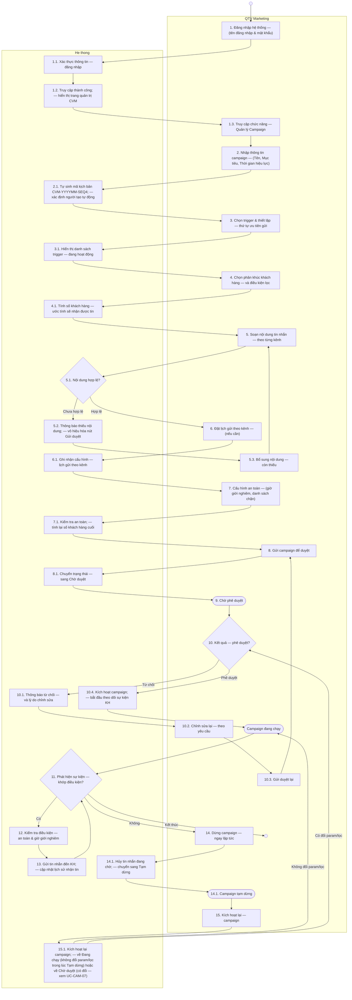
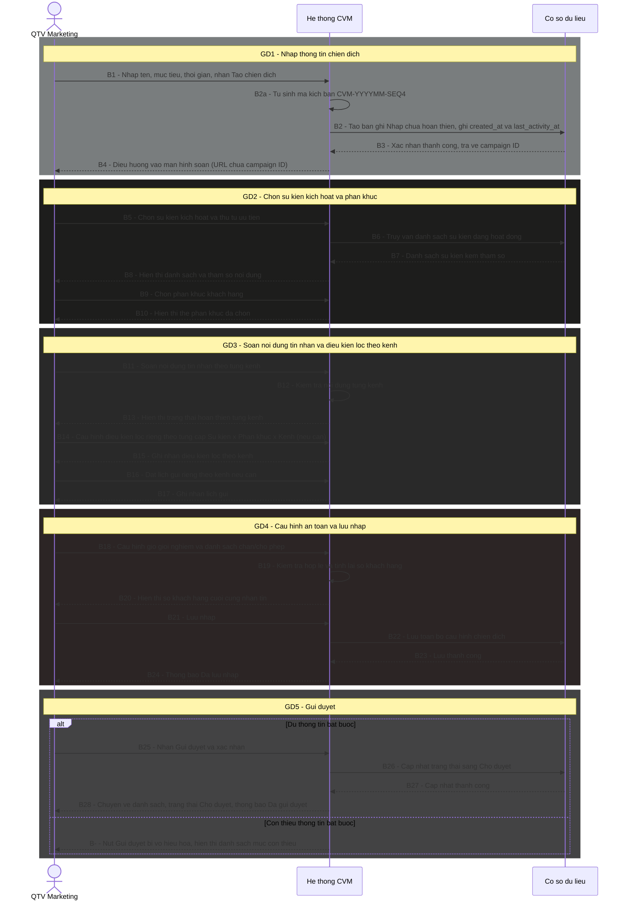
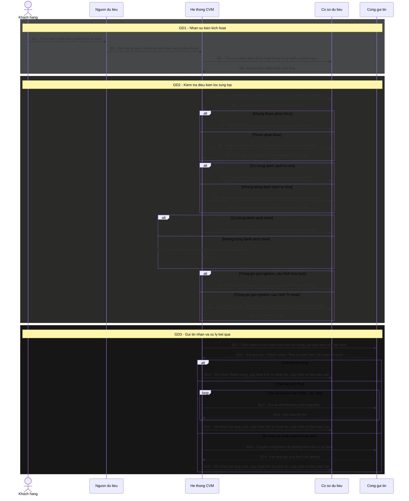

# AUTHENTIC EDUCATION HUB

# TÀI LIỆU ĐẶC TẢ YÊU CẦU NGƯỜI DÙNG
## HỆ THỐNG QUẢN LÝ GIÁ TRỊ KHÁCH HÀNG
### Customer Value Management System (CVM)

Hà Nội – Tháng 05/2026

---

## CÁC THAY ĐỔI

| Ngày | Tác giả | Mục thay đổi | Loại | Mô tả | Phiên bản |
|---|---|---|---|---|---|
| 15/05/2026 | Jun | Toàn bộ | A | Tạo mới — dựa trên Wireframe v9 | V1.0 |
| 20/05/2026 | Jun | Toàn bộ | U | Cập nhật theo Wireframe v10 + feedback QA: C1–C5 (S6 BL/WL, Kênh & Lịch gửi, Preview on-demand, Điều kiện lọc per phân khúc, Thêm kênh qua [+ Kênh]); M1–M10 (đổi tên Section 5, xóa chi phí SMS, Event source, Reach label, User Flow, Admin/Settings screen, PARAMS tooltip, Hướng dẫn Message Matrix, BL/WL 2 chiều, Reach per phân khúc); mn1–mn8 | V2.0 |
| 20/05/2026 | Jun | Tất cả bảng component | U | Bổ sung placeholder, validate đầy đủ, thông báo lỗi cụ thể, empty state, loading/error state, disabled state, quy tắc tương quan cho tất cả màn hình: Dashboard (KPI thresholds, loading/error/empty), Campaign List (debounce, empty state, action rules), Campaign Detail (tab empty), Campaign Builder (date range rules, priority limit, trigger empty/confirm, T-ALL confirm, image upload type/size, title/body per kênh, CTA label limit/URL scheme, blackout validate, BL list empty), Template List (cột Dùng definition, Clone navigate), Template Editor (name limit, toggle Inactive behavior, THAM SỐ ĐỘNG empty), Trigger Modal (payload snake_case, min 1 row, xóa dòng cuối disabled, error messages), Blacklist (phone display format, validate on-blur, duplicate behavior), Customer List (debounce, empty), Customer 360 (cooldown time display, history default 10 rows, empty), Report (date range warning, SMS/USSD N/A metric, campaign comparison states, cost source), Admin (reject reason min/max, sort FIFO), Settings (weekly≥daily, cooldown max 168h, form reload after save) | V2.1 |
| 21/05/2026 | Jun | Tất cả bảng component | U | QA audit toàn bộ 136 issues (24 CRITICAL / 62 MAJOR / 41 MINOR / 9 AMBIGUOUS) và fix toàn bộ: Dashboard (drill-down URL per KPI, loading/error/empty state cho tất cả chart/bảng, stream buffer 100 dòng + pause behavior, heatmap trục y, top 10 triggers); Campaign List (loading overlay khi filter/trang, chip thứ tự cố định, Draft/Ended badge color note, loading/disabled [Dừng]/[Bật] API, [Sửa] Paused define "thay đổi nội dung"); Campaign Detail (loading/error state toàn trang, [Dừng]/[Bật] có confirm + loading giống List, tab thứ tự, BL modal 100-row limit); Campaign Builder ([Lưu Nháp] loading/error, [Gửi duyệt] confirm text, tên campaign maxLength 200, mục tiêu block input, Advanced→Basic confirm + giữ trigger đầu, trigger chip cảnh báo mất message, OR→AND không có Variant không cần confirm, AND→OR khởi tạo Variant mặc định, estimate error state, T-ALL sau xác nhận hiện thẻ cam, dropdown segment loading, điều kiện lọc operator list + source hardcode, image tolerance ±5% + server error, template dropdown loading/empty/ghi đè, USSD ký tự đặc biệt định nghĩa rõ + realtime, Email body truncate toast, SAMPLE PARAMS source + persist, Variant confirm text, segment-Variant sync warning, lịch delay validation theo quy đổi phút, blackout time picker empty validate, BL danh sách kênh 6 options + loading); Template List (debounce 300ms, filter kênh options, empty state, [Tắt]/[Bật] loading+disabled); Template Editor ([Lưu] loading/error, toast text khi tab trống, preview rationale documented, THAM SỐ ĐỘNG loading); Trigger Management ([Sửa] cảnh báo Active campaign, [Tắt] 2 dialog variant + campaign vẫn chạy, [Bật] loading, payload maxLength + no limit rows, [Lưu] loading/API error); Blacklist (filter dropdown searchable + kênh options, [Xóa] loading, modal campaign dropdown loading/empty, kênh 6 options, upload campaign → dropdown, parse loading, 0-valid disabled button, loading overlay + empty state); Customer List (loading/error/empty state bảng); Customer 360 (loading/error per section, [↻] spin, Drawer pagination 20/trang + filter UI + empty state); Report (kỳ trước formula documented, loading/error/empty tất cả tab, [Xuất Excel] loading+error, cột Chi phí SMS behavior khi chưa cấu hình, phân bổ thiết bị non-Push → Khác, funnel data source, histogram bucket 0, drill-down scope); Admin ([Duyệt]/[Từ chối] loading+disabled, textarea auto-focus + counter, phân trang options, Tab 7 explicit same-as-Screen-5); Settings (loading/error fetch config, validate STT 4 merge vào STT 1, [Lưu] loading+error, Priority Matrix loading/error, 2 cơ chế sắp xếp nhất quán, confirm text) | V2.2 |
| 21/05/2026 | Jun | Section IV — Tất cả bảng component | U | Viết lại toàn bộ cột Mô tả trong Section IV theo ngôn ngữ nghiệp vụ thuần Việt, dễ đọc cho người dùng cuối — thay thế các thuật ngữ kỹ thuật bằng diễn đạt nghiệp vụ tương đương | V2.3 |
| 26/05/2026 | Jun | Khối 3 — Trigger; I.2; Screen 5; Screen Admin | U | Tái thiết kế mô hình Trigger: Trigger là danh mục cố định (Read-only Catalog) do Dev/SA quản lý qua deployment — không tạo/sửa trên UI. Xóa UC-TRG-01 (Thêm) và UC-TRG-03 (Sửa) và UC-TRG-04 (Bật/Tắt). Cập nhật UC-TRG-00: Admin và QTV đều chỉ có [Xem], không có hành động chỉnh sửa. Cập nhật UC-TRG-02: modal chi tiết 3 nhóm A/B/C (bỏ nhóm Điều kiện kích hoạt, giữ Định danh + Tham số đầu ra + Thông tin vận hành); bổ sung ví dụ giá trị per param, kênh hỗ trợ. Thêm policy PARAM_INVALID: khi param bị xóa/đổi qua deployment, campaign dùng param đó tự động Paused + gắn cờ + thông báo QTV. Cập nhật I.2 phạm vi. Xóa Modal 5B. Cập nhật Screen Admin bỏ tab Cấu hình Trigger. | V3.0 |
| 05/06/2026 | Jun | Screen 4A, 4B, 4C; UC-TPL-01, UC-TPL-02 | U | Đồng bộ với thay đổi UI thực tế: (1) Xóa "Giá trị mẫu / Sample Params" khỏi Template Editor — preview hiển thị tham số nguyên dạng `{{ten_kh}}`; (2) Thêm nút [Xem] vào Template List → navigate `/templates/:id/view`; (3) Cập nhật UC-TPL-02 + thêm Screen 4C đặc tả đầy đủ màn xem chi tiết template (layout 2 cột, input disabled, ẩn THAM SỐ ĐỘNG/hướng dẫn/nút xóa kênh); (4) Bổ sung behavior preview Email — banner hiển thị phía trên Subject nếu đã upload, placeholder xám nếu chưa có; (5) Bổ sung nút [Sửa] và [Sao chép] trên header màn xem chi tiết — nghiệp vụ giống UC-TPL-03 và UC-TPL-04. | V3.1 |
| 12/06/2026 | Jun | UC-CAM-04; Screen 2B (STT 8) | U | Đơn giản hóa modal preview BL/WL trong Campaign Detail: bỏ hiển thị thống kê hợp lệ/trùng/sai định dạng — chỉ hiển thị danh sách số điện thoại thuộc danh sách đó kèm tổng số lượng; bổ sung nút [Xem] cho Whitelist (trước chỉ có Blacklist). | V3.2 |
| 15/06/2026 | Jun | Khối 3 — Trigger; Screen 5; Screen Admin (Tab Trigger) | U | Thay đổi mô hình Trigger: Admin Hệ thống có thể khai báo trigger và tham số đầu ra trực tiếp trên UI (không còn chỉ qua deployment). Cập nhật UC-TRG-00: Admin thấy [Xem / Sửa] và [+ Thêm trigger]; QTV vẫn chỉ [Xem]. Cập nhật UC-TRG-02: bỏ Nhóm C (thông tin vận hành), giữ Nhóm A + B; Nhóm B đơn giản hóa xuống 2 cột (Tên tham số + Mô tả); Admin thấy [+ Thêm tham số] và icon Xóa per dòng. Thêm UC-TRG-03 (Khai báo trigger mới) và UC-TRG-04 (Thêm/Xóa tham số đầu ra). Cập nhật Screen 5: bỏ Nhóm C, bổ sung A6 Kênh hỗ trợ vào Nhóm A, cập nhật Nhóm B xuống 2 cột. Cập nhật Tab Trigger trong Screen Admin. Cập nhật mô tả role Admin_HT. | V3.3 |
| 16/06/2026 | Jun | UC-TRG-03 | U | Đồng bộ với code thực tế: form tạo trigger mới có section tham số đầu ra — Admin có thể khai báo tham số ngay khi tạo (không bắt buộc) thay vì chỉ thêm sau qua UC-TRG-04. Cập nhật Mục tiêu, Hậu điều kiện, Hoạt động (thêm bước 5 + 4 exception mới), Quy tắc nghiệp vụ. | V3.4 |
| 19/06/2026 | Jun | UC-CAM-02; Screen 4A (STT 11, 12); Screen 4B (STT 5); NFR Hiệu năng UI | U | Đổi preview Campaign Builder từ on-demand sang realtime — đồng nhất với Template Editor. Cập nhật Hoạt động bước 5, Quy tắc nghiệp vụ, bảng component STT 11–12 trong Screen 4A, STT 5 trong Screen 4B, và mục Hiệu năng UI trong NFR. | V3.5 |
| 24/06/2026 | Jun | I.3 Thuật ngữ; UC-CAM-02; Screen 4A (S3 STT 4, S4 STT 13) | U | Bổ sung logic chặn biến thể khi Logic phân khúc = AND (Tất cả phân khúc): (1) Cập nhật định nghĩa Audience Variant — chỉ áp dụng khi đồng thời Logic trigger OR VÀ Logic phân khúc OR; (2) Thêm 2 quy tắc nghiệp vụ vào UC-CAM-02: AND phân khúc → ẩn [+ Biến thể đối tượng], chuyển OR→AND khi đang có variant → confirm xóa; (3) Bổ sung đầy đủ behavior chuyển đổi vào bảng S3 STT 4; (4) Cập nhật điều kiện hiển thị S4 STT 13 — phải thỏa cả hai: trigger OR VÀ phân khúc OR. | V3.6 |
| 29/06/2026 | Jun | Screen 2B (STT 7) | U | Bổ sung và làm rõ hiển thị Biến thể đối tượng trong Campaign Detail View: (1) tab biến thể per trigger card, mặc định Biến thể 1, click để xem nội dung từng biến thể; (2) số biến thể per kênh độc lập — kênh chỉ có 1 biến thể không hiển thị hàng tab; (3) số biến thể per trigger trong cùng kênh cũng độc lập; (4) reset về Biến thể 1 khi switch kênh để tránh index out-of-range; không có biến thể → hiển thị thẳng nội dung. | V3.7 |
| 29/06/2026 | Jun | II.6.4 Điều kiện dừng pipeline | U | Bổ sung rule bỏ qua trigger xảy ra trước `startDate`: campaign đang Active nhưng trigger kích hoạt trước ngày bắt đầu hiệu lực → bỏ qua event, không enqueue, ghi log `EVENT_BEFORE_START_DATE`; đồng thời thêm cột "Thời điểm kiểm tra" vào bảng để phân biệt điều kiện trước enqueue vs trong pipeline. | V3.8 |
| 29/06/2026 | Jun | UC-CAM-05 (Hoạt động, Quy tắc nghiệp vụ); II.6.4 | U | Xóa cả 2 exception trong UC-CAM-05 (dead code): Paused không thể đến từ Pending; Ended thì background job đã xử lý trước, campaign biến mất khỏi danh sách Admin trước khi Admin kịp thấy. Giữ rule background job ở II.6.4 và Quy tắc nghiệp vụ UC-CAM-05. | V3.9 |
| 29/06/2026 | Jun | Screen 1A STT 4 (Thời gian hiệu lực); UC-CAM-08 Quy tắc nghiệp vụ | U | Bổ sung validate endDate không được trong quá khứ: blocking issue khi Gửi duyệt; thông báo lỗi "Ngày kết thúc không được ở trong quá khứ"; startDate vẫn cho phép quá khứ (hỗ trợ campaign duyệt muộn). | V3.10 |
| 03/07/2026 | Jun | UC-CAM-02 (Độ ưu tiên); UC-CAM-02 (Logic phân khúc AND→OR); Screen 4A STT 14; UC-TPL-01 (tab kênh trống) | U | (1) Sửa rule mặc định độ ưu tiên: chỉ tính campaign đang **Active** + 1 (trước đây tính tất cả campaign, không phân biệt trạng thái) — áp dụng ở Quy tắc nghiệp vụ UC-CAM-02 và Screen 1A STT 5; (2) Bổ sung confirm dialog khi chuyển Logic phân khúc AND → OR: xác nhận sẽ xóa toàn bộ cấu hình phân khúc + nội dung Message Matrix (Mục 4), không thể hoàn tác; (3) Đổi behavior xóa phân khúc ở S3 khi đã có Audience Variant: Variant đang dùng phân khúc đó bị xóa luôn kèm nội dung tin nhắn đã soạn — không còn hiển thị cảnh báo/confirm (do mỗi Variant chỉ assign đúng 1 phân khúc); (4) Đổi tab kênh trống khi lưu Template: từ cảnh báo không chặn → thành blocking issue bắt buộc phải có ít nhất 1 tab kênh mới được tạo template — áp dụng ở Hoạt động UC-TPL-01, Quy tắc nghiệp vụ, Screen 4A STT 4. | V3.11 |
| 03/07/2026 | Jun | UI mới: trang 403/401; Screen 3 (Kênh & Lịch gửi) | U | (1) Tạo trang 403 Forbidden và 401 Unauthorized cho CVM UI (route độc lập ngoài AppLayout, không sidebar/header); (2) Bổ sung cột "Thời gian gửi" vào Section 5 "Kênh & Lịch gửi" trong Campaign Detail — biểu diễn đủ 3 loại: gửi ngay / trì hoãn X phút-giờ-ngày / lên lịch giờ cố định T+N; lịch chung hiển thị 2 dòng (sendTime + blackout), lịch riêng hiển thị bảng 3 cột (Kênh / Thời gian gửi / Blackout). | V3.12 |
| 03/07/2026 | Jun | Khối 3 — Trigger (UC-TRG-00; Screen 5A; Tab Trigger Admin; I.2) | U | Bỏ cách hiển thị Danh sách Trigger theo 3 collapsible group (Realtime/Near Realtime/Offline) — nguyên nhân: Kiểu chạy là field optional có default value khi khai báo trigger, group cứng theo field không bắt buộc gây xung đột logic. Chuyển sang bảng phẳng + filter chip multi-select theo Kiểu chạy (kết hợp được với filter Trạng thái và tìm kiếm), thêm cột Kiểu chạy hiển thị badge trực tiếp trong bảng. Áp dụng đồng thời cho QTV (Screen 5A) và Admin (Tab Trigger). | V3.13 |
| 03/07/2026 | Jun | Quy tắc nghiệp vụ chung — Khối 3 (PARAM_INVALID); UC-CAM-07; Screen 2 STT 8; Screen 3 STT 3 | U | Làm rõ policy PARAM_INVALID theo từng trạng thái campaign: (1) Active/Pending — tự động chuyển Paused + gắn cờ (trước đây rule không phân biệt trạng thái); (2) Draft/Paused sẵn có/Ended — chỉ gắn cờ cảnh báo, không tự đổi trạng thái. Bổ sung điều kiện chặn UC-CAM-07 (Kích hoạt lại): campaign Paused do PARAM_INVALID không có đường tắt bật thẳng — nút [Bật] bị khóa vĩnh viễn cho đến khi đi qua đúng luồng [Sửa] → Draft → Gửi duyệt → Pending → Admin duyệt → Active; cập nhật đồng bộ Tiền điều kiện, Exception, Quy tắc nghiệp vụ UC-CAM-07 và 2 màn Screen 2/Screen 3 (nút [Bật] disabled + tooltip khi còn cờ). | V3.14 |
| 03/07/2026 | Jun | UC-BL-01; UC-BL-02 (Tác nhân) | U | Sửa mâu thuẫn quyền: UC-BL-01 (Thêm thủ công) và UC-BL-02 (Upload CSV) trước đây ghi Tác nhân gồm cả QTV Marketing và Admin Hệ thống — không khớp với Permission Matrix và RBAC Matrix (Admin chỉ có VIEW + DELETE với Blacklist, không có CREATE). Sửa Tác nhân của cả 2 use case còn lại **QTV Marketing**, khớp đúng 2 ma trận quyền đã có sẵn. | V3.15 |
| 03/07/2026 | Jun | UC-DSH-01 (Row 1, Row 2, Row 3, Row 4); Screen 1 (STT 1.4, 2.2, 3.2, 4.1); I.3 Thuật ngữ; UC-RPT-01 (Tab 3, Tab 4, Tab 6); Screen 9 (Tab 3 STT 3.3, Tab 4, Tab 6) | U | Rà soát và đơn giản hóa Dashboard + Report — loại bỏ chỉ số thừa/trùng lặp/tính toán phức tạp không cần thiết: (1) Report Tab Phân khúc — xóa biểu đồ Donut phân bổ thiết bị (Android/iOS/Khác), lạc chủ đề với phân tích phân khúc khách hàng; (2) Dashboard Row 4 — xóa Heatmap (bản đồ nhiệt trigger theo giờ × ngày), trùng nguồn dữ liệu với biểu đồ Row 2; (3) Dashboard — gộp 2 bảng "Top Trigger hôm nay" (Row 3) và "Top 10 Trigger 7 ngày" (Row 4) thành 1 bảng duy nhất có toggle Hôm nay/7 ngày tại Row 3, Row 4 chỉ còn "Phát hiện bất thường"; (4) Report Tab Spam & Quá tải — xóa hẳn Spam Risk Score (Gauge + công thức tổng hợp weighted 40/30/30 không có căn cứ giải thích, phụ thuộc ngầm vào toggle So sánh kỳ trước), thay bằng ngưỡng cảnh báo áp dụng trực tiếp lên Opt-out Rate và Blacklist mới (< 3% bình thường / 3–4,9% cảnh báo / ≥ 5% nguy hiểm), xóa khỏi Data Dictionary; (5) Dashboard Row 2 — bổ sung ngưỡng cảnh báo cho "Oldest pending" (> 15 phút cam, > 30 phút đỏ), trước đây không có ngưỡng nên thiếu tính hành động; (6) Dashboard KPI — đổi "Tỉ lệ đã tới đích" thành "Tỉ lệ đã tới đích hôm nay", đổi cách tính từ cửa sổ trượt 24h sang tính theo 00:00 hôm nay để nhất quán với 6 KPI card còn lại; (7) Report Tab So sánh Campaign — xóa cột "SMS Cost" (đơn giá SMS chưa cấu hình, không kiểm chứng được thực tế), bỏ khỏi bảng chỉ số UC-RPT-01 Tab 3 và Screen 9 STT 3.3. | V3.16 |
| 07/07/2026 | Jun | Quy tắc nghiệp vụ chung — Khối 3 (PARAM_INVALID) | U | Làm rõ điều kiện áp dụng cờ `PARAM_INVALID`: phải thỏa đồng thời cả 2 điều kiện — (a) campaign đang sử dụng trigger vừa bị thay đổi tham số, VÀ (b) nội dung message của campaign đó thực sự tham chiếu đúng param bị xóa/đổi tên (ví dụ `{{ten_kh}}`). Campaign dùng cùng trigger nhưng message không tham chiếu param bị ảnh hưởng thì không bị gắn cờ. Bổ sung rõ: param được **thêm mới** không kích hoạt cờ này với bất kỳ campaign nào (không phá vỡ message hiện có). | V3.17 |
| 08/07/2026 | Jun | UC-CAM-03; Quy tắc nghiệp vụ chung — Khối 3 (PARAM_INVALID); Screen 2B (STT 6); Screen 3 (Header Fixed STT 7) | U | (1) Bổ sung banner cảnh báo đỏ full-width trong Campaign Builder khi campaign đang sửa còn cờ `PARAM_INVALID` — hiển thị lại mỗi lần mở, không phụ thuộc thông báo nội bộ ban đầu đã đọc hay chưa, tự ẩn khi sửa xong và Lưu Nháp; làm rõ thông báo nội bộ chỉ bắn 1 lần trong khi cờ tồn tại persistent trên campaign; (2) Sửa cách hiển thị "Điều kiện lọc" ở Campaign Detail Section 3 — trước đây gộp phẳng tất cả điều kiện của mọi phân khúc thành 1 dòng, gây nhầm lẫn không biết điều kiện thuộc phân khúc nào; nay hiển thị dạng danh sách dọc, mỗi dòng gắn nhãn tên phân khúc ở đầu (ví dụ "[ARPU cao] Loại thiết bị = Android • Gói cước = D200"). | V3.18 |
| 08/07/2026 | Jun | UC-CAM-02 (Quy tắc nghiệp vụ); Screen 3 (Section 3: Audience, STT 5) | U | Đổi cơ chế nguồn thuộc tính cho "Điều kiện lọc thêm" per phân khúc: trước đây là danh sách cố định toàn hệ thống (Loại SIM, Trạng thái, Cài app...), nay đổi thành danh sách động lấy theo trigger đã chọn ở Section 2 — mỗi trigger có bộ thuộc tính lọc riêng theo dữ liệu payload của trigger đó; Advanced mode nhiều trigger → thuộc tính khả dụng là hợp (union) của tất cả trigger đã chọn; chưa chọn trigger nào → accordion điều kiện lọc bị vô hiệu hóa ở mọi thẻ phân khúc, hiển thị "Chọn trigger ở mục 2 để xem điều kiện lọc khả dụng"; mỗi thẻ phân khúc vẫn tự cấu hình giá trị lọc độc lập như trước. | V3.19 |
| 08/07/2026 | Jun | UC-BL-01; Screen 6 (Modal 6B) | U | Sửa mâu thuẫn Modal 6B (Thêm thủ công Blacklist): STT 1 trước đây mô tả Text input đơn (1 số) — trái với UC-BL-01 đã ghi "hỗ trợ nhập nhiều số"; sửa lại thành Textarea nhập nhiều số, validate realtime từng số. Bổ sung xử lý rõ ràng case toàn bộ số đều bị bỏ qua khi bấm [Thêm]: nếu tất cả số hợp lệ về định dạng đều đã trùng trong blacklist cùng campaign-kênh → không đóng modal, không hiện toast "Đã thêm 0 số" (dễ gây hiểu nhầm là lỗi hệ thống) — thay vào đó hiển thị lỗi đỏ ngay trong modal "Toàn bộ số đã nhập đều đã có trong blacklist — không có số nào được thêm"; cập nhật UC-BL-01 Hoạt động/Quy tắc nghiệp vụ và Screen 6 STT 4, STT 6 đồng bộ. | V3.20 |
| 09/07/2026 | Jun | UC-CAM-08 (Quy tắc nghiệp vụ); Screen 3 (Header Fixed STT 6) | U | Sửa gap: cờ `PARAM_INVALID` chưa được liệt kê trong danh sách issue blocking chính thức của UC-CAM-08 (nút [Gửi duyệt]) — dù đã có quy tắc riêng ở Khối 3 nói campaign còn cờ này bị block gửi duyệt, nhưng UC-CAM-08 (nơi mô tả chi tiết nút hoạt động) lại không liệt kê nó, gây rủi ro hiểu nhầm hoặc implement thiếu. Bổ sung `PARAM_INVALID` vào danh sách issue blocking bắt buộc; làm rõ đây là issue độc lập — QTV sửa các trường khác (tên, thời gian hiệu lực...) mà không sửa đúng nội dung message chứa param lỗi thì [Gửi duyệt] vẫn bị khóa; cờ chỉ tự xóa khi nội dung message không còn tham chiếu param lỗi. Đồng bộ tooltip nút [Gửi duyệt →] ở Screen 3. | V3.21 |
| 13/07/2026 | Jun | I.3 Thuật ngữ; UC-CAM-02; UC-TRG-02; UC-TRG-03; UC-TRG-05 (mới); Quy tắc nghiệp vụ chung Khối 3 (FILTER_INVALID); UC-CAM-03; UC-CAM-07; UC-CAM-08; Screen 3 (S3 STT 5, Header Fixed STT 7); Screen 5B (Nhóm C); Screen T-DETAIL/T-NEW; Screen 2/2B | U | Đồng bộ với UI mới về **điều kiện lọc phân khúc theo trigger**: (1) Đổi mô hình khai báo — mỗi điều kiện lọc có kiểu dữ liệu (8 kiểu) + bộ toán tử **khai báo thẳng per thuộc tính** (không suy từ kiểu) + cờ Bắt buộc + danh sách giá trị (chỉ enum); Admin nhập tên nghiệp vụ, techName tự sinh; (2) Campaign Builder: dropdown thuộc tính **group theo trigger** (thuộc tính trùng tên giữ riêng, không gộp, có badge trigger nguồn); toán tử đọc thẳng theo thuộc tính; ô giá trị render theo kiểu (enum→dropdown, số/chuỗi→nhập tay, ngày→date picker, BETWEEN→2 ô, IS NULL/IS NOT NULL→không ô); nhãn toán tử tiếng Việt; (3) Thêm **Nhóm C — Điều kiện lọc phân khúc** vào modal chi tiết trigger (Admin sửa, QTV chỉ đọc); thêm UC-TRG-05 (Thêm/Xóa điều kiện lọc) + bước khai báo trong UC-TRG-03; đặc tả component T-FILTER trong Screen T-DETAIL/T-NEW và Nhóm C trong Screen 5B; (4) Thêm policy **`FILTER_INVALID`** song song PARAM_INVALID: Admin xóa/đổi thuộc tính lọc đang được campaign dùng → campaign Active/Pending tự Paused + cờ, Draft/Paused/Ended chỉ gắn cờ; là blocking issue độc lập của [Gửi duyệt], khóa [Bật], banner đỏ trong Builder; (5) Bổ sung thuật ngữ "Điều kiện lọc phân khúc / Filter field" vào I.3. Sửa footer version về đúng phiên bản hiện tại. | V3.22 |
| 13/07/2026 | Jun | II.2 Function Tree (Khối 3); II.3 Permission Matrix (Khối 3 + ghi chú); II.4 RBAC (role ADMIN_HT + ma trận Trigger); UC-CAM-02 + Screen 3 STT 5 (render giá trị) | U | Fix QA v3.22 (3 CRITICAL + 3 MAJOR + 2 MINOR — đồng bộ 3 ma trận tổng thể vốn còn giữ mô hình Trigger cũ, mâu thuẫn với tầng UC/Screen): (1) [CR-01] Permission Matrix — QTV được XEM danh sách + chi tiết trigger (trước ghi `–`), tách rõ Xem (cả 2 role) khỏi Khai báo/Thêm-Xóa (chỉ Admin); (2) [CR-02] RBAC — nâng quyền Admin trên Trigger từ chỉ VIEW lên VIEW/CREATE tham số/điều kiện lọc + DELETE, đồng bộ với UC-TRG-03/04/05; (3) [CR-03] xóa ghi chú "trigger chỉ đọc, quản lý qua Dev/SA deployment" (mô hình V3.0 đã bỏ từ V3.3); (4) [MA-01] Function Tree Khối 3 — đổi "Tra cứu"→"Quản lý", bỏ "(nhóm theo loại)", bổ sung 3 chức năng Admin (khai báo trigger, thêm/xóa tham số, thêm/xóa điều kiện lọc); (5) [MA-02] xóa dòng phantom "Bật/Tắt sự kiện kích hoạt" (UC đã xóa từ V3.0); (6) [MA-03] bổ sung "Điều kiện lọc phân khúc" vào cả 3 ma trận; (7) [MI-01] bổ sung render giá trị cho 2 kiểu còn thiếu (boolean→dropdown Đúng/Sai, datetime→picker). | V3.23 |
| 14/07/2026 | Jun | Screen 3 (S3 STT 5); C.4 (audit log); Quy tắc nghiệp vụ chung Khối 3 (PARAM_INVALID) | U | Fix postcheck v3.23: (1) [PC-01] sửa tham chiếu chết `UC-PRI-01` → `UC-PRIORITY-01` ở Screen 3 STT 5; (2) [PC-02] xóa thao tác mô hình cũ "Tắt trigger" trong danh sách audit-log C.4, thay bằng các thao tác Admin thực tế (Khai báo/xóa trigger, Thêm/xóa tham số & điều kiện lọc); (3) làm rõ policy PARAM_INVALID áp dụng cho param thay đổi từ CẢ HAI nguồn — Admin sửa trên UI (UC-TRG-04) hoặc Dev/SA deploy — thay vì chỉ "qua deployment" (đồng bộ với mô hình Admin quản lý trigger trên UI từ V3.3). | V3.24 |
| 14/07/2026 | Jun | Screen 2B (STT 6 — Section 3 Audience) | U | Đồng bộ hiển thị điều kiện lọc ở màn Chi tiết campaign (chỉ đọc) với Campaign Builder Section 3: mỗi điều kiện lọc hiển thị dạng chip **kèm badge mã trigger nguồn** để biết thuộc tính thuộc trigger nào — cần thiết ở Advanced mode nhiều trigger khi có thuộc tính trùng tên giữa các trigger; cập nhật ví dụ dùng thuộc tính thật theo trigger (E01/E02) thay cho danh mục filter cũ. | V3.25 |
| 20/08/2026 | Jun | UC-CAM-02 (bước 7 Lưu Nháp); Quy tắc nghiệp vụ chung Khối 3 (PARAM_INVALID); UC-CAM-08 (blocking issue) | U | **PARAM_INVALID mở rộng 2 nguồn phát sinh.** Trước đây cờ này chỉ áp dụng khi trigger thay đổi param **sau khi** campaign đã cấu hình xong (Khóa/deploy). Gap: nếu QTV áp template có sẵn chứa `{{param}}` **không thuộc trigger đã chọn** ngay từ lúc soạn (chưa từng đúng, không phải do trigger đổi) — chưa có cơ chế phát hiện, dẫn tới runtime hiển thị chuỗi rỗng cho khách hàng (theo quy tắc Global Params đã có). Nay bổ sung **Nguồn 2**: hệ thống validate tham chiếu param tại [Lưu Nháp] và [Gửi duyệt] — không chặn lúc chọn/áp template (QTV vẫn tự do chọn), nhưng phát hiện param sai → **chặn cả Lưu Nháp lẫn Gửi duyệt** (chặt hơn Nguồn 1, vốn chỉ chặn Gửi duyệt) vì đây là lỗi có thể sửa ngay, không có lý do lưu tạm. Dùng chung cờ `PARAM_INVALID`, không tạo cờ mới — phân biệt bằng "nguồn 1 / nguồn 2" trong quy tắc nghiệp vụ. | V3.35 |
| 11/08/2026 | Jun | Screen 3 (S3 STT 5); UC-CAM-02 (Quy tắc nghiệp vụ); UC-CAM-08 (blocking issue) | U | **Validate khoảng BETWEEN "đến" ≥ "từ"** cho điều kiện lọc. Trước đây BETWEEN cho 2 ô nhập nhưng không kiểm thứ tự → QTV nhập khoảng ngược (từ > đến) vẫn lưu được, vô nghĩa. Nay: "đến" < "từ" → lỗi inline "Giá trị 'đến' phải ≥ 'từ'" + viền đỏ, là **blocking issue** chặn [Gửi duyệt]; so sánh theo kiểu (số → số học, ngày → thời gian, enum dữ liệu cũ → thứ tự trong danh sách giá trị). Bổ sung issue này vào danh sách blocking của UC-CAM-08. | V3.34 |
| 11/08/2026 | Jun | UC-TRG-05 (Bảng toán tử hợp lệ theo kiểu) | U | Chuyển **bảng toán tử hợp lệ theo kiểu** từ dạng danh sách gạch đầu dòng (trong cell Quy tắc nghiệp vụ) sang **bảng lưới 14 toán tử × 5 nhóm kiểu** (đánh dấu ✓) đặt riêng ngay sau UC-TRG-05 — dễ tra cứu hơn; cell chỉ giữ câu trỏ tới bảng. Nội dung không đổi, chỉ đổi cách trình bày. | V3.33 |
| 11/08/2026 | Jun | UC-TRG-05 (bước 4 + Quy tắc nghiệp vụ); Screen 3 (S3 STT 5); Screen T-DETAIL (Validate T-FILTER) | U | **Ràng buộc toán tử theo kiểu dữ liệu** — chặn tổ hợp vô nghĩa (điển hình: enum + BETWEEN). Trước đây toán tử "khai báo thẳng per thuộc tính" cho tự do nên Admin có thể tick toán tử không tương thích kiểu (enum + BETWEEN/>/<, boolean + CONTAINS...) → khi tạo campaign, ô giá trị render sai âm thầm (enum + BETWEEN rơi vào dropdown 1 ô, bỏ qua BETWEEN). Nay chốt bảng toán tử hợp lệ theo 5 nhóm kiểu (enum/boolean: bằng+tập hợp; string: +CONTAINS+IN; số: +BETWEEN+so sánh thứ tự; ngày: +AFTER/BEFORE+BETWEEN). **2 tầng**: (1) Trigger Admin chỉ hiện toán tử hợp lệ theo kiểu đã chọn, đổi kiểu → tự bỏ toán tử không còn hợp lệ; (2) Campaign Builder lưới an toàn — enum + BETWEEN (dữ liệu cũ) render 2 dropdown từ–đến thay vì âm thầm bỏ qua. Sửa data mock: field `sent_count` có operators rác `['integer']` → `['=','>=','<=']`. | V3.32 |
| 03/08/2026 | Jun | UC-TRG-04; UC-TRG-05; Quy tắc nghiệp vụ Khối 3 (PARAM_INVALID + FILTER_INVALID); Screen T-DETAIL (Nhóm B + C); Screen 3 (S3 STT 5); UC-TRG-02; Function Tree II.2; Permission II.3; RBAC II.4; Glossary I.3 | U | **Đổi mô hình quản lý tham số & điều kiện lọc của trigger: bỏ Xóa cứng → Thêm/Sửa/Khóa.** Lý do kỹ thuật: BE dùng khóa ngoại liên kết tham số/điều kiện lọc với campaign đang dùng — xóa cứng làm gãy liên kết ở campaign. (1) UC-TRG-04/05 đổi tên "Thêm/Xóa" → "Thêm/Sửa/Khóa"; bỏ luồng Xóa, thêm luồng **Sửa** (sửa tất cả trường, pre-fill form) và **Khóa/Mở** (Khóa qua dialog xác nhận cảnh báo campaign ảnh hưởng; Mở khóa ngay). (2) **Sửa Tên giữ nguyên techName/cú pháp `{{param}}`** (mã bất biến) → sửa Tên KHÔNG gắn cờ; chỉ Sửa kiểu/toán tử/giá trị hoặc Khóa mới gắn cờ FILTER_INVALID/PARAM_INVALID. (3) Policy Khối 3 cập nhật điều kiện phát cờ (thêm "Khóa", làm rõ sửa Tên không phát cờ). (4) Screen T-DETAIL: cột Hành động Nhóm B & C đổi Xóa → Sửa + Khóa/Mở; thay dialog xóa (C4) bằng dialog Khóa (B7, C4); thêm badge "Đã khóa"; sửa lỗi đánh số C4 trùng (trạng thái rỗng → C5). (5) Campaign Builder ẩn thuộc tính bị Khóa khỏi dropdown. (6) Đồng bộ Function Tree/Permission/RBAC ("Thêm/sửa/khóa"; RBAC → VIEW/CREATE/UPDATE/LOCK); Glossary bổ sung khái niệm Trạng thái Khóa (5c). **Cập nhật campaign dính cờ vẫn do QTV làm thủ công — hệ thống chỉ gắn cờ + Paused + báo.** *(Tài liệu trước, UI cvm-ui đồng bộ sau.)* | V3.31 |
| 30/07/2026 | Jun | Screen T-DETAIL (C1d — cột Giá trị Nhóm C) | U | Sửa mô tả cột Giá trị của bảng điều kiện lọc: bổ sung nhánh **kiểu Đúng-Sai (boolean) hiển thị "Đúng / Sai"** thay vì rơi vào "nhập tay" (trước đây C1d chỉ phân biệt Danh mục vs "kiểu khác"). Đồng bộ với code: bảng ở Trigger Admin hiển thị "Đúng / Sai" cho boolean; ô giá trị boolean ở Campaign Builder render dropdown 2 giá trị Đúng/Sai (đúng như Screen 3 STT 5 đã đặc tả — trước đó code render nhầm thành input nhập tay cho cả boolean). | V3.30 |
| 23/07/2026 | Jun | UC-TRG-05 (Exception + Quy tắc nghiệp vụ); Screen T-NEW (Validate T-FILTER) | U | Làm rõ ràng buộc **danh sách giá trị enum**: (1) **KHÔNG ép định dạng** — enum là giá trị nghiệp vụ tự do (`eSIM, Vật lý` / `12MB, 24MB` / `15-18, 19-24` đều hợp lệ), hệ thống chỉ tách theo dấu phẩy + trim + bỏ phần tử rỗng, không bắt theo mẫu nào (sửa hiểu nhầm từ placeholder gợi ý dạng khoảng tuổi khiến người dùng tưởng là định dạng bắt buộc); (2) bổ sung ràng buộc **không trùng giá trị** (không phân biệt hoa thường) — Exception mới + dòng validate; (3) bắt buộc có ít nhất 1 giá trị sau khi bỏ dấu phẩy thừa. Đồng bộ với code cvm-ui (validateFf). | V3.29 |
| 22/07/2026 | Jun | Quy tắc nghiệp vụ chung Khối 3 (PARAM_INVALID + FILTER_INVALID — dòng thông báo nội bộ) | U | Làm rõ **phạm vi người nhận thông báo nội bộ** (trước đây mơ hồ — cụm "campaign bị ảnh hưởng" dễ hiểu nhầm là chỉ Active/Pending vì đó là nhóm được nêu tên rõ ở dòng trên). Nay ghi tách bạch: gửi cho QTV của **mọi campaign bị gắn cờ ở Active/Pending/Draft/Paused** (cả nhóm tự Paused lẫn nhóm chỉ gắn cờ), **KHÔNG gửi cho Ended** (cờ chỉ lưu vết → thông báo là nhiễu). Áp đồng bộ cho cả 2 policy. Bổ sung dấu [Cần xác nhận] về kênh thông báo (in-app/email) — CVM chưa có notification center, chờ PO chốt ở hạng mục riêng, không bịa. | V3.28 |
| 15/07/2026 | Jun | Screen 3 (S3 STT 5 — Điều kiện lọc per phân khúc) | U | Bổ sung trạng thái còn thiếu: **trigger đã chọn nhưng không khai báo điều kiện lọc nào** (danh sách thuộc tính lọc rỗng). Trước đây chỉ đặc tả 2 trạng thái (chưa chọn trigger / có điều kiện lọc), thiếu nhánh giữa → UI cho mở accordion + [+ Thêm lọc] nhưng dropdown thuộc tính rỗng ("Không có dữ liệu"), tạo dòng điều kiện chết không chọn được gì. Nay: accordion vô hiệu hóa + text mờ "Trigger đã chọn chưa khai báo điều kiện lọc nào — phân khúc dùng toàn bộ audience của trigger", ẩn nút [+ Thêm lọc]. Advanced mode nhiều trigger mà chỉ một phần có điều kiện lọc → dropdown chỉ hiện optgroup của trigger có thuộc tính, bỏ trigger rỗng. | V3.27 |
| 15/07/2026 | Jun | UC-TRG-05 (Hoạt động + Quy tắc nghiệp vụ); Screen T-DETAIL (C3e + C4 mới) | U | Đồng bộ với UI: **xóa điều kiện lọc phân khúc phải qua dialog xác nhận** thay vì xóa ngay. Dialog nêu tên thuộc tính đang xóa + mã trigger, và nếu có campaign đang dùng trigger thì hiển thị **danh sách campaign bị ảnh hưởng** (tên + mã) kèm cảnh báo chung "chiến dịch đang chạy sẽ tự chuyển Tạm dừng, phải cập nhật điều kiện lọc trước khi bật lại"; chưa campaign nào dùng → báo không ảnh hưởng. Thống nhất chọn thông báo **chung + danh sách campaign** thay vì liệt kê chi tiết từng thuộc tính (tránh dài dòng khi trigger nhiều thuộc tính). Thêm điều kiện lọc mới vẫn không cần confirm. Cập nhật đặc tả màn hình: C3e trong T-DETAIL đổi "xóa ngay" → mở dialog; thêm component **C4 — Dialog xác nhận xóa điều kiện lọc**. N6b trong T-NEW (modal tạo trigger mới) giữ xóa thẳng — trigger chưa tồn tại, không campaign nào dùng. | V3.26 |
| 21/08/2026 | Jun | UC-CAM-01/02/05/07/08; UC-PRIORITY-01; UC-TPL-00/01; UC-BL-00/01/02/03; UC-BL-04 (mới); UC-KH-01; II.6.4; II.6.7; Bảng toán tử hợp lệ; Quy tắc nghiệp vụ chung Khối 3; Screen 2/2B/3/4A/6A/6B/6C/7/8; Screen Admin (T-DETAIL, T-NEW); Screen Settings (Tab 1) | U | Đồng bộ theo comment nghiệm thu hệ thống (SYNC mode — Change Set 2026-08-21, 14 thay đổi): (1) **endDate Vô hạn** — checkbox tùy chọn không giới hạn ngày kết thúc, background job và blocking issue Gửi duyệt loại trừ case này; (2) **Badge "Chưa tới ngày bắt đầu"** — campaign đã duyệt nhưng chưa tới startDate vẫn giữ Active, thêm badge phụ phân biệt; (3) **Bật lại từ Paused → Chờ duyệt** khi param/điều kiện lọc trigger bị Sửa (không phải Khóa) trong lúc Paused — phân biệt rõ với policy PARAM_INVALID/FILTER_INVALID hiện có; (4) **Cột Ưu tiên + sửa priority trên Campaign List** — sửa từng dòng, bắt buộc chuyển về Chờ duyệt để Admin xác nhận lại (khác Priority Matrix — Admin tự sắp xếp không cần duyệt lại); (5) **Di chuyển điều kiện lọc con** từ Section 3 xuống Section 4 Message Matrix, khai báo theo Trigger × Phân khúc × Kênh, kế thừa mặc định khi thêm kênh mới; bổ sung preview nội dung + tên phân khúc tại Section 4; (6) **Đơn vị % và GB** cho điều kiện lọc kiểu Số; (7) **Kiểm tra ký tự SMS có dấu/không dấu** — ngưỡng 70 ký tự/segment (có dấu) / 160 ký tự/segment (không dấu), tự phát hiện realtime; (8) **Nhóm Template theo Trigger** (trường Trigger áp dụng mới, không giới hạn phạm vi dùng) + **cho phép Xóa** template chưa từng được campaign tham chiếu; (9) **Frequency Cap**: bỏ Cooldown, thêm Weekly/Monthly cap và cap riêng theo từng kênh, để trống = không giới hạn, thêm cấu hình **Gửi lại** sau lần gửi đầu thất bại (số lần + khoảng cách tối thiểu); (10) **Blacklist**: cho phép chọn nhiều Campaign + nhiều Kênh cùng lúc khi thêm (thủ công và Upload CSV), bổ sung **Blacklist toàn hệ thống** (UC-BL-04 mới, chỉ Admin, áp dụng mọi campaign/kênh, độc lập với Blacklist theo campaign) — cập nhật thứ tự kiểm tra pipeline (DNC → BL toàn hệ thống → BL theo campaign-kênh); (11) **Che thông tin nhạy cảm tại Customer 360/Customer List** — Số điện thoại mask theo role, các field khác còn chờ PO/đội bảo mật chốt (xem OQ-11 cuối tài liệu). Bổ sung 2 Open Question mới (#11, #12). **Fix nội bộ sau QA/postcheck cùng đợt**: sửa workflow diagram (node 15.1) phản ánh đúng nhánh Chờ duyệt của UC-CAM-07; đồng bộ 5 tham chiếu điều kiện lọc từ "Section 3" (đã dời) sang "Section 4"; làm rõ role xem đầy đủ SĐT còn treo ở OQ-11 (Screen 7, Screen 8); bổ sung UC-BL-04 (Blacklist toàn hệ thống) vào Function Tree (II.2), Permission Matrix (II.3), RBAC Matrix (II.4) — trước đó chỉ có ở Section III/IV. **Đóng OQ-12**: BA xác nhận bổ sung Upload CSV cho Blacklist toàn hệ thống — thêm UC-BL-05 (modal 2 tab Thêm thủ công/Upload CSV, dùng chung giới hạn 100.000 dòng với UC-BL-02), cập nhật Screen 6A STT 13, Function/Permission/RBAC Khối 4. | V4.0 |
| 21/08/2026 | Jun | II.6.7; II.6.10 (mới); UC-CAM-02; Screen 3 (Kênh & Lịch gửi STT 8); Screen Settings (Tab 1) | U | **Sửa lỗi thiết kế phát hiện khi review UI**: cấu hình "Gửi lại" ở V4.0 bị đặt sai cả vị trí (System Settings — cấu hình chung) lẫn ý nghĩa nghiệp vụ (retry kỹ thuật khi Failed) so với yêu cầu thực tế của BA — thực chất là "Nhắc lại" (Re-engagement): sau khi đã gửi tin THÀNH CÔNG cho KH theo 1 trigger, nếu KH vẫn chưa xử lý xong (vẫn thoả điều kiện trigger gốc), chủ động gửi thêm 1-N lần nhắc, cấu hình riêng theo TỪNG CAMPAIGN. Xử lý: (1) Bỏ hoàn toàn Toggle "Cho phép gửi lại" khỏi Screen Settings Tab 1 (STT 1.5 cũ, đánh lại số 1.5→1.10); (2) Thêm mới **II.6.10 — Nhắc lại (Re-engagement)**: cơ chế đánh giá lại điều kiện trigger tại thời điểm nhắc, chỉ nhắc nếu KH vẫn thoả điều kiện, dừng nếu KH đã tự xử lý xong; phân biệt rõ với Retry kỹ thuật (II.6.7, chỉ áp dụng khi gửi Failed); (3) Thêm Toggle "Cho phép nhắc lại" vào Campaign Builder — Screen 3 "Kênh & Lịch gửi" STT 8 (Số lần nhắc lại tối đa + Khoảng cách tối thiểu giờ), và bước 4a trong UC-CAM-02 Hoạt động + dòng Quy tắc nghiệp vụ tương ứng. | V4.1 |
| 21/08/2026 | Jun | UC-CAM-01; Screen 2 (cột Ưu tiên STT 7) | U | **Mở rộng phạm vi sửa priority trực tiếp trên Campaign List**: BA xác nhận campaign **Draft** cũng cho sửa độ ưu tiên tại đây (trước đó chỉ Active). Khác biệt với Active: campaign Draft chưa từng qua duyệt nên sửa priority áp dụng **ngay lập tức, không hiển thị confirm dialog, không đổi trạng thái** — campaign Active vẫn giữ nguyên rule cũ (bắt buộc chuyển về Pending, cần Admin duyệt lại). Cập nhật UC-CAM-01 Hoạt động (thêm Alternative flow cho Draft) + Quy tắc nghiệp vụ + Screen 2 STT 7. Campaign Pending/Paused/Ended vẫn không cho sửa priority tại Campaign List. | V4.2 |
| 21/08/2026 | Jun | UC-TPL-00; Screen 4A (Template List) | U | **Đơn giản hóa hiển thị Trigger tại Template List**: BA yêu cầu bỏ cơ chế nhóm collapsible theo Trigger áp dụng (V4.0) — thay bằng **thêm cột "Trigger"** trong bảng, hiển thị tối đa 2 chip + "+N ⓘ" (popover đầy đủ), nhất quán với cách cột Trigger đang hiển thị tại Campaign List (Screen 2). Danh sách quay về sắp xếp phẳng theo số lần dùng nhiều nhất, không còn chia khối theo trigger. Cập nhật UC-TPL-00 (Hoạt động + Quy tắc nghiệp vụ) và Screen 4A STT 2–6, STT 10. | V4.3 |
| 21/08/2026 | Jun | UC-TPL-00; UC-TPL-01; Screen 4A (STT 6); Screen 4B (STT 1b mới, STT 4, 6) | U | **2 thay đổi theo yêu cầu BA:** (1) **Xóa template cho phép cả khi đang được dùng** (Dùng > 0) — trước đó (V4.0) chỉ xóa được khi Dùng = 0. Nội dung tin nhắn đã được copy vào từng campaign tại thời điểm chọn template (cùng nguyên tắc UC-TPL-03) nên xóa template gốc không ảnh hưởng campaign đang dùng; bổ sung dialog cảnh báo liệt kê rõ campaign bị ảnh hưởng khi Dùng > 0, dialog đơn giản khi Dùng = 0. (2) **Trigger trên Template đổi từ multi-select không bắt buộc (V4.0) sang single-select bắt buộc**: mục đích thực sự là soạn nhanh + chính xác theo đúng bộ tham số của 1 trigger cụ thể, không phải để phân loại/nhóm hiển thị như hiểu nhầm ban đầu. THAM SỐ ĐỘNG tại Template Editor đổi từ union payload toàn hệ thống sang lấy đúng theo trigger đã chọn; bổ sung cảnh báo khi đổi trigger làm tham số cũ không còn thuộc trigger mới. Cập nhật UC-TPL-00, UC-TPL-01, Screen 4A STT 6, Screen 4B STT 1b (mới)/4/6. | V4.4 |
| 22/08/2026 | Jun | II.6.10; UC-CAM-02 (bước 4a, Quy tắc nghiệp vụ); Screen 3 (Kênh & Lịch gửi STT 8) | U | **Đổi đơn vị "Khoảng cách tối thiểu giữa các lần nhắc" của Nhắc lại (Re-engagement) từ giờ sang ngày** theo yêu cầu BA — vẫn là khoảng cách tương đối tính từ lần gửi trước, chỉ đổi đơn vị nhập liệu/hiển thị; ví dụ minh họa đổi từ "24 giờ" sang "3 ngày"; giới hạn nhập đổi từ 1–9999 (dùng chung với "Số lần nhắc lại tối đa") sang **1–365 ngày** riêng cho ô khoảng cách, kèm thông báo lỗi riêng ("Khoảng cách nhắc lại phải từ 1 đến 365 ngày"); "Số lần nhắc lại tối đa" giữ nguyên 1–9999. | V4.7 |
| 22/08/2026 | Jun | C.5 Yêu cầu về hiệu năng | U | **Fix gap sót từ đợt bỏ Reach ước tính (V4.5):** xóa dòng NFR "Tính toán reach: Tính reach ước tính cho campaign phản hồi < 2 giây" — mô tả 1 chức năng đã không còn tồn tại trong Campaign Builder từ V4.5. Phát hiện qua rà soát đối chiếu toàn diện 12 nghiệp vụ đã patch V4.0-V4.5 với Function Tree/Permission/RBAC/Sequence/Workflow/Glossary/Report; 3 gap còn lại (Workflow Diagram II.1 — node tính Reach + bước "tính lại số khách hàng cuối cùng"; Sequence Diagram II.5.2 — thiếu bước kiểm tra Blacklist toàn hệ thống) thuộc phạm vi diagram — BA quyết định không patch đợt này. | V4.6 |
| 21/08/2026 | Jun | Screen 3 (S3 STT 3); UC-CAM-02 (Hoạt động, Quy tắc nghiệp vụ); Screen 2B (STT 6, 7); UC-TRG-05; Section 3 (STT 1, 5, 6 — Estimate box); Section 6 (STT 5); II.5 Sequence Diagram (Mermaid + bảng diễn giải); I.3.1 Glossary (mục 6 — Reach) | U | **Rà soát toàn diện sau khi dời điều kiện lọc con từ Section 3 sang Section 4 (V4.0):** phát hiện 4 vị trí còn mô tả theo mô hình cũ (điều kiện lọc gắn tại Section 3, dùng chung mọi kênh) — cập nhật đồng bộ: (1) Screen 3 STT 3 (Tag card phân khúc) — bỏ mô tả accordion điều kiện lọc tại đây; (2) UC-CAM-02 bước Hoạt động — bỏ điều kiện lọc khỏi bước chọn phân khúc (bước 3), thêm bước 5b mô tả cấu hình điều kiện lọc theo Kênh ngay tại card nội dung Section 4 (kế thừa mặc định khi thêm kênh mới, xem Section 4 STT 4b); (3) Screen 2B Section 3/4 (STT 6/7) — bỏ hiển thị điều kiện lọc khỏi Section 3 (chỉ đọc), thêm khối "Điều kiện lọc theo Kênh (chỉ đọc)" vào Section 4 theo từng tab kênh, mỗi trigger card hiển thị điều kiện lọc riêng theo đúng phân khúc đang xem; (4) UC-TRG-05 — 3 chỗ đổi tham chiếu "Section 3 Campaign Builder" → "Section 4 (Message Matrix)". **Làm rõ ảnh hưởng logic AND/OR:** không đổi — Logic phân khúc (OR/AND giữa các phân khúc) và logic AND cố định giữa các điều kiện lọc con trong cùng 1 accordion đều giữ nguyên; thay đổi thực sự chỉ là **phạm vi áp dụng** — từ 1 bộ điều kiện lọc dùng chung cho mọi kênh (khai báo 1 lần tại Section 3) sang mỗi kênh có bộ điều kiện lọc riêng theo đúng cặp Trigger × Phân khúc × Kênh (khai báo tại Section 4). **Bỏ toàn bộ Reach ước tính khỏi Campaign Builder** (hệ quả trực tiếp của thay đổi trên — điều kiện lọc tách theo từng kênh nên không còn 1 con số ước tính chung đủ chính xác để hiển thị trước khi gửi): xóa Estimate box (Section 3 STT 7 cũ), xóa "Reach ước tính tại: [giờ:phút]" (Section 3 STT 1), xóa "Reach ước tính" per phân khúc (Section 3 STT 6 cũ), xóa "Reach cuối cùng" (Section 6 STT 5 cũ); cập nhật Sequence Diagram II.5.1 (Mermaid B9–B17 + bảng diễn giải STT 9–20) bỏ các bước tính/hiển thị Reach, thay bằng bước cấu hình điều kiện lọc theo kênh; cập nhật Glossary I.3.1 mục 6 "Reach" — chỉ còn 1 khái niệm Reach (số khách hàng thực tế tại thời điểm campaign chạy, dùng cho Report/Conversion Rate), không còn khái niệm Reach ước tính trước gửi. **Không ảnh hưởng:** Reach trong Report/Conversion Rate (C.2) giữ nguyên — khác bản chất, là snapshot `audience_size` sau khi campaign đã chạy, không phải ước tính trước gửi. | V4.5 |

---

## TRANG KÍ

| Vai trò | Họ tên | Chữ ký | Ngày |
|---|---|---|---|
| BA | | | |
| PO | | | |
| Dev Lead | | | |
| Tester Lead | | | |

---

## MỤC LỤC

- I. Giới thiệu
  - I.1. Mục đích tài liệu
  - I.2. Phạm vi tài liệu
  - I.3. Định nghĩa thuật ngữ và từ viết tắt
  - I.4. Kiến trúc tổng thể hệ thống
- II. Các yêu cầu về tổng thể phần mềm
  - II.1. Sơ đồ quy trình nghiệp vụ (Workflow Diagram)
  - II.2. Sơ đồ phân cấp chức năng (Business Function Diagram)
  - II.3. Ma trận phân quyền hệ thống (Permission Matrix)
  - II.4. Ma trận ủy quyền (RBAC – Authorization Matrix)
  - II.5. Sơ đồ trình tự (Sequence Diagram)
  - II.6. Logic Pipeline Kênh — Yêu cầu nghiệp vụ nội bộ cho Dev
  - II.6.5. Kênh & Lịch gửi override
  - II.7. Quy tắc tích hợp dữ liệu từ BSS — Ánh xạ trạng thái SIM
- III. Đặc tả tình huống sử dụng (Use Case Specification)
- IV. Giao diện chức năng (Prototype chính)
- C. Yêu cầu phi chức năng

---

# I. GIỚI THIỆU

## I.1. Mục đích tài liệu

Tài liệu này mô tả đầy đủ các yêu cầu nghiệp vụ của **Hệ thống Quản lý Giá trị Khách hàng (CVM — Customer Value Management System)** dành cho doanh nghiệp viễn thông ảo. Hệ thống cho phép đội ngũ Marketing vận hành campaign tự động: khi khách hàng phát sinh sự kiện phù hợp (trigger), hệ thống tự động gửi thông báo qua đúng kênh đến đúng khách hàng, đúng thời điểm — nhằm tăng doanh thu dịch vụ viễn thông và nâng cao trải nghiệm khách hàng.

Tài liệu này được sử dụng bởi:
- **BA**: cơ sở để align với PO và thiết kế chi tiết
- **Dev**: input để thiết kế kỹ thuật, implement logic nghiệp vụ
- **Tester**: cơ sở để thiết kế test case, test plan và nghiệm thu

Vai trò trong vòng đời dự án: tài liệu này là đầu ra của giai đoạn phân tích yêu cầu, là đầu vào cho thiết kế kỹ thuật (SA), phát triển (Dev) và kiểm thử (Tester).

## I.2. Phạm vi tài liệu

**Phạm vi bao gồm:**
- Quản lý Chiến dịch (tạo, sửa, duyệt, vận hành, dừng, kích hoạt lại)
- Quản lý Mẫu tin nhắn (tạo, sửa, sao chép, bật/tắt)
- Quản lý Sự kiện kích hoạt (Admin khai báo trigger và tham số đầu ra; QTV tra cứu danh sách và xem chi tiết payload)
- Quản lý Danh sách chặn (per chiến dịch, per kênh — riêng biệt với danh sách từ chối toàn hệ thống BSS)
- Tra cứu Khách hàng (danh sách + Customer 360: profile, kênh, lịch sử nhận tin)
- Báo cáo và phân tích hiệu quả campaign (Delivery, Engagement, Funnel, Segment, Spam)
- Bảng điều hành vận hành thời gian thực (chỉ số hiệu suất, sức khỏe hệ thống, giám sát chiến dịch, thống kê sự kiện kích hoạt)

**Phạm vi không bao gồm:**
- Quản lý DNC toàn hệ thống (thuộc BSS — CVM chỉ check, không quản lý)
- Quản lý Segment/Phân khúc khách hàng (thuộc Team Data/BSS/OCS — CVM chỉ tiêu thụ)
- Quản lý người dùng nội bộ và phân quyền (thuộc module Admin riêng)
- Frequency Cap (cấu hình tại System Settings, không thuộc phạm vi màn hình này)
- Giao diện cấu hình logic pipeline kênh (fallback, timeout, điều kiện dừng không phơi ra UI — QTV không thao tác trực tiếp; logic được mô tả ở mục II.6 để Dev implement)
- Thiết kế kiến trúc kỹ thuật, API spec, ERD (thuộc phạm vi SA/Dev)

## I.3. Định nghĩa thuật ngữ và từ viết tắt

### I.3.1. Định nghĩa thuật ngữ

| STT | Thuật ngữ | Diễn giải |
|-----|-----------|-----------|
| 1 | Campaign | Chiến dịch marketing tự động: bao gồm cấu hình trigger, audience, nội dung tin nhắn và quy tắc an toàn; khi trigger kích hoạt, hệ thống tự động gửi tin đến khách hàng đủ điều kiện |
| 2 | Trigger | Sự kiện nghiệp vụ kích hoạt campaign (ví dụ: SIM_ACTIVATED, LOW_DATA_BALANCE); mỗi trigger có payload riêng gồm các tham số động |
| 3 | Payload | Tập hợp tham số động gắn với trigger (ví dụ: ten_kh, loai_sim, ngay_kich_hoat); dùng để cá nhân hóa nội dung tin nhắn bằng cú pháp {{tham_so}} |
| 4 | Audience | Tập khách hàng đủ điều kiện nhận tin của một campaign; xác định qua phân khúc (segment) và điều kiện lọc thêm |
| 5 | Segment (Phân khúc) | Nhóm khách hàng được định nghĩa sẵn bởi Team Data/BSS/OCS; CVM chỉ tiêu thụ, không tạo mới |
| 5b | Điều kiện lọc phân khúc (Filter field) | Thuộc tính dùng để lọc thêm audience trong một phân khúc (ví dụ: Phân khúc tuổi, Số dư, Loại SIM); mỗi trigger có bộ thuộc tính lọc riêng do Admin khai báo tại Trigger Admin; mỗi thuộc tính có kiểu dữ liệu, bộ toán tử hỗ trợ khai báo thẳng, và danh sách giá trị (nếu là kiểu danh mục). Khác với Payload: Payload dùng để chèn nội dung tin nhắn, Filter field dùng để chọn tập khách hàng |
| 5c | Trạng thái Khóa (điều kiện lọc / tham số) | Trạng thái vô hiệu hóa tạm thời của một điều kiện lọc hoặc tham số đầu ra của trigger — thay cho việc xóa cứng (BE dùng khóa ngoại liên kết chúng với campaign nên xóa cứng làm gãy liên kết). Thuộc tính/tham số bị Khóa: dữ liệu vẫn còn, nhưng QTV không chọn/chèn được khi cấu hình campaign mới; Admin Mở khóa để dùng lại. Khóa một thuộc tính/tham số đang được campaign dùng → campaign bị gắn cờ FILTER_INVALID / PARAM_INVALID |
| 6 | Reach | Số khách hàng **thực tế** đã thuộc audience tại thời điểm campaign kích hoạt — snapshot `audience_size` ghi lại lúc trigger chạy, dùng cho Report/Conversion Rate (xem C.2/Report). **Không còn khái niệm Reach ước tính trước khi gửi ở Campaign Builder** — đã bỏ khỏi màn tạo/sửa campaign vì từ khi điều kiện lọc tách theo từng kênh (Section 4), không còn 1 con số ước tính chung đủ chính xác để hiển thị trước khi campaign thực sự chạy |
| 7 | Template | Mẫu nội dung tin nhắn tái sử dụng; chứa nội dung tĩnh và tham số động; áp dụng được cho nhiều kênh khác nhau |
| 8 | Kênh (Channel) | Phương thức gửi tin: Push Notification, Zalo OA, SMS, USSD, Banner, Email |
| 9 | Message Matrix | Ma trận nội dung tin nhắn: Trigger × Kênh; mỗi ô là nội dung cụ thể cho một trigger trên một kênh |
| 10 | Audience Variant (Biến thể đối tượng) | Nội dung tin nhắn khác nhau cho cùng một trigger dựa trên segment của khách hàng; chỉ áp dụng khi đồng thời thỏa hai điều kiện: (1) Logic trigger = OR (hoặc Basic) VÀ (2) Logic phân khúc = OR (Bất kỳ phân khúc nào) |
| 11 | Blackout | Khung giờ giới nghiêm không được gửi tin (ví dụ: 22:00 – 08:00); tin rơi vào blackout bị hủy hoặc delay |
| 12 | DNC (Do Not Contact) | Danh sách khách hàng đã đăng ký từ chối nhận tin — quản lý bởi BSS, áp dụng toàn hệ thống |
| 13 | Blacklist CVM | Danh sách số điện thoại bị chặn gửi tin riêng của CVM, hoạt động ở mức campaign + kênh cụ thể; khác với BSS DNC |
| 14 | Whitelist | Danh sách số điện thoại được phép nhận tin; nếu bật, campaign chỉ gửi cho các số trong whitelist |
| 15 | Kill Switch | Hành động dừng campaign đang Active ngay lập tức; message đang trong queue sẽ bị hủy |
| 16 | Delivery Rate | Tỉ lệ % tin nhắn được gửi thành công / tổng tin gửi |
| 17 | Conversion Rate | Tỉ lệ % khách hàng thực hiện hành động mục tiêu (cài app, mua gói...) / tổng reach |
| 18 | Customer 360 | Màn hình tổng hợp toàn bộ thông tin một khách hàng: profile, trạng thái kênh, lịch sử nhận tin, throttling |
| 19 | Throttling | Cơ chế giới hạn số tin nhắn tối đa một khách hàng nhận trong khoảng thời gian nhất định |
| 21 | Global Params | Tập hợp tham số động toàn cục — union của payload từ tất cả trigger trong hệ thống; dùng để cá nhân hóa nội dung trong Template Editor; tại runtime hệ thống điền giá trị thực từ payload của trigger kích hoạt; nếu trigger không có param đó → hiển thị chuỗi rỗng |

### I.3.2. Định nghĩa từ viết tắt

| STT | Từ viết tắt | Nghĩa đầy đủ |
|-----|-------------|--------------|
| 1 | CVM | Customer Value Management |
| 2 | QTV | Quản trị viên |
| 3 | KH | Khách hàng |
| 4 | DNC | Do Not Contact |
| 5 | BL | Blacklist |
| 6 | WL | Whitelist |
| 7 | BSS | Business Support System |
| 8 | OCS | Online Charging System |
| 9 | CRM | Customer Relationship Management |
| 10 | KPI | Key Performance Indicator |
| 11 | SLA | Service Level Agreement |
| 12 | UC | Use Case |
| 13 | UI | User Interface |
| 14 | RBAC | Role-Based Access Control |

## I.4. Kiến trúc tổng thể hệ thống

Hệ thống CVM được tổ chức theo **7 lớp kiến trúc** từ trên xuống dưới. Mỗi lớp có trách nhiệm riêng biệt và giao tiếp với lớp liền kề.

---

### Lớp 1 — Lớp người dùng

**Mục đích:** Xác định toàn bộ các đối tượng tham gia vào hệ thống CVM — bao gồm người vận hành nội bộ, đối tác và khách hàng cuối.

**Đối tượng sử dụng:**

| Nhóm | Vai trò trong hệ thống |
|---|---|
| Marketer / Chiến dịch | Tạo và quản lý campaign, template, trigger |
| Chăm sóc KH / CSKH | Tra cứu thông tin KH, lịch sử nhận tin |
| Quản trị hệ thống | Cấu hình hệ thống, phân quyền, duyệt campaign |
| Ban lãnh đạo | Xem báo cáo tổng hợp, dashboard KPI |
| Đối tác / Đại lý | Truy cập theo phân quyền riêng |
| Khách hàng (App/Web) | Nhận thông tin qua các kênh truyền thông (đầu ra) |

**Giá trị mang lại:** Phân tách rõ vai trò → hệ thống phân quyền (RBAC) ở Lớp 3 có căn cứ để thiết kế đúng; tránh xây tính năng không đúng đối tượng.

---

### Lớp 2 — Lớp giao tiếp

**Mục đích:** Cung cấp các điểm tiếp xúc (interface) giữa người dùng và hệ thống — cả chiều người dùng thao tác vào và chiều hệ thống phân phối tin nhắn ra.

**Thành phần:**

| Kênh | Mô tả | Chiều |
|---|---|---|
| Web Portal (CVM Portal) | Giao diện quản trị chính cho nội bộ (Marketer, Admin, CSKH, Ban lãnh đạo) | Vào |
| Mobile App (CVM App) | Ứng dụng di động hỗ trợ vận hành và theo dõi campaign | Vào |
| API / Integration (REST/GraphQL) | Kết nối tự động với BSS, OCS, hệ thống đối tác | Vào/Ra |
| Email / SMS / Push / Zalo OA | Kênh phân phối tin nhắn đến khách hàng | Ra |
| Chatbot / Livechat | Kênh tương tác trực tiếp với khách hàng | Ra |

**Đặc điểm:** Web Portal là kênh triển khai trước tiên trong phiên bản này; các kênh khác (Mobile App, Chatbot) thuộc roadmap phát triển tiếp theo.

**Giá trị mang lại:** Tách biệt giao diện người dùng khỏi logic xử lý — thay đổi UI không ảnh hưởng đến nghiệp vụ lõi; bổ sung kênh mới không cần sửa Lớp 3–4.

---

### Lớp 3 — Lớp nghiệp vụ CVM

**Mục đích:** Hiện thực hóa toàn bộ nghiệp vụ của hệ thống CVM — từ tạo campaign, kích hoạt trigger, quản lý nội dung đến phân tích hiệu quả.

**Phạm vi nghiệp vụ — 7 khối chức năng chính:**

| Khối chức năng | Phạm vi |
|---|---|
| **Quản lý Khách hàng (Customer 360)** | Hồ sơ KH 360 độ; phân khúc KH; hành vi & sở thích; giá trị & điểm số (CLV) |
| **Quản lý Chiến dịch (Campaign)** | Tạo chiến dịch; quản lý ưu đãi; A/B Testing; lịch trình chiến dịch |
| **Quản lý Trigger** | Kho trigger; điều kiện kích hoạt; thời gian & tần suất; kích hoạt real-time/batch |
| **Quản lý Journey** | Thiết kế hành trình KH; luồng tương tác; điểm chạm (touchpoint); quy tắc chuyển tiếp |
| **Quản lý Nội dung** | Kho nội dung; cá nhân hóa; biến động nội dung; đa ngôn ngữ |
| **Quản trị & Thiết lập** | Quy tắc nghiệp vụ; phân quyền RBAC; cấu hình hệ thống; danh mục dùng chung |
| **Báo cáo & Phân tích** | Hiệu quả chiến dịch; phân tích hành vi KH; phân tích CLV; dashboard KPI |

**Thành phần hỗ trợ nội bộ:** SSO (IAM), RBAC, Workflow Engine, Audit Log — đảm bảo bảo mật, truy vết và kiểm soát quy trình nghiệp vụ.

**Giá trị mang lại:** Toàn bộ quyết định nghiệp vụ được tập trung tại đây — thay đổi quy tắc kinh doanh chỉ cần sửa Lớp 3 mà không ảnh hưởng đến các lớp kỹ thuật bên dưới.

---

### Lớp 4 — Lớp ứng dụng (Services)

**Mục đích:** Triển khai nghiệp vụ từ Lớp 3 thành các service độc lập, có thể deploy và scale riêng biệt. Tất cả giao tiếp qua **API Gateway** theo chuẩn REST/GraphQL.

**Thành phần — 8 service:**

| Service | Trách nhiệm |
|---|---|
| **Customer Service** | Quản lý hồ sơ KH, truy vấn thông tin Customer 360 |
| **Segmentation Service** | Phân khúc & đánh giá KH theo điều kiện |
| **Trigger Engine** | Nhận event, xử lý điều kiện kích hoạt, match campaign |
| **Journey Orchestrator** | Điều phối toàn bộ hành trình KH qua các bước |
| **Offer Service** | Quản lý và phân phối ưu đãi theo điều kiện |
| **Content Service** | Render nội dung cá nhân hóa theo từng KH |
| **Decision Service** | Ra quyết định tự động / Next best action (AI-driven) |
| **Analytics Service** | Thu thập dữ liệu hành vi, tổng hợp báo cáo |

**Đặc điểm:** Các service giao tiếp nội bộ qua API Gateway; không gọi trực tiếp lẫn nhau để đảm bảo tách biệt và dễ bảo trì.

**Giá trị mang lại:** Mỗi service có thể scale độc lập theo tải (ví dụ: Trigger Engine cần scale cao vào giờ cao điểm mà không ảnh hưởng Content Service); dễ thay thế hoặc nâng cấp từng phần.

---

### Lớp 5 — Lớp tích hợp & dữ liệu

**Mục đích:** Xử lý toàn bộ luồng dữ liệu vào/ra giữa CVM và các hệ thống ngoài (BSS, OCS); đảm bảo dữ liệu được thu thập, truyền tải và xử lý đúng thời điểm và đúng định dạng.

**Thành phần:**

- **Data Ingestion (Batch/Streaming):** Thu thập dữ liệu từ BSS, OCS và các nguồn ngoài qua nhiều phương thức — CDC (change data capture), File transfer, API call, Event stream. Hỗ trợ cả batch định kỳ lẫn streaming liên tục.
- **Apache Kafka (Event Bus / Message Broker):** Trục truyền sự kiện trung tâm — nhận event từ Data Ingestion, phân phối đến Trigger Engine và các service liên quan theo thời gian thực; đảm bảo không mất event khi có sự cố.
- **Data Processing (Stream Processing & ETL/ELT):** Biến đổi và chuẩn hóa dữ liệu thô trước khi đưa vào Lớp 6 — xử lý realtime bằng Flink/Spark Streaming, đồng bộ batch bằng ETL/ELT định kỳ.

**Giá trị mang lại:** Tách biệt CVM khỏi sự phụ thuộc trực tiếp vào BSS/OCS — thay đổi schema nguồn chỉ cần xử lý tại lớp này; các service nghiệp vụ luôn nhận dữ liệu đã chuẩn hóa.

---

### Lớp 6 — Lớp nền tảng dữ liệu

**Mục đích:** Lưu trữ và tổ chức dữ liệu theo từng mục đích sử dụng — từ dữ liệu thô đến hồ sơ KH hợp nhất, từ dữ liệu thời gian thực đến mô hình AI/ML.

**Thành phần:**

| Thành phần | Mục đích | Phục vụ |
|---|---|---|
| **Raw Data Lake** | Lưu trữ toàn bộ dữ liệu thô từ mọi nguồn, chưa xử lý | Audit, replay, reprocessing |
| **CVM Data Warehouse** | Dữ liệu đã chuẩn hóa, mô hình hóa theo nghiệp vụ CVM | Analytics Service, Báo cáo |
| **Customer 360 Store** | Hồ sơ KH hợp nhất từ BSS, OCS, lịch sử tương tác | Customer Service, Decision Service |
| **Real-time Store** | Trạng thái KH theo thời gian thực (SIM, data, trigger) | Trigger Engine, Suppression |
| **Model Store** | Mô hình AI/ML đã huấn luyện (churn, CLV, next best action) | Decision Service |
| **Cache (Redis / In-memory)** | Lưu kết quả truy vấn thường xuyên, giảm tải DB | Toàn bộ service |

**Thành phần AI/ML Platform hỗ trợ:** ML Model Training, Scoring Engine, Prediction Service — chịu trách nhiệm huấn luyện và cập nhật mô hình định kỳ cho Model Store.

**Giá trị mang lại:** Mỗi store được tối ưu riêng cho mục đích sử dụng — truy vấn realtime không tranh chấp tài nguyên với báo cáo batch; dữ liệu KH luôn có phiên bản hợp nhất duy nhất.

---

### Lớp 7 — Lớp hạ tầng

**Mục đích:** Cung cấp nền tảng vận hành kỹ thuật cho toàn bộ hệ thống — tính sẵn sàng, bảo mật, khả năng mở rộng và khôi phục khi sự cố.

**Thành phần:**

| Thành phần | Vai trò |
|---|---|
| Máy chủ ứng dụng | Chạy các service của Lớp 4 |
| Container / Kubernetes | Triển khai, orchestrate và auto-scale service |
| CSDL quan hệ (PostgreSQL) | Lưu dữ liệu có cấu trúc: campaign, template, config |
| NoSQL (MongoDB) | Lưu dữ liệu linh hoạt: hồ sơ KH, nội dung template |
| Storage (Object/Block) | Lưu file đính kèm, media, file export, template asset |
| Network / Firewall / Load Balancer | Bảo mật mạng, cân bằng tải, kiểm soát truy cập |
| Cloud (Private/Hybrid) | Hạ tầng điện toán — linh hoạt giữa on-premise và cloud |
| Monitoring (Prometheus/Grafana) | Giám sát hiệu năng, alert tự động khi có bất thường |
| Backup & DR | Sao lưu định kỳ, phục hồi thảm họa (Disaster Recovery) |

**Đặc điểm:** Lớp hạ tầng hoàn toàn trong suốt với Lớp nghiệp vụ — nghiệp vụ không cần biết dữ liệu lưu ở đâu hay service chạy trên máy chủ nào.

**Giá trị mang lại:** Đảm bảo SLA hệ thống (uptime, latency); nền tảng để scale khi lượng trigger event tăng theo mùa vụ; phục hồi nhanh khi sự cố mà không mất dữ liệu nghiệp vụ.

---

# II. CÁC YÊU CẦU VỀ TỔNG THỂ PHẦN MỀM

## II.1. Sơ đồ quy trình nghiệp vụ (Workflow Diagram)

### Bước 0 — Xác định quy trình

Hệ thống CVM có **1 quy trình trung tâm**: **Tạo và vận hành Campaign**. Tất cả chức năng khác (Template, Trigger, Blacklist, Customer, Report) đều phục vụ quy trình này. Vì vậy chỉ cần 1 workflow diagram tổng thể.

---

### Quy trình: Tạo và Vận hành Campaign

**Phần 1 — Swimlane Diagram**



**Phần 2 — Diễn giải luồng quy trình**

| Bước | Tác nhân | Mô tả |
|------|----------|-------|
| 1 | QTV Marketing | Đăng nhập hệ thống bằng tên đăng nhập và mật khẩu |
| 1.1 | Hệ thống | Xác thực thông tin đăng nhập; kiểm tra tài khoản tồn tại và mật khẩu hợp lệ |
| 1.2 | Hệ thống | Xác thực thành công; hiển thị trang quản trị CVM với các chức năng tương ứng quyền của tài khoản |
| 1.3 | QTV Marketing | Truy cập chức năng "Quản lý Campaign" từ menu điều hướng |
| 2 | QTV Marketing | Nhập thông tin campaign: Tên (bắt buộc), Mã kịch bản (tự sinh theo rule `CVM-YYYYMM-SEQ4`, chỉ đọc), Mục tiêu, Thời gian hiệu lực từ ngày – đến ngày (bắt buộc) |
| 2.1 | Hệ thống | Tự sinh mã kịch bản theo rule `CVM-YYYYMM-SEQ4` (ví dụ: `CVM-202506-0042`); hiển thị dạng chỉ đọc — QTV không thể chỉnh sửa; tự xác định người tạo từ tài khoản đang đăng nhập; hiển thị ngay trên giao diện |
| 3 | QTV Marketing | Chọn trigger sự kiện kích hoạt campaign và thiết lập thứ tự ưu tiên gửi khi nhiều trigger cùng xảy ra |
| 3.1 | Hệ thống | Hiển thị danh sách trigger đang hoạt động để QTV lựa chọn; sau khi chọn, hiển thị tham số nội dung tương ứng từng trigger để QTV dùng khi soạn tin |
| 4 | QTV Marketing | Chọn phân khúc khách hàng sẽ nhận tin; tùy chọn thêm điều kiện lọc bổ sung (loại thiết bị, khu vực…) |
| 4.1 | Hệ thống | Tính số khách hàng ước tính sẽ nhận được tin: lấy từ phân khúc đã chọn → loại trừ khách hàng đã đăng ký từ chối nhận tin → loại trừ danh sách chặn của campaign → giao với danh sách cho phép nếu có; hiển thị con số ước tính ngay trên màn hình |
| 5 | QTV Marketing | Soạn nội dung tin nhắn cho từng kênh (Push, Zalo OA, SMS, USSD, Banner, Email); chọn thời điểm gửi (ngay lập tức / sau một khoảng thời gian kể từ sự kiện / vào một giờ cố định trong ngày) |
| 5.1 | Hệ thống | Kiểm tra nội dung từng kênh: hình ảnh Banner bắt buộc và phải đúng tỉ lệ 16:9; kiểm tra nội dung SMS có dấu tiếng Việt hay không để áp đúng ngưỡng (70 ký tự/segment nếu có dấu, 160 ký tự/segment nếu không dấu), cảnh báo khi vượt ngưỡng tương ứng (hiển thị số segment = `ceil(số ký tự / ngưỡng)`, không block lưu — mỗi segment tính là 1 tin riêng về chi phí gửi); hiển thị trạng thái hoàn thiện nội dung cho từng kênh để QTV biết còn thiếu ở đâu |
| 5.2 | Hệ thống | **[Nhánh: chưa hợp lệ]** Thông báo cụ thể kênh nào còn thiếu nội dung gì; vô hiệu hóa nút Gửi duyệt kèm số lượng mục còn thiếu |
| 5.3 | QTV Marketing | **[Nhánh: chưa hợp lệ]** Bổ sung nội dung còn thiếu theo cảnh báo → quay lại bước 5 |
| 6 | QTV Marketing | **[Nhánh: hợp lệ]** Đặt lịch gửi riêng theo từng kênh nếu muốn các kênh gửi vào khung giờ khác nhau (không bắt buộc) |
| 6.1 | Hệ thống | Ghi nhận lịch gửi riêng cho từng kênh đã cấu hình; các kênh không đặt lịch riêng sẽ gửi theo thời điểm đã chọn ở bước 5 |
| 7 | QTV Marketing | Cấu hình an toàn: bật/tắt giờ giới nghiêm và chọn cách xử lý khi tin rơi vào khung giờ cấm (hủy hoặc trì hoãn đến khi được phép); xác nhận áp dụng danh sách khách hàng đã từ chối nhận tin; chọn danh sách chặn và danh sách cho phép riêng của campaign nếu cần |
| 7.1 | Hệ thống | Kiểm tra danh sách chặn và danh sách cho phép đã chọn hợp lệ chưa; tính lại số khách hàng cuối cùng sẽ nhận tin sau khi áp dụng toàn bộ điều kiện an toàn; hiển thị cảnh báo nếu còn thiếu tệp bắt buộc |
| 8 | QTV Marketing | Nhấn [Gửi duyệt] để chuyển campaign sang trạng thái chờ phê duyệt (chỉ thực hiện được khi không còn mục bắt buộc nào thiếu) |
| 8.1 | Hệ thống | Chuyển campaign sang trạng thái Chờ duyệt; gửi thông báo đến Admin Hệ thống |
| 9 | — | Campaign ở trạng thái Chờ phê duyệt; QTV không thể chỉnh sửa trong thời gian này |
| 10 | Admin Hệ thống | Xem xét toàn bộ nội dung campaign: thông tin, trigger, phân khúc, nội dung tin nhắn, cấu hình an toàn; quyết định phê duyệt hoặc từ chối kèm lý do |
| 10.1 | Hệ thống | **[Nhánh: từ chối]** Thông báo lý do từ chối đến QTV; chuyển campaign về trạng thái Nháp để QTV có thể chỉnh sửa |
| 10.2 | QTV Marketing | **[Nhánh: từ chối]** Đọc lý do từ chối; chỉnh sửa lại campaign theo yêu cầu |
| 10.3 | QTV Marketing | **[Nhánh: từ chối]** Gửi duyệt lại → quay về bước 8 |
| 10.4 | Hệ thống | **[Nhánh: phê duyệt]** Kích hoạt campaign; chuyển sang trạng thái Đang chạy; bắt đầu theo dõi sự kiện phát sinh từ khách hàng |
| 11 | Hệ thống | Liên tục theo dõi sự kiện khách hàng; khi phát hiện sự kiện khớp với trigger đã cấu hình → chuyển sang bước 12 |
| 12 | Hệ thống | Kiểm tra điều kiện an toàn: khách hàng có trong phân khúc đã chọn không → có trong danh sách từ chối không → có trong danh sách chặn không → thời điểm hiện tại có trong giờ giới nghiêm không |
| 12.1 | Hệ thống | **[Nhánh: không đủ điều kiện]** Bỏ qua, không gửi tin cho khách hàng đó; ghi nhận lý do để hiển thị trên báo cáo |
| 12.2 | Hệ thống | **[Nhánh: trong giờ giới nghiêm — cấu hình "Hủy luôn"]** Bỏ qua tin nhắn đó, không gửi; ghi nhận vào lịch sử |
| 12.3 | Hệ thống | **[Nhánh: trong giờ giới nghiêm — cấu hình "Trì hoãn"]** Giữ lại tin nhắn; gửi vào đầu khung giờ được phép gần nhất |
| 13 | Hệ thống | Gửi tin nhắn đến khách hàng qua kênh đã cấu hình theo thứ tự ưu tiên; cập nhật lịch sử nhận tin |
| 13.1 | Hệ thống | **[Nhánh: gửi thành công]** Ghi nhận kết quả thành công; cập nhật số liệu báo cáo → quay lại bước 11 |
| 13.2 | Hệ thống | **[Nhánh: gửi thất bại]** Thử lại tối đa 3 lần; nếu vẫn thất bại thì chuyển sang kênh dự phòng tiếp theo; ghi nhận kết quả và lý do thất bại → quay lại bước 11 |
| 14 | QTV Marketing | Nhấn [Dừng] trên campaign đang chạy; xác nhận trong hộp thoại cảnh báo rằng các tin nhắn đang chờ gửi sẽ bị hủy |
| 14.1 | Hệ thống | Hủy toàn bộ tin nhắn đang chờ gửi; chuyển campaign sang trạng thái Tạm dừng |
| 15 | QTV Marketing | Nhấn [Bật] trên campaign đang Tạm dừng |
| 15.1 | Hệ thống | Kích hoạt lại campaign ngay lập tức, không cần phê duyệt lại; chuyển về trạng thái Đang chạy → quay lại bước 11 |

---

## II.2. Sơ đồ phân cấp chức năng (Business Function Diagram)

```
Hệ thống Quản lý Giá trị Khách hàng (CVM)
├── Khối 1: Quản lý Chiến dịch
│   ├── Xem danh sách chiến dịch
│   ├── Tạo chiến dịch mới
│   ├── Sửa chiến dịch (đang nháp)
│   ├── Xem chi tiết chiến dịch (chỉ đọc)
│   ├── Gửi duyệt chiến dịch
│   ├── Duyệt / Từ chối chiến dịch (Quản trị viên hệ thống)
│   ├── Dừng chiến dịch ngay lập tức
│   └── Kích hoạt lại chiến dịch đang tạm dừng
│
├── Khối 2: Quản lý Mẫu tin nhắn
│   ├── Xem danh sách mẫu tin nhắn
│   ├── Tạo mẫu tin nhắn mới
│   ├── Xem chi tiết / Sửa mẫu tin nhắn
│   ├── Sao chép mẫu tin nhắn
│   └── Bật / Tắt mẫu tin nhắn
│
├── Khối 3: Quản lý Sự kiện kích hoạt
│   ├── Xem danh sách sự kiện kích hoạt (bảng phẳng, lọc theo Kiểu chạy)
│   ├── Xem chi tiết sự kiện kích hoạt (Định danh + Tham số đầu ra + Điều kiện lọc phân khúc)
│   ├── Khai báo sự kiện kích hoạt mới (Quản trị viên hệ thống)
│   ├── Thêm / Sửa / Khóa tham số đầu ra (Quản trị viên hệ thống)
│   └── Thêm / Sửa / Khóa điều kiện lọc phân khúc (Quản trị viên hệ thống)
│
├── Khối 4: Quản lý Danh sách chặn (Blacklist Management)
│   ├── Xem danh sách chặn
│   ├── Thêm số điện thoại thủ công (theo Campaign + Kênh)
│   ├── Tải lên danh sách chặn (tệp CSV, theo Campaign + Kênh)
│   ├── Xóa số điện thoại khỏi danh sách chặn
│   └── Thêm / Xóa số điện thoại vào Danh sách chặn toàn hệ thống (Quản trị viên hệ thống)
│
├── Khối 5: Tra cứu Khách hàng
│   ├── Xem danh sách & tìm kiếm khách hàng theo số điện thoại
│   └── Xem hồ sơ 360° khách hàng (thông tin, trạng thái kênh, lịch sử nhận tin)
│
├── Khối 6: Báo cáo & Phân tích
│   ├── Xem báo cáo tỉ lệ gửi tin thành công
│   ├── Xem báo cáo tương tác khách hàng
│   ├── So sánh hiệu quả giữa các chiến dịch
│   ├── Phân tích hiệu quả theo phân khúc khách hàng
│   ├── Phân tích phễu chuyển đổi
│   ├── Báo cáo rủi ro spam & mức độ bão hoà
│   └── Xuất báo cáo ra tệp Excel
│
└── Khối 7: Bảng điều hành vận hành
    ├── Xem chỉ số hiệu suất tổng quan theo thời gian thực
    ├── Xem tình trạng sức khỏe hệ thống (độ trễ, hàng đợi, lỗi)
    ├── Xem giám sát chiến dịch đang chạy
    ├── Xem phễu hành trình khách hàng
    └── Xem thống kê sự kiện kích hoạt (xếp hạng, bản đồ nhiệt, phát hiện bất thường)
```

**Diễn giải từng khối:**

**Khối 1 — Quản lý Chiến dịch**
- Mục đích: Toàn bộ vòng đời chiến dịch từ tạo mới đến vận hành và dừng
- Giá trị nghiệp vụ: Chức năng cốt lõi của hệ thống — không có chiến dịch thì không có gửi tin
- Các chức năng con: Xem danh sách, Tạo mới, Sửa, Xem chi tiết, Gửi duyệt, Duyệt/Từ chối, Dừng ngay lập tức, Kích hoạt lại

**Khối 2 — Quản lý Mẫu tin nhắn**
- Mục đích: Quản lý thư viện mẫu nội dung tái sử dụng cho nhiều chiến dịch
- Giá trị nghiệp vụ: Tăng tốc độ soạn nội dung; đảm bảo nhất quán thông điệp thương hiệu
- Các chức năng con: Xem danh sách, Tạo mới, Xem chi tiết/Sửa, Sao chép, Bật/Tắt

**Khối 3 — Quản lý Sự kiện kích hoạt**
- Mục đích: Admin khai báo trigger, tham số đầu ra và điều kiện lọc phân khúc trực tiếp trên UI; QTV tra cứu để lấy cú pháp `{{tham_so}}` khi soạn tin và biết trigger hỗ trợ lọc theo thuộc tính nào
- Giá trị nghiệp vụ: QTV cần tra cứu danh sách trigger, payload (tham số) và điều kiện lọc để cấu hình campaign
- Các chức năng con: Xem danh sách (bảng phẳng, lọc theo Kiểu chạy: Realtime / Near Realtime / Offline), Xem chi tiết (Định danh + Tham số đầu ra + Điều kiện lọc phân khúc), Khai báo trigger mới (Admin), Thêm/sửa/khóa tham số đầu ra (Admin), Thêm/sửa/khóa điều kiện lọc phân khúc (Admin)

**Khối 4 — Quản lý Danh sách chặn (Blacklist Management)**
- Mục đích: Kiểm soát danh sách số điện thoại bị chặn gửi tin — theo từng chiến dịch và kênh cụ thể, hoặc toàn hệ thống (mọi chiến dịch, mọi kênh); đồng bộ 2 chiều với cấu hình Blacklist trong Campaign Builder
- Giá trị nghiệp vụ: Ngăn gửi tin đến khách hàng khiếu nại hoặc nhạy cảm mà không ảnh hưởng danh sách từ chối toàn hệ thống (DNC BSS); cho phép quản lý tập trung số bị chặn từ nhiều nguồn (thêm thủ công, upload CSV, chọn trong campaign) và bổ sung lớp chặn toàn hệ thống riêng cho Admin khi cần chặn dứt điểm một số khỏi mọi hoạt động gửi tin
- Các chức năng con: Xem danh sách, Thêm thủ công (theo Campaign + Kênh), Tải lên tệp CSV (theo Campaign + Kênh), Xóa, Thêm/Xóa vào Danh sách chặn toàn hệ thống (Admin)

**Khối 5 — Tra cứu Khách hàng**
- Mục đích: Hỗ trợ quản trị viên tra cứu thông tin khách hàng và xem lịch sử nhận tin để xử lý sự cố
- Giá trị nghiệp vụ: Chẩn đoán vấn đề gửi tin cho từng khách hàng cụ thể; không chỉnh sửa dữ liệu khách hàng trong hệ thống
- Các chức năng con: Xem danh sách và tìm kiếm theo số điện thoại, Xem hồ sơ 360° khách hàng

**Khối 6 — Báo cáo & Phân tích**
- Mục đích: Đo lường hiệu quả chiến dịch và phát hiện sớm rủi ro spam hoặc bão hoà
- Giá trị nghiệp vụ: Cơ sở để quản trị viên tối ưu chiến dịch; phát hiện vấn đề trước khi ảnh hưởng quy mô lớn
- Các chức năng con: Báo cáo tỉ lệ gửi thành công, Báo cáo tương tác, So sánh chiến dịch, Phân tích phân khúc, Phân tích phễu chuyển đổi, Báo cáo rủi ro spam, Xuất Excel

**Khối 7 — Bảng điều hành vận hành**
- Mục đích: Theo dõi thời gian thực tình trạng hệ thống và chiến dịch đang chạy
- Giá trị nghiệp vụ: Phát hiện bất thường ngay lập tức để xử lý trước khi leo thang
- Các chức năng con: Chỉ số hiệu suất tổng quan, Sức khỏe hệ thống, Giám sát chiến dịch, Thống kê sự kiện kích hoạt

---

## II.3. Ma trận phân quyền hệ thống (Permission Matrix)

**Quy ước:**
- `X` : Được thực hiện
- `(X)` : Được xem/tổng hợp toàn hệ thống (read-only)
- `–` : Không được thực hiện

| Khối chức năng | Chức năng | Admin HT | QTV Marketing |
|----------------|-----------|----------|---------------|
| **1. Quản lý Chiến dịch** | Xem danh sách chiến dịch | X | X |
| | Tạo chiến dịch mới | – | X |
| | Sửa chiến dịch (đang nháp) | – | X |
| | Xem chi tiết chiến dịch | X | X |
| | Gửi duyệt chiến dịch | – | X |
| | Duyệt / Từ chối chiến dịch | X | – |
| | Dừng chiến dịch ngay lập tức | X | X |
| | Kích hoạt lại chiến dịch đang tạm dừng | X | X |
| **2. Quản lý Mẫu tin nhắn** | Xem danh sách mẫu tin nhắn | (X) | X |
| | Tạo / Xem chi tiết / Sửa mẫu tin nhắn | – | X |
| | Sao chép mẫu tin nhắn | – | X |
| | Bật / Tắt mẫu tin nhắn | – | X |
| **3. Quản lý Sự kiện kích hoạt** | Xem danh sách sự kiện kích hoạt | X | X |
| | Xem chi tiết sự kiện kích hoạt (Định danh + Tham số + Điều kiện lọc) | X | X |
| | Khai báo sự kiện kích hoạt mới | X | – |
| | Thêm / Sửa / Khóa tham số đầu ra | X | – |
| | Thêm / Sửa / Khóa điều kiện lọc phân khúc | X | – |
| **4. Quản lý Danh sách chặn** | Xem danh sách chặn | X | X |
| | Thêm số điện thoại thủ công (theo Campaign + Kênh) | – | X |
| | Tải lên danh sách chặn (tệp CSV, theo Campaign + Kênh) | – | X |
| | Xóa số điện thoại khỏi danh sách chặn | X | X |
| | Thêm / Xóa số điện thoại vào Danh sách chặn toàn hệ thống | X | – |
| **5. Tra cứu Khách hàng** | Xem danh sách & tìm kiếm khách hàng | (X) | X |
| | Xem hồ sơ 360° khách hàng | (X) | X |
| **6. Báo cáo & Phân tích** | Xem tất cả báo cáo | X | X |
| | Xuất báo cáo ra tệp Excel | X | X |
| **7. Bảng điều hành vận hành** | Xem bảng điều hành | X | X |

**Ghi chú:**
- Admin HT có quyền xem toàn bộ dữ liệu hệ thống `(X)` nhưng không tạo/sửa campaign và template — đảm bảo phân tách vai trò
- Admin Hệ thống quản lý trigger trực tiếp trên UI: khai báo trigger mới, thêm/sửa/khóa tham số đầu ra, thêm/sửa/khóa điều kiện lọc phân khúc (không xóa cứng — dùng Khóa để vô hiệu hóa). QTV Marketing chỉ xem (danh sách + chi tiết) để tra cứu khi cấu hình campaign — không tạo/sửa/khóa
- Quyền Dừng chiến dịch ngay lập tức cấp cho cả 2 role vì tình huống khẩn cấp cần xử lý ngay
- Xóa số khỏi Blacklist CVM (theo Campaign + Kênh) cấp cho cả 2 role — Admin cần can thiệp khi có yêu cầu từ KH
- Blacklist toàn hệ thống chỉ Admin thao tác được (Thêm/Xóa) — QTV chỉ xem, không tạo/sửa/xóa; do phạm vi ảnh hưởng rộng (mọi campaign, mọi kênh) nên siết quyền chặt hơn Blacklist theo campaign

---

## II.4. Ma trận ủy quyền (RBAC – Authorization Matrix)

### II.4.1. Vai trò

| Role Code | Tên vai trò | Mô tả |
|-----------|-------------|-------|
| ADMIN_HT | Admin Hệ thống | Quản trị toàn hệ thống: duyệt/từ chối campaign, xem toàn bộ dữ liệu; không tạo campaign và template; khai báo trigger mới, quản lý tham số đầu ra và điều kiện lọc phân khúc của trigger |
| QTV_MKT | Quản trị viên Marketing | Vận hành campaign hàng ngày: tạo, sửa, gửi duyệt campaign; quản lý template, blacklist; xem report và customer 360 |

### II.4.2. Quy ước quyền

| Ký hiệu | Ý nghĩa |
|---------|---------|
| VIEW | Xem dữ liệu |
| CREATE | Thêm mới |
| UPDATE | Cập nhật |
| DELETE | Xóa |
| EXPORT | Xuất Excel / dữ liệu |
| APPROVE | Phê duyệt / Từ chối |
| OPERATE | Thao tác vận hành (Dừng, Bật lại, Tắt/Bật) |

### II.4.3. Ma trận ủy quyền theo khối chức năng

| Khối chức năng | Đối tượng / Chức năng | ADMIN_HT | QTV_MKT |
|----------------|----------------------|----------|---------|
| **1. Campaign** | Campaign (tất cả) | VIEW | VIEW, CREATE, UPDATE |
| | Gửi duyệt | – | OPERATE |
| | Phê duyệt / Từ chối | APPROVE | – |
| | Dừng chiến dịch ngay lập tức | OPERATE | OPERATE |
| | Kích hoạt lại | OPERATE | OPERATE |
| **2. Template** | Template | VIEW | VIEW, CREATE, UPDATE, OPERATE |
| **3. Trigger** | Trigger (định danh trigger) | VIEW, CREATE | VIEW |
| | Tham số đầu ra của trigger | VIEW, CREATE, UPDATE, LOCK | VIEW |
| | Điều kiện lọc phân khúc của trigger | VIEW, CREATE, UPDATE, LOCK | VIEW |
| **4. Blacklist CVM** | Blacklist (theo Campaign + Kênh) | VIEW, DELETE | VIEW, CREATE, DELETE |
| | Blacklist toàn hệ thống | VIEW, CREATE, DELETE | VIEW |
| **5. Khách hàng** | Customer List | VIEW | VIEW |
| | Customer 360 | VIEW | VIEW |
| **6. Report** | Tất cả tab report | VIEW, EXPORT | VIEW, EXPORT |
| **7. Dashboard** | Dashboard | VIEW | VIEW |

**Nguyên tắc RBAC:**
- **Phân quyền theo vai trò**: ADMIN_HT tập trung vào quản trị hệ thống và duyệt; QTV_MKT tập trung vào vận hành campaign
- **Phạm vi dữ liệu (Data Scope)**: Cả 2 role đều thấy toàn bộ dữ liệu hệ thống — không phân vùng theo team/bộ phận trong phiên bản này [Cần xác nhận: có cần phân vùng theo team Marketing không?]
- **Kiểm soát thao tác**: Duyệt chiến dịch chỉ thuộc ADMIN_HT; QTV không tự duyệt chiến dịch của mình. Dừng ngay lập tức cấp cho cả 2 role để xử lý tình huống khẩn cấp. Mọi thao tác nhạy cảm (xóa, dừng, bật/tắt) có confirm dialog; backend validate lại quyền trước khi thực thi

---

## II.5. Sơ đồ trình tự (Sequence Diagram)

### II.5.1. Sequence — Tạo và Gửi duyệt Chiến dịch



**Diễn giải chi tiết — Sequence Tạo và Gửi duyệt Chiến dịch:**

| Giai đoạn | Bước | Từ | Đến | Mô tả |
|-----------|------|----|-----|-------|
| Giai đoạn 1 — Nhập thông tin | 1 | QTV | Hệ thống | Nhập tên chiến dịch (bắt buộc), mã kịch bản (tự sinh `CVM-YYYYMM-SEQ4`, chỉ đọc), mục tiêu, thời gian hiệu lực từ ngày – đến ngày (bắt buộc); nhấn nút **[Tạo chiến dịch]** để xác nhận |
| | 2 | Hệ thống | DB | Tạo bản ghi chiến dịch với trạng thái **Nháp chưa hoàn thiện**; ghi người tạo từ tài khoản đang đăng nhập; ghi `created_at` và `last_activity_at` |
| | 3 | DB | Hệ thống | Xác nhận tạo thành công; trả về campaign ID |
| | 4 | Hệ thống | QTV | Điều hướng vào màn hình soạn chiến dịch (URL chứa campaign ID); người tạo được điền tự động, không chỉnh sửa được |
| Giai đoạn 2 — Sự kiện & Phân khúc | 5 | QTV | Hệ thống | Chọn sự kiện kích hoạt từ danh sách; thiết lập thứ tự ưu tiên nếu chọn nhiều sự kiện |
| | 6 | Hệ thống | DB | Truy vấn danh sách sự kiện kích hoạt đang hoạt động |
| | 7 | DB | Hệ thống | Danh sách sự kiện kích hoạt kèm tham số nội dung tương ứng |
| | 8 | Hệ thống | QTV | Hiển thị danh sách sự kiện và tham số để dùng khi soạn nội dung |
| | 9 | QTV | Hệ thống | Chọn phân khúc khách hàng (điều kiện lọc con không còn cấu hình ở bước này — xem bước 14) |
| | 10 | Hệ thống | QTV | Hiển thị thẻ phân khúc đã chọn |
| Giai đoạn 3 — Soạn nội dung & điều kiện lọc theo kênh | 11 | QTV | Hệ thống | Soạn nội dung tin nhắn cho từng kênh; chọn thời điểm gửi (ngay / sau khoảng thời gian / vào giờ cố định) |
| | 12 | Hệ thống | Hệ thống | Kiểm tra nội dung: ảnh Banner bắt buộc đúng tỉ lệ 16:9; cảnh báo SMS vượt độ dài tiêu chuẩn; đếm tổng mục còn thiếu |
| | 13 | Hệ thống | QTV | Hiển thị trạng thái hoàn thiện nội dung từng kênh; thông báo cụ thể kênh nào còn thiếu |
| | 14 | QTV | Hệ thống | Cấu hình điều kiện lọc riêng theo từng cặp Sự kiện kích hoạt × Phân khúc × Kênh nếu cần (mỗi cặp có accordion điều kiện lọc độc lập; nhiều điều kiện trong cùng accordion quan hệ AND; khi thêm kênh mới, điều kiện lọc mặc định được kế thừa từ kênh đã cấu hình trước) |
| | 15 | Hệ thống | QTV | Ghi nhận điều kiện lọc theo kênh |
| | 16 | QTV | Hệ thống | Đặt lịch gửi riêng theo từng kênh nếu cần các kênh gửi vào giờ khác nhau |
| | 17 | Hệ thống | QTV | Ghi nhận lịch gửi |
| Giai đoạn 4 — An toàn & Lưu nháp | 18 | QTV | Hệ thống | Cấu hình giờ giới nghiêm (bật/tắt + cách xử lý); xác nhận danh sách từ chối; chọn danh sách chặn và cho phép riêng nếu cần |
| | 19 | Hệ thống | Hệ thống | Kiểm tra: danh sách chặn/cho phép bật mà chưa chọn tệp → ghi nhận là mục còn thiếu |
| | 20 | Hệ thống | QTV | Hiển thị danh sách mục còn thiếu (nếu có) |
| | 21 | QTV | Hệ thống | Nhấn Lưu nháp |
| | 22 | Hệ thống | DB | Lưu toàn bộ cấu hình chiến dịch với trạng thái Nháp |
| | 23 | DB | Hệ thống | Lưu thành công |
| | 24 | Hệ thống | QTV | Thông báo "Đã lưu nháp" |
| Giai đoạn 5 — Gửi duyệt | 25 | QTV | Hệ thống | Nhấn Gửi duyệt; xác nhận trong hộp thoại |
| | 26 | Hệ thống | DB | Cập nhật trạng thái chiến dịch → Chờ duyệt; ghi thời điểm gửi duyệt |
| | 27 | DB | Hệ thống | Cập nhật thành công |
| | 28 | Hệ thống | QTV | Chuyển về danh sách chiến dịch; trạng thái hiển thị Chờ duyệt; thông báo "Đã gửi duyệt" |
| **[Còn thiếu thông tin bắt buộc]** | – | Hệ thống | QTV | Nút Gửi duyệt bị vô hiệu hóa; rê chuột vào nút → hiển thị danh sách các mục còn thiếu; click vào mục → cuộn đến đúng phần có vấn đề |

---

### II.5.2. Sequence — Sự kiện kích hoạt và Gửi tin nhắn



**Diễn giải chi tiết — Sequence Sự kiện kích hoạt và Gửi tin nhắn:**

| Giai đoạn | Bước | Từ | Đến | Mô tả |
|-----------|------|----|-----|-------|
| Giai đoạn 1 — Nhận sự kiện | 1 | Khách hàng | Nguồn dữ liệu | Khách hàng thực hiện hành động phát sinh sự kiện (kích hoạt SIM, sắp hết dung lượng data...) |
| | 2 | Nguồn dữ liệu | Hệ thống | Gửi thông tin sự kiện: mã sự kiện, tham số kèm theo và số điện thoại khách hàng |
| | 3 | Hệ thống | DB | Tra cứu danh sách chiến dịch đang hoạt động có lắng nghe sự kiện này |
| | 4 | DB | Hệ thống | Danh sách chiến dịch phù hợp |
| Giai đoạn 2 — Kiểm tra điều kiện | 5 | Hệ thống | DB | Kiểm tra khách hàng có thuộc phân khúc đã cấu hình trong chiến dịch không |
| | 6 | DB | Hệ thống | Kết quả: thuộc / không thuộc phân khúc |
| | 7 | Hệ thống | DB | (Nếu thuộc phân khúc) Kiểm tra khách hàng có trong danh sách từ chối nhận tin không |
| | 8 | DB | Hệ thống | Kết quả: có / không có trong danh sách từ chối |
| | 9 | Hệ thống | DB | (Nếu không từ chối) Kiểm tra khách hàng có trong danh sách chặn của chiến dịch không |
| | 10 | DB | Hệ thống | Kết quả: có / không có trong danh sách chặn |
| | 11 | Hệ thống | Hệ thống | (Nếu không bị chặn) Kiểm tra thời điểm hiện tại có trong giờ giới nghiêm không |
| Giai đoạn 3 — Gửi tin nhắn | 12 | Hệ thống | Cổng gửi tin | Điền tham số cá nhân hóa vào nội dung; gửi tin nhắn qua kênh đã cấu hình |
| | 13 | Cổng gửi tin | Hệ thống | Kết quả gửi: Thành công / Thất bại tạm thời / Bị chặn tại kênh |
| | 14 — Thành công | Hệ thống | DB | Ghi nhận kết quả thành công; cập nhật lịch sử nhận tin của khách hàng; cập nhật số liệu báo cáo |
| | 14 — Thất bại tạm thời | Hệ thống | Cổng gửi tin | Thử lại tối đa 3 lần với khoảng cách tăng dần (30 giây → 2 phút → 5 phút) |
| | 14 — Bị chặn / hết lần thử | Hệ thống | Cổng gửi tin | Chuyển sang kênh dự phòng tiếp theo theo thứ tự ưu tiên |
| | 15 | Hệ thống | DB | Ghi nhận kết quả cuối cùng; cập nhật lịch sử nhận tin; cập nhật số liệu báo cáo |
| **[Không thuộc phân khúc]** | – | Hệ thống | DB | Ghi nhận: không gửi — không thuộc đối tượng chiến dịch |
| **[Có trong danh sách từ chối]** | – | Hệ thống | DB | Ghi nhận: không gửi — khách hàng đã từ chối nhận tin |
| **[Có trong danh sách chặn]** | – | Hệ thống | DB | Ghi nhận: không gửi — nằm trong danh sách chặn của chiến dịch |
| **[Giờ giới nghiêm — Hủy luôn]** | – | Hệ thống | DB | Ghi nhận: không gửi — rơi vào giờ giới nghiêm, cấu hình hủy |
| **[Giờ giới nghiêm — Trì hoãn]** | – | Hệ thống | DB | Lưu tin nhắn vào hàng đợi với thời gian gửi = đầu khung giờ được phép gần nhất |


---

## II.6. Logic Pipeline Kênh — Yêu cầu nghiệp vụ nội bộ cho Dev

> **Lưu ý**: Toàn bộ logic trong mục này **không phơi ra giao diện người dùng** — QTV Marketing không cấu hình được. Dev phải implement theo đúng quy tắc dưới đây. Tester viết test case kiểm tra từng điều kiện phân nhánh.

### II.6.1. Tổng quan pipeline xử lý kênh

Sau khi trigger match audience và pass suppression (Trạng thái SIM → DNC → BL → WL → Blackout), hệ thống thực thi pipeline gửi tin theo thứ tự:

```
Trigger match
    ↓
[1] Chọn kênh ưu tiên theo thứ tự đã cấu hình trong Message Matrix
    ↓
[2] Kiểm tra trạng thái kênh của KH (sync-back từ Gateway)
    ├── Kênh Active → Gửi tin
    └── Kênh Blocked → Thực hiện Fallback (xem II.6.2)
    ↓
[3] Gửi tin qua Gateway → chờ delivery status
    ├── Delivered → Ghi log thành công → Dừng pipeline
    ├── Failed (lỗi tạm thời) → Retry (xem II.6.3)
    └── Blocked (user opt-out tại Gateway) → Cập nhật trạng thái kênh → Fallback
    ↓
[4] Ghi log kết quả → Cập nhật Customer 360 → Cập nhật analytics
```

### II.6.2. Fallback kênh

Khi một kênh không gửi được (Blocked hoặc Failed vĩnh viễn sau retry hết), hệ thống tự động chuyển sang kênh tiếp theo theo thứ tự ưu tiên mặc định:

```
Push → Zalo OA → SMS → USSD → Banner → Email
```

**Quy tắc fallback:**
- Chỉ fallback sang kênh đã được cấu hình nội dung trong Message Matrix của campaign; bỏ qua kênh chưa có nội dung
- Nếu đã thử hết tất cả kênh có nội dung mà vẫn không gửi được → ghi log `ALL_CHANNELS_FAILED`; không retry thêm
- Mỗi bước fallback ghi 1 dòng riêng trong lịch sử nhận tin của Customer 360: kênh thất bại + lý do + kênh fallback thành công
- Fallback **không áp dụng** nếu lý do thất bại là DNC hoặc Blacklist CVM — trong trường hợp đó dừng ngay, không thử kênh khác

### II.6.3. Retry khi Gateway lỗi

| Loại lỗi | Hành vi |
|---|---|
| Lỗi tạm thời (timeout, 5xx) | Retry tối đa 3 lần với exponential backoff: 30s → 2m → 5m |
| Lỗi vĩnh viễn (4xx, user not found, opt-out) | Không retry; cập nhật trạng thái kênh KH → Blocked; thực hiện fallback |
| Gateway timeout > 5 giây | Ghi log `GATEWAY_[TÊN_KÊNH]_TIMEOUT`; tính là lỗi tạm thời → retry |
| Hết 3 lần retry vẫn lỗi | Tính là lỗi vĩnh viễn → fallback |
| Không nhận được Delivered status sau **15 phút** kể từ lúc gửi | Tính là lỗi tạm thời → retry; nếu hết retry → fallback sang kênh tiếp theo; ghi log `DELIVERY_STATUS_TIMEOUT` |

**Yêu cầu lưu status code thô từ gateway:**

CVM phải lưu lại status code gốc do gateway trả về (ví dụ: Zalo API error code, HTTP status code của SMS gateway...) vào `message_log`, không chỉ lưu nhóm lý do đã chuẩn hóa. Lý do: cùng nhóm "Lỗi vĩnh viễn (4xx)" nhưng cần phân biệt được "KH chặn tin" với "tài khoản Zalo không tồn tại" hay "Zalo API đang sập" để xử lý dự phòng đúng cách và hỗ trợ điều tra sự cố.

Cụ thể, `message_log` cần lưu đủ 2 trường:
- `failure_reason`: nhóm lý do chuẩn hóa (4 nhóm — dùng để hiển thị trên Report, xem UC-RPT-01)
- `gateway_status_code`: status code thô từ gateway (dùng để tracking, debug, xử lý dự phòng nâng cao)

### II.6.4. Điều kiện dừng pipeline

Pipeline dừng (hoặc bỏ qua event trước khi enqueue) khi gặp **một trong các điều kiện** sau:

| Điều kiện | Thời điểm kiểm tra | Mô tả |
|---|---|---|
| Trigger xảy ra trước `startDate` | Trước khi enqueue | Campaign đang Active nhưng trigger kích hoạt vào thời điểm trước ngày bắt đầu hiệu lực → bỏ qua event, không enqueue; ghi log `EVENT_BEFORE_START_DATE`; không retry |
| Delivered thành công | Trong pipeline | Gửi được qua bất kỳ kênh nào → dừng, không gửi kênh tiếp theo |
| Hết kênh khả dụng | Trong pipeline | Đã thử tất cả kênh có nội dung, không kênh nào thành công |
| DNC hoặc BL block | Trong pipeline | Kiểm tra theo thứ tự: DNC BSS → Blacklist toàn hệ thống → Blacklist theo campaign-kênh; khớp bất kỳ danh sách nào → không fallback; dừng ngay; ghi log kèm nguồn chặn (DNC / BL_GLOBAL / BL_CAMPAIGN) |
| Trạng thái SIM không hợp lệ | Trong pipeline | SIM ở trạng thái Inactive, Suspended, hoặc Chờ hủy (Khóa 2 chiều) tại thời điểm gửi → dừng ngay; không fallback; ghi log `SIM_STATUS_BLOCKED`; chỉ gửi cho SIM Active (1 chiều hoặc 2 chiều đang hoạt động) |
| Throttle | Trong pipeline | KH đạt bất kỳ ngưỡng Frequency Cap nào đang được cấu hình (ngày/tuần/tháng/theo kênh) → dừng ngay trên kênh/phạm vi tương ứng; không fallback (trừ trường hợp chỉ đạt cap riêng của 1 kênh — có thể fallback sang kênh khác chưa đạt cap); ghi log tương ứng (xem II.6.7) |
| Campaign bị Kill Switch | Trong pipeline | Hủy message đang chờ trong queue; không gửi |
| Thời gian hiệu lực campaign kết thúc | Background job + Trong pipeline | Background job định kỳ quét **tất cả trạng thái** (Active, Pending, Paused): nếu thời điểm hiện tại > `endDate` → tự động chuyển → Ended; **campaign chọn "Vô hạn" (không có `endDate`) bị background job này bỏ qua hoàn toàn** — không tự chuyển Ended, chỉ kết thúc khi QTV/Admin chủ động [Dừng]; message còn trong queue của campaign Active/Paused vừa Ended → hủy toàn bộ; campaign Pending vừa Ended → Admin không thể duyệt nữa |

### II.6.5. Kênh & Lịch gửi override

Khối **"Kênh & Lịch gửi"** (cột phải Campaign Builder) cho phép QTV cấu hình lịch gửi chung hoặc riêng per kênh, bao gồm cả Blackout per kênh. Pipeline phải tôn trọng cấu hình này:

**Lịch chung (áp dụng tất cả kênh):**
- Thời gian gửi (Gửi ngay / Sau X phút-giờ-ngày / Vào lúc HH:MM ngày T+N) áp dụng đồng nhất cho tất cả kênh trong campaign
- Giờ giới nghiêm (Blackout) áp dụng cho toàn campaign

**Lịch riêng per kênh:**
- Mỗi kênh có accordion cấu hình độc lập: Thời gian gửi riêng + Giờ giới nghiêm riêng
- Trigger kích hoạt lúc 14:00, nhưng kênh SMS được đặt lịch "Gửi vào 08:00 hằng ngày" → SMS được enqueue, đợi đến 08:00 hôm sau mới gửi
- Kênh không đặt lịch riêng → áp dụng lịch chung
- Kênh & Lịch gửi override **không ảnh hưởng** đến thứ tự fallback — nếu kênh A đang đợi lịch mà KH cần gửi ngay → fallback sang kênh B không có lịch override

**Đồng bộ với Message Matrix (S4):**
- Khi QTV thêm kênh bằng `[+ Kênh]` trong S4 → khối cấu hình lịch của kênh đó tự xuất hiện trong "Kênh & Lịch gửi"
- Khi QTV xóa kênh (`[×]` trên tab S4) → khối cấu hình lịch của kênh đó tự mất; lịch riêng của kênh đó bị xóa

**Xử lý Blackout (đúng 2 options):**
- "Hủy luôn": xóa message khỏi queue, không gửi
- "Hoãn đến đầu khung giờ": giữ trong queue, gửi lúc đầu khung giờ được phép gần nhất

### II.6.6. Sync-back trạng thái về Customer 360

Sau mỗi lần Gateway trả về kết quả (thành công hoặc thất bại), hệ thống phải:
1. Cập nhật **Trạng thái kênh** của KH đó trong Customer 360 (Active / Blocked + timestamp)
2. Ghi **1 dòng lịch sử nhận tin**: ngày giờ + campaign + kênh + trạng thái (Delivered / Blocked / Failed)
3. Nếu có fallback: ghi thêm dòng kênh fallback kèm ký hiệu `→` để phân biệt
4. Cập nhật **analytics counters**: Sent +1, Delivered +1 hoặc Failed +1 theo kết quả; phân loại lý do Failed (Gateway error / User blocked / DNC/Blacklist / Network timeout) để hiển thị đúng trên Report Tab Delivery

### II.6.7. Throttling & Frequency Cap

> Toàn bộ logic này không phơi ra UI campaign — QTV không cấu hình per campaign. Giá trị ngưỡng được cấu hình tại System Settings bởi Admin.

**Quy tắc áp dụng trước khi gửi tin (sau Suppression Engine, trước khi vào pipeline kênh):**

| Rule | Mô tả | Hành vi khi vi phạm |
|---|---|---|
| Daily cap toàn kênh | Tối đa **N tin nhắn marketing/ngày/KH** tính trên tất cả kênh, tất cả campaign — N cấu hình tại System Settings, **mặc định = 3** | Bỏ qua lần gửi này; ghi log `THROTTLE_DAILY_CAP_EXCEEDED`; không retry, không fallback |
| Weekly cap toàn kênh | Tối đa **M tin nhắn marketing/tuần/KH** tính trên tất cả kênh, tất cả campaign — M cấu hình tại System Settings; M ≥ N (daily cap) | Bỏ qua lần gửi này; ghi log `THROTTLE_WEEKLY_CAP_EXCEEDED`; không retry, không fallback |
| Cap theo tháng | Tối đa **P tin nhắn marketing/tháng/KH** tính trên tất cả kênh, tất cả campaign — P cấu hình tại System Settings; P ≥ M (weekly cap) | Bỏ qua lần gửi này; ghi log `THROTTLE_MONTHLY_CAP_EXCEEDED`; không retry, không fallback |
| Cap theo kênh | Tối đa **N_kênh tin nhắn/ngày/KH cho từng kênh riêng** (ví dụ: SMS tối đa 2/ngày, Push tối đa 5/ngày) — cấu hình độc lập theo từng kênh tại System Settings; áp dụng **song song** với Daily/Weekly/Monthly cap toàn kênh (KH bị chặn nếu vi phạm bất kỳ ngưỡng nào trong số các ngưỡng đang áp dụng) | Bỏ qua lần gửi này trên kênh đó; hệ thống tiếp tục thử fallback sang kênh khác nếu kênh khác chưa đạt cap riêng của nó; ghi log `THROTTLE_CHANNEL_CAP_EXCEEDED` kèm tên kênh; không retry trên kênh đã đạt cap |
| Không thiết lập ngưỡng nào | Admin để trống toàn bộ Daily/Weekly/Monthly/theo kênh tại System Settings (không cấu hình bất kỳ giá trị nào) | Hệ thống coi là **không giới hạn tần suất** — mọi lần gửi hợp lệ khác đều được xử lý bình thường, không bị Throttle chặn |

> **Lưu ý phân biệt với "Nhắc lại" (Re-engagement)**: mục này chỉ nói về throttle/cap tần suất kỹ thuật. Việc chủ động gửi nhắc lại cho KH đã nhận tin thành công nhưng chưa xử lý — cấu hình tại Campaign Builder, không phải System Settings — xem II.6.10 bên dưới.

**Hiển thị tại Customer 360:**
- Field "Tin hôm nay / giới hạn": ví dụ `2/3` — số tin đã nhận hôm nay / giá trị N hiện tại; hiển thị "Không giới hạn" nếu Admin chưa cấu hình Daily cap
- Field "Tin tuần này / giới hạn" và "Tin tháng này / giới hạn": tương tự, theo ngưỡng Weekly/Monthly; hiển thị "Không giới hạn" nếu chưa cấu hình
- Field theo từng kênh: ví dụ "SMS hôm nay: 1/2"; hiển thị "Không giới hạn" nếu kênh đó chưa cấu hình cap riêng

### II.6.8. Cross-campaign Priority — Khi nhiều campaign cùng match một KH

Khi một trigger event khiến nhiều campaign Active cùng match một KH, hệ thống **không gửi tất cả** — chỉ chọn **một campaign** theo thứ tự ưu tiên do Admin cấu hình trong **Priority Matrix**.

**Cơ chế hoạt động:**
- Mỗi campaign được Admin gán một **priority score** (số nguyên, càng nhỏ càng ưu tiên cao — ví dụ: 1 = cao nhất)
- Khi nhiều campaign cùng match một KH, hệ thống chọn campaign có priority score thấp nhất
- **Tiebreak khi cùng score:** chọn campaign có `created_at` sớm hơn (campaign tạo trước được ưu tiên)
- **Các campaign không được chọn** trong lần xử lý đó: ghi log `CAMPAIGN_SKIPPED_PRIORITY` kèm campaign ID và campaign được chọn — để phục vụ báo cáo và debug

**Priority score được cấu hình tại hai nơi:**
1. **Campaign level** — Admin gán score khi tạo/sửa campaign (field "Độ ưu tiên")
2. **Priority Matrix** — màn hình hệ thống riêng cho Admin xem và sắp xếp lại thứ tự ưu tiên của tất cả campaign Active cùng lúc (xem mục màn hình UC-PRIORITY-01)

> **Lưu ý thiết kế:** Hệ thống không quy định cứng loại campaign nào được ưu tiên hơn loại nào — toàn bộ do Admin quyết định thông qua priority score. Điều này cho phép linh hoạt theo từng giai đoạn kinh doanh.

### II.6.9. Deduplication Event — Chống xử lý trùng lặp

Nguồn dữ liệu (BSS/OCS) có thể gửi cùng một event nhiều lần do lỗi retry ở phía nguồn. CVM phải đảm bảo mỗi event chỉ được xử lý **đúng một lần**.

**Cơ chế:**
- Mỗi event từ nguồn **bắt buộc** kèm `event_id` duy nhất (do nguồn sinh, ví dụ: `BSS-EVT-20250601-000123`)
- Khi nhận event, CVM kiểm tra `event_id` trong bảng deduplication DB (TTL: 24 giờ)
- Nếu `event_id` đã tồn tại → bỏ qua toàn bộ; ghi log `EVENT_DUPLICATE_IGNORED` kèm `event_id`
- Nếu chưa tồn tại → ghi `event_id` vào DB, tiếp tục xử lý bình thường

**Quy tắc bổ sung:**
- TTL 24 giờ: sau 24 giờ, `event_id` được xóa khỏi deduplication store — nếu nguồn retry sau 24 giờ thì event được xử lý lại (chấp nhận được vì trường hợp cực kỳ hiếm)
- Deduplication check xảy ra **trước** bước match campaign — không tốn tài nguyên xử lý campaign nếu là event trùng

### II.6.10. Nhắc lại (Re-engagement) — Gửi lại tin cho cùng đối tượng sau khi đã gửi thành công

Khác với Retry kỹ thuật (II.6.7 — chỉ xử lý khi gửi **thất bại**), Nhắc lại là nghiệp vụ marketing: sau khi đã gửi tin **thành công** (Delivered) cho một KH theo một trigger, nếu KH vẫn chưa xử lý xong tình huống ban đầu (vẫn thoả điều kiện trigger đó), hệ thống chủ động gửi thêm 1-N lần nhắc nữa.

**Cấu hình**: tại **Campaign Builder** (không phải System Settings) — mỗi campaign tự cấu hình riêng theo trigger của mình. QTV bật/tắt "Cho phép nhắc lại"; nếu bật:
- **Số lần nhắc lại tối đa** (số nguyên dương, ví dụ: 2)
- **Khoảng cách tối thiểu giữa các lần nhắc** (đơn vị ngày, ví dụ: 3)

**Cơ chế hoạt động:**
1. Campaign gửi tin lần đầu thành công (Delivered) cho KH theo trigger đã khớp
2. Hệ thống đặt lịch kiểm tra lại sau đúng khoảng cách đã cấu hình (ví dụ: sau 3 ngày)
3. Tại thời điểm kiểm tra: hệ thống **đánh giá lại điều kiện trigger** cho KH đó
   - **KH vẫn thoả điều kiện trigger** (ví dụ: vẫn chưa mua thêm data cho trigger "Data sắp hết") → gửi nhắc lại lần 2, đặt lịch kiểm tra lần 3 (nếu còn trong số lần tối đa)
   - **KH không còn thoả điều kiện trigger** (đã tự xử lý xong) → dừng, không gửi nhắc, không đặt lịch tiếp
4. Đạt số lần nhắc lại tối đa → dừng hẳn, không kiểm tra thêm cho lần trigger gốc đó
5. Mỗi lần nhắc lại vẫn phải tuân thủ đầy đủ điều kiện dừng pipeline (II.6.4) và Throttling & Frequency Cap (II.6.7) như một lần gửi bình thường — không phải ngoại lệ vượt qua các ràng buộc đó

**Quy tắc bổ sung:**
- Nhắc lại chỉ tính từ lần gửi **Delivered** — nếu lần gửi đầu Failed thì thuộc phạm vi Retry kỹ thuật (II.6.7), không phải Nhắc lại
- Nội dung tin nhắc lại dùng chung Message Matrix đã cấu hình cho trigger đó (không có nội dung riêng cho lần nhắc) — [Cần xác nhận: có cần nội dung riêng biệt cho lần nhắc lại, ví dụ đổi giọng văn "nhắc lần 2" không, hay giữ nguyên nội dung như lần đầu?]
- Nếu campaign chuyển sang Paused/Ended trong lúc đang chờ đến lịch nhắc lại → huỷ lịch nhắc, không gửi

---

## II.7. Quy tắc tích hợp dữ liệu từ BSS — Ánh xạ trạng thái SIM

> **Phạm vi**: mục này dành cho Dev/SA thiết kế Integration Layer. CVM UI không xử lý trạng thái BSS thô — chỉ nhận giá trị đã được chuẩn hóa.

### II.7.1. Bối cảnh

BSS quản lý SIM với 2 lớp trạng thái độc lập:

- **`sims.status`** (lifecycle vật lý): MANUFACTURED → IMPORTED → AVAILABLE → ALLOCATED → ACTIVATED → SUSPENDED → TERMINATED / DAMAGED / LOST
- **`sims.esim_state`** (trạng thái profile eSIM, chỉ áp dụng khi `is_esim = true`): RELEASED → DOWNLOADED → INSTALLED → ENABLED → DISABLED / DELETED

CVM Customer List và Customer 360 chỉ hiển thị SIM đã gắn với khách hàng (đã qua ALLOCATED). Các trạng thái kho không xuất hiện trong CVM.

### II.7.2. Quy tắc ánh xạ sang CVM

Integration Layer chịu trách nhiệm chuẩn hóa và trả về CVM một trong 3 giá trị: **Active / Suspended / Inactive**.

**SIM vật lý** (`is_esim = false`) — ánh xạ theo `sims.status`:

| `sims.status` (BSS) | CVM hiển thị | Ghi chú |
|---|---|---|
| ACTIVATED | Active | SIM đang hoạt động bình thường |
| SUSPENDED | Suspended | SIM bị tạm ngưng |
| TERMINATED | Inactive | SIM đã chấm dứt hợp đồng |
| DAMAGED, LOST | Không xuất hiện | Integration Layer lọc ra trước khi trả về CVM |
| MANUFACTURED, IMPORTED, AVAILABLE, ALLOCATED | Không xuất hiện | Chưa gắn với khách hàng — ngoài phạm vi CVM |

**eSIM** (`is_esim = true`) — ánh xạ kết hợp `sims.status` **và** `sims.esim_state`:

| `sims.status` | `sims.esim_state` | CVM hiển thị |
|---|---|---|
| ACTIVATED | ENABLED | Active |
| ACTIVATED | DOWNLOADED / INSTALLED | Suspended _(đã kích hoạt SIM nhưng profile chưa sẵn sàng)_ |
| SUSPENDED | bất kỳ | Suspended |
| ACTIVATED | DISABLED | Inactive |
| ACTIVATED | DELETED | Inactive |
| TERMINATED | bất kỳ | Inactive |
| DAMAGED, LOST | bất kỳ | Không xuất hiện |
| MANUFACTURED → ALLOCATED | bất kỳ | Không xuất hiện |

### II.7.3. Nơi áp dụng trong CVM

| Màn hình | Field sử dụng |
|---|---|
| Customer List | Cột Trạng thái + Filter Trạng thái SIM |
| Customer 360 | Trường Trạng thái SIM trong thông tin khách hàng |

### II.7.4. Nguồn dữ liệu xác định "Đã cài app"

Trường "Cài app" trên Customer List và Customer 360 phản ánh trạng thái hiện tại của khách hàng — lấy từ **BSS** thông qua `app_install_log`. BSS duy trì bảng này bằng cách đối chiếu danh sách SIM đã kích hoạt với danh sách thiết bị đã cài app Pottel:

- **Có**: số điện thoại có bản ghi trong `app_install_log`
- **Không**: số điện thoại không có bản ghi

CVM query thông tin này từ BSS qua Integration Layer khi tải trang — không lưu tại CVM.

> **⚠ Open question — cần SA/Dev xác nhận trước khi tích hợp:**
> 1. BSS có expose API query trạng thái cài app theo số điện thoại không, hay chỉ có batch export?
> 2. Nếu chỉ có batch: CVM có cache kết quả vào DB nội bộ để query realtime không?

---

# III. ĐẶC TẢ TÌNH HUỐNG SỬ DỤNG (USE CASE SPECIFICATION)

## Khối 1: Quản lý Chiến dịch

### UC-CAM-01: Xem danh sách Chiến dịch

| Nội dung | Mô tả |
|----------|-------|
| **Tên** | Xem danh sách Campaign |
| **Mục tiêu** | Cho phép QTV Marketing và Admin HT nhanh chóng nắm bắt trạng thái toàn bộ campaign đang có trong hệ thống; hỗ trợ lọc và tìm kiếm để đến đúng campaign cần thao tác |
| **Tác nhân** | QTV Marketing, Admin Hệ thống |
| **Trigger** | Người dùng click nav "Campaign" trên sidebar hoặc navigate về /campaigns |
| **Tiền điều kiện** | - Người dùng đã đăng nhập thành công với role QTV Marketing hoặc Admin HT |
| **Hậu điều kiện** | - Danh sách campaign hiển thị với trạng thái hiện tại <br>- Người dùng có thể chuyển sang thao tác tạo mới, xem, sửa hoặc dừng campaign |
| **Hoạt động** | 1. Hệ thống tải danh sách campaign (mặc định 20 bản ghi/trang, sắp xếp theo Trạng thái rồi đến Độ ưu tiên) <br>1a. Hiển thị bảng: Tên/Mã campaign, Trigger (tối đa 2 chip + "+N ⓘ"), Thời gian hiệu lực, **Ưu tiên trigger**, Trạng thái (status chip màu), Hành động <br>2. Người dùng tùy chọn nhập từ khóa tìm kiếm (tên campaign, mã campaign, trigger code) <br>2a. Hệ thống lọc realtime, highlight kết quả khớp <br>3. Người dùng tùy chọn click filter chip (Active/Draft/Pending/Paused/Ended) <br>3a. Hệ thống lọc bảng theo trạng thái đã chọn; filter multi-select, click lại để bỏ; chọn ít nhất 1 chip → hiện link "Xóa bộ lọc" <br>4. Người dùng click "+N ⓘ" trên cột Trigger <br>4a. Hệ thống mở popover hiển thị đầy đủ danh sách trigger của campaign đó kèm Source và Kiểu chạy <br>5. Người dùng (QTV sở hữu hoặc Admin) click vào ô Ưu tiên của một campaign **Active** → ô chuyển sang chế độ nhập số inline <br>5a. Người dùng nhập số ưu tiên mới, nhấn Enter hoặc click ra ngoài để xác nhận <br>5b. Hệ thống hiển thị confirm dialog "Thay đổi độ ưu tiên sẽ chuyển campaign về Chờ duyệt để Admin xác nhận lại. Tiếp tục?" [Hủy] / [Xác nhận] <br>5c. Xác nhận → campaign chuyển trạng thái → Pending; toast "Đã cập nhật độ ưu tiên — campaign chuyển về Chờ duyệt"; dòng cập nhật lại trạng thái và ẩn hành động [Dừng] <br>**[Alternative — sửa priority campaign Draft]**: Người dùng click vào ô Ưu tiên của một campaign **Draft** → ô chuyển sang chế độ nhập số inline; nhấn Enter hoặc click ra ngoài → hệ thống lưu ngay giá trị mới, **không hiển thị confirm dialog, không đổi trạng thái**; toast "Đã cập nhật độ ưu tiên ✓" <br>**[Alternative — phân trang]**: Người dùng chuyển trang hoặc đổi số bản ghi/trang; hệ thống tải trang tương ứng |
| **Quy tắc nghiệp vụ** | - Cột Trigger hiển thị tối đa 2 chip; nếu campaign có nhiều hơn 2 trigger thì hiện "+N ⓘ" (N = số trigger còn lại) <br>- Status chip màu: Active = xanh lá, Draft = xám, Pending = vàng, Paused = cam, Ended = xám nhạt (muted) <br>- Hành động per trạng thái: Active → [Xem][Dừng]; Draft → [Xem][Sửa]; Pending → [Xem]; Paused → [Xem][Bật]; Ended → [Xem] (chỉ xem, không có hành động thay đổi trạng thái) <br>- Tìm kiếm áp dụng đồng thời cho tên campaign, mã campaign và trigger code <br>- **Sắp xếp mặc định**: theo Trạng thái (thứ tự Active → Pending → Paused → Draft → Ended), trong cùng trạng thái sắp theo Độ ưu tiên tăng dần (số nhỏ = ưu tiên cao lên trước) <br>- **Sửa độ ưu tiên trực tiếp trên danh sách**: áp dụng cho campaign **Active** và **Draft**; sửa từng dòng (không hỗ trợ sửa hàng loạt); campaign **Pending/Paused/Ended không cho sửa priority tại đây** (ô Ưu tiên hiển thị dạng text, không click được) <br>　→ **Campaign Active**: sau khi xác nhận, chuyển về Pending — **bắt buộc Admin duyệt lại** trước khi Active trở lại, đồng nhất với quy tắc sửa priority tại Priority Matrix (xem UC-PRIORITY-01) <br>　→ **Campaign Draft**: sửa trực tiếp, **không cần confirm dialog, không đổi trạng thái** — vì Draft chưa từng qua duyệt nên chưa có ý nghĩa "quay về Chờ duyệt"; áp dụng ngay lập tức, giống như sửa bất kỳ field nào khác của campaign đang Draft |

---

### UC-CAM-02: Tạo Chiến dịch mới

| Nội dung | Mô tả |
|----------|-------|
| **Tên** | Tạo Campaign mới |
| **Mục tiêu** | Cho phép QTV Marketing cấu hình đầy đủ một campaign mới gồm thông tin cơ bản, trigger, audience, nội dung tin nhắn, channel strategy và an toàn; lưu nháp hoặc gửi duyệt |
| **Tác nhân** | QTV Marketing |
| **Trigger** | QTV click nút [+ Tạo Campaign] trên màn hình Campaign List; hệ thống navigate → /campaigns/new |
| **Tiền điều kiện** | - QTV đã đăng nhập với role QTV Marketing <br>- Có ít nhất 1 trigger Active trong hệ thống <br>- Có ít nhất 1 phân khúc (segment) được cấp từ Team Data/BSS/OCS (không bắt buộc phải chọn — có thể gửi T-ALL nếu không chọn phân khúc nào) |
| **Hậu điều kiện** | - **Lưu Nháp**: Campaign được lưu với trạng thái Draft; QTV có thể tiếp tục chỉnh sửa <br>- **Gửi duyệt**: Campaign chuyển trạng thái → Pending; Admin HT nhận thông báo; QTV không thể sửa cho đến khi Admin từ chối |
| **Hoạt động** | 1. QTV nhập thông tin cơ bản: Tên campaign (bắt buộc), Mã kịch bản (optional), Mục tiêu (optional), Thời gian hiệu lực từ-đến (Từ ngày bắt buộc; Đến ngày bắt buộc trừ khi tick "Vô hạn"), Độ ưu tiên (optional — số nguyên dương, mặc định = max score của campaign Active + 1) <br>1a. Hệ thống tự điền Người tạo = account hiện tại (read-only) <br>2. QTV chọn Chế độ trigger: Basic (1 trigger) hoặc Advanced (nhiều trigger + logic OR/AND) <br>2a. QTV chọn trigger từ dropdown tìm kiếm → trigger xuất hiện dạng chip; hover chip → tooltip hiển thị Source, Kiểu chạy, danh sách payload <br>2b. Advanced mode: QTV kéo handle [≡] để reorder priority; thứ tự hiển thị bằng số (1, 2, 3...) trước mỗi trigger chip <br>2c. Advanced mode: QTV chọn Logic OR hoặc AND; hệ thống hiển thị diễn giải tương ứng <br>3. QTV chọn phân khúc Audience từ dropdown (cột phải Campaign Builder); hệ thống hiển thị thẻ phân khúc với tên segment <br>4. QTV cấu hình **Kênh & Lịch gửi** (cột phải Campaign Builder): chọn Lịch chung hoặc Lịch riêng per kênh; mỗi kênh/lịch chung có Blackout riêng (bật/tắt + giờ + cách xử lý: Hủy luôn / Hoãn đến đầu khung giờ) <br>4a. QTV tùy chọn bật "Cho phép nhắc lại" (xem II.6.10): nếu bật, nhập Số lần nhắc lại tối đa và Khoảng cách tối thiểu giữa các lần (ngày) <br>5. QTV click **[+ Kênh]** trong Section 4 để thêm kênh → tab kênh xuất hiện; QTV chọn tab kênh đó để soạn nội dung từng trigger card; trước khi soạn QTV có thể xem hộp hướng dẫn [ℹ Hướng dẫn khai báo {Kênh}] — accordion thu gọn/mở rộng; PARAMS chips: di chuột → tooltip hiện Mô tả + Định dạng; nhấn chip → chèn {{tham_so}} vào vị trí con trỏ; cột phải: preview tự động cập nhật realtime khi gõ <br>5a. Hệ thống cập nhật completion badge per kênh; Banner: image 16:9 bắt buộc upload trước khi lưu <br>5b. QTV tùy chọn mở rộng **điều kiện lọc theo Kênh** ngay trong card nội dung trigger đang soạn: mỗi card có accordion điều kiện lọc riêng theo đúng cặp Trigger × Phân khúc × Kênh đang mở; nhiều điều kiện trong cùng accordion quan hệ AND; chọn giá trị theo đúng kiểu dữ liệu (danh mục → dropdown, số/chuỗi → nhập tay, ngày → date picker...); khi thêm kênh mới, hệ thống tự động kế thừa điều kiện lọc mặc định từ kênh đã cấu hình trước (nếu có) để không phải nhập lại từ đầu (xem Section 4 STT 4b) <br>6. QTV cấu hình An toàn (Section 6): DNC (checkbox mặc định bật), Blacklist campaign (chọn: Không dùng / Chọn từ danh sách thuê bao theo kênh / Upload tệp), Whitelist campaign (chọn tương tự); Section 6 hiển thị ghi chú "Giờ giới nghiêm (Blackout) được cấu hình trong Kênh & Lịch gửi" <br>6a. Hệ thống validate: BL/WL chọn "Chọn từ danh sách" nhưng chưa chọn số nào → blocking issue; BL/WL chọn "Upload tệp" nhưng chưa upload → blocking issue; đếm tổng issue, hiển thị badge đỏ trên [Gửi duyệt] <br>7. QTV nhấn [Lưu Nháp] bất kỳ lúc nào <br>7a. Hệ thống **validate tham chiếu param trong nội dung message**: quét toàn bộ `{{param}}` đã soạn (kể cả chèn qua template) đối chiếu với Global Params của các trigger trong cấu hình campaign — nếu có `{{param}}` **không thuộc trigger nào** → chặn Lưu Nháp, hiển thị lỗi inline ngay tại ô nội dung chứa param sai: "Tham số {{param}} không thuộc trigger đã chọn — vui lòng xóa hoặc thay bằng tham số hợp lệ"; gắn cờ `PARAM_INVALID` (xem Quy tắc nghiệp vụ chung Khối 3, nguồn phát sinh 2) <br>7b. Không còn param sai nào → hệ thống lưu toàn bộ cấu hình; toast "Đã lưu nháp ✓" <br>8. QTV nhấn [Gửi duyệt] (chỉ active khi issue count = 0) <br>8a. Hệ thống hiển thị confirm dialog; QTV xác nhận <br>8b. Hệ thống chuyển trạng thái → Pending; navigate về Campaign List; toast "Đã gửi duyệt ✓" <br>**[Alternative — Lưu nháp trước, gửi duyệt sau]**: QTV lưu nháp, thoát ra Campaign List, sau đó vào [Sửa] để hoàn thiện và gửi duyệt <br>**[Exception — còn issue blocking]**: Nút [Gửi duyệt] disabled; hover → tooltip liệt kê issue; click issue → scroll đến section có vấn đề <br>**[Exception — Banner chưa upload image]**: Cảnh báo ⚠ ngay trong card Banner; là blocking issue cho [Gửi duyệt] <br>**[Exception — param trong template/message không thuộc trigger]**: Chặn cả [Lưu Nháp] lẫn [Gửi duyệt] cho đến khi QTV xóa hoặc thay param sai; áp dụng ngay cả khi param đó đến từ việc áp template có sẵn (QTV vẫn chọn được template tự do, nhưng không lưu được nếu template chứa param không tương thích trigger) |
| **Quy tắc nghiệp vụ** | - Tên campaign là trường bắt buộc; không được để trống khi gửi duyệt <br>- Mã kịch bản tự sinh theo rule `CVM-YYYYMM-SEQ4`: `CVM` là prefix cố định; `YYYYMM` là năm-tháng tạo campaign; `SEQ4` là số thứ tự 4 chữ số tự tăng trong tháng, reset về `0001` đầu mỗi tháng (ví dụ: `CVM-202506-0042`) <br>- Mã kịch bản là chỉ đọc — QTV không thể chỉnh sửa; hệ thống đảm bảo unique tự động <br>- Độ ưu tiên là số nguyên dương; mặc định = max priority score của tất cả campaign đang Active + 1 (tức là thấp nhất); nếu chưa có campaign Active nào thì mặc định = 1; QTV/Admin có thể chỉnh sửa; không được để trống hoặc nhập số âm; **cho phép trùng số với campaign khác** — hệ thống không block; khi 2 campaign cùng score khớp cùng 1 KH, tie-break theo `created_at` sớm hơn được ưu tiên <br>- Thời gian hiệu lực: ngày bắt đầu luôn bắt buộc; ngày kết thúc bắt buộc **trừ khi** QTV tick "Không giới hạn ngày kết thúc (Vô hạn)" — khi đó campaign không có `endDate`, tiếp tục chạy cho đến khi QTV/Admin chủ động [Dừng] (Kill Switch, xem UC-CAM-06); khi không chọn Vô hạn, ngày kết thúc phải ≥ ngày bắt đầu <br>- Chỉ hiển thị trigger có trạng thái Active trong dropdown chọn trigger (không hiển thị trigger trạng thái Inactive) <br>- Basic mode: chỉ được chọn 1 trigger; ẩn Logic OR/AND và khối xung đột <br>- AND mode (trigger): [+ Biến thể đối tượng] bị ẩn hoàn toàn (display:none); chỉ có 1 message card per kênh <br>- Chuyển trigger OR → AND khi đã có Audience Variant: bắt buộc confirm dialog trước; xác nhận → xóa tất cả variant <br>- **Logic phân khúc = AND (Tất cả phân khúc)**: [+ Biến thể đối tượng] bị ẩn hoàn toàn (display:none); lý do: audience đã là giao của tất cả phân khúc nên không còn cơ sở phân biệt nội dung theo phân khúc <br>- **Chuyển Logic phân khúc OR → AND khi đã có Audience Variant**: bắt buộc confirm dialog "Chuyển sang Tất cả phân khúc (AND) sẽ xóa toàn bộ Biến thể đối tượng đã thiết lập. Hành động này không thể hoàn tác. Xác nhận chuyển đổi?" [Hủy] / [Xác nhận]; chuyển OR → AND khi chưa có Variant: chuyển ngay <br>- **Chuyển Logic phân khúc AND → OR**: bắt buộc confirm dialog "Chuyển sang Một trong các phân khúc (OR) sẽ xóa toàn bộ cấu hình phân khúc và nội dung tin nhắn hiện tại. Hành động này không thể hoàn tác. Xác nhận chuyển đổi?" [Hủy] / [Xác nhận]; xác nhận → xóa toàn bộ phân khúc đã chọn + toàn bộ nội dung Message Matrix; khi chuyển về OR, Audience Variant bắt đầu với tab "Tất cả (dự phòng)" mặc định <br>- **Thêm kênh vào Message Matrix**: QTV phải click [+ Kênh] trong S4 để thêm kênh — S4 bắt đầu ở trạng thái trống (không tab nào); tab kênh tự đồng bộ sang "Kênh & Lịch gửi" <br>- **Xóa phân khúc khỏi S3 khi đã có Audience Variant**: Variant nào đang dùng phân khúc bị xóa → Variant đó bị xóa luôn kèm toàn bộ nội dung tin nhắn đã soạn; không hiển thị cảnh báo, không cần confirm <br>- **Điều kiện lọc theo Trigger × Phân khúc × Kênh** (đã chuyển từ Section 3 xuống Section 4 Message Matrix — xem đặc tả STT 4b): mỗi card nội dung trigger trong từng tab kênh có accordion điều kiện lọc riêng theo đúng phân khúc đang soạn; các điều kiện trong cùng card quan hệ AND; nhiều phân khúc quan hệ OR hoặc AND tùy cấu hình Logic phân khúc; khi thêm kênh mới, điều kiện lọc mặc định được kế thừa từ phân khúc tương ứng (đã cấu hình ở kênh khác nếu có), QTV sửa riêng không ảnh hưởng kênh khác <br>- **Thuộc tính điều kiện lọc lấy động theo trigger đã chọn**: danh sách thuộc tính khả dụng trong accordion điều kiện lọc không còn cố định toàn hệ thống — mỗi trigger có bộ thuộc tính lọc riêng do Admin khai báo tại Trigger Admin (UC-TRG-05); Advanced mode nhiều trigger → dropdown thuộc tính **group theo từng trigger** (optgroup theo mã trigger), thuộc tính trùng tên giữa các trigger **giữ riêng, không gộp**, mỗi điều kiện đã chọn hiển thị badge mã trigger nguồn; chưa chọn trigger nào ở Section 2 → accordion điều kiện lọc tại Section 4 bị vô hiệu hóa, không cho thêm điều kiện <br>- **Toán tử và giá trị điều kiện lọc**: toán tử khả dụng của mỗi thuộc tính khai báo thẳng theo thuộc tính đó (không suy từ kiểu dữ liệu) — dropdown chỉ hiện đúng bộ toán tử Admin đã khai báo; giá trị render theo kiểu: Danh mục → dropdown; Đúng-Sai → dropdown Đúng/Sai; Số (có thể kèm đơn vị % hoặc GB)/Chuỗi → nhập tay; Ngày / Ngày giờ → date/datetime picker; toán tử BETWEEN → 2 ô (validate "đến" ≥ "từ" — khoảng ngược là blocking issue, chặn Gửi duyệt); toán tử IS NULL / IS NOT NULL → không có ô giá trị <br>- **Blackout**: cấu hình trong "Kênh & Lịch gửi" (không còn trong Section 6); dropdown xử lý Blackout có đúng 2 options: "Hủy luôn" / "Hoãn đến đầu khung giờ" <br>- **Nhắc lại (Re-engagement)**: cấu hình trong "Kênh & Lịch gửi", riêng cho từng campaign — không phải cấu hình chung toàn hệ thống (xem II.6.10); mặc định Tắt (chỉ gửi 1 lần theo trigger); Bật thì Số lần nhắc lại tối đa (1–9999) và Khoảng cách tối thiểu (ngày, 1–365) đều bắt buộc nhập; hệ thống chỉ nhắc lại khi KH **vẫn còn thoả điều kiện trigger gốc** tại thời điểm kiểm tra — không nhắc nếu KH đã tự xử lý xong tình huống; khác với Retry kỹ thuật (chỉ xảy ra khi gửi thất bại, xem Khối 3 và II.6.7) <br>- **Blacklist campaign**: 3 options radio: "Không dùng" / "Chọn từ danh sách thuê bao theo kênh" (search + checklist per kênh; chọn số → tự đồng bộ sang Blacklist Management với nguồn "Chọn trong campaign [MÃ], kênh [X]") / "Upload tệp" (drop zone CSV); bật mà chưa có số/tệp hợp lệ → blocking issue <br>- **Whitelist campaign**: 3 options tương tự Blacklist; bật mà chưa có số/tệp hợp lệ → blocking issue <br>- **Đồng bộ 2 chiều BL/WL**: số được chọn từ "Chọn từ danh sách thuê bao theo kênh" → tự xuất hiện trong Blacklist Management; xóa từ Blacklist Management → cảnh báo "Số này đang dùng trong campaign [X] kênh [Y]. Xóa từ đây không ảnh hưởng cấu hình trong campaign" → xác nhận thì xóa khỏi Blacklist Management (không xóa khỏi campaign) <br>- Banner: image 16:9 bắt buộc — thiếu là blocking issue <br>- DNC mặc định bật; bỏ tick DNC phải confirm dialog cảnh báo rủi ro gửi KH đã từ chối <br>- Chọn 0 phân khúc: hệ thống mặc định gửi T-ALL (tất cả KH); phải confirm trước khi lưu <br>- SMS vượt ngưỡng ký tự/segment (70 nếu nội dung có dấu tiếng Việt, 160 nếu không dấu — hệ thống tự phát hiện realtime): hiển thị counter đỏ + badge "X SMS segment" (X = `ceil(số ký tự / ngưỡng tương ứng)`); mỗi segment tính là 1 tin riêng về chi phí gửi — ví dụ: nội dung có dấu 71 ký tự = 2 segment = 2 lần chi phí/KH; không block lưu <br>- USSD: cảnh báo nếu có ký tự đặc biệt; giới hạn 182 ký tự <br>- Thời gian gửi "Vào lúc HH:MM ngày T+0" mà đã qua giờ: hệ thống queue sang ngày T+1 <br>- **Preview realtime**: cột phải XEM TRƯỚC tự động cập nhật khi QTV gõ — không cần nhấn nút <br>- **Hộp hướng dẫn Message Matrix per kênh**: mỗi tab kênh có accordion [ℹ Hướng dẫn khai báo {Kênh}] ▸ [Mở]; khi mở hiển thị giới hạn ký tự, định dạng ảnh, biến cú pháp, lưu ý kênh, đầu mối liên hệ <br>- **PARAMS chips**: di chuột vào chip → tooltip hiển thị Tên tham số + Mô tả + Định dạng; nhấn chip → chèn {{tham_so}} vào vị trí con trỏ <br>- CVM cho phép sửa campaign đang Paused; sau khi sửa nội dung → campaign chuyển về Draft; bắt buộc gửi duyệt lại trước khi bật lại <br>- **[Draft cleanup]** Campaign ở trạng thái Nháp chưa hoàn thiện (chưa từng nhấn Lưu nháp) mà không có hoạt động nào sau 30 ngày kể từ `last_activity_at` → hệ thống tự động xóa bằng background job; QTV không nhận thông báo; không hiển thị progress trên UI. Campaign đã nhấn Lưu nháp ít nhất 1 lần (trạng thái Nháp thông thường) không áp dụng rule này |

---

### UC-CAM-03: Sửa Chiến dịch (đang nháp)

| Nội dung | Mô tả |
|----------|-------|
| **Tên** | Sửa Campaign ở trạng thái Draft |
| **Mục tiêu** | Cho phép QTV Marketing chỉnh sửa campaign đang Draft; giao diện và logic giống Tạo mới nhưng các field được pre-filled với dữ liệu đã lưu |
| **Tác nhân** | QTV Marketing |
| **Trigger** | QTV click [Sửa] trên campaign Draft trong Campaign List; navigate → /campaigns/:id/edit |
| **Tiền điều kiện** | - Campaign ở trạng thái Draft <br>- QTV là người tạo campaign hoặc có quyền sửa [Cần xác nhận: có phân quyền sửa theo người tạo không?] |
| **Hậu điều kiện** | - Campaign được cập nhật và lưu nháp; hoặc chuyển → Pending nếu gửi duyệt |
| **Hoạt động** | 1. Hệ thống load Campaign Builder với toàn bộ dữ liệu đã lưu pre-filled <br>2. QTV chỉnh sửa các section cần thiết (logic giống UC-CAM-02) <br>3. QTV lưu nháp hoặc gửi duyệt (logic giống UC-CAM-02) <br>**[Exception — trigger đã chọn bị tắt]**: Chip trigger đó highlight đỏ với cảnh báo "Trigger đã bị tắt — vui lòng chọn trigger khác" <br>**[Exception — campaign còn cờ PARAM_INVALID]**: Ngay khi Campaign Builder tải xong, hiển thị banner cảnh báo màu đỏ ở đầu trang: "⚠ Campaign đang có tham số không hợp lệ do trigger [tên trigger] đã thay đổi tham số [tên param] — vui lòng cập nhật nội dung message trước khi gửi duyệt lại"; banner hiển thị lại **mỗi lần** QTV mở campaign này để sửa, không phụ thuộc việc QTV đã đọc thông báo nội bộ ban đầu hay chưa; banner tự ẩn ngay khi QTV sửa xong nội dung tham chiếu param lỗi và [Lưu nháp] (cờ được xóa) <br>**[Exception — campaign còn cờ FILTER_INVALID]**: Tương tự PARAM_INVALID nhưng nội dung banner: "⚠ Campaign đang có điều kiện lọc không hợp lệ do trigger [tên trigger] đã thay đổi thuộc tính lọc [tên thuộc tính] — vui lòng cập nhật điều kiện lọc ở Section 4 (Message Matrix) trước khi gửi duyệt lại"; tự ẩn khi QTV sửa xong điều kiện lọc và [Lưu nháp]; nếu dính cả 2 cờ thì hiển thị cả 2 banner |
| **Quy tắc nghiệp vụ** | - Chỉ campaign ở trạng thái Draft mới có thể sửa <br>- Nếu trigger đã chọn trước đó bị tắt sau khi lưu nháp: highlight đỏ chip trigger; là blocking issue cho [Gửi duyệt] <br>- Cờ `PARAM_INVALID` tồn tại persistent trên campaign (không chỉ là thông báo tức thời) — nếu QTV không xử lý ngay khi nhận thông báo ban đầu, banner cảnh báo vẫn hiển thị lại ở mọi lần sau khi mở Campaign Builder của campaign đó, cho đến khi được xử lý xong (xem Quy tắc nghiệp vụ chung — Khối 3) |

---

### UC-CAM-04: Xem chi tiết Chiến dịch

| Nội dung | Mô tả |
|----------|-------|
| **Tên** | Xem chi tiết Campaign (chỉ đọc) |
| **Mục tiêu** | Cho phép QTV và Admin xem đầy đủ toàn bộ cấu hình của một campaign ở mọi trạng thái mà không cần mở Campaign Builder |
| **Tác nhân** | QTV Marketing, Admin Hệ thống |
| **Trigger** | Click [Xem] trên bất kỳ campaign nào trong Campaign List; navigate → /campaigns/:id/detail |
| **Tiền điều kiện** | - Người dùng đã đăng nhập |
| **Hậu điều kiện** | - Người dùng xem được toàn bộ cấu hình campaign |
| **Hoạt động** | 1. Hệ thống load và hiển thị Campaign Detail View (chỉ đọc): Thông tin cơ bản, Trigger & Logic, Audience, Message Matrix (tab kênh), Kênh & Lịch gửi, An toàn <br>2. Người dùng click tab kênh để xem nội dung message per kênh; tab mặc định = tab đầu tiên có nội dung <br>3. Người dùng click [Xem] bên cạnh danh sách Blacklist/Whitelist → modal preview chỉ đọc hiển thị danh sách số điện thoại thuộc danh sách đó kèm tổng số lượng <br>4. Người dùng click nút hành động tùy trạng thái: Draft → [Sửa]; Active → [Dừng]; Paused → [Sửa] hoặc [Bật] <br>**[Alternative — từ Dashboard]**: Click campaign trong bảng Top Active Campaigns → navigate đến Campaign Detail View |
| **Quy tắc nghiệp vụ** | - Toàn bộ nội dung chỉ đọc — không có ô nhập liệu hay nút chỉnh sửa nội dung <br>- Nút hành động biến đổi theo trạng thái: Draft → [Sửa] thay [Đóng]; Active → [Dừng] + [Đóng]; Paused → [Sửa] + [Bật] + [Đóng]; Pending/Ended → chỉ [Đóng] <br>- Campaign Paused có nút [Sửa] — click → mở Campaign Builder; nếu QTV thay đổi nội dung và nhấn [Lưu nháp] → campaign về Draft, phải gửi duyệt lại; nếu không thay đổi → chiến dịch vẫn Paused, QTV dùng [Bật] để kích hoạt lại |

---

### UC-CAM-05: Duyệt / Từ chối Chiến dịch

| Nội dung | Mô tả |
|----------|-------|
| **Tên** | Duyệt hoặc Từ chối Campaign |
| **Mục tiêu** | Cho phép Admin HT kiểm duyệt nội dung campaign trước khi vận hành; đảm bảo campaign đáp ứng tiêu chuẩn trước khi gửi tin đến khách hàng |
| **Tác nhân** | Admin Hệ thống |
| **Trigger** | Admin nhận thông báo campaign Pending cần duyệt; Admin vào Campaign List lọc trạng thái Pending → click [Xem] |
| **Tiền điều kiện** | - Campaign ở trạng thái Pending <br>- Admin đã đăng nhập với role Admin HT |
| **Hậu điều kiện** | - Phê duyệt: Campaign → Active; hệ thống bắt đầu lắng nghe trigger <br>- Từ chối: Campaign → Draft; hệ thống gửi push notification đến tài khoản QTV đã tạo campaign kèm lý do từ chối; QTV chỉnh sửa và gửi duyệt lại |
| **Hoạt động** | 1. Admin xem Campaign Detail View (chỉ đọc) của campaign Pending <br>2. Admin kiểm tra toàn bộ nội dung: thông tin, trigger, audience, message, an toàn <br>3a. **[Phê duyệt]**: Admin xác nhận phê duyệt → hệ thống chuyển trạng thái → Active; campaign bắt đầu vận hành <br>3b. **[Từ chối]**: Admin nhập lý do từ chối (bắt buộc) → hệ thống chuyển campaign → Draft; gửi push notification đến QTV kèm lý do; QTV có thể sửa lại và gửi duyệt lại |
| **Quy tắc nghiệp vụ** | - Chỉ Admin HT được thực hiện duyệt/từ chối — QTV không tự duyệt campaign của mình <br>- Campaign Pending không thể sửa cho đến khi Admin từ chối về Draft <br>- **Background job kiểm tra `endDate`**: quét tất cả campaign ở mọi trạng thái (kể cả Pending); nếu thời điểm hiện tại > `endDate` → tự động chuyển → Ended; áp dụng cho cả Active, Pending, Paused; **campaign chọn Vô hạn không có `endDate` nên không bị job này chuyển Ended** (xem II.6.4) <br>- **Campaign được duyệt (chuyển Active) nhưng `startDate` vẫn còn ở tương lai**: hệ thống giữ nguyên trạng thái Active như bình thường (không tạo trạng thái riêng); Campaign List, Campaign Detail View và Dashboard hiển thị thêm badge phụ "⏳ Chưa tới ngày bắt đầu" cạnh status chip Active để phân biệt với campaign đang thực sự gửi tin; badge tự ẩn khi thời điểm hiện tại ≥ `startDate` (không cần thao tác thủ công); trong lúc chưa tới `startDate`, pipeline vẫn bỏ qua mọi trigger event khớp campaign này theo đúng quy tắc tại II.6.4 ("Trigger xảy ra trước startDate") |

---

### UC-CAM-06: Dừng Chiến dịch ngay lập tức

| Nội dung | Mô tả |
|----------|-------|
| **Tên** | Dừng Campaign đang Active (Kill Switch) |
| **Mục tiêu** | Cho phép QTV Marketing hoặc Admin HT dừng ngay lập tức một campaign đang Active khi phát hiện vấn đề; toàn bộ message đang queue bị hủy |
| **Tác nhân** | QTV Marketing, Admin Hệ thống |
| **Trigger** | Click [Dừng] trên campaign Active trong Campaign List hoặc Campaign Detail View |
| **Tiền điều kiện** | - Campaign ở trạng thái Active |
| **Hậu điều kiện** | - Campaign chuyển → Paused <br>- Toàn bộ message đang trong queue bị hủy <br>- Dashboard cập nhật: Active Campaigns giảm 1; Paused campaigns tăng 1 |
| **Hoạt động** | 1. Người dùng click [Dừng] <br>1a. Hệ thống hiển thị confirm dialog: "Dừng campaign? Message đang trong queue sẽ bị hủy. Không thể hoàn tác." với [Hủy] và [Xác nhận Dừng] (màu đỏ) <br>2. Người dùng click [Xác nhận Dừng] <br>2a. Hệ thống hủy toàn bộ message đang trong queue; chuyển trạng thái → Paused; toast "Campaign đã dừng" <br>**[Alternative — Hủy]**: Người dùng click [Hủy] hoặc nhấn Escape → đóng dialog, campaign vẫn Active |
| **Quy tắc nghiệp vụ** | - Kill Switch áp dụng ngay lập tức — không có delay <br>- Message đã được gửi trước khi Kill Switch (status Delivered) không bị thu hồi <br>- Chỉ message còn trong queue (chưa gửi) mới bị hủy <br>- Bắt buộc có confirm dialog trước khi thực thi — không thể dừng mà không xác nhận |

---

### UC-CAM-07: Kích hoạt lại Chiến dịch đang tạm dừng

| Nội dung | Mô tả |
|----------|-------|
| **Tên** | Kích hoạt lại Campaign từ trạng thái Paused |
| **Mục tiêu** | Cho phép khôi phục campaign đã dừng mà không cần gửi duyệt lại, miễn là không có thay đổi nội dung |
| **Tác nhân** | QTV Marketing, Admin Hệ thống |
| **Trigger** | Click [Bật] trên campaign Paused trong Campaign List hoặc Campaign Detail View |
| **Tiền điều kiện** | - Campaign ở trạng thái Paused <br>- Campaign không còn cờ `PARAM_INVALID` và không còn cờ `FILTER_INVALID` |
| **Hậu điều kiện** | - **Không có sửa param/điều kiện lọc trong lúc Paused**: Campaign chuyển → Active; hệ thống tiếp tục lắng nghe trigger <br>- **Có sửa (không phải Khóa) param/điều kiện lọc của trigger đang dùng trong lúc Paused**: Campaign chuyển → Pending (Chờ duyệt); Admin phải duyệt lại trước khi Active |
| **Hoạt động** | 1. Người dùng click [Bật] <br>1a. **Không có param/điều kiện lọc nào của trigger đang dùng bị Admin Sửa kể từ lúc campaign chuyển Paused**: hệ thống chuyển trạng thái → Active ngay (không cần confirm); toast "Campaign đã kích hoạt lại"; button chuyển từ [Bật] → [Dừng] <br>1b. **Có param hoặc điều kiện lọc của trigger đang dùng đã bị Admin Sửa (không phải Khóa) trong lúc campaign đang Paused**: hệ thống hiển thị confirm dialog "Tham số/điều kiện lọc của trigger đã được cập nhật trong lúc campaign tạm dừng. Campaign sẽ chuyển về Chờ duyệt để Admin xem xét lại trước khi chạy tiếp. Tiếp tục?" [Hủy] / [Xác nhận] → xác nhận: chuyển trạng thái → Pending; toast "Campaign đã chuyển về Chờ duyệt — cần Admin duyệt lại"; hủy: đóng dialog, campaign vẫn Paused <br>**[Exception — còn cờ PARAM_INVALID]**: Nút [Bật] disabled; hover → tooltip "Campaign đang có tham số không hợp lệ do trigger đã thay đổi — vui lòng vào [Sửa] để cập nhật nội dung message trước khi gửi duyệt lại"; QTV chỉ còn lựa chọn [Sửa], không có đường tắt bật thẳng <br>**[Exception — còn cờ FILTER_INVALID]**: Nút [Bật] disabled; hover → tooltip "Campaign đang có điều kiện lọc không hợp lệ do trigger đã thay đổi thuộc tính lọc — vui lòng vào [Sửa] để cập nhật điều kiện lọc trước khi gửi duyệt lại"; xử lý giống PARAM_INVALID — chỉ resume qua [Sửa] → Draft → gửi duyệt lại |
| **Quy tắc nghiệp vụ** | - Kích hoạt lại không cần duyệt lại, không cần confirm dialog (ngược với Kill Switch) — áp dụng khi campaign Paused không có cờ lỗi nào **và không có param/điều kiện lọc nào của trigger đang dùng bị Sửa (không phải Khóa) trong lúc Paused** <br>- **Phân biệt với policy PARAM_INVALID/FILTER_INVALID (Khối 3)**: đây là 2 cơ chế độc lập, không thay thế nhau. Khi Admin **Khóa** param/điều kiện lọc mà campaign đang tham chiếu trực tiếp → gắn cờ, khóa vĩnh viễn nút [Bật], chỉ resume qua [Sửa] → Draft → gửi duyệt lại (không có đường "Bật → Pending"). Khi Admin **Sửa** (không Khóa) param/điều kiện lọc của trigger mà campaign Paused đang dùng — kể cả khi nội dung message/điều kiện lọc hiện tại của campaign không tham chiếu trực tiếp phần vừa sửa (nên không đủ điều kiện gắn cờ PARAM_INVALID/FILTER_INVALID) — hệ thống vẫn coi đây là "cấu hình trigger đã đổi trong lúc campaign dừng": Bật lại phải quay về Chờ duyệt để Admin xác nhận lại, tránh trường hợp Admin duyệt dựa trên cấu hình trigger cũ mà không biết trigger đã đổi <br>- Muốn sửa nội dung campaign Paused: QTV dùng nút [Sửa] → Campaign Builder → chỉnh sửa → [Lưu nháp] → campaign chuyển về Draft → gửi duyệt lại theo flow bình thường (qua Admin duyệt, không kích hoạt thẳng) <br>- Campaign Paused do policy `PARAM_INVALID` (xem Quy tắc nghiệp vụ chung — Khối 3): [Bật] bị khóa vĩnh viễn cho đến khi campaign được sửa qua [Sửa] → Draft → gửi duyệt lại → Admin duyệt → Active; đây là **con đường duy nhất** để resume trong trường hợp có cờ lỗi — không tồn tại việc "sửa nội dung xong rồi bật thẳng" vì [Sửa] luôn đưa campaign về Draft, ra khỏi phạm vi UC-CAM-07 |

---

### UC-CAM-08: Gửi duyệt Chiến dịch

| Nội dung | Mô tả |
|----------|-------|
| **Tên** | Gửi Campaign để phê duyệt |
| **Mục tiêu** | Cho phép QTV Marketing chuyển campaign đã cấu hình đầy đủ sang trạng thái Chờ duyệt để Admin HT xem xét trước khi vận hành; đảm bảo mọi campaign đều qua kiểm duyệt trước khi gửi tin đến khách hàng |
| **Tác nhân** | QTV Marketing |
| **Trigger** | QTV nhấn nút [Gửi duyệt] trong Campaign Builder khi campaign đang ở trạng thái Draft và không còn mục bắt buộc nào thiếu |
| **Tiền điều kiện** | - Campaign ở trạng thái Draft <br>- Đã điền đủ: Tên campaign, Thời gian hiệu lực, ít nhất 1 trigger, ít nhất 1 kênh có nội dung hoàn chỉnh <br>- Không còn issue blocking nào (Banner có ảnh, Blacklist/Whitelist đã chọn tệp nếu bật) |
| **Hậu điều kiện** | - Campaign chuyển → trạng thái Pending <br>- QTV không thể chỉnh sửa campaign trong thời gian chờ duyệt <br>- Admin HT nhận thông báo có campaign cần xem xét |
| **Hoạt động** | 1. QTV nhấn [Gửi duyệt] <br>1a. Hệ thống hiển thị confirm dialog: "Gửi campaign để duyệt?" với [Hủy] và [Gửi duyệt] <br>2. QTV xác nhận [Gửi duyệt] <br>2a. Hệ thống chuyển trạng thái campaign → Pending; ghi timestamp gửi duyệt <br>2b. Hệ thống điều hướng QTV về Campaign List; status chip chuyển → Pending (màu vàng); toast "Đã gửi duyệt ✓" <br>**[Exception — còn issue blocking]**: Nút [Gửi duyệt] bị vô hiệu hóa; badge đỏ hiển thị số issue; hover → tooltip liệt kê từng issue; click issue → cuộn đến đúng section có vấn đề |
| **Quy tắc nghiệp vụ** | - Nút [Gửi duyệt] chỉ active khi tổng số issue blocking = 0 <br>- Các issue blocking bắt buộc: Tên campaign trống; Thời gian hiệu lực chưa chọn (Từ ngày, hoặc Đến ngày khi không chọn Vô hạn); **Ngày kết thúc ở trong quá khứ** (endDate < ngày hiện tại) — **không áp dụng cho campaign chọn Vô hạn** vì không có `endDate` để so sánh; Không có trigger nào; Tất cả kênh đều chưa có nội dung; Banner bật mà chưa upload ảnh 16:9; Blacklist bật mà chưa chọn tệp; Whitelist bật mà chưa chọn tệp; **điều kiện lọc có khoảng BETWEEN ngược** (giá trị "đến" nhỏ hơn "từ"); **message tham chiếu param không thuộc trigger** (PARAM_INVALID nguồn 2 — chặn cả Lưu Nháp, xem UC-CAM-02 bước 7a); **còn cờ `PARAM_INVALID`** (nguồn 1 — trigger thay đổi sau); **còn cờ `FILTER_INVALID`** (cả hai xem Quy tắc nghiệp vụ chung — Khối 3) <br>- **Cờ `PARAM_INVALID` nguồn 1 là blocking issue độc lập, không phụ thuộc QTV đã sửa trường nào khác**: dù QTV sửa các trường không liên quan (tên campaign, thời gian hiệu lực...) và không đụng đến nội dung message chứa param lỗi, nút [Gửi duyệt] vẫn bị vô hiệu hóa cho đến khi QTV thực sự cập nhật đúng nội dung message để thay thế/xóa param đã bị xóa hoặc đổi tên — hệ thống chỉ tự xóa cờ khi phát hiện nội dung message không còn tham chiếu param lỗi nữa <br>- **Cờ `PARAM_INVALID` nguồn 2 chặn ngay từ [Lưu Nháp]** — không tồn tại dạng "campaign đã lưu nhưng còn lỗi" như nguồn 1; QTV phải xóa/thay param sai ngay khi soạn thì mới lưu được <br>- **Cờ `FILTER_INVALID` cũng là blocking issue độc lập**: nút [Gửi duyệt] bị vô hiệu hóa cho đến khi QTV cập nhật hoặc gỡ điều kiện lọc tham chiếu thuộc tính bị Admin xóa/đổi ở Section 4 (Message Matrix); hệ thống chỉ tự xóa cờ khi điều kiện lọc lỗi không còn; nếu campaign dính cả 2 cờ thì phải xử lý xong cả hai <br>- Sau khi gửi duyệt, campaign không thể sửa cho đến khi Admin từ chối trả về Draft |

---

## Khối 2: Quản lý Mẫu tin nhắn

### UC-TPL-00: Xem danh sách Mẫu tin nhắn

| Nội dung | Mô tả |
|----------|-------|
| **Tên** | Xem danh sách Template |
| **Mục tiêu** | Cho phép QTV Marketing nhanh chóng tìm kiếm, lọc và điều hướng đến template cần thao tác; xem số lần template đang được dùng trong campaign |
| **Tác nhân** | QTV Marketing |
| **Trigger** | QTV click nav "Template" trên sidebar; navigate → /templates |
| **Tiền điều kiện** | - QTV đã đăng nhập |
| **Hậu điều kiện** | - Danh sách template hiển thị đúng trạng thái hiện tại <br>- QTV có thể chuyển sang thao tác Tạo mới, Sửa, Clone hoặc Bật/Tắt |
| **Hoạt động** | 1. Hệ thống tải danh sách template (mặc định 20 bản ghi/trang, **sắp xếp theo số lần dùng nhiều nhất**) <br>1a. Hiển thị bảng: Tên Template, Trigger, Kênh hỗ trợ, Số lần dùng, Hành động <br>2. QTV tùy chọn nhập từ khóa tìm kiếm theo tên template <br>2a. Hệ thống lọc realtime <br>3. QTV tùy chọn lọc theo Kênh hoặc Trạng thái (Active/Inactive) <br>3a. Hệ thống lọc bảng theo điều kiện đã chọn <br>4. QTV click số "X lần" ở cột Dùng <br>4a. Hệ thống hiển thị popover danh sách campaign đang dùng template đó <br>5. QTV click [Xóa] trên một template <br>5a. **Template chưa được campaign nào dùng (Dùng = 0)**: hệ thống hiển thị confirm dialog "Xóa template [Tên]? Hành động này không thể hoàn tác." [Hủy] / [Xóa] <br>5b. **Template đang được N campaign dùng (Dùng > 0)**: hệ thống hiển thị confirm dialog cảnh báo "Template [Tên] đang được **N campaign** sử dụng: [danh sách tên campaign + trạng thái]. Xóa template khỏi thư viện sẽ **không ảnh hưởng** đến nội dung các campaign này (nội dung đã được lưu riêng vào từng campaign khi chọn template). Xác nhận xóa?" [Hủy] / [Xóa] <br>5c. Xác nhận (cả 2 trường hợp) → xóa cứng khỏi thư viện Template, toast "Đã xóa template ✓", biến mất khỏi danh sách <br>**[Alternative]**: QTV click [+ Tạo Template] → navigate /templates/new |
| **Quy tắc nghiệp vụ** | - Cột "Dùng" hiển thị tổng số campaign có tham chiếu template này, kể cả Draft và Ended (không chỉ Active) — click → popover liệt kê tên campaign kèm trạng thái <br>- Template Inactive hiển thị grayed out trong danh sách; không xuất hiện trong dropdown khi soạn nội dung campaign <br>- Tìm kiếm áp dụng cho tên template <br>- **Cột Trigger**: hiển thị 1 trigger đã gắn khi tạo/sửa template (xem UC-TPL-01/UC-TPL-03) <br>- **Xóa template**: cho phép xóa cứng ở **mọi mức độ sử dụng**, kể cả khi đang được N campaign tham chiếu (Dùng > 0) — vì nội dung tin nhắn đã được **copy vào từng campaign tại thời điểm QTV chọn template** (cùng nguyên tắc với UC-TPL-03: sửa/xóa template gốc không ảnh hưởng campaign đã dùng); template có Dùng > 0 bắt buộc hiển thị dialog cảnh báo liệt kê rõ campaign bị ảnh hưởng trước khi xóa, template có Dùng = 0 xóa với confirm đơn giản; xóa xong chỉ mất khả năng tra cứu ngược "template này từng dùng ở đâu" từ Template List — không phục hồi được |

---

### UC-TPL-01: Tạo Mẫu tin nhắn mới

| Nội dung | Mô tả |
|----------|-------|
| **Tên** | Tạo Mẫu tin nhắn mới |
| **Mục tiêu** | Cho phép QTV soạn nhanh template gắn đúng 1 trigger cụ thể, tái sử dụng cho nhiều campaign dùng chung trigger đó; hỗ trợ nhiều kênh, gợi ý đúng tham số động của trigger đã chọn và preview realtime |
| **Tác nhân** | QTV Marketing |
| **Trigger** | QTV click [+ Tạo Template] từ danh sách template → navigate /templates/new |
| **Tiền điều kiện** | - QTV đã đăng nhập <br>- Có ít nhất 1 trigger Active trong hệ thống |
| **Hậu điều kiện** | - Template được lưu với trạng thái Active/Inactive, gắn với đúng 1 trigger; xuất hiện trong danh sách <br>- Template Active xuất hiện trong dropdown khi soạn nội dung campaign |
| **Hoạt động** | **Header cố định (luôn hiển thị khi cuộn):** <br>- Breadcrumb "← Danh sách Template" → navigate /templates <br>- Ô nhập Tên template (bắt buộc; placeholder "Tên template...") <br>- Dropdown **Trigger** (bắt buộc; single-select; tìm theo code hoặc tên; chỉ hiện trigger Active) <br>- Toggle Active/Inactive (mặc định Active) <br>- Nút [Lưu Template] (primary, góc phải) <br><br>**Thân trang — layout 2 cột:** <br>**Cột trái (soạn nội dung):** <br>1. QTV chọn Trigger ở Header trước — khu vực chip tham số vẫn ẩn/mờ cho đến khi chọn xong <br>2. QTV click [+ Thêm kênh] để thêm tab kênh (Zalo OA / SMS / USSD / Banner / Email / Push) <br>3. QTV click tab kênh → soạn nội dung kênh đó; mỗi tab có: upload ảnh (nếu kênh hỗ trợ), textarea nội dung, khu vực chip tham số bên dưới textarea <br>4. QTV click chip tham số (ví dụ: `{{ten_kh}}`, `{{so_du}}`...) → chèn vào vị trí con trỏ trong textarea; danh sách chip lấy đúng theo **payload của trigger đã chọn ở Header** <br>5. QTV click [Lưu Template]: validate tên bắt buộc + đã chọn trigger → lưu; toast "Đã lưu template ✓" → navigate /templates <br>**Cột phải (preview realtime):** <br>- Tiêu đề "XEM TRƯỚC · [TÊN KÊNH]" <br>- Khung preview cập nhật realtime theo nội dung đang soạn; tham số động hiển thị nguyên dạng `{{ten_kh}}` trong preview (không có giá trị mẫu) <br>- **Email**: nếu đã upload banner → hiển thị ảnh banner phía trên Subject trong preview; nếu chưa có ảnh → placeholder xám "Banner (optional)" <br><br>**[Exception — tên trống khi lưu]**: Inline error dưới ô tên "Tên template không được để trống" <br>**[Exception — chưa chọn Trigger khi lưu]**: Inline error dưới dropdown Trigger "Vui lòng chọn trigger cho template này"; chặn [Lưu Template] <br>**[Exception — tab kênh trống khi lưu]**: Block lưu; inline error hiển thị trên từng tab kênh chưa có nội dung: "Kênh [X] chưa có nội dung — vui lòng điền trước khi lưu" |
| **Quy tắc nghiệp vụ** | - Tên template bắt buộc khi lưu <br>- **Trigger**: bắt buộc chọn đúng 1 trigger (single-select, không phải multi-select) — mục đích là soạn nhanh và chính xác theo đúng bộ tham số của trigger đó, không phải để phân loại/nhóm hiển thị; template không gắn được nhiều trigger cùng lúc <br>- **Đổi Trigger sau khi đã soạn nội dung**: nếu QTV đổi sang trigger khác trong lúc đang soạn, chip tham số cập nhật lại theo trigger mới; nội dung đã gõ **không tự xóa** nhưng `{{param}}` không còn thuộc trigger mới sẽ không được hệ thống điền giá trị tại runtime — hiển thị cảnh báo inline "Tham số [X] không thuộc trigger đã chọn — kiểm tra lại nội dung trước khi lưu" (cảnh báo, không chặn lưu) <br>- Phải có ít nhất 1 tab kênh; tất cả tab kênh đã thêm phải có nội dung — tab kênh trống là blocking issue khi lưu <br>- Chip tham số hiển thị đúng payload của trigger đã chọn ở Header — không còn là union toàn hệ thống; chưa chọn trigger → khu vực chip hiển thị mờ, ghi chú "Chọn trigger để xem tham số khả dụng" <br>- Chip chèn đúng vị trí con trỏ; nếu không có con trỏ thì chèn vào cuối nội dung <br>- Tại runtime: hệ thống điền giá trị thực từ payload của trigger kích hoạt; nếu trigger không có param đó → hiển thị chuỗi rỗng (không báo lỗi, không block gửi) <br>- Preview Template Editor không có giá trị mẫu — tham số động hiển thị nguyên dạng `{{ten_kh}}`; không có ô nhập giá trị mẫu trong Template Editor |

---

### UC-TPL-02: Xem chi tiết Mẫu tin nhắn

| Nội dung | Mô tả |
|----------|-------|
| **Tên** | Xem chi tiết Mẫu tin nhắn |
| **Mục tiêu** | Cho phép QTV xem toàn bộ nội dung template ở chế độ chỉ đọc trước khi quyết định sửa hoặc sao chép |
| **Tác nhân** | QTV Marketing |
| **Trigger** | QTV click [Xem] trên template trong danh sách → navigate /templates/:id/view |
| **Tiền điều kiện** | - QTV đã đăng nhập <br>- Template tồn tại trong hệ thống |
| **Hậu điều kiện** | - Không thay đổi dữ liệu |
| **Hoạt động** | 1. Hệ thống load và hiển thị Template Detail View chỉ đọc — layout 2 cột giống UC-TPL-01: cột trái hiển thị nội dung từng kênh, cột phải preview realtime <br>2. QTV click tab kênh để xem nội dung và preview từng kênh <br>3. QTV click [Sửa] → navigate `/templates/:id` (sang UC-TPL-03) <br>4. QTV click [Sao chép] → tạo bản sao tên "Bản sao của [Tên]" + navigate sang Template Editor của bản sao mới <br>5. QTV click [← Danh sách Template] → quay về /templates |
| **Quy tắc nghiệp vụ** | - URL: `/templates/:id/view` <br>- **Header**: Tên template hiển thị text tĩnh (không phải input); Mô tả hiển thị text tĩnh nếu có; toggle Active/Inactive hiển thị trạng thái hiện tại nhưng không click được; nút [Lưu Template] thay bằng cụm: badge "Chỉ xem" + nút [Sao chép] + nút [Sửa] <br>- **Cột trái**: tất cả input/textarea ở trạng thái `disabled` (nền xám nhạt, cursor not-allowed); ẩn nút [Xóa]/[Đổi] image; nút upload ảnh hiển thị nhưng disabled; ẩn THAM SỐ ĐỘNG chips; ẩn accordion hướng dẫn khai báo kênh; ẩn nút [× Xóa kênh] trên từng tab; ẩn dropdown [+ Kênh] <br>- **Cột phải**: preview hoạt động bình thường — hiển thị nội dung đang xem; không có thao tác nào |

---

### UC-TPL-03: Sửa Mẫu tin nhắn

| Nội dung | Mô tả |
|----------|-------|
| **Tên** | Sửa Mẫu tin nhắn |
| **Mục tiêu** | Cho phép QTV chỉnh sửa nội dung template đã có |
| **Tác nhân** | QTV Marketing |
| **Trigger** | QTV click [Sửa] từ danh sách hoặc từ Template Detail View → navigate /templates/:id/edit |
| **Tiền điều kiện** | - QTV đã đăng nhập <br>- Template tồn tại trong hệ thống |
| **Hậu điều kiện** | - Template được cập nhật; danh sách phản ánh nội dung mới |
| **Hoạt động** | 1. Hệ thống load Template Editor với toàn bộ dữ liệu pre-filled (layout giống UC-TPL-01) <br>2. QTV chỉnh sửa Tên, Trạng thái, nội dung từng kênh <br>3. QTV click [Lưu Template]: validate → lưu; toast "Đã lưu template ✓" → navigate /templates <br>**[Exception — tên trống khi lưu]**: Inline error "Tên template không được để trống" |
| **Quy tắc nghiệp vụ** | - Template đang dùng trong campaign Active vẫn có thể sửa; campaign Active không bị ảnh hưởng (template đã được copy vào campaign tại thời điểm tạo) <br>- Tên template bắt buộc khi lưu |

---

### UC-TPL-04: Sao chép / Bật-Tắt Mẫu tin nhắn

| Nội dung | Mô tả |
|----------|-------|
| **Tên** | Sao chép / Bật-Tắt Mẫu tin nhắn |
| **Mục tiêu** | Cho phép QTV nhân bản template để tạo biến thể nhanh, hoặc bật/tắt template khỏi danh sách chọn trong campaign |
| **Tác nhân** | QTV Marketing |
| **Trigger** | QTV click [Sao chép] hoặc [Bật]/[Tắt] từ danh sách hoặc Detail View |
| **Tiền điều kiện** | - QTV đã đăng nhập <br>- Template tồn tại trong hệ thống |
| **Hậu điều kiện** | - **Sao chép**: bản sao mới xuất hiện đầu danh sách, mở ngay Template Editor <br>- **Tắt**: template không còn hiển thị trong dropdown campaign; **Bật**: hiển thị lại |
| **Hoạt động** | **[Sao chép]**: Hệ thống tạo bản sao với tên "Copy of [Tên]"; navigate ngay sang Template Editor (/templates/new) với nội dung pre-filled từ bản gốc; QTV chỉnh sửa và lưu như UC-TPL-01 <br>**[Tắt]**: Hệ thống hiển thị confirm dialog "Template sẽ không hiện trong dropdown khi soạn campaign. Xác nhận tắt?"; QTV xác nhận → trạng thái → Inactive; row grayed out trong danh sách; nút đổi thành [Bật] <br>**[Bật]**: Không cần confirm → trạng thái → Active ngay; row hiển thị bình thường; nút đổi thành [Tắt] |
| **Quy tắc nghiệp vụ** | - Sao chép tạo bản sao độc lập — chỉnh sửa bản sao không ảnh hưởng template gốc <br>- Template đang dùng trong campaign Active khi bị Tắt: campaign vẫn chạy bình thường <br>- Template Inactive không xuất hiện trong dropdown chọn template khi soạn nội dung campaign |

---

## Khối 3: Quản lý Sự kiện kích hoạt

> **Mô hình Trigger**: Trigger do Admin Hệ thống khai báo trên UI. QTV Marketing chỉ tra cứu — không tạo, không sửa, không xóa trigger hay tham số.

### UC-TRG-00: Xem danh sách Sự kiện kích hoạt

| Nội dung | Mô tả |
|----------|-------|
| **Tên** | Xem danh sách Sự kiện kích hoạt |
| **Mục tiêu** | Cho phép người dùng xem toàn bộ danh sách trigger dạng bảng, lọc theo kiểu chạy, tìm kiếm nhanh và điều hướng sang xem chi tiết |
| **Tác nhân** | Admin Hệ thống, QTV Marketing |
| **Trigger** | Người dùng click nav "Trigger" → /triggers |
| **Tiền điều kiện** | - Người dùng đã đăng nhập |
| **Hậu điều kiện** | - Danh sách trigger hiển thị đúng trạng thái hiện tại; không thay đổi dữ liệu |
| **Hoạt động** | 1. Hệ thống tải và hiển thị danh sách trigger dạng bảng phẳng (mặc định sắp xếp theo Trigger code A-Z) <br>1a. Mỗi dòng hiển thị: Trigger code, Tên, Kiểu chạy (badge), Nguồn sự kiện, Trạng thái, Hành động <br>2. Người dùng tùy chọn click filter chip Kiểu chạy (Realtime / Near Realtime / Offline) <br>2a. Hệ thống lọc bảng theo kiểu chạy đã chọn; filter multi-select, click lại để bỏ; chọn ít nhất 1 chip → hiện link "Xóa bộ lọc" <br>3. Người dùng tùy chọn nhập từ khóa tìm kiếm (tên hoặc trigger code) <br>3a. Hệ thống lọc realtime, highlight kết quả khớp <br>4a. **QTV** click [Xem] → UC-TRG-02 (chỉ đọc) <br>4b. **Admin** click [Xem / Sửa] → UC-TRG-02 với quyền chỉnh sửa tham số; click [+ Thêm trigger] → UC-TRG-03 |
| **Quy tắc nghiệp vụ** | - Filter chip Kiểu chạy và tìm kiếm có thể kết hợp cùng lúc <br>- Trigger Inactive hiển thị grayed out với label "Không còn sử dụng"; vẫn hiển thị trong danh sách, không bị ẩn — để QTV có thể tra cứu thông tin params <br>- Trigger Inactive không xuất hiện trong dropdown khi QTV tạo campaign mới <br>- QTV: cột Hành động chỉ có [Xem]; Admin: cột Hành động có [Xem / Sửa] và nút [+ Thêm trigger] phía trên bảng |

---

### UC-TRG-02: Xem chi tiết Sự kiện kích hoạt

| Nội dung | Mô tả |
|----------|-------|
| **Tên** | Xem chi tiết Sự kiện kích hoạt |
| **Mục tiêu** | Cho phép người dùng xem thông tin định danh, tham số đầu ra và điều kiện lọc phân khúc của một trigger; Admin có thể thêm/sửa/khóa tham số và điều kiện lọc (không xóa cứng) |
| **Tác nhân** | Admin Hệ thống (xem + sửa params + điều kiện lọc), QTV Marketing (chỉ đọc) |
| **Trigger** | QTV click [Xem] / Admin click [Xem / Sửa] trên trigger trong danh sách → mở Modal chi tiết |
| **Tiền điều kiện** | - Người dùng đã đăng nhập <br>- Trigger tồn tại trong hệ thống |
| **Hậu điều kiện** | - QTV: không thay đổi dữ liệu <br>- Admin: tham số đầu ra và điều kiện lọc được cập nhật nếu có thêm/sửa/khóa |
| **Hoạt động** | 1. Hệ thống load và hiển thị **Nhóm A — Định danh**: Trigger code, Tên, Kiểu chạy (Realtime / Near Realtime / Offline), Nguồn sự kiện (BSS / OCS / SuperApp), Trạng thái — toàn bộ chỉ đọc với mọi role <br>2. Hệ thống hiển thị **Nhóm B — Tham số đầu ra**: bảng 2 cột — Tên tham số, Mô tả; QTV dùng bảng này để biết cú pháp `{{tham_so}}` khi soạn nội dung message <br>2a. **Admin**: hiển thị thêm nút [+ Thêm tham số] phía trên bảng và icon [Sửa] + toggle [Khóa/Mở] inline per dòng (không có nút Xóa) → UC-TRG-04 <br>3. Hệ thống hiển thị **Nhóm C — Điều kiện lọc phân khúc**: bảng liệt kê các thuộc tính lọc của trigger — Tên thuộc tính, Kiểu dữ liệu, Toán tử hỗ trợ, Giá trị / Bắt buộc; QTV dùng bảng này để biết trigger hỗ trợ lọc theo thuộc tính nào khi cấu hình audience campaign <br>3a. **Admin**: hiển thị thêm nút [+ Thêm điều kiện lọc] phía trên bảng và icon [Sửa] + toggle [Khóa/Mở] inline per dòng (không có nút Xóa) → UC-TRG-05 <br>4. Người dùng click [Đóng] → quay về danh sách |
| **Quy tắc nghiệp vụ** | - Nhóm A chỉ đọc với mọi role — không có ô nhập liệu, không có nút [Sửa] <br>- Nhóm B: QTV chỉ đọc; Admin có thể thêm và xóa tham số <br>- **Nhóm C: QTV chỉ đọc; Admin có thể thêm và xóa điều kiện lọc** <br>- Trigger Inactive vẫn hiển thị đầy đủ thông tin — QTV vẫn cần tra cứu params và điều kiện lọc của trigger đã deprecated |

---

### UC-TRG-03: Khai báo Trigger mới

| Nội dung | Mô tả |
|----------|-------|
| **Tên** | Khai báo Trigger mới |
| **Mục tiêu** | Cho phép Admin tạo trigger mới với đầy đủ thông tin định danh và tùy chọn khai báo tham số đầu ra + điều kiện lọc phân khúc ngay trong form |
| **Tác nhân** | Admin Hệ thống |
| **Trigger** | Admin click [+ Thêm trigger] trên màn hình Trigger (tab Admin) |
| **Tiền điều kiện** | - Admin đã đăng nhập |
| **Hậu điều kiện** | - Trigger mới được tạo với trạng thái Active; xuất hiện trong danh sách và dropdown chọn trigger khi tạo campaign; tham số đầu ra và điều kiện lọc (nếu đã khai báo) có hiệu lực ngay |
| **Hoạt động** | 1. Admin nhập Trigger Code (bắt buộc; chỉ chữ hoa, số, dấu gạch dưới; ví dụ: `SIM_ACTIVATED`) <br>2. Admin nhập Tên trigger (bắt buộc; ví dụ: "Kích hoạt SIM thành công") <br>3. Admin chọn Kiểu chạy: Realtime / Near Realtime / Offline <br>4. Admin chọn Nguồn sự kiện: BSS / OCS / SuperApp <br>5. **[Tùy chọn]** Admin khai báo tham số đầu ra ngay trong form: click [+ Thêm tham số] → inline form Tên tham số + Mô tả → [Lưu]; có thể thêm nhiều tham số; xóa từng tham số bằng icon [Xóa] trên dòng tương ứng <br>6. **[Tùy chọn]** Admin khai báo điều kiện lọc phân khúc ngay trong form: click [+ Thêm điều kiện lọc] → inline form (Tên thuộc tính + Kiểu dữ liệu + Toán tử hỗ trợ + Bắt buộc + Danh sách giá trị nếu enum) → [Lưu]; có thể thêm nhiều điều kiện; xóa từng điều kiện bằng icon [Xóa] (xem UC-TRG-05 để biết chi tiết trường) <br>7. Admin click [Lưu trigger] → hệ thống validate → lưu; toast "Đã thêm trigger ✓"; trigger hiển thị ngay trong danh sách <br>**[Exception — Code trùng]**: Inline error "Code đã tồn tại" <br>**[Exception — Code sai định dạng]**: Inline error "Chỉ dùng chữ hoa, số, dấu gạch dưới" <br>**[Exception — Tên tham số trùng]**: Inline error "Tham số đã tồn tại" <br>**[Exception — Tên tham số sai định dạng]**: Inline error "Chỉ dùng chữ thường, số, dấu gạch dưới" <br>**[Exception — Điều kiện lọc thiếu thông tin]**: Inline error tương ứng (xem UC-TRG-05) |
| **Quy tắc nghiệp vụ** | - Trigger Code là định danh duy nhất; hệ thống tự động convert sang chữ hoa <br>- Trạng thái mặc định khi tạo: Active <br>- Tham số đầu ra có thể khai báo ngay trong form tạo mới (bước 5) hoặc thêm sau qua UC-TRG-04 — cả hai cách đều hợp lệ <br>- Điều kiện lọc phân khúc có thể khai báo ngay trong form tạo mới (bước 6) hoặc thêm sau qua UC-TRG-05 — cả hai cách đều hợp lệ <br>- Nếu không khai báo tham số / điều kiện lọc khi tạo, trigger vẫn được lưu bình thường với danh sách rỗng |

---

### UC-TRG-04: Thêm / Sửa / Khóa tham số đầu ra

| Nội dung | Mô tả |
|----------|-------|
| **Tên** | Thêm / Sửa / Khóa tham số đầu ra |
| **Mục tiêu** | Cho phép Admin khai báo, chỉnh sửa và khóa/mở tham số đầu ra của trigger để QTV có thể dùng cú pháp `{{tham_so}}` khi soạn nội dung tin nhắn. **Không hỗ trợ xóa cứng** — thay bằng Khóa để tránh mất tham chiếu dữ liệu (BE dùng liên kết khóa ngoại giữa tham số và campaign đang dùng) |
| **Tác nhân** | Admin Hệ thống |
| **Trigger** | Admin click [+ Thêm tham số], icon [Sửa] hoặc toggle [Khóa/Mở] trong Nhóm B của modal UC-TRG-02 |
| **Tiền điều kiện** | - Admin đã đăng nhập <br>- Trigger đã được tạo (UC-TRG-03) |
| **Hậu điều kiện** | - Danh sách tham số của trigger được cập nhật; thay đổi phản ánh ngay trong PARAMS chips của Campaign Builder và Template Editor |
| **Hoạt động** | **Thêm tham số:** <br>1. Admin click [+ Thêm tham số] → inline form hiển thị ngay trong modal <br>2. Admin nhập Tên tham số (bắt buộc; chỉ chữ thường, số, dấu gạch dưới; ví dụ: `ten_kh`) <br>3. Admin nhập Mô tả (bắt buộc; ví dụ: "Họ tên đầy đủ của khách hàng") <br>4. Admin click [Lưu] → hệ thống validate → thêm vào bảng; toast "Đã thêm tham số ✓" <br>**Sửa tham số:** <br>1. Admin click icon [Sửa] trên dòng → inline form pre-fill dữ liệu hiện tại (Tên + Mô tả) <br>2. Admin sửa Tên và/hoặc Mô tả → [Lưu] → hệ thống validate → cập nhật; toast "Đã cập nhật tham số ✓" <br>3. **Cú pháp `{{tham_so}}` giữ nguyên không đổi** dù Admin sửa tên hiển thị — mã tham chiếu bất biến để không phá message campaign đang dùng; do đó sửa tham số **không gắn cờ** `PARAM_INVALID` <br>**Khóa / Mở tham số:** <br>1. Admin click toggle [Khóa] trên dòng → hệ thống mở **dialog xác nhận** (không khóa ngay): tiêu đề "Khóa tham số?"; nội dung nêu tên tham số + mã trigger; nếu có campaign đang dùng trigger này thì hiển thị **danh sách campaign bị ảnh hưởng** (tên + mã) kèm cảnh báo "N chiến dịch đang dùng trigger này; chiến dịch đang chạy có tham chiếu tham số này trong nội dung tin nhắn sẽ tự chuyển Tạm dừng và phải cập nhật trước khi bật lại" <br>2. Admin click [Xác nhận khóa] → tham số chuyển trạng thái **Đã khóa** (hiển thị mờ + badge "Đã khóa"); QTV không chọn/chèn được tham số này vào message mới; campaign đang dùng bị gắn cờ `PARAM_INVALID` theo policy Khối 3 <br>3. **Mở khóa:** Admin click toggle [Mở] → tham số hoạt động lại bình thường, QTV chèn được vào message mới (không cần dialog xác nhận) <br>**[Exception — Tên tham số trùng]**: Inline error "Tham số đã tồn tại" <br>**[Exception — Tên sai định dạng]**: Inline error "Chỉ dùng chữ thường, số, dấu gạch dưới" |
| **Quy tắc nghiệp vụ** | - Tên tham số là định danh duy nhất trong phạm vi 1 trigger <br>- Chỉ cần 2 trường khi khai báo: Tên tham số + Mô tả <br>- **Không có nghiệp vụ xóa cứng tham số** — thay bằng Khóa (vô hiệu hóa tạm thời, dữ liệu + liên kết khóa ngoại vẫn còn); Mở để dùng lại <br>- **Sửa tên tham số giữ nguyên cú pháp `{{tham_so}}`** (mã tham chiếu bất biến) → không phá message campaign đang dùng → **không gắn cờ** `PARAM_INVALID` <br>- **Khóa tham số phải qua dialog xác nhận** (cảnh báo danh sách campaign đang dùng); tham số bị Khóa mà đang được message của campaign tham chiếu → gắn cờ `PARAM_INVALID` (xem Quy tắc nghiệp vụ chung Khối 3) <br>- Sau khi thêm param, param mới xuất hiện ngay trong PARAMS chips của Campaign Builder (với trigger đó) và trong Global Params của Template Editor; param bị Khóa bị ẩn khỏi các danh sách chọn này |

---

### UC-TRG-05: Thêm / Sửa / Khóa điều kiện lọc phân khúc

| Nội dung | Mô tả |
|----------|-------|
| **Tên** | Thêm / Sửa / Khóa điều kiện lọc phân khúc |
| **Mục tiêu** | Cho phép Admin khai báo, chỉnh sửa và khóa/mở các thuộc tính dùng để lọc phân khúc khách hàng khi tạo campaign; danh sách thuộc tính khả dụng ở Section 4 (Message Matrix) Campaign Builder lấy động từ đây. **Không hỗ trợ xóa cứng** — thay bằng Khóa để tránh mất tham chiếu dữ liệu (BE dùng liên kết khóa ngoại giữa điều kiện lọc và campaign đang dùng; xóa cứng làm gãy liên kết ở campaign) |
| **Tác nhân** | Admin Hệ thống |
| **Trigger** | Admin click [+ Thêm điều kiện lọc], icon [Sửa] hoặc toggle [Khóa/Mở] trong Nhóm C của modal UC-TRG-02, hoặc khai báo ngay khi tạo trigger (UC-TRG-03 bước 6) |
| **Tiền điều kiện** | - Admin đã đăng nhập <br>- Trigger đã được tạo (UC-TRG-03) |
| **Hậu điều kiện** | - Danh sách điều kiện lọc của trigger được cập nhật; thay đổi phản ánh ngay trong accordion "Điều kiện lọc theo Kênh" tại Section 4 (Message Matrix) của Campaign Builder, ở mọi cặp Trigger × Phân khúc × Kênh đang dùng trigger đó |
| **Hoạt động** | **Thêm điều kiện lọc:** <br>1. Admin click [+ Thêm điều kiện lọc] → inline form hiển thị ngay trong modal <br>2. Admin nhập **Tên thuộc tính** (bắt buộc; ngôn ngữ nghiệp vụ; ví dụ: "Phân khúc tuổi") <br>3. Admin chọn **Kiểu dữ liệu** (bắt buộc; một trong: Danh mục / Chuỗi / Số nguyên / Số thập phân / Số thực / Đúng-Sai / Ngày / Ngày giờ) <br>4. Admin tick **Toán tử hỗ trợ** (bắt buộc, chọn ít nhất 1; nhãn tiếng Việt kèm ký hiệu gốc: Bằng `=`, Khác `!=`, Lớn hơn `>`, Nhỏ hơn `<`, Lớn hơn hoặc bằng `>=`, Nhỏ hơn hoặc bằng `<=`, Trong khoảng `BETWEEN`, Thuộc danh sách `IN`, Không thuộc danh sách `NOT IN`, Có chứa `CONTAINS`, Sau ngày `AFTER`, Trước ngày `BEFORE`, Bỏ trống `IS NULL`, Có giá trị `IS NOT NULL`); **danh sách toán tử hiển thị lọc theo Kiểu dữ liệu đã chọn** — chỉ hiện toán tử hợp lệ với kiểu (xem Quy tắc nghiệp vụ), tránh tổ hợp vô nghĩa như enum + BETWEEN) <br>5. Admin tick **Bắt buộc** nếu QTV phải điền thuộc tính này trước khi lưu campaign (mặc định: không bắt buộc) <br>6. **[Chỉ khi Kiểu = Danh mục]** Admin nhập **Danh sách giá trị** (các giá trị cách nhau bằng dấu phẩy) <br>7. Admin click [Lưu] → hệ thống validate → thêm vào bảng; toast "Đã thêm điều kiện lọc ✓" <br>**Sửa điều kiện lọc:** <br>1. Admin click icon [Sửa] trên dòng → inline form pre-fill toàn bộ dữ liệu hiện tại (Tên, Kiểu, Toán tử, Bắt buộc, Danh sách giá trị) — sửa được tất cả các trường như khi thêm mới <br>2. Admin sửa các trường cần thiết → [Lưu] → hệ thống validate → cập nhật; toast "Đã cập nhật điều kiện lọc ✓" <br>3. **Mã kỹ thuật (techName) giữ nguyên không đổi** dù Admin sửa Tên thuộc tính — để không phá tham chiếu của campaign đang dùng; do đó **sửa Tên không gắn cờ** `FILTER_INVALID`. Nhưng nếu Admin sửa **Kiểu dữ liệu / Toán tử / Danh sách giá trị** làm điều kiện lọc cũ trong campaign không còn hợp lệ → campaign đang dùng bị gắn cờ `FILTER_INVALID` theo policy Khối 3 <br>**Khóa / Mở điều kiện lọc:** <br>1. Admin click toggle [Khóa] trên dòng → hệ thống mở **dialog xác nhận** (không khóa ngay): tiêu đề "Khóa điều kiện lọc?"; nội dung nêu tên thuộc tính + mã trigger; nếu có campaign đang dùng trigger này thì hiển thị **danh sách campaign bị ảnh hưởng** (tên + mã) kèm cảnh báo "N chiến dịch đang dùng trigger này; chiến dịch đang chạy có lọc theo thuộc tính này sẽ tự chuyển Tạm dừng và phải cập nhật điều kiện lọc trước khi bật lại"; nếu chưa campaign nào dùng thì báo "khóa không ảnh hưởng chiến dịch đang chạy" <br>2. Admin click [Xác nhận khóa] → thuộc tính chuyển trạng thái **Đã khóa** (hiển thị mờ + badge "Đã khóa"); QTV không chọn được thuộc tính này khi cấu hình campaign mới; campaign đang dùng thuộc tính này bị gắn cờ `FILTER_INVALID` theo policy Khối 3. Click [Hủy] → đóng dialog, không khóa <br>3. **Mở khóa:** Admin click toggle [Mở] → thuộc tính hoạt động lại bình thường, QTV chọn được khi cấu hình campaign mới (không cần dialog xác nhận) <br>**[Exception — Tên thuộc tính trống]**: Inline error "Bắt buộc" <br>**[Exception — Tên thuộc tính trùng]**: Inline error "Thuộc tính đã tồn tại" <br>**[Exception — Chưa tick toán tử]**: Inline error "Chọn ít nhất 1 toán tử" <br>**[Exception — Kiểu Danh mục nhưng chưa nhập giá trị]**: Inline error "Kiểu danh mục cần danh sách giá trị" <br>**[Exception — Danh sách giá trị có giá trị trùng]**: Inline error "Giá trị [X] bị lặp — mỗi giá trị chỉ khai báo 1 lần" |
| **Quy tắc nghiệp vụ** | - Tên thuộc tính là định danh duy nhất trong phạm vi 1 trigger (không phân biệt hoa thường) <br>- **Toán tử khai báo thẳng per thuộc tính, không suy máy móc từ kiểu dữ liệu** — cùng kiểu Số nhưng mỗi thuộc tính có thể hỗ trợ bộ toán tử khác nhau tùy nghiệp vụ (ví dụ "Số dư" chỉ cần `<, <=, =, >`; "Tỷ lệ dùng" cần thêm `BETWEEN`) <br>- **Ràng buộc toán tử hợp lệ theo kiểu** — dù khai báo thẳng, form chỉ cho tick các toán tử **tương thích với kiểu dữ liệu** (chặn tổ hợp vô nghĩa như enum + `BETWEEN`); chi tiết xem **Bảng toán tử hợp lệ theo kiểu dữ liệu** ngay bên dưới UC-TRG-05. Đổi kiểu dữ liệu trong form → các toán tử đã tick nhưng không còn hợp lệ với kiểu mới bị tự bỏ <br>- Admin chỉ nhập tên nghiệp vụ; hệ thống tự sinh mã kỹ thuật (techName) từ tên để Dev tham chiếu — Admin không nhập techName. **Sửa Tên thuộc tính giữ nguyên techName cũ** (mã bất biến, không phá tham chiếu campaign) → sửa Tên không gắn cờ `FILTER_INVALID` <br>- Danh sách giá trị chỉ áp dụng cho kiểu Danh mục (enum); các kiểu còn lại QTV nhập giá trị trực tiếp khi lọc, không cần khai báo danh sách sẵn <br>- **Danh sách giá trị enum KHÔNG ép định dạng cố định** — đây là giá trị nghiệp vụ tự do, mỗi thuộc tính một dạng khác nhau (`eSIM, Vật lý` / `12MB, 24MB` / `15-18, 19-24` đều hợp lệ); hệ thống chỉ tách theo dấu phẩy, tự trim khoảng trắng và bỏ phần tử rỗng, KHÔNG bắt buộc theo mẫu nào. Ràng buộc duy nhất: phải có ít nhất 1 giá trị và các giá trị không trùng nhau (không phân biệt hoa thường) <br>- **Không có nghiệp vụ xóa cứng điều kiện lọc** — thay bằng Khóa (vô hiệu hóa tạm thời, dữ liệu + liên kết khóa ngoại vẫn còn); Mở để dùng lại <br>- **Sửa Kiểu / Toán tử / Giá trị hoặc Khóa** một điều kiện lọc đang được campaign dùng → gắn cờ `FILTER_INVALID` (xem Quy tắc nghiệp vụ chung Khối 3) <br>- **Khóa điều kiện lọc phải qua dialog xác nhận** (cảnh báo danh sách campaign đang dùng); Thêm mới và Mở khóa không cần confirm (không phá vỡ campaign hiện có) <br>- Sau khi thêm/sửa/khóa điều kiện lọc, thay đổi phản ánh ngay ở accordion "Điều kiện lọc theo Kênh" tại Section 4 (Message Matrix) trong Campaign Builder — áp dụng cho mọi cặp Trigger × Phân khúc × Kênh đang tham chiếu trigger đó; thuộc tính bị Khóa bị ẩn khỏi dropdown chọn thuộc tính lọc |

---

#### Bảng toán tử hợp lệ theo kiểu dữ liệu

Áp dụng cho cả form khai báo điều kiện lọc (UC-TRG-05) và dropdown toán tử khi tạo campaign (Screen 3). Dấu `✓` = toán tử được phép với kiểu đó; ô trống = không hợp lệ (bị ẩn khỏi form).

| Toán tử | Danh mục (enum) | Đúng-Sai (boolean) | Chuỗi (string) | Số (integer/decimal/float) | Ngày / Ngày giờ (date/datetime) |
|---|:---:|:---:|:---:|:---:|:---:|
| Bằng `=` | ✓ | ✓ | ✓ | ✓ | ✓ |
| Khác `!=` | ✓ | ✓ | ✓ | ✓ | ✓ |
| Lớn hơn `>` | | | | ✓ | ✓ |
| Nhỏ hơn `<` | | | | ✓ | ✓ |
| Lớn hơn hoặc bằng `>=` | | | | ✓ | ✓ |
| Nhỏ hơn hoặc bằng `<=` | | | | ✓ | ✓ |
| Trong khoảng `BETWEEN` | | | | ✓ | ✓ |
| Thuộc danh sách `IN` | ✓ | | ✓ | ✓ | |
| Không thuộc danh sách `NOT IN` | ✓ | | ✓ | ✓ | |
| Có chứa `CONTAINS` | | | ✓ | | |
| Sau ngày `AFTER` | | | | | ✓ |
| Trước ngày `BEFORE` | | | | | ✓ |
| Bỏ trống `IS NULL` | ✓ | ✓ | ✓ | ✓ | ✓ |
| Có giá trị `IS NOT NULL` | ✓ | ✓ | ✓ | ✓ | ✓ |

**Logic:** enum/boolean chỉ so sánh bằng và tập hợp (danh mục rời rạc, không có thứ tự); số và ngày có đầy đủ so sánh thứ tự + `BETWEEN`; chuỗi có `CONTAINS`; ngày có `AFTER`/`BEFORE`. Đổi Kiểu dữ liệu trong form → toán tử đã tick nhưng không còn hợp lệ với kiểu mới bị tự động bỏ.

**Đơn vị cho kiểu Số:** khi Admin khai báo điều kiện lọc kiểu Số (integer/decimal/float) tại UC-TRG-05, ngoài nhập giá trị số thuần, hệ thống hỗ trợ thêm 2 đơn vị hiển thị: **%** (phần trăm, ví dụ "% data đã dùng") và **GB** (dung lượng, ví dụ "Data còn lại"); Admin chọn đơn vị khi khai báo thuộc tính (dropdown Đơn vị: Không có / % / GB) — đây là thuộc tính hiển thị đi kèm thuộc tính đó, không phải kiểu dữ liệu riêng; tại Campaign Builder (Screen 3 Section 4, điều kiện lọc theo Kênh), ô giá trị hiển thị hậu tố đơn vị ngay cạnh input (ví dụ nhập `80` hiển thị `80 %`); validate: giá trị vẫn là số theo đúng kiểu integer/decimal/float đã khai báo, đơn vị chỉ ảnh hưởng hiển thị — riêng đơn vị `%` giới hạn giá trị nhập trong khoảng 0–100 (lỗi "Giá trị phần trăm phải từ 0 đến 100" nếu vượt); đơn vị `GB` không giới hạn khoảng, chỉ cần ≥ 0.

---

### Quy tắc nghiệp vụ chung — Khối 3

**Policy thay đổi tham số trigger (PARAM_INVALID):**

Cờ `PARAM_INVALID` có **2 nguồn phát sinh độc lập** — cùng một cờ, nhưng khác thời điểm phát hiện và khác mức độ chặn:

**Nguồn 1 — Trigger thay đổi sau khi campaign đã cấu hình xong:** Khi tham số của một trigger bị **Khóa** hoặc bị thay đổi (deploy đổi/gỡ param) — từ **một trong hai nguồn**: (1a) Admin thao tác trực tiếp trên UI (UC-TRG-04 — Sửa mô tả, Khóa/Mở), hoặc (1b) Dev/SA deploy phiên bản mới (đổi/gỡ param). **Lưu ý**: Admin **sửa Tên tham số trên UI KHÔNG kích hoạt cờ** vì cú pháp `{{tham_so}}` giữ nguyên (mã tham chiếu bất biến) — message campaign không gãy; chỉ **Khóa param** (UI) hoặc **deploy đổi/gỡ param** (Dev) mới có thể phát cờ. Cờ nguồn này **không chặn Lưu Nháp** — chỉ chặn [Gửi duyệt] (xem chi tiết điều kiện áp dụng và hệ quả bên dưới).

**Nguồn 2 — Message tham chiếu param không thuộc trigger ngay từ lúc soạn:** Khi QTV soạn nội dung message (gõ tay hoặc áp template có sẵn) mà chèn `{{param}}` **không thuộc bất kỳ trigger nào** trong cấu hình campaign — đây là lỗi cấu hình sai từ đầu, không phải do trigger thay đổi. Hệ thống validate tại **[Lưu Nháp] và [Gửi duyệt]** (xem UC-CAM-02 bước 7a): phát hiện param sai → **chặn cả Lưu Nháp lẫn Gửi duyệt**, không cho tồn tại ở bất kỳ trạng thái nào của campaign — chặt hơn Nguồn 1 vì đây là lỗi có thể sửa ngay tại chỗ, không có lý do hợp lệ để lưu tạm. QTV được chọn template tự do (không chặn ở bước áp template), lỗi chỉ hiện ra khi cố Lưu Nháp/Gửi duyệt.

Từ đây trở xuống, các quy tắc điều kiện áp dụng cờ và hệ quả (auto-Paused, thông báo, banner) áp dụng cho **Nguồn 1**; Nguồn 2 xử lý riêng ngay tại UC-CAM-02 (chặn lưu trước khi cờ kịp tồn tại lâu dài trên campaign).

- **Điều kiện áp dụng cờ `PARAM_INVALID`** — phải thỏa đồng thời cả 2 điều kiện, không áp dụng tràn lan cho mọi campaign: <br>　(a) Campaign đang **sử dụng trigger** vừa bị Khóa param / deploy đổi param (bất kỳ trigger nào trong cấu hình campaign, kể cả Advanced mode nhiều trigger); <br>　(b) Nội dung message của campaign đó (Message Matrix) có **tham chiếu trực tiếp đến đúng param bị Khóa, bị gỡ hoặc bị đổi qua deploy** (ví dụ dùng cú pháp `{{ten_kh}}` mà `ten_kh` là param bị Khóa/gỡ) <br>　→ Campaign dùng trigger đó nhưng nội dung message **không tham chiếu param bị ảnh hưởng** (ví dụ chỉ dùng `{{so_du}}` trong khi param bị Khóa là `ten_kh`) thì **không bị gắn cờ**, không bị chuyển trạng thái — vì nội dung tin nhắn không thực sự hỏng <br>　→ Param bị **thêm mới** hoặc **Mở khóa** không kích hoạt cờ này với bất kỳ campaign nào (không phá vỡ message hiện có, không có gì bị "invalid")
- **Campaign thỏa điều kiện áp dụng cờ, đang ở trạng thái Active hoặc Pending** → tự động chuyển sang trạng thái **Paused** và gắn cờ `PARAM_INVALID` (áp dụng cả Pending vì campaign sắp được duyệt và chạy, cần chặn trước khi phát sinh gửi tin lỗi) <br>- Campaign thỏa điều kiện áp dụng cờ, đang ở trạng thái Draft, Paused (đã tạm dừng từ trước) hoặc Ended: chỉ gắn cờ `PARAM_INVALID` để cảnh báo QTV khi mở lại sửa, không tự đổi trạng thái
- Hệ thống gửi thông báo nội bộ đến QTV sở hữu campaign **một lần** ngay tại thời điểm phát hiện, liệt kê: tên campaign bị ảnh hưởng + param nào đã thay đổi. **Phạm vi người nhận**: gửi cho QTV của **mọi campaign bị gắn cờ ở trạng thái Active / Pending / Draft / Paused** (cả nhóm tự chuyển Paused lẫn nhóm chỉ gắn cờ — vì QTV các campaign này đều cần biết để sửa trước khi chạy/gửi duyệt); **KHÔNG gửi cho campaign Ended** — campaign đã kết thúc chỉ mang cờ lưu vết, QTV không cần xử lý nên thông báo là nhiễu. Đây chỉ là cảnh báo tức thời — cờ `PARAM_INVALID` bản thân nó tồn tại persistent trên campaign (không biến mất nếu QTV bỏ qua thông báo); nếu QTV không xử lý ngay mà sau đó mới vào [Sửa] campaign, hệ thống **hiển thị lại** cảnh báo dưới dạng banner ngay trong Campaign Builder (xem UC-CAM-03) — đảm bảo QTV luôn biết chính xác cần sửa gì dù có bỏ lỡ thông báo ban đầu. **[Cần xác nhận: kênh thông báo nội bộ — in-app notification center hay email; CVM chưa có module notification center nên cần PO chốt ở hạng mục riêng]**
- Campaign bị chuyển Paused do policy này: nút [Bật] (kích hoạt lại trực tiếp — UC-CAM-07) bị khóa vĩnh viễn, không có đường tắt; QTV bắt buộc dùng [Sửa] → Campaign Builder → thay thế param lỗi trong nội dung message → [Lưu nháp] → campaign chuyển về Draft (cờ `PARAM_INVALID` được xóa) → [Gửi duyệt] lại → Pending → Admin duyệt → Active
- Campaign đang Draft mà còn cờ `PARAM_INVALID`: bị block [Gửi duyệt] cho đến khi QTV sửa nội dung message và cờ được xóa
- Campaign Ended không bị tự đổi trạng thái và không cần xử lý cờ để resume (đã kết thúc); cờ chỉ mang tính lưu vết cho tra cứu

**Yêu cầu quy trình:** Trước khi deploy thay đổi param, Dev/SA phải thông báo cho QTV/BA tối thiểu 1 sprint (≥ 1 tuần) để QTV chuẩn bị cập nhật campaign. Với thao tác trực tiếp trên UI, Admin nên thông báo QTV/BA trước khi **Khóa** param đang được nhiều campaign sử dụng, hạn chế số campaign bị Paused đồng loạt.

---

**Policy thay đổi Điều kiện lọc phân khúc (FILTER_INVALID):**

Khi Admin **Khóa** một thuộc tính lọc, hoặc **Sửa** thuộc tính lọc (đổi kiểu dữ liệu, đổi/bỏ giá trị danh mục đang được lọc, hoặc bỏ toán tử làm điều kiện cũ không còn hợp lệ) của một trigger, hệ thống áp dụng cơ chế song song với `PARAM_INVALID`. Lý do tách riêng: điều kiện lọc quyết định **tập khách hàng nhận tin** — điều kiện lọc hỏng làm audience bị tính sai âm thầm (gửi nhầm người hoặc bỏ sót), nội dung tin nhắn nhìn vẫn bình thường nên rủi ro cao hơn và cần chặn sớm. **Lưu ý**: Admin **sửa Tên thuộc tính KHÔNG kích hoạt cờ** vì mã kỹ thuật (techName) giữ nguyên — tham chiếu của campaign không gãy.

- **Điều kiện áp dụng cờ `FILTER_INVALID`** — phải thỏa đồng thời cả 2 điều kiện: <br>　(a) Campaign đang **sử dụng trigger** vừa bị Admin Khóa / Sửa điều kiện lọc (kể cả Advanced mode nhiều trigger); <br>　(b) Campaign đó **thực sự có điều kiện lọc** (khai báo tại Section 4 — Message Matrix, theo Trigger × Phân khúc × Kênh) tham chiếu đúng thuộc tính bị Khóa, hoặc bị đổi kiểu, hoặc lọc theo giá trị danh mục vừa bị bỏ, hoặc dùng toán tử vừa bị gỡ <br>　→ Campaign dùng trigger đó nhưng **không lọc theo thuộc tính bị ảnh hưởng** thì **không bị gắn cờ**, không đổi trạng thái <br>　→ Thuộc tính lọc bị **thêm mới** hoặc **Mở khóa**, hoặc chỉ bị **sửa Tên** (techName giữ nguyên), không kích hoạt cờ này với bất kỳ campaign nào (không phá vỡ điều kiện lọc hiện có)
- **Campaign thỏa điều kiện áp dụng cờ, đang ở trạng thái Active hoặc Pending** → tự động chuyển sang **Paused** và gắn cờ `FILTER_INVALID` (chặn trước khi campaign gửi tin đến sai tập khách hàng) <br>- Campaign thỏa điều kiện áp dụng cờ, đang ở trạng thái Draft, Paused (đã tạm dừng từ trước) hoặc Ended: chỉ gắn cờ `FILTER_INVALID` để cảnh báo QTV khi mở lại sửa, không tự đổi trạng thái
- Hệ thống gửi thông báo nội bộ đến QTV sở hữu campaign **một lần** ngay tại thời điểm phát hiện, liệt kê: tên campaign bị ảnh hưởng + thuộc tính lọc nào đã thay đổi. **Phạm vi người nhận**: giống PARAM_INVALID — gửi cho QTV của **mọi campaign bị gắn cờ ở trạng thái Active / Pending / Draft / Paused** (cả nhóm tự Paused lẫn nhóm chỉ gắn cờ), **KHÔNG gửi cho campaign Ended** (cờ chỉ lưu vết). Cờ tồn tại persistent trên campaign; nếu QTV không xử lý ngay, hệ thống **hiển thị lại** cảnh báo dưới dạng banner đỏ ngay trong Campaign Builder khi QTV mở [Sửa] (giống banner PARAM_INVALID tại UC-CAM-03). **[Cần xác nhận: kênh thông báo nội bộ — chung với PARAM_INVALID]**
- Campaign bị chuyển Paused do policy này: nút [Bật] (kích hoạt lại trực tiếp — UC-CAM-07) bị khóa vĩnh viễn; QTV bắt buộc dùng [Sửa] → Campaign Builder → cập nhật hoặc gỡ điều kiện lọc lỗi ở Section 4 (Message Matrix) → [Lưu nháp] → campaign về Draft (cờ `FILTER_INVALID` được xóa) → [Gửi duyệt] lại → Pending → Admin duyệt → Active
- Campaign đang Draft mà còn cờ `FILTER_INVALID`: bị block [Gửi duyệt] cho đến khi QTV sửa điều kiện lọc và cờ được xóa (blocking issue độc lập của UC-CAM-08, tương tự PARAM_INVALID)
- Campaign Ended không bị tự đổi trạng thái và không cần xử lý cờ để resume; cờ chỉ mang tính lưu vết cho tra cứu
- Nếu một campaign đồng thời dính cả `PARAM_INVALID` và `FILTER_INVALID`, cả hai cờ độc lập — phải xử lý xong cả hai thì campaign mới được gửi duyệt lại

**Yêu cầu quy trình với Admin:** Trước khi Khóa/Sửa thuộc tính lọc đang được nhiều campaign sử dụng, Admin nên thông báo QTV/BA để chuẩn bị cập nhật campaign, hạn chế số campaign bị Paused đồng loạt.

---

## Khối 4: Quản lý Danh sách chặn

### UC-BL-00: Xem danh sách Blacklist

| Nội dung | Mô tả |
|----------|-------|
| **Tên** | Xem danh sách Blacklist CVM |
| **Mục tiêu** | Cho phép người dùng tra cứu toàn bộ số điện thoại đang bị chặn theo từng campaign và kênh |
| **Tác nhân** | QTV Marketing, Admin Hệ thống |
| **Trigger** | Người dùng click nav "Blacklist" → /blacklist |
| **Tiền điều kiện** | - Người dùng đã đăng nhập |
| **Hậu điều kiện** | - Danh sách blacklist hiển thị đúng trạng thái hiện tại |
| **Hoạt động** | 1. Hệ thống tải và hiển thị bảng (mặc định 20 bản ghi/trang, **sắp xếp theo ngày thêm mới nhất**): Số điện thoại, Campaign (hoặc "Toàn hệ thống" nếu là Blacklist toàn hệ thống), Kênh (hoặc "Tất cả kênh" nếu là Blacklist toàn hệ thống), Nguồn (Tệp / Nhập tay trong campaign / Nhập tay toàn hệ thống / Upload tệp toàn hệ thống), Hành động ([Xóa]) <br>2. Người dùng tùy chọn filter theo Campaign, Kênh, hoặc Phạm vi (Theo Campaign / Toàn hệ thống) <br>2a. Hệ thống lọc bảng realtime theo điều kiện đã chọn <br>3. **QTV**: thấy nút [+ Thêm thủ công] và [Upload CSV] (chỉ tạo bản ghi theo Campaign) → UC-BL-01, UC-BL-02 <br>4. **Admin**: thấy thêm nút [+ Thêm vào Blacklist toàn hệ thống] mở modal có 2 tab con (Thêm thủ công / Upload CSV) → UC-BL-04, UC-BL-05 |
| **Quy tắc nghiệp vụ** | - Blacklist CVM có **2 phạm vi**: (1) **Theo Campaign + Kênh** (mặc định, QTV/Admin đều thao tác được) — số bị chặn chỉ ở đúng cặp campaign-kênh cụ thể; (2) **Toàn hệ thống** (chỉ Admin thao tác) — số bị chặn ở **tất cả campaign, tất cả kênh**, không cần chọn campaign/kênh cụ thể <br>- Số điện thoại có thể xuất hiện trong nhiều campaign-kênh khác nhau (mỗi cặp là 1 bản ghi riêng), đồng thời có thể vừa nằm trong Blacklist toàn hệ thống vừa nằm trong Blacklist của một campaign cụ thể — 2 phạm vi độc lập, không loại trừ nhau <br>- **Đồng bộ 2 chiều**: số được chọn qua option "Chọn từ danh sách thuê bao theo kênh" trong Campaign Builder → tự xuất hiện tại đây với nguồn "Chọn trong campaign [MÃ], kênh [X]"; xóa từ màn hình Blacklist Management → cảnh báo "Số này đang dùng trong campaign [X] kênh [Y]. Xóa khỏi đây sẽ không ảnh hưởng cấu hình trong campaign." → xác nhận thì xóa khỏi Blacklist Management (không xóa khỏi campaign) <br>- Cột "Nguồn" hiển thị: "Chọn trong campaign [MÃ], kênh [X]" / "Tải lên tệp" / "Thêm thủ công" (theo Campaign) hoặc "Thêm thủ công (Toàn hệ thống)" / "Tải lên tệp (Toàn hệ thống)" (theo phạm vi toàn hệ thống) |

---

### UC-BL-01: Thêm thủ công số vào Blacklist

| Nội dung | Mô tả |
|----------|-------|
| **Tên** | Thêm thủ công số điện thoại vào Blacklist |
| **Mục tiêu** | Cho phép QTV chặn nhanh một hoặc vài số điện thoại cụ thể khỏi một campaign và kênh |
| **Tác nhân** | QTV Marketing |
| **Trigger** | Người dùng click [+ Thêm thủ công] từ danh sách Blacklist → mở Modal |
| **Tiền điều kiện** | - Người dùng đã đăng nhập <br>- Có ít nhất 1 campaign tồn tại trong hệ thống |
| **Hậu điều kiện** | - Số điện thoại được thêm vào blacklist của campaign và kênh đã chọn; áp dụng ngay cho các event tiếp theo |
| **Hoạt động** | 1. Người dùng nhập số điện thoại (bắt buộc; hỗ trợ nhập nhiều số phân cách bằng dấu phẩy hoặc xuống dòng) <br>2. Người dùng chọn **một hoặc nhiều** Campaign (bắt buộc) và **một hoặc nhiều** Kênh (bắt buộc) từ dropdown multi-select <br>3. Hệ thống validate realtime: số hợp lệ màu xanh, sai định dạng màu đỏ kèm tooltip <br>4. Người dùng click [Thêm]: hệ thống tạo bản ghi cho **từng tổ hợp** (số × Campaign × Kênh đã chọn), lọc bỏ số sai định dạng và tổ hợp đã trùng, lưu các bản ghi còn lại → đóng modal + toast "Đã thêm X bản ghi vào blacklist ✓" (X = tổng số bản ghi thực sự lưu mới, tính theo tổ hợp) <br>**[Exception — không có số hợp lệ nào ngay khi nhập]**: Nút [Thêm] disabled; hiển thị "Chưa có số hợp lệ để thêm" <br>**[Exception — bấm Thêm nhưng không có bản ghi nào được lưu mới]**: Xảy ra khi toàn bộ tổ hợp số × Campaign × Kênh đều đã trùng trong blacklist; hệ thống **không đóng modal**, hiển thị thông báo lỗi đỏ ngay trong modal: "Toàn bộ tổ hợp đã nhập đều đã có trong blacklist — không có bản ghi nào được thêm"; QTV có thể sửa lại danh sách số/Campaign/Kênh hoặc tự đóng modal |
| **Quy tắc nghiệp vụ** | - Số hợp lệ: 10 chữ số, bắt đầu bằng 0 <br>- Số sai định dạng bị bỏ qua, không block toàn bộ thao tác; hiển thị số lượng bị bỏ qua trong toast <br>- **Chọn nhiều Campaign + nhiều Kênh**: mỗi số được thêm tạo thành N × M bản ghi (N = số Campaign đã chọn, M = số Kênh đã chọn) — ví dụ 1 số × 2 campaign × 3 kênh = 6 bản ghi độc lập <br>- Tổ hợp (số, Campaign, Kênh) đã có sẵn trong blacklist: bỏ qua (không báo lỗi riêng cho từng tổ hợp, không tạo bản ghi trùng) <br>- **Trường hợp 0 bản ghi được lưu mới** (toàn bộ tổ hợp hợp lệ đều trùng): không tính là thao tác thành công — không đóng modal, không hiện toast "Đã thêm 0"; thay vào đó hiển thị lỗi ngay trong modal để QTV biết rõ lý do và có thể sửa lại |

---

### UC-BL-02: Upload CSV vào Blacklist

| Nội dung | Mô tả |
|----------|-------|
| **Tên** | Upload danh sách CSV vào Blacklist |
| **Mục tiêu** | Cho phép QTV thêm hàng loạt số điện thoại vào blacklist của một campaign và kênh qua file CSV |
| **Tác nhân** | QTV Marketing |
| **Trigger** | Người dùng click [Upload CSV] từ danh sách Blacklist → mở Modal |
| **Tiền điều kiện** | - Người dùng đã đăng nhập <br>- Có ít nhất 1 campaign tồn tại trong hệ thống |
| **Hậu điều kiện** | - Các số hợp lệ trong file được thêm vào blacklist của campaign và kênh đã chọn |
| **Hoạt động** | 1. Người dùng chọn **một hoặc nhiều** Campaign (bắt buộc) và **một hoặc nhiều** Kênh (bắt buộc) từ dropdown multi-select <br>2. Modal hiển thị link **[Tải file mẫu]** → tải về file `blacklist_mau.csv` gồm 1 cột `so_dien_thoai`, có 3 dòng ví dụ (0901234567 / 0912345678 / 0398765432) và ghi chú format ở dòng comment <br>3. Người dùng chọn file CSV từ máy hoặc kéo thả vào drop zone <br>4. Hệ thống parse file ngay → hiển thị preview: tổng dòng trong file, tổng tổ hợp bản ghi sẽ tạo (= số hợp lệ × số Campaign × số Kênh), Hợp lệ / Sai định dạng / Trùng đã có trong blacklist (tính theo tổ hợp) <br>5. Người dùng click [Xác nhận Upload]: hệ thống lưu các tổ hợp hợp lệ → đóng modal + toast "Đã upload X bản ghi vào blacklist ✓" <br>**[Exception — file không đúng định dạng]**: Hiển thị "File không hợp lệ — vui lòng chọn file CSV" <br>**[Exception — file rỗng hoặc không có số hợp lệ nào]**: Nút [Xác nhận Upload] disabled; hiển thị "Không tìm thấy số hợp lệ trong file" |
| **Quy tắc nghiệp vụ** | - **Format file CSV**: 1 cột duy nhất tên `so_dien_thoai`; có hoặc không có header đều được; encoding UTF-8; mỗi dòng 1 số điện thoại <br>- **Format số điện thoại hợp lệ**: 10 chữ số, bắt đầu bằng `0`; không chứa dấu cách, dấu gạch ngang hoặc mã quốc gia (+84); ví dụ hợp lệ: `0901234567`; ví dụ sai: `+84901234567`, `090-123-4567`, `901234567` <br>- Tối đa 100.000 dòng/lần upload (tính theo số dòng trong file, không nhân theo Campaign/Kênh) <br>- Số sai định dạng bỏ qua, không block upload; hiển thị rõ số lượng bị bỏ qua trong preview <br>- **Chọn nhiều Campaign + nhiều Kênh**: mỗi số hợp lệ trong file tạo N × M bản ghi (N = số Campaign đã chọn, M = số Kênh đã chọn) <br>- Tổ hợp (số, Campaign, Kênh) đã có sẵn trong blacklist: bỏ qua, không tạo bản ghi trùng <br>- File mẫu tải về có sẵn trong modal — Dev tạo file tĩnh `blacklist_mau.csv` gồm header + 3 dòng ví dụ |

---

### UC-BL-03: Xóa số khỏi Blacklist

| Nội dung | Mô tả |
|----------|-------|
| **Tên** | Xóa số điện thoại khỏi Blacklist |
| **Mục tiêu** | Cho phép người dùng gỡ chặn một số điện thoại khỏi blacklist của một campaign và kênh cụ thể, hoặc khỏi Blacklist toàn hệ thống |
| **Tác nhân** | QTV Marketing, Admin Hệ thống |
| **Trigger** | Người dùng click [Xóa] trên dòng blacklist cụ thể |
| **Tiền điều kiện** | - Người dùng đã đăng nhập <br>- Bản ghi blacklist tồn tại |
| **Hậu điều kiện** | - Số điện thoại được gỡ khỏi blacklist của campaign và kênh tương ứng (hoặc khỏi Blacklist toàn hệ thống); áp dụng ngay cho các event tiếp theo |
| **Hoạt động** | 1. Hệ thống hiển thị confirm dialog: bản ghi theo Campaign → "Xóa số [X] khỏi blacklist campaign [Y] kênh [Z]? Số này sẽ có thể nhận tin từ campaign này."; bản ghi Blacklist toàn hệ thống → "Xóa số [X] khỏi Blacklist toàn hệ thống? Số này sẽ có thể nhận tin từ mọi campaign (trừ khi vẫn còn trong blacklist riêng của campaign nào đó)." <br>2. Người dùng xác nhận → hệ thống xóa bản ghi + toast "Đã xóa ✓" <br>3. Người dùng hủy → đóng dialog, không thay đổi |
| **Quy tắc nghiệp vụ** | - Xóa bản ghi theo Campaign chỉ áp dụng cho cặp campaign-kênh cụ thể; nếu số đó xuất hiện trong blacklist của campaign/kênh khác thì không bị ảnh hưởng <br>- Xóa bản ghi Blacklist toàn hệ thống chỉ gỡ ở phạm vi toàn hệ thống; nếu số đó còn nằm trong blacklist riêng của một campaign cụ thể thì vẫn bị chặn ở campaign đó — 2 phạm vi độc lập <br>- Bản ghi nguồn "Chọn trong campaign [MÃ], kênh [X]" cũng có thể xóa từ màn hình này; sau khi xóa, số đó không còn trong Blacklist Management nhưng cấu hình trong campaign không thay đổi (campaign vẫn giữ số đó trong danh sách blacklist nội bộ) <br>- Blacklist CVM check sau khi đã check DNC toàn hệ thống — xóa khỏi blacklist không xóa khỏi DNC BSS |

---

### UC-BL-04: Thêm thủ công số vào Blacklist toàn hệ thống

| Nội dung | Mô tả |
|----------|-------|
| **Tên** | Thêm thủ công số điện thoại vào Blacklist toàn hệ thống |
| **Mục tiêu** | Cho phép Admin chặn một hoặc nhiều số điện thoại khỏi toàn bộ campaign và toàn bộ kênh, không giới hạn theo từng campaign cụ thể |
| **Tác nhân** | Admin Hệ thống |
| **Trigger** | Admin click [+ Thêm vào Blacklist toàn hệ thống] từ danh sách Blacklist (UC-BL-00) → mở Modal, tab mặc định "Thêm thủ công" |
| **Tiền điều kiện** | - Admin đã đăng nhập |
| **Hậu điều kiện** | - Số điện thoại bị chặn nhận tin từ mọi campaign, mọi kênh trong CVM; áp dụng ngay cho các event tiếp theo |
| **Hoạt động** | 1. Admin nhập số điện thoại (bắt buộc; hỗ trợ nhập nhiều số phân cách bằng dấu phẩy hoặc xuống dòng) <br>2. Hệ thống validate realtime: số hợp lệ màu xanh, sai định dạng màu đỏ kèm tooltip (cùng quy tắc định dạng với UC-BL-01) <br>3. Admin click [Thêm]: hệ thống lọc bỏ số sai định dạng và số đã có sẵn trong Blacklist toàn hệ thống, lưu các số còn lại → đóng modal + toast "Đã thêm X số vào Blacklist toàn hệ thống ✓" <br>**[Exception — không có số hợp lệ nào]**: Nút [Thêm] disabled; hiển thị "Chưa có số hợp lệ để thêm" <br>**[Exception — 0 số được lưu mới]**: toàn bộ số hợp lệ đều đã có trong Blacklist toàn hệ thống → modal không đóng, hiển thị lỗi đỏ "Toàn bộ số đã nhập đều đã có trong Blacklist toàn hệ thống — không có số nào được thêm" |
| **Quy tắc nghiệp vụ** | - Chỉ Admin Hệ thống được thêm/xóa Blacklist toàn hệ thống — QTV không thấy nút này (xem UC-BL-00) <br>- Số trong Blacklist toàn hệ thống bị chặn ở **mọi** campaign, **mọi** kênh — không cần và không thể chọn campaign/kênh cụ thể khi thêm <br>- Ngoài thêm thủ công, hệ thống còn hỗ trợ Upload CSV hàng loạt — xem UC-BL-05 <br>- Pipeline kiểm tra Blacklist toàn hệ thống **trước** khi kiểm tra Blacklist theo campaign-kênh (thứ tự: DNC BSS → Blacklist toàn hệ thống → Blacklist theo campaign-kênh) |

---

### UC-BL-05: Upload CSV vào Blacklist toàn hệ thống

| Nội dung | Mô tả |
|----------|-------|
| **Tên** | Upload danh sách CSV vào Blacklist toàn hệ thống |
| **Mục tiêu** | Cho phép Admin chặn hàng loạt số điện thoại khỏi toàn bộ campaign và toàn bộ kênh qua file CSV, không cần nhập tay từng số |
| **Tác nhân** | Admin Hệ thống |
| **Trigger** | Admin click tab "Upload CSV" trong Modal Blacklist toàn hệ thống (đã mở từ UC-BL-00/UC-BL-04) |
| **Tiền điều kiện** | - Admin đã đăng nhập |
| **Hậu điều kiện** | - Các số hợp lệ trong file bị chặn ở mọi campaign, mọi kênh trong CVM; áp dụng ngay cho các event tiếp theo |
| **Hoạt động** | 1. Modal hiển thị link **[Tải file mẫu]** → tải về file `blacklist_toan_he_thong_mau.csv` gồm 1 cột `so_dien_thoai`, có 3 dòng ví dụ và ghi chú format ở dòng comment <br>2. Admin chọn file CSV từ máy hoặc kéo thả vào drop zone <br>3. Hệ thống parse file ngay → hiển thị preview: tổng dòng, Hợp lệ / Sai định dạng / Trùng đã có trong Blacklist toàn hệ thống <br>4. Admin click [Xác nhận Upload]: hệ thống lưu các số hợp lệ → đóng modal + toast "Đã upload X số vào Blacklist toàn hệ thống ✓" <br>**[Exception — file không đúng định dạng]**: Hiển thị "File không hợp lệ — vui lòng chọn file CSV" <br>**[Exception — file rỗng hoặc không có số hợp lệ nào]**: Nút [Xác nhận Upload] disabled; hiển thị "Không tìm thấy số hợp lệ trong file" |
| **Quy tắc nghiệp vụ** | - **Format file CSV**: giống hệt UC-BL-02 — 1 cột duy nhất tên `so_dien_thoai`; có hoặc không có header đều được; encoding UTF-8; mỗi dòng 1 số điện thoại; format số hợp lệ: 10 chữ số, bắt đầu bằng `0` <br>- Tối đa 100.000 dòng/lần upload (đồng nhất giới hạn với UC-BL-02) <br>- Số sai định dạng bỏ qua, không block upload; hiển thị rõ số lượng bị bỏ qua trong preview <br>- Số trùng với bản ghi đã có trong Blacklist toàn hệ thống: bỏ qua, không tạo bản ghi trùng — không liên quan đến việc số đó có đang nằm trong Blacklist theo campaign-kênh nào hay không (2 phạm vi độc lập, xem UC-BL-00) <br>- Chỉ Admin Hệ thống thực hiện được — QTV không thấy nút này |

---

## Khối 5: Tra cứu Khách hàng

### UC-KH-00: Xem danh sách & Tìm kiếm Khách hàng

| Nội dung | Mô tả |
|----------|-------|
| **Tên** | Xem danh sách và Tìm kiếm Khách hàng |
| **Mục tiêu** | Cho phép QTV tra cứu nhanh khách hàng theo số điện thoại, lọc theo các tiêu chí cơ bản và điều hướng vào Customer 360 để xem chi tiết |
| **Tác nhân** | QTV Marketing, Admin Hệ thống |
| **Trigger** | Click nav "Khách hàng" trên sidebar; navigate → /customers |
| **Tiền điều kiện** | - Người dùng đã đăng nhập |
| **Hậu điều kiện** | - Danh sách khách hàng hiển thị theo điều kiện tìm kiếm/lọc <br>- Người dùng có thể điều hướng vào Customer 360 của bất kỳ khách hàng nào |
| **Hoạt động** | 1. Hệ thống tải danh sách khách hàng (mặc định 20 bản ghi/trang, **thứ tự do BSS trả về — CVM không sort thêm**); dữ liệu đọc từ BSS/OCS <br>1a. Hiển thị bảng: Số điện thoại, Loại SIM, Trạng thái SIM, Cài app <br>2. QTV tùy chọn nhập số điện thoại vào ô tìm kiếm (chính xác hoặc một phần) <br>2a. Hệ thống lọc realtime theo số điện thoại <br>3. QTV tùy chọn áp dụng filter: Trạng thái SIM (Active/Inactive/Suspended), Cài app (Có/Không) <br>3a. Hệ thống lọc bảng theo điều kiện đã chọn <br>4. QTV click [Xem 360] trên dòng khách hàng cần xem <br>4a. Hệ thống navigate → /customers/:phone/360 |
| **Quy tắc nghiệp vụ** | - Dữ liệu khách hàng chỉ đọc từ BSS/OCS — không chỉnh sửa trong CVM <br>- Tìm kiếm theo số điện thoại hỗ trợ tìm một phần (nhập "0987" sẽ ra tất cả số bắt đầu bằng 0987) |

---

### UC-KH-01: Xem Customer 360

| Nội dung | Mô tả |
|----------|-------|
| **Tên** | Xem Customer 360 |
| **Mục tiêu** | Cho phép QTV tra cứu đầy đủ thông tin một khách hàng cụ thể: profile, trạng thái kênh, lịch sử nhận tin, throttling — để troubleshoot vấn đề gửi tin |
| **Tác nhân** | QTV Marketing, Admin Hệ thống |
| **Trigger** | Click [Xem 360] trên một khách hàng trong Customer List; navigate → /customers/:phone/360 |
| **Tiền điều kiện** | - Người dùng đã đăng nhập <br>- Khách hàng tồn tại trong hệ thống BSS/OCS |
| **Hậu điều kiện** | - Người dùng xem được toàn bộ thông tin KH ở thời điểm hiện tại |
| **Hoạt động** | 1. Hệ thống load dữ liệu KH từ BSS/OCS: Loại SIM, trạng thái, gói cước + hạn, ngày KH SIM, thiết bị, cài app, đăng nhập app, data còn lại, lưu lượng hôm nay, số dư, số lần nạp, số lần gia hạn, cuộc gọi thất bại, ngày sinh nhật, nghề nghiệp <br>2. Hệ thống load Phân khúc: danh sách segment KH đang thuộc (lấy từ BSS/OCS/Team Data) <br>3. Hệ thống load Trạng thái kênh (sync-back từ Gateway): Zalo OA / SMS / USSD / Push — Active/Blocked + timestamp cập nhật lần cuối <br>4. Hệ thống load Throttling: số tin hôm nay/tuần này/tháng này theo từng ngưỡng đang cấu hình, số tin hôm nay theo từng kênh, BSS DNC Flag (Có/Không) <br>5. Hệ thống load Lịch sử nhận tin gần đây: thời gian + campaign + kênh + trạng thái; dòng fallback hiển thị 2 sub-dòng (kênh block + kênh fallback thành công) <br>6. Người dùng click [Xem đầy đủ lịch sử →] → Drawer từ phải với phân trang + filter theo kênh và campaign <br>**[Alternative]**: Người dùng tìm kiếm số điện thoại trong Customer List → click [Xem 360] |
| **Quy tắc nghiệp vụ** | - Dữ liệu chỉ đọc — không chỉnh sửa thông tin KH trong CVM <br>- Toàn bộ dữ liệu KH (profile, thống kê, phân khúc) đọc realtime từ BSS/OCS; không lưu tại CVM <br>- Trạng thái kênh tự cập nhật từ Gateway; không chỉnh sửa thủ công <br>- Phân khúc hiển thị dạng danh sách chip tag; nếu KH không thuộc phân khúc nào → hiển thị "Không có" <br>- Lịch sử fallback: nếu Zalo bị block → SMS delivered, hiển thị 2 dòng: "Zalo ✕ Blocked → Fallback" và dòng kênh fallback "SMS ✓ Delivered" <br>- **Che thông tin nhạy cảm theo nguyên tắc bảo mật**: các trường thông tin định danh/nhạy cảm của khách hàng (tối thiểu gồm Số điện thoại) hiển thị dạng che một phần (mask) thay vì đầy đủ đối với role không có quyền xem đầy đủ; mức độ che và danh sách chính xác các trường áp dụng — xem Open Question cuối tài liệu, **[Cần xác nhận: danh sách đầy đủ trường cần che + quy tắc che theo role — PO/đội bảo mật xác nhận trước khi Dev implement]** |

---

## Khối 6: Báo cáo & Phân tích

### UC-RPT-01: Xem Báo cáo & Xuất tệp Excel

| Nội dung | Mô tả |
|----------|-------|
| **Tên** | Xem và Xuất báo cáo hiệu quả Campaign |
| **Mục tiêu** | Cho phép QTV và cấp quản lý phân tích đa chiều hiệu quả campaign; phát hiện sớm rủi ro spam/fatigue; export để báo cáo nội bộ |
| **Tác nhân** | QTV Marketing, Admin Hệ thống |
| **Trigger** | Click nav "Report" → /report |
| **Tiền điều kiện** | Người dùng đã đăng nhập |
| **Hậu điều kiện** | Người dùng xem được báo cáo theo bộ lọc đã chọn; file Excel được tải xuống nếu click [Xuất Excel] |
| **Hoạt động** | 1. Hệ thống load Report với bộ lọc mặc định: 7 ngày gần nhất, tất cả campaign, tất cả phân khúc, tất cả kênh <br>2. Người dùng điều chỉnh bộ lọc → hệ thống cập nhật đồng thời tất cả tab <br>3. Người dùng chuyển qua lại giữa 6 tab để xem từng góc độ phân tích <br>4. Người dùng bật [So sánh kỳ trước] → mỗi biểu đồ hiển thị thêm dữ liệu kỳ trước để đối chiếu <br>5. Người dùng click campaign/phân khúc trong bảng → áp dụng làm bộ lọc cho toàn trang <br>6. Người dùng click [Xuất Excel] → hệ thống xuất file theo bộ lọc và tab đang xem |

---

#### Quy tắc nghiệp vụ — Bộ lọc chung (áp dụng tất cả tab)

- Bộ lọc gồm 4 chiều: Thời gian / Campaign / Phân khúc / Kênh — thay đổi bất kỳ chiều nào đều cập nhật đồng thời tất cả tab.
- **Khoảng thời gian mặc định**: 7 ngày (T-6 → T-0). Các option: Hôm nay (00:00 → hiện tại) / 7 ngày / 30 ngày / Tháng này (ngày 1 → hôm nay) / Tùy chỉnh (date range picker, không cho chọn ngày tương lai).
- **Validate thời gian**: ngày kết thúc phải ≥ ngày bắt đầu; nếu khoảng > 90 ngày → cảnh báo "Khoảng thời gian lớn có thể mất thời gian tải" nhưng không chặn.
- **So sánh kỳ trước**: kỳ trước = khoảng thời gian bằng độ dài kỳ hiện tại, liền ngay trước đó. Ví dụ: kỳ "7 ngày" (T-6→T-0) → kỳ trước là T-13→T-7; kỳ "Tùy chỉnh" 10/5→22/5 (12 ngày) → kỳ trước là 28/4→9/5. Hệ thống tự tính, người dùng không cần chọn thủ công.

---

#### Quy tắc nghiệp vụ — Nguồn dữ liệu (áp dụng tất cả tab)

Dữ liệu trong Report đến từ 3 nguồn khác nhau. Dev/SA cần phân biệt rõ để join đúng:

| Nguồn | Dữ liệu cung cấp |
|---|---|
| **CVM `message_log`** (DB nội bộ) | Đã gửi, Thất bại, nguyên nhân thất bại — ghi nhận ngay khi CVM dispatch sang gateway |
| **Gateway callback** (delivery status sync-back) | Đã tới đích, Đã mở, Đã nhấp — gateway gửi trả về sau khi xử lý |
| **BSS event join** | Đã cài app (BSS `app_install_log`), Đã mua gói cước (BSS billing event) |

Kênh không đo được metric nào → hiển thị **"N/A"**, không ẩn chỉ số đó:

| Kênh | Delivery | Open | Click | Conversion |
|---|---|---|---|---|
| Push | Có | Có | Có | Có |
| Email | Có | Có (tracking pixel) | Có | Có |
| Zalo OA | Có | Không | Có (button click) | Có |
| SMS | Có | Không | Không | Có |
| USSD | Có | Không | Không | Có |
| Banner | Có | Không | Có | Có |

---

#### Quy tắc nghiệp vụ — Tab 1: Hiệu quả gửi tin

Các chỉ số hiển thị trong tab này:

| Chỉ số | Định nghĩa | Công thức | Nguồn | Ghi chú |
|---|---|---|---|---|
| **Sent** (Đã gửi) | Số tin CVM đã đẩy sang gateway | Đếm từ `message_log` | CVM log | Tính tại thời điểm gửi đi, chưa biết kết quả |
| **Delivered** (Đã tới đích) | Số tin gateway xác nhận giao đến thiết bị/SIM thành công | Đếm callback `status = success` | Gateway callback | Không tính tin bị chặn tại thiết bị (DND) |
| **Delivery Rate** | Tỉ lệ tin giao thành công | `Delivered / Sent × 100%` | – | Làm tròn 1 chữ số thập phân |
| **Failed** (Thất bại) | Số tin không giao được sau 3 lần thử lại | `Sent − Delivered` | Gateway callback | Retry: ngay lập tức → sau 5 phút → sau 30 phút; sau lần 3 vẫn lỗi → ghi Failed |
| **Failure Rate** | Tỉ lệ tin thất bại | `Failed / Sent × 100%` | – | |

Biểu đồ xu hướng: trục X theo ngày (≤7 ngày) hoặc tuần (>7 ngày); trục Y là số tin. Khi bật So sánh kỳ trước → hiển thị thêm đường nét đứt cho kỳ trước.

---

#### Quy tắc nghiệp vụ — Tab 2: Tương tác

Các chỉ số hiển thị trong tab này:

| Chỉ số | Định nghĩa | Công thức | Nguồn | Ghi chú |
|---|---|---|---|---|
| **Opened** (Đã mở) | Số tin KH đã mở/xem | Push: sự kiện `notification_opened`; Email: tracking pixel | Gateway callback | SMS, USSD, Zalo OA, Banner **không đo được** → hiển thị "N/A" |
| **Open Rate** | Tỉ lệ mở | `Opened / Delivered × 100%` | – | Chỉ tính cho Push và Email |
| **Clicked** (Đã nhấp) | Số KH click vào link/nút trong tin | Push: deep-link click; Email: link click; Zalo OA: button click; Banner: click | Gateway callback | SMS, USSD **không đo được** → "N/A" |
| **CTR** | Tỉ lệ nhấp | `Clicked / Delivered × 100%` | – | |
| **Converted** (Đã chuyển đổi) | Số KH hoàn thành hành động mục tiêu trong vòng 24h sau khi nhận tin | Đếm KH có event mục tiêu trong khoảng `[delivered_at, delivered_at + 24h]` | BSS event join | Mỗi KH chỉ đếm 1 lần dù thực hiện nhiều action |
| **Conversion Rate** | Tỉ lệ chuyển đổi | `Converted / Delivered × 100%` | – | |

Biểu đồ hiệu suất theo kênh: mỗi kênh hiển thị 3 cột nhóm — Open Rate / CTR / Conversion Rate. Kênh không đo được → bar = 0 + nhãn "N/A". Biểu đồ xu hướng theo ngày: 3 đường Open Rate / CTR / Conversion Rate; khi bật So sánh → thêm 3 đường nét đứt tương ứng.

---

#### Quy tắc nghiệp vụ — Tab 3: So sánh Campaign

Các chỉ số so sánh ngang giữa các campaign trong kỳ lọc:

| Chỉ số | Định nghĩa | Công thức | Nguồn |
|---|---|---|---|
| **Sent** | Số tin đã gửi của campaign | Đếm từ `message_log` theo `campaign_id` | CVM log |
| **Delivered** | Số tin tới đích của campaign | Đếm callback `status = success` theo `campaign_id` | Gateway callback |
| **Open Rate** | Tỉ lệ mở của campaign | `Opened / Delivered × 100%` | – |
| **Conversion Rate** | Tỉ lệ chuyển đổi của campaign | `Converted / Delivered × 100%` | – |

Người dùng click vào một campaign trong bảng → áp dụng làm bộ lọc cho toàn trang.

---

#### Quy tắc nghiệp vụ — Tab 4: Phân khúc

Các chỉ số phân tích theo phân khúc khách hàng:

| Chỉ số | Định nghĩa | Công thức | Nguồn |
|---|---|---|---|
| **Reach** (Tiếp cận) | Số KH trong phân khúc thỏa điều kiện tại thời điểm campaign kích hoạt | Snapshot `audience_size` ghi lúc campaign chạy | CVM `campaign_run_log` — giá trị cố định, không thay đổi theo thời gian |
| **Delivered** | Số tin tới đích trong phân khúc | Đếm callback `status = success` theo `segment_id` | Gateway callback |
| **Open Rate** | Tỉ lệ mở trong phân khúc | `Opened / Delivered × 100%` | – |
| **Conversion Rate** | Tỉ lệ chuyển đổi trong phân khúc | `Converted / Delivered × 100%` | – |

Người dùng click vào một phân khúc trong bảng → áp dụng làm bộ lọc cho toàn trang.

---

#### Quy tắc nghiệp vụ — Tab 5: Phễu chuyển đổi

6 bước phễu theo thứ tự. Tỉ lệ rời bỏ tại mỗi bước = `(giá trị bước N − giá trị bước N+1) / giá trị bước N × 100%`.

Mỗi khoảng rời bỏ giữa 2 bước chỉ có **một lý do duy nhất** — cố định theo nghiệp vụ, không phải dữ liệu động. Label hiển thị trên UI chỉ để người đọc hiểu ngữ cảnh.

| Bước | Nhãn | Định nghĩa | Nguồn | Lý do rời bỏ sang bước sau | Cách tính số rời bỏ |
|---|---|---|---|---|---|
| 1 | Audience đủ điều kiện | Số KH thỏa điều kiện phân khúc + filter khi campaign kích hoạt | CVM `campaign_run_log.audience_size` | Bị lọc bởi DNC / Blacklist / Suppression trước khi gửi | `bước1 − bước2` |
| 2 | Đã gửi | Số KH CVM đã dispatch tin đến gateway (đã qua Suppression) | CVM `message_log` | Gateway báo thất bại — tin không đến được thiết bị | `bước2 − bước3` (= `sent − delivered`) |
| 3 | Đã tới đích | Số KH gateway xác nhận giao thành công | Gateway callback | KH nhận tin nhưng không mở và không nhấp | `bước3 − bước4` (= `delivered − MAX(opened, clicked)`) |
| 4 | Đã mở / Đã nhấp | Số KH đã mở tin hoặc nhấp link — lấy MAX(opened, clicked) per KH, không đếm trùng | Gateway callback | KH đọc/nhấp nhưng không cài app trong cửa sổ 24h | `bước4 − bước5` |
| 5 | Đã cài app | Số KH có `first_install_at` trong `[delivered_at, delivered_at + 24h]` | BSS `app_install_log` | KH cài app nhưng không mua gói trong cửa sổ 24h | `bước5 − bước6` |
| 6 | Đã mua gói cước | Số KH có billing event trong `[delivered_at, delivered_at + 24h]` | BSS billing event | – (bước cuối) | – |

Hệ thống tự xác định bước có tỉ lệ rời bỏ cao nhất và đưa ra gợi ý tương ứng:

| Bước rời bỏ lớn nhất | Gợi ý hiển thị |
|---|---|
| Bước 1 → 2 | "Nhiều KH bị lọc trước khi gửi — kiểm tra lại điều kiện Suppression hoặc DNC" |
| Bước 2 → 3 | "Tỉ lệ giao thất bại cao — kiểm tra trạng thái gateway hoặc chất lượng danh sách số" |
| Bước 3 → 4 | "KH nhận tin nhưng không mở — thử A/B test tiêu đề hoặc thời gian gửi" |
| Bước 4 → 5 | "KH đọc tin nhưng không cài app — xem lại nội dung CTA" |
| Bước 5 → 6 | "KH cài app nhưng không mua gói — kiểm tra trải nghiệm onboarding" |

---

#### Quy tắc nghiệp vụ — Tab 6: Spam & Quá tải

Các chỉ số hiển thị trong tab này:

| Chỉ số | Định nghĩa | Công thức | Nguồn |
|---|---|---|---|
| **Opt-out** | Số KH chủ động hủy nhận tin | Đếm opt-out event: reply STOP (SMS), unsubscribe (email), block push | Gateway callback — mỗi KH tính 1 lần trong kỳ |
| **Opt-out Rate** | Tỉ lệ hủy nhận tin | `Opt-out / Delivered × 100%` | – |
| **Blacklist mới** | Số KH bị chặn vào Blacklist mới trong kỳ | Đếm bản ghi Blacklist có `created_at` trong kỳ lọc | CVM `blacklist_log` |
| **TB tin/người/ngày** | Tần suất gửi trung bình | `Tổng tin đã gửi / Số KH unique nhận tin / Số ngày trong kỳ` | CVM `message_log` |
| **TB tin/người/tuần** | Tần suất gửi trung bình theo tuần | `Tổng tin đã gửi / Số KH unique nhận tin / Số tuần trong kỳ` | CVM `message_log` |

**Ngưỡng cảnh báo rủi ro spam** — áp dụng riêng cho từng chỉ số, không gộp thành điểm tổng hợp:

| Chỉ số | Bình thường | Cảnh báo (cam) | Nguy hiểm (đỏ) |
|---|---|---|---|
| Opt-out Rate | < 3% | 3% – 4,9% | ≥ 5% |
| Blacklist mới (tính theo tỉ lệ / Delivered) | < 3% | 3% – 4,9% | ≥ 5% |

---

#### Quy tắc nghiệp vụ — Xuất Excel (áp dụng tất cả tab)

File `.xlsx` xuất theo tab đang xem, gồm:
- **Sheet 1** — Metadata: kỳ thời gian, bộ lọc đã chọn, ngày xuất
- **Sheet 2** — Dữ liệu chính của tab (toàn bộ hàng, không phân trang)
- **Sheet 3** — Dữ liệu kỳ trước (chỉ có khi đang bật So sánh)
- **Tên file**: `CVM_Report_[Tab]_[from]_[to]_[timestamp].xlsx`

---

## Khối 7: Bảng điều hành vận hành

### UC-DSH-01: Xem Bảng điều hành vận hành

| Nội dung | Mô tả |
|----------|-------|
| **Tên** | Xem Dashboard vận hành realtime |
| **Mục tiêu** | Cho phép QTV và Admin theo dõi realtime sức khỏe hệ thống, hiệu suất campaign và phát hiện bất thường để can thiệp kịp thời |
| **Tác nhân** | QTV Marketing, Admin Hệ thống |
| **Trigger** | Click nav "Dashboard" → /dashboard; hoặc là màn hình mặc định sau khi đăng nhập |
| **Tiền điều kiện** | - Người dùng đã đăng nhập |
| **Hậu điều kiện** | - Người dùng nhận được bức tranh tổng thể về tình trạng hệ thống |
| **Hoạt động** | 1. Hệ thống hiển thị 7 thẻ KPI (cập nhật mỗi 60 giây): Số campaign đang chạy, Trigger kích hoạt hôm nay, Tin nhắn đã gửi hôm nay, Tỉ lệ đã tới đích hôm nay, Tin nhắn thất bại, Tỉ lệ chuyển đổi, Bị chặn Blacklist hôm nay; biểu đồ mini 7 ngày; di chuột → tooltip "Ngày X: giá trị Y" <br>2. Hệ thống hiển thị Sức khoẻ hệ thống: biểu đồ đường 24h Lượng trigger/sự kiện; Hàng đợi & Tồn đọng (chờ hết blackout, lên lịch tương lai, chờ lâu nhất — có ngưỡng cảnh báo) <br>3. Hệ thống hiển thị Campaign Monitoring: bảng Campaign đang chạy nhiều nhất + bảng Trigger kích hoạt nhiều nhất (toggle Hôm nay / 7 ngày) + Dòng sự kiện trigger gần đây (luồng thời gian thực) <br>4. Người dùng click [Đang chạy ● / Tạm dừng] → dừng/tiếp tục luồng sự kiện để đọc dữ liệu <br>5. Hệ thống hiển thị Phân tích Trigger (Phát hiện bất thường) <br>6. Người dùng click bất kỳ campaign/trigger trong bảng → điều hướng đến màn hình chi tiết tương ứng <br>**[Exception — KPI vượt ngưỡng xấu]**: Thẻ viền đỏ + toast cảnh báo; ví dụ: Tỉ lệ đã tới đích < ngưỡng SLA, Tin nhắn thất bại tăng >X% |
| **Quy tắc nghiệp vụ** | Xem các sub-section bên dưới. |

---

#### Quy tắc nghiệp vụ — Cập nhật & Realtime

- Tất cả thẻ KPI và biểu đồ (Row 1, Row 2) cập nhật tự động mỗi **60 giây** bằng cơ chế polling.
- Dòng sự kiện trigger (Row 3) cập nhật theo **thời gian thực** (stream), không phụ thuộc chu kỳ 60 giây.
- Toggle **[Đang chạy ●]** → **[Tạm dừng]**: stream dừng cập nhật, danh sách dòng hiện tại giữ nguyên trên UI để người dùng đọc.
- Toggle **[Tạm dừng]** → **[Tiếp tục]**: stream tiếp tục nhận sự kiện mới, các dòng mới được cộng dồn vào cuối danh sách hiện tại — không reset về 0. Giới hạn tối đa vẫn là 100 dòng (FIFO).

---

#### Quy tắc nghiệp vụ — Row 1: 7 KPI Cards

Mỗi thẻ KPI hiển thị giá trị hiện tại, biểu đồ mini xu hướng 7 ngày, và điều hướng khi nhấn. Dữ liệu nguồn: CVM `message_log` + gateway callback.

| STT | Tên KPI | Định nghĩa | Công thức | Nguồn | Ngưỡng cảnh báo | Điều hướng khi nhấn |
|-----|---------|------------|-----------|-------|-----------------|---------------------|
| 1 | Số campaign đang chạy | Số campaign có trạng thái Active tại thời điểm xem | Đếm campaign `status = Active` | CVM DB | Không có | `/campaigns` đã lọc sẵn `status = Active` |
| 2 | Trigger kích hoạt hôm nay | Tổng số lần hệ thống nhận sự kiện từ 00:00 đến thời điểm hiện tại, đếm tất cả loại trigger | Đếm trigger events từ 00:00 → now | CVM event log | Không có | `/triggers` |
| 3 | Tin nhắn đã gửi hôm nay | Tổng tin nhắn CVM đã dispatch sang gateway trong ngày hiện tại | Đếm `message_log` có `sent_at` trong ngày hôm nay | CVM `message_log` | Không có | `/report` tab Gửi tin |
| 4 | Tỉ lệ đã tới đích hôm nay | Tỉ lệ tin nhắn được gateway xác nhận giao thành công trong ngày hiện tại, tính từ 00:00 — cùng khung thời gian với các thẻ KPI khác | `Delivered / Sent × 100%` trong `[00:00 hôm nay, now]` | Gateway callback | < 85% → viền thẻ chuyển đỏ + icon ⚠ | `/report` tab Gửi tin |
| 5 | Tin nhắn thất bại | Tổng tin nhắn không giao được trong ngày hiện tại | Đếm `message_log` có `status = failed` trong ngày hôm nay | Gateway callback | Tỉ lệ = `Failed / Sent > 10%` → viền thẻ chuyển đỏ + icon ⚠ (cảnh báo tỉ lệ, không phải số tuyệt đối) | `/report` tab Gửi tin |
| 6 | Tỉ lệ chuyển đổi | Tỉ lệ KH thực hiện hành động mục tiêu (mua gói, cài app…) trên tổng tin giao thành công, tính trong ngày hôm nay | `Converted / Delivered × 100%` | BSS event join | < 5% → viền thẻ chuyển đỏ + icon ⚠ | `/report` tab Tương tác |
| 7 | Bị chặn Blacklist hôm nay | Tổng tin bị hệ thống chặn do KH thuộc DNC hoặc Blacklist campaign trong ngày hiện tại | Đếm `message_log` có `status = blocked` trong ngày hôm nay | CVM `message_log` | Không có | `/blacklist` |

Ghi chú áp dụng cho tất cả 7 thẻ:
- Cả 7 thẻ cùng tính theo khung thời gian "hôm nay" (00:00 → hiện tại) — nhất quán, không có thẻ nào dùng cửa sổ trượt riêng.
- Biểu đồ mini: hover vào điểm dữ liệu → tooltip "Ngày DD/MM: [giá trị]".
- Thẻ đang tải: hiệu ứng shimmer animation cùng chiều cao thẻ cho đến khi dữ liệu về.
- Thẻ lỗi API: hiển thị "–" + icon ⚠ nhỏ + tooltip "Không lấy được dữ liệu" — không crash các thẻ khác.
- Thẻ chưa có dữ liệu (hệ thống mới): hiển thị "0" hoặc "0%" — không ẩn thẻ.

---

#### Quy tắc nghiệp vụ — Row 2: Sức khỏe hệ thống

**Biểu đồ lượng trigger theo nhóm xử lý:**

- Phạm vi thời gian: 24 giờ gần nhất, granularity: 1 giờ.
- Chia thành 3 nhóm — mỗi nhóm là 1 đường riêng biệt trên biểu đồ:

| Nhóm | Định nghĩa | Màu đường |
|------|------------|-----------|
| Thời gian thực | Trigger được xử lý trong vòng < 1 giây | Xanh dương (`#3b82f6`) |
| Gần thời gian thực | Trigger được xử lý trong khoảng 1 – 30 giây | Tím (`#8b5cf6`) |
| Ngoại tuyến | Trigger xử lý theo đợt, thời gian > 30 giây | Xám (`#94a3b8`) |

- Trục X: giờ trong ngày (00 → 23). Trục Y: số lần nhận sự kiện.
- Hover vào điểm dữ liệu → tooltip hiển thị giá trị từng nhóm tại giờ đó.

**Hàng đợi & Tồn đọng — 3 chỉ số:**

| Chỉ số | Định nghĩa | Ngưỡng cảnh báo |
|--------|------------|-----------------|
| Pending blackout | Số message bị hoãn do đang trong giờ giới nghiêm; sẽ flush lúc đầu giờ tiếp theo | Không có |
| Scheduled future | Số message đã lên lịch gửi vào thời điểm tương lai | Không có |
| Oldest pending | Thời gian message chờ lâu nhất trong queue đã tồn đọng, tính từ lúc đưa vào queue đến hiện tại (không tính message đang trong blackout hoặc lên lịch tương lai — 2 trường hợp này là chờ theo chủ đích) | > 15 phút → cảnh báo cam; > 30 phút → cảnh báo đỏ (tín hiệu queue đang tắc nghẽn bất thường, cần kiểm tra gateway) |

Ghi chú: "Hàng chờ giờ giới nghiêm sẽ được xử lý lúc HH:00" — hiển thị như ghi chú nhỏ dưới chỉ số Pending blackout.

---

#### Quy tắc nghiệp vụ — Row 3: Campaign Monitoring

**Bảng Top Campaign đang chạy nhiều nhất:**

- Phạm vi: hôm nay (00:00 → hiện tại).
- Sắp xếp mặc định: cột "Đã gửi" giảm dần.
- Cột hiển thị: Tên campaign / Đã gửi / Tỉ lệ gửi thành công (`Delivered/Sent × 100%`) / Xu hướng (biểu đồ mini).
- Click vào dòng → điều hướng đến `/campaigns/:id/detail`.
- [Xem tất cả →] → `/campaigns`.

**Bảng Top Trigger kích hoạt nhiều nhất:**

- Toggle khung thời gian ở góc phải tiêu đề card: **Hôm nay** (mặc định) / **7 ngày**.
  - Hôm nay: phạm vi 00:00 → hiện tại, hiển thị tất cả trigger có phát sinh.
  - 7 ngày: phạm vi T-6 → T-0, hiển thị tối đa 10 trigger có số lần kích hoạt cao nhất; nếu tổng trigger < 10 thì hiển thị bao nhiêu có bấy nhiêu.
- Sắp xếp mặc định: số lần kích hoạt giảm dần (cả 2 khung thời gian).
- Cột hiển thị: Tên trigger / Số lần kích hoạt / Tỉ lệ khớp campaign (thanh ngang, tính bằng `count_with_match / total_count × 100%`).
- Click vào dòng → điều hướng đến `/triggers`.
- Đổi toggle → dữ liệu bảng cập nhật ngay theo khung thời gian mới chọn, không ảnh hưởng các card khác.

**Dòng sự kiện trigger gần đây (realtime stream):**

- Mỗi dòng gồm: timestamp + trigger code + số điện thoại (đã che: 4 ký tự đầu + "xxx" + 3 ký tự cuối, ví dụ: `0987xxx001`) + kết quả xử lý.
- Giới hạn hiển thị: tối đa **100 dòng**. Khi thêm dòng mới vượt giới hạn → dòng cũ nhất bị đẩy ra (FIFO).
- Toggle **[Đang chạy ●]**: stream đang chạy — dòng mới liên tục được thêm vào cuối.
- Toggle **[Tạm dừng]**: stream dừng, danh sách giữ nguyên để người dùng đọc.
- Toggle **[Tiếp tục]**: stream chạy lại, sự kiện mới cộng dồn vào danh sách hiện tại (không reset); tổng vẫn không vượt 100 dòng (FIFO tiếp tục).

---

#### Quy tắc nghiệp vụ — Row 4: Phân tích Trigger

**Phát hiện bất thường trigger:**

- Hệ thống tự động so sánh volume từng trigger trong giờ hiện tại với trung bình cùng giờ của 7 ngày trước.
- **Công thức:** `% lệch = (volume hiện tại − avg_7d) / avg_7d × 100%`
- **Ngưỡng cảnh báo:** % lệch > 200% → trigger đó được gắn cờ bất thường.
- Hiển thị: tên trigger + % lệch + giá trị so sánh ("Hiện tại: X lần / Trung bình 7 ngày: Y lần").
- Nếu có nhiều trigger bất thường cùng lúc → hiển thị tất cả, không giới hạn số item.
- Nếu không có bất thường → hiển thị "✅ Không phát hiện bất thường".
- [Xem chi tiết →] → `/report`.

---

## Khối 8: Cấu hình Priority Matrix

### UC-PRIORITY-01: Cấu hình thứ tự ưu tiên Campaign

| Nội dung | Mô tả |
|----------|-------|
| **Tên** | Cấu hình Priority Matrix — thứ tự ưu tiên khi nhiều campaign cùng match một KH |
| **Mục tiêu** | Cho phép Admin xem và sắp xếp lại thứ tự ưu tiên của tất cả campaign Active; hệ thống dùng thứ tự này để chọn campaign khi xảy ra xung đột |
| **Tác nhân** | Admin Hệ thống |
| **Trigger** | Click nav "Cài đặt" → tab "Priority Matrix" → /settings/priority |
| **Tiền điều kiện** | - Admin đã đăng nhập; có ít nhất 1 campaign Active trong hệ thống |
| **Hậu điều kiện** | - Priority score của các campaign được cập nhật; hệ thống áp dụng ngay cho các event tiếp theo |
| **Hoạt động** | 1. Hệ thống tải danh sách tất cả campaign Active, sắp xếp theo priority score hiện tại (thấp = ưu tiên cao) <br>1a. Hiển thị bảng: Thứ tự (#), Tên campaign, Mã kịch bản, Loại trigger, Ngày tạo, Priority score <br>2. Admin kéo thả dòng [≡] để sắp xếp lại thứ tự — priority score tự động cập nhật theo vị trí mới <br>2a. Hoặc Admin nhập trực tiếp số vào ô Priority score; hệ thống tự sắp xếp lại bảng sau khi nhập <br>3. Admin nhấn [Lưu thứ tự ưu tiên] <br>3a. Hệ thống hiển thị confirm dialog: "Thứ tự ưu tiên mới sẽ áp dụng ngay cho các sự kiện tiếp theo. Xác nhận?" <br>3b. Admin xác nhận → hệ thống lưu; toast "Đã cập nhật thứ tự ưu tiên ✓" <br>**[Alternative — campaign mới được tạo]**: Campaign Active mới tự động thêm vào cuối danh sách (priority score = max + 1); Admin có thể vào đây để điều chỉnh lại <br>**[Alternative — campaign bị Paused/Ended]**: Tự động ẩn khỏi danh sách; không ảnh hưởng score của các campaign còn lại |
| **Quy tắc nghiệp vụ** | - Priority score là số nguyên dương; số càng nhỏ ưu tiên càng cao (1 = cao nhất) <br>- Chỉ campaign Active mới xuất hiện trong danh sách; Draft/Pending/Paused/Ended không tham gia xếp hạng <br>- Tiebreak khi 2 campaign cùng priority score: campaign có `created_at` sớm hơn được chọn <br>- Thay đổi priority áp dụng cho event xảy ra **sau** thời điểm lưu; event đang trong queue xử lý không bị ảnh hưởng <br>- Admin không thể xóa campaign khỏi danh sách tại màn hình này — chỉ sắp xếp lại thứ tự <br>- **Sửa priority tại Priority Matrix không yêu cầu campaign chuyển về Chờ duyệt** — Admin là người duyệt campaign nên tự sắp xếp lại thứ tự không cần "tự duyệt lại chính mình"; áp dụng ngay sau khi Lưu. **Khác với** sửa priority trực tiếp trên Campaign List (UC-CAM-01) — nơi cả QTV lẫn Admin đều thao tác được: trường hợp đó luôn chuyển campaign về Pending để đảm bảo có một bước xác nhận độc lập, kể cả khi người sửa là Admin |

---

# IV. GIAO DIỆN CHỨC NĂNG (PROTOTYPE CHÍNH)

## Screen 1: Dashboard vận hành _(UC-DSH-01)_

Màn hình monitoring realtime dành cho QTV Marketing và Admin HT theo dõi sức khỏe hệ thống và hiệu suất campaign.

### Bảng đặc tả component — Dashboard

> Quy tắc nghiệp vụ, công thức, ngưỡng cảnh báo → xem **UC-DSH-01** bên trên.

#### ROW 1 — KPI Cards

> 7 thẻ có cùng cấu trúc hiển thị: giá trị lớn + sub-text xu hướng + sparkline mini 7 ngày. Định nghĩa, ngưỡng cảnh báo và điều hướng từng thẻ → xem **UC-DSH-01 — Row 1**.

| STT | Tên thẻ | Mô tả |
|-----|---------|-------|
| 1.1 | Số campaign đang chạy | Giá trị dạng số nguyên. Nhấn thẻ → `/campaigns?status=Active`. **Loading**: shimmer animation cùng chiều cao thẻ. **Lỗi API**: hiển thị "–" + icon ⚠ nhỏ + tooltip "Không lấy được dữ liệu" — không ảnh hưởng thẻ khác. **Empty**: hiển thị "0". |
| 1.2 | Trigger kích hoạt hôm nay | Giá trị dạng số nguyên. Nhấn thẻ → `/triggers`. Loading / Lỗi / Empty: giống STT 1.1. |
| 1.3 | Tin nhắn đã gửi hôm nay | Giá trị dạng số nguyên. Nhấn thẻ → `/report` (tab Hiệu quả gửi tin). Loading / Lỗi / Empty: giống STT 1.1. |
| 1.4 | Tỉ lệ đã tới đích hôm nay | Giá trị dạng %, 1 chữ số thập phân (VD: "94.3%"), tính từ 00:00 hôm nay — cùng khung thời gian với các thẻ khác. Viền đỏ + icon ⚠ khi < 85%. Nhấn thẻ → `/report` (tab Hiệu quả gửi tin). Loading / Lỗi / Empty: giống STT 1.1. |
| 1.5 | Tin nhắn thất bại | Giá trị dạng số nguyên. Viền đỏ + icon ⚠ khi tỉ lệ `Failed/Sent > 10%` — cảnh báo theo tỉ lệ, không phải số tuyệt đối. Nhấn thẻ → `/report` (tab Hiệu quả gửi tin). Loading / Lỗi / Empty: giống STT 1.1. |
| 1.6 | Tỉ lệ chuyển đổi | Giá trị dạng %, 1 chữ số thập phân. Viền đỏ + icon ⚠ khi < 5%. Nhấn thẻ → `/report` (tab Tương tác). Loading / Lỗi / Empty: giống STT 1.1. |
| 1.7 | Bị chặn Blacklist hôm nay | Giá trị dạng số nguyên. Nhấn thẻ → `/blacklist`. Loading / Lỗi / Empty: giống STT 1.1. |

**Ghi chú chung cho 7 thẻ:**
- Sparkline 7 ngày: hover vào điểm → tooltip "Ngày DD/MM: [giá trị]".
- Tất cả thẻ cập nhật đồng thời, mỗi 60 giây.
- Lỗi một thẻ không ảnh hưởng các thẻ còn lại.

---

#### ROW 2 — Sức khỏe hệ thống

> Định nghĩa nhóm xử lý, màu sắc đường biểu đồ, định nghĩa 3 chỉ số hàng đợi → xem **UC-DSH-01 — Row 2**.

| STT | Tên thành phần | Định dạng | Mô tả |
|-----|----------------|-----------|-------|
| 2.1 | Biểu đồ lượng trigger/sự kiện 24h | Line chart | 3 đường màu phân biệt: Thời gian thực (xanh dương) · Gần thời gian thực (tím) · Ngoại tuyến (xám). Trục X: giờ 00–23; trục Y: số sự kiện. Hover → tooltip hiển thị giá trị cả 3 nhóm tại giờ đó. Legend phía trên / phía dưới biểu đồ. **Loading**: skeleton overlay toàn card. **Lỗi**: "⚠ Không tải được dữ liệu — [↻ Thử lại]" thay thế vùng biểu đồ. **Empty** (chưa có sự kiện nào trong 24h): 3 đường nằm ở y=0, không ẩn biểu đồ. |
| 2.2 | Hàng đợi & Tồn đọng | Card (3 chỉ số) | Hiển thị 3 chỉ số dạng label–value theo chiều dọc: Pending blackout / Scheduled future / Oldest pending. Dưới chỉ số Pending blackout có ghi chú nhỏ "Hàng chờ giờ giới nghiêm sẽ được xử lý lúc HH:00" (HH = giờ kết thúc blackout được cấu hình). Oldest pending hiển thị dạng thời lượng tồn đọng (ví dụ "12 phút"), đổi màu chữ cam khi > 15 phút, đỏ khi > 30 phút. Nút [Xem queue] → toast "Tính năng đang phát triển". **Loading**: skeleton 3 dòng. **Lỗi**: mỗi chỉ số hiển thị "–" thay vì giá trị. **Empty**: hiển thị "0" cho Pending blackout và Scheduled future; Oldest pending hiển thị "–" (queue trống, không có gì tồn đọng). |

---

#### ROW 3 — Campaign Monitoring

> Định nghĩa cột, quy tắc sắp xếp, định dạng SĐT che, hành vi stream → xem **UC-DSH-01 — Row 3**.

| STT | Tên thành phần | Định dạng | Mô tả |
|-----|----------------|-----------|-------|
| 3.1 | Campaign đang chạy nhiều nhất | Bảng | Cột: Tên campaign · Đã gửi · Tỉ lệ gửi thành công · Xu hướng (sparkline mini). Tỉ lệ gửi thành công hiển thị dạng %. Click một dòng → điều hướng `/campaigns/:id/detail`. [Xem tất cả →] ở cuối bảng → `/campaigns`. **Loading**: skeleton rows. **Lỗi**: "⚠ Không tải được dữ liệu — [↻ Thử lại]". **Empty** (hôm nay chưa có campaign nào gửi tin): "Chưa có dữ liệu hôm nay". |
| 3.2 | Trigger kích hoạt nhiều nhất | Bảng | Toggle khung thời gian góc phải tiêu đề card: **Hôm nay** (mặc định) / **7 ngày** — 7 ngày hiển thị tối đa 10 dòng. Cột: Tên trigger · Số lần kích hoạt · Tỉ lệ khớp campaign (thanh ngang nội tuyến, đơn vị %). Click một dòng → điều hướng `/triggers`. **Loading**: skeleton rows. **Lỗi**: "⚠ Không tải được dữ liệu — [↻ Thử lại]". **Empty**: "Chưa có trigger nào kích hoạt trong khung thời gian đã chọn". |
| 3.3 | Dòng sự kiện trigger gần đây | List (realtime stream) | Mỗi dòng gồm 4 phần: timestamp (`HH:MM:SS`) · trigger code · số điện thoại (che dạng `0987xxx001`) · kết quả xử lý (ví dụ: "Đã gửi", "Bị chặn DNC"). Giới hạn tối đa 100 dòng (FIFO — dòng cũ nhất bị đẩy ra khi có dòng mới). Toggle ở góc phải tiêu đề card: **[Đang chạy ●]** (stream đang hoạt động) ↔ **[Tạm dừng]** ↔ **[Tiếp tục]** — hành vi chi tiết xem UC-DSH-01. **Empty** (chưa có sự kiện nào): "Chưa có sự kiện nào. Dòng sẽ cập nhật khi có trigger kích hoạt." |

---

#### ROW 4 — Phân tích Trigger

> Công thức phát hiện bất thường, định nghĩa tỉ lệ khớp → xem **UC-DSH-01 — Row 4**.

| STT | Tên thành phần | Định dạng | Mô tả |
|-----|----------------|-----------|-------|
| 4.1 | Phát hiện bất thường trigger | Alert card | Hiển thị danh sách trigger bất thường, mỗi dòng: tên trigger + % tăng + so sánh "Hiện tại: X lần / Trung bình 7 ngày: Y lần". Không giới hạn số item khi có nhiều trigger bất thường. Không có bất thường → hiển thị "✅ Không phát hiện bất thường". [Xem chi tiết →] → `/report`. **Loading**: skeleton 1–2 dòng. **Lỗi**: "⚠ Không tải được dữ liệu". |

---

#### Trạng thái chung của màn hình

| STT | Trạng thái | Mô tả |
|-----|------------|-------|
| 5.1 | Loading lần đầu | Khi vào `/dashboard`: tất cả card hiển thị skeleton đồng thời cho đến khi dữ liệu tải xong (không block lẫn nhau — card nào xong trước hiển thị trước). |
| 5.2 | Lỗi từng thành phần | Mỗi card / biểu đồ tự xử lý lỗi độc lập. Lỗi một thành phần không làm sập các thành phần còn lại. |
| 5.3 | Auto-refresh | Tất cả thẻ KPI và biểu đồ (Row 1, Row 2, Row 3 bảng, Row 4) cập nhật đồng thời mỗi 60 giây bằng polling — không reload trang, không reset stream Row 3. |

---

## Screen 2: Campaign List _(UC-CAM-01)_

Màn hình danh sách campaign cho QTV Marketing và Admin HT.

### Bảng đặc tả component — Campaign List

| STT | Tên thành phần | Định dạng | Bắt buộc | Mặc định | Mô tả |
|-----|----------------|-----------|----------|----------|-------|
| 1 | Nút [+ Tạo Campaign] | Button | – | – | Chỉ hiển thị với QTV Marketing; click → mở trang tạo campaign mới |
| 2 | Ô tìm kiếm | Search input | Không | Trống | Placeholder "Tìm tên campaign, mã hoặc trigger code..."; tìm theo tên, mã campaign và trigger code; tự động lọc khi ngừng gõ (debounce 300ms); bắt đầu từ ký tự đầu tiên; **Không có kết quả**: hiển thị "Không có campaign nào phù hợp" trên toàn bảng; **Khi đang tải sau khi lọc hoặc chuyển trang**: bảng hiển thị lớp phủ chờ, các dòng mờ nhẹ nhưng không biến mất |
| 3 | Filter chips | Chip (multi-select) | Không | Không chọn | Các trạng thái theo thứ tự cố định: Active, Draft, Pending, Paused, Ended; click → lọc bảng; click lại → bỏ filter; có thể chọn nhiều trạng thái cùng lúc; khi có ít nhất 1 chip đang chọn → hiện link "Xóa bộ lọc"; kết hợp search + filter → áp dụng cả hai điều kiện |
| 4 | Cột TÊN / MÃ CAMPAIGN | Text | – | – | Hiển thị 2 dòng: Tên (chữ đậm) + Mã kịch bản (chữ mờ) |
| 5 | Cột TRIGGER | Chip | – | – | Hiển thị tối đa 2 chip trigger; nếu có hơn 2 → hiển thị "+N ⓘ"; hover/click "+N ⓘ" → popover đầy đủ (tên trigger, nguồn, kiểu chạy) |
| 6 | Cột HIỆU LỰC | Text | – | – | Định dạng "DD/MM – DD/MM/YYYY"; campaign chọn Vô hạn hiển thị "DD/MM – Vô hạn" |
| 7 | Cột ƯU TIÊN | Number (inline edit) | – | – | Hiển thị số độ ưu tiên hiện tại; **campaign Active**: click vào ô → chuyển sang input số inline, Enter/blur để xác nhận → confirm dialog → xác nhận thì campaign chuyển Pending (xem UC-CAM-01 bước 5, quy tắc nghiệp vụ); **campaign Draft**: click vào ô → input số inline, Enter/blur lưu ngay — **không có confirm dialog, không đổi trạng thái**; campaign Pending/Paused/Ended: hiển thị dạng text tĩnh, không click được |
| 8 | Cột TRẠNG THÁI | Status chip | – | – | Active: nền xanh lá nhạt, chữ xanh đậm; Draft: nền xám nhạt, chữ xám vừa; Pending: nền vàng nhạt, chữ vàng đậm; Paused: nền cam nhạt, chữ cam đậm; Ended: nền xám nhạt, chữ xám mờ (nhạt hơn Draft để phân biệt); **campaign Active có startDate ở tương lai**: hiển thị thêm badge phụ "⏳ Chưa tới ngày bắt đầu" cạnh status chip (xem quy tắc nghiệp vụ) |
| 9 | Cột HÀNH ĐỘNG | Button | – | – | Nút thay đổi theo trạng thái: Active → [Xem][Dừng]; Draft → [Xem][Sửa]; Pending → [Xem]; Paused → [Xem][Sửa][Bật]; Ended → [Xem]; **[Dừng]** màu đỏ — bắt buộc confirm dialog "Tin nhắn đang trong hàng chờ sẽ bị hủy. Không thể hoàn tác." [Hủy] / [Xác nhận Dừng]; sau khi xác nhận: nút bị khoá và hiển thị trạng thái đang xử lý, rồi chuyển sang Paused; **[Bật] từ Paused**: nếu không có param/điều kiện lọc trigger bị sửa trong lúc Paused → nút bị khoá trong lúc xử lý rồi chuyển Active ngay, không cần confirm; nếu có param/điều kiện lọc trigger bị sửa trong lúc Paused → hiển thị confirm dialog, xác nhận thì chuyển về Pending (Chờ duyệt) thay vì Active (xem UC-CAM-07); **nếu campaign còn cờ `PARAM_INVALID` hoặc `FILTER_INVALID`**: nút [Bật] disabled, hover → tooltip tương ứng ("...tham số không hợp lệ... — vui lòng sửa nội dung message trước" / "...điều kiện lọc không hợp lệ... — vui lòng sửa điều kiện lọc ở Section 4 (Message Matrix) trước"); **[Sửa] từ Paused**: mở Campaign Builder; nếu QTV thay đổi bất kỳ field nào và nhấn [Lưu Nháp] → campaign về Draft; nếu chỉ vào xem không thay đổi gì → campaign giữ nguyên Paused; **Lưu ý**: [Bật] và [Sửa] chỉ hiển thị khi campaign chưa qua ngày kết thúc (hoặc chọn Vô hạn) |
| 10 | Sắp xếp & Phân trang | Pagination | – | 20/trang · Trạng thái → Ưu tiên ↑ | Mặc định: sắp theo Trạng thái (Active → Pending → Paused → Draft → Ended), trong cùng trạng thái sắp theo Độ ưu tiên tăng dần; phân trang "< 1 2 3 >" + dropdown [20/trang ▾]; options: 20, 50, 100 |

---

## Screen 2B: Campaign Detail View _(UC-CAM-04)_

Màn hình xem chi tiết campaign chỉ đọc — hiển thị đầy đủ toàn bộ cấu hình.

### Bảng đặc tả component — Campaign Detail View

| STT | Tên thành phần | Định dạng | Bắt buộc | Mặc định | Mô tả |
|-----|----------------|-----------|----------|----------|-------|
| 1 | Header breadcrumb | Link | – | – | "← Campaign" → quay lại danh sách campaign |
| 2 | Tiêu đề + Status chip | Text + Chip | – | – | Tên campaign (chữ đậm) + mã kịch bản (chữ mờ) + status chip đúng màu trạng thái (giống bảng màu Screen 2 STT 8); **campaign Active có startDate ở tương lai**: hiển thị thêm badge phụ "⏳ Chưa tới ngày bắt đầu" cạnh status chip (xem quy tắc nghiệp vụ UC-CAM-05) |
| 3 | Nút hành động | Button | – | – | Nút thay đổi theo trạng thái: Draft → [Sửa] + [Đóng]; Active → [Dừng] + [Đóng]; Paused → [Sửa] + [Bật] + [Đóng]; Pending/Ended → chỉ [Đóng]; [Đóng] → quay lại danh sách; **[Dừng]**: hoạt động giống [Dừng] tại Campaign List — bắt buộc confirm dialog "Tin nhắn đang trong hàng chờ sẽ bị hủy. Không thể hoàn tác." → sau khi xác nhận: nút bị khoá trong lúc hệ thống xử lý rồi chuyển Paused; **[Bật]**: nếu không có param/điều kiện lọc trigger bị sửa trong lúc Paused → chuyển trạng thái → Active ngay, không cần confirm; nếu có → confirm dialog rồi chuyển về Pending (Chờ duyệt) thay vì Active (giống [Bật] tại Campaign List, xem UC-CAM-07); **nếu campaign còn cờ `PARAM_INVALID` hoặc `FILTER_INVALID`**: nút [Bật] disabled, hover → tooltip tương ứng ("...tham số không hợp lệ... — vui lòng sửa nội dung message trước" / "...điều kiện lọc không hợp lệ... — vui lòng sửa điều kiện lọc ở Section 4 (Message Matrix) trước"); **[Sửa]**: mở Campaign Builder ở chế độ sửa; **Khi vào trang lần đầu**: toàn bộ nội dung hiển thị trạng thái đang tải; **Khi hệ thống không tải được**: hiển thị "⚠ Không tải được thông tin campaign — [↻ Thử lại]" ở giữa trang |
| 4 | Section 1 — Thông tin Campaign | Read-only | – | – | Tên, mã kịch bản, mục tiêu, thời gian hiệu lực, độ ưu tiên, người tạo, ngày tạo, ngày gửi duyệt |
| 5 | Section 2 — Trigger & Logic | Read-only | – | – | Chế độ (Basic/Advanced), logic (OR/AND), danh sách trigger kèm số thứ tự ưu tiên, quy tắc khi khớp nhiều trigger, ước tính số tin |
| 6 | Section 3 — Audience | Read-only | – | – | Danh sách phân khúc đã chọn (tag), logic phân khúc, số KH ước tính (theo audience gốc, trước khi áp điều kiện lọc theo kênh — xem STT 7); **không hiển thị điều kiện lọc tại đây** — điều kiện lọc con của từng phân khúc giờ khác nhau theo từng kênh, xem chi tiết tại Section 4 (STT 7) theo đúng tab kênh tương ứng |
| 7 | Section 4 — Message Matrix | Tab + Read-only | – | Tab đầu tiên có nội dung | Tab mỗi kênh (Push/Zalo/SMS/USSD/Banner/Email); thứ tự tab theo thứ tự kênh thêm vào khi tạo; click tab → xem nội dung từng trigger card; nội dung hiển thị dạng card chỉ đọc (tiêu đề, nội dung, ảnh thumbnail nếu có); **Tab kênh chưa có nội dung**: vẫn hiển thị tab nhưng bên trong ghi "Chưa có nội dung" <br>**Điều kiện lọc theo Kênh (chỉ đọc):** mỗi trigger card, ngay dưới phần nội dung, hiển thị khối "Điều kiện lọc" theo đúng phân khúc đang xem trong tab kênh đó — dạng danh sách chip, mỗi chip gồm nội dung điều kiện **kèm badge mã trigger nguồn** để biết thuộc tính đó thuộc trigger nào (ví dụ "[Phân khúc tuổi thuộc 25-34 · E01] [Gói cước hiện tại thuộc D200 · E01]"); các điều kiện trong cùng khối quan hệ AND (đúng như đã cấu hình tại Campaign Builder Section 4); ở Advanced mode nhiều trigger, badge trigger giúp phân biệt thuộc tính trùng tên giữa các trigger; phân khúc/kênh nào không có điều kiện lọc riêng thì khối này ghi "(chưa có điều kiện lọc)"; **vì điều kiện lọc khác nhau theo từng kênh, QTV cần chuyển qua từng tab kênh để xem đầy đủ** — không còn 1 danh sách gộp chung như trước <br>**Biến thể đối tượng (chỉ đọc):** <br>• **Có biến thể**: bên trong mỗi trigger card hiển thị hàng tab biến thể ("Tất cả (dự phòng)" / "Tên phân khúc" / ...); tab mặc định = Biến thể 1; click tab → nội dung bên dưới cập nhật (kể cả khối Điều kiện lọc theo Kênh); tất cả chỉ đọc <br>• **Không có biến thể** (AND mode hoặc chỉ có 1 biến thể mặc định): không hiển thị hàng tab, hiển thị thẳng nội dung <br>• **Số biến thể per kênh độc lập**: mỗi kênh có thể có số biến thể khác nhau (ví dụ Push 3 biến thể, SMS chỉ 1); kênh có 1 biến thể → không có hàng tab; kênh có ≥2 biến thể → có hàng tab <br>• **Số biến thể per trigger độc lập**: trong cùng một kênh, T1 có thể có 3 biến thể trong khi T2 chỉ có 1; mỗi trigger card tự kiểm tra và render hàng tab độc lập <br>• **Reset khi switch kênh**: chuyển sang kênh khác → tab biến thể reset về Biến thể 1 ("Tất cả (dự phòng)"); tránh giữ index cũ sang kênh có ít biến thể hơn |
| 8 | [Xem] tệp Blacklist/Whitelist | Button | – | – | Mở modal chỉ đọc hiển thị danh sách số điện thoại thuộc danh sách đó kèm tổng số lượng; **Khi đang tải**: hiển thị trạng thái chờ; hiển thị tối đa 100 số đầu tiên + ghi chú "Hiển thị 100/N số"; chỉ có nút [Đóng] |
| 9 | Kênh & Lịch gửi | Read-only | – | – | Hiển thị lịch chung hoặc lịch riêng từng kênh; mỗi kênh ghi rõ thời gian gửi + giờ giới nghiêm (Bật/Tắt + khung giờ + cách xử lý: Hủy luôn / Hoãn đến đầu khung giờ) |
| 10 | Section 6 — An toàn | Read-only | – | – | DNC: Bật/Tắt; Blacklist: hình thức áp dụng (Không dùng / Chọn từ danh sách / Upload tệp) + số KH; Whitelist: tương tự; số KH tiếp cận cuối cùng sau khi trừ các bộ lọc |

---

## Screen 3: Campaign Builder _(UC-CAM-02, UC-CAM-03)_

Màn hình tạo/sửa campaign — layout 2 cột cố định.

### Bảng đặc tả component — Header Fixed

| STT | Tên thành phần | Định dạng | Bắt buộc | Mặc định | Mô tả |
|-----|----------------|-----------|----------|----------|-------|
| 1 | Breadcrumb | Link | – | – | "← Campaign" → quay lại danh sách campaign |
| 2 | Tên campaign | Text | – | – | Tên hiện tại; cập nhật realtime khi QTV nhập |
| 3 | Mã kịch bản | Text (read-only, muted) | – | – | Mã do hệ thống tự sinh theo định dạng `CVM-YYYYMM-SEQ4`; chỉ đọc — không thể chỉnh sửa |
| 4 | Status chip | Chip | – | Draft | Hiển thị trạng thái hiện tại của campaign |
| 5 | Nút [Lưu Nháp] | Button | – | – | Luôn enabled; click → nút bị khoá trong lúc lưu; lưu thành công → toast "Đã lưu nháp ✓"; lưu thất bại → toast "Lưu thất bại — vui lòng thử lại" + nút hoạt động lại |
| 6 | Nút [Gửi duyệt →] | Button | – | – | Disabled khi còn lỗi; badge đỏ hiển thị số lỗi; hover khi disabled → tooltip liệt kê lỗi (bao gồm cả cờ `PARAM_INVALID` nếu còn — hiển thị dòng riêng "Còn tham số không hợp lệ do trigger đã thay đổi"); click vào lỗi → cuộn đến section có vấn đề (lỗi PARAM_INVALID → cuộn đến banner cảnh báo ở STT 7); khi không còn lỗi → click mở confirm dialog "Gửi campaign [tên] để duyệt? Campaign sẽ chuyển sang trạng thái Pending." [Hủy] / [Xác nhận Gửi] → nút bị khoá trong lúc xử lý → chuyển Pending + quay về Campaign List |
| 7 | Banner cảnh báo PARAM_INVALID / FILTER_INVALID | Alert banner (đỏ, full-width) | – | Ẩn | Chỉ hiển thị khi campaign đang sửa còn cờ `PARAM_INVALID` hoặc `FILTER_INVALID`; nằm ngay dưới Header, phía trên Section 1; **PARAM_INVALID**: "⚠ Campaign đang có tham số không hợp lệ do trigger [tên trigger] đã thay đổi tham số [tên param] — vui lòng cập nhật nội dung message trước khi gửi duyệt lại"; **FILTER_INVALID**: "⚠ Campaign đang có điều kiện lọc không hợp lệ do trigger [tên trigger] đã thay đổi thuộc tính lọc [tên thuộc tính] — vui lòng cập nhật điều kiện lọc ở Section 4 (Message Matrix) trước khi gửi duyệt lại"; dính cả 2 cờ → hiển thị cả 2 banner; hiển thị lại **mỗi lần** mở campaign này để sửa (không phụ thuộc thông báo nội bộ ban đầu đã đọc hay chưa — xem Quy tắc nghiệp vụ chung Khối 3); tự ẩn ngay khi QTV sửa xong phần lỗi tương ứng và [Lưu Nháp] thành công (cờ được xóa) |

### Bảng đặc tả component — Section 1: Thông tin Campaign

| STT | Tên thành phần | Định dạng | Bắt buộc | Mặc định | Mô tả |
|-----|----------------|-----------|----------|----------|-------|
| 1 | Tên campaign | Text input | Có | Trống | Placeholder: `"Nhập tên campaign..."`; tối đa 200 ký tự; bắt buộc; khi rời ô mà để trống → hiển thị lỗi ngay dưới ô: "Tên campaign không được để trống"; thiếu tên là lỗi bắt buộc sửa trước khi gửi duyệt |
| 2 | Mã kịch bản | Text (read-only) | – | Tự sinh `CVM-YYYYMM-SEQ4` | Hệ thống tự sinh khi campaign được tạo (ví dụ: `CVM-202506-0042`); chỉ đọc — QTV không thể chỉnh sửa; hệ thống đảm bảo không trùng |
| 3 | Mục tiêu | Text input | Không | Trống | Placeholder: `"VD: Tăng tỉ lệ cài app sau kích hoạt SIM"`; tối đa 500 ký tự; khi đạt giới hạn → không cho nhập thêm (không tự cắt bớt); không có counter; không bắt buộc |
| 4 | Thời gian hiệu lực | Date range + checkbox | Có (Từ ngày) | Trống | 2 date picker: Từ ngày – Đến ngày; cho phép ngày quá khứ làm ngày bắt đầu (hỗ trợ campaign duyệt muộn); checkbox **"Không giới hạn ngày kết thúc (Vô hạn)"** cạnh ô Đến ngày — tick vào → ẩn date picker Đến ngày, campaign chạy đến khi QTV/Admin chủ động Dừng; bỏ tick → hiện lại date picker Đến ngày, bắt buộc chọn lại; khi không chọn Vô hạn: ngày kết thúc phải ≥ ngày bắt đầu; **ngày kết thúc phải ≥ ngày hiện tại** — không cho phép endDate trong quá khứ (blocking issue khi Gửi duyệt); không giới hạn độ dài; **Thông báo lỗi**: "Ngày kết thúc phải sau ngày bắt đầu"; "Ngày kết thúc không được ở trong quá khứ"; "Ngày bắt đầu không được để trống" / "Ngày kết thúc không được để trống (nếu không chọn Vô hạn)"; **Khi campaign Active hoặc Pending**: 2 date picker và checkbox Vô hạn bị khoá, không thể chỉnh sửa |
| 5 | Độ ưu tiên | Number input | Không | Max score của campaign Active + 1 (nếu chưa có campaign Active: mặc định = 1) | Placeholder: `"VD: 1"`; chỉ nhận số nguyên từ 1 đến 9999; số nhỏ = ưu tiên cao; mặc định = vị trí thấp nhất trong Priority Matrix; nhập số thập phân → tự làm tròn xuống; nhập ngoài khoảng 1–9999 → lỗi ngay dưới ô: "Độ ưu tiên phải là số nguyên từ 1 đến 9999"; khi submit không hợp lệ → "Độ ưu tiên không hợp lệ"; **Trường hợp trùng số**: hệ thống cho phép nhiều campaign có cùng độ ưu tiên — không validate trùng, không block lưu; khi xảy ra xung đột (2 campaign cùng score khớp cùng 1 KH), tie-break theo `created_at` sớm hơn được ưu tiên (xem quy tắc tiebreak tại UC-PRIORITY-01) |
| 6 | Người tạo | Text (read-only) | – | Account hiện tại | Tự động từ tài khoản đang đăng nhập; không chỉnh sửa được |
| 7 | [Thu gọn] / [Mở rộng] | Button | – | Mở rộng | Thu gọn/mở rộng phần nội dung section |

### Bảng đặc tả component — Section 2: Trigger & Logic

| STT | Tên thành phần | Định dạng | Bắt buộc | Mặc định | Mô tả |
|-----|----------------|-----------|----------|----------|-------|
| 1 | Chế độ trigger | Radio | Có | Basic | "Basic (1 trigger)" / "Advanced (nhiều trigger + logic)"; chuyển Basic → Advanced: giữ trigger đã chọn; **Chuyển Advanced → Basic khi đang có >1 trigger**: confirm dialog "Chuyển về Basic chỉ giữ lại 1 trigger đầu tiên. Các trigger còn lại và cấu hình Logic sẽ bị xóa. Tiếp tục?" [Hủy] / [Xác nhận] → nếu xác nhận: giữ trigger đứng đầu, xóa các trigger còn lại; nếu hủy: giữ nguyên Advanced; chuyển Advanced → Basic khi chỉ có 1 trigger: chuyển ngay, không cần confirm |
| 2 | Dropdown [+ Chọn trigger ▾] | Search dropdown | Có | Trống | Tìm theo code hoặc tên; chỉ hiện trigger Active; chọn → thêm chip; Basic mode tối đa 1 trigger; Advanced mode không giới hạn; **Khi đang tải**: hiển thị "Đang tải..."; **Không có trigger Active nào**: "Không có trigger nào đang hoạt động" (không thể chọn); **Tìm kiếm không có kết quả**: "Không tìm thấy trigger phù hợp"; **Thông báo lỗi khi submit**: "Vui lòng chọn ít nhất 1 trigger" |
| 3 | Chip trigger | Chip + drag handle | – | – | Hiển thị số thứ tự (1, 2, 3...) + code và tên trigger; hover → tooltip chi tiết (nguồn, kiểu chạy, tham số động); [≡] kéo để reorder; [✕] xóa — **nếu trigger đã có nội dung message soạn trong S4**: cảnh báo cạnh [✕]: "Xóa trigger này sẽ mất nội dung tin nhắn đã soạn cho trigger [CODE]"; thứ tự sau khi xóa tự cập nhật |
| 4 | Logic (chỉ Advanced mode) | Radio | Có (Advanced) | OR | "OR" / "AND"; **Chuyển OR → AND khi đã có Audience Variant**: confirm dialog "Chuyển sang logic AND sẽ xóa toàn bộ Biến thể đối tượng đã thiết lập. Hành động này không thể hoàn tác. Xác nhận chuyển đổi?" [Hủy] / [Xác nhận]; chuyển OR → AND khi chưa có Variant: chuyển ngay; AND mode: ẩn [+ Biến thể đối tượng] hoàn toàn; **Chuyển AND → OR**: không cần confirm; khi chuyển về OR, Audience Variant bắt đầu với tab "Tất cả (dự phòng)" mặc định |
| 5 | Diễn giải Logic OR | Text block | – | Hiển thị khi OR | "Mỗi trigger có message riêng. KH khớp trigger nào → nhận message của trigger đó." + radio ưu tiên: "Chỉ gửi trigger ưu tiên cao nhất" / "Gửi tất cả đã khớp" |
| 6 | Diễn giải Logic AND | Text block | – | Hiển thị khi AND | "KH phải thoả đồng thời tất cả trigger mới được gửi tin. Tất cả trigger dùng chung 1 message." |
| 7 | *(đã bỏ)* | – | – | – | **Estimate box đã bỏ** khỏi Campaign Builder — không còn ước tính số KH/số tin trước khi gửi duyệt; lý do: từ khi điều kiện lọc tách theo từng kênh (Section 4), không còn 1 con số ước tính chung đủ chính xác và đơn giản để hiển thị |

### Bảng đặc tả component — Section 3: Audience (cột phải)

| STT | Tên thành phần | Định dạng | Bắt buộc | Mặc định | Mô tả |
|-----|----------------|-----------|----------|----------|-------|
| 1 | Nguồn | Text (read-only) | – | – | "Nguồn: Customer 360 · Team Data · BSS · OCS" |
| 2 | Dropdown chọn phân khúc | Search dropdown | Không | Trống | Tìm kiếm tên phân khúc; chọn → tag card; **Khi đang tải**: hiển thị "Đang tải..."; **Không có phân khúc nào**: "Không có phân khúc nào khả dụng"; chọn 0 segment → confirm dialog "Không chọn phân khúc nào — hệ thống sẽ gửi đến TẤT CẢ khách hàng (T-ALL). Xác nhận?" [Hủy] / [Xác nhận T-ALL] trước khi lưu hoặc gửi duyệt; sau khi xác nhận → hiển thị thẻ "Tất cả khách hàng (T-ALL)" màu cam |
| 3 | Tag card phân khúc | Card | – | – | Tên segment + [×] xóa; nhiều thẻ hiển thị song song; **không hiển thị số lượng khách hàng ước tính** (Reach đã bỏ khỏi Campaign Builder — xem ghi chú STT 5); **không còn accordion điều kiện lọc tại đây** — điều kiện lọc con của phân khúc đã chuyển xuống Section 4 Message Matrix, khai báo riêng theo từng cặp Trigger × Phân khúc × Kênh (xem STT 5 bên dưới và Section 4 STT 4b) |
| 4 | Logic phân khúc | Radio | Không | OR | "Bất kỳ phân khúc nào (OR)" / "Tất cả phân khúc (AND)"; **Chuyển OR → AND khi đã có Audience Variant**: confirm dialog "Chuyển sang Tất cả phân khúc (AND) sẽ xóa toàn bộ Biến thể đối tượng đã thiết lập. Hành động này không thể hoàn tác. Xác nhận chuyển đổi?" [Hủy] / [Xác nhận]; **Chuyển OR → AND khi chưa có Variant**: chuyển ngay; **AND mode**: ẩn [+ Biến thể đối tượng] hoàn toàn (display:none); **Chuyển AND → OR**: không cần confirm; khi chuyển về OR, Audience Variant bắt đầu với tab "Tất cả (dự phòng)" mặc định |
| 5 | Điều kiện lọc per phân khúc | — (đã di chuyển) | – | – | **Đã chuyển sang Section 4 — Message Matrix**, khai báo theo từng cặp Trigger × Phân khúc × Kênh thay vì cố định 1 bộ điều kiện dùng chung cho mọi kênh (xem Section 4 STT "Điều kiện lọc theo Kênh"); lý do: cho phép soạn nội dung khác nhau theo phân khúc dựa trên điều kiện lọc khác nhau tùy kênh gửi. Section 3 chỉ còn giữ việc chọn phân khúc và Logic phân khúc (STT 2–4). **Reach ước tính đã bỏ hoàn toàn khỏi Campaign Builder** — không còn con số ước tính số KH ở bất kỳ đâu trong màn tạo/sửa campaign, vì từ khi điều kiện lọc tách theo từng kênh không còn 1 con số chung đủ chính xác để hiển thị |

### Bảng đặc tả component — Section 4: Message Matrix

| STT | Tên thành phần | Định dạng | Bắt buộc | Mặc định | Mô tả |
|-----|----------------|-----------|----------|----------|-------|
| 1 | Thông báo về lịch gửi | Info note | – | – | "Thời gian gửi và giờ giới nghiêm được cấu hình trong khối Kênh & Lịch gửi ở cột phải"; không có radio chọn thời gian gửi trực tiếp tại S4 |
| 2 | Tiến độ nội dung | Icon indicators | – | ○○ | Per kênh: ●● xanh (đủ nội dung) / ●○ cam (còn thiếu) / ○○ xám (chưa có) |
| 3 | Tab kênh | Tabs | Không | Chưa có tab (trống ban đầu) | QTV phải click [+ Kênh] để thêm tab; options: Push, Zalo OA, SMS, USSD, Banner, Email; kênh đã có tab → không xuất hiện trong dropdown khi thêm; thêm kênh → tự đồng bộ sang "Kênh & Lịch gửi" |
| 4 | Hướng dẫn khai báo per kênh | Accordion | Không | Thu gọn | Đầu mỗi tab kênh có [ℹ Hướng dẫn khai báo {Kênh}] ▸ [Mở]; khi mở: giới hạn ký tự, định dạng ảnh, cú pháp tham số động, lưu ý kênh, đầu mối liên hệ |
| 4a | Tên phân khúc + Xem trước nội dung theo phân khúc | Label + Preview | – | – | **Chỉ hiển thị khi Section 3 đã chọn ≥ 1 phân khúc**: mỗi card nội dung trigger (STT 5) hiển thị nhãn tên phân khúc đang soạn ở đầu card (ví dụ "Phân khúc: ARPU cao"); khi campaign có nhiều phân khúc và đang dùng Audience Variant (STT 13), mỗi tab biến thể hiển thị preview nội dung riêng ngay bên dưới tên phân khúc tương ứng — tự cập nhật realtime theo nội dung QTV đang soạn (đồng bộ với Preview realtime STT 11); mục đích: QTV xác nhận nhanh nội dung nào đang gắn với phân khúc nào mà không cần chuyển tab liên tục |
| 4b | Điều kiện lọc theo Kênh | Accordion trong từng card trigger | Không | Thu gọn | **Điều kiện lọc con của phân khúc — di chuyển từ Section 3 xuống đây** (xem ghi chú Section 3 STT 5); mỗi card nội dung trigger (STT 5) trong mỗi tab kênh có accordion [+ Thêm lọc] / [Sửa] riêng theo đúng cặp **Trigger × Phân khúc × Kênh** đang mở; mở → hiện các dòng điều kiện: [Thuộc tính ▾] [Toán tử ▾] [Giá trị] [×] — cùng cơ chế thuộc tính động theo trigger, toán tử khai báo thẳng theo thuộc tính, giá trị render theo kiểu, validate BETWEEN "đến" ≥ "từ" (blocking issue), thuộc tính bị Khóa không xuất hiện trong dropdown — **giống hệt cơ chế điều kiện lọc trước đây ở Section 3**, chỉ khác phạm vi áp dụng: mỗi kênh có bộ điều kiện riêng thay vì 1 bộ dùng chung cho mọi kênh <br>**Khởi tạo khi thêm kênh mới** (`[+ Kênh]` tại STT 3): với mỗi phân khúc đã có ở Section 3, hệ thống **tự động copy** bộ điều kiện lọc mặc định của phân khúc đó (nếu phân khúc đã có điều kiện lọc từ kênh khác đã cấu hình trước, hoặc rỗng nếu đây là kênh đầu tiên) sang kênh vừa thêm; QTV có thể sửa riêng cho từng kênh mà không ảnh hưởng kênh khác — không bắt nhập lại từ đầu <br>**Chưa chọn trigger nào ở Section 2** hoặc **trigger đã chọn chưa khai báo điều kiện lọc**: accordion bị vô hiệu hóa, hiển thị text mờ tương ứng (giống hành vi cũ ở Section 3), ẩn nút [+ Thêm lọc] <br>Nhiều điều kiện trong cùng card quan hệ AND; [Áp dụng] cập nhật số KH sau lọc hiển thị ngay trong card |
| 5 | Card nội dung trigger (cột trái ~55%) | Card | – | – | Header: ✓/⚠ + "T1 · [CODE]"; PARAMS chips (hover → tooltip mô tả + định dạng; click → chèn {{tham_so}} vào vị trí con trỏ); Image upload; Template dropdown; các field nội dung per kênh |
| 6 | Image upload | Upload area | Theo kênh | – | Push: optional 1:1 (tolerance ±5%); Zalo OA: optional tự do; Banner: **bắt buộc** 16:9 (tolerance ±5%; thiếu là lỗi bắt buộc sửa); Email: optional banner ngang; SMS/USSD: "(Không hỗ trợ hình ảnh)"; khi có ảnh: thumbnail + [Xóa][Đổi]; **Định dạng chấp nhận**: JPG, PNG, WebP; **Dung lượng tối đa**: 5MB; hệ thống kiểm tra định dạng, dung lượng, tỉ lệ trước khi upload — báo lỗi ngay nếu sai; **Khi đang upload lên server**: drop zone hiển thị trạng thái chờ và bị khoá; **Upload thất bại**: toast "Upload thất bại — vui lòng thử lại", drop zone trở về trạng thái ban đầu; **Thông báo lỗi**: "Ảnh không đúng tỉ lệ 16:9 — vui lòng chọn ảnh khác"; "Định dạng ảnh không hỗ trợ — chọn JPG, PNG hoặc WebP"; "Ảnh vượt quá 5MB — vui lòng chọn ảnh nhỏ hơn" |
| 7 | Template dropdown | Listbox | Không | Trống | Chỉ hiện template Active có nội dung cho kênh đang mở; **Khi đang tải**: "Đang tải..."; **Không có template phù hợp**: "Không có template nào cho kênh [tên kênh]"; chọn template → điền vào tất cả các field (ghi đè nội dung cũ nếu đã có, không cần xác nhận) |
| 8 | Title field | Text input | Theo kênh | Trống | Placeholder: `"VD: Gói data hết hạn hôm nay!"` (Push/Banner/Zalo); `"VD: Ưu đãi đặc biệt dành cho bạn"` (Email/Subject); **Per kênh**: Push — bắt buộc, 65 ký tự, counter realtime; Banner — bắt buộc, 65 ký tự; Email — bắt buộc, 150 ký tự (Subject); Zalo OA — không có Title riêng; SMS/USSD — không có Title; counter chuyển đỏ khi vượt giới hạn (không cho nhập thêm); **Thông báo lỗi**: "Tiêu đề không được để trống" (kiểm tra khi nhấn [Gửi duyệt]) |
| 9 | Body / Nội dung | Textarea | Có | Trống | Placeholder: `"Nhập nội dung tin nhắn. Dùng {{ten_bien}} để chèn tham số động."`; **Thông báo lỗi**: "Nội dung không được để trống" (kiểm tra khi nhấn [Gửi duyệt]); **Per kênh**: Push — 240 ký tự, không cho nhập thêm; Zalo OA — 1.000 ký tự; **SMS** — hệ thống tự phát hiện nội dung có ký tự tiếng Việt có dấu hay không (kiểm tra realtime khi gõ): **có dấu** → giới hạn **70 ký tự/segment**; **không dấu** (chỉ chữ không dấu, số, ký tự Latin cơ bản) → giới hạn **160 ký tự/segment**; counter hiển thị dạng "X/70" hoặc "X/160" tùy loại nội dung đang gõ, tự chuyển ngưỡng ngay khi QTV thêm/xóa ký tự có dấu; vượt ngưỡng tương ứng → counter đỏ + badge "X SMS segment" (X = `ceil(số ký tự / ngưỡng tương ứng)`); mỗi segment tính 1 lần chi phí; cảnh báo cam, vẫn cho nhập và lưu; USSD — 182 ký tự text thuần, không cho nhập thêm; ký tự đặc biệt (dấu tiếng Việt, emoji...) → cảnh báo cam ngay "Ký tự đặc biệt có thể hiển thị sai trên USSD"; Banner — 120 ký tự; Email — tối đa 65.535 ký tự (không có counter); dán nội dung vượt 65.535 → tự cắt còn 65.535 + toast "Nội dung đã được cắt bớt do vượt giới hạn 65.535 ký tự" |
| 10 | CTA Label / CTA URL | Text input | Chỉ Banner | Trống | Placeholder CTA Label: `"VD: Đăng ký ngay"`; tối đa 30 ký tự; Placeholder CTA URL: `"https://..."`; Banner bắt buộc cả 2; URL chấp nhận http://, https:// và deep-link app scheme (VD: myapp://); **Thông báo lỗi**: "Nhãn nút không được để trống"; "Đường dẫn không hợp lệ — vui lòng nhập đúng định dạng" |
| 11 | Preview realtime (cột phải ~45%) | Mockup card | – | – | Luôn hiển thị mockup; tự động cập nhật khi QTV gõ — không cần nhấn nút; tham số động hiển thị nguyên dạng `{{ten_bien}}` trong preview |
| 12 | SAMPLE PARAMS | Input fields | Không | Trống | Nhập giá trị mẫu cho từng tham số; danh sách tham số = union payload của tất cả trigger đã chọn ở S2; nếu S2 chưa chọn trigger → không hiển thị field nào, chỉ ghi "Chọn trigger để xem tham số động"; giá trị đã nhập được lưu cùng draft (không mất khi tải lại trang); thay thế `{{ten_bien}}` bằng giá trị mẫu trong preview realtime |
| 13 | [+ Biến thể đối tượng] | Button | Không | – | **Chỉ hiển thị khi đồng thời thỏa hai điều kiện**: (1) Logic trigger = OR (hoặc Basic) VÀ (2) Logic phân khúc = OR (Bất kỳ phân khúc nào); vi phạm một trong hai điều kiện → ẩn hoàn toàn (display:none); click → thêm tab biến thể mới; Tab "Tất cả (dự phòng)" = Biến thể 1, không có [×]; từ Biến thể 2 trở đi có [×] với confirm dialog: "Xóa [Biến thể N] và toàn bộ nội dung tin nhắn của biến thể này? Hành động không thể hoàn tác." [Hủy] / [Xóa Biến thể] |
| 14 | Dropdown Đối tượng (Variant) | Listbox | Có (nếu có variant) | Trống | Liệt kê các segment đã chọn ở S3; Biến thể 1 mặc định "Tất cả" (fallback); để trống là lỗi bắt buộc sửa; **Khi segment bị xóa khỏi S3 trong khi đã gán cho Variant**: Variant đó bị xóa luôn kèm toàn bộ nội dung tin nhắn đã soạn — không hiển thị cảnh báo, không cần confirm |

### Bảng đặc tả component — Kênh & Lịch gửi (cột phải Campaign Builder)

| STT | Tên thành phần | Định dạng | Bắt buộc | Mặc định | Mô tả |
|-----|----------------|-----------|----------|----------|-------|
| 1 | Trạng thái đồng bộ kênh | Text (read-only) | – | – | Liệt kê kênh đang có trong S4: "Kênh đang có: Push · Zalo OA · SMS"; khi S4 chưa có kênh → ghi chú "(Chưa có kênh — thêm kênh trong Message Matrix để cấu hình lịch)" |
| 2 | Lựa chọn kiểu lịch | Radio | Có | Lịch chung | "Lịch chung (áp dụng cho tất cả kênh)" / "Lịch riêng theo kênh" |
| 3 | Lịch chung — Thời gian gửi | Radio group | Có (khi Lịch chung) | Gửi ngay | 3 options: "Gửi ngay sau khi trigger kích hoạt" / "Sau [N] [phút/giờ/ngày ▾] kể từ T" / "Vào lúc [HH:MM] ngày T+[N]"; ⓘ tooltip giải thích T; **Validate option "Sau [N]"**: N phải là số nguyên dương ≥ 1; tối đa quy đổi về phút: 43.200 phút (30 ngày); validate theo giá trị quy đổi chứ không theo đơn vị (ví dụ: chọn đơn vị "giờ", nhập 721 → 721 × 60 = 43.260 phút > 43.200 → lỗi); thông báo lỗi: "Thời gian trì hoãn phải từ 1 phút đến 30 ngày"; **Validate option "Vào lúc HH:MM"**: time picker; HH = 00–23, MM = 00–59; N ≥ 0 (T+0 được phép); nếu T+0 và giờ đã qua → cảnh báo inline "Giờ này đã qua hôm nay — tin sẽ tự động queue sang ngày mai (T+1)" nhưng không block lưu |
| 4 | Lịch chung — Giờ giới nghiêm (Blackout) | Radio | Không | Không áp dụng | "Không áp dụng" / "Bật: [HH:MM] — [HH:MM]"; mặc định khi Bật: 22:00 – 08:00; hỗ trợ blackout qua đêm (giờ kết thúc < giờ bắt đầu = sang ngày hôm sau); **Validate**: giờ bắt đầu ≠ giờ kết thúc; thông báo lỗi: "Giờ bắt đầu và kết thúc không được trùng nhau"; nếu user xóa giá trị time picker → inline error "Vui lòng nhập giờ hợp lệ" (không để trống); **Disabled state**: khi "Không áp dụng" → 2 time picker ẩn hoàn toàn (không hiển thị, không chỉ disabled); khi Bật → 2 time picker + dropdown Xử lý hiển thị; **Dropdown Xử lý**: đúng 2 options — "Hủy luôn" / "Hoãn đến đầu khung giờ" |
| 5 | Lịch riêng — Accordion per kênh | Accordion | Có (khi Lịch riêng) | Kênh đầu mở | Mỗi kênh 1 accordion row; mở rộng → Thời gian gửi + Giờ giới nghiêm riêng (giống cấu hình lịch chung); các kênh đóng độc lập |
| 6 | Chuyển Lịch chung → Lịch riêng | Behavior | – | – | Preset giá trị lịch chung vào từng kênh; QTV tự chỉnh |
| 7 | Chuyển Lịch riêng → Lịch chung | Behavior | – | – | Confirm dialog: "Chuyển về lịch chung sẽ ghi đè cấu hình lịch của tất cả kênh. Tiếp tục?" → xác nhận thì ghi đè |
| 8 | Toggle "Cho phép nhắc lại" | Toggle | – | Tắt | Xem II.6.10; Bật → hiện 2 ô: "Số lần nhắc lại tối đa" (số nguyên dương 1–9999, placeholder "VD: 2") và "Khoảng cách tối thiểu giữa các lần (ngày)" (số nguyên dương 1–365, placeholder "VD: 3"); tắt → ẩn 2 ô, hệ thống chỉ gửi 1 lần theo trigger, không tự nhắc lại; **Validate**: khi Bật, cả 2 ô bắt buộc nhập; "Số lần nhắc lại tối đa" từ 1 đến 9999 — thông báo lỗi "Số lần nhắc lại phải từ 1 đến 9999"; "Khoảng cách tối thiểu" từ 1 đến 365 ngày — thông báo lỗi "Khoảng cách nhắc lại phải từ 1 đến 365 ngày"; để trống 1 trong 2 ô → "Vui lòng nhập đầy đủ số lần và khoảng cách nhắc lại"; **Ghi chú**: "Hệ thống chỉ nhắc lại nếu khách hàng vẫn thoả điều kiện trigger tại thời điểm kiểm tra — không nhắc nếu KH đã tự xử lý xong" |

### Bảng đặc tả component — Section 6: An toàn

| STT | Tên thành phần | Định dạng | Bắt buộc | Mặc định | Mô tả |
|-----|----------------|-----------|----------|----------|-------|
| 1 | Ghi chú Blackout | Info note | – | – | "Giờ giới nghiêm (Blackout) được cấu hình trong Kênh & Lịch gửi — theo từng kênh hoặc lịch chung"; không có Toggle Blackout tại Section 6 |
| 2 | Checkbox DNC | Checkbox | Có | Tích (bật) | Mặc định tích; bỏ tick → confirm dialog "Tắt DNC có thể vi phạm quy định. Chắc chắn?" [Hủy]/[Tắt]; hủy → checkbox giữ nguyên tích |
| 3 | Blacklist campaign — theo kênh | Radio group | Không | Không dùng | **3 options**: "Không dùng" / "Chọn từ danh sách thuê bao theo kênh" / "Upload tệp"; bật mà chưa có số/tệp hợp lệ → blocking issue |
| 3a | Chọn từ danh sách thuê bao theo kênh | Search + Checklist | Có (khi chọn option này) | Trống | **Danh sách tab kênh phụ thuộc vào kênh đã thêm ở Section 4 (Message Matrix)** — chỉ hiển thị tab của các kênh QTV đã click [+ Kênh] trong S4; nếu S4 chưa có kênh nào → hiển thị thông báo "Chưa có kênh nào — thêm kênh trong Message Matrix trước" (không hiển thị tab); mỗi kênh là 1 tab có thể click để switch; tab active hiển thị gạch chân xanh; **Per tab kênh**: ô tìm kiếm + danh sách số với checkbox; ô tìm kiếm độc lập per tab (giá trị giữ nguyên khi switch tab); tick số → đã chọn; selection dùng chung cho tất cả kênh (tick 1 số trên tab Push → số đó cũng được chọn cho tab SMS, tích trên badge số lượng ở tất cả tab); không giới hạn số lượng tối đa; <br>**Quy tắc tìm kiếm**: tìm đồng thời theo số điện thoại (prefix match — khớp từ đầu chuỗi) và tên thuê bao (contains, không phân biệt hoa thường); không validate format khi tìm — cho phép nhập bất kỳ chuỗi ký tự nào; debounce 300ms; placeholder: `"Tìm số điện thoại hoặc tên thuê bao..."`; <br>**Validate danh sách gốc**: số điện thoại trong danh sách phải đúng định dạng 10 chữ số bắt đầu bằng 0 — validate được thực hiện lúc import vào hệ thống (không phải lúc hiển thị tại đây); số không hợp lệ đã được lọc ra trước, danh sách hiển thị chỉ chứa số hợp lệ; <br>**Trạng thái số trong danh sách**: mỗi dòng hiển thị số điện thoại + tên thuê bao + trạng thái SIM (Active/Inactive/Suspended); không có trạng thái đặc biệt cho số đã được chọn trước đó (chỉ phân biệt bằng checkbox); <br>**Loading state**: khi đang fetch danh sách số → skeleton rows; **Empty state**: nếu không có số nào trong hệ thống → "Không có thuê bao nào trong danh sách — vui lòng Upload tệp thay thế" (kèm link chuyển sang option Upload tệp); **Empty search**: tìm kiếm không có kết quả → "Không tìm thấy số phù hợp"; ghi chú "Danh sách này sẽ tự đồng bộ sang Blacklist Management (nguồn: Chọn trong campaign [MÃ], kênh [X])"; **Thông báo lỗi khi submit**: "Vui lòng chọn ít nhất 1 số điện thoại" |
| 3b | Upload tệp Blacklist | Upload area | Có (khi chọn option này) | Trống | **Kênh áp dụng**: danh sách checkbox kênh phụ thuộc vào kênh đã thêm ở Section 4 (Message Matrix) — chỉ hiển thị kênh QTV đã click [+ Kênh] trong S4; mặc định tất cả kênh đang có đều được tích; QTV có thể bỏ tích từng kênh để chỉ áp dụng BL cho kênh cụ thể; nếu S4 chưa có kênh nào → hiển thị thông báo "Chưa có kênh nào — thêm kênh trong Message Matrix trước" (không hiển thị checkbox); chưa chọn ít nhất 1 kênh → blocking issue <br>Logic upload, format file, validate, parse và hiển thị kết quả: xem **UC-BL-02** <br>Chưa upload → blocking issue |
| 4 | Whitelist campaign — theo kênh | Radio group | Không | Không dùng | **3 options** tương tự Blacklist: "Không dùng" / "Chọn từ danh sách thuê bao theo kênh" / "Upload tệp"; đồng bộ 2 chiều tương tự Blacklist |
| 5 | *(đã bỏ)* | – | – | – | **"Reach cuối cùng" đã bỏ khỏi Section 6** — cùng đợt bỏ Reach ước tính khỏi toàn bộ Campaign Builder |
| 6 | Note Frequency Cap | Info text | – | – | "Giới hạn tần suất nhận tin (frequency cap) được cấu hình tại Settings → áp dụng cho toàn bộ campaign" + [Đến Settings →] |

---

## Screen 4A: Template List _(UC-TPL-01)_

Danh sách template tin nhắn tái sử dụng.

### Bảng đặc tả component — Template List

| STT | Tên thành phần | Định dạng | Bắt buộc | Mặc định | Mô tả |
|-----|----------------|-----------|----------|----------|-------|
| 1 | Nút [+ Tạo Template] | Button | – | – | Navigate → /templates/new |
| 2 | Ô tìm kiếm | Search input | Không | Trống | Placeholder: "Tìm tên template..."; tìm theo tên template; debounce 300ms, bắt đầu từ ký tự đầu tiên; **Empty state**: không có kết quả → "Không có template nào phù hợp" (row span toàn bảng); **Loading state khi chuyển trang / apply filter**: spinner overlay trên bảng |
| 3 | Filter Kênh | Listbox | Không | Tất cả | Options: Tất cả / Push / Zalo OA / SMS / USSD / Banner / Email; lọc template có nội dung kênh đó |
| 4 | Filter Trạng thái | Listbox | Không | Tất cả | Active / Inactive |
| 5 | Cột Tên Template | Text | – | – | Tên hiển thị |
| 6 | Cột Trigger | Chip | – | – | Hiển thị 1 chip trigger đã gắn cho template (xem UC-TPL-01/UC-TPL-03 — mỗi template chỉ gắn đúng 1 trigger); hover chip → tooltip hiển thị tên trigger + Source + Kiểu chạy |
| 7 | Cột Kênh hỗ trợ | Chips | – | – | Danh sách kênh có nội dung (Push · Zalo · SMS...) |
| 8 | Cột Dùng | Text (link) | – | – | "N lần" — đếm tất cả campaign có tham chiếu template này, kể cả Draft và Ended (không chỉ Active); click → popover "Campaign sử dụng: [tên campaign 1] [trạng thái], [tên campaign 2] [trạng thái]"; nếu N = 0 → hiển thị "–" (không có link) |
| 9 | Cột Hành động | Buttons | – | – | **[Xem]** → navigate /templates/:id/view (chế độ chỉ đọc — xem UC-TPL-02); **[Sửa]** → navigate /templates/:id; **[Clone]** → tạo bản sao với tên "Copy of [Tên]" + navigate ngay sang Template Editor của bản sao mới (không toast + stay); **[Tắt]** → confirm dialog "Template sẽ không hiện trong dropdown campaign. Tiếp tục?" [Hủy] / [Tắt] → nút disabled + spinner → khi API trả về: row grayed out + badge Inactive + button chuyển thành [Bật]; **[Bật]** → không confirm → nút disabled + spinner → khi API trả về: row trở về bình thường + badge Active; **[Xóa]** → luôn enabled (cho phép xóa kể cả khi Dùng > 0); Dùng = 0 → confirm dialog đơn giản "Xóa template [Tên]? Hành động này không thể hoàn tác." [Hủy] / [Xóa]; Dùng > 0 → confirm dialog cảnh báo "Template [Tên] đang được N campaign sử dụng: [danh sách tên + trạng thái]. Xóa không ảnh hưởng nội dung các campaign này. Xác nhận xóa?" [Hủy] / [Xóa] → xác nhận (cả 2 trường hợp): nút disabled + spinner → khi API trả về: xóa row khỏi bảng + toast "Đã xóa template ✓"; **Ghi chú cho Dev**: [Tắt]/[Bật]/[Xóa] đều phải disabled trong lúc call API để tránh double-action |
| 10 | Sắp xếp & Phân trang | Pagination | – | 20/trang · Số lần dùng ↓ | Sắp xếp mặc định: số lần dùng nhiều nhất lên đầu; phân trang "< 1 2 >" + dropdown [20/trang ▾]; options: 20, 50, 100 |

---

## Screen 4B: Template Editor _(UC-TPL-01)_

Tạo hoặc sửa template.

### Bảng đặc tả component — Template Editor

| STT | Tên thành phần | Định dạng | Bắt buộc | Mặc định | Mô tả |
|-----|----------------|-----------|----------|----------|-------|
| 1 | Tên template | Text input | Có | Trống | Placeholder: `"VD: Nhắc nạp tiền - SMS"`; giới hạn 200 ký tự; không validate trùng tên (cho phép trùng); bắt buộc khi lưu; **Thông báo lỗi**: "Tên template không được để trống" |
| 1b | Dropdown Trigger | Search dropdown (single-select) | Có | Trống | Tìm theo code hoặc tên; chỉ hiện trigger Active; đặt cạnh ô Tên template ở Header; chọn trigger → khu vực THAM SỐ ĐỘNG (STT 6) cập nhật ngay theo payload của trigger đó; đổi sang trigger khác → THAM SỐ ĐỘNG cập nhật lại, nội dung đã soạn giữ nguyên (không tự xóa); **Thông báo lỗi**: "Vui lòng chọn trigger cho template này" (kiểm tra khi nhấn [Lưu Template]) |
| 2 | Mô tả | Text input | Không | Trống | Placeholder: `"Mô tả ngắn về mục đích template này..."`; giới hạn 500 ký tự; optional |
| 3 | Toggle Active/Inactive | Toggle | – | Active | Active = template xuất hiện trong dropdown campaign; **Khi toggle sang Inactive từ Template Editor và template đang được dùng trong campaign Active**: khi nhấn [Lưu Template] → hiển thị confirm dialog "Template này đang được dùng trong [N] campaign Active. Chuyển sang Inactive sẽ ảnh hưởng đến nội dung tin nhắn của các campaign đó. Xác nhận?" [Hủy] / [Xác nhận Lưu]; nếu template không được dùng trong campaign Active → không có confirm, lưu ngay |
| 4 | Nút [Lưu Template] | Button | – | – | Validate tên bắt buộc + đã chọn Trigger (STT 1b); kiểm tra toggle Inactive vs Active campaign (xem STT 3); **block lưu nếu có tab kênh trống** — inline error trên từng tab thiếu nội dung: "Kênh [X] chưa có nội dung — vui lòng điền trước khi lưu"; **Loading state**: nút disabled + spinner trong lúc call API; khi API trả về thành công → toast "Đã lưu template ✓" + navigate /templates; nếu API lỗi → toast "Lưu thất bại — vui lòng thử lại" + nút trở về enabled |
| 5 | Tab kênh | Tabs | Không | Không có tab | [+ Kênh] → thêm tab; mỗi tab: card soạn nội dung (THAM SỐ ĐỘNG + Image + nội dung) + **Preview realtime** cột phải (cập nhật tự động khi gõ, không cần nhấn nút); tham số động trong preview hiển thị nguyên dạng `{{ten_kh}}` (không thay thế bằng giá trị mẫu); **Preview Email**: nếu đã upload banner → ảnh hiển thị phía trên Subject; nếu chưa có ảnh → placeholder xám "Banner (optional)" |
| 6 | THAM SỐ ĐỘNG | Chips | – | – | Lấy đúng theo **payload của trigger đã chọn ở STT 1b** (không còn là union toàn hệ thống); **Loading state**: khi đang fetch → spinner nhỏ; click chip → chèn `{{tham_so}}` vào vị trí con trỏ trong textarea đang active; nếu không có textarea nào đang focus → chèn vào cuối Body của tab kênh đang mở; **Empty state — chưa chọn Trigger**: khu vực chip hiển thị mờ, ghi chú "Chọn trigger để xem tham số khả dụng"; **Cảnh báo tham số không thuộc trigger**: nếu QTV đổi Trigger sau khi đã chèn `{{param}}` không còn thuộc trigger mới → cảnh báo inline dưới textarea "Tham số [X] không thuộc trigger đã chọn — kiểm tra lại nội dung trước khi lưu" (không chặn lưu) |
| 7 | Completion badge | Icon | – | ○ | ● = có nội dung; ○ = chưa cấu hình; tổng hợp trên dòng TIẾN ĐỘ NỘI DUNG |

---

## Screen 4C: Template Detail View _(UC-TPL-02)_

Xem chi tiết template ở chế độ chỉ đọc. Layout giống Screen 4B nhưng toàn bộ không thao tác được.

### Bảng đặc tả component — Template Detail View

| STT | Tên thành phần | Định dạng | Bắt buộc | Mặc định | Mô tả |
|-----|----------------|-----------|----------|----------|-------|
| 1 | Tên template | Text tĩnh | – | – | Hiển thị tên dạng text (không phải input); không có border, không editable |
| 2 | Mô tả | Text tĩnh | – | – | Hiển thị mô tả nếu có; ẩn nếu trống |
| 3 | Toggle Active/Inactive | Toggle (disabled) | – | Theo dữ liệu | Hiển thị trạng thái hiện tại; không click được |
| 4 | Cụm hành động header | Buttons | – | – | Badge "Chỉ xem" (text tĩnh, không click) + **[Sao chép]** (outline) → tạo bản sao tên "Bản sao của [Tên]" + navigate sang Template Editor của bản sao mới + **[Sửa]** (primary) → navigate `/templates/:id` |
| 5 | Tab kênh | Tabs (read-only) | – | Tab đầu tiên có nội dung | Hiển thị các tab kênh đã cấu hình; click tab để chuyển xem; **không** có nút [× Xóa kênh]; **không** có dropdown [+ Kênh] |
| 6 | Image (cột trái) | Display | – | – | Nếu có ảnh: hiển thị tên file + thumbnail; **không** có nút [Xóa]/[Đổi]; nếu chưa có ảnh: hiển thị placeholder drop zone ở trạng thái `disabled` (không click được) |
| 7 | Title / Subject (cột trái) | Input (disabled) | – | – | Hiển thị nội dung; `disabled` — nền xám nhạt, cursor not-allowed; label bỏ dấu `*` |
| 8 | Body / Nội dung (cột trái) | Textarea (disabled) | – | – | Hiển thị nội dung; `disabled` — nền xám nhạt, cursor not-allowed; label bỏ dấu `*` |
| 9 | CTA Label / CTA URL (cột trái) | Input (disabled) | – | – | Chỉ hiển thị nếu kênh = Banner; `disabled` |
| 10 | Preview realtime (cột phải) | Preview card | – | – | Hoạt động bình thường — hiển thị preview nội dung đang xem; tham số động hiển thị nguyên dạng `{{ten_kh}}` |
| 11 | Breadcrumb [← Template] | Link | – | – | Navigate → /templates |

---

## Screen 5: Trigger Management _(UC-TRG-00, UC-TRG-02)_

Tra cứu danh sách trigger. QTV Marketing chỉ đọc. Admin Hệ thống có thêm chức năng khai báo trigger và tham số (xem Screen Admin — Tab Trigger).

### 5A — Bảng đặc tả component — Danh sách Trigger (QTV)

| STT | Tên thành phần | Định dạng | Bắt buộc | Mặc định | Mô tả |
|-----|----------------|-----------|----------|----------|-------|
| 1 | Ô tìm kiếm | Search | Không | Trống | Tìm theo trigger code hoặc tên; realtime; highlight từ khớp |
| 2 | Filter chip Kiểu chạy | Chip (multi-select) | Không | Không chọn (hiện tất cả) | Options: Realtime / Near Realtime / Offline; chọn nhiều chip cùng lúc; click lại để bỏ chọn; có ít nhất 1 chip đang chọn → hiện link "Xóa bộ lọc" |
| 3 | Filter Trạng thái | Listbox | Không | Tất cả | Options: Tất cả / Active / Inactive; kết hợp được với filter chip Kiểu chạy |
| 4 | Cột Code | Text | – | – | Trigger code hiển thị in hoa, font mono |
| 5 | Cột Tên | Text | – | – | Tên đầy đủ của trigger |
| 5b | Cột Kiểu chạy | Badge | – | – | `Realtime` (chip xanh lá) / `Near Realtime` (chip xanh dương) / `Offline` (chip xám) |
| 6 | Cột Nguồn sự kiện | Text | – | – | BSS / OCS / SuperApp |
| 7 | Cột Trạng thái | Status chip | – | – | Active = chip xanh lá; Inactive = chip xám + label "Không còn sử dụng" |
| 8 | Cột Hành động | Button | – | – | **[Xem]** → mở Modal 5B chi tiết chỉ đọc |

### 5B — Bảng đặc tả component — Modal Xem chi tiết Trigger (QTV)

Modal mở khi QTV nhấn [Xem]. Toàn bộ chỉ đọc.

#### Nhóm A — Định danh

| STT | Tên thành phần | Định dạng | Bắt buộc | Mặc định | Mô tả |
|-----|----------------|-----------|----------|----------|-------|
| A1 | Trigger code | Text (font mono) | – | – | Hiển thị in hoa, nền vàng nhạt (`bg-amber-50 text-amber-700`) |
| A2 | Tên trigger | Text | – | – | Tên đầy đủ, font thường |
| A3 | Kiểu chạy | Badge | – | – | `Realtime` (chip xanh lá) / `Near Realtime` (chip xanh dương) / `Offline` (chip xám) |
| A4 | Nguồn sự kiện | Text | – | – | BSS / OCS / SuperApp |
| A5 | Trạng thái | Status chip | – | – | `Active` = "● Active" xanh lá; `Inactive` = "○ Không còn sử dụng" xám |

#### Nhóm B — Tham số đầu ra

| STT | Tên thành phần | Định dạng | Bắt buộc | Mặc định | Mô tả |
|-----|----------------|-----------|----------|----------|-------|
| B1 | Bảng tham số | Table (2 cột) | – | – | Liệt kê toàn bộ tham số của trigger; không phân trang |
| B1a | — Cột Tham số | Text (font mono) | – | – | Hiển thị dạng `{{tên_tham_số}}`; màu xanh dương; nhấn để copy cú pháp vào clipboard |
| B1b | — Cột Mô tả | Text | – | – | Diễn giải ngắn ý nghĩa của tham số |
| B2 | Hành động copy tham số | Button (inline) | – | – | Nhấn vào tên tham số → copy cú pháp; icon copy hiện khi hover; sau khi copy → icon đổi thành ✓ trong 1.8 giây |
| B3 | Ghi chú copy | Text nhỏ | – | Hiển thị | "Nhấn vào tên tham số để copy cú pháp vào clipboard" |
| B4 | Trạng thái rỗng | Text | – | – | Hiển thị khi trigger chưa có tham số nào: "Chưa có tham số nào" (in nghiêng, màu xám) |

#### Nhóm C — Điều kiện lọc phân khúc (chỉ đọc với QTV)

| STT | Tên thành phần | Định dạng | Bắt buộc | Mặc định | Mô tả |
|-----|----------------|-----------|----------|----------|-------|
| C1 | Bảng điều kiện lọc | Table (4 cột) | – | – | Liệt kê các thuộc tính lọc của trigger; không phân trang; QTV dùng để biết trigger hỗ trợ lọc theo thuộc tính nào khi cấu hình audience campaign; toàn bộ chỉ đọc — không có nút thêm/xóa |
| C1a | — Cột Thuộc tính | Text | – | – | Tên nghiệp vụ + mã kỹ thuật (font mono, mờ) |
| C1b | — Cột Kiểu | Badge | – | – | Kiểu dữ liệu của thuộc tính |
| C1c | — Cột Toán tử | Chips | – | – | Danh sách toán tử hỗ trợ dạng chip nhãn tiếng Việt |
| C1d | — Cột Giá trị / Bắt buộc | Text | – | – | Kiểu Danh mục: liệt kê giá trị; kiểu Đúng-Sai (boolean): hiển thị "Đúng / Sai"; các kiểu còn lại (số/chuỗi/ngày): "nhập tay"; hậu tố "· Bắt buộc" nếu thuộc tính bắt buộc |
| C2 | Trạng thái rỗng | Text | – | – | "Chưa có điều kiện lọc nào" (in nghiêng, màu xám) khi bảng trống |

#### Hành động Modal

| STT | Tên thành phần | Định dạng | Bắt buộc | Mặc định | Mô tả |
|-----|----------------|-----------|----------|----------|-------|
| D1 | Nút [Đóng] | Button (outline) | – | – | Đóng modal, quay về danh sách; cũng đóng khi nhấn Escape hoặc click backdrop |

---

## Screen 6: Blacklist Management _(UC-BL-01)_

Quản lý Blacklist CVM per campaign per kênh.

### 6A — Bảng đặc tả component — Danh sách Blacklist

| STT | Tên thành phần | Định dạng | Bắt buộc | Mặc định | Mô tả |
|-----|----------------|-----------|----------|----------|-------|
| 1 | Ô tìm kiếm | Search | Không | Trống | Placeholder: `"Tìm số điện thoại hoặc campaign..."`; tìm đồng thời theo số điện thoại (prefix match) và tên campaign (contains); không validate format khi tìm; reset về trang 1 khi thay đổi từ khóa |
| 2 | Filter Phạm vi | Listbox | Không | Tất cả | Options: Tất cả / Theo Campaign / Toàn hệ thống; reset về trang 1 khi thay đổi |
| 3 | Filter Campaign | Listbox | Không | Tất cả | Searchable — tìm theo tên hoặc mã campaign; options: Tất cả + danh sách campaign đã có trong hệ thống; disabled khi Filter Phạm vi = Toàn hệ thống; **Trạng thái đang tải**: hiển thị "Đang tải..." trong dropdown khi đang lấy danh sách campaign; **Trạng thái rỗng**: "Không có campaign nào trong hệ thống"; reset về trang 1 khi thay đổi |
| 4 | Filter Kênh | Listbox | Không | Tất cả | Options: Tất cả / Push / Zalo OA / SMS / USSD / Banner / Email; reset về trang 1 khi thay đổi |
| 5 | Filter Nguồn | Listbox | Không | Tất cả | Options: Tất cả / Thêm thủ công / Upload tệp / Từ campaign / Thêm thủ công (Toàn hệ thống) / Upload tệp (Toàn hệ thống); reset về trang 1 khi thay đổi |
| 6 | Cột Số điện thoại | Text | – | – | Hiển thị nguyên 10 chữ số, không dấu phân cách (ví dụ: 0901234567) |
| 7 | Cột Campaign | Text | – | – | Tên campaign áp dụng blacklist; hiển thị "Toàn hệ thống" (chữ đậm, badge tím) nếu là bản ghi Blacklist toàn hệ thống |
| 8 | Cột Kênh | Text | – | – | Kênh bị chặn; hiển thị "Tất cả kênh" nếu là bản ghi Blacklist toàn hệ thống |
| 9 | Cột Nguồn | Text | – | – | Cách số được thêm vào: "Thêm thủ công" / "Upload tệp" / "Chọn trong campaign" / "Thêm thủ công (Toàn hệ thống)" / "Upload tệp (Toàn hệ thống)" |
| 10 | Nút [Xóa] | Button | – | – | Confirm dialog: bản ghi theo Campaign → "Xóa [số] khỏi blacklist campaign [Tên Campaign] kênh [Kênh]?"; bản ghi Toàn hệ thống → "Xóa [số] khỏi Blacklist toàn hệ thống?" [Hủy] / [Xóa] → nút bị khoá + đang xử lý → khi hệ thống phản hồi: xóa dòng khỏi bảng + toast "Đã xóa ✓"; nếu hệ thống lỗi: toast "Xóa thất bại — vui lòng thử lại" + nút mở khóa lại; **bản ghi Toàn hệ thống chỉ Admin thấy nút [Xóa]**, QTV thấy dạng chỉ đọc |
| 11 | Nút [+ Thêm thủ công] | Button | – | – | Mở Modal 6B với tất cả trường trống; Campaign/Kênh cho phép multi-select (xem 6B STT 2, 3) |
| 12 | Nút [📥 Upload danh sách] | Button | – | – | Mở Modal 6C; Campaign/Kênh cho phép multi-select (xem 6C STT 1, 2) |
| 13 | Nút [+ Thêm vào Blacklist toàn hệ thống] | Button | – | – | **Chỉ Admin thấy** — mở Modal riêng có 2 tab con: "Thêm thủ công" (giống 6B nhưng không có trường Campaign/Kênh, xem UC-BL-04) và "Upload CSV" (giống 6C nhưng không có trường Campaign/Kênh, xem UC-BL-05); tab mặc định "Thêm thủ công" |
| 14 | Phân trang | Pagination | – | 20/trang | Phân trang "< 1 2 3 >" + dropdown [20/trang ▾]; options: 20 / 50 / 100; reset về trang 1 khi thay đổi filter hoặc tìm kiếm; **Trạng thái rỗng** (không có số nào — bao gồm cả sau khi filter): "Danh sách blacklist đang trống" (chiếm toàn bộ hàng bảng) |

### 6B — Bảng đặc tả component — Modal Thêm thủ công

| STT | Tên thành phần | Định dạng | Bắt buộc | Mặc định | Mô tả |
|-----|----------------|-----------|----------|----------|-------|
| 1 | Số điện thoại | Textarea | Có | Trống | Nhập nhiều số, mỗi số cách nhau bằng dấu phẩy hoặc xuống dòng; mỗi số phải đúng 10 chữ số, bắt đầu bằng 0 (ví dụ: 0987654321); không chấp nhận dấu cách, dấu gạch ngang, ký tự chữ trong từng số; placeholder: `"0987xxxxxx, 0912xxxxxx hoặc mỗi số 1 dòng"`; **Validate realtime khi gõ**: số hợp lệ hiển thị màu xanh, số sai định dạng hiển thị màu đỏ kèm tooltip lỗi ngay tại số đó; **Thông báo lỗi khi trống**: "Số điện thoại không được để trống" |
| 2 | Campaign | Dropdown (multi-select) | Có | Trống | Chọn từ danh sách campaign có sẵn; hiển thị tên + mã campaign; hỗ trợ chọn nhiều campaign cùng lúc (chip hiển thị từng campaign đã chọn); **Thời điểm validate**: khi nhấn [Thêm] — nếu chưa chọn campaign nào thì bỏ qua lặng lẽ (không hiện thông báo lỗi, hàm trả về sớm) |
| 3 | Kênh | Dropdown (multi-select) | Có | Push | Options: Push / Zalo OA / SMS / USSD / Banner / Email — tất cả 6 kênh, không lọc theo campaign; hỗ trợ chọn nhiều kênh cùng lúc; mặc định chọn sẵn Push |
| 4 | Xử lý số sai định dạng và tổ hợp trùng | – | – | – | Khi nhấn [Thêm]: số sai định dạng bị lọc bỏ (không thêm, không chặn toàn bộ thao tác); mỗi số hợp lệ tạo N × M bản ghi (N = số Campaign đã chọn, M = số Kênh đã chọn); tổ hợp (số, Campaign, Kênh) đã tồn tại trong blacklist cũng bị lọc bỏ (không tạo bản ghi trùng, không báo lỗi riêng cho từng tổ hợp) — chỉ các tổ hợp hợp lệ và chưa trùng mới được lưu |
| 5 | Nút [Hủy] | Button | – | – | Đóng modal, không lưu; không cần confirm khi hủy |
| 6 | Nút [Thêm] | Button | – | – | Disabled khi ô Số điện thoại chưa có số hợp lệ nào (theo định dạng); **Khi nhấn**: (1) Campaign — chưa chọn campaign nào thì bỏ qua lặng lẽ; (2) Kênh — chưa chọn kênh nào thì bỏ qua lặng lẽ; (3) hệ thống lọc số sai định dạng + tổ hợp trùng, lưu các bản ghi còn lại; nút bị khoá trong lúc xử lý → **Khi có ít nhất 1 bản ghi được lưu mới**: đóng modal + thêm các dòng mới lên đầu bảng danh sách + toast "Đã thêm X bản ghi vào blacklist ✓" (X = số bản ghi thực sự lưu mới, tính theo tổ hợp); **Khi 0 bản ghi được lưu mới** (toàn bộ tổ hợp đều đã trùng): modal **không đóng**, hiển thị lỗi đỏ ngay trong modal "Toàn bộ tổ hợp đã nhập đều đã có trong blacklist — không có bản ghi nào được thêm", nút mở khóa lại; **Khi hệ thống lỗi**: toast "Thêm thất bại — vui lòng thử lại" + modal giữ nguyên + nút mở khóa lại |

### 6C — Bảng đặc tả component — Modal Upload danh sách

| STT | Tên thành phần | Định dạng | Bắt buộc | Mặc định | Mô tả |
|-----|----------------|-----------|----------|----------|-------|
| 1 | Campaign | Dropdown (multi-select) | Có | Trống | Chọn từ danh sách campaign hiện có trong hệ thống; hiển thị tên campaign + mã (ví dụ: "Nhắc nạp tiền (CVM-202506-0001)"); hỗ trợ chọn nhiều campaign; placeholder: `"-- Chọn campaign --"`; **Validate**: bắt buộc chọn ít nhất 1 campaign trước khi cho phép xác nhận tải lên; nút [Xác nhận Tải lên] bị khoá khi chưa chọn campaign nào |
| 2 | Kênh | Dropdown (multi-select) | Có | Push | Options: Push / Zalo OA / SMS / USSD / Banner / Email; hỗ trợ chọn nhiều kênh; mặc định chọn sẵn Push |
| 3 | Vùng chọn file (Drop zone) | Drop zone | Có | Trống | Hỗ trợ kéo thả file vào vùng hoặc nhấn **[Chọn file]** để mở hộp thoại chọn file; chỉ chấp nhận định dạng `.csv`; **Validate định dạng**: nếu file không phải `.csv` → hiện thông báo lỗi "Chỉ chấp nhận file .csv"; **Validate kích thước**: tối đa 10MB — nếu vượt: "File quá lớn — tối đa 10MB"; sau khi chọn file hợp lệ → chuyển sang trạng thái STT 4 |
| 4 | Khung hướng dẫn format CSV | Text (info box) | – | Hiển thị sẵn | Luôn hiển thị phía dưới vùng drop zone khi chưa có file; nội dung gồm: <br>• `ℹ Yêu cầu file CSV:` (tiêu đề) <br>• `1 cột so_dien_thoai`, có hoặc không cần header <br>• Mỗi dòng 1 số — 10 chữ số, bắt đầu bằng `0` <br>• Hợp lệ: `0901234567` <br>• Sai (hiển thị màu đỏ): `+84901234567` · `090-123-4567` · `901234567` <br>• Tối đa 100.000 dòng · Encoding UTF-8 |
| 5 | Nút [📥 Tải file mẫu] | Link/Button | – | – | Hiển thị bên dưới khung hướng dẫn; nhấn → tải xuống file `blacklist_mau.csv` chứa dòng ví dụ hợp lệ; không đóng modal |
| 6 | Trạng thái đang kiểm tra file | Loading | – | – | Xuất hiện thay thế vùng drop zone sau khi chọn file hợp lệ; hiển thị "Đang kiểm tra file..."; người dùng không thể tương tác với [Xác nhận Tải lên] trong lúc này |
| 7 | Kết quả kiểm tra file | Text | – | – | Hiển thị sau khi kiểm tra xong; nội dung: tên file đã chọn + 3 dòng thống kê: `Hợp lệ: N` (màu xanh) · `Trùng: N` (màu cam) · `Sai định dạng: N` (màu đỏ); nếu có dòng sai → hiển thị ghi chú lý do sai (ví dụ: "Sai định dạng: không phải 10 chữ số / không bắt đầu bằng 0"); nút **[Thay file]** để quay lại chọn file khác; **Định nghĩa "Trùng"**: số đã tồn tại trong blacklist với cùng Campaign + Kênh — bị bỏ qua khi tải lên |
| 8 | Nút [Hủy] | Button | – | – | Đóng modal, không tải lên; không cần confirm khi hủy |
| 9 | Nút [Xác nhận Tải lên] | Button | – | – | **Bị khoá khi**: chưa chọn campaign; hoặc chưa có kết quả kiểm tra file; hoặc số hợp lệ = 0; **Khi nhấn và hợp lệ**: nút bị khoá + đang xử lý → khi hệ thống phản hồi thành công: đóng modal + cập nhật bảng danh sách + toast "Đã tải lên N số vào blacklist ✓" (N = số hợp lệ thực sự được thêm, không tính trùng); nếu hệ thống lỗi: toast "Tải lên thất bại — vui lòng thử lại" + modal giữ nguyên + nút mở khóa lại |

---

## Screen 7: Customer List _(UC-KH-01)_

Tra cứu danh sách khách hàng.

> Quy tắc ánh xạ trạng thái SIM từ BSS → CVM (Active / Suspended / Inactive) do Integration Layer thực hiện — xem chi tiết tại **mục II.7**.

### Bảng đặc tả component — Customer List

| STT | Tên thành phần | Định dạng | Bắt buộc | Mặc định | Mô tả |
|-----|----------------|-----------|----------|----------|-------|
| 1 | Ô tìm kiếm | Search | Không | Trống | Placeholder: `"Tìm theo số điện thoại..."`; tìm chính xác hoặc một phần (prefix match); không validate format khi tìm — cho phép nhập bất kỳ chuỗi số nào; debounce 300ms, bắt đầu từ ký tự đầu tiên; **Trạng thái rỗng**: không tìm thấy → "Không tìm thấy khách hàng phù hợp" (row span) |
| 2 | Filter Trạng thái SIM | Listbox | Không | Tất cả | Options: Tất cả / Active / Inactive / Suspended; giá trị filter khớp với giá trị CVM đã ánh xạ từ BSS (xem quy tắc ánh xạ phía trên); CVM không filter theo trạng thái BSS thô |
| 3 | Filter Cài app | Listbox | Không | Tất cả | Options: Tất cả / Có / Không |
| 4 | Cột Số điện thoại | Text | – | – | **Che một phần** theo quy tắc bảo mật — mask dạng `09xx xxx 678`; **[Cần xác nhận: role nào được xem đầy đủ — chưa có trong Permission/RBAC Matrix hiện tại, PO/đội bảo mật chốt trước khi Dev implement, xem OQ-11]**; nhất quán với Customer 360 (UC-KH-01); tìm kiếm (STT 1) vẫn hoạt động trên số đầy đủ ở backend dù hiển thị dạng che |
| 5 | Cột Loại SIM | Text | – | – | eSIM / SIM vật lý |
| 6 | Cột Trạng thái | Status chip | – | – | Active (xanh lá) / Suspended (cam) / Inactive (xám); giá trị do Integration Layer ánh xạ từ BSS trước khi trả về CVM — xem bảng quy tắc ánh xạ phía trên |
| 7 | Cột Cài app | Text | – | – | Có / Không |
| 8 | [Xem 360] | Button | – | – | Điều hướng → /customers/:phone/360 |
| 9 | Phân trang | Pagination | – | 20/trang | Thứ tự hiển thị theo BSS trả về — CVM không sort thêm; phân trang "< 1 2 ... >" + dropdown [20/trang ▾]; options: 20, 50, 100; **Trạng thái đang tải**: hiển thị lớp phủ mờ khi apply filter hoặc chuyển trang; **Trạng thái lỗi**: "⚠ Không tải được danh sách khách hàng — [↻ Thử lại]" (row span); **Trạng thái rỗng** (hệ thống mới chưa có KH): "Chưa có dữ liệu khách hàng" |

---

## Screen 8: Customer 360 _(UC-KH-01)_

Xem toàn bộ thông tin một khách hàng — chỉ đọc.

### Bảng đặc tả component — Customer 360

| STT | Tên thành phần | Định dạng | Bắt buộc | Mặc định | Mô tả |
|-----|----------------|-----------|----------|----------|-------|
| 1 | Header | Text | – | – | Breadcrumb "Khách hàng / [SĐT]" + link "← Danh sách khách hàng" → /customers |
| 2 | Thông tin khách hàng | Read-only fields | – | – | Số điện thoại (**che một phần** theo quy tắc bảo mật — mask dạng `09xx xxx 678`; xem UC-KH-01), Loại SIM, Trạng thái SIM, Gói cước + hạn, Ngày KH SIM, Thiết bị, Cài app (Có/Chưa), Đăng nhập app (Có/Chưa); **Loading state**: skeleton fields khi đang fetch từ BSS; **Error state**: nếu BSS API fail → hiển thị "⚠ Không tải được thông tin khách hàng" với từng field hiển thị "–"; **[Cần xác nhận: danh sách đầy đủ field cần che ngoài Số điện thoại, và role nào được xem đầy đủ (chưa có trong Permission/RBAC Matrix hiện tại) — PO/đội bảo mật chốt trước khi Dev implement, xem OQ-11]** |
| 3 | Thống kê sử dụng | Read-only fields | – | – | Data còn lại, Lưu lượng hôm nay, Số dư, Số lần nạp, Số lần gia hạn, Cuộc gọi thất bại, Ngày sinh nhật, Nghề nghiệp; **Loading state**: skeleton; **Error state**: field hiển thị "–" nếu OCS không trả về |
| 4 | Throttling | Read-only fields | – | – | Tin nhắn hôm nay / giới hạn ngày (ví dụ: 2/3 — còn 1 slot; "Không giới hạn" nếu Admin chưa cấu hình Daily cap), Tin tuần này / giới hạn tuần, Tin tháng này / giới hạn tháng (mỗi field hiển thị "Không giới hạn" nếu ngưỡng tương ứng chưa cấu hình); Giới hạn theo kênh: liệt kê từng kênh có cấu hình riêng (ví dụ "SMS: 1/2"), kênh chưa cấu hình không hiển thị dòng; BSS DNC Flag (Có/Không); data không tự auto-refresh — load 1 lần khi vào trang; [↻] refresh thủ công → icon spin trong lúc loading → cập nhật giá trị mới |
| 5 | Phân khúc | Chip tags | – | – | Danh sách segment KH đang thuộc; mỗi segment hiển thị 1 chip tag; nếu không thuộc phân khúc nào → hiển thị "Không có"; **Loading state**: skeleton chips |
| 6 | Trạng thái kênh | Bảng | – | – | Cột: Kênh, Trạng thái (✅ Active / ⛔ Blocked), Cập nhật lần cuối; chú thích "Trạng thái tự động cập nhật từ phản hồi Gateway. Reset về Active khi KH unblock."; **Loading state**: skeleton rows; **Error state**: "⚠ Không tải được trạng thái kênh" |
| 7 | Lịch sử nhận tin | List | – | – | Hiển thị mặc định 10 bản ghi gần nhất; Cột: Thời gian, Campaign, Kênh, Trạng thái; theo thứ tự mới nhất; fallback hiển thị dòng gốc "Blocked → Fallback" + dòng kết quả kênh fallback bên dưới; **Loading state**: skeleton rows; **Error state**: "⚠ Không tải được lịch sử nhận tin"; **Empty state**: nếu KH chưa từng nhận tin → hiển thị "Khách hàng này chưa có lịch sử nhận tin" |
| 8 | [Xem đầy đủ lịch sử →] | Button | – | – | Mở Drawer từ phải; **Loading state trong Drawer**: skeleton rows khi đang load; **Error state trong Drawer**: "⚠ Không tải được lịch sử"; danh sách lịch sử đầy đủ + phân trang 20/trang (options: 20, 50, 100) + filter Kênh (chip: Tất cả / Push / Zalo OA / SMS / USSD / Banner / Email) và Campaign (search dropdown); **Empty state khi filter không có kết quả**: "Không có lịch sử phù hợp với bộ lọc"; [✕] đóng drawer |

---

## Screen 9: Report / Analytics _(UC-RPT-01)_

Màn hình phân tích đa chiều hiệu quả campaign. Truy cập qua nav "Report" → `/report`.

> Định nghĩa chỉ số, công thức tính và nguồn dữ liệu: xem **UC-RPT-01 — Quy tắc nghiệp vụ**.

### Bộ lọc & Điều khiển chung

| STT | Tên thành phần | Định dạng | Mặc định | Mô tả |
|-----|----------------|-----------|----------|-------|
| 1 | Filter Thời gian | Listbox + date picker | 7 ngày | Options: Hôm nay / 7 ngày / 30 ngày / Tháng này / Tùy chỉnh. Ngày tương lai bị disable. Validate: ngày kết thúc ≥ ngày bắt đầu → lỗi "Ngày kết thúc phải sau ngày bắt đầu". Khoảng > 90 ngày → cảnh báo nhưng không chặn. |
| 2 | Filter Campaign | Multi-select listbox | Tất cả | Danh sách tất cả campaign đã từng chạy (gồm cả Ended). |
| 3 | Filter Segment | Multi-select listbox | Tất cả | Danh sách phân khúc. |
| 4 | Filter Kênh | Multi-select listbox | Tất cả | Options: Push / Zalo OA / SMS / USSD / Banner / Email. |
| 5 | Toggle [So sánh kỳ trước] | Toggle ON/OFF | OFF | Khi ON → mỗi biểu đồ hiển thị thêm đường/cột kỳ trước (nét đứt, màu nhạt). Hệ thống tự tính kỳ trước, không cần chọn thủ công. |
| 6 | Nút [Xuất Excel] | Button | – | Click → disabled ngay + toast "Đang xuất file... Sẽ tải xuống sau vài giây"; tự tải khi sẵn sàng; thất bại → toast lỗi + nút mở lại. |

### Danh sách Tab

| STT | Tên Tab | Mặc định |
|-----|---------|----------|
| 1 | Hiệu quả gửi tin | Active mặc định |
| 2 | Tương tác | – |
| 3 | So sánh Campaign | – |
| 4 | Phân khúc | – |
| 5 | Phễu | – |
| 6 | Spam & Quá tải | – |

### Tab 1 — Hiệu quả gửi tin

| STT | Tên thành phần | Định dạng | Mô tả |
|-----|----------------|-----------|-------|
| 1.1 | Thẻ KPI: Tổng đã gửi | KPI card | Tổng số tin đã gửi trong kỳ lọc. |
| 1.2 | Thẻ KPI: Đã tới đích | KPI card | Số tin + tỉ lệ % tới đích thành công. |
| 1.3 | Thẻ KPI: Thất bại | KPI card | Số tin + tỉ lệ % thất bại; viền đỏ khi tỉ lệ > 10%. |
| 1.4 | Thẻ KPI: Tỉ lệ đã tới đích | KPI card | Tỉ lệ % tổng quát; viền đỏ khi < 85%. |
| 1.5 | Biểu đồ xu hướng gửi tin | Area chart | Trục X: theo ngày (≤7 ngày) hoặc tuần (>7 ngày); trục Y: số tin. 3 vùng màu: Đã gửi (xanh dương nhạt) / Đã tới đích (xanh lá nhạt) / Thất bại (đỏ nhạt). Khi bật So sánh kỳ trước → thêm 2 đường nét đứt màu nhạt. Hover → tooltip: "Ngày X — Đã gửi: Y / Đã tới đích: Z / Thất bại: W". |

### Tab 2 — Tương tác

| STT | Tên thành phần | Định dạng | Mô tả |
|-----|----------------|-----------|-------|
| 2.1 | Thẻ KPI: Tỉ lệ mở | KPI card | Tỉ lệ % tin nhắn được mở; kênh không đo được → hiển thị "N/A". |
| 2.2 | Thẻ KPI: CTR | KPI card | Click-through rate; kênh không đo được → hiển thị "N/A". |
| 2.3 | Thẻ KPI: Tỉ lệ chuyển đổi | KPI card | Tỉ lệ % chuyển đổi; kênh không đo được → hiển thị "N/A". |
| 2.4 | Thẻ KPI: Kênh hiệu quả nhất | KPI card | Tên kênh có tỉ lệ chuyển đổi cao nhất trong kỳ lọc. |
| 2.5 | Biểu đồ hiệu suất theo kênh | Horizontal bar chart | Mỗi kênh hiển thị 3 cột nhóm: Tỉ lệ mở / CTR / Chuyển đổi (đơn vị %). Kênh không đo được metric → bar = 0 + label "N/A". |
| 2.6 | Biểu đồ xu hướng theo ngày | Line chart | 3 đường: Open Rate / CTR / Conversion. Khi bật So sánh kỳ trước → thêm 3 đường nét đứt tương ứng. |

### Tab 3 — So sánh Campaign

| STT | Tên thành phần | Định dạng | Mô tả |
|-----|----------------|-----------|-------|
| 3.1 | Dropdown chọn campaign | Dropdown + search + chips | Nút "+ Thêm campaign" mở dropdown có ô tìm kiếm, liệt kê toàn bộ campaign trong hệ thống. Chọn campaign → thêm vào danh sách dưới dạng chip (có nút × để bỏ). Tối đa 5 campaign — khi đủ 5 → nút disabled + tooltip "Tối đa 5 campaign". Chưa chọn campaign nào → hiển thị thông báo: "Chọn ít nhất 1 campaign để xem so sánh". Thêm campaign → spinner overlay trong khi tải. |
| 3.2 | Biểu đồ so sánh tổng quan | Bar chart | Mỗi campaign có 2 cột: Tỉ lệ đã tới đích / Tỉ lệ chuyển đổi. |
| 3.3 | Bảng chi tiết so sánh | Table | Cột: Tên Campaign / Đã gửi / Đã tới đích / Tỉ lệ mở / Chuyển đổi (số + %). Click một dòng → dòng highlight xanh nhạt + ghi chú phía trên bảng: "Đang lọc theo: [tên campaign]. Nhấn lại để bỏ lọc." Fetch lỗi một dòng → hiển thị "⚠ Lỗi tải dữ liệu" ngay trên dòng đó thay vì dữ liệu. |

### Tab 4 — Phân khúc

| STT | Tên thành phần | Định dạng | Mô tả |
|-----|----------------|-----------|-------|
| 4.1 | Bảng hiệu suất phân khúc | Table | Cột: Phân khúc / Tiếp cận / Đã tới đích / Tỉ lệ mở / Chuyển đổi. |
| 4.2 | Biểu đồ so sánh phân khúc | Bar chart | Mỗi phân khúc có 2 cột: Tỉ lệ mở / Chuyển đổi. |

### Tab 5 — Phễu

| STT | Tên thành phần | Định dạng | Mô tả |
|-----|----------------|-----------|-------|
| 5.1 | Phễu chuyển đổi | Funnel chart (thanh ngang thu hẹp dần) | Hiển thị 6 bước của hành trình khách hàng. Giữa 2 bước liên tiếp ghi tỉ lệ rời bỏ: "↓ rời bỏ X% (lý do)" — lý do cố định theo từng khoảng, xem cột "Lý do rời bỏ" trong bảng phễu tại UC-RPT-01 Tab 5. Bước có tỉ lệ rời bỏ cao nhất → nền vàng + banner gợi ý hành động — nội dung gợi ý cũng cố định theo từng bước, xem bảng "Gợi ý hiển thị" trong UC-RPT-01 Tab 5. |
| 5.2 | Drill-down theo kênh | Inline breakdown | Click vào một bước trong phễu → hiển thị breakdown theo kênh ngay trong tab này. Không thay đổi bộ lọc ở header. Click lại để đóng drill-down. |

### Tab 6 — Spam & Quá tải

| STT | Tên thành phần | Định dạng | Mô tả |
|-----|----------------|-----------|-------|
| 6.1 | Biểu đồ xu hướng opt-out & Blacklist | Line chart | 2 đường: Opt-out (đỏ) / Blacklist mới (cam), theo ngày. Mỗi đường có 2 vạch ngưỡng tham chiếu: 3% (cam) và 5% (đỏ) — xem UC-RPT-01 Tab 6. Khi tăng đột biến > 30% so với ngày trước → hiển thị annotation trực tiếp trên biểu đồ: "↑ Spike ngày X: cần điều tra". Khi Opt-out Rate hoặc tỉ lệ Blacklist mới ≥ 5% → thẻ cảnh báo đỏ phía trên biểu đồ: "⚠ [Chỉ số] đang ở mức nguy hiểm (X%)". |
| 6.2 | Bảng chỉ số tần suất | Table | 4 chỉ số hàng ngang: TB tin/người/ngày / TB tin/người/tuần / Tối đa tin/người trong kỳ / Tỉ lệ người nhận > 3 tin. |
| 6.3 | Histogram phân phối số tin/KH | Histogram | Các bucket: 0 / 1 / 2 / 3 / 4 / 5+. Bucket không có dữ liệu vẫn hiển thị bar = 0 (không bỏ qua). |

### Trạng thái chung của màn hình

| STT | Trạng thái | Mô tả |
|-----|------------|-------|
| 7.1 | Loading | Mỗi khi filter thay đổi: skeleton overlay toàn tab đang xem. Tab chưa active không load dữ liệu (lazy load — chỉ tải khi người dùng chuyển sang). |
| 7.2 | Error | Hiển thị "⚠ Không tải được dữ liệu — [↻ Thử lại]" trên toàn bộ tab bị lỗi. |
| 7.3 | Empty | KPI card hiển thị "0" / "0%"; biểu đồ giữ nguyên khung với đường nằm ở y=0; không ẩn biểu đồ. |

---

## Screen Admin: Duyệt Campaign _(UC-CAM-05)_

Màn hình dành riêng cho Admin — truy cập qua nav "Admin" → /admin.

### Bảng đặc tả component — Screen Admin

| STT | Tên thành phần | Định dạng | Bắt buộc | Mặc định | Mô tả |
|-----|----------------|-----------|----------|----------|-------|
| 1 | Tab Duyệt Campaign | Tab | – | Active mặc định | Hiển thị toàn bộ nội dung Tab 1 (STT 2–8) |
| 2 | Ô tìm kiếm | Search | Không | Trống | Placeholder: `"Tìm campaign..."`; tìm theo tên hoặc mã campaign (contains, không phân biệt hoa thường); lọc realtime |
| 3 | Bảng Campaign chờ duyệt | Table | – | – | Tiêu đề bảng: "Campaign chờ duyệt"; chỉ hiển thị campaign có trạng thái Pending; sắp xếp mặc định: ngày gửi duyệt sớm nhất lên đầu (FIFO); **Cột**: Tên Campaign (in đậm) + Mã campaign (font mono, bên dưới) / Người tạo / Gửi duyệt (ngày giờ, hiển thị "—" nếu chưa có) / Hành động |
| 4 | Nút [Xem] | Button | – | – | Điều hướng đến Campaign Detail View chỉ đọc (`/campaigns/:id/detail`) |
| 5 | Nút [Duyệt] | Button (success) | – | – | Mở confirm dialog: "Duyệt campaign [tên]? Campaign sẽ chuyển sang Active ngay." [Hủy] / [Duyệt] → sau xác nhận: nút bị khoá + đang xử lý → khi hệ thống phản hồi: campaign chuyển Active + toast "Đã duyệt ✓" + dòng biến mất khỏi bảng |
| 6 | Nút [Từ chối] | Button (danger) | – | – | Mở dialog nhập lý do từ chối; textarea bắt buộc, placeholder: `"Mô tả rõ lý do để QTV điều chỉnh... (tối thiểu 10 ký tự)"`; tối thiểu 10 ký tự, tối đa 500 ký tự; counter `[X/500]` góc phải dưới; thông báo lỗi khi chưa đủ 10 ký tự: "Vui lòng nhập lý do từ chối (tối thiểu 10 ký tự)" — hiện khi người dùng đã bắt đầu gõ nhưng chưa đủ; nút [Từ chối] trong dialog bị khoá khi chưa đủ 10 ký tự; khi hợp lệ và nhấn: campaign chuyển về Draft + toast "Đã từ chối" + dòng biến mất khỏi bảng |
| 7 | Trạng thái rỗng | Text | – | – | Hiển thị "Không có campaign nào chờ duyệt." khi danh sách trống (sau tìm kiếm hoặc khi không có Pending nào) |
| 8 | Tab Trigger | Tab | – | – | Quản lý trigger — Admin có đầy đủ quyền khai báo trigger và tham số; xem chi tiết bên dưới |

### Tab Trigger — Danh sách Trigger (Admin)

| STT | Tên thành phần | Định dạng | Bắt buộc | Mặc định | Mô tả |
|-----|----------------|-----------|----------|----------|-------|
| T1 | Ô tìm kiếm | Search | Không | Trống | Tìm theo trigger code hoặc tên; realtime; highlight từ khớp |
| T2 | Filter chip Kiểu chạy | Chip (multi-select) | Không | Không chọn (hiện tất cả) | Options: Realtime / Near Realtime / Offline; chọn nhiều chip cùng lúc; click lại để bỏ chọn; có ít nhất 1 chip đang chọn → hiện link "Xóa bộ lọc" |
| T2b | Filter Trạng thái | Listbox | Không | Tất cả | Options: Tất cả / Active / Inactive; kết hợp được với filter chip Kiểu chạy |
| T3 | Nút [+ Thêm trigger] | Button (primary) | – | – | Mở Modal Tạo trigger mới (xem T-NEW bên dưới) |
| T5 | Cột Code | Text | – | – | Trigger code in hoa, font mono |
| T6 | Cột Tên | Text | – | – | Tên đầy đủ của trigger |
| T6b | Cột Kiểu chạy | Badge | – | – | `Realtime` (xanh lá) / `Near Realtime` (xanh dương) / `Offline` (xám) |
| T7 | Cột Nguồn sự kiện | Text | – | – | BSS / OCS / SuperApp |
| T8 | Cột Trạng thái | Status chip | – | – | Active = chip xanh lá; Inactive = chip xám + "Không còn sử dụng" |
| T9 | Cột Hành động | Button | – | – | **[Xem / Sửa]** → mở Modal Chi tiết (xem T-DETAIL bên dưới) |
| T10 | Trạng thái rỗng | Text | – | – | "Không có trigger nào" khi danh sách trống hoặc không có kết quả khớp bộ lọc/tìm kiếm |

### Tab Trigger — Modal Chi tiết Trigger (Admin) _(T-DETAIL)_

Modal mở khi Admin nhấn [Xem / Sửa].

#### Nhóm A — Định danh (chỉ đọc)

| STT | Tên thành phần | Định dạng | Bắt buộc | Mặc định | Mô tả |
|-----|----------------|-----------|----------|----------|-------|
| A1 | Trigger code | Text (font mono) | – | – | In hoa, nền vàng nhạt (`bg-amber-50 text-amber-700`) |
| A2 | Tên trigger | Text | – | – | Tên đầy đủ |
| A3 | Kiểu chạy | Badge | – | – | `Realtime` (xanh lá) / `Near Realtime` (xanh dương) / `Offline` (xám) |
| A4 | Nguồn sự kiện | Text | – | – | BSS / OCS / SuperApp |
| A5 | Trạng thái | Status chip | – | – | `Active` = "● Active" xanh lá; `Inactive` = "○ Không còn sử dụng" xám |

#### Nhóm B — Tham số đầu ra (Admin có thể chỉnh sửa)

| STT | Tên thành phần | Định dạng | Bắt buộc | Mặc định | Mô tả |
|-----|----------------|-----------|----------|----------|-------|
| B1 | Nút [+ Thêm tham số] | Button (text) | – | – | Hiển thị phía trên bảng; nhấn → inline form T-PARAM xuất hiện ngay trong modal |
| B2 | Inline form thêm/sửa tham số _(T-PARAM)_ | Form | – | Ẩn | Hiện khi nhấn [+ Thêm tham số] (form trống) hoặc icon [Sửa] (form pre-fill dữ liệu dòng đang sửa); gồm 2 trường ngang: **Tên tham số** (bắt buộc; chỉ chữ thường, số, gạch dưới; placeholder "vd: ten_kh") và **Mô tả** (bắt buộc; placeholder "vd: Họ tên đầy đủ của khách hàng"); nút [Lưu] + [Hủy]; validate inline trước khi lưu |
| B3 | Bảng tham số | Table (2 cột + action) | – | – | Liệt kê toàn bộ tham số; không phân trang; tham số **Đã khóa** hiển thị mờ (opacity thấp) + badge "Đã khóa" |
| B3a | — Cột Tham số | Text (font mono) | – | – | Hiển thị `{{tên_tham_số}}`; màu xanh dương; nhấn để copy cú pháp; tham số Đã khóa: kèm badge "Đã khóa" (xám) |
| B3b | — Cột Mô tả | Text | – | – | Diễn giải ý nghĩa tham số |
| B3c | — Cột Hành động | Icon button | – | – | 2 hành động hiện khi hover dòng: icon [Sửa] → mở form T-PARAM pre-fill; toggle [Khóa/Mở] → dòng đang hoạt động hiện [Khóa] (mở dialog B7); dòng Đã khóa hiện [Mở] (mở khóa ngay, không dialog, toast "Đã mở khóa tham số"). **Không có nút Xóa** |
| B4 | Hành động copy | Button (inline) | – | – | Nhấn vào `{{tên_tham_số}}` → copy vào clipboard; icon ✓ trong 1.8 giây |
| B5 | Ghi chú copy | Text nhỏ | – | Hiển thị | "Nhấn vào tên tham số để copy cú pháp vào clipboard" |
| B6 | Trạng thái rỗng | Text | – | – | "Chưa có tham số nào" (in nghiêng, màu xám) khi bảng trống |
| B7 | Dialog xác nhận khóa tham số | Dialog | – | Ẩn | Hiện khi nhấn [Khóa] ở B3c; tiêu đề "Khóa tham số?"; nội dung: "Bạn đang khóa tham số **`{{tên_tham_số}}`** của trigger `[mã trigger]`"; nếu **có campaign đang dùng trigger** → khối cảnh báo hổ phách: "**N chiến dịch** đang dùng trigger này" + danh sách campaign (tên đậm + mã mờ) + dòng "Chiến dịch đang chạy có tham chiếu tham số này trong nội dung tin nhắn sẽ tự chuyển **Tạm dừng** và phải cập nhật trước khi bật lại"; nếu **chưa campaign nào dùng** → text mờ "Chưa có chiến dịch nào dùng trigger này — khóa không ảnh hưởng chiến dịch đang chạy"; nút [Hủy] (outline) + [Xác nhận khóa] (cam); [Xác nhận khóa] → tham số chuyển trạng thái Đã khóa, toast "Đã khóa tham số", campaign bị ảnh hưởng gắn cờ `PARAM_INVALID` (policy Khối 3); [Hủy] hoặc Escape → đóng, không khóa |

#### Validate inline form T-PARAM

| Trường | Quy tắc | Thông báo lỗi |
|--------|---------|---------------|
| Tên tham số | Bắt buộc; chỉ `[a-z0-9_]` | "Bắt buộc" / "Chỉ dùng chữ thường, số, dấu gạch dưới" |
| Tên tham số | Không trùng với tham số đã có trong trigger | "Tham số đã tồn tại" |
| Mô tả | Bắt buộc | "Bắt buộc" |

> **Ghi chú:** Khi Sửa tham số, cú pháp `{{tham_so}}` giữ nguyên dù đổi tên hiển thị — mã tham chiếu bất biến, không phá message campaign đang dùng (không gắn cờ `PARAM_INVALID`). Không có nghiệp vụ xóa cứng — dùng Khóa để vô hiệu hóa.

#### Nhóm C — Điều kiện lọc phân khúc (Admin có thể chỉnh sửa)

| STT | Tên thành phần | Định dạng | Bắt buộc | Mặc định | Mô tả |
|-----|----------------|-----------|----------|----------|-------|
| C1 | Nút [+ Thêm điều kiện lọc] | Button (text) | – | – | Hiển thị phía trên bảng; nhấn → inline form T-FILTER xuất hiện ngay trong modal |
| C2 | Inline form thêm/sửa điều kiện lọc _(T-FILTER)_ | Form | – | Ẩn | Hiện khi nhấn [+ Thêm điều kiện lọc] (form trống) hoặc icon [Sửa] (form pre-fill toàn bộ dữ liệu dòng đang sửa — sửa được tất cả trường); gồm: **Tên thuộc tính** (bắt buộc; ngôn ngữ nghiệp vụ; placeholder "vd: Phân khúc tuổi"), **Kiểu dữ liệu** (select 8 kiểu: Danh mục / Chuỗi / Số nguyên / Số thập phân / Số thực / Đúng-Sai / Ngày / Ngày giờ), **Đơn vị** (chỉ hiện khi Kiểu = Số nguyên/Số thập phân/Số thực; select: Không có / % / GB; mặc định Không có), **Bắt buộc** (checkbox), **Toán tử hỗ trợ** (nhóm nút tick nhiều — nhãn tiếng Việt kèm ký hiệu gốc: Bằng `=`, Khác `!=`, Lớn hơn `>`, Nhỏ hơn `<`, Lớn hơn hoặc bằng `>=`, Nhỏ hơn hoặc bằng `<=`, Trong khoảng `BETWEEN`, Thuộc danh sách `IN`, Không thuộc danh sách `NOT IN`, Có chứa `CONTAINS`, Sau ngày `AFTER`, Trước ngày `BEFORE`, Bỏ trống `IS NULL`, Có giá trị `IS NOT NULL`), **Danh sách giá trị** (chỉ hiện khi Kiểu = Danh mục; các giá trị cách nhau bằng dấu phẩy); nút [Lưu] + [Hủy]; validate inline trước khi lưu |
| C3 | Bảng điều kiện lọc | Table (4 cột + action) | – | – | Liệt kê toàn bộ điều kiện lọc; không phân trang; thuộc tính **Đã khóa** hiển thị mờ + badge "Đã khóa" |
| C3a | — Cột Thuộc tính | Text | – | – | Tên nghiệp vụ (dòng trên) + mã kỹ thuật tự sinh (dòng dưới, font mono, màu mờ — để trao đổi với Dev); thuộc tính Đã khóa: kèm badge "Đã khóa" (xám) |
| C3b | — Cột Kiểu | Badge | – | – | Kiểu dữ liệu (enum/string/integer/decimal/float/boolean/date/datetime) |
| C3c | — Cột Toán tử | Chips | – | – | Danh sách toán tử hỗ trợ dạng chip nhãn tiếng Việt; hover chip → tooltip ký hiệu gốc |
| C3d | — Cột Giá trị / Bắt buộc | Text | – | – | Kiểu Danh mục: liệt kê giá trị; kiểu Đúng-Sai (boolean): hiển thị "Đúng / Sai"; kiểu Số có Đơn vị: "nhập tay (%)" hoặc "nhập tay (GB)"; các kiểu còn lại (số không đơn vị/chuỗi/ngày): "nhập tay" (in nghiêng); có hậu tố "· Bắt buộc" nếu thuộc tính bắt buộc |
| C3e | — Cột Hành động | Icon button | – | – | 2 hành động hiện khi hover dòng: icon [Sửa] → mở form T-FILTER pre-fill; toggle [Khóa/Mở] → dòng đang hoạt động hiện [Khóa] (mở dialog C4); dòng Đã khóa hiện [Mở] (mở khóa ngay, không dialog, toast "Đã mở khóa điều kiện lọc"). **Không có nút Xóa** |
| C4 | Dialog xác nhận khóa điều kiện lọc | Dialog | – | Ẩn | Hiện khi nhấn [Khóa] ở C3e; tiêu đề "Khóa điều kiện lọc?"; nội dung: "Bạn đang khóa điều kiện lọc **[tên thuộc tính]** của trigger `[mã trigger]`"; nếu **có campaign đang dùng trigger** → khối cảnh báo màu hổ phách: "**N chiến dịch** đang dùng trigger này" + danh sách campaign (tên đậm + mã mờ, không phân trang) + dòng "Chiến dịch đang chạy có lọc theo thuộc tính này sẽ tự chuyển **Tạm dừng** và phải cập nhật điều kiện lọc trước khi bật lại"; nếu **chưa campaign nào dùng** → text mờ "Chưa có chiến dịch nào dùng trigger này — khóa không ảnh hưởng chiến dịch đang chạy"; nút [Hủy] (outline) + [Xác nhận khóa] (cam); [Xác nhận khóa] → thuộc tính chuyển trạng thái Đã khóa, toast "Đã khóa điều kiện lọc", campaign bị ảnh hưởng gắn cờ `FILTER_INVALID` (policy Khối 3); [Hủy] hoặc Escape → đóng, không khóa |
| C5 | Trạng thái rỗng | Text | – | – | "Chưa có điều kiện lọc nào" (in nghiêng, màu xám) khi bảng trống |

#### Validate inline form T-FILTER

| Trường | Quy tắc | Thông báo lỗi |
|--------|---------|---------------|
| Tên thuộc tính | Bắt buộc | "Bắt buộc" |
| Tên thuộc tính | Không trùng với thuộc tính đã có trong trigger (không phân biệt hoa thường) | "Thuộc tính đã tồn tại" |
| Toán tử hỗ trợ | Tick ít nhất 1 | "Chọn ít nhất 1 toán tử" |
| Toán tử hỗ trợ | Chỉ hiển thị/cho tick toán tử **hợp lệ với Kiểu dữ liệu** (enum/boolean: chỉ so sánh bằng + tập hợp; số/ngày: có BETWEEN + so sánh thứ tự; chuỗi: có CONTAINS + IN); đổi Kiểu → tự bỏ toán tử không còn hợp lệ | — (chặn từ danh sách, không phát sinh lỗi) |
| Danh sách giá trị | Bắt buộc khi Kiểu = Danh mục; phải có ít nhất 1 giá trị sau khi bỏ dấu phẩy thừa | "Kiểu danh mục cần danh sách giá trị" |
| Danh sách giá trị | Các giá trị không được trùng nhau (không phân biệt hoa thường) | "Giá trị \"[giá trị]\" bị lặp — mỗi giá trị chỉ khai báo 1 lần" |
| Danh sách giá trị | **KHÔNG ép định dạng** — enum là giá trị nghiệp vụ tự do (số, chữ, khoảng, dung lượng… đều hợp lệ: ví dụ `eSIM, Vật lý` hoặc `12MB, 24MB` hoặc `15-18, 19-24`); hệ thống tách theo dấu phẩy, tự trim khoảng trắng và bỏ phần tử rỗng | — (không báo lỗi định dạng) |

> **Ghi chú:** Khi Sửa điều kiện lọc, **mã kỹ thuật (techName) giữ nguyên** dù đổi Tên thuộc tính — sửa Tên không gắn cờ `FILTER_INVALID`. Sửa Kiểu/Toán tử/Giá trị hoặc Khóa thuộc tính đang được campaign dùng → gắn cờ `FILTER_INVALID` (policy Khối 3). Không có nghiệp vụ xóa cứng — dùng Khóa để vô hiệu hóa.

> **Ghi chú kỹ thuật:** Admin chỉ nhập Tên thuộc tính (nghiệp vụ). Hệ thống tự sinh mã kỹ thuật (techName) bằng cách slug hóa tên (bỏ dấu, snake_case), tự thêm hậu tố `_2`, `_3`… nếu trùng — mã này chỉ để Dev tham chiếu khi implement, Admin không nhập.

#### Hành động Modal

| STT | Tên thành phần | Định dạng | Bắt buộc | Mặc định | Mô tả |
|-----|----------------|-----------|----------|----------|-------|
| D1 | Nút [Đóng] | Button (outline) | – | – | Đóng modal; đóng kèm inline form T-PARAM / T-FILTER nếu đang mở; cũng đóng khi nhấn Escape hoặc click backdrop |

### Tab Trigger — Modal Tạo trigger mới (Admin) _(T-NEW)_

| STT | Tên thành phần | Định dạng | Bắt buộc | Mặc định | Mô tả |
|-----|----------------|-----------|----------|----------|-------|
| N1 | Trigger Code | Text input (font mono) | Có | Trống | Chỉ chữ hoa, số, dấu gạch dưới; tự động convert sang chữ hoa khi gõ; placeholder "vd: SIM_ACTIVATED" |
| N2 | Tên | Text input | Có | Trống | Placeholder "vd: Kích hoạt SIM thành công" |
| N3 | Kiểu chạy | Select | Không | Realtime | Options: Realtime / Near Realtime / Offline |
| N4 | Nguồn sự kiện | Select | Không | BSS | Options: BSS / OCS / SuperApp |
| N5 | Section Tham số đầu ra | – | Không | Rỗng | Label "Tham số đầu ra" + nút [+ Thêm tham số] góc phải; nếu chưa có tham số → text mờ "Chưa có tham số — có thể thêm sau khi tạo" |
| N5a | Inline form thêm tham số | – | – | – | Hiện khi click [+ Thêm tham số]: 2 ô nhập — Tên tham số (font mono, placeholder "vd: ten_kh") + Mô tả (placeholder "vd: Họ tên đầy đủ của khách hàng"); nút [Lưu] và [Hủy]; ẩn khi nhấn [Hủy] hoặc sau khi lưu thành công |
| N5b | Bảng tham số đã thêm | Table | – | – | Hiện khi có ít nhất 1 tham số; cột: Tên tham số (font mono, dạng `{{ten_kh}}`) / Mô tả / icon [Xóa] (hiện khi hover dòng) |
| N6 | Section Điều kiện lọc phân khúc | – | Không | Rỗng | Label "Điều kiện lọc phân khúc" + nút [+ Thêm điều kiện lọc] góc phải; ghi chú "Thuộc tính dùng để lọc phân khúc khách hàng khi tạo campaign — không dùng để chèn vào nội dung tin nhắn"; nếu chưa có → text mờ "Chưa có điều kiện lọc — có thể thêm sau khi tạo" |
| N6a | Inline form thêm điều kiện lọc | – | – | – | Hiện khi click [+ Thêm điều kiện lọc]: giống form T-FILTER (Tên thuộc tính + Kiểu dữ liệu + Đơn vị nếu kiểu Số + Bắt buộc + Toán tử hỗ trợ tick nhiều + Danh sách giá trị nếu Danh mục); nút [Lưu] và [Hủy]; validate như T-FILTER |
| N6b | Bảng điều kiện lọc đã thêm | Table | – | – | Hiện khi có ít nhất 1 điều kiện; cột: Thuộc tính (tên nghiệp vụ + mã kỹ thuật mờ) / Kiểu / Toán tử (chips) / Giá trị-Bắt buộc / icon [Xóa] |
| N7 | Nút [Lưu trigger] | Button (primary) | – | – | Validate → lưu; toast "Đã thêm trigger ✓"; trigger hiển thị ngay trong danh sách; trạng thái mặc định = Active; tham số và điều kiện lọc đã khai báo được lưu cùng trigger |
| N8 | Nút [Hủy] | Button (outline) | – | – | Đóng modal, không lưu |

#### Validate form T-NEW

| Trường | Quy tắc | Thông báo lỗi |
|--------|---------|---------------|
| Trigger Code | Bắt buộc | "Bắt buộc" |
| Trigger Code | Chỉ `[A-Z0-9_]` | "Chỉ dùng chữ hoa, số, dấu gạch dưới" |
| Trigger Code | Không trùng với code đã có | "Code đã tồn tại" |
| Tên | Bắt buộc | "Bắt buộc" |
| Tên tham số | Chỉ `[a-z0-9_]` | "Chỉ dùng chữ thường, số, dấu gạch dưới" |
| Tên tham số | Không trùng trong cùng trigger | "Tham số đã tồn tại" |
| Mô tả tham số | Bắt buộc | "Bắt buộc" |

---

## Screen Settings: Cấu hình hệ thống _(UC-PRIORITY-01)_

Màn hình cài đặt hệ thống — chỉ Admin có quyền thay đổi; QTV không thấy trong navigation; truy cập qua nav "Settings" → /settings.

### Tab điều hướng

| STT | Tab | Mặc định |
|-----|-----|----------|
| 1 | Frequency Cap | Active mặc định |
| 2 | Phân quyền | – |
| 3 | Priority Matrix | – |

### Tab 1 — Frequency Cap

| STT | Tên thành phần | Định dạng | Bắt buộc | Mặc định | Mô tả |
|-----|----------------|-----------|----------|----------|-------|
| 1.1 | Ô "Tối đa tin/KH/ngày" | Number input | Không | Trống | Số nguyên dương; để trống = không giới hạn theo ngày; placeholder: `"VD: 3 (để trống = không giới hạn)"` |
| 1.2 | Ô "Tối đa tin/KH/tuần" | Number input | Không | Trống | Số nguyên dương; nếu nhập, phải ≥ giá trị STT 1.1 (khi 1.1 cũng có giá trị); để trống = không giới hạn theo tuần; placeholder: `"VD: 5 (để trống = không giới hạn)"` |
| 1.3 | Ô "Tối đa tin/KH/tháng" | Number input | Không | Trống | Số nguyên dương; nếu nhập, phải ≥ giá trị STT 1.2 (khi 1.2 cũng có giá trị); để trống = không giới hạn theo tháng; placeholder: `"VD: 15 (để trống = không giới hạn)"` |
| 1.4 | Bảng "Giới hạn theo kênh" | Table (6 dòng) | Không | Trống | 1 dòng cho mỗi kênh (Push / Zalo OA / SMS / USSD / Banner / Email); mỗi dòng có ô nhập "Tối đa/ngày" riêng; để trống = kênh đó không giới hạn riêng (vẫn chịu ràng buộc Daily/Weekly/Monthly toàn kênh ở trên nếu có cấu hình); áp dụng song song với các ngưỡng tổng |
| 1.5 | Ghi chú | Text | – | – | "Thay đổi áp dụng cho sự kiện tiếp theo — không hồi tố. Để trống một ngưỡng nghĩa là không giới hạn ở cấp đó." |
| 1.6 | Nút [Lưu cài đặt] | Button | – | – | Bị khoá khi có field lỗi; khi nhấn: nút bị khoá + đang xử lý → khi hệ thống phản hồi: form tải lại với giá trị vừa lưu + toast "Đã lưu cài đặt ✓"; nếu lỗi: toast "Lưu thất bại — vui lòng thử lại" + nút mở khoá lại |
| 1.7 | Trạng thái đang tải | Loading | – | – | Khi vào trang: form hiển thị trạng thái chờ cho đến khi lấy được giá trị hiện tại từ hệ thống |
| 1.8 | Trạng thái lỗi tải config | Error | – | – | Khi hệ thống không lấy được cấu hình: "⚠ Không tải được cấu hình — [↻ Thử lại]"; không hiển thị form trống |
| 1.9 | Validate từng ô | – | – | – | Nhập 0 hoặc số âm → "Giá trị không hợp lệ"; nhập > 9999 → "Giá trị tối đa là 9999"; để trống → hợp lệ (nghĩa là không giới hạn) |
| 1.10 | Validate tương quan | – | – | – | Khi cả Tuần (1.2) và Ngày (1.1) đều có giá trị và Tuần < Ngày → lỗi ngay dưới ô 1.2: "Giới hạn tuần phải ≥ giới hạn ngày"; khi cả Tháng (1.3) và Tuần (1.2) đều có giá trị và Tháng < Tuần → lỗi ngay dưới ô 1.3: "Giới hạn tháng phải ≥ giới hạn tuần" |

> **Lưu ý**: Cấu hình "Nhắc lại" (Re-engagement — gửi thêm tin nhắc cho KH đã nhận thành công nhưng chưa xử lý) KHÔNG nằm ở đây — cấu hình riêng theo từng campaign tại Campaign Builder (xem UC-CAM-02, Screen 3 "Kênh & Lịch gửi" STT 8, và II.6.10). Tab Frequency Cap này chỉ xử lý ngưỡng throttle chung toàn hệ thống.

### Tab 2 — Phân quyền

| STT | Tên thành phần | Định dạng | Bắt buộc | Mặc định | Mô tả |
|-----|----------------|-----------|----------|----------|-------|
| 2.1 | Bảng ma trận phân quyền | Table (read-only) | – | – | Hiển thị quyền của Admin và QTV Marketing theo từng chức năng; chỉ đọc, không chỉnh sửa trực tiếp |
| 2.2 | Ghi chú | Text | – | – | "Chỉ đọc — thay đổi qua hệ thống IAM" |

### Tab 3 — Priority Matrix

| STT | Tên thành phần | Định dạng | Bắt buộc | Mặc định | Mô tả |
|-----|----------------|-----------|----------|----------|-------|
| 3.1 | Danh sách campaign | Table | – | – | Chỉ hiển thị campaign đang Active; cột: [≡] handle kéo thả / Tên campaign (★ đánh dấu campaign ưu tiên cao nhất) / Mã kịch bản / Độ ưu tiên (ô nhập số) |
| 3.2 | Cơ chế kéo thả [≡] | Drag & drop | – | – | Kéo dòng → thả vào vị trí mới → danh sách sắp xếp lại; số Độ ưu tiên tự cập nhật theo thứ tự mới |
| 3.3 | Cơ chế nhập số trực tiếp | Number input | – | – | Ô nhập kiểu số (`type="number"`); giá trị tối thiểu = 1, không có giới hạn tối đa; trình duyệt hiển thị mũi tên ▲▼ để tăng/giảm từng bước 1; thay đổi áp dụng ngay khi nhập (không cần rời khỏi ô) → danh sách sắp xếp lại theo giá trị mới; **nếu số trùng với dòng khác**: ô viền đỏ + tooltip "Trùng thứ tự ưu tiên — kéo để sắp xếp lại", dòng trùng highlight nền đỏ, nút [Lưu] bị khoá cho đến khi giải quyết xong |
| 3.4 | Cảnh báo số ưu tiên trùng | Alert | – | – | Hiển thị khi `hasDuplicate = true`: "⚠ Có số ưu tiên bị trùng — hãy điều chỉnh trước khi lưu"; các dòng bị trùng highlight nền đỏ |
| 3.5 | Nút [Lưu thứ tự] | Button | – | – | Bị khoá khi còn số ưu tiên trùng (`hasDuplicate = true`); khi hợp lệ và nhấn: mở confirm dialog "Lưu thứ tự ưu tiên mới? Thứ tự này sẽ ảnh hưởng đến việc ưu tiên khi nhiều campaign match cùng một trigger." [Hủy] / [Xác nhận Lưu] → khi hệ thống phản hồi: toast "Đã cập nhật thứ tự ưu tiên ✓" |
| 3.6 | Nút [?] trợ giúp | Button | – | – | Mở dialog giải thích cơ chế Priority Matrix |
| 3.7 | Trạng thái đang tải | Loading | – | – | Hiển thị skeleton rows khi đang tải danh sách |
| 3.8 | Trạng thái lỗi | Error | – | – | "⚠ Không tải được Priority Matrix" |

---

# C. YÊU CẦU PHI CHỨC NĂNG

## C.1. Yêu cầu về kiến trúc hệ thống

- **Mô hình kiến trúc**: 3-tier (Presentation – Business Logic – Data); Business Logic tách thành Campaign Engine, Trigger Processor, Audience Filter, Message Router, Suppression Engine để scale độc lập
- **Yêu cầu triển khai**: App server và DB server tách biệt; hỗ trợ triển khai on-premise hoặc private cloud; không phụ thuộc vào cơ sở hạ tầng public cloud cụ thể nào [Cần xác nhận: môi trường triển khai thực tế]
- **Tính sẵn sàng**: Hệ thống phải sẵn sàng 99.5% thời gian (cho phép downtime tối đa ~43 phút/tháng theo lịch bảo trì); thông báo bảo trì trước tối thiểu 24 giờ

## C.2. Các ràng buộc thiết kế

- **Mô hình CSDL**: Relational database; toàn bộ campaign, template, trigger, blacklist lưu trong DB riêng của CVM; dữ liệu KH không lưu tại CVM — chỉ truy vấn realtime từ BSS/OCS/CRM
- **Toàn vẹn dữ liệu**:
  - Campaign không thể xóa cứng — chỉ đổi trạng thái (Draft → Pending → Active → Paused → Ended)
  - Template không thể xóa cứng nếu đang được dùng bởi campaign Active
  - Trigger không thể xóa cứng — chỉ Tắt
  - Blacklist record: được xóa khi QTV/Admin thực hiện thao tác xóa có confirm
- **Sao lưu / phục hồi**: Backup full database hàng ngày (00:00); backup incremental mỗi giờ; thời gian phục hồi tối đa (RTO) = 4 giờ; điểm phục hồi tối đa (RPO) = 1 giờ [Cần xác nhận: mục tiêu RTO/RPO chính thức]
- **An toàn CSDL**: Mã hóa dữ liệu nhạy cảm (số điện thoại, nội dung tin nhắn) ở mức tầng lưu trữ; phân quyền truy cập DB theo service account; không cho phép truy cập DB trực tiếp từ UI

## C.3. Yêu cầu giao diện người dùng

- **Ngôn ngữ hiển thị**: Tiếng Việt toàn bộ giao diện; các từ kỹ thuật giữ nguyên tiếng Anh (Campaign, Trigger, Template, Dashboard...)
- **Độ phân giải**: Desktop-first; min-width 1440px; không hỗ trợ mobile trong phiên bản này
- **Thông báo lỗi**: Hiển thị rõ nguyên nhân bằng tiếng Việt; không hiển thị lỗi kỹ thuật (stack trace, SQL error) ra màn hình người dùng; ghi log đầy đủ lỗi kỹ thuật ở backend
- **Thông báo thành công**: Toast ngắn gọn, tự đóng sau 3 giây; vị trí cố định bottom-right; stack nhiều toast theo thứ tự thời gian
- **Confirm dialog**: Mọi thao tác không thể hoàn tác (Dừng campaign, Xóa blacklist, Tắt template đang dùng) phải có confirm dialog với mô tả hậu quả rõ ràng; nút hủy là outline, nút xác nhận có màu rủi ro (đỏ cho xóa/dừng)
- **Hiệu năng UI**: Trang load lần đầu < 3 giây; tìm kiếm realtime phản hồi < 500ms; preview nội dung Message Matrix (Campaign Builder và Template Editor) cập nhật realtime khi gõ

## C.4. Yêu cầu về an toàn, bảo mật

- **Bảo mật mức ứng dụng**:
  - Xác thực qua session token; session timeout sau 8 giờ không hoạt động
  - Kết nối HTTPS bắt buộc; không cho phép HTTP
  - Rate limiting trên các API endpoint quan trọng (Campaign submit, Blacklist upload) để tránh lạm dụng
  - Quét lỗ hổng bảo mật (OWASP Top 10) trước mỗi lần go-live
- **Bảo mật mức nghiệp vụ**:
  - RBAC được kiểm tra ở backend cho mọi API call — không chỉ ẩn nút ở UI
  - Ghi log thao tác nhạy cảm: Dừng campaign, Upload blacklist, Duyệt/Từ chối campaign, Khai báo/xóa trigger, Thêm/xóa tham số & điều kiện lọc của trigger, Bỏ tick DNC — ghi Who (user), When (timestamp), What (action + record ID), Previous value
  - Chặn thao tác không hợp lệ ở backend: QTV không thể duyệt campaign dù bypass UI; QTV không thể tạo trigger dù gọi API trực tiếp

## C.5. Yêu cầu về hiệu năng

- **Xử lý trigger Realtime**: Từ khi nhận trigger event đến khi enqueue message gửi; không đo latency ở giai đoạn hiện tại
- **Xử lý trigger Near Realtime**: Batch job chạy mỗi giờ; hoàn thành trong < 30 phút [Cần xác nhận: volume trigger Near Realtime điển hình]
- **Throughput gửi tin**: Hỗ trợ tối thiểu 100.000 tin/giờ qua tất cả kênh cộng lại [Cần xác nhận: peak throughput thực tế]
- **Người dùng đồng thời**: Hỗ trợ tối thiểu 50 QTV/Admin đăng nhập và thao tác đồng thời mà không ảnh hưởng hiệu năng
- **Dashboard refresh**: Toàn bộ data trên Dashboard refresh < 5 giây sau mỗi lần trigger (60 giây interval)

## C.6. Yêu cầu về tích hợp

- **BSS (Business Support System)**:
  - Đọc thông tin KH (loại SIM, trạng thái, gói cước, số dư, ngày KH, sinh nhật)
  - Nhận DNC list và cập nhật theo chu kỳ (tối thiểu mỗi giờ)
  - Nhận trigger event Realtime từ BSS (SIM_ACTIVATED, SIM_NO_TXN...)
  - Giao thức: [Cần xác nhận: REST API / Message Queue / File exchange]

- **OCS (Online Charging System)**:
  - Đọc thông tin data còn lại, charging info, usage pattern
  - Nhận trigger event (LOW_DATA_BALANCE, USAGE_DROP_40PCT...)
  - Giao thức: [Cần xác nhận]

- **CRM (Customer Relationship Management)**:
  - CRM không phải nguồn dữ liệu app install — thông tin cài app được BSS lưu tại `app_install_log` và đối chiếu với danh sách SIM đã kích hoạt
  - CRM không phải event source được cấu hình trực tiếp trên UI Trigger Management; QTV không thể chọn "CRM" khi tạo trigger
  - Giao thức: [Cần xác nhận]

- **Gateway gửi tin** (Push / Zalo OA / SMS / USSD / Banner / Email):
  - Gửi tin qua Gateway tương ứng theo kênh đã cấu hình
  - Nhận delivery status (Delivered / Failed / Blocked) để sync-back về Customer 360 và analytics
  - Ràng buộc timeout: Gateway timeout > 5 giây → ghi log GATEWAY_TIMEOUT; không retry vô hạn (tối đa 3 lần với backoff) [Cần xác nhận: retry policy chính thức]
  - Xử lý lỗi Gateway: ghi log chi tiết; không crash Campaign Engine khi 1 Gateway gặp lỗi

---

## Danh sách mục cần xác nhận với PO / Stakeholder

**Còn mở (chưa có phản hồi):**

1. **[UC-CAM-03]** Quyền sửa campaign Draft: có phân quyền theo người tạo (chỉ người tạo mới sửa được) hay bất kỳ QTV nào cũng sửa được?
2. **[UC-CAM-05]** Quy trình thông báo từ chối campaign cho QTV: thông báo trong app, email, hay kênh khác?
3. **[II.4]** Có cần phân vùng dữ liệu theo team Marketing (mỗi team chỉ thấy campaign/template của mình) không?
4. **[C.1]** Môi trường triển khai thực tế: on-premise, private cloud, hay hybrid?
5. **[C.2]** Mục tiêu RTO/RPO chính thức: đề xuất RTO = 4h / RPO = 1h có phù hợp không?
6. **[C.5]** Peak throughput thực tế cần hỗ trợ: con số 100.000 tin/giờ có đúng không?
7. **[C.5]** Volume trigger Near Realtime điển hình: để xác nhận thời gian batch < 30 phút có khả thi không?
8. **[C.6]** Giao thức tích hợp với BSS / OCS / CRM: REST API, Message Queue (Kafka/RabbitMQ), hay File exchange?
9. **[C.6]** Retry policy khi Gateway lỗi: tối đa 3 lần với backoff — có đúng không?
10. **[RPT]** Giới hạn tối đa khoảng thời gian lọc trong Report (ví dụ: tối đa 90 ngày/lần) để tránh query nặng?
11. **[UC-KH-01, Screen 7, Screen 8]** Danh sách đầy đủ các trường thông tin khách hàng cần che tại Customer List và Customer 360: hiện đã xác định Số điện thoại là field bắt buộc che (mask dạng `09xx xxx 678`); còn field nào khác (ví dụ: CCCD nếu có, địa chỉ, thông tin thanh toán...) cần che theo nguyên tắc bảo mật? Che theo role nào (QTV che, Admin xem đầy đủ, hay cả 2 role đều che trừ một nhóm đặc biệt)? — BA cần PO/đội bảo mật xác nhận trước khi coi mục này là dev-ready
13. **[II.6.10 — Nhắc lại]** Nội dung tin nhắc lại có cần khác với nội dung lần gửi đầu không (ví dụ đổi giọng văn "nhắc lần 2/lần 3")? Hiện đang giả định dùng chung Message Matrix đã cấu hình — cần BA/PO xác nhận trước khi Dev implement.

**Đã đóng (xác nhận theo Wireframe v10):**

- **[UC-CAM-07]** CVM có cho phép sửa campaign Paused không? → **Đã xác nhận: Có** — QTV click [Sửa] trên campaign Paused; sau khi sửa nội dung, campaign chuyển về Draft và phải gửi duyệt lại (mn2).
- **[UC-BL-04]** Blacklist toàn hệ thống có cần bổ sung Upload CSV không? → **Đã xác nhận: Có** — bổ sung UC-BL-05 (Upload CSV vào Blacklist toàn hệ thống), modal Blacklist toàn hệ thống có 2 tab con (Thêm thủ công / Upload CSV), dùng chung giới hạn 100.000 dòng và format file với UC-BL-02 (21/08/2026).

---

*Tài liệu được cập nhật dựa trên Wireframe CVM v10 + QA Audit toàn bộ component — Tháng 05/2026*
*Phiên bản: V4.7 | Ngày: 22/08/2026 | Tác giả: Jun (BA)*
*Đợt cập nhật gần nhất: Nhắc lại (Re-engagement) đổi đơn vị "Khoảng cách tối thiểu" từ giờ sang ngày (1–365 ngày) theo yêu cầu BA.*
*Đợt cập nhật gần nhất: xóa NFR "Tính toán reach" tại C.5 — sót từ đợt bỏ Reach ước tính (V4.5), phát hiện qua rà soát đối chiếu toàn diện các nghiệp vụ đã patch V4.0-V4.5.*
*Đợt cập nhật gần nhất: đồng bộ toàn tài liệu theo việc dời điều kiện lọc con từ Section 3 sang Section 4 (Message Matrix, theo Trigger × Phân khúc × Kênh); bỏ toàn bộ Reach ước tính khỏi Campaign Builder (giữ nguyên Reach trong Report/Conversion Rate).*
*Đợt cập nhật gần nhất: Template List bỏ nhóm collapsible theo Trigger, thay bằng cột Trigger dạng chip.*
*Đợt cập nhật gần nhất: mở rộng sửa priority trực tiếp trên Campaign List cho campaign Draft (không cần duyệt lại, khác Active).*
*Đợt cập nhật gần nhất: sửa thiết kế "Gửi lại" — chuyển thành "Nhắc lại" (Re-engagement) cấu hình theo campaign tại Campaign Builder, thay vì cấu hình chung tại System Settings.*
*Đợt cập nhật gần nhất: đồng bộ theo comment nghiệm thu hệ thống (SYNC mode, Change Set 2026-08-21) — xem chi tiết mục CÁC THAY ĐỔI đầu tài liệu.*
